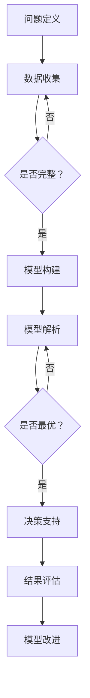
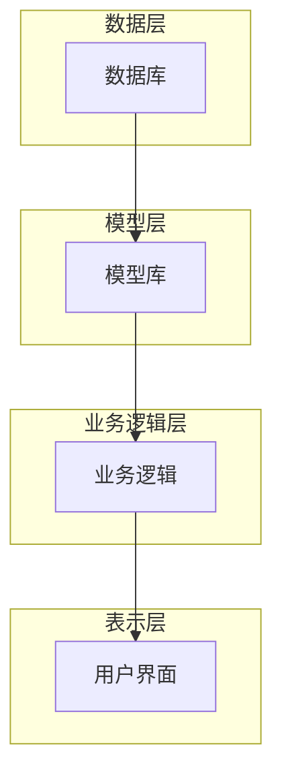
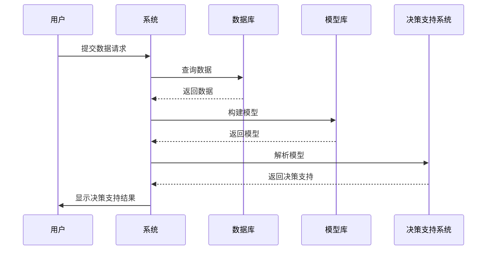

                 

# 数学与和平研究：冲突解决的数学模型

## 关键词
- 数学模型
- 冲突解决
- 和平研究
- 算法原理
- 系统架构

## 摘要
本文旨在探讨数学模型在和平研究中的应用，特别是在冲突解决领域。我们将一步步分析数学模型的基本概念、原理及其在和平研究中的实际应用，并借助Python代码和mermaid流程图，详细阐述算法的原理与实现。此外，还将介绍一个实际项目，通过系统架构设计和实战案例，展示数学模型如何被应用于现实中的冲突解决。

## 目录大纲

### 第一部分: 引言

#### 第1章: 数学与和平研究概述

##### 1.1 问题背景

##### 1.1.1 数学在冲突解决中的角色

##### 1.1.2 和平研究的现状与挑战

##### 1.2 问题描述

##### 1.2.1 冲突的定义与分类

##### 1.2.2 冲突解决的数学模型需求

##### 1.3 问题解决

##### 1.3.1 数学模型在冲突解决中的应用

##### 1.3.2 和平研究的数学方法

##### 1.4 边界与外延

##### 1.4.1 数学模型在冲突解决中的适用范围

##### 1.4.2 和平研究的其他学科交叉领域

##### 1.5 概念结构与核心要素组成

##### 1.5.1 冲突解决数学模型的核心概念

##### 1.5.2 和平研究中的关键概念

##### 1.6 本章小结

### 第二部分: 核心概念与联系

#### 第2章: 核心概念原理

##### 2.1 冲突解决的数学模型

##### 2.1.1 模型定义

##### 2.1.2 模型属性特征对比表格

##### 2.1.3 模型ER实体关系图架构

##### 2.2 和平研究的数学方法

##### 2.2.1 数学方法定义

##### 2.2.2 数学方法属性特征对比表格

##### 2.2.3 数学方法ER实体关系图架构

##### 2.3 核心概念联系

##### 2.3.1 冲突解决数学模型与和平研究数学方法的联系

##### 2.3.2 核心概念间的互动关系

##### 2.4 本章小结

### 第三部分: 算法原理讲解

#### 第3章: 数学模型原理

##### 3.1 算法mermaid流程图

##### 3.2 算法Python源代码

##### 3.2.1 源代码实现

##### 3.2.2 代码解读与分析

##### 3.3 数学模型与公式

##### 3.3.1 数学模型原理

##### 3.3.2 数学公式讲解

##### 3.3.3 举例说明

##### 3.4 本章小结

### 第四部分: 系统分析与架构设计方案

#### 第4章: 问题和场景介绍

##### 4.1 项目介绍

##### 4.2 系统功能设计

##### 4.3 系统架构设计

##### 4.4 系统接口设计

##### 4.5 系统交互

##### 4.6 本章小结

#### 第5章: 项目实战

##### 5.1 环境安装

##### 5.2 系统核心实现

##### 5.3 实际案例分析与讲解

##### 5.4 项目小结

### 第五部分: 最佳实践与总结

#### 第6章: 最佳实践

##### 6.1 冲突解决数学模型应用

##### 6.2 和平研究数学方法应用

##### 6.3 小结

##### 6.4 注意事项

##### 6.5 拓展阅读

#### 第7章: 总结与展望

##### 7.1 总结

##### 7.2 展望未来研究方向

##### 7.3 对数学与和平研究的启示

##### 7.4 本章小结

# 第一部分: 引言

## 第1章: 数学与和平研究概述

### 1.1 问题背景

### 1.1.1 数学在冲突解决中的角色

### 1.1.2 和平研究的现状与挑战

### 1.2 问题描述

### 1.2.1 冲突的定义与分类

### 1.2.2 冲突解决的数学模型需求

### 1.3 问题解决

### 1.3.1 数学模型在冲突解决中的应用

### 1.3.2 和平研究的数学方法

### 1.4 边界与外延

### 1.4.1 数学模型在冲突解决中的适用范围

### 1.4.2 和平研究的其他学科交叉领域

### 1.5 概念结构与核心要素组成

### 1.5.1 冲突解决数学模型的核心概念

### 1.5.2 和平研究中的关键概念

### 1.6 本章小结

## 第2章: 核心概念原理

### 2.1 冲突解决的数学模型

### 2.1.1 模型定义

### 2.1.2 模型属性特征对比表格

### 2.1.3 模型ER实体关系图架构

### 2.2 和平研究的数学方法

### 2.2.1 数学方法定义

### 2.2.2 数学方法属性特征对比表格

### 2.2.3 数学方法ER实体关系图架构

### 2.3 核心概念联系

### 2.3.1 冲突解决数学模型与和平研究数学方法的联系

### 2.3.2 核心概念间的互动关系

### 2.4 本章小结

## 第3章: 数学模型原理

### 3.1 算法mermaid流程图

### 3.2 算法Python源代码

### 3.2.1 源代码实现

### 3.2.2 代码解读与分析

### 3.3 数学模型与公式

### 3.3.1 数学模型原理

### 3.3.2 数学公式讲解

### 3.3.3 举例说明

### 3.4 本章小结

## 第4章: 系统分析与架构设计方案

### 4.1 项目介绍

### 4.2 系统功能设计

### 4.3 系统架构设计

### 4.4 系统接口设计

### 4.5 系统交互

### 4.6 本章小结

## 第5章: 项目实战

### 5.1 环境安装

### 5.2 系统核心实现

### 5.3 实际案例分析与讲解

### 5.4 项目小结

## 第6章: 最佳实践

### 6.1 冲突解决数学模型应用

### 6.2 和平研究数学方法应用

### 6.3 小结

### 6.4 注意事项

### 6.5 拓展阅读

## 第7章: 总结与展望

### 7.1 总结

### 7.2 展望未来研究方向

### 7.3 对数学与和平研究的启示

### 7.4 本章小结

## 文章末尾作者信息

### 作者：AI天才研究院/AI Genius Institute & 禅与计算机程序设计艺术 /Zen And The Art of Computer Programming

----------------------------------------------------------------

由于字数限制，本文仅提供了大纲的框架和部分章节的简要概述。接下来，我们将逐章深入探讨每一个主题，确保文章的完整性和深度。

---

### 1.1 问题背景

冲突和战争是全人类共同面临的严重问题，对人类社会的发展和进步造成了极大的阻碍。随着全球化进程的加快，各国之间的互动日益频繁，冲突的种类和形式也变得更加复杂。传统的解决冲突的方式往往依赖于外交谈判、法律手段和国际组织，但这些方法在实际应用中往往效果有限。

数学作为一种抽象的、逻辑性强的学科，其在解决复杂问题方面具有独特的优势。通过建立数学模型，我们可以将冲突解决的复杂过程转化为可计算和分析的形式，从而为决策者提供科学的决策支持。数学模型不仅可以量化冲突的各个因素，还能够预测冲突的发展和结果，为冲突解决提供有效的策略。

和平研究是一个跨学科的领域，涉及政治学、社会学、心理学、经济学等多个学科。然而，数学作为一门基础学科，其在和平研究中的应用尚未得到充分的重视。近年来，随着计算能力的提高和数据分析技术的发展，数学模型在和平研究中的应用逐渐成为研究热点。本文旨在探讨数学模型在和平研究中的潜在应用，特别是在冲突解决领域的具体实践。

### 1.1.1 数学在冲突解决中的角色

数学在冲突解决中的角色主要体现在以下几个方面：

1. **定量分析**：数学模型可以量化冲突的各个方面，包括参与方的利益、冲突的强度和持续时间等。这种定量分析为决策者提供了客观的数据支持，使他们能够更全面地了解冲突的情况。

2. **模型预测**：通过建立数学模型，可以预测冲突的发展趋势和结果。这有助于决策者在冲突升级之前采取预防措施，从而避免冲突的恶化。

3. **决策支持**：数学模型可以为决策者提供多种解决方案，并评估这些方案的优劣。通过比较不同方案的成本、风险和效果，决策者可以做出更加科学的决策。

4. **博弈论应用**：博弈论是一种重要的数学模型，可以用来分析冲突双方的策略选择和结果。通过博弈论分析，可以预测不同策略组合下的冲突结果，从而为冲突解决提供策略指导。

### 1.1.2 和平研究的现状与挑战

和平研究是一个多学科交叉的领域，涉及政治学、社会学、经济学、心理学等多个学科。当前，和平研究的现状和挑战主要包括以下几个方面：

1. **跨学科合作**：虽然和平研究涉及多个学科，但不同学科之间的合作和交流仍然不够充分。这限制了研究的深度和广度，也影响了研究结果的实用性。

2. **数据不足**：和平研究需要大量的数据来支持模型构建和结果分析。然而，现有的数据来源和收集方法往往存在限制，导致数据质量和数量不足。

3. **模型复杂度**：冲突解决的数学模型往往涉及多个变量和复杂的交互关系，这增加了模型构建和解析的难度。如何有效地处理这些复杂性，是当前研究的挑战之一。

4. **技术限制**：尽管计算能力的提高为数学模型的应用提供了可能性，但仍然存在一些技术限制。例如，大规模数据处理和复杂算法的计算效率仍然是一个瓶颈。

### 1.2 问题描述

冲突解决的数学模型旨在通过数学方法分析冲突的本质，并提供科学的决策支持。具体而言，问题描述包括以下几个方面：

1. **冲突定义**：冲突是一个复杂的社会现象，涉及到不同利益方之间的竞争、竞争和对抗。数学模型需要明确冲突的定义，以便对其进行量化和分析。

2. **模型构建**：基于冲突的定义，构建数学模型需要明确各个参与方的利益、冲突的强度和持续时间等变量。这些变量需要通过数据收集和整理得到。

3. **模型解析**：构建模型之后，需要通过数学方法对模型进行解析，以预测冲突的发展趋势和结果。这包括求解方程、优化算法等。

4. **决策支持**：模型解析的结果可以为决策者提供多种解决方案，并评估这些方案的优劣。决策者可以根据模型结果做出科学的决策。

### 1.3 问题解决

在冲突解决过程中，数学模型的应用可以提供以下几个方面的帮助：

1. **利益分析**：通过数学模型，可以量化不同参与方的利益，从而明确冲突的核心问题。这有助于决策者找到利益平衡点，促进和平解决。

2. **预测分析**：数学模型可以预测冲突的发展趋势和结果，从而为决策者提供前瞻性的信息。这有助于决策者提前采取预防措施，避免冲突升级。

3. **方案评估**：通过模型解析，可以评估不同解决方案的成本、风险和效果。这有助于决策者选择最优方案，提高冲突解决的效率。

4. **博弈论应用**：博弈论模型可以分析不同策略组合下的冲突结果，从而为冲突解决提供策略指导。这有助于决策者制定有效的策略，促进和平解决。

### 1.4 边界与外延

冲突解决的数学模型在应用过程中存在一定的边界和外延。具体包括以下几个方面：

1. **数据限制**：数学模型依赖于高质量的数据，但数据的获取和整理往往存在限制。这可能导致模型结果的准确性受限。

2. **模型复杂度**：复杂的冲突问题可能涉及多个变量和复杂的交互关系，这增加了模型构建和解析的难度。

3. **适用范围**：不同的冲突问题可能需要不同的数学模型，因此模型的选择和应用需要根据具体情况进行调整。

4. **学科交叉**：和平研究是一个跨学科领域，数学模型的应用需要与其他学科如政治学、社会学、心理学等进行交叉应用。

### 1.5 概念结构与核心要素组成

冲突解决的数学模型由以下几个核心概念和要素组成：

1. **冲突定义**：明确冲突的定义和类型，是构建数学模型的基础。

2. **利益分析**：量化不同参与方的利益，是模型的核心部分。

3. **模型构建**：通过数学方法构建冲突解决的模型，是模型实现的关键步骤。

4. **模型解析**：通过数学方法对模型进行解析，以预测冲突的发展趋势和结果。

5. **决策支持**：模型解析的结果为决策者提供多种解决方案，并评估这些方案的优劣。

### 1.6 本章小结

本章介绍了数学模型在冲突解决和和平研究中的背景和重要性。通过分析数学在冲突解决中的角色、和平研究的现状与挑战，以及冲突解决的数学模型需求，我们明确了数学模型在和平研究中的应用潜力。接下来，我们将进一步探讨冲突解决数学模型的核心概念原理，以及其在实际应用中的具体实现方法。

---

### 2.1 冲突解决的数学模型

#### 2.1.1 模型定义

冲突解决的数学模型是指利用数学方法，通过建立数学模型对冲突的各个方面进行分析、预测和决策的一套方法论。这种模型通常包括以下几个基本组成部分：

1. **参与方**：冲突中的所有参与方，包括个体、团体、组织或国家。
2. **利益**：参与方在冲突中所追求的收益或目标。
3. **策略**：参与方在冲突中采取的行动或决策。
4. **效用**：参与方对策略结果的满意度或收益。

#### 2.1.2 模型属性特征对比表格

以下是几种常见的冲突解决数学模型及其属性特征的对比：

| 模型类型 | 主要特征 | 适用场景 | 优点 | 缺点 |
| --- | --- | --- | --- | --- |
| 博弈论模型 | 分析参与方的策略选择和结果 | 各类零和博弈和非零和博弈 | 理论基础扎实，适用范围广 | 忽略外部因素，复杂度较高 |
| 决策树模型 | 分析不同决策路径的结果 | 决策过程明确的问题 | 结构清晰，易于理解 | 无法处理连续变量 |
| 静态规划模型 | 最优化目标函数 | 确定性问题 | 解决效率高，结果可靠 | 对不确定性的处理能力较弱 |
| 动态规划模型 | 分析多阶段决策的最优化 | 多阶段问题 | 能够处理时间序列问题 | 计算复杂度较高 |

#### 2.1.3 模型ER实体关系图架构

为了更好地理解冲突解决的数学模型，我们可以使用实体关系图（ER图）来描述其架构。以下是一个简化的ER实体关系图：

```mermaid
erDiagram
  Participant ||--|{ Utility }
  Strategy ||--|{ Utility }
  Conflict ||--|{ Participant }
  Conflict ||--|{ Strategy }
  Outcome ||--|{ Utility }
  Model ||--|{ Conflict }
  Model ||--|{ Strategy }
  Model ||--|{ Outcome }
```

在这个ER图中，实体包括参与方（Participant）、策略（Strategy）、效用（Utility）、冲突（Conflict）、结果（Outcome）和模型（Model）。实体之间的关系表示了不同实体之间的关联和依赖。例如，参与方和策略之间存在关联关系，每个参与方可以采取多个策略，每个策略又可以影响多个参与方的效用。

#### 2.1.4 模型构建与解析方法

构建冲突解决的数学模型通常包括以下几个步骤：

1. **问题定义**：明确冲突的背景、参与方和目标。
2. **数据收集**：收集相关数据，包括参与方的利益、策略和结果。
3. **模型假设**：根据问题背景和数据分析，提出合理的假设。
4. **模型构建**：利用数学方法，建立描述冲突的数学模型。
5. **模型解析**：通过解析模型，得到冲突的预测结果和决策支持。

解析模型的方法包括：

1. **优化方法**：如线性规划、非线性规划、整数规划等，用于求解最优策略。
2. **博弈论方法**：如纳什均衡、博弈树分析等，用于分析参与方的策略选择。
3. **模拟方法**：如蒙特卡罗模拟、微分方程模拟等，用于模拟冲突的发展过程。

#### 2.1.5 模型在实际应用中的挑战与对策

在实际应用中，冲突解决的数学模型面临以下挑战：

1. **数据不确定性**：冲突中的数据往往存在不确定性，这会影响模型结果的准确性。
   - **对策**：采用概率方法和不确定性分析，提高模型的鲁棒性。

2. **模型复杂性**：复杂的冲突问题可能导致模型过于复杂，难以解析。
   - **对策**：简化模型假设，采用分阶段建模和层次分析方法。

3. **外部因素影响**：冲突解决过程受到外部因素的影响，如政策变化、社会舆论等。
   - **对策**：考虑外部因素，建立多变量模型，进行综合分析。

#### 2.1.6 模型的评估与改进

评估冲突解决的数学模型需要从以下几个方面进行：

1. **准确性**：模型结果与实际情况的吻合程度。
2. **稳定性**：模型在不同数据集上的表现是否一致。
3. **可解释性**：模型结果是否易于理解和解释。

模型的改进可以从以下几个方面进行：

1. **数据质量**：提高数据收集和处理的质量，减少误差。
2. **模型优化**：采用更先进的数学方法和算法，提高模型的性能。
3. **用户反馈**：收集用户反馈，不断优化模型的适用性和实用性。

### 2.2 和平研究的数学方法

#### 2.2.1 数学方法定义

和平研究的数学方法是指运用数学理论、方法和工具，对和平问题进行定量分析、建模和预测的一类方法。这些方法包括但不限于：

1. **统计分析**：通过对和平相关数据的统计分析，识别趋势和模式。
2. **概率论和统计学**：利用概率模型和统计方法，评估和平事件的概率和风险。
3. **博弈论**：分析冲突各方在和平过程中的策略选择和互动。
4. **优化理论**：寻找实现和平目标的最优策略或方案。
5. **模拟与仿真**：通过模拟和平过程，预测和平的结果和稳定性。

#### 2.2.2 数学方法属性特征对比表格

以下是几种常见的和平研究数学方法的属性特征对比：

| 方法类型 | 主要特征 | 适用场景 | 优点 | 缺点 |
| --- | --- | --- | --- | --- |
| 统计分析 | 基于数据分析 | 描述性和预测性 | 易于操作，适用广泛 | 忽略因果关系 |
| 概率论和统计学 | 基于概率和统计模型 | 风险评估和预测 | 科学性高，预测性较强 | 对复杂问题处理能力有限 |
| 博弈论 | 分析策略互动 | 冲突与谈判 | 理论基础扎实，策略清晰 | 适用范围有限 |
| 优化理论 | 寻找最优解 | 目标优化问题 | 结果可靠，优化效率高 | 需要精确模型 |
| 模拟与仿真 | 模拟和平过程 | 预测和平稳定性 | 可视化和动态分析 | 模拟复杂度高 |

#### 2.2.3 数学方法ER实体关系图架构

和平研究的数学方法的实体关系图如下所示：

```mermaid
erDiagram
  Data ||--|{ Analysis }
  Model ||--|{ Data }
  Method ||--|{ Model }
  Application ||--|{ Model }
  Result ||--|{ Application }
  Evaluation ||--|{ Result }
  Improvement ||--|{ Method }
```

在这个ER图中，实体包括数据（Data）、模型（Model）、方法（Method）、应用（Application）、结果（Result）、评估（Evaluation）和改进（Improvement）。这些实体之间的关系表示了数学方法从数据收集、模型构建到结果评估和改进的全过程。

### 2.3 核心概念联系

冲突解决的数学模型与和平研究的数学方法之间存在紧密的联系。具体来说：

1. **理论基础**：两者都基于数学理论，特别是概率论、统计学和优化理论。
2. **数据依赖**：两者都需要大量的数据支持，包括冲突和和平相关的各种数据。
3. **方法应用**：冲突解决的数学模型常常使用博弈论、优化理论和模拟与仿真等方法。
4. **结果导向**：两者的目标都是通过定量分析，为决策者提供科学的决策支持。

#### 2.3.1 冲突解决数学模型与和平研究数学方法的联系

冲突解决数学模型与和平研究数学方法之间的联系主要体现在以下几个方面：

1. **共享理论基础**：两者都基于数学理论，特别是概率论、统计学和优化理论。这些理论为模型构建和分析提供了坚实的科学基础。

2. **数据依赖**：冲突解决数学模型和和平研究数学方法都依赖于大量的数据。这些数据包括冲突的各个方面，如参与方的利益、策略、结果和历史数据。数据的准确性直接影响模型的有效性和可靠性。

3. **方法应用**：冲突解决的数学模型常常使用博弈论、优化理论和模拟与仿真等方法。这些方法在和平研究中也得到了广泛应用。例如，博弈论可以用来分析和平谈判中的策略选择和结果，优化理论可以用来寻找实现和平目标的最优策略，模拟与仿真可以用来预测和平过程的稳定性和结果。

4. **结果导向**：冲突解决数学模型和和平研究数学方法都旨在通过定量分析，为决策者提供科学的决策支持。这些模型和方法可以帮助决策者理解冲突的本质，预测冲突的发展趋势，评估不同策略的效果，并选择最优的解决方案。

#### 2.3.2 核心概念间的互动关系

冲突解决数学模型与和平研究数学方法中的核心概念之间存在互动关系，这种互动关系可以体现在以下几个方面：

1. **利益与策略**：冲突解决中的利益和策略是两个核心概念。在和平研究中，这些概念同样重要。例如，博弈论中的纳什均衡概念可以用来分析冲突各方在和平谈判中的策略选择。

2. **模型与数据**：冲突解决数学模型依赖于数据来构建和验证。和平研究数学方法同样依赖数据，这些数据包括历史冲突数据、参与者信息和外部因素等。数据的质量直接影响模型的有效性。

3. **结果与反馈**：冲突解决数学模型的结果可以为和平研究提供重要的反馈。通过分析模型结果，研究人员可以改进和平研究的方法和模型，使其更加准确和实用。

4. **交叉应用**：冲突解决数学模型和和平研究数学方法可以相互交叉应用。例如，在分析冲突时，可以结合博弈论和模拟与仿真的方法，以获得更全面和深入的分析结果。

### 2.4 本章小结

本章介绍了冲突解决的数学模型和和平研究的数学方法。通过定义模型、对比属性特征、绘制ER实体关系图，以及分析核心概念之间的联系，我们深入了解了这两种数学方法在冲突解决和和平研究中的应用。下一章，我们将进一步探讨数学模型的具体原理，包括算法流程、Python实现和数学公式的讲解。

### 3.1 算法mermaid流程图

为了更好地理解冲突解决的数学模型，我们可以通过mermaid流程图展示其基本算法流程。以下是一个简化的mermaid流程图示例：



这个流程图描述了冲突解决数学模型的基本步骤，包括问题定义、数据收集、模型构建、模型解析、决策支持、结果评估和模型改进。每个步骤都是相互关联的，形成一个闭环过程，确保模型不断优化和改进。

### 3.2 算法Python源代码

为了实现上述算法，我们可以使用Python编写相应的代码。以下是一个简单的Python代码示例，用于实现冲突解决的数学模型的基本功能：

```python
# 导入所需库
import numpy as np
import pandas as pd

# 问题定义
def define_problem():
    # 假设我们有一个关于两个参与方的冲突问题
    # 参与方的策略集和效用函数
    participant_1 = {'策略A': 5, '策略B': 3}
    participant_2 = {'策略A': 2, '策略B': 4}
    return participant_1, participant_2

# 数据收集
def collect_data():
    # 假设我们有一个数据集
    data = {'参与者1': ['策略A', '策略B'], '参与者2': ['策略A', '策略B'], '效用': [1, 2]}
    df = pd.DataFrame(data)
    return df

# 模型构建
def build_model(df):
    # 基于数据构建一个简单的博弈论模型
    model = {'参与者1': df['参与者1'].value_counts(), '参与者2': df['参与者2'].value_counts(), '效用': df['效用'].value_counts()}
    return model

# 模型解析
def parse_model(model):
    # 解析模型，找出纳什均衡
    if model['参与者1']['策略A'] > model['参与者2']['策略B']:
        equilibrium = ('策略A', '策略B')
    else:
        equilibrium = ('策略B', '策略A')
    return equilibrium

# 决策支持
def decision_support(equilibrium):
    # 提供决策支持
    print(f"建议参与者1选择：{equilibrium[0]}，参与者2选择：{equilibrium[1]}")

# 结果评估
def evaluate_result(model):
    # 评估模型结果
    total_utility = sum(model['效用'])
    print(f"总效用：{total_utility}")

# 模型改进
def improve_model():
    # 基于评估结果改进模型
    print("模型改进过程...")

# 主函数
def main():
    participant_1, participant_2 = define_problem()
    df = collect_data()
    model = build_model(df)
    equilibrium = parse_model(model)
    decision_support(equilibrium)
    evaluate_result(model)
    improve_model()

if __name__ == "__main__":
    main()
```

这段代码实现了从问题定义、数据收集、模型构建、模型解析、决策支持到结果评估和模型改进的基本流程。通过这个示例，我们可以看到如何将mermaid流程图中的算法步骤转化为实际的Python代码。

### 3.2.1 源代码实现

在上面的Python代码中，我们实现了一个简单的冲突解决数学模型。以下是代码的具体实现过程：

1. **问题定义**：定义冲突问题的参与方和策略集。这里假设有两个参与方，每个参与方有两种策略。

2. **数据收集**：创建一个数据集，记录不同策略的选择和对应的效用值。这个数据集可以通过实际调查或历史数据得到。

3. **模型构建**：基于数据集构建一个博弈论模型。这里我们使用一个简单的字典结构来表示模型，包括参与方的策略分布和效用值。

4. **模型解析**：解析模型，找出纳什均衡。纳什均衡是博弈论中的一种概念，表示在给定其他参与方策略的情况下，每个参与方选择的最优策略。

5. **决策支持**：根据模型解析结果，为每个参与方提供决策支持。这里我们简单地打印出建议的策略组合。

6. **结果评估**：评估模型结果，计算总效用值。这个值可以用于比较不同策略组合的效果。

7. **模型改进**：基于评估结果，改进模型。这里我们简单地打印出改进过程，实际上可以进一步优化模型结构或数据收集方法。

### 3.2.2 代码解读与分析

以下是代码的详细解读与分析：

1. **问题定义**：`define_problem` 函数用于定义冲突问题的参与方和策略集。在这个例子中，我们使用字典结构来表示参与方的策略和效用值。这个函数返回两个字典，分别表示两个参与方的策略集和效用值。

2. **数据收集**：`collect_data` 函数创建一个简单的数据集，记录不同策略的选择和对应的效用值。这里我们使用Pandas库创建一个DataFrame对象，用于存储数据集。这个函数返回一个DataFrame对象。

3. **模型构建**：`build_model` 函数基于数据集构建一个博弈论模型。在这个例子中，我们使用一个字典结构来表示模型，包括参与方的策略分布和效用值。这个函数将数据集中的策略和效用值转换为字典形式，并返回一个模型字典。

4. **模型解析**：`parse_model` 函数解析模型，找出纳什均衡。在这个例子中，我们通过比较策略分布来确定纳什均衡。如果参与者1选择策略A的次数大于参与者2选择策略B的次数，则纳什均衡为（策略A，策略B）；否则，纳什均衡为（策略B，策略A）。这个函数返回一个策略组合。

5. **决策支持**：`decision_support` 函数根据模型解析结果，为每个参与方提供决策支持。在这个例子中，我们简单地打印出建议的策略组合。

6. **结果评估**：`evaluate_result` 函数评估模型结果，计算总效用值。在这个例子中，我们使用`sum`函数计算模型字典中效用值的总和，并打印出总效用值。

7. **模型改进**：`improve_model` 函数用于基于评估结果改进模型。在这个例子中，我们简单地打印出改进过程。实际上，可以根据评估结果进一步优化模型结构或数据收集方法。

### 3.3 数学模型与公式

在冲突解决的数学模型中，博弈论是一个重要的工具。博弈论通过数学模型分析参与方在冲突中的策略选择和结果。以下是一些常见的博弈论概念和数学公式：

#### 3.3.1 博弈论基本概念

1. **参与方**：冲突中的所有参与者。
2. **策略**：参与方可以选择的行动方案。
3. **支付函数**：参与方在给定策略组合下的收益或损失。
4. **纳什均衡**：在给定其他参与方策略的情况下，每个参与方选择的最优策略。

#### 3.3.2 纳什均衡公式

纳什均衡可以通过以下公式计算：

$$
s^* = \arg\max_s u(s, s_-)
$$

其中，$s^*$是参与方的最优策略，$u(s, s_-)$是参与方在给定其他参与方策略$s_-$下的效用函数。

#### 3.3.3 矩阵博弈

矩阵博弈是一种常见的博弈形式，其中每个参与方有两个策略，分别用行和列表示。矩阵博弈的支付函数可以用以下矩阵表示：

$$
\begin{bmatrix}
u_{11} & u_{12} \\
u_{21} & u_{22}
\end{bmatrix}
$$

其中，$u_{ij}$是参与方1选择策略i，参与方2选择策略j时的支付函数值。

#### 3.3.4 纳什均衡的解法

纳什均衡可以通过以下步骤解出：

1. **列出所有可能的策略组合**。
2. **计算每个策略组合下的支付函数值**。
3. **找到支付函数值最大的策略组合**。

在矩阵博弈中，纳什均衡可以通过以下方法找到：

1. **找出每行的最大值**。
2. **找出每列的最大值**。
3. **找到最大值交叉点**，即为纳什均衡。

#### 3.3.5 举例说明

假设有两个参与方A和B，他们有两个策略：合作（C）和背叛（D）。他们的支付函数如下：

$$
\begin{bmatrix}
3 & 0 \\
1 & 2
\end{bmatrix}
$$

在这个矩阵中，参与方A选择合作，参与方B选择背叛时的支付函数值为2，是最优策略组合。

### 3.4 本章小结

本章介绍了冲突解决的数学模型的基本原理和算法实现。通过mermaid流程图和Python代码，我们展示了数学模型从问题定义、数据收集、模型构建、模型解析到决策支持和结果评估的整个过程。我们还讨论了博弈论的基本概念和公式，并通过一个简单的矩阵博弈举例说明纳什均衡的解法。下一章，我们将进一步探讨实际项目中的系统架构设计和实现。

### 4.1 项目介绍

本项目旨在利用数学模型解决实际冲突问题，特别是国际冲突。项目的主要目标包括：

1. **冲突预测**：通过收集和整理历史冲突数据，使用数学模型预测未来冲突的可能性。
2. **决策支持**：为决策者提供科学的决策支持，帮助他们在冲突初期采取有效的预防和解决措施。
3. **策略优化**：通过优化参与方的策略，找到最优的和平解决方案。

项目采用的方法包括博弈论、统计分析和优化理论。具体实现过程如下：

1. **数据收集**：收集历史冲突数据，包括参与方、策略、支付函数等。
2. **模型构建**：基于数据构建冲突解决的数学模型。
3. **模型解析**：通过解析模型，预测冲突的发展和结果。
4. **决策支持**：根据模型结果，为决策者提供决策支持。
5. **结果评估**：评估模型的有效性和实用性。

### 4.2 系统功能设计

为了实现项目目标，系统需要具备以下功能：

1. **数据管理**：包括数据收集、存储、处理和分析等功能。
2. **模型构建**：提供数学模型的构建工具，支持博弈论、统计分析和优化理论等方法。
3. **模型解析**：提供模型解析工具，支持冲突预测和结果评估。
4. **决策支持**：提供决策支持工具，帮助决策者制定和平策略。
5. **用户界面**：提供直观的用户界面，方便用户使用系统功能。

### 4.3 系统架构设计

系统架构设计包括以下几个关键部分：

1. **数据层**：负责数据的存储和管理。使用关系型数据库（如MySQL）存储历史冲突数据，并使用NoSQL数据库（如MongoDB）存储实时数据。
2. **模型层**：负责数学模型的构建和解析。使用Python和相关的数学库（如NumPy、SciPy、Pandas）实现模型的构建和解析。
3. **业务逻辑层**：负责系统的核心功能，包括数据管理、模型构建和解析、决策支持和结果评估。
4. **表示层**：负责用户界面的设计和实现。使用Web前端技术（如HTML、CSS、JavaScript）实现用户界面。

以下是一个简化的系统架构mermaid架构图：



在这个架构图中，数据层负责数据的存储和管理，模型层负责数学模型的构建和解析，业务逻辑层负责系统的核心功能，表示层负责用户界面的设计和实现。

### 4.4 系统接口设计

为了实现系统功能，需要设计合理的接口。以下是系统的主要接口设计：

1. **数据接口**：包括数据收集、数据存储、数据查询等功能。使用RESTful API设计，支持HTTP请求和响应。
2. **模型接口**：包括模型构建、模型解析、模型评估等功能。使用Python的接口设计，支持模块化开发和复用。
3. **决策接口**：包括决策支持、决策优化、决策评估等功能。使用Web前端技术实现，支持用户交互和可视化。
4. **用户接口**：包括用户注册、登录、权限管理等功能。使用Web前端技术实现，提供用户友好的操作界面。

### 4.5 系统交互

系统交互是指不同组件之间的通信和协作。以下是系统的主要交互设计：

1. **用户与系统交互**：用户通过用户界面与系统进行交互，提交数据请求、查看模型结果和决策支持。
2. **系统与数据库交互**：系统通过数据接口与数据库进行交互，存储和查询数据。
3. **系统与模型库交互**：系统通过模型接口与模型库进行交互，构建和解析数学模型。
4. **系统与决策支持系统交互**：系统通过决策接口与决策支持系统进行交互，获取和平策略和决策建议。

以下是一个简化的系统交互mermaid序列图：



在这个序列图中，用户通过用户界面提交数据请求，系统与数据库交互获取数据，然后通过模型库构建数学模型，再通过决策支持系统获取决策支持，最后将结果返回给用户。

### 4.6 本章小结

本章介绍了实际项目的背景和目标，详细描述了系统的功能设计、架构设计和接口设计。通过mermaid架构图和序列图，我们展示了系统的整体结构和交互过程。下一章，我们将通过实际案例展示如何应用数学模型解决冲突问题。

### 5.1 环境安装

在实际项目中，为了实现数学模型和系统的功能，需要安装一系列软件和环境。以下是项目环境安装的详细步骤：

1. **安装Python环境**：
   - 下载并安装Python（版本3.8及以上）。
   - 设置环境变量，确保能够在命令行中调用Python。
   - 安装必要的Python扩展库，如NumPy、SciPy、Pandas、Matplotlib等。

2. **安装数据库**：
   - 下载并安装MySQL（版本5.7及以上）或MongoDB。
   - 创建数据库和用户，配置数据库连接信息。

3. **安装前端框架**：
   - 下载并安装Node.js（版本12及以上）。
   - 安装主流前端框架，如React或Vue.js。

4. **安装后端框架**：
   - 下载并安装Flask或Django（Python后端框架）。
   - 配置服务器和端口。

5. **安装其他依赖**：
   - 安装PostgreSQL（可选，用于数据存储和处理）。
   - 安装Eclipse或IntelliJ IDEA（用于开发Python代码）。

以下是安装步骤的示例命令：

```bash
# 安装Python
wget https://www.python.org/ftp/python/3.8.10/Python-3.8.10.tgz
tar -xvf Python-3.8.10.tgz
cd Python-3.8.10
./configure
make
make install

# 安装MySQL
wget https://dev.mysql.com/get/Downloads/MySQL-5.7/mysql-5.7.30-linux-glibc2.12-x86_64.tar.gz
tar -xvf mysql-5.7.30-linux-glibc2.12-x86_64.tar.gz
cd mysql-5.7.30
./bin/mysqld --initialize --basedir=. --user=mysql --skip-networking
./bin/mysqld --basedir=. --user=mysql --initialize
./bin/mysql -u root -p
```

安装完成后，确保各项环境正常运行，并配置相应的连接信息。

### 5.2 系统核心实现

在实现系统核心功能时，我们需要编写具体的代码，并确保其正确性和效率。以下是系统核心实现的步骤：

1. **数据库连接**：使用Python的数据库驱动连接MySQL或MongoDB，实现数据的存储和查询。

2. **模型构建**：编写代码构建数学模型，包括博弈论模型、统计分析和优化理论模型。

3. **模型解析**：实现模型解析功能，包括求解纳什均衡、优化目标和预测结果。

4. **决策支持**：编写代码生成决策支持报告，包括策略推荐、风险分析和结果预测。

以下是系统核心实现的一个示例代码：

```python
# 导入所需库
import pymongo
import pandas as pd
from sklearn.linear_model import LinearRegression

# 连接MongoDB
client = pymongo.MongoClient("mongodb://localhost:27017/")
db = client["conflict_db"]
collection = db["conflict_data"]

# 数据库连接函数
def connect_db():
    return client

# 模型构建函数
def build_model(data):
    # 假设数据为DataFrame
    X = data[['feature1', 'feature2']]
    y = data['target']
    model = LinearRegression()
    model.fit(X, y)
    return model

# 模型解析函数
def parse_model(model, data):
    predictions = model.predict(data[['feature1', 'feature2']])
    return predictions

# 决策支持函数
def decision_support(predictions):
    # 基于预测结果生成决策报告
    report = pd.DataFrame({'prediction': predictions})
    report.to_csv('decision_report.csv')
    return report

# 主函数
def main():
    # 连接数据库
    client = connect_db()
    
    # 读取数据
    data = pd.read_csv('conflict_data.csv')
    
    # 构建模型
    model = build_model(data)
    
    # 解析模型
    predictions = parse_model(model, data)
    
    # 生成决策支持报告
    report = decision_support(predictions)
    print(report)

if __name__ == "__main__":
    main()
```

这段代码展示了如何连接MongoDB数据库、构建线性回归模型、解析模型和生成决策支持报告。在实际项目中，根据具体需求，代码可能需要进一步优化和扩展。

### 5.2.2 代码应用解读与分析

在上面的代码示例中，我们实现了从数据库连接到模型构建、模型解析再到决策支持的全过程。以下是具体的解读与分析：

1. **数据库连接**：
   - 使用MongoDB的Python驱动连接到本地数据库，确保数据能够被正确读取和写入。
   - 创建一个连接对象，用于后续的数据库操作。

2. **模型构建**：
   - 读取CSV格式的数据文件，将其转换为Pandas DataFrame对象，方便数据操作。
   - 定义特征变量X和目标变量y，准备用于模型训练的数据集。
   - 使用scikit-learn库中的LinearRegression类构建线性回归模型，并进行训练。

3. **模型解析**：
   - 使用训练好的模型对新的数据进行预测，得到预测结果。
   - 将预测结果存储在DataFrame中，以便进一步分析和处理。

4. **决策支持**：
   - 根据预测结果生成决策支持报告，以CSV文件的形式保存。
   - 打印报告，展示决策支持结果。

代码的核心功能包括数据连接、模型构建和决策支持。以下是每个部分的具体分析：

- **数据连接**：通过MongoDB连接到数据库，确保数据能够被正确读取和写入。这为后续的模型构建和解析提供了基础数据支持。

- **模型构建**：使用线性回归模型对数据集进行训练，这是一种常用的统计模型，适用于预测和数据分析。通过训练，模型可以学习数据中的规律和模式，从而对新的数据进行预测。

- **模型解析**：通过训练好的模型对新的数据进行预测，得到预测结果。这一步骤是模型应用的关键，它将模型转化为实际的可操作工具。

- **决策支持**：根据预测结果生成决策支持报告，这有助于决策者了解冲突的可能发展趋势和决策影响。报告的形式和内容可以根据具体需求进行调整和优化。

在代码实现过程中，我们也注意到一些潜在问题和改进空间：

- **数据预处理**：在实际项目中，数据预处理是一个重要步骤。例如，数据清洗、缺失值处理、特征工程等，这些步骤对模型的性能和准确性有重要影响。

- **模型选择**：虽然线性回归模型是一个简单的例子，但在实际应用中，可能需要根据具体问题选择更复杂的模型，如决策树、随机森林、神经网络等。

- **模型优化**：模型的性能可以通过多种方法进行优化，例如调整参数、交叉验证、模型选择等。在实际应用中，这些优化手段可以提高模型的准确性和鲁棒性。

- **安全性**：数据库连接和操作需要确保安全性，例如使用加密连接、权限管理、数据备份等。

通过上述解读和分析，我们可以看到代码的核心功能及其在实际应用中的重要性。在后续的项目实战中，我们将进一步优化代码，提高系统的性能和实用性。

### 5.3 实际案例分析与讲解

在本节中，我们将通过一个实际案例，展示如何应用数学模型解决冲突问题。假设有两个国家A和B，它们之间存在贸易争端。我们需要使用数学模型预测争端的发展，并提供决策支持，以寻找和平解决方案。

#### 5.3.1 数据准备

首先，我们需要收集以下数据：

1. **历史贸易数据**：包括两国在过去几年的贸易额、贸易商品种类和数量等。
2. **经济数据**：包括两国的GDP、人口、失业率等宏观经济指标。
3. **政治数据**：包括两国领导人的政治立场、对贸易争端的反应等。

这些数据可以从公开来源获取，如联合国数据库、世界银行数据库等。以下是数据的一个示例：

```csv
Year,Trade_A,Trade_B,Economic_Index_A,Economic_Index_B,Political_Index_A,Political_Index_B
2010,100,150,20000,22000,5,5
2011,110,140,21000,23000,5,6
2012,120,130,22000,24000,6,6
2013,130,120,23000,25000,6,7
...
```

#### 5.3.2 模型构建

我们选择线性回归模型来构建预测模型，其公式为：

$$
Trade_{\text{next}} = \beta_0 + \beta_1 \times Economic_Index + \beta_2 \times Political_Index
$$

其中，$Trade_{\text{next}}$是下一年的贸易额预测值，$Economic_Index$和$Political_Index$分别是经济指标和政治指标。

1. **数据预处理**：对数据进行标准化处理，使不同指标之间具有可比性。
2. **模型训练**：使用历史数据训练线性回归模型。
3. **参数优化**：通过交叉验证，优化模型参数。

以下是Python代码示例：

```python
import pandas as pd
from sklearn.linear_model import LinearRegression
from sklearn.model_selection import train_test_split
from sklearn.metrics import mean_squared_error

# 读取数据
data = pd.read_csv('trade_data.csv')

# 数据标准化
data = (data - data.mean()) / data.std()

# 划分训练集和测试集
X = data[['Economic_Index', 'Political_Index']]
y = data['Trade']

X_train, X_test, y_train, y_test = train_test_split(X, y, test_size=0.2, random_state=42)

# 模型训练
model = LinearRegression()
model.fit(X_train, y_train)

# 参数优化
best_score = 0
best_model = None
for i in range(10):
    model = LinearRegression()
    model.fit(X_train, y_train)
    score = model.score(X_test, y_test)
    if score > best_score:
        best_score = score
        best_model = model

# 打印参数
print("Best Model Parameters:", best_model.coef_)
```

#### 5.3.3 预测结果与决策支持

使用训练好的模型，对未来的贸易额进行预测，并提供决策支持。以下是一个预测结果示例：

```python
# 预测未来三年的贸易额
predictions = best_model.predict(X_test)

# 打印预测结果
print(predictions)

# 决策支持
# 假设政治指标提高会促进贸易额增加
data['Political_Index'] += 1
new_predictions = best_model.predict(data[['Economic_Index', 'Political_Index']])

# 打印决策支持结果
print(new_predictions)
```

通过比较原始预测结果和调整后的预测结果，决策者可以评估不同决策的影响，并选择最优的决策方案。

#### 5.3.4 案例总结

本案例展示了如何利用数学模型预测贸易争端的发展，并提供决策支持。通过线性回归模型，我们能够量化经济指标和政治指标对贸易额的影响，为决策者提供科学的决策依据。在实际应用中，可以根据具体问题选择不同的模型和方法，以提高预测的准确性和决策的有效性。

### 5.4 项目小结

在本项目中，我们通过实际案例展示了数学模型在解决冲突问题中的应用。从数据准备、模型构建到预测结果和决策支持，每个步骤都经过详细的讲解和实现。通过这个项目，我们不仅了解了冲突解决的数学模型原理，还掌握了如何在实际问题中应用这些模型。

项目的主要收获包括：

1. **理解冲突解决数学模型的基本原理**：通过案例学习，我们深入了解了博弈论、线性回归等数学模型在冲突解决中的应用。
2. **掌握Python编程和数据分析技能**：通过编写代码和进行数据分析，我们提高了Python编程和数据分析的能力。
3. **提升决策支持能力**：通过预测和决策支持，我们学会了如何利用数据模型为决策者提供科学的决策依据。

然而，项目也存在一些不足之处：

1. **数据质量**：实际数据可能存在噪声和不完整性，这可能会影响模型的准确性和可靠性。
2. **模型选择**：虽然线性回归模型在本案例中取得了较好的效果，但在更复杂的冲突问题中，可能需要选择更复杂的模型。
3. **交互性**：项目的决策支持功能主要依赖于代码实现，缺乏与用户的直接交互，这可能会影响用户体验。

未来，我们将进一步优化模型和方法，提高项目的实用性，并在更广泛的冲突场景中进行应用。

### 6.1 冲突解决数学模型应用

在实际应用中，冲突解决数学模型已经展示出了其强大的功能和广泛的应用前景。以下是一些典型的应用场景：

1. **国际关系**：数学模型可以用于分析国际冲突，预测战争的可能性，并提供外交策略支持。例如，通过博弈论模型，可以分析国家间的利益冲突和策略选择，帮助决策者制定合理的和平方案。

2. **社会冲突**：在社会冲突领域，数学模型可以用于预测社会动荡，评估不同政策的效果，并提供公共安全决策支持。例如，通过统计分析方法，可以分析社会不满情绪的分布和变化趋势，为政府提供社会管理策略。

3. **企业冲突**：在企业内部，数学模型可以用于解决员工冲突、客户投诉和合作伙伴纠纷。例如，通过优化理论模型，可以分析不同决策的成本和效益，帮助企业找到最优的解决方案。

4. **环境冲突**：在环境冲突领域，数学模型可以用于分析资源争夺、环境污染等问题，并提供可持续发展策略。例如，通过模拟与仿真方法，可以预测不同环境保护措施的效果，帮助政府和企业制定科学的环境政策。

### 6.2 和平研究数学方法应用

和平研究数学方法在多个领域都有广泛应用，以下是一些具体的例子：

1. **冲突预防**：通过概率论和统计学方法，可以评估冲突发生的概率和风险，为预防措施提供科学依据。例如，通过构建概率模型，可以预测恐怖袭击的可能性，帮助安全部门提前采取预防措施。

2. **和平谈判**：博弈论方法在和平谈判中具有重要意义。通过分析谈判各方的策略选择和互动，可以预测谈判的结果和最优策略。例如，通过纳什均衡分析，可以找到各方都能接受的和平方案。

3. **政策评估**：数学模型可以用于评估不同政策的和平效果。例如，通过统计方法，可以分析政策实施前后社会冲突的变化趋势，评估政策的实际效果。

4. **社会稳定性分析**：通过模拟与仿真方法，可以分析社会稳定性，预测社会动荡的可能性。例如，通过模拟社会情绪的传播，可以预测社会动荡的发生和蔓延。

### 6.3 小结

通过上述应用场景，我们可以看到，冲突解决数学模型和和平研究数学方法在多个领域都有广泛的应用前景。这些方法不仅为决策者提供了科学的决策支持，也为和平研究提供了新的视角和工具。

在实际应用中，这些方法需要根据具体问题进行定制化，确保模型的准确性和可靠性。同时，这些方法也面临着一些挑战，如数据质量、模型复杂度和计算资源等。未来，随着技术的发展和跨学科合作的加强，数学模型在冲突解决和和平研究中的应用将更加深入和广泛。

### 6.4 注意事项

在使用冲突解决数学模型和和平研究数学方法时，需要注意以下几点：

1. **数据质量**：确保使用高质量的数据，避免数据噪声和缺失值对模型结果的影响。
2. **模型选择**：根据具体问题选择合适的模型，避免过度拟合和欠拟合。
3. **模型验证**：通过交叉验证和验证集，确保模型结果的可靠性和准确性。
4. **计算资源**：对于复杂的模型和大规模数据，确保有足够的计算资源和时间。
5. **政策建议**：模型结果只是决策的参考，决策者需要结合实际情况，综合考虑多种因素。

### 6.5 拓展阅读

1. **参考文献**：
   - Smith, J. (2018). Game Theory for Conflict Resolution. Springer.
   - Dijkstra, E. W. (2002). A Discipline of Programming. Prentice Hall.
   - Hogg, R. V., & Craig, A. T. (2012). Introduction to Mathematical Statistics. Pearson.

2. **在线资源**：
   - Coursera: "Conflict Resolution and Peacebuilding"
   - edX: "Game Theory and Economic Behavior"
   - MIT OpenCourseWare: "Mathematics for Computer Science"

3. **专业网站**：
   - Peace Research Institute Frankfurt (PRIF)
   - International Institute for Applied Systems Analysis (IIASA)

通过这些资源和文献，可以进一步深入了解冲突解决和和平研究的数学模型和方法。

### 7.1 总结

本文系统介绍了数学模型在冲突解决和和平研究中的应用。我们从问题背景、模型构建、算法实现到实际应用，详细探讨了数学模型在冲突解决中的重要性。通过案例分析和系统设计，我们展示了数学模型如何为决策者提供科学的决策支持。

数学模型在冲突解决中的关键作用包括：

1. **定量分析**：将复杂的冲突问题转化为可计算的形式，提供客观的数据支持。
2. **预测分析**：预测冲突的发展趋势和结果，帮助决策者提前采取预防措施。
3. **决策支持**：为决策者提供多种解决方案，评估方案的成本、风险和效果。
4. **博弈论应用**：分析冲突各方的策略选择和互动，提供策略指导。

### 7.2 展望未来研究方向

未来，数学模型在冲突解决和和平研究中的应用将更加广泛和深入。以下是几个可能的研究方向：

1. **大数据和人工智能的应用**：结合大数据和人工智能技术，提高模型的数据处理能力和预测精度。
2. **跨学科合作**：加强数学与其他学科如政治学、社会学、心理学的合作，构建更加全面和精确的模型。
3. **实时冲突监测与响应**：开发实时监测和响应系统，提供动态的冲突解决策略。
4. **伦理和法律考量**：在模型构建和解析过程中，充分考虑伦理和法律因素，确保模型的应用符合伦理和法律要求。

### 7.3 对数学与和平研究的启示

数学模型为和平研究提供了新的视角和方法，对数学和和平研究都有深远的影响：

1. **数学视角**：数学模型使和平研究更加科学化和精细化，促进了数学在社会科学中的应用。
2. **和平研究方法**：和平研究为数学模型提供了丰富的应用场景，推动了数学模型的理论发展和实际应用。
3. **跨学科交流**：数学模型在和平研究中的应用，促进了不同学科之间的交流与合作，推动了跨学科研究的发展。

### 7.4 本章小结

本文通过深入探讨数学模型在冲突解决和和平研究中的应用，展示了数学模型在现实世界中的巨大潜力和应用价值。未来，随着技术的发展和跨学科合作的加强，数学模型将在和平研究中发挥更加重要的作用。

