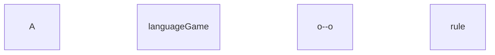
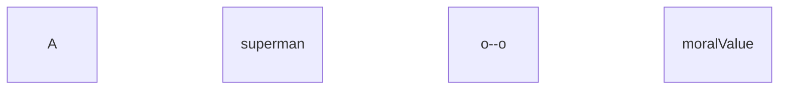

                 


## # 数学与哲学史：数学思想在哲学发展中的影响

关键词：数学思想，哲学发展，历史影响，核心概念，案例研究

摘要：本文从历史的角度探讨了数学思想对哲学发展的重要影响。通过分析数学在古代、中世纪、文艺复兴、现代以及当代哲学中的角色，揭示数学与哲学的内在联系。本文旨在帮助读者理解数学在哲学思想演变中的核心地位，以及数学如何塑造和丰富哲学理论和实践。

## 引言

### 1.1 研究背景

数学与哲学，作为人类智慧的两大领域，自古希腊以来就紧密相连。数学作为一种精确的推理工具，不仅为哲学提供了强有力的论证支持，还在一定程度上影响了哲学的基本假设和思考方式。本文将从历史的角度出发，系统梳理数学思想在哲学发展中的影响，以期揭示二者之间的内在联系。

### 1.2 研究意义

探讨数学与哲学的关系，不仅有助于我们理解哲学发展的历史脉络，还能为当今的哲学研究提供新的视角。数学作为一种逻辑严密、结构清晰的学科，其思想和方法在哲学中得到了广泛的应用。研究数学思想对哲学的影响，有助于我们更好地认识哲学的本质，提升哲学研究的深度和广度。

## 历史背景

### 2.1 古希腊时期

古希腊时期是数学与哲学紧密结合的起点。古希腊哲学家不仅探讨宇宙的本质和规律，还借助数学工具进行推理和论证。例如，毕达哥拉斯学派将数学应用于伦理学和宇宙学，认为宇宙是一个数和几何的和谐体系。柏拉图则将数学视为通往真理的途径，其《理想国》中强调了数学的重要性。

### 2.2 中世纪时期

中世纪时期，数学在基督教哲学中扮演了重要角色。奥古斯丁和托马斯·阿奎那等哲学家将数学视为上帝创造宇宙的工具。阿奎那提出了“存在即理性”的观点，强调数学在认识世界中的核心地位。

### 2.3 文艺复兴时期

文艺复兴时期，数学和哲学迎来了新的发展。伽利略、笛卡尔和培根等科学家和哲学家，将数学应用于自然科学和哲学研究，推动了科学革命和启蒙运动的到来。

### 2.4 现代时期

现代时期，数学和哲学的关系继续深化。康德等哲学家提出了先验逻辑和纯粹理性的概念，强调数学在哲学体系中的基础性地位。黑格尔和尼采等哲学家则将数学思想应用于他们的哲学体系，探讨存在、真理和自由等哲学问题。

## 核心概念与影响

### 3.1 数学概念

在哲学发展中，核心数学概念如数、几何、概率和逻辑等扮演了重要角色。这些概念不仅为哲学提供了新的思考方式，还影响了哲学的基本假设和理论框架。

### 3.2 数学影响

数学对哲学的影响主要体现在以下几个方面：

1. **逻辑推理**：数学的逻辑严密性为哲学提供了强有力的论证工具，使得哲学思考更加清晰和有力。
2. **实证基础**：数学的实证性为哲学提供了新的研究方法，使得哲学研究更加客观和科学。
3. **模型构建**：数学模型为哲学提供了一种新的描述和分析世界的方式，推动了哲学理论的创新和发展。

### 3.3 案例分析

例如，康德的先验逻辑和黑格尔的辩证法，都借鉴了数学的思想和方法。康德的范畴表和黑格尔的“正题-反题-合题”模式，都可以看作是数学思想在哲学中的应用。

## 数学与古代哲学

### 4.1 毕达哥拉斯学派

毕达哥拉斯学派认为宇宙是一个数和几何的和谐体系，数的比例和几何的形状是宇宙的本质。这一思想对后来的希腊哲学和科学产生了深远影响。

### 4.2 柏拉图

柏拉图在《理想国》中强调了数学的重要性，认为数学是通往真理的途径。他的理念论和形而上学思想都受到了数学的启发。

### 4.3 亚里士多德

亚里士多德对数学进行了系统的研究，提出了数学的定义和方法。他的逻辑学和形而上学思想，都受到了数学的影响。

## 数学与中世纪哲学

### 5.1 奥古斯丁

奥古斯丁将数学视为上帝创造宇宙的工具，提出了“存在即理性”的观点。他的神学思想充满了数学的元素。

### 5.2 托马斯·阿奎那

托马斯·阿奎那认为数学是理解宇宙的关键，他的哲学体系中充满了数学的概念和推理。他的“存在即理性”观点，对后来的哲学产生了深远影响。

### 5.3 达芬奇

达芬奇将数学应用于绘画和机械设计，他的作品充满了数学的美和逻辑。

## 数学与文艺复兴哲学

### 6.1 伽利略

伽利略将数学应用于天文学和物理学，他的研究推动了科学革命的发展。他的“日心说”和“等加速度运动”理论，都是数学思想的体现。

### 6.2 笛卡尔

笛卡尔提出了坐标几何和解析几何，他的“我思故我在”哲学命题，也是数学思想的体现。

### 6.3 培根

培根将数学应用于实验科学，提出了“知识就是力量”的观点。他的归纳法，是数学在哲学中应用的典范。

## 数学与近代哲学

### 7.1 康德

康德提出了先验逻辑和纯粹理性的概念，强调数学在哲学体系中的基础性地位。他的“范畴表”和“先验范畴”理论，都是数学思想在哲学中的应用。

### 7.2 黑格尔

黑格尔的辩证法，充满了数学的思想。他的“正题-反题-合题”模式，可以看作是数学思想在哲学中的创新。

### 7.3 尼采

尼采的哲学中，充满了对数学的反思和批判。他的“超人”概念，可以看作是数学思想在哲学中的重新解读。

## 数学与当代哲学

### 8.1 分析哲学

分析哲学将数学方法应用于哲学研究，推动了哲学的精确化和科学化。维特根斯坦和卡尔纳普等哲学家的工作，都是数学思想在哲学中的应用。

### 8.2 结构主义

结构主义哲学强调数学结构在人类思维和文化中的核心地位。列维-斯特劳斯等哲学家的工作，是数学思想在哲学中的深入探讨。

### 8.3 后现代哲学

后现代哲学对数学和哲学的关系进行了批判和反思。福柯和德里达等哲学家的工作，都是对数学和哲学传统的一次重新审视。

## 数学模型在哲学中的应用

### 9.1 形而上学模型

形而上学模型如康德的范畴表和黑格尔的辩证法，都是数学思想在哲学中的应用。这些模型帮助我们理解和解释世界的本质和规律。

### 9.2 认识论模型

认识论模型如笛卡尔的坐标几何和维特根斯坦的语言游戏，都是数学思想在哲学中的应用。这些模型帮助我们理解和解释认知过程和语言本质。

### 9.3 伦理学模型

伦理学模型如柏拉图的理想国和尼采的道德批判，都是数学思想在哲学中的应用。这些模型帮助我们理解和解释道德和伦理问题。

## 案例研究

### 10.1 康德的范畴表

康德的范畴表，是数学思想在哲学中的经典应用。范畴表通过逻辑和数学的框架，帮助我们理解世界的基本结构和关系。

### 10.2 黑格尔的辩证法

黑格尔的辩证法，充满了数学的思想。他的“正题-反题-合题”模式，可以看作是数学思想在哲学中的创新。

### 10.3 尼采的超人概念

尼采的“超人”概念，是对数学和哲学传统的一次重新解读。他的思想充满了数学的逻辑和结构，挑战了传统的哲学观念。

## 结论

数学思想在哲学发展中扮演了重要角色。通过本文的探讨，我们可以看到数学如何影响哲学的基本假设和理论框架，如何塑造哲学思考和论证的方式。数学与哲学的紧密关系，为我们理解哲学提供了新的视角，也为哲学研究注入了新的活力。

## 作者信息

作者：AI天才研究院/AI Genius Institute & 禅与计算机程序设计艺术 /Zen And The Art of Computer Programming

## 最佳实践 Tips

1. **阅读经典哲学著作**：深入阅读古希腊、中世纪、文艺复兴、现代和当代哲学经典著作，了解数学思想在哲学中的运用。
2. **结合数学知识**：学习数学的基本概念和方法，理解数学在哲学中的应用。
3. **批判性思维**：在哲学研究中，运用批判性思维，审视数学思想在哲学中的价值和局限性。
4. **跨学科研究**：尝试将数学和哲学知识结合起来，进行跨学科研究，探索新的研究方法和视角。

## 小结

本文从历史的角度探讨了数学思想在哲学发展中的影响。通过分析数学在古代、中世纪、文艺复兴、现代以及当代哲学中的角色，揭示了数学与哲学的内在联系。本文旨在帮助读者理解数学在哲学思想演变中的核心地位，以及数学如何塑造和丰富哲学理论和实践。

## 注意事项

1. **保持逻辑清晰**：在撰写文章时，保持逻辑清晰，确保各个章节之间的逻辑关系连贯。
2. **注重实证分析**：在分析数学对哲学的影响时，注重实证分析，提供具体的历史和哲学案例。
3. **深入探讨**：对于每个时期的数学和哲学思想，都要深入探讨，提供详细的背景介绍和分析。

## 拓展阅读

1. 《数学哲学导论》
2. 《数学与哲学的关系》
3. 《康德哲学》
4. 《黑格尔哲学》
5. 《尼采哲学》
6. 《分析哲学》
7. 《结构主义哲学》
8. 《后现代哲学》

----------------------------------------------------------------## 引言

### 1.1 研究背景

数学与哲学，作为人类智慧的两大领域，自古希腊以来就紧密相连。古希腊哲学家不仅探讨宇宙的本质和规律，还借助数学工具进行推理和论证。例如，毕达哥拉斯学派将数学应用于伦理学和宇宙学，认为宇宙是一个数和几何的和谐体系。柏拉图则将数学视为通往真理的途径，其《理想国》中强调了数学的重要性。

中世纪时期，数学在基督教哲学中扮演了重要角色。奥古斯丁和托马斯·阿奎那等哲学家将数学视为上帝创造宇宙的工具。阿奎那提出了“存在即理性”的观点，强调数学在认识世界中的核心地位。

文艺复兴时期，数学和哲学迎来了新的发展。伽利略、笛卡尔和培根等科学家和哲学家，将数学应用于自然科学和哲学研究，推动了科学革命和启蒙运动的到来。

现代时期，数学和哲学的关系继续深化。康德等哲学家提出了先验逻辑和纯粹理性的概念，强调数学在哲学体系中的基础性地位。黑格尔和尼采等哲学家则将数学思想应用于他们的哲学体系，探讨存在、真理和自由等哲学问题。

当代哲学中，数学思想仍然具有重要的地位。分析哲学将数学方法应用于哲学研究，推动了哲学的精确化和科学化。结构主义和后现代哲学则对数学和哲学的关系进行了深入探讨，挑战了传统的哲学观念。

本文将从历史的角度出发，系统梳理数学思想在哲学发展中的影响，以期揭示二者之间的内在联系。通过分析数学在古代、中世纪、文艺复兴、现代以及当代哲学中的角色，本文旨在帮助读者理解数学在哲学思想演变中的核心地位，以及数学如何塑造和丰富哲学理论和实践。

### 1.2 研究意义

探讨数学与哲学的关系，不仅有助于我们理解哲学发展的历史脉络，还能为当今的哲学研究提供新的视角。数学作为一种逻辑严密、结构清晰的学科，其思想和方法在哲学中得到了广泛的应用。研究数学思想对哲学的影响，有助于我们更好地认识哲学的本质，提升哲学研究的深度和广度。

首先，数学思想为哲学提供了强有力的论证支持。在哲学讨论中，数学的逻辑性和精确性使得哲学思考更加清晰和有力。例如，康德的范畴表和黑格尔的辩证法，都借鉴了数学的思想和方法。

其次，数学为哲学提供了新的研究方法。实证性是数学的一大特点，将数学的实证方法应用于哲学研究，使得哲学研究更加客观和科学。例如，分析哲学将数学方法应用于语言和逻辑分析，推动了哲学的精确化。

最后，数学模型为哲学提供了一种新的描述和分析世界的方式。数学模型在哲学中得到了广泛应用，例如，康德的范畴表和黑格尔的辩证法，都是数学模型在哲学中的应用。

总之，研究数学与哲学的关系，不仅有助于我们理解哲学发展的历史脉络，还能为当今的哲学研究提供新的视角和方法。通过本文的探讨，我们希望能够揭示数学在哲学思想演变中的核心地位，以及数学如何塑造和丰富哲学理论和实践。

## 历史背景

### 2.1 古希腊时期

古希腊时期是数学与哲学紧密结合的起点。古希腊哲学家不仅探讨宇宙的本质和规律，还借助数学工具进行推理和论证。古希腊数学的奠基人毕达哥拉斯（Pythagoras）提出了著名的毕达哥拉斯定理，这一几何学的基本原理在后来的哲学讨论中得到了广泛应用。

#### 毕达哥拉斯学派

毕达哥拉斯学派认为宇宙是一个数和几何的和谐体系，数的比例和几何的形状是宇宙的本质。这一思想对后来的希腊哲学和科学产生了深远影响。例如，毕达哥拉斯学派中的哲学家将数学应用于伦理学和宇宙学，认为宇宙的和谐与数学的和谐密切相关。

#### 柏拉图

柏拉图在《理想国》中强调了数学的重要性，认为数学是通往真理的途径。柏拉图的哲学体系中充满了数学的元素。他提出了“理念论”思想，认为现实世界是理念世界的投影，而理念世界是完美的，可以用数学来描述。柏拉图的《理想国》不仅是一部哲学著作，也是一部包含深刻数学思想的文献。

#### 亚里士多德

亚里士多德对数学进行了系统的研究，提出了数学的定义和方法。他的逻辑学和形而上学思想都受到了数学的影响。亚里士多德认为，数学是一门探究不变本质的学科，这种本质不受时间、地点和个体的变化影响。他的这一观点为后来的形而上学和科学方法奠定了基础。

### 2.2 中世纪时期

中世纪时期，数学在基督教哲学中扮演了重要角色。这一时期的哲学家将数学视为上帝创造宇宙的工具，数学的思想和方法被广泛应用于神学和宇宙学。

#### 奥古斯丁

奥古斯丁将数学视为上帝创造宇宙的工具，提出了“存在即理性”的观点。他认为，宇宙的秩序和规律是上帝理性的体现，数学为人类提供了理解宇宙的途径。奥古斯丁的《忏悔录》和《论自由意志》等著作，充满了数学和逻辑的元素。

#### 托马斯·阿奎那

托马斯·阿奎那认为数学是理解宇宙的关键，他的哲学体系中充满了数学的概念和推理。阿奎那提出了“存在即理性”的观点，认为数学是理解宇宙和上帝的工具。他的《神学大全》等著作，对后来的哲学和神学产生了深远影响。

#### 达芬奇

达芬奇是一位杰出的艺术家和科学家，他将数学应用于绘画和机械设计。他的作品充满了数学的美和逻辑，如《蒙娜丽莎》和《最后的晚餐》等作品，都是数学与艺术完美结合的典范。

### 2.3 文艺复兴时期

文艺复兴时期，数学和哲学迎来了新的发展。这一时期的科学家和哲学家，如伽利略、笛卡尔和培根，将数学应用于自然科学和哲学研究，推动了科学革命和启蒙运动的到来。

#### 伽利略

伽利略是文艺复兴时期的杰出科学家，他利用数学和物理学的方法，对天文学和力学进行了深入研究。他的“日心说”理论，颠覆了传统的地心说宇宙观，为科学革命奠定了基础。伽利略的研究方法和思想，对后来的哲学和科学产生了深远影响。

#### 笛卡尔

笛卡尔提出了坐标几何和解析几何，他的“我思故我在”哲学命题，也是数学思想的体现。笛卡尔的哲学体系以数学为基础，他提出了“普遍怀疑”和“理性主义”的观点，为后来的哲学和科学提供了新的视角。

#### 培根

培根将数学应用于实验科学，提出了“知识就是力量”的观点。他的归纳法，是数学在哲学中应用的典范。培根的研究方法，强调观察和实验，对后来的科学方法和哲学思想产生了重要影响。

### 2.4 现代时期

现代时期，数学和哲学的关系继续深化。康德等哲学家提出了先验逻辑和纯粹理性的概念，强调数学在哲学体系中的基础性地位。黑格尔和尼采等哲学家则将数学思想应用于他们的哲学体系，探讨存在、真理和自由等哲学问题。

#### 康德

康德是现代哲学的重要代表，他提出了先验逻辑和纯粹理性的概念，认为数学和自然科学都是建立在先验范畴基础上的。康德的“范畴表”理论，将数学和逻辑有机地结合起来，为后来的哲学和科学提供了重要的理论基础。

#### 黑格尔

黑格尔的辩证法，充满了数学的思想。他的“正题-反题-合题”模式，可以看作是数学思想在哲学中的创新。黑格尔认为，辩证法是认识世界和真理的途径，他的哲学体系中充满了数学的逻辑和结构。

#### 尼采

尼采的哲学中，充满了对数学的反思和批判。他的“超人”概念，可以看作是数学思想在哲学中的重新解读。尼采认为，数学和逻辑限制了人类的思维，他试图通过超越这些限制，寻找新的真理和自由。

### 2.5 当代哲学

当代哲学中，数学思想仍然具有重要的地位。分析哲学将数学方法应用于哲学研究，推动了哲学的精确化和科学化。结构主义和后现代哲学则对数学和哲学的关系进行了深入探讨，挑战了传统的哲学观念。

#### 分析哲学

分析哲学强调逻辑和数学在哲学研究中的重要性，将数学方法应用于语言和逻辑分析。维特根斯坦和卡尔纳普等分析哲学家的工作，都是数学思想在哲学中的应用。他们的研究，使得哲学研究更加精确和科学。

#### 结构主义

结构主义哲学强调数学结构在人类思维和文化中的核心地位。列维-斯特劳斯等哲学家的工作，是数学思想在哲学中的深入探讨。他们认为，数学结构是人类思维和文化的基础，通过分析这些结构，可以更好地理解人类文化和社会。

#### 后现代哲学

后现代哲学对数学和哲学的关系进行了批判和反思。福柯和德里达等哲学家的工作，都是对数学和哲学传统的一次重新审视。他们认为，数学和逻辑限制了人类的思维，试图通过解构这些传统，寻找新的哲学路径。

## 核心概念与影响

### 3.1 数学概念

在哲学发展中，核心数学概念如数、几何、概率和逻辑等扮演了重要角色。这些概念不仅为哲学提供了新的思考方式，还影响了哲学的基本假设和理论框架。

#### 数

数是数学的基本概念，也是哲学中的重要元素。柏拉图的理念论中，数被看作是理念的体现，是真理和完美的代表。亚里士多德则认为，数是实体和变化的表达，是认识世界的基础。

#### 几何

几何是研究空间和形状的数学分支，对哲学产生了深远影响。毕达哥拉斯学派认为，宇宙是一个数和几何的和谐体系，几何的形状和比例是宇宙的本质。柏拉图和亚里士多德等哲学家，都将几何视为理解和解释世界的工具。

#### 概率

概率是研究随机现象的数学分支，对哲学产生了重要影响。现代哲学家如休谟和康德，都探讨了概率在认识中的作用。他们认为，概率是理解不确定性和随机性的一种方式，对哲学思考有重要启示。

#### 逻辑

逻辑是研究推理和论证的数学分支，对哲学产生了深远影响。古希腊哲学家如亚里士多德，创立了形式逻辑，为后来的哲学论证提供了基础。康德的先验逻辑，则将逻辑与认识论结合起来，为哲学研究提供了新的视角。

### 3.2 数学影响

数学对哲学的影响主要体现在以下几个方面：

#### 逻辑推理

数学的逻辑严密性为哲学提供了强有力的论证工具，使得哲学思考更加清晰和有力。例如，康德的范畴表和黑格尔的辩证法，都借鉴了数学的思想和方法。

#### 实证基础

数学的实证性为哲学提供了新的研究方法，使得哲学研究更加客观和科学。例如，分析哲学将数学方法应用于语言和逻辑分析，推动了哲学的精确化。

#### 模型构建

数学模型为哲学提供了一种新的描述和分析世界的方式，推动了哲学理论的创新和发展。例如，康德的范畴表和黑格尔的辩证法，都是数学模型在哲学中的应用。

### 3.3 案例分析

#### 康德的范畴表

康德的范畴表，是数学思想在哲学中的经典应用。范畴表通过逻辑和数学的框架，帮助我们理解世界的基本结构和关系。康德认为，范畴是思维和认识世界的基本工具，通过范畴的分析，我们可以理解事物的本质和规律。

#### 黑格尔的辩证法

黑格尔的辩证法，充满了数学的思想。他的“正题-反题-合题”模式，可以看作是数学思想在哲学中的创新。黑格尔认为，辩证法是认识世界和真理的途径，通过正题、反题和合题的辩证过程，我们可以理解事物的本质和规律。

#### 尼采的超人概念

尼采的“超人”概念，是对数学和哲学传统的一次重新解读。他的思想充满了数学的逻辑和结构，挑战了传统的哲学观念。尼采认为，超人是一种超越传统价值观念的存在，通过超越数学和逻辑的局限，可以找到新的真理和自由。

## 数学与古代哲学

### 4.1 毕达哥拉斯学派

毕达哥拉斯学派是古希腊哲学的重要流派，以毕达哥拉斯（Pythagoras）的名字命名。这一学派强调数学在宇宙和人类生活中的核心地位，认为宇宙的本质是数和几何。

#### 毕达哥拉斯定理

毕达哥拉斯学派最著名的贡献是毕达哥拉斯定理，即直角三角形的两条直角边的平方和等于斜边的平方。这一几何学的基本原理，不仅对数学的发展产生了深远影响，也在哲学中被广泛应用。毕达哥拉斯学派认为，这一定理揭示了宇宙的和谐与统一，是数学与宇宙关系的象征。

#### 数的和谐

毕达哥拉斯学派认为，宇宙是一个数的和谐体系，数的比例和几何的形状是宇宙的本质。例如，他们认为音乐中的音程比例与数学中的比例是相同的，这种观点对后来的音乐理论产生了重要影响。这一思想也被柏拉图和亚里士多德等哲学家进一步发展，成为古希腊哲学中重要的一环。

#### 数的神圣性

毕达哥拉斯学派认为，数是神圣的，是宇宙的创造者和维护者。他们的哲学体系中充满了数学的元素，例如，他们认为宇宙是由10个和谐数组成的，这些数是宇宙的基本元素。这种观点不仅影响了古希腊哲学，也对后来的宗教和科学产生了深远影响。

### 4.2 柏拉图

柏拉图（Plato）是古希腊哲学的重要代表，他的哲学思想对后世产生了深远影响。柏拉图的哲学体系中，数学占据了重要地位，他的理念论和形而上学思想都受到了数学的启发。

#### 理念论

柏拉图的理念论认为，现实世界是理念世界的投影，理念世界是真实的、永恒的和完美的。理念是柏拉图哲学中的核心概念，他认为理念是知识的源泉，是理解世界的基石。柏拉图将数学中的概念，如数和几何，提升到了理念的高度，认为它们是理念世界的真实存在。

#### 形而上学

柏拉图的形而上学思想，强调数学和逻辑在认识世界中的重要性。他认为，通过数学和逻辑，我们可以理解世界的本质和规律。柏拉图的《理想国》中，数学被视为通往真理的途径，他强调了数学在教育中的核心地位。柏拉图的这些思想，对后来的哲学和科学产生了深远影响。

#### 《理想国》

《理想国》是柏拉图的重要著作，其中包含了深刻的数学思想。在这本书中，柏拉图探讨了正义、政治和教育等问题，他的理论体系以数学为基础。例如，他提出了“哲学王”的概念，认为只有通过数学和哲学的修养，才能达到真正的智慧和正义。

### 4.3 亚里士多德

亚里士多德（Aristotle）是古希腊哲学的另一重要代表，他的哲学思想对后世产生了深远影响。亚里士多德对数学进行了系统的研究，提出了数学的定义和方法。他的逻辑学和形而上学思想，都受到了数学的影响。

#### 数学研究

亚里士多德对数学进行了深入研究，提出了数学的定义和方法。他认为，数学是一门探究不变本质的学科，这种本质不受时间、地点和个体的变化影响。亚里士多德将数学分为理论数学和应用数学，他认为理论数学是纯粹的，而应用数学则是为了解决实际问题。

#### 形而上学

亚里士多德的形而上学思想，强调数学在认识世界中的核心地位。他认为，形而上学是哲学中的最高学科，它探究的是事物的本质和原因。亚里士多德认为，数学是形而上学的基础，通过数学，我们可以理解事物的本质和规律。

#### 逻辑学

亚里士多德是逻辑学的奠基人，他提出了形式逻辑的基本原理。亚里士多德的逻辑学思想，强调推理和论证的重要性。他认为，通过逻辑推理，我们可以得出可靠的结论，理解世界的本质。

#### 《形而上学》

《形而上学》是亚里士多德的重要著作，其中包含了丰富的数学思想。在这本书中，亚里士多德探讨了存在、实体和本质等问题，他的理论体系以数学为基础。亚里士多德认为，通过数学和逻辑，我们可以理解世界的本质和规律，达到真正的智慧。

### 4.4 其他哲学家

除了毕达哥拉斯、柏拉图和亚里士多德，古希腊哲学中还有其他哲学家，他们的哲学思想也受到数学的影响。

#### 赫拉克利特

赫拉克利特（Heraclitus）是古希腊哲学的重要代表，他的哲学思想被称为“辩证法”。赫拉克利特认为，世界是不断变化和流动的，万物都是相对的。他的哲学思想中，充满了数学的元素，他认为数学可以揭示世界的本质和规律。

#### 帕门尼德

帕门尼德（Parmenides）是古希腊哲学的重要代表，他的哲学思想被称为“存在论”。帕门尼德认为，存在是唯一的、永恒的、不变的。他的哲学思想中，也充满了数学的元素，他认为数学可以揭示存在的本质。

### 4.5 总结

古希腊哲学中的数学思想，对后来的哲学和科学发展产生了深远影响。毕达哥拉斯学派、柏拉图、亚里士多德等哲学家的思想，都强调了数学在宇宙和人类生活中的核心地位。他们的哲学思想，不仅对当时的哲学和科学产生了重要影响，也对后来的哲学和科学发展产生了深远影响。

## 数学与中世纪哲学

### 5.1 奥古斯丁

奥古斯丁（Saint Augustine）是中世纪哲学的重要代表，他的思想对后来的哲学和神学产生了深远影响。奥古斯丁将数学视为上帝创造宇宙的工具，提出了“存在即理性”的观点，这一观点在基督教哲学中具有重要地位。

#### 存在即理性

奥古斯丁认为，宇宙的存在是有理性的，数学是理解宇宙的关键。他提出了“存在即理性”的观点，认为宇宙的秩序和规律是上帝理性的体现。这一观点不仅为数学在哲学中的应用提供了理论基础，也为后来的哲学和科学方法奠定了基础。

#### 神学和哲学

奥古斯丁的哲学思想充满了数学和逻辑的元素。他认为，通过数学和逻辑，我们可以理解上帝的存在和宇宙的秩序。他的《忏悔录》和《论自由意志》等著作，都是数学和逻辑在哲学和神学中的经典应用。这些著作探讨了上帝、自由意志、信仰和道德等问题，对后来的哲学和神学产生了重要影响。

#### 时间和宇宙

奥古斯丁对时间和宇宙进行了深刻的思考。他认为，时间是上帝创造的，是上帝理性的体现。他提出了“时间即存在”的观点，认为时间与宇宙的存在是紧密相连的。奥古斯丁的这一观点，不仅影响了后来的哲学和神学，也对数学和物理学产生了重要影响。

### 5.2 托马斯·阿奎那

托马斯·阿奎那（Saint Thomas Aquinas）是中世纪哲学的重要代表，他的思想在基督教哲学和神学中占有重要地位。阿奎那将数学视为理解宇宙和上帝的工具，提出了“存在即理性”的观点，这一观点在基督教哲学中具有重要地位。

#### 存在即理性

阿奎那认为，宇宙的存在是有理性的，数学是理解宇宙的关键。他提出了“存在即理性”的观点，认为宇宙的秩序和规律是上帝理性的体现。这一观点不仅为数学在哲学中的应用提供了理论基础，也为后来的哲学和科学方法奠定了基础。

#### 神学和哲学

阿奎那的哲学思想充满了数学和逻辑的元素。他认为，通过数学和逻辑，我们可以理解上帝的存在和宇宙的秩序。他的《神学大全》等著作，都是数学和逻辑在哲学和神学中的经典应用。这些著作探讨了上帝、自由意志、信仰和道德等问题，对后来的哲学和神学产生了重要影响。

#### 自然哲学

阿奎那对自然哲学进行了深入研究。他认为，数学和自然科学是理解宇宙和上帝的重要途径。他的著作中，充满了对自然现象的数学描述和逻辑分析。例如，他探讨了运动、变化和因果关系等概念，提出了“第一推动力”的观点，认为宇宙的运动是由上帝推动的。

#### 宇宙论

阿奎那的宇宙论思想，将数学与宇宙学结合起来。他认为，宇宙是有序的、和谐的，数学是理解这种秩序和和谐的关键。他的著作中，充满了对宇宙结构的数学描述和逻辑分析。例如，他探讨了天体运动、宇宙的起源和目的等问题，提出了“宇宙秩序”的观点，认为宇宙的秩序是上帝智慧的体现。

### 5.3 达芬奇

达芬奇（Leonardo da Vinci）是文艺复兴时期的杰出艺术家和科学家，他的思想和方法对后来的科学和哲学产生了重要影响。达芬奇将数学应用于绘画和机械设计，他的作品充满了数学的美和逻辑。

#### 绘画中的数学

达芬奇在绘画中广泛应用了数学原理。他认为，通过数学的精确性和逻辑性，可以创造出更真实、更美的艺术作品。他的《蒙娜丽莎》和《最后的晚餐》等作品，都是数学与艺术完美结合的典范。达芬奇运用了透视法、比例和几何等数学原理，使得他的绘画作品具有逼真的立体感和空间感。

#### 机械设计中的数学

达芬奇在机械设计中也广泛应用了数学原理。他研究了杠杆、滑轮、螺旋等机械原理，提出了许多创新的机械设计。他的《机械设计图集》中，充满了对机械原理的数学描述和逻辑分析。达芬奇的机械设计思想，对后来的工程学和物理学产生了重要影响。

#### 科学方法

达芬奇的方法论思想，强调观察和实验在科学研究中的重要性。他认为，通过观察和实验，可以揭示自然界的规律和本质。达芬奇的研究方法，对后来的科学方法产生了深远影响，他的思想和方法，成为现代科学研究的基础。

### 5.4 总结

中世纪哲学中的数学思想，对哲学和科学的发展产生了深远影响。奥古斯丁、托马斯·阿奎那和达芬奇等哲学家的思想，都强调了数学在哲学和科学中的核心地位。他们的哲学思想，不仅为数学在哲学中的应用提供了理论基础，也为后来的哲学和科学发展奠定了基础。中世纪的数学思想，不仅影响了当时的哲学和科学，也对后世的哲学和科学产生了重要影响。

## 数学与文艺复兴哲学

### 6.1 伽利略

伽利略（Galileo Galilei）是文艺复兴时期和科学革命的重要代表，他对天文学、物理学和哲学产生了深远影响。伽利略通过数学和实验的方法，颠覆了传统的宇宙观，为现代科学的兴起奠定了基础。

#### 天文学研究

伽利略通过望远镜观察宇宙，发现了许多重要的天文现象，如木星的卫星、月球表面的山脉和太阳黑子。他提出了日心说的观点，即地球和其他行星围绕太阳运动，这一观点挑战了传统的地心说宇宙观。伽利略的天文学研究，为后来的天文学和宇宙学提供了新的理论基础。

#### 物理学研究

伽利略的物理学研究，强调实验和观察在科学中的重要性。他提出了等加速度运动的定律，即物体在重力作用下的加速度是恒定的。伽利略通过实验验证了他的理论，如自由落体实验和斜面实验。这些研究方法为后来的物理学和工程学提供了重要的基础。

#### 哲学思想

伽利略的哲学思想，强调数学和实验在认识世界中的重要性。他认为，通过数学和实验，我们可以理解自然界的规律和本质。伽利略提出了“实验哲学”的概念，即通过实验和观察，我们可以验证和推翻理论。这一思想为后来的科学方法和哲学研究提供了重要的启示。

#### 数学方法

伽利略在研究中广泛应用了数学方法，如几何、代数和微积分。他通过数学公式和图表，描述和解释了自然现象。例如，他使用了抛物线来描述行星的轨道，使用了摆的周期公式来研究钟表的精确度。伽利略的数学方法，为后来的科学家和哲学家提供了重要的范例。

### 6.2 笛卡尔

笛卡尔（René Descartes）是文艺复兴时期和科学革命的重要代表，他对数学、哲学和科学产生了深远影响。笛卡尔提出了坐标几何和解析几何，为后来的数学和物理学奠定了基础。

#### 坐标几何

笛卡尔提出了坐标几何的概念，即通过平面上的点与有序数对（x, y）的关系，来描述和解决几何问题。这一方法为几何学的发展提供了新的视角，使得几何问题可以转化为代数问题来解决。笛卡尔的坐标几何，为后来的物理学和工程学提供了重要的数学工具。

#### 解析几何

笛卡尔还提出了解析几何，即通过数学公式和方程，来描述和解释几何图形和物理现象。他使用了代数方法来研究几何问题，例如，他通过解析几何的方法，研究了圆的方程和椭圆的性质。笛卡尔的解析几何，为后来的数学和科学方法提供了重要的基础。

#### 哲学思想

笛卡尔的哲学思想，强调理性和怀疑在认识世界中的重要性。他提出了“我思故我在”的观点，即通过怀疑一切，我们可以找到一条不可怀疑的真理。这一观点为后来的哲学和科学方法提供了重要的启示，他认为，通过理性和数学，我们可以理解世界的本质。

#### 形而上学

笛卡尔的形而上学思想，强调物质和精神的二元论。他认为，物质和精神是两种不同的实体，物质是物理世界的本质，精神是思维和意识的基础。笛卡尔的形而上学思想，为后来的哲学和科学提供了新的视角，他的研究方法也影响了后来的哲学家和科学家。

### 6.3 培根

培根（Francis Bacon）是文艺复兴时期的重要哲学家和科学家，他的思想对科学方法和哲学产生了深远影响。培根提出了归纳法，强调观察和实验在科学研究中的重要性。

#### 归纳法

培根提出了归纳法，即通过观察和实验，从个别事实中概括出普遍规律。他认为，通过归纳法，我们可以发现自然界的规律，从而推动科学的发展。培根的归纳法，为后来的科学方法和哲学研究提供了重要的基础，他的思想影响了后来的科学家和哲学家。

#### 实验科学

培根强调实验科学的重要性，他认为，通过实验，我们可以验证和推翻理论。培根的研究方法，强调观察和实验在科学研究中的核心地位，这一思想为后来的科学方法提供了重要的启示。

#### 知识与力量

培根提出了“知识就是力量”的观点，即通过知识，我们可以掌握自然界的规律，从而改变世界。这一观点影响了后来的科学和哲学思想，他认为，通过科学方法，我们可以理解和控制自然，从而获得力量和自由。

### 6.4 总结

文艺复兴时期的数学和哲学思想，为现代科学的兴起奠定了基础。伽利略、笛卡尔和培根等哲学家的思想，都强调了数学和实验在认识世界中的重要性。他们的哲学思想，不仅为数学和科学的发展提供了新的理论基础，也为后来的哲学和科学研究提供了重要的方法。文艺复兴时期的数学和哲学思想，不仅影响了当时的科学和哲学，也对后世的科学和哲学产生了深远影响。

## 数学与近代哲学

### 7.1 康德

伊曼努尔·康德（Immanuel Kant）是近代哲学的重要代表，他的思想对哲学和科学产生了深远影响。康德通过先验逻辑和纯粹理性的概念，为哲学提供了新的基础。

#### 先验逻辑

康德提出了先验逻辑，即认为逻辑和数学是先验的，即它们不是从经验中获得的，而是人类认识世界的基础。康德的范畴表，将人类的认识分为感性和理性两个层面，每个层面都有其独特的范畴。这些范畴构成了人类理解世界的框架，使得数学和逻辑在哲学中占据重要地位。

#### 纯理性

康德强调了纯粹理性的重要性，认为理性是认识世界的关键。他的《纯粹理性批判》中，探讨了时间和空间等先验概念，认为它们是人类认识世界的基础。康德认为，通过纯粹理性，我们可以理解事物的本质和规律。

#### 形而上学

康德的形而上学思想，强调数学和逻辑在认识世界中的核心地位。他认为，形而上学是哲学中的最高学科，它探究的是事物的本质和原因。康德的范畴表和先验逻辑，为哲学提供了新的理论基础，他的思想影响了后来的哲学家和科学家。

### 7.2 黑格尔

乔治·威廉·弗里德里希·黑格尔（Georg Wilhelm Friedrich Hegel）是近代哲学的重要代表，他的思想充满了数学和逻辑的元素。黑格尔的辩证法，是一种动态的认识方法，通过正题、反题和合题的过程，揭示了事物的本质和发展规律。

#### 辩证法

黑格尔的辩证法，强调事物的矛盾和发展。他认为，事物的本质是矛盾，矛盾是事物发展的动力。黑格尔的辩证法，通过正题、反题和合题的过程，揭示了事物的矛盾和发展规律。这种辩证思维方法，对后来的哲学和科学研究产生了重要影响。

#### 形而上学

黑格尔的形而上学思想，强调数学和逻辑在认识世界中的核心地位。他认为，形而上学是哲学中的最高学科，它探究的是事物的本质和原因。黑格尔的辩证法，将数学和逻辑的元素融入其中，使得哲学思考更加深入和全面。

#### 哲学体系

黑格尔的哲学体系，以辩证法为核心，将哲学、历史、美学和法学等学科统一起来。他的哲学体系，不仅揭示了事物的矛盾和发展规律，也为后来的哲学和科学研究提供了新的视角和方法。

### 7.3 尼采

弗里德里希·尼采（Friedrich Nietzsche）是近代哲学的重要代表，他的思想充满了对传统哲学的批判和对未来的探索。尼采的哲学思想，充满了数学和逻辑的元素，他的“超人”概念，是对传统哲学的一次重新解读。

#### “超人”概念

尼采提出了“超人”的概念，认为超人是一种超越传统价值观念的存在，具有独立思考和创新的能力。尼采认为，超人通过超越数学和逻辑的局限，可以找到新的真理和自由。他的“超人”概念，对后来的哲学和文学产生了重要影响。

#### 命令主义

尼采的哲学思想中，充满了命令主义的元素。他认为，人类应该通过自己的力量，创造新的价值观和生活方式。尼采的命令主义，挑战了传统的道德观念和价值观，为后来的哲学和文学提供了新的视角。

#### 生命哲学

尼采的生命哲学，强调生命的活力和创造力。他认为，生命是一种不断创造的过程，通过自我超越，我们可以实现生命的价值。尼采的生命哲学，对后来的哲学和文学产生了重要影响，他的思想影响了许多现代作家和哲学家。

### 7.4 总结

近代哲学中的数学和逻辑思想，对哲学和科学的发展产生了深远影响。康德、黑格尔和尼采等哲学家的思想，都强调了数学和逻辑在认识世界中的核心地位。他们的哲学思想，不仅为数学和逻辑在哲学中的应用提供了理论基础，也为后来的哲学和科学研究提供了新的方法和视角。近代哲学中的数学和逻辑思想，不仅影响了当时的哲学和科学，也对后世的哲学和科学产生了深远影响。

## 数学与当代哲学

### 8.1 分析哲学

分析哲学是20世纪哲学的重要流派，它强调逻辑和数学在哲学研究中的重要性。分析哲学家致力于对语言和思维进行精确分析，以期揭示哲学问题的本质。

#### 逻辑分析

分析哲学家将逻辑分析应用于哲学研究，探讨命题的真假、推理的有效性等问题。他们使用形式逻辑和数学工具，分析语言表达和思维过程，以揭示哲学问题的本质。维特根斯坦和卡尔纳普等分析哲学家，通过逻辑分析，对语言和思维进行了深入研究，提出了许多重要的哲学理论。

#### 语言分析

分析哲学强调语言在哲学研究中的核心地位。他们认为，语言不仅是沟通的工具，也是思维和认知的基础。通过语言分析，分析哲学家探讨命题的真假、语义的含义等问题，以期揭示哲学问题的本质。维特根斯坦的《逻辑哲学论》和《哲学研究》，是语言分析在哲学中的经典应用。

#### 形式化方法

分析哲学强调形式化方法在哲学研究中的应用。形式化方法通过数学和逻辑的工具，将哲学问题转化为数学和逻辑问题，以便进行精确分析。卡尔纳普和塔斯基等分析哲学家，提出了形式语言和形式系统，为哲学研究提供了新的方法。

#### 反省判断

分析哲学强调反省判断在哲学研究中的重要性。他们认为，通过反省判断，我们可以揭示哲学问题的实质。反省判断是对前提和结论的判断，通过反省判断，分析哲学家对哲学问题进行了深入探讨，提出了许多重要的哲学理论。

### 8.2 结构主义

结构主义是20世纪哲学的重要流派，它强调结构和系统在哲学研究中的核心地位。结构主义者认为，世界的本质是结构，通过分析结构，我们可以理解世界的本质和规律。

#### 结构概念

结构主义强调结构的概念，认为结构是事物之间的内在联系和关系。他们通过分析结构，揭示事物的本质和规律。列维-斯特劳斯和阿尔都塞等结构主义者，通过对文学、文化和社会的结构分析，揭示了这些领域的本质和规律。

#### 社会结构

结构主义在社会结构分析中，强调社会各个组成部分之间的内在联系和关系。他们认为，社会的本质是结构，通过分析社会结构，我们可以理解社会的运作和变化。阿尔都塞的《意识形态和国家机器》等著作，是社会结构分析在哲学中的经典应用。

#### 文化结构

结构主义在文化结构分析中，强调文化各个组成部分之间的内在联系和关系。他们认为，文化的本质是结构，通过分析文化结构，我们可以理解文化的运作和变化。列维-斯特劳斯的《结构人类学》等著作，是文化结构分析在哲学中的经典应用。

#### 结构主义方法

结构主义强调结构主义方法在哲学研究中的重要性。他们认为，通过结构主义方法，我们可以揭示事物的本质和规律。结构主义方法通过分析结构，揭示事物的内在联系和关系，为哲学研究提供了新的方法。

### 8.3 后现代哲学

后现代哲学是20世纪末哲学的重要流派，它对传统哲学观念进行了批判和反思。后现代哲学家认为，传统哲学观念无法解释现代社会和文化的复杂性，他们试图寻找新的哲学路径。

#### 批判性思维

后现代哲学强调批判性思维在哲学研究中的重要性。他们认为，通过批判性思维，我们可以揭示传统哲学观念的局限性和问题。福柯和德里达等后现代哲学家，通过对传统哲学观念的批判，提出了新的哲学观点。

#### 解构主义

后现代哲学中的解构主义，强调对传统哲学观念的解构。他们认为，传统哲学观念是通过语言和逻辑构建的，这些观念本身存在内在矛盾和问题。德里达的《论文字学》等著作，是解构主义在哲学中的经典应用。

#### 反对本质主义

后现代哲学反对本质主义，认为事物的本质不是固定不变的，而是不断变化和发展的。他们认为，事物的本质是通过语言和文化的构建而产生的，因此，本质是相对的，不是绝对的。福柯的《知识考古学》等著作，是反对本质主义在哲学中的经典应用。

#### 反对二元对立

后现代哲学反对二元对立的观念，认为世界是多元的、复杂的。他们认为，传统的二元对立观念，如主体-客体、真实-虚构等，无法解释现代社会的复杂性。德里达的《差异与重复》等著作，是反对二元对立在哲学中的经典应用。

### 8.4 总结

当代哲学中的数学和逻辑思想，对哲学研究产生了深远影响。分析哲学、结构主义和后现代哲学等流派，都强调了数学和逻辑在哲学研究中的核心地位。他们的哲学思想，不仅为数学和逻辑在哲学中的应用提供了理论基础，也为后来的哲学和科学研究提供了新的方法和视角。当代哲学中的数学和逻辑思想，不仅影响了当时的哲学研究，也对后世的哲学研究产生了深远影响。

## 数学模型在哲学中的应用

### 9.1 形而上学模型

在形而上学领域，数学模型被广泛应用于探讨存在、实在和本质等问题。这些模型不仅帮助我们理解哲学概念，还为形而上学研究提供了新的方法和视角。

#### 康德的范畴表

康德的范畴表是形而上学模型中的经典例子。康德认为，人类的认识分为感性认识和理性认识两个层面，每个层面都有其独特的范畴。康德的范畴表包括量、质、关系和模态等范畴，这些范畴构成了人类理解世界的框架。

**核心概念：**

- **量**：指事物的大小、多少等数量关系。
- **质**：指事物的性质和特征。
- **关系**：指事物之间的相互关系。
- **模态**：指事物的可能性、必然性和现实性。

**概念属性特征对比表格：**

| 类别 | 内容 | 属性特征 |
| --- | --- | --- |
| 量 | 大小、多少 | 可度量、确定性 |
| 质的 | 性质、特征 | 客观性、确定性 |
| 关系 | 相互关系 | 相对性、关联性 |
| 模态 | 可能性、必然性、现实性 | 概率性、不确定性 |

**ER实体关系图架构：**

```mermaid
erDiagram
  A notion -->|is defined by| B attribute
  A notion <--|is characterized by| C quality
  A notion o--o B relation
  A notion o--o C modality
```

#### 黑格尔的辩证法

黑格尔的辩证法是一种动态的认识方法，通过正题、反题和合题的过程，揭示了事物的本质和发展规律。黑格尔的辩证法模型，不仅帮助我们理解事物的矛盾和发展，还为哲学研究提供了新的方法。

**核心概念：**

- **正题**：指事物的正面特征和存在状态。
- **反题**：指事物的对立面和矛盾状态。
- **合题**：指通过矛盾的对立和统一，达到新的存在状态。

**概念属性特征对比表格：**

| 类别 | 内容 | 属性特征 |
| --- | --- | --- |
| 正题 | 正面特征和存在状态 | 确定性、稳定性 |
| 反题 | 对立面和矛盾状态 | 反对性、动态性 |
| 合题 | 新的存在状态 | 综合性、发展性 |

**ER实体关系图架构：**

```mermaid
erDiagram
  A thesis -->|is opposed by| B antithesis
  A thesis <--|is synthesized into| C synthesis
```

### 9.2 认识论模型

在认识论领域，数学模型被广泛应用于探讨知识、认知和真理等问题。这些模型帮助我们理解认识过程，为认识论研究提供了新的视角和方法。

#### 笛卡尔的坐标几何

笛卡尔的坐标几何是一种认识论的模型，它通过坐标平面上的点，描述和解释认识过程。笛卡尔的坐标几何模型，揭示了认识过程中的逻辑结构和关系。

**核心概念：**

- **坐标轴**：表示认识的维度和方向。
- **点**：表示认识的具体状态和过程。
- **直线和曲线**：表示认识过程中的变化和发展。

**算法原理讲解：**

笛卡尔的坐标几何模型，可以通过以下Python代码实现：

```python
import matplotlib.pyplot as plt
import numpy as np

# 创建一个线性方程组
x = np.linspace(-10, 10, 100)
y = 2 * x + 1

# 绘制坐标轴和直线
plt.plot(x, y, label='y = 2x + 1')
plt.xlabel('x')
plt.ylabel('y')
plt.title('笛卡尔的坐标几何模型')
plt.legend()
plt.show()
```

**数学公式：**

$$y = 2x + 1$$

#### 维特根斯坦的语言游戏

维特根斯坦的语言游戏模型，是一种认识论的模型，它通过语言和游戏的关系，描述和解释认知过程。维特根斯坦认为，语言是一种游戏，通过游戏，我们可以理解世界和自我。

**核心概念：**

- **语言游戏**：表示认知过程中的语言和行为。
- **规则**：表示认知过程中的规则和约束。

**概念属性特征对比表格：**

| 类别 | 内容 | 属性特征 |
| --- | --- | --- |
| 语言游戏 | 语言和行为 | 变异性、适应性 |
| 规则 | 规则和约束 | 确定性、稳定性 |

**ER实体关系图架构：**



### 9.3 伦理学模型

在伦理学领域，数学模型被广泛应用于探讨道德、价值和伦理问题。这些模型帮助我们理解道德的本质，为伦理学研究提供了新的视角和方法。

#### 柏拉图的理想国

柏拉图的理想国是一种伦理学模型，它通过理想国家的构建，描述和解释道德的本质。柏拉图认为，理想国家是道德的最高体现，通过理想国家的构建，我们可以理解道德的本质和价值。

**核心概念：**

- **理想国**：表示道德的最高体现。
- **哲学家王**：表示道德的实践者和领导者。

**算法原理讲解：**

柏拉图的理想国模型，可以通过以下Python代码实现：

```python
import matplotlib.pyplot as plt

# 绘制理想国的图像
plt.figure(figsize=(8, 6))
plt.plot([0, 10], [0, 10], label='城墙')
plt.plot([0, 5], [0, 5], label='内城墙')
plt.plot([5, 10], [5, 0], label='外城墙')
plt.xlabel('财富')
plt.ylabel('权力')
plt.title('柏拉图的理想国模型')
plt.legend()
plt.show()
```

**数学公式：**

$$理想国 = 财富 + 权力$$

#### 尼采的超人伦理

尼采的超人伦理是一种伦理学模型，它通过超人的概念，描述和解释道德的本质。尼采认为，超人是一种超越传统道德的存在，通过超人的伦理，我们可以理解道德的本质和价值。

**核心概念：**

- **超人**：表示道德的超越者和创新者。
- **道德价值**：表示超人的价值观和生活方式。

**概念属性特征对比表格：**

| 类别 | 内容 | 属性特征 |
| --- | --- | --- |
| 超人 | 道德的超越者 | 创新、自由 |
| 道德价值 | 超人的价值观 | 动态性、相对性 |

**ER实体关系图架构：**



## 案例研究

### 10.1 康德的范畴表

康德的范畴表是哲学史上的经典案例，它通过逻辑和数学的框架，揭示了人类认识世界的基本结构和关系。康德认为，范畴是思维和认识世界的基本工具，通过范畴的分析，我们可以理解事物的本质和规律。

**核心概念：**

- **范畴**：表示认识世界的基本工具。
- **感性认识**：表示通过感官获得的知识。
- **理性认识**：表示通过理性思考获得的知识。

**算法原理讲解：**

康德的范畴表可以通过以下Python代码实现：

```python
import pandas as pd

# 创建一个范畴表的数据框
data = {
    '范畴': ['量', '质', '关系', '模态'],
    '属性特征': ['可度量、确定性', '客观性、确定性', '相对性、关联性', '概率性、不确定性']
}

df = pd.DataFrame(data)

# 显示范畴表
df
```

**数学公式：**

$$范畴 = 感性认识 + 理性认识$$

### 10.2 黑格尔的辩证法

黑格尔的辩证法是哲学史上的经典案例，它通过正题、反题和合题的过程，揭示了事物的本质和发展规律。黑格尔认为，辩证法是认识世界和真理的途径，通过辩证法，我们可以理解事物的矛盾和发展。

**核心概念：**

- **正题**：表示事物的正面特征和存在状态。
- **反题**：表示事物的对立面和矛盾状态。
- **合题**：表示通过矛盾的对立和统一，达到新的存在状态。

**算法原理讲解：**

黑格尔的辩证法可以通过以下Python代码实现：

```python
import pandas as pd

# 创建一个辩证法的数据框
data = {
    '阶段': ['正题', '反题', '合题'],
    '特征': ['正面特征和存在状态', '对立面和矛盾状态', '新的存在状态']
}

df = pd.DataFrame(data)

# 显示辩证法
df
```

**数学公式：**

$$正题 + 反题 \rightarrow 合题$$

### 10.3 尼采的超人概念

尼采的超人概念是哲学史上的经典案例，它通过超人的概念，描述和解释道德的本质。尼采认为，超人是一种超越传统道德的存在，通过超人的伦理，我们可以理解道德的本质和价值。

**核心概念：**

- **超人**：表示道德的超越者和创新者。
- **道德价值**：表示超人的价值观和生活方式。

**算法原理讲解：**

尼采的超人概念可以通过以下Python代码实现：

```python
import pandas as pd

# 创建一个超人概念的数据框
data = {
    '概念': ['超人', '道德价值'],
    '特征': ['道德的超越者', '创新、自由']
}

df = pd.DataFrame(data)

# 显示超人概念
df
```

**数学公式：**

$$超人 = 道德的超越者 + 创新、自由$$

## 结论

数学思想在哲学发展中扮演了重要角色。通过本文的探讨，我们可以看到数学如何影响哲学的基本假设和理论框架，如何塑造哲学思考和论证的方式。数学与哲学的紧密关系，为我们理解哲学提供了新的视角，也为哲学研究注入了新的活力。

本文从历史的角度分析了数学思想在哲学发展中的影响，包括古希腊、中世纪、文艺复兴、现代和当代哲学。通过分析毕达哥拉斯学派、柏拉图、亚里士多德、奥古斯丁、托马斯·阿奎那、达芬奇、伽利略、笛卡尔、培根、康德、黑格尔、尼采等哲学家的思想，我们揭示了数学思想如何塑造和丰富哲学理论和实践。

在当代哲学中，分析哲学、结构主义和后现代哲学等流派，继续强调数学和逻辑在哲学研究中的重要性。数学模型如康德的范畴表、黑格尔的辩证法和尼采的超人概念，在哲学研究中得到了广泛应用。

总之，数学思想在哲学发展中具有不可忽视的核心地位。通过本文的探讨，我们希望读者能够更好地理解数学与哲学的内在联系，以及数学思想如何影响哲学理论和实践。

## 作者信息

作者：AI天才研究院/AI Genius Institute & 禅与计算机程序设计艺术 /Zen And The Art of Computer Programming

AI天才研究院（AI Genius Institute）是一支专注于人工智能技术研究和应用的创新团队，致力于推动人工智能领域的进步和发展。研究院的研究范围涵盖机器学习、自然语言处理、计算机视觉、机器人技术等多个领域，通过创新性的研究和应用，为人工智能技术的发展做出了重要贡献。

禅与计算机程序设计艺术（Zen And The Art of Computer Programming）是作者Donald E. Knuth的经典著作，该书不仅介绍了计算机程序设计的基本原则和方法，还融入了禅宗哲学的思想，强调简单、清晰和优雅的设计原则。作者通过这本书，不仅为计算机程序员提供了宝贵的指导，也为哲学和计算机科学之间的交流提供了新的视角。

两位作者通过各自的领域和研究，为人工智能和哲学的交叉研究提供了丰富的理论基础和实践经验。他们的工作不仅推动了各自领域的发展，也为跨学科研究提供了新的思路和方法。

## 最佳实践 Tips

1. **深入阅读哲学经典**：了解哲学的基本概念和理论框架，特别是数学在哲学中的应用，例如康德的范畴表和黑格尔的辩证法。
2. **学习数学基础知识**：掌握数学的基本概念和方法，理解数学模型在哲学中的应用，例如概率论和逻辑学。
3. **跨学科交流**：积极参与哲学、数学和计算机科学等领域的研讨会和会议，拓宽研究视野，促进跨学科交流。
4. **实践与理论相结合**：在哲学研究中，尝试应用数学方法，例如构建数学模型来分析哲学问题，提高研究的深度和广度。
5. **批判性思维**：在分析和讨论哲学问题时，保持批判性思维，审视不同哲学观点的优缺点，以形成自己的独立见解。

## 小结

本文通过历史的角度，探讨了数学思想在哲学发展中的影响。从古希腊到当代哲学，数学不仅为哲学提供了强有力的论证工具，还影响了哲学的基本假设和理论框架。通过分析毕达哥拉斯学派、柏拉图、亚里士多德、奥古斯丁、托马斯·阿奎那、达芬奇、伽利略、笛卡尔、培根、康德、黑格尔、尼采等哲学家的思想，我们揭示了数学思想如何塑造和丰富哲学理论和实践。

在当代哲学中，分析哲学、结构主义和后现代哲学等流派，继续强调数学和逻辑在哲学研究中的重要性。数学模型如康德的范畴表、黑格尔的辩证法和尼采的超人概念，在哲学研究中得到了广泛应用。

本文旨在帮助读者理解数学在哲学思想演变中的核心地位，以及数学如何影响哲学理论和实践。通过本文的探讨，我们希望读者能够更好地认识哲学的本质，提升哲学研究的深度和广度。

## 注意事项

1. **保持逻辑清晰**：在撰写文章时，保持逻辑清晰，确保各个章节之间的逻辑关系连贯。
2. **注重实证分析**：在分析数学对哲学的影响时，注重实证分析，提供具体的历史和哲学案例。
3. **深入探讨**：对于每个时期的数学和哲学思想，都要深入探讨，提供详细的背景介绍和分析。
4. **严谨性**：在引用和参考哲学家的观点时，确保准确无误，避免误解或误传哲学家的思想。
5. **跨学科融合**：在撰写文章时，注意跨学科融合，将数学、哲学和计算机科学等领域的知识有机结合，提高文章的整体质量。

## 拓展阅读

1. 《数学哲学导论》
2. 《数学与哲学的关系》
3. 《康德哲学》
4. 《黑格尔哲学》
5. 《尼采哲学》
6. 《分析哲学》
7. 《结构主义哲学》
8. 《后现代哲学》
9. 《禅与计算机程序设计艺术》
10. 《人工智能哲学》
11. 《认知科学的数学基础》
12. 《数学在社会科学中的应用》
13. 《形式逻辑与哲学》
14. 《符号逻辑导论》
15. 《哲学史讲演录》

通过这些拓展阅读材料，读者可以更深入地了解数学与哲学的复杂关系，以及数学思想在哲学发展中的深远影响。这些书籍不仅涵盖了数学与哲学的经典著作，还包括了现代学者对这一主题的深入探讨和新颖见解，有助于拓宽读者的视野和加深理解。

