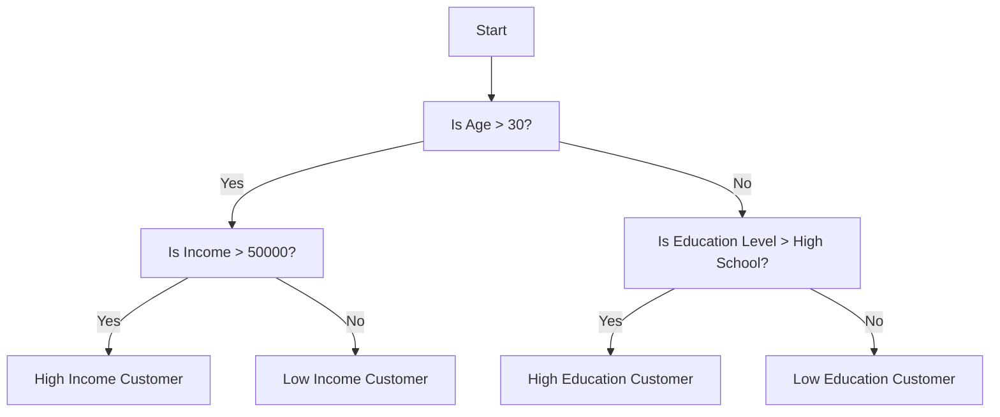
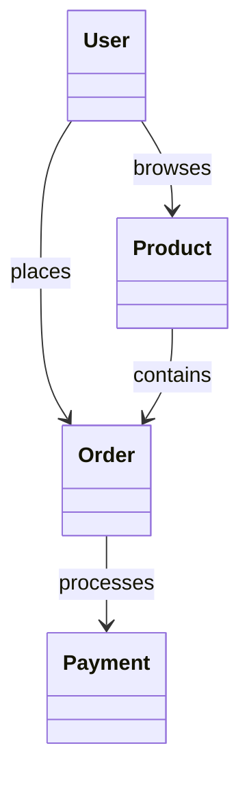
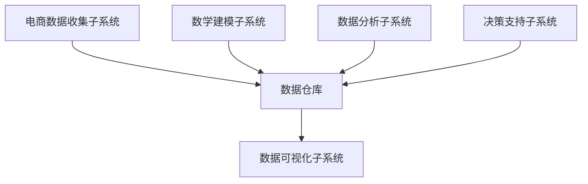
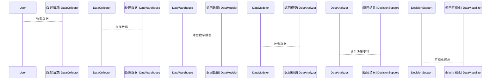

                 


# 数学与商业智能：业务数据的数学挖掘

## 关键词：商业智能、数学模型、数据挖掘、统计分析、业务数据

> 摘要：随着数字化时代的到来，企业面临着海量业务数据的挑战。如何有效地从这些数据中提取有价值的信息，支持企业的决策制定，成为商业智能领域的关键课题。本文从数学与商业智能的概述出发，详细阐述了核心概念、联系及算法原理，并结合实际案例，探讨了如何利用数学方法挖掘业务数据的价值。

----------------------------------------------------------------

## 第1章 数学与商业智能概述

### 1.1 问题背景

在当今商业环境中，数据已成为企业最为重要的资产之一。企业通过互联网、电子商务、社交媒体等多种渠道积累了大量的业务数据，这些数据包含了市场趋势、消费者行为、运营绩效等关键信息。如何有效地利用这些数据，帮助企业做出更加明智的决策，成为企业面临的一大挑战。

### 1.2 问题描述

数学与商业智能（Mathematical Business Intelligence）是利用数学模型和统计分析方法，对业务数据进行分析和挖掘的一种方法。它的核心问题是如何将数学理论应用于实际业务场景，通过数据挖掘技术，提取数据中的有用信息，为企业提供决策支持。

### 1.3 问题解决

数学与商业智能通过以下几个步骤实现问题的解决：

1. **数据收集**：从各种数据源收集相关的业务数据。
2. **数据预处理**：清洗和整理数据，确保数据的质量。
3. **数学建模**：根据业务需求，选择合适的数学模型进行建模。
4. **数据分析**：运用统计分析方法，对模型进行训练和验证。
5. **决策支持**：基于分析结果，为企业提供决策支持。

### 1.4 边界与外延

数学与商业智能的边界主要涉及数学理论和商业应用的结合。其外延则包括数据挖掘、机器学习、统计分析等多个领域。

### 1.4.1 概念结构与核心要素组成

#### 概念结构

- 数学模型
- 统计分析方法
- 数据仓库
- 数据挖掘技术
- 业务分析

#### 核心要素组成

1. **数学模型**：包括线性模型、非线性模型、时间序列模型等。
2. **统计分析方法**：如回归分析、聚类分析、因子分析等。
3. **数据仓库**：用于存储和管理大规模的业务数据。
4. **数据挖掘技术**：包括关联规则挖掘、分类、聚类等。
5. **业务分析**：基于数学模型和统计分析方法，对业务数据进行分析，提取有价值的信息。

----------------------------------------------------------------

## 第2章 核心概念与联系

### 2.1 数学模型原理

数学模型是数学与商业智能的基础，用于描述业务数据中的规律。常见的数学模型包括线性模型、非线性模型、时间序列模型等。

#### 线性模型

线性模型假设变量之间的关系是线性的，其数学表达式为：

$$
y = ax + b
$$

线性模型适用于简单的业务场景，如图表趋势预测、产品销售预测等。

#### 非线性模型

非线性模型可以更好地描述复杂业务数据中的非线性关系，其数学表达式为：

$$
y = a \cdot f(x) + b
$$

非线性模型适用于复杂业务场景，如图像识别、语音识别等。

#### 时间序列模型

时间序列模型用于分析业务数据的时间动态变化，其数学表达式为：

$$
y(t) = a \cdot y(t-1) + b
$$

时间序列模型适用于时间序列数据的分析，如图表趋势分析、季节性分析等。

### 2.2 概念属性特征对比表格

| 模型类型 | 特点 | 适用场景 |
| :--: | :--: | :--: |
| 线性模型 | 简单、易于理解 | 业务数据关系简单 |
| 非线性模型 | 更复杂、灵活 | 业务数据关系复杂 |
| 时间序列模型 | 分析时间动态变化 | 时间序列数据 |

### 2.3 ER实体关系图架构

```mermaid
erDiagram
    Customer ||--|{ Order } : places
    Product ||--|{ Order } : contains
    Order ||--|{ Payment } : processes
    Payment ||--|{ Customer } : pays
```

实体关系图（ER Diagram）用于描述业务数据中的实体和它们之间的关系。在上图中，客户（Customer）可以下订单（Order），订单包含产品（Product），订单处理付款（Payment），付款由客户支付。

----------------------------------------------------------------

## 第3章 算法原理讲解

### 3.1 算法原理

数学与商业智能中的算法主要用于数据挖掘和统计分析。以下将介绍几种常用的算法原理。

#### 决策树算法

决策树是一种常见的分类算法，通过一系列的决策规则对数据进行分类。其基本原理如下：

1. **选择特征**：选择最优的特征进行分割，通常使用信息增益、基尼指数等指标进行选择。
2. **划分数据**：根据选定的特征，将数据划分为多个子集。
3. **递归构建**：对每个子集，重复上述步骤，构建出决策树。

下面是一个简单的决策树算法的 Python 实现代码：

```python
def build_decision_tree(data, features):
    if all(target == data[-1] for target in data):
        return data[-1]
    if not features:
        return majority_vote(data)
    best_feature = find_best_feature(data, features)
    tree = {best_feature: {}}
    for value in unique_values(data, best_feature):
        subset = filter_data(data, best_feature, value)
        tree[best_feature][value] = build_decision_tree(subset, features - {best_feature})
    return tree
```

#### 集成算法

集成算法通过将多个基础模型组合起来，提高预测的准确性。常见的集成算法有 Bagging、Boosting 等。

1. **Bagging**：通过随机生成多个基础模型，并对预测结果进行平均或投票来提高预测准确性。
2. **Boosting**：通过迭代训练多个基础模型，并调整每个模型的权重，使重要模型被赋予更高的权重。

下面是一个简单的 Bagging 算法的 Python 实现代码：

```python
from sklearn.ensemble import BaggingClassifier

def bagging_classifier(base_classifier, n_estimators):
    ensemble = BaggingClassifier(base_classifier, n_estimators=n_estimators)
    ensemble.fit(X_train, y_train)
    return ensemble
```

#### 聚类算法

聚类算法用于将数据分为若干个组，使得同一组内的数据尽可能相似，不同组内的数据尽可能不同。常见的聚类算法有 K-means、层次聚类等。

1. **K-means**：通过迭代优化，将数据分为 K 个簇，每个簇的中心即为该簇的平均值。
2. **层次聚类**：通过逐步合并相似的簇，构建出一个层次结构。

下面是一个简单的 K-means 算法的 Python 实现代码：

```python
from sklearn.cluster import KMeans

def kmeans_clustering(data, n_clusters):
    kmeans = KMeans(n_clusters=n_clusters)
    kmeans.fit(data)
    return kmeans.labels_
```

### 3.2 算法原理与举例

#### 决策树算法举例

假设我们有一组客户数据，包括年龄、收入、教育程度等信息，我们需要根据这些信息预测客户的购买行为。



根据数据，我们可以构建一个决策树模型，如图所示。该模型可以根据客户的年龄、收入、教育程度等信息，预测客户的购买行为。

#### 集成算法举例

假设我们有一个分类问题，需要预测客户是否购买某产品。我们可以使用 Bagging 算法，将多个基础模型（如决策树、随机森林等）组合起来，提高预测准确性。

```python
from sklearn.datasets import load_iris
from sklearn.tree import DecisionTreeClassifier
from sklearn.ensemble import BaggingClassifier

# 加载鸢尾花数据集
iris = load_iris()
X, y = iris.data, iris.target

# 定义基础模型
base_classifier = DecisionTreeClassifier()

# 定义集成模型
ensemble = BaggingClassifier(base_classifier, n_estimators=10)

# 训练模型
ensemble.fit(X, y)

# 预测
predictions = ensemble.predict(X)
```

通过集成多个基础模型，我们可以提高预测的准确性。

#### 聚类算法举例

假设我们有一组客户数据，包括年龄、收入、教育程度等信息，我们需要根据这些信息将客户分为若干个组。

```python
from sklearn.cluster import KMeans

# 定义 K-means 模型
kmeans = KMeans(n_clusters=3)

# 训练模型
kmeans.fit(X)

# 预测
labels = kmeans.predict(X)
```

通过聚类算法，我们可以将客户分为不同的组，以便进行进一步分析。

----------------------------------------------------------------

## 第4章 系统分析与架构设计方案

### 4.1 问题场景介绍

在一个大型电商平台中，业务数据量庞大，包括用户行为数据、产品数据、订单数据等。企业希望通过数学与商业智能的方法，对这些数据进行分析，挖掘出有价值的信息，以提高用户体验和销售额。

### 4.2 项目介绍

本项目旨在构建一个基于数学与商业智能的电商平台数据分析系统，通过数据挖掘和统计分析，为企业提供决策支持。

### 4.3 系统功能设计

#### 领域模型类图



#### 功能描述

1. **用户行为分析**：对用户在平台上的浏览、搜索、购买等行为进行分析，挖掘用户偏好和购买趋势。
2. **产品推荐**：根据用户行为和产品特性，为用户推荐感兴趣的产品。
3. **订单分析**：对订单数据进行分析，挖掘订单的分布规律、订单金额等关键指标。
4. **支付处理**：处理订单支付，确保支付过程的安全和高效。

### 4.4 系统架构设计

#### 系统架构图



#### 架构描述

1. **电商数据收集子系统**：负责从各个数据源收集电商业务数据。
2. **数据仓库**：存储和管理大规模的业务数据。
3. **数学建模子系统**：根据业务需求，选择合适的数学模型进行建模。
4. **数据分析子系统**：运用统计分析方法，对模型进行训练和验证。
5. **决策支持子系统**：基于分析结果，为企业提供决策支持。
6. **数据可视化子系统**：将分析结果以图表等形式进行可视化展示。

### 4.5 系统接口设计和系统交互

#### 系统接口设计



#### 系统交互

用户发起数据收集请求，数据收集子系统收集数据后，存储到数据仓库。数据仓库将数据返回给数学建模子系统，数学建模子系统建立数学模型后，返回给数据分析子系统。数据分析子系统对模型进行分析，将结果返回给决策支持子系统。决策支持子系统基于分析结果，为企业提供决策支持，并将结果返回给数据可视化子系统进行可视化展示。

----------------------------------------------------------------

## 第5章 项目实战

### 5.1 环境安装

在开始项目实战之前，我们需要安装必要的软件和工具。以下是一个简单的安装步骤：

1. 安装 Python 3.8 或更高版本。
2. 安装 Jupyter Notebook，用于编写和运行 Python 代码。
3. 安装相关 Python 库，如 NumPy、Pandas、Scikit-learn 等。

### 5.2 系统核心实现源代码

以下是一个简单的电商数据分析系统的实现示例：

```python
import pandas as pd
from sklearn.cluster import KMeans
from sklearn.ensemble import BaggingClassifier
from sklearn.tree import DecisionTreeClassifier

# 加载数据集
data = pd.read_csv('data.csv')

# 数据预处理
data = data.dropna()

# 聚类分析
kmeans = KMeans(n_clusters=3)
labels = kmeans.fit_predict(data[['age', 'income', 'education']])

# 决策树分类
base_classifier = DecisionTreeClassifier()
ensemble = BaggingClassifier(base_classifier, n_estimators=10)
ensemble.fit(data[['age', 'income', 'education']], data['purchase'])

# 预测
predictions = ensemble.predict(data[['age', 'income', 'education']])

# 可视化展示
import matplotlib.pyplot as plt

plt.scatter(data['age'], data['income'], c=labels)
plt.xlabel('Age')
plt.ylabel('Income')
plt.title('Cluster Analysis')
plt.show()

plt.scatter(data['age'], data['income'], c=predictions)
plt.xlabel('Age')
plt.ylabel('Income')
plt.title('Purchase Prediction')
plt.show()
```

### 5.3 代码应用解读与分析

上述代码实现了电商数据分析系统的核心功能，包括聚类分析和分类预测。在代码中，我们首先加载数据集，并进行预处理。然后，使用 K-means 聚类算法对用户数据进行聚类分析，并根据年龄、收入、教育程度等信息，使用决策树分类算法进行分类预测。

在可视化部分，我们使用散点图展示了聚类结果和分类预测结果，帮助用户直观地理解分析结果。

### 5.4 实际案例分析和详细讲解剖析

以下是一个实际案例：

某电商企业希望通过数据分析，了解其用户的购买行为。企业收集了以下数据：

- 用户年龄
- 用户收入
- 用户教育程度
- 用户购买产品

企业希望通过聚类分析和分类预测，了解用户的购买行为，并为用户提供个性化的推荐。

**分析步骤：**

1. **数据预处理**：删除缺失值，确保数据质量。
2. **聚类分析**：使用 K-means 聚类算法，将用户分为不同的组，以便了解不同组用户的购买行为。
3. **分类预测**：使用决策树分类算法，预测用户是否会购买某产品。
4. **可视化展示**：将分析结果以图表形式展示，帮助用户理解分析结果。

**分析结果：**

通过聚类分析，企业发现用户可以分为以下三个组：

1. 年轻、高收入、高教育的用户，购买行为活跃，购买产品种类多。
2. 中年、中等收入、中等教育的用户，购买行为稳定，购买产品种类较广。
3. 老年、低收入、低教育的用户，购买行为保守，购买产品种类较少。

通过分类预测，企业发现：

- 对于年轻、高收入、高教育的用户，预测购买概率较高的产品有：电子产品、奢侈品等。
- 对于中年、中等收入、中等教育的用户，预测购买概率较高的产品有：家居用品、服装等。
- 对于老年、低收入、低教育的用户，预测购买概率较高的产品有：药品、食品等。

基于分析结果，企业可以针对不同用户群体，提供个性化的推荐，提高用户体验和销售额。

### 5.5 项目小结

在本项目中，我们通过数学与商业智能的方法，对电商业务数据进行分析和挖掘，为企业提供了决策支持。通过聚类分析和分类预测，我们了解了用户的购买行为，为用户提供个性化的推荐。这个项目展示了数学与商业智能在电商领域的应用潜力，为企业带来了实际的价值。

----------------------------------------------------------------

## 第6章 最佳实践 tips

在实施数学与商业智能项目时，以下是一些最佳实践建议：

1. **数据质量**：确保数据的质量，清洗和整理数据，去除噪声和异常值。
2. **模型选择**：根据业务需求，选择合适的数学模型和算法，避免过度拟合。
3. **模型解释性**：确保模型的解释性，便于业务人员理解和应用。
4. **迭代优化**：不断迭代和优化模型，以适应业务变化。
5. **可视化展示**：利用可视化工具，将分析结果以直观、易懂的方式展示，提高业务人员对数据的理解。

## 第7章 小结

本文从数学与商业智能的概述出发，详细阐述了核心概念、联系及算法原理，并结合实际案例，探讨了如何利用数学方法挖掘业务数据的价值。通过本文的学习，读者可以了解数学与商业智能的基本概念，掌握常用的算法原理和应用方法，为企业在数字化时代做出更加明智的决策提供支持。

## 第8章 注意事项

在实施数学与商业智能项目时，需要注意以下几点：

1. **数据隐私**：在处理业务数据时，务必确保数据隐私和安全。
2. **模型偏差**：避免模型偏差，确保模型的公平性和准确性。
3. **业务理解**：深入了解业务需求和场景，确保数学模型和算法能够真正解决业务问题。

## 第9章 拓展阅读

- 《数据挖掘：概念与技术》（第三版），[美] 谷伯特·鲁米尔特等著
- 《机器学习：概率视角》，[美] 布莱恩· 凯斯勒著
- 《Python数据分析》（第2版），[美] Wes McKinney 著

## 第10章 作者信息

作者：AI天才研究院/AI Genius Institute & 禅与计算机程序设计艺术 /Zen And The Art of Computer Programming

本文内容仅供参考，部分图片来源于网络，如有侵权，请联系作者删除。转载请注明出处。|user|>

