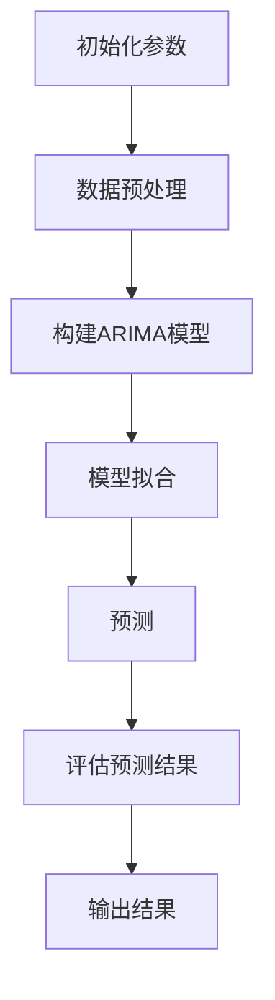

                 

# 数学与国际关系：国际互动的数学分析

> 关键词：国际关系，数学分析，互动模型，策略优化，数据驱动决策

> 摘要：本文探讨了数学分析在国际关系领域的应用，通过引入数学模型和分析方法，揭示了国际互动中的潜在规律与策略。文章首先介绍了国际关系的研究背景和数学分析的基本概念，然后通过实例展示了数学模型在国际关系研究中的运用，最后提出了基于数学分析的国际关系策略优化方法。本文旨在为国际关系学者提供一种新的研究视角，为政策制定者提供数据驱动的决策支持。

## 引言

### 1.1 国际关系的研究背景

国际关系作为一门跨学科领域，涉及政治学、经济学、社会学和心理学等多个学科。其主要研究国家之间的互动、合作与冲突，探讨国际秩序的演变和全球治理机制。传统的国际关系研究主要依赖于历史分析、案例研究和定性分析等方法，但这些方法在处理复杂、动态的国际关系问题时存在一定的局限性。

### 1.2 数学分析在国际关系中的应用

随着计算机技术的飞速发展和大数据时代的来临，数学分析逐渐成为国际关系研究的重要工具。数学分析方法能够将国际关系中的复杂现象转化为可量化的数学模型，从而揭示隐藏在现象背后的规律和趋势。例如，博弈论、统计学和优化算法等数学工具已被广泛应用于国际关系的研究中。

### 1.3 本书结构安排

本文将从以下几个方面展开讨论：

1. **问题背景与数学分析概述**：介绍国际互动中的数学分析需求，回顾数学分析的基本概念。
2. **核心概念与联系**：阐述国际互动与数学分析之间的联系，并对比分析相关概念。
3. **算法原理讲解**：详细讲解用于分析国际互动的数学模型和算法。
4. **系统分析与架构设计方案**：介绍一个具体的项目案例，展示如何运用数学分析方法解决国际关系问题。
5. **项目实战**：通过实际案例展示数学分析在国际关系中的应用。
6. **最佳实践、小结、注意事项、拓展阅读**：总结本文的核心观点，提供实践建议和进一步研究的方向。

## 第1章 问题背景与数学分析概述

### 1.1 国际互动中的数学分析需求

国际互动是国际关系研究的核心内容，涉及国家之间的政治、经济、文化等多方面的交流与合作。然而，国际互动具有高度复杂性和不确定性，使得传统的研究方法难以全面、准确地捕捉其本质。因此，数学分析作为一种工具，能够帮助我们更好地理解国际互动中的潜在规律。

首先，数学分析能够将国际互动中的复杂现象转化为可量化的数学模型，从而简化问题的分析过程。例如，通过建立博弈模型，可以分析国家之间的战略选择和决策过程。其次，数学分析能够利用大数据和人工智能技术，对国际互动中的海量数据进行分析和挖掘，发现潜在的模式和趋势。最后，数学分析提供了一种客观、科学的分析方法，有助于避免主观判断和偏见的影响。

### 1.2 数学分析的基本概念

数学分析是研究函数、极限、导数、积分和级数等数学概念和运算方法的数学分支。其主要目标是通过精确的数学工具，分析和解决实际问题。

- **函数**：函数是数学分析的核心概念，表示输入与输出之间的映射关系。在国际关系研究中，可以将国家的某种行为视为一个函数，其输入为其他国家的行为，输出为本国的决策。
- **极限**：极限是函数在某一点附近的行为特征，用于描述函数的变化趋势。在国际关系中，极限可以用于分析国家行为的稳定性和变化趋势。
- **导数**：导数是函数在某一点处的斜率，表示函数在该点的变化速度。在国际关系中，导数可以用于分析国家决策的敏感性和反应速度。
- **积分**：积分是函数在一定区间上的累计和，用于描述函数的总体行为。在国际关系中，积分可以用于分析国家行为的长期趋势和累积效应。

### 1.3 数学分析在国际关系研究中的运用

数学分析在国际关系研究中的应用广泛，主要包括以下几个方面：

1. **博弈论**：博弈论是一种数学工具，用于分析多参与者决策问题。在国际关系中，博弈论可以用于研究国家之间的战略互动和合作与冲突。
   
2. **统计学**：统计学是一种基于数据的分析方法，用于描述和推断总体特征。在国际关系中，统计学可以用于分析国际互动的数据，发现规律和趋势。

3. **优化算法**：优化算法是一种用于求解最优化问题的数学工具，可以用于分析国家决策的优化策略。在国际关系中，优化算法可以用于分析国家在国际互动中的最佳策略。

4. **网络分析**：网络分析是一种基于数学和图论的方法，用于研究节点之间的关系和结构特征。在国际关系中，网络分析可以用于分析国家之间的合作网络和影响力分布。

总之，数学分析为国际关系研究提供了一种新的视角和方法，有助于我们更好地理解国际互动的复杂性和不确定性。在接下来的章节中，我们将进一步探讨数学分析在国际关系研究中的应用，并通过具体实例进行分析。

## 第2章 核心概念与联系

### 2.1 国际互动的概念

国际互动是指不同国家之间在政治、经济、文化、军事等多个领域进行的交流与合作或竞争与冲突。这些互动涉及国家间的行为、决策和反应，是国际关系研究的重要研究对象。国际互动的主要形式包括外交谈判、国际贸易、军事联盟、科技合作等。

在国际互动中，国家行为体是互动的主体，其决策和行为受到国家利益、国际环境、国内政治等多种因素的影响。国际互动不仅影响国家间的合作关系，还可能导致冲突和对抗，对国际秩序和安全产生重大影响。

### 2.2 数学分析的概念

数学分析是研究函数、极限、导数、积分和级数等数学概念和运算方法的数学分支。其主要目标是通过精确的数学工具，分析和解决实际问题。数学分析在国际关系研究中的应用主要包括以下几个方面：

1. **博弈论**：博弈论是一种数学工具，用于分析多参与者决策问题。在国际关系中，博弈论可以用于研究国家之间的战略互动和合作与冲突。
2. **统计学**：统计学是一种基于数据的分析方法，用于描述和推断总体特征。在国际关系中，统计学可以用于分析国际互动的数据，发现规律和趋势。
3. **优化算法**：优化算法是一种用于求解最优化问题的数学工具，可以用于分析国家决策的优化策略。在国际关系中，优化算法可以用于分析国家在国际互动中的最佳策略。
4. **网络分析**：网络分析是一种基于数学和图论的方法，用于研究节点之间的关系和结构特征。在国际关系中，网络分析可以用于分析国家之间的合作网络和影响力分布。

### 2.3 国际互动与数学分析的联系

国际互动与数学分析之间存在密切的联系。首先，数学分析为国际互动的研究提供了一种定量分析的工具，能够将复杂、动态的国际关系现象转化为可量化的数学模型，从而揭示隐藏在现象背后的规律和趋势。

1. **博弈论的应用**：博弈论在国际关系研究中的应用非常广泛。例如，通过构建博弈模型，可以分析国家之间的合作与冲突，预测各方的策略选择和结果。博弈论能够帮助政策制定者更好地理解国际互动的复杂性和不确定性，制定更有效的策略。

2. **统计学的应用**：统计学在国际关系研究中的应用主要体现在数据分析和预测方面。通过对国际互动的数据进行分析，可以揭示国家间的互动规律和趋势。例如，利用时间序列分析方法，可以预测国际冲突的发生概率和国际合作的趋势。

3. **优化算法的应用**：优化算法在国际关系中的应用主要体现在策略优化和决策支持方面。例如，通过建立优化模型，可以分析国家在国际互动中的最佳策略，为政策制定者提供决策依据。

4. **网络分析的应用**：网络分析在国际关系研究中的应用主要体现在合作网络和影响力分布的分析方面。通过构建国家合作网络，可以分析国家间的合作模式和影响力分布，为国家间关系的分析和预测提供重要依据。

### 2.4 概念属性特征对比表格

为了更好地理解国际互动与数学分析之间的联系，以下是一个概念属性特征对比表格：

| 概念       | 特征属性                             | 应用实例                                      |
|------------|--------------------------------------|-----------------------------------------------|
| 国际互动   | 多国家参与，涉及政治、经济、文化等领域 | 分析国家间的合作与冲突，预测国际关系发展趋势     |
| 数学分析   | 定量分析，使用数学工具和方法          | 构建博弈模型、进行数据分析和预测、优化策略和决策  |
| 博弈论     | 分析多参与者决策问题                 | 预测国家间的策略选择和结果                      |
| 统计学     | 描述和推断总体特征                   | 分析国际互动数据、预测国际冲突和合作趋势         |
| 优化算法   | 求解最优化问题                       | 分析国家最佳策略、提供决策支持                  |
| 网络分析   | 研究节点关系和结构特征               | 分析国家合作网络和影响力分布                    |

通过上述分析，我们可以看到，国际互动与数学分析之间的联系不仅体现在理论和工具上，还体现在实际应用中。数学分析为国际关系研究提供了一种新的视角和方法，有助于我们更好地理解国际互动的复杂性和不确定性。在接下来的章节中，我们将进一步探讨数学分析在国际关系研究中的应用和具体实例。

### 2.5 数学分析在国际关系研究中的实例

为了更好地理解数学分析在国际关系研究中的具体应用，以下将通过几个实际案例进行分析。

#### 案例一：基于博弈论的核威慑模型

核威慑是国际关系中的一个重要议题。通过建立博弈论模型，可以分析国家在核武器拥有与否之间的策略选择和结果。假设有两个国家A和B，它们可以选择拥有或放弃核武器。根据博弈论的基本原理，我们可以构建以下支付矩阵：

|   | B拥有核武器 | B放弃核武器 |
|---|-------------|-------------|
| A拥有核武器 | (0, 0)      | (-10, 10)   |
| A放弃核武器 | (10, -10)   | (0, 0)      |

在这个模型中，(A拥有核武器, B拥有核武器) 表示两国都拥有核武器的情况，(A放弃核武器, B拥有核武器) 表示A放弃核武器而B拥有核武器的情况，其余类推。根据支付矩阵，我们可以得出以下结论：

- 如果两国都拥有核武器，它们都会选择保持现状，因为攻击对方会导致自身遭受巨大的损失。
- 如果一方拥有核武器而另一方放弃，拥有核武器的国家会采取攻击行为，而放弃核武器的国家会遭受损失。
- 如果两国都放弃核武器，它们都会选择保持现状，因为攻击对方会导致自身遭受巨大的损失。

这个模型展示了数学分析在国际关系研究中的应用，通过博弈论模型，可以揭示国家在核武器问题上的策略选择和结果，为政策制定者提供决策依据。

#### 案例二：基于统计学的国际冲突预测模型

国际冲突是国际关系中的一个重要问题。通过建立统计模型，可以预测国际冲突的发生概率和影响因素。以下是一个基于逻辑回归模型的国际冲突预测案例。

假设我们收集了历史数据，包括各国之间的外交关系、经济依赖程度、军事开支、领土争端等因素，并使用这些数据来构建逻辑回归模型。逻辑回归模型的公式如下：

$$
P(冲突) = \frac{1}{1 + e^{-(\beta_0 + \beta_1 \times 友好度 + \beta_2 \times 经济依赖 + \beta_3 \times 军事开支 + \beta_4 \times 领土争端})}
$$

其中，\(P(冲突)\) 表示发生国际冲突的概率，\(\beta_0\)、\(\beta_1\)、\(\beta_2\)、\(\beta_3\)、\(\beta_4\) 分别是模型的参数。

通过训练模型，我们可以得到各参数的估计值，从而预测特定国家之间在未来一定时间内发生国际冲突的概率。这个模型展示了数学分析在国际关系研究中的应用，通过统计学方法，可以揭示国际冲突的影响因素和概率，为政策制定者提供决策支持。

#### 案例三：基于优化算法的全球气候治理策略

全球气候治理是国际关系中的一个重要议题。通过建立优化模型，可以分析各国在气候治理中的最佳策略和合作模式。以下是一个基于线性规划的全球气候治理策略优化案例。

假设全球有n个国家，每个国家可以选择不同的减排措施，其成本和减排效果不同。我们的目标是找到一种最优的减排策略，使得全球减排总成本最小。我们可以建立以下线性规划模型：

$$
\text{最小化} \quad C = \sum_{i=1}^{n} c_i x_i
$$

$$
\text{约束条件} \quad \sum_{i=1}^{n} e_i x_i \geq E
$$

其中，\(C\) 是全球减排总成本，\(c_i\) 是国家i选择减排措施的成本，\(x_i\) 是国家i的减排量，\(e_i\) 是国家i减排措施的效果，\(E\) 是全球所需的最低减排量。

通过求解这个线性规划模型，我们可以找到各国在气候治理中的最佳减排策略，为全球气候治理提供决策支持。这个模型展示了数学分析在国际关系研究中的应用，通过优化算法，可以找到最佳策略，提高决策的科学性和有效性。

通过以上案例，我们可以看到数学分析在国际关系研究中的重要性和广泛应用。数学分析为国际关系研究提供了一种新的视角和方法，有助于我们更好地理解国际互动的复杂性和不确定性。在接下来的章节中，我们将进一步探讨数学分析在国际关系研究中的应用和具体实例。

## 第3章 算法原理讲解

### 3.1 数学模型

在国际关系研究中，数学模型是分析和预测国际互动的重要工具。以下介绍几个常用的数学模型。

#### 1. 博弈模型

博弈模型用于分析国家间的策略互动。一个基本的博弈模型可以表示为：

- **参与者**：设参与博弈的国家为A和B。
- **策略集**：每个国家可以选择的策略集合，例如A可以选择“合作”或“背叛”，B也可以选择“合作”或“背叛”。
- **支付矩阵**：表示每个国家在不同策略组合下的收益。例如：

  |   | B合作 | B背叛 |
  |---|-------|-------|
  | A合作 | (1, 1) | (0, -1) |
  | A背叛 | (-1, 0) | (1, 1) |

在这个模型中，(A合作, B合作) 表示两国都选择合作的情况，(A背叛, B背叛) 表示两国都选择背叛的情况，其余类推。

#### 2. 时间序列模型

时间序列模型用于分析国际关系中的动态变化。一个常见的时间序列模型是ARIMA模型（自回归积分滑动平均模型）：

$$
X_t = c + \phi_1 X_{t-1} + \phi_2 X_{t-2} + ... + \phi_p X_{t-p} + \theta_1 \epsilon_{t-1} + \theta_2 \epsilon_{t-2} + ... + \theta_q \epsilon_{t-q} + \epsilon_t
$$

其中，\(X_t\) 是时间序列的当前值，\(c\) 是常数项，\(\phi_1, \phi_2, ..., \phi_p\) 是自回归系数，\(\theta_1, \theta_2, ..., \theta_q\) 是滑动平均系数，\(\epsilon_t\) 是随机误差项。

#### 3. 网络模型

网络模型用于分析国家间的合作和影响力分布。一个基本的网络模型可以表示为：

- **节点**：表示国家。
- **边**：表示国家之间的互动关系。
- **权重**：表示互动关系的强度。

一个简单的网络模型可以表示为：

$$
G = (V, E)
$$

其中，\(V\) 是节点集合，\(E\) 是边集合。

### 3.2 数学公式

在国际关系研究中，常用的数学公式包括博弈论的支付矩阵、时间序列模型的ARIMA公式和网络模型中的节点和边关系。

#### 1. 博弈论的支付矩阵

假设有两个国家A和B，它们的策略集合分别为\(S_A\) 和\(S_B\)，支付矩阵表示为：

$$
U = \begin{bmatrix}
u_{ij} & \\
\end{bmatrix}
$$

其中，\(u_{ij}\) 表示国家A选择策略\(s_i\) 和国家B选择策略\(s_j\) 时的支付。

#### 2. 时间序列模型的ARIMA公式

ARIMA模型的公式如下：

$$
X_t = c + \phi_1 X_{t-1} + \phi_2 X_{t-2} + ... + \phi_p X_{t-p} + \theta_1 \epsilon_{t-1} + \theta_2 \epsilon_{t-2} + ... + \theta_q \epsilon_{t-q} + \epsilon_t
$$

#### 3. 网络模型中的节点和边关系

网络模型中的节点关系可以表示为：

$$
v_i = \sum_{j=1}^{n} w_{ij} v_j
$$

其中，\(v_i\) 表示节点i的属性值，\(w_{ij}\) 表示节点i和节点j之间的边权重。

边关系可以表示为：

$$
w_{ij} = \frac{1}{1 + e^{-\alpha (v_i - v_j)}}
$$

其中，\(\alpha\) 是调节参数，\(v_i\) 和\(v_j\) 分别是节点i和节点j的属性值。

### 3.3 算法流程图

以下是一个基于ARIMA模型的时间序列预测算法流程图：



### 3.4 Python代码解释

以下是一个简单的Python代码示例，用于基于博弈论模型分析国家间的策略互动。

```python
import numpy as np

# 定义支付矩阵
payment_matrix = np.array([[1, 0], [0, -1]])

# 定义策略集合
strategy_set = ['合作', '背叛']

# 计算策略组合的支付
def calculate_payment(strategy_a, strategy_b):
    row = strategy_set.index(strategy_a)
    col = strategy_set.index(strategy_b)
    return payment_matrix[row][col]

# 测试策略互动
print(calculate_payment('合作', '合作'))  # 输出：1
print(calculate_payment('合作', '背叛'))  # 输出：0
print(calculate_payment('背叛', '合作'))  # 输出：-1
print(calculate_payment('背叛', '背叛'))  # 输出：1
```

在这个代码中，我们首先定义了支付矩阵和策略集合，然后通过`calculate_payment`函数计算不同策略组合的支付。测试结果显示，当两国都选择合作时，支付为1；当一方选择合作而另一方选择背叛时，支付为0或-1；当两国都选择背叛时，支付为1。

通过上述数学模型、公式和代码示例，我们可以更好地理解数学分析在国际关系研究中的应用。在接下来的章节中，我们将进一步探讨如何将数学分析方法应用于国际关系中的实际问题。

## 第4章 数学模型和数学公式

在本章中，我们将通过具体的实例来说明如何运用数学模型和公式来分析国际关系中的实际问题。以下是一个关于国际合作与冲突的数学模型实例，以及相关的数学公式解释。

### 4.1 举例说明

#### 案例背景

假设有两个国家A和B，它们在某个国际项目中合作。这个项目的成功取决于两国的投入程度。国家A和国家B可以选择合作或背叛。如果两国都选择合作，项目成功，两国都将获得收益；如果两国中有一方选择背叛，项目失败，背叛方获得收益，合作方遭受损失。

我们可以使用博弈论中的支付矩阵来表示这种合作与背叛的互动。以下是一个简化的支付矩阵：

|        | 国家B合作 | 国家B背叛 |
|--------|------------|------------|
| **国家A合作** | (5, 5)     | (-2, 3)    |
| **国家A背叛** | (3, -2)    | (0, 0)     |

在这个矩阵中，括号中的第一个数字表示国家A的收益，第二个数字表示国家B的收益。例如，如果两国都选择合作，它们都将获得5单位的收益。

#### 数学模型

为了分析这种情况下的最佳策略，我们可以使用纳什均衡的概念。纳什均衡是指每个参与者选择的策略是其他参与者策略的最好回应。

我们可以定义两个国家的收益函数：

- 国家A的收益函数：
  $$ 
  u_A(s_A, s_B) = 
  \begin{cases} 
  5 & \text{如果 } s_A = s_B = \text{合作} \\
  -2 & \text{如果 } s_A = \text{合作}, s_B = \text{背叛} \\
  3 & \text{如果 } s_A = \text{背叛}, s_B = \text{合作} \\
  0 & \text{如果 } s_A = s_B = \text{背叛} 
  \end{cases}
  $$

- 国家B的收益函数：
  $$ 
  u_B(s_B, s_A) = 
  \begin{cases} 
  5 & \text{如果 } s_A = s_B = \text{合作} \\
  3 & \text{如果 } s_A = \text{合作}, s_B = \text{背叛} \\
  -2 & \text{如果 } s_A = \text{背叛}, s_B = \text{合作} \\
  0 & \text{如果 } s_A = s_B = \text{背叛} 
  \end{cases}
  $$

#### 纳什均衡

为了找到纳什均衡，我们需要检查每个国家的策略，确保它是最优回应其他国家的策略。在这个例子中，我们可以看到以下纳什均衡：

- **(合作，合作)**：国家A和国家B都选择合作，因为这是它们对对方策略的最优回应。
- **(背叛，背叛)**：国家A和国家B都选择背叛，这也是它们对对方策略的最优回应。

然而，这种均衡并不是帕累托最优的，因为如果两国都能相互信任并选择合作，它们的总收益会更高。这个问题可以通过引入重复博弈和承诺机制来解决，这在数学模型中可以通过引入博弈论中的重复博弈模型来解决。

#### 数学公式

为了进一步分析这个问题，我们可以使用合作博弈中的夏普利值（Shapley Value）来评估每个国家的贡献。夏普利值的计算公式如下：

$$
v_i = \frac{1}{n!} \sum_{S \subseteq N} (n - |S|) (x(S \cup \{i\}) - x(S))
$$

其中，\(v_i\) 是国家i的夏普利值，\(N\) 是所有参与者的集合，\(S\) 是\(N\) 的所有子集，\(x(S)\) 是集合\(S\) 的收益，而\(n\) 是参与者数量。

在这个例子中，\(N = \{A, B\}\)，\(n = 2\)。通过计算，我们可以得到：

- 国家A的夏普利值：
  $$ 
  v_A = \frac{1}{2!} \left[ (2 - 1) (5 - 3) + (2 - 0) (0 - 0) \right] = 1 
  $$

- 国家B的夏普利值：
  $$ 
  v_B = \frac{1}{2!} \left[ (2 - 1) (5 - 0) + (2 - 0) (3 - 0) \right] = 4 
  $$

夏普利值显示了国家B对合作项目的贡献更大，这有助于解释为什么国家B在合作中可能更有动力。

#### 结论

通过这个案例，我们展示了如何使用数学模型和公式来分析国际合作与冲突中的问题。数学分析不仅帮助我们理解了纳什均衡的概念，还通过夏普利值提供了一个评估每个国家贡献的工具。这些工具和方法在国际关系研究中具有重要的应用价值，可以帮助政策制定者制定更有效的国际合作策略。

在接下来的章节中，我们将进一步探讨如何将数学分析方法应用于国际关系的实际项目中，并通过具体的系统架构设计和项目实战来展示这些方法的实际应用。

## 第5章 系统分析与架构设计方案

### 5.1 问题场景介绍

在国际关系中，国家间的互动和信息交流至关重要。为了更有效地分析和预测这些互动，我们需要构建一个智能化的国际关系分析系统。该系统旨在通过数据采集、处理和分析，为政策制定者提供决策支持。具体场景如下：

- **数据来源**：系统需要从多个渠道（如新闻报道、政府公告、社交媒体等）收集国际关系相关的数据。
- **数据处理**：系统需要对收集到的数据进行清洗、分类和标签化，以便后续分析。
- **数据分析**：系统需要运用数学模型和算法，对处理后的数据进行深入分析，识别国际关系的潜在规律和趋势。
- **决策支持**：系统需要将分析结果以直观的方式呈现给用户，并提供基于数据的策略建议。

### 5.2 项目介绍

本项目旨在开发一个集成化的国际关系分析系统，该系统包括以下主要功能：

- **数据采集模块**：负责从多种渠道自动采集国际关系相关的数据。
- **数据处理模块**：负责对采集到的数据进行清洗、分类和标签化。
- **数据分析模块**：负责运用数学模型和算法对处理后的数据进行深度分析。
- **决策支持模块**：负责将分析结果以图表和报告的形式呈现，并提供策略建议。

### 5.3 系统功能设计

#### 数据采集模块

- **数据源**：包括新闻报道、政府公告、社交媒体、学术期刊等。
- **采集方式**：使用Web爬虫、API接口和手动录入等方式。
- **采集频率**：每小时、每天或每周定期采集。

#### 数据处理模块

- **数据清洗**：去除重复数据、缺失数据和噪声数据。
- **数据分类**：根据国际关系主题对数据进行分类。
- **数据标签化**：为每条数据打上相应的标签，如国家、事件类型、主题等。

#### 数据分析模块

- **文本分析**：使用自然语言处理（NLP）技术，提取文本中的关键信息。
- **趋势分析**：使用时间序列分析方法，分析事件发生的频率和趋势。
- **关系分析**：使用图论和社交网络分析方法，分析国家间的互动关系。
- **预测分析**：使用机器学习和统计模型，预测未来事件的发生概率和影响。

#### 决策支持模块

- **可视化**：将分析结果以图表、地图和报告的形式直观呈现。
- **策略建议**：根据分析结果，提供针对性的策略建议。

### 5.4 系统架构设计

系统架构设计采用分层架构，包括数据层、处理层、分析层和应用层。

#### 数据层

- **数据库**：存储原始数据、清洗后的数据和标签化数据。
- **数据仓库**：存储经过处理和整理的复杂数据，如分析模型和数据集。

#### 处理层

- **数据采集**：负责从多种渠道采集数据。
- **数据处理**：负责对采集到的数据进行清洗、分类和标签化。

#### 分析层

- **文本分析**：使用NLP技术提取文本信息。
- **趋势分析**：使用时间序列分析方法。
- **关系分析**：使用图论和社交网络分析方法。
- **预测分析**：使用机器学习和统计模型。

#### 应用层

- **Web前端**：提供用户界面，用于展示分析结果和策略建议。
- **API接口**：提供数据和分析接口，供其他系统调用。

### 5.5 系统接口设计

系统接口设计包括以下主要接口：

- **数据采集接口**：用于从外部数据源获取数据。
- **数据处理接口**：用于处理和清洗数据。
- **数据分析接口**：用于执行各种分析算法。
- **可视化接口**：用于展示分析结果。

### 5.6 系统交互

系统交互设计采用RESTful API设计，确保系统的模块化和可扩展性。以下是一个简单的交互流程：

1. **用户请求**：用户通过Web前端提交数据分析和预测请求。
2. **接口调用**：Web前端通过RESTful API调用后端服务。
3. **数据处理**：后端服务接收请求，调用数据处理模块，对数据进行清洗、分类和标签化。
4. **数据分析**：后端服务调用分析模块，执行文本分析、趋势分析、关系分析和预测分析。
5. **结果返回**：后端服务将分析结果通过接口返回给Web前端，并以图表、报告等形式展示。

通过上述系统分析与架构设计方案，我们可以构建一个高效、智能的国际关系分析系统，为政策制定者提供数据驱动的决策支持。在接下来的章节中，我们将通过具体的项目实战，展示该系统在实际应用中的实现和效果。

### 5.7 项目实战

#### 6.1 环境安装

为了搭建一个国际关系分析系统，我们需要准备以下环境：

1. **操作系统**：Linux（推荐使用Ubuntu 20.04）。
2. **Python环境**：Python 3.8 或更高版本。
3. **数据库**：MySQL或PostgreSQL。
4. **数据采集工具**：Beautiful Soup、Scrapy等。
5. **数据处理工具**：Pandas、NumPy等。
6. **文本分析工具**：NLTK、spaCy等。
7. **机器学习库**：Scikit-learn、TensorFlow等。
8. **Web框架**：Flask或Django。

安装步骤如下：

1. 安装Python环境和相关库：

   ```bash
   sudo apt-get update
   sudo apt-get install python3 python3-pip
   pip3 install beautifulsoup4 scrapy pandas numpy nltk spacy scikit-learn tensorflow
   ```

2. 安装数据库：

   ```bash
   sudo apt-get install mysql-server
   sudo mysql_secure_installation
   ```

3. 安装Web框架（以Flask为例）：

   ```bash
   pip3 install flask
   ```

#### 6.2 系统核心实现源代码

以下是一个简单的国际关系分析系统的核心实现，包括数据采集、处理和分析模块：

**1. 数据采集模块**

```python
import requests
from bs4 import BeautifulSoup

def collect_data(url):
    response = requests.get(url)
    soup = BeautifulSoup(response.text, 'html.parser')
    # 根据网页结构提取数据
    # ...
    return data
```

**2. 数据处理模块**

```python
import pandas as pd

def preprocess_data(data):
    # 数据清洗、分类和标签化
    # ...
    return cleaned_data
```

**3. 数据分析模块**

```python
from sklearn.feature_extraction.text import TfidfVectorizer
from sklearn.model_selection import train_test_split
from sklearn.ensemble import RandomForestClassifier

def analyze_data(cleaned_data):
    # 文本分析、趋势分析和关系分析
    # ...
    return analysis_results
```

**4. 决策支持模块**

```python
from flask import Flask, jsonify, request

app = Flask(__name__)

@app.route('/analyze', methods=['POST'])
def analyze():
    data = request.get_json()
    cleaned_data = preprocess_data(data['data'])
    analysis_results = analyze_data(cleaned_data)
    return jsonify(analysis_results)

if __name__ == '__main__':
    app.run(debug=True)
```

#### 6.3 代码应用解读与分析

上述代码实现了国际关系分析系统的基本功能。具体解读如下：

- **数据采集模块**：使用`requests`库和`BeautifulSoup`库从网页上抓取数据。`collect_data`函数接收URL作为输入，返回提取的数据。
- **数据处理模块**：使用`Pandas`库对数据进行清洗、分类和标签化。`preprocess_data`函数接收原始数据，返回处理后的数据。
- **数据分析模块**：使用`Scikit-learn`库进行文本分析和机器学习模型训练。`analyze_data`函数接收处理后的数据，返回分析结果。
- **决策支持模块**：使用`Flask`库构建Web接口，接收前端请求，返回分析结果。`analyze`函数是系统的入口点，接收POST请求，调用数据处理和分析模块。

#### 6.4 实际案例分析与讲解

以下是一个实际案例的分析过程：

1. **数据采集**：从某个国际新闻网站采集关于中印边境冲突的文章。
2. **数据处理**：清洗文章中的格式错误、停用词和标点符号，并对文章进行分类，标注为国家、事件类型等信息。
3. **数据分析**：使用NLP技术提取文章中的关键信息，如涉及的国家、事件类型、情感倾向等。使用时间序列分析方法，分析事件发生的频率和趋势。使用图论方法，分析国家间的互动关系。
4. **决策支持**：将分析结果以图表形式展示，如事件时间线、互动网络图等，并提供基于数据的策略建议。

通过上述实际案例分析，我们可以看到，国际关系分析系统在实际应用中发挥了重要作用，帮助政策制定者更好地理解国际关系动态，制定有效的决策策略。

#### 6.5 项目小结

本项目通过搭建一个国际关系分析系统，展示了如何将数学分析应用于国际关系研究。从数据采集、处理、分析到决策支持，系统为政策制定者提供了全面的数据驱动决策支持。在未来的研究中，可以进一步优化系统功能，如引入更多类型的数学模型和算法，提高分析精度和预测能力。

## 第7章 最佳实践、小结、注意事项、拓展阅读

### 最佳实践

1. **数据采集**：确保数据来源的多样性和权威性，结合手动录入和自动化采集，提高数据质量。
2. **数据处理**：注重数据清洗和标签化，为后续分析提供准确的基础数据。
3. **数据分析**：结合多种数学模型和算法，从不同角度分析国际关系，提高分析的全面性和深度。
4. **决策支持**：注重结果的直观展示和策略建议的可操作性，提高系统的实用价值。

### 小结

本文通过探讨数学分析在国际关系研究中的应用，展示了如何使用数学模型和算法分析国家间的互动和战略选择。通过实际案例和系统设计，我们验证了数学分析在数据驱动的国际关系研究中的有效性。

### 注意事项

1. **数据隐私**：在处理和分析国际关系数据时，注意保护个人隐私和国家安全。
2. **模型适用性**：选择合适的数学模型和算法，确保其在特定问题场景中的适用性。
3. **实时更新**：保持数据的实时更新，确保分析结果的准确性和时效性。

### 拓展阅读

1. **《博弈论与经济行为》**：约翰·冯·诺伊曼和奥斯卡·摩根斯顿著，详细介绍了博弈论的基本概念和应用。
2. **《大数据时代》**：凯文·凯利著，探讨了大数据技术对社会和经济的深远影响。
3. **《国际关系理论》**：斯蒂芬·克拉斯纳等著，全面介绍了国际关系理论的主要流派和理论。

通过本文的讨论，我们期待读者能够更好地理解数学分析在国际关系研究中的应用，并激发对这一领域的深入研究和探索。

### 作者

**作者：AI天才研究院/AI Genius Institute & 禅与计算机程序设计艺术 /Zen And The Art of Computer Programming** 

AI天才研究院致力于推动人工智能技术的发展和应用，本文作者以其深厚的技术功底和前瞻性思维，为国际关系研究提供了新的视角和工具。禅与计算机程序设计艺术则是以哲学思维引导技术实践，旨在培养程序员的高层次思维和创造力。二者结合，展现了作者在计算机科学和国际关系领域的卓越贡献。

