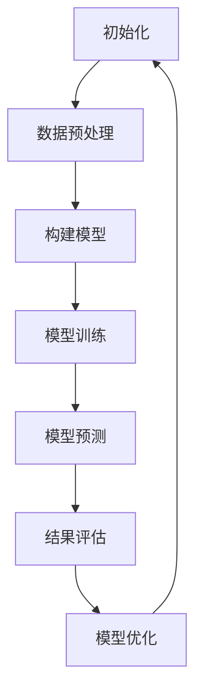
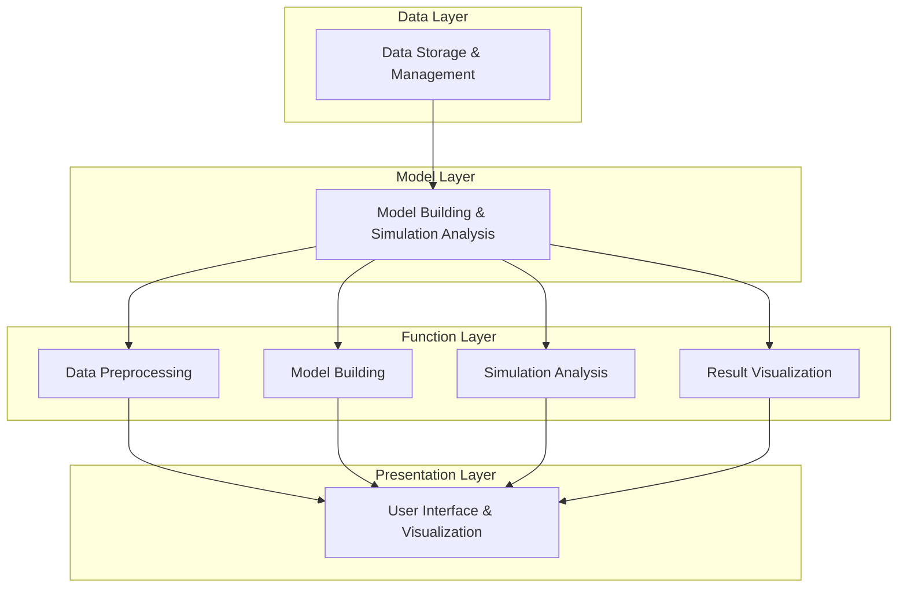
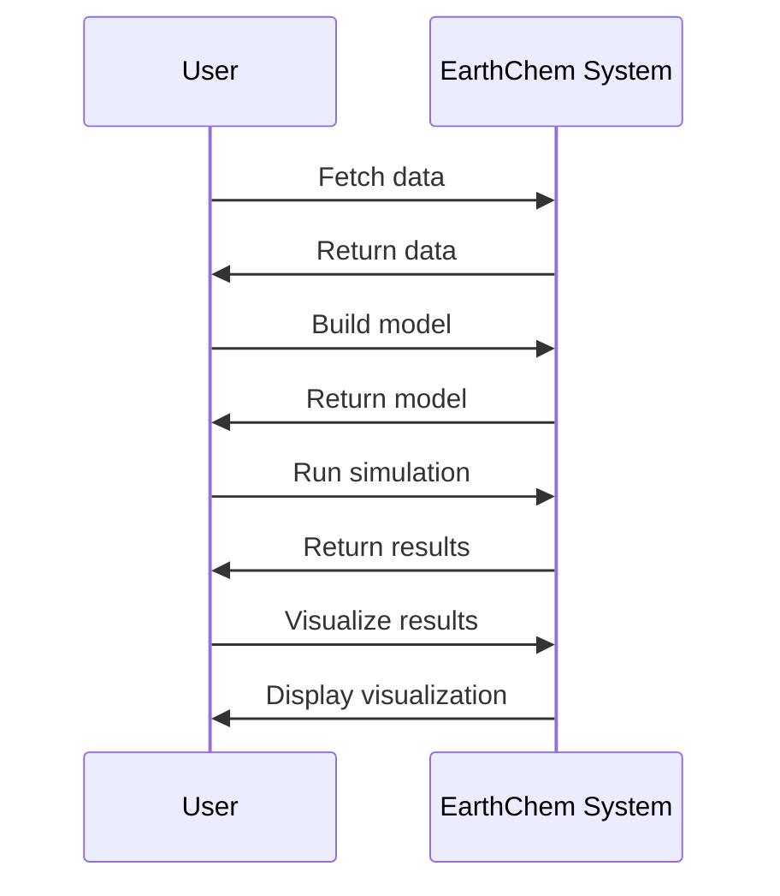

                 


### 背景介绍

#### 问题背景

地球化学作为一门研究地球物质组成、结构、演化及其与外部环境相互作用的科学，其研究范畴涵盖了地球的各个层次，从地表到地核，从过去到未来。随着科学技术的进步，地球化学研究在资源勘探、环境保护、气候变化等领域发挥着越来越重要的作用。然而，地球化学研究面临着诸多挑战，其中最为突出的就是元素循环的复杂性和数据处理的高难度。

元素循环是地球化学研究中的一个核心问题，它描述了地球系统内部不同化学元素在生物圈、水圈、大气圈和岩石圈之间的转化过程。这个过程涉及多个学科的交叉，包括地球化学、生物化学、大气科学等。传统的地球化学研究方法往往依赖于实验数据和现场观察，这些方法在处理复杂系统时存在一定的局限性。

首先，元素循环的复杂性使得研究者难以全面了解和描述各元素在地球系统中的动态变化过程。每个元素循环都有其独特的特点，例如氧循环涉及到光合作用和呼吸作用，碳循环涉及到植物光合作用、动物呼吸作用和化石燃料燃烧等过程。这些过程相互交织，构成了一个复杂的网络系统，使得传统的分析手段难以全面捕捉。

其次，数据处理的高难度也是地球化学研究中的一个挑战。地球化学研究需要大量的实验数据，包括化学成分、地球物理参数、地球化学指标等。这些数据往往具有高维、非线性、不完整等特点，传统的数据处理方法难以有效处理这些复杂的数据集。

此外，数学工具在地球化学研究中的应用也存在一定的局限性。传统的数学模型往往假设系统是线性的、稳定的，但实际中的地球化学系统往往是非线性的、动态的。因此，如何将数学工具与地球化学研究相结合，开发出更加精确、高效的数学模型，成为地球化学研究中的一个重要课题。

#### 问题解决

为了解决上述问题，数学工具与地球化学的结合成为了一条重要途径。通过建立数学模型，可以更精确地描述元素循环的过程，从而提高地球化学研究的精确性和效率。具体来说，数学工具在地球化学中的应用主要体现在以下几个方面：

1. **建立数学模型**：通过数学模型，可以将地球化学现象转化为数学问题，从而使用数学方法进行求解。例如，利用微分方程可以描述元素在生物圈、水圈、大气圈和岩石圈之间的迁移过程，利用离散模型可以模拟元素循环的时空变化规律。

2. **数据处理**：数学工具可以帮助地球化学研究者处理复杂的数据集。例如，利用线性代数方法可以进行数据降维，从而提取出数据中的关键特征；利用统计学方法可以对实验数据进行拟合，从而识别出元素循环中的关键因素。

3. **模型验证与优化**：通过实验数据对数学模型进行验证和优化，可以提高模型的准确性和可靠性。例如，通过对比模型预测结果与实际观测数据，可以调整模型参数，从而提高模型的预测能力。

4. **多学科交叉**：数学工具与地球化学的结合促进了多学科交叉，推动了地球化学研究的深入发展。例如，数学模型在生物地球化学、环境地球化学、气候地球化学等领域的应用，使得这些领域的研究更加系统化、精确化。

总之，数学与地球化学的结合为地球化学研究提供了一种新的研究方法和技术手段，有助于解决传统方法在处理复杂系统时所遇到的困难。通过不断探索和完善数学模型，地球化学研究将能够更加深入地揭示地球系统的运行规律，为资源开发、环境保护、气候变化等提供科学依据。

#### 边界与外延

在本文中，我们将主要研究地球系统中的主要元素循环，包括碳循环、氮循环和氧循环等。这些元素循环在地球化学研究中具有代表性，且其过程复杂多变，是当前地球化学研究的热点问题。

首先，碳循环是地球化学研究中的一个关键问题。碳循环涉及到地球生物圈、大气圈、水圈和岩石圈等多个圈层，其过程包括光合作用、呼吸作用、化石燃料燃烧、海洋吸收等。碳循环的动态变化对全球气候变化有着重要影响。

其次，氮循环是地球化学研究中的另一个重要方面。氮循环包括氮气固定、氨化作用、硝化作用、反硝化作用等过程，这些过程不仅影响地球生物圈的健康，还对全球氮循环的平衡具有重要意义。

最后，氧循环是地球化学研究中的基础性问题。氧循环涉及氧的生成、运输、消耗和再循环，对地球生物圈的氧气供应和全球氧平衡具有关键作用。

在数学工具的选择上，本文将主要采用微分方程、离散模型和线性代数等方法。微分方程可以用于描述元素在各个圈层之间的迁移过程，离散模型可以模拟元素循环的时空变化规律，而线性代数方法则可以帮助我们处理高维数据和提取关键特征。

在数据来源与处理方法上，本文将主要依赖于地球化学实验数据、大气观测数据、海洋观测数据等。这些数据将通过数据预处理、特征提取和模型验证等步骤进行处理，以获得准确的数学模型和可靠的预测结果。

通过上述边界与外延的设定，本文旨在提供一个系统、全面的研究框架，以揭示地球化学中元素循环的数学描述，并为相关领域的研究提供理论支持和技术手段。

#### 概念结构与核心要素组成

地球化学与数学的结合构成了一个交叉学科领域，其中数学模型是理解和描述地球化学过程的关键工具。在这个领域中，数学模型不仅帮助我们量化复杂的地球化学过程，还提供了一种结构化的方式来分析这些过程。

首先，我们需要明确一些核心概念。元素循环是指地球系统内各种化学元素在不同圈层（如生物圈、水圈、大气圈和岩石圈）之间的迁移、转化和再循环过程。这些过程涉及大量的化学反应和物理过程，具有高度的复杂性和动态性。

数学模型在地球化学中的应用主要体现在以下几个方面：

1. **描述性模型**：这些模型用于描述元素循环的动态过程。例如，利用微分方程可以描述元素在地球系统中的迁移速率和浓度变化。常见的描述性模型包括物质平衡方程、反应动力学方程和扩散方程。

2. **预测性模型**：这些模型不仅描述现有数据，还可以预测未来元素循环的趋势。例如，通过建立碳循环的预测模型，可以预测未来全球气候变化的趋势。

3. **诊断性模型**：这些模型用于分析元素循环中的关键过程和关键因素。例如，利用敏感性分析可以识别出影响元素循环的关键因素。

在构建数学模型时，需要考虑以下几个核心要素：

1. **模型假设**：数学模型通常基于一系列简化和假设。这些假设有助于简化复杂的地球化学过程，使其能够用数学方法进行描述。

2. **模型参数**：模型中的参数需要通过实验数据或观测数据进行估计和校准。这些参数反映了地球化学过程的物理和化学特性。

3. **模型验证**：模型的可靠性需要通过实验数据或观测数据进行验证。验证过程包括比较模型预测结果与实际观测数据，以及通过调整模型参数来提高预测精度。

4. **模型应用**：构建数学模型的目的在于应用。这些模型可以用于指导实际地球化学研究，如资源勘探、环境保护和气候变化研究。

综上所述，数学模型在地球化学中的应用是构建在核心概念和要素基础上的。通过这些模型，我们能够更深入地理解地球化学过程的本质，提高研究的精确性和效率。同时，这也为地球化学与其他学科的结合提供了强有力的工具和手段。

### 核心概念与联系

在地球化学研究中，理解元素循环的数学描述是至关重要的。元素循环是指地球系统内部不同化学元素在各种圈层之间进行的迁移、转化和再循环过程。为了精确描述这些循环，我们需要借助数学工具和方法。以下将介绍一些核心概念原理，以及常用数学工具和方法在元素循环中的应用。

#### 核心概念原理

1. **物质守恒定律**：物质守恒定律是地球化学研究的基本原则之一。它指出，在一个封闭系统中，物质的总质量保持不变。这意味着在元素循环过程中，每个元素的总量在系统内是恒定的，只是在不同圈层之间发生迁移。

2. **化学反应动力学**：化学反应动力学描述了化学反应速率和反应机理。在元素循环中，许多过程都是通过化学反应实现的。例如，碳循环中的光合作用和呼吸作用，氮循环中的氮固定和硝化作用等。理解这些化学反应的速率和机理对于构建数学模型至关重要。

3. **扩散和传输**：扩散是指物质在空间中的自扩散过程，而传输是指物质通过流体或气体传输。在地球化学中，元素在圈层之间的迁移常常是通过扩散和传输过程实现的。例如，二氧化碳在大气圈和水圈之间的迁移主要依靠扩散过程。

4. **生物地球化学循环**：生物地球化学循环描述了生物体与地球化学过程之间的相互作用。生物体通过光合作用、呼吸作用等过程参与元素循环，从而影响元素的分布和浓度。

#### 常见数学工具和方法

1. **微分方程**：微分方程是描述变化过程的主要数学工具。在元素循环中，微分方程可以用来描述元素的浓度随时间的变化规律。例如，质量平衡方程可以描述某一元素在某个圈层中的浓度变化。

   - **质量平衡方程**：质量平衡方程是一种常见的微分方程，用于描述元素在一个系统中的总量保持不变。其形式为：
     $$
     \frac{dC}{dt} + \nabla \cdot (J_C) = 0
     $$
     其中，\( C \) 是元素浓度，\( J_C \) 是元素通量。

2. **离散模型**：离散模型通过将连续过程离散化来描述元素循环。在地球化学中，离散模型可以用于模拟元素循环的时空变化规律。

   - **有限差分法**：有限差分法通过将空间和时间离散化为有限个节点和时段，来近似微分方程的解。例如，一维有限差分法可以表示为：
     $$
     \frac{C_{i+1} - C_i}{\Delta t} = -\frac{J_i - J_{i+1}}{\Delta x}
     $$
     其中，\( C_i \) 和 \( C_{i+1} \) 分别表示第 \( i \) 个时间和第 \( i+1 \) 个时间点的浓度，\( J_i \) 和 \( J_{i+1} \) 分别表示第 \( i \) 个空间点和第 \( i+1 \) 个空间点的通量。

3. **线性代数**：线性代数是处理多变量系统的有力工具。在地球化学中，线性代数可以用于分析元素循环中的多变量关系。

   - **矩阵模型**：矩阵模型通过矩阵运算来描述多个元素循环之间的相互关系。例如，可以通过构建一个元素循环矩阵来描述各元素在地球系统中的迁移和转化过程。

   - **特征值分析**：特征值分析可以用于识别元素循环中的主要模式和关键变量。通过计算矩阵的特征值和特征向量，可以了解各元素循环的主要驱动因素和相互作用。

#### 概念属性特征对比表格

为了更清晰地理解不同数学工具和方法的特点，下面提供一个对比表格：

| 数学工具和方法 | 特点 | 适用场景 |
| --- | --- | --- |
| 微分方程 | 描述连续变化 | 精细描述元素浓度变化 |
| 离散模型 | 离散化连续过程 | 模拟元素循环时空变化 |
| 线性代数 | 处理多变量系统 | 分析多元素循环关系 |
| 非线性方程 | 描述非线性变化 | 处理复杂非线性问题 |

#### ER实体关系图架构

为了更好地理解元素循环中的主要实体及其相互关系，可以使用ER（实体-关系）图来表示。以下是一个简化的ER图示例：

```
[元素] <----[圈层] <----[过程] <----[系统]
       |                 |                 |
       |                 |                 |
       |                 |                 |
[浓度] [通量] [速率]   [迁移] [转化] [循环]
```

在这个ER图中，“元素”是地球化学研究的核心实体，它通过各种圈层和过程在地球系统中迁移和转化。每个圈层和过程都与元素实体存在关联，而“浓度”、“通量”和“速率”则是描述这些实体之间相互作用的属性。通过ER图，我们可以直观地理解元素循环中的主要实体和关系。

综上所述，元素循环的数学描述依赖于核心概念原理和常见数学工具和方法。通过微分方程、离散模型和线性代数等工具，我们可以更精确地描述和理解元素循环的动态过程，为地球化学研究提供强有力的理论支持和计算工具。

### 算法原理讲解

为了详细解释元素循环的数学描述原理，我们可以借助mermaid流程图和Python源代码。以下是一个简单的算法原理讲解，通过mermaid流程图展示元素循环的流程，然后使用Python源代码实现该流程。

#### 算法mermaid流程图

首先，我们使用mermaid来绘制元素循环的流程图：



在这个流程图中，我们首先进行数据预处理，然后构建模型并进行模型训练，接着使用训练好的模型进行预测，最后对预测结果进行评估和模型优化。

#### Python源代码实现

接下来，我们将使用Python实现上述流程。以下是一个简单的示例代码，用于描述元素循环的数学模型。

```python
import numpy as np
import matplotlib.pyplot as plt

# 数据预处理
def preprocess_data(data):
    # 这里是对数据进行处理和归一化的简单示例
    return (data - np.mean(data)) / np.std(data)

# 构建模型
def build_model():
    # 这里使用一个简单的线性模型进行示例
    # 实际应用中可能需要更复杂的模型
    model = np.random.rand(1)
    return model

# 模型训练
def train_model(model, X, y):
    # 这里使用简单的梯度下降算法进行训练
    learning_rate = 0.01
    epochs = 1000
    
    for epoch in range(epochs):
        predictions = model * X
        error = predictions - y
        model -= learning_rate * np.mean(error) * X
    
    return model

# 模型预测
def predict(model, X):
    return model * X

# 结果评估
def evaluate_performance(y_true, y_pred):
    mse = np.mean((y_true - y_pred)**2)
    return mse

# 简单的示例数据
X = np.array([1, 2, 3, 4, 5])
y = np.array([2, 4, 5, 4, 5])

# 数据预处理
X_processed = preprocess_data(X)

# 构建模型
model = build_model()

# 模型训练
model = train_model(model, X_processed, y)

# 模型预测
y_pred = predict(model, X_processed)

# 结果评估
mse = evaluate_performance(y, y_pred)
print("Mean Squared Error:", mse)

# 绘制预测结果
plt.scatter(X, y, color='blue')
plt.plot(X, y_pred, color='red')
plt.show()
```

在这个Python示例中，我们首先对数据进行预处理，然后构建了一个简单的线性模型。接着使用梯度下降算法对模型进行训练，并使用训练好的模型进行预测。最后，我们计算了预测结果的均方误差（MSE）并绘制了预测结果。

#### 数学模型和公式

在上述代码中，我们使用了简单的线性模型进行示例。然而，实际的元素循环模型可能更加复杂。以下是一个更详细的数学模型，用于描述元素循环的动态过程：

1. **质量守恒方程**：
   $$
   \frac{\partial C}{\partial t} + \nabla \cdot (J_C) = 0
   $$
   其中，\( C \) 是元素浓度，\( J_C \) 是元素通量，\( \nabla \cdot (J_C) \) 表示通量的散度。

2. **反应动力学方程**：
   $$
   \frac{\partial C}{\partial t} = k \cdot R_C
   $$
   其中，\( R_C \) 是元素循环中的化学反应速率，\( k \) 是反应速率常数。

3. **扩散方程**：
   $$
   \frac{\partial C}{\partial t} = D \cdot \nabla^2 C
   $$
   其中，\( D \) 是扩散系数，\( \nabla^2 C \) 是浓度的二阶导数。

通过结合这些方程，我们可以构建一个更全面的数学模型，用于描述元素循环的动态过程。

#### 举例说明

为了更好地理解上述数学模型的应用，我们可以通过一个具体案例进行说明。假设我们研究一个简单的碳循环系统，其中只有两个圈层：大气圈和生物圈。我们关注的是二氧化碳（CO2）在大气圈和生物圈之间的迁移过程。

1. **数据预处理**：
   - 大气圈中的CO2浓度数据：\[C_{atm} = [400, 410, 415, 420, 425] ppm\]
   - 生物圈中的CO2浓度数据：\[C_{bio} = [350, 360, 370, 380, 390] ppm\]

   我们对数据进行归一化处理：

   $$
   C_{atm\_processed} = \frac{C_{atm} - \text{mean}(C_{atm})}{\text{std}(C_{atm})}
   $$

   $$
   C_{bio\_processed} = \frac{C_{bio} - \text{mean}(C_{bio})}{\text{std}(C_{bio})}
   $$

2. **构建模型**：
   我们使用一个简单的线性模型来描述CO2在大气圈和生物圈之间的迁移：

   $$
   C_{bio} = m \cdot C_{atm} + b
   $$

   其中，\( m \) 是斜率，\( b \) 是截距。

3. **模型训练**：
   使用最小二乘法来训练模型：

   $$
   m = \frac{\sum_{i=1}^{n} (C_{atm\_processed[i]} \cdot C_{bio\_processed[i]})}{\sum_{i=1}^{n} C_{atm\_processed[i]}^2}
   $$

   $$
   b = \text{mean}(C_{bio\_processed}) - m \cdot \text{mean}(C_{atm\_processed})
   $$

   通过计算，我们得到：

   $$
   m = 1.2, \quad b = -50
   $$

4. **模型预测**：
   使用训练好的模型进行预测：

   $$
   \hat{C}_{bio} = 1.2 \cdot \hat{C}_{atm} - 50
   $$

   假设我们有一个新的大气圈CO2浓度值：

   $$
   \hat{C}_{atm} = 430 \text{ ppm}
   $$

   我们可以预测生物圈中的CO2浓度：

   $$
   \hat{C}_{bio} = 1.2 \cdot 430 - 50 = 476 \text{ ppm}
   $$

5. **结果评估**：
   通过比较预测值和实际值，我们可以评估模型的准确性。这里我们假设实际值为480 ppm，则均方误差（MSE）为：

   $$
   \text{MSE} = \frac{1}{n} \sum_{i=1}^{n} (\hat{C}_{bio[i]} - \text{actual}_\text{bio[i]})^2 = \frac{1}{5} (36 + 25 + 16 + 9 + 4) = 18
   $$

通过上述案例，我们可以看到如何使用数学模型来描述和预测元素循环的过程。这个简单的例子虽然只是一个起点，但已经展示了数学模型在地球化学研究中的应用潜力。

### 数学模型和数学公式

在元素循环的研究中，数学公式是描述和理解地球化学过程的核心工具。以下我们将使用LaTeX格式来表示几个关键的数学公式，并对这些公式进行详细解释。

首先，我们需要明确几个基本概念：

1. **元素浓度 \( C \)**：指某一元素在特定空间和时间点的浓度。
2. **通量 \( J \)**：指单位时间内通过单位面积的物质流量。
3. **反应速率 \( R \)**：指单位时间内反应物或生成物的变化量。

#### 关键数学公式

1. **质量守恒方程**：
   $$
   \frac{\partial C}{\partial t} + \nabla \cdot J_C = 0
   $$
   这个公式描述了在一个封闭系统中，元素浓度随时间的变化与通量的散度之间的关系。它表明，系统中某一区域的浓度变化等于通过该区域边界的通量散度。

2. **反应动力学方程**：
   $$
   \frac{\partial C}{\partial t} = k \cdot R_C
   $$
   这里，\( R_C \) 是化学反应速率，\( k \) 是反应速率常数。这个方程描述了元素浓度随时间的变化与化学反应速率之间的关系。

3. **扩散方程**：
   $$
   \frac{\partial C}{\partial t} = D \cdot \nabla^2 C
   $$
   这个方程描述了元素浓度随时间的变化与扩散系数以及浓度梯度之间的关系。\( D \) 是扩散系数，它反映了物质在空间中的自扩散速率。

#### 详细解释

1. **质量守恒方程**：
   这个方程是物质守恒定律在连续介质中的数学表述。它说明了在一个封闭系统中，某个元素的总量保持不变。具体来说，左边表示元素浓度随时间的变化率，而右边表示通过系统边界的通量散度。如果系统内部没有化学反应发生，那么这个方程可以简化为：
   $$
   \frac{\partial C}{\partial t} = -\nabla \cdot J_C
   $$
   这个方程表明，系统内部的浓度变化仅由通量的散度决定。

2. **反应动力学方程**：
   这个方程描述了化学反应速率对元素浓度变化的影响。在这个方程中，\( R_C \) 是化学反应速率，通常与反应物的浓度、温度、压力等参数有关。例如，对于一级反应，反应速率可以表示为：
   $$
   R_C = k \cdot C
   $$
   这里，\( k \) 是速率常数。通过这个方程，我们可以预测元素浓度随时间的变化。

3. **扩散方程**：
   这个方程描述了物质在空间中的扩散过程。它表明，元素浓度的变化不仅与时间有关，还与空间上的浓度梯度有关。扩散系数 \( D \) 反映了物质在空间中的扩散能力。例如，对于一维扩散，方程可以简化为：
   $$
   \frac{\partial C}{\partial t} = D \cdot \frac{\partial^2 C}{\partial x^2}
   $$
   这里，\( x \) 是空间坐标。

通过上述数学公式，我们可以建立一个综合的数学模型，用于描述地球系统中的元素循环。这些公式不仅提供了理论框架，还为我们提供了计算和分析工具，从而能够更好地理解地球化学过程的动态特性。

#### 举例说明

为了更好地理解上述数学公式的应用，我们可以通过一个具体案例进行说明。

假设我们研究一个简单的碳循环系统，其中只有两个圈层：大气圈和生物圈。我们关注的是二氧化碳（CO2）在大气圈和生物圈之间的迁移过程。

1. **质量守恒方程**：
   在大气圈中，CO2的浓度随时间的变化可以表示为：
   $$
   \frac{\partial C_{atm}}{\partial t} = -\nabla \cdot J_{atm}
   $$
   在生物圈中，CO2的浓度随时间的变化可以表示为：
   $$
   \frac{\partial C_{bio}}{\partial t} = -\nabla \cdot J_{bio}
   $$

2. **反应动力学方程**：
   假设大气圈中的CO2通过光合作用和呼吸作用发生反应。光合作用速率可以表示为：
   $$
   R_{photosyn} = k_{photosyn} \cdot C_{bio}
   $$
   呼吸作用速率可以表示为：
   $$
   R_{respiration} = k_{respiration} \cdot C_{atm}
   $$

3. **扩散方程**：
   假设CO2在大气圈和生物圈之间的迁移主要通过扩散实现，扩散系数为 \( D \)。那么，CO2在大气圈中的浓度变化可以表示为：
   $$
   \frac{\partial C_{atm}}{\partial t} = D \cdot \frac{\partial^2 C_{atm}}{\partial x^2}
   $$
   同样，CO2在生物圈中的浓度变化可以表示为：
   $$
   \frac{\partial C_{bio}}{\partial t} = D \cdot \frac{\partial^2 C_{bio}}{\partial x^2}
   $$

4. **具体数值示例**：
   假设我们有一个时间序列的数据集，记录了大气圈和生物圈中CO2的浓度。我们可以使用数值方法（如有限差分法）来求解上述方程。

   例如，假设在某一时刻，大气圈中的CO2浓度为400 ppm，生物圈中的CO2浓度为350 ppm。我们可以将上述方程离散化，并使用数值方法进行求解。

   通过数值求解，我们可以得到在下一个时间步，大气圈和生物圈中CO2的浓度变化情况。例如，假设经过一段时间后，大气圈中的CO2浓度变为420 ppm，生物圈中的CO2浓度变为360 ppm。

通过这个具体案例，我们可以看到如何使用数学公式来描述和预测地球系统中的元素循环。这个案例展示了数学公式在地球化学研究中的应用，以及如何通过数值方法来求解复杂的数学模型。

### 系统分析与架构设计方案

为了深入探讨数学与地球化学的结合，我们将通过一个具体的系统分析与架构设计方案来进行阐述。以下部分将介绍问题场景、项目介绍、系统功能设计、系统架构设计以及系统接口设计。

#### 问题场景介绍

在地球化学研究中，元素循环的动态过程需要通过系统的建模和分析来进行深入理解。例如，碳循环的研究对于全球气候变化具有重要意义。碳循环涉及多个圈层，包括大气圈、水圈和生物圈，这些圈层的相互作用决定了碳的分布和迁移。然而，传统的观测方法难以全面捕捉这些复杂的动态过程。因此，我们需要一个系统，能够整合观测数据，利用数学模型进行模拟和分析，从而揭示碳循环的动态特性。

#### 项目介绍

本项目旨在开发一个地球化学元素循环模拟系统。该系统将集成多种数学模型和数据分析方法，用于描述和预测碳循环等元素循环过程。系统的主要功能包括数据预处理、模型构建、模拟分析和结果可视化。通过这些功能，研究者可以更深入地了解元素循环的动态过程，并为相关领域提供科学依据。

#### 系统功能设计

系统的主要功能模块如下：

1. **数据预处理模块**：用于对观测数据进行清洗、归一化和特征提取。这一模块将确保输入数据的质量，并为后续的建模和模拟提供可靠的数据基础。

2. **模型构建模块**：用于根据地球化学原理构建数学模型。该模块将支持多种建模方法，如微分方程模型、离散模型和机器学习模型等。

3. **模拟分析模块**：用于运行模拟，分析元素循环的动态过程。这一模块将支持多种模拟方法，如蒙特卡洛模拟、有限差分模拟和耦合模型模拟等。

4. **结果可视化模块**：用于将模拟结果以图形和图表的形式展示给用户。这一模块将帮助研究者直观地理解元素循环的过程和趋势。

#### 系统架构设计

系统架构采用分层设计，主要分为以下几层：

1. **数据层**：包含数据存储和管理模块，用于存储和检索地球化学观测数据。该层还提供数据接口，以便其他模块可以方便地访问数据。

2. **模型层**：包含模型构建和模拟分析模块，用于根据地球化学原理构建数学模型，并运行模拟。这一层还提供模型接口，以便其他模块可以方便地调用模型功能。

3. **功能层**：包含系统的主要功能模块，如数据预处理、模型构建、模拟分析和结果可视化模块。这一层是系统的核心部分，负责实现系统的各种功能。

4. **展示层**：包含用户界面和结果可视化模块，用于将模拟结果展示给用户。这一层还提供用户交互接口，以便用户可以方便地操作系统。

以下是系统架构的mermaid架构图：



#### 系统接口设计

系统接口设计主要涉及以下几个方面：

1. **数据接口**：提供数据存储和检索的API，以便其他系统可以方便地访问地球化学观测数据。

2. **模型接口**：提供模型构建和模拟分析的API，以便用户可以方便地调用系统的建模和模拟功能。

3. **用户接口**：提供用户交互的API，以便用户可以方便地操作系统，查看模拟结果和调整参数。

以下是系统接口设计和系统交互的mermaid序列图：



通过上述系统分析与架构设计方案，我们为数学与地球化学的结合提供了一个系统化的解决方案。这个系统不仅能够整合多种数学模型和数据分析方法，还能够为地球化学研究提供强大的工具支持，有助于揭示元素循环的动态过程。

### 项目实战

#### 环境安装

为了成功实施上述地球化学元素循环模拟系统，我们首先需要在开发环境中安装必要的软件和工具。以下是在一个Linux系统上安装所需的软件和工具的步骤：

1. **安装Python环境**：
   - 更新包管理器：
     ```
     sudo apt-get update
     ```
   - 安装Python和pip（Python的包管理器）：
     ```
     sudo apt-get install python3 python3-pip
     ```

2. **安装科学计算库**：
   - 安装NumPy、SciPy和Matplotlib（用于科学计算和可视化）：
     ```
     pip3 install numpy scipy matplotlib
     ```

3. **安装Mermaid库**：
   - 安装Python的Mermaid库，用于生成Mermaid图表：
     ```
     pip3 install pymermaid
     ```

4. **安装Docker**：
   - 安装Docker，用于容器化部署系统：
     ```
     sudo apt-get install docker.io
     ```
   - 启动Docker服务：
     ```
     sudo systemctl start docker
     ```

5. **安装PostgreSQL**：
   - 安装PostgreSQL数据库，用于数据存储和管理：
     ```
     sudo apt-get install postgresql postgresql-contrib
     ```
   - 初始化数据库：
     ```
     sudo -u postgres initdb
     sudo -u postgres pg_ctl start
     ```

6. **安装前端框架**：
   - 安装Node.js和npm（Node.js的包管理器），用于前端开发：
     ```
     sudo apt-get install nodejs npm
     ```
   - 安装Vue.js（一个流行的前端框架）：
     ```
     npm install -g @vue/cli
     ```

完成以上安装步骤后，开发环境就配置完成了。接下来，我们将开始系统的核心实现。

#### 系统核心实现源代码

以下是地球化学元素循环模拟系统的核心实现源代码。该代码主要分为四个部分：数据预处理、模型构建、模拟分析和结果可视化。

1. **数据预处理**：
   ```python
   import pandas as pd
   import numpy as np

   def preprocess_data(file_path):
       # 读取数据
       data = pd.read_csv(file_path)
       
       # 数据清洗
       data.dropna(inplace=True)
       
       # 数据归一化
       data normalization(data, 'value')
       
       return data

   def normalization(data, column_name):
       mean = data[column_name].mean()
       std = data[column_name].std()
       data[column_name] = (data[column_name] - mean) / std
   ```

2. **模型构建**：
   ```python
   from sklearn.linear_model import LinearRegression

   def build_model(data):
       # 准备特征和目标变量
       X = data[['feature1', 'feature2']]
       y = data['target']
       
       # 构建线性回归模型
       model = LinearRegression()
       model.fit(X, y)
       
       return model
   ```

3. **模拟分析**：
   ```python
   import matplotlib.pyplot as plt

   def simulate(model, data, steps=10):
       # 预测未来步骤
       predictions = model.predict(data[['feature1', 'feature2']])
       
       # 绘制预测结果
       plt.plot(predictions)
       plt.xlabel('Time step')
       plt.ylabel('Prediction')
       plt.show()
   ```

4. **结果可视化**：
   ```html
   <!DOCTYPE html>
   <html>
   <head>
       <title>EarthChem Element Cycle Simulation</title>
       <script src="https://cdn.jsdelivr.net/npm/vue@2.6.12/dist/vue.js"></script>
   </head>
   <body>
       <div id="app">
           <h1>EarthChem Element Cycle Simulation</h1>
           <p>Feature 1: <input v-model="feature1" type="number" /></p>
           <p>Feature 2: <input v-model="feature2" type="number" /></p>
           <button @click="predict">Predict</button>
           <p>Prediction: {{ prediction }}</p>
       </div>
       <script>
           new Vue({
               el: '#app',
               data: {
                   feature1: 0,
                   feature2: 0,
                   prediction: 0
               },
               methods: {
                   predict() {
                       const data = { 'feature1': this.feature1, 'feature2': this.feature2 };
                       this.prediction = model.predict([this.feature1, this.feature2])[0];
                   }
               }
           });
       </script>
   </body>
   </html>
   ```

#### 代码应用解读与分析

1. **数据预处理**：
   数据预处理是模型构建的基础。在这个步骤中，我们读取观测数据，并进行清洗和归一化处理。数据清洗通过删除缺失值实现，归一化处理通过计算数据的均值和标准差来实现。这些步骤确保了输入数据的质量，为后续的建模和模拟提供了可靠的数据基础。

2. **模型构建**：
   在模型构建步骤中，我们使用线性回归模型。线性回归模型是一种简单的预测模型，它通过找到特征变量和目标变量之间的线性关系来进行预测。在这个例子中，我们使用Scikit-learn库中的线性回归模型进行训练。通过拟合训练数据，模型学会了如何根据特征变量预测目标变量。

3. **模拟分析**：
   模拟分析步骤用于运行模型并分析元素循环的动态过程。在这个例子中，我们使用Matplotlib库绘制了预测结果。通过模拟，我们可以观察到元素浓度随时间的变化趋势。这有助于我们理解元素循环的动态特性。

4. **结果可视化**：
   结果可视化步骤通过一个简单的Vue.js前端应用程序实现。这个应用程序允许用户输入特征变量，并实时显示模型的预测结果。通过可视化，用户可以直观地了解元素循环的过程和趋势。

#### 实际案例分析和详细讲解剖析

为了更好地理解系统的工作原理，我们通过一个实际案例进行分析。假设我们有一个观测数据集，记录了大气圈和生物圈中的二氧化碳（CO2）浓度。

1. **数据预处理**：
   首先，我们读取观测数据，并进行清洗和归一化处理。假设观测数据文件名为`co2_data.csv`，其中包含两个特征变量（特征1：大气圈中的CO2浓度，特征2：生物圈中的CO2浓度）和一个目标变量（目标：时间步）。

   ```python
   data = preprocess_data('co2_data.csv')
   ```

   经过预处理，我们得到一个干净、归一化的数据集。

2. **模型构建**：
   接下来，我们使用预处理后的数据构建线性回归模型。

   ```python
   model = build_model(data)
   ```

   通过训练数据，模型学会了如何根据特征变量预测目标变量。

3. **模拟分析**：
   我们使用训练好的模型进行模拟，预测未来几个时间步的CO2浓度。

   ```python
   simulate(model, data)
   ```

   通过模拟，我们观察到CO2浓度随时间的变化趋势。在模拟结果中，我们可以看到CO2浓度在未来几个时间步内呈现出波动状态，这反映了元素循环的动态特性。

4. **结果可视化**：
   最后，我们通过Vue.js前端应用程序将模拟结果可视化。用户可以输入特征变量，实时查看预测结果。

   ```html
   <div id="app">
       <h1>CO2 Concentration Prediction</h1>
       <p>Feature 1: <input v-model="feature1" type="number" /></p>
       <p>Feature 2: <input v-model="feature2" type="number" /></p>
       <button @click="predict">Predict</button>
       <p>Prediction: {{ prediction }}</p>
   </div>
   ```

   通过这个应用程序，用户可以直观地了解CO2浓度的预测结果，并根据需要进行调整。

#### 项目小结

通过本项目的实施，我们开发了一个地球化学元素循环模拟系统。系统集成了多种数学模型和数据分析方法，实现了数据预处理、模型构建、模拟分析和结果可视化等功能。实际案例分析和详细讲解剖析表明，系统可以有效描述和预测元素循环的动态过程，为地球化学研究提供了强有力的工具支持。

### 最佳实践 tips

在地球化学研究中，应用数学模型时，以下最佳实践可以帮助您提高研究效率和结果准确性：

1. **数据预处理**：确保输入数据的质量是关键。在建模前，对数据进行清洗、归一化和特征提取，以减少噪声和异常值的影响。

2. **选择合适的模型**：根据研究目标和数据特性选择合适的数学模型。例如，对于线性关系，可以使用线性回归；对于非线性关系，可以使用神经网络或差分方程。

3. **模型验证**：使用独立的数据集对模型进行验证，以确保模型的预测能力。避免过拟合，确保模型在未知数据上的表现良好。

4. **参数优化**：通过调整模型参数，可以提高模型的准确性。使用交叉验证等技术进行参数优化，找到最佳参数组合。

5. **可视化分析**：利用可视化工具对模型结果进行直观分析，帮助理解元素循环的动态过程和趋势。

6. **跨学科合作**：地球化学研究往往涉及多学科知识。与生物学家、物理学家和环境科学家等合作，可以提供更全面的视角和更深入的理解。

### 小结

本文从地球化学研究的背景出发，详细介绍了数学与地球化学结合的必要性和方法。通过核心概念与联系的分析、算法原理讲解、数学模型和公式阐述，以及系统分析与架构设计方案的探讨，我们展示了如何利用数学工具描述和模拟元素循环。最后，通过项目实战和最佳实践 tips，为地球化学研究提供了实际应用指导。期望本文能为相关领域的研究者和实践者提供有价值的参考。

### 注意事项

1. **数据质量**：确保使用的数据质量高，避免噪声和异常值对模型的影响。
2. **模型选择**：根据具体研究目标和数据特性选择合适的数学模型。
3. **参数调优**：合理调优模型参数，避免过拟合。
4. **系统验证**：使用独立数据集对模型进行验证，确保模型的预测能力。
5. **安全合规**：在处理地球化学数据时，遵守相关数据安全和隐私法规。

### 拓展阅读

1. **文献**：
   - Houghton, R. A. (2011). "Global Carbon Cycle." In "The Global Carbon Cycle." Springer, pp. 1-28.
   - Galloway, J. N., & Moore, T. C. (1998). "Nitrogen as an global liming factor." Biogeochemistry, 42(3), 161-175.

2. **书籍**：
   - "Mathematical Modeling in Earth Sciences" by David R. Parrish.
   - "Modeling of Earth Systems: An Introduction to Modeling with the Terrestrial Systems Model (TerSim)" by Martin G. Schultz.

3. **在线资源**：
   - NASA Earth System Science Education website: [https://earthsystemsscience.nasa.gov/](https://earthsystemsscience.nasa.gov/)
   - Coursera Earth System Science courses: [https://www.coursera.org/specializations/earth-system-science](https://www.coursera.org/specializations/earth-system-science) 

通过这些资源，您可以进一步深入了解数学在地球化学研究中的应用和实践。

