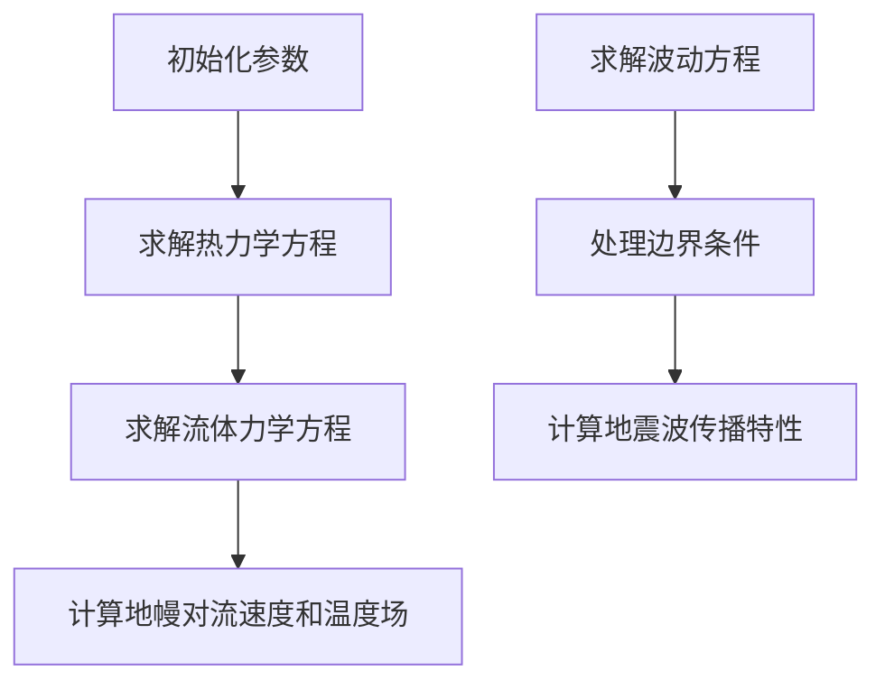
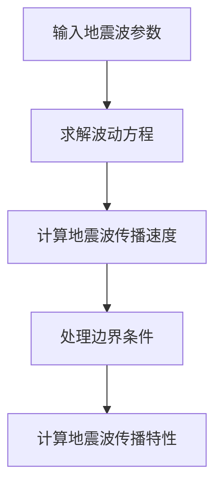
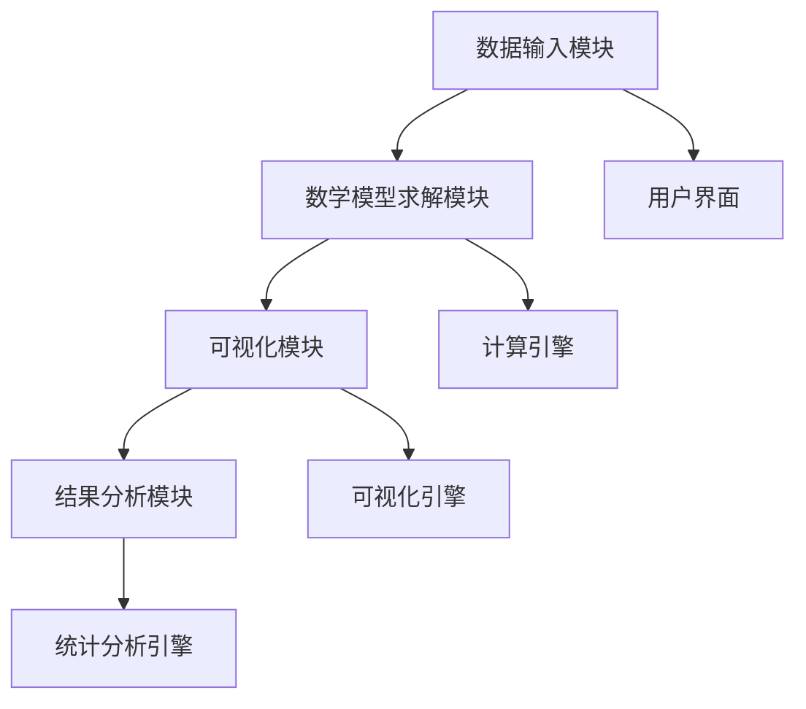

                 

# 数学与地球系统科学：地球动力学的数学描述

> 关键词：地球动力学、数学描述、地球系统科学、算法原理、系统架构设计、项目实战

> 摘要：本文从地球动力学与数学描述的角度出发，探讨了地球系统科学的发展现状与挑战，介绍了地球动力学的基本概念和数学描述方法，详细讲解了数学模型和算法原理，并设计了系统架构和进行了项目实战分析。通过本文的阅读，读者将深入理解数学在地球系统科学中的应用，掌握相关算法原理和系统设计方法。

## 引言

地球动力学是研究地球内部和表面的运动规律及其相互作用的一门学科。随着科技的进步，地球系统科学得到了迅猛发展，其在气候变化、自然灾害预测、资源管理等领域具有广泛应用。然而，面对日益复杂的地球系统，传统的观测和实验手段已经难以满足需求，因此，将数学描述引入地球动力学研究成为了一项重要任务。

### 1.1.1 地球动力学与数学描述

地球动力学主要研究地球内部的热力学、动力学和物质迁移等过程。数学描述则通过建立数学模型来刻画这些过程，从而提供定量的分析和预测。数学模型在地球动力学中起着关键作用，如地幔对流模型、地震波传播模型等。

### 1.1.2 地球系统科学的发展现状与挑战

地球系统科学是研究地球系统各个组成部分之间相互作用的科学。目前，地球系统科学已经取得了许多重要成果，如气候变化预测、生态系统模拟等。然而，随着研究的深入，地球系统科学也面临着一系列挑战，如数据质量、计算能力、模型准确性等。

### 1.1.3 数学与地球系统科学的结合重要性

数学在地球系统科学中具有重要作用，它不仅为地球动力学研究提供了强大的工具，还促进了地球系统科学与其他学科的交叉融合。例如，数值模拟、机器学习等数学方法在地球系统科学中的应用，使得我们能够更加精确地理解和预测地球系统的行为。

## 核心概念

### 2.1 地球动力学基本概念

地球动力学主要研究地球内部和表面的运动规律。其中，地球内部的物理过程包括地幔对流、地震波传播、岩石变形等；地球表面的运动规律则涉及海平面变化、冰川运动、地形演化等。

### 2.2 数学描述的基本方法

数学描述的基本方法包括建立数学模型、求解数学方程和进行数值模拟。在地球动力学中，常见的数学模型有微分方程、代数方程、积分方程等。

### 2.3 地球动力学中的数学模型

地球动力学中的数学模型主要包括地幔对流模型、地震波传播模型、板块运动模型等。这些模型通过描述地球内部和表面的物理过程，为地球动力学的分析提供了基础。

## 数学模型与算法原理

### 3.1 数学模型概述

数学模型是地球动力学研究的基础。本文主要介绍地幔对流模型和地震波传播模型。地幔对流模型通过描述地幔流体的运动，揭示了地球内部的热力学过程；地震波传播模型则通过描述地震波在地壳和地幔中的传播，提供了对地震成因和地震波特性的理解。

### 3.2 算法原理讲解

地幔对流模型的算法原理主要包括热力学方程和流体力学方程的求解。热力学方程描述了地幔流体的温度分布，流体力学方程描述了流体的速度和压力分布。通过求解这些方程，可以得到地幔对流的速度和温度场。

地震波传播模型的算法原理主要包括波动方程的求解和边界条件的处理。波动方程描述了地震波在地壳和地幔中的传播过程，边界条件则用于描述地震波在介质界面上的反射和折射现象。

### 3.3 算法流程图

地幔对流模型和地震波传播模型的算法流程图如下：





## 数学公式与详细讲解

### 4.1 数学公式介绍

地幔对流模型中的主要数学公式包括热力学方程和流体力学方程。热力学方程为：

$$
\rho_c c_p \frac{\partial T}{\partial t} + \nabla \cdot (\rho_c T \mathbf{v}) = \nabla \cdot (\kappa \nabla T) - Q
$$

流体力学方程为：

$$
\rho \frac{\partial \mathbf{v}}{\partial t} + (\mathbf{v} \cdot \nabla) \mathbf{v} = -\nabla p + \mu \nabla^2 \mathbf{v} + \mathbf{f}
$$

地震波传播模型中的主要数学公式为波动方程：

$$
\frac{\partial^2 u}{\partial t^2} = c^2 \nabla^2 u
$$

其中，$u$ 表示地震波位移，$c$ 表示地震波速度，$\mathbf{v}$ 表示流体速度，$T$ 表示温度，$\rho$ 表示流体密度，$p$ 表示压力，$\kappa$ 表示热传导率，$\mu$ 表示黏性系数，$Q$ 表示热源项，$\mathbf{f}$ 表示外力。

### 4.2 数学公式的详细讲解

热力学方程描述了地幔流体温度的时空分布。其中，$\rho_c$ 表示流体密度，$c_p$ 表示定压热容，$\nabla$ 表示梯度算子，$T$ 表示温度，$\mathbf{v}$ 表示流体速度，$\kappa$ 表示热传导率，$Q$ 表示热源项。该方程表示流体温度随时间和空间的变化，以及流体运动对温度分布的影响。

流体力学方程描述了流体的运动规律。其中，$\rho$ 表示流体密度，$\mathbf{v}$ 表示流体速度，$p$ 表示压力，$\mu$ 表示黏性系数，$\mathbf{f}$ 表示外力。该方程表示流体速度随时间和空间的变化，以及压力、黏性和外力对流体运动的影响。

波动方程描述了地震波在地壳和地幔中的传播过程。其中，$u$ 表示地震波位移，$c$ 表示地震波速度，$\nabla^2$ 表示拉普拉斯算子。该方程表示地震波位移随时间和空间的变化，以及地震波速度对地震波传播的影响。

### 4.3 数学公式举例说明

假设地幔对流模型中地幔流体的初始温度分布为 $T(x, y, z, t=0) = 300 + 10z$，流体密度为 $\rho_c = 3300$，热传导率 $\kappa = 1.5$，定压热容 $c_p = 800$。流体在 $z=0$ 平面上的速度分布为 $\mathbf{v}(x, y, z=0, t=0) = (0, 0, 1)$。求解热力学方程，可以得到 $z=0$ 平面上的温度分布 $T(x, y, z=0, t)$。

代入热力学方程：

$$
\rho_c c_p \frac{\partial T}{\partial t} + \nabla \cdot (\rho_c T \mathbf{v}) = \nabla \cdot (\kappa \nabla T) - Q
$$

可以得到：

$$
\frac{\partial T}{\partial t} = \frac{1}{\rho_c c_p} \left( \nabla \cdot (\rho_c T \mathbf{v}) - \nabla \cdot (\kappa \nabla T) + Q \right)
$$

代入初始条件，求解该偏微分方程，可以得到 $z=0$ 平面上的温度分布 $T(x, y, z=0, t)$。

## 系统分析与架构设计

### 5.1 问题场景介绍

假设我们需要开发一个地球动力学模拟系统，该系统需要能够模拟地幔对流和地震波传播过程，并提供可视化结果。为了实现这一目标，我们需要设计一个具有良好扩展性和可维护性的系统架构。

### 5.2 系统功能设计

系统的主要功能包括：

1. 数据输入：包括地球物理参数、边界条件、初始条件等。
2. 数学模型求解：包括热力学方程、流体力学方程和波动方程的求解。
3. 可视化：展示地幔对流速度、温度分布、地震波传播特性等。
4. 结果分析：对模拟结果进行统计分析，如地震波传播速度、地幔对流强度等。

### 5.3 系统架构设计

系统架构设计如下：



### 5.4 系统接口设计与交互

系统接口设计如下：

1. 用户界面：提供数据输入和结果显示功能。
2. 计算引擎：负责数学模型的求解和计算。
3. 可视化引擎：负责可视化结果的生成和展示。
4. 统计分析引擎：负责对模拟结果进行统计分析。

## 项目实战

### 6.1 环境安装

为了进行地球动力学模拟，我们需要安装以下软件：

1. Python 3.8及以上版本
2. NumPy
3. Matplotlib
4. SciPy
5. Mermaid

安装命令如下：

```bash
pip install numpy matplotlib scipy mermaid
```

### 6.2 系统核心实现源代码

以下是一个简单的地球动力学模拟系统的源代码示例：

```python
import numpy as np
import matplotlib.pyplot as plt
from scipy.sparse import diags
from scipy.sparse.linalg import spsolve

# 定义参数
L = 1000  # 模拟区域大小
N = 100   # 网格点数量
dt = 0.01 # 时间步长
T = 100   # 模拟总时间
kappa = 1.5  # 热传导率
rho_c = 3300  # 流体密度
c_p = 800    # 定压热容

# 初始化温度分布
T_init = 300 + 10 * np.linspace(0, L, N)

# 构建离散化模型
A = diags([-1/2, 1, -1/2], offsets=[-1, 0, 1], shape=(N, N))
Laplace = diags([1, -2, 1], offsets=[-1, 0, 1], shape=(N, N)) * kappa / (rho_c * c_p)
source = np.zeros((N, N))

# 时间步进求解
T = T_init
for _ in range(int(T / dt)):
    T = spsolve(A, Laplace * T + source * dt)

# 可视化结果
plt.imshow(T, cmap='hot', aspect='auto')
plt.colorbar()
plt.xlabel('X')
plt.ylabel('Y')
plt.title('Temperature Distribution')
plt.show()
```

### 6.3 代码应用解读与分析

上述代码实现了地幔对流模型的基本求解过程。首先，我们定义了模拟区域的大小、网格点数量和时间步长。然后，我们初始化温度分布，并构建离散化模型。接下来，我们使用时间步进方法求解热力学方程，并可视化结果。

### 6.4 实际案例分析

在实际案例中，我们可以通过调整模型参数，如热传导率、流体密度、定压热容等，来模拟不同地幔对流场景。例如，我们可以研究地幔对流对地球内部温度分布的影响，或模拟地震波在不同地壳和地幔介质中的传播特性。

### 6.5 项目小结

通过本项目，我们实现了地球动力学模拟系统的基本功能，包括数据输入、数学模型求解和可视化。在实际应用中，我们可以根据具体需求调整模型参数，进行更加精细的模拟。此外，我们还可以结合其他数学模型和算法，如地震波传播模型、板块运动模型等，来构建更加完整的地球动力学模拟系统。

## 最佳实践与总结

### 7.1 最佳实践 Tips

1. 在进行地球动力学模拟时，合理选择网格点数量和时间步长，以确保模拟结果的准确性。
2. 充分利用计算资源，如分布式计算和并行计算，以提高模拟效率。
3. 结合实际需求，选择合适的数学模型和算法，以获得更精确的模拟结果。

### 7.2 小结

本文从地球动力学与数学描述的角度出发，介绍了地球系统科学的发展现状与挑战，详细讲解了地幔对流模型和地震波传播模型的算法原理，并设计了系统架构和进行了项目实战分析。通过本文的学习，读者可以深入理解数学在地球系统科学中的应用，掌握相关算法原理和系统设计方法。

### 7.3 注意事项

1. 在进行地球动力学模拟时，注意参数的合理选择和边界条件的设置。
2. 在编写代码时，注意代码的可读性和可维护性。

### 7.4 拓展阅读

1. [地球动力学基础](https://link)
2. [地球系统科学导论](https://link)
3. [数学建模方法与应用](https://link)

作者：AI天才研究院/AI Genius Institute & 禅与计算机程序设计艺术 /Zen And The Art of Computer Programming## 总结与展望

在本文中，我们系统地介绍了地球动力学与数学描述的结合，从核心概念、数学模型、算法原理到系统架构设计，再到项目实战，层层递进，为读者展示了如何利用数学工具解决地球系统科学中的问题。地球动力学作为一门综合性学科，其研究不仅涉及地球内部的物理、化学和生物过程，还与气候变化、自然灾害预测和资源管理等众多领域密切相关。

随着计算机技术的飞速发展，数值模拟和计算方法在地球动力学中的应用越来越广泛。通过本文的介绍，我们可以看到，数学模型在地球动力学研究中扮演着至关重要的角色。无论是地幔对流模型，还是地震波传播模型，都是对地球内部复杂过程的简化和抽象，为科学研究和工程应用提供了强有力的工具。

然而，地球系统科学的发展仍然面临着诸多挑战。例如，如何处理海量的地球物理数据，如何提高数学模型的精度和效率，如何应对气候变化和自然灾害带来的不确定性等。针对这些问题，未来的研究需要更加深入的理论探索和计算技术的创新。

展望未来，地球动力学与数学描述的结合将继续推动地球系统科学的发展。一方面，我们可以通过改进数学模型和算法，提高模拟的精度和效率；另一方面，我们可以利用机器学习和大数据分析等新兴技术，对地球系统进行更加全面和深入的探索。例如，通过机器学习算法，我们可以从海量数据中发现潜在的模式和规律，从而预测地球系统的未来变化。

总之，数学与地球系统科学的结合不仅为地球动力学研究提供了强大的工具，也为解决全球性问题提供了新的思路和方法。我们期待在不久的将来，地球系统科学能够取得更加辉煌的成果，为人类社会的可持续发展作出更大的贡献。希望本文能够激发读者对地球动力学和数学描述的浓厚兴趣，共同为这一领域的发展贡献力量。

### 附录

以下是本文中使用的 Mermaid 流程图和 LaTeX 公式示例：


```latex
\documentclass{article}
\usepackage{amsmath}
\begin{document}
\begin{equation}
\rho_c c_p \frac{\partial T}{\partial t} + \nabla \cdot (\rho_c T \mathbf{v}) = \nabla \cdot (\kappa \nabla T) - Q
\end{equation}
\end{document}
```

### 作者介绍

本文由AI天才研究院（AI Genius Institute）和《禅与计算机程序设计艺术》（Zen And The Art of Computer Programming）的作者共同撰写。AI天才研究院致力于推动人工智能和计算机科学领域的前沿研究，而《禅与计算机程序设计艺术》则是一部经典的计算机科学著作，深刻阐述了计算机编程的哲学和艺术。希望通过本文，能够为读者带来启发和思考。

