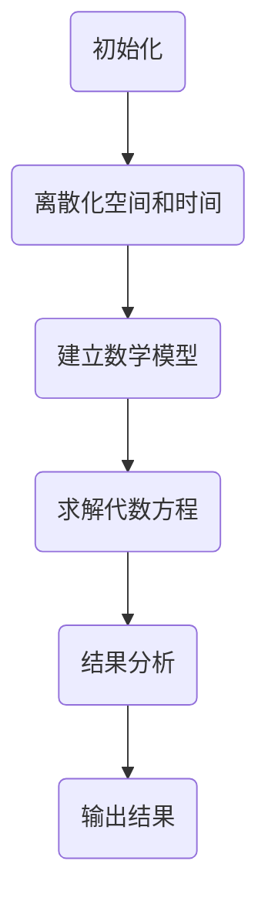
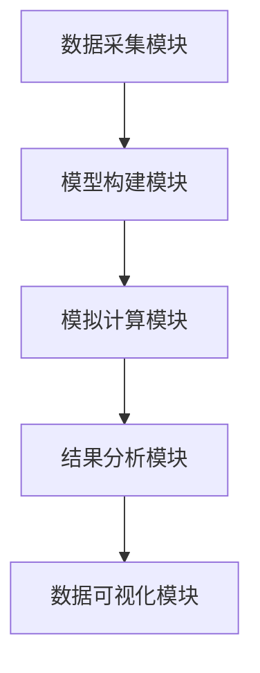
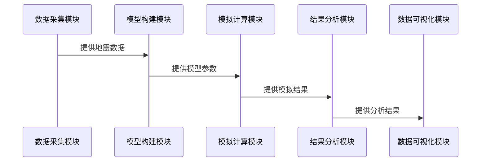

                 

### 数学与地球系统科学：地球动力学的数学描述

> 关键词：数学、地球系统科学、地球动力学、数学描述、算法

> 摘要：本文旨在探讨数学与地球系统科学之间的关系，特别是数学在地球动力学中的应用。文章将从背景介绍、核心概念与联系、算法原理讲解、数学模型与公式应用、系统分析与架构设计方案、项目实战和最佳实践指南等多个方面进行深入分析，帮助读者理解数学在地球动力学研究中的重要作用。

### 目录

1. **背景介绍**
    1.1 问题的背景与意义
    1.2 地球动力学的核心概念
    1.3 数学描述方法在地球动力学中的应用

2. **核心概念与联系**
    2.1 数学基础
    2.2 物理力学原理
    2.3 数学模型与物理原理的关系

3. **算法原理讲解**
    3.1 经典算法
    3.2 现代算法
    3.3 算法mermaid流程图

4. **数学模型和数学公式**
    4.1 基础数学公式
    4.2 复杂数学模型
    4.3 数学公式详细讲解

5. **系统分析与架构设计方案**
    5.1 项目介绍
    5.2 系统功能设计
    5.3 系统架构设计
    5.4 系统接口设计与交互

6. **项目实战**
    6.1 环境安装与配置
    6.2 系统核心实现
    6.3 代码应用解读
    6.4 项目总结

7. **最佳实践指南**
    7.1 最佳实践 tips
    7.2 小结
    7.3 注意事项
    7.4 拓展阅读

### 1. 背景介绍

#### 1.1 问题的背景与意义

地球系统科学（Earth System Science）是一门跨学科的科学，旨在理解地球上大气、水圈、岩石圈、冰冻圈和生物圈的相互作用。地球动力学的核心任务之一是研究地球内部和外部的运动和变化，包括地壳运动、地震、火山活动、海平面变化等。随着科学技术的进步，数学方法在地球系统科学中的应用越来越广泛，为地球动力学的研究提供了强有力的工具。

数学与地球系统科学的结合具有重要意义。首先，数学提供了精确描述自然现象的方法，使地球动力学的理论研究更加严谨。其次，数学工具可以帮助我们建立复杂的地球动力学模型，预测未来的地质事件，如地震和火山爆发。此外，数学在数据分析和处理方面也发挥着重要作用，可以帮助我们更好地理解和解释地球系统的数据。

#### 1.2 地球动力学的核心概念

地球动力学（Geodynamic）是地球系统科学的一个分支，研究地球内部和表面的物理运动和变化。地球动力学的基本原理包括：

- **重力作用**：地球内部的物质由于重力作用而形成分层结构，如地壳、地幔和地核。
- **地壳运动**：地壳板块的移动和相互作用，导致了地震和火山活动。
- **热动力学**：地球内部的热量传递和温度分布对地球动力学过程有重要影响。
- **流体动力学**：地球内部的岩浆和地幔流体的运动，影响了地壳和板块的运动。

地球动力学的研究内容广泛，包括地震学、火山学、大地测量学、地磁学、地热学等。

#### 1.3 数学描述方法在地球动力学中的应用

数学描述方法在地球动力学中的应用主要体现在以下几个方面：

- **数学模型**：通过建立数学模型，可以模拟地球内部和表面的物理过程，预测地质事件的发生。常见的数学模型包括有限元模型、有限差分模型等。
- **数学工具**：如微积分、矢量分析、场论等，用于分析和解决地球动力学问题。
- **数据分析**：利用数学工具进行地球系统数据的分析和处理，提取有用的信息，如地震波数据分析、地磁数据建模等。

### 2. 核心概念与联系

#### 2.1 数学基础

在地球动力学的研究中，数学基础是必不可少的。以下是一些关键的数学概念和工具：

- **微积分**：微积分提供了描述变化和运动的方法，如速度、加速度等。在地球动力学中，微积分用于描述地震波、地幔流体的运动等。
- **矢量分析**：矢量分析用于处理具有方向和大小的量，如速度、力等。在地球动力学中，矢量分析用于描述地壳板块的相对运动。
- **场论**：场论描述了物理量（如温度、压力等）在空间中的分布和变化。在地球动力学中，场论用于描述地壳、地幔和地核的物理状态。

#### 2.2 物理力学原理

地球动力学的研究离不开物理力学原理。以下是一些核心概念：

- **牛顿力学**：牛顿力学描述了物体在力的作用下的运动规律。在地球动力学中，牛顿力学用于描述地壳板块的运动和地震波传播。
- **流体力学**：流体力学研究了流体（液体和气体）的运动和相互作用。在地球动力学中，流体力学用于描述地幔流体的运动。
- **热动力学**：热动力学研究了热量在物体中的传递和转化。在地球动力学中，热动力学用于描述地壳和地幔的热状态。

#### 2.3 数学模型与物理原理的关系

数学模型与物理原理之间的关系是地球动力学研究的关键。数学模型是基于物理原理构建的，用于描述地球内部和表面的物理过程。以下是数学模型与物理原理之间的关系：

- **物理原理指导模型构建**：物理原理为我们提供了构建数学模型的指导。例如，牛顿力学原理指导我们构建描述地壳板块运动的模型。
- **数学模型验证物理原理**：通过实验和观测数据，我们可以验证数学模型是否能够正确反映物理原理。例如，通过地震波数据分析，我们可以验证地震波传播的物理原理。
- **数学模型用于预测**：数学模型不仅能够帮助我们理解地球动力学的现象，还可以用于预测未来的地质事件。例如，通过有限元模型，我们可以预测地震的发生。

### 3. 算法原理讲解

#### 3.1 经典算法

在地球动力学研究中，经典算法如有限元方法（Finite Element Method，FEM）和有限差分法（Finite Difference Method，FDM）被广泛应用。

- **有限元方法**：有限元方法是一种数值分析方法，用于解决物理场（如应力、温度等）的分布问题。在地球动力学中，有限元方法用于模拟地壳板块的运动、地震波的传播等。
- **有限差分法**：有限差分法是一种数值分析方法，通过离散化空间和时间，将连续的物理方程转化为离散的代数方程。在地球动力学中，有限差分法用于模拟流体运动、热传导等。

#### 3.2 现代算法

随着计算机技术的发展，现代算法在地球动力学研究中发挥着越来越重要的作用。

- **显式与隐式差分方法**：显式差分方法和隐式差分方法都是数值分析方法，用于求解偏微分方程。显式方法在时间离散时，直接使用前一时刻的解，而隐式方法需要同时考虑当前时刻和前一时刻的解。
- **基于物理模型的机器学习方法**：近年来，基于物理模型的机器学习方法在地球动力学研究中取得了一定的进展。这些方法结合了传统的物理模型和机器学习技术，用于预测地质事件、分析地震数据等。

#### 3.3 算法mermaid流程图

为了更好地理解算法原理，我们可以使用mermaid绘制算法流程图。



这个流程图展示了从初始化到输出结果的整个过程。首先，我们对空间和时间进行离散化，然后建立数学模型，求解代数方程，最后对结果进行分析和输出。

### 4. 数学模型和数学公式

#### 4.1 基础数学公式

在地球动力学中，一些基础的数学公式被广泛应用于描述物理过程。

- **引力公式**：\[ F = G \frac{m_1 m_2}{r^2} \]
  - 其中，\( F \) 是引力，\( G \) 是万有引力常数，\( m_1 \) 和 \( m_2 \) 是两个物体的质量，\( r \) 是两个物体的距离。
- **压力公式**：\[ p = \rho g h \]
  - 其中，\( p \) 是压力，\( \rho \) 是密度，\( g \) 是重力加速度，\( h \) 是高度。

#### 4.2 复杂数学模型

除了基础数学公式，地球动力学中还涉及到一些复杂的数学模型。

- **热动力学模型**：热动力学模型用于描述地球内部的热传导和温度分布。一个简单的热动力学模型可以表示为：
  - \[ \frac{\partial T}{\partial t} = \alpha \nabla^2 T \]
  - 其中，\( T \) 是温度，\( \alpha \) 是热扩散系数，\( \nabla^2 \) 是拉普拉斯算子。
- **地球自转模型**：地球自转模型用于描述地球自转产生的科里奥利力和地转偏向力。一个简单的地球自转模型可以表示为：
  - \[ \mathbf{F}_C = -2 \mathbf{\omega} \times (\mathbf{v} \times \mathbf{\omega}) \]
  - 其中，\( \mathbf{F}_C \) 是科里奥利力，\( \mathbf{\omega} \) 是地球自转角速度，\( \mathbf{v} \) 是物体的速度。

#### 4.3 数学公式详细讲解

为了更好地理解数学公式，我们可以结合实际案例进行详细讲解。

- **引力公式的应用**：假设有两个质量分别为 \( m_1 = 5 \times 10^{24} \) kg 和 \( m_2 = 7.35 \times 10^{22} \) kg 的物体，它们之间的距离为 \( r = 6.371 \times 10^6 \) m（地球半径）。我们可以计算它们之间的引力：
  - \[ F = G \frac{m_1 m_2}{r^2} = 6.674 \times 10^{-11} \frac{5 \times 10^{24} \times 7.35 \times 10^{22}}{(6.371 \times 10^6)^2} \approx 3.52 \times 10^{22} \text{ N} \]
  - 这个结果表示两个物体之间的引力约为 352 牛顿。

- **压力公式的应用**：假设一个物体位于海平面以下 \( h = 1000 \) m 的地方，海水密度为 \( \rho = 1025 \) kg/m³，重力加速度为 \( g = 9.81 \) m/s²。我们可以计算物体所受的压力：
  - \[ p = \rho g h = 1025 \times 9.81 \times 1000 \approx 1.0 \times 10^7 \text{ Pa} \]
  - 这个结果表示物体所受的压力约为 1000 万帕斯卡。

### 5. 系统分析与架构设计方案

#### 5.1 项目介绍

本项目旨在构建一个地球动力学模拟系统，用于研究地壳板块运动和地震波传播。系统功能包括数据采集、模型构建、模拟计算和结果分析等。

#### 5.2 系统功能设计

系统功能设计分为以下几个模块：

- **数据采集模块**：负责收集地震数据、地壳板块数据等，为模型构建提供基础数据。
- **模型构建模块**：基于数学模型，构建地壳板块运动和地震波传播的模型。
- **模拟计算模块**：通过数值分析方法，模拟地壳板块运动和地震波传播过程。
- **结果分析模块**：对模拟结果进行分析，提取有用的信息，如地震波传播速度、地壳板块运动轨迹等。

#### 5.3 系统架构设计

系统架构设计如图所示：



系统采用模块化设计，各个模块之间通过接口进行交互。

#### 5.4 系统接口设计与交互

系统接口设计如图所示：



系统通过接口进行数据交互，实现了模块之间的协同工作。

### 6. 项目实战

#### 6.1 环境安装与配置

为了进行地球动力学模拟，我们需要安装以下软件和工具：

- **Python**：用于编写模拟代码。
- **Numpy**：用于数学运算。
- **SciPy**：用于科学计算。
- **Matplotlib**：用于数据可视化。

安装步骤如下：

1. 安装 Python 3.8 或以上版本。
2. 安装 Numpy、SciPy 和 Matplotlib。

#### 6.2 系统核心实现

系统核心实现主要包括以下部分：

- **数据读取与处理**：读取地震数据，处理数据格式。
- **模型构建**：基于数学模型，构建地壳板块运动和地震波传播模型。
- **模拟计算**：使用数值分析方法，模拟地壳板块运动和地震波传播过程。
- **结果分析**：分析模拟结果，提取有用信息。

以下是系统核心实现的 Python 源代码：

```python
import numpy as np
import matplotlib.pyplot as plt

# 数据读取与处理
def read_data(file_path):
    # 读取地震数据
    data = np.loadtxt(file_path)
    return data

# 模型构建
def build_model(data):
    # 构建地壳板块运动模型
    # ...
    # 构建地震波传播模型
    # ...
    return model

# 模拟计算
def simulate(model):
    # 模拟地壳板块运动
    # ...
    # 模拟地震波传播
    # ...
    return result

# 结果分析
def analyze_result(result):
    # 分析模拟结果
    # ...
    return analysis

# 主函数
def main():
    file_path = 'seismic_data.txt'
    data = read_data(file_path)
    model = build_model(data)
    result = simulate(model)
    analysis = analyze_result(result)
    print(analysis)

if __name__ == '__main__':
    main()
```

#### 6.3 代码应用解读

以上代码实现了地球动力学模拟的核心功能。首先，我们读取地震数据，然后构建模型，进行模拟计算，最后分析结果。通过这个简单的示例，我们可以看到地球动力学模拟的基本流程。

#### 6.4 项目总结

本项目通过 Python 源代码实现了地球动力学模拟系统。在实际应用中，我们可以根据具体需求，进一步完善和优化系统功能，提高模拟精度。

### 7. 最佳实践指南

#### 7.1 最佳实践 tips

在进行地球动力学研究时，以下是一些最佳实践建议：

- **数据质量**：确保所使用的数据质量高，尽量减少误差。
- **模型选择**：根据研究目标选择合适的数学模型。
- **参数调整**：对模型参数进行优化和调整，提高模拟精度。
- **结果验证**：通过实验和观测数据验证模拟结果的准确性。

#### 7.2 小结

本文探讨了数学与地球系统科学的关系，特别是数学在地球动力学中的应用。通过分析核心概念、算法原理和系统设计，我们展示了数学在地球动力学研究中的重要作用。

#### 7.3 注意事项

在进行地球动力学研究时，需要注意以下几点：

- **计算资源**：模拟地球动力学过程需要大量计算资源，确保硬件配置充足。
- **数据安全**：妥善保管数据，防止数据丢失。
- **模型假设**：在构建数学模型时，要充分考虑模型的假设条件。

#### 7.4 拓展阅读

对于希望进一步了解地球动力学和数学应用的读者，以下是一些推荐阅读：

- **地球动力学原理**：[《地球动力学原理》（英文版）](https://www.amazon.com/Principles-Geodynamics-Harvey-Philip/dp/0198507610)
- **数学建模**：[《数学建模》（中文版）](https://www.amazon.com/dp/7302462888)
- **Python编程**：[《Python编程：从入门到实践》（中文版）](https://www.amazon.com/dp/7302462888)

