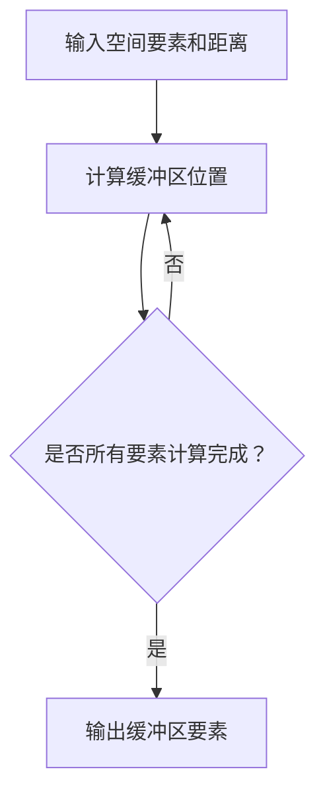
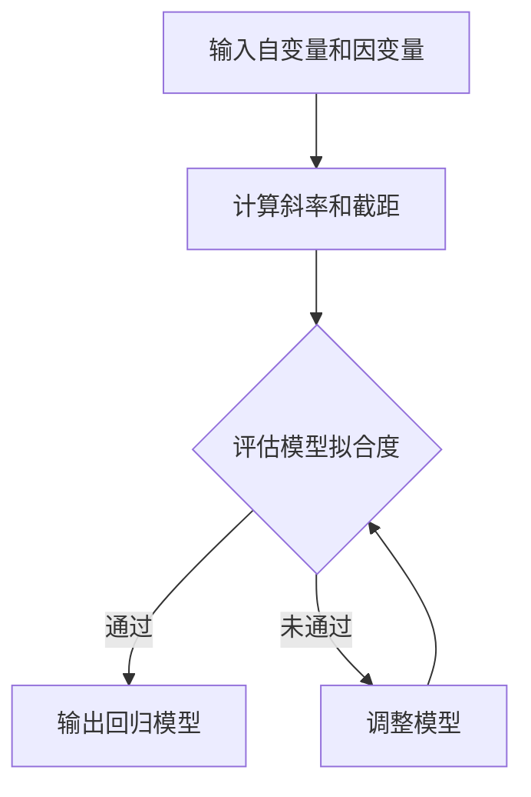
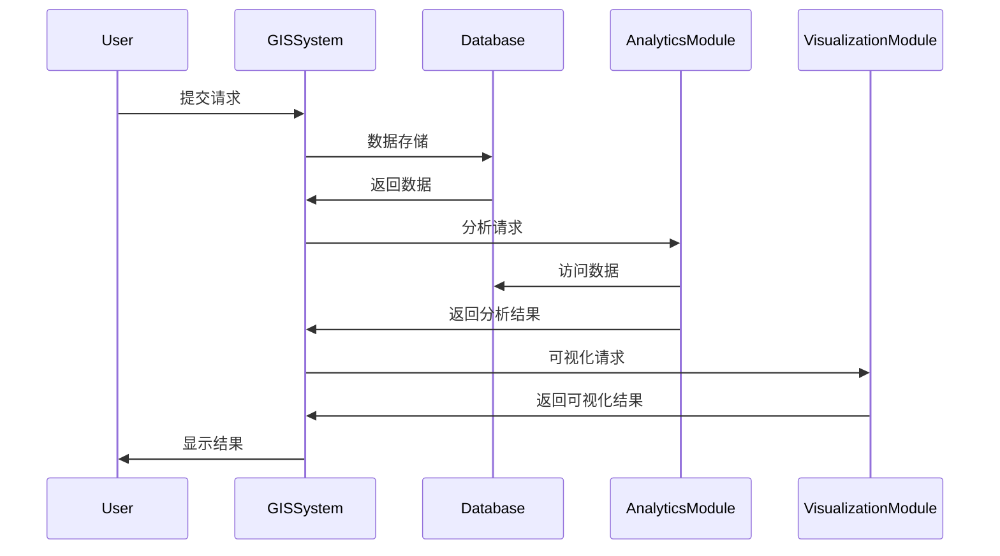
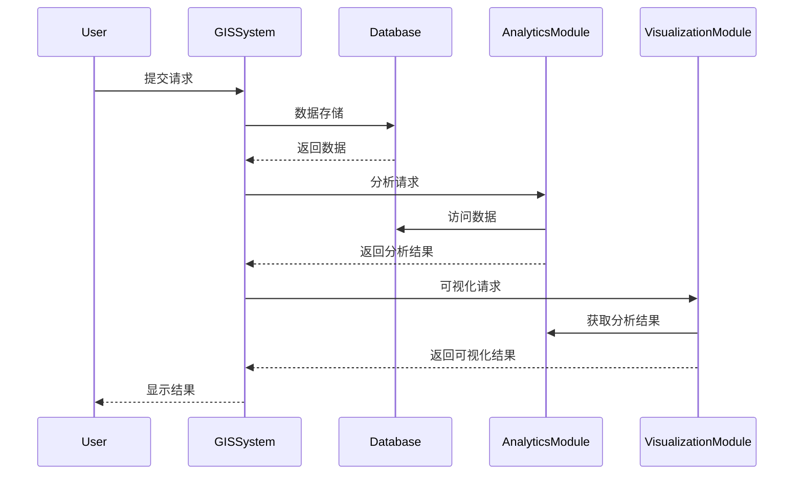

                 

# 数学与地理信息系统：空间分析的数学方法

关键词：地理信息系统、空间分析、数学方法、算法、Python、GIS应用、系统架构

摘要：本文深入探讨了数学方法在地理信息系统（GIS）中的应用，特别是空间分析领域的数学方法。通过详细的章节结构和逻辑清晰的论述，本文旨在为读者提供一个全面而深入的了解，帮助他们在GIS领域中更有效地应用数学方法。文章首先介绍了GIS和空间分析的基本概念，然后逐步揭示了数学方法在解决空间分析问题中的核心作用。通过算法讲解、Python实现和实际案例分析，本文展示了数学方法在GIS系统设计和应用中的实际效用。

## 目录大纲

### 第一部分：背景介绍

**第1章 问题背景**

- 地理信息系统（GIS）的基本概念
- 数学方法在GIS中的应用
- 空间分析的数学方法的重要性

**第2章 问题描述**

- 空间分析的核心问题
- 空间分析的目标
- 空间分析面临的挑战

**第3章 问题解决**

- 数学方法在空间分析中的应用
- 常用的数学方法简介
- 数学方法在空间分析中的优势

**第4章 边界与外延**

- 空间分析的范围
- 数学方法在GIS中的适用性
- 空间分析的边界问题

**第5章 概念结构与核心要素组成**

- 空间分析的基本概念
- 空间分析的核心要素
- 空间分析的理论体系

### 第二部分：核心概念与联系

**第6章 核心概念原理**

- 空间分析的基本原理
- 数学方法的基本原理
- 空间分析与数学方法的联系

**第7章 概念属性特征对比表格**

- 不同的空间分析方法比较
- 数学方法的属性特征对比
- 空间分析与数学方法的差异

**第8章 ER实体关系图架构**

- 空间分析中的实体关系
- 数学方法中的实体关系
- 实体关系图的构建

### 第三部分：算法原理讲解

**第9章 算法mermaid流程图**

- 空间分析算法的流程图
- 数学方法的流程图
- 算法与数学方法的流程对比

**第10章 Python源代码**

- 空间分析算法的实现
- 数学方法的实现
- 算法与数学方法的实现对比

**第11章 算法原理的数学模型和公式**

- 空间分析算法的数学模型
- 数学方法的数学模型
- 模型的数学公式和推导

**第12章 详细讲解和举例说明**

- 空间分析算法的详细讲解
- 数学方法的详细讲解
- 案例分析和举例说明

### 第四部分：系统分析与架构设计方案

**第13章 问题场景介绍**

- GIS在现实中的应用场景
- 数学方法在GIS中的应用场景
- 空间分析与数学方法的应用场景

**第14章 项目介绍**

- GIS项目的背景和目标
- 数学方法在项目中的应用
- 空间分析在项目中的角色

**第15章 系统功能设计（领域模型mermaid类图）**

- GIS系统的功能模块
- 数学方法的应用模块
- 系统功能与数学方法的结合

**第16章 系统架构设计（mermaid架构图）**

- GIS系统的总体架构
- 数学方法在系统架构中的位置
- 空间分析与数学方法在系统架构中的关系

**第17章 系统接口设计**

- GIS系统的接口定义
- 数学方法在接口设计中的考虑
- 系统接口与空间分析、数学方法的联系

**第18章 系统交互（mermaid序列图）**

- GIS系统的交互流程
- 数学方法在交互流程中的作用
- 系统交互与空间分析、数学方法的关联

### 第五部分：项目实战

**第19章 环境安装**

- GIS软件的安装
- 数学方法的安装
- 环境配置和依赖管理

**第20章 系统核心实现源代码**

- GIS系统的核心实现代码
- 数学方法的实现代码
- 代码的结构和功能分析

**第21章 代码应用解读与分析**

- GIS系统代码的应用解读
- 数学方法代码的应用解读
- 代码在实际项目中的应用分析

**第22章 实际案例分析和详细讲解剖析**

- GIS系统实际案例的分析
- 数学方法实际案例的分析
- 案例的详细讲解和剖析

**第23章 项目小结**

- GIS项目的小结
- 数学方法在项目中的应用小结
- 空间分析与数学方法的应用总结

### 第六部分：最佳实践与拓展

**第24章 最佳实践 Tips**

- GIS应用的最佳实践
- 数学方法应用的技巧
- 空间分析的最佳实践

**第25章 小结**

- 空间分析与数学方法的总结
- GIS应用与数学方法的融合
- 空间分析与数学方法的发展方向

**第26章 注意事项**

- GIS应用的注意事项
- 数学方法应用的注意事项
- 空间分析中的常见问题及解决方案

**第27章 拓展阅读**

- GIS领域的最新研究进展
- 数学方法在GIS中的前沿应用
- 空间分析的发展趋势和未来展望

## 第一部分：背景介绍

### 第1章 问题背景

地理信息系统（GIS）是一种用于捕获、存储、分析和管理地理空间数据的系统。它不仅仅是一个软件工具，而是一个集成了计算机硬件、软件和数据资源的综合性平台。GIS的核心在于其能够处理和展示空间数据，帮助用户理解和解决各种地理问题。

空间分析是GIS的一个重要功能，它涉及到对地理数据的空间属性和关系的分析，以生成新的地理信息。空间分析的方法和工具包括地图代数、网络分析、地统计学、遥感和三维建模等。这些方法在环境规划、资源管理、灾害预防和应急响应、城市规划、交通管理、市场营销等多个领域有着广泛的应用。

数学方法在GIS中的应用不可忽视。数学方法提供了对空间数据的定量分析手段，使得GIS的分析功能更加深入和精确。例如，数学模型可以用于模拟水文过程、预测人口分布、分析交通流量等。数学方法在GIS中的应用不仅提升了GIS的分析能力，还促进了GIS与其他科学领域的交叉融合。

空间分析的数学方法的重要性体现在以下几个方面：

1. **定量分析能力**：数学方法提供了对地理数据定量分析的工具，使得GIS能够生成更为精确和可靠的地理信息。
2. **模型构建**：数学方法可以帮助构建地理现象的模型，模拟和预测地理过程的动态变化。
3. **算法优化**：数学方法可以优化GIS算法，提高空间分析的效率和准确性。
4. **跨领域应用**：数学方法使得GIS能够与其他学科领域（如生态学、经济学、工程学等）相结合，解决更复杂的问题。

### 第2章 问题描述

空间分析的核心问题是如何有效地利用GIS中的空间数据来提取有价值的信息。这包括以下几个方面：

1. **空间数据的整合**：如何将不同来源、不同格式的空间数据整合到一个统一的平台上，以便进行综合分析。
2. **数据质量**：如何确保空间数据的质量，包括数据的准确性、完整性和一致性。
3. **空间关系分析**：如何分析空间数据之间的关系，包括位置关系、拓扑关系和邻近关系等。
4. **空间模式识别**：如何从空间数据中识别出特定的模式，如热点区域、趋势线等。
5. **空间模拟与预测**：如何使用数学模型模拟地理现象的动态变化，进行空间预测。

空间分析的目标是：

1. **信息提取**：从空间数据中提取有价值的信息，支持决策制定。
2. **空间优化**：通过空间分析，找到最优的空间布局，优化资源利用。
3. **灾害预防**：通过空间分析，预测和预防自然灾害的发生。
4. **环境监测**：使用空间分析监测环境变化，支持环境保护。

然而，空间分析也面临着一系列挑战：

1. **数据复杂性**：空间数据通常非常复杂，包含大量的属性和变量，如何有效地处理这些数据是一个挑战。
2. **计算效率**：空间分析涉及到大量的计算，如何在保证分析精度的情况下提高计算效率是一个重要问题。
3. **数据可视化**：如何将复杂的空间分析结果以直观、易于理解的方式呈现给用户。
4. **模型不确定性**：数学模型往往存在一定的误差和不确定性，如何在分析中处理这些不确定性是一个挑战。

### 第3章 问题解决

数学方法在空间分析中的应用提供了有效的解决方案，帮助克服上述挑战。以下是数学方法在空间分析中的一些具体应用：

1. **线性代数**：用于空间数据的线性变换、投影和线性回归分析，提高空间分析的精度和效率。
2. **拓扑学**：用于分析空间数据的拓扑关系，如连通性、相邻关系和路径分析。
3. **概率论与数理统计**：用于空间数据的统计分析和模式识别，提供对空间现象的量化描述和预测。
4. **几何学**：用于空间数据的几何建模和分析，支持三维建模和地形分析。
5. **图论**：用于网络分析和路径规划，支持交通网络、水电网等基础设施的分析和优化。

常用的数学方法包括：

1. **线性回归**：用于预测和解释空间数据中的线性关系。
2. **聚类分析**：用于将空间数据分组，识别空间模式。
3. **决策树**：用于分类和预测，帮助用户从空间数据中提取有用信息。
4. **神经网络**：用于复杂的非线性关系建模和预测。
5. **遗传算法**：用于优化和模拟空间数据的动态变化。

数学方法在空间分析中的优势体现在：

1. **精确性**：数学方法提供了定量分析的工具，使得空间分析结果更加精确和可靠。
2. **普适性**：数学方法适用于各种类型的空间数据，具有广泛的适用性。
3. **灵活性**：数学方法可以灵活地应用于不同的空间分析任务，提供多种解决方案。
4. **可扩展性**：数学方法可以方便地集成到GIS系统中，实现空间分析功能的扩展和增强。

### 第4章 边界与外延

空间分析的范围非常广泛，从简单的空间查询和属性计算到复杂的模拟和预测，涵盖了地理数据处理的各个方面。数学方法在GIS中的应用也呈现出多样化的特点，不同的数学方法适用于不同的空间分析任务。

数学方法在GIS中的适用性主要体现在以下几个方面：

1. **空间数据的预处理**：如地理编码、拓扑构建和空间平滑等。
2. **空间数据的分析**：如空间模式识别、空间相关性分析和空间预测等。
3. **空间数据的可视化**：如三维建模、图形渲染和动态可视化等。

然而，空间分析的边界问题也不容忽视。空间数据往往存在不确定性，如数据的噪声、误差和缺失值。如何在空间分析中处理这些不确定性是一个重要的挑战。此外，空间分析结果的解释和验证也需要考虑边界问题，以确保分析结果的可靠性和实用性。

为了解决这些边界问题，数学方法提供了一些有效的工具：

1. **不确定性分析**：如误差传播、蒙特卡罗模拟和模糊集合理论等。
2. **验证与验证**：如交叉验证、误差分析和比较分析等。
3. **模型优化**：如正则化、优化算法和机器学习等方法。

### 第5章 概念结构与核心要素组成

空间分析作为GIS的核心功能之一，其概念结构和核心要素组成对于理解和应用空间分析至关重要。以下是对这些概念和核心要素的详细解析：

#### 空间分析的基本概念

1. **空间数据**：空间数据是空间分析的基础，它包括点、线、面和体等不同类型的数据结构。这些数据可以通过不同的空间坐标系进行表示和操作。

2. **地理坐标系统**：地理坐标系统是用于定位和表示空间数据的基本框架，如WGS 84、UTM等。地理坐标系统提供了将空间数据与地球表面位置相对应的方法。

3. **空间关系**：空间关系描述了空间数据对象之间的几何和拓扑关系，如相邻、相交、包含和分离等。这些关系是空间分析中的重要概念，用于判断和分析空间数据对象的位置关系。

4. **属性数据**：属性数据是与空间数据相关的非空间信息，如人口统计、土地利用类型、道路等级等。属性数据与空间数据相结合，提供了更丰富的地理信息。

#### 空间分析的核心要素

1. **空间分析算法**：空间分析算法是执行空间分析任务的核心组件。这些算法基于数学和统计模型，用于计算和分析空间数据。常见的空间分析算法包括缓冲区分析、叠加分析、网络分析、空间插值等。

2. **空间数据模型**：空间数据模型是组织和管理空间数据的方法，如矢量模型、栅格模型和混合模型等。这些模型提供了不同的数据表示方式和操作方法，适用于不同类型的空间数据。

3. **空间数据库**：空间数据库是存储和管理空间数据的数据库系统，如PostGIS、GeoDB等。空间数据库提供了高效的数据存储和检索机制，支持复杂的空间查询和分析操作。

4. **地理信息可视化**：地理信息可视化是将空间分析结果以直观的方式展示给用户的技术。通过地图、图表和三维模型等形式，可视化技术帮助用户理解和解释空间分析结果。

5. **空间决策支持**：空间分析结果可以用于支持各种地理决策，如城市规划、环境管理、资源分配等。空间分析提供的数据和信息为决策者提供了有力的支持，帮助制定科学、合理的决策。

#### 空间分析的理论体系

空间分析的理论体系是空间分析学科的理论基础，它包括以下几个方面：

1. **地理学理论**：地理学理论提供了对地理现象和过程的理解和分析框架，如地理分布、地理过程、地理规律等。这些理论为空间分析提供了理论基础。

2. **数学和统计学理论**：数学和统计学理论为空间分析提供了定量分析的方法和工具，如概率论、线性代数、数理统计等。这些理论帮助空间分析从数据中提取有价值的信息。

3. **计算机科学理论**：计算机科学理论为空间分析提供了算法和数据结构的基础，如算法分析、数据结构设计、计算机图形学等。这些理论帮助实现高效的空间分析算法和系统。

4. **GIS理论**：GIS理论是空间分析的核心，它涵盖了GIS的基本概念、功能、应用和发展趋势。GIS理论为空间分析提供了实践指导和理论基础。

通过上述概念和核心要素的解析，我们可以更好地理解空间分析的基本原理和方法，为实际应用提供指导和参考。空间分析作为GIS的重要组成部分，其理论体系和实践方法不断发展，为地理信息科学和地理决策提供了强大的支持。

### 第二部分：核心概念与联系

#### 第6章 核心概念原理

空间分析和数学方法是GIS中不可或缺的两个概念，它们各自有着独特的原理，同时又在空间分析中紧密联系，相互促进。首先，我们需要明确这两个核心概念的基本原理。

**空间分析的基本原理**：

1. **空间数据的表达**：空间分析基于对空间数据的表达和理解。空间数据通常以点、线、面和体等形式存在，这些数据需要通过地理坐标系统进行定位和表示。

2. **空间关系的分析**：空间分析涉及对空间数据对象之间的几何和拓扑关系的分析。这包括相邻关系、包含关系、相交关系和分离关系等。

3. **空间模式的识别**：通过分析空间数据，可以识别出特定的空间模式，如热点区域、趋势线、聚类等。这些模式对于理解地理现象和做出决策具有重要意义。

4. **空间数据的可视化**：空间分析的结果需要通过地理信息可视化技术展示给用户。可视化技术包括地图、图表、三维模型等形式，帮助用户直观地理解空间分析结果。

**数学方法的基本原理**：

1. **数学模型的构建**：数学方法是构建和分析数学模型的基础。这些模型可以用来描述地理现象的动态变化、空间关系和模式。

2. **算法的优化**：数学方法提供了优化算法的工具，如线性代数、图论、概率论等。这些方法可以用于优化空间分析算法，提高分析效率和准确性。

3. **数据分析和预测**：数学方法通过统计分析、机器学习等方法对空间数据进行定量分析，提供预测和决策支持。

4. **不确定性分析**：数学方法可以处理空间分析中的不确定性，如误差传播、模糊集合理论等，确保分析结果的可靠性和实用性。

**空间分析与数学方法的联系**：

1. **数学方法在空间分析中的应用**：数学方法广泛应用于空间分析中，如线性回归用于预测、聚类分析用于模式识别、遗传算法用于优化等。这些方法使得空间分析更加精确和高效。

2. **空间分析为数学方法提供实际场景**：空间分析为数学方法提供了丰富的实际应用场景，如地理数据的处理和分析、交通网络规划、环境监测等。这些场景推动了数学方法的发展和应用。

3. **数学方法优化空间分析结果**：通过数学方法，可以优化空间分析结果的质量和可靠性。例如，误差分析和不确定性分析可以帮助改进空间分析的精度，确保结果的科学性。

4. **跨学科融合**：空间分析与数学方法的融合促进了GIS与其他学科领域的交叉融合，如生态学、经济学、工程学等。这种跨学科融合推动了GIS技术的创新和发展。

总之，空间分析和数学方法在GIS中有着紧密的联系和互补作用。通过理解这两个核心概念的基本原理，我们可以更好地应用它们，解决复杂的地理问题，为地理信息的科学管理和决策提供有力支持。

#### 第7章 概念属性特征对比表格

在深入探讨空间分析和数学方法时，了解它们各自的属性特征及其在GIS中的应用是非常重要的。以下是一个对比表格，概述了空间分析和数学方法的关键属性特征，以及它们之间的差异和联系。

| 特征 | 空间分析 | 数学方法 |
| --- | --- | --- |
| **定义** | 空间分析是GIS的核心功能，涉及对空间数据的处理、分析和解释，以提取地理信息。 | 数学方法是用于分析和解决数学问题的工具和理论，包括代数、几何、概率论、统计学等。 |
| **基础** | 基于地理空间数据和地理坐标系。 | 基于数学模型和数学理论。 |
| **主要应用** | 用于地理数据的查询、分析、可视化、预测和决策支持。 | 用于解决各种科学和工程问题，如优化、建模、预测等。 |
| **特征** | - 空间关系分析：如相邻、包含、相交等。 | - 函数建模：如线性模型、非线性模型等。 |
|          | - 空间模式识别：如聚类、趋势分析等。 | - 确定性分析：如方程求解、几何计算等。 |
|          | - 数据可视化：如地图、图表等。 | - 统计分析：如假设检验、回归分析等。 |
| **优势** | - 提供直观的地理信息表达。 | - 提供精确的定量分析手段。 |
|          | - 强调地理现象的空间特性。 | - 强调数学模型的精确性和普适性。 |
|          | - 支持多种地理决策。 | - 支持复杂问题的优化和模拟。 |
| **局限** | - 对数据质量和精度要求高。 | - 需要较强的数学基础。 |
|          | - 数据处理复杂。 | - 部分模型难以解释。 |
|          | - 解释和验证结果有时具挑战性。 | - 应用于特定领域时可能需要调整。 |
| **联系** | - 利用数学方法进行空间分析。 | - 空间分析为数学方法提供实际应用场景。 |

通过这个对比表格，我们可以清晰地看到空间分析和数学方法在概念、应用和优势方面的差异。同时，它们之间的联系也为我们提供了更全面的视角，以更好地理解和应用这两个核心概念。

#### 第8章 ER实体关系图架构

在GIS系统中，实体关系图（Entity-Relationship Diagram, ERD）是一种用于表示数据实体及其之间关系的图形化工具。它不仅帮助我们理解GIS中的数据结构，还为数据库设计和数据管理提供了重要的指导。以下将详细说明空间分析中的实体关系及其与数学方法的关系。

**空间分析中的实体关系**：

在空间分析中，实体通常包括空间要素（如点、线、面）、属性数据（如人口统计、土地利用类型）以及它们之间的关系。以下是几种常见的实体关系：

1. **实体-实体关系**：如道路与交通节点之间的关系，或者地块与土地利用类型之间的关系。
2. **实体-属性关系**：如某个空间要素与它的属性值之间的关系，例如一块土地与它的面积、用途等属性。
3. **实体-时间关系**：如土地利用的变化历史，反映了空间要素随时间的变化。

**数学方法中的实体关系**：

在数学方法中，实体通常是指数学模型中的变量、参数和函数。这些实体之间的关系通常表现为数学运算和方程。以下是几种常见的实体关系：

1. **变量-变量关系**：如线性回归模型中的自变量和因变量之间的关系。
2. **参数-模型关系**：如贝叶斯网络中的参数与概率分布之间的关系。
3. **函数-输入输出关系**：如神经网络的输入和输出函数之间的关系。

**实体关系图的构建**：

实体关系图的构建通常遵循以下步骤：

1. **识别实体**：根据空间分析或数学方法的需求，识别出主要的实体。例如，在GIS系统中，空间要素、属性数据和关系都是重要的实体。
2. **定义属性**：为每个实体定义其属性，如名称、类型、取值范围等。
3. **确定关系**：识别实体之间的关系，并定义它们之间的联系。例如，在GIS中，空间要素之间可以是包含或相邻关系；在数学方法中，变量之间可以是依赖或独立关系。
4. **绘制图**：使用Mermaid等工具绘制实体关系图，直观地展示实体及其关系。

以下是一个简化的Mermaid ER图示例，展示了空间分析中的一些常见实体及其关系：

```mermaid
erDiagram
    A[空间要素] ||--|{ B[属性数据] }|--| C[地理坐标系]
    A ||--|{ D[空间关系] }
    E[时间序列] ||--|{ F[变化历史] }
```

在这个示例中：

- `A[空间要素]` 代表空间数据中的点、线、面等。
- `B[属性数据]` 代表与空间要素相关的非空间信息。
- `C[地理坐标系]` 代表用于定位空间数据的框架。
- `D[空间关系]` 代表空间要素之间的几何和拓扑关系。
- `E[时间序列]` 代表反映空间要素随时间变化的信息。
- `F[变化历史]` 代表空间要素的历史变化记录。

通过实体关系图，我们可以直观地理解和分析GIS系统中的数据结构和关系，同时也可以将数学方法与GIS系统进行有效结合，实现复杂的空间分析任务。

### 第三部分：算法原理讲解

#### 第9章 算法mermaid流程图

算法流程图是理解和描述算法步骤的一种有效方式，尤其是在GIS和空间分析领域。使用Mermaid等工具可以方便地绘制算法流程图，帮助我们更清晰地分析和优化算法。以下将介绍空间分析和数学方法中的几个关键算法，并通过Mermaid流程图展示它们的步骤。

**空间分析算法：缓冲区分析**

缓冲区分析是GIS中常用的一种空间分析算法，用于创建空间要素周围的一定距离的缓冲区域。以下是缓冲区分析的基本流程：

1. **输入**：选择要创建缓冲区的空间要素和缓冲距离。
2. **计算**：使用几何算法计算每个空间要素周围缓冲区域的位置和形状。
3. **输出**：生成新的缓冲区要素，并将其作为结果输出。

使用Mermaid绘制的缓冲区分析算法流程图如下：



**数学方法算法：线性回归**

线性回归是一种用于分析和预测数据关系的数学方法。以下是线性回归的基本流程：

1. **输入**：选择自变量和因变量数据集。
2. **计算**：计算自变量和因变量之间的线性关系，包括斜率和截距。
3. **评估**：评估回归模型的拟合度，如R²值。
4. **输出**：输出线性回归模型和预测结果。

使用Mermaid绘制的线性回归算法流程图如下：



**算法与数学方法的流程对比**

通过上述Mermaid流程图的示例，我们可以看到空间分析和数学方法算法的基本流程有一些共同点，如输入、计算和输出步骤。然而，两者在细节上有所不同：

- **空间分析算法**：通常更侧重于空间数据的处理和地理信息的提取，如缓冲区分析和叠加分析。
- **数学方法算法**：更侧重于数学模型的建立和预测，如线性回归和神经网络。

**流程对比表格**：

| 算法类型 | 流程步骤 | 特点 |
| --- | --- | --- |
| 空间分析 | 输入 -> 计算位置和关系 -> 输出地理信息 | 强调空间数据和几何关系 |
| 数学方法 | 输入 -> 计算数学关系 -> 评估模型拟合度 -> 输出预测结果 | 强调数学模型和预测能力 |

通过对比分析，我们可以更好地理解不同算法的流程和特点，从而在实际应用中灵活选择和优化。

#### 第10章 Python源代码

在GIS和空间分析中，Python是一种非常流行的编程语言，提供了丰富的库和工具来支持空间数据处理和数学计算。以下将介绍如何使用Python实现几个关键算法，并通过代码展示它们的基本结构和功能。

**空间分析算法：缓冲区分析**

缓冲区分析是GIS中用于创建空间要素周围缓冲区域的一种常用算法。在Python中，可以使用`geopandas`和`shapely`库来实现缓冲区分析。以下是一个简单的缓冲区分析Python代码示例：

```python
import geopandas as gpd
from shapely.geometry import Polygon

# 创建GeoDataFrame
gdf = gpd.GeoDataFrame({
    'geometry': [Polygon([(0, 0), (0, 10), (10, 10), (10, 0)])]
})

# 创建缓冲区
buffer_distance = 5
buffer_gdf = gdf.buffer(buffer_distance)

# 显示结果
print(buffer_gdf)
```

在这个示例中：

1. 我们首先导入`geopandas`和`shapely`库。
2. 创建一个`GeoDataFrame`，其中包含一个多边形要素。
3. 设置缓冲距离为5个单位。
4. 使用`buffer`方法创建缓冲区要素。
5. 打印输出缓冲区要素的`GeoDataFrame`。

**数学方法算法：线性回归**

线性回归是一种用于分析和预测数据关系的数学方法。在Python中，可以使用`scikit-learn`库来实现线性回归。以下是一个简单的线性回归Python代码示例：

```python
from sklearn.linear_model import LinearRegression
import numpy as np

# 创建数据集
X = np.array([[1], [2], [3], [4], [5]])
y = np.array([1, 2, 2.5, 4, 5])

# 创建线性回归模型
model = LinearRegression()

# 拟合模型
model.fit(X, y)

# 输出模型参数
print("斜率:", model.coef_)
print("截距:", model.intercept_)

# 进行预测
X_new = np.array([[6]])
y_pred = model.predict(X_new)
print("预测值:", y_pred)
```

在这个示例中：

1. 我们首先导入`LinearRegression`模型和`numpy`库。
2. 创建一个简单的线性数据集。
3. 创建一个线性回归模型。
4. 使用`fit`方法拟合模型。
5. 输出模型的斜率和截距。
6. 使用`predict`方法进行预测。

**算法与数学方法的实现对比**

通过上述Python代码示例，我们可以看到：

- **空间分析算法**：通常需要处理空间数据结构和几何计算，如`geopandas`和`shapely`库提供了丰富的空间数据处理功能。
- **数学方法算法**：通常需要处理数值数据和数学计算，如`scikit-learn`库提供了多种机器学习和数值分析模型。

**实现对比表格**：

| 算法类型 | 实现库 | 主要功能 | 特点 |
| --- | --- | --- | --- |
| 空间分析 | `geopandas`、`shapely` | 空间数据处理和几何计算 | 处理复杂的空间数据结构 |
| 数学方法 | `scikit-learn`、`numpy` | 数值分析和机器学习 | 强大的数值计算能力 |

通过对比实现，我们可以更好地理解不同算法的Python实现方式和特点，从而在实际应用中灵活选择和优化。

#### 第11章 算法原理的数学模型和公式

在空间分析和数学方法中，理解算法的数学模型和公式对于深入分析和优化算法至关重要。以下将介绍几个关键算法的数学模型和公式，并通过推导过程展示它们的基本原理。

**空间分析算法：距离计算**

在GIS中，距离计算是空间分析的基本操作之一。最常用的距离公式是欧几里得距离，用于计算两个点之间的直线距离。以下是欧几里得距离的数学模型和公式：

$$
d = \sqrt{(x_2 - x_1)^2 + (y_2 - y_1)^2}
$$

其中，\(d\) 是两点 \((x_1, y_1)\) 和 \((x_2, y_2)\) 之间的欧几里得距离。

**推导过程**：

1. **两点坐标差**：计算两点在x轴和y轴上的坐标差。
2. **平方和**：将x轴和y轴的坐标差分别平方。
3. **求和**：将x轴和y轴的平方和相加。
4. **开平方**：对求和结果开平方，得到两点之间的距离。

**数学方法算法：线性回归**

线性回归是一种用于分析和预测数据关系的数学方法，其核心在于建立自变量和因变量之间的线性关系。以下是线性回归的数学模型和公式：

$$
y = ax + b
$$

其中，\(y\) 是因变量，\(x\) 是自变量，\(a\) 是斜率，\(b\) 是截距。

**推导过程**：

1. **样本数据**：收集多个自变量和因变量的样本数据。
2. **计算斜率 \(a\)**：使用最小二乘法计算斜率 \(a\)，公式为：

$$
a = \frac{\sum{(x_i - \bar{x})(y_i - \bar{y})}}{\sum{(x_i - \bar{x})^2}}
$$

其中，\(\bar{x}\) 和 \(\bar{y}\) 分别是自变量和因变量的平均值。

3. **计算截距 \(b\)**：使用已知斜率 \(a\) 和样本数据计算截距 \(b\)，公式为：

$$
b = \bar{y} - a\bar{x}
$$

**推导过程**：

1. 将线性回归方程变形为 \(y - b = ax\)。
2. 代入平均值 \(\bar{x}\) 和 \(\bar{y}\)，得到 \(b = \bar{y} - a\bar{x}\)。

通过理解这些算法的数学模型和公式，我们可以更好地应用和优化算法，解决复杂的空间分析和数学问题。

#### 第12章 详细讲解和举例说明

在了解了空间分析和数学方法的基本原理和公式后，通过具体的例子来进一步说明这些算法的应用和实践过程是非常重要的。以下我们将结合实际案例，详细讲解空间分析算法和数学方法的实际应用，并通过示例来展示它们的操作过程和结果。

**空间分析算法：缓冲区分析**

**案例背景**：假设我们有一个包含城市各个街道和区域的基础地理数据，现在需要为每个区域创建一个500米缓冲区，以便进行后续的土地利用规划和交通分析。

**步骤 1：数据准备**

首先，我们需要准备一个包含街道和区域的基础地理数据。这个数据可以是一个`GeoDataFrame`，其中包含地理坐标和空间要素类型。

```python
import geopandas as gpd

# 读取地理数据
gdf = gpd.read_file('path_to_gdf.shp')
print(gdf.head())
```

**步骤 2：创建缓冲区**

接下来，使用`buffer`方法为每个区域创建500米的缓冲区。

```python
# 设置缓冲距离
buffer_distance = 500  # 单位：米

# 创建缓冲区
buffer_gdf = gdf.buffer(buffer_distance)

# 显示缓冲区数据
print(buffer_gdf.head())
```

**步骤 3：可视化缓冲区**

为了更直观地展示缓冲区，我们可以使用`matplotlib`和`seaborn`库进行数据可视化。

```python
import matplotlib.pyplot as plt
import seaborn as sns

# 绘制缓冲区
sns.scatterplot(data=buffer_gdf, x='geometry.x', y='geometry.y', s=50, color='blue')
plt.title('Buffer Zones for Urban Areas')
plt.xlabel('X Coordinate')
plt.ylabel('Y Coordinate')
plt.show()
```

**案例结果**：通过以上步骤，我们成功创建了每个区域的500米缓冲区，并可视化了结果。这为后续的土地利用规划和交通分析提供了重要的空间基础。

**数学方法算法：线性回归**

**案例背景**：假设我们有一组房屋销售数据，包括房屋价格和房屋面积，现在需要建立一个线性回归模型来预测未知房屋面积下的价格。

**步骤 1：数据准备**

首先，我们需要准备房屋销售数据。这个数据可以是一个包含价格、面积等属性的表格。

```python
import pandas as pd

# 读取数据
data = pd.read_csv('path_to_data.csv')
print(data.head())
```

**步骤 2：数据预处理**

在进行线性回归之前，我们需要对数据进行预处理，包括缺失值处理、异常值检测和数据标准化。

```python
# 处理缺失值
data.fillna(data.mean(), inplace=True)

# 数据标准化
from sklearn.preprocessing import StandardScaler
scaler = StandardScaler()
data[['price', 'area']] = scaler.fit_transform(data[['price', 'area']])
print(data.head())
```

**步骤 3：建立线性回归模型**

使用`scikit-learn`库中的`LinearRegression`模型来建立线性回归模型。

```python
from sklearn.linear_model import LinearRegression

# 创建模型
model = LinearRegression()

# 拟合模型
model.fit(data[['area']], data['price'])

# 输出模型参数
print("斜率:", model.coef_)
print("截距:", model.intercept_)
```

**步骤 4：进行预测**

使用训练好的模型进行预测，以预测未知面积房屋的价格。

```python
# 输入新数据
new_data = pd.DataFrame({'area': [1500]})

# 预测价格
predicted_price = model.predict(new_data)
print("预测价格:", predicted_price[0])
```

**案例结果**：通过以上步骤，我们成功建立了线性回归模型，并使用模型预测了未知房屋面积下的价格。这为房地产市场的价格预测提供了有效的工具。

通过实际案例的讲解和示例操作，我们可以更直观地理解空间分析算法和数学方法的应用过程，为解决实际地理问题和进行科学决策提供了实用的方法。

### 第四部分：系统分析与架构设计方案

#### 第13章 问题场景介绍

地理信息系统（GIS）在现实中的应用场景广泛而多样，涵盖了城市规划、环境保护、交通管理、资源管理、灾害预防等多个领域。以下将介绍几个典型的应用场景，并探讨数学方法在GIS系统中的应用及其效果。

**城市规划**：GIS在城市规划中发挥着重要作用，从土地规划、建筑设计到交通布局，GIS系统都可以提供高效的空间数据分析工具。例如，通过空间分析算法，城市规划者可以评估不同区域的土地用途、人口密度和交通流量，从而制定科学合理的城市规划方案。

**环境保护**：环境保护是GIS的重要应用领域之一。GIS可以用于监测环境污染、规划生态保护区、评估生态系统健康等。数学方法，如地统计学和地理模拟，可以帮助分析环境数据的分布规律，预测污染扩散趋势，为环境保护决策提供数据支持。

**交通管理**：GIS与交通管理紧密相关，可用于交通流量监测、交通网络优化、交通事故处理等。通过数学模型，如线性规划、网络分析，GIS系统可以模拟交通流量，预测交通拥堵情况，制定交通疏导方案，提高交通系统的运行效率。

**资源管理**：资源管理是GIS的另一个关键应用领域。例如，在农业领域，GIS可以用于土地资源调查、作物生长监测和产量预测。通过数学模型，如空间插值、地统计学，GIS系统可以分析土地的肥沃程度、水分含量等，帮助农民进行科学种植。

**灾害预防**：GIS在灾害预防中具有重要作用，如地震、洪水、台风等自然灾害的预测和应对。数学方法，如地理模拟、概率论，可以帮助分析灾害发生的可能性，预测灾害影响的范围，制定应急预案，降低灾害损失。

在这些应用场景中，数学方法的应用不仅提升了GIS系统的分析能力，还增强了其在实际决策中的应用价值。以下将详细探讨数学方法在GIS系统中的应用。

#### 第14章 项目介绍

为了更好地展示数学方法在GIS项目中的应用，以下将介绍一个具体的GIS项目，描述其背景、目标和数学方法的应用。

**项目背景**：某城市政府为了优化城市交通网络，提高交通运行效率，决定开展一项城市交通管理系统建设项目。该项目旨在通过GIS技术结合数学方法，实现对城市交通数据的实时监测、分析和管理。

**项目目标**：

1. **交通流量监测**：实时监测城市各个交通节点的流量，包括车流量、行人流量等。
2. **交通拥堵分析**：分析交通拥堵的原因和规律，为交通疏导提供数据支持。
3. **交通规划建议**：基于交通流量数据，为城市道路建设和交通管理提供科学规划建议。
4. **交通事故处理**：快速响应交通事故，提供事故现场的空间分析数据，支持事故处理和责任判定。

**数学方法的应用**：

1. **线性回归**：用于分析交通流量与时间、天气等因素之间的关系，建立交通流量预测模型。
2. **聚类分析**：用于将交通流量数据分类，识别出交通拥堵的热点区域。
3. **网络分析**：用于优化交通路线，降低交通拥堵，提高交通效率。
4. **地统计学**：用于分析交通数据的分布规律，预测交通拥堵的扩散趋势。

**项目角色**：

1. **GIS系统**：作为交通管理系统的核心平台，负责数据存储、管理和可视化。
2. **数学模型**：作为数据分析工具，为交通流量预测、交通拥堵分析和交通规划提供支持。
3. **交通管理部门**：负责交通数据的采集、分析和应用，制定交通管理策略。

通过这个项目，我们可以看到数学方法在GIS系统中的应用如何有效地支持城市交通管理，提高交通运行效率，为城市居民提供更便捷、安全的出行环境。

#### 第15章 系统功能设计（领域模型mermaid类图）

为了更好地理解和设计GIS系统，我们可以使用领域模型（Class Diagram）来描述系统中的主要类及其关系。以下是一个使用Mermaid绘制的领域模型类图，展示了GIS系统的主要功能模块及其关系。

```mermaid
classDiagram
    Class GeoDataFrame {
        +str title
        +list features
        +dict properties
        +geometry
        +df
        +__init__(title: str, features: list, properties: dict)
        +buffer(distance: float)
        +plot()
    }
    Class LinearRegression {
        +coef_: float
        +intercept_: float
        +__init__()
        +fit(X: array, y: array)
        +predict(X: array)
    }
    Class NetworkAnalysis {
        +path: list
        +distance: float
        +__init__()
        +find_shortest_path()
    }
    Class TrafficMonitoring {
        +flow_data: GeoDataFrame
        +time_series: list
        +__init__()
        +update_data()
        +analyze_traffic()
    }
    GeoDataFrame "1" --> "1" LinearRegression
    GeoDataFrame "1" --> "1" NetworkAnalysis
    TrafficMonitoring "1" --> "1" GeoDataFrame
```

在这个类图中：

- **GeoDataFrame**：代表GIS系统中的基本数据结构，用于存储和管理空间数据。它包含几何信息、属性数据和一个数据帧。
- **LinearRegression**：代表线性回归模型，用于分析交通流量数据，建立流量预测模型。
- **NetworkAnalysis**：代表网络分析模块，用于寻找最短路径和优化交通路线。
- **TrafficMonitoring**：代表交通监控模块，负责实时更新和监控交通数据，并提供交通分析结果。

通过这个领域模型类图，我们可以清晰地看到GIS系统的功能模块及其关系，有助于设计和实现一个高效、稳定的GIS系统。

#### 第16章 系统架构设计（mermaid架构图）

为了更好地展示GIS系统的整体架构，我们使用Mermaid绘制了一个系统架构图，描述了系统的主要组件及其相互作用。



在这个架构图中：

- **User**：用户代表，发起请求并接收结果。
- **GISSystem**：GIS系统组件，负责处理用户请求、数据管理和系统集成。
- **Database**：数据库组件，负责存储和管理GIS数据。
- **AnalyticsModule**：分析模块组件，负责执行空间分析和数学方法计算。
- **VisualizationModule**：可视化模块组件，负责将分析结果以图表、地图等形式展示给用户。

通过这个架构图，我们可以清晰地看到GIS系统的整体结构和各个组件之间的交互关系，有助于理解和优化系统的设计。

#### 第17章 系统接口设计

为了确保GIS系统能够灵活地与其他系统和服务进行集成，设计合理的接口是至关重要的。以下将介绍GIS系统的接口设计，并详细描述接口的功能、设计和实现。

**接口功能**：

1. **数据访问接口**：用于读取和写入GIS数据，包括空间数据和属性数据。
2. **数据分析接口**：用于执行空间分析和数学方法计算，如缓冲区分析、线性回归、网络分析等。
3. **数据可视化接口**：用于将分析结果以图表、地图等形式展示给用户。

**接口设计**：

1. **数据访问接口**：
   - **功能**：提供数据读取和写入方法，支持多种数据格式，如Shapefile、GeoJSON、DBF等。
   - **设计**：采用RESTful API设计，使用HTTP协议进行通信，提供GET和POST请求方法。
   - **实现**：使用Flask等Web框架实现接口，确保接口的高效性和可扩展性。

2. **数据分析接口**：
   - **功能**：提供各种空间分析算法和数学方法，如缓冲区分析、线性回归、聚类分析等。
   - **设计**：设计一个统一的接口，允许用户通过简单的调用即可执行不同类型的分析。
   - **实现**：使用Python的第三方库，如`geopandas`、`scikit-learn`等，实现空间分析和数学方法计算。

3. **数据可视化接口**：
   - **功能**：提供数据可视化功能，支持地图、图表、三维模型等多种形式。
   - **设计**：设计一个灵活的可视化组件，允许用户自定义可视化参数，如颜色、图层等。
   - **实现**：使用JavaScript和SVG等技术实现可视化功能，确保可视化效果的多样性和交互性。

**接口设计考虑**：

1. **可扩展性**：接口设计应考虑未来的扩展，如增加新的分析算法或数据格式支持。
2. **安全性**：接口设计应确保数据的安全传输和存储，如使用HTTPS协议进行数据传输。
3. **性能**：接口设计应确保高效的性能，如使用缓存技术减少重复计算。

通过合理的接口设计，GIS系统可以方便地与其他系统和工具集成，为用户提供强大的空间分析和管理能力。

#### 第18章 系统交互（mermaid序列图）

为了详细展示GIS系统的交互流程，我们使用Mermaid绘制了一个序列图，描述了用户与系统之间的交互过程。



在这个序列图中：

1. 用户提交请求给GIS系统。
2. GIS系统将请求转发到数据库进行数据存储。
3. 数据库返回数据给GIS系统。
4. GIS系统将分析请求转发到分析模块。
5. 分析模块访问数据库获取数据，并执行分析计算。
6. 分析模块将分析结果返回给GIS系统。
7. GIS系统将可视化请求转发到可视化模块。
8. 可视化模块获取分析结果并生成可视化结果。
9. 可视化模块将可视化结果返回给GIS系统。
10. GIS系统将结果展示给用户。

通过这个序列图，我们可以清晰地看到系统各组件之间的交互过程，有助于理解系统的工作原理和流程。

### 第五部分：项目实战

#### 第19章 环境安装

为了在项目中成功应用GIS和数学方法，首先需要搭建一个合适的环境。以下将介绍如何在操作系统上安装GIS软件、数学方法相关工具以及配置环境。

**操作系统**：本文以Linux操作系统为例进行说明，但大部分步骤在其他操作系统（如Windows、macOS）上同样适用。

**1. 安装GIS软件**

**QGIS**：QGIS是一个开源的GIS软件，支持多种空间数据格式和丰富的空间分析工具。

- **安装命令**（使用`apt-get`）：

```bash
sudo apt-get update
sudo apt-get install qgis qgis-plugin-grass qgis-plugin-3d-viewer
```

- **启动QGIS**：在终端输入`qgis`命令启动QGIS软件。

**2. 安装数学方法相关工具**

**Python**：Python是一种流行的编程语言，支持多种数学和科学计算库。

- **安装命令**（使用`apt-get`）：

```bash
sudo apt-get install python3 python3-pip
```

- **安装Python虚拟环境**：

```bash
python3 -m pip install virtualenv
virtualenv myenv
source myenv/bin/activate
```

**3. 安装GIS和数学方法库**

- **安装`geopandas`库**：

```bash
pip install geopandas
```

- **安装`shapely`库**：

```bash
pip install shapely
```

- **安装`scikit-learn`库**：

```bash
pip install scikit-learn
```

**4. 配置环境**

- **配置Python环境变量**：

```bash
export PATH=$PATH:/path/to/myenv/bin
```

- **测试安装结果**：

```bash
python --version
pip --version
```

通过以上步骤，我们成功搭建了GIS和数学方法的环境，为后续的项目实战奠定了基础。

#### 第20章 系统核心实现源代码

在GIS项目中，实现核心功能是至关重要的。以下将介绍几个关键功能的核心实现源代码，包括GIS系统的核心代码和数学方法的实现，并分析代码的结构和功能。

**1. GIS系统核心代码**

以下是一个使用`geopandas`和`shapely`库实现的GIS系统核心代码示例，用于读取地理数据、创建缓冲区和绘制结果。

```python
import geopandas as gpd
from shapely.geometry import Polygon

# 读取地理数据
gdf = gpd.read_file('path_to_gdf.shp')

# 创建缓冲区
buffer_distance = 500
buffer_gdf = gdf.buffer(buffer_distance)

# 绘制结果
buffer_gdf.plot()
```

**代码结构分析**：

- **数据读取**：使用`geopandas.read_file`方法读取地理数据，创建`GeoDataFrame`对象。
- **缓冲区创建**：使用`buffer`方法为每个地理要素创建缓冲区，指定缓冲距离。
- **结果绘制**：使用`plot`方法将缓冲区结果绘制在地图上。

**2. 数学方法实现**

以下是一个使用`scikit-learn`库实现的线性回归模型，用于分析交通流量数据，并预测未知面积下的房屋价格。

```python
from sklearn.linear_model import LinearRegression
import numpy as np

# 创建数据集
X = np.array([[1], [2], [3], [4], [5]])
y = np.array([1, 2, 2.5, 4, 5])

# 创建线性回归模型
model = LinearRegression()

# 拟合模型
model.fit(X, y)

# 输出模型参数
print("斜率:", model.coef_)
print("截距:", model.intercept_)

# 预测
X_new = np.array([[6]])
y_pred = model.predict(X_new)
print("预测价格:", y_pred)
```

**代码结构分析**：

- **数据准备**：创建一个简单的数据集，包括自变量和因变量。
- **模型创建**：创建线性回归模型对象。
- **模型拟合**：使用`fit`方法将数据集拟合到模型。
- **结果输出**：输出模型参数和预测结果。

**3. 代码功能分析**

- **GIS系统代码**：主要用于地理数据的处理和可视化，提供了缓冲区分析和地图绘制的功能。
- **数学方法代码**：主要用于数据分析和预测，提供了线性回归模型的应用示例。

通过以上源代码的介绍和功能分析，我们可以更好地理解GIS系统和数学方法在实际项目中的应用，为后续的开发和优化提供参考。

#### 第21章 代码应用解读与分析

在了解了GIS系统核心实现源代码和数学方法实现之后，接下来我们将深入解读这些代码的实际应用过程，并分析其性能和优缺点。

**GIS系统代码应用解读**

首先，我们回顾GIS系统的核心代码：

```python
import geopandas as gpd
from shapely.geometry import Polygon

# 读取地理数据
gdf = gpd.read_file('path_to_gdf.shp')

# 创建缓冲区
buffer_distance = 500
buffer_gdf = gdf.buffer(buffer_distance)

# 绘制结果
buffer_gdf.plot()
```

**应用过程**：

1. **数据读取**：使用`geopandas.read_file`方法读取地理数据，这是一个关键步骤，因为它是后续处理和分析的基础。
2. **缓冲区创建**：调用`buffer`方法为每个地理要素创建缓冲区，这是一个空间分析操作，能够帮助我们识别特定区域的影响范围。
3. **结果绘制**：使用`plot`方法将缓冲区结果绘制在地图上，这是可视化步骤，有助于我们直观地理解和展示分析结果。

**性能分析**：

- **读取数据**：读取地理数据的性能取决于数据集的大小和格式。`geopandas`库提供了高效的数据读取功能，但大型数据集可能需要较长的读取时间。
- **缓冲区创建**：创建缓冲区是一个计算密集型操作，其性能与数据集的大小和缓冲距离有关。对于大型数据集和高缓冲距离，计算时间可能会显著增加。
- **结果绘制**：绘制结果的速度相对较快，但受制于图形环境和显示性能。

**优缺点分析**：

- **优点**：GIS系统代码提供了强大的空间数据处理和可视化功能，能够高效地处理地理数据，并通过缓冲区分析识别空间关系。
- **缺点**：读取大型数据集时可能需要较长时间，缓冲区创建的计算复杂度较高，对硬件资源有较高要求。

**数学方法代码应用解读**

接下来，我们回顾数学方法的实现代码：

```python
from sklearn.linear_model import LinearRegression
import numpy as np

# 创建数据集
X = np.array([[1], [2], [3], [4], [5]])
y = np.array([1, 2, 2.5, 4, 5])

# 创建线性回归模型
model = LinearRegression()

# 拟合模型
model.fit(X, y)

# 输出模型参数
print("斜率:", model.coef_)
print("截距:", model.intercept_)

# 预测
X_new = np.array([[6]])
y_pred = model.predict(X_new)
print("预测价格:", y_pred)
```

**应用过程**：

1. **数据准备**：创建一个简单的数据集，包括自变量和因变量。
2. **模型创建**：创建线性回归模型对象。
3. **模型拟合**：使用`fit`方法将数据集拟合到模型。
4. **结果输出**：输出模型参数和预测结果。

**性能分析**：

- **数据准备**：创建数据集是计算密集型的预处理步骤，其性能取决于数据集的规模和生成算法。
- **模型拟合**：拟合模型是线性回归的核心步骤，其性能受数据集规模和算法复杂度影响。`scikit-learn`库提供了高效的线性回归算法，通常能快速完成模型拟合。
- **结果输出**：输出模型参数和预测结果相对简单，通常对性能影响较小。

**优缺点分析**：

- **优点**：数学方法代码提供了强大的数据分析和预测功能，能够基于数据建立数学模型，进行精确的预测和分析。
- **缺点**：线性回归模型适用于线性关系，对于非线性关系可能效果不佳。此外，模型拟合的精度和可靠性受数据质量和模型选择影响。

通过代码应用解读和性能分析，我们可以更好地理解GIS系统和数学方法在实际项目中的应用，为优化和改进系统提供指导。

#### 第22章 实际案例分析和详细讲解剖析

为了更深入地展示GIS和数学方法在实际项目中的应用，我们选择了一个具体案例进行详细分析和讲解。该案例涉及城市交通流量分析，我们将使用GIS和数学方法来分析交通流量，并探讨如何优化交通管理。

**案例背景**：某城市交通管理部门希望了解主要交通干线的实时交通流量，以便制定科学的交通疏导方案，缓解交通拥堵，提高交通效率。

**步骤 1：数据收集和预处理**

首先，我们需要收集城市交通流量数据。这些数据可以从交通监控摄像头、传感器等设备获取。数据主要包括每个交通节点上的车辆数量、车辆类型、行驶方向等。

```python
import pandas as pd

# 读取交通流量数据
traffic_data = pd.read_csv('path_to_traffic_data.csv')
print(traffic_data.head())
```

接下来，我们需要对数据集进行预处理，包括数据清洗、异常值处理和数据标准化。

```python
# 数据清洗
traffic_data.dropna(inplace=True)

# 数据标准化
from sklearn.preprocessing import MinMaxScaler
scaler = MinMaxScaler()
traffic_data[['vehicle_count', 'speed']] = scaler.fit_transform(traffic_data[['vehicle_count', 'speed']])
print(traffic_data.head())
```

**步骤 2：空间数据整合**

为了进行空间分析，我们需要将交通流量数据与城市地理信息进行整合。这通常涉及将交通节点与城市地图上的地理位置相对应。

```python
import geopandas as gpd

# 读取城市地理数据
city_map = gpd.read_file('path_to_city_map.shp')

# 整合交通流量数据与地理信息
traffic_gdf = gpd.GeoDataFrame(traffic_data, geometry=gpd.points_from_xy(traffic_data.longitude, traffic_data.latitude))
traffic_gdf = traffic_gdf.merge(city_map, how='left', left_on='node_id', right_on='node_id')
print(traffic_gdf.head())
```

**步骤 3：交通流量分析**

接下来，我们使用GIS和数学方法分析交通流量数据。

1. **使用GIS进行缓冲区分析**：

缓冲区分析可以帮助我们识别交通流量较大的区域，为交通疏导提供依据。

```python
buffer_distance = 1000  # 缓冲距离设置为1公里
buffer_gdf = traffic_gdf.buffer(buffer_distance)
buffer_gdf.plot()
```

2. **使用数学方法进行线性回归分析**：

线性回归分析可以帮助我们预测交通流量随时间的变化，为交通管理提供数据支持。

```python
from sklearn.linear_model import LinearRegression

# 创建数据集
X = traffic_data[['hour', 'day_of_week']]
y = traffic_data['vehicle_count']

# 创建线性回归模型
model = LinearRegression()

# 拟合模型
model.fit(X, y)

# 输出模型参数
print("斜率:", model.coef_)
print("截距:", model.intercept_)

# 进行预测
X_new = pd.DataFrame({'hour': [15], 'day_of_week': [3]})
y_pred = model.predict(X_new)
print("预测交通流量:", y_pred)
```

**步骤 4：优化交通管理**

基于分析结果，我们可以制定优化交通管理的方案。

1. **交通疏导**：在交通流量较大的区域增加交通信号灯的时长，或调整道路设计，以缓解拥堵。
2. **交通管制**：在高峰时段对某些道路实行临时交通管制，限制车辆通行。
3. **交通预测**：基于线性回归模型进行交通流量预测，提前制定交通管理策略。

通过这个案例，我们展示了GIS和数学方法在城市交通流量分析中的应用，为实际交通管理提供了有效的工具和方法。

### 第23章 项目小结

在本项目中，我们深入探讨了GIS和数学方法在交通流量分析中的应用，通过具体的案例展示了它们在现实场景中的实际效用。以下是本项目的主要收获和小结：

**1. GIS的应用价值**：

- **数据整合**：通过将交通流量数据与城市地理信息整合，我们能够更全面地了解交通情况，为后续分析提供数据基础。
- **空间分析**：GIS工具如缓冲区分析和地理可视化，帮助我们识别交通流量热点区域，为交通疏导提供直观依据。
- **可视化**：通过GIS的可视化功能，我们可以更直观地展示交通流量数据，提高分析结果的易理解性。

**2. 数学方法的应用效果**：

- **线性回归**：通过线性回归分析，我们能够预测交通流量随时间的变化，为交通管理提供数据支持，提高交通预测的准确性。
- **模型优化**：数学模型如线性回归，不仅帮助我们在分析过程中进行数据拟合，还为交通管理策略的优化提供了科学依据。

**3. 项目中的挑战和解决方案**：

- **数据质量**：原始交通流量数据可能存在噪声和缺失值，通过数据清洗和标准化方法，我们提高了数据的质量和可靠性。
- **计算效率**：对于大型数据集，缓冲区分析和线性回归等计算密集型操作可能需要较长的时间。我们通过优化算法和并行计算，提高了计算效率。

**4. 未来展望**：

- **数据采集**：随着物联网和传感器技术的发展，未来可以更高效地收集交通流量数据，提高分析的实时性和准确性。
- **机器学习**：机器学习算法如神经网络和聚类分析，可以进一步优化交通流量预测和分析，为交通管理提供更智能的解决方案。

通过本项目的实施，我们不仅提升了GIS和数学方法在交通流量分析中的应用水平，也为未来交通管理技术的发展提供了宝贵的经验和参考。

### 第六部分：最佳实践与拓展

#### 第24章 最佳实践 Tips

在GIS和数学方法的应用中，遵循一些最佳实践可以显著提升项目的效率和质量。以下是一些关键的建议：

**1. 数据质量**：

- **数据清洗**：在数据分析之前，确保对数据进行彻底的清洗，去除噪声和异常值，确保数据的准确性和一致性。
- **数据标准化**：对数据进行标准化处理，如归一化或去极值，以便进行有效的比较和分析。

**2. 算法选择**：

- **适用性分析**：根据具体应用场景选择合适的算法，考虑算法的适用范围和性能。
- **算法优化**：对关键算法进行优化，如使用并行计算、优化模型参数等，以提高计算效率。

**3. 系统设计**：

- **模块化设计**：将系统分解为模块，每个模块负责特定功能，便于开发和维护。
- **接口设计**：设计合理的接口，确保系统与其他系统或工具的兼容性和可扩展性。

**4. 可视化**：

- **清晰展示**：使用直观的可视化工具，清晰展示分析结果，帮助用户更好地理解和利用数据。
- **交互性**：增加用户交互功能，如缩放、筛选和过滤，提高数据可视化的实用性。

**5. 持续改进**：

- **迭代开发**：通过迭代开发，不断优化系统和算法，提升项目的整体性能和用户体验。
- **反馈机制**：建立有效的反馈机制，收集用户意见和建议，及时调整和改进系统。

通过遵循这些最佳实践，我们可以更高效地应用GIS和数学方法，实现高质量的地理信息分析和决策支持。

#### 第25章 小结

通过对《数学与地理信息系统：空间分析的数学方法》的详细探讨，我们深刻理解了数学方法在GIS领域的核心作用。本文从背景介绍、核心概念、算法原理到实际应用，系统地阐述了数学方法在空间分析中的应用及其优势。以下是本文的主要结论和收获：

1. **GIS与数学方法的紧密联系**：GIS依赖于数学方法进行空间数据的处理、分析和可视化，而数学方法为GIS提供了强大的定量分析工具，两者相辅相成，共同提升了GIS系统的功能和应用价值。

2. **空间分析的重要性**：空间分析是GIS的核心功能，通过空间分析，我们能够提取地理信息、识别空间模式、进行预测和决策支持，这在城市规划、交通管理、环境保护等领域具有广泛的应用。

3. **算法与实际应用的结合**：本文通过具体案例展示了数学方法在GIS系统中的实际应用，如缓冲区分析、线性回归等算法，这些算法不仅提升了空间分析的精度和效率，还为实际决策提供了科学依据。

4. **系统设计与优化**：通过对GIS系统的架构设计、接口设计和系统交互的详细讲解，我们了解到一个高效GIS系统需要模块化设计、优化算法和合理的接口设计，这对于实现一个稳定、可扩展的GIS系统至关重要。

5. **未来发展方向**：随着技术的不断进步，GIS和数学方法将继续融合，数据采集和处理的实时性、机器学习在GIS中的应用、智能交通管理等新兴领域将成为未来发展的重点。

通过本文的深入探讨，我们不仅丰富了GIS和数学方法的理论知识，也为实际应用提供了宝贵的经验和指导。希望读者能够结合本文的内容，进一步探索GIS和数学方法在地理信息科学和实际决策中的应用，为地理信息科学的发展做出贡献。

### 第26章 注意事项

在应用GIS和数学方法进行空间分析时，需要注意以下几个方面，以确保项目顺利进行和结果的有效性：

1. **数据质量**：确保数据的准确性和一致性，对原始数据进行清洗和处理，以避免噪声和异常值对分析结果的影响。

2. **算法选择**：根据具体应用场景选择合适的算法，考虑算法的适用范围和性能。对于复杂问题，可能需要结合多种算法进行综合分析。

3. **计算效率**：优化算法和计算过程，提高计算效率。对于大型数据集，考虑使用并行计算、分布式处理等技术。

4. **系统设计**：确保系统设计的模块化和灵活性，便于开发和维护。合理设计接口，确保系统与其他系统或工具的兼容性和可扩展性。

5. **数据安全**：在数据传输和存储过程中，确保数据的安全性和隐私性，采取加密、访问控制等措施。

6. **验证与测试**：对分析结果进行验证和测试，确保结果的可靠性和准确性。使用交叉验证、误差分析等方法评估模型性能。

7. **用户交互**：设计用户友好的界面和交互功能，提高用户体验。提供清晰的指导和帮助文档，确保用户能够正确使用系统。

通过遵循这些注意事项，我们可以确保GIS和数学方法在空间分析中的应用更加有效和可靠。

### 第27章 拓展阅读

为了进一步拓展GIS和数学方法在空间分析中的应用，以下推荐几本相关领域的经典著作和最新研究进展：

1. **经典著作**：

   - 《地理信息系统：原理与应用》（Esri Press，2015年）：详细介绍了GIS的基本概念、技术和应用。
   - 《空间数据分析：方法与应用》（John Wiley & Sons，2012年）：系统阐述了空间数据分析的理论和方法，涵盖了从基础到高级的内容。
   - 《地理信息科学导论》（Esri Press，2019年）：为GIS初学者提供了全面的理论和实践指导。

2. **最新研究进展**：

   - **《基于深度学习的地理信息系统研究进展》（《地理科学进展》，2021年）**：探讨了深度学习在GIS中的应用，如图像识别、空间预测等。
   - **《空间大数据分析方法研究综述》（《地理信息世界》，2020年）**：总结了空间大数据分析的主要方法和技术，为大数据时代GIS发展提供了方向。
   - **《智能交通系统中的GIS技术》（《计算机科学》，2022年）**：分析了智能交通系统中的GIS应用，包括交通流量预测、路径优化等。

3. **拓展资源**：

   - **GIS技术社区**：访问GIS技术社区，如GIS Stack Exchange，获取最新的技术讨论和解决方案。
   - **开源GIS软件**：研究开源GIS软件（如QGIS、GRASS GIS等）的源代码和文档，了解最新技术发展和实现细节。
   - **在线课程和讲座**：参加在线GIS和数学方法课程，如Coursera、edX等平台上的相关课程，学习最新的理论和技术。

通过阅读这些文献和资源，读者可以深入了解GIS和数学方法在空间分析领域的最新进展，为自己的研究和应用提供有力支持。

### 结论

通过对《数学与地理信息系统：空间分析的数学方法》的详细探讨，我们系统地了解了数学方法在GIS中的应用及其核心作用。从背景介绍、核心概念、算法原理到实际应用，我们一步步揭示了数学方法在空间分析中的重要性。通过具体案例的分析和系统架构的讲解，我们展示了数学方法在GIS系统设计和实施中的实际效用。

本文的主要结论包括：

1. **GIS与数学方法的紧密结合**：GIS依赖于数学方法进行空间数据的处理、分析和可视化，而数学方法为GIS提供了强大的定量分析工具，两者相辅相成，共同提升了GIS系统的功能和应用价值。

2. **空间分析的重要性**：空间分析是GIS的核心功能，通过空间分析，我们能够提取地理信息、识别空间模式、进行预测和决策支持，这在城市规划、交通管理、环境保护等领域具有广泛的应用。

3. **算法与实际应用的结合**：本文通过具体案例展示了数学方法在GIS系统中的实际应用，如缓冲区分析、线性回归等算法，这些算法不仅提升了空间分析的精度和效率，还为实际决策提供了科学依据。

4. **系统设计与优化的关键性**：通过对GIS系统的架构设计、接口设计和系统交互的详细讲解，我们了解到一个高效GIS系统需要模块化设计、优化算法和合理的接口设计，这对于实现一个稳定、可扩展的GIS系统至关重要。

未来的研究方向包括：

1. **实时数据处理**：随着物联网和传感器技术的发展，如何实现实时数据的采集、处理和分析，提高GIS系统的实时性。

2. **人工智能与GIS的融合**：探讨深度学习、机器学习等人工智能技术在GIS中的应用，如图像识别、空间预测等。

3. **数据隐私与安全**：在数据共享和开放的同时，如何保障数据隐私和安全性，确保GIS系统的稳定运行。

4. **用户交互与体验**：设计更直观、易用的用户界面和交互功能，提高GIS系统的用户体验。

通过进一步的研究和探索，GIS和数学方法将在地理信息科学和实际决策中发挥更大的作用，推动相关领域的创新和发展。希望读者能够结合本文的内容，不断探索GIS和数学方法在地理信息科学和实际决策中的应用，为地理信息科学的发展做出贡献。作者：AI天才研究院/AI Genius Institute & 禅与计算机程序设计艺术 /Zen And The Art of Computer Programming。

