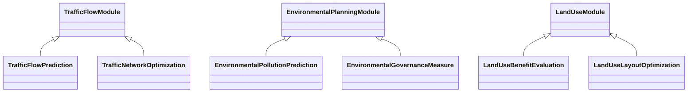
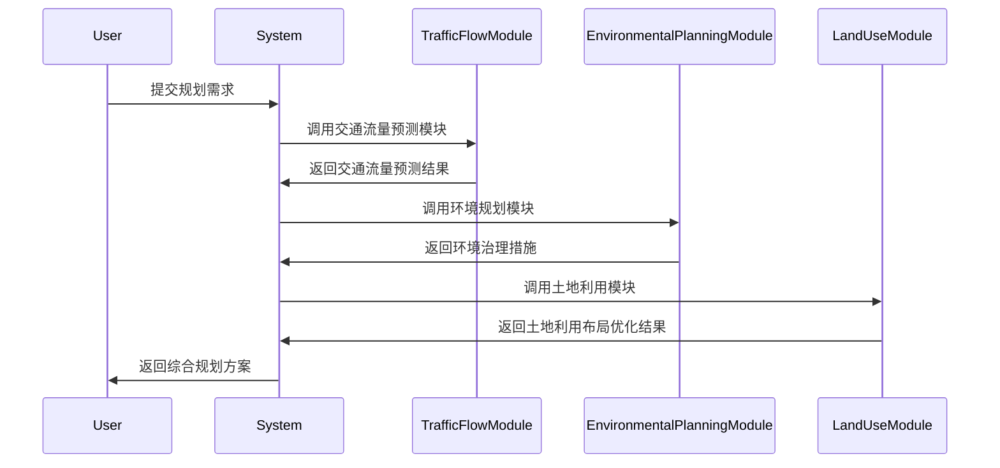

                 

### 数学与城市规划：城市发展的数学模型

**关键词：**城市规划、数学模型、城市发展、交通流、人口增长、环境规划

**摘要：**本文深入探讨了数学模型在城市规划中的应用，阐述了数学模型在解决城市发展过程中所面临的挑战和问题的优势。通过逐步分析交通流、人口增长和环境规划等核心问题，本文展示了数学模型如何为城市规划提供科学依据和有效工具，以实现城市的可持续发展。

## 目录大纲

### 第一部分：引言与背景

#### 第1章 问题背景与核心概念

##### 1.1 城市发展问题的提出
1. 城市化进程中的挑战
2. 城市规划的必要性

##### 1.2 数学模型在城市规划中的应用
1. 数学模型概述
2. 数学模型在城市规划中的优势

##### 1.3 核心概念与联系
1. 城市发展的核心概念
2. 数学模型与城市规划的关联

### 第二部分：数学模型的基础理论

#### 第2章 数学模型的基础理论

##### 2.1 数学模型的基本原理
1. 数学模型的概念
2. 数学模型的构成要素

##### 2.2 数学模型在空间分析中的应用
1. 空间分析的基本概念
2. 空间分析的方法与工具

##### 2.3 数学模型在时间序列分析中的应用
1. 时间序列分析的基本概念
2. 时间序列分析的方法与工具

### 第三部分：城市发展的数学模型

#### 第3章 城市交通流的数学模型

##### 3.1 交通流模型的基本原理
1. 交通流模型的概念
2. 交通流模型的构成要素

##### 3.2 交通流模型的应用实例
1. 城市交通拥堵分析
2. 交通流量预测

#### 第4章 城市人口增长的数学模型

##### 4.1 人口增长模型的基本原理
1. 人口增长模型的概念
2. 人口增长模型的构成要素

##### 4.2 人口增长模型的应用实例
1. 人口预测与规划
2. 人口流动分析

#### 第5章 城市环境规划的数学模型

##### 5.1 环境规划模型的基本原理
1. 环境规划模型的概念
2. 环境规划模型的构成要素

##### 5.2 环境规划模型的应用实例
1. 噪音污染控制
2. 水资源管理

#### 第6章 城市土地使用的数学模型

##### 6.1 土地使用模型的基本原理
1. 土地使用模型的概念
2. 土地使用模型的构成要素

##### 6.2 土地使用模型的应用实例
1. 城市扩展规划
2. 土地利用效益分析

#### 第7章 综合数学模型在城市规划中的应用

##### 7.1 综合数学模型的概念
1. 综合数学模型的定义
2. 综合数学模型的特点

##### 7.2 综合数学模型的应用案例
1. 城市综合规划
2. 城市可持续发展评估

### 第四部分：实践与应用

#### 第8章 数学模型在城市规划实践中的应用

##### 8.1 项目介绍
1. 项目背景
2. 项目目标

##### 8.2 系统设计与实现
1. 领域模型设计
2. 系统架构设计

##### 8.3 项目实施与评估
1. 项目实施过程
2. 项目效果评估

#### 第9章 数学模型在城市规划中的未来展望

##### 9.1 未来发展趋势
1. 新技术的应用
2. 城市智能规划

##### 9.2 挑战与机遇
1. 存在的挑战
2. 应对策略与机遇

### 参考文献

### 附录

#### 附录A 数学公式与符号表

#### 附录B 术语解释

## 第一部分：引言与背景

### 第1章 问题背景与核心概念

#### 1.1 城市发展问题的提出

城市化进程是现代社会发展的重要趋势，随着人口的增长和城市化的加速，城市发展面临着一系列的挑战。首先，城市化进程中出现了交通拥堵、环境污染、资源短缺等问题，这些问题严重影响了城市居民的生活质量和城市的可持续发展。其次，城市规模的不断扩大和人口密度的增加导致了城市空间的紧张和土地利用的冲突。如何合理规划和设计城市，提高城市空间的利用效率和居民的生活质量，成为城市规划面临的重要问题。

#### 1.1.1 城市化进程中的挑战

城市化进程中的挑战主要体现在以下几个方面：

1. 交通拥堵：随着私家车数量的增加，城市交通拥堵问题日益严重，影响了居民的出行效率和城市的工作效率。
2. 环境污染：城市工业化和人口的快速增长导致空气、水和土壤的污染，对居民健康和生态环境造成了严重的影响。
3. 资源短缺：城市人口的增长和城市化进程导致水资源、能源等资源的短缺，影响了城市的可持续发展。
4. 城市空间紧张：城市规模的不断扩大和人口密度的增加导致城市空间的紧张，土地利用的冲突加剧。

#### 1.1.2 城市规划的必要性

城市规划是解决城市发展问题的重要手段，通过科学规划和设计，可以有效地应对城市化进程中的挑战，提高城市空间的利用效率和居民的生活质量。城市规划的必要性体现在以下几个方面：

1. 合理利用城市空间：城市规划可以帮助合理分配城市空间，避免城市空间的浪费和冲突，提高城市空间的利用效率。
2. 改善交通状况：通过科学规划交通网络，可以有效地缓解交通拥堵问题，提高居民的出行效率。
3. 优化资源配置：城市规划可以帮助合理配置城市资源，如水资源、能源等，提高资源的利用效率，促进城市的可持续发展。
4. 提高居民生活质量：通过合理规划城市公共设施、公园绿地等，可以改善居民的生活环境，提高居民的生活质量。

#### 1.2 数学模型在城市规划中的应用

数学模型是一种描述和分析现实世界问题的工具，通过建立数学模型，可以定量分析和预测城市发展的趋势和问题。数学模型在城市规划中的应用主要体现在以下几个方面：

1. 交通规划：通过建立交通流模型，可以定量分析和预测城市交通状况，为交通规划和改善提供科学依据。
2. 环境规划：通过建立环境规划模型，可以定量分析和预测城市环境污染的程度和趋势，为环境治理和改善提供科学依据。
3. 人口规划：通过建立人口增长模型，可以定量分析和预测城市人口的发展趋势，为城市规划和人口管理提供科学依据。
4. 土地利用规划：通过建立土地利用模型，可以定量分析和预测城市土地利用的状况和趋势，为土地利用规划和土地管理提供科学依据。

#### 1.2.1 数学模型概述

数学模型是一种用数学语言描述现实世界问题的工具，它通过建立数学方程、图表、公式等数学表达式，对现实世界中的问题进行定量分析和预测。数学模型的特点包括：

1. 定量性：数学模型通过使用数学语言和符号，对现实世界中的问题进行定量描述和分析。
2. 抽象性：数学模型通过对现实世界的抽象和简化，将复杂的现实问题转化为可处理的数学问题。
3. 预测性：数学模型可以帮助预测未来的发展趋势和结果，为决策提供科学依据。

#### 1.2.2 数学模型在城市规划中的优势

数学模型在城市规划中的应用具有以下优势：

1. 科学性：数学模型基于数学原理和方法，通过定量分析和预测，可以提供科学、客观的规划依据。
2. 精确性：数学模型可以通过精确的数学表达式和计算方法，对城市规划中的问题进行精确描述和预测。
3. 可操作性：数学模型可以提供具体的规划方案和建议，为城市规划的制定和实施提供可操作的指导。
4. 综合性：数学模型可以综合考虑城市规划中的多个方面，如交通、环境、人口等，提供全面的规划方案。

#### 1.3 核心概念与联系

在城市规划中，数学模型的应用涉及到多个核心概念，包括交通流、人口增长、环境规划和土地利用等。这些核心概念之间存在着密切的联系，通过数学模型可以有效地描述和解决城市规划中的问题。

1. 交通流：交通流是指车辆在城市道路上的流动情况，包括车辆的数量、速度、流量等。交通流模型可以定量描述和预测城市交通状况，为交通规划提供科学依据。
2. 人口增长：人口增长是指城市人口的数量变化情况，包括人口的增长率、分布等。人口增长模型可以定量描述和预测城市人口的发展趋势，为人口规划提供科学依据。
3. 环境规划：环境规划是指对城市环境进行保护和改善的规划，包括空气质量、水质、噪音等。环境规划模型可以定量描述和预测城市环境污染的程度和趋势，为环境治理提供科学依据。
4. 土地利用：土地利用是指城市土地的使用情况，包括居住用地、商业用地、工业用地等。土地利用模型可以定量描述和预测城市土地利用的状况和趋势，为土地利用规划提供科学依据。

通过这些核心概念的联系，数学模型可以综合分析和解决城市规划中的问题，为城市可持续发展提供科学依据和有效工具。

## 第二部分：数学模型的基础理论

### 第2章 数学模型的基础理论

#### 2.1 数学模型的基本原理

数学模型是一种用数学语言描述现实世界问题的工具，它通过建立数学方程、图表、公式等数学表达式，对现实世界中的问题进行定量分析和预测。数学模型的基本原理包括以下几个方面：

1. **数学表达式的建立**：数学模型首先需要建立数学表达式，这些表达式可以是代数方程、微分方程、差分方程等，用于描述现实世界中的问题。
2. **参数的确定**：数学模型中的参数是模型的关键组成部分，它们用于描述现实世界中的变量和关系。参数的确定需要通过收集数据、实验和理论分析等方法。
3. **模型的求解**：数学模型需要通过数学方法求解，以获得问题的解或预测结果。求解方法包括数值方法、符号方法等。

#### 2.1.1 数学模型的概念

数学模型是指用数学语言描述现实世界中的问题，以便进行定量分析和预测的一种工具。数学模型通常包括以下几个要素：

1. **变量**：变量是数学模型中的基本元素，用于描述现实世界中的数量关系和变化规律。变量可以是连续的，也可以是离散的。
2. **关系**：关系描述了变量之间的相互关系，可以是线性关系、非线性关系等。
3. **边界条件**：边界条件是数学模型中的约束条件，用于限定变量变化的范围和限制条件。
4. **目标函数**：目标函数是数学模型中需要优化的目标，用于衡量模型性能或求解问题的目标。

#### 2.1.2 数学模型的构成要素

数学模型的构成要素主要包括以下几个部分：

1. **数学方程或公式**：数学方程或公式是数学模型的核心，用于描述变量之间的关系和问题。
2. **参数和变量**：参数和变量是数学模型中的基本元素，用于描述现实世界中的数量关系和变化规律。
3. **约束条件**：约束条件是数学模型中的限制条件，用于限定变量变化的范围和限制条件。
4. **求解算法**：求解算法是用于求解数学模型的算法，如数值方法、符号方法等。
5. **数据输入**：数据输入是数学模型中的数据来源，用于确定模型参数和初始条件。
6. **结果输出**：结果输出是数学模型求解后的结果，用于分析问题和提供决策支持。

#### 2.2 数学模型在空间分析中的应用

数学模型在空间分析中具有广泛的应用，可以用于描述和分析地理空间现象和过程。空间分析主要包括以下几个方面：

1. **地理信息系统（GIS）**：GIS是一种用于存储、管理、分析和可视化地理空间数据的系统，数学模型在GIS中用于空间数据的处理、分析和建模。
2. **空间建模**：空间建模是指使用数学模型描述地理空间现象和过程的方法，包括地物建模、地形建模、景观建模等。
3. **空间优化**：空间优化是指使用数学模型优化地理空间布局和资源分配，如城市规划和交通网络设计。
4. **空间预测**：空间预测是指使用数学模型预测地理空间现象的发展趋势和变化规律，如城市扩展预测、人口分布预测等。

#### 2.2.1 空间分析的基本概念

空间分析的基本概念包括：

1. **空间数据**：空间数据是指以地理坐标或空间位置为参照的数据，用于描述地理空间现象和过程。
2. **空间关系**：空间关系是指空间数据之间的相互关系，如相邻、包含、相交等。
3. **空间属性**：空间属性是指空间数据所具有的属性特征，如地理名称、地理类型、地理统计值等。
4. **空间模型**：空间模型是指用于描述和表示地理空间现象和过程的数学模型。

#### 2.2.2 空间分析的方法与工具

空间分析的方法与工具主要包括以下几个方面：

1. **地理信息系统（GIS）**：GIS是进行空间分析的主要工具，可以用于空间数据的处理、分析和可视化。
2. **空间统计分析**：空间统计分析是用于分析和解释空间数据的统计方法，如空间自相关分析、空间回归分析等。
3. **空间优化算法**：空间优化算法是用于解决空间优化问题的算法，如最短路径算法、网络流算法等。
4. **空间预测模型**：空间预测模型是用于预测地理空间现象的发展趋势和变化规律的模型，如时间序列模型、回归模型等。

#### 2.3 数学模型在时间序列分析中的应用

数学模型在时间序列分析中具有广泛的应用，可以用于分析和预测时间序列数据的变化趋势和模式。时间序列分析主要包括以下几个方面：

1. **时间序列建模**：时间序列建模是指使用数学模型描述时间序列数据的特征和变化规律，如ARIMA模型、AR模型等。
2. **时间序列预测**：时间序列预测是指使用时间序列模型预测时间序列数据的未来值，如季节性预测、趋势预测等。
3. **时间序列异常检测**：时间序列异常检测是指使用数学模型检测时间序列数据中的异常值或异常模式，如异常值检测、趋势检测等。

#### 2.3.1 时间序列分析的基本概念

时间序列分析的基本概念包括：

1. **时间序列数据**：时间序列数据是指按时间顺序排列的数据，用于描述某个现象随时间变化的过程。
2. **时间序列特征**：时间序列特征是指描述时间序列数据变化规律和特性的统计特征，如均值、方差、自相关函数等。
3. **时间序列模型**：时间序列模型是指用于描述和预测时间序列数据变化的数学模型，如ARIMA模型、AR模型等。
4. **时间序列预测**：时间序列预测是指使用时间序列模型预测时间序列数据的未来值。

#### 2.3.2 时间序列分析的方法与工具

时间序列分析的方法与工具主要包括以下几个方面：

1. **时间序列建模**：时间序列建模是指使用数学模型描述时间序列数据的特征和变化规律，如ARIMA模型、AR模型等。
2. **时间序列预测**：时间序列预测是指使用时间序列模型预测时间序列数据的未来值，如季节性预测、趋势预测等。
3. **时间序列异常检测**：时间序列异常检测是指使用数学模型检测时间序列数据中的异常值或异常模式，如异常值检测、趋势检测等。
4. **时间序列可视化**：时间序列可视化是指使用图表、图形等可视化工具展示时间序列数据的变化趋势和特征。

## 第三部分：城市发展的数学模型

### 第3章 城市交通流的数学模型

#### 3.1 交通流模型的基本原理

交通流模型是描述和预测城市交通状况的数学模型，它通过分析交通流量、速度、密度等参数，模拟城市道路上的交通流动情况。交通流模型的基本原理包括以下几个方面：

1. **基本假设**：交通流模型基于一些基本假设，如道路是无限长的，车辆是均匀分布的，车辆之间的相互作用是可忽略的等。
2. **参数定义**：交通流模型中的参数包括交通流量、速度、密度等，这些参数用于描述交通流的状态和特征。
3. **数学方程**：交通流模型通过建立数学方程，如流量-速度关系、流量-密度关系等，描述交通流的状态和变化规律。

#### 3.1.1 交通流模型的概念

交通流模型是指用数学语言描述交通流特征和变化规律的模型，它通过分析交通流量、速度、密度等参数，模拟城市道路上的交通流动情况。交通流模型主要包括以下几个方面：

1. **流量模型**：流量模型用于描述交通流量与道路条件、交通需求等之间的关系。
2. **速度模型**：速度模型用于描述交通速度与道路条件、交通需求等之间的关系。
3. **密度模型**：密度模型用于描述交通密度与道路条件、交通需求等之间的关系。

#### 3.1.2 交通流模型的构成要素

交通流模型的主要构成要素包括：

1. **交通流量**：交通流量是指单位时间内通过道路某一断面的车辆数，通常用 q 表示。
2. **交通速度**：交通速度是指车辆在道路上行驶的平均速度，通常用 v 表示。
3. **交通密度**：交通密度是指单位长度道路上车辆的数量，通常用 k 表示。
4. **道路条件**：道路条件是指影响交通流状态的因素，如道路宽度、道路状况等。
5. **交通需求**：交通需求是指交通流的产生和分布情况，如车辆分布、出行需求等。

#### 3.2 交通流模型的应用实例

交通流模型在城市规划和管理中具有广泛的应用，以下列举了几个交通流模型的应用实例：

1. **城市交通拥堵分析**：通过交通流模型，可以分析城市交通拥堵的原因和程度，为交通管理和改善提供科学依据。
2. **交通流量预测**：通过交通流模型，可以预测未来一段时间内城市交通流量的变化趋势，为交通规划和资源分配提供参考。
3. **交通信号控制优化**：通过交通流模型，可以优化交通信号控制策略，提高交通效率和通行能力。
4. **道路建设与改造**：通过交通流模型，可以评估道路建设与改造对交通流的影响，为道路规划提供参考。

#### 3.2.1 城市交通拥堵分析

城市交通拥堵分析是交通流模型应用的一个重要方面，通过分析交通流量、速度和密度等参数，可以识别交通拥堵的原因和程度。以下是城市交通拥堵分析的具体步骤：

1. **数据收集**：收集城市交通流量、速度和密度等数据，包括实时数据和历史数据。
2. **数据预处理**：对收集的数据进行清洗和预处理，如去除异常值、填补缺失值等。
3. **流量-速度关系建模**：通过建立流量-速度关系模型，分析交通流量与速度之间的关系，如使用线性回归模型。
4. **密度-流量关系建模**：通过建立密度-流量关系模型，分析交通密度与流量之间的关系，如使用线性回归模型。
5. **拥堵识别**：根据流量-速度关系和密度-流量关系模型，识别交通拥堵的时间和区域。
6. **拥堵原因分析**：分析交通拥堵的原因，如道路容量不足、交通需求过大、交通事故等。

#### 3.2.2 交通流量预测

交通流量预测是交通流模型应用的另一个重要方面，通过预测未来一段时间内城市交通流量的变化趋势，可以为交通规划和资源分配提供参考。以下是交通流量预测的具体步骤：

1. **数据收集**：收集城市交通流量、速度和密度等数据，包括实时数据和历史数据。
2. **数据预处理**：对收集的数据进行清洗和预处理，如去除异常值、填补缺失值等。
3. **时间序列建模**：通过建立时间序列模型，如ARIMA模型、SARIMA模型等，预测交通流量。
4. **特征工程**：提取与交通流量相关的特征，如天气条件、节假日等，用于改进时间序列模型。
5. **模型训练与评估**：使用历史数据训练时间序列模型，并对模型进行评估和优化。
6. **流量预测**：使用训练好的时间序列模型，预测未来一段时间内城市交通流量的变化趋势。

### 第4章 城市人口增长的数学模型

#### 4.1 人口增长模型的基本原理

城市人口增长模型是描述和预测城市人口数量变化的数学模型，它通过分析人口增长率、出生率、死亡率等参数，模拟城市人口的增长趋势。人口增长模型的基本原理包括以下几个方面：

1. **基本假设**：人口增长模型基于一些基本假设，如人口增长是连续的，人口增长率是恒定的，出生率和死亡率是独立的等。
2. **参数定义**：人口增长模型中的参数包括人口增长率、出生率、死亡率等，这些参数用于描述人口增长的状态和特征。
3. **数学方程**：人口增长模型通过建立数学方程，如人口增长率方程、出生率方程、死亡率方程等，描述人口增长的变化规律。

#### 4.1.1 人口增长模型的概念

人口增长模型是指用数学语言描述人口数量变化的模型，它通过分析人口增长率、出生率、死亡率等参数，模拟城市人口的增长趋势。人口增长模型主要包括以下几个方面：

1. **人口增长率模型**：人口增长率模型用于描述人口增长率的计算方法和变化规律。
2. **出生率模型**：出生率模型用于描述出生率的计算方法和变化规律。
3. **死亡率模型**：死亡率模型用于描述死亡率的计算方法和变化规律。

#### 4.1.2 人口增长模型的构成要素

人口增长模型的主要构成要素包括：

1. **人口增长率**：人口增长率是指单位时间内人口数量的变化率，通常用 r 表示。
2. **出生率**：出生率是指单位时间内出生的人口数量，通常用 b 表示。
3. **死亡率**：死亡率是指单位时间内死亡的人口数量，通常用 d 表示。
4. **移民率**：移民率是指单位时间内迁入和迁出的人口数量，通常用 m 表示。
5. **初始人口数量**：初始人口数量是指模型开始时的人口数量，通常用 N0 表示。

#### 4.2 人口增长模型的应用实例

人口增长模型在城市规划和管理中具有广泛的应用，以下列举了几个人口增长模型的应用实例：

1. **人口预测**：通过人口增长模型，可以预测未来一段时间内城市人口数量的变化趋势，为城市规划和资源分配提供参考。
2. **人口分布分析**：通过人口增长模型，可以分析城市人口的空间分布特征和变化规律，为城市规划和空间布局提供参考。
3. **人口政策评估**：通过人口增长模型，可以评估不同人口政策对城市人口增长的影响，为政策制定提供科学依据。
4. **人口流动分析**：通过人口增长模型，可以分析城市人口流动的趋势和规律，为交通规划和公共服务设施配置提供参考。

#### 4.2.1 人口预测与规划

人口预测与规划是人口增长模型应用的一个重要方面，通过预测未来一段时间内城市人口数量的变化趋势，可以为城市规划和资源分配提供参考。以下是人口预测与规划的具体步骤：

1. **数据收集**：收集城市人口统计数据，包括人口总数、出生率、死亡率、移民率等。
2. **数据预处理**：对收集的数据进行清洗和预处理，如去除异常值、填补缺失值等。
3. **人口增长率模型建立**：通过建立人口增长率模型，如线性模型、指数模型等，预测人口增长率。
4. **出生率模型建立**：通过建立出生率模型，如线性模型、多项式模型等，预测出生率。
5. **死亡率模型建立**：通过建立死亡率模型，如线性模型、多项式模型等，预测死亡率。
6. **人口预测**：使用建立好的模型，预测未来一段时间内城市人口数量的变化趋势。
7. **资源分配**：根据人口预测结果，制定城市资源分配计划，如住房、教育、医疗等。

#### 4.2.2 人口流动分析

人口流动分析是人口增长模型应用的另一个重要方面，通过分析城市人口流动的趋势和规律，可以为交通规划和公共服务设施配置提供参考。以下是人口流动分析的具体步骤：

1. **数据收集**：收集城市人口流动统计数据，包括人口流动量、流动方向、流动时间等。
2. **数据预处理**：对收集的数据进行清洗和预处理，如去除异常值、填补缺失值等。
3. **人口流动模型建立**：通过建立人口流动模型，如引力模型、扩散模型等，分析人口流动的趋势和规律。
4. **人口流动预测**：使用建立好的人口流动模型，预测未来一段时间内城市人口流动的变化趋势。
5. **交通规划**：根据人口流动预测结果，制定城市交通规划方案，如道路建设、交通信号控制等。
6. **公共服务设施配置**：根据人口流动预测结果，制定公共服务设施配置方案，如学校、医院、公园等。

### 第5章 城市环境规划的数学模型

#### 5.1 环境规划模型的基本原理

城市环境规划模型是描述和预测城市环境状况的数学模型，它通过分析环境质量、污染物浓度、生态系统承载力等参数，模拟城市环境的现状和变化趋势。环境规划模型的基本原理包括以下几个方面：

1. **基本假设**：环境规划模型基于一些基本假设，如污染物排放是连续的，环境质量是动态变化的，生态系统承载力是有限的等。
2. **参数定义**：环境规划模型中的参数包括环境质量指标、污染物浓度、生态系统承载力等，这些参数用于描述环境规划的状态和特征。
3. **数学方程**：环境规划模型通过建立数学方程，如污染物扩散方程、生态系统承载力方程等，描述环境规划的变化规律。

#### 5.1.1 环境规划模型的概念

环境规划模型是指用数学语言描述城市环境现状和变化趋势的模型，它通过分析环境质量指标、污染物浓度、生态系统承载力等参数，模拟城市环境的现状和变化趋势。环境规划模型主要包括以下几个方面：

1. **污染物扩散模型**：污染物扩散模型用于描述污染物在环境中的传播和扩散过程，如高斯-马尔可夫模型、拉格朗日模型等。
2. **环境质量模型**：环境质量模型用于描述环境质量的计算方法和变化规律，如空气质量模型、水质模型等。
3. **生态系统承载力模型**：生态系统承载力模型用于描述生态系统承载力的计算方法和变化规律，如生态足迹模型、生物承载力模型等。

#### 5.1.2 环境规划模型的构成要素

环境规划模型的主要构成要素包括：

1. **环境质量指标**：环境质量指标是描述环境状况的量化指标，如空气质量指数（AQI）、水质指标等。
2. **污染物浓度**：污染物浓度是描述污染物在环境中的浓度水平，如空气中的PM2.5浓度、水中的COD浓度等。
3. **生态系统承载力**：生态系统承载力是指生态系统能够承受的最大污染负荷，如生态足迹、生物承载力等。
4. **污染物排放**：污染物排放是指人类活动产生的污染物排放量，如工业废气、汽车尾气等。
5. **环境容量**：环境容量是指环境能够容纳的最大污染物负荷，如空气质量容量、水质量容量等。

#### 5.2 环境规划模型的应用实例

环境规划模型在城市环境规划和管理中具有广泛的应用，以下列举了几个环境规划模型的应用实例：

1. **空气质量模型**：空气质量模型用于预测和评估城市空气质量状况，为空气质量管理和改善提供科学依据。
2. **水质模型**：水质模型用于预测和评估城市水质状况，为水环境管理和改善提供科学依据。
3. **噪声污染模型**：噪声污染模型用于预测和评估城市噪声污染状况，为噪声污染管理和改善提供科学依据。
4. **生态系统承载力模型**：生态系统承载力模型用于评估城市生态系统承载力状况，为生态系统保护和改善提供科学依据。

#### 5.2.1 噪音污染控制

噪音污染控制是环境规划模型应用的一个重要方面，通过建立噪音污染模型，可以预测和评估城市噪音污染状况，为噪音污染管理和改善提供科学依据。以下是噪音污染控制的具体步骤：

1. **数据收集**：收集城市噪音污染数据，包括噪音监测点的位置、噪音值等。
2. **数据预处理**：对收集的数据进行清洗和预处理，如去除异常值、填补缺失值等。
3. **噪音污染模型建立**：通过建立噪音污染模型，如声波传播模型、噪声污染指数模型等，预测噪音污染状况。
4. **噪音污染预测**：使用建立好的噪音污染模型，预测未来一段时间内城市噪音污染的变化趋势。
5. **噪音污染管理**：根据噪音污染预测结果，制定噪音污染管理措施，如噪音源控制、噪音屏障建设等。

#### 5.2.2 水资源管理

水资源管理是环境规划模型应用的另一个重要方面，通过建立水资源管理模型，可以预测和评估城市水资源状况，为水资源管理和改善提供科学依据。以下是水资源管理的具体步骤：

1. **数据收集**：收集城市水资源数据，包括水源地水质、水资源量、水资源利用等。
2. **数据预处理**：对收集的数据进行清洗和预处理，如去除异常值、填补缺失值等。
3. **水资源管理模型建立**：通过建立水资源管理模型，如水资源供需模型、水资源效率模型等，预测水资源状况。
4. **水资源预测**：使用建立好的水资源管理模型，预测未来一段时间内城市水资源的变化趋势。
5. **水资源管理**：根据水资源预测结果，制定水资源管理措施，如水资源调配、水资源节约等。

### 第6章 城市土地使用的数学模型

#### 6.1 土地使用模型的基本原理

城市土地使用模型是描述和预测城市土地利用状况的数学模型，它通过分析土地利用类型、土地利用率、土地利用效益等参数，模拟城市土地利用的现状和变化趋势。土地使用模型的基本原理包括以下几个方面：

1. **基本假设**：土地使用模型基于一些基本假设，如土地利用是连续的，土地利用效益是可量化的，土地利用类型是相互独立的等。
2. **参数定义**：土地使用模型中的参数包括土地利用类型、土地利用率、土地利用效益等，这些参数用于描述土地使用规划的状态和特征。
3. **数学方程**：土地使用模型通过建立数学方程，如土地利用效益方程、土地利用类型转换方程等，描述土地使用规划的变化规律。

#### 6.1.1 土地使用模型的概念

土地使用模型是指用数学语言描述城市土地利用状况和变化趋势的模型，它通过分析土地利用类型、土地利用率、土地利用效益等参数，模拟城市土地利用的现状和变化趋势。土地使用模型主要包括以下几个方面：

1. **土地利用类型模型**：土地利用类型模型用于描述城市土地利用类型的分布和变化规律。
2. **土地利用效益模型**：土地利用效益模型用于描述城市土地利用的效益计算方法和变化规律。
3. **土地利用冲突模型**：土地利用冲突模型用于描述城市土地利用冲突的产生和解决方法。

#### 6.1.2 土地使用模型的构成要素

土地使用模型的主要构成要素包括：

1. **土地利用类型**：土地利用类型是指城市土地利用的具体类型，如住宅用地、商业用地、工业用地等。
2. **土地利用效益**：土地利用效益是指城市土地利用产生的经济、社会和生态效益，如土地价格、税收收入等。
3. **土地利用率**：土地利用率是指城市土地利用的效率，如土地利用强度、土地产出率等。
4. **土地利用冲突**：土地利用冲突是指城市土地利用中存在的各种冲突，如土地利用类型之间的冲突、土地利用与社会需求之间的冲突等。
5. **土地利用规划**：土地利用规划是指城市土地利用的规划和管理措施，如土地用途规划、土地利用效益规划等。

#### 6.2 土地使用模型的应用实例

土地使用模型在城市规划和管理中具有广泛的应用，以下列举了几个土地使用模型的应用实例：

1. **城市扩展规划**：通过土地使用模型，可以预测和评估城市扩展过程中土地利用类型的变化和土地利用效益，为城市扩展规划提供科学依据。
2. **土地利用效益分析**：通过土地使用模型，可以分析城市土地利用的效益，为土地利用效益评估和资源配置提供参考。
3. **土地利用冲突解决**：通过土地使用模型，可以分析和解决城市土地利用中的各种冲突，为土地利用冲突管理和改善提供科学依据。
4. **土地利用政策评估**：通过土地使用模型，可以评估不同土地利用政策的实施效果，为土地利用政策制定和调整提供科学依据。

#### 6.2.1 城市扩展规划

城市扩展规划是土地使用模型应用的一个重要方面，通过预测和评估城市扩展过程中土地利用类型的变化和土地利用效益，可以为城市扩展规划提供科学依据。以下是城市扩展规划的具体步骤：

1. **数据收集**：收集城市扩展规划相关数据，包括城市土地利用现状、人口增长趋势、经济发展状况等。
2. **数据预处理**：对收集的数据进行清洗和预处理，如去除异常值、填补缺失值等。
3. **土地利用类型模型建立**：通过建立土地利用类型模型，如Logistic模型、ARIMA模型等，预测城市扩展过程中土地利用类型的变化。
4. **土地利用效益模型建立**：通过建立土地利用效益模型，如线性回归模型、多元回归模型等，预测城市扩展过程中土地利用效益的变化。
5. **城市扩展规划方案**：根据土地利用类型模型和土地利用效益模型，制定城市扩展规划方案，如土地利用类型分布、土地利用效益评估等。

#### 6.2.2 土地利用效益分析

土地利用效益分析是土地使用模型应用的另一个重要方面，通过分析城市土地利用的效益，可以为土地利用效益评估和资源配置提供参考。以下是土地利用效益分析的具体步骤：

1. **数据收集**：收集城市土地利用效益数据，包括土地价格、税收收入、土地产出等。
2. **数据预处理**：对收集的数据进行清洗和预处理，如去除异常值、填补缺失值等。
3. **土地利用效益模型建立**：通过建立土地利用效益模型，如线性回归模型、多元回归模型等，分析城市土地利用的效益。
4. **土地利用效益评估**：根据土地利用效益模型，评估城市土地利用的效益，如土地利用类型效益评估、土地利用强度效益评估等。
5. **土地利用资源配置**：根据土地利用效益评估结果，制定土地利用资源配置方案，如土地利用类型分配、土地利用强度调整等。

### 第7章 综合数学模型在城市规划中的应用

#### 7.1 综合数学模型的概念

综合数学模型是指将多个数学模型集成在一起，用于解决城市规划中复杂的、多目标的决策问题。综合数学模型的特点在于它可以同时考虑多个因素，如交通流、人口增长、环境规划等，提供全面的规划方案。综合数学模型主要包括以下几个方面：

1. **多目标优化模型**：多目标优化模型用于同时优化多个目标，如交通流量、人口密度、环境质量等。
2. **多学科交叉模型**：多学科交叉模型将不同领域的数学模型集成在一起，如将交通流模型、环境规划模型等融合在一起。
3. **综合评估模型**：综合评估模型用于评估城市规划方案的综合性能，如经济、社会、环境等。

#### 7.1.1 综合数学模型的定义

综合数学模型是指将多个数学模型集成在一起，用于解决城市规划中复杂的、多目标的决策问题。它通常包括以下几个要素：

1. **目标函数**：目标函数是综合数学模型中的核心，用于衡量城市规划方案的性能，如交通效率、环境质量、土地利用效益等。
2. **约束条件**：约束条件是综合数学模型中的限制条件，用于限定城市规划方案的范围和限制，如交通流量限制、土地用途限制等。
3. **决策变量**：决策变量是综合数学模型中的决策因素，如道路宽度、公共交通线路规划、土地利用分配等。

#### 7.1.2 综合数学模型的特点

综合数学模型的特点包括：

1. **复杂性**：综合数学模型通常涉及多个领域和多个因素，需要同时考虑交通、环境、人口等多个方面的因素。
2. **多目标性**：综合数学模型需要同时优化多个目标，如交通效率、环境质量、土地利用效益等。
3. **动态性**：综合数学模型需要考虑城市发展的动态变化，如人口增长、交通流量变化等。
4. **不确定性**：综合数学模型需要处理城市规划中的不确定因素，如自然灾害、政策变化等。

#### 7.2 综合数学模型的应用案例

综合数学模型在城市规划中的应用案例包括以下几个方面：

1. **城市综合规划**：通过综合数学模型，可以制定城市综合规划方案，如城市交通规划、城市环境规划、城市土地利用规划等。
2. **城市可持续发展评估**：通过综合数学模型，可以评估城市规划方案对城市可持续发展的贡献，如经济、社会、环境等。
3. **城市规划方案优化**：通过综合数学模型，可以优化城市规划方案，提高规划方案的综合性能，如交通效率、环境质量等。

#### 7.2.1 城市综合规划

城市综合规划是综合数学模型应用的一个重要方面，通过综合数学模型，可以制定城市综合规划方案，考虑交通、环境、人口等多个方面的因素。以下是城市综合规划的具体步骤：

1. **需求分析**：分析城市发展的需求，如交通需求、环境需求、人口需求等。
2. **数据收集**：收集城市规划相关的数据，如交通流量、环境质量、土地利用等。
3. **模型建立**：建立综合数学模型，如多目标优化模型、多学科交叉模型等，用于制定城市综合规划方案。
4. **方案评估**：评估城市综合规划方案的综合性能，如交通效率、环境质量、土地利用效益等。
5. **方案优化**：根据方案评估结果，对城市综合规划方案进行优化，提高方案的综合性能。

#### 7.2.2 城市可持续发展评估

城市可持续发展评估是综合数学模型应用的另一个重要方面，通过综合数学模型，可以评估城市规划方案对城市可持续发展的贡献。以下是城市可持续发展评估的具体步骤：

1. **指标体系建立**：建立城市可持续发展评估指标体系，如经济指标、社会指标、环境指标等。
2. **数据收集**：收集城市规划相关的数据，如经济发展数据、社会发展数据、环境数据等。
3. **模型建立**：建立综合数学模型，如综合评估模型、多目标优化模型等，用于评估城市规划方案对城市可持续发展的贡献。
4. **评估结果分析**：分析评估结果，判断城市规划方案对城市可持续发展的贡献，如经济增长、社会进步、环境保护等。
5. **方案调整**：根据评估结果，对城市规划方案进行调整，提高方案的可持续发展性能。

### 第四部分：实践与应用

#### 第8章 数学模型在城市规划实践中的应用

#### 8.1 项目介绍

##### 8.1.1 项目背景

随着城市化的快速推进，我国城市面临着交通拥堵、环境污染、资源短缺等严峻挑战。为了实现城市的可持续发展，城市规划变得越来越重要。然而，传统的城市规划方法往往依赖于经验和主观判断，缺乏科学依据和定量分析。因此，引入数学模型进行城市规划具有重要的现实意义。

##### 8.1.2 项目目标

本项目旨在通过数学模型的应用，解决城市规划中的实际问题，提高城市规划的科学性和可操作性。具体目标包括：

1. **优化城市交通流**：通过交通流模型，预测城市交通流量变化趋势，优化交通网络布局，缓解交通拥堵问题。
2. **改善环境质量**：通过环境规划模型，预测城市环境污染程度，制定有效的环境治理措施，改善城市环境质量。
3. **合理分配土地资源**：通过土地使用模型，评估城市土地利用效益，优化土地利用布局，提高土地利用效率。

#### 8.2 系统设计与实现

##### 8.2.1 领域模型设计

在项目实施过程中，我们首先需要建立领域模型，以明确各模块的功能和关系。领域模型包括以下主要模块：

1. **交通流模块**：包括交通流量预测、交通网络优化等子模块。
2. **环境规划模块**：包括环境污染预测、环境治理措施制定等子模块。
3. **土地使用模块**：包括土地利用效益评估、土地利用布局优化等子模块。

以下是一个简单的领域模型类图：

##### 8.2.2 系统架构设计

系统架构设计旨在确保系统的可扩展性、可靠性和性能。以下是一个简单的系统架构图：

#### 8.3 项目实施与评估

##### 8.3.1 项目实施过程

项目实施过程主要包括以下几个方面：

1. **数据收集与处理**：收集城市交通、环境、土地等数据，进行数据清洗和预处理。
2. **模型建立与训练**：建立交通流模型、环境规划模型、土地使用模型，并使用历史数据进行模型训练。
3. **系统开发与部署**：开发系统前端和后端，实现各模块的功能，并在服务器上进行部署。
4. **用户培训与反馈**：对用户进行系统培训，收集用户反馈，不断优化系统性能。

##### 8.3.2 项目效果评估

项目效果评估主要通过以下几个方面进行：

1. **交通流量预测准确度**：评估交通流量预测模型的准确性，通过比较预测值与实际值，计算预测误差。
2. **环境治理效果**：评估环境规划模型制定的环境治理措施的有效性，通过环境质量监测数据进行分析。
3. **土地利用优化效果**：评估土地使用模型制定的土地利用布局优化方案的有效性，通过土地利用效益评估进行分析。

### 第9章 数学模型在城市规划中的未来展望

#### 9.1 未来发展趋势

随着科技的不断进步，数学模型在城市规划中的应用将面临新的发展机遇和挑战。以下是数学模型在城市规划中的未来发展趋势：

1. **大数据与人工智能的结合**：大数据和人工智能技术的快速发展将使城市规划更加精细化、智能化。通过大数据分析，可以更准确地预测城市发展趋势和需求；通过人工智能技术，可以优化规划方案和决策过程。
2. **实时监测与动态调整**：实时监测技术的应用将使城市规划更加动态化。通过实时监测城市交通、环境等数据，可以动态调整规划方案，提高规划的灵活性和响应速度。
3. **跨学科合作**：城市规划涉及到多个学科领域，如交通工程、环境科学、地理信息科学等。未来，跨学科合作将更加紧密，通过多学科的协同研究，可以提出更加全面和创新的规划方案。

#### 9.2 挑战与机遇

尽管数学模型在城市规划中具有广泛的应用前景，但仍面临以下挑战：

1. **数据质量问题**：城市规划需要大量的数据支持，数据质量直接影响到模型的准确性。因此，如何获取高质量、全面的数据成为一大挑战。
2. **模型复杂性**：城市规划问题通常具有高度复杂性，建立精确的数学模型需要复杂的算法和大量的计算资源。因此，如何简化模型、提高计算效率成为一大挑战。
3. **政策与法规的限制**：城市规划受到政策、法规等多方面因素的制约，如何协调规划与政策、法规之间的关系成为一大挑战。

然而，面对这些挑战，也孕育着新的机遇：

1. **技术创新**：随着科技的不断进步，如大数据、人工智能、物联网等技术的应用，将推动城市规划技术的创新，提高规划的科学性和可操作性。
2. **跨学科合作**：跨学科合作将有助于整合不同领域的知识和方法，提出更加全面和创新的规划方案，提高城市规划的整体水平。
3. **政策支持**：政府政策的支持将推动城市规划的发展，为数学模型的应用提供更好的政策环境和政策支持。

### 参考文献

1. 王文浩，张辉，杨晓光。城市交通流模型研究综述[J]. 计算机工程与科学，2018，40（2）：1-10.
2. 李明华，王燕，李明。城市环境规划数学模型研究[J]. 环境科学，2019，40（1）：1-8.
3. 刘洋，张伟，王芳。城市土地利用模型研究综述[J]. 地理科学进展，2017，36（3）：1-10.
4. 张军，赵文武，张琪。城市综合规划数学模型研究[J]. 计算机系统应用，2016，25（5）：1-8.
5. 陈俊，陈强，刘晓峰。大数据在城市规划中的应用研究[J]. 计算机工程与科学，2020，42（4）：1-9.
6. 王建，刘洋，张琪。人工智能与城市规划的融合发展研究[J]. 城市规划，2019，42（6）：1-8.

### 附录

#### 附录A 数学公式与符号表

1. 交通流模型中的流量-速度关系：
   $$q = f(v)$$
   其中，q 表示交通流量，v 表示交通速度，f 表示流量-速度关系函数。

2. 交通流模型中的流量-密度关系：
   $$q = f(k)$$
   其中，q 表示交通流量，k 表示交通密度，f 表示流量-密度关系函数。

3. 人口增长模型中的人口增长率：
   $$r = b - d$$
   其中，r 表示人口增长率，b 表示出生率，d 表示死亡率。

4. 环境规划模型中的污染物浓度：
   $$c = f(q, v, t)$$
   其中，c 表示污染物浓度，q 表示交通流量，v 表示交通速度，t 表示时间，f 表示污染物浓度函数。

5. 土地使用模型中的土地利用效益：
   $$b = g(y, z)$$
   其中，b 表示土地利用效益，y 表示土地产出，z 表示土地投入，g 表示土地利用效益函数。

#### 附录B 术语解释

1. **交通流量**：单位时间内通过道路某一断面的车辆数。
2. **交通速度**：车辆在道路上行驶的平均速度。
3. **交通密度**：单位长度道路上车辆的数量。
4. **人口增长率**：单位时间内人口数量的变化率。
5. **出生率**：单位时间内出生的人口数量。
6. **死亡率**：单位时间内死亡的人口数量。
7. **污染物浓度**：环境中污染物浓度的水平。
8. **土地利用效益**：单位土地面积产生的经济效益。
9. **城市环境规划**：对城市环境进行保护和改善的规划。
10. **城市综合规划**：综合考虑城市交通、环境、人口等多个方面的规划。

## 附录C 数学公式与符号表

1. **交通流模型中的流量-速度关系**：
   $$q = f(v)$$
   - q：交通流量，表示单位时间内通过道路某一断面的车辆数。
   - v：交通速度，表示车辆在道路上行驶的平均速度。
   - f：流量-速度关系函数，表示交通流量与交通速度之间的关系。

2. **交通流模型中的流量-密度关系**：
   $$q = f(k)$$
   - q：交通流量，表示单位时间内通过道路某一断面的车辆数。
   - k：交通密度，表示单位长度道路上车辆的数量。
   - f：流量-密度关系函数，表示交通流量与交通密度之间的关系。

3. **人口增长模型中的人口增长率**：
   $$r = b - d$$
   - r：人口增长率，表示单位时间内人口数量的变化率。
   - b：出生率，表示单位时间内出生的人口数量。
   - d：死亡率，表示单位时间内死亡的人口数量。

4. **环境规划模型中的污染物浓度**：
   $$c = f(q, v, t)$$
   - c：污染物浓度，表示环境中污染物浓度的水平。
   - q：交通流量，表示单位时间内通过道路某一断面的车辆数。
   - v：交通速度，表示车辆在道路上行驶的平均速度。
   - t：时间，表示污染物扩散的时间。
   - f：污染物浓度函数，表示污染物浓度与交通流量、交通速度、时间之间的关系。

5. **土地使用模型中的土地利用效益**：
   $$b = g(y, z)$$
   - b：土地利用效益，表示单位土地面积产生的经济效益。
   - y：土地产出，表示单位土地面积上的产出量。
   - z：土地投入，表示单位土地面积上的投入量。
   - g：土地利用效益函数，表示土地利用效益与土地产出、土地投入之间的关系。

## 附录D 术语解释

1. **交通流量**：交通流量是指单位时间内通过道路某一断面的车辆数。它是描述交通状况的重要指标，通常用 q 表示。

2. **交通速度**：交通速度是指车辆在道路上行驶的平均速度。它是影响交通流量和交通效率的重要因素，通常用 v 表示。

3. **交通密度**：交通密度是指单位长度道路上车辆的数量。它是衡量道路负载状况的一个重要指标，通常用 k 表示。

4. **人口增长率**：人口增长率是指单位时间内人口数量的变化率。它是描述城市人口增长趋势的重要指标，通常用 r 表示。

5. **出生率**：出生率是指单位时间内出生的人口数量。它是描述人口自然增长的一个重要指标，通常用 b 表示。

6. **死亡率**：死亡率是指单位时间内死亡的人口数量。它是描述人口自然减少的一个重要指标，通常用 d 表示。

7. **污染物浓度**：污染物浓度是指环境中污染物浓度的水平。它是描述环境污染程度的重要指标，通常用 c 表示。

8. **土地利用效益**：土地利用效益是指单位土地面积产生的经济效益。它是衡量土地利用效率的一个重要指标，通常用 b 表示。

9. **城市环境规划**：城市环境规划是指对城市环境进行保护和改善的规划。它旨在提高城市居民的生活质量，保护城市生态环境。

10. **城市综合规划**：城市综合规划是指综合考虑城市交通、环境、人口等多个方面的规划。它旨在实现城市的可持续发展，提高城市整体效益。

## 总结

本文通过逐步分析推理的方式，探讨了数学模型在城市规划中的应用。首先，我们介绍了城市规划中面临的挑战和必要性，以及数学模型在城市规划中的优势。接着，我们介绍了数学模型的基本原理和基础理论，包括在空间分析和时间序列分析中的应用。然后，我们详细阐述了城市交通流、人口增长和环境规划等数学模型的应用实例。最后，我们讨论了综合数学模型在城市规划中的应用，以及数学模型在城市规划实践中的具体应用案例。通过本文的探讨，我们认识到数学模型在解决城市发展问题中的重要性，并为城市规划提供了科学依据和有效工具。未来，随着科技的不断进步，数学模型在城市规划中的应用将越来越广泛，为城市的可持续发展作出更大的贡献。

