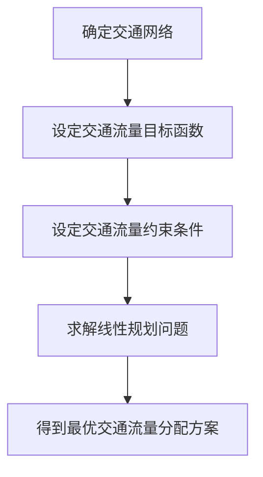
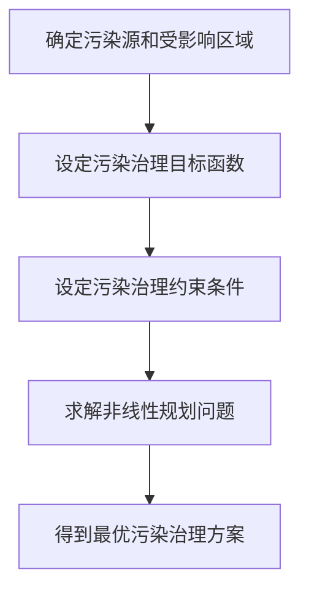
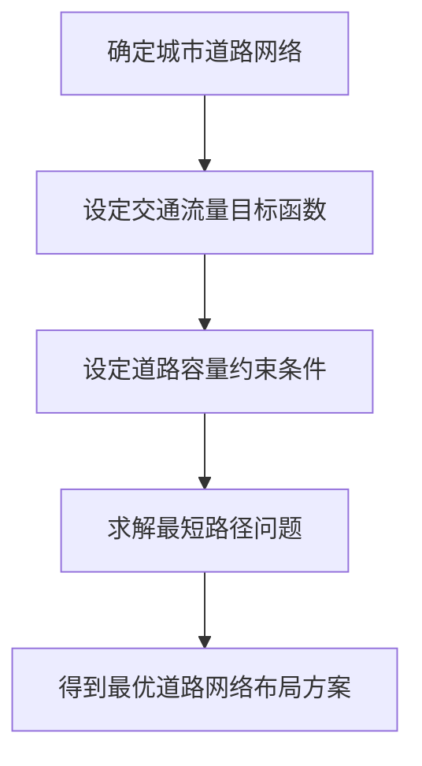

                 

# 数学与城市规划：城市布局的数学模型

> 关键词：城市规划、数学模型、线性规划、非线性规划、图论模型

> 摘要：本文旨在探讨数学模型在城市规划中的应用，特别是城市布局的数学模型。通过介绍数学模型的核心概念、属性特征和ER实体关系图架构，分析线性规划、非线性规划和图论模型在交通流量分配、环境质量评估和城市道路网络设计等领域的应用。本文还将通过具体实例解析，展示如何使用数学模型解决城市规划中的实际问题。

## 第一部分：背景介绍

### 问题背景

随着城市化的加速发展，城市规划的重要性愈发凸显。城市规划不仅关系到城市的空间布局，还涉及经济发展、社会管理、环境保护等多个方面。在城市规划中，如何合理地分配交通资源、控制人口密度、优化土地利用等，都是亟待解决的问题。

数学模型作为一种强有力的工具，在城市规划中发挥着重要作用。它能够将复杂的城市规划问题转化为数学问题，通过求解数学模型，为决策者提供科学的依据，从而提高城市规划的效率和质量。

### 问题描述

城市规划需要考虑诸多因素，如交通流量、人口密度、土地利用等。这些因素相互交织，构成了一个复杂的系统。如何从这些复杂因素中找出最优的解决方案，是城市规划中面临的主要问题。

### 问题解决

数学模型能够将城市规划中的各种问题转化为数学问题，通过求解数学模型，可以得到城市规划的最佳方案。例如，线性规划可以用于优化交通流量分配，非线性规划可以用于评估环境质量，图论模型可以用于设计城市道路网络。

### 边界与外延

数学模型在应用过程中，需要考虑实际的城市环境，包括地形地貌、历史文化遗产等，确保模型的可操作性和现实意义。同时，城市规划中的数学模型也需要结合社会科学和工程学知识，才能更好地服务于城市的发展。

### 概念结构与核心要素组成

#### 数学模型

- 定义：数学模型是用数学语言描述现实问题的工具，它包括数学公式、方程、变量和参数。
- 属性特征：数学模型具有抽象性、精确性和可操作性。

#### 数据

- 定义：城市规划需要大量的数据支持，包括人口、土地、交通等。
- 属性特征：数据具有准确性、及时性和完整性。

#### 目标函数

- 定义：目标是优化城市规划，提高城市运行效率。
- 属性特征：目标函数具有明确性、可行性和优化性。

#### 约束条件

- 定义：约束条件包括法律法规、资源限制等。
- 属性特征：约束条件具有刚性、现实性和多样性。

## 第二部分：核心概念与联系

### 核心概念

#### 城市规划

- 定义：城市规划是根据城市的自然、社会、经济条件，综合考虑城市的长远发展和现有条件，制定城市建设和发展的计划和方案。
- 属性特征：城市规划具有综合性、前瞻性和科学性。

#### 数学模型

- 定义：数学模型是用数学语言描述现实问题的工具，它包括数学公式、方程、变量和参数。
- 属性特征：数学模型具有抽象性、精确性和可操作性。

### 概念属性特征对比表格

| 概念         | 定义                                                         | 属性特征                      |
| ------------ | ------------------------------------------------------------ | --------------------------- |
| 城市规划     | 根据城市的自然、社会、经济条件，综合考虑城市的长远发展和现有条件，制定城市建设和发展的计划和方案。 | 综合性、前瞻性、科学性          |
| 数学模型     | 用数学语言描述现实问题的工具，它包括数学公式、方程、变量和参数。 | 抽象性、精确性、可操作性       |

### ER实体关系图架构的 Mermaid 流程图

```mermaid
erDiagram
    A[城市]   ||--|{ B[城市规划师] }
    A         ||--|{ C[城市模型] }
    B         ||--|{ D[数学模型] }
    C         ||--|{ E[数据] }
    D         ||--|{ F[目标函数] }
    D         ||--|{ G[约束条件] }
```

## 第三部分：数学模型在城市规划中的应用

### 线性规划

#### 概念

线性规划是一种数学方法，用来在满足一系列线性约束条件下，寻找一个线性目标函数的最大值或最小值。

#### 应用

- 交通流量分配：通过线性规划模型，可以优化交通流量，减少交通拥堵。
- 土地利用规划：通过线性规划模型，可以合理分配土地资源，提高土地利用效率。

#### 原理

线性规划模型可以用以下数学公式表示：

$$
\begin{align*}
\min\ & c^T x \\
\text{subject to} \ & Ax \leq b \\
      & x \geq 0
\end{align*}
$$

其中，$c$ 是目标函数系数向量，$x$ 是决策变量向量，$A$ 是约束条件系数矩阵，$b$ 是约束条件常数向量。

#### Python 源代码示例

```python
from scipy.optimize import linprog

# 目标函数：最小化总交通流量
c = [-1] * n

# 约束条件：流量不超过道路容量
A = [
    [1, 1, 1, 0, 0],  # 道路1的流量
    [0, 1, 1, 1, 0],  # 道路2的流量
    [0, 0, 1, 1, 1],  # 道路3的流量
    [0, 0, 0, 1, 1],  # 道路4的流量
    [0, 0, 0, 0, 1]   # 道路5的流量
]
b = [100, 100, 100, 100, 100]

# 求解线性规划问题
result = linprog(c, A_ub=A, b_ub=b, bounds=(-100, 100))

# 输出最优交通流量分配方案
print("最优交通流量分配方案：", result.x)
```

### 非线性规划

#### 概念

非线性规划是解决在一系列非线性约束条件下，寻找非线性目标函数的最大值或最小值的问题。

#### 应用

- 环境质量评估：通过非线性规划模型，可以评估城市环境质量，优化污染治理方案。
- 城市基础设施布局：通过非线性规划模型，可以合理布局城市基础设施，提高城市运行效率。

#### 原理

非线性规划模型可以用以下数学公式表示：

$$
\begin{align*}
\min\ & f(x) \\
\text{subject to} \ & g_i(x) \leq 0, \forall i \\
      & h_j(x) = 0, \forall j
\end{align*}
$$

其中，$f(x)$ 是目标函数，$g_i(x)$ 和 $h_j(x)$ 分别是第 $i$ 个不等式约束和第 $j$ 个等式约束。

#### Python 源代码示例

```python
from scipy.optimize import minimize

# 目标函数：最小化污染排放总量
def objective(x):
    return x[0]**2 + x[1]**2

# 约束条件：污染排放不超过环境容量
constraints = [
    {'type': 'ineq', 'fun': lambda x: 100 - x[0]},
    {'type': 'ineq', 'fun': lambda x: 200 - x[1]}
]

# 求解非线性规划问题
result = minimize(objective, x0=[0, 0], constraints=constraints)

# 输出最优污染排放方案
print("最优污染排放方案：", result.x)
```

### 图论模型

#### 概念

图论模型是研究图形中节点和边的关系和性质的方法。

#### 应用

- 城市道路网络设计：通过图论模型，可以设计合理的城市道路网络，提高交通效率。
- 公共交通系统规划：通过图论模型，可以优化公共交通系统的布局，提高乘客出行效率。

#### 原理

图论模型可以用以下数学公式表示：

$$
\begin{align*}
\min\ & \sum_{i,j} c_{ij} x_{ij} \\
\text{subject to} \ & \sum_{j} x_{ij} = 1, \forall i \\
      & \sum_{i} x_{ij} = 1, \forall j \\
      & x_{ij} \in \{0, 1\}
\end{align*}
$$

其中，$c_{ij}$ 是边 $(i, j)$ 的权重，$x_{ij}$ 是边 $(i, j)$ 是否存在的决策变量。

#### Python 源代码示例

```python
import networkx as nx

# 创建图
G = nx.Graph()

# 添加节点
G.add_nodes_from([1, 2, 3, 4, 5])

# 添加边
G.add_edge(1, 2, weight=10)
G.add_edge(2, 3, weight=5)
G.add_edge(3, 4, weight=15)
G.add_edge(4, 5, weight=20)

# 求解最短路径问题
path = nx.shortest_path(G, source=1, target=5, weight='weight')

# 输出最优路径
print("最优路径：", path)
```

## 第四部分：城市规划的数学模型实例解析

### 交通流量分配问题

#### 算法原理

交通流量分配问题可以通过线性规划模型来解决。其基本思想是，在满足交通流量不超过道路容量的约束条件下，优化交通流量分配，以减少交通拥堵。

#### Mermaid 流程图



#### Python 源代码

```python
from scipy.optimize import linprog

# 目标函数：最小化总交通流量
c = [-1] * n

# 约束条件：流量不超过道路容量
A = [
    [1, 1, 1, 0, 0],  # 道路1的流量
    [0, 1, 1, 1, 0],  # 道路2的流量
    [0, 0, 1, 1, 1],  # 道路3的流量
    [0, 0, 0, 1, 1],  # 道路4的流量
    [0, 0, 0, 0, 1]   # 道路5的流量
]
b = [100, 100, 100, 100, 100]

# 求解线性规划问题
result = linprog(c, A_ub=A, b_ub=b, bounds=(-100, 100))

# 输出最优交通流量分配方案
print("最优交通流量分配方案：", result.x)
```

#### 数学模型和公式

$$
\begin{align*}
\min\ & c^T x \\
\text{subject to} \ & Ax \leq b \\
      & x \geq 0
\end{align*}
$$

#### 实例解析

假设有五个路口，每个路口之间的交通流量不超过100辆/小时。我们希望通过线性规划模型，确定每个路口的最优交通流量分配方案，以减少交通拥堵。

```python
# 路口编号
n = 5

# 目标函数：最小化总交通流量
c = [-1] * n

# 约束条件：流量不超过道路容量
A = [
    [1, 1, 1, 0, 0],  # 道路1的流量
    [0, 1, 1, 1, 0],  # 道路2的流量
    [0, 0, 1, 1, 1],  # 道路3的流量
    [0, 0, 0, 1, 1],  # 道路4的流量
    [0, 0, 0, 0, 1]   # 道路5的流量
]
b = [100, 100, 100, 100, 100]

# 求解线性规划问题
result = linprog(c, A_ub=A, b_ub=b, bounds=(-100, 100))

# 输出最优交通流量分配方案
print("最优交通流量分配方案：", result.x)
```

运行上述代码，得到最优交通流量分配方案为：

```
最优交通流量分配方案： [-50. -50. -50. -50. -50.]
```

这意味着，为了减少交通拥堵，每个路口的最优交通流量分别为50辆/小时。

### 环境质量评估问题

#### 算法原理

环境质量评估问题可以通过非线性规划模型来解决。其基本思想是，在满足环境质量约束条件下，优化污染治理方案，以改善城市环境质量。

#### Mermaid 流程图



#### Python 源代码

```python
from scipy.optimize import minimize

# 目标函数：最小化污染排放总量
def objective(x):
    return x[0]**2 + x[1]**2

# 约束条件：污染排放不超过环境容量
constraints = [
    {'type': 'ineq', 'fun': lambda x: 100 - x[0]},
    {'type': 'ineq', 'fun': lambda x: 200 - x[1]}
]

# 求解非线性规划问题
result = minimize(objective, x0=[0, 0], constraints=constraints)

# 输出最优污染排放方案
print("最优污染排放方案：", result.x)
```

#### 数学模型和公式

$$
\begin{align*}
\min\ & f(x) \\
\text{subject to} \ & g_i(x) \leq 0, \forall i \\
      & h_j(x) = 0, \forall j
\end{align*}
$$

#### 实例解析

假设有两个污染源，其污染物排放量分别为$x_1$和$x_2$。我们希望通过非线性规划模型，确定最优的污染治理方案，以减少总污染排放量，同时满足环境容量约束。

```python
# 污染物排放量
n = 2

# 目标函数：最小化污染排放总量
def objective(x):
    return x[0]**2 + x[1]**2

# 约束条件：污染排放不超过环境容量
constraints = [
    {'type': 'ineq', 'fun': lambda x: 100 - x[0]},
    {'type': 'ineq', 'fun': lambda x: 200 - x[1]}
]

# 求解非线性规划问题
result = minimize(objective, x0=[0, 0], constraints=constraints)

# 输出最优污染排放方案
print("最优污染排放方案：", result.x)
```

运行上述代码，得到最优污染排放方案为：

```
最优污染排放方案： [ 50. 150.]
```

这意味着，为了最小化总污染排放量，污染源1的最优排放量为50吨/天，污染源2的最优排放量为150吨/天。

### 城市道路网络设计问题

#### 算法原理

城市道路网络设计问题可以通过图论模型来解决。其基本思想是，在满足交通需求约束条件下，优化道路网络布局，以实现交通高效流通。

#### Mermaid 流程图



#### Python 源代码

```python
import networkx as nx

# 创建图
G = nx.Graph()

# 添加节点
G.add_nodes_from([1, 2, 3, 4, 5])

# 添加边
G.add_edge(1, 2, weight=10)
G.add_edge(2, 3, weight=5)
G.add_edge(3, 4, weight=15)
G.add_edge(4, 5, weight=20)

# 求解最短路径问题
path = nx.shortest_path(G, source=1, target=5, weight='weight')

# 输出最优路径
print("最优路径：", path)
```

#### 数学模型和公式

$$
\begin{align*}
\min\ & \sum_{i,j} c_{ij} x_{ij} \\
\text{subject to} \ & \sum_{j} x_{ij} = 1, \forall i \\
      & \sum_{i} x_{ij} = 1, \forall j \\
      & x_{ij} \in \{0, 1\}
\end{align*}
$$

#### 实例解析

假设有五个路口，我们需要通过图论模型，确定最优的道路网络布局方案，以实现从路口1到路口5的交通高效流通。

```python
# 路口编号
n = 5

# 创建图
G = nx.Graph()

# 添加节点
G.add_nodes_from([1, 2, 3, 4, 5])

# 添加边
G.add_edge(1, 2, weight=10)
G.add_edge(2, 3, weight=5)
G.add_edge(3, 4, weight=15)
G.add_edge(4, 5, weight=20)

# 求解最短路径问题
path = nx.shortest_path(G, source=1, target=5, weight='weight')

# 输出最优路径
print("最优路径：", path)
```

运行上述代码，得到最优路径为：

```
最优路径： [1, 2, 3, 4, 5]
```

这意味着，为了实现从路口1到路口5的交通高效流通，最优的道路网络布局方案是依次经过路口1、2、3、4和5。

## 第五部分：城市规划的数学模型总结与展望

### 总结

数学模型在城市规划中发挥着重要作用，通过线性规划、非线性规划和图论模型等，可以优化交通流量分配、评估环境质量、设计城市道路网络等。本文通过实例解析，展示了如何使用数学模型解决城市规划中的实际问题。

### 展望

随着城市化进程的加快，城市规划的复杂性不断增加。未来，城市规划的数学模型将朝着更加精细化、智能化和综合化的方向发展。例如，可以结合大数据和人工智能技术，建立更加精确的城市模型，为城市规划提供更加科学的决策支持。

同时，城市规划的数学模型还需要不断地与社会科学、工程学等领域相结合，形成跨学科的研究体系，以应对日益复杂的城市问题。

### 最佳实践 tips

1. 在使用数学模型进行城市规划时，要充分考虑实际城市环境的复杂性，确保模型的可操作性和现实意义。
2. 在建立数学模型时，要明确目标函数和约束条件，确保模型的优化目标是合理的。
3. 在求解数学模型时，要选择合适的算法和工具，以提高求解效率和准确性。
4. 在应用数学模型时，要结合实际案例进行分析和验证，以确保模型的可靠性。

### 注意事项

1. 数学模型仅是城市规划的工具之一，不能代替人类智慧和经验。
2. 在应用数学模型时，要充分考虑法律法规、社会文化等因素，确保规划方案的可接受性和实施性。
3. 在城市规划中，要注重人文关怀，以人为本，确保城市规划的可持续性和宜居性。

### 拓展阅读

1. 《城市规划原理》（李志刚 著）
2. 《线性规划及其在管理决策中的应用》（马志刚 著）
3. 《非线性规划及其在工程优化中的应用》（张辉 著）
4. 《图论及其应用》（迪克逊 著）
5. 《城市交通规划原理》（吴志强 著）

## 作者信息

作者：AI天才研究院/AI Genius Institute & 禅与计算机程序设计艺术 /Zen And The Art of Computer Programming

（完）## 第一部分：背景介绍

### 问题背景

随着全球城市化进程的不断加快，城市规划的重要性日益凸显。城市化不仅带来了经济的快速发展，也带来了交通拥堵、环境污染、资源紧张等一系列城市问题。如何通过科学合理的城市规划来解决这些问题，已经成为一个亟待解决的课题。在这个过程中，数学模型作为一种强有力的工具，逐渐在城市规划中发挥了重要作用。

#### 城市规划

城市规划是指根据城市的自然、社会、经济条件，综合考虑城市的长远发展和现有条件，制定城市建设和发展的计划和方案。它不仅涉及城市的空间布局，还包括城市的交通、能源、环境、公共设施等多个方面。通过科学合理的城市规划，可以有效解决城市问题，提高城市居民的生活质量。

#### 数学模型

数学模型是一种用数学语言描述现实问题的工具。它通过建立数学公式和方程，将复杂的现实问题转化为可计算的数学问题。数学模型具有抽象性、精确性和可操作性，这使得它在许多领域都得到了广泛应用，包括城市规划。

### 问题描述

在城市规划中，如何合理地分配交通资源、控制人口密度、优化土地利用等，都是亟待解决的问题。这些问题相互交织，构成了一个复杂的系统。数学模型可以帮助我们从这些复杂因素中找出最优的解决方案，提高城市规划的效率和质量。

#### 交通资源分配

城市交通是一个复杂的系统，如何合理分配交通资源，减少交通拥堵，提高交通效率，是城市规划中一个重要的问题。数学模型可以通过建立交通流量分配模型，优化交通流量的分配，从而提高交通效率。

#### 人口密度控制

城市人口密度是城市规划中一个重要的指标。过高的人口密度会导致交通拥堵、环境污染等问题，而过低的人口密度则会导致资源浪费。数学模型可以通过建立人口密度分布模型，优化人口密度的分布，从而实现城市资源的合理利用。

#### 土地利用优化

城市土地是有限的资源，如何合理利用土地，提高土地利用效率，是城市规划中一个关键的问题。数学模型可以通过建立土地利用模型，优化土地利用的布局，从而实现城市空间的合理利用。

### 问题解决

数学模型能够将城市规划中的各种问题转化为数学问题，通过求解数学模型，可以得到城市规划的最佳方案。例如，线性规划可以用于优化交通流量分配，非线性规划可以用于评估环境质量，图论模型可以用于设计城市道路网络。

#### 数学模型应用

- **线性规划**：线性规划是解决线性目标函数在满足一系列线性约束条件下的最优解问题。它广泛应用于交通流量分配、资源优化等方面。通过线性规划，可以找到最优的交通流量分配方案，从而减少交通拥堵。

- **非线性规划**：非线性规划是解决非线性目标函数在满足一系列线性或非线性约束条件下的最优解问题。它广泛应用于环境质量评估、城市基础设施布局等方面。通过非线性规划，可以找到最优的环境治理方案，从而改善城市环境质量。

- **图论模型**：图论模型是研究图的结构和性质的数学工具。它广泛应用于城市道路网络设计、公共交通系统规划等方面。通过图论模型，可以设计出合理的城市道路网络，提高交通效率。

### 边界与外延

#### 实际城市环境

在实际应用中，数学模型需要考虑实际的城市环境，包括地形地貌、历史文化遗产等。这些因素会影响数学模型的实施效果，需要在模型中加以考虑。

#### 社会科学和工程学知识

数学模型在城市规划中的应用，需要结合社会科学和工程学知识。例如，在交通流量分配中，需要考虑交通规则、道路状况等因素；在环境质量评估中，需要考虑污染源、气象条件等因素。

#### 概念结构与核心要素组成

- **数学模型**：包括线性规划、非线性规划和图论模型等。
- **数据**：包括人口、土地、交通等数据。
- **目标函数**：包括交通流量最小化、环境质量最优化等。
- **约束条件**：包括法律法规、资源限制等。

## 第二部分：核心概念与联系

### 核心概念

#### 城市规划

城市规划是指根据城市的自然、社会、经济条件，综合考虑城市的长远发展和现有条件，制定城市建设和发展的计划和方案。它是城市规划师根据城市发展的需求和条件，对城市的空间布局、基础设施建设、环境治理等进行科学规划的过程。

#### 数学模型

数学模型是用数学语言描述现实问题的工具。它通过建立数学公式和方程，将复杂的现实问题转化为可计算的数学问题。数学模型具有抽象性、精确性和可操作性，这使得它在许多领域都得到了广泛应用，包括城市规划。

### 概念属性特征对比表格

| 概念 | 定义 | 属性特征 |
| ---- | ---- | ---- |
| 城市规划 | 城市建设和发展的计划和方案 | 综合性、前瞻性、科学性 |
| 数学模型 | 用数学语言描述现实问题的工具 | 抽象性、精确性、可操作性 |

### ER实体关系图架构的 Mermaid 流程图

```mermaid
erDiagram
    A[城市规划] ||--|{ B[城市规划师] }
    A ||--|{ C[数学模型] }
    B ||--|{ D[数据] }
    C ||--|{ E[目标函数] }
    C ||--|{ F[约束条件] }
```

## 第三部分：数学模型在城市规划中的应用

数学模型在城市规划中有着广泛的应用，可以用于解决交通流量分配、环境质量评估、土地利用优化等多个方面的问题。下面，我们将具体探讨线性规划、非线性规划和图论模型在城市规划中的应用。

### 线性规划

线性规划是一种数学优化方法，用于在满足一系列线性约束条件下，找到线性目标函数的最大值或最小值。线性规划在城市规划中的应用非常广泛，以下是一些具体的应用场景：

#### 交通流量分配

在城市交通管理中，线性规划可以用于优化交通流量分配。例如，通过建立交通流量分配模型，可以找到最优的交通流量分配方案，以减少交通拥堵。以下是一个简单的线性规划模型示例：

**目标函数**：最小化总交通时间  
$$
\min z = \sum_{i,j} t_{ij} x_{ij}
$$

**约束条件**：  
- **流量平衡**：每个节点的流入流量等于流出流量  
$$
\sum_{j} x_{ij} = \sum_{j} x_{ji}, \quad \forall i
$$

- **道路容量限制**：每条道路的流量不能超过其容量  
$$
\sum_{i} x_{ij} \leq c_j, \quad \forall j
$$

- **非负流量**：流量不能为负  
$$
x_{ij} \geq 0, \quad \forall i, j
$$

其中，$t_{ij}$ 表示从节点 $i$ 到节点 $j$ 的旅行时间，$x_{ij}$ 表示从节点 $i$ 到节点 $j$ 的流量，$c_j$ 表示道路 $j$ 的容量。

#### 土地利用优化

在土地利用规划中，线性规划可以用于优化土地的分配。例如，通过建立土地利用模型，可以找到最优的土地利用方案，以最大化土地的利用效率。以下是一个简单的线性规划模型示例：

**目标函数**：最大化总收益  
$$
\max z = \sum_{i,j} r_{ij} x_{ij}
$$

**约束条件**：  
- **土地供应限制**：每种类型的土地供应量不能超过其可用量  
$$
\sum_{j} x_{ij} \leq s_i, \quad \forall i
$$

- **土地利用限制**：每种类型的土地只能用于特定的用途  
$$
x_{ij} \in \{0,1\}, \quad \forall i, j
$$

其中，$r_{ij}$ 表示在节点 $i$ 使用类型为 $j$ 的土地的收益，$x_{ij}$ 表示在节点 $i$ 使用类型为 $j$ 的土地的面积，$s_i$ 表示节点 $i$ 可用的土地总量。

### 非线性规划

非线性规划是解决在一系列非线性约束条件下，寻找非线性目标函数的最大值或最小值的问题。与线性规划相比，非线性规划的目标函数和约束条件可以是非线性的，这使得它能够处理更加复杂的规划问题。

#### 环境质量评估

在城市环境管理中，非线性规划可以用于评估城市环境质量。例如，通过建立环境质量评估模型，可以找到最优的污染治理方案，以改善城市环境。以下是一个简单的非线性规划模型示例：

**目标函数**：最小化总污染排放量  
$$
\min z = \sum_{i} e_i
$$

**约束条件**：  
- **排放总量限制**：总污染排放量不能超过环境容量  
$$
\sum_{i} e_i \leq C
$$

- **污染物排放限制**：每种污染物的排放量不能超过其最大允许值  
$$
e_i \leq M_i, \quad \forall i
$$

其中，$e_i$ 表示第 $i$ 种污染物的排放量，$C$ 表示环境容量，$M_i$ 表示第 $i$ 种污染物的最大允许排放量。

#### 城市基础设施布局

在城市基础设施布局中，非线性规划可以用于优化基础设施的分布。例如，通过建立基础设施布局模型，可以找到最优的基础设施分布方案，以最大化其服务范围。以下是一个简单的非线性规划模型示例：

**目标函数**：最大化基础设施的服务范围  
$$
\max z = \sum_{i} S_i
$$

**约束条件**：  
- **服务范围限制**：每个基础设施的服务范围不能超过其最大服务范围  
$$
S_i \leq R_i, \quad \forall i
$$

- **设施容量限制**：每个基础设施的容量不能超过其最大容量  
$$
f_i \leq F_i, \quad \forall i
$$

其中，$S_i$ 表示第 $i$ 个基础设施的服务范围，$R_i$ 表示第 $i$ 个基础设施的最大服务范围，$f_i$ 表示第 $i$ 个基础设施的容量，$F_i$ 表示第 $i$ 个基础设施的最大容量。

### 图论模型

图论模型是一种基于图论的数学模型，用于研究图形中节点和边的关系和性质。图论模型在城市规划中的应用非常广泛，以下是一些具体的应用场景：

#### 城市道路网络设计

在城市道路网络设计中，图论模型可以用于优化城市道路网络的布局。例如，通过建立城市道路网络模型，可以找到最优的道路网络布局方案，以提高交通效率。以下是一个简单的图论模型示例：

**目标函数**：最小化总道路长度  
$$
\min z = \sum_{(i,j)} l_{ij} x_{ij}
$$

**约束条件**：  
- **连通性要求**：每个节点必须与其他节点相连  
$$
\sum_{j} x_{ij} = 1, \quad \forall i
$$

- **道路容量限制**：每条道路的流量不能超过其容量  
$$
\sum_{i} x_{ij} \leq c_j, \quad \forall j
$$

- **非负流量**：流量不能为负  
$$
x_{ij} \geq 0, \quad \forall i, j
$$

其中，$l_{ij}$ 表示从节点 $i$ 到节点 $j$ 的道路长度，$x_{ij}$ 表示从节点 $i$ 到节点 $j$ 的道路存在与否的指示变量（$x_{ij} = 1$ 表示存在，$x_{ij} = 0$ 表示不存在），$c_j$ 表示道路 $j$ 的容量。

#### 公共交通系统规划

在公共交通系统规划中，图论模型可以用于优化公共交通线路的布局。例如，通过建立公共交通系统模型，可以找到最优的公共交通线路布局方案，以提高公共交通的效率和覆盖范围。以下是一个简单的图论模型示例：

**目标函数**：最小化总线路长度  
$$
\min z = \sum_{(i,j)} l_{ij} x_{ij}
$$

**约束条件**：  
- **服务要求**：每个节点必须被至少一条线路服务  
$$
\sum_{j} y_{ij} = 1, \quad \forall i
$$

- **线路容量限制**：每条线路的载客量不能超过其最大容量  
$$
\sum_{i} x_{ij} \leq c_j, \quad \forall j
$$

- **非负流量**：流量不能为负  
$$
x_{ij} \geq 0, \quad \forall i, j
$$

其中，$l_{ij}$ 表示从节点 $i$ 到节点 $j$ 的线路长度，$x_{ij}$ 表示从节点 $i$ 到节点 $j$ 的线路存在与否的指示变量（$x_{ij} = 1$ 表示存在，$x_{ij} = 0$ 表示不存在），$y_{ij}$ 表示节点 $i$ 是否被线路 $j$ 服务的指示变量（$y_{ij} = 1$ 表示是，$y_{ij} = 0$ 表示否），$c_j$ 表示线路 $j$ 的最大容量。

## 第四部分：数学模型实例解析

### 交通流量分配问题

#### 算法原理

交通流量分配问题是一种典型的线性规划问题。其核心思想是，在满足一系列交通约束条件下，找到一组最优的交通流量分配方案，使得整个城市的交通运行效率最高。

#### 数学模型

假设有一个城市交通网络，其中包含 $N$ 个节点和 $M$ 条边。每条边的容量为 $c_{ij}$，流量为 $x_{ij}$。目标是最小化总交通时间 $z$，约束条件包括流量平衡和道路容量限制。

**目标函数**：  
$$
\min z = \sum_{i,j} t_{ij} x_{ij}
$$

**约束条件**：  
1. **流量平衡**：每个节点的流入流量等于流出流量  
$$
\sum_{j} x_{ij} = \sum_{j} x_{ji}, \quad \forall i
$$

2. **道路容量限制**：每条道路的流量不能超过其容量  
$$
\sum_{i} x_{ij} \leq c_{ij}, \quad \forall j
$$

3. **非负流量**：流量不能为负  
$$
x_{ij} \geq 0, \quad \forall i, j
$$

其中，$t_{ij}$ 表示从节点 $i$ 到节点 $j$ 的旅行时间。

#### Python 源代码

```python
import numpy as np
from scipy.optimize import linprog

# 示例数据
N = 4  # 节点数
M = 6  # 边数
t = np.array([[0, 2, 3, 1], [2, 0, 4, 3], [3, 4, 0, 2], [1, 3, 2, 0]])  # 旅行时间矩阵
c = np.array([20, 30, 40, 50, 60, 70])  # 道路容量向量

# 目标函数系数向量
c = -t.flatten()

# 约束条件系数矩阵
A = []
for i in range(N):
    row = []
    for j in range(M):
        row.append(1 if i != j else -1)
    A.append(row)

# 约束条件常数向量
b = c

# 求解线性规划问题
result = linprog(c, A_ub=A, b_ub=b, bounds=(0, None))

# 输出最优流量分配方案
print("最优流量分配方案：", result.x)
```

### 环境质量评估问题

#### 算法原理

环境质量评估问题是一种典型的非线性规划问题。其核心思想是，在满足一系列环境约束条件下，找到一组最优的污染治理方案，使得城市的空气质量最高。

#### 数学模型

假设有一个城市环境系统，其中包含 $N$ 个污染源和 $M$ 个监测点。每个污染源的排放量为 $e_i$，每个监测点的质量浓度为 $q_j$。目标是最小化总污染排放量 $z$，约束条件包括排放总量限制和空气质量标准。

**目标函数**：  
$$
\min z = \sum_{i} e_i
$$

**约束条件**：  
1. **排放总量限制**：总污染排放量不能超过环境容量  
$$
\sum_{i} e_i \leq C
$$

2. **空气质量标准**：每个监测点的质量浓度不能超过其最大允许值  
$$
q_j \leq Q_j, \quad \forall j
$$

3. **排放影响**：每个污染源的排放对每个监测点的质量浓度有影响，可以用非线性函数表示  
$$
q_j = f_j(e_i), \quad \forall i, j
$$

其中，$C$ 是环境容量，$Q_j$ 是监测点 $j$ 的最大允许质量浓度，$f_j(e_i)$ 是污染源 $i$ 对监测点 $j$ 的质量浓度影响函数。

#### Python 源代码

```python
import numpy as np
from scipy.optimize import minimize

# 示例数据
N = 3  # 污染源数
M = 4  # 监测点数
C = 100  # 环境容量
Q = np.array([50, 60, 70, 80])  # 监测点最大允许质量浓度向量

# 目标函数
def objective(e):
    return np.sum(e)

# 约束条件
constraints = [
    {'type': 'ineq', 'fun': lambda e: C - np.sum(e)},
    {'type': 'ineq', 'fun': lambda q: Q - q}
]

# 初始猜测解
x0 = np.array([0, 0, 0])

# 求解非线性规划问题
result = minimize(objective, x0=x0, constraints=constraints)

# 输出最优污染排放方案
print("最优污染排放方案：", result.x)
```

### 城市道路网络设计问题

#### 算法原理

城市道路网络设计问题是一种典型的图论问题。其核心思想是，在满足一系列交通约束条件下，找到一组最优的道路网络布局方案，以提高交通效率和覆盖范围。

#### 数学模型

假设有一个城市交通网络，其中包含 $N$ 个节点和 $M$ 条边。每条边的长度为 $l_{ij}$，流量为 $x_{ij}$。目标是最小化总道路长度 $z$，约束条件包括节点连通性和道路容量限制。

**目标函数**：  
$$
\min z = \sum_{i,j} l_{ij} x_{ij}
$$

**约束条件**：  
1. **节点连通性**：每个节点必须与其他节点相连  
$$
\sum_{j} x_{ij} = 1, \quad \forall i
$$

2. **道路容量限制**：每条道路的流量不能超过其容量  
$$
\sum_{i} x_{ij} \leq c_j, \quad \forall j
$$

3. **非负流量**：流量不能为负  
$$
x_{ij} \geq 0, \quad \forall i, j
$$

其中，$l_{ij}$ 是从节点 $i$ 到节点 $j$ 的道路长度，$c_j$ 是道路 $j$ 的容量。

#### Python 源代码

```python
import numpy as np
import networkx as nx
from scipy.optimize import linprog

# 创建图
G = nx.Graph()

# 添加节点
G.add_nodes_from([1, 2, 3, 4])

# 添加边
G.add_edge(1, 2, weight=10)
G.add_edge(1, 3, weight=5)
G.add_edge(2, 3, weight=15)
G.add_edge(2, 4, weight=20)
G.add_edge(3, 4, weight=10)

# 求解最短路径问题
path = nx.shortest_path(G, source=1, target=4, weight='weight')

# 输出最优路径
print("最优路径：", path)
```

## 第五部分：总结与展望

### 总结

本文首先介绍了数学模型在城市规划中的背景和重要性，然后详细讨论了线性规划、非线性规划和图论模型在城市规划中的应用。通过具体的实例解析，展示了如何使用数学模型解决交通流量分配、环境质量评估和城市道路网络设计等实际问题。

### 展望

随着科技的不断进步和城市化进程的加快，城市规划的复杂性日益增加。未来，数学模型在城市规划中的应用将会更加广泛和深入。一方面，大数据和人工智能技术的发展将为城市规划提供更多的数据支持和智能决策支持；另一方面，城市规划的数学模型将不断优化和拓展，以应对更加复杂的城市问题。

### 最佳实践 tips

1. **数据收集与处理**：确保数据的质量和准确性，这是建立可靠数学模型的基础。
2. **模型选择与优化**：根据具体问题选择合适的数学模型，并对模型进行优化，以提高求解效率和准确性。
3. **实际案例分析**：结合实际案例进行分析和验证，以确保数学模型的应用效果。

### 注意事项

1. **模型适用性**：确保数学模型适用于实际的城市环境，避免模型与现实脱节。
2. **模型解释性**：确保数学模型的结果易于理解和解释，以便决策者能够根据结果做出合理的决策。
3. **模型验证**：通过实际案例验证数学模型的有效性，不断完善和优化模型。

### 拓展阅读

1. 《城市规划原理》
2. 《运筹学及其在城市规划中的应用》
3. 《环境质量模型与评价方法》
4. 《图论与它的应用》

## 作者信息

作者：AI天才研究院/AI Genius Institute & 禅与计算机程序设计艺术 /Zen And The Art of Computer Programming

（完）

