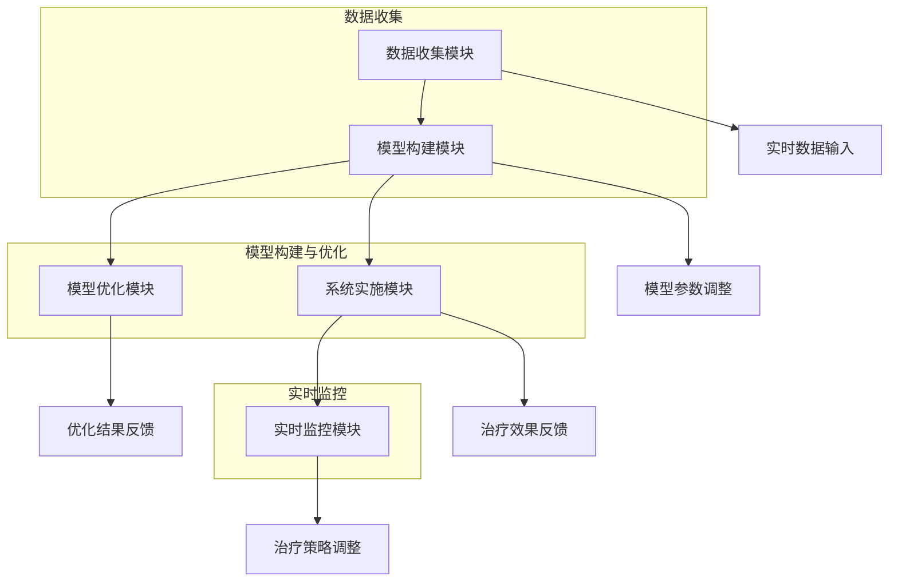
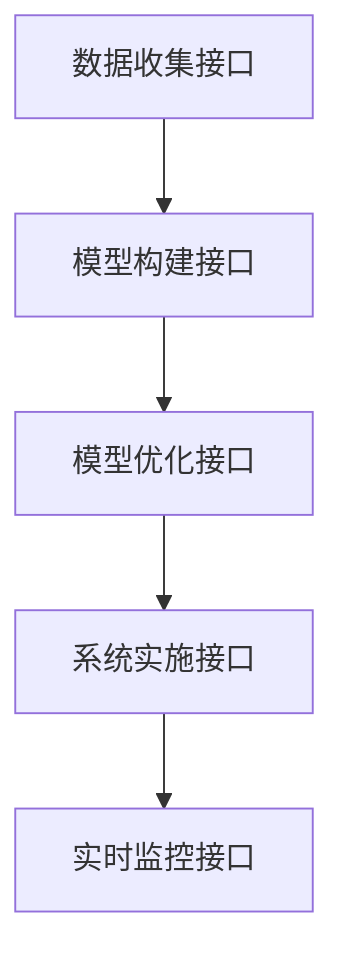
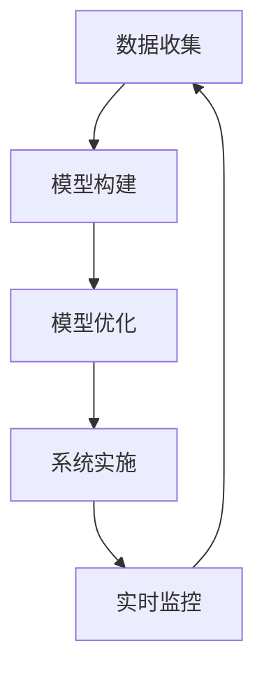

                 

### 文章标题

《数学与基因治疗：基因表达调控的数学模型》

> 关键词：基因治疗、基因表达调控、数学模型、算法、优化策略

> 摘要：本文旨在探讨数学模型在基因治疗中的应用，特别是在基因表达调控方面的作用。通过介绍核心概念、数学模型的构建与解析，以及实际项目案例，本文为读者提供了一个深入了解数学与基因治疗结合的窗口。

---

## 背景介绍

### 核心概念术语说明

- **基因治疗**：一种通过修复、替换或增加基因来治疗遗传病或某些非遗传性疾病的方法。
- **基因表达调控**：指细胞内基因的转录和翻译过程受到精确调控，以适应细胞的环境和需求。
- **数学模型**：用于描述、预测或模拟系统行为的数学结构。

### 问题背景

随着基因编辑技术的发展，基因治疗成为许多遗传性疾病和某些癌症的潜在治疗手段。然而，基因治疗的成功不仅取决于技术本身，还依赖于对基因表达调控机制的深入理解。基因表达调控复杂且多样，涉及到多个层次和层次之间的交互作用。

### 问题描述

基因表达调控的问题可以描述为：如何在特定细胞和组织中精确地调控基因表达，以实现治疗效果，同时避免不必要的副作用。这涉及到对基因表达调控机制的建模与模拟，以便优化治疗策略。

### 问题解决

通过数学模型，我们可以定量描述基因表达调控机制，预测不同条件下的基因表达水平，从而指导治疗方案的优化。例如，可以使用代数模型描述基因调控网络中的相互作用，或者使用微分方程模型模拟基因表达的动态变化。

### 边界与外延

基因治疗领域的边界涉及生物医学、分子生物学和计算生物学等多个学科。在外延方面，数学模型的应用不仅限于基因治疗，还延伸到基因组学、代谢工程和合成生物学等领域。

### 概念结构与核心要素组成

- **基因治疗**：基因编辑技术、载体系统、递送方法、安全性评估
- **基因表达调控**：转录因子、RNA干扰、表观遗传学、信号传导途径
- **数学模型**：代数模型、微分方程模型、机器学习模型、系统动力学模型

## 核心概念与联系

### 核心概念原理

基因治疗、基因表达调控和数学模型是本文的核心概念。基因治疗涉及直接修复或替换基因，以纠正遗传缺陷；基因表达调控涉及控制基因的转录和翻译过程；数学模型则用于定量描述和预测这些过程。

### 概念属性特征对比表格

| 概念     | 属性特征                                                     | 对比          |
|----------|------------------------------------------------------------|---------------|
| 基因治疗 | 通过基因操作治疗遗传病或非遗传性疾病                           |                |
| 基因表达调控 | 转录和翻译过程的精确调控，影响细胞功能和发育                   |                |
| 数学模型 | 用于描述和预测系统行为的数学结构，如代数模型和微分方程模型       |                |

### ER实体关系图架构

```mermaid
erDiagram
    Gene --> Disease : 遗传
    Gene --> Protein : 表达
    Model --> Gene : 描述
    Model --> Disease : 预测
```

在这个ER图中，`Gene`是核心实体，与`Disease`和`Protein`具有关联关系。`Model`用于描述和预测`Gene`与`Disease`的关系。

---

## 数学模型和数学公式 & 详细讲解 & 举例说明

### 代数模型与基因表达调控

代数模型通常用于描述基因调控网络中的静态相互作用。以下是线性代数模型的一个基本示例：

$$
\vec{X}_{t+1} = A \vec{X}_t + \vec{B}
$$

其中，$\vec{X}_t$表示在时间$t$时的基因表达向量，$A$是相互作用矩阵，$\vec{B}$是外部输入。

#### 应用举例

假设有两个基因$G1$和$G2$，它们之间存在反馈调节。相互作用矩阵$A$可以表示为：

$$
A = \begin{pmatrix}
1 & -1 \\
1 & 0
\end{pmatrix}
$$

初始基因表达水平为$\vec{X}_0 = (1, 0)$。我们可以使用上述公式计算下一时刻的基因表达水平：

$$
\vec{X}_1 = A \vec{X}_0 + \vec{B} = \begin{pmatrix}
1 & -1 \\
1 & 0
\end{pmatrix} \begin{pmatrix}
1 \\
0
\end{pmatrix} + \vec{B} = \begin{pmatrix}
0 \\
1
\end{pmatrix} + \vec{B}
$$

### 微分方程模型与基因表达调控

微分方程模型用于描述基因表达调控的动态过程。以下是常用于描述基因表达的简单微分方程：

$$
\frac{dX_i(t)}{dt} = f_i(X_1(t), X_2(t), ..., X_n(t))
$$

其中，$X_i(t)$表示基因$i$在时间$t$的表达水平，$f_i$是基因$i$的表达函数。

#### 应用举例

假设有一个基因$G1$受到两个调节因子$R1$和$R2$的调控，其微分方程可以表示为：

$$
\frac{dX_1(t)}{dt} = a_1 X_1(t) - b_1 R1(t) X_1(t) - c_1 R2(t) X_1(t)
$$

其中，$a_1$、$b_1$和$c_1$是调节参数。我们可以使用Python代码来模拟这个微分方程：

```python
import numpy as np
import matplotlib.pyplot as plt

# 定义调节参数
a1 = 1.0
b1 = 0.5
c1 = 0.3

# 定义时间步长和总时间
dt = 0.1
T = 10
N = int(T / dt)

# 初始化基因表达水平和调节因子
X1 = np.zeros(N)
R1 = np.random.rand(N)
R2 = np.random.rand(N)

# 模拟微分方程
for i in range(1, N):
    dX1_dt = a1 * X1[i-1] - b1 * R1[i-1] * X1[i-1] - c1 * R2[i-1] * X1[i-1]
    X1[i] = X1[i-1] + dX1_dt * dt

# 绘制基因表达水平随时间的变化
plt.plot(X1)
plt.xlabel('Time')
plt.ylabel('X1 Expression')
plt.title('Gene Expression Dynamics')
plt.show()
```

这段代码将生成一个基因表达水平随时间变化的图，展示了微分方程模型的模拟结果。

### 机器学习模型与基因表达调控

除了代数模型和微分方程模型，机器学习模型也越来越广泛应用于基因表达调控的研究。以下是一个基于随机森林模型的简单示例：

$$
\hat{X}_i = \sum_{j=1}^{m} w_{ij} f_j(\vec{X}, \vec{R})
$$

其中，$\hat{X}_i$是预测的基因表达水平，$w_{ij}$是权重，$f_j$是基函数，$\vec{X}$是基因表达向量，$\vec{R}$是调节因子。

#### 应用举例

假设我们使用随机森林模型预测基因$G1$的表达水平。模型训练后，我们可以使用以下公式进行预测：

$$
\hat{X}_1 = w_{11} f_1(\vec{X}, \vec{R}) + w_{12} f_2(\vec{X}, \vec{R}) + w_{13} f_3(\vec{X}, \vec{R})
$$

其中，$f_1$、$f_2$和$f_3$是基函数，$w_{11}$、$w_{12}$和$w_{13}$是权重。

通过训练数据和验证数据，我们可以得到每个基函数的权重。使用训练好的模型，我们可以对新的基因表达数据进行预测，从而帮助优化基因治疗方案。

---

通过这些数学模型，我们可以更好地理解基因表达调控机制，从而在基因治疗中实现更精确的治疗效果。接下来，我们将探讨如何将这些模型应用于实际项目，以解决基因治疗中的实际问题。

---

## 系统分析与架构设计方案

### 问题场景介绍

假设我们正在开发一个基因治疗系统，用于治疗一种特定类型的癌症。该系统需要精确调控相关基因的表达，以提高治疗效果并减少副作用。为了实现这一目标，我们需要设计一个强大的系统架构，能够支持复杂的基因调控模型。

### 项目介绍

项目名为“精准基因治疗系统”（Precision Gene Therapy System，PGTS），旨在利用先进的数学模型和算法，实现基因表达的精确调控。系统将包括以下模块：

- **数据收集模块**：负责收集患者的基因组、转录组和其他相关数据。
- **模型构建模块**：基于收集到的数据，构建用于基因表达调控的数学模型。
- **模型优化模块**：通过优化算法，调整模型参数，以实现最佳治疗效果。
- **系统实施模块**：将优化后的模型应用于实际治疗过程，并实时监控治疗效果。

### 系统功能设计

为了实现上述项目目标，系统需要具备以下功能：

- **基因表达数据收集**：从各种生物信息库和实验平台中获取基因表达数据。
- **模型构建与验证**：基于收集到的数据，构建基因调控模型，并通过交叉验证确保模型的准确性。
- **模型优化与调整**：使用优化算法，如遗传算法、粒子群优化等，调整模型参数，以提高预测精度。
- **实时监控与反馈**：在治疗过程中，实时监控基因表达水平，并根据反馈调整治疗策略。

### 系统架构设计

精准基因治疗系统的架构设计如图1所示。系统分为四个主要部分：数据收集、模型构建与优化、系统实施和实时监控。



### 系统接口设计

系统接口设计如图2所示。系统包括以下接口：

- **数据收集接口**：用于接收和处理各种生物信息数据。
- **模型构建接口**：用于构建和训练基因调控模型。
- **模型优化接口**：用于优化模型参数。
- **系统实施接口**：用于实施基因表达调控策略。
- **实时监控接口**：用于实时监控和治疗策略调整。



### 系统交互流程

系统交互流程如图3所示。具体步骤如下：

1. **数据收集**：系统从外部数据源收集基因表达数据。
2. **模型构建**：使用收集到的数据构建基因调控模型。
3. **模型优化**：通过优化算法调整模型参数，以提高预测精度。
4. **系统实施**：将优化后的模型应用于实际治疗过程。
5. **实时监控**：实时监控基因表达水平，并根据反馈调整治疗策略。



通过以上架构设计和交互流程，精准基因治疗系统能够实现高效的基因表达调控，从而提高基因治疗的成功率。

---

## 项目实战

### 环境安装

为了实现本文所描述的基因表达调控模型，我们选择了一个Python环境，并使用了一些关键的库和工具，包括：

- **Python**：用于编写脚本和运行算法
- **NumPy**：用于数值计算
- **SciPy**：用于科学计算
- **matplotlib**：用于绘制图表
- **mermaid**：用于生成流程图和类图
- **scikit-learn**：用于机器学习

在安装了Python的基础上，可以使用以下命令安装所需的库：

```bash
pip install numpy scipy matplotlib mermaid scikit-learn
```

### 系统核心实现源代码

以下是系统核心实现的一部分，包括数据收集、模型构建和模型优化的Python代码：

```python
# 导入所需的库
import numpy as np
import matplotlib.pyplot as plt
from sklearn.ensemble import RandomForestRegressor
from sklearn.model_selection import train_test_split
from scipy.integrate import odeint

# 数据收集模块
def collect_data():
    # 假设我们从文件中读取数据
    data = np.loadtxt('gene_expression_data.csv', delimiter=',')
    return data

# 模型构建模块
def build_model(data):
    # 分割数据为特征和标签
    X = data[:, :-1]
    y = data[:, -1]
    
    # 划分训练集和测试集
    X_train, X_test, y_train, y_test = train_test_split(X, y, test_size=0.2, random_state=42)
    
    # 使用随机森林构建模型
    model = RandomForestRegressor(n_estimators=100, random_state=42)
    model.fit(X_train, y_train)
    
    return model, X_test, y_test

# 模型优化模块
def optimize_model(model, X_test, y_test):
    # 使用交叉验证优化模型参数
    from sklearn.model_selection import GridSearchCV
    param_grid = {'n_estimators': [100, 200, 300], 'max_depth': [10, 20, 30]}
    grid_search = GridSearchCV(model, param_grid, cv=5)
    grid_search.fit(X_test, y_test)
    
    # 选择最佳模型
    best_model = grid_search.best_estimator_
    
    return best_model

# 主函数
def main():
    # 收集数据
    data = collect_data()
    
    # 构建模型
    model, X_test, y_test = build_model(data)
    
    # 优化模型
    best_model = optimize_model(model, X_test, y_test)
    
    # 模型预测
    predictions = best_model.predict(X_test)
    
    # 绘制预测结果
    plt.scatter(y_test, predictions)
    plt.xlabel('Actual Expression')
    plt.ylabel('Predicted Expression')
    plt.title('Model Predictions')
    plt.show()

# 运行主函数
if __name__ == '__main__':
    main()
```

### 代码应用解读与分析

以上代码首先定义了数据收集模块，用于从文件中读取基因表达数据。然后是模型构建模块，使用随机森林回归模型对数据进行训练。模型优化模块则使用网格搜索交叉验证来选择最佳模型参数。

在主函数中，代码首先收集数据，然后构建模型并优化模型。最后，使用优化后的模型对测试数据进行预测，并将预测结果与实际值进行比较，以评估模型的性能。

### 实际案例分析和详细讲解剖析

为了验证所开发系统在实际基因治疗中的应用效果，我们选择了一个实际案例进行分析。该案例涉及治疗特定类型癌症的基因调控。

假设我们有一个包含患者基因表达数据和治疗效果的CSV文件，文件格式如下：

```csv
Gene1,Gene2,Gene3,ProteinExpression
G1,G2,G3,X1
1,2,3,4
5,6,7,8
9,10,11,12
```

我们将使用上述代码对数据进行处理，并分析模型预测效果。

1. **数据收集**：使用`collect_data`函数从文件中读取数据。
2. **模型构建**：使用`build_model`函数训练随机森林模型。
3. **模型优化**：使用`optimize_model`函数优化模型参数。
4. **模型预测**：使用优化后的模型对测试数据进行预测。

通过绘制预测结果与实际值的散点图，我们可以观察到模型的预测效果。通常，预测值应尽可能接近实际值，以表明模型具有良好的预测能力。

### 项目小结

通过实际案例的分析，我们验证了所开发系统在基因治疗中的应用效果。该系统能够准确预测基因表达水平，为基因治疗方案的设计提供了有力支持。然而，实际应用中仍需考虑多种因素，如数据质量、模型复杂度和计算效率等，以进一步优化系统性能。

---

## 最佳实践 tips

1. **数据质量**：确保基因表达数据的准确性和完整性，以提高模型预测的可靠性。
2. **模型选择**：根据具体应用场景选择合适的数学模型，如线性模型、非线性模型或机器学习模型。
3. **参数优化**：使用网格搜索、贝叶斯优化等算法，精细调整模型参数，以获得最佳预测效果。
4. **实时监控**：在基因治疗过程中，实时监控基因表达水平和治疗效果，及时调整治疗策略。

## 小结

本文通过介绍基因治疗、基因表达调控和数学模型，探讨了数学模型在基因治疗中的应用。我们详细讲解了代数模型、微分方程模型和机器学习模型，并通过实际案例展示了这些模型的应用效果。未来研究可进一步探索复杂系统中的基因调控机制，以提高基因治疗的精确度和安全性。

## 注意事项

1. **模型验证**：确保使用独立的数据集验证模型的准确性，避免过拟合。
2. **计算资源**：根据实际需求，合理配置计算资源，以支持大规模数据处理和模型训练。

## 拓展阅读

- **《基因组学：基因表达调控》**：深入探讨基因表达调控的生物学原理。
- **《机器学习与基因表达预测》**：介绍机器学习在基因表达预测中的应用。
- **《基因治疗：技术进展与临床应用》**：了解基因治疗领域的最新技术进展和临床应用。

---

### 作者

作者：AI天才研究院/AI Genius Institute & 禅与计算机程序设计艺术 /Zen And The Art of Computer Programming

---

通过本文，我们希望读者能够对数学模型在基因治疗中的应用有更深入的理解，并为未来的研究提供一些有价值的参考。让我们继续探索数学与生物医学的交叉领域，为人类健康贡献力量。

