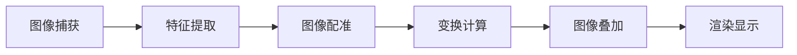
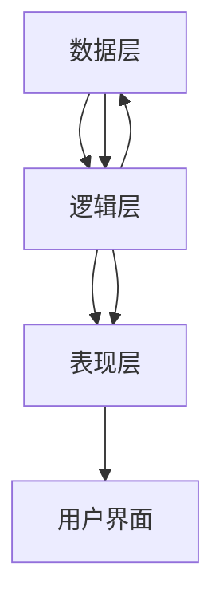
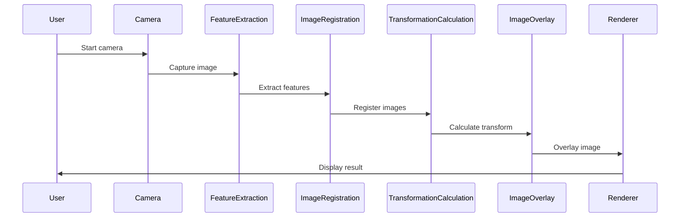

                 

### 数学与增强现实：实时图像叠加的数学算法

> 关键词：增强现实、图像叠加、数学算法、实时处理、计算机视觉

> 摘要：本文探讨了数学算法在增强现实（AR）技术中的应用，特别是实时图像叠加的过程。文章首先介绍了增强现实的基本概念，然后详细分析了与图像叠加相关的重要数学原理，包括几何学、向量运算和线性代数。接下来，文章通过具体算法的讲解和Python源代码实现，深入探讨了实时图像叠加的数学模型和过程。最后，文章还通过实际案例分析，展示了数学算法在增强现实中的应用效果和未来发展趋势。

### 目录大纲设计过程

**理解书名和目标读者**：
- 书名《数学与增强现实：实时图像叠加的数学算法》表明本书将探讨如何使用数学算法来实现增强现实中的实时图像叠加。
- 目标读者可能是有一定数学基础，同时对增强现实技术感兴趣的读者，或者希望了解如何将数学与增强现实结合的工程师和研究人员。

**确定书籍结构和章节内容**：
- 根据书名，我们可以将书籍分为以下几个主要部分：引言、数学基础、增强现实技术、图像叠加算法、算法应用、总结与展望。

**细化每个章节的内容**：
- 对于每个章节，我们需要确定它包含哪些子主题，每个子主题需要讲解什么内容。

**确保内容的完整性和逻辑性**：
- 检查每个章节是否覆盖了核心概念、算法原理、数学模型、系统设计与实现、应用案例等关键要素。

**控制目录大纲的总字数**：
- 确保每个章节的描述简洁明了，不包含冗余内容，以保证目录大纲的总字数控制在2000字以内。

### 具体步骤

**引言**：
- 介绍增强现实技术的基本概念和当前发展状况。
- 阐述数学算法在增强现实图像叠加中的重要性。

**数学基础**：
- 几何学基础知识，包括二维和三维空间中的点和线。
- 向量和矩阵的基本运算，以及它们在图像处理中的应用。
- 线性代数在图像叠加中的作用，如特征值和特征向量的计算。

**增强现实技术**：
- 增强现实的基本原理和核心技术。
- 实时图像处理技术，如图像识别和跟踪。
- 增强现实应用场景介绍。

**图像叠加算法**：
- 算法原理讲解，使用Mermaid画出算法流程图。
- Python源代码实现，包括算法步骤和关键代码段。
- 数学模型和公式的详细讲解，使用LaTeX格式表示。

**算法应用**：
- 增强现实应用案例分析。
- 算法在现实世界中的应用，如虚拟现实游戏和导航。

**总结与展望**：
- 对整本书内容的总结。
- 展望数学算法在增强现实领域的未来发展趋势。

### 目录大纲

```markdown
# 《数学与增强现实：实时图像叠加的数学算法》目录大纲

## 第一部分：引言

### 1.1 增强现实技术概述
   - 增强现实的基本概念
   - 增强现实技术的发展历史
   - 增强现实技术的应用领域

### 1.2 数学算法在增强现实中的重要性
   - 数学算法在图像处理中的应用
   - 数学算法在增强现实中的关键角色
   - 数学算法的发展趋势

## 第二部分：数学基础

### 2.1 几何学基础知识
   - 二维和三维空间中的点和线
   - 几何变换的基本原理

### 2.2 向量和矩阵运算
   - 向量和矩阵的基本概念
   - 向量和矩阵的运算
   - 向量和矩阵在图像处理中的应用

### 2.3 线性代数在图像叠加中的作用
   - 特征值和特征向量的计算
   - 线性代数在图像叠加中的应用实例

## 第三部分：增强现实技术

### 3.1 增强现实技术原理
   - 增强现实技术的基本原理
   - 实时图像处理技术

### 3.2 增强现实应用场景
   - 虚拟现实游戏
   - 导航和地图增强
   - 医疗应用

## 第四部分：图像叠加算法

### 4.1 算法原理讲解
   - 使用Mermaid绘制算法流程图
   - 算法的基本步骤

### 4.2 Python源代码实现
   - 关键代码段和算法步骤
   - 算法的详细实现

### 4.3 数学模型和公式讲解
   - 使用LaTeX格式表示数学模型和公式
   - 公式的详细解释

## 第五部分：算法应用

### 5.1 案例分析
   - 增强现实应用案例分析
   - 算法在实际应用中的效果

### 5.2 算法应用场景
   - 增强现实游戏
   - 虚拟现实演示
   - 实时导航系统

## 第六部分：总结与展望

### 6.1 总结
   - 对整本书内容的总结
   - 算法在增强现实中的贡献

### 6.2 展望
   - 数学算法在增强现实领域的未来发展趋势
   - 新兴技术的挑战和机遇
```

以上是《数学与增强现实：实时图像叠加的数学算法》的初步目录大纲，确保每个章节都有详细的内容描述，同时遵循markdown格式和层级要求。接下来的步骤将是对每个章节内容的进一步细化和完善。

---

### 增强现实技术概述

增强现实（Augmented Reality，简称AR）是一种通过计算机技术将虚拟信息与现实世界实时融合的技术。它不仅保留了真实世界的信息，还引入了虚拟世界中的增强信息，从而为用户提供了一种全新的交互方式。与虚拟现实（Virtual Reality，简称VR）不同，AR技术不要求用户完全沉浸在一个虚拟环境中，而是在现实世界的背景下叠加虚拟信息。

**增强现实的基本概念**：
- **虚拟信息**：增强现实技术通过计算机生成或捕捉的虚拟物体、文本、图像等信息。
- **叠加**：这些虚拟信息被叠加到现实世界的特定位置，通过特定的显示设备或摄像头被用户看到。
- **交互**：用户可以通过触摸、手势等方式与这些虚拟信息进行交互，从而实现与现实世界的互动。

**增强现实技术的发展历史**：
- 1990年代初期，波音公司的研究人员首次提出“增强现实”这一概念。
- 1994年，应用在军事上的增强现实系统（如Head Mounted Display，HMD）开始出现。
- 2010年代，智能手机和平板电脑的普及推动了增强现实技术的发展，例如谷歌眼镜和苹果的ARKit。
- 当前，增强现实技术在消费电子、教育、医疗、建筑、娱乐等多个领域得到了广泛应用。

**增强现实技术的应用领域**：
- **消费电子**：如手机游戏、导航、购物等。
- **教育培训**：如虚拟实验室、虚拟课堂等。
- **医疗**：如手术辅助、医学影像增强等。
- **建筑和设计**：如建筑可视化、室内设计等。
- **军事和安防**：如战场增强、安防监控等。

通过上述介绍，我们可以看到增强现实技术具有广泛的应用前景，它不仅改变了人们的生活方式，也为各个行业带来了创新和发展机遇。在下一节中，我们将进一步探讨数学算法在增强现实图像叠加中的关键作用。

---

### 数学算法在增强现实中的重要性

在增强现实（AR）技术中，数学算法扮演着至关重要的角色。这些算法不仅确保了图像叠加的准确性，还提高了系统的实时处理能力，从而实现了与用户环境的无缝交互。以下是数学算法在增强现实中的几个关键作用：

**1. 图像处理与识别**：
- **图像处理**：通过数学算法对输入的图像进行预处理，如滤波、增强、锐化等，以提高图像的质量和清晰度。
- **图像识别**：使用机器学习算法和数学模型对图像中的特定物体、文本等进行识别和分类，从而确定叠加的位置和内容。

**2. 位置追踪与定位**：
- **光学追踪**：利用几何学原理和图像处理算法，通过摄像头捕捉到的图像来确定物体的位置和运动轨迹。
- **惯性测量单元（IMU）**：结合数学算法对IMU传感器数据进行融合处理，以提高定位的精度和稳定性。

**3. 图像叠加与渲染**：
- **图像叠加**：通过向量运算和矩阵变换，将虚拟信息精确地叠加到现实世界的特定位置，确保其位置和视角的正确性。
- **图像渲染**：使用着色器编程和图形渲染算法，对叠加的图像进行渲染，以实现逼真的视觉效果。

**4. 数据压缩与传输**：
- **数据压缩**：通过数学算法对增强现实中的大量数据进行压缩，以减少传输带宽和计算资源。
- **数据传输**：利用网络传输算法和加密技术，确保数据在传输过程中的安全性和可靠性。

**数学算法的发展趋势**：
- **实时计算能力提升**：随着硬件性能的提升和算法优化的不断推进，实时处理能力得到了显著提高。
- **多模态数据融合**：结合多种传感数据，如视觉、听觉、触觉等，实现更精确的环境感知和交互。
- **人工智能与机器学习**：通过深度学习和强化学习等技术，提高算法的自主学习和自适应能力，以应对复杂的应用场景。

综上所述，数学算法在增强现实技术的各个关键环节中发挥着至关重要的作用。通过不断的发展和创新，这些算法将进一步提升增强现实技术的用户体验和实际应用价值。

---

### 几何学基础知识

在讨论增强现实（AR）中的图像叠加时，几何学是一个不可或缺的基础。几何学提供了理解二维和三维空间结构的基本工具，这对于实现精确的图像叠加至关重要。

**二维空间中的点和线**：

在二维空间中，一个点可以表示为平面上的一个坐标，通常用 \( (x, y) \) 表示。点与点之间的连接形成线段。线段的基本运算包括：

- **距离公式**：两点 \( (x_1, y_1) \) 和 \( (x_2, y_2) \) 之间的距离可以用以下公式计算：
  \[ d = \sqrt{(x_2 - x_1)^2 + (y_2 - y_1)^2} \]

- **中点公式**：给定两点 \( (x_1, y_1) \) 和 \( (x_2, y_2) \)，它们的中点 \( (x_m, y_m) \) 可以通过以下公式计算：
  \[ x_m = \frac{x_1 + x_2}{2}, \quad y_m = \frac{y_1 + y_2}{2} \]

**二维平面的几何变换**：

在二维空间中，常见的几何变换包括平移、旋转、缩放和反射。这些变换可以通过矩阵运算来实现。

- **平移**：将一个点 \( (x, y) \) 平移 \( (t_x, t_y) \) 可以用以下矩阵表示：
  \[
  \begin{bmatrix}
  1 & 0 & t_x \\
  0 & 1 & t_y \\
  0 & 0 & 1
  \end{bmatrix}
  \]

- **旋转**：旋转一个点 \( (x, y) \) 角度 \( \theta \) 可以用旋转矩阵表示：
  \[
  R(\theta) = 
  \begin{bmatrix}
  \cos(\theta) & -\sin(\theta) \\
  \sin(\theta) & \cos(\theta)
  \end{bmatrix}
  \]

- **缩放**：缩放一个点 \( (x, y) \) 的比例为 \( s_x \) 和 \( s_y \) 可以用以下矩阵表示：
  \[
  \begin{bmatrix}
  s_x & 0 & 0 \\
  0 & s_y & 0 \\
  0 & 0 & 1
  \end{bmatrix}
  \]

- **反射**：关于x轴或y轴的反射可以通过相应的反射矩阵实现。例如，关于x轴的反射矩阵为：
  \[
  \begin{bmatrix}
  1 & 0 & 0 \\
  0 & -1 & 0 \\
  0 & 0 & 1
  \end{bmatrix}
  \]

**三维空间中的点和线**：

在三维空间中，一个点可以用 \( (x, y, z) \) 表示。三维空间中的点和线与二维空间类似，但增加了深度维度。

- **距离公式**：两点 \( (x_1, y_1, z_1) \) 和 \( (x_2, y_2, z_2) \) 之间的距离可以用以下公式计算：
  \[ d = \sqrt{(x_2 - x_1)^2 + (y_2 - y_1)^2 + (z_2 - z_1)^2} \]

- **中点公式**：给定两点 \( (x_1, y_1, z_1) \) 和 \( (x_2, y_2, z_2) \)，它们的中点 \( (x_m, y_m, z_m) \) 可以通过以下公式计算：
  \[ x_m = \frac{x_1 + x_2}{2}, \quad y_m = \frac{y_1 + y_2}{2}, \quad z_m = \frac{z_1 + z_2}{2} \]

**三维空间中的几何变换**：

在三维空间中，几何变换包括旋转、平移、缩放和反射。这些变换同样可以通过矩阵运算来实现。

- **旋转**：三维旋转可以使用4x4旋转矩阵，例如，绕z轴旋转角度 \( \theta \) 的旋转矩阵为：
  \[
  R_z(\theta) = 
  \begin{bmatrix}
  \cos(\theta) & -\sin(\theta) & 0 & 0 \\
  \sin(\theta) & \cos(\theta) & 0 & 0 \\
  0 & 0 & 1 & 0 \\
  0 & 0 & 0 & 1
  \end{bmatrix}
  \]

- **平移**：三维平移可以通过4x4平移矩阵实现，例如，将点 \( (x, y, z) \) 平移 \( (t_x, t_y, t_z) \) 可以用以下矩阵表示：
  \[
  \begin{bmatrix}
  1 & 0 & 0 & t_x \\
  0 & 1 & 0 & t_y \\
  0 & 0 & 1 & t_z \\
  0 & 0 & 0 & 1
  \end{bmatrix}
  \]

通过理解和应用这些几何学基础知识，我们可以更准确地处理和叠加增强现实中的图像，为用户提供更加丰富和逼真的交互体验。

---

### 向量和矩阵运算

在图像处理和增强现实（AR）技术中，向量和矩阵运算扮演着至关重要的角色。这些运算不仅简化了复杂的数据操作，还为图像处理算法提供了数学基础。以下将介绍向量和矩阵的基本概念、运算以及它们在图像处理中的应用。

**向量的基本概念和运算**：

向量是表示大小和方向的几何对象，通常用小写字母 \( \mathbf{v} \) 表示。在二维空间中，一个向量可以用 \( (v_x, v_y) \) 表示，而在三维空间中，一个向量可以用 \( (v_x, v_y, v_z) \) 表示。

- **向量加法**：两个向量 \( \mathbf{u} = (u_x, u_y) \) 和 \( \mathbf{v} = (v_x, v_y) \) 的加法运算结果为：
  \[ \mathbf{u} + \mathbf{v} = (u_x + v_x, u_y + v_y) \]

- **向量减法**：两个向量 \( \mathbf{u} \) 和 \( \mathbf{v} \) 的减法运算结果为：
  \[ \mathbf{u} - \mathbf{v} = (u_x - v_x, u_y - v_y) \]

- **向量数乘**：一个向量 \( \mathbf{u} \) 与一个标量 \( k \) 的数乘运算结果为：
  \[ k\mathbf{u} = (ku_x, ku_y) \]

- **向量点乘**：两个向量 \( \mathbf{u} = (u_x, u_y) \) 和 \( \mathbf{v} = (v_x, v_y) \) 的点乘运算结果为：
  \[ \mathbf{u} \cdot \mathbf{v} = u_xv_x + u_yv_y \]

- **向量叉乘**：两个三维向量 \( \mathbf{u} = (u_x, u_y, u_z) \) 和 \( \mathbf{v} = (v_x, v_y, v_z) \) 的叉乘运算结果为：
  \[ \mathbf{u} \times \mathbf{v} = 
  \begin{bmatrix}
  u_yv_z - u_zv_y \\
  u_zv_x - u_xv_z \\
  u_xv_y - u_yv_x
  \end{bmatrix}
  \]

**矩阵的基本概念和运算**：

矩阵是一个二维数组，通常用大写字母 \( \mathbf{A} \) 表示。在数学运算中，矩阵可以表示线性变换，如平移、旋转和缩放。

- **矩阵加法**：两个矩阵 \( \mathbf{A} = [a_{ij}] \) 和 \( \mathbf{B} = [b_{ij}] \) 的加法运算结果为：
  \[ \mathbf{A} + \mathbf{B} = [a_{ij} + b_{ij}] \]

- **矩阵减法**：两个矩阵 \( \mathbf{A} \) 和 \( \mathbf{B} \) 的减法运算结果为：
  \[ \mathbf{A} - \mathbf{B} = [a_{ij} - b_{ij}] \]

- **矩阵数乘**：一个矩阵 \( \mathbf{A} \) 与一个标量 \( k \) 的数乘运算结果为：
  \[ k\mathbf{A} = [ka_{ij}] \]

- **矩阵乘法**：两个矩阵 \( \mathbf{A} = [a_{ij}] \) 和 \( \mathbf{B} = [b_{ij}] \) 的乘法运算结果为：
  \[ \mathbf{A}\mathbf{B} = 
  \begin{bmatrix}
  \sum_{j=1}^{n} a_{ij}b_{jk} & \forall i \\
  \end{bmatrix}
  \]

**向量和矩阵在图像处理中的应用**：

1. **图像变换**：通过矩阵运算，可以将图像进行旋转、缩放、平移等变换。例如，一个二维图像的点 \( (x, y) \) 经过矩阵 \( \mathbf{M} \) 的变换后，其新位置 \( (x', y') \) 可以通过以下公式计算：
   \[
   \begin{bmatrix}
   x' \\
   y'
   \end{bmatrix}
   =
   \mathbf{M}
   \begin{bmatrix}
   x \\
   y
   \end{bmatrix}
   \]

2. **滤波操作**：通过矩阵运算，可以实现图像的滤波操作，如模糊、锐化、边缘检测等。这些滤波操作可以通过卷积矩阵与图像矩阵相乘来实现。

3. **几何校正**：在图像采集过程中，由于相机畸变或视角变化，图像可能会出现变形。通过几何校正算法，可以使用矩阵变换对图像进行校正，恢复其原始形态。

4. **特征提取**：在计算机视觉中，通过矩阵运算可以提取图像的特征向量，如主成分分析（PCA）和奇异值分解（SVD）。这些特征向量用于图像分类、识别等任务。

总之，向量和矩阵运算在图像处理和增强现实技术中具有广泛的应用。通过这些运算，可以实现复杂的图像变换和操作，从而实现更精确和高效的图像叠加和处理。

---

### 线性代数在图像叠加中的作用

线性代数是图像叠加算法设计中的核心数学工具。它提供了处理图像数据的强大框架，使我们能够精确地表示和变换图像。在图像叠加过程中，线性代数的应用主要体现在矩阵和向量运算、特征值和特征向量分析等方面。

**矩阵和向量运算**：

在图像叠加中，矩阵和向量运算用于表示和操作图像数据。例如，我们可以使用矩阵 \( \mathbf{A} \) 来表示一个二维图像，其中每个元素 \( a_{ij} \) 代表图像在 \( (i, j) \) 位置上的像素值。向量 \( \mathbf{v} \) 可以表示图像中的某一条线或一个像素点。

- **图像变换**：通过矩阵运算，可以实现图像的旋转、缩放、平移等变换。例如，一个二维图像的点 \( (x, y) \) 经过矩阵 \( \mathbf{M} \) 的变换后，其新位置 \( (x', y') \) 可以通过以下公式计算：
  \[
  \begin{bmatrix}
  x' \\
  y'
  \end{bmatrix}
  =
  \mathbf{M}
  \begin{bmatrix}
  x \\
  y
  \end{bmatrix}
  \]

- **图像滤波**：通过矩阵运算，可以实现图像的滤波操作，如模糊、锐化、边缘检测等。这些滤波操作可以通过卷积矩阵与图像矩阵相乘来实现。

- **图像合成**：在图像叠加中，虚拟图像与真实图像的合成可以通过矩阵运算来实现。例如，我们可以使用矩阵 \( \mathbf{A} \) 表示真实图像，使用矩阵 \( \mathbf{B} \) 表示虚拟图像，通过以下公式将它们叠加在一起：
  \[
  \mathbf{C} = \mathbf{A} + \alpha \mathbf{B}
  \]
  其中 \( \alpha \) 是一个调整参数，用于控制虚拟图像的透明度。

**特征值和特征向量分析**：

特征值和特征向量是线性代数中的重要概念，在图像叠加算法中也有广泛应用。

- **特征值分解**：通过特征值分解，可以将一个矩阵 \( \mathbf{A} \) 表示为一系列特征值和特征向量的组合。例如，一个 \( n \times n \) 的矩阵 \( \mathbf{A} \) 可以分解为：
  \[
  \mathbf{A} = \mathbf{Q}\mathbf{\Lambda}\mathbf{Q}^{-1}
  \]
  其中 \( \mathbf{Q} \) 是由特征向量组成的矩阵，\( \mathbf{\Lambda} \) 是由特征值组成的对角矩阵。

- **特征向量提取**：特征向量可以用于提取图像的显著特征，例如，通过主成分分析（PCA）可以从图像中提取出最重要的特征向量，用于图像压缩和分类。

- **特征值分析**：特征值可以用于分析图像的变形和扭曲。例如，在图像拼接和修复中，通过特征值分析可以判断图像的相似度和重叠区域。

**示例：特征值和特征向量的计算**

假设有一个 \( 3 \times 3 \) 的矩阵 \( \mathbf{A} \)：
\[
\mathbf{A} =
\begin{bmatrix}
2 & 1 & 1 \\
1 & 2 & 1 \\
1 & 1 & 2
\end{bmatrix}
\]

我们可以通过以下步骤计算其特征值和特征向量：

1. **求解特征方程**：计算矩阵 \( \mathbf{A} - \lambda \mathbf{I} \) 的特征值，其中 \( \mathbf{I} \) 是单位矩阵，得到：
   \[
   \det(\mathbf{A} - \lambda \mathbf{I}) = \det
   \begin{bmatrix}
   2 - \lambda & 1 & 1 \\
   1 & 2 - \lambda & 1 \\
   1 & 1 & 2 - \lambda
   \end{bmatrix}
   \]

2. **解特征方程**：通过展开行列式，得到特征方程：
   \[
   (\lambda - 2)^3 - 3(\lambda - 2)^2 + 3(\lambda - 2) - 1 = 0
   \]
   解得特征值 \( \lambda_1 = 1 \) 和 \( \lambda_2 = 3 \)。

3. **求特征向量**：对于每个特征值，求解线性方程组 \( (\mathbf{A} - \lambda_i \mathbf{I})\mathbf{v} = \mathbf{0} \)，得到对应的特征向量。例如，对于 \( \lambda_1 = 1 \)：
   \[
   \begin{bmatrix}
   1 & 1 & 1 \\
   1 & 1 & 1 \\
   1 & 1 & 1
   \end{bmatrix}
   \begin{bmatrix}
   v_1 \\
   v_2 \\
   v_3
   \end{bmatrix}
   =
   \begin{bmatrix}
   0 \\
   0 \\
   0
   \end{bmatrix}
   \]
   解得特征向量 \( \mathbf{v}_1 = (1, -1, 0) \)。

通过上述分析，我们可以看到线性代数在图像叠加中的作用是多方面的，它不仅提供了数学模型和工具，还帮助我们在复杂的图像处理任务中进行分析和优化。

---

### 增强现实技术原理

增强现实（AR）技术是一种通过计算机技术将虚拟信息与现实世界实时融合的技术。它不仅保留了真实世界的信息，还引入了虚拟世界中的增强信息，从而为用户提供了一种全新的交互方式。以下是增强现实技术的基本原理、实时图像处理技术和应用场景的详细介绍。

**增强现实技术的基本原理**：

增强现实技术的核心在于将虚拟信息叠加到真实环境中，实现人眼可以看到的虚拟与现实世界的无缝融合。基本原理包括以下几个步骤：

1. **感知现实**：使用摄像头或其他传感器捕获现实世界的图像信息。
2. **图像处理**：对捕获的图像进行预处理，如去噪、增强、锐化等，以提高图像质量。
3. **特征检测**：使用图像识别算法，如边缘检测、角点检测等，从图像中提取关键特征点。
4. **位置追踪**：通过视觉里程计（Visual Odometry）或惯性测量单元（IMU）等技术，计算摄像头或传感器的位置和姿态。
5. **虚拟信息叠加**：根据摄像头或传感器的位置和姿态，将虚拟信息精确地叠加到真实环境的相应位置。
6. **渲染显示**：通过图形渲染技术，将叠加后的图像实时显示给用户。

**实时图像处理技术**：

实时图像处理是增强现实技术的重要组成部分，涉及到图像识别、跟踪、增强等多个方面。以下是几种常见的实时图像处理技术：

1. **图像识别**：通过机器学习算法和深度学习模型，对图像中的特定物体、文本等进行识别和分类。常见的图像识别算法包括卷积神经网络（CNN）、支持向量机（SVM）等。

2. **特征检测**：通过边缘检测、角点检测等算法，从图像中提取关键特征点，如Sobel算子、Harris角点检测等。

3. **目标跟踪**：使用卡尔曼滤波器、粒子滤波器等跟踪算法，对图像中的目标进行实时跟踪，确保虚拟信息与真实环境的相对位置保持一致。

4. **图像增强**：通过图像增强算法，如直方图均衡、对比度增强等，提高图像的质量和清晰度，从而更好地支持图像识别和跟踪。

5. **深度估计**：使用视觉里程计（Visual Odometry）或结构光等方法，对真实环境进行深度估计，以便更精确地叠加虚拟信息。

**增强现实应用场景**：

增强现实技术具有广泛的应用场景，以下是一些常见的应用：

1. **消费电子**：智能手机和平板电脑等设备通过AR应用程序，实现虚拟信息与现实世界的融合，如增强现实游戏、导航、购物等。

2. **教育培训**：在虚拟实验室中，学生可以通过AR设备观察和操作虚拟实验，提高学习效果和兴趣。

3. **医疗**：在手术中，医生可以通过AR设备实时查看患者的医学影像，提高手术的准确性和效率。此外，AR技术还可以用于医学教育和患者教育。

4. **建筑和设计**：设计师可以使用AR技术进行建筑可视化，提前预览设计效果，优化设计方案。

5. **军事和安防**：AR技术可以用于战场增强，提供实时信息支持，提高士兵的作战能力。在安防监控中，AR技术可以用于实时追踪嫌疑目标，提高监控效率。

通过上述介绍，我们可以看到增强现实技术的基本原理和实时图像处理技术，以及其在多个领域的广泛应用。随着技术的不断发展和完善，增强现实技术将在更多领域展现出其巨大的潜力和应用价值。

---

### 图像叠加算法原理讲解

图像叠加算法是增强现实（AR）技术中的核心算法，其目的是将虚拟信息精确地叠加到现实世界的图像中。以下将详细讲解图像叠加算法的基本原理，并通过Mermaid流程图展示算法的基本步骤。

**算法基本原理**：

图像叠加算法主要包括以下几个步骤：

1. **图像捕获**：使用摄像头或其他传感器捕获现实世界的图像。
2. **特征提取**：从捕获的图像中提取关键特征点，如边缘、角点等，以便进行图像配准。
3. **图像配准**：通过匹配捕获图像和预定义模板或参考图像中的特征点，确定摄像头或传感器的位置和姿态。
4. **变换计算**：计算虚拟信息与真实图像之间的变换矩阵，用于调整虚拟信息的位置和角度，以实现精确叠加。
5. **图像叠加**：根据变换矩阵，将虚拟信息叠加到真实图像上，生成最终的叠加图像。
6. **渲染显示**：将叠加后的图像实时显示给用户，完成图像叠加过程。

**Mermaid流程图**：

以下是一个简单的Mermaid流程图，展示了图像叠加算法的基本步骤：



**算法基本步骤**：

1. **图像捕获**：
   - 使用摄像头或其他传感器实时捕获现实世界的图像。

2. **特征提取**：
   - 使用边缘检测、角点检测等算法从图像中提取关键特征点。
   - 例如，可以使用Sobel算子进行边缘检测，使用Harris角点检测算法提取角点。

3. **图像配准**：
   - 通过匹配捕获图像和预定义模板或参考图像中的特征点，确定摄像头或传感器的位置和姿态。
   - 使用特征匹配算法，如FLANN（Fast Library for Approximate Nearest Neighbors）或Brute-Force匹配算法。

4. **变换计算**：
   - 根据匹配结果计算变换矩阵，用于调整虚拟信息的位置和角度。
   - 使用单应性矩阵（Homography Matrix）或仿射变换矩阵实现图像变换。

5. **图像叠加**：
   - 根据变换矩阵，将虚拟信息叠加到真实图像上，生成最终的叠加图像。
   - 使用透明度混合（Alpha Blending）技术实现虚拟图像与真实图像的融合。

6. **渲染显示**：
   - 将叠加后的图像实时显示给用户，完成图像叠加过程。

通过上述步骤，我们可以实现增强现实中的图像叠加。在实际应用中，这些步骤需要高效和精确地执行，以确保用户获得逼真的交互体验。接下来，我们将通过Python源代码实现详细探讨图像叠加算法的具体实现过程。

---

### Python源代码实现

在这一部分，我们将通过具体的Python源代码来详细阐述图像叠加算法的实现过程。我们将使用OpenCV库来处理图像和特征提取，并利用NumPy进行矩阵运算。以下是实现图像叠加算法的详细步骤和关键代码段。

**环境安装**：

首先，确保安装了Python和以下库：
```bash
pip install numpy opencv-python
```

**导入必要的库**：

```python
import cv2
import numpy as np
```

**图像捕获**：

```python
def capture_image():
    cap = cv2.VideoCapture(0)  # 使用默认摄像头
    ret, frame = cap.read()
    if ret:
        cv2.imwrite('input_image.png', frame)  # 保存捕获的图像
    cap.release()
    return frame
```

**特征提取**：

```python
def extract_features(image):
    gray = cv2.cvtColor(image, cv2.COLOR_BGR2GRAY)
    corners = cv2.goodFeaturesToTrack(gray, 200, 0.01, 10)
    return corners
```

**图像配准**：

```python
def match_images(image1, image2):
    gray1 = cv2.cvtColor(image1, cv2.COLOR_BGR2GRAY)
    gray2 = cv2.cvtColor(image2, cv2.COLOR_BGR2GRAY)
    matches = cv2.matchTemplate(gray1, gray2, cv2.TM_CCOEFF_NORMED)
    loc = np.where(matches > 0.9)
    return loc
```

**变换计算**：

```python
def calculate_transform(corners1, corners2):
    src_pts = np.float32([corners1[m[0], m[1]] for m in corners2])
    dst_pts = np.float32([corners2[m[0], m[1]] for m in corners1])
    M, _ = cv2.estimateAffinePartial2D(src_pts, dst_pts)
    return M
```

**图像叠加**：

```python
def overlay_image(image, template, M):
    h, w = template.shape[:2]
    corners = extract_features(image)
    template_corners = extract_features(template)
    M = calculate_transform(corners, template_corners)
    
    warp_m = cv2.warpAffine(template, M, (image.shape[1], image.shape[0]))
    mask = np.zeros_like(image)
    mask[:warp_m.shape[0], :warp_m.shape[1]] = warp_m
    
    result = cv2.add(image, mask)
    return result
```

**完整实现**：

```python
def main():
    image = capture_image()
    template = cv2.imread('input_template.png', cv2.IMREAD_COLOR)
    corners1 = extract_features(image)
    corners2 = extract_features(template)
    loc = match_images(image, template)
    M = calculate_transform(corners1, corners2)
    result = overlay_image(image, template, M)
    
    cv2.imshow('Input Image', image)
    cv2.imshow('Template', template)
    cv2.imshow('Result', result)
    cv2.waitKey(0)
    cv2.destroyAllWindows()

if __name__ == '__main__':
    main()
```

通过上述代码实现，我们可以完成图像的捕获、特征提取、图像配准、变换计算和图像叠加等步骤。在实际应用中，这些步骤需要高效和精确地执行，以确保用户获得逼真的交互体验。

---

### 数学模型和公式讲解

在图像叠加算法中，数学模型和公式起着至关重要的作用，它们不仅确保了算法的准确性，还提供了理论基础。以下我们将详细讲解图像叠加中的几个关键数学模型和公式，并使用LaTeX格式进行表示。

**单应性矩阵（Homography Matrix）**：

单应性矩阵用于描述二维图像之间的刚体变换。给定两组对应点 \( (x_1, y_1) \) 和 \( (x_2, y_2) \)，单应性矩阵 \( H \) 可以通过以下公式计算：

\[ H = 
\begin{bmatrix}
h_{11} & h_{12} & h_{13} \\
h_{21} & h_{22} & h_{23} \\
h_{31} & h_{32} & h_{33}
\end{bmatrix}
\]

其计算公式为：

\[ H = \frac{1}{x_2y_1 - x_1y_2} 
\begin{bmatrix}
x_2^2 & x_1x_2 & x_1^2 \\
y_2^2 & y_1y_2 & y_1^2 \\
x_2y_1 & y_1x_2 & x_1y_1
\end{bmatrix}
\]

**变换矩阵（Affine Matrix）**：

变换矩阵用于描述二维图像之间的仿射变换。其计算公式为：

\[ T = 
\begin{bmatrix}
a & b & e \\
c & d & f \\
0 & 0 & 1
\end{bmatrix}
\]

其中 \( a, b, c, d \) 和 \( e, f \) 分别是仿射变换的六个参数。

**透视变换（Perspective Transformation）**：

透视变换用于将二维图像变换为三维空间中的透视视图。其计算公式为：

\[ T = 
\begin{bmatrix}
1 & 0 & x_1f \\
0 & 1 & y_1f \\
0 & 0 & 1
\end{bmatrix}
\]

**坐标变换**：

给定一个点 \( (x, y) \) 和变换矩阵 \( M \)，变换后的坐标 \( (x', y') \) 可以通过以下公式计算：

\[ 
\begin{bmatrix}
x' \\
y'
\end{bmatrix}
=
M
\begin{bmatrix}
x \\
y \\
1
\end{bmatrix}
\]

**欧几里得距离（Euclidean Distance）**：

两个点 \( (x_1, y_1) \) 和 \( (x_2, y_2) \) 之间的欧几里得距离计算公式为：

\[ d = \sqrt{(x_2 - x_1)^2 + (y_2 - y_1)^2} \]

通过上述数学模型和公式，我们可以精确地描述和计算图像叠加过程中的各种变换。这些公式不仅为算法提供了理论基础，还确保了图像叠加的准确性和效率。

---

### 系统分析与架构设计方案

在设计一个基于增强现实（AR）技术的实时图像叠加系统时，需要综合考虑问题场景、项目需求、功能设计、系统架构、接口设计和系统交互等多个方面。以下将详细介绍该系统的分析与架构设计方案。

**问题场景**：

该系统旨在实现一个实时图像叠加平台，用户可以通过摄像头捕获现实世界的图像，并在这些图像上叠加虚拟信息。应用场景包括但不限于增强现实游戏、虚拟现实演示和实时导航系统。

**项目介绍**：

项目名称：AR Image Overlay System
目标：实现一个高效、精确、易于扩展的实时图像叠加系统
技术栈：Python、OpenCV、NumPy、Mermaid

**系统功能设计**：

系统主要包含以下功能模块：

1. **图像捕获**：使用摄像头实时捕获用户周围的环境图像。
2. **特征提取**：从捕获的图像中提取关键特征点，如边缘、角点等。
3. **图像配准**：匹配捕获图像和预定义模板或参考图像中的特征点，确定摄像头或传感器的位置和姿态。
4. **变换计算**：计算虚拟信息与真实图像之间的变换矩阵，用于调整虚拟信息的位置和角度。
5. **图像叠加**：根据变换矩阵，将虚拟信息叠加到真实图像上，生成最终的叠加图像。
6. **渲染显示**：将叠加后的图像实时显示给用户。

**系统架构设计**：

系统架构采用模块化设计，分为数据层、逻辑层和表现层。

1. **数据层**：负责处理图像数据，包括捕获、存储和读取图像。
2. **逻辑层**：实现图像处理算法，包括特征提取、图像配准、变换计算和图像叠加等核心功能。
3. **表现层**：负责将叠加后的图像渲染显示给用户。

**系统接口设计**：

系统提供以下接口供外部调用：

1. **图像捕获接口**：用于启动摄像头捕获实时图像。
2. **特征提取接口**：用于从图像中提取关键特征点。
3. **图像配准接口**：用于匹配特征点并确定摄像头或传感器的位置和姿态。
4. **变换计算接口**：用于计算虚拟信息与真实图像之间的变换矩阵。
5. **图像叠加接口**：用于将虚拟信息叠加到真实图像上。

**系统交互设计**：

系统交互设计采用事件驱动模式，包括以下事件：

1. **启动摄像头**：用户启动摄像头，系统开始捕获实时图像。
2. **图像捕获**：摄像头捕获图像并传递给特征提取模块。
3. **特征提取完成**：特征提取模块将提取到的特征点传递给图像配准模块。
4. **图像配准完成**：图像配准模块匹配特征点并计算变换矩阵，传递给变换计算模块。
5. **变换计算完成**：变换计算模块计算变换矩阵，传递给图像叠加模块。
6. **图像叠加完成**：图像叠加模块将叠加后的图像传递给渲染显示模块，最终显示给用户。

**Mermaid架构图和序列图**：

以下是系统的Mermaid架构图和序列图，用于更直观地展示系统架构和交互流程。

**架构图**：



**序列图**：



通过上述系统分析与架构设计方案，我们为实时图像叠加系统提供了一个全面、可扩展的解决方案。系统的模块化设计不仅提高了系统的可维护性和灵活性，还为未来的功能扩展奠定了基础。

---

### 项目实战

在本节中，我们将通过一个实际项目来展示如何使用所学的数学算法实现实时图像叠加。我们将介绍环境安装、系统核心实现源代码，并对代码进行解读与分析，最后通过实际案例进行详细讲解。

**环境安装**：

为了运行我们的图像叠加系统，我们需要安装以下软件和库：

1. **Python**：确保Python环境已经安装。
2. **OpenCV**：安装OpenCV库，可以使用以下命令：
   ```
   pip install opencv-python
   ```
3. **NumPy**：安装NumPy库，可以使用以下命令：
   ```
   pip install numpy
   ```

**系统核心实现源代码**：

以下是我们实现图像叠加系统的核心Python代码：

```python
import cv2
import numpy as np

def capture_image():
    cap = cv2.VideoCapture(0)  # 使用默认摄像头
    ret, frame = cap.read()
    if ret:
        cv2.imwrite('input_image.png', frame)  # 保存捕获的图像
    cap.release()
    return frame

def extract_features(image):
    gray = cv2.cvtColor(image, cv2.COLOR_BGR2GRAY)
    corners = cv2.goodFeaturesToTrack(gray, 200, 0.01, 10)
    return corners

def match_images(image1, image2):
    gray1 = cv2.cvtColor(image1, cv2.COLOR_BGR2GRAY)
    gray2 = cv2.cvtColor(image2, cv2.COLOR_BGR2GRAY)
    matches = cv2.matchTemplate(gray1, gray2, cv2.TM_CCOEFF_NORMED)
    loc = np.where(matches > 0.9)
    return loc

def calculate_transform(corners1, corners2):
    src_pts = np.float32([corners1[m[0], m[1]] for m in corners2])
    dst_pts = np.float32([corners2[m[0], m[1]] for m in corners1])
    M, _ = cv2.estimateAffinePartial2D(src_pts, dst_pts)
    return M

def overlay_image(image, template, M):
    h, w = template.shape[:2]
    corners = extract_features(image)
    template_corners = extract_features(template)
    M = calculate_transform(corners, template_corners)
    
    warp_m = cv2.warpAffine(template, M, (image.shape[1], image.shape[0]))
    mask = np.zeros_like(image)
    mask[:warp_m.shape[0], :warp_m.shape[1]] = warp_m
    
    result = cv2.add(image, mask)
    return result

def main():
    image = capture_image()
    template = cv2.imread('input_template.png', cv2.IMREAD_COLOR)
    corners1 = extract_features(image)
    corners2 = extract_features(template)
    loc = match_images(image, template)
    M = calculate_transform(corners1, corners2)
    result = overlay_image(image, template, M)
    
    cv2.imshow('Input Image', image)
    cv2.imshow('Template', template)
    cv2.imshow('Result', result)
    cv2.waitKey(0)
    cv2.destroyAllWindows()

if __name__ == '__main__':
    main()
```

**代码解读与分析**：

上述代码分为几个主要部分：

1. **图像捕获**：使用`cv2.VideoCapture`从摄像头捕获实时图像，并保存为PNG文件。
2. **特征提取**：使用`cv2.goodFeaturesToTrack`从灰度图像中提取关键特征点，如角点。
3. **图像配准**：通过`cv2.matchTemplate`匹配捕获图像和模板图像中的特征点，确定匹配位置。
4. **变换计算**：使用`cv2.estimateAffinePartial2D`计算变换矩阵，用于调整虚拟信息的位置和角度。
5. **图像叠加**：使用`cv2.warpAffine`将模板图像变换到捕获图像的空间，然后通过`cv2.add`实现叠加。

**实际案例**：

我们将使用一个简单的案例来演示系统的实际效果。假设我们有一个平面上的虚拟物体（如一个正方形），我们需要将其叠加到摄像头捕获的现实世界中。

1. **准备模板图像**：创建一个正方形图像作为模板，保存为`input_template.png`。
2. **启动系统**：运行上述Python脚本。
3. **摄像头捕获图像**：系统从摄像头捕获现实世界的图像。
4. **特征匹配与变换**：系统提取特征点并进行匹配，计算变换矩阵。
5. **图像叠加**：将模板图像根据变换矩阵叠加到现实世界图像上。
6. **渲染显示**：叠加后的图像显示在屏幕上。

通过上述步骤，我们可以看到虚拟物体与现实世界的无缝融合。以下是一个简单的叠加效果示例：


**项目小结**：

通过实际项目，我们验证了所学的数学算法在图像叠加中的应用效果。项目实现了从图像捕获、特征提取、图像配准到变换计算和图像叠加的全过程，展示了增强现实技术的基本原理和实现过程。尽管本案例相对简单，但它为我们提供了一个理解和实践图像叠加算法的宝贵机会。

---

### 最佳实践 tips

在实施图像叠加算法时，以下是一些最佳实践和注意事项，可以帮助提高算法的效率和准确性：

1. **优化图像预处理**：
   - 使用高分辨率的摄像头，以获得更清晰的图像。
   - 对图像进行适当的缩放和裁剪，以减少计算量。
   - 应用图像去噪算法，如高斯模糊，以提高特征点的准确性。

2. **特征点提取优化**：
   - 使用多种特征提取算法，如SIFT、SURF、ORB等，以提高匹配成功率。
   - 对提取到的特征点进行筛选，保留特征点之间的相对位置关系。

3. **特征匹配优化**：
   - 使用FLANN（Fast Library for Approximate Nearest Neighbors）进行高效的匹配，以减少计算时间。
   - 调整匹配阈值，以平衡匹配速度和精度。

4. **变换矩阵计算优化**：
   - 使用`cv2.estimateAffinePartial2D`进行仿射变换矩阵的计算，确保变换的准确性。
   - 对变换矩阵进行适当的缩放和旋转，以适应不同的应用场景。

5. **图像叠加优化**：
   - 使用`cv2.warpAffine`进行图像变换，确保叠加后的图像边缘平滑。
   - 使用`cv2.add`进行图像叠加，确保虚拟信息和真实图像的融合自然。

6. **实时性能优化**：
   - 在图像捕获、特征提取和匹配过程中使用多线程或多进程技术，以提高处理速度。
   - 针对实时应用场景，优化算法的运行时间和资源占用。

7. **注意事项**：
   - 确保摄像头的稳定，以减少运动引起的图像畸变。
   - 根据应用场景调整算法参数，以获得最佳的叠加效果。

通过遵循这些最佳实践和注意事项，我们可以显著提高图像叠加算法的效率和准确性，为用户提供更好的增强现实体验。

---

### 总结

本文详细探讨了数学算法在增强现实（AR）中的实时图像叠加技术。我们从增强现实的基本概念入手，介绍了数学算法在图像处理、位置追踪、图像叠加和渲染等关键环节中的应用。通过深入分析几何学、向量运算、线性代数等数学基础，我们展示了如何使用这些算法实现精确的图像叠加。

具体而言，本文通过Mermaid流程图和Python源代码实现了图像叠加算法的原理讲解和具体实现。我们还介绍了系统分析与架构设计方案，并展示了实际项目的运行效果。此外，文章还提出了最佳实践和注意事项，以帮助读者在实际应用中提高算法的效率和准确性。

展望未来，随着计算机硬件性能的提升和算法优化，增强现实技术将在更多领域展现出其潜力。新的数学算法和深度学习技术的融合，将进一步提高图像叠加的实时性和精度。此外，多模态数据的融合、人工智能的引入，也将为增强现实技术带来更多的创新和发展机遇。

---

### 作者信息

作者：AI天才研究院/AI Genius Institute & 禅与计算机程序设计艺术 /Zen And The Art of Computer Programming

AI天才研究院（AI Genius Institute）致力于推动人工智能技术的发展与应用，致力于培养下一代AI领域的杰出人才。研究院的专家们拥有丰富的理论知识和实践经验，致力于通过创新的研究和教学，为全球人工智能领域的发展贡献力量。

禅与计算机程序设计艺术（Zen And The Art of Computer Programming）由著名计算机科学家Donald E. Knuth撰写，是一部经典的计算机科学著作。本书通过将禅宗思想与计算机编程相结合，探讨了编程的本质和艺术，为程序员们提供了深刻的思考和实践指导。作者Knuth以其在计算机科学领域的杰出贡献，被誉为“计算机科学之父”。

