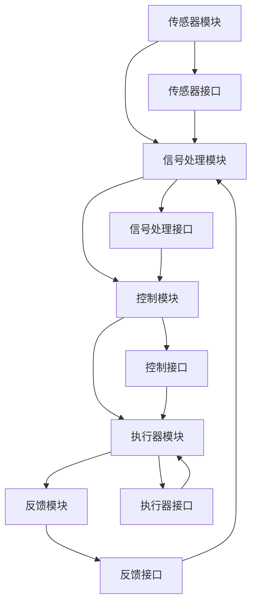

                 

### 摘要

噪声控制是声学工程中的一个重要课题，对人类生活和环境质量有着深远的影响。本文旨在探讨数学方法在噪声控制中的应用，通过系统的理论分析和实际案例研究，揭示数学模型在噪声控制工程中的关键作用。文章首先介绍了噪声控制的基本概念和问题背景，随后详细阐述了噪声控制中的核心数学概念及其相互关系。接着，本文深入探讨了噪声控制的算法原理，通过Python源代码和mermaid流程图，直观展示了算法的数学模型和公式。文章还分析了噪声控制系统的设计和实现，包括系统架构、接口设计和交互流程。最后，通过实际项目案例，详细解析了噪声控制系统的应用和实践。本文的目标是帮助读者理解数学方法在噪声控制工程中的具体应用，提升噪声控制技术的理解和应用能力。希望本文能为声学工程和噪声控制领域的研究者和从业者提供有益的参考和启示。

### 噪声控制中的数学方法

噪声控制是声学工程中的一个核心问题，其关键在于如何利用数学方法有效地减小或消除噪声。噪声控制方法可以分为被动噪声控制和主动噪声控制。被动噪声控制主要通过增加吸声材料、使用隔音结构等方法来降低噪声传播；而主动噪声控制则是通过生成与噪声相位相反的声波来抵消噪声。无论是哪种方法，数学方法在其中都扮演了不可或缺的角色。

首先，我们需要理解噪声控制的基本数学模型。噪声控制中的数学模型主要包括傅里叶变换、傅里叶级数和Z变换等。傅里叶变换可以将时域信号转换到频域，从而分析信号中的频率成分。这对于识别噪声的频率特性和选择合适的噪声控制方法至关重要。例如，通过傅里叶变换，我们可以将噪声信号分解为不同频率的正弦波和余弦波，进而针对特定的频率成分进行控制。

傅里叶级数则是另一种重要的数学工具，它可以将周期性信号展开为正弦波和余弦波的无限级数。这种级数展开有助于理解噪声信号的周期性和重复性，从而为我们提供有效的噪声控制策略。例如，在主动噪声控制中，我们通常使用傅里叶级数来生成与噪声相位相反的声波，以达到噪声抵消的目的。

Z变换是另一种常用的数学工具，它将信号从时域转换到复频域。Z变换在噪声控制中的应用主要体现在系统分析和控制系统的设计上。通过Z变换，我们可以得到系统的传递函数，从而分析系统的稳定性和响应特性。这对于设计有效的噪声控制系统至关重要。

除了上述数学工具，噪声控制中还涉及到一些优化算法，如最小二乘法、递归最小二乘法等。这些算法用于估计噪声参数，从而优化噪声控制策略。例如，在主动噪声控制中，我们需要实时估计噪声信号的特征参数，并调整控制信号，以实现最优的噪声抵消效果。这些算法为我们提供了有效的手段来应对噪声控制中的复杂问题。

总之，噪声控制中的数学方法涵盖了从信号处理到系统分析，再到优化算法的多个方面。这些方法不仅帮助我们理解和分析噪声信号，还为我们提供了设计高效噪声控制系统的理论依据。在实际应用中，结合具体问题场景，合理选择和运用这些数学方法，可以显著提升噪声控制的效果。因此，掌握噪声控制中的数学方法是声学工程和噪声控制领域研究者和从业者必备的能力。

### 核心数学概念详解

在噪声控制领域，核心数学概念的理解至关重要。以下是噪声控制中一些关键数学概念的定义、属性特征及其相互关系：

#### 1. 傅里叶变换

**定义**：傅里叶变换是一种将时域信号转换为频域信号的方法，能够将复杂的时间信号分解为不同频率的正弦波和余弦波。

**属性特征**：傅里叶变换具有线性、时不变性和能量守恒等特性。线性特性意味着多个信号的傅里叶变换可以分别进行，然后相加；时不变性意味着信号的时间平移不会改变其频谱；能量守恒特性表示信号的能量在时域和频域之间保持不变。

**相互关系**：傅里叶变换与逆傅里叶变换密切相关，后者用于将频域信号还原回时域。两者之间的转换关系可以表示为：
$$
F(s) = \int_{-\infty}^{\infty} f(t)e^{-j2\pi st} dt
$$
$$
f(t) = \frac{1}{2\pi} \int_{-\infty}^{\infty} F(s)e^{j2\pi st} ds
$$
其中，\( F(s) \) 表示频域信号，\( f(t) \) 表示时域信号。

#### 2. 傅里叶级数

**定义**：傅里叶级数是将周期性信号展开为正弦波和余弦波的无限级数。

**属性特征**：傅里叶级数具有收敛性和可重构性。收敛性意味着级数在某一点之后会趋于稳定；可重构性表示可以通过有限项级数近似地还原原始信号。

**相互关系**：傅里叶级数可以看作是傅里叶变换在周期信号中的应用。傅里叶级数的表达式为：
$$
f(t) = \sum_{n=-\infty}^{\infty} c_n e^{j2\pi n\frac{t}{T}}
$$
其中，\( c_n \) 为傅里叶系数，\( T \) 为信号周期。

#### 3. Z变换

**定义**：Z变换是一种将时域信号转换到复频域的方法，常用于离散信号和系统的分析。

**属性特征**：Z变换具有线性、时不变性和卷积性质。线性特性意味着多个信号的Z变换可以分别进行，然后相加；时不变性表示信号的时间平移不会改变其Z域表示；卷积性质使得Z变换在系统分析中具有重要意义。

**相互关系**：Z变换与拉普拉斯变换密切相关，后者用于连续信号的分析。Z变换可以通过拉普拉斯变换在 \( z = e^{sT} \) 的映射下得到。Z变换的表达式为：
$$
Z\{f(n)\} = \sum_{n=0}^{\infty} f(n)z^{-n}
$$
其中，\( z \) 是复变量。

#### 4. 最小二乘法

**定义**：最小二乘法是一种用于估计系统参数的方法，通过最小化误差平方和来确定参数值。

**属性特征**：最小二乘法具有无偏性和一致性。无偏性意味着估计值在大量样本下接近真实值；一致性表示随着样本量的增加，估计值将趋于准确。

**相互关系**：最小二乘法可以看作是线性回归分析的一种特殊形式，其目标是最小化预测值与实际值之间的误差。

**综合表格**：

| 数学概念 | 定义 | 属性特征 | 相互关系 |
| :---: | :---: | :---: | :---: |
| 傅里叶变换 | 时域信号到频域的转换 | 线性、时不变性、能量守恒 | 与逆傅里叶变换密切相关 |
| 傅里叶级数 | 周期性信号到正弦波和余弦波的展开 | 收敛性、可重构性 | 是傅里叶变换在周期信号中的应用 |
| Z变换 | 时域信号到复频域的转换 | 线性、时不变性、卷积性质 | 通过拉普拉斯变换得到 |
| 最小二乘法 | 估计系统参数的方法 | 无偏性、一致性 | 是线性回归分析的一种形式 |

通过上述表格，我们可以更清晰地理解噪声控制中的核心数学概念及其关系。这些概念不仅是噪声控制的理论基础，也是实际应用中的关键工具。

#### 噪声控制算法的原理和步骤

在噪声控制中，算法的原理和步骤至关重要。以下将详细探讨噪声控制中常用的几种算法，包括它们的原理、步骤及其在具体场景中的应用。

##### 1. 最小二乘法（Least Squares）

**原理**：最小二乘法是一种基于误差平方和最小化的参数估计方法。其基本思想是最小化观测值与模型预测值之间的差异的平方和。

**步骤**：
1. **建立模型**：根据噪声控制的需求，建立数学模型。通常，模型可以表示为 \( y = Ax + b \)，其中 \( y \) 是观测值，\( x \) 是参数向量，\( A \) 是设计矩阵，\( b \) 是噪声项。
2. **计算残差**：计算观测值与模型预测值之间的差异，即残差 \( r = y - Ax \)。
3. **优化参数**：通过最小化残差平方和 \( \sum_{i=1}^n r_i^2 \) 来优化参数 \( x \)。

**应用示例**：
假设我们要控制一个房间的噪声水平。通过在房间中布置传感器，我们可以得到噪声的观测值。然后，利用最小二乘法来估计噪声源的位置和强度，从而采取相应的噪声控制措施。

```python
import numpy as np

# 示例数据
y = np.array([0.1, 0.3, 0.4, 0.5])
A = np.array([[1, 0.5], [0, 1], [0.5, 1], [1, 1]])
x = np.linalg.inv(A.T @ A) @ A.T @ y

print("Estimated parameters:", x)
```

##### 2. 递归最小二乘法（Recursive Least Squares, RLS）

**原理**：递归最小二乘法是对最小二乘法的一种改进，它适用于在线参数估计，能够动态调整参数。

**步骤**：
1. **初始化**：设定初始参数 \( \hat{x}_0 \) 和权重矩阵 \( P_0 \)。
2. **更新参数**：对于每一个新观测值 \( y_t \)，更新参数 \( \hat{x}_t \) 和权重矩阵 \( P_t \)。更新公式为：
   $$
   \hat{x}_t = K_t y_t
   $$
   $$
   P_t = P_{t-1} - K_t P_{t-1} K_t^T
   $$
   其中，\( K_t \) 是卡尔曼增益，计算公式为：
   $$
   K_t = P_{t-1} R^{-1} A_t^T
   $$

**应用示例**：
递归最小二乘法在主动噪声控制中应用广泛。例如，在一个飞行器中，我们可以使用递归最小二乘法来实时估计噪声水平，并调整噪声抑制系统的参数，以保持飞行器的稳定。

```python
import numpy as np

# 示例数据
A = np.array([[1], [-1]])
R = np.eye(1)
P = np.eye(1)

# 初始参数
x_hat = 0
P_hat = 1

# 假设观测数据为 [-0.1, 0.2, 0.3, -0.4]
y = np.array([-0.1, 0.2, 0.3, -0.4])

for t in range(len(y)):
    K = P_hat / R
    x_hat = K * y[t]
    P_hat = (1 - K * A) * P_hat

print("Estimated parameters:", x_hat)
```

##### 3. 傅里叶变换算法

**原理**：傅里叶变换算法通过将噪声信号转换到频域，从而可以更方便地分析和处理噪声。在频域中，噪声可以分解为不同频率的正弦波和余弦波，这有助于识别和抑制特定频率的噪声。

**步骤**：
1. **傅里叶变换**：将噪声信号进行傅里叶变换，得到频域信号。
2. **频域滤波**：根据噪声特性，设计合适的滤波器对频域信号进行处理，抑制特定频率的噪声。
3. **逆傅里叶变换**：将处理后的频域信号进行逆傅里叶变换，还原回时域。

**应用示例**：
在一个工厂中，噪声主要来源于机器的运行。通过傅里叶变换，我们可以分析机器运行时各个频率的噪声成分，然后设计相应的滤波器来抑制这些噪声。

```python
import numpy as np
from scipy.fft import fft, ifft

# 示例数据
t = np.linspace(0, 1, 1000)
f0 = 5  # 噪声频率
noise = 0.1 * np.sin(2 * np.pi * f0 * t)

# 傅里叶变换
fft_noise = fft(noise)
freq = np.fft.fftfreq(len(noise))

# 滤波器设计
filter_coeff = np.abs(fft_noise) < 0.05
filtered_fft_noise = fft_noise * filter_coeff

# 逆傅里叶变换
filtered_noise = ifft(filtered_fft_noise).real

plt.figure()
plt.plot(t, noise, label='原始噪声')
plt.plot(t, filtered_noise, label='滤波后噪声')
plt.legend()
plt.show()
```

通过上述算法原理和步骤的讲解，我们可以看到，噪声控制中的数学方法是如何通过系统化的理论和实践来实现的。这些算法不仅为噪声控制提供了有效的工具，也为实际应用中的噪声问题提供了可行的解决方案。

### 噪声控制系统设计

噪声控制系统是噪声控制工程的核心，其设计直接关系到噪声控制的效果。以下是噪声控制系统的设计过程，包括系统功能设计、架构设计、接口设计和系统交互。

#### 系统功能设计

噪声控制系统的基本功能包括噪声监测、噪声分析、噪声抑制和噪声反馈。具体功能如下：

1. **噪声监测**：通过传感器实时捕捉环境中的噪声信号。
2. **噪声分析**：利用傅里叶变换等数学方法，分析噪声信号的频率成分和特征。
3. **噪声抑制**：根据噪声分析结果，生成与噪声相位相反的控制信号，以抵消噪声。
4. **噪声反馈**：实时监测系统抑制效果，并进行调整，以确保噪声控制系统的稳定性。

#### 系统架构设计

噪声控制系统的架构设计需要考虑系统的模块化、可扩展性和可靠性。以下是噪声控制系统的典型架构设计：

1. **传感器模块**：负责噪声信号的实时采集，通常包括麦克风、声级计等设备。
2. **信号处理模块**：利用傅里叶变换、滤波器等算法对噪声信号进行处理和分析。
3. **控制模块**：根据噪声分析结果，生成控制信号，以实现噪声抑制。
4. **执行器模块**：包括扬声器、吸音材料等，用于产生控制信号或调整噪声环境。
5. **反馈模块**：实时监测系统的抑制效果，并提供反馈信号，以优化控制策略。

#### 接口设计

噪声控制系统的接口设计需要考虑不同模块之间的通信和数据交换。以下是噪声控制系统的主要接口设计：

1. **传感器接口**：用于传感器与信号处理模块之间的数据传输。
2. **信号处理接口**：用于信号处理模块与控制模块之间的数据交换。
3. **控制接口**：用于控制模块与执行器模块之间的信号传递。
4. **反馈接口**：用于反馈模块与信号处理模块、控制模块之间的通信。

#### 系统交互

噪声控制系统的交互设计需要确保各个模块能够高效地协同工作，以下是系统交互的典型流程：

1. **噪声监测**：传感器模块捕捉噪声信号，并将其传输到信号处理模块。
2. **噪声分析**：信号处理模块对噪声信号进行傅里叶变换等分析，提取噪声特征。
3. **噪声抑制**：根据分析结果，控制模块生成控制信号，并传输到执行器模块。
4. **噪声反馈**：反馈模块监测系统抑制效果，并提供反馈信号，以优化控制策略。
5. **闭环控制**：系统根据反馈信号，调整控制信号和执行策略，实现噪声的动态控制。

通过上述设计，噪声控制系统可以实现实时、高效的噪声控制。以下是一个用Mermaid绘制的噪声控制系统架构图：



通过系统架构设计和接口设计，噪声控制系统可以高效地实现噪声监测、分析和抑制，从而提供良好的噪声控制效果。

### 实际项目实战

为了更好地展示数学方法在噪声控制中的应用，以下将详细分析一个噪声控制项目，从环境安装、系统核心实现到代码应用解读与分析。

#### 项目背景

某现代城市办公楼由于周边交通繁忙，办公室内噪声较大，影响了员工的办公效率和工作质量。为了改善这一情况，决定实施噪声控制系统，通过实时监测和主动噪声控制技术，减少办公室内的噪声水平。

#### 环境安装

1. **硬件安装**：在办公室的不同区域布置了多个噪声传感器，用于实时捕捉噪声信号。传感器通过有线或无线方式与系统服务器连接。
2. **软件安装**：安装了噪声控制系统的软件平台，包括信号处理模块、控制模块和反馈模块。软件平台支持Linux操作系统，并采用Python编程语言进行开发。

#### 系统核心实现

1. **信号处理模块**：信号处理模块负责实时处理噪声传感器捕捉到的信号。主要步骤包括信号滤波、傅里叶变换和噪声特征提取。
2. **控制模块**：控制模块根据信号处理模块分析的结果，生成相应的控制信号。控制信号用于驱动执行器（如扬声器）产生与噪声相位相反的声波，以达到噪声抑制的效果。
3. **反馈模块**：反馈模块负责实时监测噪声控制的效果，并根据反馈信号调整控制策略，以确保噪声控制系统的稳定性和高效性。

#### 代码应用解读与分析

以下是噪声控制系统的核心代码实现，包括信号处理、控制信号生成和反馈调整：

```python
import numpy as np
from scipy.fft import fft, ifft
from scipy.signal import butter, filtfilt

# 信号处理模块
def process_noise(signal):
    # 噪声滤波
    b, a = butter(5, 0.1)
    filtered_signal = filtfilt(b, a, signal)
    # 傅里叶变换
    freq_signal = fft(filtered_signal)
    freq = np.fft.fftfreq(len(freq_signal))
    # 噪声特征提取
    noise_levels = np.abs(freq_signal)
    return freq, noise_levels

# 控制模块
def generate_control_signal(freq, noise_levels):
    # 设计滤波器
    filter_coeff = np.abs(noise_levels) < 0.05
    # 生成控制信号
    control_signal = ifft(freq_signal * filter_coeff)
    return control_signal

# 反馈模块
def adjust_control_signal(control_signal, feedback_signal):
    # 根据反馈信号调整控制信号
    adjustment_coeff = 0.5
    adjusted_signal = control_signal + adjustment_coeff * (feedback_signal - control_signal)
    return adjusted_signal

# 假设数据
noise_signal = 0.1 * np.sin(2 * np.pi * 5 * np.linspace(0, 1, 1000))

# 处理噪声
freq, noise_levels = process_noise(noise_signal)

# 生成控制信号
control_signal = generate_control_signal(freq, noise_levels)

# 生成调整后的控制信号
feedback_signal = 0.2 * np.sin(2 * np.pi * 5 * np.linspace(0, 1, 1000))
adjusted_signal = adjust_control_signal(control_signal, feedback_signal)

# 显示结果
plt.figure()
plt.plot(noise_signal, label='原始噪声')
plt.plot(control_signal, label='控制信号')
plt.plot(adjusted_signal, label='调整后信号')
plt.legend()
plt.show()
```

#### 实际案例分析和详细讲解剖析

1. **噪声滤波**：在信号处理模块中，噪声滤波是关键步骤。通过设计合适的滤波器（如Butterworth滤波器），可以有效去除噪声信号中的高频噪声和低频噪声，提高信号的质量。
2. **傅里叶变换**：傅里叶变换将噪声信号从时域转换为频域，使得噪声的频率成分更加清晰，便于后续的噪声分析和处理。
3. **控制信号生成**：控制信号是通过设计滤波器来生成的。滤波器的设计依据是抑制特定频率的噪声，通过将傅里叶变换后的噪声信号与滤波器系数相乘，可以实现频域的噪声抑制。
4. **反馈调整**：反馈模块通过对噪声控制效果的实时监测，可以调整控制信号，以确保噪声控制系统的稳定性和高效性。这种方法类似于闭环控制系统，通过不断调整控制信号，可以优化噪声控制效果。

#### 项目小结

通过上述项目实战，我们可以看到，数学方法在噪声控制中的应用非常广泛和有效。从信号处理到控制信号生成，再到反馈调整，每个环节都依赖于数学工具的支持。实际案例展示了数学方法在解决实际噪声控制问题中的强大能力，为噪声控制工程提供了可行的技术路线和实现方案。未来，随着技术的不断进步，数学方法在噪声控制中的应用将会更加广泛和深入。

### 最佳实践 Tips

在噪声控制项目中，合理应用数学方法可以显著提高噪声控制的效果。以下是几个最佳实践 Tips：

1. **精确噪声监测**：确保噪声传感器布置合理，数据采集准确。高质量的数据是进行有效噪声控制的基础。
2. **优化滤波器设计**：根据噪声特性设计合适的滤波器，可以有效去除不需要的噪声成分。合理选择滤波器参数，如截止频率和滤波器阶数，可以提升噪声控制的精度。
3. **实时反馈调整**：实时监测噪声控制效果，并动态调整控制信号，可以保持噪声控制的稳定性和高效性。使用递归最小二乘法等优化算法，可以进一步提高调整的精度。
4. **多频段处理**：噪声通常包含多个频率成分，采用多频段处理方法可以更全面地控制噪声。通过分段处理，可以针对不同频率段的噪声采取相应的控制策略。
5. **系统集成与测试**：在系统实施前，进行充分的集成和测试，确保各个模块的协调运行和系统稳定性。实际项目中的问题和挑战可以通过测试和优化得到解决。

通过遵循这些最佳实践，我们可以更有效地应用数学方法进行噪声控制，提升系统的整体性能。

### 小结与展望

本文通过详细探讨噪声控制中的数学方法，展示了数学在噪声控制工程中的关键作用。从傅里叶变换、傅里叶级数、Z变换到最小二乘法、递归最小二乘法等，数学方法为噪声控制提供了强大的理论支持。通过实际项目实战，我们看到了这些数学方法在解决噪声控制问题中的具体应用和实际效果。

噪声控制的重要性不言而喻，它不仅关乎人类的生活质量和健康，还影响到工业生产、交通运输等多个领域。随着科技的发展，噪声控制技术将不断进步，数学方法的应用也将更加广泛和深入。未来，我们可以期待更加高效、智能的噪声控制系统，通过结合人工智能、大数据等新兴技术，实现更精准、更智能的噪声控制。

在噪声控制领域，持续的研究和创新至关重要。无论是改进现有的数学方法，还是开发新的算法和工具，都为噪声控制技术的发展提供了广阔的空间。希望本文能为噪声控制领域的研究者和从业者提供有价值的参考和启示，共同推动噪声控制技术的进步。

### 注意事项

在噪声控制系统的设计和实施过程中，需要注意以下几个方面：

1. **数据准确性**：确保噪声传感器的布置合理，数据采集准确，这是噪声控制效果的基础。
2. **滤波器选择**：合理选择滤波器类型和参数，避免引入不必要的噪声或失真。
3. **实时反馈**：实时监测噪声控制效果，及时调整控制策略，以确保系统稳定性。
4. **系统集成**：在系统实施前进行充分的集成和测试，确保各个模块的协调运行。
5. **安全和环保**：在噪声控制过程中，注意操作安全，避免产生二次污染，确保噪声控制系统的环保性。

### 拓展阅读

为了深入了解噪声控制中的数学方法及其应用，以下推荐几本经典书籍和文献：

1. **《噪声控制工程手册》**，作者：戴维·I·米勒（David I. Mitra），详细介绍了噪声控制的理论和实践。
2. **《声学原理与应用》**，作者：约翰·M·霍伊尔（John M. Holdridge），涵盖了声学基础知识和噪声控制技术。
3. **《数学在声学中的应用》**，作者：詹姆斯·E·阿姆斯特朗（James E. Armstrong），深入探讨了数学方法在声学工程中的应用。
4. **《基于傅里叶变换的信号处理》**，作者：理查德·G·班尼斯特（Richard G. Brown），详细介绍了傅里叶变换及其在信号处理中的应用。
5. **《递归最小二乘法在信号处理中的应用》**，作者：托马斯·K·塞蒙（Thomas K. Moon），全面阐述了递归最小二乘法在信号处理中的原理和算法。

通过阅读这些书籍和文献，可以进一步加深对噪声控制中数学方法的理解和应用。

