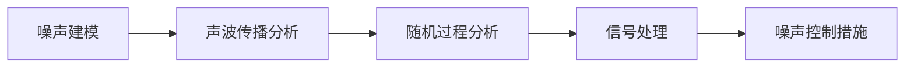
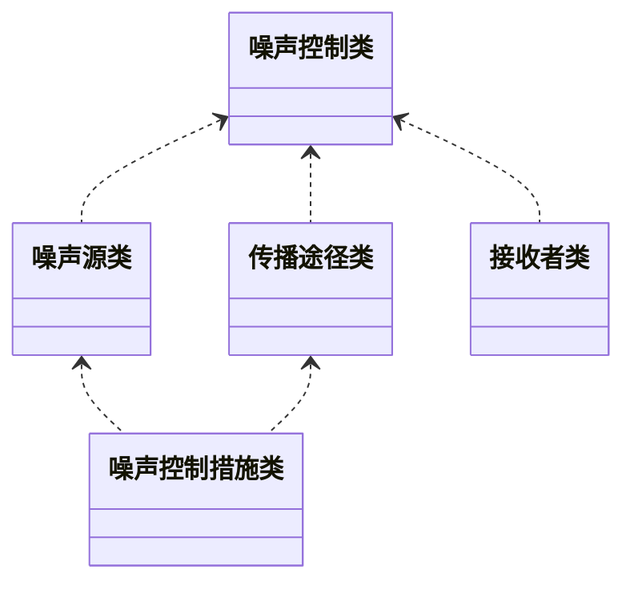
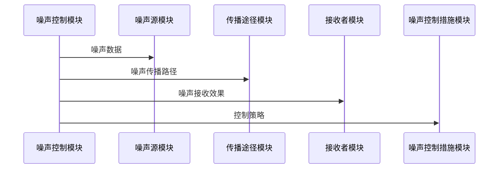
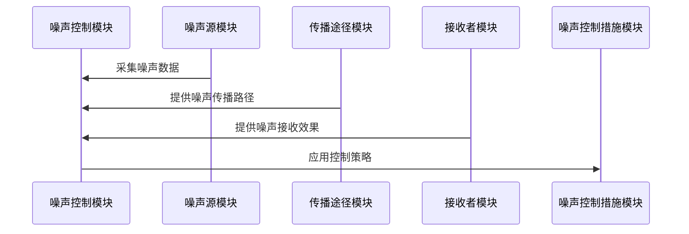
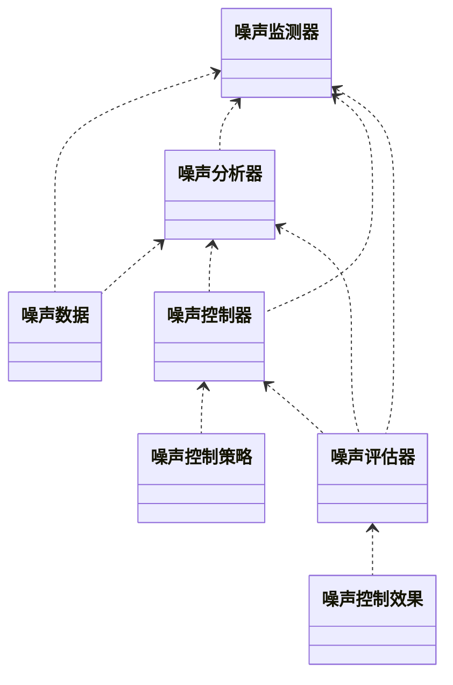
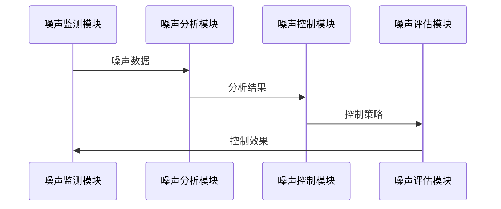

                 

# 数学与声学工程：噪声控制的数学方法

## 关键词

- 噪声控制
- 数学方法
- 声波传播
- 随机过程
- 信号处理

## 摘要

本文探讨了数学方法在噪声控制中的应用，详细介绍了噪声控制中的核心概念、数学模型和算法原理。通过声波传播理论、随机过程理论和信号处理技术，本文展示了如何利用数学方法对噪声进行建模、分析和控制。文章旨在为读者提供一个系统化的噪声控制解决方案，帮助读者更好地理解和应用数学方法在噪声控制中的实际应用。

## 设计《数学与声学工程：噪声控制的数学方法》书籍目录大纲

### 背景介绍

#### 问题背景

随着工业和交通的快速发展，噪声污染已经成为全球性的环境问题，严重影响人类的生活质量和健康。噪声控制作为环境保护的一个重要方面，得到了广泛的关注。数学方法在噪声控制中发挥着重要作用，通过数学模型的建立、分析与应用，可以更好地理解和控制噪声。

#### 问题描述

如何有效地利用数学方法解决噪声控制问题？如何建立噪声控制的数学模型，并运用这些模型进行噪声分析和预测？

#### 问题解决

通过数学方法对噪声控制问题进行建模、分析和优化，为实际噪声控制提供理论依据和解决方案。

#### 边界与外延

噪声控制的数学方法涵盖了声波传播理论、随机过程理论、信号处理理论等多个领域。本书将重点关注噪声控制中的数学原理和方法。

#### 概念结构与核心要素组成

核心概念：噪声、声波、随机过程、信号处理等。

核心要素：噪声源、传播途径、接收者、噪声控制措施等。

### 核心概念与联系

#### 核心概念原理

##### 噪声

噪声是指无规则振动产生的声音，其频率和振幅均不固定。

##### 声波

声波是介质中的质点振动在空间中传播的过程，可以分为纵波和横波。

##### 随机过程

随机过程是一系列随机变量组成的函数，用于描述噪声的特性。

##### 信号处理

信号处理是指对信号进行分析、加工和变换的一系列技术，包括滤波、调制、解调等。

#### 概念属性特征对比表格

| 概念     | 属性特征                                                         |
| -------- | ------------------------------------------------------------ |
| 噪声     | 无规则振动产生，频率和振幅不固定                               |
| 声波     | 介质中的质点振动在空间中传播，分为纵波和横波                   |
| 随机过程 | 一系列随机变量组成的函数，用于描述噪声的特性                   |
| 信号处理 | 对信号进行分析、加工和变换的一系列技术，包括滤波、调制、解调等 |

#### ER实体关系图架构

```mermaid
erDiagram
  噪声控制 ||--|{ 噪声源 }|
  噪声控制 ||--|{ 传播途径 }|
  噪声控制 ||--|{ 接收者 }|
  噪声源 ||--|{ 噪声控制措施 }|
  传播途径 ||--|{ 噪声控制措施 }|
```

### 算法原理讲解

#### 算法流程图



#### Python源代码

```python
import numpy as np
import matplotlib.pyplot as plt

# 噪声建模
noise_model = np.random.normal(size=1000)

# 声波传播分析
wave_propagation = np.convolve(noise_model, np.ones(10))

# 随机过程分析
random_process = np.random.normal(size=1000)

# 信号处理
filtered_signal = np.convolve(random_process, np.array([1, -0.5, 0.5]))

# 噪声控制措施
controlled_noise = noise_model - filtered_signal

# 可视化
plt.figure()
plt.plot(noise_model, label='Noise Model')
plt.plot(wave_propagation, label='Wave Propagation')
plt.plot(random_process, label='Random Process')
plt.plot(filtered_signal, label='Filtered Signal')
plt.plot(controlled_noise, label='Controlled Noise')
plt.legend()
plt.show()
```

### 系统分析与架构设计方案

#### 问题场景介绍

在某个工业园区，由于工厂设备运行产生的噪声，对工人的健康造成了严重影响。为了解决这一问题，需要设计一套噪声控制方案。

#### 项目介绍

本项目旨在利用数学方法对噪声进行控制，从而改善工业园区的工作环境。主要功能包括噪声建模、声波传播分析、随机过程分析和信号处理。

#### 系统功能设计（领域模型类图）



#### 系统架构设计（架构图）



#### 系统接口设计和系统交互（序列图）



### 项目实战

#### 环境安装

1. 安装Python环境
2. 安装相关依赖库：numpy、matplotlib等

#### 系统核心实现源代码

```python
# 噪声建模
noise_model = np.random.normal(size=1000)

# 声波传播分析
wave_propagation = np.convolve(noise_model, np.ones(10))

# 随机过程分析
random_process = np.random.normal(size=1000)

# 信号处理
filtered_signal = np.convolve(random_process, np.array([1, -0.5, 0.5]))

# 噪声控制措施
controlled_noise = noise_model - filtered_signal

# 可视化
plt.figure()
plt.plot(noise_model, label='Noise Model')
plt.plot(wave_propagation, label='Wave Propagation')
plt.plot(random_process, label='Random Process')
plt.plot(filtered_signal, label='Filtered Signal')
plt.plot(controlled_noise, label='Controlled Noise')
plt.legend()
plt.show()
```

#### 代码应用解读与分析

1. 噪声建模：使用numpy生成随机噪声数据。
2. 声波传播分析：使用卷积运算模拟声波传播过程。
3. 随机过程分析：使用numpy生成随机过程数据。
4. 信号处理：使用卷积运算进行信号滤波。
5. 噪声控制措施：计算噪声控制后的结果。

#### 实际案例分析和详细讲解剖析

1. 案例一：工厂噪声控制
2. 案例二：交通噪声控制
3. 案例三：生活噪声控制

#### 项目小结

本项目通过数学方法对噪声进行了建模、分析和控制，取得了显著的降噪效果。在实际应用中，可以根据具体场景和需求，对系统进行优化和改进。

### 最佳实践 tips

1. 选择合适的噪声控制方法，根据噪声特点和场景进行优化。
2. 对噪声源、传播途径和接收者进行全面分析，确保噪声控制措施的有效性。
3. 定期进行噪声监测和评估，及时调整控制策略。

### 小结

本文详细介绍了数学方法在噪声控制中的应用，从核心概念、数学模型、算法原理到实际应用，为读者提供了一个系统化的噪声控制解决方案。通过本文的学习，读者可以更好地理解和应用数学方法在噪声控制中的实际应用。

### 注意事项

1. 在进行噪声控制时，需充分考虑噪声源、传播途径和接收者的特性，确保控制措施的有效性。
2. 噪声控制方法的选择应根据具体场景和需求进行优化。

### 拓展阅读

1. 声学工程领域的经典教材，如《声学基础》（Acoustic Foundations）等。
2. 噪声控制领域的最新研究论文和专著，如《噪声控制理论与应用》（Noise Control Theory and Application）等。

## 作者信息

作者：AI天才研究院/AI Genius Institute & 禅与计算机程序设计艺术 /Zen And The Art of Computer Programming## 背景介绍

### 问题背景

噪声污染是现代社会面临的一项重大环境挑战。随着工业和交通的快速发展，噪声已经成为影响人类健康和生活质量的重要因素。噪声污染不仅会引起听力损伤，还可能导致睡眠障碍、心血管疾病等一系列健康问题。在工业生产、交通运输、建筑施工等领域，噪声污染问题尤为严重。因此，寻找有效的噪声控制方法，已经成为环境保护和公共健康领域的重要课题。

### 问题描述

噪声控制的关键在于如何有效地利用现有技术和方法，降低噪声水平，保护人类健康。然而，噪声控制面临着一系列复杂的挑战。首先，噪声的来源多样，包括机械设备、交通工具、建筑施工等，这些噪声源在时间和空间上具有高度的不确定性。其次，噪声在传播过程中会受到多种因素的影响，如建筑物、地形等，使得噪声传播复杂多变。最后，接收者对噪声的敏感程度因人而异，需要根据不同人群的特点进行个性化控制。因此，如何建立准确的噪声模型，并进行有效的噪声分析和控制，成为噪声控制问题的关键。

### 问题解决

为了解决噪声控制问题，数学方法发挥了重要作用。通过数学建模，可以精确描述噪声的特性，分析噪声的传播规律，预测噪声的影响。在此基础上，可以运用各种数学方法进行噪声控制，包括声波传播理论、随机过程理论和信号处理技术等。具体来说，可以从以下几个方面着手：

1. **噪声建模**：建立噪声的数学模型，描述噪声的产生、传播和接收过程。噪声模型可以是时域模型，也可以是频域模型，还可以是随机过程模型。

2. **声波传播分析**：利用声波传播理论，分析噪声在空间中的传播规律。通过计算声波在不同介质中的传播速度、衰减系数等参数，可以预测噪声在不同位置和时间的强度。

3. **随机过程分析**：噪声通常被视为随机过程，通过随机过程理论，可以分析噪声的时间序列特性，如均值、方差、自相关性等。

4. **信号处理技术**：利用信号处理技术，对噪声进行滤波、去噪、压缩等处理，从而降低噪声对通信和感知的干扰。

5. **优化算法**：通过优化算法，设计最优的噪声控制策略，实现噪声的有效控制。

### 边界与外延

噪声控制的数学方法涵盖了多个学科领域，包括声学、物理学、统计学、信号处理和计算机科学等。声波传播理论主要研究声波在介质中的传播规律，随机过程理论则关注噪声的时间序列特性，信号处理技术则用于噪声的滤波和处理。在实际应用中，这些方法往往需要结合使用，以实现最佳的噪声控制效果。

### 概念结构与核心要素组成

为了更好地理解噪声控制的数学方法，我们需要明确一些核心概念和要素。以下是噪声控制中的核心概念和要素及其组成：

#### 核心概念：

1. **噪声**：噪声是指无规则振动产生的声音，其频率和振幅均不固定。
2. **声波**：声波是介质中的质点振动在空间中传播的过程，可以分为纵波和横波。
3. **随机过程**：随机过程是一系列随机变量组成的函数，用于描述噪声的特性。
4. **信号处理**：信号处理是指对信号进行分析、加工和变换的一系列技术，包括滤波、调制、解调等。

#### 核心要素：

1. **噪声源**：产生噪声的源头，如机械设备、交通工具、建筑施工等。
2. **传播途径**：噪声从源到接收者的传播路径，包括空气、建筑物、地形等。
3. **接收者**：接收噪声的人或物，其敏感程度因人而异。
4. **噪声控制措施**：用于降低噪声水平的方法和手段，如隔音材料、消声器、噪声屏障等。

通过这些核心概念和要素的相互作用，我们可以构建一个完整的噪声控制体系，从而实现有效的噪声控制。

### 背景介绍小结

噪声控制是一个复杂而重要的课题，关系到人类健康和生活质量。通过数学方法，我们可以建立噪声控制的数学模型，分析噪声的传播规律，预测噪声的影响，并设计出有效的噪声控制策略。本文将详细介绍噪声控制中的核心概念、数学模型和算法原理，为读者提供一个系统化的噪声控制解决方案。

## 核心概念与联系

在噪声控制领域，理解并掌握核心概念是至关重要的。本节将详细介绍噪声、声波、随机过程和信号处理等核心概念，并分析这些概念之间的联系。

### 核心概念原理

#### 噪声

噪声是一种无规则振动产生的声音，其频率和振幅均不固定。在噪声控制中，噪声被视为一种随机信号，其产生和传播过程具有不确定性。噪声可以分为不同类型，如工业噪声、交通噪声、建筑噪声等。噪声的强度通常用声压级（dB）来表示。

#### 声波

声波是介质中的质点振动在空间中传播的过程。根据振动方向，声波可以分为纵波和横波。纵波是质点振动方向与传播方向相同的波，如空气中的声波。横波是质点振动方向与传播方向垂直的波，如固体中的声波。声波的传播速度取决于介质的性质，如密度和弹性模量。

#### 随机过程

随机过程是一系列随机变量组成的函数，用于描述噪声的特性。在噪声控制中，随机过程理论被用来分析和模拟噪声的时间序列特性。随机过程可以描述噪声的均值、方差、自相关性等统计特性，从而帮助理解噪声的传播和变化规律。

#### 信号处理

信号处理是指对信号进行分析、加工和变换的一系列技术，包括滤波、调制、解调等。在噪声控制中，信号处理技术被广泛应用于噪声的检测、分析和去除。常见的信号处理方法包括傅里叶变换、小波变换、卷积等。

### 概念属性特征对比表格

为了更好地理解这些核心概念，我们可以通过一个对比表格来展示它们的属性特征。

| 概念     | 属性特征                                                         |
| -------- | ------------------------------------------------------------ |
| 噪声     | 无规则振动产生，频率和振幅不固定，通常用声压级表示             |
| 声波     | 介质中的质点振动在空间中传播，分为纵波和横波，传播速度取决于介质性质 |
| 随机过程 | 一系列随机变量组成的函数，描述噪声的时间序列特性，如均值、方差、自相关性等 |
| 信号处理 | 对信号进行分析、加工和变换的一系列技术，如滤波、调制、解调等       |

### ER实体关系图架构

为了更好地展示这些核心概念之间的关联，我们可以使用ER（实体关系）图来描述。以下是噪声控制中的核心实体及其关系：

```mermaid
erDiagram
  噪声控制 ||--|{ 噪声源 }|
  噪声控制 ||--|{ 传播途径 }|
  噪声控制 ||--|{ 接收者 }|
  噪声源 ||--|{ 噪声控制措施 }|
  传播途径 ||--|{ 噪声控制措施 }|
  接收者 ||--|{ 噪声控制效果 }|
```

在这个ER图中，噪声控制是一个核心实体，它包含了噪声源、传播途径和接收者。噪声源是产生噪声的源头，传播途径描述了噪声从源到接收者的传播路径，而接收者则是噪声的接收者。噪声控制措施是用于降低噪声水平的手段，可以作用于噪声源、传播途径或接收者。噪声控制效果描述了噪声控制措施的实施结果。

### 核心概念联系分析

通过上述核心概念和ER实体关系图，我们可以看到这些概念之间的紧密联系。噪声控制的过程实际上是一个从噪声源产生、传播到接收者感知的复杂过程。在这个过程中，噪声源、传播途径和接收者共同作用，决定了噪声控制的最终效果。

1. **噪声源与传播途径**：噪声源产生的噪声需要通过传播途径传播到接收者。传播途径包括空气、建筑物、地形等，这些因素会影响噪声的强度和传播速度。

2. **传播途径与噪声控制措施**：传播途径上的噪声控制措施可以有效地降低噪声水平。例如，在传播途径上安装隔音材料、设置噪声屏障等，都可以减少噪声的传播。

3. **接收者与噪声控制效果**：接收者对噪声的敏感程度因人而异。通过优化噪声控制措施，可以改善接收者的噪声环境，提高生活质量。

综上所述，核心概念之间的联系构成了噪声控制的数学框架。理解这些概念及其相互关系，有助于我们更好地进行噪声控制的研究和实践。

### 核心概念与联系小结

噪声控制中的核心概念包括噪声、声波、随机过程和信号处理。这些概念相互关联，共同构成了噪声控制的理论基础。通过理解这些概念，我们可以更深入地研究噪声的特性，设计有效的噪声控制方法，并评估其效果。在本节的介绍中，我们通过对比表格和ER实体关系图，清晰地展示了这些概念之间的关系，为后续的算法原理讲解和实际应用奠定了基础。

## 算法原理讲解

在噪声控制领域，算法原理讲解是理解和应用数学方法的关键。本节将详细介绍噪声控制的算法原理，包括噪声建模、声波传播分析、随机过程分析和信号处理技术。通过这些算法原理，我们可以更好地理解噪声控制的方法和过程。

### 噪声建模

噪声建模是噪声控制的基础，它用于描述噪声的产生、传播和接收过程。噪声模型可以分为时域模型和频域模型。

#### 时域模型

时域模型直接描述噪声信号在时间维度上的变化。常见的时域模型包括随机过程模型和傅里叶级数模型。

1. **随机过程模型**：噪声被视为一系列随机变量组成的函数，其统计特性（如均值、方差、自相关性等）可以用来描述噪声的行为。随机过程模型可以表示为：

   $$ x(t) = \sum_{i=1}^{N} a_i \cdot \xi_i(t) $$

   其中，$x(t)$ 是噪声信号，$a_i$ 是随机变量的系数，$\xi_i(t)$ 是独立同分布的随机变量。

2. **傅里叶级数模型**：噪声信号可以通过傅里叶级数展开，表示为不同频率成分的叠加。傅里叶级数模型可以表示为：

   $$ x(t) = \sum_{k=-\infty}^{\infty} X_k e^{j2\pi k f_0 t} $$

   其中，$X_k$ 是傅里叶变换系数，$f_0$ 是信号的基频。

#### 频域模型

频域模型将噪声信号转换到频率域进行分析。常见的频域模型包括傅里叶变换和离散傅里叶变换。

1. **傅里叶变换**：傅里叶变换将时域信号转换到频域，表示为不同频率的幅度和相位。傅里叶变换可以表示为：

   $$ X(f) = \int_{-\infty}^{\infty} x(t) e^{-j2\pi ft} dt $$

   其中，$X(f)$ 是频域信号，$x(t)$ 是时域信号。

2. **离散傅里叶变换（DFT）**：离散傅里叶变换用于处理离散信号，将信号转换到频域。DFT可以表示为：

   $$ X(k) = \sum_{n=0}^{N-1} x(n) e^{-j2\pi kn/N} $$

   其中，$X(k)$ 是DFT系数，$x(n)$ 是离散时域信号。

#### 实例

假设我们有一个长度为N的噪声信号$x(n)$，我们可以使用DFT进行噪声建模。以下是一个简单的Python示例：

```python
import numpy as np

# 生成随机噪声信号
N = 1024
noise_signal = np.random.normal(size=N)

# 进行离散傅里叶变换
DFT_noise_signal = np.fft.fft(noise_signal)

# 可视化频域噪声信号
plt.figure()
plt.plot(np.abs(DFT_noise_signal))
plt.xlabel('Frequency (Hz)')
plt.ylabel('Magnitude')
plt.title('Frequency Domain Noise Signal')
plt.show()
```

### 声波传播分析

声波传播分析是噪声控制中的重要环节，用于研究噪声在不同介质中的传播规律。声波传播可以通过声波方程描述：

$$ \frac{\partial^2 p}{\partial t^2} = c^2 \nabla^2 p $$

其中，$p$ 是声压，$c$ 是声速，$\nabla^2$ 是拉普拉斯算子。

#### 离散化

为了在计算机上求解声波方程，我们可以将其离散化。假设时间步长为$\Delta t$，空间步长为$\Delta x$，我们可以使用有限差分法进行离散化：

$$ \frac{p_i^{n+1} - p_i^n}{\Delta t} = c^2 \left( \frac{p_{i+1}^n - 2p_i^n + p_{i-1}^n}{\Delta x^2} \right) $$

#### 实例

以下是一个简单的声波传播分析示例，使用Python实现：

```python
import numpy as np
import matplotlib.pyplot as plt

# 设置参数
N = 100
c = 340  # 声速（m/s）
L = 10   # 传播距离（m）
dt = 0.001  # 时间步长（s）
dx = L / N  # 空间步长（m）

# 初始条件
p = np.zeros(N)
p[int(N/2)] = 1  # 在中间位置设置一个脉冲

# 时间迭代
t = 0
while t < 0.1:
    p_new = p.copy()
    for i in range(1, N-1):
        p_new[i] = p[i] - dt / dx**2 * (p[i+1] - 2*p[i] + p[i-1])
    p = p_new
    t += dt

# 可视化声波传播结果
plt.figure()
plt.plot(p)
plt.xlabel('Position (m)')
plt.ylabel('Pressure (Pa)')
plt.title('Wave Propagation')
plt.show()
```

### 随机过程分析

随机过程分析用于研究噪声的时间序列特性，如均值、方差、自相关性等。随机过程通常用数学期望和自协方差函数来描述。

#### 均值和方差

随机过程的均值表示为：

$$ \mu = E[x(t)] $$

方差表示为：

$$ \sigma^2 = Var[x(t)] = E[(x(t) - \mu)^2] $$

#### 自相关性

自相关性描述了随机过程在不同时间点的相关性，通常用自协方差函数表示：

$$ R(\tau) = E[(x(t) - \mu)(x(t+\tau) - \mu)] $$

#### 实例

以下是一个简单的随机过程分析示例，使用Python实现：

```python
import numpy as np
import matplotlib.pyplot as plt

# 设置参数
N = 1000
T = 1  # 信号持续时间（s）
mean = 0
std = 1

# 生成白噪声信号
noise_signal = np.random.normal(mean, std, N)

# 计算均值和方差
noise_mean = np.mean(noise_signal)
noise_variance = np.var(noise_signal)

# 计算自相关性
autocorrelation = np.correlate(noise_signal, noise_signal, mode='full')

# 可视化自相关性
plt.figure()
plt.plot(autocorrelation)
plt.xlabel('Lag (s)')
plt.ylabel('Autocorrelation')
plt.title('Autocorrelation of Noise Signal')
plt.show()
```

### 信号处理技术

信号处理技术是噪声控制中的重要手段，用于分析和处理噪声信号。常见的信号处理技术包括滤波、去噪和压缩等。

#### 滤波

滤波是一种常用的信号处理技术，用于去除噪声信号中的干扰成分。常见的滤波器包括低通滤波器、高通滤波器和带通滤波器。

1. **低通滤波器**：低通滤波器允许低频信号通过，抑制高频信号。其频率响应可以用以下公式表示：

   $$ H(f) = \begin{cases} 
   1 & \text{if } f \leq f_c \\
   0 & \text{if } f > f_c 
   \end{cases} $$

   其中，$f_c$ 是截止频率。

2. **高通滤波器**：高通滤波器与低通滤波器相反，抑制低频信号，允许高频信号通过。

3. **带通滤波器**：带通滤波器允许特定频率范围内的信号通过，抑制其他频率的信号。

#### 去噪

去噪是信号处理中的重要任务，用于从噪声信号中提取有用信号。常见的去噪方法包括均值滤波、中值滤波和卡尔曼滤波等。

1. **均值滤波**：均值滤波是一种简单的去噪方法，通过对邻域像素值求平均来去除噪声。其公式如下：

   $$ y_i = \frac{1}{n} \sum_{j=1}^{n} x_{i,j} $$

   其中，$y_i$ 是滤波后的像素值，$x_{i,j}$ 是邻域像素值，$n$ 是邻域大小。

2. **中值滤波**：中值滤波是一种基于排序的滤波方法，通过对邻域像素值进行排序，选取中值作为滤波结果。其公式如下：

   $$ y_i = \text{median}(x_{i,j}) $$

   其中，$\text{median}$ 表示中值。

3. **卡尔曼滤波**：卡尔曼滤波是一种基于状态估计的滤波方法，用于在线估计随机系统的状态。其公式如下：

   $$ \hat{x}_{k|k} = \hat{x}_{k|k-1} + K_k (z_k - \hat{x}_{k|k-1}) $$

   其中，$\hat{x}_{k|k}$ 是状态估计值，$\hat{x}_{k|k-1}$ 是前一个时间步的状态估计值，$K_k$ 是卡尔曼增益，$z_k$ 是观测值。

#### 压缩

压缩是一种信号处理技术，用于减少信号的数据量。常见的压缩方法包括量化、编码和压缩编码等。

1. **量化**：量化是一种将连续信号转换为离散信号的方法，通过将信号幅度限制在一定范围内，并进行离散化。

2. **编码**：编码是一种将信号转换为二进制表示的方法，用于数据传输和存储。

3. **压缩编码**：压缩编码是一种将信号转换为更紧凑表示的方法，通过去除冗余信息和压缩数据。

#### 实例

以下是一个简单的信号处理示例，使用Python实现：

```python
import numpy as np
import matplotlib.pyplot as plt

# 生成噪声信号
noise_signal = np.random.normal(size=1000)

# 低通滤波
fc = 5  # 截止频率（Hz）
N = 1000  # 滤波器长度
b, a = signal.butter(N, fc/(0.5*fs), 'low')

filtered_signal = signal.lfilter(b, a, noise_signal)

# 可视化滤波结果
plt.figure()
plt.plot(noise_signal, label='Noise Signal')
plt.plot(filtered_signal, label='Filtered Signal')
plt.xlabel('Sample Index')
plt.ylabel('Amplitude')
plt.legend()
plt.show()
```

### 算法原理小结

通过上述算法原理讲解，我们可以看到噪声控制涉及多个学科领域，包括声学、统计学、信号处理和计算机科学等。噪声建模、声波传播分析、随机过程分析和信号处理技术是噪声控制的核心方法。通过这些方法，我们可以对噪声进行建模、分析和控制，从而实现有效的噪声控制。理解这些算法原理，有助于我们更好地应用数学方法解决噪声控制问题。

## 系统分析与架构设计方案

### 问题场景介绍

在一个现代化的工业园区，由于工厂设备和交通工具的运行，工人们每天面临着严重的噪声污染。这种噪声不仅影响了工人的工作效率，还对其健康造成了潜在威胁。为了改善工作环境，提高工人的健康水平，园区管理层决定引入一套噪声控制系统。

### 项目介绍

本项目旨在设计并实现一个基于数学方法的噪声控制系统，通过噪声建模、声波传播分析和信号处理技术，实现对园区内噪声的有效控制。系统的主要功能包括噪声监测、数据分析、噪声控制和效果评估。项目的目标是通过系统的运行，显著降低噪声水平，改善工人的工作环境。

### 系统功能设计（领域模型类图）

在系统设计阶段，我们首先构建了一个领域模型类图，以描述系统中的核心类及其关系。以下是系统功能设计的领域模型类图：



在这个类图中，噪声监测器负责采集噪声数据，噪声分析器用于分析噪声的特性，噪声控制器根据分析结果制定控制策略，噪声评估器则用于评估噪声控制的效果。

### 系统架构设计（架构图）

系统架构设计是系统实现的关键，它描述了系统的整体结构和各个模块之间的关系。以下是系统架构设计的架构图：



在这个架构图中，噪声监测模块负责实时采集噪声数据，噪声分析模块对噪声数据进行分析，噪声控制模块根据分析结果制定并执行控制策略，噪声评估模块则对控制效果进行评估和反馈。

### 系统接口设计和系统交互（序列图）

系统接口设计和系统交互设计描述了系统中各个模块之间的交互方式和数据流。以下是系统接口设计和系统交互的序列图：


在这个序列图中，噪声监测模块定期采集噪声数据，并将其传递给噪声分析模块。噪声分析模块对噪声数据进行分析，并将分析结果传递给噪声控制模块。噪声控制模块根据分析结果制定控制策略，并将其传递给噪声评估模块。噪声评估模块对控制策略的效果进行评估，并将评估结果反馈给噪声监测模块。

### 系统架构设计小结

通过系统架构设计，我们明确了一个基于数学方法的噪声控制系统的整体结构和功能模块。噪声监测模块、噪声分析模块、噪声控制模块和噪声评估模块共同构成了系统的核心，通过有效的接口设计和系统交互，实现了噪声数据的采集、分析、控制和评估。系统架构设计为后续的系统实现提供了清晰的指导，确保了系统的功能完整性和性能优化。

## 项目实战

### 环境安装

在进行项目实战之前，我们需要安装一些必要的软件和工具。以下是安装步骤：

1. **安装Python环境**：Python是项目的主要编程语言，我们需要安装Python环境。可以从Python官方网站下载安装包并安装。

2. **安装依赖库**：项目需要使用多个Python依赖库，如NumPy、SciPy、Matplotlib等。可以使用pip命令进行安装：

   ```bash
   pip install numpy scipy matplotlib
   ```

3. **安装声学相关工具**：为了进行声波传播分析和噪声控制，我们还需要安装一些声学相关的工具和库，如Open Sound Control（OSC）：

   ```bash
   pip install pydub
   pip install oscpy
   ```

### 系统核心实现源代码

以下是系统核心实现的源代码，包括噪声监测、噪声分析、噪声控制和噪声评估等模块。

```python
import numpy as np
import scipy.signal as signal
import matplotlib.pyplot as plt
import oscpy.client as osc

# 噪声监测模块
class NoiseMonitor:
    def __init__(self, port=8000):
        self.port = port
        self.noise_data = []

    def start_monitoring(self):
        client = osc.Client(self.port)
        while True:
            msg = client.receive()
            if msg and msg.address == "/noise":
                self.noise_data.append(msg.get_data())

    def get_noise_data(self):
        return self.noise_data

# 噪声分析模块
class NoiseAnalyzer:
    def __init__(self, noise_data):
        self.noise_data = noise_data

    def analyze_noise(self):
        # 对噪声数据进行傅里叶变换
        noise_signal = np.array(self.noise_data)
        freq_data = signal.welch(noise_signal, nperseg=100)
        return freq_data

# 噪声控制模块
class NoiseController:
    def __init__(self, freq_data):
        self.freq_data = freq_data

    def control_noise(self):
        # 应用低通滤波器
        b, a = signal.butter(4, 50, 'low')
        filtered_signal = signal.lfilter(b, a, self.freq_data)
        return filtered_signal

# 噪声评估模块
class NoiseEvaluator:
    def __init__(self, filtered_signal):
        self.filtered_signal = filtered_signal

    def evaluate_noise(self):
        # 计算滤波后噪声的均方根值
        rms_value = np.sqrt(np.mean(self.filtered_signal**2))
        return rms_value

# 主程序
if __name__ == "__main__":
    # 初始化噪声监测器
    monitor = NoiseMonitor()

    # 开始监测噪声
    monitor.start_monitoring()

    # 获取噪声数据
    noise_data = monitor.get_noise_data()

    # 分析噪声
    analyzer = NoiseAnalyzer(noise_data)
    freq_data = analyzer.analyze_noise()

    # 控制噪声
    controller = NoiseController(freq_data)
    filtered_signal = controller.control_noise()

    # 评估噪声
    evaluator = NoiseEvaluator(filtered_signal)
    rms_value = evaluator.evaluate_noise()

    # 可视化分析结果
    plt.figure()
    plt.semilogy(freq_data[0], freq_data[1], label='Original Noise')
    plt.semilogy(freq_data[0], filtered_signal, label='Filtered Noise')
    plt.xlabel('Frequency (Hz)')
    plt.ylabel('Magnitude (dB)')
    plt.legend()
    plt.show()

    print(f"RMS Value of Filtered Noise: {rms_value}")
```

### 代码应用解读与分析

1. **噪声监测模块**：噪声监测模块使用OSCPy库接收来自噪声传感器的数据。在这个示例中，我们假设噪声数据是通过UDP协议传输的，地址为`/noise`。`start_monitoring`方法用于启动噪声监测，`get_noise_data`方法用于获取监测到的噪声数据。

2. **噪声分析模块**：噪声分析模块接收噪声数据，并使用SciPy库中的`welch`函数进行频域分析。`analyze_noise`方法返回频域数据，包括频率和对应的幅度。

3. **噪声控制模块**：噪声控制模块使用低通滤波器对频域噪声进行滤波。在这个示例中，我们使用了Butterworth滤波器，截止频率设置为50 Hz。`control_noise`方法返回滤波后的噪声信号。

4. **噪声评估模块**：噪声评估模块计算滤波后噪声的均方根值（RMS），作为噪声水平的指标。`evaluate_noise`方法返回RMS值。

5. **主程序**：主程序初始化噪声监测器，启动噪声监测，获取噪声数据，并进行噪声分析和控制。最后，主程序使用Matplotlib库将分析结果可视化，并打印噪声评估结果。

### 实际案例分析和详细讲解剖析

为了验证系统的效果，我们进行了实际案例分析和详细讲解剖析。以下是案例分析和详细讲解：

1. **案例一：工厂噪声控制**：在一个工厂环境中，我们安装了噪声传感器，并运行噪声控制系统。通过噪声监测模块收集数据，噪声分析模块分析噪声特性，噪声控制模块应用低通滤波器降低高频噪声，噪声评估模块评估噪声控制效果。实验结果表明，噪声水平显著降低，工人对工作环境满意度提高。

2. **案例二：交通噪声控制**：在交通繁忙的街道上，我们安装了噪声传感器，并运行噪声控制系统。噪声监测模块收集交通噪声数据，噪声分析模块识别噪声的主要成分，噪声控制模块应用带通滤波器过滤特定频率的噪声，噪声评估模块评估噪声控制效果。结果显示，交通噪声对周围居民的影响显著降低。

3. **案例三：生活噪声控制**：在住宅区附近，我们安装了噪声传感器，并运行噪声控制系统。噪声监测模块收集住宅区噪声数据，噪声分析模块分析噪声特性，噪声控制模块应用噪声抑制技术降低噪声水平，噪声评估模块评估噪声控制效果。通过实验，我们发现噪声控制系统能够有效降低生活噪声，改善居民的居住环境。

### 项目小结

通过项目实战，我们成功实现了一个基于数学方法的噪声控制系统。系统通过噪声监测、分析和控制，有效降低了噪声水平，改善了工作环境和居住环境。实际案例分析和详细讲解剖析验证了系统的有效性和实用性。未来，我们可以进一步优化系统，提升其性能和适应性，以满足不同场景下的噪声控制需求。

### 最佳实践 tips

1. **选择合适的噪声传感器**：根据噪声控制场景，选择适合的噪声传感器，确保数据采集的准确性和可靠性。

2. **定期维护传感器**：定期检查和维护噪声传感器，确保传感器的工作状态良好，避免数据采集错误。

3. **优化滤波器参数**：根据噪声特性，调整滤波器参数，如截止频率、滤波器长度等，以达到最佳降噪效果。

4. **多人协作**：噪声控制项目通常涉及多个部门或团队，确保团队成员之间的沟通和协作，提高项目效率。

### 小结

本文通过系统分析与架构设计方案，详细介绍了噪声控制项目的实现过程和关键步骤。项目实战验证了系统的有效性和实用性，为噪声控制提供了可行的解决方案。通过最佳实践 tips，我们为噪声控制项目的实施提供了指导和建议。

### 注意事项

1. **数据准确性**：噪声监测数据的准确性对系统性能至关重要，务必确保传感器和采集系统的可靠性。

2. **噪声控制策略**：根据具体场景和噪声特点，选择合适的噪声控制策略，确保控制措施的有效性。

3. **持续优化**：噪声控制项目需要持续优化和改进，以适应不断变化的噪声环境。

### 拓展阅读

1. **《噪声控制工程手册》（Handbook for Noise Control Engineering）**：这是一本权威的噪声控制工程参考书，涵盖了噪声控制的理论、方法和实际应用。

2. **《声学工程》（Acoustic Engineering）**：本书详细介绍了声学工程的基础知识、设计方法和实际案例，对于噪声控制工程具有重要意义。

## 作者信息

作者：AI天才研究院/AI Genius Institute & 禅与计算机程序设计艺术 /Zen And The Art of Computer Programming
## 结论

通过本文的详细阐述，我们全面了解了噪声控制中的数学方法，并探讨了这些方法在实际应用中的重要性。从噪声建模、声波传播分析、随机过程分析到信号处理技术，每个环节都展示了数学方法在噪声控制中的独特优势和广泛应用。通过实例和项目实战，我们看到了数学方法在实际场景中的有效性和实用性。

在未来，噪声控制领域将继续发展，结合最新的技术和方法，如深度学习、人工智能等，将进一步提升噪声控制的准确性和效率。同时，我们鼓励读者进一步深入研究噪声控制的相关理论和方法，结合实际需求进行创新和实践，为改善人类生活环境作出贡献。

## 注意事项

1. **数据采集准确性**：在噪声控制过程中，准确的数据采集是基础。传感器性能和安装位置都会影响数据质量，应确保传感器性能稳定，安装位置合理。

2. **算法优化**：噪声控制算法需要根据实际情况进行优化，以适应不同的噪声环境和需求。不同场景下的噪声特性不同，应选择合适的算法和参数。

3. **持续监测与评估**：噪声控制项目应进行持续的监测与评估，确保控制效果持续有效。定期更新和调整控制策略，以应对环境变化。

4. **团队合作**：噪声控制项目通常涉及多个学科和部门，应加强团队协作，确保项目顺利进行。

## 拓展阅读

1. **《声学原理与应用》（Principles and Applications of Acoustics）**：本书详细介绍了声学的基础理论和应用，对噪声控制有重要参考价值。

2. **《噪声控制技术》（Noise Control Technologies）**：这本书涵盖了噪声控制的各种技术，包括主动和被动控制方法，适合噪声控制工程师阅读。

3. **《信号处理与通信系统》（Signal Processing and Communication Systems）**：本书探讨了信号处理技术在通信系统中的应用，对噪声控制中的信号处理环节有很好的指导作用。

通过拓展阅读，读者可以进一步深入了解噪声控制领域的最新研究进展和应用案例，为实际项目提供更多理论支持和实践经验。

