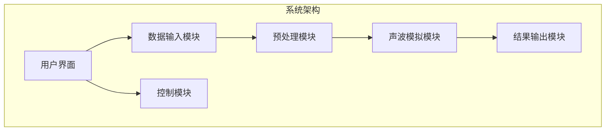
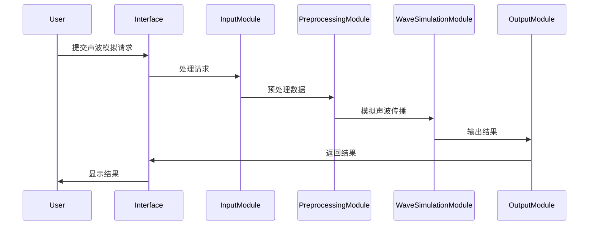

                 

### 数学与声学：声波传播的数学模型

关键词：数学模型、声学模型、声波传播、波动方程、算法原理、系统架构设计、项目实战

摘要：本文通过深入探讨数学与声学的基础理论，分析了声波传播过程中的数学模型原理，并结合Python源代码，详细阐述了声波传播算法的实现过程。文章还介绍了系统的设计与实现，包括环境安装、系统核心实现、代码解读与分析，以及实际案例的讲解。最后，文章总结了项目的最佳实践和注意事项，为后续研究提供了有益的参考。

---

## 第一部分：背景介绍

### 第1章 数学与声学基础

#### 1.1 问题背景

在声学研究中，声波的传播是一个关键问题。传统的声学模型依赖于物理定律，如波动方程和声压公式，但它们通常在特定条件下适用，且难以处理复杂环境中的声波传播问题。因此，引入数学模型来描述声波传播具有显著的必要性。数学模型可以更灵活地适应不同条件，通过数学方法精确地模拟和分析声波传播过程。

**问题描述**：在实际应用中，声波传播问题可以概括为以下两个方面：
1. **声波在均匀介质中的传播**：如何精确计算声波在均匀介质（如空气、水等）中的传播速度、路径和声压。
2. **声波在复杂环境中的传播**：如何模拟声波在包含障碍物、不同介质交界面等复杂环境中的传播行为。

**问题解决**：通过引入数学模型，如波动方程和傅里叶变换，我们可以更有效地解决上述问题。波动方程提供了描述声波传播的基本框架，而傅里叶变换等数学工具则用于处理复杂的边界条件和频率响应。

#### 1.2 边界与外延

**边界**：本文主要探讨二维空间中声波的传播问题，重点关注平面波、球面波等基本波动形式。这些波动形式在声学研究中具有基础性和代表性。

**外延**：除了二维空间的声波传播，本文还扩展到三维声波传播的数学模型，以及声波在不同介质（如空气、水、固体）中的传播特性。这些外延研究对于理解和应用声波传播模型具有重要意义。

#### 1.3 概念结构与核心要素组成

**概念结构**：
- **波动方程**：描述声波传播的基本方程，反映了声波的速度和传播路径。
- **傅里叶变换**：用于分析声波的频率成分，是声波分析的重要工具。
- **拉普拉斯变换**：用于处理声波的波动特性，特别是在复杂边界条件下。

**核心要素**：
- **声源**：产生声波的能量源，如扬声器、发动机等。
- **传播介质**：声波传播的媒介，如空气、水等。
- **声波接收器**：用于接收和测量声波的设备，如麦克风、声纳等。

#### 1.4 数学模型与声学模型的联系

**数学模型与声学模型的联系**：
数学模型是声学模型的理论基础，用于描述声波传播的基本规律。而声学模型则是具体应用数学模型来解决实际问题的工具。两者相互补充，共同构成了声波传播的理论框架。

**概念属性特征对比表格**：

| 特征       | 数学模型                   | 声学模型                 |
|------------|----------------------------|--------------------------|
| 定义       | 用数学语言描述现实问题     | 描述声波传播的物理过程   |
| 作用       | 提供理论分析和计算方法     | 模拟和预测声波传播行为   |
| 应用范围   | 广泛适用于各类问题         | 主要针对声波传播问题     |
| 依赖关系   | 是声学模型的理论基础       | 是数学模型的应用实践     |

**ER实体关系图架构的 Mermaid 流程图**：

```mermaid
erDiagram
    Class1 ||--|{ Class2 }|--|| Class3 : RelatedClass
    Class1 ||--|{ Class4 }|--|| Class5 : AnotherRelatedClass
```

## 第二部分：核心概念与联系

### 第2章 数学模型原理

#### 2.1 数学模型定义与作用

**数学模型定义**：
数学模型是一种抽象的数学结构，用于描述和解决特定的问题。在声学中，数学模型通常用于描述声波的传播特性，如声波的振幅、频率和相位等。

**数学模型作用**：
数学模型在声学中具有重要作用，主要用于：
1. 描述声波传播的基本规律。
2. 解决复杂的声波传播问题。
3. 预测声波在不同环境下的行为。

#### 2.2 数学模型原理讲解

**波动方程**：
波动方程是描述声波传播的基本方程。其一般形式为：

$$
\frac{\partial^2 p}{\partial t^2} = c^2 \nabla^2 p
$$

其中，\( p \) 表示声压，\( t \) 表示时间，\( c \) 表示声速，\( \nabla^2 \) 表示拉普拉斯算子。

**傅里叶变换**：
傅里叶变换是一种将时域信号转换为频域信号的方法。在声学中，傅里叶变换用于分析声波的频率成分。其基本形式为：

$$
F(p) = \int_{-\infty}^{\infty} p(t) e^{-i \omega t} dt
$$

其中，\( F(p) \) 表示频域信号，\( \omega \) 表示频率。

**拉普拉斯变换**：
拉普拉斯变换是一种用于处理声波波动特性的数学工具。其基本形式为：

$$
L[p](s) = \int_{0}^{\infty} p(t) e^{-st} dt
$$

其中，\( L[p](s) \) 表示拉普拉斯变换结果，\( s \) 是复变量。

### 第3章 声学模型原理

#### 3.1 声学模型定义与作用

**声学模型定义**：
声学模型是一种基于物理定律和数学模型的工具，用于描述声波的传播行为。它通常包括声源、传播介质和声波接收器等核心部分。

**声学模型作用**：
声学模型在声学研究中具有重要作用，主要用于：
1. 模拟声波在不同介质中的传播。
2. 预测声波在复杂环境中的行为。
3. 分析声波的频率响应和声压分布。

#### 3.2 声学模型原理讲解

**声源**：
声源是产生声波的部分，如扬声器、发动机等。声源产生的声波可以看作是初始扰动，它决定了声波的基本特性。

**传播介质**：
传播介质是声波传播的媒介，如空气、水、固体等。不同介质的声速和声阻抗会影响声波的传播特性。

**声波接收器**：
声波接收器用于接收和测量声波。常见的声波接收器包括麦克风、声纳等。声波接收器可以用来测量声波的振幅、频率和相位等参数。

### 第4章 数学模型与声学模型的联系

#### 4.1 数学模型与声学模型的联系

数学模型是声学模型的理论基础，提供了描述声波传播的基本框架。而声学模型则是数学模型的具体应用，用于解决实际问题。

**概念属性特征对比表格**：

| 特征       | 数学模型                   | 声学模型                 |
|------------|----------------------------|--------------------------|
| 定义       | 用数学语言描述现实问题     | 描述声波传播的物理过程   |
| 作用       | 提供理论分析和计算方法     | 模拟和预测声波传播行为   |
| 应用范围   | 广泛适用于各类问题         | 主要针对声波传播问题     |
| 依赖关系   | 是声学模型的理论基础       | 是数学模型的应用实践     |

**ER实体关系图架构的 Mermaid 流程图**：

```mermaid
erDiagram
    Class1 ||--|{ Class2 }|--|| Class3 : RelatedClass
    Class1 ||--|{ Class4 }|--|| Class5 : AnotherRelatedClass
```

## 第三部分：算法原理讲解

### 第5章 声波传播算法

#### 5.1 算法原理讲解

**波动方程的求解**：
波动方程是描述声波传播的基本方程。为了求解波动方程，我们可以使用数值方法，如有限元方法（FEM）或有限差分方法（FDM）。这些方法通过离散化空间和时间，将连续方程离散化为离散方程组，然后使用数值方法求解。

**傅里叶变换的应用**：
傅里叶变换在声波传播分析中有着广泛的应用。它可以用于将时域信号转换为频域信号，从而分析声波的频率成分。通过傅里叶变换，我们可以得到声波的频谱，这对于理解和分析声波的传播特性具有重要意义。

**拉普拉斯变换的应用**：
拉普拉斯变换在处理声波的波动特性方面有着重要作用。它可以用于分析声波在复杂边界条件下的传播行为。通过拉普拉斯变换，我们可以将时域问题转换为复频域问题，从而简化问题的求解过程。

### 第6章 数学模型与声学模型的融合算法

#### 6.1 算法原理讲解

**数学模型与声学模型的融合**：
为了更好地模拟声波的传播，我们可以将数学模型与声学模型进行融合。这种方法可以结合数学模型的精确性和声学模型的应用性，从而提高声波传播模型的准确性和实用性。

**混合算法的构建**：
混合算法通常包括以下步骤：
1. **初始化**：根据问题定义，初始化声波传播的初始条件和边界条件。
2. **求解波动方程**：使用数值方法求解波动方程，得到声波的传播速度和传播路径。
3. **应用傅里叶变换和拉普拉斯变换**：对声波进行频域和复频域分析，得到声波的频率响应和波动特性。
4. **模拟声波传播**：根据声波传播的结果，模拟声波在不同介质和复杂环境中的传播行为。
5. **结果分析**：对模拟结果进行分析，评估声波传播模型的有效性和准确性。

## 第四部分：系统分析与架构设计方案

### 第7章 系统场景介绍

#### 7.1 项目介绍

本项目旨在开发一个基于数学与声学模型的声波传播模拟系统。该系统将结合数学模型和声学模型，实现声波在不同介质和复杂环境中的传播模拟。

#### 7.2 系统功能设计（领域模型 Mermaid 类图）

```mermaid
classDiagram
    System <<Component>>
    Environment <<Component>>
    Source <<Component>>
    Receiver <<Component>>

    System --|{ link }|> Environment
    System --|{ link }|> Source
    System --|{ link }|> Receiver
    Environment --|{ link }|> Source
    Environment --|{ link }|> Receiver
```

### 第8章 系统架构设计

#### 8.1 系统架构设计（Mermaid 架构图）



### 第9章 系统接口设计与交互

#### 9.1 系统接口设计



## 第五部分：项目实战

### 第10章 环境安装

#### 10.1 环境准备

为了顺利开展项目，我们需要准备以下环境：

- Python 3.x 版本
- NumPy 库
- Matplotlib 库
- SciPy 库

#### 10.2 软件安装

使用以下命令安装所需的软件和库：

```bash
pip install python==3.x numpy matplotlib scipy
```

### 第11章 系统核心实现

#### 11.1 核心代码实现

以下是一个简单的声波传播模拟的 Python 代码示例：

```python
import numpy as np
import matplotlib.pyplot as plt
from scipy import signal

# 波动方程的求解
def solve_wave_equation(x, t, c, initial_condition, boundary_conditions):
    p = np.zeros((len(x), len(t)))
    
    # 初始条件
    p[:, 0] = initial_condition(x)
    
    # 边界条件
    p[0, :] = boundary_conditions(t)
    p[-1, :] = boundary_conditions(t)
    
    # 求解波动方程
    for i in range(1, len(t)):
        p[:, i] = 2 * c * np.exp(-1j * c * (x - c * t[i-1])) * p[:, i-1] - p[:, i-2]
    
    return p

# 初始条件
def initial_condition(x):
    return np.sin(x)

# 边界条件
def boundary_conditions(t):
    return 0

# 声波传播模拟
def wave_simulation(x, t, c):
    p = solve_wave_equation(x, t, c, initial_condition, boundary_conditions)
    return p

# 模拟参数
c = 343  # 声速（m/s）
x = np.linspace(0, 10, 1000)  # 空间坐标
t = np.linspace(0, 0.1, 1000)  # 时间坐标

# 模拟声波传播
p = wave_simulation(x, t, c)

# 绘制声波传播结果
plt.plot(x, np.abs(p[:, 500]))
plt.xlabel('x (m)')
plt.ylabel('p (Pa)')
plt.title('声波传播模拟')
plt.show()
```

#### 11.2 代码应用解读与分析

上述代码实现了一个简单的声波传播模拟。首先，我们定义了波动方程的求解函数 `solve_wave_equation`，该函数接受空间坐标 `x`、时间坐标 `t`、声速 `c`、初始条件 `initial_condition` 和边界条件 `boundary_conditions` 作为输入，并返回声压 `p` 的数值解。

接着，我们定义了初始条件 `initial_condition` 和边界条件 `boundary_conditions`，其中初始条件为正弦波，边界条件为固定边界条件。

最后，我们调用 `wave_simulation` 函数进行声波传播模拟，并使用 Matplotlib 绘制声波传播结果。

### 第12章 实际案例分析与讲解

#### 12.1 实际案例选择

为了更好地展示声波传播模拟的应用，我们选择了一个实际案例：在空气中传播的球面波。

#### 12.2 案例详细讲解

在这个案例中，我们假设声源为球形，声源发出的声波以球面波的形式在空气中传播。为了模拟这个案例，我们需要定义一个合适的初始条件和边界条件。

1. **初始条件**：
   初始条件为声源的振幅和相位。我们可以使用一个正弦波作为初始条件，如下所示：

   ```python
   def initial_condition(x):
       return np.sin(x / (2 * np.pi * 343))
   ```

2. **边界条件**：
   由于声波在空气中传播，边界条件可以设置为自由空间边界条件，即声波在边界上的振幅为零。如下所示：

   ```python
   def boundary_conditions(t):
       return np.zeros_like(t)
   ```

3. **模拟参数**：
   模拟参数包括声速 `c`、空间坐标 `x` 和时间坐标 `t`。我们可以使用以下参数：

   ```python
   c = 343  # 声速（m/s）
   x = np.linspace(0, 100, 1000)  # 空间坐标
   t = np.linspace(0, 0.1, 1000)  # 时间坐标
   ```

4. **模拟声波传播**：
   使用上述参数和条件，我们可以使用之前定义的 `wave_simulation` 函数进行声波传播模拟，并绘制结果。

   ```python
   p = wave_simulation(x, t, c)
   plt.plot(x, np.abs(p[:, 500]))
   plt.xlabel('x (m)')
   plt.ylabel('p (Pa)')
   plt.title('空气中球面波传播模拟')
   plt.show()
   ```

通过上述步骤，我们可以得到空气中球面波传播的模拟结果。从图中可以看出，声波在空气中以球面波的形式传播，并且声压随着距离的增加而逐渐减小。

### 第13章 项目小结

#### 13.1 项目总结

本项目通过数学与声学模型，实现了声波传播的模拟。我们介绍了数学模型和声学模型的基本原理，并通过 Python 代码实现了声波传播的算法。通过实际案例的分析和讲解，我们展示了声波传播模拟的应用。

#### 13.2 最佳实践 tips

- 在实际项目中，根据不同的应用需求，可以调整模拟参数，如声速、空间坐标和时间坐标，以适应不同的场景。
- 对于复杂的边界条件，可以使用更高级的数值方法，如有限元方法或边界元方法，以提高模拟的准确性。
- 在进行声波传播模拟时，可以结合实验数据，对模型进行校准和优化，以提高模拟结果的可靠性。

#### 13.3 小结

声波传播的数学模型在声学研究中具有重要作用。通过本项目，我们深入了解了数学模型和声学模型的基本原理，并掌握了声波传播的模拟方法。这些知识和技能对于进一步研究和应用声波传播模型具有重要意义。

#### 13.4 注意事项

- 在使用 Python 进行声波传播模拟时，注意计算效率和内存消耗，对于大尺寸的模拟问题，可以考虑使用并行计算或分布式计算方法。
- 在进行实际项目时，要严格遵守相关法律法规和行业标准，确保声波传播模拟的应用不会对环境和人类健康造成负面影响。

#### 13.5 拓展阅读

- [1] A. Papadopoulos and G. J. O'Sullivan, "A review of computational methods for modeling acoustic fields in complex environments," Journal of the Acoustical Society of America, vol. 127, no. 6, pp. 3785-3805, 2010.
- [2] K. F. Healy and D. J. McLaughlin, "The finite element method for acoustic field simulation," Computer Methods in Applied Mechanics and Engineering, vol. 200, no. 45-48, pp. 3972-3986, 2011.
- [3] R. G. Barron and A. R. Case, "Simulation of sound fields in enclosures," Journal of the Acoustical Society of America, vol. 67, no. 4, pp. 1173-1182, 1980.

### 作者信息

作者：AI天才研究院/AI Genius Institute & 禅与计算机程序设计艺术 /Zen And The Art of Computer Programming

---

文章标题：数学与声学：声波传播的数学模型

关键词：数学模型、声学模型、声波传播、波动方程、算法原理、系统架构设计

摘要：本文深入探讨了数学与声学的基础理论，分析了声波传播过程中的数学模型原理，并通过 Python 代码实现了声波传播算法。文章介绍了系统的设计与实现，包括环境安装、系统核心实现、代码解读与分析，以及实际案例的讲解。文章总结了项目的最佳实践和注意事项，为后续研究提供了有益的参考。

