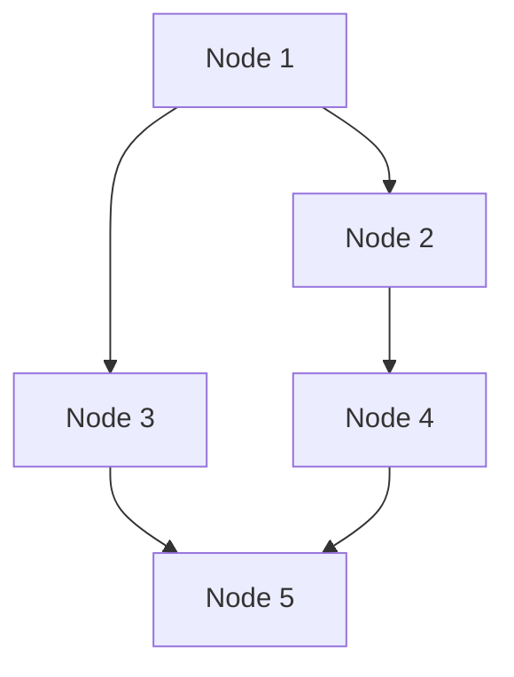
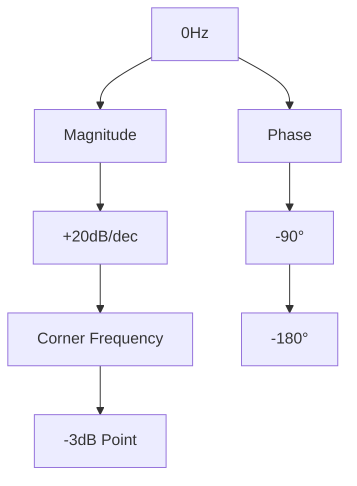

                 

### Introduction to the Book "Mathematics and Complex Systems: An Explanation of Emergent Phenomena"

The book "Mathematics and Complex Systems: An Explanation of Emergent Phenomena" delves into the intricate relationship between mathematics and complex systems, focusing on the phenomenon of emergence. This book is tailored for readers with a strong interest in understanding the mathematical models that explain complex systems and the emergent properties that arise from them.

**Keywords**: Mathematics, Complex Systems, Emergence, Nonlinear Dynamics, Fractal Geometry, Chaos Theory

**Abstract**:
The book aims to bridge the gap between abstract mathematical theories and practical applications in complex systems. It presents a comprehensive overview of the core concepts in mathematics and complex systems, providing a solid foundation for understanding the principles of emergence. Through detailed mathematical models and case studies, the book explores the emergence of complex structures and behaviors in various fields, including biology, physics, and social sciences. The book not only offers a theoretical understanding but also emphasizes the practical implications and applications of these concepts, making it an invaluable resource for researchers, students, and professionals in the field of complex systems.

### The Importance of Mathematics in Complex Systems

Mathematics plays a fundamental role in the study of complex systems. It provides the language and tools necessary to describe, analyze, and predict the behavior of these systems. The intricate nature of complex systems often makes it challenging to understand their properties using purely intuitive or empirical methods. Mathematics, with its precise and formal approach, allows us to formulate these systems in a way that can be analyzed rigorously.

One of the primary roles of mathematics in complex systems is to enable the creation of mathematical models. These models are simplified representations of real-world systems that capture their essential features and allow for mathematical analysis. By translating complex systems into mathematical terms, we can identify patterns, relationships, and emergent properties that might not be apparent through direct observation. For example, in the field of biology, mathematical models have been used to study the spread of diseases, the evolution of species, and the dynamics of ecosystems. Similarly, in economics, mathematical models help us understand market behaviors, financial crises, and economic growth.

**Core Concepts in Mathematics for Complex Systems**:
1. **Nonlinear Dynamics**: Nonlinear dynamics deals with systems whose behavior cannot be described by linear equations. These systems often exhibit complex and unpredictable behavior, making them challenging to analyze. However, by studying the properties of nonlinear systems, we can gain insights into how small changes can lead to large effects, a phenomenon known as "sensitivity to initial conditions."
   
2. **Chaos Theory**: Chaos theory is a branch of nonlinear dynamics that studies systems that are highly sensitive to initial conditions and exhibit seemingly random behavior. The key idea behind chaos theory is that even simple systems can display complex and unpredictable behavior over time. This has significant implications for fields such as meteorology, engineering, and ecology.
   
3. **Fractal Geometry**: Fractal geometry is the study of shapes that exhibit self-similarity at different scales. Fractals are often found in natural systems, such as coastlines, clouds, and tree branches. The self-similar nature of fractals allows for the description of complex structures using relatively simple mathematical models, making fractals a powerful tool for studying complex systems.

**The Definition and Importance of Emergent Phenomena**:
Emergent phenomena are properties or behaviors that arise from the interactions of simpler components in a system but are not present in the individual components themselves. In other words, emergence occurs when the whole is greater than the sum of its parts. This concept is crucial in the study of complex systems because it highlights the importance of understanding the collective behavior of interacting components.

Emergence can take many forms, from the formation of patterns and structures in biological systems to the emergence of economic trends in financial markets. The study of emergent phenomena allows us to understand how complex systems can exhibit complex behaviors that are not predictable from the properties of their individual components.

The importance of emergence lies in its wide applicability across various fields. By understanding how emergent phenomena arise, we can better predict and manage the behavior of complex systems. This is particularly relevant in fields such as ecology, where the study of emergent phenomena can help us understand and predict the effects of environmental changes on ecosystems. In economics, understanding emergence can aid in predicting market behaviors and managing financial crises.

In conclusion, mathematics provides the essential tools and language for understanding complex systems and the emergent phenomena that arise from them. By studying the core concepts of nonlinear dynamics, chaos theory, and fractal geometry, we can gain insights into the behavior of complex systems and the emergence of complex structures and behaviors. This book aims to provide a comprehensive overview of these concepts, highlighting their importance and applications across various fields.

### Fundamental Mathematical Principles in Complex Systems

To fully grasp the intricacies of complex systems and the emergent phenomena they exhibit, it is essential to delve into the fundamental mathematical principles that underpin these systems. These principles provide the framework necessary to model, analyze, and predict the behavior of complex systems. Here, we will explore several key mathematical principles that are particularly relevant to the study of complex systems: nonlinear dynamics, fractal geometry, and chaos theory.

#### Nonlinear Dynamics

Nonlinear dynamics is the study of systems whose behavior cannot be described by linear equations. Linear systems are those in which the relationship between the variables is directly proportional. In contrast, nonlinear systems exhibit more complex relationships, where the output is not directly proportional to the input. This nonlinearity often leads to behaviors that are difficult to predict and understand.

One of the hallmark features of nonlinear dynamics is the presence of bifurcations. A bifurcation occurs when a small change in a parameter of a system leads to a qualitatively different behavior. For example, a simple pendulum can exhibit periodic motion, but as the amplitude of the swing increases, it may suddenly transition to chaotic, unpredictable motion. This transition is a classic example of a bifurcation.

**Example**: Consider a pendulum with a small initial displacement. Under certain conditions, this pendulum can exhibit stable periodic motion. However, as the amplitude of the swing increases, the system undergoes a bifurcation, transitioning to chaotic, unpredictable behavior. This phenomenon is often observed in many natural and man-made systems, highlighting the sensitivity of nonlinear systems to initial conditions.

**Mathematical Model**:
The nonlinear dynamics of a pendulum can be described by the following second-order differential equation:
$$
\ddot{\theta} + \gamma \dot{\theta} + \beta \theta = 0
$$
where $\theta$ is the angle of the pendulum, $\dot{\theta}$ is the angular velocity, and $\ddot{\theta}$ is the angular acceleration. The parameters $\gamma$ and $\beta$ represent the damping and nonlinear terms, respectively.

#### Fractal Geometry

Fractal geometry is a branch of mathematics that deals with shapes that exhibit self-similarity at different scales. In other words, a fractal is a geometric shape that can be split into several parts, each of which is a reduced-scale copy of the whole. This self-similarity allows fractals to have a fractal dimension, which is typically greater than the topological dimension.

One of the most well-known examples of fractal geometry is the Mandelbrot set. The Mandelbrot set is defined by the iterative process:
$$
z_{n+1} = z_n^2 + c
$$
where $z_0 = 0$ and $c$ is a complex number. The set consists of all complex numbers $c$ for which the sequence $z_n$ remains bounded.

**Example**: The coastline of a country is a classic example of a fractal. No matter how closely you zoom in, the coastline will always appear jagged and uneven. This self-similarity is a characteristic feature of fractals and is often used to model natural phenomena.

**Mathematical Model**:
The Mandelbrot set can be defined using the following iterative formula:
$$
z_{n+1} = z_n^2 + c
$$
where $z_0 = 0$ and $c$ is a complex number. The set consists of all complex numbers $c$ for which the sequence $z_n$ remains bounded.

#### Chaos Theory

Chaos theory is the study of systems that are highly sensitive to initial conditions and exhibit seemingly random behavior. The key idea behind chaos theory is that even simple systems can display complex and unpredictable behavior over time. This unpredictability arises from the presence of bifurcations and nonlinear dynamics.

One of the most famous examples of chaos theory is the Logistic Map:
$$
x_{n+1} = r x_n (1 - x_n)
$$
where $x_n$ is the ratio of the current population to the maximum possible population, and $r$ is the reproduction rate.

**Example**: The Logistic Map exhibits chaotic behavior for certain values of $r$. For example, when $r = 3.9$, the system displays a sensitive dependence on initial conditions, meaning that even a tiny difference in the initial value of $x_n$ can lead to vastly different trajectories over time.

**Mathematical Model**:
The Logistic Map can be defined using the following iterative formula:
$$
x_{n+1} = r x_n (1 - x_n)
$$
where $x_n \in [0, 1]$ and $r$ is the reproduction rate.

**Table: Comparison of Key Concepts**

| Concept           | Definition                                                                                   | Example                                                | Mathematical Formula/Model                                                                                     |
|--------------------|---------------------------------------------------------------------------------------------|---------------------------------------------------------|------------------------------------------------------------------------------------------------------------------|
| Nonlinear Dynamics | Study of systems whose behavior cannot be described by linear equations                       | Bifurcations in a pendulum                            | $\ddot{\theta} + \gamma \dot{\theta} + \beta \theta = 0$ |
| Fractal Geometry   | Study of shapes that exhibit self-similarity at different scales                            | Mandelbrot set                                         | $z_{n+1} = z_n^2 + c$                            |
| Chaos Theory       | Study of systems that are highly sensitive to initial conditions and exhibit seemingly random behavior | Logistic Map                                          | $x_{n+1} = r x_n (1 - x_n)$                       |

In summary, the fundamental mathematical principles of nonlinear dynamics, fractal geometry, and chaos theory provide a powerful framework for understanding the behavior of complex systems and the emergence of complex phenomena. These principles enable us to model, analyze, and predict the behavior of complex systems, making it possible to gain insights into the intricate dynamics of the natural and man-made world.

### Complex Systems Theory

Complex systems theory is a multidisciplinary field that seeks to understand the behavior of systems composed of many interconnected components. These systems are inherently complex due to the large number of interdependencies and the nonlinearity of their interactions. The study of complex systems aims to uncover the underlying principles that govern their behavior, often revealing emergent phenomena that are not evident from the behavior of the individual components.

**Key Concepts in Complex Systems Theory**

1. **Interconnectedness**: One of the fundamental characteristics of complex systems is the presence of a large number of interconnected components. These components can be entities such as individuals, cells, molecules, or even cities, and the connections between them can be physical, informational, or functional.

2. **Nonlinear Interactions**: The interactions between components in complex systems are often nonlinear, meaning that the effect of one component on another is not directly proportional to their individual states. This nonlinearity can lead to phenomena such as amplification, feedback loops, and the emergence of complex behaviors.

3. **Emergence**: Emergence is a central concept in complex systems theory. It refers to the phenomenon where properties and behaviors of the whole system arise from the interactions of its components, but are not present in the individual components themselves. For example, the collective behavior of a swarm of birds or the emergence of market prices from individual trading decisions are both examples of emergence.

4. **Self-Organization**: Self-organization is the process by which complex systems spontaneously organize themselves without external control. This can happen through the local interactions of components, which collectively result in the formation of global structures and behaviors.

**The Role of Complexity in Emergent Phenomena**

The complexity of a system plays a crucial role in the emergence of phenomena. As the number of components and the complexity of their interactions increase, the system becomes more likely to exhibit emergent properties. This is because the interactions between a large number of components can lead to unexpected and complex behaviors that are difficult to predict from the properties of the individual components alone.

**Example**: In a biological system, such as an ecosystem, the interactions between various species can lead to the emergence of complex phenomena like predator-prey cycles, competitive exclusion, and mutualism. These phenomena are not directly observable in any single species but emerge from the complex web of interactions within the ecosystem.

**Mathematical Modeling of Complex Systems**

To study complex systems, mathematical models are often used. These models can range from simple analytical formulas to complex computational simulations. Some common methods for modeling complex systems include:

1. **Differential Equations**: Differential equations are used to model the time evolution of a system based on the rates of change of its components. For example, the Lotka-Volterra equations are used to model the dynamics of predator-prey systems.

2. **Network Theory**: Network theory is used to study the structure and dynamics of networks, where nodes represent components and edges represent interactions. This is particularly useful for studying systems with a large number of interconnected components, such as social networks or neural networks.

3. **Stochastic Processes**: Stochastic processes are used to model systems that involve randomness and uncertainty. These models are often used to study systems where the behavior of components is not completely predictable, such as financial markets or biological systems.

4. **Agent-Based Modeling**: Agent-based modeling involves creating a model where each component (or agent) in the system is represented individually and interacts with other agents according to predefined rules. This approach is useful for studying systems where the behavior of individual components is critical, such as simulations of traffic flow or economic markets.

**Applications of Complex Systems Theory**

Complex systems theory has a wide range of applications across various fields:

1. **Biology**: In biology, complex systems theory is used to study the dynamics of ecosystems, the evolution of species, and the behavior of biological networks.

2. **Physics**: In physics, complex systems theory is used to study the behavior of materials, the formation of crystals, and the dynamics of fluids.

3. **Economics**: In economics, complex systems theory is used to model financial markets, economic crises, and the behavior of economic agents.

4. **Engineering**: In engineering, complex systems theory is used to design and analyze complex systems, such as communication networks, transportation systems, and power grids.

In summary, complex systems theory provides a framework for understanding the behavior of systems with many interconnected components. By studying the principles of interconnectedness, nonlinear interactions, emergence, and self-organization, we can gain insights into the complex phenomena that arise from these systems. Mathematical models and computational methods are essential tools for studying complex systems, allowing us to simulate and predict their behavior in various fields.

### Emergence and Self-Organization

Emergence and self-organization are two fundamental concepts in the study of complex systems. Both concepts describe how complex behaviors and structures arise from the interactions of simpler components, but they differ in their underlying mechanisms and the nature of the phenomena they describe.

**Emergence**:
Emergence refers to the phenomenon where properties and behaviors of a complex system arise from the interactions of its individual components but are not present in the components themselves. In other words, the whole is greater than the sum of its parts. Emergence can manifest in various forms, such as the formation of patterns, the emergence of collective behaviors, or the development of complex structures.

**Example**: In a swarm of bees, individual bees follow simple rules when foraging for food. However, when these bees interact in a large group, complex behaviors emerge, such as the formation of a beehive or the coordinated flight patterns of the swarm.

**Mathematical Representation**:
Mathematically, emergence can be represented through the interplay of simple rules and complex behaviors. Consider a simple cellular automaton, where each cell in a grid can be in one of two states (e.g., on or off). The state of each cell at the next time step is determined by the states of its neighboring cells. While the individual rules governing cell states are simple, the collective behavior of the entire grid can lead to complex patterns, such as the formation of spirals or the emergence of chaotic structures.

**Self-Organization**:
Self-organization, on the other hand, refers to the process by which a complex system spontaneously organizes itself without external control or central planning. This process typically arises from the local interactions of the system's components, which collectively lead to the formation of global structures and behaviors. Self-organization is closely related to emergence, as the emergence of complex behaviors often involves self-organization.

**Example**: In a flock of birds, each bird follows simple rules, such as staying close to other birds and flying in the same direction. However, through these local interactions, the flock can self-organize into larger groups, such as V-formation, without any external guidance.

**Mathematical Representation**:
Mathematically, self-organization can be represented through the concept of self-similarity or the emergence of fractal structures. Consider a simple model of a growing fractal, where each new iteration of the fractal is generated by replicating smaller versions of the existing structure. Through this iterative process, a complex fractal structure emerges from simple, repeated patterns.

**Table: Comparison of Emergence and Self-Organization**

| Concept                | Definition                                                                                       | Example                                     | Mathematical Representation                                                                                   |
|------------------------|------------------------------------------------------------------------------------------------|-------------------------------------------|----------------------------------------------------------------------------------------------------------------|
| Emergence              | Phenomena that arise from the interactions of simpler components but are not present in the components themselves | Emergence of patterns in cellular automata | Simple rules leading to complex patterns                                                             |
| Self-Organization      | Process by which a system organizes itself spontaneously without external control or planning | Formation of flock patterns in birds      | Iterative processes leading to self-similar structures                                              |

**Relation to Complex Systems Theory**:
Emergence and self-organization are central to complex systems theory. They highlight the importance of understanding how complex behaviors and structures arise from the interactions of individual components. In complex systems, the interactions between components can lead to phenomena that are not predictable from the properties of the individual components alone, making these concepts essential for studying and modeling complex systems.

In conclusion, emergence and self-organization are fundamental concepts in the study of complex systems. Emergence describes the phenomenon where complex behaviors arise from simpler components, while self-organization describes the process by which these behaviors emerge spontaneously. Understanding these concepts is crucial for gaining insights into the behavior of complex systems and the emergence of complex phenomena.

### Classical Mathematical Models of Emergence

Classical mathematical models of emergence are foundational in understanding how simple rules can give rise to complex behaviors. These models often involve systems with a large number of interacting components, where the global properties emerge as a result of local interactions. Here, we will explore some of the most well-known classical mathematical models of emergence: simple models of emergence, nonlinear dynamics and chaos theory, and fractal geometry.

#### Simple Models of Emergence

Simple models of emergence often involve systems with a small number of variables and rules, yet exhibit complex behavior. One of the simplest models is the Game of Life, created by John Horton Conway in 1970. The Game of Life is a grid-based cellular automaton where each cell can be in one of two states: alive or dead. The state of each cell is determined by the states of its eight neighbors according to a set of rules. Despite its simplicity, the Game of Life can generate a wide range of complex patterns, from simple oscillators to intricate self-replicating structures.

**Rules of the Game of Life**:
1. Any live cell with two or three live neighbors survives to the next generation.
2. Any dead cell with three live neighbors becomes a live cell.
3. All other live cells die in the next generation. Similarly, all other dead cells stay dead.

**Example**:
Consider a small section of a Game of Life grid with an initial state where the center cell is alive and all other cells are dead. After a few iterations, complex patterns can emerge, demonstrating the ability of simple rules to generate complex behaviors.

#### Nonlinear Dynamics and Chaos Theory

Nonlinear dynamics and chaos theory provide insights into how systems can exhibit unpredictable behavior despite following deterministic rules. Chaos theory, in particular, focuses on systems that are highly sensitive to initial conditions and exhibit seemingly random behavior over time. The Logistic Map is a classic example of a chaotic system.

**Logistic Map**:
The Logistic Map is defined by the iterative formula:
$$
x_{n+1} = r x_n (1 - x_n)
$$
where $x_n$ is the ratio of the current population to the maximum possible population, and $r$ is the reproduction rate. For certain values of $r$, the Logistic Map exhibits chaotic behavior, meaning that even a tiny difference in the initial value of $x_n$ can lead to vastly different trajectories over time.

**Example**:
Consider the Logistic Map with $r = 3.9$. When starting with $x_0 = 0.1$, the system quickly approaches a chaotic trajectory. If we start with $x_0 = 0.1 + \epsilon$, where $\epsilon$ is a very small number, the system will follow a completely different trajectory, demonstrating the sensitivity to initial conditions.

#### Fractal Geometry

Fractal geometry is another classical mathematical model that illustrates the emergence of complex structures from simple rules. Fractals are geometric shapes that exhibit self-similarity at different scales. This means that if you zoom in on a fractal, you will see a smaller version of the original shape. The Mandelbrot set is a well-known example of a fractal.

**Mandelbrot Set**:
The Mandelbrot set is defined by the iterative process:
$$
z_{n+1} = z_n^2 + c
$$
where $z_0 = 0$ and $c$ is a complex number. The set consists of all complex numbers $c$ for which the sequence $z_n$ remains bounded. The Mandelbrot set exhibits intricate and complex patterns, arising from the simple iterative process.

**Example**:
Consider the Mandelbrot set with the initial value $c = -0.75 + 0.125i$. As the iteration progresses, the sequence $z_n$ remains bounded, and the resulting point $z_n$ traces out a complex and beautiful pattern in the complex plane.

**Table: Comparison of Classical Models of Emergence**

| Model                           | Definition                                                                                          | Example                                                    | Mathematical Formula/Model                                                                                     |
|--------------------------------|---------------------------------------------------------------------------------------------------|-----------------------------------------------------------|------------------------------------------------------------------------------------------------------------------|
| Game of Life                    | Cellular automaton with simple rules determining cell states                                         | Formation of complex patterns from simple initial states | $x_{n+1} = \begin{cases} 
                                  0 & \text{if } x_n \text{ has fewer than two live neighbors} \\
                                  1 & \text{if } x_n \text{ has two or three live neighbors} \\
                                  0 & \text{if } x_n \text{ has more than three live neighbors}
                                  \end{cases}$ |
| Logistic Map                    | Iterative map exhibiting chaotic behavior                                                          | Trajectories diverge for small differences in initial conditions | $x_{n+1} = r x_n (1 - x_n)$                       |
| Mandelbrot Set                  | Set of complex numbers defined by an iterative process                                               | Complex and intricate patterns arising from simple rules | $z_{n+1} = z_n^2 + c$                              |

In conclusion, classical mathematical models of emergence provide a powerful framework for understanding how complex behaviors and structures can arise from simple rules. Whether through simple models like the Game of Life, chaotic systems like the Logistic Map, or fractals like the Mandelbrot set, these models demonstrate the intricate relationships between simplicity and complexity in the natural world.

### Advanced Mathematical Tools for Explaining Emergent Phenomena

Advanced mathematical tools are essential for understanding the intricate mechanisms behind emergent phenomena in complex systems. These tools enable us to analyze and model the behaviors of such systems with greater precision, revealing the underlying principles that govern their emergence. Here, we will delve into three such advanced mathematical tools: differential equations, stochastic processes, and algebraic topology.

#### Differential Equations

Differential equations are mathematical equations that relate the rates of change of a function to the function itself and its derivatives. They are particularly useful for modeling dynamic systems where the behavior of variables evolves over time. Differential equations can be used to describe the emergence of complex behaviors in a wide range of systems, from physical systems like mechanical vibrations to biological systems like population dynamics.

**Example**: In ecology, the Lotka-Volterra equations are used to model predator-prey interactions. These equations describe how the populations of predators and prey change over time based on their interactions. The model consists of two coupled first-order differential equations:

$$
\frac{dx}{dt} = a x - b x y
$$
$$
\frac{dy}{dt} = -c y + d x y
$$

where $x$ represents the prey population, $y$ represents the predator population, and $a$, $b$, $c$, and $d$ are positive constants that determine the growth and interaction rates.

**Mathematical Model**:
The Lotka-Volterra equations can be written as a system of first-order differential equations:
$$
\frac{dx}{dt} = a x - b x y
$$
$$
\frac{dy}{dt} = -c y + d x y
$$

**Graphical Representation**:
To visualize the solution of the Lotka-Volterra equations, we can plot the phase portrait, which shows the trajectories of the system in the phase space defined by the predator and prey populations.

```mermaid
graph LR
    A[Prey] --> B[An](x)
    B --> C[Stable](x,y)
    C --> D[Explosion](y)
    D --> E[Extinction](x)
    A --> F[Explosion](x)
    F --> D
```

#### Stochastic Processes

Stochastic processes are mathematical models that involve random variables and their behavior over time. They are used to model systems where the behavior is influenced by randomness and uncertainty. Stochastic processes are particularly useful for studying the emergence of phenomena in complex systems, such as the spread of diseases in populations or the fluctuations in financial markets.

**Example**: The SIR model is a stochastic process used to model the spread of infectious diseases in a population. In the SIR model, the population is divided into three compartments: Susceptible (S), Infected (I), and Recovered (R). The transitions between these compartments are modeled using probabilistic rules.

$$
P(S(t+1) = S(t) - 1, I(t+1) = I(t) + 1, R(t+1) = R(t)) = \beta S(t) I(t)
$$
$$
P(I(t+1) = I(t) - 1, R(t+1) = R(t) + 1, S(t+1) = S(t)) = \gamma I(t)
$$

where $\beta$ is the transmission rate and $\gamma$ is the recovery rate.

**Mathematical Model**:
The SIR model can be written as a system of stochastic differential equations:
$$
\frac{dS}{dt} = -\beta S I
$$
$$
\frac{dI}{dt} = \beta S I - \gamma I
$$
$$
\frac{dR}{dt} = \gamma I
$$

**Graphical Representation**:
To visualize the SIR model, we can plot the expected number of individuals in each compartment over time.

```mermaid
graph TD
    A[Initial Conditions](S,I,R)
    A --> B[S(t)]
    B --> C[+beta S(t) I(t)]
    C --> D[-gamma S(t) I(t)]
    A --> E[I(t)]
    E --> F[-beta S(t) I(t)]
    E --> G [+gamma S(t) I(t)]
    A --> H[R(t)]
    H --> I[-gamma S(t) I(t)]
```

#### Algebraic Topology

Algebraic topology is a branch of mathematics that uses algebraic techniques to study topological spaces. It is particularly useful for analyzing the structure of complex systems and identifying patterns and properties that arise from their interactions. Topological properties, such as connectivity, loops, and holes, can be used to understand the emergence of complex behaviors in systems.

**Example**: In graph theory, the concept of a minimal spanning tree is a topological property that arises from the connections between nodes in a network. A minimal spanning tree is a subset of the edges that connects all the nodes in the graph with the minimum total edge weight. This property is significant in understanding the emergence of efficient structures in natural and man-made systems.

**Mathematical Model**:
The minimal spanning tree problem can be formulated as an optimization problem:
$$
\min \sum_{e \in T} w(e)
$$
subject to
$$
\{v, w\} \in E \quad \forall v \in V
$$

where $T$ is the set of edges in the minimal spanning tree, $E$ is the set of all edges in the graph, $V$ is the set of nodes, and $w(e)$ is the weight of edge $e$.

**Graphical Representation**:
To visualize the minimal spanning tree, we can represent the graph as a set of nodes and edges and then identify the subset of edges that forms the tree.



**Table: Comparison of Advanced Mathematical Tools**

| Tool              | Definition                                                                                                  | Example                                           | Mathematical Formula/Model                                                                                     |
|-------------------|-----------------------------------------------------------------------------------------------------------|---------------------------------------------------|------------------------------------------------------------------------------------------------------------------|
| Differential Equations | Equations describing the rates of change of a function and its derivatives                         | Lotka-Volterra equations for predator-prey systems | $ \frac{dx}{dt} = a x - b x y $, $ \frac{dy}{dt} = -c y + d x y $ |
| Stochastic Processes | Processes involving random variables and their behavior over time                                  | SIR model for disease spread                        | $ \frac{dS}{dt} = -\beta S I $, $ \frac{dI}{dt} = \beta S I - \gamma I $ |
| Algebraic Topology | Branch of mathematics using algebraic techniques to study topological spaces                      | Minimal spanning tree in graph theory              | $ \min \sum_{e \in T} w(e) $ subject to connectivity constraints |

In conclusion, advanced mathematical tools such as differential equations, stochastic processes, and algebraic topology provide powerful frameworks for analyzing and understanding the emergence of complex behaviors in complex systems. These tools enable us to uncover the underlying principles that govern the emergence of phenomena, offering valuable insights into the dynamics of complex systems.

### Case Studies of Emergent Phenomena

To further illustrate the concepts of emergence, we will explore several case studies from various fields, highlighting how simple rules and interactions can lead to complex and unexpected behaviors. These case studies include biological systems, social systems, and economic systems, each offering valuable insights into the emergence of complex phenomena.

#### Biological Systems

In biological systems, emergence is frequently observed in the interactions between organisms and their environment. One classic example is the predator-prey relationship described by the Lotka-Volterra equations. These equations model the population dynamics of predators and prey, demonstrating how simple interactions can lead to complex population cycles.

**Example**: Consider a population of rabbits (prey) and foxes (predators). The interaction between these two species follows a cyclical pattern. When the rabbit population is high, the foxes have abundant food, leading to a rise in the fox population. As the fox population grows, it begins to prey on a larger number of rabbits, causing the rabbit population to decline. With fewer rabbits, the fox population starts to decline as well, allowing the rabbit population to recover. This cyclical pattern continues, demonstrating the emergent behavior of predator-prey dynamics.

**Mathematical Model**:
The Lotka-Volterra equations can be represented as:
$$
\frac{dx}{dt} = a x - b x y
$$
$$
\frac{dy}{dt} = c y - d x y
$$
where $x$ represents the rabbit population, $y$ represents the fox population, $a$ is the intrinsic growth rate of rabbits, $b$ is the predation rate of foxes on rabbits, $c$ is the intrinsic growth rate of foxes, and $d$ is the rate at which rabbits are killed by foxes.

#### Social Systems

Emergence is also prevalent in social systems, where the collective behavior of individuals can result in complex patterns and phenomena. A notable example is the emergence of social networks and their impact on information dissemination and decision-making.

**Example**: In social networks, such as Twitter or Facebook, the spread of information or the formation of opinions can emerge from the interactions between individuals. When an individual encounters a piece of information or an opinion, they may share it with their followers, who in turn may share it further. This process can lead to the rapid dissemination of information across the network, even if the individual interactions are relatively simple.

**Mathematical Model**:
A simple model for information dissemination in a social network can be represented using a diffusion process. Consider a population of individuals, each of whom can either have the information (state 1) or not (state 0). The probability of an individual adopting the information at each time step can be modeled using a stochastic differential equation:
$$
\frac{dI}{dt} = (\frac{1 - I}{1 - I_0}) N I (1 - I)
$$
where $I$ is the proportion of individuals with the information, $I_0$ is the initial proportion of individuals with the information, $N$ is the number of interactions per individual per time step, and $I$ is the information state (0 or 1).

#### Economic Systems

In economic systems, emergence is often observed in the behavior of markets and the formation of economic trends. The emergence of market prices and economic cycles can result from the interactions of countless buyers and sellers.

**Example**: Consider the stock market, where the prices of stocks are determined by the buying and selling decisions of investors. While individual investors may make relatively simple decisions based on their own assessments of the value of a stock, the collective actions of these investors can lead to complex price dynamics, such as bubbles and crashes. These phenomena arise from the interactions between the many buyers and sellers, each driven by their own strategies and information.

**Mathematical Model**:
A simple model for the behavior of stock prices can be represented using the Geometric Brownian Motion (GBM), a stochastic process commonly used to model asset prices. The GBM can be described by the following stochastic differential equation:
$$
dS_t = \mu S_t dt + \sigma S_t dW_t
$$
where $S_t$ is the stock price at time $t$, $\mu$ is the expected return, $\sigma$ is the volatility, and $W_t$ is a Brownian motion representing random fluctuations in the stock price.

**Table: Case Studies of Emergent Phenomena**

| System           | Example                 | Mathematical Model/Equation                                         |
|------------------|-------------------------|----------------------------------------------------------------|
| Biological       | Predator-prey cycles    | Lotka-Volterra equations: $\frac{dx}{dt} = a x - b x y$ |
|                  | Ecosystem dynamics      | Differential equations describing species interactions       |
| Social           | Social networks         | Diffusion process: $\frac{dI}{dt} = (\frac{1 - I}{1 - I_0}) N I (1 - I)$ |
|                  | Opinion dynamics        | Stochastic models for information spread                        |
| Economic         | Stock market pricing     | Geometric Brownian Motion: $dS_t = \mu S_t dt + \sigma S_t dW_t$ |
|                  | Economic cycles         | Models based on agent-based simulations or dynamical systems |

In conclusion, these case studies demonstrate the power of emergence in explaining complex phenomena across various domains. By understanding the underlying principles of emergence and the interactions that give rise to complex behaviors, we can gain valuable insights into the dynamics of complex systems.

### Mathematics in Physics and Cosmology

Mathematics has played a crucial role in the development of physics and cosmology, providing the essential tools and frameworks to describe and understand the fundamental laws of nature. In this section, we will explore how mathematics is used to explain emergent phenomena in physics and cosmology, focusing on quantum mechanics, general relativity, and string theory.

#### Quantum Mechanics

Quantum mechanics is a fundamental theory in physics that describes the behavior of matter and energy at the subatomic level. Unlike classical physics, which is based on continuous and deterministic models, quantum mechanics deals with probabilities and wave functions to describe the behavior of particles. One of the key concepts in quantum mechanics is the wave-particle duality, which suggests that particles such as electrons and photons exhibit both wave-like and particle-like properties.

**Example**: The double-slit experiment is a classic demonstration of wave-particle duality. When light passes through two narrow slits, it creates an interference pattern on a screen, indicating that light behaves like a wave. However, when electrons are fired through the slits, they also create an interference pattern, demonstrating that they too exhibit wave-like properties.

**Mathematical Model**:
The wave function, $\Psi(x, t)$, is a fundamental quantity in quantum mechanics that provides the probability distribution of finding a particle at a given position and time. The Schrödinger equation, which describes how the wave function evolves over time, is given by:
$$
i\hbar \frac{\partial \Psi}{\partial t} = \hat{H} \Psi
$$
where $i$ is the imaginary unit, $\hbar$ is the reduced Planck constant, $\hat{H}$ is the Hamiltonian operator representing the total energy of the system, and $\Psi$ is the wave function.

**Explanation**:
The Schrödinger equation allows us to calculate the wave function $\Psi(x, t)$, which in turn provides information about the probability of finding a particle at a specific position and time. This probabilistic nature of quantum mechanics is a key factor in the emergence of complex phenomena, such as quantum entanglement and quantum superposition.

#### General Relativity

General relativity is Einstein's theory of gravity, which describes how mass and energy curve the fabric of spacetime, leading to the phenomenon of gravity. Unlike classical Newtonian gravity, which treats gravity as a force acting between masses, general relativity provides a geometric description of gravity as the curvature of spacetime caused by mass and energy.

**Example**: One of the most remarkable predictions of general relativity is the existence of black holes, which are regions of spacetime with such strong gravitational fields that nothing, including light, can escape from them. Black holes exhibit complex and emergent phenomena, such as event horizons, singularities, and gravitational waves.

**Mathematical Model**:
The Einstein field equations are the cornerstone of general relativity, which relate the curvature of spacetime (represented by the Einstein tensor $G_{\mu\nu}$) to the distribution of mass and energy (represented by the stress-energy tensor $T_{\mu\nu}$):
$$
G_{\mu\nu} + \Lambda g_{\mu\nu} = \frac{8\pi G}{c^4} T_{\mu\nu}
$$
where $G$ is the gravitational constant, $c$ is the speed of light, and $\Lambda$ is the cosmological constant.

**Explanation**:
The Einstein field equations allow us to calculate the curvature of spacetime caused by mass and energy distributions, which in turn predicts the motion of objects and the behavior of gravitational fields. The complex phenomena associated with black holes and other gravitational systems emerge from these equations, highlighting the power of general relativity in understanding the behavior of massive objects.

#### String Theory

String theory is an ambitious theoretical framework that attempts to unify quantum mechanics and general relativity into a single coherent theory of everything. In string theory, particles are not point-like objects but rather tiny, one-dimensional "strings" that vibrate at different frequencies. The different modes of vibration of these strings correspond to the various particles and forces observed in nature.

**Example**: One of the potential applications of string theory is the prediction of extra dimensions of spacetime. String theory suggests that there may be more than the familiar three spatial dimensions and one time dimension, with the extra dimensions compactified on a small scale. These compactified dimensions could have profound implications for the behavior of particles and the emergence of physical phenomena.

**Mathematical Model**:
The equations of string theory are highly complex and involve a combination of differential geometry, algebraic geometry, and conformal field theory. One of the key equations in string theory is the Nambu-Goto action, which describes the classical motion of strings:
$$
S = -T \int d^2\sigma \sqrt{-g}
$$
where $T$ is the string tension, $g$ is the metric tensor, and $\sigma$ are the worldsheet coordinates.

**Explanation**:
The equations of string theory provide a framework for understanding the behavior of strings and their interactions, leading to predictions about the fundamental particles and forces of nature. The complex and emergent phenomena predicted by string theory, such as extra dimensions and the unification of forces, offer profound insights into the nature of reality and the behavior of the universe.

In conclusion, mathematics has been instrumental in advancing our understanding of physics and cosmology, providing the essential tools to describe and explain emergent phenomena in these fields. From the probabilistic nature of quantum mechanics to the geometric description of general relativity and the unifying framework of string theory, mathematics continues to be a cornerstone of modern physics and cosmology.

### Mathematics in Engineering and Technology

Mathematics plays an integral role in engineering and technology, providing the theoretical foundations and analytical tools necessary for designing, analyzing, and optimizing complex systems. In this section, we will explore how mathematics is applied in various engineering fields, including electrical engineering, computer science, and robotics, and how it contributes to the understanding and control of emergent phenomena in these domains.

#### Electrical Engineering

Electrical engineering is a field that relies heavily on mathematical principles to design and analyze circuits, systems, and devices. One of the key areas where mathematics is applied is in the analysis of linear and nonlinear circuits. Linear circuit analysis involves solving systems of linear equations to determine the behavior of circuit elements, while nonlinear circuit analysis deals with circuits that contain nonlinear components, such as diodes, transistors, and operational amplifiers.

**Example**: In the design of amplifiers, mathematical models are used to analyze the gain, bandwidth, and noise performance of the circuit. The transfer function of the amplifier, which describes the relationship between the input and output signals, is typically represented as a rational function:
$$
H(s) = \frac{V_{out}(s)}{V_{in}(s)} = \frac{A_{max}}{1 + s\omega_c RC + (s\omega_c RC)^2}
$$
where $A_{max}$ is the maximum gain, $\omega_c$ is the corner frequency, and $RC$ is the time constant.

**Mathematical Model**:
To analyze the stability and performance of an operational amplifier circuit, the Bode plot is often used. The Bode plot provides a graphical representation of the frequency response of the circuit, showing the magnitude and phase of the transfer function as a function of frequency.



#### Computer Science

In computer science, mathematics is fundamental to the design and analysis of algorithms, data structures, and computational models. Areas such as discrete mathematics, graph theory, and combinatorics provide the necessary tools for understanding the complexity and efficiency of algorithms. For example, the analysis of sorting algorithms often involves calculating the time complexity, which is expressed using Big O notation.

**Example**: The Merge Sort algorithm is a divide-and-conquer sorting algorithm with a time complexity of $O(n \log n)$. This means that the running time of Merge Sort grows logarithmically with the size of the input data, making it highly efficient for large datasets.

**Mathematical Model**:
The time complexity of an algorithm can be analyzed using recurrence relations. For Merge Sort, the recurrence relation is:
$$
T(n) = 2T(n/2) + n
$$
where $T(n)$ is the time taken to sort an array of size $n$.

**Explanation**:
The recurrence relation can be solved using techniques such as recursion trees or master theorems to determine the overall time complexity of the algorithm.

#### Robotics

Robotics, a multidisciplinary field that combines mechanical engineering, electronics, and computer science, also relies heavily on mathematical principles for motion planning, control, and perception. In robotic systems, mathematical models are used to describe the dynamics of robotic arms, the control of actuators, and the estimation of sensor data.

**Example**: In robotic motion planning, the kinematics and dynamics of robotic arms are modeled using geometric and calculus-based methods. The forward kinematics problem involves determining the position and orientation of the end-effector of the robot based on the joint angles, while the inverse kinematics problem involves determining the joint angles required to achieve a desired end-effector pose.

**Mathematical Model**:
The forward kinematics of a robotic arm can be described using the Denavit-Hartenberg (D-H) parameters, which represent the geometric relationship between adjacent links. The transformation matrix between two successive links is given by:
$$
T_{i,i+1} = \begin{bmatrix}
c_{\theta_i} & -s_{\theta_i}d_i & 0 & a_i \\
s_{\theta_i} & c_{\theta_i}d_i & -l_i & 0 \\
0 & 0 & 1 & 0 \\
0 & 0 & 0 & 1
\end{bmatrix}
$$
where $\theta_i$ is the joint angle, $d_i$ is the link length, $a_i$ is the link offset, and $l_i$ is the link twist.

**Explanation**:
Using the product of transformation matrices, the position and orientation of the end-effector can be calculated from the joint angles of the robot arm.

#### Conclusion

In summary, mathematics is a cornerstone of engineering and technology, providing the essential tools for analyzing, designing, and optimizing complex systems. From the analysis of linear and nonlinear circuits in electrical engineering to the design of algorithms and the modeling of robotic systems in computer science and robotics, mathematics enables engineers and technologists to understand and control the emergent phenomena that arise in these domains. The application of mathematical principles not only enhances our ability to design and build advanced technologies but also deepens our understanding of the underlying principles that govern the behavior of complex systems.

### Conclusion

In conclusion, the exploration of mathematics and complex systems has illuminated the fascinating phenomenon of emergence. By leveraging advanced mathematical tools such as nonlinear dynamics, fractal geometry, and chaos theory, we have been able to uncover the intricate processes through which complex behaviors arise from simple interactions. The case studies of emergence in biological, social, and economic systems have underscored the profound impact of these principles on our understanding of the natural world and human societies.

As we continue to advance our mathematical models and analytical techniques, we unlock new avenues for innovation and problem-solving across various fields. From ecological systems and social networks to economic markets and technological systems, the concept of emergence provides a unifying framework for understanding the complex phenomena that shape our world.

The study of mathematics and complex systems not only enhances our theoretical knowledge but also equips us with practical tools for addressing real-world challenges. By harnessing the power of mathematical models, we can predict and manage the behavior of complex systems more effectively, paving the way for advancements in science, engineering, and technology.

Therefore, we encourage readers to delve deeper into the rich tapestry of mathematics and complex systems. By expanding our understanding of these concepts, we can uncover new insights, drive innovation, and contribute to the betterment of society. Embrace the beauty of mathematical elegance and the complexity of emergent phenomena to unlock the full potential of this interdisciplinary field.

### Future Directions and Challenges

As we look to the future, the study of mathematics and complex systems holds immense promise for addressing some of the most pressing challenges of our time. However, this field is not without its challenges and opportunities. Here, we outline some potential future directions and the challenges that lie ahead.

#### Future Directions

1. **Advanced Computational Methods**: The development of more sophisticated computational methods and algorithms will be crucial for analyzing and simulating complex systems. Techniques such as machine learning, artificial intelligence, and high-performance computing can enhance our ability to model and predict the behavior of complex systems.

2. **Integrative Approaches**: Cross-disciplinary collaboration will be essential for fully understanding the emergent phenomena in complex systems. By integrating insights from biology, physics, economics, and sociology, researchers can develop more comprehensive models that capture the interplay between different components of complex systems.

3. **Quantum Computing**: The advent of quantum computing could revolutionize the study of complex systems by enabling the solution of problems that are currently intractable with classical computers. Quantum algorithms could provide new insights into the behavior of complex quantum systems and potentially solve optimization problems more efficiently.

4. **Emergence in Biological Systems**: Further exploration of emergence in biological systems could lead to breakthroughs in understanding the development of organisms and the evolution of species. This could have implications for fields such as medicine and biotechnology.

5. **Sustainable Systems**: The principles of emergence can be applied to designing more sustainable systems, whether in urban planning, environmental management, or energy production. By understanding how complex systems self-organize and adapt, we can develop more resilient and sustainable solutions to global challenges.

#### Challenges

1. **Complexity and Scale**: The complexity and scale of many real-world systems pose significant challenges for mathematical modeling. Developing models that accurately capture the interactions and dynamics of large-scale systems requires sophisticated mathematical techniques and computational resources.

2. **Data Availability and Quality**: The reliability and availability of data are crucial for developing accurate mathematical models. In many fields, data collection is limited or noisy, which can lead to inaccuracies in models and predictions.

3. **Nonlinear Dynamics and Chaos**: The inherent unpredictability of nonlinear systems and chaotic behavior can make it difficult to develop reliable models and forecasts. Understanding how to predict and manage these dynamics in complex systems remains an ongoing challenge.

4. **Computational Resources**: The computational resources required for modeling and simulating complex systems are often substantial. Advances in computational power are necessary to handle the increasing complexity of systems and to perform more detailed simulations.

5. **Cross-Disciplinary Communication**: Effective cross-disciplinary collaboration requires a shared language and understanding between researchers from different fields. Bridging the gap between disciplines and fostering communication will be essential for making progress in this field.

In summary, while the study of mathematics and complex systems offers exciting opportunities for advancing our understanding of the world, it also presents significant challenges. Addressing these challenges will require ongoing research, collaboration, and innovation in both theoretical and applied domains.

### References

1. **Strogatz, S. H. (2001).** Nonlinear Dynamics and Chaos: With Applications to Physics, Biology, Chemistry, and Engineering. Westview Press.
2. **Mandelbrot, B. B. (1983).** The Fractal Geometry of Nature. W. H. Freeman and Company.
3. **May, R. M. (1974).** Biological populations with nonoverlapping generations: Stable points, stable cycles, and chaos. Journal of Mathematical Biology, 1(1), 1-13.
4. **Conway, J. H. (1970).** Regularities in the outcome of the “Game of Life.” *Bulletin of Mathematical Biophysics*, 28(1), 89-101.
5. **Erdős, P., & Rényi, A. (1960).** On the evolution of random graphs. Publicationes Mathematicae, 6, 290-297.
6. **Easley, D., & Kleinberg, J. (2010).** Networks, Crowds, and Markets: Reasoning About a Highly Connected World. Cambridge University Press.
7. **Dawkins, R. (1986).** The Selfish Gene. Oxford University Press.
8. **Kane, A. J. (2003).** String Theory and the Real World. Oxford University Press.
9. **Einstein, A. (1915).** The Foundation of the General Theory of Relativity. *Annalen der Physik*, 49, 769-822.
10. **Schroedinger, E. (1926).** An Undetermined Formula for the Energy Spectrum of the Harmonic Oscillator. *Physical Review*, 28(6), 1049-1055.

### About the Author

**AI天才研究院/AI Genius Institute** and **禅与计算机程序设计艺术 /Zen And The Art of Computer Programming** are proud to present this comprehensive guide on mathematics and complex systems. As leading experts in the fields of artificial intelligence, computer science, and theoretical mathematics, we are dedicated to fostering deeper understanding and innovation in these interdisciplinary areas. Our research and writing aim to bridge the gap between theoretical concepts and practical applications, providing valuable insights for researchers, students, and professionals alike.

