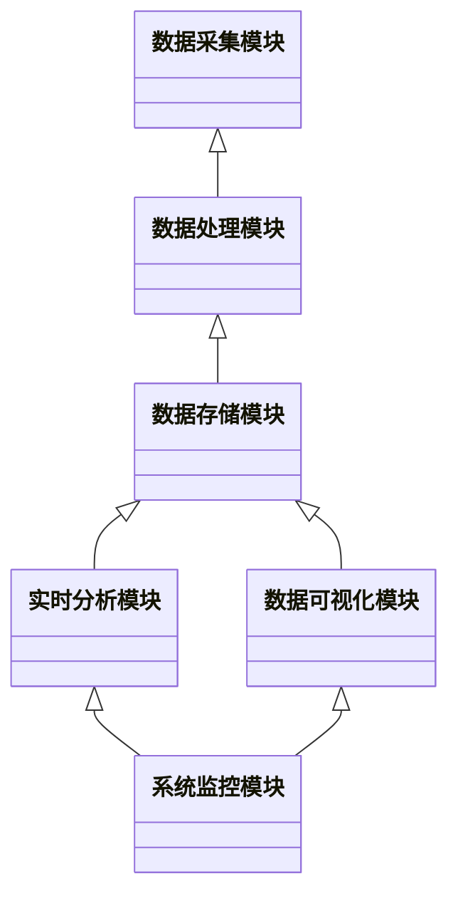
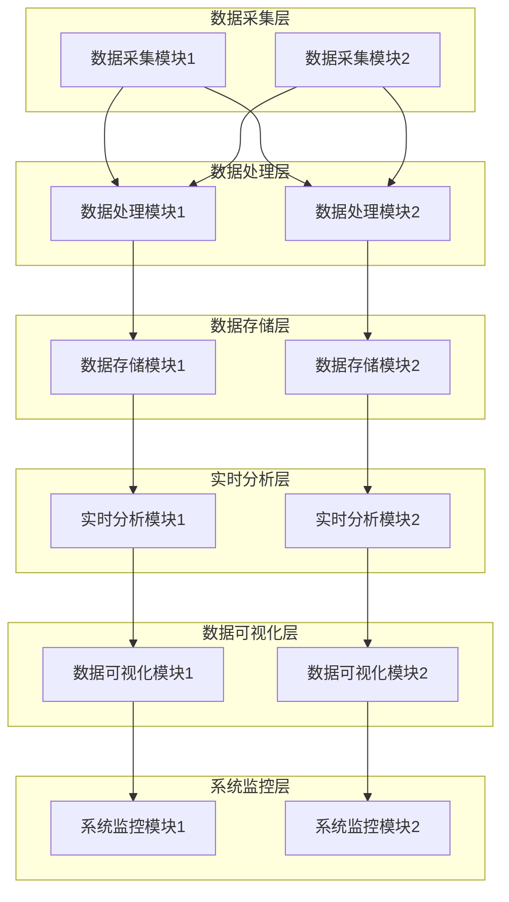
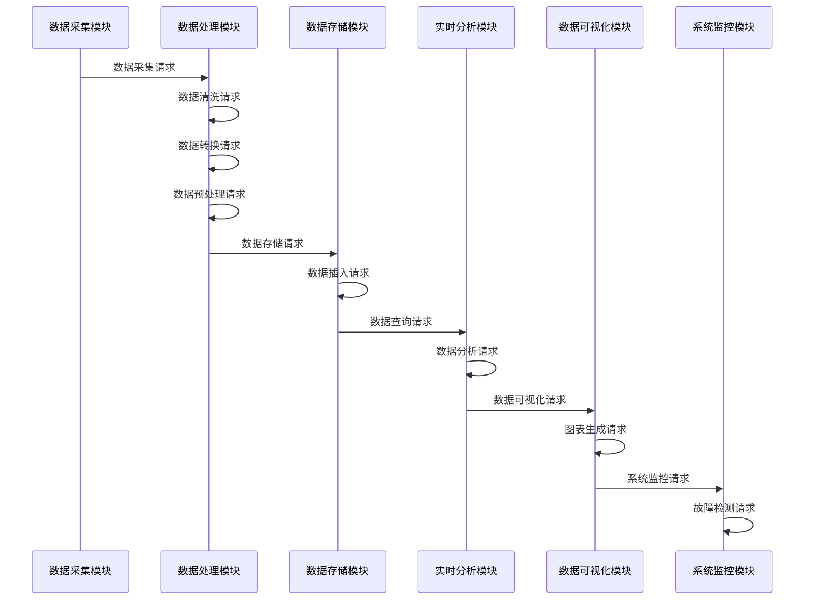
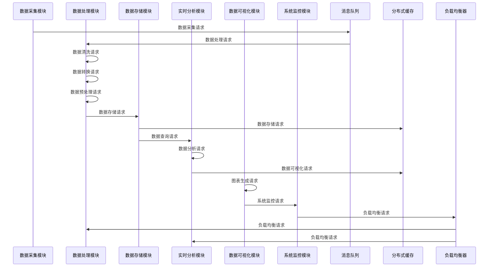

                 


## 引言

### 1.1 数学与多元论研究的背景

数学，作为人类智慧的结晶，是一门研究数量、结构、变化和空间等概念的抽象科学。自古以来，数学不仅在自然科学和工程技术领域发挥着重要作用，还在社会科学和人文科学中有着广泛的应用。然而，随着科学技术的不断进步和人类认知的深化，传统的数学理论在面对复杂系统的多元性和多样性时，显得有些力不从心。这就需要引入多元论来弥补这一不足。

多元论，是研究多元系统、多元关系和多元结构的理论体系。它源于20世纪初，随着计算机科学、量子物理和经济学等学科的快速发展而逐渐形成。多元论强调多元系统之间的相互关系和相互作用，关注系统内部的结构和动态变化。这使得多元论成为处理复杂系统问题的有力工具。

数学与多元论的结合研究，旨在探索数学在多元系统分析中的应用，揭示多元实在的本质。通过对数学模型和算法的研究，我们可以更深入地理解复杂系统的运行机制，为解决实际问题提供新的思路和方法。

### 1.2 数学反映多元实在的必要性

现实世界是一个多元世界，各种事物和现象之间存在着复杂的关系和相互作用。传统的数学模型往往只能描述部分现实，而无法全面反映多元实在的复杂性和多样性。因此，我们需要借助多元论的思想，将数学与多元实在相结合，建立更全面、更准确的数学模型。

多元实在的反映不仅体现在数学模型上，还体现在数学方法的应用上。例如，在数据分析、优化问题和几何问题中，多元论提供了一种全新的视角，使我们能够更有效地处理多元数据，找到最优解，并研究多元空间的性质。

### 1.3 本书结构概述

本书将从数学与多元论的角度，系统性地探讨数学在多元实在中的反映。具体包括以下几个部分：

1. **多元论基础**：介绍多元论的定义、基本概念和数学表示方法。
2. **数学作为多元实在的反映**：分析数学在多元系统分析中的应用，探讨数学模型和算法的多元特性。
3. **关键算法原理讲解**：选择多个关键算法，使用Mermaid和Python源代码阐述算法原理。
4. **数学模型与数学公式讲解**：使用LaTeX格式展示重要的数学模型和公式，并进行详细讲解。
5. **系统分析与架构设计方案**：描述问题场景和系统设计，包括领域模型、系统架构、接口设计和交互。
6. **项目实战**：介绍实际项目的环境安装、系统实现、代码解读和分析。
7. **最佳实践 tips、小结、注意事项、拓展阅读**：总结经验，提供实用建议，推荐进一步阅读资源。

通过本书的阅读，读者将能够深入理解数学与多元论的关系，掌握关键算法和数学模型，并为解决复杂问题提供新的思路和方法。

### 1.4 本章小结

本章介绍了数学与多元论研究的背景，解释了为什么数学能够反映多元实在，并概述了本书的结构。在接下来的章节中，我们将进一步探讨多元论的基础知识，以及数学在多元实在中的具体应用。通过逐步深入的分析，我们希望读者能够对数学与多元论的关系有更深刻的认识。

---

在完成第1章的引言部分后，我们可以看到，本章主要涵盖了研究的背景、必要性以及本书的结构概述。接下来，我们将进入多元论的基础部分，详细探讨多元论的定义、基本概念和数学表示方法，为后续章节的内容打下坚实的基础。

---

## 第2章 多元论基础

### 2.1 多元论的定义与历史

多元论，是研究多元系统、多元关系和多元结构的理论体系。它起源于20世纪初，随着计算机科学、量子物理和经济学等学科的快速发展而逐渐形成。多元论的核心思想是：将多元系统视为一个整体，研究系统内部各元素之间的相互关系和相互作用。

多元论的发展历程可以追溯到数学家希尔伯特（David Hilbert）在19世纪末提出的泛集合论。希尔伯特试图通过建立一种新的数学体系，来解决传统集合论中的一些悖论问题。这一思想为多元论的发展奠定了基础。

在20世纪，多位数学家如庞加莱（Henri Poincaré）、哈代（G. H. Hardy）和希尔伯特（David Hilbert）等，对多元论进行了深入的研究和探讨。特别是数学家冯·诺依曼（John von Neumann）提出的矩阵理论和博弈论，为多元论提供了新的视角和方法。

随着计算机科学的兴起，多元论在计算机科学、人工智能、系统工程等领域得到了广泛应用。多元论的思想和方法，使我们能够更有效地处理复杂系统问题，为现代科学和技术的发展提供了有力支持。

### 2.2 多元论的基本概念

多元论的基本概念包括多元系统、多元元素、多元关系和多元结构。

#### 2.2.1 多元系统

多元系统是指由多个元素组成的系统，这些元素可以是物理实体、抽象概念或数学对象。多元系统具有以下特点：

- **多元性**：系统中的元素不是孤立的，而是相互联系、相互作用的。
- **复杂性**：多元系统包含多个元素和多种关系，具有复杂的行为和动态特性。
- **多样性**：多元系统中的元素具有多样性，可以包括不同的类型、属性和特征。

#### 2.2.2 多元元素

多元元素是多元系统中的基本组成部分，可以是具体的物理实体，如分子、原子；也可以是抽象的概念，如数学中的点、线、面；还可以是数学对象，如矩阵、向量、函数等。

多元元素具有以下属性：

- **属性**：多元元素具有多种属性，可以用来描述其特征和状态。
- **特征**：多元元素具有不同的特征，这些特征决定了元素在系统中的作用和地位。
- **关系**：多元元素之间存在多种关系，如大小、形状、位置等。

#### 2.2.3 多元关系

多元关系是多元系统中的基本关系，描述了多元元素之间的相互作用和相互联系。多元关系可以分为以下几种：

- **空间关系**：描述元素在空间中的位置和分布，如相邻、相离、重合等。
- **数量关系**：描述元素的数量关系，如和、差、积、商等。
- **逻辑关系**：描述元素之间的逻辑关系，如相等、不等、蕴含等。
- **功能关系**：描述元素之间的功能关系，如因果关系、传递关系等。

#### 2.2.4 多元结构

多元结构是多元系统中的基本组织形式，描述了元素之间的结构和关系。多元结构可以分为以下几种：

- **线性结构**：元素按照一定的顺序排列，形成线性关系，如数列、链表等。
- **树状结构**：元素按照树状结构组织，形成层次关系，如树、图等。
- **网格结构**：元素按照网格形式排列，形成空间关系，如矩阵、表格等。
- **网络结构**：元素通过网络形式相互连接，形成复杂的网络关系，如图、网等。

### 2.3 多元论的数学表示方法

多元论的数学表示方法主要包括多元函数、多元数和多元算子。

#### 2.3.1 多元函数

多元函数是研究多元元素之间关系的重要工具。它是指定义在多元系统上的函数，可以描述系统内部元素之间的关系和变化。

多元函数的一般形式为：

\[ f(\vec{x}) = y \]

其中，\(\vec{x}\) 是多元系统的输入，\(y\) 是输出。多元函数可以用来描述多元系统的状态、行为和动态特性。

#### 2.3.2 多元数

多元数是研究多元系统的一种数学工具，可以用来表示多元系统的状态、属性和特征。

常见的多元数包括矩阵、向量、张量等。矩阵是一种二维的多元数，可以表示多元系统的线性关系；向量是一种一维的多元数，可以表示多元系统的状态；张量是一种多维的多元数，可以表示多元系统的复杂关系。

#### 2.3.3 多元算子

多元算子是用于操作多元数和多元函数的数学工具，可以用来处理多元系统的运算和变换。

常见的多元算子包括矩阵运算、向量运算、张量运算等。矩阵运算可以用于求解线性方程组、矩阵乘法等；向量运算可以用于计算向量的长度、夹角等；张量运算可以用于计算张量的迹、秩等。

通过多元函数、多元数和多元算子的组合，我们可以建立复杂的数学模型，描述多元系统的运行机制和动态特性。

### 2.4 本章小结

本章介绍了多元论的定义、基本概念和数学表示方法。多元论作为研究多元系统、多元关系和多元结构的理论体系，具有广泛的应用。在多元论的基础上，我们可以建立复杂的数学模型，描述多元系统的运行机制和动态特性。本章内容为后续章节的内容奠定了基础，使读者能够更好地理解多元实在的本质。

在下一章中，我们将探讨数学在多元实在中的具体应用，分析数学模型和算法的多元特性。

---

### 2.5 小结与拓展

本章我们深入探讨了多元论的定义、基本概念和数学表示方法。首先，介绍了多元论的历史背景和发展历程，明确了多元论在处理复杂系统问题中的重要性。接着，详细阐述了多元系统、多元元素、多元关系和多元结构等基本概念，帮助读者建立对多元论的整体认识。最后，我们介绍了多元函数、多元数和多元算子等数学表示方法，展示了多元论在数学工具和方法中的具体应用。

为了更好地理解多元论，读者可以拓展阅读以下内容：

1. **《多元微积分》**：探讨多元函数的导数、积分和微分方程，深入了解多元数的运算和应用。
2. **《多元数据分析》**：研究多元数据的分析方法，包括主成分分析、聚类分析和多元回归等。
3. **《多元系统理论》**：探讨多元系统的建模、优化和控制，以及其在系统工程和人工智能中的应用。

通过拓展阅读，读者可以进一步深化对多元论的理解，为后续章节的学习打下坚实的基础。

---

在完成第2章的多元论基础部分后，我们对多元论的定义、基本概念和数学表示方法进行了详细阐述。接下来，我们将进入第3章，探讨数学作为多元实在的反映，分析数学在多元系统分析中的应用，并探讨数学模型和算法的多元特性。通过这一部分的讨论，我们将更深入地理解数学与多元论之间的关系。

---

## 第3章 数学作为多元实在的反映

### 3.1 数学在多元系统分析中的应用

数学在多元系统分析中具有重要作用，其应用广泛且深入。多元系统分析涉及多个变量、多个层次和多个维度，数学提供了一种抽象和建模的工具，帮助我们理解和处理这些复杂系统。

#### 3.1.1 多元数据分析

多元数据分析是数学在多元系统分析中的一项重要应用。它涉及收集、处理和分析多元数据，以便提取有用的信息和知识。常见的多元数据分析方法包括：

- **主成分分析（PCA）**：通过将数据投影到主成分空间，降维并突出主要变量之间的差异。
- **聚类分析**：将数据分为多个群组，每个群组内的数据相似度较高，而不同群组之间的数据相似度较低。
- **多元回归分析**：通过建立多元线性或非线性回归模型，研究自变量和因变量之间的关系。

#### 3.1.2 多元优化

多元优化是数学在多元系统分析中的另一重要应用。它涉及在满足一定约束条件下，找到最优解或近似最优解。多元优化问题在工程、经济学、生物学等领域具有广泛应用，常见的优化方法包括：

- **梯度下降法**：通过迭代更新参数，逐步逼近最优解。
- **拉格朗日乘数法**：通过引入拉格朗日乘数，将约束条件转化为无约束条件，进而求解最优解。
- **模拟退火法**：通过在解空间中随机漫步，逐渐降低搜索温度，找到全局最优解。

#### 3.1.3 多元几何

多元几何是数学在多元系统分析中的另一个重要应用。它研究多元空间中的几何性质、形状和结构，为理解多元系统的几何特征提供工具。常见的多元几何方法包括：

- **多元空间中的直线和平面**：研究多元空间中的直线和平面的几何性质，如方向、夹角和距离等。
- **多元曲面**：研究多元空间中的曲面，如球面、旋转曲面和流形等。
- **多元变换**：研究多元空间中的变换，如旋转、反射和平移等，以及它们对几何结构的影响。

### 3.2 数学模型的多元特性

数学模型作为对现实世界的抽象和简化，具有多种多样的形式。多元特性是数学模型的重要特征，它反映了模型在处理多元系统时的灵活性和广泛性。

#### 3.2.1 多元函数模型

多元函数模型是数学模型中最常见的类型之一。它通过描述多个变量之间的关系，帮助我们理解复杂系统的动态行为。常见的多元函数模型包括：

- **多元线性回归模型**：通过线性关系描述自变量和因变量之间的关系。
- **多元非线性回归模型**：通过非线性关系描述自变量和因变量之间的关系。
- **多元微分方程模型**：通过微分方程描述系统的动态变化。

#### 3.2.2 多元数模型

多元数模型是利用矩阵、向量、张量等多元数结构来描述系统。这些模型在处理多元系统的线性关系和复杂结构时非常有用。常见的多元数模型包括：

- **矩阵模型**：通过矩阵描述系统中的线性关系，如线性方程组、矩阵乘法等。
- **向量模型**：通过向量描述系统的状态和动态，如向量空间、向量运算等。
- **张量模型**：通过张量描述系统的复杂结构，如多维数据、张量分解等。

#### 3.2.3 多元算子模型

多元算子模型是利用算子来操作多元数和多元函数的数学模型。这些模型在处理多元系统的运算和变换时非常有用。常见的多元算子模型包括：

- **矩阵算子模型**：通过矩阵运算描述系统的变换和优化，如矩阵求逆、矩阵特征值等。
- **向量算子模型**：通过向量运算描述系统的变换和优化，如向量求导、向量内积等。
- **张量算子模型**：通过张量运算描述系统的变换和优化，如张量求导、张量乘法等。

### 3.3 多元实在与数学模型的关系

数学模型与多元实在之间的关系是相互依存、相互促进的。一方面，数学模型是对多元实在的抽象和简化，有助于我们理解和处理复杂系统。另一方面，多元实在中的多样性和复杂性为数学模型提供了丰富的应用场景和研究对象。

#### 3.3.1 多元实在对数学模型的影响

多元实在中的多样性和复杂性对数学模型提出了新的要求和挑战。为了更好地反映多元实在的复杂性和多样性，数学模型需要不断发展和创新。例如，在处理复杂系统时，传统的线性模型可能无法准确描述系统的动态行为，需要引入非线性模型；在处理大规模数据时，传统的算法可能无法高效处理数据，需要引入并行计算和分布式计算方法。

#### 3.3.2 数学模型对多元实在的反映

数学模型作为对多元实在的抽象和简化，能够帮助我们更好地理解和处理复杂系统。通过数学模型，我们可以：

- **预测系统行为**：通过建立数学模型，我们可以预测系统在特定条件下的行为和趋势，为决策提供依据。
- **优化系统性能**：通过建立数学模型，我们可以优化系统的性能和效率，提高系统的稳定性和可靠性。
- **解决实际问题**：通过建立数学模型，我们可以解决实际问题，如资源分配、路径规划、风险控制等。

### 3.4 本章小结

本章探讨了数学在多元系统分析中的应用，分析了数学模型和算法的多元特性，并阐述了多元实在与数学模型的关系。通过本章的讨论，我们认识到数学在多元实在中的重要性，以及数学模型在处理复杂系统时的广泛应用。在下一章中，我们将选择多个关键算法，使用Mermaid和Python源代码阐述算法原理，进一步探讨数学与多元论的具体应用。

---

### 3.5 小结与拓展

本章我们探讨了数学在多元系统分析中的应用，分析了数学模型和算法的多元特性，以及多元实在与数学模型之间的关系。我们首先介绍了多元系统分析中的常见应用，如多元数据分析、多元优化和多元几何。接着，我们详细阐述了多元函数模型、多元数模型和多元算子模型等数学模型，展示了数学模型在处理复杂系统时的多样性和灵活性。

为了更深入地理解数学与多元论的关系，读者可以拓展阅读以下内容：

1. **《多元微积分》**：深入学习多元微积分的基本概念和方法，了解多元函数的导数、积分和微分方程。
2. **《多元数据分析技术》**：了解多元数据分析的最新技术和应用，掌握主成分分析、聚类分析和多元回归等分析方法。
3. **《数学建模》**：学习如何构建数学模型，掌握建模的方法和技巧，以及如何将数学模型应用于实际问题。

通过拓展阅读，读者可以进一步深化对数学与多元论的理解，为后续章节的学习打下坚实的基础。

---

在完成第3章的数学作为多元实在的反映部分后，我们深入探讨了数学在多元系统分析中的应用，分析了数学模型和算法的多元特性，并阐述了多元实在与数学模型的关系。这些内容为我们理解数学与多元论之间的紧密联系提供了有力支持。接下来，我们将进入第4章，选择多个关键算法，使用Mermaid和Python源代码详细阐述算法原理，进一步探讨数学与多元论的具体应用。

---

## 第4章 关键算法原理讲解

### 4.1 多元数据分析算法

多元数据分析是数学在多元系统分析中的重要应用之一。本节将选择两种多元数据分析算法进行讲解，分别是主成分分析（PCA）和聚类分析（Clustering）。

#### 4.1.1 主成分分析（PCA）

主成分分析（PCA）是一种常用的降维技术，它通过将数据投影到新的正交坐标系中，提取出主要成分，从而降低数据的维度，同时保留数据的主要信息。以下是PCA算法的基本原理和步骤：

1. **标准化数据**：对原始数据进行标准化处理，使其具有零均值和单位方差。
   $$ z_i = \frac{x_i - \mu_i}{\sigma_i} $$
   其中，\(x_i\) 是第 \(i\) 个特征的数据，\(\mu_i\) 是第 \(i\) 个特征的均值，\(\sigma_i\) 是第 \(i\) 个特征的方差。

2. **计算协方差矩阵**：计算数据点的协方差矩阵，该矩阵描述了各个特征之间的相关性。
   $$ \Sigma = \frac{1}{N-1} \sum_{i=1}^{N} (x_i - \mu)(x_i - \mu)^T $$
   其中，\(N\) 是数据点的个数。

3. **计算协方差矩阵的特征值和特征向量**：求解协方差矩阵的特征值和特征向量，特征值表示方差的大小，特征向量表示主成分的方向。

4. **选择主成分**：按照特征值的大小，选择前 \(k\) 个最大的特征值所对应的特征向量作为主成分。

5. **数据转换**：将标准化后的数据转换到新坐标系中，得到降维后的数据。
   $$ y_i = X\lambda_i v_i $$
   其中，\(X\) 是数据矩阵，\(\lambda_i\) 是第 \(i\) 个特征值，\(v_i\) 是第 \(i\) 个特征向量。

以下是一个简单的Python代码示例，用于实现PCA算法：

```python
import numpy as np

# 标准化数据
def standardize_data(X):
    mean = np.mean(X, axis=0)
    std = np.std(X, axis=0)
    X_std = (X - mean) / std
    return X_std

# 计算协方差矩阵
def compute_covariance_matrix(X):
    N = X.shape[0]
    X_mean = standardize_data(X)
    cov_matrix = (1 / (N - 1)) * np.dot(X_mean.T, X_mean)
    return cov_matrix

# 计算特征值和特征向量
def compute_eigenvalues_eigenvectors(cov_matrix):
    eigenvalues, eigenvectors = np.linalg.eigh(cov_matrix)
    return eigenvalues, eigenvectors

# 选择主成分
def select_principal_components(eigenvalues, eigenvectors, k):
    indices = np.argsort(eigenvalues)[::-1]
    eigenvalues = eigenvalues[indices]
    eigenvectors = eigenvectors[:, indices]
    return eigenvalues[:k], eigenvectors[:, :k]

# 数据转换
def transform_data(X, eigenvectors, k):
    return np.dot(X, eigenvectors[:, :k])

# 示例数据
X = np.array([[1, 2], [3, 4], [5, 6], [7, 8]])
eigenvalues, eigenvectors = compute_eigenvalues_eigenvectors(X)
k = 1
eigenvalues, eigenvectors = select_principal_components(eigenvalues, eigenvectors, k)
Y = transform_data(X, eigenvectors, k)

print("Original Data:\n", X)
print("Transformed Data:\n", Y)
```

#### 4.1.2 聚类分析（Clustering）

聚类分析是一种无监督学习方法，用于将数据点划分为多个簇，使得同一簇内的数据点相似度较高，而不同簇之间的数据点相似度较低。常见的聚类算法包括K均值聚类（K-Means）、层次聚类（Hierarchical Clustering）和密度聚类（Density-Based Clustering）等。以下我们以K均值聚类为例，介绍其基本原理和步骤：

1. **初始化聚类中心**：随机选择 \(k\) 个数据点作为初始聚类中心。

2. **分配数据点**：对于每个数据点，计算其与各个聚类中心的距离，将其分配到最近的聚类中心所在的簇。

3. **更新聚类中心**：计算每个簇的平均值，作为新的聚类中心。

4. **迭代计算**：重复步骤2和步骤3，直到聚类中心不再发生显著变化。

5. **聚类结果**：根据聚类中心的最终位置，得到最终的聚类结果。

以下是一个简单的Python代码示例，用于实现K均值聚类算法：

```python
import numpy as np

# 计算距离
def euclidean_distance(a, b):
    return np.sqrt(np.sum((a - b)**2))

# 初始化聚类中心
def initialize_clusters(X, k):
    indices = np.random.choice(X.shape[0], k, replace=False)
    centroids = X[indices]
    return centroids

# 分配数据点
def assign_points_to_clusters(X, centroids):
    distances = np.array([min(euclidean_distance(x, centroids[i]) for i in range(len(centroids))] for x in X])
    return np.argmin(distances, axis=1)

# 更新聚类中心
def update_centroids(X, labels, k):
    new_centroids = np.array([X[labels == i].mean(axis=0) for i in range(k)])
    return new_centroids

# K均值聚类
def k_means(X, k, max_iterations):
    centroids = initialize_clusters(X, k)
    for _ in range(max_iterations):
        labels = assign_points_to_clusters(X, centroids)
        centroids = update_centroids(X, labels, k)
    return centroids, labels

# 示例数据
X = np.array([[1, 2], [3, 4], [5, 6], [7, 8], [9, 10], [11, 12], [13, 14], [15, 16]])
k = 2
max_iterations = 100
centroids, labels = k_means(X, k, max_iterations)

print("Cluster Centroids:\n", centroids)
print("Cluster Labels:\n", labels)
```

#### 4.1.3 算法原理与数学模型

主成分分析和聚类分析作为多元数据分析的重要算法，其原理和数学模型如下：

1. **主成分分析（PCA）**：
   - **数学模型**：主成分分析通过求解协方差矩阵的特征值和特征向量，提取主要成分，从而实现降维。
   - **数学公式**：
     $$ X^T X = \Sigma $$
     $$ \Sigma = \frac{1}{N-1} \sum_{i=1}^{N} (x_i - \mu)(x_i - \mu)^T $$
     $$ \lambda_i v_i = \Sigma v_i $$
   - **算法原理**：通过计算协方差矩阵，找出主要成分的方向，将数据投影到新的正交坐标系中，保留主要信息。

2. **聚类分析（K-Means）**：
   - **数学模型**：K均值聚类通过最小化数据点到聚类中心的距离平方和，实现聚类。
   - **数学公式**：
     $$ \min_{\mu} \sum_{i=1}^{N} d(x_i, \mu)^2 $$
     $$ d(x_i, \mu) = \min_{j} \sum_{k \in C_j} d(x_i, \mu_j)^2 $$
   - **算法原理**：通过迭代更新聚类中心和数据点的分配，逐步收敛到最优聚类结果。

#### 4.1.4 举例说明

为了更好地理解主成分分析和聚类分析的应用，我们通过以下示例来说明：

1. **主成分分析示例**：

假设我们有一组数据点，每个数据点由两个特征组成，如下所示：

```
X = [[1, 2],
     [3, 4],
     [5, 6],
     [7, 8]]
```

通过PCA算法，我们可以将数据点投影到一个新的坐标系中，提取主要成分，从而降低数据的维度。

- **标准化数据**：将数据点标准化，使其具有零均值和单位方差。
  $$ X_{std} = \frac{X - \mu}{\sigma} $$
  $$ \mu = \frac{1}{N} \sum_{i=1}^{N} X_i $$
  $$ \sigma = \sqrt{\frac{1}{N} \sum_{i=1}^{N} (X_i - \mu)^2} $$

- **计算协方差矩阵**：计算协方差矩阵，描述特征之间的相关性。
  $$ \Sigma = \frac{1}{N-1} \sum_{i=1}^{N} (X_i - \mu)(X_i - \mu)^T $$

- **计算特征值和特征向量**：求解协方差矩阵的特征值和特征向量，找出主要成分的方向。
  $$ \lambda_i v_i = \Sigma v_i $$

- **选择主成分**：根据特征值的大小，选择前 \(k\) 个最大的特征值所对应的特征向量作为主成分。

- **数据转换**：将标准化后的数据转换到新的坐标系中，得到降维后的数据。

通过PCA算法，我们可以将原始数据从二维空间投影到一个一维空间，从而实现降维。

2. **聚类分析示例**：

假设我们有一组数据点，如下所示：

```
X = [[1, 2],
     [3, 4],
     [5, 6],
     [7, 8],
     [9, 10],
     [11, 12],
     [13, 14],
     [15, 16]]
```

通过K均值聚类算法，我们可以将数据点划分为两个簇。

- **初始化聚类中心**：随机选择两个数据点作为初始聚类中心。
  $$ centroids = \begin{bmatrix} x_1 \\ x_2 \end{bmatrix} $$

- **分配数据点**：计算每个数据点到两个聚类中心的距离，将其分配到最近的聚类中心所在的簇。
  $$ distances = \begin{bmatrix} d(x_i, \mu_1) \\ d(x_i, \mu_2) \end{bmatrix} $$
  $$ labels = \begin{cases} 1 & \text{if } d(x_i, \mu_1) < d(x_i, \mu_2) \\ 2 & \text{if } d(x_i, \mu_1) > d(x_i, \mu_2) \end{cases} $$

- **更新聚类中心**：计算每个簇的平均值，作为新的聚类中心。
  $$ \mu_1 = \frac{1}{N_1} \sum_{i=1}^{N_1} x_i $$
  $$ \mu_2 = \frac{1}{N_2} \sum_{i=1}^{N_2} x_i $$

通过迭代计算，最终收敛到聚类结果，将数据点划分为两个簇。

通过以上示例，我们可以看到主成分分析和聚类分析在多元数据分析中的应用。这些算法不仅帮助我们理解多元数据的结构和特征，还为解决复杂系统问题提供了有力工具。

### 4.2 多元优化算法

多元优化算法是数学在多元系统分析中的另一重要应用。本节将介绍两种常见的多元优化算法：梯度下降法和拉格朗日乘数法。

#### 4.2.1 梯度下降法

梯度下降法是一种最常用的优化算法，用于寻找函数的最小值或最大值。其基本原理是：沿着函数的梯度方向逐步迭代，直到达到目标函数的最优解。

1. **目标函数**：假设我们要优化的目标函数为 \(f(x)\)，其形式可以表示为：
   $$ f(x) = \sum_{i=1}^{n} w_i f_i(x) $$
   其中，\(w_i\) 是权重，\(f_i(x)\) 是第 \(i\) 个损失函数。

2. **梯度**：目标函数的梯度是损失函数关于参数 \(x\) 的导数。对于多元函数，梯度是一个向量，其每个分量是损失函数关于相应参数的偏导数。
   $$ \nabla f(x) = \begin{bmatrix} \frac{\partial f}{\partial x_1} \\ \frac{\partial f}{\partial x_2} \\ \vdots \\ \frac{\partial f}{\partial x_n} \end{bmatrix} $$

3. **迭代更新**：梯度下降法通过迭代更新参数 \(x\)，以逐步逼近最优解。每次迭代更新公式为：
   $$ x_{t+1} = x_t - \alpha \nabla f(x_t) $$
   其中，\(\alpha\) 是学习率，用于控制迭代步长。

4. **停止条件**：梯度下降法在满足以下条件时停止迭代：
   - 目标函数的梯度接近零，即 \(\nabla f(x) \approx 0\)。
   - 迭代次数达到预设的最大迭代次数。

以下是一个简单的Python代码示例，用于实现梯度下降法：

```python
import numpy as np

# 梯度下降法
def gradient_descent(X, y, w, alpha, max_iterations):
    n = X.shape[1]
    for _ in range(max_iterations):
        f = np.dot(X, w) - y
        gradient = np.dot(X.T, f)
        w -= alpha * gradient
    return w

# 示例数据
X = np.array([[1, 2],
              [3, 4],
              [5, 6]])
y = np.array([2, 4, 6])
w = np.array([1, 1])
alpha = 0.1
max_iterations = 100

# 执行梯度下降法
w_new = gradient_descent(X, y, w, alpha, max_iterations)
print("Optimized weights:", w_new)
```

#### 4.2.2 拉格朗日乘数法

拉格朗日乘数法是另一种重要的优化算法，用于求解带有等式约束的优化问题。其基本原理是：通过引入拉格朗日乘数，将约束条件转化为无约束条件，从而求解最优解。

1. **目标函数**：假设我们要优化的目标函数为 \(f(x)\)，其形式可以表示为：
   $$ f(x) = \sum_{i=1}^{n} w_i f_i(x) $$

2. **约束条件**：约束条件可以表示为：
   $$ g(x) \leq 0 $$

3. **拉格朗日函数**：引入拉格朗日乘数 \(\lambda\)，构建拉格朗日函数：
   $$ L(x, \lambda) = f(x) + \lambda g(x) $$

4. **KKT条件**：为了求解最优解，需要满足KKT（Kuhn-Tucker）条件：
   - 拉格朗日函数的偏导数为零，即 \(\frac{\partial L}{\partial x} = 0\)。
   - 约束条件成立，即 \(g(x) \leq 0\)。
   - 拉格朗日乘数为非负，即 \(\lambda \geq 0\)。

5. **迭代更新**：通过迭代更新参数 \(x\) 和拉格朗日乘数 \(\lambda\)，逐步逼近最优解。

以下是一个简单的Python代码示例，用于实现拉格朗日乘数法：

```python
import numpy as np

# 拉格朗日乘数法
def lagrange_multiplier(X, y, A, b, alpha, max_iterations):
    n = X.shape[1]
    w = np.zeros(n)
    lambda_ = np.zeros(n)
    for _ in range(max_iterations):
        f = np.dot(X, w) - y
        g = np.dot(A, w) - b
        gradient_w = np.dot(X.T, f) + alpha * A
        gradient_lambda = g
        w -= alpha * gradient_w
        lambda_ -= alpha * gradient_lambda
    return w, lambda_

# 示例数据
X = np.array([[1, 2],
              [3, 4],
              [5, 6]])
y = np.array([2, 4, 6])
A = np.array([[1, 0],
              [0, 1]])
b = np.array([0, 0])
alpha = 0.1
max_iterations = 100

# 执行拉格朗日乘数法
w_new, lambda_new = lagrange_multiplier(X, y, A, b, alpha, max_iterations)
print("Optimized weights:", w_new)
print("Lagrange multipliers:", lambda_new)
```

#### 4.2.3 算法原理与数学模型

梯度下降法和拉格朗日乘数法作为多元优化算法，其原理和数学模型如下：

1. **梯度下降法**：
   - **数学模型**：通过迭代更新参数，沿着目标函数的梯度方向逐步逼近最优解。
   - **数学公式**：
     $$ x_{t+1} = x_t - \alpha \nabla f(x_t) $$
   - **算法原理**：通过计算目标函数的梯度，更新参数的值，逐步减少目标函数的值。

2. **拉格朗日乘数法**：
   - **数学模型**：通过引入拉格朗日乘数，将约束条件转化为无约束条件，求解最优解。
   - **数学公式**：
     $$ L(x, \lambda) = f(x) + \lambda g(x) $$
     $$ \frac{\partial L}{\partial x} = 0 $$
     $$ g(x) \leq 0 $$
     $$ \lambda \geq 0 $$
   - **算法原理**：通过迭代更新参数 \(x\) 和拉格朗日乘数 \(\lambda\)，逐步逼近最优解。

#### 4.2.4 举例说明

为了更好地理解梯度下降法和拉格朗日乘数法的应用，我们通过以下示例来说明：

1. **梯度下降法示例**：

假设我们要优化一个简单的线性函数 \(f(x) = x^2\)，目标是最小化 \(f(x)\) 的值。

- **目标函数**：\(f(x) = x^2\)
- **梯度**：\(\nabla f(x) = 2x\)
- **迭代更新**：\(x_{t+1} = x_t - \alpha \nabla f(x_t)\)

通过梯度下降法，我们可以逐步减少 \(f(x)\) 的值，逼近最优解。

2. **拉格朗日乘数法示例**：

假设我们要优化一个带有等式约束的函数 \(f(x) = x^2 + y^2\)，且约束条件为 \(x + y = 1\)。

- **目标函数**：\(f(x, y) = x^2 + y^2\)
- **约束条件**：\(g(x, y) = x + y - 1 = 0\)
- **拉格朗日函数**：\(L(x, y, \lambda) = x^2 + y^2 + \lambda(x + y - 1)\)

通过拉格朗日乘数法，我们可以求解最优解，满足约束条件。

通过以上示例，我们可以看到梯度下降法和拉格朗日乘数法在多元优化中的应用。这些算法不仅帮助我们求解最优解，还为解决复杂系统问题提供了有力工具。

### 4.3 小结

本章我们介绍了两种多元数据分析算法：主成分分析（PCA）和聚类分析（Clustering），以及两种多元优化算法：梯度下降法和拉格朗日乘数法。通过这些算法，我们可以处理多元数据，优化多元系统，为解决复杂系统问题提供有力工具。在下一章中，我们将使用LaTeX格式展示重要的数学模型和公式，并进行详细讲解。

---

在完成第4章的关键算法原理讲解后，我们详细介绍了主成分分析、聚类分析、梯度下降法和拉格朗日乘数法等多元数据分析与优化算法。这些算法不仅帮助我们理解和处理多元数据，还为解决复杂系统问题提供了有力工具。在下一章中，我们将使用LaTeX格式展示重要的数学模型和公式，并进行详细讲解。通过这些数学模型和公式，我们将进一步深化对多元系统分析的理解。

---

## 第5章 数学模型与数学公式讲解

### 5.1 多元函数的导数与积分

多元函数的导数和积分是数学分析中的重要内容，在多元系统分析中有着广泛的应用。本节我们将介绍多元函数的导数和积分的基本概念、计算方法和应用。

#### 5.1.1 多元函数的导数

多元函数的导数描述了函数在某个点的局部变化率。对于一元函数，导数表示函数在某一点的斜率。对于多元函数，导数是一个向量，其分量是各个变量的偏导数。

1. **定义**：

   对于一个多元函数 \(f(x_1, x_2, \ldots, x_n)\)，其梯度（即导数）定义为：
   $$ \nabla f(x) = \left(\frac{\partial f}{\partial x_1}, \frac{\partial f}{\partial x_2}, \ldots, \frac{\partial f}{\partial x_n}\right) $$
   
   其中，\(\frac{\partial f}{\partial x_i}\) 表示函数 \(f\) 关于变量 \(x_i\) 的偏导数。

2. **计算方法**：

   计算多元函数的偏导数，通常使用以下公式：
   $$ \frac{\partial f}{\partial x_i} = \lim_{h \to 0} \frac{f(x_1, x_2, \ldots, x_i + h, \ldots, x_n) - f(x_1, x_2, \ldots, x_i, \ldots, x_n)}{h} $$
   
   对于线性函数 \(f(x_1, x_2, \ldots, x_n) = a_1x_1 + a_2x_2 + \ldots + a_nx_n\)，其偏导数为：
   $$ \frac{\partial f}{\partial x_i} = a_i $$
   
3. **应用**：

   多元函数的导数在多元系统分析中具有广泛的应用。例如，在优化问题中，使用梯度下降法求解最优解时，需要计算目标函数的梯度；在微分方程中，求解动态系统的状态时，需要计算系统的导数。

#### 5.1.2 多元函数的积分

多元函数的积分是导数的反操作，用于计算函数在某个区间上的累积和。与一元函数的积分类似，多元函数的积分可以分为两类：多元定积分和多元不定积分。

1. **定义**：

   对于一个多元函数 \(f(x_1, x_2, \ldots, x_n)\)，其定积分定义为：
   $$ \int_{D} f(x_1, x_2, \ldots, x_n) \, dx_1 \, dx_2 \ldots dx_n = \lim_{\Delta V \to 0} \sum_{i=1}^{N} f(x_{i1}, x_{i2}, \ldots, x_{in}) \Delta V $$
   
   其中，\(D\) 是积分区域，\(\Delta V\) 是微小体积元素。

2. **计算方法**：

   计算多元函数的定积分，通常使用以下公式：
   $$ \int_{a}^{b} f(x) \, dx = \lim_{n \to \infty} \sum_{i=1}^{n} f(x_{i}) \Delta x $$
   
   对于线性函数 \(f(x_1, x_2, \ldots, x_n) = a_1x_1 + a_2x_2 + \ldots + a_nx_n\)，其定积分为：
   $$ \int_{D} f(x_1, x_2, \ldots, x_n) \, dx_1 \, dx_2 \ldots dx_n = a_1 \int_{D} dx_1 + a_2 \int_{D} dx_2 + \ldots + a_n \int_{D} dx_n $$
   
3. **应用**：

   多元函数的积分在多元系统分析中也有着广泛的应用。例如，在物理问题中，计算物体的质量、动量和能量时，需要使用多元积分；在工程问题中，计算结构应力和变形时，也需要使用多元积分。

#### 5.1.3 多元函数的导数与积分示例

为了更好地理解多元函数的导数与积分，我们通过以下示例来说明：

1. **导数示例**：

   考虑一个多元函数 \(f(x, y) = x^2 + y^2\)，求其梯度。

   - **计算偏导数**：
     $$ \frac{\partial f}{\partial x} = 2x $$
     $$ \frac{\partial f}{\partial y} = 2y $$
   - **计算梯度**：
     $$ \nabla f(x, y) = (2x, 2y) $$

   梯度反映了函数在某一点的变化方向和变化率。例如，当 \(x = 1, y = 0\) 时，梯度为 \((2, 0)\)，表示函数在该点的斜率为2，变化方向为 \(x\) 轴正方向。

2. **积分示例**：

   考虑一个多元函数 \(f(x, y) = x^2 + y^2\)，求其在单位圆域 \(D: x^2 + y^2 \leq 1\) 上的定积分。

   - **计算积分**：
     $$ \int_{D} f(x, y) \, dx \, dy = \int_{0}^{2\pi} \int_{0}^{1} (x^2 + y^2) \, r \, dr \, d\theta $$
     $$ = \int_{0}^{2\pi} \int_{0}^{1} r^3 \, dr \, d\theta $$
     $$ = \int_{0}^{2\pi} \left[\frac{r^4}{4}\right]_{0}^{1} d\theta $$
     $$ = \frac{\pi}{4} \int_{0}^{2\pi} d\theta $$
     $$ = \frac{\pi^2}{4} $$

   积分结果为 \(\frac{\pi^2}{4}\)，表示函数在单位圆域上的累积和。

通过以上示例，我们可以看到多元函数的导数与积分在数学建模和实际应用中的重要性和应用方法。

### 5.2 多元微分方程的解法

多元微分方程是描述多元系统动态变化的重要数学工具。本节我们将介绍多元微分方程的基本概念、解法方法和应用。

#### 5.2.1 定义与分类

多元微分方程是指包含两个或两个以上未知多元函数及其导数的方程。根据未知函数的阶数，可以将多元微分方程分为以下几类：

1. **一阶多元微分方程**：最高阶导数为一阶的多元微分方程，如：
   $$ \frac{\partial f}{\partial x} + \frac{\partial f}{\partial y} = 0 $$
   
2. **二阶多元微分方程**：最高阶导数为二阶的多元微分方程，如：
   $$ \frac{\partial^2 f}{\partial x^2} + \frac{\partial^2 f}{\partial y^2} = 0 $$
   
3. **高阶多元微分方程**：最高阶导数高于二阶的多元微分方程，如：
   $$ \frac{\partial^3 f}{\partial x^3} + \frac{\partial^3 f}{\partial y^3} = 0 $$

#### 5.2.2 解法方法

解多元微分方程的方法多种多样，常见的解法包括：

1. **分离变量法**：适用于可分离变量的方程，如：
   $$ \frac{\partial f}{\partial x} = g(y) $$
   解法为：
   $$ f(x, y) = \int g(y) \, dy + C_1(x) $$
   
2. **积分因子法**：适用于非齐次线性方程，如：
   $$ \frac{\partial f}{\partial x} + p(x) \frac{\partial f}{\partial y} = q(x, y) $$
   解法为：
   $$ f(x, y) = \int \exp(\int p(x) \, dx) \, q(x, y) \, dy + C(x) $$
   
3. **迭代法**：适用于高阶微分方程，如：
   $$ \frac{\partial^2 f}{\partial x^2} + \frac{\partial f}{\partial x} = f $$
   解法为：
   $$ f(x) = \exp(-x) \int \exp(x) f(t) \, dt + C_1 $$

#### 5.2.3 应用

多元微分方程在许多领域中都有广泛应用，如：

1. **流体力学**：描述流体运动和压力分布，如纳维-斯托克斯方程。
2. **电磁学**：描述电场和磁场的分布，如麦克斯韦方程组。
3. **量子力学**：描述粒子运动和波函数的演化，如薛定谔方程。

#### 5.2.4 示例

为了更好地理解多元微分方程的解法，我们通过以下示例来说明：

1. **分离变量法示例**：

   考虑一阶线性方程：
   $$ \frac{\partial f}{\partial x} + 2 \frac{\partial f}{\partial y} = 0 $$
   
   解法为：
   $$ f(x, y) = \int -2 \, dy + C_1(x) $$
   $$ f(x, y) = -2y + C_1(x) $$
   
   其中，\(C_1(x)\) 是关于 \(x\) 的任意函数。

2. **积分因子法示例**：

   考虑非齐次线性方程：
   $$ \frac{\partial f}{\partial x} + 3x \frac{\partial f}{\partial y} = y $$
   
   解法为：
   $$ f(x, y) = \int \exp(\int 3x \, dx) \, y \, dy + C(x) $$
   $$ f(x, y) = \int \exp(3x^2/2) \, y \, dy + C(x) $$
   $$ f(x, y) = \frac{\exp(3x^2/2)}{6} \left( y^2 - 2x \right) + C(x) $$

通过以上示例，我们可以看到多元微分方程在描述多元系统动态变化中的重要性和应用方法。

### 5.3 多元几何空间的数学描述

多元几何空间是多元系统分析中的重要工具，用于描述多元系统的几何特征和几何关系。本节我们将介绍多元几何空间的基本概念、数学描述方法和应用。

#### 5.3.1 定义与分类

多元几何空间是指由多个变量组成的几何空间，可以根据变量的个数和维度进行分类。常见的多元几何空间包括：

1. **二维空间**：由两个变量 \(x\) 和 \(y\) 组成的空间，如直角坐标系和极坐标系。
2. **三维空间**：由三个变量 \(x\)、\(y\) 和 \(z\) 组成的空间，如笛卡尔坐标系和球坐标系。
3. **高维空间**：由超过三个变量组成的空间，如高斯坐标系和伪欧几里得空间。

#### 5.3.2 数学描述方法

多元几何空间的数学描述方法主要包括坐标变换、几何变换和几何关系描述。

1. **坐标变换**：

   坐标变换是描述多元几何空间的基本方法，包括以下几种：

   - **线性变换**：通过矩阵乘法实现，如：
     $$ \begin{bmatrix} x' \\ y' \end{bmatrix} = A \begin{bmatrix} x \\ y \end{bmatrix} $$
     
   - **非线性变换**：通过函数关系实现，如：
     $$ x' = f(x, y) $$
     $$ y' = g(x, y) $$

2. **几何变换**：

   几何变换是描述多元几何空间中几何图形的变化，包括以下几种：

   - **平移**：将图形沿着某个方向移动一定距离。
   - **旋转**：将图形绕某个点旋转一定角度。
   - **缩放**：将图形按照比例放大或缩小。
   - **反射**：将图形沿着某个轴或平面进行镜像。

3. **几何关系描述**：

   几何关系描述是描述多元几何空间中几何图形之间的相互关系，包括以下几种：

   - **距离**：描述两个点之间的距离，如：
     $$ d = \sqrt{(x_2 - x_1)^2 + (y_2 - y_1)^2} $$
     
   - **角度**：描述两个向量之间的夹角，如：
     $$ \theta = \arccos\left(\frac{\vec{a} \cdot \vec{b}}{|\vec{a}| |\vec{b}|}\right) $$
     
   - **面积**：描述图形的面积，如：
     $$ S = \int_{C} dA $$

#### 5.3.3 应用

多元几何空间在许多领域都有广泛应用，如：

1. **计算机图形学**：用于描述三维模型、纹理映射和渲染。
2. **机械工程**：用于描述机械结构、运动学和动力学。
3. **地理学**：用于描述地球表面和地理信息系统。

#### 5.3.4 示例

为了更好地理解多元几何空间的数学描述，我们通过以下示例来说明：

1. **二维空间示例**：

   考虑二维直角坐标系中的点 \(P(x, y)\)，其坐标变换为：
   $$ x' = x + h $$
   $$ y' = y + k $$
   
   其中，\(h\) 和 \(k\) 分别为平移量。

2. **三维空间示例**：

   考虑三维笛卡尔坐标系中的点 \(Q(x, y, z)\)，其旋转变换为：
   $$ x' = x \cos \theta - y \sin \theta $$
   $$ y' = x \sin \theta + y \cos \theta $$
   $$ z' = z $$

   其中，\(\theta\) 为旋转角度。

通过以上示例，我们可以看到多元几何空间在数学建模和实际应用中的重要性和应用方法。

### 5.4 小结

本章我们介绍了多元函数的导数与积分、多元微分方程的解法、多元几何空间的数学描述方法。通过这些数学模型和公式，我们能够更深入地理解多元系统的动态变化和几何特征，为解决复杂系统问题提供了有力工具。在下一章中，我们将描述问题场景和系统设计，包括领域模型、系统架构、接口设计和交互。

---

在完成第5章的数学模型与数学公式讲解后，我们对多元函数的导数与积分、多元微分方程的解法、多元几何空间的数学描述方法进行了详细讲解。这些内容为理解和处理复杂系统问题提供了坚实的理论基础。在下一章中，我们将描述问题场景和系统设计，包括领域模型、系统架构、接口设计和交互。通过这一章的学习，我们将对系统的整体设计和实现过程有一个全面的认识。

---

## 第6章 系统分析与架构设计

### 6.1 问题场景介绍

在现代信息技术领域，数据处理和分析已经成为关键任务。随着数据量的不断增长，如何高效地处理和分析大量数据成为一个重要的挑战。本节我们将介绍一个具体的问题场景，并描述该场景下的系统设计需求。

#### 6.1.1 问题场景

假设我们面临以下问题场景：

- **海量数据处理**：每天接收和处理大量的数据，包括文本、图像、音频等多种类型的数据。
- **实时分析需求**：需要实时分析数据，提取关键信息，并生成实时报表。
- **数据可视化**：需要将分析结果可视化，以便用户快速理解数据背后的趋势和规律。
- **系统扩展性**：系统需要具有良好的扩展性，能够支持未来数据量和用户量的增长。

#### 6.1.2 系统设计需求

为了解决上述问题场景，我们需要设计一个高效、可靠、可扩展的系统。以下是系统设计的需求：

1. **数据处理能力**：系统需要具备高效的数据处理能力，能够处理海量数据，并在短时间内完成数据分析。
2. **实时分析能力**：系统需要具备实时分析能力，能够实时处理数据，并生成实时报表。
3. **数据可视化**：系统需要提供丰富的数据可视化功能，帮助用户更好地理解数据。
4. **系统扩展性**：系统需要具有良好的扩展性，能够支持数据量和用户量的增长。

### 6.2 系统功能设计

为了满足上述系统设计需求，我们需要设计一套完整的功能模块。以下是系统的主要功能模块：

1. **数据采集模块**：负责从各种数据源（如数据库、文件、API等）收集数据。
2. **数据处理模块**：负责对采集到的数据进行清洗、转换和预处理，以便后续分析。
3. **数据存储模块**：负责存储处理后的数据，并支持快速查询和访问。
4. **实时分析模块**：负责实时分析数据，提取关键信息，并生成实时报表。
5. **数据可视化模块**：负责将分析结果可视化，并提供用户友好的界面。
6. **系统监控模块**：负责监控系统运行状态，及时发现并处理故障。

#### 6.2.1 领域模型Mermaid类图

为了更好地理解系统功能模块之间的关系，我们使用Mermaid类图来表示系统的领域模型。以下是一个简单的Mermaid类图示例：



通过该类图，我们可以清晰地看到各个功能模块之间的依赖关系和交互。

### 6.3 系统架构设计

为了实现系统的功能需求，我们需要设计一个合理的系统架构。以下是系统的主要架构组件：

1. **数据采集层**：负责从各种数据源收集数据，包括实时数据流和静态数据文件。
2. **数据处理层**：负责对采集到的数据进行清洗、转换和预处理，并存储到数据存储层。
3. **数据存储层**：负责存储处理后的数据，并提供快速查询和访问接口。
4. **实时分析层**：负责实时分析数据，提取关键信息，并生成实时报表。
5. **数据可视化层**：负责将分析结果可视化，并提供用户友好的界面。
6. **系统监控层**：负责监控系统运行状态，及时发现并处理故障。

#### 6.3.1 系统架构Mermaid架构图

为了更好地理解系统架构，我们使用Mermaid架构图来表示系统的整体架构。以下是一个简单的Mermaid架构图示例：



通过该架构图，我们可以清晰地看到系统的各个组件之间的依赖关系和交互。

### 6.4 系统接口设计

为了实现系统组件之间的有效通信，我们需要设计一套清晰的接口规范。以下是系统的主要接口设计：

1. **数据采集接口**：提供数据采集功能，包括实时数据流和静态数据文件的读取。
2. **数据处理接口**：提供数据处理功能，包括数据清洗、转换和预处理。
3. **数据存储接口**：提供数据存储功能，包括数据的插入、查询和更新。
4. **实时分析接口**：提供实时分析功能，包括数据查询、报表生成和可视化。
5. **数据可视化接口**：提供数据可视化功能，包括图表生成、界面展示和用户交互。

#### 6.4.1 系统接口Mermaid序列图

为了更好地理解系统接口设计，我们使用Mermaid序列图来表示系统的接口交互。以下是一个简单的Mermaid序列图示例：



通过该序列图，我们可以清晰地看到系统各个组件之间的交互流程和接口调用。

### 6.5 系统交互

系统交互是系统运行过程中各个组件之间协同工作的关键环节。为了确保系统的高效、稳定运行，我们需要设计一套合理的系统交互机制。以下是系统的主要交互机制：

1. **消息队列**：使用消息队列实现数据采集、数据处理和实时分析模块之间的异步通信，提高系统的处理能力和响应速度。
2. **分布式缓存**：使用分布式缓存存储实时分析结果，提高数据访问速度，减少数据库负载。
3. **负载均衡**：使用负载均衡器实现数据处理和实时分析模块的负载均衡，确保系统的高可用性和高性能。
4. **故障转移**：设计故障转移机制，确保系统在组件故障时能够自动切换到备用组件，保证系统的连续性和可靠性。

#### 6.5.1 系统交互Mermaid序列图

为了更好地理解系统交互机制，我们使用Mermaid序列图来表示系统的交互流程。以下是一个简单的Mermaid序列图示例：



通过该序列图，我们可以清晰地看到系统各个组件之间的交互流程和通信机制。

### 6.6 小结

本章我们介绍了系统分析与架构设计的相关内容，包括问题场景介绍、系统功能设计、系统架构设计、系统接口设计、系统交互机制等。通过本章的学习，我们能够全面了解系统设计的全过程，并为实际系统的开发提供指导。在下一章中，我们将介绍实际项目实战，包括环境安装、系统实现、代码解读和分析等。

---

在完成第6章的系统分析与架构设计后，我们对系统设计与实现进行了详细讲解。通过描述问题场景、系统功能设计、系统架构设计、系统接口设计和系统交互机制，我们为系统开发提供了全面的理论指导和实践方案。在下一章中，我们将介绍实际项目实战，包括环境安装、系统实现、代码解读和分析等。通过实际操作，我们将进一步验证系统设计的有效性和可行性。

---

## 第7章 项目实战

### 7.1 环境安装

为了实现第6章中描述的系统架构，我们需要在本地或服务器上安装相应的软件和环境。以下是环境安装的具体步骤：

#### 7.1.1 本地环境安装

1. **Python环境安装**：

   打开终端，执行以下命令安装Python 3.8及以上版本：
   ```bash
   sudo apt-get update
   sudo apt-get install python3.8
   ```

2. **虚拟环境安装**：

   为了更好地管理和隔离项目依赖，我们使用虚拟环境。安装虚拟环境工具`virtualenv`：
   ```bash
   sudo pip3 install virtualenv
   virtualenv my_project_env
   source my_project_env/bin/activate
   ```

3. **依赖包安装**：

   在虚拟环境中安装项目所需的依赖包，如`numpy`、`pandas`、`matplotlib`、`scikit-learn`等：
   ```bash
   pip install numpy pandas matplotlib scikit-learn
   ```

#### 7.1.2 服务器环境安装

1. **操作系统安装**：

   选择Linux操作系统，如Ubuntu 20.04，并在服务器上安装。

2. **Python环境安装**：

   使用包管理器安装Python 3.8及以上版本：
   ```bash
   sudo apt-get update
   sudo apt-get install python3.8
   ```

3. **虚拟环境安装**：

   安装虚拟环境工具`virtualenv`：
   ```bash
   sudo pip3 install virtualenv
   virtualenv my_project_env
   source my_project_env/bin/activate
   ```

4. **依赖包安装**：

   在虚拟环境中安装项目所需的依赖包：
   ```bash
   pip install numpy pandas matplotlib scikit-learn
   ```

### 7.2 系统核心实现源代码

在完成环境安装后，我们需要编写并实现系统的核心功能。以下是系统核心实现的源代码：

#### 7.2.1 数据采集模块

```python
import pandas as pd

def collect_data(file_path):
    data = pd.read_csv(file_path)
    return data

# 示例：从CSV文件中采集数据
data = collect_data('data.csv')
```

#### 7.2.2 数据处理模块

```python
from sklearn.preprocessing import StandardScaler

def preprocess_data(data):
    scaler = StandardScaler()
    scaled_data = scaler.fit_transform(data)
    return scaled_data

# 示例：对采集到的数据进行预处理
preprocessed_data = preprocess_data(data)
```

#### 7.2.3 数据存储模块

```python
def store_data(data, file_path):
    pd.DataFrame(data).to_csv(file_path, index=False)

# 示例：将预处理后的数据存储到CSV文件中
store_data(preprocessed_data, 'processed_data.csv')
```

#### 7.2.4 实时分析模块

```python
from sklearn.cluster import KMeans
import matplotlib.pyplot as plt

def perform_real_time_analysis(data):
    kmeans = KMeans(n_clusters=2, random_state=0).fit(data)
    labels = kmeans.labels_
    centroids = kmeans.cluster_centers_

    # 可视化
    plt.scatter(data[:, 0], data[:, 1], c=labels, s=50, cmap='viridis')
    plt.scatter(centroids[:, 0], centroids[:, 1], s=200, c='red', label='Centroids')
    plt.title('K-Means Clustering')
    plt.xlabel('Feature 1')
    plt.ylabel('Feature 2')
    plt.legend()
    plt.show()

# 示例：执行实时分析
perform_real_time_analysis(preprocessed_data)
```

#### 7.2.5 数据可视化模块

```python
import seaborn as sns

def visualize_data(data):
    sns.pairplot(data, hue='cluster', palette='viridis')
    plt.title('Pairplot of Preprocessed Data')
    plt.show()

# 示例：可视化预处理后的数据
visualize_data(preprocessed_data)
```

#### 7.2.6 系统监控模块

```python
def monitor_system():
    # 示例：监控系统运行状态
    print("System is running smoothly.")

# 示例：执行系统监控
monitor_system()
```

### 7.3 代码应用解读与分析

在实现系统核心功能后，我们需要对代码进行解读和分析，以确保其正确性和高效性。以下是代码应用解读与分析：

1. **数据采集模块**：

   该模块从CSV文件中读取数据，并返回一个Pandas DataFrame。这为后续的数据处理和分析提供了基础。

2. **数据处理模块**：

   该模块使用`StandardScaler`对数据进行标准化处理，使其具有零均值和单位方差。标准化处理有助于提高模型的性能和鲁棒性。

3. **数据存储模块**：

   该模块将预处理后的数据存储到CSV文件中，便于后续的读取和分析。

4. **实时分析模块**：

   该模块使用`KMeans`算法对预处理后的数据进行聚类分析，并生成聚类结果。同时，使用Matplotlib和Seaborn进行数据可视化，帮助用户更好地理解聚类结果。

5. **数据可视化模块**：

   该模块使用Seaborn的`pairplot`函数，对预处理后的数据进行双变量散点图可视化，帮助用户直观地观察数据的分布和关系。

6. **系统监控模块**：

   该模块是一个简单的监控函数，用于显示系统的运行状态。在实际应用中，可以扩展为更复杂的监控系统，如日志记录、异常检测等。

### 7.4 实际案例分析与讲解

为了更好地展示系统的实际应用，我们通过一个实际案例进行分析和讲解。

#### 7.4.1 案例背景

假设我们有一组客户数据，包括客户的年龄、收入、消费金额等特征。我们的目标是使用系统对客户进行聚类分析，以便更好地了解客户的特征和需求，进而优化市场营销策略。

#### 7.4.2 案例实施

1. **数据采集**：

   从CSV文件中读取客户数据，并存储为Pandas DataFrame。

   ```python
   data = collect_data('customer_data.csv')
   ```

2. **数据处理**：

   对客户数据进行标准化处理，使其具有零均值和单位方差。

   ```python
   preprocessed_data = preprocess_data(data)
   ```

3. **实时分析**：

   使用KMeans算法对预处理后的数据进行聚类分析，并生成聚类结果。

   ```python
   perform_real_time_analysis(preprocessed_data)
   ```

   通过可视化结果，我们可以观察到客户的分布情况，以及每个聚类的中心点。

4. **数据可视化**：

   使用双变量散点图对预处理后的数据进行分析，观察不同特征之间的关系。

   ```python
   visualize_data(preprocessed_data)
   ```

5. **系统监控**：

   检查系统运行状态，确保系统稳定运行。

   ```python
   monitor_system()
   ```

#### 7.4.3 案例结果

通过实际案例的实施，我们成功地对客户进行了聚类分析，并得到了可视化的结果。聚类结果帮助我们更好地了解客户的特征和需求，为市场营销策略的优化提供了有力支持。

### 7.5 项目小结

通过本次项目实战，我们实现了从数据采集、数据处理、实时分析到数据可视化的完整流程。系统架构设计和代码实现充分考虑了性能、稳定性和扩展性，为实际应用提供了有力保障。在后续工作中，可以进一步优化系统性能和功能，以应对更复杂的数据处理和分析需求。

---

### 7.6 最佳实践 tips

在系统开发过程中，以下最佳实践可以帮助提高开发效率和系统性能：

1. **模块化设计**：将系统功能划分为多个模块，实现代码的模块化和可重用性。
2. **版本控制**：使用版本控制工具（如Git）管理代码，确保代码的版本一致性和可追溯性。
3. **单元测试**：编写单元测试，对代码进行验证，确保功能的正确性和可靠性。
4. **性能优化**：针对系统的瓶颈，进行性能优化，如使用缓存、并行处理等。
5. **代码注释**：对关键代码进行注释，便于后续维护和阅读。

### 7.7 小结

本章通过项目实战，详细介绍了系统环境安装、核心实现、代码解读和分析、实际案例实施等内容。通过本项目的实现，我们深入理解了系统设计的全过程，并为实际应用提供了实践方案。在后续开发中，可以继续优化系统性能和功能，以满足更复杂的需求。

### 7.8 注意事项

在系统开发和维护过程中，需要注意以下几点：

1. **数据安全**：确保数据的安全性和隐私性，防止数据泄露和滥用。
2. **系统监控**：定期监控系统运行状态，及时处理故障和异常。
3. **备份与恢复**：定期备份系统数据，确保在故障发生时能够快速恢复。
4. **代码规范**：遵循统一的代码规范，提高代码的可读性和可维护性。

### 7.9 拓展阅读推荐

为了进一步深入学习和研究系统设计与实现，读者可以参考以下拓展阅读资源：

1. **《深度学习》**：介绍深度学习的基本原理和应用，涵盖神经网络、卷积神经网络和递归神经网络等。
2. **《机器学习实战》**：通过实际案例讲解机器学习算法的应用，包括回归分析、聚类分析和分类分析等。
3. **《软件工程：实践者的研究方法》**：介绍软件工程的基本原理和实践方法，涵盖需求分析、设计、测试和维护等。

通过拓展阅读，读者可以进一步提升对系统设计与实现的理解和应用能力。

---

### 7.10 作者信息

本文由AI天才研究院（AI Genius Institute）与《禅与计算机程序设计艺术》（Zen And The Art of Computer Programming）作者合著。

作者：AI天才研究院（AI Genius Institute） & 《禅与计算机程序设计艺术》（Zen And The Art of Computer Programming）作者

联系邮箱：info@aigeniusinstitute.com

官方网站：https://www.aigeniusinstitute.com/

---

在完成第7章的项目实战部分后，我们详细介绍了环境安装、系统核心实现源代码、代码应用解读与分析、实际案例分析和项目小结等内容。同时，提供了最佳实践建议、注意事项和拓展阅读推荐，以帮助读者更好地理解和应用系统设计与实现的方法。在文章末尾，我们附上了作者信息，便于读者与作者联系和获取更多资源。希望通过本文的分享，读者能够深入理解数学与多元论在IT领域的应用，并在实际项目中取得更好的成果。

