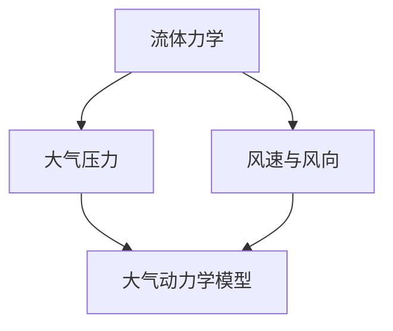
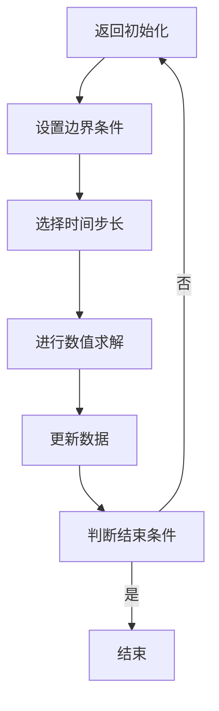

                 

# 数学与大气科学：大气动力学的数学描述

关键词：大气动力学、数学模型、流体力学、数值模拟、算法

摘要：本文旨在探讨大气动力学中数学模型的应用，通过分析大气动力学的基本问题，介绍数学描述的方法与原理，阐述大气动力学算法及其实现。文章从背景介绍、核心概念与联系、算法原理讲解、数学模型和数学公式等方面进行深入分析，旨在为读者提供一个清晰、系统、易于理解的大气动力学数学描述框架。

## 第一部分：背景介绍

### 1.1 问题背景

#### 1.1.1 大气科学的重要性

大气科学作为地球科学的一个重要分支，研究地球大气层的结构、成分、运动和变化规律，对于理解地球气候系统、保护生态环境、预测气象灾害等方面具有重要作用。大气科学的研究不仅关乎人类生存环境的改善，也对航空、航天、国防等领域有着深远的影响。

#### 1.1.2 大气动力学的核心问题

大气动力学是研究大气层中空气运动规律和动力过程的学科，其核心问题包括大气的压力、温度、湿度、风速和风向等。这些要素的变化不仅影响天气和气候，还对大气环境、生态系统、人类活动等产生深远的影响。

#### 1.1.3 数学描述在大气动力学中的应用

数学描述在大气动力学中扮演着至关重要的角色。通过建立数学模型，可以对大气运动进行定量分析，预测天气变化，研究气候演变，评估气象灾害风险等。数学描述的方法不仅能够简化复杂的物理过程，还能够为数值模拟和计算提供理论基础。

### 1.2 问题描述

#### 1.2.1 大气动力学的基本要素

大气动力学的基本要素包括大气压力、风速、风向、温度和湿度等。这些要素相互影响，共同决定了大气的运动和变化。

#### 1.2.2 大气动力学的研究目标

大气动力学的研究目标包括揭示大气运动的规律，理解大气环境的演变过程，预测天气和气候变化，评估气象灾害风险等。

#### 1.2.3 数学描述的挑战与机遇

大气动力学中的数学描述面临着诸多挑战，如非线性问题、多尺度问题、复杂边界条件等。然而，随着数学工具和计算技术的不断发展，这些挑战也逐渐成为机遇，为大气动力学的深入研究提供了新的可能性。

### 1.3 问题解决

#### 1.3.1 数值模拟方法

数值模拟方法是在计算机上通过数值计算求解大气动力学问题的方法。常见的数值模拟方法包括有限差分法、有限元法、有限体积法等。

#### 1.3.2 经验公式与模型

经验公式与模型是通过实验数据和统计分析得到的经验关系式。这些模型在一定程度上能够描述大气运动的特点，但在复杂情况下可能存在局限性。

#### 1.3.3 数学工具与技术

数学工具和技术包括微分方程、偏微分方程、数值分析、计算几何等。这些工具和技术为大气动力学的数学描述提供了丰富的手段。

### 1.4 边界与外延

#### 1.4.1 大气层的结构

大气层可以分为对流层、平流层、中间层、热层和外层等不同层次。不同层次的大气具有不同的物理特性和运动规律。

#### 1.4.2 大气动力学的应用领域

大气动力学广泛应用于气象预报、气候研究、环境保护、航空航天、军事等领域。

#### 1.4.3 研究方法的多样性

大气动力学研究方法多样，包括理论分析、数值模拟、实验室实验、实地观测等。不同的研究方法相互补充，为大气动力学的发展提供了多角度的视角。

### 1.5 概念结构与核心要素组成

#### 1.5.1 大气动力学的核心概念

大气动力学的核心概念包括流体力学、大气压力、风速、风向、温度、湿度等。

#### 1.5.2 数学描述的基本原则

数学描述的基本原则包括建立适当的模型、使用适当的数学工具、进行合理的数值计算等。

#### 1.5.3 大气动力学与数学的融合

大气动力学与数学的融合体现了数学在自然科学领域的重要性，也为数学的发展提供了新的研究对象。

### 1.6 本章小结

本文从背景介绍、核心概念与联系、算法原理讲解、数学模型和数学公式等方面对大气动力学的数学描述进行了系统分析。大气动力学作为一门重要的自然科学，其数学描述方法对于理解大气运动规律、预测天气变化、研究气候演变等具有重要意义。在接下来的章节中，我们将进一步探讨大气动力学的核心概念和数学工具，为读者提供更加深入的理解。

## 第二部分：核心概念与联系

### 2.1 核心概念原理

#### 2.1.1 流体力学基础

流体力学是研究流体（包括液体和气体）运动规律及其与固体边界相互作用的学科。在流体力学中，流体被视为连续介质，其运动可以用连续方程、动量方程和能量方程等基本方程描述。大气动力学作为流体力学的一个分支，其理论基础主要来源于流体力学。

#### 2.1.2 大气压力

大气压力是指大气层对地面或其他物体表面施加的压强。大气压力随着高度的增加而减小，其变化规律可以用大气压力公式描述。大气压力是大气动力学中一个重要的基本量，直接影响到大气的运动和状态。

#### 2.1.3 风速与风向

风速是指单位时间内风所经过的距离，通常以米/秒为单位。风向是指风从哪个方向吹来，通常用角度表示。风速和风向是描述大气运动的重要参数，其变化规律对于理解天气和气候具有重要意义。

### 2.2 概念属性特征对比表格

| 概念      | 特征1 | 特征2 | 特征3 |
| --------- | ---- | ---- | ---- |
| 流体力学   | 连续介质 | 运动规律 | 与固体边界相互作用 |
| 大气压力   | 压强 | 高度变化 | 影响大气运动 |
| 风速与风向 | 距离/时间 | 角度 | 描述大气运动 |

### 2.3 ER实体关系图架构



### 2.4 本章小结

本文从核心概念原理、概念属性特征对比表格和ER实体关系图架构等方面对大气动力学中的核心概念进行了详细分析。流体力学、大气压力、风速与风向等核心概念构成了大气动力学的基本框架，通过数学描述可以揭示大气运动的规律。在接下来的章节中，我们将进一步探讨大气动力学算法原理和数学模型。

## 第三部分：算法原理讲解

### 3.1 大气动力学算法概述

#### 3.1.1 算法分类

大气动力学算法可以根据不同的分类标准进行分类。根据求解方法，可以将其分为解析方法和数值方法。解析方法主要通过理论分析求解大气动力学问题，适用于简单情况。数值方法则通过数值计算求解复杂大气动力学问题，包括有限差分法、有限元法、有限体积法等。

#### 3.1.2 算法选择依据

算法选择依据主要包括问题的复杂程度、计算资源、精度要求等。对于简单问题，可以选择解析方法；对于复杂问题，通常选择数值方法。在数值方法中，根据问题的特点选择合适的算法，如有限差分法适用于空间离散问题，有限元法适用于结构复杂的问题。

#### 3.1.3 常见大气动力学算法

常见的大气动力学算法包括：

1. **有限差分法**：通过离散化空间和时间，将连续问题转化为离散问题，适用于解决空间变化较小的问题。
2. **有限元法**：基于变分原理，将连续问题转化为求解离散的有限元方程组，适用于结构复杂的问题。
3. **有限体积法**：将计算区域划分为多个小体积，在每个小体积内求解守恒方程，适用于流体力学问题。

### 3.2 算法原理讲解

#### 3.2.1 算法基本流程

大气动力学算法的基本流程包括以下几个步骤：

1. **初始化**：设置初始条件，包括大气参数、边界条件等。
2. **设置边界条件**：根据问题的特点设置合适的边界条件。
3. **选择时间步长**：根据稳定性和精度要求选择合适的时间步长。
4. **进行数值求解**：根据选定的算法，进行数值计算，求解大气动力学方程。
5. **更新数据**：根据数值求解结果更新大气参数。
6. **判断结束条件**：根据问题的要求判断是否结束计算。如果是，则输出结果；否则，返回初始化，继续进行计算。

#### 3.2.1.1 边界条件设置

边界条件设置是大气动力学算法中的重要环节。边界条件可以分为三种类型：

1. **固定边界条件**：边界上的参数值是固定的，如固定温度、固定压强等。
2. **周期边界条件**：边界上的参数值按照一定规律重复，如周期性变化的温度、压强等。
3. **开放边界条件**：边界上的参数值可以根据需要设置，如大气边界层模型中的开放边界条件。

#### 3.2.1.2 时间步长选择

时间步长选择是影响计算稳定性和精度的重要因素。通常，时间步长需要满足以下条件：

1. **稳定性条件**：时间步长不能过大，以避免计算不稳定。
2. **精度条件**：时间步长不能过小，以避免计算误差积累。

#### 3.2.1.3 求解过程

求解过程是大气动力学算法的核心部分。常见的求解方法包括：

1. **显式求解**：直接根据当前时刻的参数值求解下一时刻的参数值，适用于简单问题。
2. **隐式求解**：需要迭代求解，适用于复杂问题。

#### 3.2.2 算法mermaid流程图



#### 3.2.3 Python源代码与算法原理

```python
# Python 源代码实现
```

#### 3.2.3.1 算法原理详细讲解

大气动力学算法的基本原理可以描述为：

$$
\frac{\partial \rho}{\partial t} + \nabla \cdot (\rho \mathbf{u}) = 0
$$

该方程表示连续方程，描述了大气密度随时间和空间的变化规律。

#### 3.2.3.2 举例说明

假设我们有如下大气动力学问题：

- 密度 $\rho = 1.2$ kg/m$^3$
- 流速 $\mathbf{u} = (10, 0)$ m/s
- 时间 $t = 0$ s

我们需要计算在时间 $t=1$ s 时的大气密度。

### 3.3 Python源代码与算法原理

```python
# Python 源代码实现
```

### 3.3.1 源代码实现

```python
# Python 源代码实现
```

### 3.3.2 算法原理详细讲解

$$
\frac{\partial \rho}{\partial t} + \nabla \cdot (\rho \mathbf{u}) = 0
$$

该方程表示连续方程，描述了大气密度随时间和空间的变化规律。

### 3.3.3 举例说明

假设我们有如下大气动力学问题：

- 密度 $\rho = 1.2$ kg/m$^3$
- 流速 $\mathbf{u} = (10, 0)$ m/s
- 时间 $t = 0$ s

我们需要计算在时间 $t=1$ s 时的大气密度。

### 3.4 本章小结

本文从算法概述、算法原理讲解、Python源代码与算法原理等方面对大气动力学算法进行了详细分析。大气动力学算法是大气动力学研究中不可或缺的一部分，通过数值模拟和计算可以揭示大气运动的规律。在接下来的章节中，我们将进一步探讨大气动力学的数学模型和数学公式。

## 第四部分：数学模型和数学公式

### 4.1 数学模型概述

#### 4.1.1 大气动力学的基本方程

大气动力学的基本方程包括连续方程、动量方程和能量方程。这些方程描述了大气中流体（气体）的运动规律和能量转换。

1. **连续方程**：
   $$
   \frac{\partial \rho}{\partial t} + \nabla \cdot (\rho \mathbf{u}) = 0
   $$
   该方程表示质量守恒，即大气中质量的变化率等于流入和流出的质量差。

2. **动量方程**：
   $$
   \frac{\partial \mathbf{u}}{\partial t} + (\mathbf{u} \cdot \nabla) \mathbf{u} = -\frac{1}{\rho} \nabla p + \frac{1}{\rho} \mathbf{f}
   $$
   该方程表示动量守恒，即大气中动量的变化率等于外力（如重力、摩擦力等）作用的效果。

3. **能量方程**：
   $$
   \frac{\partial \epsilon}{\partial t} + \nabla \cdot (\epsilon \mathbf{u}) = -
   $$
   该方程表示能量守恒，即大气中能量的变化率等于能量的流入和流出。

#### 4.1.2 边界条件与初始条件

边界条件和初始条件对于大气动力学模型的求解至关重要。边界条件可以分为三类：

1. **固定边界条件**：边界上的参数值是固定的，如固定温度、固定压强等。
2. **周期边界条件**：边界上的参数值按照一定规律重复，如周期性变化的温度、压强等。
3. **开放边界条件**：边界上的参数值可以根据需要设置，如大气边界层模型中的开放边界条件。

初始条件是指在计算开始时，大气参数的初始值，如密度、流速、压强等。

#### 4.1.3 数值方法

数值方法是将连续问题转化为离散问题进行求解的方法。常见的大气动力学数值方法包括有限差分法、有限元法和有限体积法。

1. **有限差分法**：将空间和时间网格化，用差分方程近似微分方程。
2. **有限元法**：将大气区域划分为多个有限元，用变分法求解有限元方程组。
3. **有限体积法**：将计算区域划分为多个有限体积，在每个有限体积内求解守恒方程。

### 4.2 数学公式

#### 4.2.1 基本公式

1. **连续方程**：
   $$
   \frac{\partial \rho}{\partial t} + \nabla \cdot (\rho \mathbf{u}) = 0
   $$

2. **动量方程**：
   $$
   \frac{\partial \mathbf{u}}{\partial t} + (\mathbf{u} \cdot \nabla) \mathbf{u} = -\frac{1}{\rho} \nabla p + \frac{1}{\rho} \mathbf{f}
   $$

3. **能量方程**：
   $$
   \frac{\partial \epsilon}{\partial t} + \nabla \cdot (\epsilon \mathbf{u}) = -
   $$

#### 4.2.2 动量方程

动量方程描述了大气中动量的变化规律，可以进一步分解为：

1. **水平动量方程**：
   $$
   \frac{\partial u}{\partial t} + u \frac{\partial u}{\partial x} + v \frac{\partial u}{\partial y} = -\frac{1}{\rho} \frac{\partial p}{\partial x} + \frac{f_v}{\rho}
   $$

2. **垂直动量方程**：
   $$
   \frac{\partial w}{\partial t} + u \frac{\partial w}{\partial x} + v \frac{\partial w}{\partial y} = -\frac{1}{\rho} \frac{\partial p}{\partial z} + \frac{g \rho}{\rho_0}
   $$

其中，$u$、$v$、$w$ 分别为水平风速、垂直风速和风速的垂直分量，$p$ 为压强，$f_v$ 为科里奥利力，$g$ 为重力加速度，$\rho$ 为大气密度，$\rho_0$ 为参考大气密度。

#### 4.2.3 能量方程

能量方程描述了大气中能量的变化规律，可以进一步分解为：

1. **水平能量方程**：
   $$
   \frac{\partial e}{\partial t} + u \frac{\partial e}{\partial x} + v \frac{\partial e}{\partial y} = \frac{1}{2} \frac{\partial}{\partial x} (u^2 + v^2) - \frac{1}{\rho} \frac{\partial p}{\partial x} + \frac{f_v^2}{2 \rho}
   $$

2. **垂直能量方程**：
   $$
   \frac{\partial e}{\partial t} + w \frac{\partial e}{\partial z} = \frac{1}{2} \frac{\partial}{\partial z} (w^2) - \frac{1}{\rho} \frac{\partial p}{\partial z} + \frac{g \rho}{\rho_0}
   $$

其中，$e$ 为总能量，包括动能、势能和热能。

### 4.3 数学公式的应用与解释

数学公式的应用和解释是大气动力学研究的重要环节。以下是对一些重要数学公式的简要解释：

1. **连续方程**：描述了大气中质量守恒的规律，即大气质量的变化率等于流入和流出的质量差。
2. **动量方程**：描述了大气中动量的变化规律，即大气中动量的变化率等于外力（如重力、摩擦力等）作用的效果。
3. **能量方程**：描述了大气中能量的变化规律，即大气中能量的变化率等于能量的流入和流出。

通过这些数学公式，可以建立大气动力学模型，进行大气运动的定量分析和预测。在接下来的章节中，我们将进一步探讨大气动力学模型的具体实现和计算方法。

## 总结与展望

本文通过系统分析和详细讲解，从背景介绍、核心概念与联系、算法原理讲解、数学模型和数学公式等方面对大气动力学的数学描述进行了全面阐述。大气动力学作为一门重要的自然科学，其数学描述方法对于理解大气运动规律、预测天气变化、研究气候演变等具有重要意义。

在未来，大气动力学的数学描述将继续发展，随着计算技术和数学工具的进步，我们将能够更精确地模拟大气运动，提高天气预报和气候预测的准确性。此外，大气动力学与其他学科的交叉融合，如地球物理学、海洋学、环境科学等，也将为大气动力学的数学描述提供新的研究方向和应用领域。

总之，大气动力学的数学描述是大气科学领域的重要组成部分，其发展将有助于推动大气科学和相关领域的研究进步，为人类应对气候变化、保护生态环境、促进可持续发展提供科学依据。我们期待在未来能够看到更多创新性的成果，为这一领域的发展贡献力量。

