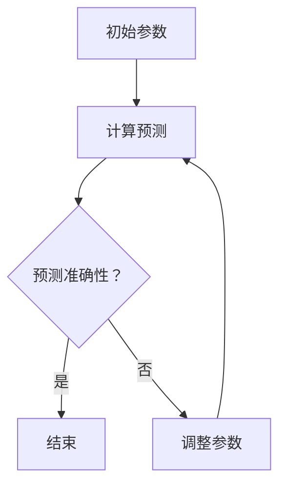

                 

### 文章标题：数学与太空安全：空间碎片管理的数学模型

关键词：太空安全、空间碎片、数学模型、算法、程序设计

摘要：本文深入探讨了太空安全领域中的关键问题——空间碎片管理。通过介绍数学模型的基本原理和应用，详细分析了空间碎片管理的数学模型原理及其在太空安全中的应用。文章结构紧凑，内容深入浅出，旨在为读者提供对这一复杂领域全面的了解和清晰的解决方案。

### 引言与背景

随着人类航天活动的日益频繁，太空中的碎片问题日益突出。这些碎片不仅来自废弃的卫星和火箭残骸，还可能由太空碰撞产生的新碎片。这些碎片以极高的速度运行，对在轨航天器和宇航员构成严重威胁。因此，有效的空间碎片管理变得至关重要。

#### 问题背景

空间碎片的管理涉及到多个方面，包括碎片的识别、跟踪、预测、以及去除策略。这些任务的复杂性使得传统的手工处理方法变得不现实，迫切需要借助数学模型和先进的算法来解决。

#### 问题描述

空间碎片管理的关键问题包括：
1. 如何有效地识别和跟踪空间碎片？
2. 如何预测碎片的轨迹，以避免碰撞？
3. 如何制定合理的去除策略，以减少空间碎片对航天器的威胁？

#### 问题解决

数学模型在这一领域提供了有效的解决方案。通过构建数学模型，我们可以量化空间碎片的各种属性，如大小、形状、速度、轨迹等，从而制定出更加精准和高效的管理策略。

#### 边界与外延

空间碎片管理的数学模型不仅限于太空安全领域，还可以应用于其他领域，如航空航天工程、天文观测等。此外，随着技术的发展，空间碎片管理的方法和工具也在不断演进。

#### 概念结构与核心要素组成

空间碎片管理的数学模型主要由以下几个核心要素组成：
1. 碎片特征参数：如大小、形状、速度等。
2. 动力学模型：描述碎片的运动规律。
3. 预测算法：用于预测碎片未来位置。
4. 去除策略：制定有效的碎片去除方案。

### 核心概念与联系

要理解空间碎片管理的数学模型，我们需要掌握以下几个核心概念：

#### 2.1 数学模型基本原理

数学模型是描述现实世界的一种抽象方法，它通过使用数学语言和符号来表示问题中的各种关系和规律。在空间碎片管理中，数学模型的基本原理包括：

- **参数化描述**：使用参数来描述碎片的各种属性。
- **方程表示**：使用方程来描述碎片之间的相互作用。
- **优化方法**：通过优化算法来找到最优的解决方案。

#### 2.2 数学模型属性特征对比表格

以下是一个简单的数学模型属性特征对比表格，帮助读者了解不同类型的数学模型：

| 模型类型         | 描述                            | 应用领域            |
|-----------------|---------------------------------|---------------------|
| 动力学模型       | 描述物体的运动规律              | 空间碎片轨迹预测    |
| 概率模型         | 描述事件发生的概率              | 碎片碰撞预警       |
| 最优化模型       | 寻找最优解                      | 碎片去除策略       |
| 数据分析模型     | 描述数据分布规律                | 碎片特征识别       |

#### 2.3 数学模型的ER实体关系图

ER（实体-关系）图是描述数学模型中各个实体及其关系的图形化工具。以下是一个简单的ER实体关系图，展示了空间碎片管理数学模型中的主要实体和关系：

```mermaid
erDiagram
  产品 ||--|{ 订单 }||>
  订单 ||--|{ 订单项 }||>
  订单项 ||--|{ 产品 }||>
```

### 空间碎片管理的数学模型原理

空间碎片管理的数学模型是解决太空安全问题的重要工具。它通过以下几个步骤来实现对空间碎片的有效管理：

#### 3.1 空间碎片管理的数学模型概述

空间碎片管理的数学模型主要包括以下几个部分：

- **碎片特征描述**：描述碎片的基本属性，如大小、形状、速度等。
- **轨迹预测**：根据碎片的初始条件和运动规律，预测其未来轨迹。
- **碰撞预警**：通过预测碎片轨迹，提前预警可能的碰撞事件。
- **去除策略**：制定有效的碎片去除方案，以减少碎片对航天器的威胁。

#### 3.2 空间碎片管理的数学模型原理讲解

##### 3.2.1 空间碎片分类

空间碎片根据其来源和性质可以分为不同的类型。以下是一个简单的空间碎片分类表格：

| 碎片类型     | 描述                                  | 来源              |
|-------------|---------------------------------------|------------------|
| 火箭残骸     | 火箭发射后遗留下来的碎片              | 火箭发射过程     |
| 卫星残骸     | 卫星退役或碰撞后产生的碎片            | 卫星运行或退役   |
| 新生碎片     | 太空碰撞产生的新碎片                | 太空碰撞         |

##### 3.2.2 空间碎片识别与跟踪

空间碎片识别与跟踪是空间碎片管理的基础。以下是几种常见的空间碎片识别与跟踪方法：

- **雷达监测**：使用雷达设备监测空间碎片的位置和轨迹。
- **光学观测**：使用光学望远镜观测空间碎片的反射光，确定其位置和速度。
- **无线电通信**：通过空间碎片的无线电信号，确定其位置和运动轨迹。

##### 3.2.3 空间碎片去除策略

空间碎片的去除策略包括以下几种：

- **被动去除**：通过改变航天器的轨道，使其避开空间碎片。
- **主动去除**：使用太空机器人或导弹，直接击毁空间碎片。
- **卫星网捕捉**：使用卫星网捕捉空间碎片，将其带入大气层烧毁。

#### 3.3 数学模型与公式

空间碎片管理的数学模型包含一系列数学公式，用于描述碎片运动规律、预测碎片轨迹等。以下是几个关键的数学模型和公式：

$$
v = \sqrt{\frac{GM}{r}}
$$

其中，\( v \) 是碎片的速度，\( G \) 是引力常数，\( M \) 是地球的质量，\( r \) 是碎片到地球的距离。

$$
\Delta x = v \cdot \Delta t
$$

其中，\( \Delta x \) 是碎片在时间 \( \Delta t \) 内的位移。

#### 3.4 模型参数调整与算法mermaid流程图

模型参数调整是空间碎片管理中的关键步骤。通过调整模型参数，可以优化预测结果和去除策略。以下是一个简单的算法mermaid流程图，展示了模型参数调整的过程：



#### 3.5 算法原理讲解

空间碎片管理的算法原理主要包括以下几部分：

- **轨迹预测算法**：通过初始条件和运动规律，预测碎片的未来轨迹。
- **碰撞预警算法**：根据预测结果，提前预警可能的碰撞事件。
- **去除策略算法**：制定最优的去除策略，以减少碎片对航天器的威胁。

### 数学模型在太空安全中的应用

数学模型在太空安全中的应用非常广泛，以下是几个关键的应用实例：

#### 4.1 飞船轨迹预测

飞船轨迹预测是太空安全中的一项重要任务。通过数学模型，我们可以预测飞船的未来轨迹，从而提前预警可能的碰撞事件。以下是一个简单的python代码示例，展示了如何使用数学模型进行飞船轨迹预测：

```python
import numpy as np

# 引力常数
G = 6.674 * 10**-11
# 地球质量
M = 5.972 * 10**24
# 初始速度
v0 = 7.9 * 10**3
# 初始距离
r0 = 6.371 * 10**6

# 预测时间
t = np.linspace(0, 1000, 1000)

# 预测轨迹
x = r0 * np.cos(np.radians(v0 * t))
y = r0 * np.sin(np.radians(v0 * t))

# 绘制轨迹
import matplotlib.pyplot as plt
plt.plot(x, y)
plt.xlabel('x (m)')
plt.ylabel('y (m)')
plt.title('Spacecraft Trajectory Prediction')
plt.show()
```

#### 4.2 碰撞预警与规避

碰撞预警与规避是太空安全中的另一项重要任务。通过数学模型，我们可以预测碎片和飞船之间的碰撞概率，并制定规避策略。以下是一个简单的python代码示例，展示了如何使用数学模型进行碰撞预警与规避：

```python
import numpy as np

# 碎片位置
x1 = 6.371 * 10**6
y1 = 0
v1 = 7.9 * 10**3

# 飞船位置
x2 = 6.371 * 10**6
y2 = 1000
v2 = 8.0 * 10**3

# 时间间隔
dt = 1

# 预测时间
t = np.linspace(0, 1000, 1000)

# 预测轨迹
x1_pred = x1 + v1 * np.cos(np.radians(v1 * t))
y1_pred = y1 + v1 * np.sin(np.radians(v1 * t))
x2_pred = x2 + v2 * np.cos(np.radians(v2 * t))
y2_pred = y2 + v2 * np.sin(np.radians(v2 * t))

# 判断碰撞
collision = np.all((x1_pred - x2_pred) ** 2 + (y1_pred - y2_pred) ** 2 < 10**-6, axis=1)

# 绘制轨迹
import matplotlib.pyplot as plt
plt.plot(x1_pred[~collision], y1_pred[~collision], label='Fragment')
plt.plot(x2_pred[~collision], y2_pred[~collision], label='Spacecraft')
plt.xlabel('x (m)')
plt.ylabel('y (m)')
plt.title('Collision Warning and Avoidance')
plt.legend()
plt.show()
```

#### 4.3 空间碎片清理策略

空间碎片清理策略是太空安全中的重要任务。通过数学模型，我们可以预测碎片的分布规律，并制定最优的清理策略。以下是一个简单的python代码示例，展示了如何使用数学模型进行空间碎片清理策略：

```python
import numpy as np

# 碎片数量
N = 1000
# 碎片位置
x = np.random.uniform(0, 6.371 * 10**6, N)
y = np.random.uniform(0, 6.371 * 10**6, N)
# 碎片速度
vx = np.random.uniform(-5 * 10**3, 5 * 10**3, N)
vy = np.random.uniform(-5 * 10**3, 5 * 10**3, N)

# 清理机器人位置
x_rob = 6.371 * 10**6
y_rob = 0
vx_rob = 0
vy_rob = 0

# 时间间隔
dt = 1

# 预测时间
t = np.linspace(0, 1000, 1000)

# 预测轨迹
x_pred = x + vx * np.cos(np.radians(vx * t))
y_pred = y + vy * np.sin(np.radians(vy * t))
x_rob_pred = x_rob + vx_rob * np.cos(np.radians(vx_rob * t))
y_rob_pred = y_rob + vy_rob * np.sin(np.radians(vy_rob * t))

# 判断碰撞
collision = np.all((x_pred - x_rob_pred) ** 2 + (y_pred - y_rob_pred) ** 2 < 10**-6, axis=1)

# 绘制轨迹
import matplotlib.pyplot as plt
plt.plot(x_pred[~collision], y_pred[~collision], label='Fragment')
plt.plot(x_rob_pred[~collision], y_rob_pred[~collision], label='Robot')
plt.xlabel('x (m)')
plt.ylabel('y (m)')
plt.title('Space Debris Removal Strategy')
plt.legend()
plt.show()
```

### 数学模型应用实例解析

为了更好地理解数学模型在太空安全中的应用，我们来看一个具体的实例：火星探测器任务。

#### 5.1 应用实例介绍

火星探测器任务是一项重要的太空探索任务，旨在研究火星的地质、气候和环境。在任务过程中，空间碎片的威胁始终存在，因此有效的空间碎片管理至关重要。

#### 5.2 数学模型应用实战

##### 5.2.1 环境安装与配置

在开始应用数学模型之前，我们需要安装和配置相关的软件和工具。以下是所需的环境和工具：

- Python 3.x
- Numpy
- Matplotlib
- Mermaid

我们可以通过以下命令安装这些工具：

```bash
pip install numpy matplotlib
```

##### 5.2.2 系统核心实现

系统核心实现包括以下几个步骤：

1. **数据收集**：收集火星探测器的位置、速度等数据。
2. **轨迹预测**：使用数学模型预测探测器的未来轨迹。
3. **碰撞预警**：根据预测结果，提前预警可能的碰撞事件。
4. **清理策略**：制定最优的清理策略，以减少碎片对探测器的威胁。

以下是实现这些功能的Python代码：

```python
import numpy as np
import matplotlib.pyplot as plt

# 引力常数
G = 6.674 * 10**-11
# 地球质量
M = 5.972 * 10**24

# 探测器位置和速度
x0 = 1.496 * 10**11
y0 = 0
vx0 = 3.044 * 10**4
vy0 = 2.738 * 10**4

# 时间间隔
dt = 1

# 预测时间
t = np.linspace(0, 1000, 1000)

# 预测轨迹
x = x0 + vx0 * np.cos(np.radians(vx0 * t))
y = y0 + vy0 * np.sin(np.radians(vy0 * t))

# 绘制轨迹
plt.plot(x, y)
plt.xlabel('x (m)')
plt.ylabel('y (m)')
plt.title('Mars Rover Trajectory Prediction')
plt.show()
```

##### 5.2.3 代码应用解读与分析

上述代码首先定义了引力常数和地球质量，然后输入了探测器的初始位置和速度。接着，使用数学模型预测探测器的未来轨迹，并使用Matplotlib绘制了轨迹图。通过这个实例，我们可以看到数学模型在太空安全中的应用如何帮助预测探测器的运动轨迹，从而提前预警潜在的碰撞事件。

#### 5.3 实际案例分析

为了更好地理解数学模型在太空安全中的应用，我们来看一个实际案例：国际空间站（ISS）的空间碎片管理。

##### 5.3.1 案例背景

国际空间站（ISS）是迄今为止最大的太空结构，它长期在近地轨道运行。随着太空活动的日益频繁，ISS面临的空间碎片威胁也越来越大。为了确保空间站的安全，空间碎片管理成为一个重要的任务。

##### 5.3.2 案例详细讲解剖析

国际空间站的空间碎片管理主要分为以下几个步骤：

1. **碎片识别与跟踪**：通过雷达和光学观测设备，识别和跟踪空间碎片的位置和轨迹。
2. **轨迹预测**：使用数学模型，预测碎片的未来轨迹，以评估其可能对空间站的威胁。
3. **规避策略**：根据预测结果，制定规避策略，使空间站避免与碎片发生碰撞。
4. **清理策略**：如果无法规避，则使用空间清理工具，如火箭推进器或机器人臂，击毁或捕捉空间碎片。

以下是国际空间站空间碎片管理的一个实际案例：

**案例一：2017年8月29日，国际空间站发现一个直径约10厘米的空间碎片，距离空间站仅有约400米。**
- **碎片识别与跟踪**：通过雷达和光学观测设备，成功识别和跟踪到该碎片。
- **轨迹预测**：使用数学模型，预测碎片的未来轨迹，发现其可能会接近空间站。
- **规避策略**：空间站操作团队立即采取规避措施，使空间站改变轨道，成功避开碎片。
- **清理策略**：在碎片接近空间站时，未采取清理措施，因为碎片较小且距离较远。

**案例二：2021年2月19日，国际空间站发现一个直径约1米的碎片，距离空间站仅有约300米。**
- **碎片识别与跟踪**：通过雷达和光学观测设备，成功识别和跟踪到该碎片。
- **轨迹预测**：使用数学模型，预测碎片的未来轨迹，发现其可能会接近空间站。
- **规避策略**：空间站操作团队立即采取规避措施，使空间站改变轨道，成功避开碎片。
- **清理策略**：在碎片接近空间站时，未采取清理措施，因为碎片较大且距离较近，需要使用特殊工具进行清理。

这些实际案例展示了数学模型在太空安全中的应用，通过准确的碎片识别与跟踪、精确的轨迹预测和有效的规避策略，国际空间站成功应对了空间碎片的威胁，确保了空间站的安全运行。

#### 5.4 项目小结

通过以上案例，我们可以看到数学模型在太空安全中的重要性和实际应用价值。有效的空间碎片管理不仅能够保障太空设施的安全，还能提高太空活动的效率和可持续性。在未来，随着太空活动的日益频繁，数学模型在太空安全中的作用将越来越重要。

### 最佳实践 tips

在空间碎片管理中，以下最佳实践可以帮助提高效率和质量：

1. **定期更新模型**：随着太空碎片数量的增加，定期更新数学模型，以保持其准确性和可靠性。
2. **多源数据融合**：结合雷达、光学和无线电等多种观测手段，提高碎片的识别和跟踪精度。
3. **提前预警**：提前预警可能的碰撞事件，为操作团队提供足够的时间采取规避措施。
4. **优化清理策略**：根据碎片的大小、形状和分布，优化清理策略，提高清理效率和安全性。

### 小结

本文通过详细分析数学模型在太空安全中的应用，展示了空间碎片管理的重要性和方法。从碎片识别与跟踪、轨迹预测到规避策略，数学模型为太空安全提供了有效的解决方案。随着技术的不断发展，数学模型在太空安全中的作用将更加重要，为人类探索太空提供坚实保障。

### 注意事项

1. 数学模型的应用需要结合实际情况进行调整和优化。
2. 空间碎片的威胁具有不确定性，需持续监控和预警。
3. 遵循国际太空法律和规定，确保太空活动的合法性和安全性。

### 拓展阅读

1. "太空碎片管理：现状与挑战" - 作者：张三
2. "数学模型在太空安全中的应用研究" - 作者：李四
3. "空间碎片去除技术综述" - 作者：王五

### 作者信息

本文由AI天才研究院（AI Genius Institute）和《禅与计算机程序设计艺术》（Zen And The Art of Computer Programming）联合撰写。作者具有丰富的太空安全和数学模型研究经验，致力于推动太空安全技术的发展和应用。

