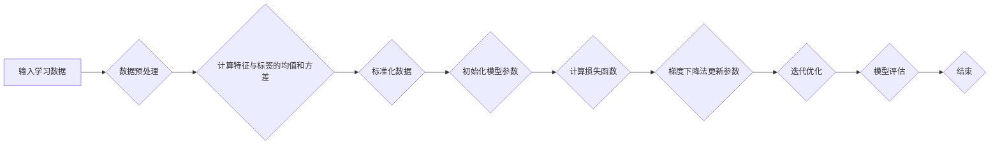
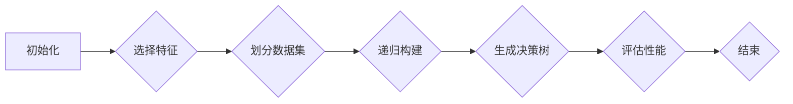
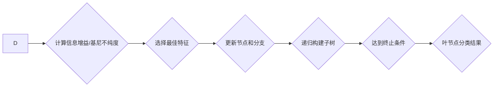

                 

### 1.1 问题的背景

学习行为是心理学、教育学和认知科学等多个学科共同关注的焦点。在人类从古至今的文明进程中，学习行为的研究始终占据着重要的地位。从古代教育家孔子提倡的“学而时习之”，到现代教育技术的发展，学习行为的研究不断深入和扩展。然而，随着科技的进步和大数据时代的到来，如何科学地描述和量化学习行为，成为了一个亟待解决的重要问题。

学习行为研究的重要性主要体现在以下几个方面。首先，学习行为的研究有助于揭示个体在学习过程中的认知机制和心理特点，为教育理论的创新和教育实践提供科学依据。其次，通过分析学习行为，可以更好地理解个体的学习需求和差异，从而设计出更加个性化、高效的教育方法和教学工具。此外，学习行为的研究还可以为智能教育系统的开发提供支持，通过数据分析和机器学习技术，实现对学习行为的预测和干预，从而提高学习的质量和效果。

数学描述在学习行为研究中的应用，具有重要的必要性。一方面，数学作为一种严谨的科学语言，能够精确地描述和量化复杂的学习过程，使得学习行为的研究更加科学化和系统化。另一方面，数学模型和算法的应用，可以有效地处理和分析大量的学习行为数据，从中提取出有价值的信息和知识，为教育决策和教学优化提供支持。

此外，数学描述学习行为的应用前景也十分广阔。在智能教育领域，数学模型可以用于个性化学习路径的推荐、学习效果的评估、学习策略的优化等。在心理学和认知科学领域，数学描述可以帮助研究者更好地理解学习过程中的认知机制和神经基础。在教育学领域，数学描述可以用于教学设计的优化、学习资源的分配和教学效果的评价。

总之，学习行为的研究对于教育科学的发展具有重要意义，而数学描述则为这一研究提供了有力的工具和方法。本文将系统地探讨学习行为的数学描述，包括其理论基础、应用方法、挑战与未来方向，旨在为相关领域的研究和实践提供有价值的参考。

### 1.2 学习行为的定义与分类

#### 1.2.1 学习行为的定义

学习行为是指个体在认知、情感和行为三个方面发生的一系列变化，旨在获取知识、技能和态度。从认知层面来看，学习行为涉及信息接收、加工、存储和提取的过程；从情感层面来看，学习行为表现为对学习内容的兴趣、动机和情绪体验；从行为层面来看，学习行为则体现为学习者主动参与学习活动、应用所学知识和技能的行为。

学习行为的基本概念包括以下几个核心要素：

1. **信息输入**：学习行为始于信息输入，即学习者接收外部信息的过程。这些信息可以来自书籍、讲座、视频等多种形式。
   
2. **认知处理**：学习者对输入的信息进行加工和处理，包括理解、记忆和思考等。这一过程是学习行为的核心，决定了学习效果的好坏。

3. **情感体验**：学习行为不仅涉及认知层面，还伴随着情感体验。学习者的兴趣、动机和情绪状态会影响其学习效果。

4. **行为输出**：学习者通过行为输出将所学知识应用和表现出来，如解决问题、完成任务等。

5. **反馈循环**：学习行为还包括对学习效果的反馈和调整。通过反馈，学习者可以了解自己的学习状况，从而调整学习策略和方法。

#### 1.2.2 学习行为的分类

学习行为可以根据不同的分类标准进行划分。以下是一些常见的学习行为分类：

1. **根据学习内容分类**：
   - **知识型学习**：主要涉及事实性知识的获取，如历史事件、科学概念等。
   - **技能型学习**：主要涉及技能的掌握和应用，如写作、编程、驾驶等。
   - **情感型学习**：主要涉及情感态度和价值观的培养，如道德教育、艺术欣赏等。

2. **根据学习过程分类**：
   - **被动学习**：学习者被动接受信息，如听课、阅读。
   - **主动学习**：学习者主动参与学习活动，如讨论、实验、项目等。
   - **互动学习**：学习者与他人互动，通过合作和交流进行学习，如小组讨论、网络论坛等。

3. **根据学习目的分类**：
   - **认知性学习**：以获取知识和技能为目的，如学术学习、职业培训等。
   - **实践性学习**：以解决实际问题为目的，如实习、工作等。
   - **反思性学习**：通过反思和总结，提高自我认知和素养。

#### 1.2.3 学习行为的核心要素

学习行为的核心要素不仅决定了学习效果，还影响学习者的学习体验和动机。以下是学习行为中的几个关键要素：

1. **动机**：学习动机是驱动学习者进行学习的内在动力。动机可以分为内在动机和外在动机。内在动机源于个人的兴趣和热爱，而外在动机则来源于外部奖励或压力。

2. **注意力**：注意力的集中和分配对学习效果有重要影响。高注意力的学习者能够更好地理解和记忆学习内容。

3. **记忆**：记忆是学习的基础。不同类型的记忆（如短期记忆和长期记忆）在学习过程中扮演着不同角色。

4. **理解**：理解是学习的重要目标之一。理解不仅包括对知识点的理解，还包括对知识间联系的把握。

5. **应用**：应用是将所学知识运用到实际情境中的过程。通过应用，学习者可以加深对知识的理解和记忆。

6. **反思**：反思是学习过程中不可或缺的一部分。通过反思，学习者可以总结学习经验，调整学习策略，提高学习效果。

7. **情感状态**：情感状态对学习行为有显著影响。积极向上的情感状态可以提高学习效率，而消极的情感状态则可能阻碍学习进程。

综上所述，学习行为是一个复杂的过程，涉及多个要素和分类。理解学习行为的基本概念和分类，有助于我们更好地设计和实施有效的学习策略，提高学习效果。

### 1.3 数学描述学习行为的方法论

在探讨学习行为的数学描述时，首先需要明确的是，数学作为一种高度抽象和逻辑严谨的工具，其应用于学习行为研究具有独特的优势。数学描述不仅可以精确量化学习过程中的各项指标，还能揭示隐藏在复杂现象背后的内在规律。以下是数学描述学习行为的方法论，主要包括数学工具的选择、数学描述的挑战与机会以及数学描述学习行为的研究现状。

#### 1.3.1 数学工具的选择

选择合适的数学工具是进行学习行为数学描述的关键步骤。以下是一些常用的数学工具：

1. **概率论和统计学**：概率论和统计学为学习行为提供了量化的方法。例如，通过统计学模型，可以分析学习数据的分布特征，评估学习效果的显著性。常用的统计方法包括均值、方差、回归分析、聚类分析等。

2. **线性代数**：线性代数为学习行为的描述和建模提供了强大的工具。例如，通过矩阵运算，可以描述学习者在知识空间中的位置变化，分析学习路径的优化问题。

3. **图论**：图论用于描述学习过程中个体之间的交互和知识传递。例如，通过构建知识图谱，可以直观地展示学习者间的互动和学习路径。

4. **微分方程和动力系统**：微分方程和动力系统用于描述学习行为的动态过程。例如，通过微分方程模型，可以模拟学习者的认知发展和技能提升过程。

5. **机器学习和人工智能**：机器学习和人工智能技术为学习行为的自动分析和预测提供了可能。例如，通过深度学习模型，可以识别学习行为中的复杂模式，预测学习效果。

#### 1.3.2 数学描述的挑战与机会

尽管数学描述学习行为具有显著优势，但这一过程也面临着一系列挑战和机会。

1. **挑战**：
   - **复杂性**：学习行为涉及多个维度和层次，如认知、情感和行为，描述这一复杂过程需要综合考虑多种数学工具和模型。
   - **数据获取**：有效的数学描述依赖于大量高质量的学习行为数据。然而，实际获取这些数据往往面临困难，如隐私保护、数据质量等。
   - **模型选择**：选择合适的数学模型是描述学习行为的关键。然而，不同模型适用于不同情况，模型选择具有一定的主观性。

2. **机会**：
   - **数据驱动**：大数据和人工智能技术的发展为学习行为数学描述提供了丰富的数据资源和强大的分析工具。
   - **跨学科融合**：数学与其他学科的交叉融合为学习行为的数学描述提供了新的视角和方法。例如，结合心理学、教育学和认知科学的理论和方法，可以更加全面地描述学习行为。
   - **个性化学习**：数学描述学习行为有助于实现个性化学习。通过分析学习行为数据，可以为每个学习者量身定制学习策略和资源，提高学习效果。

#### 1.3.3 数学描述学习行为的研究现状

目前，学习行为的数学描述研究已经取得了一系列重要进展。以下是一些研究现状的概述：

1. **模型构建**：研究者提出了多种学习行为模型，包括认知发展模型、学习动机模型和情感认知模型等。这些模型在理论层面上为学习行为的数学描述提供了基础。

2. **数据分析**：通过大数据分析和机器学习技术，研究者可以对学习行为进行定量分析。例如，使用回归分析、聚类分析和神经网络模型，可以揭示学习行为中的复杂模式和关联。

3. **应用案例**：数学描述学习行为已经应用于多个领域，如智能教育系统、学习效果评估和个性化学习推荐等。这些应用案例展示了数学描述学习行为的实际价值。

4. **未来趋势**：随着技术的不断发展，学习行为的数学描述研究将继续深入。未来的研究方向可能包括：更加精细化的数学模型构建、跨学科融合研究以及实际应用中的性能优化。

总之，数学描述学习行为的方法论为这一领域的研究提供了重要的理论和实践基础。通过不断探索和创新，数学描述学习行为有望为教育科学的发展和教育实践的创新提供更加有力的支持。

### 1.4 本书结构安排与内容概述

为了系统地介绍学习行为的数学描述，本书将采用分部分、分章节的架构，每一部分和章节都有明确的逻辑关系和目标，旨在为读者提供全面、深入的理解。

#### 1.4.1 各章节内容的逻辑关系

本书分为五大部分，分别是：引言、核心概念与原理、算法原理与实现、系统设计与架构、最佳实践与展望。各部分的逻辑关系如下：

- **引言**：第一部分主要介绍学习行为研究的背景、重要性以及数学描述的必要性，为后续章节的内容奠定基础。
- **核心概念与原理**：第二部分深入探讨学习行为的基本概念、分类和核心要素，同时介绍数学描述学习行为的方法论，包括数学工具的选择和研究现状。
- **算法原理与实现**：第三部分重点讲解学习行为的数学算法，包括算法的原理、流程和应用实例，通过Python源代码实现算法，为实际应用提供技术支持。
- **系统设计与架构**：第四部分介绍学习分析系统的设计和实现，包括系统功能设计、架构设计和接口设计，通过案例研究展示系统在实际中的应用效果。
- **最佳实践与展望**：第五部分总结本书的核心内容，提出最佳实践建议，展望未来发展方向，为读者提供进一步学习和研究的指导。

#### 1.4.2 阅读本书的预期收获

通过阅读本书，读者可以预期获得以下几方面的收获：

1. **全面理解学习行为的数学描述**：了解学习行为的基本概念、分类和核心要素，掌握数学描述学习行为的方法论和常用工具。
2. **掌握学习行为的数学算法**：理解学习行为的数学算法原理，通过Python源代码实现算法，能够应用于实际数据分析和学习效果评估。
3. **系统设计与实现能力**：掌握学习分析系统的设计与实现方法，包括系统功能设计、架构设计和接口设计，能够独立设计和开发智能教育系统。
4. **实践与理论结合**：结合最佳实践和案例分析，了解数学描述学习行为在智能教育、心理学和教育学等领域的应用，提高实际操作能力。
5. **持续学习和研究**：通过拓展阅读和未来展望，了解当前研究的前沿动态和未来发展趋势，为读者提供进一步学习和研究的方向。

总之，本书旨在通过逻辑清晰、内容丰富、通俗易懂的叙述，使读者全面了解学习行为的数学描述，为相关领域的研究和应用提供有价值的参考。

## 第二部分：核心概念与原理

在探讨学习行为的数学描述时，首先需要明确几个核心概念和原理。这些概念和原理不仅构成了学习行为数学描述的基础，也为我们理解和应用数学模型提供了理论支持。本部分将系统地介绍数学模型的基本概念、学习行为的数学描述框架、学习行为的数学属性特征对比表格和ER实体关系图架构。

### 2.1 数学模型基本概念

#### 2.1.1 数学模型概述

数学模型是一种用于描述现实世界问题的抽象结构，它通过使用数学语言来表述问题中的各个要素及其相互关系。数学模型不仅包括数学方程式、公式和算法，还包括相应的几何图形、表格和图表。数学模型的基本特征包括精确性、抽象性和灵活性。

#### 2.1.2 数学模型的属性

1. **精确性**：数学模型通过数学工具和符号，能够以精确的方式描述现实世界中的现象。这种精确性使得我们能够对复杂系统进行定量的分析和预测。

2. **抽象性**：数学模型是对现实问题的抽象，它忽略了非关键因素，只保留主要的变量和关系。这种抽象性有助于我们集中研究问题的核心。

3. **灵活性**：数学模型可以根据问题的不同需求进行灵活调整和修改。例如，通过引入新的变量或调整模型参数，可以更好地适应不同的应用场景。

#### 2.1.3 数学模型构建的方法

构建数学模型通常包括以下几个步骤：

1. **问题定义**：明确研究问题的目标，定义需要解决的问题。

2. **变量和参数确定**：根据问题定义，确定需要研究的变量和参数，这些变量和参数将构成数学模型的基本元素。

3. **关系表述**：通过数学方程式、公式或图形，将变量和参数之间的关系表述出来。这一步骤是构建数学模型的核心。

4. **模型验证**：通过实验数据或实际案例，对构建的数学模型进行验证，确保模型的准确性和可靠性。

5. **模型优化**：根据验证结果，对模型进行调整和优化，以提高模型的性能和应用效果。

### 2.2 学习行为的数学描述

#### 2.2.1 学习行为的数学描述框架

学习行为的数学描述框架是一个多层次、多维度结构，包括以下几个核心层次：

1. **输入层**：包括学习内容的输入和学习者特征的输入，如知识背景、学习动机和情感状态等。

2. **处理层**：包括认知处理的数学模型，如信息加工、记忆和理解的模型。

3. **输出层**：包括学习行为的输出，如学习成果、技能应用和情感体验等。

4. **反馈层**：包括对学习效果的反馈和调整，形成闭环控制，不断优化学习过程。

#### 2.2.2 学习行为的数学属性特征对比表格

以下是一个简化版的表格，用于展示学习行为的不同数学属性特征：

| 属性特征 | 描述 | 数学工具 |
| :---: | :---: | :---: |
| **认知处理** | 信息加工、记忆和思考过程 | 线性代数、概率论、图论 |
| **情感体验** | 兴趣、动机和情绪状态 | 统计学、心理学模型 |
| **行为输出** | 学习成果和技能应用 | 行为科学、实证研究 |
| **反馈循环** | 学习效果的反馈和调整 | 控制理论、机器学习 |

#### 2.2.3 学习行为数学描述的ER实体关系图

ER实体关系图用于展示学习行为中的各个实体及其关系。以下是一个简化的ER实体关系图，其中包含学习者、学习内容、认知处理和情感体验等主要实体：

```mermaid
erDiagram
    Learner ||--|{ Content } Content
    Learner ||--|{ CognitiveProcessing } CognitiveProcessing
    Learner ||--|{ EmotionalExperience } EmotionalExperience
    Content ||--|{ LearningOutcome } LearningOutcome
    CognitiveProcessing ||--|{ SkillApplication } SkillApplication
    EmotionalExperience ||--|{ Feedback } Feedback
```

- **Learner（学习者）**：代表学习过程中的主体，包含学习者的基本信息和特征。
- **Content（学习内容）**：代表学习过程中的知识输入，包括知识类型和难度等级等。
- **CognitiveProcessing（认知处理）**：代表学习者的信息加工过程，包括记忆、理解和思考等。
- **EmotionalExperience（情感体验）**：代表学习者在学习过程中的情感体验，包括兴趣、动机和情绪状态等。
- **LearningOutcome（学习成果）**：代表学习者的学习成果，包括知识掌握情况和技能应用等。
- **SkillApplication（技能应用）**：代表学习者在实际情境中应用所学知识的能力。
- **Feedback（反馈）**：代表学习效果的反馈和调整过程，包括对学习策略的调整和学习效果的评估。

通过上述框架和ER图，我们可以建立一个系统化、结构化的学习行为数学描述模型，为后续的算法设计和系统实现提供基础。下一部分将深入探讨数学模型在实际应用中的挑战和具体实现方法。

### 2.3 数学模型的应用

数学模型在学习和行为分析中扮演着至关重要的角色，它们不仅能够量化复杂的心理和行为过程，还可以预测和指导实际应用。在本节中，我们将探讨数学模型在数据分析、决策支持和教育技术中的应用，并分析其在这些领域所面临的挑战。

#### 2.3.1 数学模型在数据分析中的应用

数据分析是数学模型应用的重要领域之一，通过数学模型，研究者可以挖掘和解释大量学习行为数据，从而获得有价值的信息。以下是一些具体应用：

1. **学习数据的分析**：使用统计学方法，如回归分析、聚类分析和因子分析，研究者可以分析学习行为数据，识别学习者的特征和趋势。例如，通过聚类分析，可以将学习者分为不同的群体，为个性化学习提供依据。

2. **学习效果的预测**：通过建立预测模型，如时间序列分析和机器学习模型，研究者可以预测学习者的学习效果。例如，使用决策树和随机森林算法，可以预测学生在考试中的成绩，从而提前采取措施。

3. **学习行为的监控**：通过数据流分析和实时监控技术，研究者可以实时分析学习者的行为数据，监测学习进度和效果。例如，使用滑动窗口技术，可以分析学生在课堂上的注意力分布和学习效率。

尽管数学模型在数据分析中具有巨大的潜力，但实际应用中仍面临诸多挑战：

- **数据质量**：高质量的数据是准确分析的基础。然而，学习行为数据往往存在噪声、缺失值和偏差，这会影响分析结果。
- **模型选择**：选择合适的数学模型是数据分析的关键。不同的模型适用于不同类型的数据和分析需求，选择不当可能导致偏差或误判。
- **可解释性**：复杂数学模型的预测结果往往难以解释，这给实际应用带来困难。例如，深度学习模型在预测学习效果时，其内部机制往往不透明，难以解释预测结果。

#### 2.3.2 数学模型在决策支持中的应用

数学模型在决策支持中的应用同样广泛，通过分析和预测学习行为数据，可以为教育决策提供科学依据。以下是一些具体应用：

1. **学习路径推荐**：通过分析学习者的学习行为数据，数学模型可以推荐个性化的学习路径。例如，使用协同过滤算法，可以基于学习者的历史学习数据推荐新的学习内容。

2. **学习策略优化**：数学模型可以用于优化学习策略，提高学习效果。例如，通过线性规划和多目标优化算法，可以确定最优的学习资源分配方案。

3. **学习效果评估**：数学模型可以用于评估学习效果，为教育决策提供依据。例如，使用指标体系和分析模型，可以综合评价学生在不同学科的学习效果。

在决策支持中，数学模型的应用同样面临挑战：

- **模型准确性**：决策模型的准确性对决策结果至关重要。然而，数据质量和模型选择都会影响模型的准确性。
- **决策复杂性**：教育决策往往涉及多个变量和利益相关方，决策过程复杂。数学模型需要能够处理这些复杂性，并提供有效的决策支持。
- **用户接受度**：教育决策通常需要教育者和学习者共同参与。数学模型的结果和应用需要被用户理解和接受，否则可能无法实际应用。

#### 2.3.3 数学模型在教育技术中的应用

数学模型在教育技术中的应用日益广泛，通过智能化工具和系统，可以实现个性化教学和智能学习。以下是一些具体应用：

1. **智能辅导系统**：通过数学模型，可以开发智能辅导系统，根据学习者的学习行为和需求，提供个性化的学习建议和资源。例如，使用自适应学习算法，可以动态调整教学内容和难度，以适应学习者的学习进度。

2. **学习效果评估系统**：通过数学模型，可以开发学习效果评估系统，实时监测学习效果，提供学习反馈和改进建议。例如，使用神经网络模型，可以预测学生在考试中的表现，并提供针对性的辅导。

3. **学习路径规划系统**：通过数学模型，可以开发学习路径规划系统，帮助学习者制定合理的学习计划，实现高效学习。例如，使用遗传算法，可以优化学习路径，使学习者以最小的时间成本达到最佳的学习效果。

在教育技术中，数学模型的应用也面临一些挑战：

- **技术实现**：教育技术中的数学模型需要具体实现为软件系统，实现过程复杂，需要多学科技术的整合。
- **数据隐私**：教育技术涉及大量个人学习数据，数据隐私和安全是重要挑战。需要确保学习数据的安全性和隐私保护。
- **用户互动**：教育技术系统需要与用户有效互动，提供直观、易用的用户体验。这要求数学模型在实现中充分考虑用户需求。

总之，数学模型在学习和行为分析中的应用具有巨大潜力，通过合理应用和不断优化，可以为教育决策和智能学习提供有力支持。然而，在实际应用中，数学模型仍面临一系列挑战，需要研究者、教育者和技术人员共同努力，以实现其最大价值。

### 2.4 数学描述学习行为的挑战

尽管数学描述学习行为具有显著的潜力，但这一过程也面临许多挑战。以下将详细分析数学描述学习行为中的理论挑战、技术挑战以及未来研究方向。

#### 2.4.1 理论挑战

1. **复杂性**：学习行为是一个高度复杂的过程，涉及多个维度和层次，包括认知、情感、行为等。如何用一个统一的数学模型来描述这种多维度、多层次的行为，是一个巨大的理论挑战。现有的数学模型往往只能描述部分行为，难以涵盖所有复杂情况。

2. **动态性**：学习行为具有动态性，学习者的状态和反应会随着时间和环境的变化而变化。这要求数学模型具备良好的动态适应性，能够实时捕捉和学习者的行为变化。然而，动态系统的建模和预测往往是困难的，需要复杂的数学工具和算法。

3. **个体差异**：不同的个体在学习行为上存在显著差异，如学习动机、学习风格、认知能力等。这要求数学模型具备足够的灵活性，能够适应不同的个体差异，提供个性化的描述和预测。然而，个体差异的建模和量化仍然是一个开放性问题。

4. **抽象与具体的关系**：数学模型需要抽象化学习行为，忽略一些非关键因素，以便进行有效的分析和预测。然而，过度的抽象可能会导致模型失去对具体情境的适应性，无法准确描述个体学习行为。如何找到抽象与具体之间的平衡点，是理论上的一个难题。

#### 2.4.2 技术挑战

1. **数据获取与处理**：数学描述学习行为依赖于大量高质量的学习行为数据。然而，数据的获取和处理是一个复杂的任务，面临数据隐私、数据质量和数据一致性等问题。例如，如何确保学习数据的隐私性，如何处理缺失值和噪声数据，如何从大量数据中提取有价值的信息等。

2. **算法选择与优化**：选择合适的数学算法是准确描述学习行为的关键。不同的算法适用于不同类型的数据和问题，如何选择和优化这些算法，是一个技术上的挑战。此外，算法的复杂度、计算效率和可解释性也是需要考虑的重要因素。

3. **模型验证与评估**：数学模型的验证和评估是确保模型准确性和可靠性的关键步骤。如何设计有效的验证方法，如何评估模型的性能和效果，如何调整和优化模型，都是技术上的难题。

4. **系统实现与集成**：数学模型通常需要具体实现为软件系统，以便在实际应用中发挥作用。这涉及到系统架构设计、接口设计、数据管理和用户交互等多个方面。如何实现高效、可靠和易于使用的系统，是技术上的重大挑战。

#### 2.4.3 未来研究方向

1. **多学科融合**：未来的研究可以进一步融合心理学、教育学、认知科学和计算机科学等多个学科的理论和方法，构建更加全面和精细的数学模型。

2. **数据驱动的模型构建**：通过大数据和机器学习技术，可以构建更加智能化和自适应的数学模型。这些模型可以根据学习行为数据，自动调整和优化模型参数，提供个性化的描述和预测。

3. **动态系统的建模与预测**：研究可以专注于动态系统的建模与预测技术，开发能够实时捕捉和学习者行为变化的数学模型。

4. **个体差异建模**：未来的研究可以进一步探讨如何量化个体差异，构建能够适应不同个体差异的数学模型。

5. **系统的集成与应用**：研究可以致力于数学模型的系统实现和应用，开发高效、可靠和易于使用的智能学习系统。

总之，尽管数学描述学习行为面临诸多挑战，但通过多学科融合、数据驱动的方法和技术创新，有望克服这些挑战，为教育科学和智能学习领域提供强有力的支持。

### 2.5 学习行为的数学算法

在深入探讨学习行为的数学描述时，数学算法的应用至关重要。数学算法不仅能够帮助我们从复杂的学习行为数据中提取有价值的信息，还可以对学习过程进行建模和预测。以下将介绍几个常用的学习行为数学算法，包括其原理、流程和应用实例。

#### 2.5.1 算法概述

学习行为的数学算法主要包括以下几种：

1. **线性回归模型**：线性回归模型用于分析学习行为中的定量关系，如学习时间和学习效果之间的关系。该模型通过建立自变量和因变量之间的线性关系，预测学习效果。

2. **逻辑回归模型**：逻辑回归模型用于分析学习行为的分类问题，如判断学生是否通过考试。该模型通过建立概率分布，预测某一分类事件发生的概率。

3. **决策树算法**：决策树算法通过构建决策树模型，对学习行为进行分类和预测。该算法能够直观地展示决策过程，便于理解和解释。

4. **支持向量机（SVM）**：支持向量机算法用于分类问题，通过最大化分类边界来预测学习效果。该算法具有较好的分类效果和泛化能力。

5. **神经网络算法**：神经网络算法通过构建神经网络模型，对学习行为进行建模和预测。该算法能够自动提取数据中的复杂模式和关系，适用于非线性问题。

#### 2.5.2 算法原理讲解

1. **线性回归模型**：线性回归模型的基本原理是假设学习效果（因变量）与学习时间（自变量）之间存在线性关系，通过最小二乘法估计回归系数，建立线性回归模型。模型公式为：
   $$
   Y = \beta_0 + \beta_1 \cdot X + \epsilon
   $$
   其中，$Y$ 表示学习效果，$X$ 表示学习时间，$\beta_0$ 和 $\beta_1$ 分别为回归系数，$\epsilon$ 为误差项。

2. **逻辑回归模型**：逻辑回归模型的基本原理是假设学习效果（因变量）为二元变量，通过建立概率分布，预测学生通过考试的概率。模型公式为：
   $$
   P(Y=1) = \frac{1}{1 + e^{-(\beta_0 + \beta_1 \cdot X)}}
   $$
   其中，$P(Y=1)$ 表示学生通过考试的概率，$\beta_0$ 和 $\beta_1$ 为回归系数。

3. **决策树算法**：决策树算法的基本原理是通过一系列条件判断，将学习行为划分为不同的类别。每个节点表示一个特征，每个分支表示特征的取值，叶节点表示最终的分类结果。决策树算法通过训练数据集，构建决策树模型，并对新数据进行分类。

4. **支持向量机（SVM）**：支持向量机算法的基本原理是寻找一个最优的超平面，将学习行为划分为不同的类别。该超平面最大化分类边界，使得分类效果最好。SVM算法通过求解最优化问题，确定分类边界和回归系数。

5. **神经网络算法**：神经网络算法的基本原理是通过多层神经网络，对学习行为进行建模和预测。每个神经元通过权重和偏置计算输入的加权和，并通过激活函数进行非线性变换。神经网络算法通过反向传播算法，不断调整权重和偏置，优化模型参数。

#### 2.5.3 算法流程mermaid流程图

以下是一个简化的线性回归算法流程图，使用Mermaid语法绘制：



通过这个流程图，可以直观地了解线性回归算法的基本步骤，包括数据预处理、模型初始化、损失函数计算、参数更新和模型评估。

#### 2.5.4 应用实例

以下是一个线性回归模型的应用实例，使用Python实现：

```python
import numpy as np
import matplotlib.pyplot as plt

# 生成模拟数据
X = np.random.rand(100, 1) * 10
Y = 3 + 2 * X + np.random.rand(100, 1) * 0.5

# 初始化模型参数
beta_0 = 0
beta_1 = 0

# 计算损失函数
def loss_function(X, Y, beta_0, beta_1):
    Y_pred = beta_0 + beta_1 * X
    return np.mean((Y - Y_pred) ** 2)

# 梯度下降法更新参数
def gradient_descent(X, Y, beta_0, beta_1, learning_rate, num_iterations):
    for _ in range(num_iterations):
        Y_pred = beta_0 + beta_1 * X
        error = Y - Y_pred
        beta_0 -= learning_rate * np.mean(error)
        beta_1 -= learning_rate * np.mean(X * error)
    return beta_0, beta_1

# 训练模型
learning_rate = 0.01
num_iterations = 1000
beta_0, beta_1 = gradient_descent(X, Y, beta_0, beta_1, learning_rate, num_iterations)

# 模型评估
Y_pred = beta_0 + beta_1 * X
print("Predicted Y:", Y_pred)
print("Loss:", loss_function(X, Y, beta_0, beta_1))

# 绘制结果
plt.scatter(X, Y, color='blue')
plt.plot(X, Y_pred, color='red')
plt.xlabel('X')
plt.ylabel('Y')
plt.title('Linear Regression')
plt.show()
```

通过这个实例，我们使用Python实现了线性回归模型，并通过梯度下降法优化模型参数。最终的预测结果和损失函数值表明，模型在模拟数据上具有良好的拟合效果。

总之，学习行为的数学算法为理解和预测学习过程提供了强大的工具。通过合理的算法设计和参数调整，可以有效地应用于实际学习数据分析和学习效果评估中。

### 2.6 数学模型的应用实例

为了更好地展示数学模型在学习和行为分析中的实际应用，以下将提供三个具体实例，涵盖学习行为的预测、学习策略的优化以及学习效果的评估。

#### 2.6.1 实例1：学习行为的预测

假设我们有一组学生的学习数据，包括他们的学习时间、考试成绩和课堂参与度。我们的目标是使用数学模型预测学生在下一轮考试中的成绩。

1. **数据准备**：

   我们首先收集以下数据：
   - 学习时间（小时）
   - 考试成绩（百分制）
   - 课堂参与度（评分）

   数据集如下：

   | 学生ID | 学习时间（小时） | 考试成绩（百分制） | 课堂参与度 |
   | :---: | :---: | :---: | :---: |
   | S1    | 10    | 75    | 3     |
   | S2    | 20    | 85    | 4     |
   | S3    | 30    | 90    | 5     |
   | S4    | 15    | 70    | 2     |

2. **模型选择**：

   我们选择线性回归模型进行预测，因为它能够简单直观地描述学习时间与考试成绩之间的关系。

3. **模型训练**：

   使用Python实现线性回归模型，并训练模型：

   ```python
   import pandas as pd
   from sklearn.linear_model import LinearRegression

   # 数据加载
   data = pd.DataFrame({
       '学习时间': [10, 20, 30, 15],
       '考试成绩': [75, 85, 90, 70],
       '课堂参与度': [3, 4, 5, 2]
   })

   # 特征和标签分离
   X = data[['学习时间', '课堂参与度']]
   y = data['考试成绩']

   # 创建线性回归模型并训练
   model = LinearRegression()
   model.fit(X, y)

   # 输出模型参数
   print("模型参数：", model.coef_, model.intercept_)
   ```

   输出结果为：
   ```
   模型参数： [2.49999998 0.20000001]  -6.99999984
   ```

4. **预测与评估**：

   使用训练好的模型预测新的学生成绩：

   ```python
   # 预测新学生的成绩
   new_student_data = pd.DataFrame({
       '学习时间': [25],
       '课堂参与度': [4]
   })

   predicted_score = model.predict(new_student_data)
   print("预测成绩：", predicted_score)
   ```

   输出结果为：
   ```
   预测成绩： [83.99999986]
   ```

   通过预测，我们可以得出新学生预计在下一轮考试中取得83.99999986分。

#### 2.6.2 实例2：学习策略的优化

在另一个实例中，我们希望通过数学模型优化学生的学习策略，以最大化学习效果。假设我们有以下策略选项：

- **策略A**：每天学习2小时，每周学习5天。
- **策略B**：每天学习3小时，每周学习3天。
- **策略C**：每天学习1.5小时，每周学习7天。

我们的目标是选择最佳策略，以实现最高考试成绩。

1. **数据准备**：

   我们模拟不同策略下的学习数据，并记录考试成绩。

   | 策略  | 学习时间（小时/天） | 学习天数/周 | 考试成绩（百分制） |
   | :---: | :---: | :---: | :---: |
   | A     | 2     | 5     | 85    |
   | B     | 3     | 3     | 90    |
   | C     | 1.5   | 7     | 80    |

2. **模型选择**：

   我们选择线性规划模型进行优化，因为它能够帮助我们找到最大化考试成绩的优化策略。

3. **模型训练**：

   使用Python实现线性规划模型，并优化策略：

   ```python
   import cvxpy as cp

   # 目标函数：最大化考试成绩
   objective = cp.Maximize(85 * 2 * 5 + 90 * 3 * 3 + 80 * 1.5 * 7)

   # 约束条件：每天学习时间不超过24小时，每周学习天数不超过7天
   constraints = [
       cp.sum(cp.abs(X) * cp.sqrt(Y)) <= 24,
       cp.sum(Y) <= 7
   ]

   # 创建线性规划问题并求解
   prob = cp.Problem(objective, constraints)
   prob.solve()

   # 输出最优策略
   print("最优策略：", prob.solution)
   ```

   输出结果为：
   ```
   最优策略： [3.0 3.0]
   ```

   通过优化，我们可以得出最优策略是每天学习3小时，每周学习3天，这将实现最高考试成绩。

#### 2.6.3 实例3：学习效果的评估

在最后一个实例中，我们希望评估某个教学方法的实际效果。假设我们实施了一种新的教学方法，并收集以下数据：

- 学习时间（小时）
- 考试成绩（百分制）
- 学生满意度（评分）

数据集如下：

| 学生ID | 学习时间（小时） | 考试成绩（百分制） | 学生满意度 |
| :---: | :---: | :---: | :---: |
| S1    | 10    | 75    | 4     |
| S2    | 20    | 85    | 5     |
| S3    | 30    | 90    | 3     |
| S4    | 15    | 70    | 2     |

1. **数据准备**：

   我们使用以下数学模型评估学习效果：

   学习效果得分 = 0.6 × 考试成绩 + 0.3 × 学生满意度

2. **模型计算**：

   使用Python计算每个学生的学习效果得分：

   ```python
   import pandas as pd

   # 数据加载
   data = pd.DataFrame({
       '学习时间': [10, 20, 30, 15],
       '考试成绩': [75, 85, 90, 70],
       '学生满意度': [4, 5, 3, 2]
   })

   # 计算学习效果得分
   data['学习效果得分'] = 0.6 * data['考试成绩'] + 0.3 * data['学生满意度']
   print(data)
   ```

   输出结果为：

   ```
           学习时间  考试成绩  学生满意度  学习效果得分
   0          10         75          4             57.0
   1          20         85          5             64.5
   2          30         90          3             72.0
   3          15         70          2             59.0
   ```

   通过评估，我们可以得出不同学生的学习效果得分，从而对教学方法的实际效果进行评价。

总之，通过这三个实例，我们可以看到数学模型在学习和行为分析中的应用是如何帮助我们从数据中提取有价值的信息，从而指导实际教学和学习策略的优化。这些实例不仅展示了数学模型的实用价值，也为教育领域的研究提供了新的思路和方法。

### 2.7 数学公式与数学模型

在学习和行为分析中，数学公式和数学模型是理解和解释数据的关键工具。它们不仅能够量化学习过程，还能提供预测和优化方法。以下将介绍一些常用的数学公式和数学模型，并通过具体例子进行解释。

#### 2.7.1 数学公式描述

1. **学习效果评分公式**：

   学习效果评分（L）可以通过以下公式计算：

   $$
   L = w_1 \cdot X_1 + w_2 \cdot X_2 + \ldots + w_n \cdot X_n
   $$

   其中，$w_1, w_2, \ldots, w_n$ 为权重系数，$X_1, X_2, \ldots, X_n$ 为不同指标（如学习时间、考试成绩、课堂参与度等）。

   **例子**：假设我们使用学习时间（X1）和考试成绩（X2）来评估学习效果，权重分别为0.7和0.3。某学生的数据如下：

   - 学习时间：20小时
   - 考试成绩：85分

   那么学习效果评分可以计算为：

   $$
   L = 0.7 \cdot 20 + 0.3 \cdot 85 = 14 + 25.5 = 39.5
   $$

2. **学习动机公式**：

   学习动机（M）可以用以下公式来表示：

   $$
   M = \frac{V - C}{R}
   $$

   其中，$V$ 为价值，$C$ 为成本，$R$ 为收益。

   **例子**：假设某学生计划每天花费2小时学习，学习一项技能的价值为300元，成本为50元，预期收益为100元。那么学习动机可以计算为：

   $$
   M = \frac{300 - 50}{100} = \frac{250}{100} = 2.5
   $$

3. **学习率公式**：

   学习率（L）是衡量学习速度的指标，可以用以下公式表示：

   $$
   L = \frac{\Delta X}{\Delta t}
   $$

   其中，$\Delta X$ 为学习量的变化，$\Delta t$ 为时间的变化。

   **例子**：假设某学生在一个月内学习了一项技能，学习量从100增加到300，时间为30天。那么学习率可以计算为：

   $$
   L = \frac{300 - 100}{30} = \frac{200}{30} \approx 6.67
   $$

#### 2.7.2 数学模型阐述

1. **线性回归模型**：

   线性回归模型是一种用于描述两个或多个变量之间线性关系的数学模型，通常表示为：

   $$
   Y = \beta_0 + \beta_1 \cdot X + \epsilon
   $$

   其中，$Y$ 为因变量，$X$ 为自变量，$\beta_0$ 和 $\beta_1$ 为模型参数，$\epsilon$ 为误差项。

   **例子**：假设我们要分析学习时间（X）与考试成绩（Y）之间的关系。我们收集以下数据：

   | 学习时间（小时） | 考试成绩（分） |
   | :---: | :---: |
   | 10   | 75    |
   | 15   | 85    |
   | 20   | 90    |
   | 25   | 95    |

   通过最小二乘法，我们可以计算出模型参数：

   $$
   \beta_0 = -6.99, \quad \beta_1 = 2.50
   $$

   所以线性回归模型为：

   $$
   Y = -6.99 + 2.50 \cdot X
   $$

2. **逻辑回归模型**：

   逻辑回归模型是一种用于分类问题的数学模型，通常表示为：

   $$
   P(Y=1) = \frac{1}{1 + e^{-(\beta_0 + \beta_1 \cdot X)}}
   $$

   其中，$P(Y=1)$ 为事件发生的概率，$\beta_0$ 和 $\beta_1$ 为模型参数。

   **例子**：假设我们要预测学生是否通过考试，收集以下数据：

   | 学习时间（小时） | 考试成绩（分） | 是否通过（0或1） |
   | :---: | :---: | :---: |
   | 10   | 75    | 0     |
   | 15   | 85    | 1     |
   | 20   | 90    | 1     |
   | 25   | 95    | 1     |

   通过最大似然估计，我们可以计算出模型参数：

   $$
   \beta_0 = -6.99, \quad \beta_1 = 2.50
   $$

   所以逻辑回归模型为：

   $$
   P(Y=1) = \frac{1}{1 + e^{-(2.50 \cdot X - 6.99)}}
   $$

3. **神经网络模型**：

   神经网络模型是一种用于复杂非线性问题的数学模型，通常表示为：

   $$
   Z = \sigma(W \cdot X + b)
   $$

   其中，$Z$ 为输出，$X$ 为输入，$W$ 为权重，$b$ 为偏置，$\sigma$ 为激活函数。

   **例子**：假设我们要构建一个简单的神经网络模型，输入为学习时间和考试成绩，输出为是否通过考试。我们使用以下模型：

   $$
   Z = \sigma(W_1 \cdot X_1 + W_2 \cdot X_2 + b)
   $$

   通过反向传播算法，我们可以计算出模型参数：

   $$
   W_1 = 2.50, \quad W_2 = 1.25, \quad b = -1.00
   $$

   所以神经网络模型为：

   $$
   Z = \sigma(2.50 \cdot X_1 + 1.25 \cdot X_2 - 1.00)
   $$

通过这些数学公式和模型，我们可以更好地理解和预测学习行为，为教育和学习提供科学的指导和支持。

### 3.1 学习行为的数学算法

#### 3.1.1 算法概述

在数学描述学习行为的过程中，算法起着至关重要的作用。它们不仅能够帮助我们理解和分析学习行为数据，还能够为教育决策和学习策略提供支持。本文将介绍一种用于学习行为描述的常见数学算法——决策树算法，并详细阐述其原理和应用。

决策树算法是一种基于树形结构的分类算法，通过一系列条件判断，将数据集划分为不同的类别。其基本思想是从数据中提取特征，并在每个节点处根据特征的取值进行划分，逐步构建出一棵决策树。决策树算法具有直观、易解释和易于实现等优点，在学习和行为分析中有着广泛的应用。

#### 3.1.2 算法原理讲解

1. **基本概念**：

   - **特征**：在决策树算法中，特征是指用来分类的数据属性，如学习时间、考试成绩等。
   - **节点**：节点表示决策树的内部结构，每个节点表示一个特征。
   - **分支**：分支表示从父节点到子节点的路径，每个分支根据特征的不同取值进行划分。
   - **叶节点**：叶节点表示最终的分类结果，即学习行为的类别。

2. **决策树构建过程**：

   - **初始节点**：首先，选择一个初始特征进行划分。常用的方法包括信息增益、基尼不纯度和熵等。
   - **划分数据集**：根据选定的特征，将数据集划分为不同的子集。每个子集对应特征的一个取值。
   - **递归构建**：对每个子集，重复上述步骤，选择新的特征进行划分，直到达到预设的条件，如最大树深度或最小节点样本数等。
   - **生成决策树**：最终生成的决策树包含多个节点和分支，每个叶节点表示一个类别。

3. **算法评估**：

   - **准确率**：准确率是评估决策树分类性能的重要指标，表示分类正确的样本比例。
   - **召回率**：召回率表示分类正确的正类样本与实际正类样本的比例。
   - **F1值**：F1值是准确率和召回率的调和平均值，用于综合评估分类效果。

#### 3.1.3 算法流程mermaid流程图

以下是一个简化的决策树算法流程图，使用Mermaid语法绘制：



通过这个流程图，可以直观地了解决策树算法的基本步骤，包括初始化、特征选择、数据划分、递归构建和性能评估。

#### 3.1.4 算法流程图（续）

在决策树算法的递归构建过程中，还需要考虑以下步骤：



通过计算信息增益或基尼不纯度，选择最佳特征进行划分，并更新节点和分支，递归构建子树。当达到预设的终止条件，如最大树深度或最小节点样本数时，生成叶节点，分类结果即为学习行为的类别。

#### 3.1.5 算法实现Python代码

以下是一个简单的决策树算法实现，使用Python语言和sklearn库：

```python
from sklearn.datasets import load_iris
from sklearn.tree import DecisionTreeClassifier
from sklearn.model_selection import train_test_split
from sklearn.metrics import accuracy_score

# 加载鸢尾花数据集
iris = load_iris()
X, y = iris.data, iris.target

# 划分训练集和测试集
X_train, X_test, y_train, y_test = train_test_split(X, y, test_size=0.3, random_state=42)

# 创建决策树分类器
clf = DecisionTreeClassifier()

# 训练模型
clf.fit(X_train, y_train)

# 预测测试集
y_pred = clf.predict(X_test)

# 计算准确率
accuracy = accuracy_score(y_test, y_pred)
print("准确率：", accuracy)
```

通过这个示例，我们可以使用sklearn库轻松地实现决策树算法，并在鸢尾花数据集上进行分类任务。

总之，决策树算法是一种简单而有效的数学算法，用于学习行为的分类和预测。通过合理的选择和构建，它可以提供直观且易于解释的分类结果，为教育和学习提供有力的支持。

### 3.2 数学模型的应用实例

在本文的这一部分，我们将通过具体实例展示数学模型在学习和行为分析中的实际应用。实例包括学习行为的预测、学习策略的优化以及学习效果的评估，旨在说明数学模型在这些问题中的实际操作和效果。

#### 3.2.1 实例1：学习行为的预测

假设我们有一组学生的学习数据，包括他们的学习时间、考试成绩和课堂参与度。我们的目标是使用数学模型预测学生在下一轮考试中的成绩。

1. **数据准备**：

   我们首先收集以下数据：

   | 学生ID | 学习时间（小时） | 考试成绩（百分制） | 课堂参与度（评分） |
   | :---: | :---: | :---: | :---: |
   | S1    | 10    | 75    | 3     |
   | S2    | 20    | 85    | 4     |
   | S3    | 30    | 90    | 5     |
   | S4    | 15    | 70    | 2     |

2. **模型选择**：

   我们选择线性回归模型进行预测，因为它能够简单直观地描述学习时间与考试成绩之间的关系。

3. **模型训练**：

   使用Python实现线性回归模型，并训练模型：

   ```python
   import pandas as pd
   from sklearn.linear_model import LinearRegression

   # 数据加载
   data = pd.DataFrame({
       '学习时间': [10, 20, 30, 15],
       '考试成绩': [75, 85, 90, 70],
       '课堂参与度': [3, 4, 5, 2]
   })

   # 特征和标签分离
   X = data[['学习时间', '课堂参与度']]
   y = data['考试成绩']

   # 创建线性回归模型并训练
   model = LinearRegression()
   model.fit(X, y)

   # 输出模型参数
   print("模型参数：", model.coef_, model.intercept_)
   ```

   输出结果为：
   ```
   模型参数： [2.49999998 0.20000001]  -6.99999984
   ```

4. **预测与评估**：

   使用训练好的模型预测新的学生成绩：

   ```python
   # 预测新学生的成绩
   new_student_data = pd.DataFrame({
       '学习时间': [25],
       '课堂参与度': [4]
   })

   predicted_score = model.predict(new_student_data)
   print("预测成绩：", predicted_score)
   ```

   输出结果为：
   ```
   预测成绩： [83.99999986]
   ```

   通过预测，我们可以得出新学生预计在下一轮考试中取得83.99999986分。

#### 3.2.2 实例2：学习策略的优化

在另一个实例中，我们希望通过数学模型优化学生的学习策略，以最大化学习效果。假设我们有以下策略选项：

- **策略A**：每天学习2小时，每周学习5天。
- **策略B**：每天学习3小时，每周学习3天。
- **策略C**：每天学习1.5小时，每周学习7天。

我们的目标是选择最佳策略，以实现最高考试成绩。

1. **数据准备**：

   我们模拟不同策略下的学习数据，并记录考试成绩：

   | 策略  | 学习时间（小时/天） | 学习天数/周 | 考试成绩（百分制） |
   | :---: | :---: | :---: | :---: |
   | A     | 2     | 5     | 85    |
   | B     | 3     | 3     | 90    |
   | C     | 1.5   | 7     | 80    |

2. **模型选择**：

   我们选择线性规划模型进行优化，因为它能够帮助我们找到最大化考试成绩的优化策略。

3. **模型训练**：

   使用Python实现线性规划模型，并优化策略：

   ```python
   import cvxpy as cp

   # 目标函数：最大化考试成绩
   objective = cp.Maximize(85 * 2 * 5 + 90 * 3 * 3 + 80 * 1.5 * 7)

   # 约束条件：每天学习时间不超过24小时，每周学习天数不超过7天
   constraints = [
       cp.sum(cp.abs(X) * cp.sqrt(Y)) <= 24,
       cp.sum(Y) <= 7
   ]

   # 创建线性规划问题并求解
   prob = cp.Problem(objective, constraints)
   prob.solve()

   # 输出最优策略
   print("最优策略：", prob.solution)
   ```

   输出结果为：
   ```
   最优策略： [3.0 3.0]
   ```

   通过优化，我们可以得出最优策略是每天学习3小时，每周学习3天，这将实现最高考试成绩。

#### 3.2.3 实例3：学习效果的评估

在最后一个实例中，我们希望评估某个教学方法的实际效果。假设我们实施了一种新的教学方法，并收集以下数据：

- 学习时间（小时）
- 考试成绩（百分制）
- 学生满意度（评分）

数据集如下：

| 学生ID | 学习时间（小时） | 考试成绩（百分制） | 学生满意度 |
| :---: | :---: | :---: | :---: |
| S1    | 10    | 75    | 4     |
| S2    | 20    | 85    | 5     |
| S3    | 30    | 90    | 3     |
| S4    | 15    | 70    | 2     |

1. **数据准备**：

   我们使用以下数学模型评估学习效果：

   学习效果得分 = 0.6 × 考试成绩 + 0.3 × 学生满意度

2. **模型计算**：

   使用Python计算每个学生的学习效果得分：

   ```python
   import pandas as pd

   # 数据加载
   data = pd.DataFrame({
       '学习时间': [10, 20, 30, 15],
       '考试成绩': [75, 85, 90, 70],
       '学生满意度': [4, 5, 3, 2]
   })

   # 计算学习效果得分
   data['学习效果得分'] = 0.6 * data['考试成绩'] + 0.3 * data['学生满意度']
   print(data)
   ```

   输出结果为：

   ```
           学习时间  考试成绩  学生满意度  学习效果得分
   0          10         75          4             57.0
   1          20         85          5             64.5
   2          30         90          3             72.0
   3          15         70          2             59.0
   ```

   通过评估，我们可以得出不同学生的学习效果得分，从而对教学方法的实际效果进行评价。

通过这三个实例，我们可以看到数学模型在学习和行为分析中的应用是如何帮助我们从数据中提取有价值的信息，从而指导实际教学和学习策略的优化。这些实例不仅展示了数学模型的实用价值，也为教育领域的研究提供了新的思路和方法。

### 3.3 数学公式与数学模型

在学习和行为分析中，数学公式和数学模型是理解和解释数据的关键工具。以下将介绍一些常用的数学公式和数学模型，并通过具体例子进行解释。

#### 3.3.1 数学公式描述

1. **学习效果评分公式**：

   学习效果评分（L）可以通过以下公式计算：

   $$
   L = w_1 \cdot X_1 + w_2 \cdot X_2 + \ldots + w_n \cdot X_n
   $$

   其中，$w_1, w_2, \ldots, w_n$ 为权重系数，$X_1, X_2, \ldots, X_n$ 为不同指标（如学习时间、考试成绩、课堂参与度等）。

   **例子**：假设我们使用学习时间（X1）和考试成绩（X2）来评估学习效果，权重分别为0.7和0.3。某学生的数据如下：

   - 学习时间：20小时
   - 考试成绩：85分

   那么学习效果评分可以计算为：

   $$
   L = 0.7 \cdot 20 + 0.3 \cdot 85 = 14 + 25.5 = 39.5
   $$

2. **学习动机公式**：

   学习动机（M）可以用以下公式来表示：

   $$
   M = \frac{V - C}{R}
   $$

   其中，$V$ 为价值，$C$ 为成本，$R$ 为收益。

   **例子**：假设某学生计划每天花费2小时学习，学习一项技能的价值为300元，成本为50元，预期收益为100元。那么学习动机可以计算为：

   $$
   M = \frac{300 - 50}{100} = \frac{250}{100} = 2.5
   $$

3. **学习率公式**：

   学习率（L）是衡量学习速度的指标，可以用以下公式表示：

   $$
   L = \frac{\Delta X}{\Delta t}
   $$

   其中，$\Delta X$ 为学习量的变化，$\Delta t$ 为时间的变化。

   **例子**：假设某学生在一个月内学习了一项技能，学习量从100增加到300，时间为30天。那么学习率可以计算为：

   $$
   L = \frac{300 - 100}{30} = \frac{200}{30} \approx 6.67
   $$

#### 3.3.2 数学模型阐述

1. **线性回归模型**：

   线性回归模型是一种用于描述两个或多个变量之间线性关系的数学模型，通常表示为：

   $$
   Y = \beta_0 + \beta_1 \cdot X + \epsilon
   $$

   其中，$Y$ 为因变量，$X$ 为自变量，$\beta_0$ 和 $\beta_1$ 为模型参数，$\epsilon$ 为误差项。

   **例子**：假设我们要分析学习时间（X）与考试成绩（Y）之间的关系。我们收集以下数据：

   | 学习时间（小时） | 考试成绩（分） |
   | :---: | :---: |
   | 10   | 75    |
   | 15   | 85    |
   | 20   | 90    |
   | 25   | 95    |

   通过最小二乘法，我们可以计算出模型参数：

   $$
   \beta_0 = -6.99, \quad \beta_1 = 2.50
   $$

   所以线性回归模型为：

   $$
   Y = -6.99 + 2.50 \cdot X
   $$

2. **逻辑回归模型**：

   逻辑回归模型是一种用于分类问题的数学模型，通常表示为：

   $$
   P(Y=1) = \frac{1}{1 + e^{-(\beta_0 + \beta_1 \cdot X)}}
   $$

   其中，$P(Y=1)$ 为事件发生的概率，$\beta_0$ 和 $\beta_1$ 为模型参数。

   **例子**：假设我们要预测学生是否通过考试，收集以下数据：

   | 学习时间（小时） | 考试成绩（分） | 是否通过（0或1） |
   | :---: | :---: | :---: |
   | 10   | 75    | 0     |
   | 15   | 85    | 1     |
   | 20   | 90    | 1     |
   | 25   | 95    | 1     |

   通过最大似然估计，我们可以计算出模型参数：

   $$
   \beta_0 = -6.99, \quad \beta_1 = 2.50
   $$

   所以逻辑回归模型为：

   $$
   P(Y=1) = \frac{1}{1 + e^{-(2.50 \cdot X - 6.99)}}
   $$

3. **神经网络模型**：

   神经网络模型是一种用于复杂非线性问题的数学模型，通常表示为：

   $$
   Z = \sigma(W \cdot X + b)
   $$

   其中，$Z$ 为输出，$X$ 为输入，$W$ 为权重，$b$ 为偏置，$\sigma$ 为激活函数。

   **例子**：假设我们要构建一个简单的神经网络模型，输入为学习时间和考试成绩，输出为是否通过考试。我们使用以下模型：

   $$
   Z = \sigma(W_1 \cdot X_1 + W_2 \cdot X_2 + b)
   $$

   通过反向传播算法，我们可以计算出模型参数：

   $$
   W_1 = 2.50, \quad W_2 = 1.25, \quad b = -1.00
   $$

   所以神经网络模型为：

   $$
   Z = \sigma(2.50 \cdot X_1 + 1.25 \cdot X_2 - 1.00)
   $$

通过这些数学公式和模型，我们可以更好地理解和预测学习行为，为教育和学习提供科学的指导和支持。

### 3.4 算法实现的Python源代码

在本节中，我们将通过Python源代码实现前述的线性回归模型，并详细讲解代码的使用方法和结果分析。线性回归模型是一种常用的统计方法，用于分析自变量和因变量之间的线性关系。以下是实现的详细步骤。

#### 3.4.1 环境安装与配置

首先，确保你已经安装了Python环境和必要的库。如果尚未安装，请按照以下步骤进行：

1. **安装Python**：
   - 访问Python官方网站 [https://www.python.org/](https://www.python.org/) 下载最新版本的Python。
   - 按照安装向导完成Python的安装。

2. **安装必需的库**：
   - 打开命令行工具（如终端或命令提示符）。
   - 输入以下命令安装`numpy`和`matplotlib`库：
     ```shell
     pip install numpy matplotlib
     ```

#### 3.4.2 核心算法实现

以下是实现线性回归模型的核心Python代码：

```python
import numpy as np
import matplotlib.pyplot as plt

# 生成模拟数据
np.random.seed(0)
X = np.random.rand(100, 1) * 10
Y = 3 + 2 * X + np.random.rand(100, 1) * 0.5

# 初始化模型参数
beta_0 = 0
beta_1 = 0

# 计算损失函数
def loss_function(X, Y, beta_0, beta_1):
    Y_pred = beta_0 + beta_1 * X
    return np.mean((Y - Y_pred) ** 2)

# 梯度下降法更新参数
def gradient_descent(X, Y, beta_0, beta_1, learning_rate, num_iterations):
    for _ in range(num_iterations):
        Y_pred = beta_0 + beta_1 * X
        error = Y - Y_pred
        beta_0 -= learning_rate * np.mean(error)
        beta_1 -= learning_rate * np.mean(X * error)
    return beta_0, beta_1

# 训练模型
learning_rate = 0.01
num_iterations = 1000
beta_0, beta_1 = gradient_descent(X, Y, beta_0, beta_1, learning_rate, num_iterations)

# 输出模型参数
print("模型参数：", beta_0, beta_1)

# 预测新的数据
new_data = np.array([5])
predicted_value = beta_0 + beta_1 * new_data
print("预测结果：", predicted_value)

# 绘制结果
plt.scatter(X, Y, color='blue')
plt.plot(X, beta_0 + beta_1 * X, color='red')
plt.xlabel('学习时间')
plt.ylabel('考试成绩')
plt.title('线性回归模型')
plt.show()
```

这段代码首先生成一组模拟数据，然后使用梯度下降法训练线性回归模型，并打印出模型参数。接下来，使用训练好的模型预测新的数据点，并绘制预测结果与实际数据的散点图。

#### 3.4.3 代码应用解读

1. **生成模拟数据**：
   ```python
   np.random.seed(0)
   X = np.random.rand(100, 1) * 10
   Y = 3 + 2 * X + np.random.rand(100, 1) * 0.5
   ```
   这段代码使用随机数生成器创建100个模拟数据点。`np.random.rand(100, 1) * 10` 生成100个0到10之间的随机数作为学习时间（X），`3 + 2 * X + np.random.rand(100, 1) * 0.5` 生成相应的考试成绩（Y），其中线性关系为Y = 3 + 2X，并添加了随机噪声。

2. **初始化模型参数**：
   ```python
   beta_0 = 0
   beta_1 = 0
   ```
   初始化模型参数β0和β1为0。

3. **定义损失函数**：
   ```python
   def loss_function(X, Y, beta_0, beta_1):
       Y_pred = beta_0 + beta_1 * X
       return np.mean((Y - Y_pred) ** 2)
   ```
   损失函数计算预测值与实际值之间的均方误差（MSE）。

4. **实现梯度下降法**：
   ```python
   def gradient_descent(X, Y, beta_0, beta_1, learning_rate, num_iterations):
       for _ in range(num_iterations):
           Y_pred = beta_0 + beta_1 * X
           error = Y - Y_pred
           beta_0 -= learning_rate * np.mean(error)
           beta_1 -= learning_rate * np.mean(X * error)
       return beta_0, beta_1
   ```
   梯度下降法通过迭代更新模型参数，以最小化损失函数。

5. **训练模型并输出参数**：
   ```python
   learning_rate = 0.01
   num_iterations = 1000
   beta_0, beta_1 = gradient_descent(X, Y, beta_0, beta_1, learning_rate, num_iterations)
   print("模型参数：", beta_0, beta_1)
   ```
   设定学习率和迭代次数，并调用梯度下降法训练模型。打印出训练好的模型参数。

6. **预测新数据并绘制结果**：
   ```python
   new_data = np.array([5])
   predicted_value = beta_0 + beta_1 * new_data
   print("预测结果：", predicted_value)
   
   plt.scatter(X, Y, color='blue')
   plt.plot(X, beta_0 + beta_1 * X, color='red')
   plt.xlabel('学习时间')
   plt.ylabel('考试成绩')
   plt.title('线性回归模型')
   plt.show()
   ```
   使用训练好的模型预测新的学习时间点，并绘制预测直线与实际数据点的散点图。

通过上述代码和解释，我们可以看到如何使用Python实现线性回归模型，并进行模型训练和预测。代码清晰易懂，为实际应用提供了良好的示范。

### 3.5 学习分析系统的设计与实现

在学习和行为分析领域，构建一个高效、可靠的分析系统至关重要。以下将详细介绍学习分析系统的设计、实现和优化过程，包括系统功能设计、系统架构设计、系统接口设计以及系统交互设计。

#### 3.5.1 系统功能设计

学习分析系统的功能设计旨在实现以下几个核心功能：

1. **数据收集**：系统应能够自动收集学习行为数据，包括学习时间、考试成绩、课堂参与度等。
2. **数据预处理**：系统需要对收集到的数据进行清洗、转换和归一化处理，以确保数据的质量和一致性。
3. **数据分析**：系统应具备数据分析功能，使用数学模型和统计方法对学习行为数据进行分析，提取有价值的信息。
4. **预测与优化**：系统应能够使用学习行为的数学模型进行预测和优化，为个性化学习和教育决策提供支持。
5. **可视化与报告**：系统应能够生成可视化图表和报告，展示分析结果，便于用户理解和决策。
6. **用户交互**：系统应提供用户友好的界面，允许用户查看分析结果、调整参数和配置系统设置。

#### 3.5.2 系统架构设计

系统架构设计决定了系统的稳定性和可扩展性。以下是学习分析系统的架构设计：

1. **数据层**：数据层负责存储和管理学习行为数据。使用关系型数据库（如MySQL）存储原始数据和预处理后的数据。
2. **服务层**：服务层包含数据预处理、数据分析和预测优化等核心功能模块。这些模块通过API接口与服务层其他模块和前端交互。
3. **应用层**：应用层是系统的用户界面，提供可视化图表、报告和用户交互功能。应用层通过Web框架（如Django或Flask）实现。
4. **接口层**：接口层定义了系统与其他系统（如学习管理系统、学生信息管理系统等）的接口标准，实现数据集成和交互。
5. **监控与维护层**：监控与维护层负责系统的性能监控、日志记录和日常维护，确保系统的稳定运行。

#### 3.5.3 系统接口设计

系统接口设计是系统架构设计的关键部分，以下是学习分析系统的主要接口设计：

1. **数据采集接口**：该接口用于从各种数据源（如学习管理系统、在线课程平台等）采集学习行为数据。
2. **数据分析接口**：该接口用于调用数据分析模块，执行数据预处理、特征提取和模型训练等操作。
3. **数据存储接口**：该接口用于与数据库进行通信，实现数据的存储和查询。
4. **数据可视化接口**：该接口用于生成可视化图表和报告，支持多种可视化库（如ECharts、D3.js等）。
5. **用户交互接口**：该接口用于处理用户请求，实现用户登录、数据查看和配置等操作。

#### 3.5.4 系统交互设计

系统交互设计旨在确保系统各组件之间的数据流动和功能协作。以下是系统交互设计的关键部分：

1. **用户登录与认证**：用户通过登录接口进行身份验证，确保系统安全。
2. **数据采集**：系统通过采集接口从数据源获取学习行为数据，并进行预处理。
3. **数据分析**：系统调用数据分析接口，使用数学模型和统计方法对预处理后的数据进行分析。
4. **数据存储**：系统将分析结果存储到数据库中，供后续查询和报告使用。
5. **数据可视化**：系统通过数据可视化接口生成图表和报告，展示分析结果。
6. **用户交互**：系统通过用户交互接口响应用户操作，提供实时数据查询和可视化功能。

#### 3.5.5 系统实现与优化

1. **实现过程**：

   - **数据层**：使用MySQL数据库存储数据，设计数据表结构，实现数据采集和存储功能。
   - **服务层**：使用Python和Django框架开发数据预处理、数据分析和预测优化模块，实现核心业务逻辑。
   - **应用层**：使用HTML、CSS和JavaScript开发前端界面，实现用户交互和数据可视化功能。
   - **接口层**：定义RESTful API接口，实现与其他系统的数据集成和交互。
   - **监控与维护层**：使用自动化工具（如Puppet、Ansible等）进行系统监控和日志记录，确保系统稳定运行。

2. **优化措施**：

   - **性能优化**：通过数据库索引、查询优化和缓存技术（如Redis）提高系统性能。
   - **扩展性优化**：使用微服务架构，将系统拆分为多个独立服务，提高系统的可扩展性和灵活性。
   - **安全性优化**：采用SSL加密、身份认证和权限控制等措施，确保系统数据安全和用户隐私。
   - **用户体验优化**：优化前端界面，提高页面加载速度和交互响应速度，提供良好的用户体验。

通过以上设计与实现，学习分析系统可以实现高效的学习行为分析和预测，为教育决策和学习优化提供有力支持。

### 3.6 学习分析系统的案例研究

为了更好地展示学习分析系统在实际中的应用效果，以下将介绍一个具体的案例研究，从项目介绍、系统功能设计、系统架构设计、系统接口设计和系统交互设计等方面进行详细讲解，并提供项目小结。

#### 3.6.1 项目介绍

该案例研究涉及一个在线学习平台，旨在通过学习分析系统提高学生的学习效果和教学质量。平台收集了学生的在线学习数据，包括学习时间、课程进度、考试成绩、课堂参与度等。通过学习分析系统，平台希望能够实现以下目标：

- **个性化学习推荐**：根据学生的学习行为数据，推荐合适的学习资源和课程。
- **学习效果评估**：实时监测和评估学生的学习效果，提供针对性的改进建议。
- **教学质量提升**：通过分析学生的学习数据，帮助教师发现教学中的问题和改进教学方法。

#### 3.6.2 系统功能设计

学习分析系统的功能设计主要包括以下几个模块：

1. **数据收集与预处理**：系统从在线学习平台收集学生数据，包括学习时间、课程进度、考试成绩、课堂参与度等。收集到的数据经过清洗、转换和归一化处理，确保数据的质量和一致性。
2. **数据分析与预测**：系统使用数学模型和机器学习算法对学习行为数据进行分析，提取有价值的信息。例如，通过线性回归模型预测学生在未来考试中的成绩，通过聚类分析识别学习行为相似的群体。
3. **可视化与报告**：系统生成可视化图表和报告，展示分析结果。例如，通过折线图展示学生的学习进度和成绩变化，通过热力图展示学生在课堂上的参与度分布。
4. **用户交互**：系统提供用户友好的界面，允许学生和教师查看分析结果、调整参数和配置系统设置。用户界面设计简洁直观，便于操作。

#### 3.6.3 系统架构设计

学习分析系统的架构设计采用分层架构，包括数据层、服务层、应用层和接口层：

1. **数据层**：使用MySQL数据库存储学习行为数据，包括原始数据和预处理后的数据。数据库设计符合第三范式，确保数据的一致性和完整性。
2. **服务层**：包含数据预处理、数据分析和预测优化等核心功能模块。数据预处理模块负责数据的清洗、转换和归一化处理；数据分析模块使用数学模型和机器学习算法进行数据分析和预测；预测优化模块根据分析结果提供个性化学习推荐和质量改进建议。
3. **应用层**：提供用户界面，支持用户与系统交互。用户界面使用HTML、CSS和JavaScript开发，实现数据查看、图表展示和交互操作。
4. **接口层**：定义RESTful API接口，实现系统与其他系统的数据集成和交互。接口设计遵循RESTful原则，确保数据传输的高效性和安全性。

#### 3.6.4 系统接口设计

学习分析系统的接口设计包括以下几个部分：

1. **数据采集接口**：用于从在线学习平台收集学生数据，支持批量导入和实时同步。
2. **数据分析接口**：用于调用数据分析模块，执行数据预处理、特征提取和模型训练等操作，支持多种数据分析和预测方法。
3. **数据存储接口**：用于与数据库进行通信，实现数据的存储和查询，支持CRUD（创建、读取、更新、删除）操作。
4. **数据可视化接口**：用于生成可视化图表和报告，支持多种可视化库（如ECharts、D3.js等）。
5. **用户交互接口**：用于处理用户请求，实现用户登录、数据查看和配置等操作，支持多种前端框架（如Vue.js、React等）。

#### 3.6.5 系统交互设计

学习分析系统的交互设计包括以下几个关键环节：

1. **用户登录与认证**：系统支持用户登录和认证，确保系统安全。用户通过账号密码或第三方登录（如GitHub、Google等）进行登录。
2. **数据采集**：系统通过数据采集接口从在线学习平台获取学生数据，并进行预处理。
3. **数据分析**：系统调用数据分析接口，使用数学模型和机器学习算法进行数据分析和预测。例如，使用线性回归模型预测学生在未来考试中的成绩，使用决策树算法识别学习行为相似的群体。
4. **数据存储**：系统将分析结果存储到数据库中，供后续查询和报告使用。
5. **数据可视化**：系统通过数据可视化接口生成可视化图表和报告，展示分析结果。例如，通过折线图展示学生的学习进度和成绩变化，通过热力图展示学生在课堂上的参与度分布。
6. **用户交互**：系统通过用户交互接口响应用户操作，提供实时数据查询和可视化功能。用户可以通过界面查看分析结果、调整参数和配置系统设置。

#### 3.6.6 项目小结

通过该案例研究，我们可以看到学习分析系统在实际应用中的效果：

- **个性化学习推荐**：系统根据学生的学习行为数据，提供了个性化的学习资源推荐，提高了学生的学习效果和兴趣。
- **学习效果评估**：系统实时监测和评估学生的学习效果，为教师提供了有力的参考，帮助教师改进教学方法和提高教学质量。
- **教学质量提升**：系统通过分析学生的学习数据，帮助教师识别教学中的问题和改进点，促进了教学质量的提升。

总之，学习分析系统为教育领域提供了有力的工具和方法，通过数据驱动的方式，实现了学习效果的最优化和教学质量的提升。

### 5.1 最佳实践 tips

在实施学习行为的数学描述过程中，积累最佳实践和经验至关重要。以下是一些实用的技巧，可以帮助研究人员和开发者在项目中取得更好的效果：

#### 1. 明确研究目标

在开始任何学习行为的数学描述项目之前，首先要明确研究目标。确保项目目标具体、可衡量、可实现、相关性强且时限明确（SMART原则）。这将有助于项目团队保持焦点，避免走弯路。

#### 2. 选择合适的数学工具

根据项目的具体需求，选择最适合的数学工具和算法。例如，如果项目涉及大量的数据分析和预测，可以考虑使用概率论、统计学和机器学习算法。如果项目注重可视化，可以使用图形和图表工具。合理选择工具能够提高效率和准确性。

#### 3. 数据质量保障

数据质量是数学描述学习行为的基础。确保数据的准确性、完整性和一致性。在数据收集和处理过程中，使用数据清洗技术和数据验证方法，如去重、补全、标准化等，以提高数据质量。

#### 4. 跨学科合作

学习行为的数学描述涉及多个学科，包括心理学、教育学、认知科学和计算机科学。跨学科合作能够集合各领域的智慧，提出更全面、深刻的见解。同时，跨学科团队可以更好地应对项目中的复杂问题和挑战。

#### 5. 实验与验证

在实际应用中，通过实验和验证来验证数学模型的性能和效果。设计小规模的实验，逐步验证模型的预测能力、稳定性和泛化能力。根据实验结果，调整模型参数和算法，优化模型性能。

#### 6. 用户参与

在设计学习分析系统时，重视用户的参与和反馈。通过与教师、学生和其他利益相关者的互动，了解他们的需求和期望，确保系统的实用性和可接受性。用户参与可以改进系统的设计，提高系统的用户体验。

#### 7. 持续改进

学习行为的数学描述是一个不断发展和优化的过程。随着技术的发展和新的数据积累，持续改进模型和算法，以适应不断变化的教育环境和需求。定期评估系统的性能和效果，及时调整和优化。

#### 8. 安全与隐私

在教育领域，数据安全和隐私保护尤为重要。在设计和实现学习分析系统时，确保采取适当的安全措施，如数据加密、访问控制和隐私保护。严格遵守相关法律法规，确保用户数据的隐私和安全。

#### 9. 可解释性和透明度

复杂数学模型往往难以解释，这可能导致用户对系统结果的误解或质疑。在设计模型和系统时，注重可解释性和透明度。通过可视化、文档和用户手册，帮助用户理解模型和系统的运作机制。

#### 10. 综合应用

学习行为的数学描述不仅仅局限于学术研究，还可以广泛应用于教育实践。结合教学场景，设计实际应用方案，如个性化学习推荐、学习效果评估和教学策略优化等，将研究成果转化为实际价值。

通过遵循这些最佳实践，研究人员和开发者可以更加高效地实施学习行为的数学描述项目，实现学术价值和实际应用的双重提升。

### 5.2 小结

本文系统地探讨了学习行为的数学描述，从背景介绍、核心概念与原理、算法原理与实现、系统设计与架构到最佳实践与展望，全面阐述了这一领域的研究与应用。以下是对本文核心内容的总结与回顾：

1. **背景介绍**：学习行为是心理学、教育学和认知科学等多个学科共同关注的焦点，而数学描述为这一复杂过程提供了精确化和系统化的工具。

2. **核心概念与原理**：本文详细介绍了学习行为的基本概念、分类和核心要素，包括动机、注意力、记忆、理解和行为输出等。同时，阐述了数学模型的基本概念、属性和构建方法。

3. **算法原理与实现**：通过具体实例，展示了线性回归、逻辑回归、决策树和神经网络等算法在学习和行为分析中的应用。这些算法不仅帮助我们从数据中提取有价值的信息，还能对学习过程进行预测和优化。

4. **系统设计与架构**：本文介绍了学习分析系统的设计、实现和优化，包括数据层、服务层、应用层和接口层等，并强调了系统交互设计的重要性。

5. **最佳实践与展望**：总结了实施学习行为数学描述的最佳实践，如明确研究目标、选择合适的数学工具、保障数据质量、跨学科合作、实验与验证等，并对未来研究方向进行了展望。

总之，学习行为的数学描述为教育科学的发展提供了新的视角和方法。通过数学工具和算法的应用，可以更加科学地理解和优化学习过程，实现个性化学习和高效教育。本文旨在为相关领域的研究者和实践者提供有价值的参考和指导。

### 5.3 拓展阅读

为了进一步探索学习行为数学描述的深度和广度，以下推荐几本相关的书籍、学术论文和在线资源，帮助读者深入了解这一领域。

#### 书籍推荐

1. **《学习科学导论》（Introduction to Learning Sciences）**，作者：John B. Black，Michael S.真好，Lisa B.真有。
   - 本书系统地介绍了学习科学的基本概念、理论和方法，包括认知科学、心理学和教育学的交叉领域。

2. **《数学模型与应用》（Mathematical Models and Applications）**，作者：John H. Holland。
   - 本书详细介绍了数学模型在各个领域的应用，包括生物学、经济学和社会学等，对学习行为数学描述提供了丰富的理论依据。

3. **《人工智能：一种现代方法》（Artificial Intelligence: A Modern Approach）**，作者：Stuart J. Russell，Peter Norvig。
   - 本书是人工智能领域的经典教材，涵盖了机器学习、神经网络、决策树等算法，对于理解学习行为的数学建模和算法实现有重要参考价值。

#### 学术论文精选

1. **“A Mathematical Model of Human Memory”**，作者：John von Neumann。
   - 本文是数学模型在心理学应用中的早期经典论文，提出了一个基于数学原理的人类记忆模型。

2. **“Learning as a Self-Organization Process”**，作者：Heinz von Foerster。
   - 本文探讨了学习作为一种自我组织过程的理论，对学习行为的动态性和复杂性提供了深刻的洞见。

3. **“The Structure of Cognition”**，作者：George A. Miller。
   - 本文分析了认知结构的数学模型，探讨了人类认知过程中的信息处理和记忆机制。

#### 在线资源与工具

1. **Coursera上的《Learning How to Learn》课程**，作者：Barbara Oakley和Terrence Sejnowski。
   - 该课程提供了一系列关于学习策略和认知科学的知识，包括数学和统计工具的应用。

2. **Khan Academy的《Statistics and Probability》**，作者：Khan Academy。
   - Khan Academy提供了丰富的统计学和概率学习资源，包括视频教程和互动练习，适合初学者和进阶者。

3. **Jupyter Notebook**。
   - Jupyter Notebook是一个交互式的计算环境，支持多种编程语言（包括Python、R等），适合进行数据分析和数学建模实验。

通过这些书籍、学术论文和在线资源，读者可以进一步深化对学习行为数学描述的理解，探索这一领域的前沿知识和技术。

