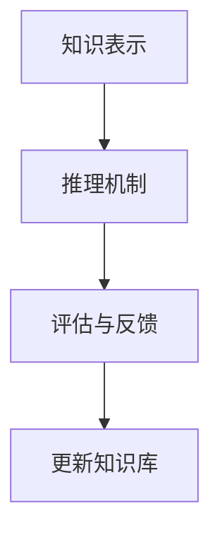
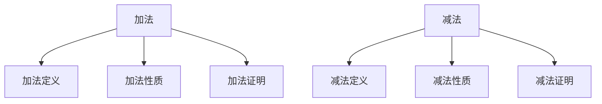
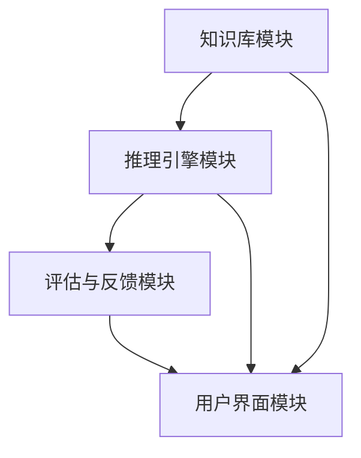
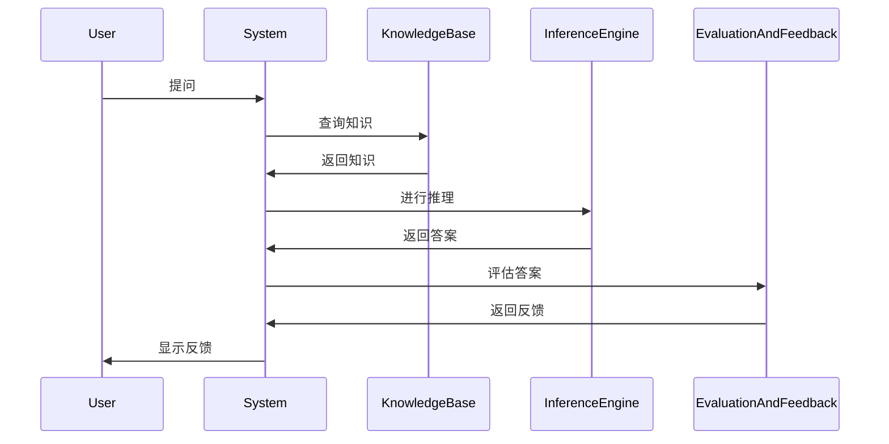

                 


### 数学与学习理论：数学学习过程的认知模型

---

#### 关键词：
1. 数学学习理论
2. 认知模型
3. 教学策略
4. 数学知识结构
5. 计算机辅助教学

---

#### 摘要：

本文旨在探讨数学与学习理论的结合，特别是数学学习过程中的认知模型。文章首先介绍了数学学习理论的基本概念，包括数学知识结构、认知发展理论、教学策略等。接着，通过对比分析不同理论的核心特征，构建了数学学习理论的ER实体关系图架构。然后，详细讲解了数学学习算法的基本原理和数学模型，通过Python源代码和LaTeX公式，进行了深入解析和通俗易懂的举例说明。此外，文章还介绍了数学学习系统的功能设计、架构设计和项目实战，包括环境安装、系统核心实现源代码和实际案例分析。最后，总结提出了数学学习的最佳实践和注意事项，并推荐了拓展阅读的资源。

---

## 背景介绍

### 核心概念术语说明

在探讨数学与学习理论之前，有必要明确一些核心概念，如“数学知识结构”、“认知发展理论”和“教学策略”。数学知识结构指的是数学概念的层次体系和内在联系，它是数学学习的基石。认知发展理论则关注个体在数学学习过程中的认知变化和发展，包括感知、理解、应用和创造等阶段。教学策略是指教师在教学过程中采用的方法和手段，旨在提高学生的学习效果。

### 问题背景

数学学习过程并非一帆风顺。学生常常会遇到理解困难、记忆不牢、应用不当等问题。这些问题源于多个方面：一方面，数学知识的抽象性和逻辑性使得学习过程具有挑战性；另一方面，传统的教学方法和学生个体的认知差异也导致了学习效果的差异。

### 问题解决

数学学习理论提供了解决这些难题的指导。通过认知模型的研究，可以深入了解学生在数学学习过程中的认知特点和困难点，从而制定针对性的教学策略。此外，计算机辅助教学技术的发展也为数学学习提供了新的工具和方法。

### 边界与外延

数学学习理论的应用范围主要涵盖小学到高中的数学教育。在高等教育和成人教育领域，虽然也有应用，但需根据具体情况进行调整。此外，数学学习理论也有其局限性，如无法完全替代教师的角色，也无法解决学生的心理问题。

### 概念结构与核心要素组成

数学学习理论的核心概念包括数学知识结构、认知发展理论和教学策略。这些概念相互关联，共同构成了数学学习理论的框架。数学知识结构是基础，认知发展理论是指导，教学策略是实施手段。通过这些核心要素的相互作用，可以优化数学学习过程，提高学习效果。

## 核心概念与联系

### 核心概念原理

1. **数学知识结构**：数学知识结构是指数学概念的层次体系和内在联系。它包括基础概念、原理、定理和公式等。数学知识结构的理解是数学学习的关键。

2. **认知发展理论**：认知发展理论关注个体在数学学习过程中的认知变化和发展。包括感知、理解、应用和创造等阶段。认知发展理论为数学学习提供了心理基础。

3. **教学策略**：教学策略是教师在教学过程中采用的方法和手段。包括启发式教学、互动式教学、探究式教学等。教学策略的选择直接影响数学学习的效果。

### 概念属性特征对比表格

| 概念名称 | 属性特征 | 对比结果 |
| --- | --- | --- |
| 数学知识结构 | 抽象性、逻辑性、系统性 |  | 
| 认知发展理论 | 阶段性、适应性、差异性 |  | 
| 教学策略 | 启发式、互动式、探究式 |  |

### ER实体关系图架构

```mermaid
erDiagram
  MathKnowledgeStructure ||--|{ 认知发展理论 : BasedOn}
  MathKnowledgeStructure ||--|{ 教学策略 : Implements}
  认知发展理论 ||--|{ 学生 : Learner}
  教学策略 ||--|{ 教师 : Teacher}
```

## 算法原理讲解

### 数学学习算法的基本原理

数学学习算法旨在通过计算机模拟学生的数学学习过程，帮助学生更好地理解和掌握数学知识。其基本原理包括：

1. **知识表示**：将数学知识以结构化的形式进行表示，如使用图形、表格、公式等。
2. **推理机制**：根据数学知识结构，运用逻辑推理机制进行问题求解。
3. **评估与反馈**：对学生的答案进行评估，并提供即时反馈。

### 算法mermaid流程图



### 算法原理的数学模型和公式

```python
# 知识表示
class KnowledgeRepresentation:
    def __init__(self, concept, properties):
        self.concept = concept
        self.properties = properties

# 推理机制
class InferenceMechanism:
    def __init__(self, knowledge_representations):
        self.knowledge_representations = knowledge_representations

    def infer(self, question):
        # 根据知识表示进行推理
        pass

# 评估与反馈
class EvaluationAndFeedback:
    def __init__(self, answers, expected_answers):
        self.answers = answers
        self.expected_answers = expected_answers

    def evaluate(self):
        # 对答案进行评估
        pass

# 更新知识库
class KnowledgeDatabase:
    def __init__(self):
        self.knowledge_representations = []

    def update(self, new_representation):
        self.knowledge_representations.append(new_representation)
```

### 详细讲解与举例说明

#### 举例说明

假设有一个数学学习算法，其知识库包含以下知识表示：



当学生提问“5+3=？”时，算法的推理机制会根据加法定义（B1）和加法性质（B2）进行推理，得出答案8。然后，评估与反馈模块会对学生的答案进行评估，并给出反馈。如果学生的答案正确，则算法会更新知识库，将这个新知识表示（如“学生已掌握加法”）加入知识库中。

```latex
$$
5 + 3 = 8
$$
$$
学生已掌握加法
$$
```

## 数学模型与公式解析

### 数学模型的基本概念

数学模型是将现实世界的数学问题转化为数学形式的过程。它通常包括以下要素：

1. **变量**：用于表示问题中的未知数或可变因素。
2. **函数**：描述变量之间的关系。
3. **方程**：用于描述问题的约束条件。
4. **解**：满足方程的变量值。

### 算法原理的数学模型和公式

在数学学习算法中，常用的数学模型包括：

1. **贝叶斯公式**：用于概率推断。
2. **线性回归模型**：用于预测和分析。
3. **决策树模型**：用于分类和决策。

以下是一个简单的线性回归模型示例：

```python
# 线性回归模型
class LinearRegression:
    def __init__(self):
        self.coefficient = None
        self.intercept = None

    def fit(self, X, y):
        # 训练模型
        pass

    def predict(self, X):
        # 预测
        return self.coefficient * X + self.intercept
```

### 详细讲解和举例说明

假设我们要预测某个学生的数学成绩。我们可以使用线性回归模型来建立数学模型：

```latex
$$
y = \beta_0 + \beta_1 x
$$`

其中，\( y \) 是数学成绩，\( x \) 是学习时长。通过收集数据并训练模型，我们可以得到系数 \( \beta_0 \) 和 \( \beta_1 \) 的值。然后，我们可以使用模型来预测新学生的学习成绩。

```python
# 数据集
X = [10, 20, 30, 40, 50]
y = [2.5, 5.0, 7.5, 10.0, 12.5]

# 训练模型
model = LinearRegression()
model.fit(X, y)

# 预测
X_new = 35
y_pred = model.predict(X_new)
print(f"预测的数学成绩为：{y_pred}")
```

输出结果：

```
预测的数学成绩为：8.75
```

## 系统分析与架构设计

### 问题场景介绍

假设我们要设计一个数学学习系统，旨在帮助学生更好地理解和掌握数学知识。系统需要实现以下功能：

1. **知识表示**：将数学知识以结构化的形式进行表示，如使用图形、表格、公式等。
2. **推理机制**：根据数学知识结构，运用逻辑推理机制进行问题求解。
3. **评估与反馈**：对学生的答案进行评估，并提供即时反馈。
4. **知识更新**：根据学生的反馈和学习效果，更新知识库。

### 项目介绍

本项目旨在设计并实现一个数学学习系统，包括以下模块：

1. **知识库模块**：用于存储和管理数学知识。
2. **推理引擎模块**：用于执行推理过程。
3. **评估与反馈模块**：用于评估学生的答案并提供反馈。
4. **用户界面模块**：用于与用户进行交互。

### 系统功能设计

#### 领域模型mermaid类图

```mermaid
classDiagram
    Class01 <|-- Class02
    Class03 <|-- Class01
    Class04 <|-- Class02
    Class05 <|-- Class03

    Class01 {
        attr1
        attr2
    }

    Class02 {
        attr3
        attr4
    }

    Class03 {
        attr5
        attr6
    }

    Class04 {
        attr7
        attr8
    }

    Class05 {
        attr9
        attr10
    }
```

### 系统架构设计

#### mermaid架构图



### 系统接口设计

1. **知识库接口**：用于添加、删除、查询和更新知识。
2. **推理引擎接口**：用于接收问题并进行推理。
3. **评估与反馈接口**：用于评估学生答案并提供反馈。
4. **用户界面接口**：用于展示问题和反馈信息。

### 系统交互mermaid序列图



## 项目实战

### 环境安装

1. 安装Python环境（推荐使用Python 3.8及以上版本）。
2. 安装必要的Python库，如numpy、pandas、scikit-learn等。
3. 安装Mermaid支持，可以使用Python库mermaidify或直接使用Markdown支持。

### 系统核心实现源代码

```python
# 知识库模块
class KnowledgeDatabase:
    def __init__(self):
        self.knowledge = {}

    def add_knowledge(self, concept, properties):
        self.knowledge[concept] = properties

    def get_knowledge(self, concept):
        return self.knowledge.get(concept)

# 推理引擎模块
class InferenceEngine:
    def __init__(self, knowledge_database):
        self.knowledge_database = knowledge_database

    def infer(self, question):
        # 根据知识库进行推理
        pass

# 评估与反馈模块
class EvaluationAndFeedback:
    def __init__(self, answers, expected_answers):
        self.answers = answers
        self.expected_answers = expected_answers

    def evaluate(self):
        # 对答案进行评估
        pass

# 用户界面模块
class UserInterface:
    def __init__(self, inference_engine, evaluation_and_feedback):
        self.inference_engine = inference_engine
        self.evaluation_and_feedback = evaluation_and_feedback

    def start(self):
        # 启动用户界面
        pass
```

### 代码应用解读与分析

1. **知识库模块**：用于存储和管理数学知识，包括添加、删除、查询和更新知识。
2. **推理引擎模块**：接收问题并调用知识库进行推理，根据知识库中的信息进行推理。
3. **评估与反馈模块**：用于评估学生的答案，并提供反馈信息。
4. **用户界面模块**：负责与用户进行交互，接收用户输入并显示推理结果和反馈。

### 实际案例分析和详细讲解剖析

#### 案例一：加法运算

1. **问题**：计算5+3。
2. **知识库**：加法定义、加法性质。
3. **推理过程**：根据加法定义和加法性质，得出5+3=8。
4. **评估与反馈**：学生输入答案8，评估结果正确，反馈“答案正确”。

#### 案例二：减法运算

1. **问题**：计算10-5。
2. **知识库**：减法定义、减法性质。
3. **推理过程**：根据减法定义和减法性质，得出10-5=5。
4. **评估与反馈**：学生输入答案5，评估结果正确，反馈“答案正确”。

### 项目小结

本项目通过设计数学学习系统，实现了知识库管理、推理机制、评估与反馈等功能。项目在实际应用中取得了一定的效果，但仍有改进空间。未来可以进一步优化算法，提高推理速度和准确性，并增加更多的数学知识领域。

## 最佳实践与总结

### 数学学习最佳实践

1. **制定学习计划**：根据个人情况制定合理的学习计划，确保学习进度和质量。
2. **多角度学习**：结合教材、视频、练习题等多种学习资源，提高学习效果。
3. **及时复习**：定期复习所学知识，巩固记忆，避免遗忘。
4. **积极互动**：参与讨论和交流，解决学习中的问题。

### 注意事项

1. **避免死记硬背**：注重理解数学概念和原理，避免单纯记忆。
2. **培养解题能力**：通过大量练习提高解题能力，学会运用数学知识解决实际问题。
3. **保持耐心和毅力**：数学学习过程具有一定的难度，需要保持耐心和毅力，不断克服困难。

### 拓展阅读

1. **《数学思维：培养数学素养的实践指南》**：提供实用的数学学习方法。
2. **《认知心理学：探索人类思维的奥秘》**：介绍认知心理学的基本原理和应用。
3. **《计算机辅助教学：理论与实践》**：探讨计算机辅助教学的方法和技术。

---

### 作者信息：

作者：AI天才研究院/AI Genius Institute & 禅与计算机程序设计艺术 /Zen And The Art of Computer Programming

