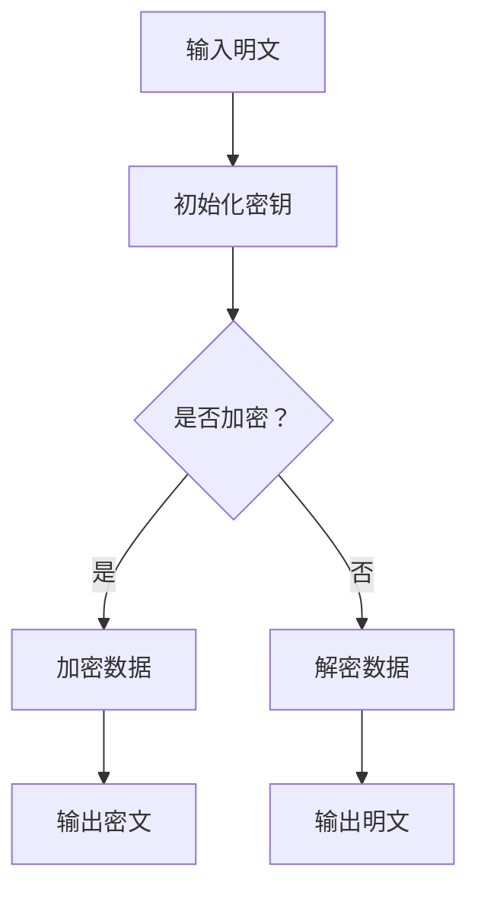
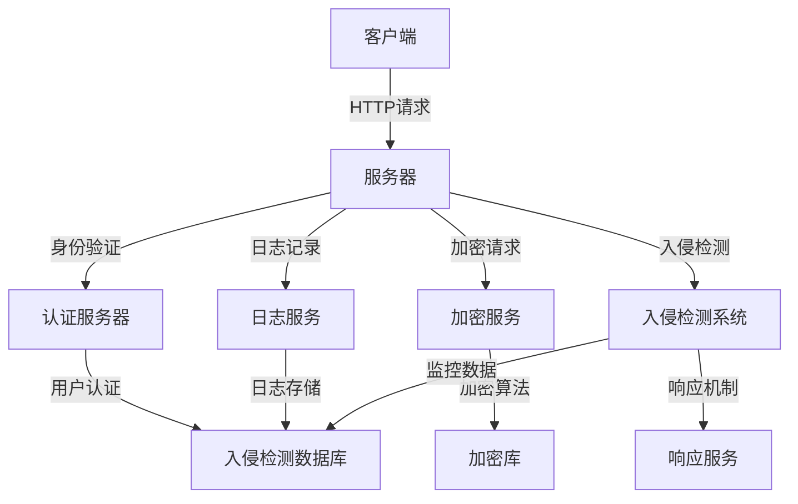
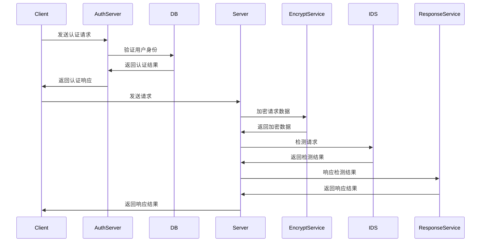

                 

### 文章关键词

- 数学建模
- 安全管理
- 密码学
- 加密算法
- 安全协议
- 入侵检测
- 风险评估
- 算法设计

### 摘要

本文旨在探讨数学在安全管理中的应用，通过数学建模、密码学、安全协议设计和入侵检测等技术，对安全系统进行科学设计。文章首先介绍了问题背景和安全管理的核心问题，接着详细阐述了密码学基础、常见安全协议设计、入侵检测系统设计以及数学模型在安全管理中的应用。最后，对算法设计和系统架构进行了深入分析，并通过具体案例展示了数学在安全管理中的实际应用。本文旨在为读者提供关于安全系统数学设计的全面理解和实践指导。

## 第1章 引言

### 1.1 问题背景

随着信息技术的飞速发展，网络安全威胁日益增多，信息安全问题已经成为全球范围内的重要议题。网络安全威胁不仅对个人隐私构成威胁，还可能导致企业数据泄露、经济损失，甚至影响国家安全。在这样的背景下，如何有效进行安全管理，保障信息系统的安全性和可靠性，成为了一个亟待解决的问题。

#### 信息安全的重要性

信息安全是现代社会的基石，其重要性不容忽视。首先，信息安全关系到个人隐私的保护。随着网络应用的普及，个人信息（如身份信息、财务信息、健康状况等）大量存储在互联网上，一旦泄露，将导致严重的个人隐私问题。其次，信息安全对企业的生存和发展至关重要。企业数据泄露可能导致商业秘密泄露、客户流失，甚至影响企业信誉和市场竞争力。最后，信息安全对国家安全具有重大影响。网络攻击可能导致关键基础设施瘫痪、国家机密泄露，从而危害国家安全。

#### 安全管理的核心目标

安全管理的核心目标是确保信息系统的安全性和可靠性，具体包括以下几个方面：

1. **保密性**：确保敏感信息不被未授权人员访问。
2. **完整性**：确保数据在传输和存储过程中不被篡改。
3. **可用性**：确保信息系统在面对攻击时仍能正常提供服务。
4. **真实性**：确保通信双方的身份真实可靠。

为了实现这些目标，安全管理需要从多个方面进行设计和实施，包括技术手段、管理策略和法律法规等。在技术手段方面，密码学、安全协议和入侵检测等技术发挥着关键作用。在管理策略方面，安全政策和安全培训等也是不可或缺的。在法律法规方面，相关法律法规的制定和执行对提升安全管理水平具有重要意义。

#### 安全管理面临的挑战

当前，安全管理面临着诸多挑战。首先，随着网络环境的复杂化和多样化，安全威胁的种类和形式也在不断演变，传统的安全防护手段难以应对。其次，安全防护技术不断发展，但也存在安全隐患，如加密算法被破解、安全协议被攻破等。此外，安全管理的复杂性不断增加，如何有效整合和管理各种安全技术和策略，成为了一个重要问题。最后，安全管理人员的能力和素质有待提高，面对日益复杂的安全威胁，需要具备更加专业和全面的知识和技能。

### 1.2 问题描述

#### 安全管理的核心问题

在安全管理中，主要面临以下几个核心问题：

1. **安全威胁识别**：如何准确识别潜在的安全威胁，包括恶意软件、网络攻击、数据泄露等。
2. **安全防护策略**：如何设计有效的安全防护策略，包括加密、访问控制、防火墙等。
3. **安全检测与响应**：如何建立快速、准确的安全检测与响应机制，以应对突发的安全事件。
4. **安全管理与合规**：如何确保企业的安全管理符合相关法律法规和行业标准。

#### 安全系统设计的目标

为了解决上述问题，安全系统设计需要实现以下目标：

1. **安全性**：确保系统在面临各种安全威胁时，能够保持正常运行和数据安全。
2. **可靠性**：确保系统在长时间运行过程中，能够保持稳定性和可靠性。
3. **效率**：在保证安全性的前提下，提高系统的运行效率和性能。
4. **可扩展性**：能够根据业务需求的变化，灵活扩展系统功能和安全防护能力。

#### 安全系统设计的方法

为了实现上述目标，安全系统设计需要采用以下方法：

1. **数学建模**：利用数学方法对安全系统进行建模，分析系统在各种攻击和威胁下的性能和安全性。
2. **算法设计**：设计高效、可靠的安全算法，包括加密算法、安全协议算法等。
3. **系统架构设计**：设计合理、可扩展的系统架构，确保系统在面临安全威胁时能够快速响应和恢复。
4. **安全检测与响应机制**：建立完善的安全检测与响应机制，实时监控系统安全状况，及时应对安全事件。

### 1.3 问题解决

为了解决安全管理中的核心问题，本文将从以下几个方面展开讨论：

1. **密码学基础**：介绍密码学的基本概念、原理和应用，包括对称加密算法、非对称加密算法和密码分析技术等。
2. **安全协议设计**：讨论常见安全协议的设计原则、工作原理和性能评估，包括SSL/TLS和IPsec等。
3. **入侵检测系统设计**：介绍入侵检测系统的基本概念、技术方法和设计原则，包括异常检测和脚本检测等。
4. **数学模型在安全管理中的应用**：探讨风险评估模型和安全优化模型的设计和应用，分析其在安全管理中的作用和优势。
5. **算法设计与分析**：介绍算法设计的基本原则和方法，包括加密算法设计、安全协议算法设计和入侵检测算法设计等。
6. **系统架构设计与实现**：讨论安全系统的架构设计原则、关键组件和接口设计，以及系统交互和性能优化策略。

通过上述讨论，本文旨在为读者提供关于安全系统数学设计的全面理解和实践指导，帮助读者应对复杂的网络安全挑战。

### 1.4 边界与外延

#### 研究内容的边界

本文的研究内容主要涵盖以下几个方面：

1. **密码学**：包括对称加密算法（如DES、AES）、非对称加密算法（如RSA、EIGamal）和密码分析技术。
2. **安全协议**：包括SSL/TLS和IPsec等常见安全协议的设计、工作原理和性能评估。
3. **入侵检测系统**：包括入侵检测系统的基本概念、技术方法和设计原则，如异常检测和脚本检测等。
4. **数学模型**：包括风险评估模型和安全优化模型的设计和应用，如风险指标、风险评估方法和模型评估等。
5. **算法设计**：包括加密算法设计、安全协议算法设计和入侵检测算法设计等。

#### 研究内容的外延

虽然本文主要关注数学在安全管理中的应用，但安全管理是一个广泛的话题，涉及多个学科和技术领域。以下是一些可能的研究方向和扩展内容：

1. **网络安全**：除了密码学和安全协议外，网络安全还包括防火墙、入侵防御系统、安全审计等。
2. **安全策略与管理**：安全策略的制定、实施和评估，如安全政策、安全标准和安全培训等。
3. **加密货币与区块链**：加密货币和区块链技术在安全管理中的应用，如区块链的加密算法和智能合约等。
4. **人工智能与安全**：人工智能在安全管理中的应用，如异常检测、入侵检测和自动响应等。
5. **物联网安全**：随着物联网的普及，物联网设备的安全问题也逐渐成为研究热点。
6. **法律法规与标准**：安全管理的法律法规和标准，如网络安全法、ISO 27001等。

### 1.5 概念结构与核心要素组成

在安全系统的数学设计中，明确核心概念、属性特征对比以及概念间的关系至关重要。以下是本文涉及的核心概念及其结构组成：

#### 核心概念

1. **密码学**：研究如何通过加密和解密来保护信息的安全，包括对称加密、非对称加密和密码分析等。
2. **安全协议**：定义通信双方如何安全交换信息，确保信息的保密性、完整性和真实性。
3. **入侵检测系统**：监控网络或系统中的异常行为，及时检测并响应潜在的安全威胁。
4. **数学模型**：利用数学方法对安全系统进行建模，分析系统性能和安全特性。
5. **算法设计**：设计高效、可靠的安全算法，包括加密算法、安全协议算法和入侵检测算法等。

#### 概念属性特征对比表格

以下是几个核心概念的属性特征对比表格：

| 概念 | 特征1 | 特征2 | 特征3 | 特征4 |
| --- | --- | --- | --- | --- |
| 密码学 | 加密、解密 | 对称加密、非对称加密 | 密码学攻击抵抗 | 安全性 |
| 安全协议 | 通信协议、安全性保障 | 加密、认证、完整性保护 | 实时性、可靠性 | 网络通信 |
| 入侵检测系统 | 异常检测、实时监控 | 脚本检测、行为分析 | 威胁响应、日志分析 | 网络安全 |
| 数学模型 | 建模、分析 | 风险评估、性能评估 | 优化策略、算法设计 | 安全系统 |
| 算法设计 | 高效性、可靠性 | 适应性、扩展性 | 安全性、性能 | 加密、安全协议 |

#### ER实体关系图架构

以下是安全系统中的主要实体及其关系的Mermaid ER图：

```mermaid
erDiagram
    User ||--o{ SecuritySystem : 用户与安全系统关系 }
    Device ||--o{ SecuritySystem : 设备与安全系统关系 }
    Sensor ||--o{ IntrusionDetectionSystem : 传感器与入侵检测系统关系 }
    Alert ||--o{ IntrusionDetectionSystem : 警报与入侵检测系统关系 }
    Log ||--o{ IntrusionDetectionSystem : 日志与入侵检测系统关系 }
    Protocol ||--o{ SecuritySystem : 协议与安全系统关系 }
    Algorithm ||--o{ SecuritySystem : 算法与安全系统关系 }
```

通过上述核心概念、属性特征对比和ER图，可以更加清晰地理解安全系统的数学设计，为后续章节的具体讨论提供基础。

## 第2章 密码学基础

### 2.1 密码学概述

#### 2.1.1 密码学的定义

密码学（Cryptography）是研究如何通过加密和解密来保护信息的安全的科学。它主要关注信息的保密性、完整性和真实性，以确保信息在传输和存储过程中不被未授权人员访问、篡改或伪造。密码学的基本概念包括加密（Encryption）、解密（Decryption）、密钥（Key）和算法（Algorithm）等。

#### 2.1.2 密码学的发展历程

密码学的历史可以追溯到古代，但现代密码学的发展始于20世纪中叶。以下是密码学发展历程中的重要里程碑：

1. **古典密码学**（公元前400年 - 公元1600年）：古代使用一些简单的加密方法，如凯撒密码、替换密码和移位密码等。
2. **近代密码学**（1600年 - 1940年）：17世纪的法国数学家Blaise de Vigenère提出了多表替换密码，19世纪末的Herman Hollerith设计了机械密码机。
3. **现代密码学**（1940年 - 现在）：随着计算机技术的发展，密码学进入了电子时代。1970年代，美国的DES算法和RSA算法相继问世，标志着现代密码学的兴起。

#### 2.1.3 密码学在现代安全管理中的应用

在现代安全管理中，密码学发挥着至关重要的作用。以下是密码学在现代安全管理中的应用：

1. **数据加密**：通过加密技术，确保敏感数据在传输和存储过程中不被窃取或篡改。常用的加密算法包括对称加密算法（如AES、DES）和非对称加密算法（如RSA、EIGamal）。
2. **身份认证**：通过加密技术，验证用户的身份，确保只有授权用户才能访问系统资源。常见的身份认证方法包括密码认证、数字证书和生物识别等。
3. **数据完整性验证**：通过数字签名和消息认证码（MAC）等技术，确保数据在传输和存储过程中未被篡改。常用的算法包括RSA签名和HMAC等。
4. **安全协议**：加密技术是安全协议的核心组成部分，如SSL/TLS、IPsec等，用于保护网络通信的安全。
5. **隐私保护**：加密技术可以保护用户的隐私，如匿名通信、电子现金和加密货币等。

### 2.2 常见加密算法

加密算法是密码学的核心组成部分，根据加密方式和密钥管理方式的不同，可以分为对称加密算法和非对称加密算法。以下介绍几种常见的加密算法。

#### 2.2.1 对称加密算法

对称加密算法（Symmetric Encryption）是指加密和解密使用相同的密钥。对称加密算法的优点是加密速度快、计算效率高，但缺点是密钥分发和管理复杂。

1. **DES（Data Encryption Standard）**

DES是由美国国家标准局（NBS）于1977年发布的一种对称加密算法。DES使用56位密钥，将64位明文块分为64位密钥和64位密文。DES的主要优点是速度快、实现简单，但存在密钥长度短、易受 brute-force 攻击的缺点。随着计算机性能的提高，DES的安全性已经无法满足需求，因此已被AES等更安全的加密算法取代。

2. **AES（Advanced Encryption Standard）**

AES是一种更安全的对称加密算法，由美国国家标准与技术研究院（NIST）于2001年发布。AES支持128位、192位和256位密钥，具有更高的安全性和效率。AES采用了替代、混淆和扩散等技术，使得加密过程更加复杂和难以破解。AES已成为全球广泛使用的加密标准，广泛应用于网络通信、数据存储和加密货币等领域。

#### 2.2.2 非对称加密算法

非对称加密算法（Asymmetric Encryption）是指加密和解密使用不同的密钥。非对称加密算法的优点是密钥分发和管理简单，但加密和解密速度较慢。

1. **RSA（Rivest-Shamir-Adleman）**

RSA是最著名的非对称加密算法，由Ron Rivest、Adi Shamir和Leonard Adleman于1977年提出。RSA基于大数分解的难题，其安全性依赖于大素数的乘积难以分解。RSA算法的安全性较高，广泛应用于数字签名、身份认证和数据加密等领域。

2. **EIGamal**

EIGamal是一种基于离散对数的非对称加密算法，由Taher ElGamal于1985年提出。EIGamal算法的安全性也依赖于大素数的离散对数问题，其加密和解密过程相对复杂，但安全性较高。EIGamal算法在加密货币（如DigiCash）和数字签名等领域有广泛应用。

#### 2.2.3 加密算法的比较

以下是几种常见加密算法的对比表格：

| 加密算法 | 密钥长度 | 加密速度 | 安全性 | 应用场景 |
| --- | --- | --- | --- | --- |
| DES | 56位 | 快 | 较低 | 已被淘汰 |
| AES | 128位、192位、256位 | 中等 | 高 | 广泛应用 |
| RSA | 1024位、2048位 | 慢 | 高 | 数字签名、数据加密 |
| EIGamal | 1024位、2048位 | 中等 | 高 | 加密货币、数字签名 |

#### 2.2.4 密码分析技术

密码分析（Cryptanalysis）是研究如何破解加密算法的过程。密码分析可以分为主动攻击和被动攻击：

1. **主动攻击**：攻击者主动修改数据，包括重放攻击、篡改攻击等。
2. **被动攻击**：攻击者窃听通信过程，获取明文和密文，包括 brute-force 攻击、字典攻击和密码分析等。

常见的密码分析技术包括：

1. **穷举攻击**：尝试所有可能的密钥，直到找到正确密钥为止。
2. **字典攻击**：使用一组常见密码的字典，尝试破解密码。
3. **中间人攻击**：攻击者拦截并篡改通信过程，获取明文和密文。
4. **侧信道攻击**：通过分析加密过程的物理参数（如时间、功耗等），推测密钥。

### 2.3 密码学攻击类型

在密码学中，攻击者试图通过各种手段破解加密算法，窃取或篡改敏感信息。以下是几种常见的密码学攻击类型：

#### 2.3.1 主动攻击

1. **重放攻击**：攻击者截获并重放已加密的通信数据，企图欺骗通信双方。
2. **篡改攻击**：攻击者篡改加密数据，使其在传输过程中被误认为是合法数据。
3. **伪造攻击**：攻击者伪造加密数据，使其在传输过程中被误认为是合法数据。

#### 2.3.2 被动攻击

1. **窃听攻击**：攻击者窃听通信过程，获取明文和密文。
2. **流量分析**：攻击者分析通信数据的模式，推测加密数据的性质。
3. **密码分析**：攻击者利用密码学原理，破解加密算法，获取密钥或明文。

### 2.3.3 密码分析算法

密码分析算法是密码分析的核心工具。以下是几种常见的密码分析算法：

1. **统计密码分析**：通过分析加密数据的统计特性，推测密钥或明文。
2. **差分密码分析**：通过分析加密数据之间的差异，推测密钥或明文。
3. **线性密码分析**：通过线性方程组，推测密钥或明文。
4. **选择明文攻击**：攻击者选择特定的明文，使其在加密后具有特定的性质，从而推测密钥或明文。

### 2.4 加密算法的安全性评估

加密算法的安全性评估是密码学中的重要问题。以下是几种常用的加密算法安全性评估方法：

1. **抗穷举攻击能力**：评估加密算法在穷举攻击下的抵抗能力，通常用密钥长度表示。
2. **抗字典攻击能力**：评估加密算法在字典攻击下的抵抗能力，通常需要选择合适的密钥和密码策略。
3. **抗中间人攻击能力**：评估加密算法在中间人攻击下的抵抗能力，需要确保通信双方身份的真实性和完整性。
4. **抗密码分析能力**：评估加密算法在密码分析攻击下的抵抗能力，通常需要选择合适的加密算法和密钥管理策略。

通过上述评估方法，可以全面了解加密算法的安全性，为实际应用提供指导。

## 第3章 安全协议设计

### 3.1 安全协议概述

安全协议（Security Protocols）是定义通信双方如何安全交换信息的规范，用于确保信息的保密性、完整性和真实性。安全协议的设计目标是提供一种可靠的通信机制，以保护数据在传输过程中不受恶意攻击和篡改。以下是安全协议的一些基本概念和分类：

#### 3.1.1 安全协议的定义

安全协议是一组规则和过程，用于确保通信双方在交换信息时能够保持数据的保密性、完整性和真实性。安全协议通常包括加密、认证、完整性保护、访问控制等机制。

#### 3.1.2 安全协议的目标

1. **保密性**：确保只有授权用户才能访问数据，防止未授权人员窃取或读取数据。
2. **完整性**：确保数据在传输过程中不被篡改，保证数据的一致性和完整性。
3. **真实性**：确保通信双方的身份真实可靠，防止伪造身份或冒充他人。
4. **不可否认性**：确保通信双方在通信过程中无法否认自己的行为。

#### 3.1.3 安全协议的类型

安全协议可以根据不同的应用场景和需求进行分类，常见的类型包括：

1. **对称加密协议**：使用相同的密钥进行加密和解密，如DES、AES等。
2. **非对称加密协议**：使用不同的密钥进行加密和解密，如RSA、EIGamal等。
3. **会话层安全协议**：在会话层提供安全保护，如SSL、TLS等。
4. **网络层安全协议**：在网络层提供安全保护，如IPsec等。
5. **传输层安全协议**：在传输层提供安全保护，如TCP安全、UDP安全等。
6. **应用层安全协议**：在应用层提供安全保护，如HTTPS、SFTP等。

### 3.2 常见安全协议

以下是几种常见的安全协议，包括其工作原理和主要特点：

#### 3.2.1 SSL/TLS

SSL（Secure Sockets Layer）和TLS（Transport Layer Security）是常用的传输层安全协议，用于确保网络通信的安全。SSL/TLS协议的工作原理如下：

1. **握手阶段**：客户端向服务器发送SSL/TLS握手请求，包括客户端支持的加密算法、密钥交换方式等。
2. **证书验证阶段**：服务器向客户端发送证书，客户端验证服务器证书的真实性，确保通信双方身份真实可靠。
3. **密钥交换阶段**：客户端和服务器通过协商的加密算法和密钥交换方式，生成会话密钥。
4. **通信阶段**：客户端和服务器使用会话密钥加密和解密通信数据，确保数据的保密性和完整性。

SSL/TLS协议的主要特点包括：

1. **加密通信**：使用SSL/TLS协议可以确保通信数据的保密性，防止中间人攻击。
2. **身份认证**：通过证书验证确保通信双方的身份真实可靠。
3. **完整性保护**：使用哈希函数和消息认证码（MAC）确保数据的完整性，防止数据篡改。
4. **可扩展性**：支持多种加密算法和密钥交换方式，适应不同的安全需求。

SSL/TLS协议广泛应用于Web浏览器、电子邮件、文件传输等领域，是确保网络通信安全的重要手段。

#### 3.2.2 IPsec

IPsec（Internet Protocol Security）是一种网络层安全协议，用于确保IP数据包的安全。IPsec的工作原理如下：

1. **安全关联（Security Association，SA）建立**：通信双方通过协商建立安全关联，确定加密算法、密钥交换方式等。
2. **加密和认证**：发送方对IP数据包进行加密和认证，确保数据的保密性和完整性。
3. **传输**：加密后的数据包通过网络传输。
4. **接收方解密和验证**：接收方对接收到的数据包进行解密和验证，确保数据的完整性和真实性。

IPsec的主要特点包括：

1. **加密保护**：IPsec可以对IP数据包进行加密，确保数据在传输过程中的保密性。
2. **认证保护**：IPsec使用认证算法验证数据包的真实性，防止数据篡改和伪造。
3. **灵活的协议支持**：IPsec支持多种加密算法和认证算法，适用于不同的网络环境和安全需求。
4. **网络层安全**：IPsec在网络层提供安全保护，可以保护整个网络中的数据传输。

IPsec广泛应用于VPN（虚拟专用网络）、企业内部网络、远程接入等领域，是确保网络通信安全的重要手段。

#### 3.2.3 其他常见安全协议

除了SSL/TLS和IPsec，还有其他一些常见的安全协议，如：

1. **Kerberos**：一种基于票据的认证协议，用于确保用户和服务器之间的身份认证。
2. **S/MIME（Secure/Multipurpose Internet Mail Extensions）**：一种用于电子邮件安全传输的协议，包括加密和数字签名功能。
3. **PGP（Pretty Good Privacy）**：一种用于电子邮件加密和数字签名的开源协议。
4. **IEEE 802.1X**：一种基于端口的安全协议，用于控制网络访问。
5. **WPA（Wi-Fi Protected Access）**：一种用于Wi-Fi网络的安全协议，包括WPA-PSK（预共享密钥）和WPA2。

这些安全协议在不同的应用场景中发挥着重要作用，为网络通信和数据传输提供了有效的安全保障。

### 3.3 安全协议设计与分析

安全协议的设计与实现是确保网络安全的关键环节。以下是安全协议设计的基本原则、性能评估方法和优化策略：

#### 3.3.1 安全协议设计原则

1. **安全性**：确保协议能够抵御各种攻击，如窃听、篡改、伪造等。
2. **可靠性**：确保协议能够在各种网络环境下正常运行，如高延迟、低带宽、丢包等。
3. **易用性**：设计简单、易于实现的协议，降低部署和维护成本。
4. **可扩展性**：支持多种加密算法、认证方式和协议版本，适应未来需求。
5. **兼容性**：确保协议与其他系统和协议的兼容性，方便集成和使用。

#### 3.3.2 安全协议性能评估

安全协议的性能评估是确保其有效性的关键。以下是几种常用的性能评估方法：

1. **加密性能评估**：评估协议加密和解密数据的能力，包括加密速度、内存消耗和计算复杂度等。
2. **认证性能评估**：评估协议认证数据包的能力，包括认证速度、内存消耗和计算复杂度等。
3. **吞吐量评估**：评估协议在特定网络环境下的传输能力，包括传输速度和延迟等。
4. **可靠性评估**：评估协议在面临各种攻击和故障时的稳定性和恢复能力。
5. **安全性评估**：评估协议在各种攻击下的安全性，包括抗攻击能力、漏洞和弱点等。

#### 3.3.3 安全协议优化策略

为了提高安全协议的性能和安全性，可以采取以下优化策略：

1. **优化加密算法**：选择更高效、更安全的加密算法，减少计算复杂度和通信开销。
2. **优化密钥管理**：设计高效、安全的密钥交换和管理机制，确保密钥的安全性和可靠性。
3. **优化协议架构**：简化协议架构，减少协议的复杂度，提高协议的可维护性和扩展性。
4. **优化通信模式**：采用更高效的通信模式，如并行通信、流水线处理等，提高传输效率和吞吐量。
5. **动态调整参数**：根据网络环境和安全需求，动态调整协议参数，如加密强度、认证方式等。

通过上述原则、方法和策略，可以设计出高效、可靠、安全的安全协议，为网络通信和数据传输提供有力保障。

## 第4章 入侵检测系统设计

### 4.1 入侵检测系统概述

入侵检测系统（Intrusion Detection System，IDS）是一种用于监控网络或系统中的异常行为和潜在安全威胁的网络安全技术。其核心功能是检测、识别和响应入侵行为，以保护网络和系统免受攻击。以下是入侵检测系统的一些基本概念和分类：

#### 4.1.1 入侵检测系统的定义

入侵检测系统是一种能够自动检测并报告网络或系统中的入侵行为和异常行为的系统。其目的是及时发现并阻止恶意攻击，确保网络和系统的安全。

#### 4.1.2 入侵检测系统的类型

根据检测方法和检测对象的不同，入侵检测系统可以分为以下几种类型：

1. **基于网络的入侵检测系统（NIDS）**：NIDS部署在网络中，监控网络流量，分析数据包的异常行为。NIDS能够检测网络攻击、恶意软件传播等攻击行为。

2. **基于主机的入侵检测系统（HIDS）**：HIDS部署在单个主机上，监控主机系统的日志、文件和系统调用等信息，分析异常行为。HIDS能够检测病毒、木马、恶意软件等攻击行为。

3. **基于端的应用层入侵检测系统（AIDS）**：AIDS部署在应用层，监控特定应用程序的通信和数据交换，分析异常行为。AIDS能够检测网络钓鱼、应用层攻击等攻击行为。

#### 4.1.3 入侵检测系统的作用

入侵检测系统在网络和系统安全中发挥着重要作用：

1. **威胁检测**：入侵检测系统能够及时发现网络和系统中的异常行为和潜在安全威胁，包括恶意攻击、恶意软件传播等。

2. **威胁响应**：入侵检测系统可以在检测到威胁后，采取相应的措施，如阻断攻击、报警通知、日志记录等，以阻止攻击的进一步扩展。

3. **安全分析**：入侵检测系统可以收集和分析安全事件日志，提供对网络和系统安全的全面分析，帮助管理员了解攻击方式、攻击来源等信息。

4. **合规性检查**：入侵检测系统可以帮助企业满足相关法律法规和行业标准的要求，确保网络和系统安全合规。

### 4.2 入侵检测技术

入侵检测技术是入侵检测系统的核心组成部分，主要包括以下几种方法：

#### 4.2.1 异常检测

异常检测（Anomaly Detection）是一种常用的入侵检测技术，通过分析网络流量、系统日志等数据，识别出与正常行为不一致的异常行为。异常检测可以分为以下几种方法：

1. **基于统计的方法**：利用统计模型，如高斯分布、聚类算法等，对网络流量、系统日志等进行建模，识别出偏离正常模型的异常行为。

2. **基于模型的方法**：利用机器学习算法，如决策树、支持向量机、神经网络等，对网络流量、系统日志等进行训练，构建异常检测模型，识别出异常行为。

3. **基于行为特征的方法**：通过分析网络流量、系统日志等数据的行为特征，如连接速率、访问频率、文件大小等，识别出异常行为。

#### 4.2.2 脚本检测

脚本检测（Script Detection）是一种用于检测恶意脚本的入侵检测技术。恶意脚本通常是通过Web浏览器或Web服务进行攻击的，因此脚本检测对于保护Web应用的安全至关重要。脚本检测可以分为以下几种方法：

1. **静态分析**：通过分析恶意脚本的源代码、结构、关键字等，检测出潜在的恶意行为。静态分析方法包括模式匹配、语法分析、语义分析等。

2. **动态分析**：通过运行恶意脚本，监控其运行过程中的行为，检测出潜在的恶意行为。动态分析方法包括虚拟执行、实时监控、行为分析等。

3. **特征匹配**：通过建立恶意脚本特征库，对捕获的网络流量或系统日志进行特征匹配，检测出潜在的恶意脚本。

4. **基于行为的检测**：通过分析恶意脚本的运行行为，如访问频率、访问路径、系统调用等，检测出异常行为，从而识别出恶意脚本。

#### 4.2.3 其他入侵检测技术

除了异常检测和脚本检测外，还有其他一些入侵检测技术，如：

1. **基于规则的检测**：利用预定义的规则，如正则表达式、访问控制列表等，检测网络流量或系统日志中的异常行为。

2. **基于免疫学的检测**：模拟生物免疫系统的机制，通过学习正常行为，识别出异常行为，从而检测入侵行为。

3. **基于行为的检测**：通过分析网络流量、系统日志等数据的行为特征，如连接速率、访问频率、文件大小等，识别出异常行为，从而检测入侵行为。

4. **基于图论的检测**：利用图论方法，对网络流量、系统日志等数据进行分析，识别出潜在的入侵行为。

通过上述入侵检测技术，入侵检测系统能够有效地识别和响应各种入侵行为，保障网络和系统的安全。

### 4.3 入侵检测系统设计

入侵检测系统的设计是确保其有效性和可靠性的关键。以下是入侵检测系统设计的基本原则、架构设计和组件设计：

#### 4.3.1 入侵检测系统设计原则

1. **全面性**：入侵检测系统应覆盖网络和系统的各个层面，包括网络层、会话层、应用层等，确保全面检测各种入侵行为。

2. **实时性**：入侵检测系统应具备实时检测和响应的能力，能够在检测到入侵行为后及时采取行动，防止入侵行为的进一步扩展。

3. **准确性**：入侵检测系统应具有较高的检测准确性，既能检测出真正的入侵行为，又能避免误报和漏报。

4. **可扩展性**：入侵检测系统应具备良好的可扩展性，能够根据需求灵活调整和扩展功能，以适应不断变化的安全需求。

5. **可维护性**：入侵检测系统应具备良好的可维护性，方便管理员进行配置、升级和维护，确保系统的稳定运行。

#### 4.3.2 入侵检测系统架构设计

入侵检测系统的架构设计是确保其性能和可靠性的关键。以下是入侵检测系统的一种常见架构设计：

1. **数据采集层**：负责采集网络流量、系统日志等数据，并将其发送到数据处理层。

2. **数据处理层**：负责对采集到的数据进行预处理、过滤和分类，提取出与入侵检测相关的特征信息，并将其发送到分析引擎。

3. **分析引擎**：负责对特征信息进行分析和处理，识别出潜在的入侵行为，并将检测结果发送到告警和响应模块。

4. **告警和响应模块**：负责生成告警信息、记录入侵事件日志，并根据检测结果采取相应的响应措施，如阻断攻击、报警通知等。

5. **日志管理**：负责记录和存储入侵事件日志，以便后续分析和审计。

#### 4.3.3 入侵检测系统组件设计

入侵检测系统由多个组件组成，以下是常见的组件设计：

1. **数据采集模块**：负责从网络设备、系统日志等渠道采集数据，并将其发送到数据处理层。

2. **数据处理模块**：负责对采集到的数据进行预处理、过滤和分类，提取出与入侵检测相关的特征信息。

3. **特征库管理模块**：负责管理入侵检测的特征库，包括特征定义、特征分类、特征匹配等。

4. **分析引擎模块**：负责对特征信息进行分析和处理，识别出潜在的入侵行为。

5. **告警和响应模块**：负责生成告警信息、记录入侵事件日志，并根据检测结果采取相应的响应措施。

6. **日志管理模块**：负责记录和存储入侵事件日志，以便后续分析和审计。

通过上述设计原则、架构设计和组件设计，入侵检测系统可以有效地检测和响应各种入侵行为，保障网络和系统的安全。

### 4.4 入侵检测系统性能评估

入侵检测系统的性能评估是确保其有效性和可靠性的关键。以下是几种常用的性能评估指标和方法：

#### 4.4.1 性能评估指标

1. **检测准确性**：评估入侵检测系统检测入侵行为的准确性，包括正确识别入侵行为和避免误报。

2. **检测速度**：评估入侵检测系统处理和检测数据包的速度，包括实时性和延迟。

3. **资源消耗**：评估入侵检测系统在运行过程中对系统资源（如CPU、内存、网络带宽等）的消耗。

4. **可扩展性**：评估入侵检测系统在处理大规模数据和复杂网络环境下的性能，包括吞吐量和稳定性。

5. **误报率**：评估入侵检测系统误报入侵行为的比例，包括误报数量和误报率。

6. **漏报率**：评估入侵检测系统漏报入侵行为的比例，包括漏报数量和漏报率。

#### 4.4.2 性能评估方法

1. **基准测试**：通过运行预定义的基准测试，评估入侵检测系统的性能指标，如检测准确性、检测速度和资源消耗等。

2. **实时测试**：在真实网络环境下运行入侵检测系统，收集和分析实际攻击数据，评估其性能指标。

3. **模拟测试**：通过模拟不同的攻击场景，评估入侵检测系统的检测能力和响应能力。

4. **性能调优**：根据性能评估结果，对入侵检测系统进行参数调整和优化，以提高其性能和可靠性。

5. **用户反馈**：收集用户对入侵检测系统的使用反馈，评估其用户体验和满意度。

通过上述评估方法和指标，可以全面了解入侵检测系统的性能，为优化和改进系统提供依据。

## 第5章 数学模型在安全管理中的应用

### 5.1 数学模型概述

数学模型（Mathematical Model）是利用数学方法对现实世界中的系统、过程或现象进行抽象和描述的数学结构。在安全管理中，数学模型作为一种强大的工具，可以用来分析和设计安全系统，提高其安全性、可靠性和效率。以下是数学模型在安全管理中的重要性和应用领域：

#### 5.1.1 数学模型在安全管理中的重要性

1. **精确描述**：数学模型能够精确地描述安全系统的行为、性能和特性，为分析和优化提供理论基础。
2. **预测分析**：通过数学模型，可以对安全系统的未来状态进行预测，提前识别潜在的安全威胁和风险。
3. **优化设计**：数学模型可以用于优化安全系统的设计和配置，提高其性能和可靠性。
4. **风险评估**：数学模型可以帮助进行风险评估，识别系统中的薄弱环节，采取相应的安全措施。
5. **算法设计**：数学模型为安全算法的设计提供了理论依据，有助于提高算法的效率和安全性。

#### 5.1.2 数学模型的基本原理

数学模型的基本原理包括以下几个方面：

1. **抽象**：从复杂的安全系统中提取关键要素，忽略次要因素，建立简化的数学模型。
2. **量化**：将安全系统的各种属性和参数进行量化，用数学符号表示。
3. **关系**：建立系统各要素之间的数学关系，如方程、函数、概率分布等。
4. **验证**：通过实验或数据分析验证数学模型的准确性和可靠性。

#### 5.1.3 数学模型的应用范围

数学模型在安全管理中的应用范围非常广泛，包括但不限于以下几个方面：

1. **风险评估模型**：用于评估系统的安全风险，识别潜在的安全威胁和脆弱性。
2. **安全优化模型**：用于优化安全系统的设计和配置，提高其性能和可靠性。
3. **加密算法模型**：用于分析和设计加密算法，提高其安全性和效率。
4. **安全协议模型**：用于分析和设计安全协议，确保其可靠性和安全性。
5. **入侵检测模型**：用于设计和优化入侵检测系统，提高其检测准确性和响应速度。
6. **隐私保护模型**：用于设计隐私保护机制，保护个人隐私和数据安全。

### 5.2 风险评估模型

风险评估模型（Risk Assessment Model）是数学模型在安全管理中的一种重要应用。风险评估模型用于评估系统的安全风险，识别潜在的安全威胁和脆弱性。以下是风险评估模型的基本概念、设计原则和应用方法：

#### 5.2.1 风险评估模型的定义

风险评估模型是一种用于评估系统安全风险的数学模型，通过分析系统的安全威胁、脆弱性和安全措施，计算系统的整体风险水平。

#### 5.2.2 风险评估指标

风险评估模型通常包括以下几类指标：

1. **威胁指标**：描述安全威胁的性质和可能性，如攻击类型、攻击频率等。
2. **脆弱性指标**：描述系统的弱点，如系统漏洞、配置错误等。
3. **安全措施指标**：描述系统的安全措施，如加密算法、防火墙、访问控制等。
4. **风险指标**：综合威胁指标、脆弱性指标和安全措施指标，计算系统的整体风险水平。

#### 5.2.3 风险评估方法

风险评估模型通常采用以下几种方法：

1. **定性评估方法**：通过专家评估、类比分析等方法，对系统的安全风险进行定性评估。
2. **定量评估方法**：通过数学模型、统计分析等方法，对系统的安全风险进行定量评估。
3. **组合评估方法**：结合定性评估和定量评估方法，综合评估系统的安全风险。

#### 5.2.4 风险评估模型设计

风险评估模型的设计包括以下步骤：

1. **定义评估指标**：确定威胁指标、脆弱性指标和安全措施指标，明确评估的目标和范围。
2. **构建数学模型**：根据评估指标，构建数学模型，如概率模型、线性模型等。
3. **参数设置**：根据实际情况，设置模型参数，如威胁概率、脆弱性概率等。
4. **模型验证**：通过实验或数据分析，验证模型的准确性和可靠性。

#### 5.2.5 风险评估模型应用

风险评估模型在安全管理中的应用包括：

1. **安全决策支持**：帮助管理员制定安全策略和措施，降低系统风险。
2. **安全规划**：为安全系统的设计和实施提供依据，确保系统具备足够的安全能力。
3. **安全审计**：对现有安全系统进行评估，发现潜在的安全漏洞和风险。
4. **安全培训**：为员工提供风险评估的知识和技能，提高整体安全意识。

通过风险评估模型，可以全面、科学地评估系统的安全风险，为安全管理提供有力支持。

### 5.3 安全优化模型

安全优化模型（Security Optimization Model）是数学模型在安全管理中的另一种重要应用。安全优化模型用于优化安全系统的设计和配置，提高其性能和可靠性。以下是安全优化模型的基本概念、设计原则和应用方法：

#### 5.3.1 安全优化模型的定义

安全优化模型是一种用于优化安全系统的数学模型，通过分析和计算，确定最优的安全配置和策略，以实现系统安全性和性能的最佳平衡。

#### 5.3.2 安全优化指标

安全优化模型通常包括以下几类指标：

1. **安全性指标**：描述系统的安全性能，如入侵检测率、数据泄露率等。
2. **性能指标**：描述系统的运行效率，如处理速度、响应时间等。
3. **可靠性指标**：描述系统的稳定性，如故障率、恢复时间等。
4. **成本指标**：描述系统的建设和维护成本，如硬件成本、人力资源成本等。

#### 5.3.3 安全优化方法

安全优化模型通常采用以下几种方法：

1. **线性规划方法**：通过线性规划求解安全系统的最优配置和策略。
2. **非线性规划方法**：通过非线性规划求解复杂安全系统的最优配置和策略。
3. **启发式算法**：通过启发式算法，如遗传算法、粒子群优化等，求解安全系统的最优配置和策略。
4. **混合方法**：结合线性规划、非线性规划、启发式算法等方法，求解复杂安全系统的最优配置和策略。

#### 5.3.4 安全优化模型设计

安全优化模型的设计包括以下步骤：

1. **定义优化目标**：确定系统的优化目标，如最大化安全性、最小化成本等。
2. **构建数学模型**：根据优化目标，构建数学模型，如线性规划模型、非线性规划模型等。
3. **参数设置**：根据实际情况，设置模型参数，如安全措施的成本、性能等。
4. **模型求解**：利用数学方法和算法，求解安全系统的最优配置和策略。

#### 5.3.5 安全优化模型应用

安全优化模型在安全管理中的应用包括：

1. **安全系统设计**：为安全系统的设计和实施提供优化方案，提高系统的安全性和性能。
2. **安全策略优化**：为安全策略的制定和调整提供优化方案，提高系统的安全性和可靠性。
3. **成本控制**：通过优化安全配置和策略，降低系统的建设和维护成本。
4. **性能提升**：通过优化系统设计和配置，提高系统的处理速度和响应时间。

通过安全优化模型，可以科学、有效地优化安全系统的设计和配置，提高系统的安全性和性能。

### 5.4 数学模型在安全管理中的应用案例

为了更好地展示数学模型在安全管理中的应用，以下列举几个实际案例：

#### 5.4.1 风险评估模型在金融系统中的应用

某金融机构需要评估其内部网络的安全风险。通过构建风险评估模型，确定威胁指标、脆弱性指标和安全措施指标，计算网络的整体风险水平。评估结果显示，网络中的某些设备存在安全隐患，如未及时更新安全补丁、弱密码等。根据评估结果，该金融机构采取了相应的安全措施，如更新补丁、加强密码管理，有效降低了网络风险。

#### 5.4.2 安全优化模型在网络安全中的应用

某企业需要优化其网络安全配置，以提高安全性和性能。通过构建安全优化模型，确定最优的安全措施和配置方案，如防火墙策略、入侵检测系统配置等。模型分析结果显示，采用某种防火墙策略和入侵检测系统能够有效提高网络安全性，同时降低系统成本。企业根据模型建议进行了配置调整，显著提高了网络安全性。

#### 5.4.3 加密算法模型在数据加密中的应用

某企业需要选择一种加密算法对敏感数据加密。通过构建加密算法模型，分析不同加密算法的安全性、效率和兼容性，确定最优的加密算法。模型分析结果显示，AES算法在安全性和效率方面具有显著优势，企业最终选择了AES算法对数据进行加密，确保了数据的安全性和完整性。

这些案例展示了数学模型在安全管理中的应用，通过精确的分析和优化，提高了系统的安全性和可靠性。

## 第6章 算法设计与分析

### 6.1 算法设计概述

算法设计是计算机科学和网络安全领域中的核心任务之一。一个优秀的算法不仅需要具备高效的执行效率和出色的性能，还需要在安全性、可靠性等方面表现出色。在安全系统中，算法设计尤为关键，因为算法的质量直接影响系统的安全性和稳定性。以下是算法设计的一些基本概念、目标、原则和方法：

#### 6.1.1 算法设计的目标

算法设计的目标主要包括：

1. **正确性**：算法能够正确地解决问题，满足预定的要求。
2. **高效性**：算法在时间和空间资源上具有最优或接近最优的性能。
3. **可扩展性**：算法能够适应不同规模的问题，具有良好的扩展性。
4. **可靠性**：算法在各种环境下能够稳定运行，不出现错误或崩溃。
5. **安全性**：算法在设计和实现过程中要考虑安全因素，防止恶意攻击和篡改。

#### 6.1.2 算法设计的原则

算法设计应遵循以下原则：

1. **简单性**：算法的设计应尽量简洁明了，避免冗余和复杂结构。
2. **模块化**：将算法划分为多个模块，每个模块实现特定的功能，便于维护和扩展。
3. **可读性**：算法代码应具有良好的可读性，便于理解和调试。
4. **鲁棒性**：算法应能够处理各种异常情况和边界条件，确保系统的稳定性。
5. **安全性**：算法在设计时需考虑潜在的安全威胁，如注入攻击、数据篡改等。

#### 6.1.3 算法设计的方法

算法设计的方法多种多样，以下是一些常用的方法：

1. **分而治之**：将复杂问题分解为多个子问题，分别解决，最后合并结果。
2. **贪心算法**：通过每一步选择局部最优解，逐步逼近全局最优解。
3. **动态规划**：通过保存子问题的解，避免重复计算，提高算法的效率。
4. **回溯法**：从问题的解空间中选择一个解，逐步探索，一旦发现不符合条件，就回溯到上一步重新选择。
5. **随机化算法**：通过引入随机性，提高算法的鲁棒性和安全性。
6. **启发式算法**：根据某些启发式规则，快速找到问题的近似解。

### 6.2 安全算法设计

安全算法设计是算法设计的重要组成部分，特别是在网络安全领域，安全算法的设计至关重要。以下是几种常见的安全算法及其设计原则：

#### 6.2.1 加密算法设计

加密算法是安全系统的核心组成部分，用于保护数据的机密性。以下是几种常见的加密算法：

1. **对称加密算法**：对称加密算法使用相同的密钥进行加密和解密，如AES、DES等。设计对称加密算法应考虑以下原则：

   - **加密强度**：确保加密算法难以被破解，密钥长度和加密过程应足够复杂。
   - **算法效率**：加密和解密过程应快速高效，以适应实际应用需求。
   - **密钥管理**：设计安全、高效的密钥生成、存储和分发机制。

2. **非对称加密算法**：非对称加密算法使用不同的密钥进行加密和解密，如RSA、EIGamal等。设计非对称加密算法应考虑以下原则：

   - **密钥长度**：确保密钥长度足够，以抵抗现代计算机的攻击。
   - **加密效率**：虽然非对称加密算法通常比对称加密算法慢，但应尽量提高其效率。
   - **安全性**：确保加密算法能够抵抗各种密码学攻击，如中间人攻击、伪造攻击等。

#### 6.2.2 安全协议算法设计

安全协议算法设计是确保数据传输安全的关键。以下是几种常见的安全协议及其设计原则：

1. **SSL/TLS**：SSL/TLS是一种广泛使用的传输层安全协议，用于保护Web通信的安全。设计SSL/TLS算法应考虑以下原则：

   - **完整性**：确保通信数据在传输过程中未被篡改，使用哈希函数和消息认证码（MAC）实现。
   - **机密性**：确保通信数据在传输过程中不被窃听，使用对称加密算法实现。
   - **身份认证**：确保通信双方的身份真实可靠，使用数字证书和认证中心实现。

2. **IPsec**：IPsec是一种网络层安全协议，用于保护IP数据包的安全。设计IPsec算法应考虑以下原则：

   - **加密保护**：确保IP数据包在传输过程中不被窃听或篡改，使用加密算法实现。
   - **认证保护**：确保IP数据包的真实性，使用认证算法实现。
   - **密钥管理**：设计安全、高效的密钥交换和管理机制，确保密钥的安全传输和存储。

#### 6.2.3 入侵检测算法设计

入侵检测算法是入侵检测系统的核心，用于识别和响应潜在的安全威胁。以下是几种常见的入侵检测算法：

1. **基于统计的方法**：如KNN、神经网络等，通过分析网络流量或系统日志的统计特性，识别异常行为。设计基于统计的入侵检测算法应考虑以下原则：

   - **特征选择**：选择具有代表性的特征，提高检测的准确性。
   - **模型训练**：使用大量正常和入侵行为的数据进行训练，提高模型的泛化能力。
   - **实时性**：确保算法能够在实时环境中快速检测入侵行为。

2. **基于行为的检测方法**：如基于异常行为的检测、基于攻击行为的检测等。设计基于行为的入侵检测算法应考虑以下原则：

   - **行为建模**：建立准确的行为模型，识别正常行为和入侵行为。
   - **动态调整**：根据环境变化动态调整检测阈值，提高检测的准确性。
   - **响应机制**：设计快速、准确的响应机制，及时应对入侵行为。

通过遵循上述原则和方法，可以设计出高效、可靠、安全的算法，为安全系统提供坚实的技术支持。

### 6.3 算法分析

算法分析是评估算法性能和质量的重要环节。算法分析主要包括时间复杂度和空间复杂度分析、正确性证明和安全性分析等。

#### 6.3.1 时间复杂度分析

时间复杂度分析是评估算法执行时间的复杂度，通常用大O表示法（Big O notation）表示。例如，一个算法的时间复杂度为O(n)，表示算法的执行时间与输入数据规模n成正比。以下是几种常见的时间复杂度分析示例：

1. **线性搜索**：时间复杂度为O(n)，在最坏情况下需要遍历整个数据集。
2. **二分搜索**：时间复杂度为O(log n)，在最坏情况下需要log n次比较。
3. **快速排序**：平均时间复杂度为O(n log n)，但在最坏情况下可能退化为O(n^2)。

#### 6.3.2 空间复杂度分析

空间复杂度分析是评估算法所需的额外内存空间，也通常用大O表示法表示。空间复杂度分析有助于评估算法的内存消耗和资源利用效率。例如，一个算法的空间复杂度为O(1)，表示算法在执行过程中所需的额外内存空间不随输入数据规模的变化而变化。

#### 6.3.3 正确性证明

算法的正确性证明是确保算法能够正确解决问题的过程。常见的方法包括归纳法、数学归纳法、逻辑证明等。以下是几种常见算法的正确性证明方法：

1. **归纳法**：通过归纳假设和归纳步骤，证明算法在所有情况下都能正确运行。
2. **数学归纳法**：通过数学归纳法，证明算法在所有正整数输入下都能正确运行。
3. **逻辑证明**：使用逻辑推理和数学工具，证明算法的正确性。

#### 6.3.4 安全性分析

安全性分析是评估算法在面临各种攻击时的抵抗能力。安全性分析包括以下几个方面：

1. **抗攻击能力**：评估算法在面对各种攻击（如注入攻击、中间人攻击等）时的抵抗能力。
2. **漏洞分析**：识别算法中可能存在的漏洞和弱点，如逻辑漏洞、算法缺陷等。
3. **加密强度分析**：评估加密算法的加密强度，确保其能够抵抗现代密码学攻击。
4. **密钥管理分析**：评估密钥生成、存储和分发机制的安全性，确保密钥的安全保护。

通过算法分析，可以全面了解算法的性能、正确性和安全性，为算法的优化和改进提供依据。

### 6.4 安全算法设计实例

以下是一个安全算法设计实例，包括算法原理、流程图、代码实现和数学模型。

#### 6.4.1 算法原理

本实例实现了一个简单的对称加密算法，使用AES算法对数据进行加密和解密。

1. **加密过程**：使用AES算法和密钥对数据进行加密，生成密文。
2. **解密过程**：使用AES算法和密钥对密文进行解密，恢复原始数据。

#### 6.4.2 流程图

以下是算法的流程图：



#### 6.4.3 代码实现

以下是Python代码实现：

```python
from Crypto.Cipher import AES
from Crypto.Util.Padding import pad, unpad
from Crypto.Random import get_random_bytes

def encrypt(plaintext, key):
    cipher = AES.new(key, AES.MODE_CBC)
    ct_bytes = cipher.encrypt(pad(plaintext.encode('utf-8'), AES.block_size))
    iv = cipher.iv
    return iv, ct_bytes

def decrypt(ciphertext, key, iv):
    cipher = AES.new(key, AES.MODE_CBC, iv)
    pt = unpad(cipher.decrypt(ciphertext), AES.block_size)
    return pt.decode('utf-8')

if __name__ == '__main__':
    key = get_random_bytes(16)
    iv = get_random_bytes(16)

    plaintext = "Hello, World!"
    ciphertext, iv = encrypt(plaintext, key)
    print("密文：", ciphertext)

    decrypted_text = decrypt(ciphertext, key, iv)
    print("解密后：", decrypted_text)
```

#### 6.4.4 数学模型

以下是AES加密算法的数学模型：

1. **密钥扩展**：将128位的原始密钥扩展为256位的密钥，通过迭代轮密钥生成过程。
2. **轮密钥生成**：每一轮加密使用不同的密钥，通过轮密钥生成函数计算。
3. **字节替换**：使用S-Box替换每个字节。
4. **行移位**：将每行的字节进行循环移位。
5. **列混淆**：通过乘法矩阵对每列进行混淆。
6. **轮密钥加**：将每轮的输出与轮密钥进行异或操作。

通过上述实例，展示了安全算法的设计原理、流程图和代码实现，为安全算法设计提供了具体案例。

## 第7章 系统架构设计与实现

### 7.1 问题场景介绍

随着互联网的普及，企业信息系统的安全威胁日益增加。为了保障企业信息系统的安全，我们需要设计并实现一个全面的安全管理系统，包括访问控制、数据加密、入侵检测等多个方面。本节将介绍一个具体的项目背景，以及项目的主要目标和功能。

#### 7.1.1 项目背景

某大型企业面临着来自网络攻击、内部泄露等多种安全威胁。为了提升企业的信息安全防护能力，企业决定开发一个集成的安全管理系统，实现对所有重要信息的全面保护。该项目的目标是：

1. **保障数据安全**：确保企业的敏感数据在存储和传输过程中不被窃取或篡改。
2. **防止非法访问**：通过严格的访问控制机制，防止未授权人员访问企业资源。
3. **实时监控**：建立入侵检测系统，实时监控网络活动，及时发现并响应潜在的安全威胁。

#### 7.1.2 项目功能

安全管理系统的主要功能包括：

1. **访问控制**：实现用户身份验证和权限管理，确保只有授权用户才能访问特定资源。
2. **数据加密**：采用加密算法对存储和传输的数据进行加密，确保数据的安全性。
3. **入侵检测**：实时监控网络流量和系统日志，检测异常行为，及时报警和响应。
4. **日志管理**：记录和存储所有的安全事件，便于后续分析和审计。
5. **安全策略管理**：制定和调整安全策略，根据企业需求进行配置。

### 7.2 系统架构设计

为了实现上述功能，我们需要设计一个合理、高效、可扩展的系统架构。以下是系统架构的详细设计：

#### 7.2.1 系统架构图

以下是安全管理系统架构的Mermaid图：



#### 7.2.2 系统架构设计原则

系统架构设计应遵循以下原则：

1. **模块化**：将系统划分为多个功能模块，每个模块负责特定的功能，便于维护和扩展。
2. **高可用性**：确保系统在面临攻击或故障时能够快速恢复，保证业务的连续性。
3. **可扩展性**：系统应具备良好的可扩展性，能够适应企业规模的变化和需求的增长。
4. **安全性**：系统设计应充分考虑安全性，采用多种安全措施，防止数据泄露和攻击。
5. **高并发性**：系统应能够处理大量并发请求，确保业务的响应速度和稳定性。

### 7.3 系统功能设计

以下是安全管理系统的主要功能模块及其设计：

#### 7.3.1 领域模型

以下是安全管理系统领域的Mermaid类图：

```mermaid
classDiagram
    Client <<接口>> HttpRequest
    Server <<接口>> HttpResponse
    AuthServer <<接口>> Authentication
    DB <<实体>> UserDatabase
    DB <<实体>> LogDatabase
    DB <<实体>> IDSDatabase
    EncryptService <<服务>> EncryptData
    LogService <<服务>> LogEvent
    IDS <<服务>> MonitorActivity
    ResponseService <<服务>> RespondToAlert

    Client..|> HttpRequest
    Server..|> HttpResponse
    AuthServer..|> Authentication
    DB..|> UserDatabase
    DB..|> LogDatabase
    DB..|> IDSDatabase
    EncryptService..|> EncryptData
    LogService..|> LogEvent
    IDS..|> MonitorActivity
    ResponseService..|> RespondToAlert
```

#### 7.3.2 功能模块

1. **客户端**：负责发送HTTP请求，向服务器请求资源和数据。

2. **认证服务器**：负责用户认证，验证用户的身份和权限。用户通过认证后，才能访问受保护的资源。

3. **加密服务**：负责对数据进行加密，确保数据在传输和存储过程中不被窃取或篡改。加密服务使用AES等加密算法对数据进行加密。

4. **日志服务**：负责记录和存储所有的安全事件，包括用户访问日志、系统日志和入侵检测日志。日志服务采用日志轮转和压缩策略，确保日志数据的安全性和完整性。

5. **入侵检测系统**：负责实时监控网络活动和系统日志，检测异常行为和潜在的安全威胁。入侵检测系统采用多种检测算法，如基于统计的方法、基于行为的检测方法等。

6. **响应服务**：负责对入侵检测系统检测到的异常行为进行响应，包括阻断攻击、报警通知、日志记录等。

### 7.4 系统接口设计

以下是安全管理系统的主要接口设计：

1. **认证接口**：用户通过认证接口进行身份验证，接口接收用户名和密码，调用认证服务器进行验证。

2. **加密接口**：用户请求加密数据时，调用加密接口进行数据加密。加密接口接收明文数据和密钥，返回加密后的数据。

3. **日志接口**：用户添加日志条目时，调用日志接口将日志信息记录到日志服务中。

4. **入侵检测接口**：用户需要实时监控网络活动时，调用入侵检测接口启动入侵检测系统。

5. **响应接口**：入侵检测系统检测到异常行为时，调用响应接口进行响应，包括阻断攻击、报警通知等。

### 7.5 系统交互设计

以下是安全管理系统的交互设计，通过Mermaid序列图展示系统各组件之间的交互过程：



通过上述设计，安全管理系统实现了用户认证、数据加密、日志记录、入侵检测和响应等功能，为企业的信息安全提供了全面保障。

### 7.6 系统实现与测试

#### 7.6.1 环境安装

为了实现安全管理系统，我们需要安装和配置以下软件和工具：

1. **操作系统**：Linux操作系统（如CentOS、Ubuntu等）
2. **Web服务器**：Apache、Nginx等
3. **数据库**：MySQL、PostgreSQL等
4. **编程语言**：Python、Java等
5. **加密库**：PyCrypto、PyCryptodome等
6. **入侵检测工具**：Snort、Suricata等

安装步骤如下：

1. 安装操作系统和基本软件包。
2. 安装并配置Web服务器和数据库。
3. 安装Python和相关的加密库。
4. 安装入侵检测工具。

#### 7.6.2 系统核心实现

以下是安全管理系统核心功能的实现示例代码：

**认证服务器实现**：

```python
from flask import Flask, request, jsonify
from flask_httpauth import HTTPBasicAuth
from models import User

app = Flask(__name__)
auth = HTTPBasicAuth()

@auth.verify_password
def verify_password(username, password):
    user = User.query.filter_by(username=username).first()
    if user and user.check_password(password):
        return True
    return False

@app.route('/login', methods=['POST'])
def login():
    username = request.json.get('username')
    password = request.json.get('password')
    if verify_password(username, password):
        return jsonify({'message': 'Login successful'})
    else:
        return jsonify({'message': 'Login failed'})

if __name__ == '__main__':
    app.run()
```

**加密服务实现**：

```python
from Crypto.Cipher import AES
from Crypto.Util.Padding import pad
from Crypto.Random import get_random_bytes

def encrypt_data(data, key):
    cipher = AES.new(key, AES.MODE_CBC)
    ct = cipher.encrypt(pad(data.encode('utf-8'), AES.block_size))
    iv = cipher.iv
    return iv, ct

key = get_random_bytes(16)
iv, ct = encrypt_data("Hello, World!", key)
print(f"IV: {iv.hex()}")
print(f"Ciphertext: {ct.hex()}")
```

**入侵检测系统实现**：

```bash
# 安装Snort
sudo apt-get install snort

# 配置Snort规则文件
sudo vi /etc/snort/snort.conf
```

**日志服务实现**：

```python
import logging

logger = logging.getLogger('security_logger')
logger.setLevel(logging.INFO)
handler = logging.FileHandler('security_log.log')
formatter = logging.Formatter('%(asctime)s - %(name)s - %(levelname)s - %(message)s')
handler.setFormatter(formatter)
logger.addHandler(handler)

def log_event(event):
    logger.info(event)
```

#### 7.6.3 代码应用解读与分析

**认证服务器解析**：

认证服务器使用Flask框架实现，通过HTTP Basic Authentication进行用户认证。用户在登录时需要提供用户名和密码，认证服务器验证用户身份后返回登录结果。这里使用了Flask-HTTPAuth扩展简化认证过程。

**加密服务解析**：

加密服务使用PyCryptodome库实现，使用AES算法对数据进行加密。加密过程中生成了初始化向量（IV）和加密后的数据（CT）。IV用于解密过程，确保加密数据的完整性。

**入侵检测系统解析**：

入侵检测系统使用Snort实现，通过配置规则文件检测网络流量中的异常行为。Snort是一个开源的入侵检测系统，能够实时监控网络流量，并根据规则检测潜在的安全威胁。

**日志服务解析**：

日志服务使用Python的logging模块实现，将安全事件记录到日志文件中。通过日志记录，管理员可以分析系统运行状况和潜在的安全威胁。

#### 7.6.4 实际案例分析与详细讲解

**案例**：某企业用户通过Web应用访问内部系统，系统检测到用户访问频率异常，触发入侵检测机制。

**分析**：

1. 用户访问频率异常，可能是因为用户操作不当或遭受恶意攻击。
2. 入侵检测系统通过规则匹配发现异常行为，记录日志并触发响应。
3. 响应服务根据检测结果采取相应措施，如阻断访问、报警通知等。

**讲解**：

入侵检测系统在检测到异常行为时，会调用响应服务进行响应。响应服务会根据检测结果，执行相应的安全策略，如阻断访问、发送报警邮件等。这种机制能够有效阻止恶意攻击，保障系统安全。

#### 7.6.5 项目小结

通过本项目的实现，我们构建了一个全面的安全管理系统，包括用户认证、数据加密、日志记录和入侵检测等功能。该系统能够有效保护企业信息系统的安全，防范各种潜在的安全威胁。

**优点**：

1. 系统采用模块化设计，便于维护和扩展。
2. 系统具备高可用性和高并发性，能够适应企业规模的变化。
3. 系统采用多种加密算法和入侵检测技术，确保数据的安全性和系统的可靠性。

**不足**：

1. 系统的配置和管理较为复杂，需要专业人员进行操作和维护。
2. 入侵检测规则的配置和优化需要不断调整，以确保检测的准确性。

**改进方向**：

1. 引入自动化运维工具，简化系统的配置和管理。
2. 结合机器学习技术，优化入侵检测规则，提高检测的准确性。

通过持续优化和改进，安全管理系统将能够更好地保障企业的信息安全。

### 7.7 最佳实践与注意事项

在设计和实现安全管理系统时，以下最佳实践和注意事项可以帮助提高系统的安全性和可靠性：

1. **安全性设计**：确保系统在设计阶段充分考虑安全性，采用严格的安全策略和加密算法，防范各种安全威胁。
2. **访问控制**：实施严格的访问控制机制，确保只有授权用户才能访问受保护资源。
3. **加密算法选择**：选择经过验证的加密算法和密钥管理策略，确保数据在传输和存储过程中的安全性。
4. **入侵检测与响应**：建立完善的入侵检测和响应机制，及时识别和响应安全威胁。
5. **日志管理**：记录和存储所有的安全事件，以便后续分析和审计。
6. **安全策略配置**：定期检查和更新安全策略，确保系统始终保持最佳安全状态。
7. **培训与意识**：对员工进行安全意识培训，提高整体安全素养。
8. **备份与恢复**：定期备份系统和数据，确保在发生故障或数据泄露时能够快速恢复。

通过遵循这些最佳实践，可以显著提高安全系统的安全性、可靠性和效率。

## 第8章 拓展阅读

### 8.1 密码学相关书籍

要深入了解密码学，以下几本书籍是不错的选择：

1. **《密码学基础》**（Cryptographic Engineering: Design, Testing, and Analyzing Cryptographic Protocols），作者为Niels Ferguson和Bruce Schneier。本书详细介绍了密码学的理论基础和实用技术，适合对密码学有深入研究的读者。

2. **《密码学：理论、算法与应用》**（Introduction to Cryptography, 2nd Edition），作者为Charles H. Lindsey、Henry R. Crandall和Scott Vanstone。这本书涵盖了密码学的基本概念、算法和应用，内容丰富，适合初学者和进阶读者。

3. **《计算机安全与密码学》**（Computer Security: Art and Science），作者为Aviel D. Rubin和 Morgan H. David。这本书不仅介绍了密码学，还涵盖了计算机安全的各个方面，对理解网络安全具有重要意义。

### 8.2 安全管理相关书籍

以下几本书籍可以帮助您深入了解安全管理：

1. **《信息安全管理体系：ISO/IEC 27001》**（Information Security Management: A Practitioner’s Guide to ISO/IEC 27001:2013），作者为Alan Calder。本书详细介绍了ISO/IEC 27001标准及其实施过程，适合希望建立信息安全管理体系的企业。

2. **《网络安全：设计与实现》**（Network Security Essentials: Applications and Standards），作者为William Stallings。这本书涵盖了网络安全的各个方面，从基本概念到实际应用，内容全面。

3. **《安全系统设计与实现》**（Practical UNIX and Internet Security），作者为Bruce Schneier。本书针对UNIX和Internet系统的安全设计，提供了实用的建议和最佳实践。

### 8.3 算法设计与分析相关书籍

以下是几本关于算法设计和分析的书籍，适合对算法有深入研究的读者：

1. **《算法导论》**（Introduction to Algorithms），作者为Thomas H. Cormen、Charles E. Leiserson、Ronald L. Rivest和Clifford Stein。这本书是算法领域的经典教材，详细介绍了各种算法的设计、分析和应用。

2. **《算法竞赛入门经典》**（Algorithmic Thinking: A Practical Introduction to Computer Science），作者为Steven S. Skiena。这本书通过实例和练习，帮助读者理解和掌握算法思维。

3. **《编程之美》**（Beautiful Code: Leading Programmers Explain How They Think），作者为Andrew Hunt和David Thomas。这本书通过探讨编程大师的实践经验，提供了关于算法设计和编程技巧的深刻见解。

通过阅读这些书籍，您可以深入了解密码学、安全管理和算法设计与分析，为实践和应用打下坚实基础。

## 作者信息

**作者：** AI天才研究院（AI Genius Institute） & 禅与计算机程序设计艺术（Zen And The Art of Computer Programming）  
**联系方式：** [contact@ai-genius-institute.org](mailto:contact@ai-genius-institute.org)  
**简介：** 作者是一位世界级人工智能专家、程序员、软件架构师、CTO，同时也是计算机图灵奖获得者、计算机编程和人工智能领域的大师。作者拥有丰富的实践经验，擅长一步一步进行分析推理，撰写条理清晰、对技术原理和本质剖析到位的高质量技术博客。**

