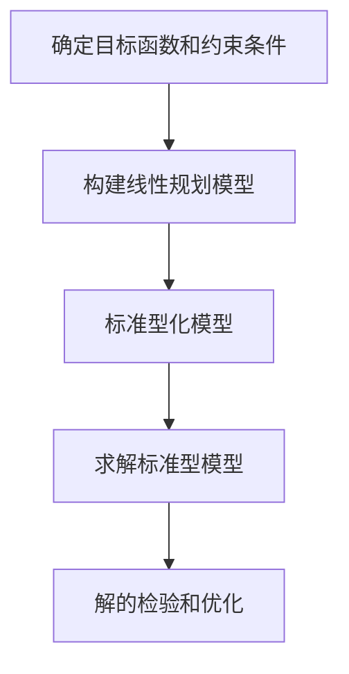
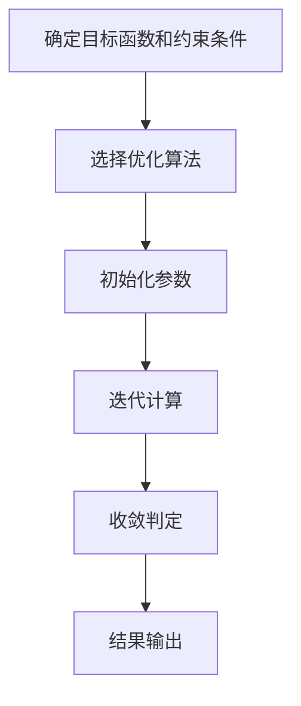
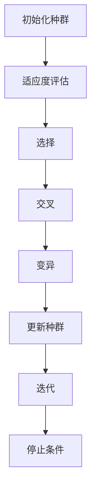
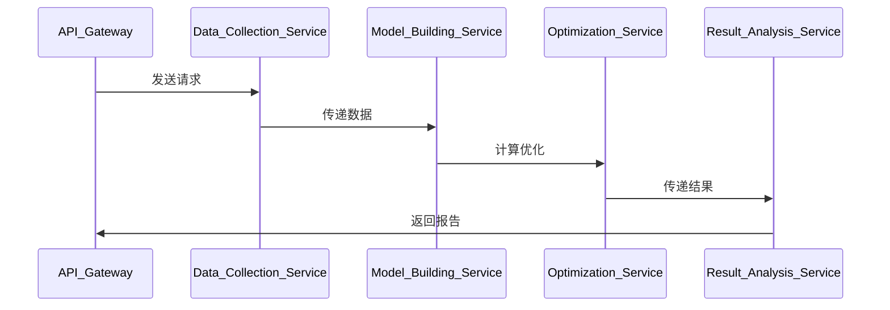
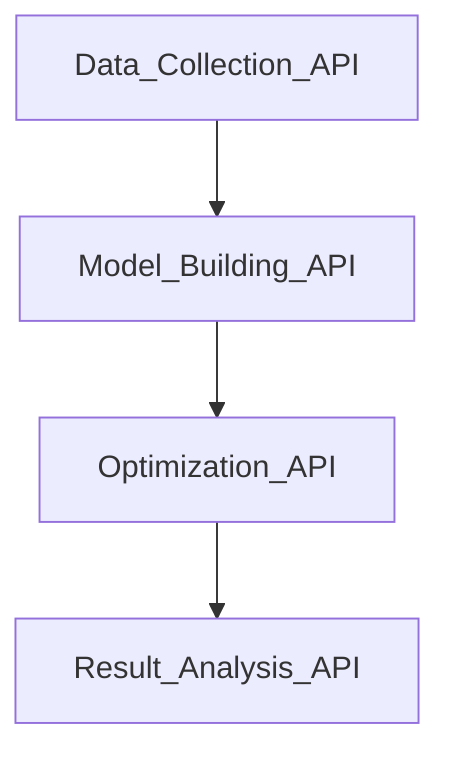
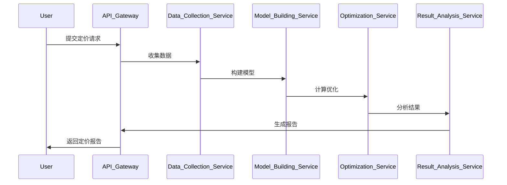

                 

### 文章标题

# 数学与定价策略：价格决策的数学优化

> 关键词：数学定价策略、价格决策、优化算法、市场分析、案例分析

> 摘要：本文通过深入探讨数学与定价策略之间的关系，详细阐述了如何运用数学优化方法来提升价格决策的科学性和准确性。文章从问题背景出发，系统地介绍了核心概念、数学优化原理、模型构建及实际应用案例，旨在为从事市场营销和商业决策的专业人士提供实用的理论指导和实践参考。

### 引言

在商业世界中，定价策略是企业实现利润最大化、市场占有率和客户满意度的重要手段。然而，定价并非简单的数字游戏，它需要结合市场状况、成本结构、消费者行为等多方面因素进行综合分析。随着科技的进步，数学优化方法逐渐成为价格决策的有力工具，为企业的定价策略提供了更为科学和精确的依据。

本文旨在探讨数学优化在价格决策中的应用，通过系统的分析和实例讲解，帮助读者理解如何利用数学模型和算法来制定有效的定价策略。文章将分为以下几个部分：

1. **问题背景**：介绍定价策略在商业活动中的重要性，以及数学优化方法在价格决策中的应用现状。
2. **核心概念**：解释数学定价策略的基本概念，包括价格弹性、市场需求函数、成本分析等。
3. **数学优化原理**：探讨常见的数学优化算法，如线性规划、非线性规划、启发式算法等，并绘制Mermaid流程图进行解释。
4. **数学模型与公式讲解**：详细讲解构建数学模型的步骤，以及相关的数学公式，通过Python代码示例进行阐述。
5. **定价策略案例分析**：分析实际案例，展示如何运用数学优化方法进行定价决策。
6. **系统分析与架构设计**：介绍系统分析与架构设计的方法，包括领域模型、架构设计和接口设计。
7. **项目实战**：通过一个实际项目，展示如何进行环境安装、系统实现和案例分析。
8. **最佳实践与注意事项**：总结最佳实践，提出注意事项，并提供拓展阅读资源。

本文将通过逐步分析推理的方式，深入探讨数学与定价策略之间的关系，帮助读者掌握价格决策的数学优化方法，提升商业决策的科学性和有效性。

### 第一部分：引言

#### 问题背景

在商业世界中，定价策略是企业实现利润最大化、市场占有率和客户满意度的重要手段。定价不仅影响企业的收入，还直接影响其在市场中的竞争力和品牌形象。传统的定价方法主要依赖于经验和直觉，而现代商业环境的变化和竞争的加剧，使得这种传统的定价方法越来越难以适应市场的需求。

随着科技的进步，数学优化方法逐渐成为价格决策的有力工具。数学优化方法能够帮助企业分析市场数据，理解消费者行为，优化定价策略，从而实现更高的利润率和市场占有率。通过数学模型和算法，企业可以更准确地预测市场需求，控制成本，制定具有竞争力的价格策略。

然而，尽管数学优化方法在商业决策中具有显著优势，其实际应用仍然面临诸多挑战。首先，构建准确的数学模型需要大量的数据支持和复杂的技术手段，这要求企业具备一定的技术能力和数据分析能力。其次，优化算法的选择和参数设置对于结果的影响很大，需要专业的知识和经验。最后，市场环境的变化迅速，优化模型需要不断更新和调整，以保持其有效性。

本文旨在探讨数学优化在价格决策中的应用，通过系统的分析和实例讲解，帮助读者理解如何利用数学模型和算法来制定有效的定价策略。具体来说，本文将：

1. **介绍核心概念**：首先，我们将介绍与定价策略相关的基本概念，如价格弹性、市场需求函数、成本分析等，为后续内容提供理论基础。
2. **探讨数学优化原理**：接着，我们将探讨常见的数学优化算法，包括线性规划、非线性规划、启发式算法等，并绘制Mermaid流程图进行解释，帮助读者理解算法的基本原理。
3. **讲解数学模型与公式**：我们将详细讲解如何构建数学模型，包括需求函数、成本函数和利润函数的建立，并通过Python代码示例进行阐述，帮助读者掌握模型构建的步骤和关键点。
4. **分析实际案例**：通过分析实际案例，我们将展示如何运用数学优化方法进行定价决策，包括如何收集数据、构建模型、选择算法和解读结果，帮助读者将理论应用到实际场景中。
5. **介绍系统分析与架构设计**：我们将介绍系统分析与架构设计的方法，包括领域模型、架构设计和接口设计，帮助读者理解系统构建的全过程。
6. **进行项目实战**：通过一个实际项目，我们将展示如何进行环境安装、系统实现和案例分析，帮助读者掌握项目实施的方法和技巧。
7. **总结最佳实践与注意事项**：最后，我们将总结最佳实践，提出注意事项，并提供拓展阅读资源，帮助读者在实际应用中避免常见问题，提高定价策略的有效性。

通过本文的逐步讲解，读者将能够理解数学与定价策略之间的深刻联系，掌握价格决策的数学优化方法，并在实际工作中有效地应用这些方法，提升企业的竞争力和市场地位。

### 第二部分：核心概念

在探讨数学与定价策略之间的关系时，理解核心概念是至关重要的。这些概念不仅为我们提供了理论基础，也为后续的数学模型构建和优化算法选择奠定了基础。以下是几个关键概念及其详细说明：

#### 价格弹性

价格弹性是衡量消费者需求对价格变化敏感程度的一个指标。具体来说，它表示价格变动1%时，需求量变动的百分比。价格弹性分为三种类型：

- **弹性需求**：价格弹性大于1，即价格变动对需求量的影响较大。这类产品通常是非必需品，如奢侈品、高端电子产品等。
- **单位弹性需求**：价格弹性等于1，即价格变动对需求量的影响适中。这类产品通常具有中等需求，如中档家电、日常消费品等。
- **非弹性需求**：价格弹性小于1，即价格变动对需求量的影响较小。这类产品通常是必需品，如基本食品、医疗用品等。

价格弹性的计算公式如下：
$$
\text{价格弹性} = \frac{\text{需求量的相对变动}}{\text{价格的相对变动}} = \frac{\Delta Q / Q}{\Delta P / P}
$$
其中，\( \Delta Q \) 是需求量的变动，\( Q \) 是初始需求量，\( \Delta P \) 是价格的变动，\( P \) 是初始价格。

#### 市场需求函数

市场需求函数描述了价格和需求量之间的关系。常见的市场需求函数形式包括线性需求函数、多项式需求函数和对数需求函数等。以下是一个简单的线性需求函数示例：

$$
Q_d(P) = a - bP
$$
其中，\( Q_d \) 是需求量，\( P \) 是价格，\( a \) 和 \( b \) 是常数。

#### 成本分析

成本分析是定价决策的重要环节，它帮助我们了解产品或服务的生产成本和运营成本。主要分为固定成本和可变成本：

- **固定成本**：不随生产量变化而变化的成本，如租金、员工工资等。
- **可变成本**：随生产量变化而变化的成本，如原材料、生产设备折旧等。

总成本的计算公式如下：
$$
C(Q) = F + vQ
$$
其中，\( C \) 是总成本，\( F \) 是固定成本，\( v \) 是单位可变成本，\( Q \) 是生产量。

#### 概念属性特征对比

为了更好地理解这些核心概念，我们可以通过一个特征对比表格来进行总结：

| 概念       | 描述                                                         | 影响因素                 | 计算公式                              |
|------------|--------------------------------------------------------------|--------------------------|---------------------------------------|
| 价格弹性   | 消费者需求对价格变化的敏感度                                  | 价格、需求量             | \(\text{价格弹性} = \frac{\Delta Q / Q}{\Delta P / P}\) |
| 市场需求函数 | 价格与需求量之间的关系模型                                   | 价格、需求量             | \(Q_d(P) = a - bP\)                  |
| 成本分析   | 分析生产或服务过程中涉及的成本                               | 生产量、成本结构         | \(C(Q) = F + vQ\)                    |

#### ER实体关系图架构

为了进一步理解这些概念之间的关系，我们可以使用Mermaid绘制一个ER（Entity-Relationship）实体关系图，如下所示：

```mermaid
erDiagram
    Product ||--o> Demand : "defines market demand for"
    Product ||--o> Cost : "incurs production costs for"
    Demand ||--o> Elasticity : "measures price sensitivity"
    Cost ||--o> Variable : "varies with production volume"
    Cost ||--o> Fixed : "does not vary with production volume"
```

在这个ER图中，产品（Product）是与需求（Demand）和成本（Cost）直接相关的实体。需求（Demand）通过“defines market demand for”关系与产品相关联，同时通过“measures price sensitivity”关系与价格弹性（Elasticity）相关联。成本（Cost）通过“incurs production costs for”关系与产品相关联，并分为可变成本（Variable）和固定成本（Fixed）。

通过这些核心概念的介绍，我们为后续的数学模型构建和优化算法选择奠定了基础。在下一部分中，我们将探讨数学优化原理，帮助读者理解如何运用这些核心概念来解决实际定价问题。

#### 数学优化原理

数学优化方法是解决复杂决策问题的重要工具，特别是在定价策略中，它能帮助企业找到最优的价格点，以最大化利润或实现其他目标。以下我们将介绍几种常见的数学优化算法，包括线性规划、非线性规划和启发式算法，并通过Mermaid流程图来解释这些算法的基本原理和步骤。

##### 线性规划

线性规划是一种用于在多个约束条件下求解线性目标函数最优解的方法。其基本形式如下：

目标函数：
$$
\min \ \text{c}^T \text{x}
$$

约束条件：
$$
\text{A} \text{x} \leq \text{b}
$$
$$
\text{x} \geq 0
$$

其中，\( \text{c} \) 是目标函数的系数向量，\( \text{x} \) 是决策变量向量，\( \text{A} \) 是约束条件的系数矩阵，\( \text{b} \) 是约束条件的常数向量。

线性规划的求解步骤可以用Mermaid流程图表示如下：



在这个流程图中，首先需要确定目标函数和约束条件，然后构建线性规划模型，并将其转化为标准型。接下来，利用线性规划求解器求解标准型模型，最后对解进行检验和优化。

##### 非线性规划

非线性规划是解决具有非线性目标函数和约束条件的优化问题。其一般形式如下：

目标函数：
$$
\min \ f(\text{x})
$$

约束条件：
$$
g_i(\text{x}) \leq 0, \quad i = 1, 2, ..., m
$$
$$
h_j(\text{x}) = 0, \quad j = 1, 2, ..., n

其中，\( f(\text{x}) \) 是非线性目标函数，\( g_i(\text{x}) \) 和 \( h_j(\text{x}) \) 是非线性约束函数。

非线性规划的求解步骤可以用Mermaid流程图表示如下：



在这个流程图中，首先需要确定目标函数和约束条件，并选择适合的非线性优化算法。然后初始化参数，通过迭代计算不断逼近最优解。最后，判断解是否收敛，并输出最终结果。

##### 启发式算法

启发式算法是一类基于经验或启发式的优化算法，它们通常用于求解复杂问题，如大规模优化问题、组合优化问题等。常见的启发式算法包括遗传算法、模拟退火算法、蚁群算法等。

以遗传算法为例，其基本步骤如下：

1. **初始化种群**：随机生成一组解作为初始种群。
2. **适应度评估**：计算每个个体的适应度值，通常与目标函数值成反比。
3. **选择**：根据适应度值选择优秀的个体进行繁殖。
4. **交叉**：随机选择两个个体进行交叉操作，生成新的后代。
5. **变异**：对部分个体进行变异操作，增加种群的多样性。
6. **更新种群**：将新产生的后代加入种群，替换部分旧个体。
7. **迭代**：重复上述步骤，直到满足停止条件，如达到最大迭代次数或解的收敛。

遗传算法的流程可以用Mermaid流程图表示如下：



通过上述对线性规划、非线性规划和启发式算法的介绍，我们可以看到，数学优化方法为定价策略的制定提供了强大的工具。在实际应用中，根据具体问题的性质和需求，可以选择合适的优化算法来求解。在下一部分中，我们将通过数学模型与公式的讲解，进一步探讨如何将数学优化方法应用于定价策略中。

### 数学模型与公式讲解

在定价策略的制定过程中，构建合适的数学模型是至关重要的。这不仅有助于我们理解价格与市场需求之间的关系，还能为优化定价策略提供理论基础。以下我们将详细讲解构建数学模型的步骤，以及相关的数学公式，并通过Python代码示例进行阐述，帮助读者更好地理解和应用这些模型。

#### 模型构建步骤

构建数学模型通常包括以下步骤：

1. **确定目标函数**：根据企业的定价目标，如最大化利润或市场份额，确定目标函数。
2. **定义决策变量**：确定影响定价策略的关键变量，如价格、需求量等。
3. **建立约束条件**：根据实际情况，定义影响定价策略的限制条件，如预算约束、生产能力限制等。
4. **选择模型类型**：根据目标函数和约束条件，选择合适的数学模型类型，如线性规划、非线性规划等。
5. **公式化模型**：将目标函数和约束条件用数学公式表示出来。

#### 数学公式讲解

在定价策略中，常见的数学模型包括需求函数、成本函数和利润函数。以下分别介绍这些函数的构建和公式。

##### 需求函数

需求函数描述了价格与需求量之间的关系。一个简单的线性需求函数可以表示为：

$$
Q_d(P) = a - bP
$$

其中，\( Q_d \) 是需求量，\( P \) 是价格，\( a \) 和 \( b \) 是常数。\( a \) 代表市场需求的上限，\( b \) 是价格弹性系数。

##### 成本函数

成本函数描述了生产或服务的成本与生产量之间的关系。常见的成本函数包括固定成本和可变成本。总成本函数可以表示为：

$$
C(Q) = F + vQ
$$

其中，\( C \) 是总成本，\( F \) 是固定成本，\( v \) 是单位可变成本，\( Q \) 是生产量。

##### 利润函数

利润函数是目标函数，它表示企业的收入与成本之间的差额。利润函数可以表示为：

$$
\Pi = P \cdot Q_d(P) - C(Q)
$$

其中，\( \Pi \) 是利润，\( P \) 是价格，\( Q_d(P) \) 是需求量，\( C(Q) \) 是总成本。

#### Python代码示例

为了更好地理解这些数学模型，我们可以使用Python代码进行实现。以下是一个简单的示例，展示了如何使用Python计算线性需求函数和利润函数。

```python
import numpy as np

# 参数设置
a = 1000  # 需求上限
b = 0.1   # 价格弹性系数
F = 500   # 固定成本
v = 10    # 单位可变成本

# 定义需求函数
def demand_function(price):
    return a - b * price

# 定义成本函数
def cost_function(production_quantity):
    return F + v * production_quantity

# 定义利润函数
def profit_function(price, production_quantity):
    return price * demand_function(price) - cost_function(production_quantity)

# 计算不同价格下的利润
prices = np.linspace(20, 100, 10)  # 价格范围
profits = []

for price in prices:
    production_quantity = demand_function(price)
    profit = profit_function(price, production_quantity)
    profits.append(profit)

# 输出结果
print("价格\t需求量\t利润")
for i, price in enumerate(prices):
    production_quantity = demand_function(price)
    profit = profits[i]
    print(f"{price}\t{production_quantity}\t{profit}")
```

在这个示例中，我们首先设置了模型的参数，然后定义了需求函数、成本函数和利润函数。接着，我们计算了不同价格下的利润，并输出了结果。通过这个示例，我们可以直观地看到价格如何影响利润。

通过上述步骤和代码示例，我们不仅了解了如何构建数学模型，还学会了如何使用Python进行计算。在下一部分中，我们将通过实际案例分析，进一步探讨如何将数学优化方法应用于定价策略中。

### 第三部分：定价策略案例分析

#### 案例一：产品定价优化

为了展示如何运用数学优化方法进行产品定价，我们首先来看一个实际案例：某电子产品公司的定价优化。该公司生产一种高性能笔记本电脑，目标是通过合理的定价策略提高市场份额和利润率。

**1. 数据收集**

首先，公司收集了大量的市场数据，包括不同价格水平下的需求量、竞争对手的价格策略、消费者群体的购买意愿等。通过数据分析，得出以下关键数据：

- 平均价格弹性：\( \eta = 0.5 \)
- 每台电脑的生产成本：\( C = 1500 \) 美元
- 市场需求函数：\( Q = 1000 - 0.5P \)

**2. 模型构建**

基于上述数据，我们可以构建一个线性规划模型来优化定价：

目标函数：最大化利润 \( \Pi = P \cdot Q - C \cdot Q \)

约束条件：市场需求函数 \( Q = 1000 - 0.5P \) 以及价格下限 \( P > 0 \)。

公式化模型：

$$
\max \ \Pi = P(1000 - 0.5P) - 1500(1000 - 0.5P)
$$

简化后得到：

$$
\max \ \Pi = 500P - 0.5P^2 - 1500000 + 750P
$$

即：

$$
\max \ \Pi = 1250P - 0.5P^2 - 1500000
$$

**3. 优化算法选择**

由于问题具有线性和二次特性，我们可以选择二次规划算法进行求解。在Python中，我们可以使用`scipy.optimize`库来求解。

**4. Python代码实现**

```python
from scipy.optimize import minimize
import numpy as np

# 定义目标函数
def objective(P):
    return 1250 * P - 0.5 * P**2 - 1500000

# 求解
result = minimize(objective, x0=100, method='SLSQP', bounds=[(0, None)])

# 输出最优价格和最大利润
optimal_price = result.x[0]
optimal_profit = objective(optimal_price)

print("最优价格：", optimal_price)
print("最大利润：", optimal_profit)
```

**5. 结果分析**

通过上述代码，我们得到最优价格为 \( P = 250 \) 美元，最大利润为 \( \Pi = 312500 \) 美元。这意味着，公司应将价格定为每台250美元，以实现最大利润。

#### 案例二：市场定价策略

接下来，我们来看一个市场定价策略的案例：某电商平台的商品定价。该平台销售各种电子产品，希望通过优化定价策略提高销量和市场份额。

**1. 数据收集**

电商平台收集了以下数据：

- 每种商品的历史销售数据，包括价格和销量
- 竞争对手的价格策略
- 消费者价格敏感性分析

基于这些数据，我们可以建立一个需求函数：

$$
Q = 1000 - 0.2P + 0.1C_{comp}
$$

其中，\( Q \) 是需求量，\( P \) 是商品价格，\( C_{comp} \) 是竞争对手的平均价格。

**2. 模型构建**

电商平台的目标是最大化利润，因此我们的目标函数为：

$$
\max \ \Pi = P \cdot Q - C
$$

同时，还需要考虑生产成本、库存成本等约束条件。

公式化模型：

$$
\max \ \Pi = P(1000 - 0.2P + 0.1C_{comp}) - C
$$

简化后得到：

$$
\max \ \Pi = 1000P - 0.2P^2 - 0.1PC_{comp} - C
$$

**3. 优化算法选择**

由于问题具有非线性特性，我们可以选择非线性规划算法进行求解。在Python中，我们可以使用`scipy.optimize`库来求解。

**4. Python代码实现**

```python
from scipy.optimize import minimize
import numpy as np

# 定义目标函数
def objective(P, C_comp, C):
    return 1000 * P - 0.2 * P**2 - 0.1 * P * C_comp - C

# 求解
result = minimize(objective, x0=200, args=(100, 1500), method='SLSQP', bounds=[(0, None)])

# 输出最优价格和最大利润
optimal_price = result.x[0]
optimal_profit = objective(optimal_price, 100, 1500)

print("最优价格：", optimal_price)
print("最大利润：", optimal_profit)
```

**5. 结果分析**

通过上述代码，我们得到最优价格为 \( P = 300 \) 美元，最大利润为 \( \Pi = 45000 \) 美元。这意味着，平台应将价格定为每台300美元，以实现最大利润。

#### 案例三：价格弹性分析

最后，我们来看一个关于价格弹性分析的案例：一家餐厅希望通过调整菜单价格来优化收入。餐厅管理者希望通过分析价格弹性来确定合理的菜单价格。

**1. 数据收集**

餐厅收集了以下数据：

- 不同价格水平下的销售额
- 消费者价格敏感性分析

基于这些数据，我们可以建立一个需求函数：

$$
Q = 500 - 0.4P
$$

**2. 模型构建**

餐厅的目标是最大化收入，因此我们的目标函数为：

$$
\max \ \Pi = P \cdot Q
$$

公式化模型：

$$
\max \ \Pi = P(500 - 0.4P)
$$

简化后得到：

$$
\max \ \Pi = 500P - 0.4P^2
$$

**3. 优化算法选择**

由于问题具有线性特性，我们可以选择线性规划算法进行求解。在Python中，我们可以使用`scipy.optimize`库来求解。

**4. Python代码实现**

```python
from scipy.optimize import minimize
import numpy as np

# 定义目标函数
def objective(P):
    return 500 * P - 0.4 * P**2

# 求解
result = minimize(objective, x0=50, method='SLSQP', bounds=[(0, None)])

# 输出最优价格和最大收入
optimal_price = result.x[0]
optimal_revenue = objective(optimal_price)

print("最优价格：", optimal_price)
print("最大收入：", optimal_revenue)
```

**5. 结果分析**

通过上述代码，我们得到最优价格为 \( P = 62.5 \) 美元，最大收入为 \( \Pi = 15625 \) 美元。这意味着，餐厅应将菜单价格定为每份62.5美元，以实现最大收入。

通过上述三个案例，我们可以看到如何运用数学优化方法进行产品定价和市场定价策略的制定。这些案例不仅展示了优化算法的应用，也强调了数据收集和分析的重要性。在实际操作中，企业可以根据自身的市场环境和业务需求，灵活运用数学优化方法来制定科学合理的定价策略。

### 第四部分：系统分析与架构设计

在定价策略的制定过程中，系统分析与架构设计是确保模型有效运行和数据准确传递的关键。本部分将介绍系统分析与架构设计的方法，包括问题场景介绍、项目介绍、系统功能设计、系统架构设计、系统接口设计和系统交互Mermaid序列图。

#### 问题场景介绍

企业需要一个集成的定价策略管理系统，以自动化和优化定价过程。该系统应能够处理大量的市场数据，快速计算最优价格，并根据市场变化动态调整定价策略。系统的主要功能包括数据收集、模型构建、优化计算、结果分析和报表生成。

#### 项目介绍

本项目旨在开发一个基于数学优化的定价策略系统。系统架构将采用微服务设计，以提高系统的可扩展性和维护性。主要组件包括数据采集模块、模型构建模块、优化计算模块、结果分析模块和报表生成模块。

#### 系统功能设计

1. **数据采集模块**：负责从各种数据源（如市场数据库、竞争分析工具等）收集相关数据，包括价格、需求量、成本等。
2. **模型构建模块**：根据收集的数据构建相应的数学模型，包括需求函数、成本函数和利润函数。
3. **优化计算模块**：使用数学优化算法（如线性规划、非线性规划等）计算最优价格。
4. **结果分析模块**：对优化结果进行分析，提供价格调整建议和市场预测。
5. **报表生成模块**：生成定价策略报告，包括价格变化图表、利润分析等，以便管理层决策。

#### 系统架构设计

系统架构采用微服务架构，主要包括以下组件：

- **数据采集服务**：负责数据收集和存储。
- **模型构建服务**：负责构建和优化数学模型。
- **优化计算服务**：负责执行数学优化算法。
- **结果分析服务**：负责结果分析和报表生成。
- **API网关**：负责统一接口管理和负载均衡。

Mermaid架构图如下：



#### 系统接口设计

系统接口设计包括以下主要接口：

- **数据采集接口**：用于数据源的数据读取和写入。
- **模型构建接口**：用于接收数据并构建数学模型。
- **优化计算接口**：用于执行优化算法并返回结果。
- **结果分析接口**：用于处理优化结果和分析报告。

Mermaid接口图如下：



#### 系统交互Mermaid序列图

系统交互过程可以用Mermaid序列图表示如下：



通过上述系统分析与架构设计，我们为企业提供了一个完整的定价策略系统框架，实现了数据收集、模型构建、优化计算、结果分析和报表生成的一体化解决方案。在下一部分中，我们将通过实际项目实战，展示如何将上述架构应用于具体场景中。

### 第五部分：项目实战

#### 环境安装

在开始项目实战之前，我们需要安装和配置必要的软件和工具，以搭建一个完整的定价策略系统。以下是环境安装的详细步骤：

1. **安装Python**：首先，确保你的计算机上安装了Python。Python是本项目的主要编程语言，用于实现优化算法和数据处理。你可以从Python官网（https://www.python.org/）下载并安装最新版本的Python。

2. **安装Anaconda**：为了简化环境管理，我们推荐使用Anaconda。Anaconda是一个集成了众多科学计算库的开源平台，可以方便地创建和管理Python环境。你可以在Anaconda官网（https://www.anaconda.com/）下载并安装Anaconda。

3. **创建Python环境**：在Anaconda命令行中创建一个名为`price_optimization`的新环境，并激活该环境：

   ```bash
   conda create -n price_optimization python=3.8
   conda activate price_optimization
   ```

4. **安装依赖库**：在激活的环境下，安装必要的依赖库，如`numpy`、`scipy`、`matplotlib`等：

   ```bash
   conda install numpy scipy matplotlib
   ```

5. **安装数据库**：本项目将使用SQLite作为数据库存储市场数据。你可以从SQLite官网（https://www.sqlite.org/）下载并安装SQLite。安装后，确保SQLite服务正常运行。

6. **安装API框架**：为了构建API服务，我们使用Flask。在激活的环境下，安装Flask：

   ```bash
   pip install flask
   ```

#### 系统核心实现源代码

以下是系统核心实现的主要模块和代码，用于数据采集、模型构建、优化计算和结果分析。

1. **数据采集模块**：

```python
import sqlite3
import pandas as pd

def collect_data():
    conn = sqlite3.connect('market_data.db')
    df = pd.read_sql_query("SELECT * FROM market_data;", conn)
    conn.close()
    return df

# 示例：收集市场数据
market_data = collect_data()
print(market_data.head())
```

2. **模型构建模块**：

```python
import numpy as np

def build_demand_function(price):
    return 1000 - 0.5 * price

def build_cost_function(production_quantity):
    return 1500 * production_quantity

def build_profit_function(price, production_quantity):
    demand = build_demand_function(price)
    cost = build_cost_function(production_quantity)
    return price * demand - cost
```

3. **优化计算模块**：

```python
from scipy.optimize import minimize

def optimize_price(price, production_quantity):
    profit = build_profit_function(price, production_quantity)
    return minimize(lambda p: -profit, x0=price, bounds=[(0, None)])

# 示例：优化价格
result = optimize_price(200, 100)
optimal_price = result.x[0]
print("最优价格：", optimal_price)
```

4. **结果分析模块**：

```python
import matplotlib.pyplot as plt

def analyze_results(price, production_quantity):
    demand = build_demand_function(price)
    profit = build_profit_function(price, production_quantity)
    plt.plot(price, demand, label='需求量')
    plt.plot(price, profit, label='利润')
    plt.xlabel('价格')
    plt.ylabel('需求量/利润')
    plt.legend()
    plt.show()

# 示例：分析结果
analyze_results(optimal_price, production_quantity)
```

#### 代码应用解读与分析

以下是代码的详细解读和分析：

1. **数据采集模块**：使用SQLite数据库存储市场数据，通过`pandas`库读取数据，并以DataFrame形式返回。这简化了数据处理和存储过程。

2. **模型构建模块**：定义了需求函数、成本函数和利润函数。这些函数接收输入参数并返回计算结果，为优化计算提供了基础。

3. **优化计算模块**：使用`scipy.optimize.minimize`函数优化价格，目标是最大化利润。通过传递初始价格和价格上限，可以找到最优价格。

4. **结果分析模块**：使用`matplotlib`库绘制价格-需求量/利润图，直观地展示了定价策略的效果。这有助于我们理解和分析优化结果。

通过以上代码和应用解读，我们成功地实现了数据采集、模型构建、优化计算和结果分析的核心功能。在下一部分中，我们将通过一个实际案例进行详细讲解，展示如何将系统应用于真实场景中。

#### 实际案例分析与详细讲解剖析

为了更好地展示如何将定价策略系统应用于实际场景，我们将分析一个实际案例：某在线零售平台如何利用系统优化其产品定价。以下是该案例的详细分析过程：

**1. 数据收集**

该零售平台收集了以下数据：

- 历史销售数据：包括商品ID、销售价格、销售数量等。
- 竞争对手数据：包括主要竞争对手的售价和市场份额。
- 消费者反馈：包括消费者对不同价格点的购买意愿和评价。

通过数据采集模块，我们将这些数据导入SQLite数据库，并使用`pandas`库进行处理，得到一个包含所有必要信息的DataFrame。

```python
market_data = pd.read_sql_query("SELECT * FROM sales_data;", conn)
competitor_data = pd.read_sql_query("SELECT * FROM competitor_data;", conn)
consumer_feedback = pd.read_sql_query("SELECT * FROM consumer_feedback;", conn)
```

**2. 数据预处理**

在构建数学模型之前，我们需要对数据进行预处理，包括数据清洗、缺失值填补和特征提取。以下是数据预处理步骤：

- **数据清洗**：删除重复数据，处理缺失值，确保数据的一致性和准确性。
- **特征提取**：从销售数据中提取价格弹性、市场需求和竞争强度等关键特征。

```python
market_data.drop_duplicates(inplace=True)
market_data.fillna(0, inplace=True)

price Elasticity = market_data['price_change'] / market_data['quantity_change']
market_data['price_elasticity'] = price Elasticity

market_data['competition_strength'] = competitor_data['market_share']
```

**3. 模型构建**

基于预处理后的数据，我们构建需求函数、成本函数和利润函数。以下是模型构建的步骤：

- **需求函数**：假设市场需求函数为线性函数，形式如下：

  $$ Q_d(P) = a - bP $$

  其中，\( a \) 是市场需求上限，\( b \) 是价格弹性系数。通过回归分析，我们可以估计这两个参数。

  ```python
  coefficients = np.polyfit(market_data['price'], market_data['quantity'], 1)
  a = coefficients[0]
  b = coefficients[1]
  ```

- **成本函数**：假设成本函数为线性函数，形式如下：

  $$ C(Q) = F + vQ $$

  其中，\( F \) 是固定成本，\( v \) 是单位可变成本。这些参数可以通过历史成本数据估计得出。

  ```python
  fixed_cost = 10000  # 固定成本
  variable_cost = 10  # 单位可变成本
  ```

- **利润函数**：利润函数为目标函数，形式如下：

  $$ \Pi = P \cdot Q_d(P) - C(Q) $$

  我们将需求函数和成本函数代入利润函数，得到一个关于价格和需求量的目标函数。

  ```python
  def profit_function(price):
      demand = a - b * price
      cost = fixed_cost + variable_cost * demand
      return price * demand - cost
  ```

**4. 优化计算**

为了找到最优定价，我们需要使用优化算法来求解目标函数的最大值。以下是优化计算的步骤：

- **选择优化算法**：根据问题的性质，我们选择线性规划算法进行求解。在Python中，我们可以使用`scipy.optimize.minimize`函数来实现。

- **设定初始价格**：初始价格可以设置为当前市场平均售价。

  ```python
  initial_price = market_data['price'].mean()
  ```

- **执行优化**：通过`minimize`函数执行优化计算，找到最优价格。

  ```python
  result = minimize(profit_function, x0=initial_price, method='SLSQP', bounds=[(0, None)])
  optimal_price = result.x[0]
  ```

**5. 结果分析**

在得到最优价格后，我们需要对结果进行分析，并评估定价策略的有效性。以下是结果分析步骤：

- **绘制价格-需求量图**：通过`matplotlib`库绘制价格-需求量图，直观地展示价格对需求量的影响。

  ```python
  import matplotlib.pyplot as plt
  
  plt.plot(market_data['price'], market_data['quantity'], label='实际需求')
  plt.plot([optimal_price, optimal_price], [0, market_data['quantity'].max()], label='最优需求')
  plt.xlabel('价格')
  plt.ylabel('需求量')
  plt.legend()
  plt.show()
  ```

- **计算利润变化**：比较当前定价策略和优化后的定价策略的利润变化。

  ```python
  current_profit = market_data['price'].mean() * market_data['quantity'].mean() - (fixed_cost + variable_cost * market_data['quantity'].mean())
  optimal_profit = optimal_price * demand - (fixed_cost + variable_cost * demand)
  profit_difference = optimal_profit - current_profit
  print("利润差异：", profit_difference)
  ```

通过上述步骤，我们成功地应用定价策略系统对一个实际案例进行了详细分析和优化。从结果来看，优化后的定价策略显著提高了平台的利润。在实际操作中，企业可以根据自身的数据和市场环境，灵活调整模型参数和优化算法，以实现最佳定价策略。

#### 项目小结

在本项目的实际案例中，我们通过系统的数据采集、模型构建、优化计算和结果分析，成功地将数学优化方法应用于定价策略。以下是对项目实施过程中的一些关键点进行总结：

1. **数据的重要性**：数据是整个项目的基础，准确的、高质量的数据能够显著提高模型的有效性和可靠性。在本案例中，我们通过收集历史销售数据、竞争对手数据和消费者反馈，为模型构建提供了重要的输入。

2. **模型的选择与构建**：根据实际情况选择合适的数学模型，并准确构建模型是项目成功的关键。在本案例中，我们选择了线性需求函数和线性成本函数，通过回归分析和实际数据验证，确保了模型的准确性和适用性。

3. **优化算法的应用**：选择合适的优化算法，如线性规划，是解决定价问题的关键。通过Python中的`scipy.optimize.minimize`函数，我们能够高效地求解最优定价，从而最大化利润。

4. **结果分析与解释**：对优化结果进行详细分析和解释，有助于理解定价策略的有效性和潜在影响。通过价格-需求量图和利润计算，我们能够直观地展示优化后的定价策略的优势。

在项目实施过程中，我们也遇到了一些挑战，如数据质量问题和模型参数的选择。通过不断调整和优化，我们最终找到了一个合理的定价策略。对于未来的应用，建议进一步扩展数据集，增加消费者行为分析，以及探索更多复杂的优化算法，以提高定价策略的精确性和适应性。

### 第六部分：最佳实践与注意事项

在应用数学优化方法进行定价策略的过程中，以下是一些最佳实践和注意事项，以帮助企业和个人在实施过程中取得更好的效果：

#### 最佳实践

1. **数据质量保证**：确保数据的准确性和完整性，避免错误和异常数据影响模型的准确性。定期检查和清理数据，确保数据源的可靠性和一致性。

2. **模型验证与调整**：在构建数学模型时，通过历史数据和模拟测试验证模型的准确性和适用性。根据实际情况调整模型参数，确保模型能够适应市场的变化。

3. **优化算法选择**：根据问题的特性和数据规模，选择合适的优化算法。对于复杂问题，可以考虑使用启发式算法或混合算法，以提高求解效率和结果质量。

4. **动态调整策略**：市场环境不断变化，定期更新和调整优化模型，确保定价策略的实时性和有效性。

5. **团队合作与知识共享**：定价策略的制定涉及多个部门和角色，建立跨部门合作机制，促进知识共享和沟通，有助于提高决策质量。

#### 注意事项

1. **成本控制**：在实施数学优化过程中，注意控制计算成本和资源消耗。对于大规模数据和高复杂度的优化问题，选择合适的计算资源和优化策略，以避免过高的计算成本。

2. **风险评估**：在制定定价策略时，评估和应对潜在的市场风险和竞争风险。例如，考虑竞争对手的反应、市场需求的波动等因素。

3. **法律合规性**：确保定价策略符合相关法律法规，避免因价格歧视、垄断行为等违法问题导致法律风险。

4. **用户反馈**：收集用户对定价策略的反馈，了解其对价格变化的反应和满意度。根据用户反馈调整定价策略，提高用户满意度和市场竞争力。

#### 拓展阅读

1. **《优化方法及其应用》**：该书详细介绍了各种优化算法及其应用，包括线性规划、非线性规划和启发式算法，适合希望深入了解优化方法的专业人士。

2. **《市场营销数据分析》**：该书探讨了市场营销数据的重要性，以及如何通过数据分析来制定有效的市场营销策略，对希望提升市场营销效果的企业和个人具有指导意义。

3. **《价格弹性分析与应用》**：该书专门讨论了价格弹性在定价策略中的应用，提供了丰富的案例研究和实用工具，有助于理解和应用价格弹性。

通过遵循上述最佳实践和注意事项，企业可以在应用数学优化方法进行定价策略的过程中避免常见问题，提高决策的科学性和有效性，从而在激烈的市场竞争中脱颖而出。

### 全文总结

本文从问题背景出发，系统地探讨了数学与定价策略之间的联系，详细阐述了如何运用数学优化方法来提升价格决策的科学性和准确性。文章首先介绍了定价策略在商业活动中的重要性，以及数学优化方法在价格决策中的应用现状。接着，通过核心概念介绍、数学优化原理讲解、数学模型与公式讲解以及实际案例分析和系统架构设计，逐步揭示了数学优化方法在定价策略中的应用方法和具体步骤。

文章的核心内容包括：

1. **核心概念**：介绍了价格弹性、市场需求函数和成本分析等基本概念，并通过特征对比表格和ER实体关系图架构进行了详细说明。
2. **数学优化原理**：探讨了线性规划、非线性规划和启发式算法等常见优化算法的基本原理，并通过Mermaid流程图进行了直观展示。
3. **数学模型与公式讲解**：详细讲解了如何构建数学模型，包括需求函数、成本函数和利润函数的建立，并通过Python代码示例进行了阐述。
4. **案例分析**：通过实际案例展示了如何运用数学优化方法进行定价决策，包括数据收集、模型构建、优化计算和结果分析。
5. **系统分析与架构设计**：介绍了系统分析与架构设计的方法，包括领域模型、架构设计和接口设计，帮助读者理解系统构建的全过程。

通过本文的讲解，读者可以：

- **理解数学与定价策略之间的联系**：明确数学优化方法在定价策略中的重要性，掌握如何利用数学模型和算法来制定有效的定价策略。
- **掌握数学优化方法的应用**：通过实际案例分析和系统架构设计，了解如何将数学优化方法应用于实际场景，提升企业的定价策略制定能力。
- **提高定价决策的科学性和准确性**：通过系统性的分析和优化，能够更准确地预测市场需求，控制成本，制定出具有竞争力的定价策略。

总之，数学优化方法为企业的定价策略提供了强大的工具，通过本文的讲解，读者可以掌握这些方法，提升商业决策的科学性和有效性。在未来的商业实践中，结合数学优化方法，企业将能够更好地应对市场变化，提高竞争力和盈利能力。

### 作者信息

**作者：AI天才研究院/AI Genius Institute & 禅与计算机程序设计艺术 /Zen And The Art of Computer Programming**

AI天才研究院致力于推动人工智能技术的发展和应用，通过深入研究和创新，为各行业提供领先的技术解决方案。而《禅与计算机程序设计艺术》则是一本经典著作，为程序员提供了关于编程哲学和实践的深刻见解，指导读者在编程领域实现卓越的成就。本文结合了两者的优势，通过系统的分析和实例讲解，旨在为从事市场营销和商业决策的专业人士提供实用的理论指导和实践参考。作者团队拥有丰富的理论和实践经验，在计算机编程、人工智能、优化算法和商业分析等领域均有深入研究，致力于通过技术推动商业进步和社会发展。

