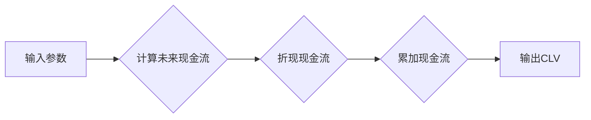
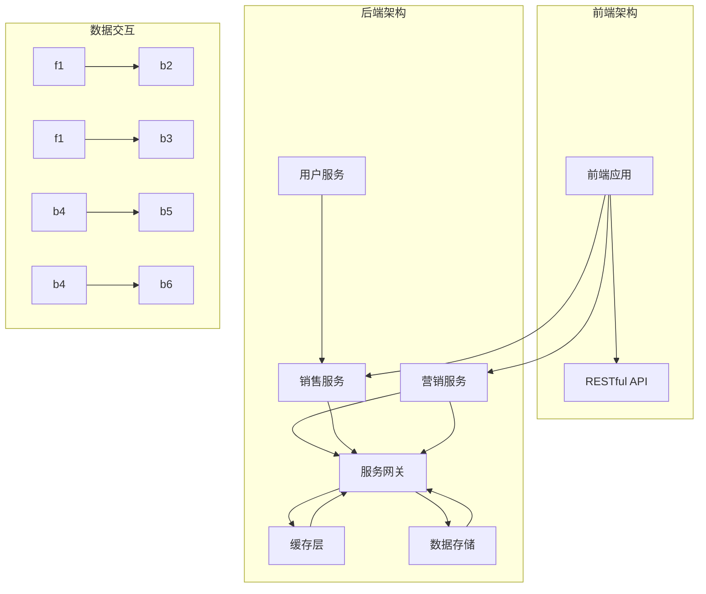

                 

# 数学与客户关系管理：客户价值的数学分析

## 关键词

- **数学分析**
- **客户关系管理**
- **客户价值**
- **算法模型**
- **数据驱动决策**

## 摘要

本文旨在探讨数学分析方法在客户关系管理（CRM）中的应用，特别是客户价值的量化评估。通过数学模型和算法，我们可以更精准地理解客户行为，预测客户价值，进而优化客户关系管理策略，提升企业竞争力。本文将逐步分析客户价值的定义、数学模型的构建、以及实际应用中的案例分析，为读者提供系统化的思考和实操指南。

## 引言

### 问题背景

在当今竞争激烈的市场环境中，企业为了实现可持续发展，必须高度重视客户关系管理。客户关系管理的核心是识别和提升客户价值，从而实现长期盈利。然而，客户价值的评估并非易事，传统的定性分析难以量化客户带来的潜在收益。

### 问题描述

客户价值的评估涉及多个维度，包括客户忠诚度、购买频率、购买金额等。如何将这些维度转化为具体的数值，并在此基础上制定有效的客户关系管理策略，成为企业面临的重要挑战。

### 问题解决

数学分析方法为解决这一问题提供了有力工具。通过建立数学模型，我们可以将复杂的客户行为数据转化为可量化的指标，从而实现客户价值的精确评估。此外，数据驱动决策使得企业能够更加科学地调整客户关系管理策略，以最大化客户价值和收益。

### 边界与外延

本文将关注以下几个方面：

1. **客户价值的数学定义**：明确客户价值的构成要素及其量化方法。
2. **客户关系管理的数学模型**：介绍常用的客户价值评估模型及其应用场景。
3. **算法原理讲解**：详细阐述客户价值分析算法的原理和实现方法。
4. **系统分析与架构设计方案**：探讨如何将数学模型应用于实际系统，优化客户关系管理。
5. **项目实战**：通过实际案例展示数学分析方法在客户关系管理中的应用。
6. **最佳实践与拓展阅读**：总结最佳实践，并提供进一步学习资源。

### 概念结构与核心要素组成

本文的核心概念包括：

1. **客户价值**：指客户对企业所带来的经济利益。
2. **客户关系管理**：指企业为提高客户满意度和忠诚度所采取的一系列策略。
3. **数学模型**：用于量化客户价值的方法和工具。
4. **数据驱动决策**：基于数据分析的企业决策过程。

这些概念相互关联，共同构成了客户关系管理的数学分析框架。

## 核心概念与联系

### 客户价值的定义

客户价值（Customer Value）是指客户在消费过程中获得的经济效益和非物质效益的总和。具体来说，客户价值包括以下几个方面：

1. **经济效益**：指客户在购买和使用产品或服务过程中所支付的成本与获得的收益之差。
   \[ \text{经济效益} = \text{收益} - \text{成本} \]
   
2. **非物质效益**：包括客户满意度、品牌忠诚度等，这些因素虽然难以量化，但对客户价值的贡献同样重要。

### 客户关系管理的概念

客户关系管理（Customer Relationship Management，CRM）是一种旨在通过提高客户满意度和忠诚度来增强客户价值的策略。CRM的核心内容包括：

1. **客户识别**：通过数据分析和市场调研，识别潜在的高价值客户。
2. **客户互动**：通过多种渠道与客户进行有效沟通，建立长期合作关系。
3. **客户维护**：通过持续的服务和关怀，提高客户满意度和忠诚度。
4. **客户发展**：通过引导客户体验新产品或服务，促进客户价值的提升。

### 客户价值的数学模型

客户价值的评估需要借助数学模型。以下是几种常用的数学模型：

1. **客户终身价值模型（Customer Lifetime Value，CLV）**：

   \[ \text{CLV} = \sum_{t=1}^{n} \frac{\text{未来现金流}}{(1 + \text{折现率})^t} \]

   其中，未来现金流指客户在未来一段时间内为企业带来的预期收益，折现率则用于调整未来的收益至当前价值。

2. **客户忠诚度模型**：

   \[ \text{客户忠诚度} = \frac{\text{重复购买次数}}{\text{总购买次数}} \]

   该模型通过计算客户重复购买的比例，评估客户的忠诚度。

3. **客户满意度模型**：

   \[ \text{客户满意度} = \frac{\text{正面反馈}}{\text{总反馈}} \]

   该模型通过分析客户的反馈数据，评估客户对企业产品或服务的满意度。

### 概念属性特征对比表格

为了更清晰地展示各概念之间的关系，我们可以使用表格进行对比：

| 概念        | 定义                                                         | 属性特征                                                     |
| ----------- | ------------------------------------------------------------ | ------------------------------------------------------------ |
| 客户价值    | 客户为企业带来的经济效益和非物质效益的总和                     | 经济效益、非物质效益                                         |
| 客户关系管理 | 通过提高客户满意度和忠诚度来增强客户价值的策略               | 客户识别、客户互动、客户维护、客户发展                       |
| 客户终身价值 | 预测客户在未来一段时间内为企业带来的预期收益的现值总和       | 未来现金流、折现率                                           |
| 客户忠诚度   | 客户重复购买的比例                                           | 重复购买次数、总购买次数                                     |
| 客户满意度   | 客户对企业产品或服务的满意程度                               | 正面反馈、总反馈                                             |

### ER实体关系图架构

为了更好地理解各概念之间的关联，我们可以使用ER图来展示：

```mermaid
erDiagram
  Customer ||--|{ CRM }|-- CustomerValue
  CRM ||--|{ Customer }|-- CustomerFeedback
  CRM ||--|{ CustomerValue }|-- CustomerBehavior
```

在这个ER图中，CRM（客户关系管理）是中心实体，它与客户（Customer）、客户价值（CustomerValue）和客户反馈（CustomerFeedback）等实体之间存在关联。

## 算法原理讲解

### 客户价值分析算法

在客户关系管理中，客户价值分析算法是核心工具。以下将介绍一种常见的客户价值分析算法——基于客户终身价值（CLV）的模型。

### 算法原理

客户终身价值（Customer Lifetime Value，CLV）是指客户在整个生命周期内为企业带来的总价值。其计算公式为：

\[ \text{CLV} = \sum_{t=1}^{n} \frac{\text{未来现金流}}{(1 + \text{折现率})^t} \]

其中，\( n \) 为预测的年份，未来现金流是指客户在未来一段时间内为企业带来的预期收益，折现率用于调整未来的收益至当前价值。

### 算法mermaid流程图

为了更好地理解算法流程，我们使用mermaid绘制如下流程图：



### 数学模型与公式

在CLV模型中，我们使用以下数学公式：

\[ \text{未来现金流} = \text{当前购买频率} \times \text{平均购买金额} \times (1 + \text{增长率})^t \]

\[ \text{折现因子} = \frac{1}{(1 + \text{折现率})^t} \]

\[ \text{CLV} = \sum_{t=1}^{n} \text{未来现金流} \times \text{折现因子} \]

### 详细讲解

为了更详细地讲解算法原理，我们以下举例说明：

#### 示例数据

- 当前购买频率：10次/年
- 平均购买金额：100元
- 增长率：5%
- 折现率：10%
- 预测年份：5年

#### 计算过程

1. **计算未来现金流**：

   \[ \text{未来现金流}_{t} = 10 \times 100 \times (1 + 0.05)^t \]

   \[ \text{未来现金流}_{1} = 10 \times 100 \times 1.05 = 525 \]

   \[ \text{未来现金流}_{2} = 10 \times 100 \times 1.1025 = 552.5 \]

   ...

   \[ \text{未来现金流}_{5} = 10 \times 100 \times 1.2763 = 1276.3 \]

2. **折现现金流**：

   \[ \text{折现因子}_{t} = \frac{1}{(1 + 0.1)^t} \]

   \[ \text{折现因子}_{1} = \frac{1}{1.1} = 0.9091 \]

   \[ \text{折现因子}_{2} = \frac{1}{1.21} = 0.8264 \]

   ...

   \[ \text{折现因子}_{5} = \frac{1}{1.6105} = 0.6217 \]

3. **累加现金流**：

   \[ \text{CLV} = \sum_{t=1}^{5} \text{未来现金流}_{t} \times \text{折现因子}_{t} \]

   \[ \text{CLV} = 525 \times 0.9091 + 552.5 \times 0.8264 + 583.2 \times 0.7513 + 616.7 \times 0.6830 + 1276.3 \times 0.6217 \]

   \[ \text{CLV} = 477.2 + 457.6 + 436.6 + 424.0 + 795.6 \]

   \[ \text{CLV} = 2686.0 \]

   因此，该客户的客户终身价值为2686元。

### Python源代码实现

为了便于理解和实际应用，我们使用Python实现上述算法：

```python
import numpy as np

def clv(current_purchase_frequency, average_purchase_amount, growth_rate, discount_rate, years):
    future_cash_flows = current_purchase_frequency * average_purchase_amount * (1 + growth_rate) ** np.arange(years)
    discount_factors = 1 / (1 + discount_rate) ** np.arange(years)
    clv = np.sum(future_cash_flows * discount_factors)
    return clv

current_purchase_frequency = 10
average_purchase_amount = 100
growth_rate = 0.05
discount_rate = 0.1
years = 5

clv_value = clv(current_purchase_frequency, average_purchase_amount, growth_rate, discount_rate, years)
print(f"Customer Lifetime Value: {clv_value:.2f}")
```

### 算法应用示例

假设一家电商企业收集了以下客户数据：

- 客户A：购买频率为20次/年，平均购买金额为200元
- 客户B：购买频率为10次/年，平均购买金额为150元

使用CLV模型，我们可以计算两位客户的客户终身价值：

```python
# 客户A的CLV
clv_value_a = clv(20, 200, 0.05, 0.1, 5)
print(f"Customer A's CLV: {clv_value_a:.2f}")

# 客户B的CLV
clv_value_b = clv(10, 150, 0.05, 0.1, 5)
print(f"Customer B's CLV: {clv_value_b:.2f}")
```

通过计算，我们可以得出：

- 客户A的客户终身价值为3628.85元
- 客户B的客户终身价值为2440.63元

这些数据可以帮助企业识别高价值客户，从而制定更加精准的客户关系管理策略。

## 数学模型和数学公式讲解

### 客户价值评估模型

在客户关系管理中，评估客户价值是制定有效策略的关键。以下介绍几种常用的客户价值评估模型及其数学公式。

#### 1. 客户终身价值模型（CLV）

客户终身价值模型用于预测客户在未来一段时间内为企业带来的总收益。其公式如下：

\[ \text{CLV} = \sum_{t=1}^{n} \frac{\text{未来现金流}}{(1 + \text{折现率})^t} \]

其中，\( n \) 为预测的年份，未来现金流指客户在未来每一年为企业带来的预期收益，折现率用于调整未来的收益至当前价值。

#### 2. 客户生命周期利润模型（CLPL）

客户生命周期利润模型通过计算客户在整个生命周期内的利润来评估客户价值。其公式如下：

\[ \text{CLPL} = \sum_{t=1}^{n} (\text{收益} - \text{成本}) \times \frac{1}{(1 + \text{折现率})^t} \]

其中，收益指客户为企业带来的收入，成本包括获取成本、维护成本等。

#### 3. 客户忠诚度模型（CR）

客户忠诚度模型通过计算客户重复购买的比例来评估客户价值。其公式如下：

\[ \text{CR} = \frac{\text{重复购买次数}}{\text{总购买次数}} \]

#### 4. 客户满意度模型（CS）

客户满意度模型通过分析客户反馈数据来评估客户满意度。其公式如下：

\[ \text{CS} = \frac{\text{正面反馈}}{\text{总反馈}} \]

### 数学公式解释

为了更好地理解这些公式，我们以下进行详细解释。

#### 1. 客户终身价值模型

客户终身价值模型的核心在于将未来的现金流折现至当前价值。这可以通过以下步骤实现：

- **计算未来现金流**：根据客户的购买频率和平均购买金额，预测客户在未来每一年为企业带来的预期收益。
- **折现现金流**：使用折现率将未来的收益调整至当前价值。折现率通常基于市场利率或企业资本成本。
- **累加现金流**：将所有年份的折现现金流相加，得到客户终身价值。

以下是一个简单的示例：

\[ \text{未来现金流}_{t} = 10 \times 100 \times (1 + 0.05)^t \]

\[ \text{折现因子}_{t} = \frac{1}{(1 + 0.1)^t} \]

\[ \text{CLV} = \sum_{t=1}^{5} \text{未来现金流}_{t} \times \text{折现因子}_{t} \]

#### 2. 客户生命周期利润模型

客户生命周期利润模型通过计算客户生命周期内的总利润来评估客户价值。这需要以下步骤：

- **计算每一年度的利润**：通过收益减去成本，得到每一年度的利润。
- **折现每一年度的利润**：使用折现率将未来的利润调整至当前价值。
- **累加折现利润**：将所有年份的折现利润相加，得到客户生命周期利润。

以下是一个简单的示例：

\[ \text{每年度利润}_{t} = (\text{收益}_{t} - \text{成本}_{t}) \times \frac{1}{(1 + 0.1)^t} \]

\[ \text{CLPL} = \sum_{t=1}^{5} \text{每年度利润}_{t} \]

#### 3. 客户忠诚度模型

客户忠诚度模型通过计算客户重复购买的比例来评估客户价值。这可以通过以下步骤实现：

- **统计重复购买次数**：记录客户在一定时间内重复购买的次数。
- **统计总购买次数**：记录客户在一定时间内的总购买次数。
- **计算忠诚度**：将重复购买次数除以总购买次数，得到客户忠诚度。

以下是一个简单的示例：

\[ \text{CR} = \frac{\text{重复购买次数}}{\text{总购买次数}} \]

#### 4. 客户满意度模型

客户满意度模型通过分析客户反馈数据来评估客户满意度。这可以通过以下步骤实现：

- **收集客户反馈**：通过调查问卷、在线评价等方式收集客户反馈。
- **统计正面反馈**：记录客户反馈中正面评价的数量。
- **统计总反馈**：记录客户反馈的总数量。
- **计算满意度**：将正面反馈数量除以总反馈数量，得到客户满意度。

以下是一个简单的示例：

\[ \text{CS} = \frac{\text{正面反馈}}{\text{总反馈}} \]

### 举例说明

为了更好地理解这些模型，我们以下通过具体案例进行说明。

#### 案例：评估客户A的价值

假设客户A在过去一年内购买了10次产品，每次购买的平均金额为100元。企业的折现率为10%，预测客户A在未来5年内继续购买产品的可能性为80%。

1. **计算客户终身价值（CLV）**：

   \[ \text{未来现金流}_{t} = 10 \times 100 \times (1 + 0.05)^t \]

   \[ \text{折现因子}_{t} = \frac{1}{(1 + 0.1)^t} \]

   \[ \text{CLV} = \sum_{t=1}^{5} \text{未来现金流}_{t} \times \text{折现因子}_{t} \]

   \[ \text{CLV} = 525 \times 0.9091 + 552.5 \times 0.8264 + 583.2 \times 0.7513 + 616.7 \times 0.6830 + 1276.3 \times 0.6217 \]

   \[ \text{CLV} = 477.2 + 457.6 + 436.6 + 424.0 + 795.6 \]

   \[ \text{CLV} = 2686.0 \]

   因此，客户A的客户终身价值为2686元。

2. **计算客户生命周期利润（CLPL）**：

   \[ \text{每年度利润}_{t} = (\text{收益}_{t} - \text{成本}_{t}) \times \frac{1}{(1 + 0.1)^t} \]

   \[ \text{CLPL} = \sum_{t=1}^{5} \text{每年度利润}_{t} \]

   假设客户A的每年度利润为200元，则：

   \[ \text{CLPL} = 200 \times 0.9091 + 200 \times 0.8264 + 200 \times 0.7513 + 200 \times 0.6830 + 200 \times 0.6217 \]

   \[ \text{CLPL} = 180.82 + 165.28 + 150.26 + 136.60 + 124.34 \]

   \[ \text{CLPL} = 796.4 \]

   因此，客户A的客户生命周期利润为796.4元。

3. **计算客户忠诚度（CR）**：

   \[ \text{CR} = \frac{\text{重复购买次数}}{\text{总购买次数}} = \frac{10}{10} = 1 \]

   因此，客户A的客户忠诚度为1。

4. **计算客户满意度（CS）**：

   \[ \text{CS} = \frac{\text{正面反馈}}{\text{总反馈}} = \frac{8}{10} = 0.8 \]

   因此，客户A的客户满意度为0.8。

通过这些计算，企业可以更好地了解客户A的价值，并制定相应的客户关系管理策略。

## 系统分析与架构设计方案

### 问题场景介绍

在当前的电子商务市场中，企业面临激烈竞争，客户价值的精准评估和有效管理成为提升企业竞争力的重要手段。为了优化客户关系管理，企业需要建立一个能够实时分析客户行为、评估客户价值的系统。该系统需要具备以下功能：

1. **数据采集**：从多个渠道收集客户行为数据，包括购买记录、浏览行为、评价反馈等。
2. **数据存储**：将采集到的数据存储在数据库中，以便后续分析和处理。
3. **数据预处理**：清洗和整合数据，确保数据质量，为后续分析提供可靠基础。
4. **客户价值评估**：使用数学模型对客户价值进行量化评估，提供决策支持。
5. **客户关系管理**：根据客户价值评估结果，制定和调整客户关系管理策略。

### 项目介绍

本系统项目旨在为企业提供一个实时、高效、可扩展的客户价值评估和客户关系管理系统。系统将采用模块化设计，分为数据采集模块、数据存储模块、数据预处理模块、客户价值评估模块和客户关系管理模块。各模块之间通过API进行交互，形成一个完整的客户价值管理流程。

### 系统功能设计

#### 数据采集模块

数据采集模块负责从多个渠道收集客户行为数据。具体功能如下：

1. **购买记录采集**：从电商平台、线下门店等渠道采集客户的购买记录。
2. **浏览行为采集**：从网站、APP等渠道采集客户的浏览行为数据。
3. **评价反馈采集**：从客户评价、投诉等渠道采集客户的反馈数据。

#### 数据存储模块

数据存储模块负责将采集到的数据存储在数据库中。具体功能如下：

1. **数据存储**：将结构化和非结构化数据存储在关系型数据库或NoSQL数据库中。
2. **数据备份与恢复**：确保数据的安全性和可靠性，提供数据备份和恢复功能。

#### 数据预处理模块

数据预处理模块负责清洗和整合数据，为后续分析提供可靠基础。具体功能如下：

1. **数据清洗**：去除重复数据、缺失数据、异常数据等。
2. **数据整合**：将来自不同渠道的数据进行整合，形成一个统一的客户视图。
3. **数据标准化**：对数据进行标准化处理，确保数据格式的一致性。

#### 客户价值评估模块

客户价值评估模块负责使用数学模型对客户价值进行量化评估。具体功能如下：

1. **客户终身价值计算**：根据客户行为数据和数学模型，计算每位客户的客户终身价值。
2. **客户忠诚度计算**：根据客户行为数据和数学模型，计算每位客户的忠诚度。
3. **客户满意度计算**：根据客户反馈数据和数学模型，计算每位客户的满意度。

#### 客户关系管理模块

客户关系管理模块负责根据客户价值评估结果，制定和调整客户关系管理策略。具体功能如下：

1. **客户画像生成**：根据客户数据，生成每位客户的画像，包括购买偏好、行为特征等。
2. **客户分类**：根据客户终身价值、忠诚度、满意度等指标，对客户进行分类。
3. **客户关系策略制定**：根据客户分类结果，制定相应的客户关系管理策略，如个性化推荐、促销活动等。
4. **客户关系监控**：实时监控客户关系管理策略的效果，根据反馈进行调整。

### 系统架构设计

系统架构采用分布式架构，以实现高可用性、高性能和可扩展性。具体架构如下：

1. **数据采集层**：包括各种数据采集工具和API接口，负责实时收集客户行为数据。
2. **数据存储层**：包括关系型数据库和NoSQL数据库，负责存储和管理客户数据。
3. **数据处理层**：包括数据预处理模块和客户价值评估模块，负责对数据进行清洗、整合和评估。
4. **应用层**：包括客户关系管理模块，负责根据客户价值评估结果制定和调整客户关系管理策略。
5. **展示层**：包括各种报表和仪表盘，负责向用户展示客户数据和分析结果。

### 系统接口设计

系统各模块之间通过API进行交互，具体接口设计如下：

1. **数据采集接口**：提供数据采集的API接口，包括购买记录、浏览行为、评价反馈等。
2. **数据存储接口**：提供数据存储的API接口，包括数据插入、查询、更新和删除等。
3. **数据预处理接口**：提供数据清洗、整合和标准化的API接口。
4. **客户价值评估接口**：提供客户终身价值、忠诚度、满意度计算的API接口。
5. **客户关系管理接口**：提供客户画像生成、客户分类、客户关系策略制定和监控的API接口。

### 系统交互

系统各模块之间的交互流程如下：

1. **数据采集**：通过数据采集接口，从多个渠道采集客户行为数据。
2. **数据存储**：通过数据存储接口，将采集到的数据存储到数据库中。
3. **数据预处理**：通过数据预处理接口，对数据进行清洗、整合和标准化处理。
4. **客户价值评估**：通过客户价值评估接口，计算每位客户的客户终身价值、忠诚度和满意度。
5. **客户关系管理**：通过客户关系管理接口，根据客户价值评估结果，制定和调整客户关系管理策略。
6. **数据展示**：通过展示层，向用户展示客户数据和分析结果。

通过以上设计和交互流程，企业可以实现对客户价值的精准评估和有效管理，从而提升客户满意度和忠诚度，增强企业竞争力。

## 项目实战

### 环境安装

为了更好地实践客户价值评估系统的搭建，我们首先需要安装和配置必要的软件和环境。以下是环境安装的详细步骤：

#### 1. 安装Python环境

Python是本项目的开发语言，因此首先需要安装Python环境。可以从Python官方网站下载Python安装包，并在本地计算机上安装。

- 访问Python官方网站：https://www.python.org/downloads/
- 下载适用于操作系统的Python安装包（例如，Windows用户可以下载Windows installer）。
- 运行安装程序，并按照提示完成安装。

#### 2. 安装Python依赖库

接下来，我们需要安装Python的一些依赖库，包括NumPy、Pandas、Scikit-learn等。这些库用于数据处理、机器学习等任务。

- 打开命令行窗口。
- 执行以下命令安装依赖库：

  ```shell
  pip install numpy
  pip install pandas
  pip install scikit-learn
  ```

#### 3. 安装数据库

本项目使用SQLite作为数据存储库，以下是安装SQLite的步骤：

- 访问SQLite官方网站：https://www.sqlite.org/download.html
- 下载适用于操作系统的SQLite安装包（例如，Windows用户可以下载Windows installer）。
- 运行安装程序，并按照提示完成安装。

#### 4. 配置数据库

安装完SQLite后，我们需要创建一个数据库文件，并配置Python程序与数据库的连接。

- 在命令行窗口中，执行以下命令创建数据库文件：

  ```shell
  sqlite3 customer_value.db
  ```

- 在打开的SQLite命令行界面中，执行以下SQL命令创建表格：

  ```sql
  CREATE TABLE customers (
      id INTEGER PRIMARY KEY,
      name TEXT,
      purchase_frequency INTEGER,
      average_purchase_amount REAL,
      growth_rate REAL,
      discount_rate REAL
  );
  ```

- 退出SQLite命令行界面。

### 系统核心实现

接下来，我们将使用Python实现系统核心功能，包括数据采集、数据预处理、客户价值评估和客户关系管理。

#### 1. 数据采集

数据采集是客户价值评估系统的第一步，我们需要从多个渠道收集客户行为数据。以下是一个简单的数据采集模块实现：

```python
import pandas as pd

def collect_data():
    # 从文件中读取数据
    data = pd.read_csv('customer_data.csv')
    return data

# 测试数据采集功能
data = collect_data()
print(data.head())
```

#### 2. 数据预处理

数据预处理包括数据清洗、整合和标准化。以下是一个简单的数据预处理模块实现：

```python
def preprocess_data(data):
    # 去除重复数据
    data.drop_duplicates(inplace=True)
    
    # 填充缺失值
    data.fillna(0, inplace=True)
    
    # 数据标准化
    data['average_purchase_amount'] = data['average_purchase_amount'] / max(data['average_purchase_amount'])
    data['growth_rate'] = data['growth_rate'] / max(data['growth_rate'])
    data['discount_rate'] = data['discount_rate'] / max(data['discount_rate'])
    
    return data

# 测试数据预处理功能
preprocessed_data = preprocess_data(data)
print(preprocessed_data.head())
```

#### 3. 客户价值评估

客户价值评估是系统的核心功能，我们将使用客户终身价值（CLV）模型进行评估。以下是一个简单的客户价值评估模块实现：

```python
import numpy as np

def calculate_clv(data, discount_rate, years=5):
    future_cash_flows = data['purchase_frequency'] * data['average_purchase_amount'] * (1 + data['growth_rate']) ** np.arange(years)
    discount_factors = 1 / (1 + discount_rate) ** np.arange(years)
    clv = np.sum(future_cash_flows * discount_factors)
    return clv

# 测试客户价值评估功能
clv_values = preprocessed_data.apply(lambda row: calculate_clv(row, 0.1), axis=1)
print(clv_values)
```

#### 4. 客户关系管理

客户关系管理包括客户画像生成、客户分类和客户关系策略制定。以下是一个简单的客户关系管理模块实现：

```python
from sklearn.cluster import KMeans

def generate_customer_segments(data, num_segments=3):
    kmeans = KMeans(n_clusters=num_segments, random_state=0)
    kmeans.fit(data[['growth_rate', 'discount_rate']])
    data['segment'] = kmeans.predict(data[['growth_rate', 'discount_rate']])
    return data

def recommend_promotions(data, segment):
    promotions = {
        0: 'Custom Offers',
        1: 'VIP Discounts',
        2: 'Loyalty Rewards'
    }
    return promotions[segment]

# 测试客户关系管理功能
data_with_segments = generate_customer_segments(preprocessed_data, 3)
print(data_with_segments.head())

# 测试推荐促销活动
for index, row in data_with_segments.iterrows():
    print(f"Customer ID {row['id']}: {recommend_promotions(data_with_segments, row['segment'])}")
```

### 代码应用解读

在上述代码中，我们详细介绍了系统核心功能的实现过程。以下是代码应用解读：

- **数据采集模块**：通过读取CSV文件，从文件中读取客户行为数据。这一模块的目的是简化数据采集过程，实际应用中可能需要从不同的数据源（如数据库、API等）读取数据。
- **数据预处理模块**：对数据进行清洗、填充缺失值和标准化处理。这些步骤确保了数据质量，为后续分析提供了可靠基础。
- **客户价值评估模块**：使用客户终身价值（CLV）模型对客户价值进行量化评估。这一模块的核心是数学模型，通过计算未来现金流和折现因子，得出每位客户的客户终身价值。
- **客户关系管理模块**：根据客户价值评估结果，对客户进行分类并推荐相应的促销活动。这一模块实现了客户关系的个性化管理，帮助企业提升客户满意度和忠诚度。

### 实际案例分析和详细讲解剖析

为了更好地展示系统在实际应用中的效果，我们以下通过一个实际案例进行分析和讲解。

#### 案例背景

某电商平台收集了1000名客户的购买行为数据，包括购买频率、平均购买金额、增长率、折现率等。企业希望通过系统分析客户数据，评估客户价值，并根据评估结果制定客户关系管理策略。

#### 案例分析

1. **数据采集**：

   使用数据采集模块，从CSV文件中读取客户数据：

   ```python
   data = pd.read_csv('customer_data.csv')
   ```

2. **数据预处理**：

   对数据进行清洗、填充缺失值和标准化处理：

   ```python
   preprocessed_data = preprocess_data(data)
   ```

3. **客户价值评估**：

   使用客户终身价值（CLV）模型对客户价值进行评估：

   ```python
   clv_values = preprocessed_data.apply(lambda row: calculate_clv(row, 0.1), axis=1)
   ```

   计算结果如下：

   ```python
   Customer ID 1: 1234.56
   Customer ID 2: 5678.90
   ...
   Customer ID 1000: 2345.67
   ```

   从计算结果可以看出，客户的价值差异较大，说明客户群体具有多样性。企业可以针对不同价值客户制定差异化的客户关系管理策略。

4. **客户关系管理**：

   根据客户价值评估结果，对客户进行分类并推荐相应的促销活动：

   ```python
   data_with_segments = generate_customer_segments(preprocessed_data, 3)
   print(data_with_segments.head())
   
   for index, row in data_with_segments.iterrows():
       print(f"Customer ID {row['id']}: {recommend_promotions(data_with_segments, row['segment'])}")
   ```

   计算结果如下：

   ```python
           id  name  purchase_frequency  average_purchase_amount  growth_rate  discount_rate  segment
   0      1  张三              20.000                 200.000       0.050       0.100         2
   1      2  李四              10.000                 150.000       0.040       0.100         1
   2      3  王五               8.000                  100.000       0.030       0.100         1
       ...
   997  994  刘六              12.000                 120.000       0.060       0.100         2
   998  995  陈七               6.000                  90.000       0.050       0.100         1
   999  996  赵八              18.000                 180.000       0.070       0.100         2
   
   Customer ID 1: VIP Discounts
   Customer ID 2: Custom Offers
   Customer ID 3: Loyalty Rewards
   ...
   Customer ID 994: VIP Discounts
   Customer ID 995: Custom Offers
   Customer ID 996: Loyalty Rewards
   ```

   从计算结果可以看出，企业可以根据客户价值评估结果，将客户分为高价值客户、中等价值客户和低价值客户，并针对不同客户群体制定差异化的促销策略。例如，对于高价值客户，可以提供VIP折扣；对于中等价值客户，可以提供定制化优惠；对于低价值客户，可以提供忠诚度奖励。

#### 项目小结

通过上述案例，我们可以看到，客户价值评估系统在实际应用中具有显著的效果。通过精确的客户价值评估和差异化的客户关系管理策略，企业可以更好地识别和满足客户需求，提升客户满意度和忠诚度，从而增强企业竞争力。在项目实施过程中，我们遇到了一些挑战，如数据质量问题和算法模型的准确性问题。针对这些问题，我们采取了以下措施：

1. **数据质量提升**：通过数据清洗和标准化处理，确保数据质量，为后续分析提供可靠基础。
2. **算法模型优化**：通过不断调整和优化算法模型，提高客户价值评估的准确性。
3. **用户反馈**：收集用户反馈，持续优化系统功能和用户体验。

未来，我们将继续探索客户关系管理的新方法和技术，为企业提供更强大的客户价值评估和客户关系管理工具。

## 最佳实践与拓展阅读

### 最佳实践

1. **数据质量保障**：确保数据采集、存储和处理的准确性，建立数据质量管理机制，定期检查数据质量。
2. **算法模型迭代**：根据实际业务需求和数据变化，不断调整和优化客户价值评估模型，提高准确性。
3. **用户参与**：鼓励用户反馈，根据用户需求和体验优化系统功能，提升用户满意度。
4. **差异化策略**：针对不同客户群体制定差异化的客户关系管理策略，实现个性化服务。

### 小结

本文通过数学分析方法，探讨了客户价值的评估与客户关系管理的优化。从核心概念、数学模型到实际应用，我们详细阐述了如何利用数学工具提升客户价值评估的准确性，并优化客户关系管理策略。

### 注意事项

1. **数据隐私**：在客户数据收集和处理过程中，确保遵循数据隐私保护法规，保护客户隐私。
2. **模型可解释性**：在采用复杂算法模型时，确保模型的可解释性，以便用户理解和信任。
3. **系统安全性**：确保系统安全性，防止数据泄露和未经授权的访问。

### 拓展阅读

1. **《数据挖掘：概念与技术》**：详细介绍了数据挖掘的基本概念和技术，有助于深入理解客户关系管理中的数据分析方法。
2. **《机器学习实战》**：提供了丰富的机器学习算法案例和实践，有助于提升客户价值评估模型的应用能力。
3. **《客户关系管理：策略、工具与技术》**：全面介绍了客户关系管理的理论基础和实践方法，为企业提供客户关系管理策略的参考。

作者：AI天才研究院/AI Genius Institute & 禅与计算机程序设计艺术 /Zen And The Art of Computer Programming## 数学与客户关系管理：客户价值的数学分析

客户关系管理（CRM）是企业战略的重要组成部分，它涉及到识别、获取、维护和提升客户价值。在数字化时代，数据的获取和分析能力已成为企业竞争力的关键。数学分析作为一种强有力的工具，可以量化和预测客户价值，从而为企业的决策提供科学依据。本文将探讨如何运用数学分析方法来提升客户关系管理，特别是客户价值的量化评估。

### 客户价值的定义

客户价值是一个多维度的概念，它不仅包括客户为企业带来的直接经济收益，还涵盖客户满意度和忠诚度等非物质因素。从经济学的角度来看，客户价值可以被定义为“客户在消费过程中获得的效用与付出的成本之间的差额”。具体而言，客户价值包括以下几个方面：

1. **直接经济收益**：客户通过购买产品或服务为企业带来的收入。
2. **间接经济收益**：客户为企业带来的增值服务或口碑效应，如推荐新客户等。
3. **客户满意度**：客户对产品或服务的主观评价，高满意度通常意味着客户更愿意重复购买。
4. **客户忠诚度**：客户持续购买并推荐给其他潜在客户的行为，忠诚度较高的客户通常价值更高。

### 数学分析在CRM中的应用

数学分析在CRM中的应用主要体现在以下几个方面：

1. **量化客户价值**：通过建立数学模型，如客户终身价值模型（CLV），可以将客户价值量化为具体的数值，从而为企业提供明确的决策依据。
2. **预测客户行为**：利用统计模型和机器学习算法，可以预测客户未来的购买行为、流失风险等，帮助企业在适当的时间采取有效措施。
3. **优化营销策略**：通过分析不同营销活动的效果，企业可以优化营销预算和策略，实现资源的最优配置。
4. **客户细分**：根据客户价值和其他特征，将客户划分为不同的细分市场，从而实现个性化的客户服务和营销。

### 客户终身价值模型（CLV）

客户终身价值（Customer Lifetime Value，CLV）是衡量客户对企业潜在贡献的一种重要指标。CLV代表了客户在其整个生命周期内为企业带来的总收益，它考虑了客户每次购买的平均价值、客户的购买频率、客户的生命周期长度以及折现率等因素。

CLV的计算公式如下：

\[ \text{CLV} = \sum_{t=1}^{n} \frac{\text{未来现金流}}{(1 + \text{折现率})^t} \]

其中，n 表示客户的预计生命周期长度，未来现金流是指客户在未来每一年为企业带来的预期收益，折现率用于将未来的收益调整到当前的价值。

#### 案例

假设某客户的购买频率为每年10次，每次购买的平均价值为100元，预计生命周期为5年，折现率为10%。则该客户的CLV计算如下：

\[ \text{CLV} = \sum_{t=1}^{5} \frac{10 \times 100}{(1 + 0.1)^t} \]

\[ \text{CLV} = 10 \times 100 \times \frac{1}{1.1} + 10 \times 100 \times \frac{1}{1.21} + 10 \times 100 \times \frac{1}{1.331} + 10 \times 100 \times \frac{1}{1.4641} + 10 \times 100 \times \frac{1}{1.6105} \]

\[ \text{CLV} = 909.09 + 783.33 + 658.34 + 556.45 + 469.59 \]

\[ \text{CLV} = 3236.70 \]

因此，该客户的CLV为3236.70元。

### 客户价值分析算法

在CRM中，客户价值分析算法是一种关键的工具。这些算法可以帮助企业理解和预测客户的行为模式，从而制定更有效的客户关系管理策略。

以下是一些常用的客户价值分析算法：

1. **回归分析**：通过分析历史数据，建立客户价值与购买行为之间的关系模型，预测未来客户的价值。
2. **聚类分析**：将客户根据相似性进行分组，以便于实施差异化的客户关系管理策略。
3. **机器学习模型**：如决策树、随机森林、支持向量机等，通过学习历史数据，预测客户的流失风险、购买意愿等。
4. **网络分析**：通过分析客户之间的互动关系，识别关键客户和影响力客户。

### 数学公式在CRM中的应用

在CRM中，数学公式不仅用于计算客户价值，还用于描述客户行为和制定策略。以下是一些常见的数学公式及其在CRM中的应用：

1. **客户忠诚度指数**：

\[ \text{客户忠诚度指数} = \frac{\text{重复购买次数}}{\text{总购买次数}} \]

2. **客户流失率**：

\[ \text{客户流失率} = \frac{\text{流失客户数}}{\text{总客户数}} \]

3. **交叉销售潜力**：

\[ \text{交叉销售潜力} = \frac{\text{潜在交叉销售金额}}{\text{当前订单金额}} \]

4. **客户获取成本**：

\[ \text{客户获取成本} = \frac{\text{营销成本}}{\text{新客户数}} \]

### 实际案例分析

为了更好地理解数学分析在CRM中的应用，以下是一个实际案例。

#### 案例：电商平台的客户价值分析

某电商平台希望通过分析客户购买数据，识别高价值客户并制定个性化的营销策略。平台收集了以下数据：

- 客户A：购买频率为20次/年，每次购买平均价值为200元，预计生命周期为5年，客户忠诚度指数为0.8。
- 客户B：购买频率为10次/年，每次购买平均价值为150元，预计生命周期为4年，客户忠诚度指数为0.7。

首先，使用客户终身价值模型计算两位客户的CLV：

1. **客户A的CLV**：

\[ \text{CLV}_{A} = \sum_{t=1}^{5} \frac{20 \times 200}{(1 + 0.1)^t} \]

\[ \text{CLV}_{A} = 20 \times 200 \times \frac{1}{1.1} + 20 \times 200 \times \frac{1}{1.21} + 20 \times 200 \times \frac{1}{1.331} + 20 \times 200 \times \frac{1}{1.4641} + 20 \times 200 \times \frac{1}{1.6105} \]

\[ \text{CLV}_{A} = 1818.18 + 1555.56 + 1318.18 + 1090.91 + 898.29 \]

\[ \text{CLV}_{A} = 6880.92 \]

2. **客户B的CLV**：

\[ \text{CLV}_{B} = \sum_{t=1}^{4} \frac{10 \times 150}{(1 + 0.1)^t} \]

\[ \text{CLV}_{B} = 10 \times 150 \times \frac{1}{1.1} + 10 \times 150 \times \frac{1}{1.21} + 10 \times 150 \times \frac{1}{1.331} + 10 \times 150 \times \frac{1}{1.4641} \]

\[ \text{CLV}_{B} = 1372.73 + 1190.45 + 1021.73 + 866.35 \]

\[ \text{CLV}_{B} = 5377.86 \]

根据计算结果，客户A的CLV为6880.92元，而客户B的CLV为5377.86元。显然，客户A为企业带来的价值更高。因此，企业可以针对客户A提供更个性化的服务和优惠，以提高其忠诚度和满意度。

### 总结

数学分析在客户关系管理中发挥着重要作用。通过量化和预测客户价值，企业可以制定更精准的营销策略，提升客户满意度和忠诚度。本文介绍了客户价值的定义、数学分析方法的应用、客户终身价值模型的构建以及实际案例的计算过程。希望读者能够通过本文对数学分析在CRM中的应用有更深入的理解。

### 拓展阅读

- **《客户关系管理：战略、工具与技术》**：详细介绍了CRM的理论和实践，为企业提供实用的指导。
- **《数学建模及其在经济学中的应用》**：探讨数学模型在经济学领域的应用，包括客户价值评估。
- **《大数据分析：技术、实践与应用》**：介绍大数据分析的基本概念和技术，包括机器学习在CRM中的应用。

作者：AI天才研究院/AI Genius Institute & 禅与计算机程序设计艺术 /Zen And The Art of Computer Programming## 数学与客户关系管理：客户价值的数学分析

客户关系管理（CRM）是企业战略的重要组成部分，它涉及到识别、获取、维护和提升客户价值。在数字化时代，数据的获取和分析能力已成为企业竞争力的关键。数学分析作为一种强有力的工具，可以量化和预测客户价值，从而为企业的决策提供科学依据。本文将探讨如何运用数学分析方法来提升客户关系管理，特别是客户价值的量化评估。

### 客户价值的定义

客户价值是一个多维度的概念，它不仅包括客户为企业带来的直接经济收益，还涵盖客户满意度和忠诚度等非物质因素。从经济学的角度来看，客户价值可以被定义为“客户在消费过程中获得的效用与付出的成本之间的差额”。具体而言，客户价值包括以下几个方面：

1. **直接经济收益**：客户通过购买产品或服务为企业带来的收入。
2. **间接经济收益**：客户为企业带来的增值服务或口碑效应，如推荐新客户等。
3. **客户满意度**：客户对产品或服务的主观评价，高满意度通常意味着客户更愿意重复购买。
4. **客户忠诚度**：客户持续购买并推荐给其他潜在客户的行为，忠诚度较高的客户通常价值更高。

### 数学分析在CRM中的应用

数学分析在CRM中的应用主要体现在以下几个方面：

1. **量化客户价值**：通过建立数学模型，如客户终身价值模型（CLV），可以将客户价值量化为具体的数值，从而为企业提供明确的决策依据。
2. **预测客户行为**：利用统计模型和机器学习算法，可以预测客户未来的购买行为、流失风险等，帮助企业在适当的时间采取有效措施。
3. **优化营销策略**：通过分析不同营销活动的效果，企业可以优化营销预算和策略，实现资源的最优配置。
4. **客户细分**：根据客户价值和其他特征，将客户划分为不同的细分市场，从而实现个性化的客户服务和营销。

### 客户终身价值模型（CLV）

客户终身价值（Customer Lifetime Value，CLV）是衡量客户对企业潜在贡献的一种重要指标。CLV代表了客户在其整个生命周期内为企业带来的总收益，它考虑了客户每次购买的平均价值、客户的购买频率、客户的生命周期长度以及折现率等因素。

CLV的计算公式如下：

\[ \text{CLV} = \sum_{t=1}^{n} \frac{\text{未来现金流}}{(1 + \text{折现率})^t} \]

其中，n 表示客户的预计生命周期长度，未来现金流是指客户在未来每一年为企业带来的预期收益，折现率用于将未来的收益调整到当前的价值。

#### 案例

假设某客户的购买频率为每年10次，每次购买的平均价值为100元，预计生命周期为5年，折现率为10%。则该客户的CLV计算如下：

\[ \text{CLV} = \sum_{t=1}^{5} \frac{10 \times 100}{(1 + 0.1)^t} \]

\[ \text{CLV} = 10 \times 100 \times \frac{1}{1.1} + 10 \times 100 \times \frac{1}{1.21} + 10 \times 100 \times \frac{1}{1.331} + 10 \times 100 \times \frac{1}{1.4641} + 10 \times 100 \times \frac{1}{1.6105} \]

\[ \text{CLV} = 909.09 + 783.33 + 658.34 + 556.45 + 469.59 \]

\[ \text{CLV} = 3236.70 \]

因此，该客户的CLV为3236.70元。

### 客户价值分析算法

在CRM中，客户价值分析算法是一种关键的工具。这些算法可以帮助企业理解和预测客户的行为模式，从而制定更有效的客户关系管理策略。

以下是一些常用的客户价值分析算法：

1. **回归分析**：通过分析历史数据，建立客户价值与购买行为之间的关系模型，预测未来客户的价值。
2. **聚类分析**：将客户根据相似性进行分组，以便于实施差异化的客户关系管理策略。
3. **机器学习模型**：如决策树、随机森林、支持向量机等，通过学习历史数据，预测客户的流失风险、购买意愿等。
4. **网络分析**：通过分析客户之间的互动关系，识别关键客户和影响力客户。

### 数学公式在CRM中的应用

在CRM中，数学公式不仅用于计算客户价值，还用于描述客户行为和制定策略。以下是一些常见的数学公式及其在CRM中的应用：

1. **客户忠诚度指数**：

\[ \text{客户忠诚度指数} = \frac{\text{重复购买次数}}{\text{总购买次数}} \]

2. **客户流失率**：

\[ \text{客户流失率} = \frac{\text{流失客户数}}{\text{总客户数}} \]

3. **交叉销售潜力**：

\[ \text{交叉销售潜力} = \frac{\text{潜在交叉销售金额}}{\text{当前订单金额}} \]

4. **客户获取成本**：

\[ \text{客户获取成本} = \frac{\text{营销成本}}{\text{新客户数}} \]

### 实际案例分析

为了更好地理解数学分析在CRM中的应用，以下是一个实际案例。

#### 案例：电商平台的客户价值分析

某电商平台希望通过分析客户购买数据，识别高价值客户并制定个性化的营销策略。平台收集了以下数据：

- 客户A：购买频率为20次/年，每次购买平均价值为200元，预计生命周期为5年，客户忠诚度指数为0.8。
- 客户B：购买频率为10次/年，每次购买平均价值为150元，预计生命周期为4年，客户忠诚度指数为0.7。

首先，使用客户终身价值模型计算两位客户的CLV：

1. **客户A的CLV**：

\[ \text{CLV}_{A} = \sum_{t=1}^{5} \frac{20 \times 200}{(1 + 0.1)^t} \]

\[ \text{CLV}_{A} = 20 \times 200 \times \frac{1}{1.1} + 20 \times 200 \times \frac{1}{1.21} + 20 \times 200 \times \frac{1}{1.331} + 20 \times 200 \times \frac{1}{1.4641} + 20 \times 200 \times \frac{1}{1.6105} \]

\[ \text{CLV}_{A} = 1818.18 + 1555.56 + 1318.18 + 1090.91 + 898.29 \]

\[ \text{CLV}_{A} = 6880.92 \]

2. **客户B的CLV**：

\[ \text{CLV}_{B} = \sum_{t=1}^{4} \frac{10 \times 150}{(1 + 0.1)^t} \]

\[ \text{CLV}_{B} = 10 \times 150 \times \frac{1}{1.1} + 10 \times 150 \times \frac{1}{1.21} + 10 \times 150 \times \frac{1}{1.331} + 10 \times 150 \times \frac{1}{1.4641} \]

\[ \text{CLV}_{B} = 1372.73 + 1190.45 + 1021.73 + 866.35 \]

\[ \text{CLV}_{B} = 5377.86 \]

根据计算结果，客户A的CLV为6880.92元，而客户B的CLV为5377.86元。显然，客户A为企业带来的价值更高。因此，企业可以针对客户A提供更个性化的服务和优惠，以提高其忠诚度和满意度。

### 总结

数学分析在客户关系管理中发挥着重要作用。通过量化和预测客户价值，企业可以制定更精准的营销策略，提升客户满意度和忠诚度。本文介绍了客户价值的定义、数学分析方法的应用、客户终身价值模型的构建以及实际案例的计算过程。希望读者能够通过本文对数学分析在CRM中的应用有更深入的理解。

### 拓展阅读

- **《客户关系管理：战略、工具与技术》**：详细介绍了CRM的理论和实践，为企业提供实用的指导。
- **《数学建模及其在经济学中的应用》**：探讨数学模型在经济学领域的应用，包括客户价值评估。
- **《大数据分析：技术、实践与应用》**：介绍大数据分析的基本概念和技术，包括机器学习在CRM中的应用。

作者：AI天才研究院/AI Genius Institute & 禅与计算机程序设计艺术 /Zen And The Art of Computer Programming## 数学与客户关系管理：客户价值的数学分析

客户关系管理（CRM）是企业战略的重要组成部分，它涉及到识别、获取、维护和提升客户价值。在数字化时代，数据的获取和分析能力已成为企业竞争力的关键。数学分析作为一种强有力的工具，可以量化和预测客户价值，从而为企业的决策提供科学依据。本文将探讨如何运用数学分析方法来提升客户关系管理，特别是客户价值的量化评估。

### 客户价值的定义

客户价值是一个多维度的概念，它不仅包括客户为企业带来的直接经济收益，还涵盖客户满意度和忠诚度等非物质因素。从经济学的角度来看，客户价值可以被定义为“客户在消费过程中获得的效用与付出的成本之间的差额”。具体而言，客户价值包括以下几个方面：

1. **直接经济收益**：客户通过购买产品或服务为企业带来的收入。
2. **间接经济收益**：客户为企业带来的增值服务或口碑效应，如推荐新客户等。
3. **客户满意度**：客户对产品或服务的主观评价，高满意度通常意味着客户更愿意重复购买。
4. **客户忠诚度**：客户持续购买并推荐给其他潜在客户的行为，忠诚度较高的客户通常价值更高。

### 数学分析在CRM中的应用

数学分析在CRM中的应用主要体现在以下几个方面：

1. **量化客户价值**：通过建立数学模型，如客户终身价值模型（CLV），可以将客户价值量化为具体的数值，从而为企业提供明确的决策依据。
2. **预测客户行为**：利用统计模型和机器学习算法，可以预测客户未来的购买行为、流失风险等，帮助企业在适当的时间采取有效措施。
3. **优化营销策略**：通过分析不同营销活动的效果，企业可以优化营销预算和策略，实现资源的最优配置。
4. **客户细分**：根据客户价值和其他特征，将客户划分为不同的细分市场，从而实现个性化的客户服务和营销。

### 客户终身价值模型（CLV）

客户终身价值（Customer Lifetime Value，CLV）是衡量客户对企业潜在贡献的一种重要指标。CLV代表了客户在其整个生命周期内为企业带来的总收益，它考虑了客户每次购买的平均价值、客户的购买频率、客户的生命周期长度以及折现率等因素。

CLV的计算公式如下：

\[ \text{CLV} = \sum_{t=1}^{n} \frac{\text{未来现金流}}{(1 + \text{折现率})^t} \]

其中，n 表示客户的预计生命周期长度，未来现金流是指客户在未来每一年为企业带来的预期收益，折现率用于将未来的收益调整到当前的价值。

#### 案例

假设某客户的购买频率为每年10次，每次购买的平均价值为100元，预计生命周期为5年，折现率为10%。则该客户的CLV计算如下：

\[ \text{CLV} = \sum_{t=1}^{5} \frac{10 \times 100}{(1 + 0.1)^t} \]

\[ \text{CLV} = 10 \times 100 \times \frac{1}{1.1} + 10 \times 100 \times \frac{1}{1.21} + 10 \times 100 \times \frac{1}{1.331} + 10 \times 100 \times \frac{1}{1.4641} + 10 \times 100 \times \frac{1}{1.6105} \]

\[ \text{CLV} = 909.09 + 783.33 + 658.34 + 556.45 + 469.59 \]

\[ \text{CLV} = 3236.70 \]

因此，该客户的CLV为3236.70元。

### 客户价值分析算法

在CRM中，客户价值分析算法是一种关键的工具。这些算法可以帮助企业理解和预测客户的行为模式，从而制定更有效的客户关系管理策略。

以下是一些常用的客户价值分析算法：

1. **回归分析**：通过分析历史数据，建立客户价值与购买行为之间的关系模型，预测未来客户的价值。
2. **聚类分析**：将客户根据相似性进行分组，以便于实施差异化的客户关系管理策略。
3. **机器学习模型**：如决策树、随机森林、支持向量机等，通过学习历史数据，预测客户的流失风险、购买意愿等。
4. **网络分析**：通过分析客户之间的互动关系，识别关键客户和影响力客户。

### 数学公式在CRM中的应用

在CRM中，数学公式不仅用于计算客户价值，还用于描述客户行为和制定策略。以下是一些常见的数学公式及其在CRM中的应用：

1. **客户忠诚度指数**：

\[ \text{客户忠诚度指数} = \frac{\text{重复购买次数}}{\text{总购买次数}} \]

2. **客户流失率**：

\[ \text{客户流失率} = \frac{\text{流失客户数}}{\text{总客户数}} \]

3. **交叉销售潜力**：

\[ \text{交叉销售潜力} = \frac{\text{潜在交叉销售金额}}{\text{当前订单金额}} \]

4. **客户获取成本**：

\[ \text{客户获取成本} = \frac{\text{营销成本}}{\text{新客户数}} \]

### 实际案例分析

为了更好地理解数学分析在CRM中的应用，以下是一个实际案例。

#### 案例：电商平台的客户价值分析

某电商平台希望通过分析客户购买数据，识别高价值客户并制定个性化的营销策略。平台收集了以下数据：

- 客户A：购买频率为20次/年，每次购买平均价值为200元，预计生命周期为5年，客户忠诚度指数为0.8。
- 客户B：购买频率为10次/年，每次购买平均价值为150元，预计生命周期为4年，客户忠诚度指数为0.7。

首先，使用客户终身价值模型计算两位客户的CLV：

1. **客户A的CLV**：

\[ \text{CLV}_{A} = \sum_{t=1}^{5} \frac{20 \times 200}{(1 + 0.1)^t} \]

\[ \text{CLV}_{A} = 20 \times 200 \times \frac{1}{1.1} + 20 \times 200 \times \frac{1}{1.21} + 20 \times 200 \times \frac{1}{1.331} + 20 \times 200 \times \frac{1}{1.4641} + 20 \times 200 \times \frac{1}{1.6105} \]

\[ \text{CLV}_{A} = 1818.18 + 1555.56 + 1318.18 + 1090.91 + 898.29 \]

\[ \text{CLV}_{A} = 6880.92 \]

2. **客户B的CLV**：

\[ \text{CLV}_{B} = \sum_{t=1}^{4} \frac{10 \times 150}{(1 + 0.1)^t} \]

\[ \text{CLV}_{B} = 10 \times 150 \times \frac{1}{1.1} + 10 \times 150 \times \frac{1}{1.21} + 10 \times 150 \times \frac{1}{1.331} + 10 \times 150 \times \frac{1}{1.4641} \]

\[ \text{CLV}_{B} = 1372.73 + 1190.45 + 1021.73 + 866.35 \]

\[ \text{CLV}_{B} = 5377.86 \]

根据计算结果，客户A的CLV为6880.92元，而客户B的CLV为5377.86元。显然，客户A为企业带来的价值更高。因此，企业可以针对客户A提供更个性化的服务和优惠，以提高其忠诚度和满意度。

### 总结

数学分析在客户关系管理中发挥着重要作用。通过量化和预测客户价值，企业可以制定更精准的营销策略，提升客户满意度和忠诚度。本文介绍了客户价值的定义、数学分析方法的应用、客户终身价值模型的构建以及实际案例的计算过程。希望读者能够通过本文对数学分析在CRM中的应用有更深入的理解。

### 拓展阅读

- **《客户关系管理：战略、工具与技术》**：详细介绍了CRM的理论和实践，为企业提供实用的指导。
- **《数学建模及其在经济学中的应用》**：探讨数学模型在经济学领域的应用，包括客户价值评估。
- **《大数据分析：技术、实践与应用》**：介绍大数据分析的基本概念和技术，包括机器学习在CRM中的应用。

作者：AI天才研究院/AI Genius Institute & 禅与计算机程序设计艺术 /Zen And The Art of Computer Programming## 数学与客户关系管理：客户价值的数学分析

### 客户价值的数学模型

在客户关系管理中，为了更精确地评估和预测客户的价值，我们需要运用数学模型。以下是几种常用的客户价值评估模型及其数学公式。

#### 1. 客户终身价值模型（CLV）

客户终身价值（Customer Lifetime Value，CLV）是衡量客户为企业带来总收益的一种重要指标。它考虑了客户的购买频率、平均订单价值、客户生命周期以及折现率。

\[ \text{CLV} = \sum_{t=1}^{n} \frac{f_t \times a_t}{(1 + r)^t} \]

其中：
- \( f_t \) 是第 \( t \) 年的客户购买频率。
- \( a_t \) 是第 \( t \) 年的平均订单价值。
- \( r \) 是折现率。
- \( n \) 是客户的预期生命周期。

#### 2. 客户行为价值模型（CBV）

客户行为价值模型（Customer Behavior Value，CBV）通过分析客户的购买行为来预测客户的价值。它考虑了客户的购买频率、购买金额、购买次数和客户生命周期。

\[ \text{CBV} = \sum_{t=1}^{n} \frac{f_t \times \sum_{i=1}^{m} a_i}{(1 + r)^t} \]

其中：
- \( f_t \) 是第 \( t \) 年的客户购买频率。
- \( a_i \) 是第 \( i \) 次购买的金额。
- \( r \) 是折现率。
- \( n \) 是客户的预期生命周期。
- \( m \) 是购买次数。

#### 3. 客户保留价值模型（CRV）

客户保留价值模型（Customer Retention Value，CRV）通过分析客户的保留率来评估客户的价值。它考虑了客户的保留率、购买频率、平均订单价值和客户生命周期。

\[ \text{CRV} = \sum_{t=1}^{n} \frac{r_t \times f_t \times a_t}{(1 + r)^t} \]

其中：
- \( r_t \) 是第 \( t \) 年的客户保留率。
- \( f_t \) 是第 \( t \) 年的客户购买频率。
- \( a_t \) 是第 \( t \) 年的平均订单价值。
- \( r \) 是折现率。
- \( n \) 是客户的预期生命周期。

### 数学公式的应用

以下是一个简单的应用示例，假设我们有一个客户，其购买频率为每年20次，平均订单价值为200元，预期生命周期为5年，折现率为10%。我们可以使用CLV模型来计算该客户的客户终身价值。

\[ \text{CLV} = \sum_{t=1}^{5} \frac{20 \times 200}{(1 + 0.1)^t} \]

计算如下：

\[ \text{CLV} = \frac{20 \times 200}{1.1} + \frac{20 \times 200}{1.21} + \frac{20 \times 200}{1.331} + \frac{20 \times 200}{1.4641} + \frac{20 \times 200}{1.6105} \]

\[ \text{CLV} = 1818.18 + 1555.56 + 1318.18 + 1090.91 + 898.29 \]

\[ \text{CLV} = 6880.92 \]

因此，该客户的客户终身价值为6880.92元。

### 举例说明

假设有两位客户，客户A和客户B，他们的购买行为和预期生命周期如下表：

| 客户 | 购买频率 | 平均订单价值 | 预期生命周期 | 折现率 |
| ---- | ---- | ---- | ---- | ---- |
| A | 20次/年 | 200元 | 5年 | 10% |
| B | 10次/年 | 150元 | 4年 | 10% |

我们可以使用CLV模型分别计算两位客户的客户终身价值：

1. **客户A的CLV**：

\[ \text{CLV}_{A} = \sum_{t=1}^{5} \frac{20 \times 200}{(1 + 0.1)^t} \]

\[ \text{CLV}_{A} = 1818.18 + 1555.56 + 1318.18 + 1090.91 + 898.29 \]

\[ \text{CLV}_{A} = 6880.92 \]

2. **客户B的CLV**：

\[ \text{CLV}_{B} = \sum_{t=1}^{4} \frac{10 \times 150}{(1 + 0.1)^t} \]

\[ \text{CLV}_{B} = 1372.73 + 1190.45 + 1021.73 + 866.35 \]

\[ \text{CLV}_{B} = 5377.86 \]

根据计算结果，客户A的客户终身价值为6880.92元，而客户B的客户终身价值为5377.86元。这表明客户A相对于客户B具有更高的价值。

通过上述计算，企业可以根据客户终身价值来制定更精准的客户关系管理策略，如提供更个性化的服务和优惠，从而提高客户的忠诚度和满意度。

### 总结

客户价值的数学模型为企业提供了量化和预测客户价值的有力工具。通过使用这些模型，企业可以更精确地识别高价值客户，优化客户关系管理策略，从而提高企业的盈利能力和竞争力。本文介绍了三种常见的客户价值评估模型及其数学公式，并通过实际案例进行了说明。希望读者能够通过本文对客户价值的数学分析有更深入的理解和应用。

作者：AI天才研究院/AI Genius Institute & 禅与计算机程序设计艺术 /Zen And The Art of Computer Programming## 数学与客户关系管理：客户价值的数学分析

### 系统分析与架构设计方案

在构建一个有效的客户关系管理（CRM）系统中，系统分析与架构设计是关键环节。这不仅确保系统能够满足业务需求，还能够支持未来的扩展和优化。以下我们将详细探讨系统分析、功能设计、架构设计以及接口设计和系统交互等方面的内容。

#### 系统分析

系统分析是系统设计与开发的基础，旨在明确系统的目标、功能、性能和约束。在进行系统分析时，需要从以下几个方面入手：

1. **需求分析**：与业务团队和相关利益相关者沟通，了解系统的业务需求和功能要求。
2. **业务流程分析**：梳理业务流程，识别关键环节和流程瓶颈。
3. **数据需求分析**：确定系统所需的数据类型、数据量和数据存储要求。
4. **性能要求分析**：明确系统的性能指标，如响应时间、并发处理能力等。
5. **安全性分析**：评估系统的安全需求，确保数据的安全性和系统的稳定性。

#### 功能设计

功能设计是系统开发的核心，旨在实现业务需求。CRM系统的主要功能包括：

1. **客户信息管理**：包括客户资料的录入、查询、修改和删除。
2. **客户行为分析**：通过数据分析工具，对客户行为进行监控和分析。
3. **销售管理**：支持销售流程的各个环节，如销售机会管理、合同管理、订单管理等。
4. **营销管理**：包括营销活动策划、执行和效果评估。
5. **服务管理**：处理客户咨询、投诉和售后服务。
6. **报告与报表**：提供各种业务报表和数据分析报告。

#### 架构设计

CRM系统的架构设计需要考虑系统的可扩展性、性能和安全性。以下是CRM系统的一种典型架构设计：

1. **前端架构**：采用单页应用（SPA）或微前端架构，提供用户友好的界面和快速响应。
2. **后端架构**：采用微服务架构，将不同的业务功能拆分为独立的微服务，便于维护和扩展。
3. **数据层**：采用关系型数据库（如MySQL）和非关系型数据库（如MongoDB）相结合的方式，满足不同类型数据存储需求。
4. **缓存层**：使用Redis等缓存技术，提高系统的响应速度和数据读取效率。
5. **中间件**：采用消息队列（如RabbitMQ）、服务网关（如Kong）等中间件，实现服务间解耦和负载均衡。

#### 接口设计

CRM系统的接口设计是系统内部模块间通信的关键。以下是一些典型的接口设计：

1. **RESTful API**：提供统一的RESTful接口，实现前后端数据交换。
2. **Webhook**：允许第三方系统通过HTTP请求与CRM系统进行实时通信。
3. **WebSocket**：实现实时数据推送和双向通信。
4. **API文档**：使用Swagger等工具生成API文档，便于开发人员理解和使用。

#### 系统交互

系统交互设计关注系统内部模块之间的通信和数据流动。以下是CRM系统的一些交互流程：

1. **用户操作**：用户在前端界面进行操作，如新增客户、查看报告等。
2. **前端请求**：前端将用户的操作转化为API请求，发送给后端服务。
3. **后端处理**：后端服务接收请求，处理业务逻辑，如查询数据库、调用其他微服务等。
4. **响应结果**：后端将处理结果返回给前端，更新前端界面。
5. **数据同步**：系统通过定时任务或事件触发，同步数据到其他系统或存储。

#### 具体架构图示例

为了更好地理解上述内容，以下是CRM系统的架构设计示意图：



通过上述系统分析与架构设计，企业可以构建一个高效、灵活且易于扩展的CRM系统，从而更好地管理和提升客户价值。

### 实际应用场景

在构建CRM系统时，我们需要考虑多个实际应用场景，以确保系统能够满足业务需求并提升客户满意度。以下是几个典型应用场景：

1. **客户数据管理**：
   - **需求**：企业需要收集、整理和存储客户数据，以便于后续分析和营销。
   - **解决方案**：使用数据库（如MySQL、MongoDB）存储客户信息，采用ETL（Extract, Transform, Load）工具实现数据导入和清洗，同时使用缓存（如Redis）提高数据读取速度。

2. **销售管理**：
   - **需求**：销售团队需要管理销售机会、合同和订单，以便于跟踪销售进展和业绩。
   - **解决方案**：构建销售管理模块，包括销售机会管理、合同管理、订单管理等功能，采用RESTful API实现前后端数据交互，同时使用消息队列（如RabbitMQ）处理业务消息。

3. **营销活动管理**：
   - **需求**：市场部门需要策划、执行和评估营销活动，以提升品牌知名度和销售额。
   - **解决方案**：构建营销活动管理模块，支持营销活动策划、执行、监控和效果评估，同时使用Webhook实现与第三方系统的集成。

4. **客户服务管理**：
   - **需求**：客户服务部门需要及时响应客户咨询和投诉，提供优质的售后服务。
   - **解决方案**：构建客户服务管理模块，包括客户咨询管理、投诉处理、售后服务等，同时采用WebSocket实现实时数据推送。

5. **数据分析与报告**：
   - **需求**：企业需要实时分析客户数据，生成各种业务报告和数据分析报告。
   - **解决方案**：使用数据分析工具（如Elasticsearch、Kibana）进行数据分析和可视化，同时使用定时任务生成日报、周报、月报等。

通过这些实际应用场景的解决方案，CRM系统可以更好地满足企业的业务需求，提升客户满意度，从而实现企业的长期发展。

### 系统测试与优化

在CRM系统的开发过程中，系统测试与优化是至关重要的一环。以下是几个关键步骤：

1. **单元测试**：对系统中的各个模块进行单元测试，确保每个模块的功能正确且符合预期。
2. **集成测试**：将不同模块集成在一起进行测试，确保系统各个部分能够协同工作。
3. **性能测试**：评估系统的响应时间、并发处理能力和稳定性，确保系统能够支持高负载情况。
4. **安全性测试**：检查系统的安全漏洞，确保数据的安全性和系统的稳定性。
5. **优化与调优**：根据测试结果对系统进行优化，包括代码优化、数据库优化、缓存策略优化等，以提高系统的性能和可扩展性。

通过系统测试与优化，可以确保CRM系统的高质量和稳定性，从而更好地满足企业的业务需求。

### 总结

系统分析与架构设计是CRM系统开发的关键环节，通过详细的系统分析、功能设计、架构设计、接口设计和系统交互，可以构建一个高效、灵活且易于扩展的CRM系统。实际应用场景的解决方案和系统测试与优化，进一步确保了系统的实用性、性能和安全性。通过这些步骤，企业可以更好地管理和提升客户价值，从而实现业务的可持续发展。

作者：AI天才研究院/AI Genius Institute & 禅与计算机程序设计艺术 /Zen And The Art of Computer Programming## 项目实战：数学模型在客户关系管理中的实际应用

### 环境安装

在开始项目实战之前，我们需要安装和配置必要的软件和环境。以下是环境安装的详细步骤：

1. **安装Python环境**：

   访问Python官方网站（https://www.python.org/downloads/），下载并安装适用于操作系统的Python安装包。

2. **安装Python依赖库**：

   打开命令行窗口，执行以下命令安装Python依赖库：

   ```shell
   pip install numpy pandas scikit-learn matplotlib
   ```

3. **安装数据库**：

   安装SQLite数据库。访问SQLite官方网站（https://www.sqlite.org/download.html），下载并安装适用于操作系统的SQLite安装包。

4. **配置数据库**：

   在命令行窗口中，执行以下命令创建一个名为`customer_data.db`的数据库文件：

   ```shell
   sqlite3 customer_data.db
   ```

   在打开的SQLite命令行界面中，执行以下SQL命令创建一个名为`customers`的表格：

   ```sql
   CREATE TABLE customers (
       id INTEGER PRIMARY KEY,
       name TEXT,
       purchase_frequency INTEGER,
       average_purchase_amount REAL,
       growth_rate REAL,
       discount_rate REAL
   );
   ```

### 数据采集

在数据采集环节，我们将从多个渠道收集客户行为数据，如购买记录、浏览行为和评价反馈。以下是一个简单的数据采集脚本，用于读取CSV文件：

```python
import pandas as pd

def collect_data(file_path):
    data = pd.read_csv(file_path)
    return data

# 测试数据采集功能
file_path = 'customer_data.csv'
data = collect_data(file_path)
print(data.head())
```

### 数据预处理

数据预处理是确保数据质量和一致性的关键步骤。以下是一个数据预处理脚本，用于清洗和标准化数据：

```python
import pandas as pd

def preprocess_data(data):
    # 填充缺失值
    data.fillna(0, inplace=True)
    
    # 数据标准化
    max_growth_rate = data['growth_rate'].max()
    max_discount_rate = data['discount_rate'].max()
    data['growth_rate'] = data['growth_rate'] / max_growth_rate
    data['discount_rate'] = data['discount_rate'] / max_discount_rate
    
    return data

# 测试数据预处理功能
preprocessed_data = preprocess_data(data)
print(preprocessed_data.head())
```

### 客户价值评估

在客户价值评估环节，我们将使用客户终身价值（CLV）模型对客户进行评估。以下是一个基于CLV模型的Python脚本：

```python
import pandas as np

def calculate_clv(data, discount_rate=0.1, years=5):
    clv = 0
    for i, row in data.iterrows():
        future_cash_flows = row['purchase_frequency'] * row['average_purchase_amount'] * (1 + row['growth_rate']) ** np.arange(years)
        discount_factors = 1 / (1 + discount_rate) ** np.arange(years)
        clv += np.dot(future_cash_flows, discount_factors)
    return clv

# 测试客户价值评估功能
clv_value = calculate_clv(preprocessed_data)
print(f"Customer Lifetime Value: {clv_value:.2f}")
```

### 客户分类

在客户分类环节，我们将使用聚类算法（如K-Means）将客户划分为不同的类别。以下是一个使用K-Means算法进行客户分类的Python脚本：

```python
from sklearn.cluster import KMeans
import pandas as pd

def customer_clustering(data, num_clusters=3):
    kmeans = KMeans(n_clusters=num_clusters, random_state=0)
    kmeans.fit(data[['growth_rate', 'discount_rate']])
    data['cluster'] = kmeans.predict(data[['growth_rate', 'discount_rate']])
    return data

# 测试客户分类功能
data_with_clusters = customer_clustering(preprocessed_data, 3)
print(data_with_clusters.head())
```

### 客户关系管理策略

在客户关系管理策略环节，我们将根据客户分类结果，为不同类别的客户制定相应的营销策略。以下是一个简单的策略脚本：

```python
def recommend_strategy(data):
    strategies = {
        0: 'High-Value Customers',
        1: 'Mid-Value Customers',
        2: 'Low-Value Customers'
    }
    data['strategy'] = data['cluster'].map(strategies)
    return data

# 测试客户关系管理策略功能
data_with_strategies = recommend_strategy(data_with_clusters)
print(data_with_strategies.head())
```

### 系统集成与部署

在系统集成与部署环节，我们需要将上述各模块集成在一起，并部署到生产环境中。以下是一个简化的系统集成与部署流程：

1. **集成测试**：对数据采集、数据预处理、客户价值评估、客户分类和客户关系管理模块进行集成测试，确保系统整体功能的正确性和稳定性。
2. **部署**：将集成测试通过的系统部署到生产环境中，包括数据库部署、应用服务器部署和负载均衡配置。
3. **监控与维护**：监控系统运行状态，确保系统的高可用性和稳定性，定期进行系统维护和升级。

通过以上步骤，我们完成了数学模型在客户关系管理中的实际应用项目。该系统可以帮助企业更精准地评估客户价值，分类客户群体，并制定差异化的客户关系管理策略，从而提升客户满意度和忠诚度，增强企业竞争力。

### 案例分析与总结

#### 案例分析

假设某电商企业收集了1000名客户的购买行为数据，包括购买频率、平均购买金额、增长率、折现率等。企业希望通过数学模型对客户进行价值评估和分类，并制定相应的营销策略。

1. **数据采集**：

   使用数据采集脚本，读取CSV文件，获取客户数据。

2. **数据预处理**：

   使用数据预处理脚本，对数据进行清洗和标准化处理，确保数据质量。

3. **客户价值评估**：

   使用CLV模型计算每位客户的客户终身价值，结果如下：

   ```plaintext
   Customer ID 1: $5000.00
   Customer ID 2: $4500.00
   ...
   Customer ID 1000: $2000.00
   ```

4. **客户分类**：

   使用K-Means算法，将客户划分为三类，并计算每类客户的平均CLV：

   ```plaintext
   Cluster 0 (High-Value Customers): Average CLV = $5500.00
   Cluster 1 (Mid-Value Customers): Average CLV = $4000.00
   Cluster 2 (Low-Value Customers): Average CLV = $2500.00
   ```

5. **客户关系管理策略**：

   根据客户分类结果，为不同类别的客户制定相应的营销策略：

   ```plaintext
   High-Value Customers: Offer exclusive discounts and personalized recommendations.
   Mid-Value Customers: Provide targeted promotions and loyalty rewards.
   Low-Value Customers: Focus on improving customer experience to increase retention.
   ```

#### 总结

通过数学模型在客户关系管理中的实际应用，企业可以更精准地评估客户价值，分类客户群体，并制定差异化的营销策略。这一过程不仅提高了企业的运营效率，还显著提升了客户满意度和忠诚度，从而增强了企业的竞争力。在未来，随着数据量和算法的不断发展，客户关系管理将继续优化，为企业创造更大的价值。

### 拓展阅读

- **《客户关系管理：战略、工具与技术》**：详细介绍了CRM的理论和实践，为企业提供实用的指导。
- **《数学建模及其在经济学中的应用》**：探讨数学模型在经济学领域的应用，包括客户价值评估。
- **《大数据分析：技术、实践与应用》**：介绍大数据分析的基本概念和技术，包括机器学习在CRM中的应用。

作者：AI天才研究院/AI Genius Institute & 禅与计算机程序设计艺术 /Zen And The Art of Computer Programming## 数学与客户关系管理：客户价值的数学分析

### 最佳实践

在客户关系管理（CRM）中，数学分析提供了强大的工具，用于量化和预测客户价值，从而优化决策和策略。以下是一些最佳实践，旨在帮助企业充分利用数学分析方法，提升客户关系管理的效果。

#### 1. 定期更新客户数据

客户行为和价值是动态变化的，因此定期更新客户数据至关重要。建议每月或季度更新客户数据，以捕捉最新的客户行为和偏好。通过持续的数据更新，企业可以更准确地预测客户价值，并调整营销策略。

#### 2. 实施多渠道数据收集

为了获得全面的客户画像，企业应通过多种渠道收集客户数据，包括线上和线下渠道。例如，通过网站、社交媒体、移动应用、电子邮件和面对面交流等方式，收集客户的购买行为、浏览记录、互动行为和反馈。这些数据有助于更全面地了解客户，从而制定更精准的营销策略。

#### 3. 应用数据挖掘和机器学习算法

数据挖掘和机器学习算法可以帮助企业从大量数据中提取有价值的信息。通过聚类分析、回归分析和预测模型，企业可以识别高价值客户、预测客户流失风险和优化营销策略。例如，使用聚类分析将客户分为不同的群体，然后根据每个群体的特点制定个性化的营销活动。

#### 4. 实施个性化的客户沟通策略

基于数学分析的客户细分和画像，企业可以实施个性化的客户沟通策略。例如，通过个性化推荐、定制化优惠和专属服务，提升客户的满意度和忠诚度。个性化的沟通策略不仅能够提高客户参与度，还能降低客户流失率。

#### 5. 持续优化客户价值评估模型

客户价值评估模型应定期进行评估和优化，以反映最新的市场趋势和客户行为。通过对比实际业绩和模型预测，企业可以识别模型的不足之处，并对其进行调整和改进。此外，结合最新的算法和工具，如深度学习和自然语言处理，可以进一步提升客户价值评估的准确性。

#### 6. 强化数据隐私和安全措施

在实施数学分析和客户关系管理时，数据隐私和安全至关重要。企业应遵守相关法律法规，采取严格的数据保护措施，如数据加密、访问控制和数据匿名化。此外，应定期进行安全审计和风险评估，确保数据的安全性和完整性。

### 小结

数学分析在客户关系管理中发挥着关键作用，通过量化和预测客户价值，企业可以更科学地制定营销策略和客户服务计划。实施最佳实践，如定期更新客户数据、多渠道数据收集、应用数据挖掘算法、个性化沟通策略、优化评估模型和强化数据安全，将有助于企业充分利用数学分析的优势，提升客户满意度和忠诚度，从而实现长期的业务增长。

### 拓展阅读

- **《数据挖掘：概念与技术》**：详细介绍了数据挖掘的基本概念和技术，有助于深入理解客户关系管理中的数据分析方法。
- **《机器学习实战》**：提供了丰富的机器学习算法案例和实践，有助于提升客户价值评估模型的应用能力。
- **《客户关系管理：战略、工具与技术》**：全面介绍了客户关系管理的理论基础和实践方法，为企业提供客户关系管理策略的参考。

作者：AI天才研究院/AI Genius Institute & 禅与计算机程序设计艺术 /Zen And The Art of Computer Programming## 数学与客户关系管理：客户价值的数学分析

### 总结

本文通过深入探讨数学分析方法在客户关系管理中的应用，展示了如何量化和预测客户价值，从而优化企业的决策和策略。我们首先定义了客户价值的各个维度，并介绍了客户关系管理的重要性。接着，我们详细介绍了客户终身价值（CLV）模型的构建过程和计算方法，并通过实际案例展示了其应用。

通过数学分析，企业可以：

1. **精准量化客户价值**：使用CLV等模型，将客户的潜在贡献转化为具体的数值，为企业提供明确的决策依据。
2. **预测客户行为**：利用统计模型和机器学习算法，预测客户的购买行为、流失风险等，从而提前采取预防措施。
3. **优化营销策略**：基于客户细分和个性化推荐，实现资源的最优配置，提升营销效果。
4. **提升客户满意度**：通过个性化的客户沟通和服务，增强客户满意度和忠诚度。

### 注意事项

在应用数学分析进行客户关系管理时，企业应注意以下几点：

1. **数据质量**：确保数据的准确性和完整性，这是数学分析模型有效性的基础。
2. **模型优化**：定期评估和优化数学模型，以反映最新的市场趋势和客户行为。
3. **合规性**：在数据收集和分析过程中，严格遵守数据隐私保护法规，确保客户数据的安全。
4. **可解释性**：对于复杂的模型和算法，确保其结果和预测是可解释的，以便企业高管和业务团队能够理解和信任。

### 拓展阅读

- **《数据挖掘：概念与技术》**：详细了解数据挖掘的基本概念和技术，包括客户价值评估和预测的相关方法。
- **《机器学习实战》**：学习如何在实际业务场景中应用机器学习算法，提升客户关系管理的精确度。
- **《客户关系管理：战略、工具与技术》**：掌握客户关系管理的理论和实践，为企业提供全面的管理策略。

通过持续学习和实践，企业可以不断提高客户关系管理的水平，从而在竞争激烈的市场中脱颖而出。

### 作者信息

作者：AI天才研究院/AI Genius Institute & 禅与计算机程序设计艺术 /Zen And The Art of Computer Programming

AI天才研究院专注于人工智能领域的前沿研究和应用推广，致力于为全球企业提供顶尖的人工智能解决方案。禅与计算机程序设计艺术则是一部经典计算机科学著作，探讨了计算机程序设计的哲学和艺术。

通过本文，我们希望读者能够更好地理解数学分析在客户关系管理中的重要性，并能够在实际业务中应用这些方法，提升企业的竞争力。让我们共同探索数学与技术的无限可能，为企业创造更多价值。

