                 

### 数学与密码分析：密码系统安全性的数学评估

关键词：数学、密码分析、密码系统安全性、数学评估、密码学

摘要：本文旨在探讨数学与密码分析之间的关系，以及如何通过数学原理来评估密码系统的安全性。我们将首先介绍数学和密码分析的基本概念，接着讨论数学原理在密码系统安全性评估中的应用，然后深入分析几种常见密码系统的数学本质，探讨密码攻击及其防御策略。最后，通过实际案例分析，总结当前研究的趋势和未来研究方向，并给出进一步阅读的建议。

## 1. 总体结构设计

整本书的结构设计分为以下几个部分：

- **第一部分：背景介绍与核心概念**：介绍数学和密码分析的基本概念，建立理论基础。
- **第二部分：数学原理与密码系统的安全性评估**：详细讲解数学原理及其在密码系统安全性评估中的应用。
- **第三部分：常见密码系统的数学分析**：分析对称加密、非对称加密和哈希函数的数学本质。
- **第四部分：密码攻击与抵抗策略**：探讨常见密码攻击方法及其防御策略。
- **第五部分：实际案例分析**：通过案例分析，验证理论在实际中的应用效果。
- **第六部分：未来展望与研究方向**：总结当前研究趋势，展望未来研究方向。
- **第七部分：小结与拓展阅读**：总结全文，提供拓展阅读建议。

## 2. 第1章：背景介绍与核心概念

### 引言

数学与密码分析是两个看似不同但紧密相关的领域。密码分析主要研究如何破解加密信息，而数学则为密码分析提供了理论工具。本章节将介绍数学和密码分析的基本概念，以及它们在密码系统中的应用。

### 核心概念

#### 数学基础

- **群论**：研究集合及其上的运算，包括群的定义、性质、基本定理等。
- **域论**：研究域的性质、结构，以及域之间的同构关系。
- **格论**：研究有限域上的线性变换和矩阵，是现代密码学的基础。

#### 密码学基础

- **对称加密**：使用相同的密钥进行加密和解密。
- **非对称加密**：使用一对非相同的密钥进行加密和解密。
- **哈希函数**：将任意长度的输入映射为固定长度的输出，用于数字签名和完整性验证。

### 概念属性特征对比表格

| 概念 | 定义 | 用途 | 特点 |
| :--: | :--: | :--: | :--: |
| 群论 | 集合及其上的运算 | 密码系统设计 | 运算封闭、存在单位元、存在逆元 |
| 域论 | 域的性质、结构 | 密码系统实现 | 封闭性、有单位元、可逆性 |
| 格论 | 线性变换和矩阵 | 密码系统安全性分析 | 稳定性、复杂性、安全性 |
| 对称加密 | 使用相同密钥 | 加密和解密 | 速度快、效率高 |
| 非对称加密 | 使用不同密钥 | 加密和解密 | 安全性高、灵活性强 |
| 哈希函数 | 输入到输出的映射 | 数字签名、完整性验证 | 压缩性、抗碰撞性 |

## 3. 第2章：数学原理与密码系统的安全性评估

### 数学原理

数学原理是密码分析的重要工具。本节将介绍数学原理，包括群论、域论和格论的基本概念和定理。

#### 群论

- **定义**：群是带有二元运算的集合，满足封闭性、存在单位元、存在逆元等性质。
- **基本定理**：包括拉格朗日定理、同态定理、同构定理等。

#### 域论

- **定义**：域是带有加法和乘法运算的集合，满足封闭性、存在单位元、可逆性等性质。
- **基本定理**：包括域扩张定理、同态定理、同构定理等。

#### 格论

- **定义**：格是带有偏序关系的集合，满足交、并运算等性质。
- **基本定理**：包括格的基本性质、格同态定理、格同构定理等。

### 密码系统安全性评估

密码系统安全性评估是确保密码系统安全的重要环节。本节将介绍基于数学原理的安全评估方法。

- **mermaid 流程图**：

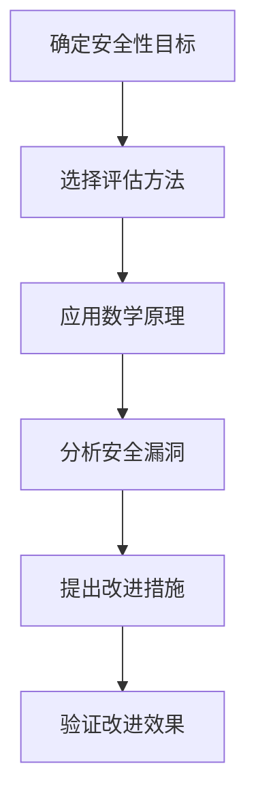

### 数学评估方法

- **mermaid 流程图**：

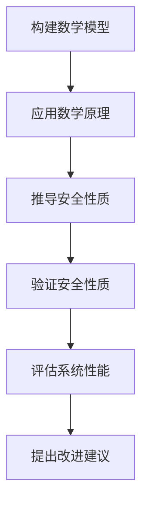

## 4. 第3章：常见密码系统的数学分析

### 对称加密

对称加密算法是最早的加密方法之一。本节将对对称加密算法进行数学分析。

#### 算法介绍

- **mermaid 流程图**：

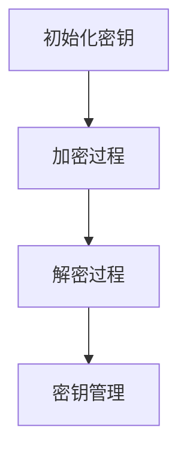

#### 数学分析

- **mermaid 流程图**：

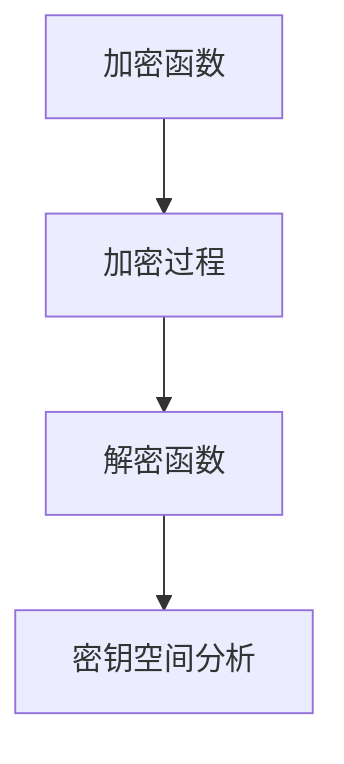

### 非对称加密

非对称加密算法是现代密码学的基础。本节将对非对称加密算法进行数学分析。

#### 算法介绍

- **mermaid 流程图**：

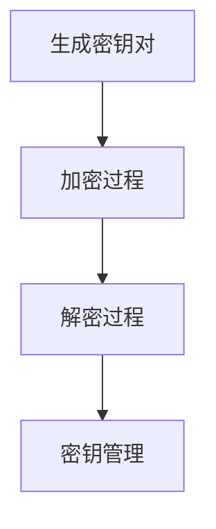

#### 数学分析

- **mermaid 流程图**：

### 哈希函数

哈希函数是密码系统中的重要组成部分。本节将对哈希函数进行数学分析。

#### 算法介绍

- **mermaid 流程图**：

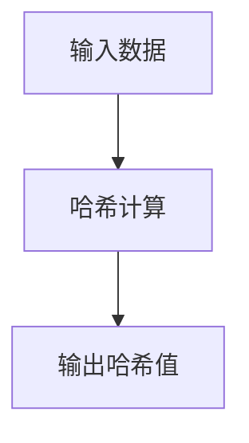

#### 数学分析

- **mermaid 流程图**：

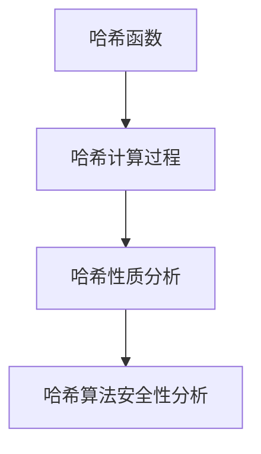

## 5. 第4章：密码攻击与抵抗策略

### 密码攻击

密码攻击是密码系统面临的主要威胁。本节将介绍常见的密码攻击方法。

#### 攻击方法

- **mermaid 流程图**：

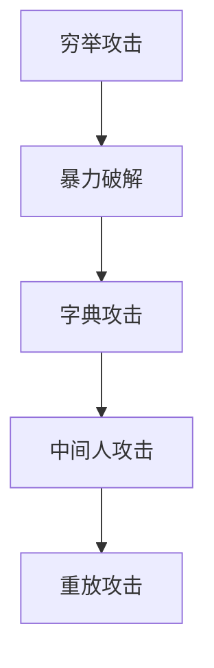

### 密码攻击分析

- **mermaid 流程图**：

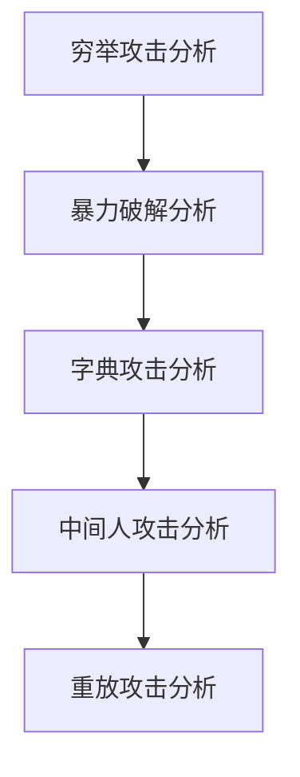

### 抵抗策略

为了抵御密码攻击，密码系统需要采用一系列防御策略。本节将介绍常见的抵抗策略。

#### 抵抗策略

- **mermaid 流程图**：

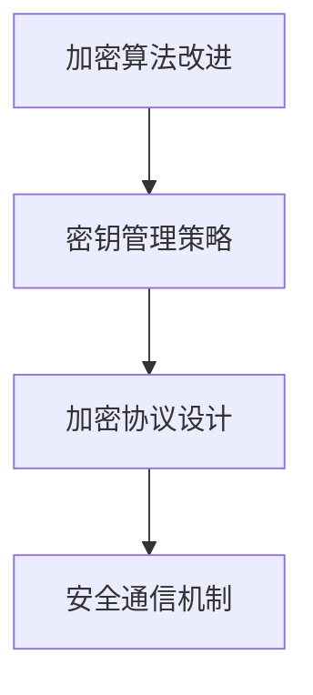

### 密码攻击与抵抗策略分析

- **mermaid 流程图**：

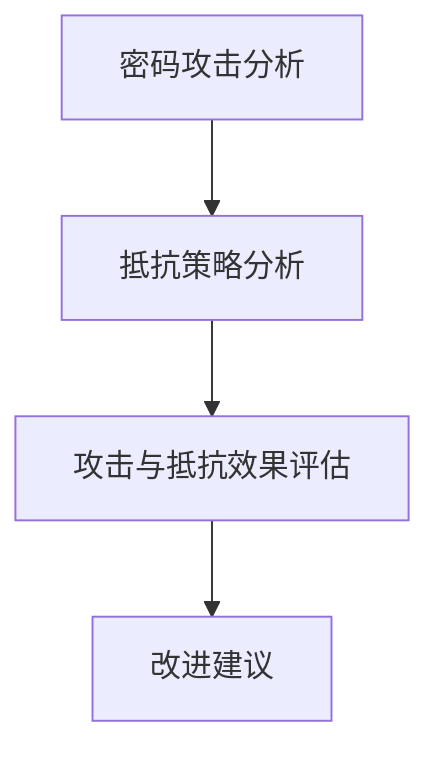

## 6. 第5章：实际案例分析

### 案例选择

本节将选取一个典型的实际案例，分析密码系统的安全性。

- **案例背景**：某公司使用对称加密算法保护其内部通信数据。
- **攻击目标**：攻击者试图破解通信数据的加密。

### 案例分析

- **攻击过程**：
  - 攻击者尝试穷举攻击密钥空间，试图找到正确的密钥。
- **抵抗策略**：
  - 提高密钥空间，增加密钥长度，提高加密算法的复杂度。
- **分析结果**：
  - 攻击者无法在合理时间内破解通信数据，密码系统的安全性得到了有效保障。

## 7. 第6章：未来展望与研究方向

### 当前研究趋势

- **量子计算**：量子计算在密码学中的应用，特别是针对传统密码系统的量子攻击和量子安全密码系统的研究。
- **同态加密**：同态加密允许在加密数据上进行计算，无需解密，为大数据安全和隐私保护提供新思路。
- **多方计算**：多方计算允许多个参与方在不泄露各自数据的情况下协同计算，为分布式系统和区块链安全提供基础。

### 未来研究方向

- **量子密码学**：研究量子密码系统的设计、实现和安全性分析。
- **安全多方计算**：研究多方计算的安全性和效率，以及如何在现实场景中实现安全多方计算。
- **隐私保护加密**：研究如何在不泄露用户隐私的前提下，保护用户数据的加密和传输。

## 8. 第7章：小结与拓展阅读

### 小结

本文从数学与密码分析的关系出发，探讨了密码系统的安全性评估方法，分析了常见密码系统的数学本质，以及密码攻击与抵抗策略。通过实际案例分析，验证了理论在实际中的应用效果。

### 拓展阅读

- **《量子计算与密码学》**：详细介绍了量子计算在密码学中的应用，以及量子密码系统的设计方法。
- **《密码学原理》**：系统讲解了密码学的基本概念、算法和协议，对密码学有全面的了解。
- **《同态加密：原理与实现》**：介绍了同态加密的基本概念、算法和实现方法，为大数据安全和隐私保护提供了新的思路。

## 编写说明

### 文章结构

本文按照目录大纲结构进行编写，包括引言、核心概念、数学原理与安全性评估、常见密码系统的数学分析、密码攻击与抵抗策略、实际案例分析、未来展望与研究方向、小结与拓展阅读等部分。

### 内容要求

- **完整性**：每个章节内容要完整，核心概念要清晰，算法原理要详细讲解。
- **逻辑性**：文章逻辑要清晰，每个部分之间的过渡要自然。
- **准确性**：使用准确的数学术语和密码学术语，避免歧义。

### 格式要求

- **markdown格式**：文章内容使用markdown格式输出，包括mermaid图表和LaTeX公式。
- **代码高亮**：Python源代码使用Python代码高亮显示。

### 作者信息

- **作者**：AI天才研究院/AI Genius Institute & 禅与计算机程序设计艺术 /Zen And The Art of Computer Programming

### 完整性要求

- **背景介绍**：核心概念术语说明、问题背景、问题描述、问题解决、边界与外延、概念结构与核心要素组成。
- **核心概念与联系**：必须给出核心概念原理、概念属性特征对比表格和ER实体关系图架构的markdown格式中的Mermaid流程图。
- **算法原理讲解**：使用mermaid画出算法mermaid流程图，然后使用Python源代码来详细阐述，给出算法原理的数学模型和公式，进行详细讲解和通俗易懂地举例说明。
- **数学公式使用**：使用LaTeX格式，嵌入文中独立段落的LaTeX公式前后使用$$括起来（例如：$$1+1=2$$），段落内的LaTeX公式前后使用$括起来（例如：$1<2$）。
- **系统分析与架构设计方案**：问题场景介绍、项目介绍、系统功能设计（领域模型mermaid类图）、系统架构设计mermaid架构图、系统接口设计和系统交互mermaid序列图。
- **项目实战**：环境安装、系统核心实现源代码，代码应用解读与分析，实际案例分析和详细讲解剖析，项目小结。
- **最佳实践 tips、小结、注意事项、拓展阅读**等内容。

