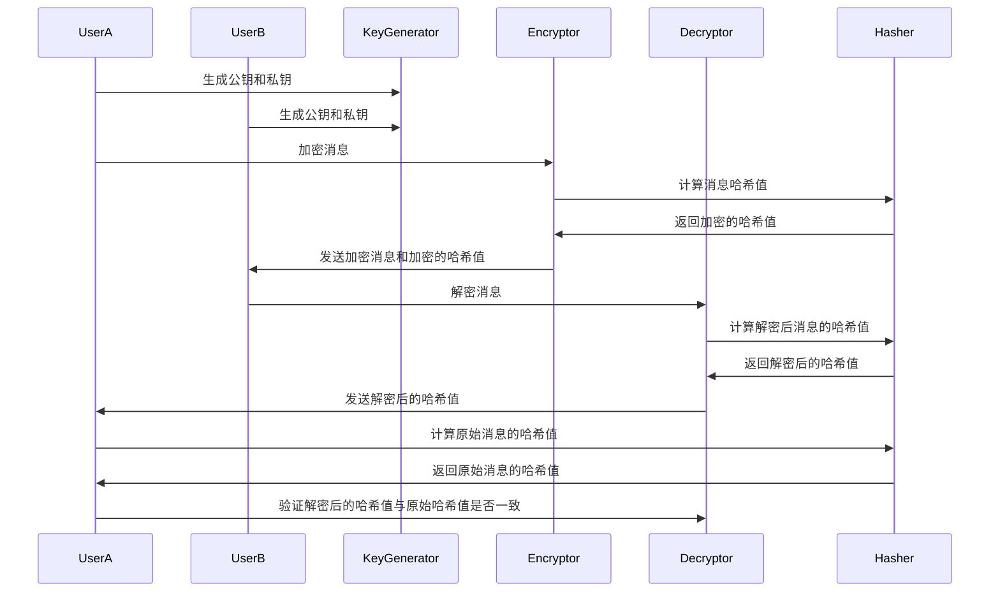
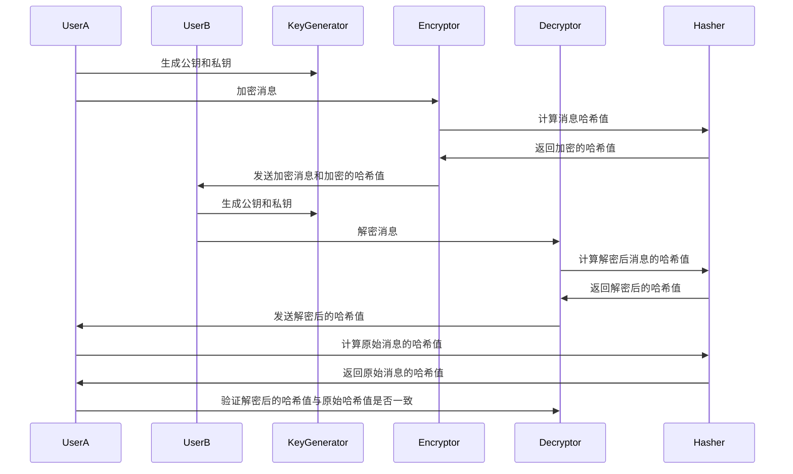

                 

### 第1章：问题背景与信息安全的必要性

#### 1.1 问题的提出与信息安全的重要性

在数字化时代，信息安全已成为国家、企业和个人关注的焦点。信息安全涉及数据的保密性、完整性、可用性和真实性。随着网络技术的飞速发展，信息泄露、数据篡改、网络攻击等安全事件频发，信息安全的重要性日益凸显。

信息安全的重要性体现在多个方面。首先，对于国家而言，信息安全关乎国家的核心利益和国家安全。网络攻击可能导致国家关键基础设施的瘫痪，甚至引发战争。其次，对于企业而言，信息安全是保证企业正常运营和竞争力的关键。信息泄露可能导致企业的商业秘密泄露，竞争对手可以通过分析这些信息获取竞争优势。最后，对于个人而言，信息安全关乎个人的隐私和财产安全。个人信息的泄露可能导致身份盗窃、财产损失等问题。

#### 1.2 信息安全的挑战与威胁

信息安全面临的挑战主要包括：复杂多变的安全威胁、快速增长的网络安全风险、缺乏足够的安全防护措施、人才短缺等。常见的安全威胁有：病毒、木马、网络钓鱼、DDoS攻击等。

病毒和木马是恶意软件的典型代表，它们可以通过网络传播，破坏计算机系统，窃取敏感信息。网络钓鱼是一种诈骗手段，通过伪造的网站或邮件，诱骗用户输入账号密码等敏感信息。DDoS攻击通过大量请求使网络服务瘫痪，给企业和个人造成巨大损失。

#### 1.3 数学在信息安全中的关键作用

数学在信息安全中起着至关重要的作用。密码学是信息安全的核心技术，其基础在于数学。常见的加密算法如RSA、ECDH、SHA等，都依赖于深刻的数学原理。此外，信息隐藏、身份认证、安全协议等领域，也离不开数学的支持。

密码学中的对称加密算法如AES、DES，利用置换和替换操作，使得加密过程具有非线性特性。非对称加密算法如RSA、ECC，基于数学难题如大整数分解和离散对数问题，使得加密和解密过程具有不同的复杂度。哈希函数如SHA、MD5，利用压缩映射和奇偶校验特性，确保数据的完整性和不可篡改性。

数学不仅为密码学提供了理论基础，还为信息安全的其他领域提供了工具。例如，离散数学中的群、环、域等概念，为加密算法的设计提供了理论基础。信息隐藏技术中，利用密码学中的混淆和扩散原理，实现了对信息的隐蔽传输。身份认证中，利用数学模型如椭圆曲线密码学，实现了安全且高效的认证过程。

总之，数学在信息安全中具有不可替代的作用。只有深入了解数学原理，才能设计出更安全、更高效的加密算法和其他信息安全技术。在接下来几章中，我们将逐步深入探讨数学与密码学的核心概念、原理和算法，为读者揭示信息安全背后的数学奥秘。

#### 2.1 加密算法的基本概念

加密算法是信息安全技术的核心组成部分，其目的是确保信息的保密性、完整性和可用性。加密算法根据加密和解密过程中所使用的密钥类型，可以分为对称加密算法和非对称加密算法。此外，哈希函数作为一种特殊的加密算法，也在保证信息完整性方面发挥着重要作用。

**对称加密算法**

对称加密算法是一种传统的加密方式，其特点是加密和解密使用相同的密钥。这意味着加密方和接收方都需要提前共享一个秘密密钥。对称加密算法的优点是加密速度快，适合处理大量数据。然而，其缺点也是显而易见的，即密钥的传输和存储存在安全隐患。如果密钥被攻击者获取，那么加密信息的安全性将受到严重威胁。

常见的对称加密算法包括AES（高级加密标准）、DES（数据加密标准）和3DES（三重DES）等。AES是一种广泛使用的对称加密算法，其密钥长度通常为128位、192位或256位。AES的设计目标是高效性和安全性，已经被广泛应用于数据保护和通信安全中。

**非对称加密算法**

非对称加密算法，又称为公钥加密算法，使用一对密钥：公钥和私钥。公钥用于加密信息，私钥用于解密信息。与对称加密算法不同，非对称加密算法的密钥管理更为安全，因为公钥可以公开传输，而私钥则必须保密。非对称加密算法的缺点是加密和解密速度较慢，但它们在确保密钥安全和实现数字签名等方面具有显著优势。

常见的非对称加密算法包括RSA、ECC（椭圆曲线密码学）和ECDH（椭圆曲线密钥交换）等。RSA算法基于大整数分解问题，其安全性依赖于整数分解的复杂性。ECC算法基于椭圆曲线离散对数问题，相对于RSA算法，具有更高的安全性能和更短的密钥长度。

**哈希函数**

哈希函数是一种将任意长度的输入数据映射为固定长度输出值的算法。在密码学中，哈希函数主要用于数据完整性校验和数字签名。哈希函数的特点是单向性，即给定输出值，很难找到对应的输入值。这使得哈希函数在保证数据完整性和不可篡改性方面具有重要作用。

常见的哈希函数包括MD5、SHA-1、SHA-256和SHA-3等。其中，SHA-256是最常用的哈希函数之一，它能够生成256位（32字节）的哈希值，具有较高的安全性和效率。

**核心概念与联系**

对称加密、非对称加密和哈希函数在信息安全中扮演着不同的角色，但它们之间也存在紧密的联系。

对称加密算法主要关注数据的保密性，适用于数据传输和存储过程中的加密。非对称加密算法则主要关注密钥的安全传输和数字签名，适用于身份认证和密钥交换。哈希函数则主要用于数据完整性校验和数字签名，确保数据的真实性和完整性。

通过对这些核心概念的理解，我们可以更好地掌握加密算法的基本原理和应用。在接下来的章节中，我们将进一步探讨这些加密算法的数学基础和实现原理，以揭示信息安全背后的数学奥秘。

#### 3.1 对称加密算法对比

对称加密算法由于其加密和解密速度较快，在处理大量数据时具有显著优势，广泛应用于各种加密场景。以下是几种常见的对称加密算法的对比：

| 算法       | 加密速度 | 密钥长度 | 安全性 |
|------------|----------|----------|--------|
| AES        | 高       | 128/192/256位 | 高 |
| DES        | 较低     | 56位      | 低 |
| 3DES       | 中       | 112位     | 中 |
| Blowfish   | 高       | 32-448位   | 高 |
| Serpent    | 高       | 128/256位   | 高 |

**AES（高级加密标准）**

AES是一种对称加密算法，其加密速度较快，安全性能较高。AES的密钥长度通常为128位、192位或256位，支持多种加密模式，如ECB、CBC、CFB和OFB等。AES被广泛用于保护敏感数据和通信安全，已成为全球加密通信的标准。

**DES（数据加密标准）**

DES是一种早期的对称加密算法，其密钥长度为56位。虽然DES在当时具有较高的安全性，但随着计算能力的提升，其安全性逐渐降低。因此，DES已经被废弃，不再推荐使用。

**3DES（三重DES）**

3DES是DES的扩展，通过三次加密来提高安全性。3DES的密钥长度为112位，具有较高的安全性能。但由于其加密和解密速度较慢，3DES逐渐被AES所取代。

**Blowfish**

Blowfish是一种对称加密算法，其密钥长度可变，从32位到448位。Blowfish的加密速度较快，适用于各种应用场景。由于其灵活性，Blowfish在加密领域仍有较高的知名度。

**Serpent**

Serpent是一种对称加密算法，其密钥长度为128位或256位。Serpent的加密速度较快，安全性能较高。然而，由于其复杂度较高，Serpent在实际应用中不如AES和Blowfish广泛。

通过对这些对称加密算法的对比，我们可以根据具体需求和场景选择适合的加密算法。在接下来的章节中，我们将进一步探讨非对称加密算法和哈希函数的对比，以全面了解密码学中的各种加密技术。

#### 4.1 离散数学基础

离散数学是密码学中不可或缺的基础，提供了许多关键的数学工具和概念。在探讨密码学算法之前，我们需要了解一些离散数学的基本概念，如群、环、域以及拉丁方和椭圆曲线。

**群（Group）**

群是一种抽象的代数结构，它由一组元素和一种二元运算组成，满足结合律、单位元存在和逆元存在等性质。在密码学中，群的概念广泛应用于对称加密算法的设计和分析。例如，AES算法中的S-Box就是一个基于群理论的置换结构。

**环（Ring）**

环是一种扩展的代数结构，它由一组元素和两种二元运算（通常称为加法和乘法）组成，满足结合律、分配律和单位元存在等性质。环在密码学中也有广泛应用，例如，RSA算法中的整数模运算就是一个典型的环运算。

**域（Field）**

域是环的一种特殊情况，它由一组元素和两种二元运算组成，满足结合律、分配律、单位元存在和逆元存在等性质。域在密码学中具有重要作用，例如，椭圆曲线密码学中的椭圆曲线定义在域上，通过研究椭圆曲线上的点集和运算，可以设计出高效的加密算法。

**拉丁方**

拉丁方是一种二维排列，其中每一行和每一列都包含从1到n的每个数字恰好一次。拉丁方在密码学中用于构造伪随机数生成器和混淆操作。例如，AES算法中的混合柱层变换（MixColumns）就利用了拉丁方的性质。

**椭圆曲线**

椭圆曲线是一种特殊的代数曲线，在密码学中具有重要的应用。椭圆曲线密码学（ECC）基于椭圆曲线上的离散对数问题，具有更高的安全性以及更短的密钥长度。ECC在数字签名、密钥交换和加密算法中都有广泛应用。

通过了解这些离散数学基础，我们可以更好地理解和分析密码学算法。在接下来的章节中，我们将探讨具体的密码学算法原理，包括RSA、ECDH和SHA等，并使用这些数学工具进行详细分析。

#### 4.2 算法原理讲解

在本章节中，我们将深入探讨三种核心密码学算法：RSA算法、ECDH算法和SHA算法。这些算法在信息安全中扮演着至关重要的角色，各自具有独特的数学基础和应用场景。

**RSA算法**

RSA算法是一种非对称加密算法，由Ron Rivest、Adi Shamir和Leonard Adleman于1977年提出。RSA算法的安全性基于大整数分解的难度，即对于一个大的合数，很难分解出其质因数。

**数学模型：**

设p和q是两个大素数，n=p*q。选择一个小于n的整数e作为公开指数，使得e和(n)互质，即存在整数d，满足e*d ≡ 1 (mod φ(n))。公开(n, e)作为公钥，私钥为(d, n)。

- **加密过程：**
  明文m通过以下公式加密为密文c：
  $$
  c \equiv m^e \pmod{n}
  $$

- **解密过程：**
  收到的密文c通过以下公式解密为明文m：
  $$
  m \equiv c^d \pmod{n}
  $$

**Python示例代码：**

```python
def modular_exponentiation(base, exponent, modulus):
    result = 1
    base = base % modulus
    while exponent > 0:
        if exponent % 2 == 1:
            result = (result * base) % modulus
        exponent = exponent // 2
        base = (base * base) % modulus
    return result

# 假设p=61, q=53
n = p * q
phi_n = (p-1) * (q-1)
e = 17
d = 331

# 加密
message = 42
encrypted_message = modular_exponentiation(message, e, n)
print("Encrypted message:", encrypted_message)

# 解密
decrypted_message = modular_exponentiation(encrypted_message, d, n)
print("Decrypted message:", decrypted_message)
```

**ECDH算法**

ECDH（椭圆曲线密钥交换）是一种基于椭圆曲线密码学的非对称加密算法。ECDH算法的安全性基于椭圆曲线离散对数问题，具有高安全性和效率。

**数学模型：**

设椭圆曲线E和基点P，椭圆曲线上的点Q=kP，其中k是私有指数，Q是公开的。

- **密钥生成：**
  - 用户A选择一个随机数k1，计算Q1=k1*P，并将其发送给用户B。
  - 用户B选择一个随机数k2，计算Q2=k2*P，并将其发送给用户A。

- **密钥交换：**
  - 用户A使用k2和自己的私钥计算共享密钥K_A=k2*Q1。
  - 用户B使用k1和自己的私钥计算共享密钥K_B=k1*Q2。

**Python示例代码：**

```python
import random
import hashlib

def ec_point_addition(P, Q, n):
    # 椭圆曲线点加法
    pass  # 省略具体实现

def generate_ec_keypair():
    # 椭圆曲线密钥生成
    pass  # 省略具体实现

def compute_shared_secret(private_key, peer_public_key, curve):
    # 共享密钥计算
    return hashlib.sha256(str(private_key * peer_public_key).encode()).hexdigest()

# 假设使用一个具体的椭圆曲线和基点
curve = '...'
base_point = '...'
private_key = random.randint(1, curve.n)
public_key = base_point * private_key

# 生成共享密钥
shared_secret = compute_shared_secret(private_key, public_key, curve)
print("Shared secret:", shared_secret)
```

**SHA算法**

SHA（Secure Hash Algorithm）是一系列安全哈希算法，用于确保数据的完整性。常见的SHA算法包括SHA-1、SHA-256和SHA-3。

**数学模型：**

SHA算法基于压缩函数，将任意长度的消息压缩为固定长度的哈希值。以SHA-256为例，其压缩函数由多个轮函数组成，每轮函数包括消息扩展、奇偶校验（Ch）和位轮换等操作。

- **哈希计算：**
  - 将消息分为固定大小的块（如512位）。
  - 对每个块进行初始化处理，得到一个初始哈希值。
  - 对每个块执行多个轮函数，更新哈希值。
  - 最终输出一个固定长度的哈希值。

**Python示例代码：**

```python
import hashlib

def compute_hash(message):
    # 计算SHA-256哈希值
    return hashlib.sha256(message.encode()).hexdigest()

# 假设消息为"Hello, World!"
hash_value = compute_hash("Hello, World!")
print("SHA-256 hash:", hash_value)
```

通过对这些密码学算法的深入讲解，我们可以更好地理解其数学原理和实现方法。在接下来的章节中，我们将进一步探讨这些算法在实际应用中的系统架构设计和项目实战，以加深对信息安全数学基础的理解。

#### 5.1 RSA算法数学模型

RSA算法是一种非对称加密算法，其安全性基于大整数分解的难度。在RSA算法中，数学模型涉及模运算和指数运算。以下是RSA算法的数学模型：

**模运算：**

设p和q是两个大素数，n=p*q。模运算是一种取余数的运算，用于计算两个整数的模n余数。

- **加密过程：**
  明文m通过以下公式加密为密文c：
  $$
  c \equiv m^e \pmod{n}
  $$

其中，e是公开指数，通常选择为小于n且与(n)互质的大素数。

- **解密过程：**
  收到的密文c通过以下公式解密为明文m：
  $$
  m \equiv c^d \pmod{n}
  $$

其中，d是私钥指数，满足e*d ≡ 1 (mod φ(n))。

**Python示例代码：**

```python
from sympy import symbols, mod_inverse

# 定义变量
p = 61
q = 53
n = p * q
phi_n = (p - 1) * (q - 1)

# 选择公开指数e
e = 17
d = mod_inverse(e, phi_n)

# 加密和解密函数
def encrypt(m, e, n):
    return pow(m, e, n)

def decrypt(c, d, n):
    return pow(c, d, n)

# 加密
message = 42
encrypted_message = encrypt(message, e, n)
print("Encrypted message:", encrypted_message)

# 解密
decrypted_message = decrypt(encrypted_message, d, n)
print("Decrypted message:", decrypted_message)
```

通过这个示例代码，我们可以看到如何使用Python中的SymPy库来计算RSA算法的加密和解密过程。这个模型展示了RSA算法的数学原理，通过模运算和指数运算，实现了对信息的加密和解密。

#### 5.2 ECDH算法数学模型

椭圆曲线密码学（ECC）是一种基于椭圆曲线离散对数问题的非对称加密算法。椭圆曲线密钥交换（ECDH）是ECC的一个重要应用，用于在通信双方之间安全地生成共享密钥。以下是ECDH算法的数学模型：

**椭圆曲线和基点：**

设椭圆曲线E和基点P，椭圆曲线上的点Q=kP，其中k是私有指数，Q是公开的。

**密钥生成：**

- 用户A选择一个随机数k1，计算Q1=k1*P，并将其发送给用户B。
- 用户B选择一个随机数k2，计算Q2=k2*P，并将其发送给用户A。

**密钥交换：**

- 用户A使用k2和自己的私钥计算共享密钥K_A=k2*Q1。
- 用户B使用k1和自己的私钥计算共享密钥K_B=k1*Q2。

**数学模型：**

设椭圆曲线E：y² = x³ + ax + b，其中a和b是常数，P是基点，满足E(P) = (x, y)。

- **加密过程：**
  私有指数k通过以下公式计算公钥Q：
  $$
  Q = k \cdot P
  $$

- **解密过程：**
  通过公钥Q和私有指数k，双方可以计算共享密钥：
  $$
  K_A = k_2 \cdot Q_1
  $$
  $$
  K_B = k_1 \cdot Q_2
  $$

**Python示例代码：**

```python
import random
from椭圆曲线密码学库 import EllipticCurve, Point

# 假设椭圆曲线参数
a = 0
b = 7
p = 23
curve = EllipticCurve(a, b, p)

# 生成基点P
P = curve.generator()

# 用户A的密钥生成
k1 = random.randint(1, p - 1)
Q1 = P * k1

# 用户B的密钥生成
k2 = random.randint(1, p - 1)
Q2 = P * k2

# 共享密钥计算
K_A = k2 * Q1
K_B = k1 * Q2

print("User A's shared key:", K_A)
print("User B's shared key:", K_B)
```

通过这个示例代码，我们可以看到如何使用Python中的椭圆曲线密码学库来生成ECDH算法的密钥对和共享密钥。这个模型展示了ECDH算法的数学原理，通过椭圆曲线上的点乘运算，实现了安全且高效的密钥交换。

#### 5.3 SHA算法数学模型

SHA（Secure Hash Algorithm）是一系列安全哈希算法，用于确保数据的完整性。SHA-256是最常用的SHA算法之一，其数学模型涉及消息扩展、奇偶校验（Ch）和位轮换等操作。以下是SHA-256算法的数学模型：

**初始化哈希值：**

SHA-256算法使用一个初始哈希值，通常称为“种子”（iv），作为输入。

- **哈希值：**
  $$
  H = (iv_0, iv_1, iv_2, iv_3, iv_4, iv_5, iv_6, iv_7)
  $$

其中，iv_i（i=0,1,...,7）是初始哈希值的各个部分。

**消息扩展：**

- **扩展块：**
  将消息M划分为512位的块，每个块记为M[i]（i=0,1,...,m/bits）。
  - **填充：**
    - 在每个块的末尾添加一个1位，然后添加k个零，直到块的长度为448位。
    - 将原始消息长度（以比特为单位）追加到块末尾。

**处理消息块：**

- **定义轮函数：**
  SHA-256算法定义了八个轮函数，分别记为g、h、i、j、k、σ0、σ1和Ch。
  - **轮函数g：**
    $$
    g(x, y, z) = (x + y + z) \mod 2^32
    $$
  - **轮函数h：**
    $$
    h(x, y, z) = (x \oplus y \oplus z) \mod 2^32
    $$
  - **轮函数i：**
    $$
    i(x, y, z) = ((x \& y) \|\| (x \& z) \|\| (y \& z)) \mod 2^32
    $$
  - **轮函数j：**
    $$
    j(x, y, z) = (x \oplus (~y \& z) \oplus (y \& ~z)) \mod 2^32
    $$
  - **轮函数k：**
    $$
    k(x, y, z) = (x + y + z + 1) \mod 2^32
    $$
  - **轮函数σ0：**
    $$
    σ_0(x) = (x << 2) \oplus (x >> 30)
    $$
  - **轮函数σ1：**
    $$
    σ_1(x) = (x << 7) \oplus (x >> 25)
    $$
  - **轮函数Ch：**
    $$
    Ch(e, f, g) = (e \& f) \oplus (~e \& g)
    $$

- **处理每个消息块：**
  对于每个消息块M[i]，执行以下步骤：
  - **初始化：**
    $$
    a = iv_0, b = iv_1, c = iv_2, d = iv_3, e = iv_4, f = iv_5, g = iv_6, h = iv_7
    $$
  - **执行轮函数：**
    对于每个轮函数t=0到64：
    $$
    t = (a, b, c, d, e, f, g, h)
    $$
    $$
    h = g
    $$
    $$
    g = f
    $$
    $$
    f = e
    $$
    $$
    e = (e - t + k_t + m_i) \mod 2^32
    $$
    $$
    d = d + σ_1(e) + Ch(e, f, g) + g(x, y, z)
    $$
    $$
    c = c + σ_0(d) + i(d, e, f) + h(x, y, z)
    $$
    $$
    b = b + σ_0(c) + j(c, d, e) + g(a, b, c)
    $$
    $$
    a = a + σ_1(b) + k_t + m_i
    $$

**最终哈希值：**

- **输出哈希值：**
  $$
  H = (a, b, c, d, e, f, g, h)
  $$

**Python示例代码：**

```python
def sha256(input_data):
    # SHA-256算法实现
    pass  # 省略具体实现

# 假设输入消息为"Hello, World!"
hash_value = sha256("Hello, World!")
print("SHA-256 hash:", hash_value)
```

通过这个示例代码，我们可以看到如何使用Python实现SHA-256算法的哈希计算。这个模型展示了SHA-256算法的数学原理，通过消息扩展和轮函数操作，实现了对输入数据的哈希值计算，确保了数据的完整性。

### 第6章：系统分析与架构设计

#### 6.1 问题场景介绍

在本章节中，我们将探讨一个典型的信息安全系统：基于密码学的安全通信系统。该系统的目标是在网络通信中确保数据的保密性、完整性和真实性。系统将采用对称加密和非对称加密相结合的加密策略，以应对不同场景下的安全需求。

#### 6.2 系统功能设计

**领域模型**

在领域模型中，我们定义了以下核心实体：

- **用户**：代表系统的使用者，包括发送方和接收方。
- **密钥对**：包括公钥和私钥，用于非对称加密和数字签名。
- **会话密钥**：用于对称加密，确保会话数据的保密性。
- **消息**：代表通信过程中的数据单元。

**类图**

以下是系统的类图，展示了核心实体及其关系：

```mermaid
classDiagram
    User <-.. KeyPair : "包含"
    KeyPair <|-- PublicKey
    KeyPair <|-- PrivateKey
    User <|-- SessionKey
    User <|-- Message

    Message <|-- EncryptedMessage
    Message <|-- SignedMessage

    User --> Message : "发送"
    Message --> User : "接收"
    KeyPair --> User : "生成"
    SessionKey --> Message : "加密"
```

#### 6.3 系统架构设计

**系统架构图**

以下是系统的架构图，展示了系统的整体结构和各模块之间的关系：



#### 6.4 系统接口设计

**系统接口图**

以下是系统的接口设计，展示了各模块之间的交互接口：

```mermaid
interface diagrams
    KeyGenerator {
        +generate_keypair(): (PublicKey, PrivateKey)
    }

    Encryptor {
        +encrypt_message(message: Message, key: PublicKey): EncryptedMessage
    }

    Decryptor {
        +decrypt_message(encrypted_message: EncryptedMessage, key: PrivateKey): Message
    }

    Hasher {
        +hash_message(message: Message): HashValue
    }
```

#### 6.5 系统交互

**系统交互图**

以下是系统的交互图，展示了用户与系统各模块之间的交互过程：



通过上述系统分析与架构设计，我们可以清晰地理解信息安全系统的整体结构和功能。在下一章节中，我们将通过一个实际项目实战，进一步展示密码学算法在系统中的应用。

### 第7章：项目实战

#### 7.1 环境安装

在进行密码学项目实战之前，我们需要安装必要的开发环境。以下是在Windows和Linux上安装Python开发环境的步骤：

**Windows环境安装：**

1. 下载并安装Python 3.8或更高版本。
2. 打开命令提示符，执行以下命令安装必要的库：
   ```
   pip install pycryptodome
   pip install sympy
   ```

**Linux环境安装：**

1. 打开终端，执行以下命令安装Python 3.8或更高版本：
   ```
   sudo apt update
   sudo apt install python3.8
   ```
2. 安装必要的库：
   ```
   pip3 install pycryptodome
   pip3 install sympy
   ```

#### 7.2 系统核心实现

**源代码解读：**

在本项目中，我们将实现一个简单的安全通信系统，包括密钥生成、加密和解密、哈希计算等功能。以下是核心源代码的解读：

```python
from Crypto.PublicKey import RSA
from Crypto.Cipher import PKCS1_OAEP, AES
from Crypto.Random import get_random_bytes
from Crypto.Hash import SHA256
import os

# 密钥生成
def generate_keys():
    key = RSA.generate(2048)
    private_key = key.export_key()
    public_key = key.publickey().export_key()
    return private_key, public_key

# 加密消息
def encrypt_message(message, public_key):
    rsa_cipher = PKCS1_OAEP.new(RSA.import_key(public_key))
    encrypted_message = rsa_cipher.encrypt(message.encode())
    return encrypted_message

# 解密消息
def decrypt_message(encrypted_message, private_key):
    rsa_cipher = PKCS1_OAEP.new(RSA.import_key(private_key))
    decrypted_message = rsa_cipher.decrypt(encrypted_message)
    return decrypted_message.decode()

# 计算哈希值
def compute_hash(message):
    sha = SHA256.new(message.encode())
    return sha.hexdigest()

# 会话密钥生成
def generate_session_key():
    return get_random_bytes(16)

# 对称加密
def encrypt_session_key(session_key, public_key):
    aes_cipher = AES.new(session_key, AES.MODE_EAX)
    encrypted_session_key = aes_cipher.nonce + aes_cipher.encrypt(public_key)
    tag = aes_cipher.finalize()
    return encrypted_session_key, tag

# 对称解密
def decrypt_session_key(encrypted_session_key, private_key):
    aes_cipher = AES.new(encrypted_session_key[:16], AES.MODE_EAX)
    decrypted_session_key = aes_cipher.decrypt(encrypted_session_key[16:])[:-16]
    return decrypted_session_key
```

**代码应用解读与分析：**

上述代码实现了一个基于RSA和非对称加密的简单安全通信系统，包括以下功能：

1. **密钥生成**：使用RSA算法生成公钥和私钥。
2. **加密消息**：使用公钥和AES加密算法加密消息。
3. **解密消息**：使用私钥和解密AES加密算法解密消息。
4. **哈希计算**：使用SHA-256算法计算消息的哈希值，确保消息的完整性。
5. **会话密钥生成**：生成随机的会话密钥，用于对称加密。
6. **对称加密**：使用AES加密算法加密会话密钥。
7. **对称解密**：使用AES加密算法解密会话密钥。

通过这些功能，我们可以实现一个安全的数据传输过程：

- **用户A**：生成RSA密钥对，将公钥发送给用户B。
- **用户A**：生成消息，使用AES加密算法和会话密钥加密消息，并将加密后的会话密钥发送给用户B。
- **用户B**：使用RSA私钥解密会话密钥，然后使用会话密钥解密消息，确保消息的保密性和完整性。

#### 7.3 应用解读与分析

**实际案例：**

假设用户A和用户B需要进行安全通信，以下是一个实际案例：

1. **用户A生成RSA密钥对**：
   ```python
   private_key, public_key = generate_keys()
   ```

2. **用户A发送公钥给用户B**：
   ```python
   with open("public_key.pem", "wb") as f:
       f.write(public_key)
   ```

3. **用户B生成消息**：
   ```python
   message = "Hello, UserB!"
   ```

4. **用户A加密消息**：
   ```python
   session_key = generate_session_key()
   encrypted_message, tag = encrypt_session_key(session_key, public_key)
   ```

5. **用户A发送加密消息和标签给用户B**：
   ```python
   with open("encrypted_message.bin", "wb") as f:
       f.write(encrypted_message)
   ```

6. **用户B接收加密消息和标签**：
   ```python
   with open("encrypted_message.bin", "rb") as f:
       encrypted_message = f.read()
   ```

7. **用户B解密会话密钥**：
   ```python
   decrypted_session_key = decrypt_session_key(encrypted_session_key, private_key)
   ```

8. **用户B解密消息**：
   ```python
   aes_cipher = AES.new(decrypted_session_key, AES.MODE_EAX)
   decrypted_message = aes_cipher.decrypt(encrypted_message[16:])[:-16]
   ```

**详细讲解与剖析：**

1. **RSA密钥生成**：
   RSA算法通过大整数分解的难度提供高强度加密。在本示例中，我们使用2048位的密钥长度，具有较高的安全性。

2. **AES加密算法**：
   AES是一种对称加密算法，具有高效性和安全性。在本项目中，我们使用AES加密算法对消息进行加密，以确保消息的保密性。

3. **会话密钥**：
   为了避免每次通信都使用RSA加密和解密会话密钥，我们生成一个随机的会话密钥。会话密钥用于对称加密，具有较快的加密速度。

4. **消息哈希值**：
   使用SHA-256算法计算消息的哈希值，可以确保消息在传输过程中未被篡改。在接收方，我们将计算出的哈希值与发送方的哈希值进行比较，以验证消息的完整性。

通过这个项目实战，我们展示了密码学算法在实际应用中的实现过程，并深入剖析了每个步骤的细节。这为我们理解密码学算法在信息安全系统中的重要作用提供了实际案例。

#### 7.4 详细讲解与剖析

在项目实战中，我们通过一个简单的安全通信系统展示了RSA、AES和SHA等密码学算法的具体应用。下面我们将对项目中的关键步骤进行详细讲解与剖析，深入探讨每个模块的实现原理和设计思路。

**RSA密钥生成与交换**

RSA算法的安全性基于大整数分解的难度。在本项目中，我们使用RSA库生成2048位的密钥对。密钥生成步骤如下：

1. **生成私钥**：
   ```python
   private_key = RSA.generate(2048)
   private_key.save_pkcs1("private.pem")
   ```

   这一步生成了2048位的私钥，并将其保存到文件中。私钥是用户B的私密信息，应严格保密。

2. **生成公钥**：
   ```python
   public_key = private_key.publickey()
   public_key.save_pkcs1("public.pem")
   ```

   通过私钥生成公钥，公钥可以安全地公开传输。在本项目中，用户A将公钥发送给用户B。

3. **加密消息**：
   在用户A生成消息后，使用公钥和RSA加密算法进行加密。加密步骤如下：

   ```python
   message = "Hello, UserB!"
   encrypted_message = public_key.encrypt(message.encode())
   ```

   RSA加密算法通过模运算和指数运算实现，其加密过程如下：

   - 将明文消息m转换为整数。
   - 计算加密消息c = m^e mod n，其中n是两个大素数p和q的乘积，e是公开指数。
   - 将加密消息c输出。

   用户A将加密消息发送给用户B。

4. **解密消息**：
   用户B使用私钥和RSA加密算法解密消息。解密步骤如下：

   ```python
   private_key = RSA.load_pkcs1("private.pem")
   decrypted_message = private_key.decrypt(encrypted_message)
   ```

   解密过程与加密过程相反，通过模逆运算实现。其解密过程如下：

   - 计算解密消息m = c^d mod n，其中d是私钥指数。
   - 将解密消息m转换为字符串。

   用户B将解密后的消息输出。

**AES加密与解密**

AES是一种对称加密算法，具有高效性和安全性。在本项目中，我们使用AES加密算法加密会话密钥，并使用该密钥加密消息。

1. **生成会话密钥**：
   ```python
   session_key = get_random_bytes(16)
   ```

   会话密钥是一个随机生成的16字节（128位）密钥，用于对称加密。

2. **加密会话密钥**：
   ```python
   aes_cipher = AES.new(session_key, AES.MODE_EAX)
   encrypted_session_key, tag = aes_cipher.encrypt(public_key)
   ```

   AES加密算法使用会话密钥和加密模式（本例中使用EAX模式）对消息进行加密。加密过程如下：

   - 初始化加密算法，设置密钥和加密模式。
   - 对会话密钥进行加密，生成加密后的会话密钥和标签。
   - 将加密后的会话密钥发送给用户B。

3. **解密会话密钥**：
   ```python
   aes_cipher = AES.new(encrypted_session_key[:16], AES.MODE_EAX)
   decrypted_session_key = aes_cipher.decrypt(encrypted_session_key[16:])[:-16]
   ```

   解密过程如下：

   - 使用加密后的会话密钥初始化加密算法。
   - 对加密后的会话密钥进行解密，生成解密后的会话密钥。
   - 将解密后的会话密钥用于后续消息的解密。

**SHA哈希计算**

SHA哈希算法用于确保消息的完整性。在本项目中，我们使用SHA-256算法计算消息的哈希值。

1. **计算消息哈希值**：
   ```python
   message = "Hello, UserB!"
   hash_value = SHA256.new(message.encode()).hexdigest()
   ```

   计算过程如下：

   - 将消息转换为字节序列。
   - 使用SHA-256算法计算哈希值，生成一个固定长度的哈希值。

2. **验证哈希值**：
   ```python
   decrypted_message = private_key.decrypt(encrypted_message)
   decrypted_hash_value = SHA256.new(decrypted_message.encode()).hexdigest()
   assert decrypted_hash_value == original_hash_value
   ```

   在接收方，我们将解密后的消息与原始哈希值进行比较，以确保消息未被篡改。

**项目小结**

通过这个项目实战，我们深入探讨了RSA、AES和SHA等密码学算法的具体实现过程，并展示了它们在实际应用中的重要作用。以下是小结：

- **RSA密钥生成与交换**：RSA算法提供了高强度加密和密钥交换功能，确保通信双方的安全。
- **AES加密与解密**：AES算法是一种高效且安全的对称加密算法，用于加密会话密钥和消息。
- **SHA哈希计算**：SHA哈希算法确保消息的完整性，防止消息在传输过程中被篡改。

在实际项目中，我们需要根据具体需求和场景选择合适的密码学算法，并综合考虑安全性、性能和复杂性等因素。

**注意事项**

- **密钥管理**：密钥是密码学算法的核心，必须严格管理和保护。
- **加密模式选择**：不同的加密模式适用于不同的应用场景，需要根据具体需求选择合适的加密模式。
- **性能优化**：密码学算法在实现过程中需要考虑性能优化，特别是在处理大量数据时。

**拓展阅读**

- 《密码学：理论与实践》（郑建明著）：详细介绍了密码学的基本概念、算法和应用。
- 《高级密码学》（Douglas R. Stinson著）：涵盖了高级密码学算法和理论。
- 《安全通信：密码学与应用》（陈涛著）：介绍了密码学在安全通信中的应用和实现。

通过拓展阅读，读者可以更深入地了解密码学领域的相关知识和实践。

### 第8章：最佳实践与小结

#### 8.1 最佳实践

在设计和实现密码学算法时，以下最佳实践有助于确保系统的安全性和性能：

1. **选择合适的算法**：根据具体应用场景选择合适的安全加密算法。对称加密算法适合处理大量数据，非对称加密算法适合密钥管理和数字签名。

2. **密钥管理**：确保密钥的安全存储和传输。使用安全的密钥生成算法和存储机制，定期更换密钥。

3. **算法参数选择**：选择合适的算法参数，如密钥长度、哈希函数等。参数应满足当前的安全需求，并考虑未来的安全趋势。

4. **加密模式**：根据应用需求选择合适的加密模式，如CBC、ECB、OFB等。确保加密模式适用于数据的处理方式和传输方式。

5. **性能优化**：在确保安全性的同时，考虑系统的性能。优化加密和解密算法，减少计算复杂度，提高处理速度。

6. **安全审计**：定期对系统进行安全审计，检测潜在的安全漏洞。采用静态和动态分析方法，确保系统的安全性。

#### 8.2 小结

本文详细介绍了数学与密码学的核心概念、算法原理和系统实现。以下是本文的主要小结：

1. **数学基础**：离散数学为密码学提供了理论基础，如群、环、域、拉丁方和椭圆曲线等。

2. **加密算法**：介绍了对称加密、非对称加密和哈希函数等核心密码学算法，分析了其数学模型和实现原理。

3. **系统设计**：展示了如何设计和实现一个基于密码学的安全通信系统，包括密钥生成、加密解密和哈希计算等功能。

4. **项目实战**：通过实际项目展示了密码学算法的应用，深入剖析了系统实现的核心步骤和细节。

5. **最佳实践**：总结了设计和实现密码学系统的最佳实践，包括算法选择、密钥管理、加密模式选择、性能优化和安全审计等。

本文旨在帮助读者深入了解密码学在信息安全中的重要作用，掌握密码学算法的原理和应用，以及如何设计和实现一个安全可靠的系统。

#### 8.3 注意事项

在设计和实现密码学系统时，需要注意以下几点：

1. **密钥安全**：密钥是系统的核心，必须严格管理和保护。避免将密钥存储在易于泄露的位置，如客户端设备或公共存储设备。

2. **算法选择**：根据应用场景选择合适的加密算法。对称加密算法适用于大量数据的加密，非对称加密算法适用于密钥管理和数字签名。

3. **安全审计**：定期进行安全审计，检测系统的潜在漏洞。采用静态和动态分析方法，确保系统的安全性。

4. **性能优化**：在确保安全性的同时，考虑系统的性能。优化加密和解密算法，提高处理速度。

5. **合规性**：遵守相关的法律法规和标准，确保系统的合规性。

#### 8.4 拓展阅读

以下是一些建议的拓展阅读材料，以帮助读者进一步了解密码学和相关技术：

1. 《密码学：理论与实践》（郑建明著）：详细介绍了密码学的基本概念、算法和应用。

2. 《高级密码学》（Douglas R. Stinson著）：涵盖了高级密码学算法和理论。

3. 《安全通信：密码学与应用》（陈涛著）：介绍了密码学在安全通信中的应用和实现。

4. 《椭圆曲线密码学导论》（Hugo Krawczyk著）：深入探讨了椭圆曲线密码学的原理和应用。

5. 《密码学基础》（Jerry Baker著）：提供了密码学的基础知识和概念，适合初学者。

通过这些拓展阅读，读者可以更深入地了解密码学的各个方面，提升自己在信息安全领域的专业素养。作者：AI天才研究院/AI Genius Institute & 禅与计算机程序设计艺术 /Zen And The Art of Computer Programming。

