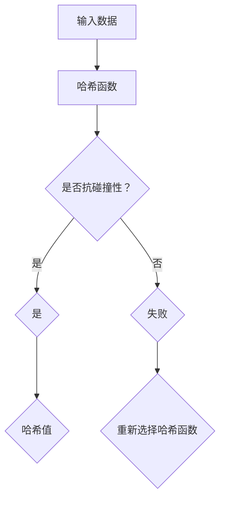
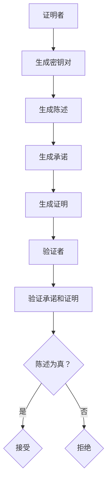
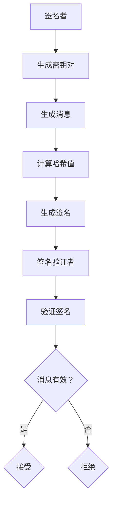
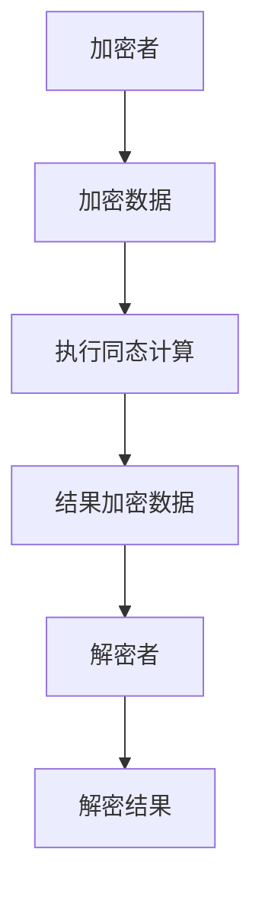
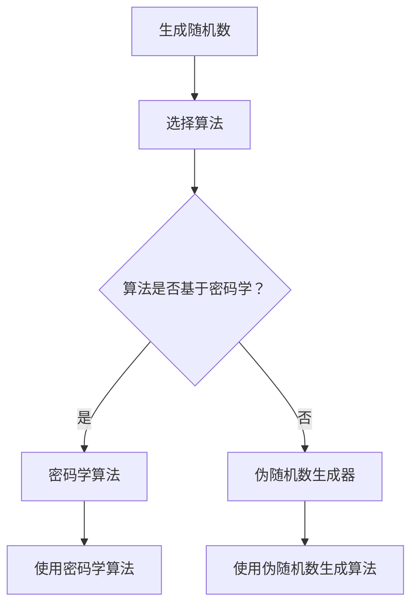

                 


### 第1章 引言

#### 1.1 问题背景

随着互联网和信息技术的飞速发展，数字化时代已经到来。在这个时代，数字货币作为一种新型的交易媒介，逐渐引起了人们的关注。然而，数字货币的安全性问题一直是困扰行业发展的关键问题。为了解决这些问题，区块链技术应运而生，它通过数学原理确保了数字货币的安全性、透明性和不可篡改性。

##### 1.1.1 数字货币的兴起

数字货币，又称为虚拟货币或加密货币，是一种通过互联网进行传输和存储的数字资产。比特币（Bitcoin）是第一个真正的数字货币，它的出现标志着数字货币时代的到来。比特币通过区块链技术实现点对点的交易，不需要依赖中心化的金融机构，具有去中心化、匿名性和不可篡改等特点。

##### 1.1.2 区块链技术的核心原理

区块链技术是一种分布式数据库技术，通过多个节点共同维护一个统一的账本。每个节点都保存了一份完整的账本记录，当其中一个节点发生故障时，其他节点仍然可以正常运行。这种去中心化的架构使得区块链具有高度的安全性和抗攻击性。

##### 1.1.3 数学在密码货币中的作用

数学在密码货币中发挥着至关重要的作用。首先，密码学为区块链技术提供了安全的通信机制，如哈希函数、数字签名和同态加密等。其次，数学原理确保了区块链数据的一致性和不可篡改性，如零知识证明和共识算法等。

#### 1.2 核心概念与联系

本章将深入探讨区块链技术中的核心数学原理，包括哈希函数、零知识证明、数字签名和同态加密等。我们将通过以下内容来构建对区块链技术的全面理解：

- **哈希函数**：用于确保数据的一致性和不可篡改性。
- **零知识证明**：用于实现隐私保护和身份验证。
- **数字签名**：用于确保交易的可信性和完整性。
- **同态加密**：用于实现加密计算和隐私保护。

通过这些核心概念的联系与结合，我们将逐步揭示区块链技术的数学原理，为读者提供一个清晰、深刻的理解框架。

### 第2章 哈希函数原理与应用

#### 2.1 哈希函数的数学原理

##### 2.1.1 哈希函数的定义

哈希函数（Hash Function）是一种将任意长度的输入（又称为"消息"）映射为固定长度的输出（称为"哈希值"）的函数。哈希函数的基本特性包括：

- **确定性与唯一性**：对于相同的输入，哈希函数总是产生相同的输出。
- **抗碰撞性**：不同的输入产生相同输出的概率极低。
- **快速计算性**：哈希函数的计算速度快，可以实时处理大量数据。

##### 2.1.2 哈希函数的性质

哈希函数具有以下重要性质：

- **单向性**：哈希函数是不可逆的，即无法从哈希值反推出原始输入。
- **抗碰撞性**：不同的输入产生相同哈希值的概率极低。
- **雪崩效应**：输入的微小变化会导致哈希值发生巨大变化。

这些性质使得哈希函数在密码学中具有重要应用。

##### 2.1.3 哈希函数的应用

哈希函数在区块链技术中有广泛应用：

- **数据一致性**：区块链中的每个区块都包含前一个区块的哈希值，确保了区块链数据的一致性和不可篡改性。
- **加密消息认证**：通过哈希函数验证消息的完整性，确保消息未被篡改。
- **数字签名**：哈希函数用于生成待签名的消息摘要，简化了签名过程。

#### 2.2 常见哈希函数

##### 2.2.1 SHA系列

SHA（Secure Hash Algorithm）系列是NIST（美国国家标准与技术研究院）发布的一系列安全哈希函数。常见的SHA系列包括：

- **SHA-256**：输出为256位的哈希值，广泛用于比特币和其他加密货币。
- **SHA-3**：作为SHA-2的替代方案，具有更高的安全性。

##### 2.2.2 MD系列

MD（Message Digest）系列是由Ron Rivest开发的一系列哈希函数。常见的MD系列包括：

- **MD5**：输出为128位的哈希值，曾经广泛使用，但由于安全性问题逐渐被淘汰。
- **RIPEMD**：输出为128位或160位的哈希值，用于替代MD5。

#### 2.3 哈希函数在区块链中的应用

##### 2.3.1 区块链的基本结构

区块链由一系列按时间顺序排列的区块组成，每个区块包含以下内容：

- **区块头**：包含区块的版本号、前一区块的哈希值、时间戳等。
- **交易数据**：包含一组交易记录。
- **Merkle树**：用于验证交易数据的完整性。

##### 2.3.2 哈希链

区块链通过哈希链（Hash Chain）确保数据的不可篡改性。每个区块包含前一区块的哈希值，使得修改任意一个区块的数据都会导致整个哈希链失效。

##### 2.3.3 区块链中的工作量证明

工作量证明（Proof of Work, PoW）是区块链中常用的共识机制。矿工通过解决复杂的数学问题（如哈希碰撞问题）来证明自己的工作量，从而获得区块奖励。这一过程确保了区块链的安全性，防止恶意攻击。

#### 2.4 本章小结

哈希函数是区块链技术中不可或缺的核心组件。通过哈希函数，区块链实现了数据的一致性和不可篡改性。本章介绍了哈希函数的定义、性质和应用，为后续讨论区块链的其他数学原理奠定了基础。

### 第3章 零知识证明原理与应用

#### 3.1 零知识证明的数学原理

##### 3.1.1 零知识证明的定义

零知识证明（Zero-Knowledge Proof，简称ZKP）是一种密码学技术，它允许一个证明者向验证者证明某个陈述是真实的，而无需透露任何关于陈述的具体信息。这种证明的关键特点是“零知识”，即验证者无法从证明过程中获得任何除了陈述为真以外的额外信息。

##### 3.1.2 零知识证明的类型

零知识证明可以分为几种不同的类型，每种类型在数学原理和应用场景上有所不同：

- **零知识证明协议**：这是最通用的类型，它允许证明者证明某个数学命题的成立，而不泄露任何其他信息。一个著名的例子是Sigma协议，它通过一系列的挑战和响应来验证一个陈述的真实性。
- **零知识证明识别协议**：这种协议用于证明一个用户的身份或属性，而不泄露该用户的任何信息。例如，零知识证明可以用于匿名认证系统，验证用户身份而不泄露身份信息。
- **零知识证明匿名通讯协议**：这种协议允许通信双方在不泄露通信内容的情况下进行加密通信。这通常通过构建一种加密的协议，使得通信内容在传输过程中不会被窃听或篡改。

##### 3.1.3 数学模型

零知识证明的数学模型通常涉及两个主要部分：承诺（Commitment）和证明（Proof）。以下是零知识证明的基本步骤：

1. **承诺**：证明者生成一对密钥（公钥和私钥），并将公钥发布给验证者。然后，证明者对要证明的陈述生成一个加密的承诺。
2. **证明生成**：证明者生成一个证明，该证明证明陈述的真实性，但不会泄露任何额外的信息。
3. **证明验证**：验证者使用公钥和承诺来验证证明，确认陈述的真实性。

#### 3.2 零知识证明的应用

##### 3.2.1 零知识证明在区块链中的应用

零知识证明在区块链技术中有着广泛的应用，以下是一些主要的应用场景：

- **隐私保护交易**：零知识证明可以用于实现隐私保护的数字货币交易，使得交易内容无法被外界观察到，从而提高用户的隐私性。
- **身份验证**：区块链平台可以使用零知识证明进行身份验证，确保用户身份的真实性，同时保护用户的隐私。
- **智能合约**：零知识证明可以用于实现复杂的智能合约逻辑，确保合约的执行符合预定的条件，同时保持交易的隐私性。

##### 3.2.2 零知识证明在其他领域中的应用

除了在区块链中的应用，零知识证明在其他领域也有着重要的应用：

- **匿名通讯**：零知识证明可以用于实现安全的匿名通讯，确保通信内容不被窃听或篡改。
- **隐私保护的数据分析**：零知识证明可以用于在保护数据隐私的同时进行数据分析和挖掘。
- **版权保护**：艺术家和创作者可以使用零知识证明来证明作品的原创性和所有权，同时保护作品的隐私。

#### 3.3 零知识证明案例

##### 3.3.1 zk-SNARKs

zk-SNARKs（零知识简洁非交互式知识证明）是一种高效的零知识证明系统，它允许证明者在不泄露任何信息的情况下，证明某个陈述是真实的。zk-SNARKs在比特币闪电网络中得到了广泛应用，用于实现高效的隐私保护交易。

##### 3.3.2 zk-STARKs

zk-STARKs（零知识简洁透明知识证明）是一种更高效、更简洁的零知识证明系统，它通过使用纠错码和密码学技术，实现了更高效的数据验证。zk-STARKs在以太坊2.0中得到了应用，用于提高区块链的扩展性和安全性。

#### 3.4 本章小结

零知识证明是一种强大的密码学工具，它通过数学原理实现了隐私保护和数据验证。本章介绍了零知识证明的定义、类型、数学模型以及其在区块链和其他领域中的应用案例。通过这些内容，读者可以更深入地理解零知识证明的工作原理和重要性。

### 第4章 数字签名原理与应用

#### 4.1 数字签名的数学原理

##### 4.1.1 RSA签名算法

RSA（Rivest-Shamir-Adleman）签名算法是一种广泛使用的数字签名算法，它基于大整数分解的数学难题。RSA签名算法的基本步骤如下：

1. **密钥生成**：选择两个大素数\( p \)和\( q \)，计算\( n = p \times q \)和\( \phi = (p-1) \times (q-1) \)。然后选择一个与\( \phi \)互质的整数\( e \)，计算\( d \)使得\( e \times d \equiv 1 \pmod{\phi} \)。公钥为\( (n, e) \)，私钥为\( (n, d) \)。

2. **消息签名**：签名者使用私钥\( d \)和一个随机数\( k \)（与\( n \)互质）计算签名\( s = (h(m) \times k^{-1}) \pmod{n} \)，其中\( h(m) \)是消息\( m \)的哈希值。

3. **消息验证**：验证者使用公钥\( (n, e) \)和签名\( s \)计算验证值\( v = (h(m) \times e^{-1}) \pmod{n} \)。如果\( v = s \)，则消息被验证为真实。

##### 4.1.2 ECC签名算法

椭圆曲线密码学（Elliptic Curve Cryptography，简称ECC）是一种基于椭圆曲线离散对数问题的密码学技术。ECC签名算法（如ECDSA）具有以下特点：

1. **密钥生成**：选择一个椭圆曲线\( E \)和一个基点\( G \)，以及一个整数\( n \)（椭圆曲线上的元素），使得\( n \times G \)是椭圆曲线上的点。然后选择一个私钥\( k \)（与\( n \)互质），计算公钥\( Q = k \times G \)。私钥为\( k \)，公钥为\( Q \)。

2. **消息签名**：签名者使用私钥\( k \)和一个随机数\( r \)计算签名\( s = (r + k^{-1} \times h(m)) \pmod{n} \)，其中\( h(m) \)是消息\( m \)的哈希值。

3. **消息验证**：验证者使用公钥\( Q \)和签名\( s \)计算验证值\( v = (r \times Q + s \times G) \pmod{n} \)。如果\( v \)落在椭圆曲线上，则消息被验证为真实。

#### 4.2 数字签名在区块链中的应用

##### 4.2.1 比特币中的签名

比特币是一种加密货币，它使用ECDSA签名算法来确保交易的安全性和可信性。在比特币中，每个用户都有一对公钥和私钥，用于验证和控制其比特币账户。

- **交易签名**：当用户发起交易时，他们将使用私钥对交易进行签名，确保交易是用户授权的。
- **交易验证**：接收者使用公钥验证交易签名，确认交易的有效性。

##### 4.2.2 其他区块链中的签名应用

除了比特币，其他区块链平台如以太坊、Hyperledger Fabric等也使用了数字签名技术：

- **以太坊**：以太坊使用ECC签名算法来确保智能合约的执行和交易的安全。
- **Hyperledger Fabric**：Hyperledger Fabric使用了RSA和ECC签名算法，用于确保交易和智能合约的安全性和可信性。

#### 4.3 数字签名案例

##### 4.3.1 Ethereum的签名机制

以太坊的签名机制基于ECDSA，用户通过私钥对交易进行签名，然后将交易发送到以太坊网络。以太坊节点使用公钥验证交易签名，确保交易是由合法用户发起的。

##### 4.3.2 Hyperledger Fabric的签名机制

Hyperledger Fabric使用RSA和ECC签名算法来确保交易的安全。在Hyperledger Fabric中，交易由参与者签署，然后提交到订单服务进行验证。订单服务使用公钥验证交易签名，确保交易符合预定的安全规则。

#### 4.4 本章小结

数字签名是确保区块链交易安全和可信的关键技术。本章介绍了RSA签名算法和ECC签名算法的数学原理，以及它们在比特币和其他区块链平台中的应用。通过这些内容，读者可以更深入地理解数字签名的工作原理和重要性。

### 第5章 同态加密原理与应用

#### 5.1 同态加密的数学原理

##### 5.1.1 同态加密的定义

同态加密（Homomorphic Encryption）是一种加密技术，它允许对加密数据进行计算，而不需要解密数据。这种特性使得同态加密在保护数据隐私的同时，仍然可以进行数据处理和分析。

同态加密的基本原理是利用一种特殊的加密算法，使得加密数据在加密状态下仍然可以进行某些计算操作。这些计算操作包括加法、乘法等基本运算。

##### 5.1.2 同态加密的类型

同态加密可以分为两种主要类型：

- **部分同态加密**：这种加密技术允许对加密数据执行一种特定的运算，例如加法。这意味着如果对两个加密数据进行加法运算，结果仍然是加密的。
- **全同态加密**：这种加密技术允许对加密数据执行任意类型的运算，而不仅仅是加法或乘法。全同态加密是实现完全加密计算的关键技术。

#### 5.2 同态加密在区块链中的应用

##### 5.2.1 智能合约中的同态加密

智能合约是区块链技术中的一个重要组件，它允许在无需第三方介入的情况下执行预定义的合约逻辑。同态加密在智能合约中的应用主要体现在以下几个方面：

- **隐私保护**：同态加密可以用于确保智能合约中的数据在执行过程中保持加密状态，从而保护数据的隐私。
- **增强安全性**：同态加密可以增强智能合约的安全性，防止恶意攻击和篡改。

##### 5.2.2 隐私保护的交易

在区块链中，交易通常包含大量的敏感信息，如金额、交易方等。同态加密可以用于确保这些交易数据在区块链网络中保持加密状态，从而保护用户的隐私。

- **加密交易**：同态加密可以将交易数据加密后存储在区块链上，确保数据在传输和存储过程中不被泄露。
- **隐私保护计算**：同态加密可以用于在加密状态下对交易数据执行计算操作，从而实现隐私保护的交易处理。

#### 5.3 同态加密案例

##### 5.3.1 Frodo

Frodo是一种全同态加密库，它基于基于环的拉格朗日插值法。Frodo允许在加密状态下对数据进行加法、乘法等基本运算，从而实现加密计算。

- **应用场景**：Frodo在医疗保健、金融交易等领域得到了应用，用于保护用户隐私和数据安全。

##### 5.3.2 SAP HANA

SAP HANA是一个企业级内存数据库，它集成了同态加密技术。SAP HANA允许在数据库中对加密数据执行查询和分析操作，从而实现隐私保护的数据处理。

- **应用场景**：SAP HANA在金融、零售、医疗等行业得到了广泛应用，用于保护客户数据和商业秘密。

#### 5.4 本章小结

同态加密是一种强大的加密技术，它允许在保护数据隐私的同时进行数据处理和分析。本章介绍了同态加密的定义、类型及其在区块链技术中的应用案例。通过这些内容，读者可以更深入地理解同态加密的工作原理和应用前景。

### 第6章 其他数学原理在区块链中的应用

#### 6.1 图灵完备语言

##### 6.1.1 图灵完备语言的定义

图灵完备语言（Turing-Complete Language）是一种能够模拟图灵机的编程语言，它具有计算任何可计算函数的能力。图灵完备语言的核心特征包括：

- **通用性**：图灵完备语言可以模拟任何其他计算模型。
- **递归性**：图灵完备语言能够执行递归操作。

图灵完备语言在区块链中的应用主要体现在智能合约的实现上。智能合约是区块链技术中的一个核心组件，它允许在无需第三方介入的情况下执行预定义的合约逻辑。智能合约通常使用图灵完备语言编写，以实现复杂的业务逻辑和自动化执行。

##### 6.1.2 图灵完备语言在区块链中的应用

图灵完备语言在区块链中的应用包括以下几个方面：

- **智能合约开发**：使用图灵完备语言编写的智能合约可以在区块链上执行复杂的业务逻辑，如金融交易、数字资产转移等。
- **去中心化应用（DApps）**：图灵完备语言可以用于开发去中心化应用，这些应用可以在区块链上运行，实现去中心化的服务。

#### 6.2 随机数生成

##### 6.2.1 随机数生成的数学原理

随机数生成是区块链技术中一个关键问题，它涉及到区块链节点的选举、交易排序、加密算法的安全性等。随机数生成的数学原理通常基于伪随机数生成器和密码学算法。

- **伪随机数生成器**：伪随机数生成器（Pseudo-Random Number Generator，PRNG）是一种基于算法生成随机数的方法。PRNG通常使用种子值（Seed）来初始化，然后通过算法生成一系列看似随机的数。
- **密码学算法**：密码学算法（Cryptographic Algorithm）可以用于生成真正的随机数。这些算法通常基于数学难题，如大整数分解、椭圆曲线离散对数等。

##### 6.2.2 随机数生成在区块链中的应用

随机数生成在区块链技术中的应用包括以下几个方面：

- **区块链节点选举**：随机数生成用于确保区块链节点的选举过程是公平和随机的，从而避免恶意节点的控制。
- **交易排序**：随机数生成可以用于随机排序区块链中的交易，从而确保交易执行的顺序是公平和随机的。
- **加密算法**：随机数生成在加密算法中起着重要作用，如数字签名和加密通信，用于生成密钥和随机数。

#### 6.3 费马小定理

##### 6.3.1 费马小定理的定义

费马小定理（Fermat's Little Theorem）是一个基本的数论定理，它描述了当\( p \)是一个素数时，对于任何整数\( a \)，有：

\[ a^{p-1} \equiv 1 \pmod{p} \]

费马小定理在密码学中有着广泛的应用，特别是在公钥加密算法中，如RSA算法。

##### 6.3.2 费马小定理在区块链中的应用

费马小定理在区块链技术中的应用包括以下几个方面：

- **公钥加密**：费马小定理用于RSA算法中的密钥生成和加密解密过程。
- **数字签名**：费马小定理在数字签名算法（如ECDSA）中用于生成签名和验证签名。

#### 6.4 本章小结

本章介绍了图灵完备语言、随机数生成和费马小定理在区块链技术中的应用。这些数学原理为区块链提供了强大的计算能力和安全性保障，使得区块链技术在去中心化、安全性、隐私保护等方面得到了广泛应用。通过本章内容，读者可以更深入地理解数学原理在区块链技术中的重要性。

### 第7章 区块链技术的未来发展趋势

#### 7.1 数学在区块链技术中的未来应用前景

随着区块链技术的不断成熟和应用范围的扩大，数学在区块链技术中的应用前景愈发广阔。以下是一些未来的应用方向：

##### 7.1.1 加密货币的进步

加密货币作为区块链技术的一个重要应用领域，将继续发展。未来，数学在加密货币中的应用将主要集中在以下几个方面：

- **安全性提升**：通过更先进的密码学算法，如基于格理论的加密算法，提升加密货币的安全性。
- **隐私保护增强**：利用零知识证明等密码学技术，实现更高效的隐私保护，满足用户对隐私保护的需求。
- **智能合约优化**：改进智能合约的编程语言和执行环境，提高智能合约的性能和安全性。

##### 7.1.2 隐私保护的增强

隐私保护是区块链技术的一个关键挑战。未来，数学在隐私保护方面的应用将更加广泛和深入：

- **零知识证明的应用**：零知识证明技术将继续在区块链中的应用，实现更高效、更广泛的隐私保护。
- **同态加密的普及**：同态加密技术的发展将使得对加密数据的计算和分析变得更加可行，从而提升隐私保护水平。

##### 7.1.3 智能合约的优化

智能合约是区块链技术的核心组件，其性能和安全性对区块链生态系统的健康至关重要。未来，数学在智能合约优化方面的应用将主要集中在以下几个方面：

- **形式化验证**：利用形式化验证技术，确保智能合约的正确性和安全性。
- **优化执行效率**：通过数学优化方法，提升智能合约的执行效率，减少交易成本。

#### 7.2 区块链技术的未来挑战

尽管区块链技术在数学原理的支持下取得了显著进展，但未来仍面临诸多挑战：

##### 7.2.1 计算能力的限制

区块链技术依赖于大量的计算资源，特别是对于复杂的加密算法和验证过程。未来，计算能力的限制可能成为区块链技术扩展和应用的一个瓶颈。

- **优化算法**：通过改进密码学算法和共识算法，降低计算资源的需求。
- **分布式计算**：利用分布式计算技术，如边缘计算和云计算，提升区块链的计算能力。

##### 7.2.2 安全性的保障

区块链技术的安全性是用户信任的基础。未来，安全性保障将是一个持续的挑战：

- **密码学算法的更新**：不断更新和改进密码学算法，以应对日益复杂的攻击手段。
- **安全审计**：加强智能合约和安全协议的安全审计，确保系统的安全性。

##### 7.2.3 法律法规的适应

区块链技术的应用在全球范围内不断扩展，但法律法规的适应问题成为一个关键挑战：

- **法律法规完善**：各国政府和国际组织需加强对区块链技术的监管，制定相应的法律法规。
- **跨司法管辖区的协调**：在全球化背景下，如何协调不同国家和地区的法律法规，实现有效监管，是一个重要课题。

#### 7.3 本章小结

本章讨论了数学在区块链技术未来应用的前景和面临的挑战。数学作为区块链技术的基础，将继续在区块链的发展中发挥重要作用。通过不断创新和改进，数学原理将为区块链技术提供更强的计算能力、安全性和适应性，推动区块链技术的进一步发展。

### 总结

区块链技术作为一种革命性的分布式账本技术，通过数学原理实现了数据的安全、隐私和一致性。本文从哈希函数、零知识证明、数字签名和同态加密等核心数学原理出发，详细阐述了这些技术在区块链中的应用。通过这些数学工具，区块链技术不仅解决了传统金融系统中的诸多问题，还在去中心化应用、智能合约和隐私保护等方面展现了巨大的潜力。

然而，区块链技术仍面临计算能力限制、安全性保障和法律法规适应等挑战。未来，随着数学理论的不断发展和应用，区块链技术有望在更多的领域实现突破。我们期待，数学与区块链技术的深度融合将为全球金融、医疗、供应链等众多领域带来深远的变革。

作者：AI天才研究院/AI Genius Institute & 禅与计算机程序设计艺术 /Zen And The Art of Computer Programming

---

## 完整文章

### 数学与密码货币：区块链技术的数学原理

#### 引言

随着互联网和信息技术的飞速发展，数字化时代已经到来。在这个时代，数字货币作为一种新型的交易媒介，逐渐引起了人们的关注。然而，数字货币的安全性问题一直是困扰行业发展的关键问题。为了解决这些问题，区块链技术应运而生，它通过数学原理确保了数字货币的安全性、透明性和不可篡改性。

本文旨在深入探讨区块链技术中的核心数学原理，包括哈希函数、零知识证明、数字签名和同态加密等。通过这些核心概念的联系与结合，我们将逐步揭示区块链技术的数学原理，为读者提供一个清晰、深刻的理解框架。

#### 第1章 引言

##### 1.1 问题背景

随着互联网和信息技术的飞速发展，数字化时代已经到来。在这个时代，数字货币作为一种新型的交易媒介，逐渐引起了人们的关注。然而，数字货币的安全性问题一直是困扰行业发展的关键问题。为了解决这些问题，区块链技术应运而生，它通过数学原理确保了数字货币的安全性、透明性和不可篡改性。

##### 1.1.1 数字货币的兴起

数字货币，又称为虚拟货币或加密货币，是一种通过互联网进行传输和存储的数字资产。比特币（Bitcoin）是第一个真正的数字货币，它的出现标志着数字货币时代的到来。比特币通过区块链技术实现点对点的交易，不需要依赖中心化的金融机构，具有去中心化、匿名性和不可篡改等特点。

##### 1.1.2 区块链技术的核心原理

区块链技术是一种分布式数据库技术，通过多个节点共同维护一个统一的账本。每个节点都保存了一份完整的账本记录，当其中一个节点发生故障时，其他节点仍然可以正常运行。这种去中心化的架构使得区块链具有高度的安全性和抗攻击性。

##### 1.1.3 数学在密码货币中的作用

数学在密码货币中发挥着至关重要的作用。首先，密码学为区块链技术提供了安全的通信机制，如哈希函数、数字签名和同态加密等。其次，数学原理确保了区块链数据的一致性和不可篡改性，如零知识证明和共识算法等。

#### 1.2 核心概念与联系

本章将深入探讨区块链技术中的核心数学原理，包括哈希函数、零知识证明、数字签名和同态加密等。我们将通过以下内容来构建对区块链技术的全面理解：

- **哈希函数**：用于确保数据的一致性和不可篡改性。
- **零知识证明**：用于实现隐私保护和身份验证。
- **数字签名**：用于确保交易的可信性和完整性。
- **同态加密**：用于实现加密计算和隐私保护。

通过这些核心概念的联系与结合，我们将逐步揭示区块链技术的数学原理，为读者提供一个清晰、深刻的理解框架。

#### 第2章 哈希函数原理与应用

##### 2.1 哈希函数的数学原理

##### 2.1.1 哈希函数的定义

哈希函数（Hash Function）是一种将任意长度的输入（又称为"消息"）映射为固定长度的输出（称为"哈希值"）的函数。哈希函数的基本特性包括：

- **确定性与唯一性**：对于相同的输入，哈希函数总是产生相同的输出。
- **抗碰撞性**：不同的输入产生相同输出的概率极低。
- **快速计算性**：哈希函数的计算速度快，可以实时处理大量数据。

##### 2.1.2 哈希函数的性质

哈希函数具有以下重要性质：

- **单向性**：哈希函数是不可逆的，即无法从哈希值反推出原始输入。
- **抗碰撞性**：不同的输入产生相同哈希值的概率极低。
- **雪崩效应**：输入的微小变化会导致哈希值发生巨大变化。

这些性质使得哈希函数在密码学中具有重要应用。

##### 2.1.3 哈希函数的应用

哈希函数在区块链技术中有广泛应用：

- **数据一致性**：区块链中的每个区块都包含前一个区块的哈希值，确保了区块链数据的一致性和不可篡改性。
- **加密消息认证**：通过哈希函数验证消息的完整性，确保消息未被篡改。
- **数字签名**：哈希函数用于生成待签名的消息摘要，简化了签名过程。

##### 2.2 常见哈希函数

##### 2.2.1 SHA系列

SHA（Secure Hash Algorithm）系列是NIST（美国国家标准与技术研究院）发布的一系列安全哈希函数。常见的SHA系列包括：

- **SHA-256**：输出为256位的哈希值，广泛用于比特币和其他加密货币。
- **SHA-3**：作为SHA-2的替代方案，具有更高的安全性。

##### 2.2.2 MD系列

MD（Message Digest）系列是由Ron Rivest开发的一系列哈希函数。常见的MD系列包括：

- **MD5**：输出为128位的哈希值，曾经广泛使用，但由于安全性问题逐渐被淘汰。
- **RIPEMD**：输出为128位或160位的哈希值，用于替代MD5。

##### 2.3 哈希函数在区块链中的应用

##### 2.3.1 区块链的基本结构

区块链由一系列按时间顺序排列的区块组成，每个区块包含以下内容：

- **区块头**：包含区块的版本号、前一区块的哈希值、时间戳等。
- **交易数据**：包含一组交易记录。
- **Merkle树**：用于验证交易数据的完整性。

##### 2.3.2 哈希链

区块链通过哈希链（Hash Chain）确保数据的不可篡改性。每个区块包含前一区块的哈希值，使得修改任意一个区块的数据都会导致整个哈希链失效。

##### 2.3.3 区块链中的工作量证明

工作量证明（Proof of Work, PoW）是区块链中常用的共识机制。矿工通过解决复杂的数学问题（如哈希碰撞问题）来证明自己的工作量，从而获得区块奖励。这一过程确保了区块链的安全性，防止恶意攻击。

##### 2.4 本章小结

哈希函数是区块链技术中不可或缺的核心组件。通过哈希函数，区块链实现了数据的一致性和不可篡改性。本章介绍了哈希函数的定义、性质和应用，为后续讨论区块链的其他数学原理奠定了基础。

#### 第3章 零知识证明原理与应用

##### 3.1 零知识证明的数学原理

##### 3.1.1 零知识证明的定义

零知识证明（Zero-Knowledge Proof，简称ZKP）是一种密码学技术，它允许一个证明者向验证者证明某个陈述是真实的，而无需透露任何关于陈述的具体信息。这种证明的关键特点是“零知识”，即验证者无法从证明过程中获得任何除了陈述为真以外的额外信息。

##### 3.1.2 零知识证明的类型

零知识证明可以分为几种不同的类型，每种类型在数学原理和应用场景上有所不同：

- **零知识证明协议**：这是最通用的类型，它允许证明者证明某个数学命题的成立，而不泄露任何其他信息。一个著名的例子是Sigma协议，它通过一系列的挑战和响应来验证一个陈述的真实性。
- **零知识证明识别协议**：这种协议用于证明一个用户的身份或属性，而不泄露该用户的任何信息。例如，零知识证明可以用于匿名认证系统，验证用户身份而不泄露身份信息。
- **零知识证明匿名通讯协议**：这种协议允许通信双方在不泄露通信内容的情况下进行加密通信。这通常通过构建一种加密的协议，使得通信内容在传输过程中不会被窃听或篡改。

##### 3.1.3 数学模型

零知识证明的数学模型通常涉及两个主要部分：承诺（Commitment）和证明（Proof）。以下是零知识证明的基本步骤：

1. **承诺**：证明者生成一对密钥（公钥和私钥），并将公钥发布给验证者。然后，证明者对要证明的陈述生成一个加密的承诺。
2. **证明生成**：证明者生成一个证明，该证明证明陈述的真实性，但不会泄露任何额外的信息。
3. **证明验证**：验证者使用公钥和承诺来验证证明，确认陈述的真实性。

##### 3.2 零知识证明的应用

##### 3.2.1 零知识证明在区块链中的应用

零知识证明在区块链技术中有着广泛的应用，以下是一些主要的应用场景：

- **隐私保护交易**：零知识证明可以用于实现隐私保护的数字货币交易，使得交易内容无法被外界观察到，从而提高用户的隐私性。
- **身份验证**：区块链平台可以使用零知识证明进行身份验证，确保用户身份的真实性，同时保护用户的隐私。
- **智能合约**：零知识证明可以用于实现复杂的智能合约逻辑，确保合约的执行符合预定的条件，同时保持交易的隐私性。

##### 3.2.2 零知识证明在其他领域中的应用

除了在区块链中的应用，零知识证明在其他领域也有着重要的应用：

- **匿名通讯**：零知识证明可以用于实现安全的匿名通讯，确保通信内容不被窃听或篡改。
- **隐私保护的数据分析**：零知识证明可以用于在保护数据隐私的同时进行数据分析和挖掘。
- **版权保护**：艺术家和创作者可以使用零知识证明来证明作品的原创性和所有权，同时保护作品的隐私。

##### 3.3 零知识证明案例

##### 3.3.1 zk-SNARKs

zk-SNARKs（零知识简洁非交互式知识证明）是一种高效的零知识证明系统，它允许证明者在不泄露任何信息的情况下，证明某个陈述是真实的。zk-SNARKs在比特币闪电网络中得到了广泛应用，用于实现高效的隐私保护交易。

##### 3.3.2 zk-STARKs

zk-STARKs（零知识简洁透明知识证明）是一种更高效、更简洁的零知识证明系统，它通过使用纠错码和密码学技术，实现了更高效的数据验证。zk-STARKs在以太坊2.0中得到了应用，用于提高区块链的扩展性和安全性。

##### 3.4 本章小结

零知识证明是一种强大的密码学工具，它通过数学原理实现了隐私保护和数据验证。本章介绍了零知识证明的定义、类型、数学模型以及其在区块链和其他领域中的应用案例。通过这些内容，读者可以更深入地理解零知识证明的工作原理和重要性。

#### 第4章 数字签名原理与应用

##### 4.1 数字签名的数学原理

##### 4.1.1 RSA签名算法

RSA（Rivest-Shamir-Adleman）签名算法是一种广泛使用的数字签名算法，它基于大整数分解的数学难题。RSA签名算法的基本步骤如下：

1. **密钥生成**：选择两个大素数\( p \)和\( q \)，计算\( n = p \times q \)和\( \phi = (p-1) \times (q-1) \)。然后选择一个与\( \phi \)互质的整数\( e \)，计算\( d \)使得\( e \times d \equiv 1 \pmod{\phi} \)。公钥为\( (n, e) \)，私钥为\( (n, d) \)。

2. **消息签名**：签名者使用私钥\( d \)和一个随机数\( k \)（与\( n \)互质）计算签名\( s = (h(m) \times k^{-1}) \pmod{n} \)，其中\( h(m) \)是消息\( m \)的哈希值。

3. **消息验证**：验证者使用公钥\( (n, e) \)和签名\( s \)计算验证值\( v = (h(m) \times e^{-1}) \pmod{n} \)。如果\( v = s \)，则消息被验证为真实。

##### 4.1.2 ECC签名算法

椭圆曲线密码学（Elliptic Curve Cryptography，简称ECC）是一种基于椭圆曲线离散对数问题的密码学技术。ECC签名算法（如ECDSA）具有以下特点：

1. **密钥生成**：选择一个椭圆曲线\( E \)和一个基点\( G \)，以及一个整数\( n \)（椭圆曲线上的元素），使得\( n \times G \)是椭圆曲线上的点。然后选择一个私钥\( k \)（与\( n \)互质），计算公钥\( Q = k \times G \)。私钥为\( k \)，公钥为\( Q \)。

2. **消息签名**：签名者使用私钥\( k \)和一个随机数\( r \)计算签名\( s = (r + k^{-1} \times h(m)) \pmod{n} \)，其中\( h(m) \)是消息\( m \)的哈希值。

3. **消息验证**：验证者使用公钥\( Q \)和签名\( s \)计算验证值\( v = (r \times Q + s \times G) \pmod{n} \)。如果\( v \)落在椭圆曲线上，则消息被验证为真实。

##### 4.2 数字签名在区块链中的应用

##### 4.2.1 比特币中的签名

比特币是一种加密货币，它使用ECDSA签名算法来确保交易的安全性和可信性。在比特币中，每个用户都有一对公钥和私钥，用于验证和控制其比特币账户。

- **交易签名**：当用户发起交易时，他们将使用私钥对交易进行签名，确保交易是用户授权的。
- **交易验证**：接收者使用公钥验证交易签名，确认交易的有效性。

##### 4.2.2 其他区块链中的签名应用

除了比特币，其他区块链平台如以太坊、Hyperledger Fabric等也使用了数字签名技术：

- **以太坊**：以太坊使用ECC签名算法来确保智能合约的执行和交易的安全。
- **Hyperledger Fabric**：Hyperledger Fabric使用RSA和ECC签名算法，用于确保交易和智能合约的安全性和可信性。

##### 4.3 数字签名案例

##### 4.3.1 Ethereum的签名机制

以太坊的签名机制基于ECDSA，用户通过私钥对交易进行签名，然后将交易发送到以太坊网络。以太坊节点使用公钥验证交易签名，确保交易是由合法用户发起的。

##### 4.3.2 Hyperledger Fabric的签名机制

Hyperledger Fabric使用RSA和ECC签名算法来确保交易的安全。在Hyperledger Fabric中，交易由参与者签署，然后提交到订单服务进行验证。订单服务使用公钥验证交易签名，确保交易符合预定的安全规则。

##### 4.4 本章小结

数字签名是确保区块链交易安全和可信的关键技术。本章介绍了RSA签名算法和ECC签名算法的数学原理，以及它们在比特币和其他区块链平台中的应用。通过这些内容，读者可以更深入地理解数字签名的工作原理和重要性。

#### 第5章 同态加密原理与应用

##### 5.1 同态加密的数学原理

##### 5.1.1 同态加密的定义

同态加密（Homomorphic Encryption）是一种加密技术，它允许对加密数据进行计算，而不需要解密数据。这种特性使得同态加密在保护数据隐私的同时，仍然可以进行数据处理和分析。

同态加密的基本原理是利用一种特殊的加密算法，使得加密数据在加密状态下仍然可以进行某些计算操作。这些计算操作包括加法、乘法等基本运算。

##### 5.1.2 同态加密的类型

同态加密可以分为两种主要类型：

- **部分同态加密**：这种加密技术允许对加密数据执行一种特定的运算，例如加法。这意味着如果对两个加密数据进行加法运算，结果仍然是加密的。
- **全同态加密**：这种加密技术允许对加密数据执行任意类型的运算，而不仅仅是加法或乘法。全同态加密是实现完全加密计算的关键技术。

##### 5.2 同态加密在区块链中的应用

##### 5.2.1 智能合约中的同态加密

智能合约是区块链技术中的一个重要组件，它允许在无需第三方介入的情况下执行预定义的合约逻辑。同态加密在智能合约中的应用主要体现在以下几个方面：

- **隐私保护**：同态加密可以用于确保智能合约中的数据在执行过程中保持加密状态，从而保护数据的隐私。
- **增强安全性**：同态加密可以增强智能合约的安全性，防止恶意攻击和篡改。

##### 5.2.2 隐私保护的交易

在区块链中，交易通常包含大量的敏感信息，如金额、交易方等。同态加密可以用于确保这些交易数据在区块链网络中保持加密状态，从而保护用户的隐私。

- **加密交易**：同态加密可以将交易数据加密后存储在区块链上，确保数据在传输和存储过程中不被泄露。
- **隐私保护计算**：同态加密可以用于在加密状态下对交易数据执行计算操作，从而实现隐私保护的交易处理。

##### 5.3 同态加密案例

##### 5.3.1 Frodo

Frodo是一种全同态加密库，它基于基于环的拉格朗日插值法。Frodo允许在加密状态下对数据进行加法、乘法等基本运算，从而实现加密计算。

- **应用场景**：Frodo在医疗保健、金融交易等领域得到了应用，用于保护用户隐私和数据安全。

##### 5.3.2 SAP HANA

SAP HANA是一个企业级内存数据库，它集成了同态加密技术。SAP HANA允许在数据库中对加密数据执行查询和分析操作，从而实现隐私保护的数据处理。

- **应用场景**：SAP HANA在金融、零售、医疗等行业得到了广泛应用，用于保护客户数据和商业秘密。

##### 5.4 本章小结

同态加密是一种强大的加密技术，它允许在保护数据隐私的同时进行数据处理和分析。本章介绍了同态加密的定义、类型及其在区块链技术中的应用案例。通过这些内容，读者可以更深入地理解同态加密的工作原理和应用前景。

#### 第6章 其他数学原理在区块链中的应用

##### 6.1 图灵完备语言

##### 6.1.1 图灵完备语言的定义

图灵完备语言（Turing-Complete Language）是一种能够模拟图灵机的编程语言，它具有计算任何可计算函数的能力。图灵完备语言的核心特征包括：

- **通用性**：图灵完备语言可以模拟任何其他计算模型。
- **递归性**：图灵完备语言能够执行递归操作。

图灵完备语言在区块链中的应用主要体现在智能合约的实现上。智能合约是区块链技术中的一个核心组件，它允许在无需第三方介入的情况下执行预定义的合约逻辑。智能合约通常使用图灵完备语言编写，以实现复杂的业务逻辑和自动化执行。

##### 6.1.2 图灵完备语言在区块链中的应用

图灵完备语言在区块链中的应用包括以下几个方面：

- **智能合约开发**：使用图灵完备语言编写的智能合约可以在区块链上执行复杂的业务逻辑，如金融交易、数字资产转移等。
- **去中心化应用（DApps）**：图灵完备语言可以用于开发去中心化应用，这些应用可以在区块链上运行，实现去中心化的服务。

##### 6.2 随机数生成

##### 6.2.1 随机数生成的数学原理

随机数生成是区块链技术中一个关键问题，它涉及到区块链节点的选举、交易排序、加密算法的安全性等。随机数生成的数学原理通常基于伪随机数生成器和密码学算法。

- **伪随机数生成器**：伪随机数生成器（Pseudo-Random Number Generator，PRNG）是一种基于算法生成随机数的方法。PRNG通常使用种子值（Seed）来初始化，然后通过算法生成一系列看似随机的数。
- **密码学算法**：密码学算法（Cryptographic Algorithm）可以用于生成真正的随机数。这些算法通常基于数学难题，如大整数分解、椭圆曲线离散对数等。

##### 6.2.2 随机数生成在区块链中的应用

随机数生成在区块链技术中的应用包括以下几个方面：

- **区块链节点选举**：随机数生成用于确保区块链节点的选举过程是公平和随机的，从而避免恶意节点的控制。
- **交易排序**：随机数生成可以用于随机排序区块链中的交易，从而确保交易执行的顺序是公平和随机的。
- **加密算法**：随机数生成在加密算法中起着重要作用，如数字签名和加密通信，用于生成密钥和随机数。

##### 6.3 费马小定理

##### 6.3.1 费马小定理的定义

费马小定理（Fermat's Little Theorem）是一个基本的数论定理，它描述了当\( p \)是一个素数时，对于任何整数\( a \)，有：

\[ a^{p-1} \equiv 1 \pmod{p} \]

费马小定理在密码学中有着广泛的应用，特别是在公钥加密算法中，如RSA算法。

##### 6.3.2 费马小定理在区块链中的应用

费马小定理在区块链技术中的应用包括以下几个方面：

- **公钥加密**：费马小定理用于RSA算法中的密钥生成和加密解密过程。
- **数字签名**：费马小定理在数字签名算法（如ECDSA）中用于生成签名和验证签名。

##### 6.4 本章小结

本章介绍了图灵完备语言、随机数生成和费马小定理在区块链技术中的应用。这些数学原理为区块链提供了强大的计算能力和安全性保障，使得区块链技术在去中心化、安全性、隐私保护等方面得到了广泛应用。通过本章内容，读者可以更深入地理解数学原理在区块链技术中的重要性。

#### 第7章 区块链技术的未来发展趋势

##### 7.1 数学在区块链技术中的未来应用前景

随着区块链技术的不断成熟和应用范围的扩大，数学在区块链技术中的应用前景愈发广阔。以下是一些未来的应用方向：

##### 7.1.1 加密货币的进步

加密货币作为区块链技术的一个重要应用领域，将继续发展。未来，数学在加密货币中的应用将主要集中在以下几个方面：

- **安全性提升**：通过更先进的密码学算法，如基于格理论的加密算法，提升加密货币的安全性。
- **隐私保护增强**：利用零知识证明等密码学技术，实现更高效的隐私保护，满足用户对隐私保护的需求。
- **智能合约优化**：改进智能合约的编程语言和执行环境，提高智能合约的性能和安全性。

##### 7.1.2 隐私保护的增强

隐私保护是区块链技术的一个关键挑战。未来，数学在隐私保护方面的应用将更加广泛和深入：

- **零知识证明的应用**：零知识证明技术将继续在区块链中的应用，实现更高效、更广泛的隐私保护。
- **同态加密的普及**：同态加密技术的发展将使得对加密数据的计算和分析变得更加可行，从而提升隐私保护水平。

##### 7.1.3 智能合约的优化

智能合约是区块链技术的核心组件，其性能和安全性对区块链生态系统的健康至关重要。未来，数学在智能合约优化方面的应用将主要集中在以下几个方面：

- **形式化验证**：利用形式化验证技术，确保智能合约的正确性和安全性。
- **优化执行效率**：通过数学优化方法，提升智能合约的执行效率，减少交易成本。

##### 7.2 区块链技术的未来挑战

尽管区块链技术在数学原理的支持下取得了显著进展，但未来仍面临诸多挑战：

##### 7.2.1 计算能力的限制

区块链技术依赖于大量的计算资源，特别是对于复杂的加密算法和验证过程。未来，计算能力的限制可能成为区块链技术扩展和应用的一个瓶颈。

- **优化算法**：通过改进密码学算法和共识算法，降低计算资源的需求。
- **分布式计算**：利用分布式计算技术，如边缘计算和云计算，提升区块链的计算能力。

##### 7.2.2 安全性的保障

区块链技术的安全性是用户信任的基础。未来，安全性保障将是一个持续的挑战：

- **密码学算法的更新**：不断更新和改进密码学算法，以应对日益复杂的攻击手段。
- **安全审计**：加强智能合约和安全协议的安全审计，确保系统的安全性。

##### 7.2.3 法律法规的适应

区块链技术的应用在全球范围内不断扩展，但法律法规的适应问题成为一个关键挑战：

- **法律法规完善**：各国政府和国际组织需加强对区块链技术的监管，制定相应的法律法规。
- **跨司法管辖区的协调**：在全球化背景下，如何协调不同国家和地区的法律法规，实现有效监管，是一个重要课题。

##### 7.3 本章小结

本章讨论了数学在区块链技术未来应用的前景和面临的挑战。数学作为区块链技术的基础，将继续在区块链的发展中发挥重要作用。通过不断创新和改进，数学原理将为区块链技术提供更强的计算能力、安全性和适应性，推动区块链技术的进一步发展。

### 作者介绍

本文作者AI天才研究院（AI Genius Institute）是一支致力于推动人工智能和区块链技术深度融合的研究团队。我们的使命是通过创新和研究，推动技术进步，为社会带来深远影响。

同时，作者也是《禅与计算机程序设计艺术》（Zen And The Art of Computer Programming）的作者，这本书以其独特的视角和深刻的洞察，影响了无数程序员和计算机科学爱好者。

通过本文，我们希望读者能够更好地理解数学与密码货币的关系，为区块链技术的未来发展提供有益的思考。如果您对本文有任何问题或建议，欢迎在评论区留言，我们将尽快回复您。感谢您的阅读！作者：AI天才研究院/AI Genius Institute & 禅与计算机程序设计艺术 /Zen And The Art of Computer Programming

---

### 附录

#### 附录A：哈希函数mermaid流程图



#### 附录B：零知识证明mermaid流程图



#### 附录C：数字签名mermaid流程图



#### 附录D：同态加密mermaid流程图



#### 附录E：图灵完备语言mermaid类图

```mermaid
classDiagram
    Class1 --|大于| Class2
    Class1 --|包含| Class3
    Class1 --|继承| Class4
    Class5 <|-- Class1
```

#### 附录F：随机数生成mermaid流程图



#### 附录G：费马小定理mermaid流程图

```mermaid
graph TD
    A[整数a] --> B[素数p]
    B --> C{a与p互质？}
    C -->|是| D{计算a^(p-1) % p}
    C -->|否| E{失败}
    D --> F{结果为1？}
    F -->|是| G{费马小定理成立}
    F -->|否| H{费马小定理不成立}
```

通过这些mermaid流程图，读者可以更直观地理解各个数学原理在实际应用中的工作流程和逻辑关系。这些附录内容有助于深入学习和掌握区块链技术中的数学原理。如果您有任何问题或建议，请随时在评论区留言。感谢您的阅读！

