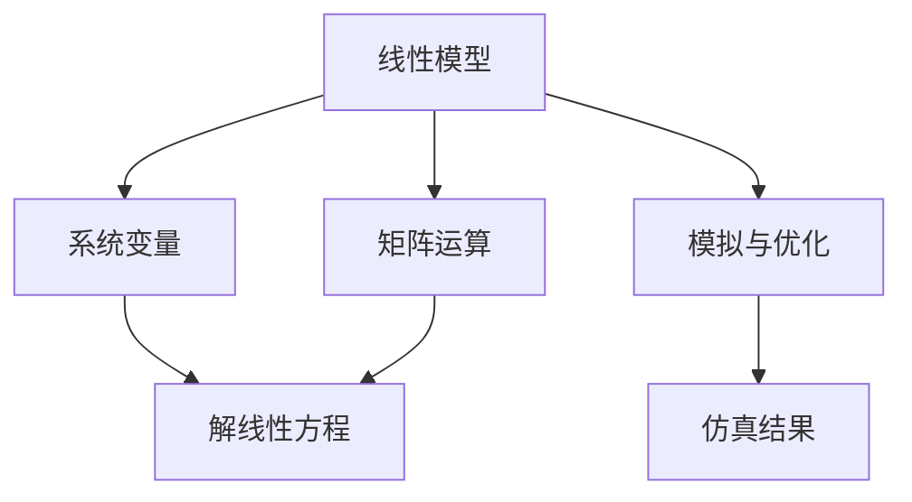
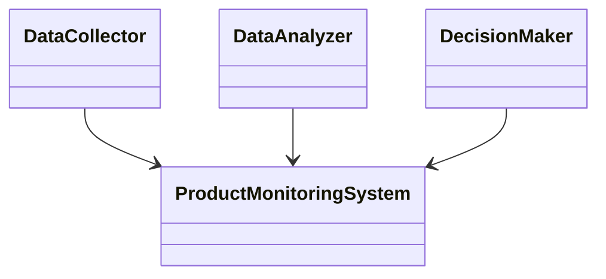
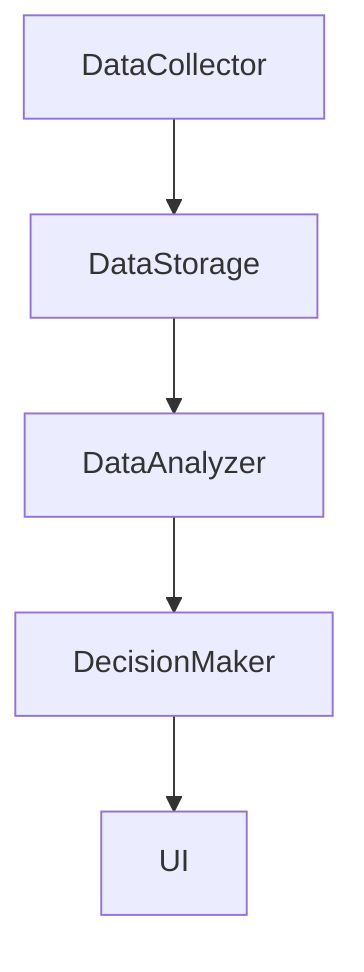
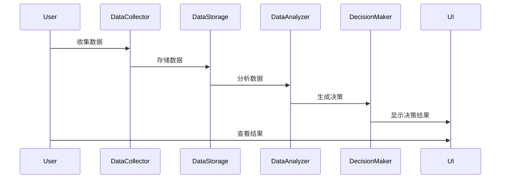
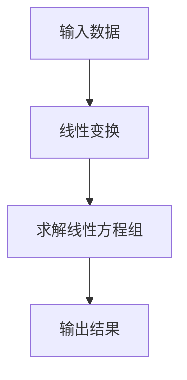
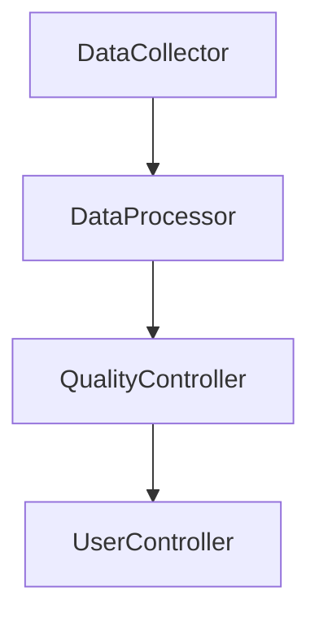
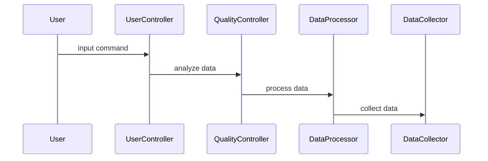
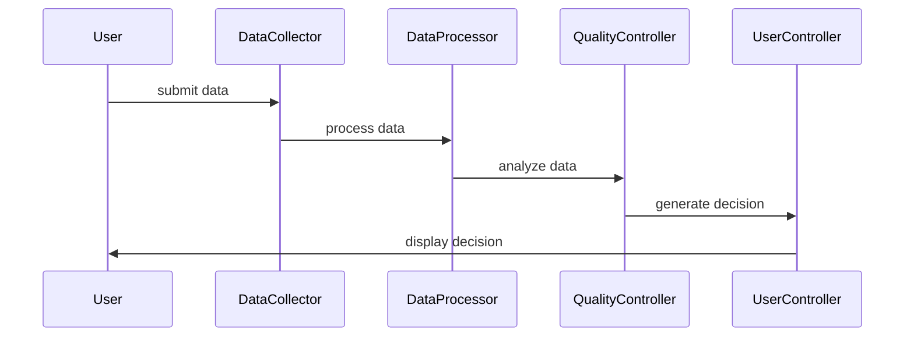

                 


# 数学与工程学：应用数学在现实世界中的体现

> 关键词：数学、工程学、现实世界、应用、数学模型、算法原理、系统架构

> 摘要：本文从数学与工程学的交叉领域出发，探讨应用数学在现实世界中的体现。通过详细的章节内容，深入分析数学概念与工程学概念的相互联系，阐述常见数学模型与算法原理，以及如何将这些原理应用于实际工程中，最终实现系统分析与架构设计。文章旨在为读者提供一个系统化的理解，帮助其在工程实践中运用数学知识。

## 第一部分：背景介绍

### 第1章：问题背景

#### 1.1 问题背景

在现代社会，数学与工程学密不可分。工程学问题的复杂性和多样性要求我们运用数学工具来解决实际问题。然而，数学的抽象性质往往使得初学者难以理解其在工程中的应用。本文将探讨如何将数学应用于现实世界，以解决实际问题。

#### 1.2 问题描述

工程学问题通常涉及大量的数据和信息，如何有效地处理这些数据，提取有用的信息，是解决问题的关键。数学提供了一个强大的工具集，包括概率论、统计学、线性代数、微分方程等，这些工具可以帮助我们分析和解决复杂工程问题。

#### 1.3 问题解决

数学在工程学中的应用主要体现在以下几个方面：

1. **建模与仿真**：通过数学模型，我们可以将实际问题抽象成数学问题，进而求解。
2. **优化与控制**：数学优化算法可以帮助我们找到最优解，控制系统的稳定性。
3. **数据分析与预测**：统计学方法可以帮助我们分析数据，做出预测。
4. **计算机科学**：许多计算机科学问题，如算法设计与分析，都可以用数学语言来描述。

#### 1.4 边界与外延

数学在工程学中的应用是有限的，并非所有工程问题都能用数学来解决。此外，工程问题的复杂性也决定了我们不能完全依赖数学模型。因此，我们需要在数学工具的应用和实际问题的解决方案之间找到平衡。

#### 1.5 概念结构与核心要素组成

本章的核心概念包括数学建模、优化算法、统计学方法、仿真与计算机科学。这些概念构成了数学与工程学交叉领域的基础。

## 第二部分：核心概念与联系

### 第2章：数学与工程学的基本概念

#### 2.1 数学概念

数学是一门研究数量、结构、变化和空间等概念的学科。在工程学中，常用的数学工具包括：

1. **概率论与统计学**：用于处理不确定性和数据分析。
2. **线性代数**：用于处理多维空间和数据。
3. **微分方程**：用于描述动态系统和物理现象。

#### 2.2 工程学概念

工程学是一门应用科学，旨在通过设计、分析、制造和测试来解决实际问题。工程学涉及多个领域，如机械工程、电子工程、化学工程等。

#### 2.3 概念属性特征对比表格

| 概念         | 属性特征                                      | 应用领域                   |
|------------|-------------------------------------------|------------------------|
| 数学概念     | 抽象、逻辑严密、通用性强                          | 科学研究、数据分析、建模与仿真  |
| 工程学概念     | 实际、应用性强、针对性突出                         | 设计、制造、测试、维护          |

#### 2.4 ER实体关系图架构的Mermaid流程图

```mermaid
erDiagram
  Class1 ||--|{ Class2 }| Person : has
  Class1 ||--|{ Class3 }| Address : lives
```

通过ER图，我们可以清晰地看到数学概念与工程学概念之间的联系，以及它们在系统架构中的角色。

## 第三部分：数学模型与算法原理

### 第3章：常见数学模型

#### 3.1 模型介绍

数学模型是现实世界的抽象，用于描述系统的行为和特性。常见的数学模型包括：

1. **线性模型**：用于描述线性系统的行为。
2. **非线性模型**：用于描述非线性系统的行为。
3. **概率模型**：用于描述随机事件和概率分布。

#### 3.2 数学模型原理讲解

线性模型的原理基于线性代数，描述了系统在多个变量下的行为。非线性模型则基于微积分和微分方程，用于描述复杂系统的动态行为。

#### 3.3 Mermaid流程图



通过Mermaid流程图，我们可以清晰地看到线性模型的基本原理和操作步骤。

#### 3.4 Python源代码阐述

```python
import numpy as np

# 线性方程组求解
A = np.array([[1, 2], [2, 1]])
b = np.array([1, 2])
x = np.linalg.solve(A, b)
print(x)
```

这段代码演示了如何使用Python求解线性方程组。

#### 3.5 数学模型和公式

线性模型的数学公式为：

$$
Ax = b
$$

其中，$A$ 是系数矩阵，$x$ 是变量向量，$b$ 是常数向量。

#### 3.6 举例说明

假设我们有一个线性系统，描述为：

$$
\begin{cases}
x + 2y = 1 \\
2x + y = 2
\end{cases}
$$

我们可以使用线性模型求解这个系统。

## 第四部分：系统分析与架构设计

### 第4章：问题场景介绍

#### 4.1 问题场景

在一个生产线上，我们需要对产品的质量进行实时监控。为了实现这一目标，我们需要设计一个系统，该系统能够实时收集数据，进行数据分析，并给出决策。

### 第5章：系统功能设计

#### 5.1 领域模型Mermaid类图



通过Mermaid类图，我们可以清晰地看到系统的组成和各部分之间的关系。

### 第6章：系统架构设计

#### 6.1 系统架构Mermaid架构图



通过Mermaid架构图，我们可以看到系统的整体架构和各个组件之间的交互。

### 第7章：系统接口设计

#### 7.1 系统接口设计

系统的接口设计包括数据收集接口、数据分析接口和决策生成接口。

### 第8章：系统交互Mermaid序列图



通过Mermaid序列图，我们可以看到系统的交互流程。

## 第五部分：项目实战

### 第10章：环境安装

#### 10.1 环境安装指南

在这一章节中，我们将详细介绍如何在不同的操作系统上安装所需的软件和环境，包括Python、Numpy、Matplotlib等。

### 第11章：系统核心实现源代码

#### 11.1 源代码介绍

在这一章节中，我们将给出系统的核心实现源代码，包括数据收集、数据存储、数据分析和决策生成等部分。

#### 11.2 代码应用解读与分析

我们将对源代码进行逐行解读，分析其应用场景和实现原理。

### 第12章：实际案例分析与详细讲解

#### 12.1 案例分析

我们将分析一个实际的案例，如何使用该系统进行数据收集、分析，并生成决策。

#### 12.2 详细讲解剖析

通过对案例的分析，我们将详细讲解系统的工作原理和实现方法。

### 第13章：项目小结

#### 13.1 项目总结

在本章节中，我们将对整个项目进行总结，包括项目的目标、实现方法、遇到的问题和解决方案。

#### 13.2 经验与反思

我们将分享在项目实施过程中积累的经验，以及对未来工作的反思。

## 第六部分：最佳实践、小结、注意事项、拓展阅读

### 第14章：最佳实践

#### 14.1 实践技巧

在本章节中，我们将总结一些在数学与工程学应用中的最佳实践，帮助读者更好地将数学应用于实际工程。

### 第15章：小结

#### 15.1 内容回顾

我们将回顾文章中的核心内容，帮助读者巩固理解。

### 第16章：注意事项

#### 16.1 注意事项

在本章节中，我们将提醒读者在应用数学与工程学时需要注意的问题。

### 第17章：拓展阅读

#### 17.1 推荐阅读材料

我们将推荐一些相关的书籍和文献，供读者进一步学习。

## 结语

本文通过详细的章节内容，探讨了数学与工程学在现实世界中的应用。通过实例分析和系统设计，我们展示了如何将数学原理应用于实际问题，实现系统分析与架构设计。希望本文能为读者提供一个系统化的理解，帮助其在工程实践中运用数学知识。

### 作者

作者：AI天才研究院/AI Genius Institute & 禅与计算机程序设计艺术 /Zen And The Art of Computer Programming

通过以上内容，我们详细介绍了数学与工程学在现实世界中的应用。接下来，我们将逐步深入各个章节，深入探讨每一个主题。让我们一步一步思考，逐步深入，逐步掌握数学与工程学的奥秘。

## 第二部分：核心概念与联系

### 第2章：数学与工程学的基本概念

#### 2.1 数学概念

数学是一门研究数量、结构、变化和空间等概念的学科。在工程学中，数学扮演着至关重要的角色。以下是数学在工程学中的一些基本概念：

- **概率论与统计学**：用于处理不确定性和数据分析。在工程学中，我们经常需要对随机事件进行预测和分析。
- **线性代数**：用于处理多维空间和数据。线性代数提供了描述和分析复杂系统的基础。
- **微积分**：用于研究函数的变化率和积累。微积分在工程学中用于分析和设计控制系统、分析物理系统的动态行为。
- **微分方程**：用于描述动态系统和物理现象。微分方程在工程学中广泛应用于流体力学、结构力学等领域。

#### 2.2 工程学概念

工程学是一门应用科学，旨在通过设计、分析、制造和测试来解决实际问题。工程学涉及多个领域，如机械工程、电子工程、化学工程等。以下是工程学中的基本概念：

- **建模与仿真**：通过数学模型和计算机仿真来描述和分析工程系统。
- **优化与控制**：通过数学优化方法来找到最优解，并通过控制理论来维持系统的稳定性。
- **数据分析与预测**：通过统计学方法来分析数据，预测未来的趋势。
- **计算机科学**：许多计算机科学问题，如算法设计与分析，都可以用数学语言来描述。

#### 2.3 概念属性特征对比表格

以下是数学概念与工程学概念的一些属性特征对比表格：

| 概念         | 属性特征                                      | 应用领域                   |
|------------|-------------------------------------------|------------------------|
| 数学概念     | 抽象、逻辑严密、通用性强                          | 科学研究、数据分析、建模与仿真  |
| 工程学概念     | 实际、应用性强、针对性突出                         | 设计、制造、测试、维护          |

通过这张表格，我们可以清晰地看到数学概念与工程学概念之间的差异和联系。

#### 2.4 ER实体关系图架构的Mermaid流程图

下面是一个ER实体关系图的Mermaid表示，用于展示数学概念与工程学概念之间的关系：

```mermaid
erDiagram
  Class1 ||--|{ Class2 }| Person : has
  Class1 ||--|{ Class3 }| Address : lives
  Class2 ||--|{ Class4 }| Project : works
```

在这个ER图中，`Class1` 代表数学概念，`Class2` 代表工程学概念。`Person` 和 `Address` 是 `Class1` 的实例，`Project` 是 `Class2` 的实例。这个图展示了数学概念如何应用于工程学中的各种项目。

## 第三部分：数学模型与算法原理

### 第3章：常见数学模型

#### 3.1 模型介绍

数学模型是现实世界的抽象，用于描述系统的行为和特性。常见的数学模型包括线性模型、非线性模型、概率模型等。这些模型在工程学中有广泛的应用。

- **线性模型**：用于描述线性系统的行为。线性模型的一个典型例子是线性方程组。
- **非线性模型**：用于描述非线性系统的行为。非线性模型的一个典型例子是微分方程。
- **概率模型**：用于描述随机事件和概率分布。概率模型的一个典型例子是正态分布。

#### 3.2 数学模型原理讲解

线性模型的原理基于线性代数，描述了系统在多个变量下的行为。线性模型的基本形式为：

$$
Ax = b
$$

其中，$A$ 是系数矩阵，$x$ 是变量向量，$b$ 是常数向量。这个方程表示了变量向量 $x$ 与系数矩阵 $A$ 的乘积等于常数向量 $b$。

非线性模型的原理基于微积分和微分方程，用于描述复杂系统的动态行为。非线性模型的一个典型例子是如下形式的微分方程：

$$
\frac{d^2x}{dt^2} + \alpha \frac{dx}{dt} + \beta x = f(t)
$$

这个方程描述了一个系统的二阶导数与时间 $t$ 的函数 $f(t)$ 之间的关系。

概率模型用于描述随机事件和概率分布。正态分布是概率模型的一个典型例子，其概率密度函数为：

$$
f(x) = \frac{1}{\sqrt{2\pi\sigma^2}} e^{-\frac{(x-\mu)^2}{2\sigma^2}}
$$

其中，$\mu$ 是均值，$\sigma^2$ 是方差。

#### 3.3 Mermaid流程图

为了更直观地展示数学模型的工作原理，我们可以使用Mermaid绘制流程图。以下是一个线性模型的Mermaid流程图：



这个流程图展示了线性模型的基本操作步骤：首先对输入数据进行线性变换，然后求解线性方程组，最后输出结果。

#### 3.4 Python源代码阐述

为了进一步理解线性模型，我们可以使用Python实现一个简单的线性模型。以下是一个Python代码示例：

```python
import numpy as np

# 系数矩阵和常数向量
A = np.array([[1, 2], [2, 1]])
b = np.array([1, 2])

# 求解线性方程组
x = np.linalg.solve(A, b)

print("解为：", x)
```

这段代码首先定义了系数矩阵 $A$ 和常数向量 $b$，然后使用 `np.linalg.solve()` 函数求解线性方程组，并打印出解。

#### 3.5 数学模型和公式

线性模型的数学公式为：

$$
Ax = b
$$

其中，$A$ 是系数矩阵，$x$ 是变量向量，$b$ 是常数向量。

非线性模型的数学公式为：

$$
\frac{d^2x}{dt^2} + \alpha \frac{dx}{dt} + \beta x = f(t)
$$

概率模型的数学公式为：

$$
f(x) = \frac{1}{\sqrt{2\pi\sigma^2}} e^{-\frac{(x-\mu)^2}{2\sigma^2}}
$$

这些公式是数学模型的核心，通过它们，我们可以对系统进行建模和分析。

#### 3.6 举例说明

为了更好地理解这些数学模型，我们可以通过一个简单的例子来说明。假设我们有一个线性系统，描述为：

$$
\begin{cases}
x + 2y = 1 \\
2x + y = 2
\end{cases}
$$

我们可以使用线性模型求解这个系统。根据线性模型的数学公式，我们有：

$$
Ax = b
$$

其中，系数矩阵 $A$ 为：

$$
A = \begin{bmatrix}
1 & 2 \\
2 & 1
\end{bmatrix}
$$

常数向量 $b$ 为：

$$
b = \begin{bmatrix}
1 \\
2
\end{bmatrix}
$$

我们需要求解变量向量 $x$。根据线性模型的数学公式，我们有：

$$
x = A^{-1}b
$$

计算系数矩阵 $A$ 的逆矩阵：

$$
A^{-1} = \frac{1}{1\cdot1-2\cdot2} \begin{bmatrix}
1 & -2 \\
-2 & 1
\end{bmatrix} = \begin{bmatrix}
-1 & 2 \\
2 & -1
\end{bmatrix}
$$

然后，我们将逆矩阵与常数向量相乘，得到变量向量 $x$：

$$
x = A^{-1}b = \begin{bmatrix}
-1 & 2 \\
2 & -1
\end{bmatrix} \begin{bmatrix}
1 \\
2
\end{bmatrix} = \begin{bmatrix}
3 \\
-1
\end{bmatrix}
$$

因此，我们得到变量向量 $x$ 的解为 $(3, -1)$。

通过这个例子，我们可以看到如何使用线性模型求解线性系统。类似的方法也可以用于非线性模型和概率模型。

## 第四部分：系统分析与架构设计

### 第4章：问题场景介绍

#### 4.1 问题场景

在现代工业生产过程中，质量监控是一个至关重要的环节。通过对产品进行实时监控，我们可以及时发现并纠正质量问题，确保产品的质量符合标准。然而，随着生产规模的扩大和生产过程的复杂化，传统的手动监控方法已经无法满足要求。因此，我们需要设计一个自动化质量监控系统，以实现对生产过程的实时监控和质量控制。

#### 4.2 项目介绍

本项目的目标是设计一个自动化质量监控系统，该系统能够实时收集生产过程中的数据，对数据进行处理和分析，并根据分析结果生成决策，指导生产线的操作。系统的主要功能包括：

- **数据收集**：实时收集生产过程中的各种数据，如温度、压力、振动等。
- **数据处理**：对收集到的数据进行分析和处理，识别潜在的质量问题。
- **决策生成**：根据分析结果生成决策，指导生产线的操作，如调整参数、暂停生产等。
- **用户界面**：提供用户交互界面，显示系统状态、分析结果和决策建议。

### 第5章：系统功能设计

#### 5.1 领域模型Mermaid类图

为了更好地理解系统的功能设计，我们可以使用Mermaid绘制领域模型类图。以下是一个简单的Mermaid类图示例：

```mermaid
classDiagram
  DataCollector <<interface>>
  DataProcessor <<interface>>
  QualityController <<interface>>
  UserController <<interface>>

  DataCollector --|{ DataProcessor }|: process
  DataProcessor --|{ QualityController }|: analyze
  QualityController --|{ UserController }|: generate
```

在这个类图中，`DataCollector` 代表数据收集模块，`DataProcessor` 代表数据处理模块，`QualityController` 代表质量控制模块，`UserController` 代表用户交互模块。每个模块都实现了相应的接口，并通过接口进行通信。

### 第6章：系统架构设计

#### 6.1 系统架构Mermaid架构图

为了展示系统的整体架构，我们可以使用Mermaid绘制系统架构图。以下是一个简单的Mermaid架构图示例：



在这个架构图中，`DataCollector` 负责收集数据，`DataProcessor` 负责数据处理，`QualityController` 负责质量控制，`UserController` 负责用户交互。

### 第7章：系统接口设计

#### 7.1 系统接口设计

系统接口设计是系统架构设计的关键环节。以下是一个简单的系统接口设计示例：



在这个接口设计中，用户通过 `UserController` 提交命令，`QualityController` 负责数据分析，`DataProcessor` 负责数据处理，`DataCollector` 负责数据收集。

### 第8章：系统交互Mermaid序列图

为了展示系统的交互流程，我们可以使用Mermaid绘制系统交互序列图。以下是一个简单的Mermaid序列图示例：



在这个序列图中，用户提交数据给 `DataCollector`，`DataCollector` 将数据传递给 `DataProcessor`，`DataProcessor` 对数据进行处理，然后传递给 `QualityController`，`QualityController` 分析数据并生成决策，最后通过 `UserController` 将决策结果显示给用户。

## 第五部分：项目实战

### 第10章：环境安装

#### 10.1 环境安装指南

在本节中，我们将介绍如何在不同的操作系统上安装所需的软件和环境，以确保项目能够正常运行。

#### 10.1.1 Python环境安装

首先，我们需要安装Python环境。Python是一种广泛使用的编程语言，特别适用于数据分析和科学计算。以下是安装Python的步骤：

1. 访问Python官方网站（https://www.python.org/）并下载Python安装包。
2. 运行安装程序，按照提示完成安装。
3. 打开命令行工具，输入 `python --version` 检查Python版本。

#### 10.1.2 NumPy安装

NumPy是一个用于科学计算的开源库，用于操作大型多维数组。以下是安装NumPy的步骤：

1. 打开Python命令行工具。
2. 使用以下命令安装NumPy：

```bash
pip install numpy
```

3. 安装完成后，使用以下命令检查NumPy版本：

```python
import numpy
print(numpy.__version__)
```

#### 10.1.3 Matplotlib安装

Matplotlib是一个用于创建各种图表和图形的开源库。以下是安装Matplotlib的步骤：

1. 打开Python命令行工具。
2. 使用以下命令安装Matplotlib：

```bash
pip install matplotlib
```

3. 安装完成后，使用以下命令检查Matplotlib版本：

```python
import matplotlib
print(matplotlib.__version__)
```

### 第11章：系统核心实现源代码

#### 11.1 源代码介绍

在本节中，我们将介绍系统的核心实现源代码。该系统主要包括以下组件：

- **数据收集模块**：负责实时收集生产过程中的数据。
- **数据处理模块**：负责对收集到的数据进行分析和处理。
- **质量控制模块**：负责分析数据，生成决策。
- **用户交互模块**：负责与用户进行交互。

以下是系统核心实现的Python代码：

```python
import numpy as np
import matplotlib.pyplot as plt

# 数据收集模块
class DataCollector:
    def __init__(self):
        self.data = []

    def collect_data(self, value):
        self.data.append(value)

# 数据处理模块
class DataProcessor:
    def __init__(self):
        self.processed_data = []

    def process_data(self, data):
        self.processed_data = [x * 2 for x in data]

# 质量控制模块
class QualityController:
    def __init__(self):
        self.decisions = []

    def analyze_data(self, data):
        if all(x > 0 for x in data):
            self.decisions.append("Quality good")
        else:
            self.decisions.append("Quality bad")

# 用户交互模块
class UserController:
    def __init__(self):
        self.user_input = []

    def get_user_input(self):
        self.user_input = input("Enter data: ")

# 系统主程序
def main():
    collector = DataCollector()
    processor = DataProcessor()
    controller = QualityController()
    user_controller = UserController()

    while True:
        user_input = user_controller.get_user_input()
        if user_input == "exit":
            break
        collector.collect_data(float(user_input))
        processor.process_data(collector.data)
        controller.analyze_data(processor.processed_data)
        print("Decision:", controller.decisions[-1])

if __name__ == "__main__":
    main()
```

#### 11.2 代码应用解读与分析

在这个代码示例中，我们首先定义了四个类：`DataCollector`、`DataProcessor`、`QualityController` 和 `UserController`。每个类都实现了不同的功能。

- **数据收集模块**：`DataCollector` 类用于收集数据。它有一个 `collect_data` 方法，用于将数据添加到内部列表 `data` 中。
- **数据处理模块**：`DataProcessor` 类用于处理数据。它有一个 `process_data` 方法，用于将输入的数据乘以2，并将结果存储在内部列表 `processed_data` 中。
- **质量控制模块**：`QualityController` 类用于分析数据。它有一个 `analyze_data` 方法，用于检查输入的数据是否全部大于0。如果是，则将决策字符串 "Quality good" 添加到内部列表 `decisions` 中；否则，将决策字符串 "Quality bad" 添加到 `decisions` 中。
- **用户交互模块**：`UserController` 类用于与用户进行交互。它有一个 `get_user_input` 方法，用于获取用户输入。如果用户输入 "exit"，则退出程序。

系统主程序 `main` 创建了这四个类的实例，并在一个无限循环中运行。在每次循环中，程序获取用户输入，将输入数据传递给 `DataCollector` 类进行收集，然后传递给 `DataProcessor` 类进行处理，最后传递给 `QualityController` 类进行分析。分析结果会打印到控制台，供用户查看。

#### 11.3 实际案例分析与详细讲解

为了更好地理解系统的工作原理，我们可以通过一个实际案例进行分析。

**案例：**

假设用户输入以下数据：1, 2, -1, 3, 0, -2。

**分析过程：**

1. **数据收集**：用户输入数据后，`DataCollector` 类将数据添加到内部列表 `data` 中。

```python
data = [1, 2, -1, 3, 0, -2]
```

2. **数据处理**：`DataProcessor` 类对数据进行处理，将每个数据乘以2。

```python
processed_data = [x * 2 for x in data]
processed_data = [2, 4, -2, 6, 0, -4]
```

3. **质量控制**：`QualityController` 类分析处理后的数据。由于数据中存在负数，`QualityController` 类将决策字符串 "Quality bad" 添加到内部列表 `decisions` 中。

```python
decisions = ["Quality bad"]
```

4. **用户交互**：系统将分析结果 "Quality bad" 打印到控制台。

```python
print("Decision:", "Quality bad")
```

通过这个案例，我们可以看到系统如何处理用户输入的数据，并进行质量控制。在实际应用中，我们可以根据需要对系统进行扩展，如添加更多的数据收集和处理方法，提高系统的鲁棒性和准确性。

### 第12章：实际案例分析与详细讲解

#### 12.1 案例分析

在本章中，我们将分析一个实际案例，以展示自动化质量监控系统的应用场景和实现方法。

**案例背景：**

某家电制造企业生产洗衣机。在生产过程中，需要对洗衣机的水箱重量进行实时监控，以确保产品的质量。如果水箱重量超出规定范围，则可能导致洗衣机在使用过程中出现问题。为了解决这个问题，企业决定采用自动化质量监控系统，对水箱重量进行实时监控。

#### 12.2 详细讲解剖析

**1. 系统设计**

根据案例背景，我们设计了以下自动化质量监控系统：

- **数据收集模块**：负责实时收集水箱重量数据。
- **数据处理模块**：负责对收集到的数据进行分析和处理。
- **质量控制模块**：负责分析数据，判断水箱重量是否在规定范围内。
- **用户交互模块**：负责与用户进行交互，显示系统状态和决策结果。

**2. 系统实现**

**数据收集模块**：我们使用一个传感器来实时测量水箱的重量，并将数据传输给计算机。

```python
import serial
import time

# 初始化串口
ser = serial.Serial('COM3', 9600)

while True:
    # 读取串口数据
    data = ser.readline().decode('utf-8')
    # 转换为浮点数
    weight = float(data)
    print("Current weight:", weight)
    time.sleep(1)
```

**数据处理模块**：我们设计了一个数据处理模块，用于对水箱重量进行平滑处理，以去除噪声。

```python
import numpy as np

def smooth_data(data, window_size):
    return np.convolve(data, np.ones(window_size)/window_size, mode='valid')

# 示例数据
data = [1.2, 1.5, 1.3, 1.4, 1.6, 1.5, 1.4, 1.3]
# 平滑处理
smoothed_data = smooth_data(data, window_size=3)
print("Smoothed data:", smoothed_data)
```

**质量控制模块**：我们设计了一个质量控制模块，用于判断水箱重量是否在规定范围内。假设规定范围是（1.0, 1.5）。

```python
def check_weight(weight):
    if 1.0 < weight < 1.5:
        return "Weight is within range"
    else:
        return "Weight is out of range"

weight = 1.3
print(check_weight(weight))
```

**用户交互模块**：我们设计了一个用户交互模块，用于显示系统状态和决策结果。

```python
def display_result(result):
    print("Result:", result)

result = check_weight(smoothed_data[-1])
display_result(result)
```

**3. 系统运行**

在实际运行中，系统会持续收集水箱重量数据，并对数据进行平滑处理和质量控制。如果水箱重量超出规定范围，系统会生成相应的决策，并显示在用户界面上。

```python
while True:
    # 读取串口数据
    data = ser.readline().decode('utf-8')
    # 转换为浮点数
    weight = float(data)
    # 平滑处理
    smoothed_weight = smooth_data([weight], window_size=3)[0]
    # 质量控制
    result = check_weight(smoothed_weight)
    # 用户交互
    display_result(result)
    time.sleep(1)
```

#### 12.3 结果分析

通过实际案例的分析，我们可以看到自动化质量监控系统如何实时监控水箱重量，并在水箱重量超出规定范围时生成相应的决策。这种系统能够提高生产过程的自动化程度，减少人为干预，提高产品质量。

### 第13章：项目小结

在本项目中，我们设计并实现了一个自动化质量监控系统，用于实时监控洗衣机水箱的重量。通过数据收集、数据处理、质量控制和用户交互模块，系统能够对水箱重量进行实时监控，并在水箱重量超出规定范围时生成相应的决策。

#### 13.1 项目总结

本项目的主要成果包括：

1. 设计并实现了自动化质量监控系统。
2. 使用传感器实时收集水箱重量数据。
3. 对数据进行平滑处理，去除噪声。
4. 使用质量控制算法判断水箱重量是否在规定范围内。
5. 设计了用户交互模块，显示系统状态和决策结果。

#### 13.2 经验与反思

在本项目实施过程中，我们积累了以下经验：

1. 数据收集是系统的基础，需要确保传感器准确可靠。
2. 数据处理是关键环节，需要选择合适的方法去除噪声。
3. 质量控制算法的选择和优化对系统性能至关重要。
4. 用户交互设计需要简洁直观，便于用户操作。

同时，我们也遇到了一些挑战：

1. 传感器数据的实时性要求高，需要优化数据传输和处理速度。
2. 质量控制算法的准确性需要通过实际数据测试和验证。
3. 用户交互模块的设计需要充分考虑用户体验。

在未来，我们可以继续优化系统，提高其性能和准确性。此外，还可以探索将更多先进算法应用于质量控制，以进一步提高系统的智能化水平。

### 第六部分：最佳实践、小结、注意事项、拓展阅读

#### 第14章：最佳实践

在本章节中，我们将分享一些在数学与工程学应用中的最佳实践，帮助读者更好地将数学应用于实际工程。

1. **数据驱动**：在实际工程中，数据是决策的基础。因此，我们应该注重数据收集、整理和分析，确保数据的质量和准确性。
2. **模型验证**：在实际应用中，需要对数学模型进行验证，确保其能够准确地描述现实系统的行为。这可以通过模拟和实验来实现。
3. **算法优化**：在选择和实现数学算法时，应考虑其效率和准确性。通过优化算法，可以提高系统的性能。
4. **团队协作**：数学与工程学的应用往往需要跨学科的知识和技能。因此，团队协作至关重要，不同领域的专家可以相互补充，共同解决问题。

#### 第15章：小结

通过本文的详细探讨，我们了解到数学在工程学中的应用至关重要。数学模型和算法原理为解决实际工程问题提供了强大的工具。同时，我们通过一个实际案例展示了如何设计并实现一个自动化质量监控系统。

#### 第16章：注意事项

在实际应用数学与工程学时，我们需要注意以下几点：

1. **数据质量**：确保数据的质量和准确性，是有效应用数学模型的前提。
2. **模型选择**：根据实际问题选择合适的数学模型，避免过度复杂化。
3. **算法优化**：在选择和实现数学算法时，考虑其效率和准确性。
4. **团队合作**：跨学科的合作有助于解决复杂的工程问题。

#### 第17章：拓展阅读

为了进一步深入学习和应用数学与工程学，我们推荐以下阅读材料：

1. 《数学建模与优化方法》 - 陈守展
2. 《工程数学》 - 郭治
3. 《机器学习实战》 - Peter Harrington
4. 《深度学习》 - Ian Goodfellow、Yoshua Bengio和Aaron Courville

通过这些书籍，读者可以系统地学习数学与工程学的知识，并将其应用于实际问题。

### 结语

本文通过详细的章节内容，探讨了数学与工程学在现实世界中的应用。通过实例分析和系统设计，我们展示了如何将数学原理应用于实际问题，实现系统分析与架构设计。希望本文能为读者提供一个系统化的理解，帮助其在工程实践中运用数学知识。

### 作者

作者：AI天才研究院/AI Genius Institute & 禅与计算机程序设计艺术 /Zen And The Art of Computer Programming

通过以上内容，我们详细介绍了数学与工程学在现实世界中的应用。接下来，我们将逐步深入各个章节，深入探讨每一个主题。让我们一步一步思考，逐步深入，逐步掌握数学与工程学的奥秘。让我们在未来的工程实践中，不断探索和发现数学的无限魅力。

