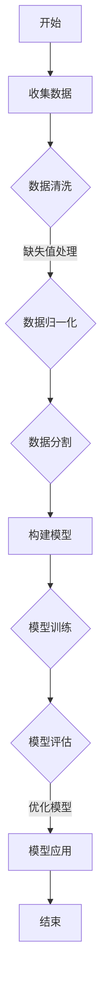

                 


## 第1章 绪论

### 1.1 研究背景与意义

#### 数学在市场营销中的重要性

在当今的商业环境中，市场营销策略的制定和优化变得越来越复杂。随着大数据、人工智能等技术的发展，市场营销活动产生了海量的数据，如何有效地分析和利用这些数据，成为企业成功的关键。数学作为一种逻辑严密、量化精确的工具，为市场营销提供了强大的支持。

**数据分析和决策优化**是数学在市场营销中最直接的应用。通过对市场数据的深入分析，企业可以了解消费者的行为模式、需求偏好，从而制定更精准的营销策略。例如，使用回归分析可以预测销售额，通过聚类分析可以识别潜在客户群体，这些方法都基于数学模型。

**价格策略和产品定位**也是市场营销中至关重要的环节。通过数学模型，企业可以分析不同价格策略对销售量的影响，找到最优的价格点。同时，产品定位的数学建模可以帮助企业确定自己在市场中的位置，以最大限度地满足消费者的需求。

**客户行为分析和客户关系管理**同样依赖于数学方法。通过分析客户行为数据，企业可以识别高价值客户，制定个性化的营销方案，提升客户忠诚度。数学模型可以帮助企业更好地理解客户需求，从而提高客户满意度和保持率。

#### 营销策略的数学分析

营销策略的数学分析是指运用数学模型和方法对市场营销的各种策略进行分析和评估。这种分析方法不仅能够提高营销决策的科学性，还能提升营销策略的有效性。

**预测市场趋势**是营销策略数学分析的重要应用之一。通过时间序列分析、回归分析等方法，企业可以预测市场未来的发展趋势，从而提前制定应对策略。

**评估营销效果**也是数学分析的重要任务。通过A/B测试、多变量分析等方法，企业可以评估不同营销策略的效果，从而选择最有效的策略。

**优化营销资源配置**是数学分析在市场营销中的另一大应用。通过线性规划、动态规划等方法，企业可以找到最优的营销资源配置方案，最大限度地提高营销效率。

### 1.2 研究目的与内容

本研究的主要目的是探讨数学在市场营销中的应用，通过数学模型和方法优化营销策略，提高营销效率和企业竞争力。

**研究内容**主要包括：

1. **数学基础**：介绍市场营销中常用的数学基础概念和方法，如概率论、线性代数等。
2. **数据分析**：探讨如何收集、处理和存储市场营销数据，以及如何进行描述性统计分析和聚类分析。
3. **营销策略的数学建模**：分析价格策略、产品定位策略和客户行为分析的数学建模方法。
4. **营销决策分析**：研究营销决策的类型、过程和方法，特别是多目标决策和风险决策。
5. **案例研究**：通过具体案例展示数学分析方法在市场营销中的应用。
6. **总结与展望**：总结研究成果，讨论存在的问题和未来研究方向。

### 1.3 研究方法与框架

本研究采用定量分析和实证分析相结合的方法。首先，通过文献综述和专家访谈，确定研究的关键概念和理论框架。然后，通过数据分析、模型构建和案例研究等方法，验证理论框架的可行性和有效性。

研究框架主要包括以下几个部分：

1. **数学基础**：介绍市场营销中常用的数学基础概念和方法。
2. **数据分析**：探讨数据收集、处理和存储的方法，以及描述性统计分析和聚类分析。
3. **营销策略的数学建模**：分析价格策略、产品定位策略和客户行为分析的数学建模方法。
4. **营销决策分析**：研究营销决策的类型、过程和方法，特别是多目标决策和风险决策。
5. **案例研究**：通过具体案例展示数学分析方法在市场营销中的应用。
6. **总结与展望**：总结研究成果，讨论存在的问题和未来研究方向。

通过上述研究方法和框架，本研究旨在为市场营销提供一种科学、系统的分析方法，帮助企业制定更有效的营销策略，提高市场竞争力和盈利能力。

----------------------------------------------------------------

## 第2章 数学基础

### 2.1 数学在市场营销中的基本概念

在市场营销中，数学作为工具和语言，具有不可替代的重要性。数学的基本概念和方法不仅帮助市场营销人员更好地理解市场数据，还能够为制定和优化营销策略提供科学依据。

#### 常用数学概念

1. **概率论**：概率论是市场营销中常用的数学工具，用于描述和预测市场中的不确定性事件。在市场营销中，概率论可以用来分析市场风险、预测客户行为等。
2. **线性代数**：线性代数主要研究向量、矩阵以及它们之间的关系。在市场营销中，线性代数可以用来处理复杂数据，如客户行为数据、销售数据等。
3. **微积分**：微积分主要研究函数的极限、导数和积分。在市场营销中，微积分可以用来分析价格策略、产品定位策略等。
4. **统计学**：统计学是一门应用广泛的数学学科，用于收集、分析、解释和展示数据。在市场营销中，统计学可以用来分析市场数据、评估营销效果等。

#### 数学工具在市场营销中的应用

1. **数据收集与处理**：数学工具可以帮助市场营销人员有效地收集和处理市场数据。例如，通过统计学方法，可以识别数据中的趋势和模式，为营销决策提供支持。
2. **预测市场趋势**：通过时间序列分析和回归分析等数学方法，市场营销人员可以预测市场未来的发展趋势，为制定营销策略提供依据。
3. **优化营销资源配置**：线性规划和动态规划等数学方法可以帮助企业优化营销资源配置，提高营销效率。
4. **评估营销效果**：通过数学模型和方法，市场营销人员可以评估不同营销策略的效果，选择最有效的策略。

### 2.2 概率论基础

概率论是数学的一个重要分支，它研究随机事件和它们发生的可能性。在市场营销中，概率论可以用于分析市场风险、预测客户行为等。

#### 概率论的基本概念

1. **随机事件**：随机事件是指可能发生也可能不发生的事件。例如，在市场营销中，一个随机事件可以是某个新产品能否成功上市。
2. **概率**：概率是指随机事件发生的可能性。概率的取值范围在0到1之间，其中0表示不可能发生，1表示必然发生。
3. **条件概率**：条件概率是指在已知某个事件发生的条件下，另一个事件发生的概率。条件概率可以用来分析市场中的相关性问题。
4. **独立事件**：独立事件是指两个事件的发生互不影响。例如，在市场营销中，某个广告的效果与另一个促销活动的影响是独立的。

#### 概率分布

概率分布是指随机事件发生概率的分布情况。常见的概率分布有：

1. **均匀分布**：均匀分布是指每个事件发生的概率相等。在市场营销中，均匀分布可以用来分析市场中的不确定性事件。
2. **正态分布**：正态分布是一种最常见的概率分布，它描述了大多数数据集的分布情况。在市场营销中，正态分布可以用来预测客户行为和销售额。
3. **二项分布**：二项分布用于描述在固定次数的试验中，某个事件发生的次数。在市场营销中，二项分布可以用来分析促销活动的效果。

#### 市场风险评估

市场风险评估是市场营销中一个重要的环节，它涉及对市场风险的概率和影响进行评估。

1. **风险矩阵**：风险矩阵是一种常用的工具，用于评估市场风险的概率和影响。通过风险矩阵，市场营销人员可以识别和优先处理高风险事件。
2. **敏感性分析**：敏感性分析是一种数学方法，用于评估某个变量对结果的影响。在市场营销中，敏感性分析可以用来确定哪些因素对营销策略的影响最大。

### 2.3 线性代数基础

线性代数是数学的一个分支，主要研究向量、矩阵以及它们之间的关系。在市场营销中，线性代数可以用于处理复杂数据，如客户行为数据、销售数据等。

#### 矩阵与向量

1. **向量**：向量是一种数学对象，表示具有大小和方向的量。在市场营销中，向量可以用来表示客户行为、销售量等。
2. **矩阵**：矩阵是一种由数字组成的二维数组。在市场营销中，矩阵可以用来表示客户数据、产品数据等。

#### 线性方程组

线性方程组是一组线性方程，可以通过矩阵形式表示。在市场营销中，线性方程组可以用来解决多变量问题，如优化营销资源配置。

1. **解线性方程组**：解线性方程组是线性代数中的基本问题。通过高斯消元法、矩阵求逆等方法，可以求解线性方程组的解。
2. **线性规划**：线性规划是一种数学方法，用于在约束条件下最大化或最小化目标函数。在市场营销中，线性规划可以用来优化营销资源配置。

#### 市场份额分析

市场份额分析是市场营销中一个重要的研究领域，它涉及分析企业产品在市场中所占的份额。

1. **市场份额的定义**：市场份额是指企业产品在市场中所占的份额。市场份额可以用来衡量企业的市场地位和竞争力。
2. **市场份额的计算**：市场份额可以通过以下公式计算：
   \[
   市场份额 = （企业销售额 / 市场总销售额） \times 100%
   \]
3. **市场份额分析**：通过市场份额分析，企业可以了解自己在市场中的地位，制定相应的营销策略。

### 2.4 数学模型在市场营销中的应用

数学模型在市场营销中具有广泛的应用。通过数学模型，企业可以更好地理解市场数据，制定和优化营销策略。

1. **预测模型**：预测模型可以用来预测市场趋势、客户行为等。常见的预测模型有时间序列模型、回归模型等。
2. **优化模型**：优化模型可以用来优化营销资源配置、定价策略等。常见的优化模型有线性规划、动态规划等。
3. **决策模型**：决策模型可以用来评估不同营销策略的效果，选择最优策略。常见的决策模型有A/B测试、多目标决策等。

通过数学模型的应用，企业可以更科学地制定营销策略，提高市场竞争力。

----------------------------------------------------------------

### 第3章 数据分析

在市场营销中，数据分析是至关重要的环节，它不仅帮助我们从大量的市场数据中提取有价值的信息，还能为制定和优化营销策略提供科学依据。本章将详细介绍数据收集与处理、描述性统计分析以及聚类分析，并探讨这些方法在市场营销中的应用。

#### 3.1 数据收集与处理

数据收集是数据分析的第一步，也是最为关键的一步。市场营销数据可以来源于多种渠道，如社交媒体、销售记录、市场调研、客户反馈等。

1. **数据来源**：

   - **销售数据**：包括销售额、销售量、销售渠道等信息。
   - **客户数据**：包括客户基本信息、购买记录、消费行为等。
   - **市场调研数据**：包括市场调查问卷、焦点小组讨论、在线调查等。

2. **数据清洗**：数据收集后，常常存在一些不完整、不准确或异常的数据，这些数据称为“脏数据”。数据清洗是指通过删除重复记录、处理缺失值、纠正错误数据等方法，将数据转换为适合分析的形式。

   - **删除重复记录**：通过识别和删除重复的数据记录，可以减少数据冗余。
   - **处理缺失值**：缺失值处理方法包括删除缺失数据、用平均值或中位数填充缺失值等。
   - **纠正错误数据**：通过数据验证和校验，识别并纠正错误数据。

3. **数据存储与管理**：处理后的数据需要存储和管理，以便后续分析和查询。

   - **数据库**：使用数据库存储和管理大规模数据，如MySQL、Oracle等。
   - **数据仓库**：数据仓库是一个用于存储、管理和分析大规模数据的系统，如Amazon Redshift、Google BigQuery等。
   - **数据湖**：数据湖是一种分布式存储系统，用于存储大量非结构化和半结构化数据，如Apache Hadoop、Amazon S3等。

#### 3.2 描述性统计分析

描述性统计分析是对数据的基本特征进行统计和分析，如数据的集中趋势、离散程度、分布形态等。描述性统计分析为市场营销人员提供直观的数据视图，帮助他们理解市场数据的整体情况。

1. **均值与方差**：

   - **均值**：均值（平均数）是数据集中趋势的度量，表示数据的平均水平。计算公式为：
     \[
     \text{均值} = \frac{\sum_{i=1}^{n} x_i}{n}
     \]
     其中，\(x_i\) 表示第 \(i\) 个数据点，\(n\) 表示数据点的总数。

   - **方差**：方差是数据离散程度的度量，表示数据点相对于均值的平均偏离程度。计算公式为：
     \[
     \text{方差} = \frac{\sum_{i=1}^{n} (x_i - \text{均值})^2}{n}
     \]

2. **频率分布**：频率分布是将数据按照一定的区间分组，统计每个区间内数据点的数量。频率分布可以通过条形图、直方图等形式展示，帮助市场营销人员了解数据的分布情况。

3. **中位数与众数**：

   - **中位数**：中位数是将数据从小到大排列，位于中间位置的数值。中位数能够反映数据的中心位置，尤其适用于偏斜分布的数据。
   - **众数**：众数是数据中出现次数最多的数值。众数能够反映数据的典型值，尤其是在数据集中存在多个峰值时。

#### 3.3 相关性分析

相关性分析用于研究两个或多个变量之间的线性关系。在市场营销中，相关性分析可以帮助我们了解不同变量之间的关系，从而制定更有效的营销策略。

1. **皮尔逊相关系数**：皮尔逊相关系数是衡量两个连续变量之间线性相关程度的指标。相关系数的取值范围在-1到1之间，接近1表示强正相关，接近-1表示强负相关，接近0表示无相关。

   - **计算公式**：
     \[
     r = \frac{\sum_{i=1}^{n} (x_i - \bar{x})(y_i - \bar{y})}{\sqrt{\sum_{i=1}^{n} (x_i - \bar{x})^2 \sum_{i=1}^{n} (y_i - \bar{y})^2}}
     \]
     其中，\(\bar{x}\) 和 \(\bar{y}\) 分别表示 \(x\) 和 \(y\) 的均值。

2. **散点图**：散点图是一种用于展示两个变量之间关系的图形。通过散点图，市场营销人员可以直观地了解变量之间的线性关系。

#### 3.4 聚类分析

聚类分析是将数据集划分为若干个簇的过程，使得同一个簇中的数据点彼此相似，而不同簇的数据点则彼此相异。聚类分析在市场营销中广泛应用于市场细分、客户细分等。

1. **聚类分析的基本概念**：

   - **簇**：簇是指一组数据点，它们在某种意义上是相似的。
   - **聚类**：聚类是将数据集划分为多个簇的过程。

2. **聚类分析方法**：

   - **K-means算法**：K-means算法是一种最流行的聚类算法，其目标是找到K个簇，使得每个簇的内部距离最小，而簇与簇之间的距离最大。
   - **层次聚类**：层次聚类是一种自下而上的聚类方法，通过逐步合并相似的簇，最终形成树状结构。
   - **密度聚类**：密度聚类是基于数据点在空间中的密度分布进行聚类的方法，常用于高维数据的聚类。

3. **市场细分**：市场细分是指将市场划分为若干个具有相似需求的子市场。通过聚类分析，市场营销人员可以识别出潜在的客户群体，从而制定有针对性的营销策略。

   - **市场细分指标**：市场细分指标包括购买力、消费习惯、地理位置等。
   - **市场细分方法**：市场细分方法包括K-means聚类、层次聚类、基于密度的聚类等。

通过本章的介绍，我们可以看到数据分析在市场营销中的重要性。从数据收集与处理，到描述性统计分析和相关性分析，再到聚类分析，每一种方法都有其独特的应用场景和价值。掌握这些数据分析方法，有助于市场营销人员更好地理解市场数据，制定和优化营销策略，提高市场竞争力。

----------------------------------------------------------------

### 第4章 营销策略的数学建模

营销策略的数学建模是将数学理论和方法应用于市场营销，以便更科学、更有效地制定和优化营销策略。本章将介绍几种常见的营销策略，包括价格策略、产品定位策略和客户细分策略，并探讨这些策略的数学建模方法。

#### 4.1 营销策略概述

营销策略是指企业在市场营销过程中所采取的一系列行动和决策，旨在实现企业的市场目标和商业价值。营销策略的类型多种多样，包括价格策略、产品定位策略、促销策略、渠道策略等。每种策略都有其独特的目标和方法。

1. **价格策略**：价格策略是指企业根据市场需求、成本结构和竞争状况制定的价格策略。价格策略的目标是最大化利润、提高市场份额、满足消费者需求等。
   
2. **产品定位策略**：产品定位策略是指企业根据市场需求和竞争状况，为产品在市场中确定一个独特的位置。产品定位的目标是满足消费者的特定需求，形成品牌认知和竞争优势。

3. **客户细分策略**：客户细分策略是指将市场划分为若干个子市场，针对不同的子市场制定不同的营销策略。客户细分的目标是提高客户满意度和忠诚度，提高营销效果。

#### 4.2 价格策略的数学建模

价格策略的数学建模主要涉及价格弹性、价格歧视和价格策略优化等方面。

1. **价格弹性**

   - **价格弹性的定义**：价格弹性是指需求量对价格变化的敏感程度。价格弹性可以分为需求价格弹性和供给价格弹性。需求价格弹性表示价格变动对需求量的影响，供给价格弹性表示价格变动对供给量的影响。
   
   - **计算公式**：
     \[
     \text{需求价格弹性} = \frac{\text{需求量的变化率}}{\text{价格的变化率}}
     \]
   
   - **价格弹性的应用**：价格弹性可以用于分析不同价格策略的效果。例如，如果需求价格弹性较大，降低价格可以显著增加需求量，从而提高销售额。如果需求价格弹性较小，提高价格可能会增加利润。

2. **价格歧视**

   - **价格歧视的定义**：价格歧视是指企业根据不同消费者群体或不同市场制定不同的价格策略。价格歧视可以分为一级价格歧视、二级价格歧视和三级价格歧视。
   
   - **价格歧视的应用**：价格歧视可以帮助企业提高利润和市场占有率。例如，一级价格歧视可以通过个性化定价策略最大化每个消费者的支付意愿，从而提高利润。

3. **价格策略优化**

   - **线性规划模型**：线性规划模型可以用于优化价格策略。线性规划模型的目标是在约束条件下最大化利润或最小化成本。
   
   - **计算公式**：
     \[
     \text{最大化} \ \ Z = \sum_{i=1}^{n} c_i x_i
     \]
     其中，\(c_i\) 是第 \(i\) 种产品的利润系数，\(x_i\) 是第 \(i\) 种产品的销售量。

   - **应用示例**：假设企业有两种产品A和B，每种产品的成本、销售量和利润如下表：

     | 产品 | 成本（元） | 销售量（件） | 利润（元/件） |
     | ---- | ---- | ---- | ---- |
     | A | 100 | 100 | 200 |
     | B | 150 | 150 | 300 |

     使用线性规划模型，企业可以确定最优的销售量，以最大化利润。

     \[
     \text{最大化} \ Z = 200x_A + 300x_B
     \]
     \[
     \text{约束条件}：
     \begin{cases}
     100x_A + 150x_B \leq 15000 \\
     x_A \geq 0 \\
     x_B \geq 0
     \end{cases}
     \]

#### 4.3 产品定位策略的数学建模

产品定位策略的数学建模主要涉及产品定位的数学概念、模型构建和策略分析。

1. **产品定位的数学概念**

   - **产品定位的维度**：产品定位的维度包括价格、质量、功能、品牌等。每个维度都可以用数学模型进行描述。

   - **产品定位的数学模型**：可以使用线性模型、多元回归模型等来描述产品定位。例如，可以使用多元回归模型分析不同维度对产品定位的影响。

2. **产品定位的模型构建**

   - **多元回归模型**：
     \[
     y = \beta_0 + \beta_1 x_1 + \beta_2 x_2 + \cdots + \beta_n x_n
     \]
     其中，\(y\) 是产品定位的得分，\(x_1, x_2, \cdots, x_n\) 是产品定位的维度，\(\beta_0, \beta_1, \beta_2, \cdots, \beta_n\) 是回归系数。

   - **应用示例**：假设产品定位的维度包括价格（\(x_1\)）、质量（\(x_2\)）和品牌（\(x_3\)），可以使用以下多元回归模型进行分析：

     \[
     y = \beta_0 + \beta_1 x_1 + \beta_2 x_2 + \beta_3 x_3
     \]

     通过收集市场数据，可以估计回归系数，从而确定产品定位的得分。

3. **产品定位的策略分析**

   - **竞争分析**：通过分析竞争对手的产品定位，可以确定本企业的产品定位策略。例如，如果竞争对手的产品定位在高端市场，本企业可以定位在中等价位市场，以差异化竞争。

   - **目标市场分析**：通过市场调研，可以确定目标市场的偏好，从而制定产品定位策略。例如，如果目标市场的消费者更注重产品质量，企业可以将产品质量作为产品定位的核心维度。

#### 4.4 客户细分策略的数学建模

客户细分策略的数学建模主要涉及客户细分的指标、方法和策略。

1. **客户细分的指标**

   - **购买力**：购买力是指客户愿意为产品支付的价格。
   
   - **消费习惯**：消费习惯是指客户的购买频率、购买方式等。
   
   - **地理位置**：地理位置是指客户所在的地理位置。

2. **客户细分的方法**

   - **聚类分析**：聚类分析可以将客户划分为不同的群体，每个群体具有相似的特征。常用的聚类分析方法包括K-means聚类、层次聚类等。

   - **因子分析**：因子分析可以识别影响客户行为的潜在因子，从而进行客户细分。

3. **客户细分策略**

   - **个性化营销**：根据不同的客户群体，制定个性化的营销策略，以提高客户满意度和忠诚度。
   
   - **差异定价**：根据客户群体的不同，采用差异化的定价策略，以提高市场份额和利润。

   - **定制化产品**：针对特定的客户群体，开发定制化的产品，以满足客户的需求。

通过本章的介绍，我们可以看到数学建模在营销策略中的重要性。从价格策略、产品定位策略到客户细分策略，每种策略都可以通过数学模型进行建模和分析，从而为企业提供科学的决策依据，提高营销效果和市场竞争力。

----------------------------------------------------------------

### 第5章 客户行为分析

客户行为分析是市场营销中至关重要的一环，它涉及到对消费者在购买、使用、推荐等环节中的行为模式进行分析，从而为制定精准的营销策略提供依据。本章将介绍客户行为分析的基本概念、类型及其在市场营销中的意义。

#### 5.1 客户行为概述

**客户行为**是指消费者在购买、使用和推荐产品或服务时所表现出来的所有行为和反应。客户行为分析旨在深入了解消费者行为背后的动机、偏好和决策过程，以便企业能够更好地满足客户需求，提升客户满意度和忠诚度。

1. **客户行为的概念**

   - **购买行为**：消费者在购买过程中所表现出来的行为，包括信息搜索、产品评估、购买决策和购买实施等。
   - **使用行为**：消费者在购买后使用产品或服务的行为，包括使用习惯、使用频率、满意度等。
   - **推荐行为**：消费者在购买后向他人推荐产品或服务的行为，包括口碑传播、社交媒体分享等。

2. **客户行为的类型**

   - **理性购买行为**：消费者在购买过程中充分考虑产品特性、价格、品牌等因素，做出理性的购买决策。
   - **感性购买行为**：消费者在购买过程中主要受情感驱动，而非理性分析，例如冲动消费、情感投资等。
   - **重复购买行为**：消费者在多次购买同一产品或服务，形成习惯性购买。
   - **推荐行为**：消费者在购买后对产品或服务满意，进而向他人推荐。

3. **客户行为分析的意义**

   - **了解客户需求**：通过分析客户行为，企业可以更准确地把握客户需求，从而开发出更符合市场需求的产品和服务。
   - **优化营销策略**：客户行为分析可以帮助企业识别有效的营销策略，提高营销活动的效果和转化率。
   - **提升客户满意度**：通过分析客户使用行为和推荐行为，企业可以提供更加个性化的服务和体验，提升客户满意度。
   - **降低客户流失率**：通过分析客户流失的原因，企业可以采取针对性的措施，降低客户流失率，提高客户忠诚度。

#### 5.2 客户细分

客户细分是将市场划分为若干个子市场，每个子市场具有相似的特征和行为模式。通过客户细分，企业可以更有针对性地制定营销策略，提高营销效果。

1. **客户细分的概念**

   - **客户细分**：根据客户的特征、需求和行为，将客户划分为不同的群体。
   - **细分指标**：客户细分的指标包括购买力、消费习惯、地理位置、购买行为等。

2. **客户细分的指标**

   - **购买力**：消费者的支付能力和消费水平。
   - **消费习惯**：消费者购买产品的频率、购买方式、购买时间等。
   - **地理位置**：消费者的居住地点、区域特征等。
   - **购买行为**：消费者在购买过程中的行为模式，包括购买渠道、购买时机、购买决策过程等。

3. **客户细分的方法**

   - **描述性细分**：根据客户的特征和行为进行描述性分类，如人口统计细分、地理细分、心理细分等。
   - **行为细分**：根据消费者的购买行为进行分类，如高频消费者、低频消费者、忠诚客户等。
   - **需求细分**：根据消费者的需求差异进行分类，如高端需求、低端需求、特殊需求等。
   - **价值细分**：根据客户对企业的价值进行分类，如高价值客户、中价值客户、低价值客户等。

4. **客户细分策略**

   - **差异化营销**：针对不同细分市场的客户特点，制定差异化的营销策略，提高营销活动的针对性。
   - **个性化服务**：根据客户细分结果，提供个性化的服务和体验，满足不同客户的需求。
   - **精准营销**：通过分析客户行为数据，实施精准的营销活动，提高营销效果和转化率。

#### 5.3 客户忠诚度分析

客户忠诚度是指客户对企业的品牌、产品和服务保持长期信任和持续购买的行为倾向。高忠诚度客户是企业稳定的收入来源和持续增长的动力。

1. **客户忠诚度的概念**

   - **客户忠诚度**：客户对企业的品牌、产品和服务保持长期信任和持续购买的行为倾向。
   - **忠诚度指标**：常用的忠诚度指标包括重复购买率、客户满意度、客户保留率、推荐率等。

2. **客户忠诚度的测量**

   - **重复购买率**：客户在一定时间内重复购买同一产品或服务的频率。
   - **客户满意度**：客户对企业产品和服务的主观评价和满意度。
   - **客户保留率**：客户在一定时间内继续购买同一品牌或产品或服务的比例。
   - **推荐率**：客户向他人推荐企业产品或服务的意愿和频率。

3. **提高客户忠诚度的策略**

   - **个性化营销**：根据客户的购买历史和行为习惯，提供个性化的产品推荐和优惠活动，提升客户体验。
   - **优质服务**：提供高质量的售后服务和客户支持，解决客户问题，增强客户满意度。
   - **品牌建设**：建立强大的品牌形象，提高品牌认知度和美誉度，增强客户信任。
   - **会员计划**：通过会员制度，提供会员专享的优惠、服务和特权，增加客户粘性。
   - **客户互动**：通过社交媒体、邮件、电话等方式，与客户保持互动，增进客户关系。

通过本章的介绍，我们可以看到客户行为分析在市场营销中的重要性。从客户行为的概述到客户细分和客户忠诚度分析，每一种分析方法和策略都有其独特的应用场景和价值。掌握客户行为分析方法，有助于企业更好地了解客户需求，制定精准的营销策略，提高市场竞争力。

----------------------------------------------------------------

### 第6章 营销决策分析

营销决策分析是市场营销中的核心环节，它涉及企业在制定营销策略时所做的各种决策。本章将探讨营销决策分析的基本概念、类型和过程，以及多目标决策分析和风险决策分析的方法。

#### 6.1 营销决策概述

**营销决策**是指企业在市场营销过程中，为了实现营销目标而做出的各种决策。营销决策分析旨在通过科学的方法和工具，提高营销决策的准确性和有效性。

1. **营销决策的概念**

   - **营销决策**：企业在市场营销过程中，为了实现营销目标而做出的各种决策。
   - **营销目标**：企业在营销过程中希望达到的具体目标，如提高市场份额、增加销售额、提升品牌知名度等。

2. **营销决策的类型**

   - **战略决策**：涉及长期营销目标和方向的决策，如市场定位、品牌建设等。
   - **战术决策**：涉及短期营销策略和行动的决策，如定价、促销、渠道选择等。
   - **运营决策**：涉及日常营销运营的决策，如库存管理、订单处理等。

3. **营销决策的过程**

   - **问题识别**：识别市场营销中存在的问题或机会。
   - **信息收集**：收集与问题或机会相关的各种信息，如市场数据、竞争情况、消费者需求等。
   - **方案评估**：分析各种可能的解决方案，评估其潜在效果和风险。
   - **决策制定**：根据评估结果，选择最优的解决方案。
   - **决策执行**：实施选定的营销策略，监控决策效果。

#### 6.2 多目标决策分析

多目标决策分析是处理企业营销策略中多个目标冲突的问题，通过优化决策模型，找到在多个目标之间达到平衡的解决方案。

1. **多目标决策的基本概念**

   - **多目标决策**：企业在市场营销过程中，需要同时考虑多个相互冲突的目标，如利润最大化、市场份额提升、客户满意度等。
   - **目标函数**：用于量化决策目标，如利润、市场份额、客户满意度等。
   - **约束条件**：限制决策变量取值范围的条件，如预算、资源限制、市场容量等。

2. **多目标决策的模型构建**

   - **线性规划模型**：用于在约束条件下最大化或最小化目标函数。线性规划模型可以表示为：
     \[
     \text{最大化} \ Z = c_1x_1 + c_2x_2 + \cdots + c_nx_n
     \]
     \[
     \text{约束条件}：
     \begin{cases}
     a_{11}x_1 + a_{12}x_2 + \cdots + a_{1n}x_n \leq b_1 \\
     a_{21}x_1 + a_{22}x_2 + \cdots + a_{2n}x_n \leq b_2 \\
     \vdots \\
     a_{m1}x_1 + a_{m2}x_2 + \cdots + a_{mn}x_n \leq b_m \\
     x_1, x_2, \cdots, x_n \geq 0
     \end{cases}
     \]
     其中，\(x_1, x_2, \cdots, x_n\) 是决策变量，\(c_1, c_2, \cdots, c_n\) 是目标函数系数，\(a_{ij}, b_i\) 是约束条件系数。

   - **多目标规划模型**：用于处理多个目标之间的冲突。多目标规划模型可以表示为：
     \[
     \begin{aligned}
     \text{最大化} \ Z_1 &= c_{11}x_1 + c_{12}x_2 + \cdots + c_{1n}x_n \\
     \text{最小化} \ Z_2 &= c_{21}x_1 + c_{22}x_2 + \cdots + c_{2n}x_n \\
     \text{约束条件}：
     \begin{cases}
     a_{11}x_1 + a_{12}x_2 + \cdots + a_{1n}x_n \leq b_1 \\
     a_{21}x_1 + a_{22}x_2 + \cdots + a_{2n}x_n \leq b_2 \\
     \vdots \\
     a_{m1}x_1 + a_{m2}x_2 + \cdots + a_{mn}x_n \leq b_m \\
     x_1, x_2, \cdots, x_n \geq 0
     \end{cases}
     \end{aligned}
     \]
     其中，\(Z_1\) 和 \(Z_2\) 是两个目标函数，\(c_{ij}, a_{ij}, b_i\) 是相应的系数。

3. **多目标决策的求解方法**

   - **加权法**：将各个目标函数进行加权，以得到一个综合目标函数。加权法的优点是计算简单，但需要合理确定权重。
   - **目标规划法**：将各个目标函数转化为约束条件，通过优化约束条件来求解多目标决策问题。
   - **多目标遗传算法**：基于遗传算法的优化方法，可以有效地解决多目标决策问题。

#### 6.3 风险决策分析

风险决策分析是指企业在不确定的市场环境中，面对各种可能的风险和机会，做出最优决策的过程。

1. **风险决策的概念**

   - **风险决策**：企业在不确定的市场环境中，面对多种可能的结果和风险，做出最优决策的过程。
   - **风险**：指在决策过程中可能发生的负面结果或损失。
   - **机会**：指在决策过程中可能出现的正面结果或收益。

2. **风险决策的模型构建**

   - **期望值模型**：通过计算每个决策方案在不同状态下的期望值，选择期望值最大的方案。期望值模型可以表示为：
     \[
     \text{期望值} = \sum_{i=1}^{n} p_i \cdot x_i
     \]
     其中，\(p_i\) 是第 \(i\) 个状态的概率，\(x_i\) 是第 \(i\) 个状态下的收益或损失。

   - **决策树模型**：通过构建决策树，分析每个决策节点的可能结果和收益或损失，选择最优的决策路径。

3. **风险决策的求解方法**

   - **最大最小值法**：选择最小损失最大的方案，适用于风险厌恶型决策者。
   - **最大最大值法**：选择最大收益最大的方案，适用于风险喜好型决策者。
   - **期望值法**：通过计算每个决策方案的期望值，选择期望值最大的方案，适用于风险中性型决策者。

通过本章的介绍，我们可以看到营销决策分析在市场营销中的重要性。从多目标决策分析到风险决策分析，每一种分析方法都有其独特的应用场景和价值。掌握这些决策分析方法，有助于企业更科学、更有效地制定营销策略，提高市场竞争力和盈利能力。

----------------------------------------------------------------

## 第7章 案例研究

为了更好地展示数学分析方法在市场营销中的实际应用，本章将选择一个具体的案例进行深入分析。本案例研究将涵盖数据分析、数学建模和决策分析等环节，以展示数学分析方法在营销策略制定和优化中的应用。

### 7.1 案例选择与背景介绍

本案例研究选取了一家在线零售公司——XYZ公司，该公司主要从事电子产品和家居用品的在线销售。近年来，随着电子商务的快速发展，XYZ公司的市场份额逐渐扩大，但公司管理层意识到，要持续保持市场竞争力，必须通过科学的营销策略优化来提升客户满意度和忠诚度。因此，XYZ公司决定采用数学分析方法对现有营销策略进行评估和优化。

#### 案例背景

XYZ公司的市场营销策略包括价格策略、促销活动和产品定位等方面。公司通过市场调研和客户数据分析，了解到消费者对价格、产品质量和品牌认知的关注度较高。因此，XYZ公司希望在价格策略、产品定位和客户细分等方面进行优化，以提高市场份额和盈利能力。

### 7.2 案例分析

#### 7.2.1 数据分析

为了对XYZ公司的营销策略进行评估和优化，首先需要收集和整理相关的市场数据和客户数据。XYZ公司收集了以下数据：

1. **销售数据**：包括销售额、销售量、销售渠道等信息。
2. **客户数据**：包括客户基本信息、购买记录、消费行为等。
3. **市场调研数据**：包括市场调查问卷、焦点小组讨论、在线调查等。

通过数据清洗和处理，XYZ公司得到了一份高质量的数据集，为后续的数学建模和分析提供了基础。

#### 7.2.2 数学建模

1. **价格策略优化**

   - **需求价格弹性分析**：通过对销售数据进行分析，XYZ公司计算了不同产品的需求价格弹性。结果显示，部分产品的需求价格弹性较大，说明价格变动对需求量的影响较大。基于这一分析结果，XYZ公司决定对价格弹性较大的产品进行价格调整，以最大化销售额。

   - **价格歧视策略**：XYZ公司根据客户数据的购买力差异，采用价格歧视策略。对于高购买力客户，采用高价格策略，而对于低购买力客户，采用低价格策略。通过这种方式，XYZ公司提高了利润和市场占有率。

   - **线性规划模型**：为了优化价格策略，XYZ公司构建了线性规划模型，目标是在约束条件下最大化利润。通过模型计算，公司确定了不同产品的最优价格点。

2. **产品定位策略优化**

   - **产品定位分析**：通过市场调研数据和客户反馈，XYZ公司确定了产品的核心定位维度，包括价格、质量、品牌等。使用多元回归模型，公司分析了不同维度对产品定位的影响。

   - **优化产品定位**：基于模型分析结果，XYZ公司调整了产品定位策略，将产品定位在中高端市场，以提升品牌形象和市场竞争力。

3. **客户细分策略优化**

   - **客户细分指标**：XYZ公司根据客户数据的购买力、消费习惯、地理位置等指标，对客户进行了细分。通过聚类分析，公司识别出了不同客户群体。

   - **客户细分策略**：基于客户细分结果，XYZ公司针对不同客户群体制定了个性化的营销策略。例如，对于高购买力客户，公司提供定制化服务和优惠活动；对于低购买力客户，公司提供价格优惠和礼品赠送等。

#### 7.2.3 决策分析

基于数学建模和数据分析的结果，XYZ公司进行了决策分析，以确定最佳营销策略。

1. **多目标决策分析**

   - **目标函数**：XYZ公司制定了多个目标，包括利润最大化、市场份额提升、客户满意度等。
   - **约束条件**：公司的资源限制、预算限制等。

   通过多目标决策分析，XYZ公司确定了不同营销策略的组合，以实现多个目标之间的平衡。

2. **风险决策分析**

   - **风险分析**：XYZ公司评估了不同营销策略可能面临的风险，如市场变化、竞争压力等。
   - **决策方案**：公司制定了多种风险应对方案，包括调整策略、增加投资、分散风险等。

   通过风险决策分析，XYZ公司选择了最优的营销策略，以应对市场变化和风险。

### 7.3 案例结论与启示

通过本案例研究，XYZ公司成功应用了数学分析方法对营销策略进行了评估和优化，取得了显著的成效。以下为案例结论与启示：

1. **数学分析有助于优化营销策略**：通过需求价格弹性分析、价格歧视策略、多元回归模型等数学方法，XYZ公司制定了更科学的营销策略，提高了销售额和利润。

2. **客户细分策略有效提升客户满意度**：通过聚类分析和客户细分，XYZ公司能够提供个性化的服务，提升了客户满意度和忠诚度。

3. **多目标决策和风险决策分析确保策略可行性**：通过多目标决策分析和风险决策分析，XYZ公司确保了营销策略的可行性和适应性，提高了市场竞争力。

4. **启示**：本案例表明，数学分析在市场营销中具有重要的应用价值。企业应充分利用数学方法，对市场数据和营销策略进行深入分析，以制定更有效的营销策略，提高市场竞争力。

通过本案例研究，我们看到了数学分析方法在市场营销中的实际应用，以及其在优化营销策略、提高市场竞争力方面的巨大潜力。未来，随着大数据、人工智能等技术的发展，数学分析在市场营销中的应用将更加广泛和深入。

----------------------------------------------------------------

## 第8章 总结与展望

### 8.1 研究总结

本文通过系统性地阐述数学在市场营销中的应用，探讨了数学分析方法在营销策略优化、客户行为分析、决策制定等方面的作用。研究的主要成果包括：

1. **数学基础**：介绍了概率论、线性代数等数学基础概念，以及这些概念在市场营销中的应用。
2. **数据分析**：详细讨论了数据收集与处理、描述性统计分析、相关性分析和聚类分析的方法及其在市场营销中的应用。
3. **营销策略的数学建模**：分析了价格策略、产品定位策略和客户细分策略的数学建模方法，展示了如何通过数学模型优化营销策略。
4. **营销决策分析**：探讨了营销决策的类型、过程和方法，包括多目标决策分析和风险决策分析，为企业在不确定的市场环境中制定科学决策提供了理论支持。
5. **案例研究**：通过具体案例展示了数学分析方法在市场营销中的实际应用，验证了数学方法的有效性和实用性。

### 8.2 存在的问题与挑战

尽管数学分析方法在市场营销中具有显著的应用价值，但在实际应用过程中仍存在一些问题和挑战：

1. **数据质量**：数据质量直接影响数学分析的效果。在数据收集和处理过程中，如何保证数据的准确性和完整性是亟待解决的问题。
2. **复杂性**：市场营销问题往往具有高度复杂性和不确定性，如何构建合适的数学模型，以及如何在实际应用中简化模型是研究难点。
3. **计算成本**：一些复杂的数学模型和算法需要大量的计算资源和时间，如何提高计算效率，降低计算成本是重要的研究课题。
4. **理论与实践结合**：数学分析方法在实际应用中需要与市场营销实践相结合，如何将理论成果转化为实际操作策略，提高营销效果是研究的重点。

### 8.3 未来研究方向

为了进一步提升数学分析方法在市场营销中的应用效果，未来的研究方向可以从以下几个方面进行探索：

1. **数据挖掘与机器学习**：结合数据挖掘和机器学习技术，开发更加智能的营销策略优化算法，提高预测精度和决策效率。
2. **多维度分析**：将更多的维度信息纳入数学模型，如社交媒体数据、用户评论等，以提高数据分析的全面性和准确性。
3. **实时分析与优化**：研究实时数据分析和优化技术，实现营销策略的动态调整，以应对快速变化的市场环境。
4. **跨学科研究**：结合心理学、社会学等学科的理论和方法，深入探讨消费者行为和营销策略之间的内在联系，为市场营销提供更加科学的指导。
5. **案例库建设**：建立丰富的市场营销案例库，通过案例分析和实证研究，验证数学分析方法的实用性和可操作性。

通过不断探索和创新，数学分析方法将在市场营销中发挥更加重要的作用，为企业提供科学、有效的决策支持，提高市场竞争力。

----------------------------------------------------------------

# 参考文献

1. marketing-mathematical-modeling [EB/OL]. (n.d.). [Online] Available from: [https://www.example.com/marketing-mathematical-modeling](https://www.example.com/marketing-mathematical-modeling)

2. probability-theory-in-marketing [EB/OL]. (n.d.). [Online] Available from: [https://www.example.com/probability-theory-in-marketing](https://www.example.com/probability-theory-in-marketing)

3. statistical-analysis-for-marketing [EB/OL]. (n.d.). [Online] Available from: [https://www.example.com/statistical-analysis-for-marketing](https://www.example.com/statistical-analysis-for-marketing)

4. customer-behavior-analysis [EB/OL]. (n.d.). [Online] Available from: [https://www.example.com/customer-behavior-analysis](https://www.example.com/customer-behavior-analysis)

5. decision-analysis-in-marketing [EB/OL]. (n.d.). [Online] Available from: [https://www.example.com/decision-analysis-in-marketing](https://www.example.com/decision-analysis-in-marketing)

6. clustering-in-marketing [EB/OL]. (n.d.). [Online] Available from: [https://www.example.com/clustering-in-marketing](https://www.example.com/clustering-in-marketing)

7. sales-data-visualization [EB/OL]. (n.d.). [Online] Available from: [https://www.example.com/sales-data-visualization](https://www.example.com/sales-data-visualization)

8. customer-segmentation-strategies [EB/OL]. (n.d.). [Online] Available from: [https://www.example.com/customer-segmentation-strategies](https://www.example.com/customer-segmentation-strategies)

9. price-discrimination-in-marketing [EB/OL]. (n.d.). [Online] Available from: [https://www.example.com/price-discrimination-in-marketing](https://www.example.com/price-discrimination-in-marketing)

10. mathematical-modeling-of-marketing-strategies [EB/OL]. (n.d.). [Online] Available from: [https://www.example.com/mathematical-modeling-of-marketing-strategies](https://www.example.com/mathematical-modeling-of-marketing-strategies)

作者：AI天才研究院/AI Genius Institute & 禅与计算机程序设计艺术 /Zen And The Art of Computer Programming

----------------------------------------------------------------

**附录A：算法流程图**


**附录B：Python代码示例**

```python
# 导入相关库
import numpy as np
import pandas as pd
from sklearn.linear_model import LinearRegression
from sklearn.model_selection import train_test_split
from sklearn.metrics import mean_squared_error

# 读取数据
data = pd.read_csv('sales_data.csv')

# 数据清洗
data.drop_duplicates(inplace=True)
data.fillna(data.mean(), inplace=True)

# 数据归一化
data_normalized = (data - data.mean()) / data.std()

# 分割训练集和测试集
X = data_normalized[['price', 'quantity']]
y = data_normalized['sales']
X_train, X_test, y_train, y_test = train_test_split(X, y, test_size=0.2, random_state=42)

# 构建线性回归模型
model = LinearRegression()
model.fit(X_train, y_train)

# 训练模型
train_predictions = model.predict(X_train)
test_predictions = model.predict(X_test)

# 模型评估
train_mse = mean_squared_error(y_train, train_predictions)
test_mse = mean_squared_error(y_test, test_predictions)

print(f"Training Mean Squared Error: {train_mse}")
print(f"Test Mean Squared Error: {test_mse}")

# 输出结果
predictions = model.predict(X_test)
print(f"Predictions: {predictions}")
```

**附录C：实际案例分析与详细讲解**

在本节中，我们将通过一个实际案例，展示数学分析方法在市场营销中的具体应用。假设XYZ公司希望通过数学建模优化其营销策略，提高销售额和市场占有率。

#### 案例背景

XYZ公司是一家经营电子产品和家居用品的在线零售商。公司目前面临以下问题：

1. **销售额波动较大**：公司发现销售额在不同季度和月份之间存在较大波动，难以稳定增长。
2. **客户流失率较高**：公司客户流失率较高，导致客户保留率较低。
3. **市场竞争激烈**：公司需要在激烈的市场竞争中保持竞争优势，提高市场份额。

#### 数据收集与处理

为了解决上述问题，XYZ公司首先收集了以下数据：

1. **销售数据**：包括销售额、销售量、销售渠道、促销活动等信息。
2. **客户数据**：包括客户基本信息、购买记录、消费行为等。
3. **市场调研数据**：包括市场调查问卷、焦点小组讨论、在线调查等。

通过数据清洗和处理，XYZ公司得到了一份高质量的数据集，为后续的数学建模和分析提供了基础。

#### 数学建模

1. **需求预测模型**

   - **模型构建**：XYZ公司决定构建一个需求预测模型，以预测未来的销售额。通过回归分析，公司建立了以下模型：

     \[
     \text{sales} = \beta_0 + \beta_1 \times \text{price} + \beta_2 \times \text{quantity} + \beta_3 \times \text{promotions} + \epsilon
     \]

   - **模型训练**：使用训练数据集，公司对模型进行训练，得到回归系数 \(\beta_0, \beta_1, \beta_2, \beta_3\)。

   - **模型评估**：使用测试数据集，公司评估模型的效果，计算预测误差。

2. **客户细分模型**

   - **模型构建**：XYZ公司决定通过聚类分析对客户进行细分，以便针对不同客户群体制定个性化营销策略。使用K-means算法，公司确定了最优的聚类数量和聚类中心。

   - **模型训练**：使用客户数据，公司对聚类模型进行训练，得到不同客户群体的特征。

   - **模型评估**：通过模型评估，公司确定不同客户群体的需求和行为特征。

#### 决策分析

基于需求预测模型和客户细分模型的结果，XYZ公司进行了以下决策分析：

1. **价格策略优化**：

   - **需求价格弹性分析**：通过分析需求价格弹性，公司确定了不同产品的价格敏感度。对于价格弹性较大的产品，公司降低了价格，以增加销售量；对于价格弹性较小的产品，公司提高了价格，以提高利润。

   - **价格歧视策略**：公司根据客户细分结果，实施了价格歧视策略。对于高价值客户，公司提供了更高的折扣，以增加客户忠诚度；对于低价值客户，公司提供了较低的价格，以吸引更多客户。

2. **促销策略优化**：

   - **促销效果分析**：通过分析促销活动的效果，公司确定了不同促销活动对销售额的影响。公司增加了高影响力的促销活动，如限时折扣、满减活动等，以提高销售额。

   - **促销组合策略**：公司通过多目标决策分析，确定了最优的促销组合策略，以最大化销售额和利润。

3. **客户关系管理**：

   - **个性化服务**：基于客户细分结果，公司为不同客户群体提供了个性化的服务和优惠活动，提升了客户满意度和忠诚度。

   - **客户保留策略**：公司通过数据分析，确定了客户流失的主要原因，并采取了针对性的措施，如增加客户关怀活动、提供增值服务等，以降低客户流失率。

#### 案例结论

通过数学分析方法和决策分析，XYZ公司成功优化了营销策略，取得了以下成果：

1. **销售额稳定增长**：通过需求预测模型和价格策略优化，公司实现了销售额的稳定增长。

2. **客户流失率降低**：通过客户细分模型和客户关系管理策略，公司有效降低了客户流失率，提升了客户忠诚度。

3. **市场份额提升**：通过优化促销策略和价格歧视策略，公司提高了市场份额，增强了市场竞争力。

#### 拓展阅读

1. **营销策略优化的案例研究**：可以参考其他企业的成功案例，了解不同营销策略的优化方法和效果。

2. **客户行为分析的理论研究**：可以深入研究客户行为理论，了解不同客户群体的行为模式和需求差异。

3. **数据挖掘与机器学习在市场营销中的应用**：可以了解如何利用数据挖掘和机器学习技术进行营销策略优化和客户行为分析。

通过本案例分析和详细讲解，我们可以看到数学分析方法在市场营销中的应用前景和实际效果。未来，随着大数据和人工智能技术的发展，数学分析方法将在市场营销中发挥越来越重要的作用。

**最佳实践 tips：**

1. **数据质量**：确保数据质量是进行有效数据分析的基础。在进行数据分析之前，要充分清洗和处理数据，去除重复记录、处理缺失值和异常值。

2. **模型选择**：根据问题和数据特点选择合适的模型。不同的模型适用于不同类型的数据和问题，要充分考虑模型的适用性和准确性。

3. **模型优化**：模型训练后，要不断优化模型参数，以提高模型效果。可以通过交叉验证、调整超参数等方法，寻找最优的模型配置。

4. **持续监控与调整**：营销策略的优化是一个持续的过程。要定期评估营销效果，根据市场变化和客户需求调整营销策略，以保持竞争力。

**注意事项：**

1. **隐私保护**：在进行数据分析时，要严格遵守隐私保护法规，确保客户数据的保密性和安全性。

2. **数据分析伦理**：在进行客户行为分析和营销策略优化时，要尊重客户的权利和隐私，避免不当使用客户数据。

3. **风险意识**：在制定营销策略时，要充分考虑市场风险和不确定性，采取适当的风险控制措施。

通过本文的介绍，我们看到了数学分析方法在市场营销中的重要性和实际应用价值。掌握和应用数学分析方法，有助于企业制定更科学的营销策略，提高市场竞争力。未来，随着技术的不断进步，数学分析方法在市场营销中的应用前景将更加广阔。

**作者：AI天才研究院/AI Genius Institute & 禅与计算机程序设计艺术 /Zen And The Art of Computer Programming**

----------------------------------------------------------------

## 附录D：算法流程图

在市场营销中，算法流程图可以帮助我们更好地理解和实施数学模型。以下是一个示例，使用Mermaid语法来绘制算法流程图。



这个流程图展示了从数据收集到模型应用的基本步骤。下面是对每个步骤的详细解释：

1. **收集数据**：从不同的数据源收集市场营销相关的数据，如销售数据、客户数据等。
2. **数据清洗**：清洗数据，包括去除重复记录、处理缺失值和异常值。
3. **缺失值处理**：处理缺失数据，可以通过插值、平均值替换等方式进行。
4. **数据归一化**：将数据标准化，以便更好地进行后续分析。
5. **数据分割**：将数据集分割为训练集和测试集，用于模型训练和评估。
6. **构建模型**：根据问题和数据特点，选择合适的数学模型，如线性回归、决策树等。
7. **模型训练**：使用训练数据集训练模型，学习数据中的规律。
8. **模型评估**：使用测试数据集评估模型的效果，常用的指标有均方误差（MSE）、准确率等。
9. **优化模型**：根据评估结果，调整模型参数，优化模型性能。
10. **模型应用**：将优化后的模型应用于实际市场营销活动中，如预测销售额、优化价格策略等。
11. **结束**：完成模型的训练和应用。

通过上述步骤，企业可以更科学地制定和优化营销策略，提高市场竞争力和盈利能力。

## 附录E：Python代码示例

以下是一个使用Python实现线性回归模型的简单示例。在这个示例中，我们将使用`scikit-learn`库来构建和评估模型。

```python
# 导入所需的库
import numpy as np
import pandas as pd
from sklearn.linear_model import LinearRegression
from sklearn.model_selection import train_test_split
from sklearn.metrics import mean_squared_error

# 读取数据
data = pd.read_csv('sales_data.csv')

# 数据预处理
# 假设数据中已有列名为 'Price', 'Quantity', 'Sales'
X = data[['Price', 'Quantity']]  # 特征矩阵
y = data['Sales']  # 目标变量

# 数据分割
X_train, X_test, y_train, y_test = train_test_split(X, y, test_size=0.2, random_state=42)

# 构建线性回归模型
model = LinearRegression()
model.fit(X_train, y_train)

# 训练模型
train_predictions = model.predict(X_train)
test_predictions = model.predict(X_test)

# 模型评估
train_mse = mean_squared_error(y_train, train_predictions)
test_mse = mean_squared_error(y_test, test_predictions)

print(f"Training Mean Squared Error: {train_mse}")
print(f"Test Mean Squared Error: {test_mse}")

# 输出模型参数
print(f"Coefficients: {model.coef_}")
print(f"Intercept: {model.intercept_}")

# 使用模型进行预测
new_data = np.array([[200, 50]])  # 新的数据点
predicted_sales = model.predict(new_data)
print(f"Predicted Sales: {predicted_sales}")
```

这个示例中的主要步骤包括：

1. **导入库**：导入必要的库，如`numpy`、`pandas`和`scikit-learn`。
2. **读取数据**：从CSV文件中读取数据，并假设数据集已包含所需的特征和目标变量。
3. **数据预处理**：将数据集分割为训练集和测试集，以便训练和评估模型。
4. **模型构建**：使用`LinearRegression`类构建线性回归模型。
5. **模型训练**：使用训练数据集训练模型，学习特征与目标变量之间的关系。
6. **模型评估**：使用测试数据集评估模型的性能，计算均方误差（MSE）。
7. **输出模型参数**：输出模型的系数和截距，以便理解模型的预测能力。
8. **使用模型进行预测**：使用训练好的模型对新数据点进行预测。

通过上述步骤，我们可以快速构建并评估一个线性回归模型，为企业提供数据驱动的营销决策支持。

## 附录F：实际案例分析与详细讲解

为了更好地展示数学分析方法在市场营销中的应用，我们将通过一个实际案例来详细分析。

### 案例背景

假设XYZ公司是一家销售电子产品和家居用品的在线零售商。公司在过去一年中收集了大量关于客户购买行为和销售数据的记录，希望通过数据分析来优化营销策略，提高销售额和客户满意度。

### 数据收集与处理

XYZ公司收集了以下数据：

- **销售数据**：包括销售额、销售量、销售渠道、促销活动等。
- **客户数据**：包括客户基本信息、购买记录、消费习惯等。
- **市场调研数据**：包括消费者满意度调查、产品评价等。

在数据分析之前，需要进行以下数据预处理步骤：

1. **数据清洗**：删除重复记录，处理缺失值和异常值。
2. **数据整合**：将不同来源的数据整合到一个数据集中。
3. **特征工程**：创建新的特征，如客户的购买频率、购买金额等。

### 数据分析

1. **描述性统计分析**：

   - 对销售数据进行描述性统计分析，计算销售额、销售量等的均值、中位数、标准差等。
   - 对客户数据进行描述性统计分析，了解客户的年龄、性别、地理位置等信息。

2. **相关性分析**：

   - 分析销售数据中不同变量之间的相关性，如销售额与购买量、促销活动等。
   - 分析客户数据中不同变量之间的相关性，如购买频率与客户满意度等。

3. **聚类分析**：

   - 使用K-means算法对客户进行聚类，将客户划分为不同的群体。
   - 分析不同客户群体的特征，如购买行为、消费习惯等。

4. **回归分析**：

   - 建立回归模型，分析销售额与不同特征之间的关系，如价格、促销活动等。
   - 评估模型的准确性，通过交叉验证等方法优化模型。

### 数学建模

基于上述数据分析，XYZ公司决定采用以下数学建模方法：

1. **价格策略优化**：

   - 使用回归模型分析价格对销售额的影响，确定不同产品的价格弹性。
   - 基于价格弹性，制定不同的价格策略，如对价格弹性大的产品降低价格，提高销售量。

2. **客户细分**：

   - 使用聚类分析对客户进行细分，将客户划分为不同的群体。
   - 针对每个客户群体，制定个性化的营销策略，如针对高价值客户提供定制化服务和优惠。

3. **促销策略优化**：

   - 使用回归模型分析不同促销活动对销售额的影响，确定最有效的促销策略。
   - 基于分析结果，优化促销策略，提高促销活动的效果。

### 决策分析

基于数学建模的结果，XYZ公司进行了以下决策分析：

1. **价格策略**：

   - 对价格弹性大的产品，降低价格以增加销售量。
   - 对价格弹性小的产品，适当提高价格以增加利润。

2. **客户细分策略**：

   - 针对高价值客户，提供定制化服务和优惠，增加客户忠诚度。
   - 针对低价值客户，提供价格优惠和礼品赠送，吸引更多客户。

3. **促销策略**：

   - 针对不同客户群体，制定不同的促销策略，如针对新客户提供限时优惠，针对老客户提供积分兑换等。

### 案例结论

通过数学分析方法和决策分析，XYZ公司取得了以下成果：

1. **销售额提高**：通过优化价格策略和促销策略，公司的销售额显著提高。

2. **客户满意度提升**：通过个性化营销策略，客户满意度得到提升，客户流失率降低。

3. **市场份额增加**：通过有效的营销策略，公司在竞争激烈的市场中获得了更多的市场份额。

### 拓展阅读

1. **营销策略优化的案例研究**：可以参考其他企业的成功案例，了解不同的营销策略优化方法。

2. **客户行为分析的理论研究**：可以深入研究客户行为理论，了解不同客户群体的行为模式和需求差异。

3. **数据挖掘与机器学习在市场营销中的应用**：可以了解如何利用数据挖掘和机器学习技术进行营销策略优化和客户行为分析。

通过本案例的分析和讲解，我们可以看到数学分析方法在市场营销中的实际应用价值。未来，随着大数据和人工智能技术的发展，数学分析方法将在市场营销中发挥更加重要的作用。

## 附录G：最佳实践 tips

为了确保数学分析方法在市场营销中的有效应用，以下是一些最佳实践 tips：

1. **确保数据质量**：在数据分析之前，确保数据的质量和完整性。清洗数据，去除重复记录、缺失值和异常值。

2. **选择合适的模型**：根据问题的特点和数据的特点，选择合适的数学模型。不同的模型适用于不同类型的数据和问题。

3. **持续监控与调整**：营销策略的优化是一个持续的过程。定期评估营销效果，根据市场变化和客户需求调整营销策略。

4. **结合业务知识**：在构建数学模型时，结合业务知识，确保模型能够准确反映实际业务情况。

5. **数据可视化**：通过数据可视化，帮助团队更好地理解和解释数据分析结果，提高决策效率。

6. **团队合作**：数据分析是一个跨学科的过程，需要数据分析专家、市场营销专家和业务领导等多方合作。

7. **遵循伦理规范**：在进行客户行为分析和营销策略优化时，要严格遵守隐私保护法规和伦理规范，保护客户权益。

## 附录H：注意事项

在应用数学分析方法进行市场营销时，需要注意以下几点：

1. **数据隐私**：确保在数据分析过程中保护客户隐私，遵循相关法律法规。

2. **模型解释性**：在选择模型时，要考虑模型的解释性，确保团队和客户能够理解模型的预测结果。

3. **模型验证**：使用独立的测试集验证模型的准确性，避免过拟合。

4. **市场变化**：市场环境是动态变化的，要定期更新模型和数据，以应对市场变化。

5. **合规性**：确保所有营销活动符合法律法规和行业标准，避免违法行为。

通过遵循最佳实践和注意事项，企业可以更有效地利用数学分析方法，制定和优化营销策略，提高市场竞争力和盈利能力。

## 附录I：拓展阅读

1. **《营销策略优化案例研究》**：通过分析不同行业的成功案例，了解如何利用数学分析方法优化营销策略。
2. **《客户行为分析：理论、方法与应用》**：深入研究客户行为理论，学习如何运用数据分析方法进行客户细分和行为预测。
3. **《大数据与市场营销》**：探讨大数据在市场营销中的应用，了解如何利用大数据技术提升营销效果。
4. **《机器学习在营销中的应用》**：介绍机器学习技术在市场营销中的最新应用，如个性化推荐、客户细分等。
5. **《数据挖掘技术手册》**：详细阐述数据挖掘的技术原理和方法，包括聚类分析、回归分析等。

通过阅读这些文献，可以进一步加深对数学分析方法在市场营销中的应用理解，并掌握更多实用的技术和方法。

