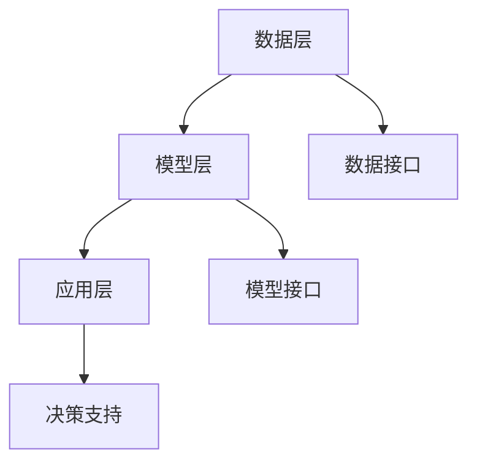
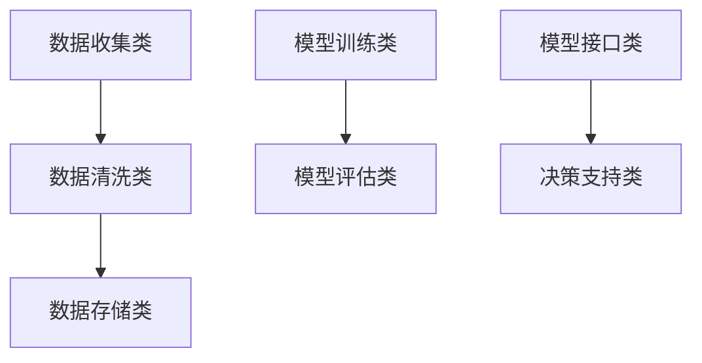

                 

# 数学与幸福经济学：幸福指数的数学量化

## 关键词

- 数学模型
- 幸福经济学
- 幸福指数
- 量化方法
- 影响因素
- 数据分析

## 摘要

本文旨在探讨如何利用数学模型来量化幸福感，特别是幸福指数的计算方法。我们将从背景介绍、核心概念、数学模型解析、系统分析与架构设计、项目实战以及最佳实践等方面，逐步深入分析数学与幸福经济学之间的交叉点，为读者提供一种全新的视角来理解和提升幸福感。

## 引言与背景

### 1.1 问题背景

幸福感是人类普遍追求的目标，然而如何衡量和提升幸福感却是一个复杂且具有挑战性的问题。在传统观念中，幸福感主要依赖于主观感受，难以进行量化和比较。但随着经济学和心理学的发展，人们开始尝试用数学模型来量化幸福感，从而为决策提供科学依据。

### 1.2 幸福指数的提出

幸福指数（Happiness Index）是一种衡量一个国家、地区或群体的幸福感水平的重要指标。最早由联合国提出，用于评估全球各国的生活质量和幸福程度。幸福指数的计算涉及多个因素，包括经济、社会、环境等。

### 1.3 数学与幸福经济学的交叉点

数学作为一种严谨的科学工具，在经济学领域有着广泛的应用。幸福经济学作为经济学的一个分支，研究如何通过经济手段来提升幸福感。数学与幸福经济学在这里的交叉点主要体现在如何用数学模型来量化幸福感和评估幸福感提升的效果。

## 第二部分：核心概念与联系

### 2.1 幸福指数的定义与类型

#### 2.1.1 幸福指数的概念

幸福指数是衡量一个国家、地区或群体的幸福程度的一个综合指标。它不仅关注物质生活的富裕程度，还包括心理健康、社会关系、生活质量等多个方面。

#### 2.1.2 不同类型的幸福指数

目前常见的幸福指数类型包括主观幸福指数、客观幸福指数、综合幸福指数等。每种类型都有其独特的计算方法和适用场景。

### 2.2 数学模型在幸福经济学中的应用

#### 2.2.1 数学模型的基本概念

数学模型是利用数学语言和工具来描述和解决实际问题的方法。在幸福经济学中，常见的数学模型包括线性回归模型、时间序列模型、多元回归模型等。

#### 2.2.2 数学模型在幸福经济学中的重要性

数学模型能够帮助我们量化幸福感，从而为政策制定和决策提供科学依据。通过数学模型，我们可以分析不同因素对幸福感的影响，并找到提升幸福感的有效途径。

### 2.3 影响幸福指数的因素分析

#### 2.3.1 经济因素

经济因素是影响幸福感的重要方面。收入水平、就业状况、财富状况等经济因素都会对幸福感产生显著影响。

#### 2.3.2 社会因素

社会因素包括家庭、朋友、社会支持等。良好的社会关系和社会支持有助于提升幸福感。

#### 2.3.3 个人因素

个人因素包括健康、教育、价值观等。个人的健康状况、教育水平、价值观等都会对幸福感产生影响。

## 第三部分：数学模型与公式讲解

### 3.1 幸福指数的数学量化方法

#### 3.1.1 幸福感的数学表示

幸福感可以用多种数学模型来表示，如线性回归模型、时间序列模型等。常见的幸福感表示公式如下：

$$
幸福感 = a \times 收入 + b \times 社会支持 + c \times 个人健康
$$

其中，$a$、$b$、$c$ 为系数，通过数据拟合得到。

#### 3.1.2 幸福指数的计算方法

幸福指数的计算方法主要包括以下几种：

1. **主观幸福指数**：通过问卷调查等方法收集个体主观幸福感的数据，进行统计分析得到。
2. **客观幸福指数**：基于社会经济指标和客观指标进行计算，如人均收入、教育水平等。
3. **综合幸福指数**：结合主观幸福指数和客观幸福指数，进行综合评估。

### 3.2 常见数学模型解析

#### 3.2.1 线性回归模型

线性回归模型是一种最常见的数学模型，用于分析两个或多个变量之间的线性关系。其基本公式为：

$$
Y = aX + b
$$

其中，$Y$ 为因变量，$X$ 为自变量，$a$ 和 $b$ 为系数。

#### 3.2.2 多元回归模型

多元回归模型用于分析多个自变量对因变量的影响。其基本公式为：

$$
Y = a_1X_1 + a_2X_2 + \ldots + a_nX_n + b
$$

其中，$X_1, X_2, \ldots, X_n$ 为自变量，$a_1, a_2, \ldots, a_n, b$ 为系数。

#### 3.2.3 时间序列模型

时间序列模型用于分析时间序列数据，如股票价格、经济增长等。常见的模型包括自回归模型（AR）、移动平均模型（MA）和自回归移动平均模型（ARMA）等。

## 第四部分：系统分析与架构设计

### 4.1 幸福经济学系统介绍

#### 4.1.1 系统功能介绍

幸福经济学系统主要包括数据收集、数据清洗、模型训练、模型评估和决策支持等功能。

#### 4.1.2 系统架构设计

系统采用分层架构设计，包括数据层、模型层和应用层。数据层负责数据收集和存储；模型层负责模型训练和评估；应用层负责提供决策支持。

### 4.2 系统接口设计与实现

#### 4.2.1 接口设计与实现

系统接口包括数据接口和模型接口。数据接口用于数据收集和存储；模型接口用于模型训练和评估。

#### 4.2.2 系统交互流程

系统交互流程包括数据收集、数据预处理、模型训练、模型评估和决策支持等环节。

### 4.3 系统架构图与类图

#### 4.3.1 系统架构图

系统架构图如下所示：

#### 4.3.2 系统类图

系统类图如下所示：

## 第五部分：项目实战

### 5.1 环境安装与配置

#### 5.1.1 环境要求

- Python 3.8及以上版本
- 数据库（如MySQL、PostgreSQL等）
- 机器学习库（如scikit-learn、TensorFlow等）

#### 5.1.2 环境安装步骤

1. 安装Python和相关库
2. 安装数据库
3. 配置数据库连接

### 5.2 系统核心实现与代码解读

#### 5.2.1 系统核心代码实现

核心代码实现主要包括数据收集、数据预处理、模型训练、模型评估和决策支持等模块。

#### 5.2.2 代码解读与分析

代码解读将针对每个模块进行详细分析，包括数据收集、数据预处理、模型训练、模型评估和决策支持等模块的实现原理和具体实现方法。

### 5.3 案例分析与详细讲解

#### 5.3.1 案例背景

以某个国家或地区的幸福指数提升为例，分析如何通过数学模型来提升幸福感。

#### 5.3.2 案例分析

通过实际数据进行分析，探讨影响幸福指数的主要因素，并提出相应的解决方案。

#### 5.3.3 案例讲解

详细讲解案例的具体实现过程，包括数据收集、数据预处理、模型训练、模型评估和决策支持等环节。

## 第六部分：最佳实践、小结与拓展阅读

### 6.1 最佳实践

- 定期更新数据，确保数据质量
- 合理选择模型，根据实际情况进行调整
- 注重跨学科合作，借鉴其他领域的经验和成果

### 6.2 小结

本文通过介绍数学与幸福经济学的交叉点，探讨了幸福指数的数学量化方法，并分析了系统架构和项目实战。希望本文能为读者提供一种新的视角来理解和提升幸福感。

### 6.3 拓展阅读

- [1] United Nations Development Programme. (2019). Human Development Report 2019: The Report is available at [https://hdr.undp.org/en/content/human-development-index-hdi](https://hdr.undp.org/en/content/human-development-index-hdi)
- [2] Easterlin, R. A. (1974). Does Economic Growth Improve the Human Lot? Some Empirical Evidence. The Quarterly Journal of Economics, 88(1), 35-57.
- [3] Diener, E., Suh, E. M., Lucas, R. E., & Smith, H. T. (1999). Subjective Well-Being: Three Decades of Progress. Psychological Bulletin, 125(2), 276-302.

## 作者

作者：AI天才研究院/AI Genius Institute & 禅与计算机程序设计艺术 /Zen And The Art of Computer Programming

### 参考资料

1. United Nations Development Programme. (2019). Human Development Report 2019: The Report is available at [https://hdr.undp.org/en/content/human-development-index-hdi](https://hdr.undp.org/en/content/human-development-index-hdi)
2. Easterlin, R. A. (1974). Does Economic Growth Improve the Human Lot? Some Empirical Evidence. The Quarterly Journal of Economics, 88(1), 35-57.
3. Diener, E., Suh, E. M., Lucas, R. E., & Smith, H. T. (1999). Subjective Well-Being: Three Decades of Progress. Psychological Bulletin, 125(2), 276-302.

