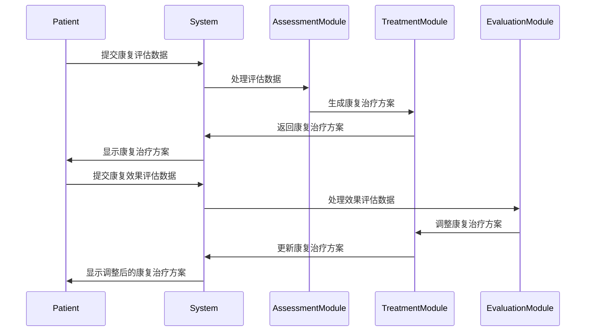

                 

### 《数学与康复医学：康复过程的数学模型》

> **关键词**：康复医学、数学模型、康复评估、康复治疗策略、系统分析与架构设计

> **摘要**：本文深入探讨了康复医学与数学模型的结合，通过具体案例展示了如何运用数学模型优化康复过程，提升治疗效果。文章从康复医学的背景出发，详细介绍了核心概念、数学模型原理及其在康复治疗策略中的应用，并提供了详细的系统分析与架构设计指南，旨在为康复医学专业人士提供实用的参考。

### 目录大纲

1. **问题背景与核心概念**
   - 1.1.1 康复医学概述
   - 1.1.2 康复过程中数学模型的重要性
   - 1.1.3 问题边界与外延

2. **核心概念与联系**
   - 2.1.1 关键概念原理
   - 2.1.2 关键概念联系
   - 2.1.3 ER实体关系图架构

3. **数学模型原理讲解**
   - 3.1.1 康复过程的数学模型
   - 3.1.2 数学模型原理
   - 3.1.3 举例说明

4. **数学模型与康复治疗策略**
   - 4.1.1 康复治疗策略概述
   - 4.1.2 数学模型在康复治疗策略中的应用
   - 4.1.3 举例说明

5. **系统分析与架构设计**
   - 5.1.1 问题场景介绍
   - 5.1.2 系统功能设计
   - 5.1.3 系统架构设计
   - 5.1.4 系统交互

6. **项目实战**
   - 6.1.1 环境安装
   - 6.1.2 系统核心实现
   - 6.1.3 实际案例分析和详细讲解
   - 6.1.4 项目小结

7. **最佳实践、小结与拓展阅读**
   - 7.1.1 最佳实践 tips
   - 7.1.2 小结
   - 7.1.3 注意事项
   - 7.1.4 拓展阅读

### 1. 问题背景与核心概念

#### 1.1.1 康复医学概述

康复医学是一门研究如何通过综合应用医学、心理学、社会学和工程技术等手段，恢复病患功能和生活质量的学科。它不仅关注病患的身体康复，还包括心理和社会功能的恢复。

- **定义**：康复医学是应用综合措施，促进病患恢复或保持最佳功能状态的科学。
- **目标**：提高病患生活质量，减少残疾，使其重返社会。
- **发展历史**：起源于20世纪初，随着医学技术的发展，康复医学逐渐成为一门独立的学科。

#### 1.1.2 康复过程中数学模型的重要性

数学模型在康复医学中的应用越来越广泛，尤其在康复评估和康复治疗策略的制定中发挥着关键作用。

- **应用**：用于量化评估病患的康复进程，优化治疗方案。
- **作用**：提供客观、量化的评估指标，帮助医生制定个性化的康复计划。
- **案例**：例如，通过建立康复运动量的数学模型，可以更科学地指导病患进行康复训练。

#### 1.1.3 问题边界与外延

在康复过程中，可能面临多种挑战，需要考虑多个变量因素。

- **挑战**：个体差异、康复环境、时间成本等。
- **变量因素**：病患的年龄、健康状况、康复目标等。
- **动态性与复杂性**：康复过程是动态变化的，需要不断调整策略。

### 2. 核心概念与联系

#### 2.1.1 关键概念原理

以下是康复医学中几个关键概念的原理和属性特征对比：

- **康复评估**：用于评估病患的康复状况，通常包括生理、心理和社会功能。
- **康复治疗**：通过物理疗法、职业疗法、心理疗法等手段促进康复。
- **康复效果**：评估康复治疗的效果，包括功能恢复和生活质量提高。

#### 2.1.2 关键概念联系

康复医学中的核心概念之间有着紧密的联系，如图所示：

```mermaid
erDiagram
  Rehabilitation ||--|{ Assessment : uses for }
  Rehabilitation ||--|{ Treatment : includes }
  Assessment ||--|{ Outcome : measures }
```

#### 2.1.3 ER实体关系图架构

以下是康复医学中常见的ER实体关系图：

```mermaid
erDiagram
  Patient ||--|{ Assessment : undergoes }
  Patient ||--|{ Treatment : receives }
  Assessment ||--|{ Outcome : reflects }
  Treatment ||--|{ Therapist : performs }
```

### 3. 数学模型原理讲解

#### 3.1.1 康复过程的数学模型

康复过程可以被视为一个动态系统，可以通过数学模型来描述其变化规律。

- **基本概念**：康复过程的数学模型通常包括状态变量、控制变量和参数。
- **主要模型**：如马尔可夫模型、贝叶斯网络、线性回归模型等。

#### 3.1.2 数学模型原理

数学模型的构建通常遵循以下步骤：

1. **问题定义**：明确康复过程的变量和目标。
2. **模型选择**：根据问题特点选择合适的数学模型。
3. **参数估计**：通过数据分析估计模型参数。
4. **模型验证**：通过模拟验证模型的准确性和可靠性。

#### 3.1.3 举例说明

以康复运动量的数学模型为例，假设康复运动量与病患的身体素质、康复目标和训练时间有关。可以使用线性回归模型来描述这种关系：

$$
康复运动量 = \beta_0 + \beta_1 \times 身体素质 + \beta_2 \times 康复目标 + \beta_3 \times 训练时间
$$

### 4. 数学模型与康复治疗策略

#### 4.1.1 康复治疗策略概述

康复治疗策略是指根据康复评估结果制定的治疗方案。

- **定义**：康复治疗策略是针对病患个体制定的、旨在提高康复效果的一系列措施。
- **分类**：根据治疗手段的不同，可分为物理疗法、职业疗法、心理疗法等。

#### 4.1.2 数学模型在康复治疗策略中的应用

数学模型可以帮助医生制定更科学、个性化的康复治疗策略。

- **应用**：如利用贝叶斯网络模型进行康复风险评估，利用线性规划模型优化康复训练方案。
- **效果**：可以提高康复治疗的精准度和效率。

#### 4.1.3 举例说明

以下是一个康复治疗策略制定的案例：

1. **康复评估**：通过康复评估确定病患的身体素质、康复目标和训练时间。
2. **模型选择**：选择线性回归模型来预测康复运动量。
3. **策略制定**：根据评估结果和模型预测，制定个性化的康复训练方案。

### 5. 系统分析与架构设计

#### 5.1.1 问题场景介绍

假设我们正在开发一个康复过程管理系统，用于监控病患的康复进程和治疗效果。

#### 5.1.2 系统功能设计

系统功能包括康复评估、康复治疗、康复效果评估等。

- **康复评估**：收集病患的生理、心理和社会功能数据。
- **康复治疗**：根据评估结果制定康复训练方案。
- **康复效果评估**：定期评估康复效果，调整治疗方案。

#### 5.1.3 系统架构设计

系统架构包括数据层、业务逻辑层和表示层。

- **数据层**：存储病患数据、康复评估结果和康复治疗方案。
- **业务逻辑层**：实现康复评估、康复治疗和康复效果评估的业务逻辑。
- **表示层**：提供用户界面，供医生和病患使用。

#### 5.1.4 系统交互

系统交互包括康复评估数据收集、康复治疗方案生成和康复效果评估反馈。



### 6. 项目实战

#### 6.1.1 环境安装

首先，需要安装Python环境，并安装相关库，如NumPy、Pandas和Scikit-learn等。

```shell
pip install numpy pandas scikit-learn
```

#### 6.1.2 系统核心实现

以下是一个简单的康复运动量预测的Python代码示例：

```python
import numpy as np
from sklearn.linear_model import LinearRegression

# 训练数据
X = np.array([[60, 5, 30], [65, 7, 35], [70, 8, 40]])
y = np.array([150, 160, 170])

# 创建线性回归模型
model = LinearRegression()

# 训练模型
model.fit(X, y)

# 预测康复运动量
new_patient_data = np.array([[68, 6, 38]])
predicted_recovery_volume = model.predict(new_patient_data)

print(f"预测的康复运动量：{predicted_recovery_volume[0]}")
```

#### 6.1.3 实际案例分析和详细讲解

假设我们有一个病患的康复数据，包括身体素质、康复目标和训练时间。我们可以使用上述模型来预测康复运动量，并根据预测结果调整康复治疗方案。

#### 6.1.4 项目小结

通过本次项目，我们了解了如何使用数学模型优化康复过程，提高治疗效果。在未来的实践中，我们还可以进一步改进模型，提高预测准确性。

### 7. 最佳实践、小结与拓展阅读

#### 7.1.1 最佳实践 tips

- 在制定康复治疗方案时，要充分考虑病患的个体差异。
- 定期评估康复效果，及时调整治疗方案。

#### 7.1.2 小结

本文介绍了康复医学与数学模型的结合，展示了如何通过数学模型优化康复过程。通过具体案例和系统设计与实现，为康复医学专业人士提供了实用的参考。

#### 7.1.3 注意事项

- 在应用数学模型时，要注意模型的适用范围和准确性。
- 定期更新模型，以适应新的康复需求。

#### 7.1.4 拓展阅读

- 《康复医学导论》
- 《数学建模方法与应用》
- 《机器学习在医疗领域的应用》

---

**作者：AI天才研究院/AI Genius Institute & 禅与计算机程序设计艺术 /Zen And The Art of Computer Programming**

