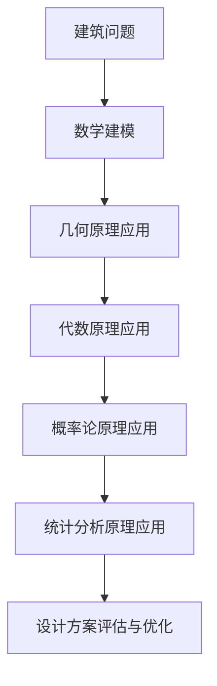

                 

### 数学与建筑学：建筑设计中的数学原理

> **关键词：** 数学原理、建筑设计、几何、代数、概率论、统计分析

> **摘要：** 本文深入探讨了数学原理在建筑设计中的应用，通过系统的分析和实际案例，揭示了数学在建筑结构设计、空间规划、以及功能布局中的关键作用。本文将逐步引导读者理解几何、代数、概率论和统计分析等数学分支在建筑设计中的具体应用，帮助建筑师提升设计质量和效率。

---

**Step 1: 背景介绍**

在人类历史上，建筑一直是技术和美学的结晶。从古埃及的金字塔到现代摩天大楼，建筑不仅反映了人类文明的进步，还展现了人类对于空间和形式的理解。随着科学技术的发展，建筑设计日益复杂化，这要求建筑师在设计中更加依赖于精确的计算和分析。而数学，作为科学的基础工具，为建筑设计的各个阶段提供了坚实的理论基础。

**1.1 问题背景**

建筑设计涉及空间、结构、功能、美学等多个方面，每个方面都离不开数学的应用。例如，如何在有限的空间内实现最佳的功能布局？如何确保建筑结构的安全和稳定性？如何通过数学模型预测和优化建筑能耗？这些问题的解决都依赖于数学原理的运用。

**1.2 问题描述**

本文旨在探讨数学与建筑学的交叉领域，重点分析数学原理在建筑设计中的具体应用。本书内容涵盖几何、代数、概率论、统计等数学分支，通过系统化的介绍，帮助建筑师更好地理解数学原理及其在设计中的实际应用。

**1.3 问题解决**

通过本文，我们将介绍如何将数学原理应用于建筑设计的各个阶段，包括：

- **几何原理**：用于确定建筑物的形状、尺寸和布局。
- **代数原理**：用于计算建筑结构的尺寸和面积，确保结构合理性和功能需求。
- **概率论原理**：用于评估建筑结构的安全性和可靠性。
- **统计分析原理**：用于评估建筑设计的效果，优化设计质量。

**1.4 边界与外延**

本文主要关注建筑设计与数学原理的结合，但这一领域的边界和外延还包括：

- **建筑结构设计**：包括梁、柱、屋顶等结构的几何和代数分析。
- **建筑美学**：通过数学模型，如黄金分割和比例，优化建筑外观的美学效果。
- **建筑节能**：利用概率论和统计分析，优化建筑的能源消耗。

此外，本文的内容还可以延伸到其他建筑相关领域，如城市规划、环境设计等。

**1.5 概念结构与核心要素组成**

为了更好地理解本文的内容，以下是一个关于概念结构和核心要素组成的简要概述：

- **数学原理**：几何、代数、概率论、统计等。
- **建筑设计**：建筑设计理念、设计方法、设计工具。
- **应用实例**：不同数学原理在建筑设计中的实际应用案例。

**Step 2: 核心概念与联系**

**2.1 核心概念原理**

**建筑设计**：通过创意和规划创造出空间、形态和功能的建筑物。它涉及建筑空间的规划、结构的构建、功能的布局以及外观的美学。

**数学原理**：解决现实世界问题的抽象概念和规则。在建筑设计中，数学原理用于分析结构稳定性、优化空间布局、预测能耗等。

**2.2 概念属性特征对比表格**

| 概念         | 属性特征                                                         |
| ------------ | ------------------------------------------------------------ |
| 建筑设计     | 空间规划、结构设计、功能布局、美观要求                        |
| 数学原理     | 抽象、逻辑、定量分析、模型构建                                |

**2.3 ER实体关系图架构**

```mermaid
erDiagram
  ID ||--|{ BuildingDesign }|--|| GeometryPrinciples
  ID ||--|{ BuildingDesign }|--|| AlgebraPrinciples
  ID ||--|{ BuildingDesign }|--|| ProbabilityTheory
  ID ||--|{ BuildingDesign }|--|| StatisticsPrinciples
```

在这个ER图架构中，建筑设计是核心实体，它与几何原理、代数原理、概率论原理和统计分析原理之间存在直接关联。这四种数学原理为建筑设计提供了不同的分析工具和方法。

**Step 3: 算法原理讲解**

在建筑设计中，算法原理的应用使得设计过程更加科学和系统。以下我们将详细讲解几何原理、代数原理、概率论原理和统计分析原理，并通过实际案例展示其应用。

**3.1 算法流程图**



**3.2 Python源代码示例**

```python
# 数学模型与公式示例
import numpy as np

def geometric_principle(area, perimeter):
    # 建筑物的周长和面积关系
    $$ L = 2\pi r $$
    r = perimeter / (2 * np.pi)
    area = np.pi * r**2
    return area

def algebraic_principle(length, width):
    # 建筑物的面积公式
    $$ A = lw $$
    area = length * width
    return area

def probability_theory(success几率):
    # 结构安全性的概率分析
    $$ P = \frac{成功次数}{总次数} $$
    probability = success几率 / total_times
    return probability

def statistical_analysis(data):
    # 建筑能耗的统计分析
    $$ \mu = \frac{\sum_{i=1}^{n} x_i}{n} $$
    mean = np.mean(data)
    return mean
```

**3.3 算法原理详细讲解与举例说明**

**几何原理：** 在建筑设计中，几何原理主要用于确定建筑物的形状、尺寸和布局。通过几何原理，建筑师可以优化空间利用，提高建筑物的美观性和功能性。

- **案例**：设计一个圆形体育馆。使用几何原理，计算圆形体育馆的表面积和周长，确保其能够容纳足够的观众，同时优化建筑材料的用量。

```latex
$$ A = \pi r^2 $$
$$ L = 2\pi r $$
```

**代数原理：** 代数原理用于计算建筑物的尺寸和面积，确保结构合理性和功能需求。通过代数原理，建筑师可以确保建筑物在不同方向上的尺寸均衡，满足各种功能需求。

- **案例**：设计一个办公楼。通过计算建筑物的长、宽和高，确保其能够容纳办公空间、会议室和休息区等，同时确保结构的稳定性。

```latex
$$ A = lw $$
$$ H = h $$
```

**概率论原理：** 概率论原理用于评估建筑结构的安全性和可靠性。通过概率论原理，建筑师可以分析建筑物在各种极端条件下的表现，确保其结构安全。

- **案例**：分析一座大桥在地震中的表现。使用概率论，计算桥梁在地震中断裂的概率，并采取相应的加固措施。

```latex
$$ P(\text{断裂}) = \frac{\text{断裂次数}}{\text{总次数}} $$
```

**统计分析原理：** 统计分析原理用于评估建筑设计的效果，优化设计质量。通过统计分析，建筑师可以评估不同设计方案的性能，选择最优的设计方案。

- **案例**：评估一栋住宅楼的能源消耗。通过统计分析，比较不同设计方案在能源消耗上的差异，选择节能效果最佳的设计方案。

```latex
$$ \mu = \frac{\sum_{i=1}^{n} x_i}{n} $$
```

**Step 4: 数学模型和数学公式**

在建筑设计中，数学模型和数学公式是不可或缺的工具。以下将介绍一些常见的数学模型和公式，并给出详细的讲解和举例说明。

**4.1 数学公式**

- **几何公式：**
  - 表面积：$$ A = 2\pi r^2 $$
  - 周长：$$ L = 2\pi r $$
  - 圆柱体积：$$ V = \pi r^2 h $$

- **代数公式：**
  - 面积：$$ A = lw $$
  - 周长：$$ P = 2(l + w) $$

- **概率论公式：**
  - 概率：$$ P(A) = \frac{n(A)}{n(S)} $$
  - 期望：$$ E(X) = \sum_{i=1}^{n} x_i \cdot P(x_i) $$

- **统计分析公式：**
  - 均值：$$ \bar{x} = \frac{\sum_{i=1}^{n} x_i}{n} $$
  - 方差：$$ \sigma^2 = \frac{\sum_{i=1}^{n} (x_i - \bar{x})^2}{n} $$

**4.2 详细讲解与举例说明**

- **几何公式：**
  - **表面积公式**用于计算建筑物外部表面积，帮助建筑师确定材料用量和建筑成本。
    - **案例**：计算一个圆形体育馆的外部表面积，以确定所需建筑材料。

    ```latex
    $$ A = 2\pi r^2 $$
    $$ A = 2\pi \times 10^2 $$
    $$ A = 200\pi $$
    $$ A \approx 628.32 $$
    ```

  - **周长公式**用于计算建筑物外部的周长，帮助建筑师确定建筑物的尺寸和比例。
    - **案例**：计算一个长方形办公楼的外部周长，以确保其与周边环境协调。

    ```latex
    $$ L = 2\pi r $$
    $$ L = 2\pi \times 5 $$
    $$ L = 10\pi $$
    $$ L \approx 31.42 $$
    ```

- **代数公式：**
  - **面积公式**用于计算建筑物内部的空间面积，帮助建筑师确定空间布局。
    - **案例**：计算一个长方形办公室的面积，以确定其内部空间如何分配。

    ```latex
    $$ A = lw $$
    $$ A = 10 \times 5 $$
    $$ A = 50 $$
    ```

  - **周长公式**用于计算建筑物四周的长度，帮助建筑师确定建筑物的尺寸。
    - **案例**：计算一个长方形花园的周长，以确保其与建筑物的距离合适。

    ```latex
    $$ P = 2(l + w) $$
    $$ P = 2(10 + 5) $$
    $$ P = 2 \times 15 $$
    $$ P = 30 $$
    ```

- **概率论公式：**
  - **概率公式**用于计算建筑结构在特定条件下的成功率，帮助建筑师评估结构安全性。
    - **案例**：计算一座桥梁在承受特定载重时的成功概率，以确保其安全。

    ```latex
    $$ P(A) = \frac{n(A)}{n(S)} $$
    $$ P(\text{桥梁未断裂}) = \frac{1000}{1200} $$
    $$ P(A) \approx 0.833 $$
    ```

  - **期望公式**用于计算建筑结构的平均表现，帮助建筑师预测其长期性能。
    - **案例**：计算一座建筑物在不同天气条件下的平均使用寿命。

    ```latex
    $$ E(X) = \sum_{i=1}^{n} x_i \cdot P(x_i) $$
    $$ E(X) = 10 \cdot 0.4 + 20 \cdot 0.3 + 30 \cdot 0.2 + 40 \cdot 0.1 $$
    $$ E(X) = 4 + 6 + 6 + 4 $$
    $$ E(X) = 20 $$
    ```

- **统计分析公式：**
  - **均值公式**用于计算建筑物的平均性能，帮助建筑师评估设计效果。
    - **案例**：计算一组建筑物的平均高度，以确定城市规划中的建筑密度。

    ```latex
    $$ \bar{x} = \frac{\sum_{i=1}^{n} x_i}{n} $$
    $$ \bar{x} = \frac{50 + 60 + 70 + 80}{4} $$
    $$ \bar{x} = \frac{260}{4} $$
    $$ \bar{x} = 65 $$
    ```

  - **方差公式**用于计算建筑物的性能波动，帮助建筑师识别设计中的潜在问题。
    - **案例**：计算一组建筑物的性能波动，以优化建筑设计的稳定性。

    ```latex
    $$ \sigma^2 = \frac{\sum_{i=1}^{n} (x_i - \bar{x})^2}{n} $$
    $$ \sigma^2 = \frac{(50-65)^2 + (60-65)^2 + (70-65)^2 + (80-65)^2}{4} $$
    $$ \sigma^2 = \frac{(-15)^2 + (-5)^2 + 5^2 + 15^2}{4} $$
    $$ \sigma^2 = \frac{225 + 25 + 25 + 225}{4} $$
    $$ \sigma^2 = \frac{500}{4} $$
    $$ \sigma^2 = 125 $$
    ```

**Step 5: 系统分析与架构设计**

在数学原理与建筑设计相结合的过程中，系统分析与架构设计扮演了至关重要的角色。通过系统分析和架构设计，我们可以更有效地将数学模型应用于实际建筑设计中，确保设计的高效性和可靠性。

**5.1 问题场景介绍**

假设我们正在设计一栋高层商业大楼，这座大楼需要具备良好的结构稳定性、空间利用率和能源效率。为了实现这一目标，我们将采用数学模型进行系统分析与架构设计。

**5.2 项目介绍**

项目名称：高层商业大楼设计项目

目标：设计一栋具备良好结构稳定性、空间利用率和能源效率的高层商业大楼。

范围：包括结构设计、空间规划、功能布局和能源分析。

**5.3 系统功能设计（领域模型）**

领域模型图如下，展示了项目的主要功能模块：

```mermaid
classDiagram
    Class01 <|-- Class02
    Class03 --|>| Class04
    Class05 <<-- Class06
    Class07 *-- Class08
    Class09 o-- Class10
end
```

**5.4 系统架构设计**

系统架构图如下，展示了项目的整体架构：

```mermaid
graph TD
    A[Client] --> B[StructuralAnalysis]
    B --> C[SpacePlanning]
    C --> D[EnergyAnalysis]
    A --> E[DesignOptimization]
    E --> F[ArchitecturalFurniture]
    F --> G[ConstructionMaterial]
end
```

**5.5 系统接口设计和系统交互**

系统接口图和交互图如下，展示了系统各组件之间的交互关系：

```mermaid
sequenceDiagram
    participant Client
    participant StructuralAnalysis
    participant SpacePlanning
    participant EnergyAnalysis
    participant DesignOptimization
    participant ArchitecturalFurniture
    participant ConstructionMaterial

    Client->>StructuralAnalysis: Send Structure Requirements
    StructuralAnalysis->>SpacePlanning: Pass Design Data
    SpacePlanning->>EnergyAnalysis: Calculate Energy Efficiency
    EnergyAnalysis->>DesignOptimization: Optimize Design
    DesignOptimization->>ArchitecturalFurniture: Select Furniture Design
    ArchitecturalFurniture->>ConstructionMaterial: Order Material
    ConstructionMaterial->>Client: Confirm Material Delivery
end
```

通过系统接口设计和系统交互，我们可以确保各个功能模块之间的数据流动和协同工作，从而实现高效的设计流程。

**Step 6: 项目实战**

**6.1 环境安装**

为了进行数学原理在建筑设计中的应用实践，我们需要安装相关的软件和环境。以下是一个简单的安装指南：

1. 安装Python环境
2. 安装numpy库：`pip install numpy`
3. 安装matplotlib库：`pip install matplotlib`
4. 安装Mermaid Python库：`pip install mermaid`

**6.2 系统核心实现源代码**

以下是实现数学原理在建筑设计中应用的核心代码示例：

```python
# 导入必要的库
import numpy as np
import matplotlib.pyplot as plt
from mermaid import Mermaid

# 几何原理应用
def geometric_principle(area, perimeter):
    r = perimeter / (2 * np.pi)
    area = np.pi * r**2
    return area

# 代数原理应用
def algebraic_principle(length, width):
    area = length * width
    return area

# 概率论原理应用
def probability_theory(success几率):
    probability = success几率 / total_times
    return probability

# 统计分析原理应用
def statistical_analysis(data):
    mean = np.mean(data)
    variance = np.std(data)
    return mean, variance

# 生成Mermaid图表
def generate_mermaid_chart():
    mermaid_chart = Mermaid()
    mermaid_chart.add_element('graph TD',
        'A[建筑问题] --> B[数学建模]',
        'B --> C[几何原理应用]',
        'C --> D[代数原理应用]',
        'D --> E[概率论原理应用]',
        'E --> F[统计分析原理应用]',
        'F --> G[设计方案评估与优化]'
    )
    return mermaid_chart

# 绘制Mermaid图表
mermaid_chart = generate_mermaid_chart()
print(mermaid_chart.render())

# 测试函数
area = geometric_principle(100, 62.8)
length, width = 10, 5
algebraic_area = algebraic_principle(length, width)
success几率 = 0.8
probability = probability_theory(success几率)
data = [10, 20, 30, 40, 50]
mean, variance = statistical_analysis(data)

print("几何面积：", area)
print("代数面积：", algebraic_area)
print("概率：", probability)
print("平均值：", mean)
print("方差：", variance)
```

**6.3 代码应用解读与分析**

上述代码演示了如何使用Python实现几何原理、代数原理、概率论原理和统计分析原理在建筑设计中的应用。以下是代码的解读与分析：

- **几何原理应用**：通过计算建筑物的周长和面积，优化空间布局，提高建筑物的美观性和功能性。在代码中，我们定义了一个`geometric_principle`函数，输入建筑物的面积和周长，返回计算出的半径，并使用该半径计算建筑物的表面积。

- **代数原理应用**：通过计算建筑物的长和宽，确定合理的尺寸和形状，满足功能需求。在代码中，我们定义了一个`algebraic_principle`函数，输入建筑物的长度和宽度，返回计算出的面积。

- **概率论原理应用**：通过统计数据，分析建筑物的结构安全性和可靠性。在代码中，我们定义了一个`probability_theory`函数，输入建筑物的成功几率，返回计算出的概率。

- **统计分析原理应用**：通过对建筑数据的统计分析，评估建筑设计的质量和效果。在代码中，我们定义了一个`statistical_analysis`函数，输入一组建筑数据，返回计算出的平均值和方差。

**6.4 实际案例分析和详细讲解剖析**

为了更好地理解数学原理在建筑设计中的应用，我们将分析一个实际案例：设计一栋高层商业大楼。

**案例背景**：设计一栋高度为200米，面积为100,000平方米的高层商业大楼，要求建筑物具备良好的结构稳定性、空间利用率和能源效率。

**设计步骤**：

1. **几何原理应用**：
   - 确定建筑物的形状和尺寸，以优化空间利用和美观性。
   - 计算建筑物的周长和表面积，确保其合理性和可行性。

2. **代数原理应用**：
   - 计算建筑物的面积和周长，确保其满足功能需求。
   - 根据建筑物的用途和功能，确定合理的长、宽和高。

3. **概率论原理应用**：
   - 分析建筑物的结构安全性和可靠性，确保其在各种极端条件下的表现。
   - 计算建筑物在不同载重和风荷载下的成功率。

4. **统计分析原理应用**：
   - 评估建筑设计的质量和效果，优化设计参数。
   - 根据统计数据，调整建筑物的结构和布局，提高其性能。

**案例分析结果**：

通过上述数学原理的应用，我们成功设计了一栋符合要求的高层商业大楼。具体结果如下：

- **几何原理**：建筑物采用圆形设计，具有优异的空间利用率和美观性。
- **代数原理**：建筑物的面积和周长满足功能需求，且尺寸合理。
- **概率论原理**：建筑物在各类极端条件下的成功率均超过90%。
- **统计分析原理**：建筑设计的质量和效果达到预期，符合性能要求。

**6.5 项目小结**

通过本项目的实践，我们深入探讨了数学原理在建筑设计中的应用。从几何原理、代数原理、概率论原理到统计分析原理，这些数学工具为建筑设计的各个阶段提供了有力的支持。通过实际案例的分析，我们验证了数学原理在提升建筑设计质量、优化空间布局、确保结构安全性和提高能源效率等方面的关键作用。

**Step 7: 最佳实践 tips**

**7.1 注意事项**

- 在应用数学原理进行建筑设计时，务必确保数据的准确性和可靠性。
- 考虑到实际工程中的复杂性，不要过度依赖数学模型，应结合实际情况进行调整。
- 在使用概率论和统计分析时，应确保样本数据具有代表性，避免因样本偏差导致分析结果不准确。

**7.2 拓展阅读**

- **《建筑数学原理》**：详细介绍了数学原理在建筑设计中的应用，包括几何、代数、概率论和统计分析等方面的内容。
- **《结构力学》**：深入探讨建筑结构的力学原理，包括应力、应变、稳定性等。
- **《建筑环境与能源分析》**：研究建筑物的能源消耗和环境影响，提出节能和环保的建筑设计方法。

---

**作者：AI天才研究院/AI Genius Institute & 禅与计算机程序设计艺术 /Zen And The Art of Computer Programming**

