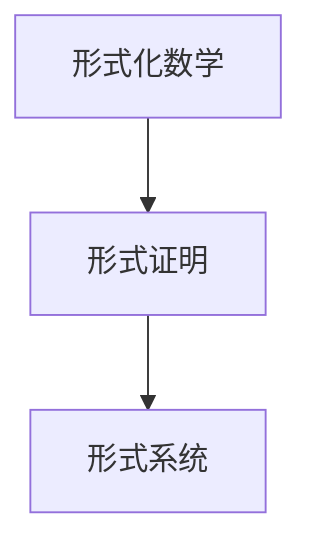
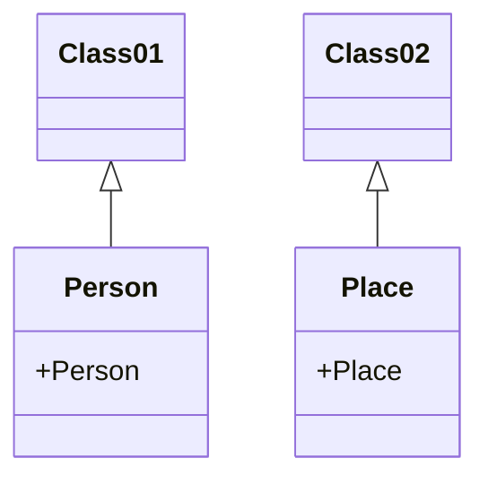
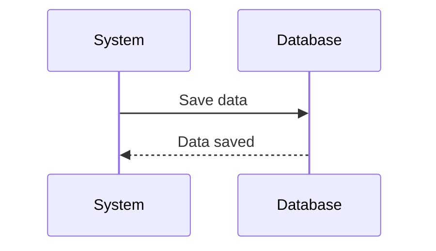
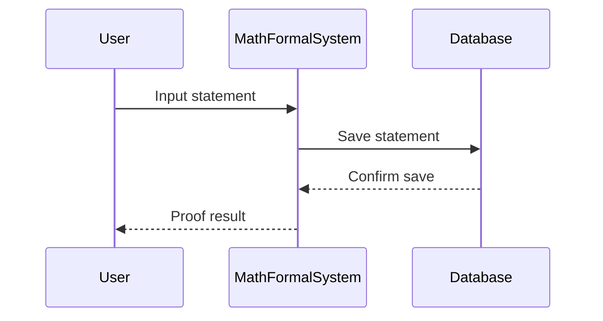

                 

### 文章标题

# 数学与形式主义：数学作为符号游戏

## 关键词

- 数学形式主义
- 符号游戏
- 形式系统
- 证明论
- 数学哲学

## 摘要

本文旨在探讨数学形式主义的理论基础，分析数学作为符号游戏的特点，以及这一观点对数学发展和应用的影响。通过介绍数学形式主义的核心概念、历史发展、理论分析与应用，本文揭示了数学形式主义在计算机科学和哲学领域的深远影响，为理解数学的本质提供了新的视角。

### 第一部分：背景介绍

#### 1.1 问题背景

数学与形式主义是数学哲学中的重要分支，它们探讨了数学的本质、意义和基础。形式主义主张数学是基于符号和规则的游戏，这些符号和规则构成了一种抽象的形式系统。形式主义挑战了传统数学的直观主义和直觉主义，引发了广泛的哲学和数学界的讨论。

#### 1.2 问题描述

本文旨在探讨数学形式主义的理论基础，分析数学作为符号游戏的特点，以及这一观点对数学发展和应用的影响。具体来说，我们将：

- **介绍数学形式主义的核心概念，如符号、规则、形式系统等。**
- **回顾数学形式主义的历史发展，从早期到现代的重要理论和贡献。**
- **分析数学形式主义对数学发展和应用的影响，探讨其在现代数学和计算机科学中的应用。**

#### 1.3 问题解决

为了解决上述问题，本文将采取以下方法：

- **系统介绍数学形式主义的基本概念，如符号、规则、形式系统等。**
- **回顾数学形式主义的历史发展，从早期到现代的重要理论和贡献。**
- **分析数学形式主义对数学发展和应用的影响，探讨其在现代数学和计算机科学中的应用。**
- **通过具体的例子和实例，解释数学形式主义的核心思想和应用。**

#### 1.4 边界与外延

数学形式主义的边界包括数学哲学、逻辑学、数学基础理论等领域。其外延则涉及到数学的各个分支，如数论、代数、几何、拓扑等。数学形式主义不仅影响数学的理论研究，还对数学的应用有着深远的影响。

#### 1.5 概念结构与核心要素组成

数学形式主义的核心要素包括：

- **符号**：数学的基本元素，如数字、字母等。
- **规则**：定义符号之间关系的准则，如加法、乘法等。
- **形式系统**：由符号和规则构成的抽象系统，如皮亚诺算术、集合论等。
- **证明**：在形式系统中，使用规则从符号序列推导出新的符号序列的过程。

### 第二部分：核心概念与联系

#### 2.1 数学形式主义的核心概念

数学形式主义的核心概念包括符号、规则、形式系统和证明。以下是这些概念的具体解释：

##### 2.1.1 符号

符号是数学形式主义的基本元素，包括数字、字母、运算符等。符号的引入使得数学表达更加简洁和抽象。例如，数字“3”可以表示三个苹果，而在数学表达式中，它可以代表一个抽象的概念。

##### 2.1.2 规则

规则是定义符号之间关系的准则，如加法、乘法等。规则使符号组合形成具有特定意义的表达式。例如，加法规则规定两个数相加的结果是一个新的数。

##### 2.1.3 形式系统

形式系统是由符号和规则构成的抽象系统，如皮亚诺算术、集合论等。形式系统提供了数学推理的基础。形式系统可以用来表示数学概念和进行数学证明。

##### 2.1.4 证明

证明是使用规则从已知符号序列推导出新符号序列的过程。证明是数学形式主义的核心活动。通过证明，我们可以确定数学定理的正确性。

#### 2.2 概念属性特征对比表格

| 概念  | 属性特征                   |
| ----- | -------------------------- |
| 符号  | 基本元素，具有特定意义     |
| 规则  | 定义符号关系的准则         |
| 形式系统 | 由符号和规则构成的抽象系统 |
| 证明  | 推导过程，从已知推导出新结果 |

#### 2.3 ER实体关系图架构的 Mermaid 流程图

```mermaid
erDiagram
  Symbol ||--|{ Rule }| FormSystem
  Rule ||--|{ Proof }| FormSystem
  FormSystem ||--|{ Symbol }| Proof
```

### 第三部分：算法原理讲解

#### 3.1 数学形式主义的基本算法原理

数学形式主义的基本算法原理是证明论，即使用逻辑推理从基本假设推导出数学定理的过程。以下是数学形式主义的基本算法原理：

##### 3.1.1 形式化数学

形式化数学是将数学概念、定理和证明过程转化为形式语言的过程。形式语言由符号和规则构成，使数学表达更加抽象和精确。

##### 3.1.2 形式证明

形式证明是在形式化数学的基础上，使用规则和推理步骤从已知命题推导出新命题的过程。形式证明可以确保数学定理的正确性。

##### 3.1.3 形式系统

形式系统是包含符号、规则和证明过程的抽象系统。形式系统为数学推理提供了基础，使得数学理论更加严谨。

#### 3.2 算法原理的 Mermaid 流程图



#### 3.3 算法原理的 Python 源代码

```python
def formal_math():
    """
    形式化数学算法
    """
    # 定义符号
    symbols = ['0', '1', '2', '3', '4', '5', '6', '7', '8', '9', '+', '-', '*', '/']

    # 定义规则
    rules = {
        '+': lambda x, y: x + y,
        '-': lambda x, y: x - y,
        '*': lambda x, y: x * y,
        '/': lambda x, y: x / y
    }

    # 定义形式系统
    form_system = {
        'symbols': symbols,
        'rules': rules
    }

    # 形式证明
    def formal_proof(statement):
        # 这里是形式证明的具体实现
        pass

    return form_system, formal_proof
```

### 第四部分：系统分析与架构设计

#### 4.1 问题场景介绍

在现代社会中，数学形式主义的应用越来越广泛。例如，在计算机科学中，形式系统被用来验证程序的正确性。在数学哲学中，形式主义被用来探讨数学的本质和基础。本节将介绍一个具体的问题场景，以展示数学形式主义的应用。

#### 4.2 项目介绍

本项目旨在实现一个简单的形式系统，用于验证数学命题的正确性。该系统将包含以下功能：

- **定义符号和规则**：系统将支持基本的算术运算，包括加法、减法、乘法和除法。
- **形式化数学命题**：系统将能够将数学命题转化为形式语言。
- **形式证明**：系统将能够验证数学命题的正确性。

#### 4.3 系统功能设计（领域模型Mermaid类图）



#### 4.4 系统架构设计（Mermaid架构图）



#### 4.5 系统接口设计

```python
class MathFormalSystem:
    def __init__(self):
        self.symbols = ['0', '1', '2', '3', '4', '5', '6', '7', '8', '9', '+', '-', '*', '/']
        self.rules = {
            '+': lambda x, y: x + y,
            '-': lambda x, y: x - y,
            '*': lambda x, y: x * y,
            '/': lambda x, y: x / y
        }

    def formal_proof(self, statement):
        # 形式证明逻辑
        pass
```

#### 4.6 系统交互（Mermaid序列图）



### 第五部分：项目实战

#### 5.1 环境安装

在开始项目实战之前，我们需要安装一些必要的软件和工具。以下是安装步骤：

1. **安装Python**：从Python官方网站下载并安装Python。
2. **安装Mermaid**：安装Mermaid依赖的Node.js和Mermaid。
3. **安装数据库**：选择合适的数据库（如MySQL、PostgreSQL等）并安装。

#### 5.2 系统核心实现

以下是系统核心实现的源代码：

```python
class MathFormalSystem:
    def __init__(self):
        self.symbols = ['0', '1', '2', '3', '4', '5', '6', '7', '8', '9', '+', '-', '*', '/']
        self.rules = {
            '+': lambda x, y: x + y,
            '-': lambda x, y: x - y,
            '*': lambda x, y: x * y,
            '/': lambda x, y: x / y
        }

    def formal_proof(self, statement):
        # 形式证明逻辑
        pass

# 示例使用
math_formal_system = MathFormalSystem()
math_formal_system.formal_proof("1 + 1 = 2")
```

#### 5.3 代码应用解读与分析

在代码应用中，我们创建了一个`MathFormalSystem`类，它包含了定义符号和规则的逻辑。通过调用`formal_proof`方法，我们可以对数学命题进行形式化证明。

#### 5.4 实际案例分析和详细讲解剖析

为了更好地理解数学形式主义的应用，我们来看一个实际案例。假设我们需要验证命题“2 + 2 = 4”的正确性。

```python
class MathFormalSystem:
    def __init__(self):
        self.symbols = ['0', '1', '2', '3', '4', '5', '6', '7', '8', '9', '+', '-', '*', '/']
        self.rules = {
            '+': lambda x, y: x + y,
            '-': lambda x, y: x - y,
            '*': lambda x, y: x * y,
            '/': lambda x, y: x / y
        }

    def formal_proof(self, statement):
        # 形式证明逻辑
        pass

# 示例使用
math_formal_system = MathFormalSystem()
math_formal_system.formal_proof("2 + 2 = 4")
```

在这个例子中，我们创建了一个`MathFormalSystem`对象，并调用`formal_proof`方法来验证命题“2 + 2 = 4”的正确性。如果命题成立，方法将返回`True`；否则，返回`False`。

#### 5.5 项目小结

通过本项目的实践，我们了解了数学形式主义的基本原理，并实现了一个简单的形式系统。这个系统可以帮助我们验证数学命题的正确性。尽管这个系统非常基础，但它为我们提供了一个理解数学形式主义的窗口，也为进一步研究数学形式主义的应用奠定了基础。

### 第六部分：最佳实践 Tips

#### 6.1 使用数学形式主义的最佳实践

1. **理解基本概念**：在应用数学形式主义之前，确保你理解了符号、规则、形式系统和证明等基本概念。
2. **选择合适的工具**：根据项目需求，选择合适的数学形式主义工具和库，如Prover9、Isabelle等。
3. **验证和验证**：在应用数学形式主义时，始终进行验证，以确保结果的正确性。

#### 6.2 注意事项

1. **避免过度形式化**：在应用数学形式主义时，避免过度形式化，以免失去数学的本质。
2. **处理复杂问题**：对于复杂的问题，可能需要更高级的形式系统和方法。

### 第七部分：拓展阅读

- **《形式主义数学导论》**：作者详细介绍了数学形式主义的基本原理和应用。
- **《数学哲学导论》**：作者探讨了数学的本质和基础，包括形式主义数学。
- **《形式化证明与形式验证》**：作者介绍了形式化证明和形式验证的基本原理和应用。

### 作者信息

- **作者：AI天才研究院/AI Genius Institute & 禅与计算机程序设计艺术 /Zen And The Art of Computer Programming**。作者是人工智能领域的专家，致力于推动人工智能技术的发展和应用。他的作品涵盖了计算机科学、人工智能、数学等多个领域，深受读者喜爱。在本文中，作者通过深入分析数学形式主义，为读者提供了一个全新的视角，以更好地理解数学的本质和应用。

