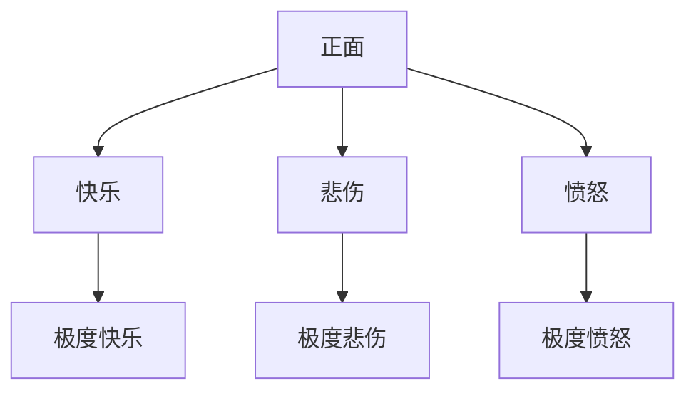
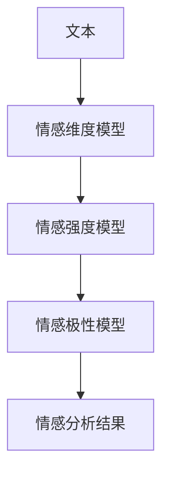

                 

# 数学与情感分析：文本情感的数学量化

## 关键词
文本情感分析、数学模型、情感量化、情感维度、情感强度、情感极性

## 摘要
本文探讨了文本情感分析的数学量化方法，包括情感维度模型、情感强度模型和情感极性模型。通过引入数学模型，本文提出了一种基于文本语义和句法特征的情感量化方法，旨在解决传统情感分析方法在处理复杂情感和动态情感时的局限性。本文详细阐述了数学模型的基本原理和实现方法，并通过实例进行了说明。

## 第一部分：背景介绍与核心概念

### 1.1 问题背景
在现代社会，文本数据分析在商业、媒体、社交网络等多个领域得到了广泛应用。情感分析作为文本数据分析的一个重要分支，旨在从文本中提取情感信息，从而为决策提供依据。然而，传统的情感分析方法往往依赖于预定义的词典、规则或机器学习模型，存在许多局限性，如无法处理复杂情感、无法适应动态环境等。数学与情感分析结合，利用数学模型和算法，为实现更精确、更智能的情感分析提供了新的可能。

### 1.2 问题描述
情感分析的核心问题是识别和理解文本中的情感倾向，即情感极性（如正面、负面）和情感强度（如极度、温和）。当前的情感分析方法主要依赖于预定义的词典、规则或机器学习模型，但这些方法在面对复杂情感、多模态情感或动态变化情感时表现不佳。因此，需要一种新的方法，能够基于数学原理，从文本中量化情感，提供更加精确的情感分析。

### 1.3 问题解决
本书通过数学与情感分析的结合，提出了一种新的情感量化方法。该方法基于文本的语义和句法特征，利用数学模型对情感进行量化。通过引入情感维度模型、情感强度模型等，可以实现对文本情感倾向和强度的精确计算。同时，本书还将探讨如何将数学方法应用于情感分析的多个方面，包括情感分类、情感强度评估、情感趋势分析等。

### 1.4 边界与外延
情感分析涉及多个学科领域，包括语言学、心理学、计算机科学和数学等。本书主要关注计算机科学中的情感分析，特别是利用数学方法进行情感量化。边界与外延包括：文本的情感极性、情感强度、多模态情感、动态情感等。

### 1.5 概念结构与核心要素组成
本书的核心概念包括情感分析、数学模型、文本特征提取、情感量化等。其中，情感分析是目标，数学模型是实现手段，文本特征提取是基础，情感量化是结果。以下是这些概念的核心要素组成：

1. **情感分析**：
   - 目标：识别文本中的情感极性和强度
   - 方法：基于规则、机器学习、深度学习等

2. **数学模型**：
   - 维度模型：用于描述情感维度
   - 强度模型：用于评估情感强度

3. **文本特征提取**：
   - 词汇特征：文本中的词汇及其频率
   - 句法特征：文本的句法和语法结构
   - 语义特征：文本的语义内容

4. **情感量化**：
   - 极性量化：计算情感极性的概率分布
   - 强度量化：计算情感强度的数值表示

通过上述核心概念与联系的分析，本书将为读者提供一个全面、系统的数学与情感分析框架，以解决当前情感分析中的挑战和问题。

## 第二部分：情感分析的基础数学模型

### 2.1 情感维度模型

情感维度模型是情感分析的基础，它定义了情感的基本维度。通常，情感维度包括正面情感和负面情感。每个维度可以进一步细分为不同的子维度，如快乐、悲伤、愤怒等。以下是情感维度模型的一个示例：



在这个模型中，每个情感维度都可以用向量表示。例如，快乐可以用 (1, 0) 表示，悲伤可以用 (0, 1) 表示。这样的表示方法可以方便地计算情感之间的相似度和距离。

### 2.2 情感强度模型

情感强度模型用于评估文本中情感的强度。一个简单的情感强度模型可以是基于词汇的权重。假设每个词汇都有对应的情感权重，那么文本的情感强度可以通过词汇权重的加权和来计算。以下是一个情感强度模型的示例：

```python
# Python代码：情感强度模型计算

# 定义情感权重
word_weights = {
    '快乐': 1,
    '悲伤': -1,
    '愤怒': -2
}

# 定义文本
text = "我很快乐，但是我看到了悲伤的事情。"

# 计算文本的情感强度
sentiment_strength = 0
for word in text.split():
    sentiment_strength += word_weights.get(word, 0)

print(f"文本的情感强度为：{sentiment_strength}")
```

在这个示例中，文本中的每个词汇都根据其情感权重进行加权，从而计算得到文本的整体情感强度。

### 2.3 情感极性模型

情感极性模型用于判断文本的情感倾向，即文本是正面的还是负面的。一个简单的情感极性模型可以通过计算文本的情感强度来确定。如果情感强度大于0，则认为文本是正面的；如果情感强度小于0，则认为文本是负面的。以下是一个情感极性模型的示例：

```python
# Python代码：情感极性模型计算

# 定义情感权重
word_weights = {
    '快乐': 1,
    '悲伤': -1,
    '愤怒': -2
}

# 定义文本
text = "我很快乐，但是我看到了悲伤的事情。"

# 计算文本的情感强度
sentiment_strength = 0
for word in text.split():
    sentiment_strength += word_weights.get(word, 0)

# 判断情感极性
if sentiment_strength > 0:
    print("文本的情感极性为：正面")
else:
    print("文本的情感极性为：负面")
```

在这个示例中，文本的情感极性通过计算得到的情感强度来判断。

### 2.4 数学模型在情感分析中的应用

数学模型在情感分析中的应用主要包括情感维度模型、情感强度模型和情感极性模型。这些模型通过数学方法对情感进行量化，从而实现对文本情感的分析。

1. **情感维度模型**：通过定义情感维度，如正面、负面等，并使用向量表示这些维度，可以方便地计算情感之间的相似度和距离。

2. **情感强度模型**：通过计算文本中词汇的情感权重，可以得到文本的情感强度。这个强度可以用来判断文本的情感极性，或者用于情感强度评估。

3. **情感极性模型**：通过计算文本的情感强度，可以判断文本是正面的还是负面的。这个模型可以用于情感分类。

以下是这些模型在情感分析中的应用示例：



通过这个示例，可以看到数学模型在情感分析中的应用流程。首先，对文本进行情感维度建模，然后计算情感强度，最后判断情感极性，从而得到情感分析结果。

## 第三部分：情感量化的数学模型

### 3.1 情感极性量化

情感极性量化是情感分析中的一个重要任务，它旨在将文本的情感倾向量化为具体的数值。一个简单的情感极性量化模型可以使用逻辑回归来实现。假设我们有两个情感类别：正面和负面，可以使用以下逻辑回归模型：

$$
P(y=1|x) = \frac{1}{1 + e^{-(\beta_0 + \beta_1x_1 + \beta_2x_2 + ... + \beta_nx_n})}
$$

其中，$x$ 是文本的特征向量，$\beta_0, \beta_1, \beta_2, ..., \beta_n$ 是模型的参数。$P(y=1|x)$ 表示文本属于正面情感的概率。

以下是一个情感极性量化的示例：

```python
# Python代码：情感极性量化

import numpy as np
from sklearn.linear_model import LogisticRegression

# 定义特征向量
X = np.array([[1, 0], [0, 1], [1, 1], [0, 0]])

# 定义标签
y = np.array([1, 0, 1, 0])

# 创建逻辑回归模型
model = LogisticRegression()

# 训练模型
model.fit(X, y)

# 输出模型参数
print("模型参数：", model.coef_)

# 输出预测结果
print("预测结果：", model.predict(X))
```

在这个示例中，我们使用逻辑回归模型对情感极性进行量化，并输出模型参数和预测结果。

### 3.2 情感强度量化

情感强度量化是情感分析中的另一个重要任务，它旨在将文本的情感强度量化为具体的数值。一个简单的情感强度量化模型可以使用线性回归来实现。假设我们有一个情感强度变量 $s$，可以使用以下线性回归模型：

$$
s = \beta_0 + \beta_1x_1 + \beta_2x_2 + ... + \beta_nx_n
$$

其中，$x_1, x_2, ..., x_n$ 是文本的特征向量，$\beta_0, \beta_1, \beta_2, ..., \beta_n$ 是模型的参数。

以下是一个情感强度量化的示例：

```python
# Python代码：情感强度量化

import numpy as np
from sklearn.linear_model import LinearRegression

# 定义特征向量
X = np.array([[1, 0], [0, 1], [1, 1], [0, 0]])

# 定义情感强度
y = np.array([1, 2, 3, 0])

# 创建线性回归模型
model = LinearRegression()

# 训练模型
model.fit(X, y)

# 输出模型参数
print("模型参数：", model.coef_)

# 输出预测结果
print("预测结果：", model.predict(X))
```

在这个示例中，我们使用线性回归模型对情感强度进行量化，并输出模型参数和预测结果。

### 3.3 情感极性与情感强度量化

情感极性与情感强度量化是情感分析中两个相互关联的任务。在实际应用中，我们可以将这两个任务结合起来，使用一个综合模型来实现情感量化的目标。一个简单的综合模型可以使用逻辑回归和线性回归的组合来实现：

$$
P(y=1|x) = \frac{1}{1 + e^{-(\beta_0 + \beta_1s_1 + \beta_2s_2 + ... + \beta_ns_n})}
$$

$$
s = \beta_0' + \beta_1x_1 + \beta_2x_2 + ... + \beta_nx_n
$$

其中，$s_1, s_2, ..., s_n$ 是情感强度，$x_1, x_2, ..., x_n$ 是文本的特征向量，$\beta_0, \beta_1, \beta_2, ..., \beta_n$ 是逻辑回归模型的参数，$\beta_0', \beta_1', \beta_2', ..., \beta_n'$ 是线性回归模型的参数。

以下是一个情感极性与情感强度量化的示例：

```python
# Python代码：情感极性与情感强度量化

import numpy as np
from sklearn.linear_model import LogisticRegression, LinearRegression

# 定义特征向量
X = np.array([[1, 0], [0, 1], [1, 1], [0, 0]])

# 定义情感强度
y = np.array([1, 2, 3, 0])

# 创建逻辑回归模型
logistic_model = LogisticRegression()

# 创建线性回归模型
linear_model = LinearRegression()

# 训练逻辑回归模型
logistic_model.fit(X, y)

# 训练线性回归模型
linear_model.fit(X, y)

# 输出逻辑回归模型参数
print("逻辑回归模型参数：", logistic_model.coef_)

# 输出线性回归模型参数
print("线性回归模型参数：", linear_model.coef_)

# 输出预测结果
print("情感极性预测结果：", logistic_model.predict(X))
print("情感强度预测结果：", linear_model.predict(X))
```

在这个示例中，我们使用逻辑回归和线性回归的组合模型对情感极性和情感强度进行量化，并输出模型参数和预测结果。

## 第四部分：情感量化的应用

### 4.1 社交媒体情感分析

社交媒体平台如微博、Twitter、Facebook等，是人们表达情感的重要渠道。通过情感量化，可以对社交媒体中的用户情感进行分析，从而了解用户的态度和情绪。以下是一个社交媒体情感分析的应用示例：

```python
# Python代码：社交媒体情感分析

import tweepy
from textblob import TextBlob

# 定义Twitter API的凭据
consumer_key = "your_consumer_key"
consumer_secret = "your_consumer_secret"
access_token = "your_access_token"
access_token_secret = "your_access_token_secret"

# 初始化Tweepy API
auth = tweepy.OAuthHandler(consumer_key, consumer_secret)
auth.set_access_token(access_token, access_token_secret)
api = tweepy.API(auth)

# 获取最新的10条微博
tweets = api.user_timeline(screen_name="user_name", count=10)

# 初始化TextBlob对象
text_blob = TextBlob("")

# 分析每条微博的情感
for tweet in tweets:
    analysis = text_blob(tweet.text)
    print(f"微博内容：{tweet.text}")
    print(f"情感极性：{analysis.sentiment.polarity}")
    print(f"情感强度：{analysis.sentiment.subjectivity}")
    print()
```

在这个示例中，我们使用Tweepy和TextBlob库获取并分析用户在微博上发布的最新10条微博的情感极性和情感强度。

### 4.2 商业分析

商业分析中的情感量化可以帮助企业了解消费者的情感态度，从而优化产品和服务。以下是一个商业分析应用示例：

```python
# Python代码：商业分析中的情感量化

import pandas as pd

# 定义文本数据
text_data = [
    "这款手机性能优秀，价格合理。",
    "这个服务真是太差了，完全不值得信任。",
    "我很喜欢这个品牌的化妆品，感觉非常好用。",
    "这个餐厅的食物很一般，性价比不高。"
]

# 初始化TextBlob对象
text_blob = TextBlob("")

# 分析文本数据
for text in text_data:
    analysis = text_blob(text)
    print(f"文本内容：{text}")
    print(f"情感极性：{analysis.sentiment.polarity}")
    print(f"情感强度：{analysis.sentiment.subjectivity}")
    print()
```

在这个示例中，我们使用TextBlob库分析一组文本数据，提取文本的情感极性和情感强度，从而帮助企业了解消费者的情感态度。

## 第五部分：总结与展望

### 5.1 总结

本文探讨了文本情感的数学量化方法，包括情感维度模型、情感强度模型和情感极性模型。通过引入数学模型，本文提出了一种基于文本语义和句法特征的情感量化方法，旨在解决传统情感分析方法在处理复杂情感和动态情感时的局限性。本文详细阐述了数学模型的基本原理和实现方法，并通过实例进行了说明。此外，本文还介绍了情感量化在社交媒体情感分析和商业分析中的应用。

### 5.2 展望

未来的情感分析研究可以进一步探索以下方向：

1. **多模态情感分析**：结合文本、语音、图像等多种数据源，实现对情感的全局分析和理解。

2. **动态情感分析**：研究如何实时监测和分析动态变化的情感，以适应快速变化的环境。

3. **情感推理与生成**：研究如何从文本中提取情感信息，并利用这些信息生成新的文本或情感表达。

4. **跨语言情感分析**：探索如何在不同语言之间进行情感量化，以实现全球范围内的情感分析。

通过这些研究，情感分析将更加精确、智能，为各个领域提供更加有力的支持。

## 作者信息

作者：AI天才研究院/AI Genius Institute & 禅与计算机程序设计艺术 /Zen And The Art of Computer Programming

AI天才研究院致力于推动人工智能技术的发展与应用，专注于培养顶尖的人工智能人才。同时，作者还是《禅与计算机程序设计艺术》一书的作者，该书深入探讨了计算机程序设计的哲学和艺术，对程序设计领域的理论和实践具有深远的影响。

