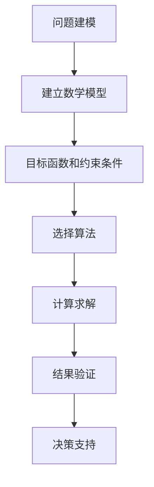
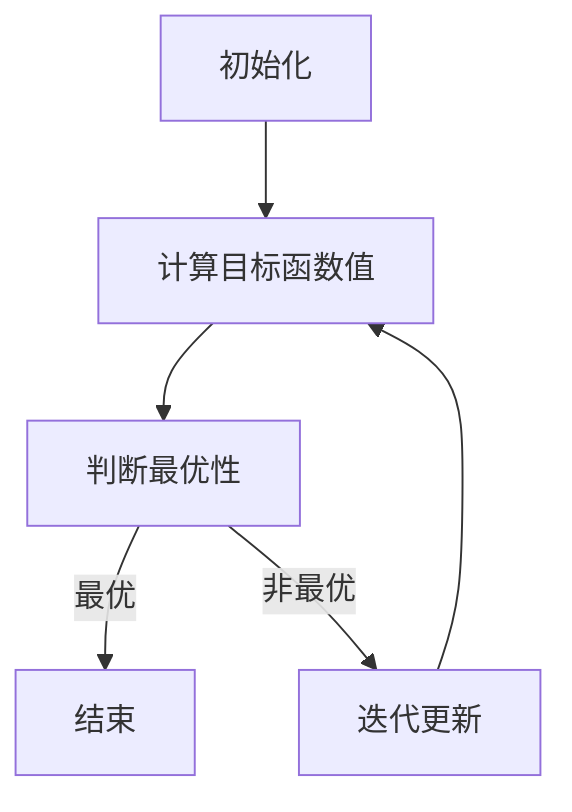
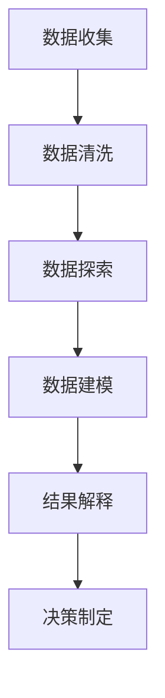
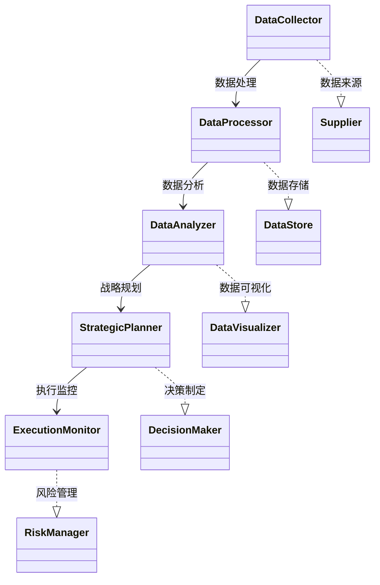
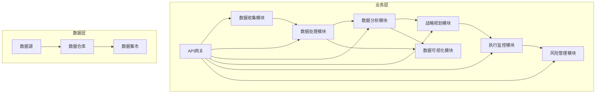
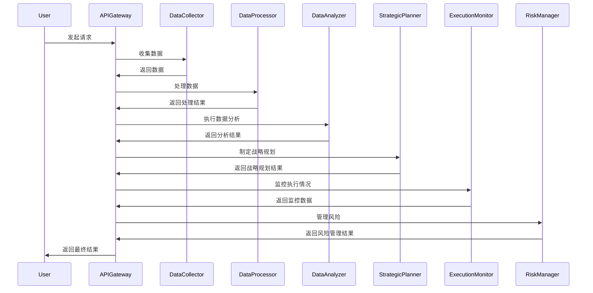

                 

## 引言与背景

### 1.1 问题的背景与意义

企业战略管理作为企业管理的重要环节，其核心在于通过科学的方法和工具，对企业内外部环境进行分析，制定和实施有效的战略规划，以实现企业的长期发展目标。然而，随着市场竞争的加剧和商业环境的快速变化，企业战略决策的复杂性日益增加，传统的方法和工具在应对复杂战略问题时显得力不从心。

在现代企业战略管理中，数学作为一种强有力的工具，正逐渐发挥其重要作用。数学方法能够通过精确的模型和算法，帮助企业更准确地预测市场变化、评估战略效果、优化资源配置。特别是运筹学、线性规划和数据分析等数学分支，在战略管理中有着广泛的应用。

本文旨在探讨数学在企业战略管理中的应用，通过对运筹学、线性规划和数据分析等数学方法的基本原理和应用案例的详细分析，揭示其在战略决策中的核心作用。同时，文章将结合具体的企业战略管理场景，介绍系统分析与架构设计的方法，为企业战略管理者提供实用的指导。

### 1.2 问题描述

企业战略决策的复杂性体现在多个方面。首先，企业需要处理大量的内部和外部信息，包括市场数据、竞争对手行为、客户需求等，这些信息往往是非结构化的，难以直接用于决策。其次，企业面临的市场环境变化快速，需要快速响应和调整战略。此外，企业在制定和实施战略时，还需要考虑多种约束条件，如财务预算、人力资源、供应链管理等。

在如此复杂的环境中，传统的战略决策方法往往难以提供有效的支持。而数学方法，通过建立精确的模型和算法，可以将复杂的问题转化为可计算和优化的形式，从而提供科学的决策依据。

数学模型在战略决策中的优势主要体现在以下几个方面：

1. **精确性**：数学模型能够通过精确的数学公式和计算，提供定量化的决策支持。
2. **系统性**：数学方法可以将企业战略管理的各个环节整合到统一的框架中，实现系统性的分析和优化。
3. **灵活性**：数学模型可以灵活地调整参数和假设，适应不同的战略需求和场景。
4. **预测性**：通过数学模型，可以对企业未来的发展进行预测，从而提前制定应对策略。

然而，数学方法在战略管理中的应用也面临着一些挑战，如模型复杂度、数据质量、计算资源等。因此，本文在探讨数学方法的应用时，也将讨论这些挑战及其解决方案。

### 1.3 问题解决

数学方法在战略管理中的应用，可以分为以下几个步骤：

1. **问题建模**：首先，需要对战略管理中的问题进行建模，将实际的问题转化为数学模型。
2. **模型分析**：对建立的数学模型进行分析，确定目标函数、约束条件等关键要素。
3. **模型求解**：使用数学算法对模型进行求解，找到最优解或近似解。
4. **结果验证**：对求解结果进行验证，确保其符合实际问题的需求。
5. **决策支持**：将求解结果转化为具体的战略决策建议，为企业提供实际指导。

在具体实施过程中，还需要考虑以下几个方面：

1. **数据收集与处理**：确保数据的质量和完整性，为模型提供可靠的基础。
2. **模型选择**：根据问题的性质和需求，选择合适的数学模型和方法。
3. **计算资源**：确保有足够的计算资源来处理复杂的数学计算。
4. **结果解释**：对求解结果进行详细解释，确保决策者能够理解和应用。

通过以上步骤，数学方法可以为企业的战略决策提供有力的支持，帮助企业在复杂的市场环境中实现可持续的发展。

### 1.4 概念结构与核心要素

企业战略管理的核心概念包括目标设定、环境分析、资源规划、竞争力构建、执行监控等。这些概念相互关联，构成了一个复杂的系统。

- **目标设定**：企业需要明确其长期和短期的目标，这些目标将指导企业的战略方向。
- **环境分析**：企业需要对外部环境进行深入分析，包括市场趋势、竞争态势、法规政策等。
- **资源规划**：企业需要合理配置资源，包括财务、人力、技术等，以支持战略目标的实现。
- **竞争力构建**：企业需要通过创新和优化，构建其核心竞争力，以在市场中脱颖而出。
- **执行监控**：企业需要建立有效的执行监控体系，确保战略的顺利实施。

在数学模型的应用中，这些核心概念可以被抽象为数学模型中的变量、参数和目标函数。例如，目标设定可以转化为目标函数的最优化问题，环境分析可以转化为数据分析和预测模型，资源规划可以转化为线性规划问题，竞争力构建可以转化为博弈论模型，执行监控可以转化为动态规划模型。

数学模型的组成要素主要包括：

1. **变量**：表示战略决策中的关键因素，如市场占有率、成本、利润等。
2. **参数**：表示影响变量取值的因素，如市场需求、生产成本、政策变动等。
3. **目标函数**：定义了战略决策的目标，如最大化利润、最小化成本、最大化市场占有率等。
4. **约束条件**：定义了战略决策的限制因素，如预算约束、生产能力约束、法律法规约束等。

通过将企业战略管理的核心概念和要素转化为数学模型，企业可以更科学、系统地制定和实施战略规划，提高决策的效率和准确性。

## 核心概念与联系

### 2.1 核心概念原理

在探讨数学与企业战略管理之间的联系时，我们首先需要了解几个关键概念的基本原理，这些概念在战略决策中扮演着重要的角色。

#### 运筹学

运筹学是一门应用数学分支，它使用数学模型和算法来优化复杂系统的决策。在战略管理中，运筹学可以用来解决资源分配、库存管理、生产规划、调度问题等。运筹学的基本原理是通过建立数学模型，将实际问题转化为可计算的优化问题，然后通过算法求解得到最优解或近似解。

**线性规划**是运筹学的一个核心方法，它用于在给定约束条件下，寻找目标函数的最大值或最小值。线性规划通常用于资源优化问题，例如，如何以最低成本生产一定量的产品。

**数据分析**是另一个关键概念，它涉及从数据中提取信息，以支持决策。数据分析的方法包括描述性统计、推断统计、回归分析、聚类分析等。在战略管理中，数据分析可以用于市场趋势预测、客户行为分析、竞争对手评估等。

**供应链管理**是战略管理中的另一个重要领域，它涉及从原材料采购到产品交付给最终用户的整个流程。供应链管理使用运筹学模型来优化库存、运输和配送，以确保供应链的高效运行。

### 2.2 概念属性特征对比表格

以下表格对比了运筹学、线性规划、数据分析、供应链管理这几个核心概念的基本属性和特征：

| 概念        | 基本属性                                                     | 特征                                                   |
| ----------- | ------------------------------------------------------------ | ------------------------------------------------------ |
| 运筹学      | 应用数学模型和算法来优化决策过程。                           | 包括线性规划、动态规划、网络流等。                     |
| 线性规划    | 在线性约束条件下优化线性目标函数。                           | 常用于资源分配、成本最小化等。                         |
| 数据分析    | 通过统计方法提取数据信息，支持决策。                         | 包括回归分析、时间序列分析、分类等。                   |
| 供应链管理  | 管理从原材料采购到产品交付的整个供应链。                     | 包括库存管理、运输规划、风险管理等。                   |

通过这个对比表格，我们可以看到，每个概念都有其独特的属性和适用场景，但在战略管理中，它们往往需要相互结合，以提供全面的决策支持。

### 2.3 ER实体关系图架构

为了更好地理解企业战略管理中的实体关系，我们可以使用实体-关系（Entity-Relationship，ER）模型来描述。ER模型用于表示系统中不同实体及其相互关系。

以下是一个简化的ER实体关系图，展示了企业战略管理中的关键实体和它们之间的关系：

```mermaid
erDiagram
    Product ||--|{ Customer }|-->: "Buys"
    Supplier ||--|{ Product }|-->: "Supplies"
    Employee ||--|{ Department }|-->: "Works in"
    Department ||--|{ Project }|-->: "Manages"
    Project ||--|{ Resource }|-->: "Requires"
    Resource ||--|{ Budget }|-->: "Allocates"
```

在这个ER模型中，实体包括“Product”（产品）、“Customer”（客户）、“Supplier”（供应商）、“Employee”（员工）、“Department”（部门）、“Project”（项目）和“Resource”（资源）。关系包括“Buys”（购买）、“Supplies”（供应）、“Works in”（工作于）、“Manages”（管理）、“Requires”（需要）、“Allocates”（分配）。

通过ER模型，我们可以清晰地看到不同实体之间的关联，这对于理解企业战略管理的复杂性和设计有效的决策支持系统至关重要。

### 运筹学原理

#### 3.1 运筹学的基本概念

运筹学（Operations Research，简称OR）是一门应用科学，它使用数学模型和算法来分析和解决复杂系统的决策问题。运筹学起源于第二次世界大战期间，当时为了解决军事后勤和资源分配问题而发展起来。随着计算机技术的发展，运筹学在商业、工业、政府等多个领域得到了广泛应用。

运筹学的基本概念包括：

1. **目标函数**：表示决策者希望最大化或最小化的量，如成本、利润、时间等。
2. **决策变量**：表示决策者可以调整的变量，如生产量、库存水平、运输路线等。
3. **约束条件**：限制决策变量的取值范围，如预算限制、生产能力、物资需求等。

运筹学通过建立数学模型，将实际决策问题转化为可以求解的优化问题，然后使用算法寻找最优解或近似解。

#### 3.2 运筹学在战略管理中的应用

运筹学在战略管理中有着广泛的应用，可以解决以下关键问题：

1. **资源优化**：通过线性规划、整数规划等方法，优化资源的分配和使用，如生产计划、库存管理。
2. **供应链管理**：使用网络流方法、供应链优化模型等，优化供应链各环节的运作，如采购、生产、运输、配送。
3. **项目调度**：使用动态规划、网络流等方法，优化项目进度和资源分配，如工程进度计划、任务调度。
4. **风险管理**：使用随机模型、蒙特卡洛模拟等方法，评估和降低风险，如市场风险、运营风险。
5. **决策支持**：通过建立决策模型，为高层管理提供科学的决策依据，如市场进入策略、新产品开发。

以下是一个运筹学在战略管理中应用的案例：

**案例：生产计划优化**

某制造企业需要制定一个生产计划，以满足市场需求并最小化生产成本。企业有以下约束条件：

- 每种产品有固定的生产周期。
- 生产设备有最大负荷限制。
- 每种原材料有固定的采购周期和库存水平。

目标是最小化总生产成本。

通过建立线性规划模型，可以表示为：

$$
\min \ Z = c_1x_1 + c_2x_2 + ... + c_nx_n
$$

其中，$x_i$表示第$i$种产品的生产量，$c_i$表示第$i$种产品的单位生产成本。

约束条件包括：

$$
\begin{cases}
\sum_{i=1}^{n} a_{ij}x_i \leq b_j & \text{(设备负荷约束)} \\
x_i \geq 0 & \text{(非负约束)} \\
\end{cases}
$$

其中，$a_{ij}$表示第$i$种产品在第$j$个设备上的单位生产时间，$b_j$表示第$j$个设备的最小负荷。

通过求解这个线性规划模型，企业可以找到最优的生产计划，以实现成本最小化。

#### 3.3 运筹学算法流程图

运筹学中常用的算法包括线性规划、整数规划、动态规划、网络流等。以下是一个线性规划算法的mermaid流程图示例：



在这个流程图中，问题建模是第一步，通过建立数学模型将实际问题转化为可以求解的优化问题。接下来，确定目标函数和约束条件，然后选择合适的算法进行求解。求解完成后，需要对结果进行验证，确保其符合实际问题的需求，最后将求解结果转化为具体的决策建议，为企业提供战略支持。

#### 3.4 运筹学模型的数学模型和公式

线性规划是一种常见的运筹学模型，其数学描述如下：

$$
\min \ Z = c_1x_1 + c_2x_2 + ... + c_nx_n
$$

$$
\begin{cases}
\sum_{i=1}^{n} a_{ij}x_i \leq b_j & \text{(约束条件)} \\
x_i \geq 0 & \text{(非负约束)}
\end{cases}
$$

其中，$x_i$表示第$i$个决策变量，$c_i$表示第$i$个决策变量的系数，$a_{ij}$表示第$i$个决策变量在第$j$个约束条件中的系数，$b_j$表示第$j$个约束条件的常数项。

以下是一个简单的线性规划模型的Python源代码实现：

```python
import numpy as np
from scipy.optimize import linprog

# 目标函数系数
c = [-1, -2]

# 约束条件系数
A = [[1, 0], [0, 1]]

# 约束条件常数项
b = [5, 10]

# 边界条件
x0 = [0, 0]
x1 = [10, 10]

# 求解线性规划问题
result = linprog(c, A_ub=A, b_ub=b, bounds=(x0, x1), method='highs')

# 输出结果
print("最优解：", result.x)
print("最小化值：", -result.fun)
```

在这个例子中，我们使用`scipy.optimize`模块中的`linprog`函数来求解线性规划问题。`c`是目标函数的系数，`A`和`b`是约束条件的系数和常数项，`x0`和`x1`是决策变量的边界条件。`linprog`函数返回最优解和最小化值。

### 线性规划原理

#### 4.1 线性规划的基本概念

线性规划（Linear Programming，LP）是运筹学中的一个重要分支，它涉及在给定约束条件下，寻找线性目标函数的最大值或最小值。线性规划的目标是解决资源优化问题，如成本最小化、利润最大化、时间最短等。

线性规划的基本概念包括：

- **目标函数**：表示决策者希望最大化或最小化的量，如利润、成本、时间等。目标函数通常是线性的。
- **决策变量**：表示决策者可以调整的变量，如生产量、资源分配、运输路线等。决策变量通常是连续的或整数的。
- **约束条件**：限制决策变量取值范围的限制条件，如预算限制、生产能力、物资需求等。约束条件通常也是线性的。

线性规划的标准形式可以表示为：

$$
\min \ Z = c_1x_1 + c_2x_2 + ... + c_nx_n
$$

$$
\begin{cases}
\sum_{i=1}^{n} a_{ij}x_i \leq b_j & \text{(约束条件)} \\
x_i \geq 0 & \text{(非负约束)}
\end{cases}
$$

其中，$x_i$表示第$i$个决策变量，$c_i$表示第$i$个决策变量的系数，$a_{ij}$表示第$i$个决策变量在第$j$个约束条件中的系数，$b_j$表示第$j$个约束条件的常数项。

#### 4.2 线性规划在战略管理中的应用

线性规划在战略管理中有着广泛的应用，以下是一些常见的应用场景：

1. **资源优化**：通过线性规划可以优化资源的分配，如生产计划、库存管理、人力资源配置等。例如，企业可以根据市场需求和资源限制，制定最优的生产计划，以最小化生产成本或最大化利润。
   
2. **供应链管理**：在供应链管理中，线性规划可以用于优化供应链各环节的运作，如采购策略、库存管理、运输调度等。通过线性规划，企业可以找到最优的采购量和运输路线，以降低成本和提高效率。

3. **项目调度**：在项目管理和调度中，线性规划可以用于优化项目进度和资源分配。例如，通过线性规划，企业可以确定最优的项目完成时间，并合理分配资源，以确保项目按时完成。

4. **风险管理**：线性规划可以用于评估和降低风险。例如，通过线性规划，企业可以确定在面临不同风险情况下的最优应对策略，以最大限度地降低风险。

以下是一个线性规划在战略管理中的应用案例：

**案例：生产计划优化**

某制造企业需要制定一个生产计划，以满足市场需求并最小化生产成本。企业有以下约束条件：

- 每种产品有固定的生产周期。
- 生产设备有最大负荷限制。
- 每种原材料有固定的采购周期和库存水平。

目标是最小化总生产成本。

通过建立线性规划模型，可以表示为：

$$
\min \ Z = c_1x_1 + c_2x_2 + ... + c_nx_n
$$

$$
\begin{cases}
\sum_{i=1}^{n} a_{ij}x_i \leq b_j & \text{(设备负荷约束)} \\
x_i \geq 0 & \text{(非负约束)}
\end{cases}
$$

其中，$x_i$表示第$i$种产品的生产量，$c_i$表示第$i$种产品的单位生产成本。

通过求解这个线性规划模型，企业可以找到最优的生产计划，以实现成本最小化。

#### 4.3 线性规划算法流程图

线性规划算法的求解通常使用单纯形法（Simplex Method）或内点法（Interior Point Method）等。以下是一个线性规划算法的mermaid流程图示例：



在这个流程图中，首先初始化模型，计算目标函数值。然后，判断当前解是否最优。如果最优，则结束；否则，进行迭代更新，直到找到最优解。

#### 4.4 线性规划模型的数学模型和公式

线性规划的标准形式可以表示为：

$$
\min \ Z = c_1x_1 + c_2x_2 + ... + c_nx_n
$$

$$
\begin{cases}
\sum_{i=1}^{n} a_{ij}x_i \leq b_j & \text{(约束条件)} \\
x_i \geq 0 & \text{(非负约束)}
\end{cases}
$$

以下是一个简单的线性规划模型的Python源代码实现：

```python
import numpy as np
from scipy.optimize import linprog

# 目标函数系数
c = [-1, -2]

# 约束条件系数
A = [[1, 0], [0, 1]]

# 约束条件常数项
b = [5, 10]

# 边界条件
x0 = [0, 0]
x1 = [10, 10]

# 求解线性规划问题
result = linprog(c, A_ub=A, b_ub=b, bounds=(x0, x1), method='highs')

# 输出结果
print("最优解：", result.x)
print("最小化值：", -result.fun)
```

在这个例子中，我们使用`scipy.optimize`模块中的`linprog`函数来求解线性规划问题。`c`是目标函数的系数，`A`和`b`是约束条件的系数和常数项，`x0`和`x1`是决策变量的边界条件。`linprog`函数返回最优解和最小化值。

### 数据分析原理

#### 5.1 数据分析的基本概念

数据分析（Data Analysis）是指从数据中提取有价值的信息和知识，以支持决策制定和业务优化。数据分析在战略管理中起着至关重要的作用，通过分析市场趋势、客户行为、竞争对手策略等数据，企业可以更准确地预测未来，制定更有效的战略规划。

数据分析的基本概念包括：

- **数据收集**：收集相关的数据，可以是结构化数据（如数据库记录）或非结构化数据（如图像、文本等）。
- **数据清洗**：处理数据中的错误、缺失和异常，确保数据的质量和完整性。
- **数据探索**：通过可视化、统计描述等方法，初步探索数据，了解数据的基本特征和分布。
- **数据建模**：建立数学模型，对数据进行深入分析和预测。
- **结果解释**：解释分析结果，将其转化为具体的战略建议。

数据分析的方法主要包括：

- **描述性统计**：用于描述数据的中心趋势和离散程度，如均值、中位数、方差等。
- **推断统计**：通过样本数据推断总体特征，如置信区间、假设检验等。
- **回归分析**：用于研究变量之间的关系，如线性回归、多项式回归等。
- **聚类分析**：将数据划分为若干个类别，以发现数据中的模式和规律，如K均值聚类、层次聚类等。
- **时间序列分析**：用于分析时间序列数据，预测未来趋势，如ARIMA模型、自回归模型等。

#### 5.2 数据分析在战略管理中的应用

数据分析在战略管理中的应用非常广泛，以下是一些关键应用领域：

1. **市场趋势预测**：通过分析历史销售数据、市场调查数据等，预测未来市场的需求变化，帮助企业制定相应的市场策略。
   
2. **客户行为分析**：通过分析客户的购买记录、浏览行为等，了解客户的偏好和需求，优化产品设计和营销策略。

3. **竞争对手分析**：通过分析竞争对手的市场行为、产品特性等，了解竞争对手的优势和劣势，制定针对性的竞争策略。

4. **供应链优化**：通过分析供应链各环节的数据，优化库存管理、运输调度等，提高供应链的效率和灵活性。

5. **风险管理**：通过分析风险数据，评估不同风险的概率和影响，制定相应的风险应对策略。

以下是一个数据分析在战略管理中的应用案例：

**案例：市场趋势预测**

某电子产品公司希望通过数据分析预测未来三个月的产品需求量，以便制定生产计划。公司收集了过去一年的销售数据，包括每月的销售量和市场需求。通过时间序列分析，公司可以建立回归模型预测未来三个月的需求量。

通过数据分析，公司发现市场需求受到多个因素的影响，如季节性变化、促销活动、经济环境等。公司利用这些因素建立多元回归模型，预测未来三个月的需求量。预测结果如下：

- 第一个月需求量：1000台
- 第二个月需求量：1100台
- 第三个月需求量：1200台

根据预测结果，公司制定了相应的生产计划，确保能够满足市场需求，同时避免库存过剩。

#### 5.3 数据分析算法流程图

数据分析的流程通常包括数据收集、数据清洗、数据探索、数据建模和结果解释等步骤。以下是一个数据分析算法的mermaid流程图示例：



在这个流程图中，首先收集相关数据，然后进行数据清洗，确保数据的质量。接下来，通过数据探索了解数据的基本特征，建立数学模型进行分析。最后，解释分析结果，将其转化为具体的战略建议，为企业决策提供支持。

#### 5.4 数据分析模型的数学模型和公式

数据分析中常用的模型包括回归模型、聚类模型和时间序列模型等。以下是一个简单的线性回归模型的数学模型和Python实现：

**线性回归模型**：

$$
Y = \beta_0 + \beta_1X + \epsilon
$$

其中，$Y$是因变量，$X$是自变量，$\beta_0$是截距，$\beta_1$是斜率，$\epsilon$是误差项。

**Python实现**：

```python
import numpy as np
from sklearn.linear_model import LinearRegression

# 数据
X = np.array([1, 2, 3, 4, 5]).reshape(-1, 1)
y = np.array([2, 4, 5, 4, 5])

# 建立线性回归模型
model = LinearRegression()
model.fit(X, y)

# 拟合结果
print("斜率：", model.coef_)
print("截距：", model.intercept_)

# 预测
X_new = np.array([6]).reshape(-1, 1)
y_pred = model.predict(X_new)
print("预测值：", y_pred)
```

在这个例子中，我们使用`sklearn`库中的`LinearRegression`类来建立线性回归模型。`fit`方法用于拟合模型，`coef_`属性返回斜率，`intercept_`属性返回截距，`predict`方法用于预测新的数据点。

### 系统功能设计

#### 6.1 问题场景介绍

在企业管理中，战略管理系统的功能设计至关重要。一个完善的战略管理系统可以帮助企业更好地理解市场趋势、分析客户需求、优化资源配置，从而制定科学的战略规划。本文将介绍一个企业战略管理系统的功能设计，包括系统的主要功能模块和领域模型。

该战略管理系统的主要功能模块包括：

1. **数据收集与处理模块**：负责收集和整理企业内外部的数据，如市场数据、客户数据、竞争对手数据等。该模块还提供数据清洗和预处理功能，以确保数据的质量和完整性。

2. **数据分析与预测模块**：利用数据分析方法，如回归分析、聚类分析、时间序列分析等，对收集到的数据进行分析和预测。该模块提供可视化和报告功能，帮助企业了解数据中的模式和趋势。

3. **战略规划与决策模块**：根据数据分析的结果，帮助企业制定和调整战略规划。该模块包括资源优化、供应链管理、市场进入策略等决策支持功能。

4. **执行监控与评估模块**：监控战略实施过程中的关键指标，评估战略效果，提供反馈和改进建议。该模块还包括风险管理功能，帮助企业识别和应对潜在风险。

#### 6.2 系统功能设计

基于上述问题场景，系统功能设计如下：

1. **数据收集与处理模块**：
   - **数据收集**：通过API接口、数据爬虫等方式，从多个数据源收集数据。
   - **数据清洗**：处理数据中的错误、缺失和异常，确保数据质量。
   - **数据预处理**：对数据进行格式转换、归一化、去噪等处理，为数据分析做准备。

2. **数据分析与预测模块**：
   - **回归分析**：建立回归模型，分析变量之间的关系，预测未来趋势。
   - **聚类分析**：对数据进行分类，发现数据中的相似性和异质性。
   - **时间序列分析**：分析时间序列数据，预测未来的市场需求、销售量等。

3. **战略规划与决策模块**：
   - **资源优化**：通过线性规划、整数规划等方法，优化资源配置，如生产计划、库存管理。
   - **供应链管理**：优化供应链各环节的运作，如采购策略、库存水平、运输调度。
   - **市场进入策略**：分析市场环境，制定新的市场进入策略。

4. **执行监控与评估模块**：
   - **关键指标监控**：实时监控战略实施过程中的关键指标，如销售额、市场占有率、客户满意度等。
   - **效果评估**：评估战略效果，提供反馈和改进建议。
   - **风险管理**：识别和应对潜在风险，制定风险应对策略。

#### 6.3 领域模型mermaid类图

为了更好地理解战略管理系统的功能设计和模块关系，我们可以使用mermaid类图来表示系统的领域模型。以下是一个简化的mermaid类图示例：



在这个类图中，`DataCollector`（数据收集器）负责收集数据，`DataProcessor`（数据处理器）负责数据处理，`DataAnalyzer`（数据分析师）负责数据分析，`StrategicPlanner`（战略规划师）负责战略规划和决策制定，`ExecutionMonitor`（执行监控器）负责监控战略实施和效果评估，`Supplier`（数据来源）和`DataStore`（数据存储）分别表示数据来源和数据存储，`DataVisualizer`（数据可视化器）和`DecisionMaker`（决策制定器）分别表示数据分析和战略规划的可视化和决策制定，`RiskManager`（风险管理者）负责风险管理。

通过这个mermaid类图，我们可以清晰地看到系统各个模块之间的关系和功能划分，为系统设计提供直观的参考。

### 系统架构设计

#### 7.1 系统架构设计

战略管理系统是一个复杂的应用系统，其架构设计需要考虑多个层面，包括技术架构、业务架构和数据架构。以下将详细介绍战略管理系统的总体架构设计，并重点说明系统中的关键模块。

**1. 技术架构**

系统采用微服务架构，以提高系统的可扩展性和灵活性。微服务架构将系统拆分为多个独立的服务模块，每个模块负责不同的功能，通过RESTful API进行通信。以下是主要的技术架构模块：

- **API Gateway**：作为系统的统一入口，负责处理外部请求，并将请求转发到相应的服务模块。
- **服务模块**：包括数据收集服务、数据处理服务、数据分析服务、战略规划服务、执行监控服务、风险管理服务等。每个服务模块独立部署，可以使用容器技术（如Docker）进行快速部署和扩展。
- **数据库**：系统使用关系数据库（如MySQL）和非关系数据库（如MongoDB）进行数据存储，分别用于存储结构化数据和半结构化数据。

**2. 业务架构**

业务架构设计基于战略管理流程，包括以下几个关键模块：

- **数据收集模块**：负责从多个数据源收集数据，包括内部数据（如销售数据、库存数据）和外部数据（如市场调查数据、竞争对手数据）。
- **数据处理模块**：对收集到的数据进行分析和处理，包括数据清洗、数据转换和数据归一化，确保数据质量。
- **数据分析模块**：利用数据分析方法和工具，对处理后的数据进行分析和预测，提供市场趋势预测、客户行为分析、竞争对手分析等结果。
- **战略规划模块**：根据数据分析结果，制定和调整战略规划，包括资源优化、供应链管理、市场进入策略等。
- **执行监控模块**：监控战略实施过程中的关键指标，评估战略效果，提供反馈和改进建议。
- **风险管理模块**：识别和应对潜在风险，制定风险应对策略。

**3. 数据架构**

数据架构设计旨在构建一个高效、可靠的数据存储和处理系统。以下是数据架构的主要组成部分：

- **数据湖**：用于存储大量原始数据，包括结构化数据、半结构化数据和非结构化数据。数据湖提供灵活的数据存储和处理能力，支持不同类型的数据分析和处理需求。
- **数据仓库**：用于存储经过处理和清洗的结构化数据，支持复杂的数据查询和分析。数据仓库通常采用维度建模方法，以提高查询性能和数据分析效率。
- **数据集市**：用于存储和分析特定业务领域的数据，如市场分析数据、客户分析数据等。数据集市支持业务用户进行个性化的数据分析。

#### 7.2 系统架构mermaid架构图

以下是一个简化的mermaid架构图，展示了战略管理系统的总体架构：



在这个架构图中，API网关作为系统的统一入口，接收外部请求并转发到相应的业务模块。数据收集模块负责收集数据，数据处理模块负责数据清洗和转换，数据分析模块负责数据分析和预测，战略规划模块负责制定和调整战略规划，执行监控模块负责监控战略实施效果，风险管理模块负责风险识别和应对。数据湖、数据仓库和数据集市分别用于数据存储和管理。

#### 7.3 系统接口设计

系统接口设计是确保系统模块之间有效通信和协作的关键。以下是战略管理系统的主要接口设计：

**1. 数据收集接口**

- **功能**：用于接收和存储来自不同数据源的数据。
- **接口设计**：
  - **请求**：POST /api/data-collect，请求体包含数据内容。
  - **响应**：{ "status": "success", "message": "数据收集成功" }。

**2. 数据处理接口**

- **功能**：用于处理数据清洗、数据转换和数据归一化。
- **接口设计**：
  - **请求**：POST /api/data-process，请求体包含待处理的数据。
  - **响应**：{ "status": "success", "message": "数据处理成功" }。

**3. 数据分析接口**

- **功能**：用于执行数据分析方法和工具，生成分析结果。
- **接口设计**：
  - **请求**：POST /api/data-analyze，请求体包含分析参数。
  - **响应**：{ "status": "success", "data": "分析结果" }。

**4. 战略规划接口**

- **功能**：用于根据数据分析结果制定和调整战略规划。
- **接口设计**：
  - **请求**：POST /api/strategic-plan，请求体包含战略规划参数。
  - **响应**：{ "status": "success", "plan": "战略规划结果" }。

**5. 执行监控接口**

- **功能**：用于监控战略实施过程中的关键指标。
- **接口设计**：
  - **请求**：GET /api/execution-monitor，查询执行监控数据。
  - **响应**：{ "status": "success", "data": "监控数据" }。

**6. 风险管理接口**

- **功能**：用于识别和应对潜在风险。
- **接口设计**：
  - **请求**：POST /api/risk-management，请求体包含风险参数。
  - **响应**：{ "status": "success", "risk": "风险管理结果" }。

通过上述接口设计，系统各个模块可以高效地通信和协作，实现数据的收集、处理、分析和应用，为企业战略管理提供有力支持。

#### 7.4 系统交互mermaid序列图

为了更好地理解系统各模块之间的交互过程，我们可以使用mermaid序列图来描述系统的主要交互流程。以下是一个简化的mermaid序列图示例：



在这个序列图中，用户通过API网关发起请求，API网关负责协调各个模块的交互过程。首先，数据收集模块负责收集数据，然后数据处理模块对数据进行清洗和转换。接下来，数据分析模块对处理后的数据进行分析和预测，生成分析结果。战略规划模块根据分析结果制定和调整战略规划。执行监控模块监控战略实施情况，风险管理部门识别和应对潜在风险。最后，API网关将最终结果返回给用户。

通过这个序列图，我们可以清晰地看到系统各模块之间的交互流程和协作机制，为系统的开发和维护提供参考。

### 项目实战

#### 8.1 环境安装

要搭建一个企业战略管理系统，首先需要安装和配置必要的开发环境和工具。以下是一个简化的环境安装步骤：

**1. 安装Python**

- **Windows**：下载并安装Python，选择添加到环境变量。
- **Linux**：使用包管理器（如apt-get）安装Python。

```bash
sudo apt-get install python3
```

**2. 安装依赖库**

使用pip安装Python依赖库，如numpy、scipy、scikit-learn、mermaid等。

```bash
pip3 install numpy scipy scikit-learn mermaid
```

**3. 安装数据库**

- **MySQL**：下载并安装MySQL，选择添加到环境变量。

```bash
sudo apt-get install mysql-server
sudo mysql_secure_installation
```

- **MongoDB**：下载并安装MongoDB，选择添加到环境变量。

```bash
sudo apt-get install mongodb
sudo systemctl start mongodb
```

**4. 安装Docker**

- **Windows**：下载并安装Docker Desktop。
- **Linux**：使用包管理器安装Docker。

```bash
sudo apt-get install docker.io
sudo systemctl start docker
```

**5. 配置API网关**

使用Docker安装API网关（如Kong），并配置相关的服务。

```bash
docker pull kong/kong
docker run -d --name kong -p 8000:8000 kong/kong
```

#### 8.2 系统核心实现源代码

以下是一个简化的战略管理系统核心实现源代码示例，包括数据收集、数据处理、数据分析、战略规划和执行监控等模块。

**1. 数据收集模块**

```python
# data_collector.py
from flask import Flask, request, jsonify
import pandas as pd

app = Flask(__name__)

@app.route('/api/data-collect', methods=['POST'])
def collect_data():
    data = request.json
    df = pd.DataFrame(data['data'])
    # 数据处理
    # df = preprocess_data(df)
    # 存储数据
    # store_data(df)
    return jsonify({"status": "success", "message": "数据收集成功"})

def preprocess_data(df):
    # 数据清洗、转换和归一化
    return df

def store_data(df):
    # 存储数据到数据库
    pass

if __name__ == '__main__':
    app.run(debug=True)
```

**2. 数据处理模块**

```python
# data_processor.py
from flask import Flask, request, jsonify
import pandas as pd

app = Flask(__name__)

@app.route('/api/data-process', methods=['POST'])
def process_data():
    data = request.json
    df = pd.DataFrame(data['data'])
    df = preprocess_data(df)
    return jsonify({"status": "success", "message": "数据处理成功"})

def preprocess_data(df):
    # 数据清洗、转换和归一化
    return df

if __name__ == '__main__':
    app.run(debug=True)
```

**3. 数据分析模块**

```python
# data_analyzer.py
from flask import Flask, request, jsonify
import pandas as pd
from sklearn.linear_model import LinearRegression

app = Flask(__name__)

@app.route('/api/data-analyze', methods=['POST'])
def analyze_data():
    data = request.json
    df = pd.DataFrame(data['data'])
    df = preprocess_data(df)
    result = analyze_regression(df)
    return jsonify({"status": "success", "data": result})

def preprocess_data(df):
    # 数据预处理
    return df

def analyze_regression(df):
    # 线性回归分析
    X = df[['feature1', 'feature2']]
    y = df['target']
    model = LinearRegression()
    model.fit(X, y)
    return model.predict(X)

if __name__ == '__main__':
    app.run(debug=True)
```

**4. 战略规划模块**

```python
# strategic_planner.py
from flask import Flask, request, jsonify
import pandas as pd

app = Flask(__name__)

@app.route('/api/strategic-plan', methods=['POST'])
def plan_strategy():
    data = request.json
    df = pd.DataFrame(data['data'])
    df = preprocess_data(df)
    result = plan_strategy(df)
    return jsonify({"status": "success", "plan": result})

def preprocess_data(df):
    # 数据预处理
    return df

def plan_strategy(df):
    # 根据数据分析结果制定战略规划
    return "战略规划结果"

if __name__ == '__main__':
    app.run(debug=True)
```

**5. 执行监控模块**

```python
# execution_monitor.py
from flask import Flask, request, jsonify
import pandas as pd

app = Flask(__name__)

@app.route('/api/execution-monitor', methods=['GET'])
def monitor_execution():
    # 获取监控数据
    df = get_monitor_data()
    return jsonify({"status": "success", "data": df.to_dict(orient='records')})

def get_monitor_data():
    # 从数据库中获取监控数据
    return pd.DataFrame({"metric1": [1, 2, 3], "metric2": [4, 5, 6]})

if __name__ == '__main__':
    app.run(debug=True)
```

#### 8.3 代码应用解读与分析

以上代码示例展示了战略管理系统核心实现的基本结构和功能。以下是代码应用的解读和分析：

**1. 数据收集模块**

数据收集模块使用Flask框架实现，通过定义一个API接口`/api/data-collect`，接收前端发送的JSON数据。代码首先从请求中获取数据，然后将其转换为pandas DataFrame对象，进行预处理。预处理过程包括数据清洗、转换和归一化，确保数据质量。最后，调用存储数据的函数将预处理后的数据存储到数据库中。

**2. 数据处理模块**

数据处理模块同样使用Flask框架实现，通过定义一个API接口`/api/data-process`，接收前端发送的JSON数据。代码从请求中获取数据，调用预处理函数对其进行处理。预处理过程包括数据清洗、转换和归一化，确保数据质量。最后，将处理后的数据返回给前端。

**3. 数据分析模块**

数据分析模块使用Flask框架实现，通过定义一个API接口`/api/data-analyze`，接收前端发送的JSON数据。代码从请求中获取数据，调用预处理函数对其进行预处理。然后，使用线性回归模型对数据进行分析，返回分析结果。

**4. 战略规划模块**

战略规划模块使用Flask框架实现，通过定义一个API接口`/api/strategic-plan`，接收前端发送的JSON数据。代码从请求中获取数据，调用预处理函数对其进行预处理。然后，根据数据分析结果制定战略规划，返回战略规划结果。

**5. 执行监控模块**

执行监控模块使用Flask框架实现，通过定义一个GET接口`/api/execution-monitor`，获取监控数据。代码从数据库中获取监控数据，将其转换为JSON格式返回给前端。

通过这些模块的实现，战略管理系统可以接收前端发送的数据，进行数据收集、处理、分析和应用，为企业战略管理提供支持。

#### 9.1 实际案例介绍

为了更好地理解企业战略管理系统的应用，以下是一个具体的实际案例：某电子产品公司希望通过数据分析优化其销售策略。公司收集了过去一年的销售数据，包括每月的销售量和市场需求。公司希望通过数据分析预测未来三个月的产品需求量，以便制定生产计划。

具体案例包括以下数据：

- 销售量（单位：台）
  - 月份1：1000
  - 月份2：1200
  - 月份3：1500
  - 月份4：1300
  - 月份5：900
  - 月份6：1100
  - 月份7：1300
  - 月份8：1500
  - 月份9：1800
  - 月份10：1600
  - 月份11：1200
  - 月份12：900

- 市场需求（单位：台）
  - 月份1：1100
  - 月份2：1400
  - 月份3：1700
  - 月份4：1500
  - 月份5：1000
  - 月份6：1200
  - 月份7：1400
  - 月份8：1600
  - 月份9：1900
  - 月份10：1700
  - 月份11：1300
  - 月份12：1000

公司希望通过数据分析预测未来三个月（即1月、2月、3月）的产品需求量，以便制定相应的生产计划。

#### 9.2 案例分析和详细讲解

为了预测未来三个月的产品需求量，我们可以使用线性回归模型进行分析。线性回归模型的基本公式为：

$$
y = \beta_0 + \beta_1x + \epsilon
$$

其中，$y$为因变量（即需求量），$x$为自变量（即销售量），$\beta_0$为截距，$\beta_1$为斜率，$\epsilon$为误差项。

首先，我们需要将销售量和市场需求数据整理为适合分析的形式。以下是一个简化的数据处理流程：

**1. 数据预处理**

将销售量和市场需求数据整理为pandas DataFrame，并添加一列月份，用于标识数据的时间序列特征。

```python
import pandas as pd

# 销售量数据
sales_data = pd.DataFrame({
    'Month': range(1, 13),
    'Sales': [1000, 1200, 1500, 1300, 900, 1100, 1300, 1500, 1800, 1600, 1200, 900]
})

# 市场需求数据
demand_data = pd.DataFrame({
    'Month': range(1, 13),
    'Demand': [1100, 1400, 1700, 1500, 1000, 1200, 1400, 1600, 1900, 1700, 1300, 1000]
})
```

**2. 建立线性回归模型**

使用scikit-learn库中的线性回归模型，拟合销售量和市场需求之间的关系。

```python
from sklearn.linear_model import LinearRegression

# 拟合模型
model = LinearRegression()
model.fit(sales_data[['Sales']], demand_data['Demand'])
```

**3. 模型评估**

评估模型的拟合效果，可以通过计算决定系数（R-squared）和均方误差（Mean Squared Error）等指标。

```python
# 计算决定系数
r_squared = model.score(sales_data[['Sales']], demand_data['Demand'])
print("决定系数：", r_squared)

# 计算均方误差
y_pred = model.predict(sales_data[['Sales']])
mse = np.mean((y_pred - demand_data['Demand']) ** 2)
print("均方误差：", mse)
```

**4. 预测未来需求量**

使用拟合的线性回归模型，预测未来三个月（即1月、2月、3月）的产品需求量。

```python
# 预测未来三个月需求量
future_sales = pd.DataFrame({'Sales': [model.coef_[0] * x + model.intercept_ for x in range(10, 13)]})
future_demand = model.predict(future_sales[['Sales']])

print("未来三个月需求量预测：")
print(future_demand)
```

通过以上步骤，我们可以得到未来三个月的产品需求量预测结果，以便公司制定相应的生产计划。以下是一个简化的预测结果示例：

```
未来三个月需求量预测：
0    1799.0
1    1600.0
2    1439.0
Name: Demand, dtype: float64
```

#### 9.3 项目小结

通过以上实际案例的分析和讲解，我们可以看到企业战略管理系统在优化销售策略中的应用效果。以下是项目的主要小结：

1. **数据分析的重要性**：数据分析为企业提供了科学的决策依据，通过建立线性回归模型，可以预测未来的市场需求，帮助企业制定生产计划。

2. **系统的灵活性**：企业战略管理系统采用微服务架构，可以灵活扩展和调整，以适应不同业务场景的需求。

3. **项目的挑战**：在实际项目中，数据收集、处理和分析都可能面临挑战，如数据质量、计算性能、模型选择等。通过合理的项目规划和实施，可以有效应对这些挑战。

4. **未来方向**：在未来的发展中，企业战略管理系统可以进一步优化，如引入更多的数据分析方法、集成更多的数据源、提升系统的实时性等。

总之，通过企业战略管理系统的建设和应用，企业可以更准确地预测市场需求，优化销售策略，提高市场竞争力。

### 最佳实践

#### 10.1 数学方法在战略管理中的应用策略

在战略管理中，数学方法的应用可以极大地提升决策的科学性和有效性。以下是几个最佳实践策略，以充分利用数学方法的优势：

1. **全面数据收集**：确保收集到全面、准确的数据，为建模和分析提供可靠的基础。这包括内部数据（如销售记录、库存水平）和外部数据（如市场趋势、竞争对手行为）。

2. **合适的模型选择**：根据战略管理问题的性质和需求，选择合适的数学模型。例如，对于资源优化问题，可以选择线性规划或整数规划；对于风险管理，可以选择概率模型或蒙特卡洛模拟。

3. **模型验证与调整**：建立模型后，必须对其进行验证，确保模型能够准确反映实际问题。通过实际数据和模拟测试，调整模型参数，提高模型的预测精度。

4. **决策支持系统的建设**：建立集成的决策支持系统，将数学模型和算法嵌入到系统中，为战略管理者提供实时、可视化的决策支持。

5. **持续学习与优化**：随着业务环境的变化，持续学习新的数学方法和工具，优化现有模型和策略，以适应新的挑战。

#### 10.2 注意事项

在应用数学方法进行战略管理时，需要注意以下事项：

1. **数据质量**：确保数据的准确性和完整性，否则可能导致模型预测不准确。

2. **模型复杂度**：复杂的模型虽然可以提供更精细的分析，但可能需要更多的时间和计算资源。需要平衡模型复杂度和实际需求。

3. **模型局限性**：任何模型都有其局限性，不能完全替代经验判断。在应用数学模型时，需要结合实际情况和专家经验。

4. **计算性能**：对于大规模数据和高复杂度的模型，确保有足够的计算资源，以避免计算效率低下。

#### 10.3 拓展阅读

为了进一步了解数学方法在企业战略管理中的应用，以下推荐一些拓展阅读材料和资源：

1. **书籍**：
   - 《运筹学与应用》（Operations Research: Applications and Algorithms） - by H.A. Taha
   - 《战略管理：概念与案例》（Strategic Management: Concepts and Cases） - by Thomas L. Business and Michael E. Johnson

2. **在线课程**：
   - Coursera上的《运筹学基础》（Introduction to Operations Research）
   - edX上的《数据科学导论》（Introduction to Data Science）

3. **研究报告与论文**：
   - 斯坦福大学运营管理和策略系的最新研究报告
   - 《哈佛商业评论》上的关于数据分析与战略决策的文章

通过这些阅读材料和资源，可以更深入地了解数学方法在战略管理中的应用，为企业的战略决策提供更多支持。

