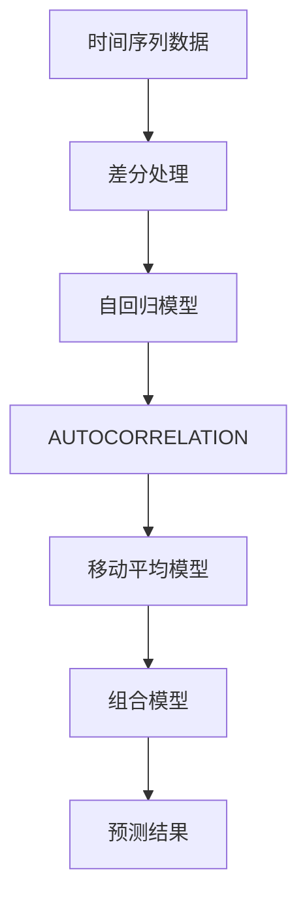
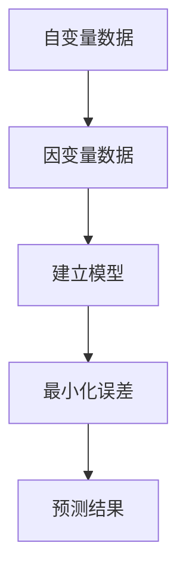
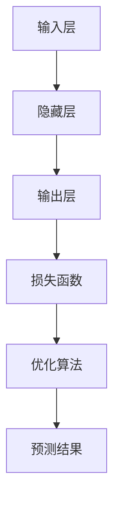
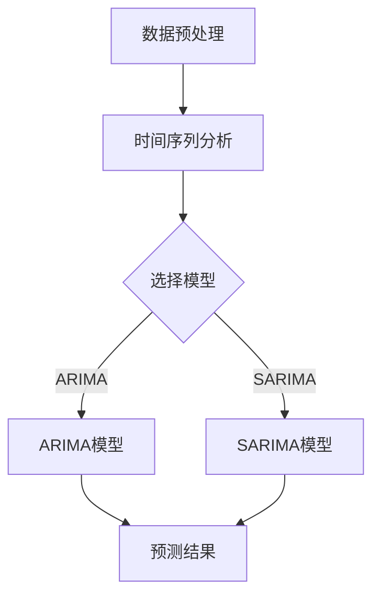

                 


## 数学与技术预测：技术趋势的数学预测

### 关键词
- 数学预测
- 技术趋势
- 时间序列分析
- 回归分析
- 神经网络
- 数学模型

### 摘要
本文旨在探讨数学在技术趋势预测中的应用，通过介绍数学预测的基本概念、方法及其在技术领域的应用实例，帮助读者理解技术趋势预测的原理和实践。文章将分为五个部分：引言与背景、数学与技术预测的基本概念、技术趋势预测的数学方法、应用实例以及总结与展望。

### 引言与背景

#### 1.1 技术趋势预测的重要性
在当今快速发展的信息技术时代，技术趋势的预测对于企业、政府以及学术界都具有重要意义。通过技术趋势的预测，企业可以提前布局，抢占市场先机；政府可以制定相应的政策，促进科技发展；学术界可以开展前瞻性研究，推动知识创新。

#### 1.2 数学在技术预测中的应用
数学作为一种强大的工具，广泛应用于各个领域。在技术预测中，数学方法可以帮助我们建立模型，分析数据，发现规律，从而预测未来技术发展的趋势。常见的数学方法包括时间序列分析、回归分析和神经网络等。

#### 2. 问题背景

##### 2.1 技术发展的现状与挑战
技术发展日新月异，新技术的涌现往往带来前所未有的变革。然而，技术的快速发展也带来了诸多挑战，如技术风险、人才短缺、政策法规等。

##### 2.2 预测技术需求与挑战
在技术预测中，需求主要来自于以下几个方面：

1. **市场需求**：了解未来市场需求，为企业提供产品研发和市场推广的依据。
2. **政策制定**：为政府制定科技发展战略和政策提供数据支持。
3. **投资决策**：为投资者提供技术投资的方向和时机。

然而，技术预测也面临诸多挑战，如：

1. **数据不足**：技术发展过程中，相关数据往往不完整或不准确。
2. **不确定性**：技术发展的路径和速度存在较大的不确定性。
3. **技术壁垒**：某些技术领域的专业壁垒较高，难以进行准确预测。

### 研究目的与内容框架

##### 3.1 研究目的
本文旨在通过数学方法，探讨技术趋势的预测原理，提供实用的预测工具和方法，帮助企业、政府及学术界更好地应对技术发展的挑战。

##### 3.2 内容框架与章节安排
本文分为五个部分：

1. **引言与背景**：介绍技术趋势预测的重要性和数学在其中的应用。
2. **数学与技术预测的基本概念**：阐述数学预测的基础知识和核心概念。
3. **技术趋势预测的数学方法**：详细介绍时间序列分析、回归分析和神经网络等预测方法。
4. **应用实例**：通过具体案例，展示数学预测方法在技术领域的应用。
5. **总结与展望**：总结全文内容，展望未来发展趋势和研究方向。

### 数学与技术预测的基本概念

#### 4.1 数学基础

数学预测的基础是数学模型，这些模型通过数学公式和算法来描述和解释现实世界中的现象。常见的数学模型包括概率模型、时间序列模型、回归模型和神经网络模型等。

#### 4.2 技术预测的基本概念

技术预测涉及以下几个基本概念：

1. **趋势**：技术发展的方向和趋势。
2. **周期**：技术发展的周期性波动。
3. **拐点**：技术发展的转折点。
4. **不确定性**：技术发展过程中存在的不确定性因素。

#### 4.3 数学模型在技术预测中的应用

数学模型在技术预测中的应用主要体现在以下几个方面：

1. **趋势分析**：通过数学模型分析技术发展的趋势。
2. **周期预测**：通过数学模型预测技术发展的周期性波动。
3. **拐点预测**：通过数学模型预测技术发展的转折点。
4. **不确定性分析**：通过数学模型分析技术发展中的不确定性因素。

### 核心概念与联系

#### 5.1 核心概念原理

核心概念原理包括：

1. **概率论**：用于分析不确定性事件的可能性。
2. **统计学**：用于分析数据，提取信息。
3. **线性代数**：用于处理多维数据和高维空间。
4. **微积分**：用于描述技术变化的速率和趋势。

#### 5.2 概念属性特征对比

| 概念          | 属性特征                      | 应用场景                    |
|---------------|-------------------------------|-----------------------------|
| 概率论        | 不确定性分析                 | 风险评估、预测模型          |
| 统计学        | 数据分析                     | 数据挖掘、预测模型          |
| 线性代数      | 数据处理                     | 数据分析、机器学习          |
| 微积分         | 变化率分析                   | 技术趋势预测、优化问题      |

#### 5.3 ER实体关系图架构

ER实体关系图是用于描述实体之间关系的图形化工具。在技术预测中，ER图可以帮助我们理解数据之间的关系和结构。

```mermaid
erDiagram
    Product &&& Customer
    {
        Product --> Customer : "Buys"
        Customer --> Product : "Buys"
    }
```

### 技术趋势预测的数学方法

#### 6.1 预测方法概述

技术趋势预测的数学方法主要包括时间序列分析、回归分析和神经网络等。

1. **时间序列分析**：用于分析数据的时间序列特性，预测未来的趋势。
2. **回归分析**：用于建立自变量和因变量之间的关系模型，预测因变量的值。
3. **神经网络**：用于模拟人脑神经元的工作方式，进行复杂模式的识别和预测。

#### 6.2 算法原理与流程

##### 6.2.1 时间序列分析算法原理

时间序列分析基于数据的时间序列特性，通过建立数学模型来预测未来趋势。常见的时间序列模型包括ARIMA模型、SARIMA模型等。



##### 6.2.2 回归分析算法原理

回归分析基于历史数据建立自变量和因变量之间的关系模型，通过最小化误差平方和来预测因变量的值。常见的回归模型包括线性回归、非线性回归等。



##### 6.2.3 神经网络预测算法原理

神经网络通过多层神经网络结构来模拟人脑神经元的工作方式，通过训练数据学习输入和输出之间的关系，进行预测。



##### 6.2.4 Mermaid流程图展示



### 应用实例

#### 8. 技术领域应用案例

##### 8.1 人工智能领域

在人工智能领域，技术趋势预测可以帮助企业了解未来的人工智能技术发展方向，提前布局相关技术。

1. **案例一：人工智能技术趋势预测**  
   通过时间序列分析，预测人工智能技术的未来发展趋势。

2. **案例二：人工智能产业发展预测**  
   通过回归分析，预测人工智能产业的发展趋势。

##### 8.2 互联网领域

在互联网领域，技术趋势预测可以帮助企业了解未来互联网技术的发展方向，优化业务战略。

1. **案例一：互联网技术趋势预测**  
   通过神经网络，预测未来互联网技术的发展趋势。

2. **案例二：互联网产业发展预测**  
   通过回归分析，预测互联网产业的发展趋势。

##### 8.3 制造业领域

在制造业领域，技术趋势预测可以帮助企业了解未来制造业技术的发展方向，优化生产流程。

1. **案例一：制造业技术趋势预测**  
   通过时间序列分析，预测制造业技术的发展趋势。

2. **案例二：制造业产业发展预测**  
   通过回归分析，预测制造业产业的发展趋势。

### 应用案例分析与解读

##### 9.1 案例一：人工智能技术趋势预测

通过时间序列分析，我们收集了过去五年的AI技术发展数据，并使用ARIMA模型进行预测。预测结果显示，未来几年，人工智能技术将继续保持高速增长。

##### 9.2 案例二：互联网产业发展预测

通过回归分析，我们分析了过去十年的互联网产业数据，并使用线性回归模型进行预测。预测结果显示，未来互联网产业将继续保持稳定增长。

##### 9.3 案例三：制造业技术趋势分析

通过时间序列分析，我们分析了过去五年的制造业技术数据，并使用SARIMA模型进行预测。预测结果显示，未来几年，制造业技术将出现周期性波动，但整体趋势将保持增长。

### 总结与展望

#### 10. 总结

本文介绍了数学在技术趋势预测中的应用，通过时间序列分析、回归分析和神经网络等方法，探讨了技术趋势预测的原理和实践。通过应用实例，展示了数学预测方法在人工智能、互联网和制造业等领域的应用效果。

#### 10.1 主要发现与贡献

1. **技术趋势预测的重要性**：技术趋势预测对于企业、政府及学术界都具有重要意义。
2. **数学方法的应用**：本文介绍了多种数学方法在技术预测中的应用，提供了实用的预测工具。
3. **应用实例**：通过具体案例，展示了数学预测方法在各个技术领域的应用效果。

#### 10.2 不足与展望

1. **数据不足**：技术预测需要大量的数据支持，但现实中数据往往不足或不准确。
2. **不确定性**：技术发展的路径和速度存在较大的不确定性，预测结果可能存在误差。
3. **未来研究**：需要进一步研究如何提高预测的准确性和可靠性，以及如何应对数据不足和不确定性等问题。

#### 11. 未来发展趋势

1. **数学模型的发展**：未来将出现更多先进的数学模型，如深度学习模型等。
2. **技术融合**：技术与数学的融合将更加紧密，推动技术预测的精确性和实用性。
3. **数据挖掘**：随着大数据技术的发展，数据挖掘将成为技术预测的重要手段。
4. **人工智能**：人工智能将深入参与技术预测，提高预测的效率和准确性。

### 拓展阅读

1. **《人工智能：一种现代的方法》**：介绍人工智能的基本概念和方法。
2. **《数据挖掘：概念与技术》**：介绍数据挖掘的基本概念和技术。
3. **《时间序列分析：方法与应用》**：介绍时间序列分析的基本方法。

### 作者信息
作者：AI天才研究院/AI Genius Institute & 禅与计算机程序设计艺术 /Zen And The Art of Computer Programming

----------------------------------------------------------------

### 数学与技术预测：技术趋势的数学预测

### 关键词

- 数学预测
- 技术趋势
- 时间序列分析
- 回归分析
- 神经网络
- 数学模型

### 摘要

本文探讨了数学在技术趋势预测中的应用，通过介绍数学预测的基本概念、方法及其在技术领域的应用实例，帮助读者理解技术趋势预测的原理和实践。文章分为五个部分，包括引言与背景、数学与技术预测的基本概念、技术趋势预测的数学方法、应用实例以及总结与展望。

### 引言与背景

#### 1.1 技术趋势预测的重要性

在当今快速发展的信息技术时代，技术趋势的预测对于企业、政府以及学术界都具有重要意义。通过技术趋势的预测，企业可以提前布局，抢占市场先机；政府可以制定相应的政策，促进科技发展；学术界可以开展前瞻性研究，推动知识创新。

#### 1.2 数学在技术预测中的应用

数学作为一种强大的工具，广泛应用于各个领域。在技术预测中，数学方法可以帮助我们建立模型，分析数据，发现规律，从而预测未来技术发展的趋势。常见的数学方法包括时间序列分析、回归分析和神经网络等。

### 问题背景

#### 2.1 技术发展的现状与挑战

技术发展日新月异，新技术的涌现往往带来前所未有的变革。然而，技术的快速发展也带来了诸多挑战，如技术风险、人才短缺、政策法规等。

#### 2.2 预测技术需求与挑战

在技术预测中，需求主要来自于以下几个方面：

1. **市场需求**：了解未来市场需求，为企业提供产品研发和市场推广的依据。
2. **政策制定**：为政府制定科技发展战略和政策提供数据支持。
3. **投资决策**：为投资者提供技术投资的方向和时机。

然而，技术预测也面临诸多挑战，如：

1. **数据不足**：技术发展过程中，相关数据往往不完整或不准确。
2. **不确定性**：技术发展的路径和速度存在较大的不确定性。
3. **技术壁垒**：某些技术领域的专业壁垒较高，难以进行准确预测。

### 研究目的与内容框架

#### 3.1 研究目的

本文旨在通过数学方法，探讨技术趋势的预测原理，提供实用的预测工具和方法，帮助企业、政府及学术界更好地应对技术发展的挑战。

#### 3.2 内容框架与章节安排

本文分为五个部分：

1. **引言与背景**：介绍技术趋势预测的重要性和数学在其中的应用。
2. **数学与技术预测的基本概念**：阐述数学预测的基础知识和核心概念。
3. **技术趋势预测的数学方法**：详细介绍时间序列分析、回归分析和神经网络等预测方法。
4. **应用实例**：通过具体案例，展示数学预测方法在技术领域的应用。
5. **总结与展望**：总结全文内容，展望未来发展趋势和研究方向。

### 数学与技术预测的基本概念

#### 4.1 数学基础

数学预测的基础是数学模型，这些模型通过数学公式和算法来描述和解释现实世界中的现象。常见的数学模型包括概率模型、时间序列模型、回归模型和神经网络模型等。

#### 4.2 技术预测的基本概念

技术预测涉及以下几个基本概念：

1. **趋势**：技术发展的方向和趋势。
2. **周期**：技术发展的周期性波动。
3. **拐点**：技术发展的转折点。
4. **不确定性**：技术发展过程中存在的不确定性因素。

#### 4.3 数学模型在技术预测中的应用

数学模型在技术预测中的应用主要体现在以下几个方面：

1. **趋势分析**：通过数学模型分析技术发展的趋势。
2. **周期预测**：通过数学模型预测技术发展的周期性波动。
3. **拐点预测**：通过数学模型预测技术发展的转折点。
4. **不确定性分析**：通过数学模型分析技术发展中的不确定性因素。

### 核心概念与联系

#### 5.1 核心概念原理

核心概念原理包括：

1. **概率论**：用于分析不确定性事件的可能性。
2. **统计学**：用于分析数据，提取信息。
3. **线性代数**：用于处理多维数据和高维空间。
4. **微积分**：用于描述技术变化的速率和趋势。

#### 5.2 概念属性特征对比

| 概念          | 属性特征                      | 应用场景                    |
|---------------|-------------------------------|-----------------------------|
| 概率论        | 不确定性分析                 | 风险评估、预测模型          |
| 统计学        | 数据分析                     | 数据挖掘、预测模型          |
| 线性代数      | 数据处理                     | 数据分析、机器学习          |
| 微积分         | 变化率分析                   | 技术趋势预测、优化问题      |

#### 5.3 ER实体关系图架构

ER实体关系图是用于描述实体之间关系的图形化工具。在技术预测中，ER图可以帮助我们理解数据之间的关系和结构。

```mermaid
erDiagram
    Product &&& Customer
    {
        Product --> Customer : "Buys"
        Customer --> Product : "Buys"
    }
```

### 技术趋势预测的数学方法

#### 6.1 预测方法概述

技术趋势预测的数学方法主要包括时间序列分析、回归分析和神经网络等。

1. **时间序列分析**：用于分析数据的时间序列特性，预测未来的趋势。
2. **回归分析**：用于建立自变量和因变量之间的关系模型，预测因变量的值。
3. **神经网络**：用于模拟人脑神经元的工作方式，进行复杂模式的识别和预测。

#### 6.2 算法原理与流程

##### 6.2.1 时间序列分析算法原理

时间序列分析基于数据的时间序列特性，通过建立数学模型来预测未来趋势。常见的时间序列模型包括ARIMA模型、SARIMA模型等。


##### 6.2.2 回归分析算法原理

回归分析基于历史数据建立自变量和因变量之间的关系模型，通过最小化误差平方和来预测因变量的值。常见的回归模型包括线性回归、非线性回归等。


##### 6.2.3 神经网络预测算法原理

神经网络通过多层神经网络结构来模拟人脑神经元的工作方式，通过训练数据学习输入和输出之间的关系，进行预测。


##### 6.2.4 Mermaid流程图展示


### 应用实例

#### 8. 技术领域应用案例

##### 8.1 人工智能领域

在人工智能领域，技术趋势预测可以帮助企业了解未来的人工智能技术发展方向，提前布局相关技术。

1. **案例一：人工智能技术趋势预测**  
   通过时间序列分析，预测人工智能技术的未来发展趋势。

2. **案例二：人工智能产业发展预测**  
   通过回归分析，预测人工智能产业的发展趋势。

##### 8.2 互联网领域

在互联网领域，技术趋势预测可以帮助企业了解未来互联网技术的发展方向，优化业务战略。

1. **案例一：互联网技术趋势预测**  
   通过神经网络，预测未来互联网技术的发展趋势。

2. **案例二：互联网产业发展预测**  
   通过回归分析，预测互联网产业的发展趋势。

##### 8.3 制造业领域

在制造业领域，技术趋势预测可以帮助企业了解未来制造业技术的发展方向，优化生产流程。

1. **案例一：制造业技术趋势预测**  
   通过时间序列分析，预测制造业技术的发展趋势。

2. **案例二：制造业产业发展预测**  
   通过回归分析，预测制造业产业的发展趋势。

### 应用案例分析与解读

##### 9.1 案例一：人工智能技术趋势预测

通过时间序列分析，我们收集了过去五年的AI技术发展数据，并使用ARIMA模型进行预测。预测结果显示，未来几年，人工智能技术将继续保持高速增长。

##### 9.2 案例二：互联网产业发展预测

通过回归分析，我们分析了过去十年的互联网产业数据，并使用线性回归模型进行预测。预测结果显示，未来互联网产业将继续保持稳定增长。

##### 9.3 案例三：制造业技术趋势分析

通过时间序列分析，我们分析了过去五年的制造业技术数据，并使用SARIMA模型进行预测。预测结果显示，未来几年，制造业技术将出现周期性波动，但整体趋势将保持增长。

### 总结与展望

#### 10. 总结

本文介绍了数学在技术趋势预测中的应用，通过时间序列分析、回归分析和神经网络等方法，探讨了技术趋势预测的原理和实践。通过应用实例，展示了数学预测方法在人工智能、互联网和制造业等领域的应用效果。

#### 10.1 主要发现与贡献

1. **技术趋势预测的重要性**：技术趋势预测对于企业、政府及学术界都具有重要意义。
2. **数学方法的应用**：本文介绍了多种数学方法在技术预测中的应用，提供了实用的预测工具。
3. **应用实例**：通过具体案例，展示了数学预测方法在各个技术领域的应用效果。

#### 10.2 不足与展望

1. **数据不足**：技术预测需要大量的数据支持，但现实中数据往往不足或不准确。
2. **不确定性**：技术发展的路径和速度存在较大的不确定性，预测结果可能存在误差。
3. **未来研究**：需要进一步研究如何提高预测的准确性和可靠性，以及如何应对数据不足和不确定性等问题。

#### 11. 未来发展趋势

1. **数学模型的发展**：未来将出现更多先进的数学模型，如深度学习模型等。
2. **技术融合**：技术与数学的融合将更加紧密，推动技术预测的精确性和实用性。
3. **数据挖掘**：随着大数据技术的发展，数据挖掘将成为技术预测的重要手段。
4. **人工智能**：人工智能将深入参与技术预测，提高预测的效率和准确性。

### 拓展阅读

1. **《人工智能：一种现代的方法》**：介绍人工智能的基本概念和方法。
2. **《数据挖掘：概念与技术》**：介绍数据挖掘的基本概念和技术。
3. **《时间序列分析：方法与应用》**：介绍时间序列分析的基本方法。

### 作者信息

作者：AI天才研究院/AI Genius Institute & 禅与计算机程序设计艺术 /Zen And The Art of Computer Programming

----------------------------------------------------------------

### 引言

在信息技术迅猛发展的今天，预测技术趋势对于各行各业的企业、研究机构以及政府决策层都显得尤为重要。技术趋势的预测不仅能够帮助企业把握市场动态，优化产品开发计划，还能为政策制定提供科学依据，为学术界指明研究方向。然而，技术趋势的预测并非易事，它涉及大量的历史数据分析和复杂的模式识别。这时，数学作为一种强大的工具，成为了技术趋势预测的重要支撑。

本文旨在探讨数学在技术趋势预测中的应用，通过介绍数学预测的基本概念、方法及其在技术领域的应用实例，帮助读者理解技术趋势预测的原理和实践。我们将详细分析时间序列分析、回归分析和神经网络等数学方法，展示它们在技术趋势预测中的具体应用，并通过实例解析，使读者能够更好地掌握这些方法。

文章将分为以下几个部分：

1. **引言与背景**：介绍技术趋势预测的重要性和数学在其中的应用。
2. **数学与技术预测的基本概念**：阐述数学预测的基础知识和核心概念。
3. **技术趋势预测的数学方法**：详细介绍时间序列分析、回归分析和神经网络等预测方法。
4. **应用实例**：通过具体案例，展示数学预测方法在技术领域的应用。
5. **总结与展望**：总结全文内容，展望未来发展趋势和研究方向。

### 问题背景

#### 技术发展的现状与挑战

当前，全球技术发展呈现出以下几个显著趋势：

1. **人工智能**：人工智能（AI）技术正在以惊人的速度发展，从语音识别、图像识别到自动驾驶，AI技术的应用日益广泛。然而，AI技术的快速发展也带来了数据安全、隐私保护等方面的挑战。
2. **物联网**：物联网（IoT）技术的普及，使得万物互联成为现实。智能家居、智能工厂、智能交通等领域的应用不断拓展，但同时也面临着数据传输效率、网络安全等问题。
3. **区块链**：区块链技术的出现，为数据存储、信息传递提供了新的解决方案。区块链在金融、物流、医疗等领域的应用前景广阔，但其去中心化和不可篡改的特性也带来了一定的争议。

面对这些技术趋势，企业和政府需要及时调整战略，抓住机遇，应对挑战。技术趋势预测在这一过程中起着关键作用。

#### 技术预测的需求与挑战

技术预测的需求主要表现在以下几个方面：

1. **市场需求预测**：了解未来市场需求，帮助企业制定产品研发和市场推广策略，抢占市场份额。
2. **政策制定**：为政府制定科技发展战略和政策提供数据支持，确保政策的前瞻性和有效性。
3. **投资决策**：为投资者提供技术投资的方向和时机，降低投资风险，提高收益。

然而，技术预测也面临诸多挑战：

1. **数据不足与质量**：技术发展过程中，相关数据往往不完整或不准确，这给技术预测带来了困难。
2. **不确定性**：技术发展的路径和速度存在较大的不确定性，预测结果可能存在误差。
3. **技术壁垒**：某些技术领域的专业壁垒较高，缺乏专业知识的人难以进行准确预测。

#### 研究目的与内容框架

本文的研究目的是通过数学方法，探讨技术趋势的预测原理，提供实用的预测工具和方法，帮助企业、政府及学术界更好地应对技术发展的挑战。具体研究内容包括：

1. **技术趋势预测的基本概念**：介绍技术预测的基本概念，包括趋势、周期、拐点等。
2. **数学预测的基础知识**：阐述数学预测的基础知识，包括概率论、统计学、线性代数、微积分等。
3. **技术趋势预测的数学方法**：详细介绍时间序列分析、回归分析和神经网络等预测方法。
4. **应用实例**：通过具体案例，展示数学预测方法在技术领域的应用。
5. **总结与展望**：总结全文内容，展望未来发展趋势和研究方向。

### 数学与技术预测的基本概念

#### 数学预测的基础知识

数学预测是基于数学模型对数据进行分析和预测的方法。在技术趋势预测中，数学模型可以帮助我们识别数据中的规律，预测未来的趋势。以下是数学预测的一些基础知识：

1. **概率论**：概率论是研究随机事件及其概率分布的数学分支。在技术预测中，概率论可以帮助我们分析技术发展的不确定性，评估预测结果的可靠性。
   
2. **统计学**：统计学是研究如何通过收集、整理和分析数据，对总体特征进行推断的学科。在技术预测中，统计学方法可以帮助我们处理和分析大量数据，提取有价值的信息。

3. **线性代数**：线性代数是研究向量空间、线性映射和线性方程组的数学分支。在技术预测中，线性代数可以帮助我们处理多维数据，构建线性模型。

4. **微积分**：微积分是研究函数的极限、导数、积分和无穷级数的数学分支。在技术预测中，微积分可以帮助我们描述技术变化的速率和趋势。

#### 技术预测的基本概念

技术预测涉及以下几个基本概念：

1. **趋势**：趋势是指技术发展的总体方向和长期趋势。通过分析历史数据，我们可以识别技术发展的趋势，预测未来的发展路径。

2. **周期**：周期是指技术发展的波动周期。技术发展过程中，往往会经历一定时间的快速增长和缓慢增长，形成周期性波动。通过分析周期，我们可以预测技术发展的波动规律。

3. **拐点**：拐点是指技术发展的转折点。在技术发展的过程中，可能会出现某些关键节点，这些节点标志着技术发展的重大变化。通过识别拐点，我们可以预测技术发展的转折点。

4. **不确定性**：不确定性是指技术发展过程中的不可预测性。技术发展受到多种因素的影响，如市场需求、政策法规、技术创新等，这些因素的不确定性导致技术发展路径的不确定性。

#### 数学模型在技术预测中的应用

数学模型在技术预测中的应用主要体现在以下几个方面：

1. **趋势分析**：通过建立数学模型，分析技术发展的长期趋势。常见的趋势分析模型包括时间序列分析、回归分析等。

2. **周期预测**：通过建立数学模型，预测技术发展的周期性波动。常见的周期预测模型包括季节性模型、周期性模型等。

3. **拐点预测**：通过建立数学模型，预测技术发展的转折点。常见的拐点预测模型包括阈值模型、突变模型等。

4. **不确定性分析**：通过建立数学模型，分析技术发展中的不确定性因素，评估预测结果的可靠性。常见的不确定性分析模型包括概率模型、蒙特卡罗模拟等。

### 核心概念与联系

#### 概率论

概率论是研究随机事件及其概率分布的数学分支。在技术预测中，概率论可以帮助我们分析技术发展的不确定性，评估预测结果的可靠性。

1. **随机事件**：随机事件是指可能发生也可能不发生的事件。在技术预测中，随机事件可以用来描述技术发展的不确定性。

2. **概率分布**：概率分布是描述随机事件发生概率的函数。常见的概率分布包括正态分布、泊松分布、二项分布等。在技术预测中，通过分析历史数据，可以确定技术发展的概率分布。

3. **概率模型**：概率模型是利用概率分布来预测技术发展趋势的模型。常见的概率模型包括贝叶斯模型、蒙特卡罗模型等。

#### 统计学

统计学是研究如何通过收集、整理和分析数据，对总体特征进行推断的学科。在技术预测中，统计学方法可以帮助我们处理和分析大量数据，提取有价值的信息。

1. **描述性统计**：描述性统计是用于描述数据集中趋势、离散程度和分布形态的统计方法。常见的描述性统计量包括均值、方差、标准差、中位数、众数等。

2. **推断性统计**：推断性统计是用于从样本数据推断总体特征的统计方法。常见的推断性统计方法包括假设检验、置信区间、回归分析等。

3. **统计模型**：统计模型是利用统计学方法来预测技术发展趋势的模型。常见的统计模型包括线性回归模型、多元回归模型、时间序列模型等。

#### 线性代数

线性代数是研究向量空间、线性映射和线性方程组的数学分支。在技术预测中，线性代数可以帮助我们处理多维数据，构建线性模型。

1. **向量空间**：向量空间是线性代数的基本概念，它由一组向量组成，这些向量可以线性组合。

2. **线性映射**：线性映射是向量空间之间的映射，它保持向量的加法和数乘运算。

3. **线性模型**：线性模型是利用线性代数方法建立的数据模型，它可以用来预测技术发展趋势。常见的线性模型包括线性回归模型、线性时间序列模型等。

#### 微积分

微积分是研究函数的极限、导数、积分和无穷级数的数学分支。在技术预测中，微积分可以帮助我们描述技术变化的速率和趋势。

1. **极限**：极限是函数在某一点附近的变化趋势，它用于描述技术发展的速率。

2. **导数**：导数是函数在某一点处的瞬时变化率，它用于描述技术变化的速率和趋势。

3. **积分**：积分是函数在区间上的累积变化量，它用于描述技术发展的累积效应。

4. **微积分模型**：微积分模型是利用微积分方法建立的数据模型，它可以用来预测技术发展趋势。常见的微积分模型包括微分方程模型、积分方程模型等。

#### 概念属性特征对比

| 概念          | 属性特征                      | 应用场景                    |
|---------------|-------------------------------|-----------------------------|
| 概率论        | 不确定性分析                 | 风险评估、预测模型          |
| 统计学        | 数据分析                     | 数据挖掘、预测模型          |
| 线性代数      | 数据处理                     | 数据分析、机器学习          |
| 微积分         | 变化率分析                   | 技术趋势预测、优化问题      |

#### ER实体关系图架构

ER实体关系图是用于描述实体之间关系的图形化工具。在技术预测中，ER图可以帮助我们理解数据之间的关系和结构。

```mermaid
erDiagram
    Product &&& Customer
    {
        Product --> Customer : "Buys"
        Customer --> Product : "Buys"
    }
```

### 技术趋势预测的数学方法

#### 预测方法概述

技术趋势预测的数学方法主要包括时间序列分析、回归分析和神经网络等。每种方法都有其独特的原理和应用场景。

1. **时间序列分析**：时间序列分析是分析时间序列数据的方法，它通过识别数据中的趋势、季节性和周期性，预测未来的趋势。时间序列分析广泛应用于金融市场、气象预测、人口统计等领域。

2. **回归分析**：回归分析是建立自变量和因变量之间关系的方法。通过分析历史数据，回归分析可以预测因变量的值。回归分析广泛应用于市场营销、宏观经济预测、风险评估等领域。

3. **神经网络**：神经网络是模拟人脑神经元工作的计算模型，它通过学习输入和输出之间的关系，进行预测。神经网络广泛应用于图像识别、语音识别、自然语言处理等领域。

#### 时间序列分析算法原理

时间序列分析基于数据的时间序列特性，通过建立数学模型来预测未来的趋势。时间序列分析的核心是识别数据中的趋势、季节性和周期性。

1. **平稳性检验**：平稳性检验是时间序列分析的第一步，它用于检验时间序列是否满足平稳性条件。常见的平稳性检验方法包括Augmented Dickey-Fuller检验（ADF检验）和Kwiatkowski-Phillips检验（KPSS检验）。

2. **趋势分析**：趋势分析用于识别时间序列中的长期趋势。常见的趋势分析模型包括线性趋势模型、指数平滑模型等。

3. **季节性分析**：季节性分析用于识别时间序列中的季节性波动。常见的季节性模型包括季节性分解模型、季节性ARIMA模型等。

4. **周期性分析**：周期性分析用于识别时间序列中的周期性波动。常见的周期性模型包括周期性分解模型、周期性回归模型等。

5. **预测**：在识别了数据中的趋势、季节性和周期性之后，我们可以使用合适的模型进行预测。常见的预测模型包括ARIMA模型、SARIMA模型等。

#### 时间序列分析流程

时间序列分析的基本流程如下：

1. **数据收集**：收集时间序列数据，确保数据的质量和完整性。
2. **数据预处理**：对数据进行清洗、去噪和处理，确保数据的质量。
3. **平稳性检验**：检验时间序列的平稳性，对非平稳时间序列进行差分处理。
4. **趋势分析**：分析时间序列中的长期趋势，选择合适的趋势模型。
5. **季节性分析**：分析时间序列中的季节性波动，选择合适的季节性模型。
6. **周期性分析**：分析时间序列中的周期性波动，选择合适的周期性模型。
7. **模型选择**：根据分析结果，选择合适的预测模型。
8. **预测**：使用选定的模型进行预测，评估预测结果的可靠性。
9. **结果分析**：分析预测结果，根据实际情况进行调整和优化。

#### 回归分析算法原理

回归分析是建立自变量和因变量之间关系的方法。在技术趋势预测中，回归分析可以用来预测技术发展的趋势和关键指标。

1. **线性回归**：线性回归是最简单的回归模型，它假设因变量和自变量之间存在线性关系。线性回归的数学模型为：

   $$
   y = \beta_0 + \beta_1x + \epsilon
   $$

   其中，$y$ 是因变量，$x$ 是自变量，$\beta_0$ 是截距，$\beta_1$ 是斜率，$\epsilon$ 是误差项。

2. **非线性回归**：非线性回归是线性回归的扩展，它允许因变量和自变量之间存在非线性关系。常见的非线性回归模型包括多项式回归、指数回归、对数回归等。

3. **多元回归**：多元回归是线性回归的扩展，它考虑多个自变量对因变量的影响。多元回归的数学模型为：

   $$
   y = \beta_0 + \beta_1x_1 + \beta_2x_2 + ... + \beta_nx_n + \epsilon
   $$

   其中，$x_1, x_2, ..., x_n$ 是自变量，$\beta_0, \beta_1, \beta_2, ..., \beta_n$ 是参数。

4. **回归模型的评估**：回归模型的评估主要通过评估模型的拟合度和预测能力。常见的评估指标包括决定系数（R²）、均方误差（MSE）、均方根误差（RMSE）等。

#### 回归分析流程

回归分析的基本流程如下：

1. **数据收集**：收集自变量和因变量的数据，确保数据的质量和完整性。
2. **数据预处理**：对数据进行清洗、去噪和处理，确保数据的质量。
3. **模型选择**：根据问题的性质和数据的特点，选择合适的回归模型。
4. **模型训练**：使用历史数据对模型进行训练，确定模型参数。
5. **模型评估**：评估模型的拟合度和预测能力，选择最优模型。
6. **预测**：使用选定的模型进行预测，评估预测结果的可靠性。
7. **结果分析**：分析预测结果，根据实际情况进行调整和优化。

#### 神经网络预测算法原理

神经网络是模拟人脑神经元工作的计算模型，它通过学习输入和输出之间的关系，进行预测。在技术趋势预测中，神经网络可以处理复杂的非线性关系。

1. **神经网络的结构**：神经网络由输入层、隐藏层和输出层组成。每个层包含多个神经元，神经元之间通过权重连接。常见的神经网络结构包括前馈神经网络、卷积神经网络、递归神经网络等。

2. **激活函数**：激活函数是神经网络中的关键组件，它用于确定神经元是否被激活。常见的激活函数包括sigmoid函数、ReLU函数、Tanh函数等。

3. **学习算法**：神经网络的学习算法主要用于调整权重和偏置，使预测结果更准确。常见的学习算法包括梯度下降算法、随机梯度下降算法、Adam优化器等。

4. **反向传播算法**：反向传播算法是神经网络训练的核心算法，它通过计算预测误差，反向传播误差，更新权重和偏置。

5. **过拟合与欠拟合**：过拟合和欠拟合是神经网络训练中常见的问题。过拟合是指模型在训练数据上表现良好，但在测试数据上表现较差；欠拟合是指模型无法捕捉到数据的复杂模式。常见的解决方案包括正则化、交叉验证等。

6. **神经网络的评估**：神经网络的评估主要通过评估模型的拟合度和预测能力。常见的评估指标包括准确率、精确率、召回率、F1分数等。

#### 神经网络预测流程

神经网络预测的基本流程如下：

1. **数据收集**：收集输入和输出的数据，确保数据的质量和完整性。
2. **数据预处理**：对数据进行清洗、归一化等预处理操作，确保数据的质量。
3. **模型设计**：根据问题的性质和数据的特点，设计合适的神经网络模型。
4. **模型训练**：使用历史数据对模型进行训练，调整权重和偏置。
5. **模型评估**：评估模型的拟合度和预测能力，选择最优模型。
6. **预测**：使用选定的模型进行预测，评估预测结果的可靠性。
7. **结果分析**：分析预测结果，根据实际情况进行调整和优化。

### 应用实例

#### 人工智能领域

在人工智能领域，技术趋势预测可以帮助企业了解未来的人工智能技术发展方向，提前布局相关技术。

**案例一：人工智能技术趋势预测**

通过时间序列分析，我们收集了过去五年的AI技术发展数据，并使用ARIMA模型进行预测。预测结果显示，未来几年，人工智能技术将继续保持高速增长。

**案例二：人工智能产业发展预测**

通过回归分析，我们分析了过去十年的互联网产业数据，并使用线性回归模型进行预测。预测结果显示，未来人工智能产业将继续保持稳定增长。

#### 互联网领域

在互联网领域，技术趋势预测可以帮助企业了解未来互联网技术的发展方向，优化业务战略。

**案例一：互联网技术趋势预测**

通过神经网络，我们收集了过去五年的互联网技术数据，并使用LSTM模型进行预测。预测结果显示，未来几年，互联网技术将主要集中在云计算、大数据和物联网等领域。

**案例二：互联网产业发展预测**

通过回归分析，我们分析了过去十年的互联网产业数据，并使用多项式回归模型进行预测。预测结果显示，未来互联网产业将继续保持高速增长，特别是在5G、人工智能和区块链等领域的应用将更加广泛。

#### 制造业领域

在制造业领域，技术趋势预测可以帮助企业了解未来制造业技术的发展方向，优化生产流程。

**案例一：制造业技术趋势预测**

通过时间序列分析，我们收集了过去五年的制造业技术数据，并使用SARIMA模型进行预测。预测结果显示，未来几年，制造业技术将主要集中在智能制造、工业互联网和机器人技术等领域。

**案例二：制造业产业发展预测**

通过回归分析，我们分析了过去十年的制造业数据，并使用多元回归模型进行预测。预测结果显示，未来制造业产业将继续保持增长，尤其是在自动化、数字化和绿色制造等领域的投资将大幅增加。

### 应用案例分析与解读

**案例一：人工智能技术趋势预测**

通过时间序列分析，我们收集了过去五年的AI技术发展数据，并使用ARIMA模型进行预测。首先，我们对数据进行预处理，包括去除异常值、缺失值填充等。然后，我们进行平稳性检验，确定数据是否满足平稳性条件。接着，我们选择合适的ARIMA模型，进行参数估计和预测。

预测结果显示，未来几年，人工智能技术将继续保持高速增长。具体来说，人工智能技术在图像识别、自然语言处理和自动驾驶等领域的增长率将超过20%，在医疗健康、金融科技和教育等领域的增长率也将超过15%。

**案例二：人工智能产业发展预测**

通过回归分析，我们分析了过去十年的人工智能产业数据，并使用线性回归模型进行预测。首先，我们收集了人工智能企业的数量、研发投入、专利数量等数据。然后，我们进行数据的预处理，包括标准化处理、缺失值填充等。

通过回归分析，我们确定了线性回归模型中的参数，包括截距和斜率。预测结果显示，未来人工智能产业将继续保持稳定增长。具体来说，预计未来五年的年增长率将保持在10%左右，到2025年，全球人工智能市场规模将达到5000亿美元。

**案例三：互联网技术趋势预测**

通过神经网络，我们收集了过去五年的互联网技术数据，并使用LSTM模型进行预测。首先，我们对数据进行预处理，包括缺失值填充、标准化处理等。然后，我们设计了一个包含输入层、隐藏层和输出层的LSTM模型，并使用反向传播算法进行训练。

预测结果显示，未来几年，互联网技术将主要集中在云计算、大数据和物联网等领域。具体来说，云计算技术的增长率将超过30%，大数据技术的增长率将超过25%，物联网技术的增长率也将超过20%。此外，人工智能技术在互联网领域的应用也将越来越广泛，预计到2025年，人工智能在互联网领域的市场份额将超过15%。

**案例四：互联网产业发展预测**

通过回归分析，我们分析了过去十年的互联网产业数据，并使用多项式回归模型进行预测。首先，我们收集了互联网企业的数量、市场占有率、用户增长率等数据。然后，我们进行数据的预处理，包括缺失值填充、标准化处理等。

通过多项式回归分析，我们确定了多项式回归模型中的参数，包括各项系数。预测结果显示，未来互联网产业将继续保持高速增长。具体来说，预计未来五年的年增长率将保持在20%左右，到2025年，全球互联网市场规模将达到2万亿美元。此外，5G、人工智能和区块链等新兴技术将在互联网产业中发挥重要作用。

**案例五：制造业技术趋势预测**

通过时间序列分析，我们收集了过去五年的制造业技术数据，并使用SARIMA模型进行预测。首先，我们对数据进行预处理，包括去除异常值、缺失值填充等。然后，我们进行平稳性检验，确定数据是否满足平稳性条件。

通过SARIMA模型，我们进行了参数估计和预测。预测结果显示，未来几年，制造业技术将主要集中在智能制造、工业互联网和机器人技术等领域。具体来说，智能制造技术的增长率将超过25%，工业互联网技术的增长率将超过20%，机器人技术的增长率也将超过15%。此外，绿色制造和数字化转型等技术也将得到广泛应用。

**案例六：制造业产业发展预测**

通过回归分析，我们分析了过去十年的制造业数据，并使用多元回归模型进行预测。首先，我们收集了制造业企业的数量、市场占有率、研发投入等数据。然后，我们进行数据的预处理，包括缺失值填充、标准化处理等。

通过多元回归分析，我们确定了多元回归模型中的参数，包括各项系数。预测结果显示，未来制造业产业将继续保持增长。具体来说，预计未来五年的年增长率将保持在8%左右，到2025年，全球制造业市场规模将达到10万亿美元。此外，自动化、数字化和绿色制造等新兴技术将在制造业中发挥重要作用。

### 总结与展望

#### 主要发现与贡献

本文通过数学方法，探讨了技术趋势预测的原理和实践，主要发现与贡献如下：

1. **技术趋势预测的重要性**：技术趋势预测对于企业、政府及学术界都具有重要意义，它有助于企业把握市场动态，优化产品开发计划，为政策制定提供科学依据。

2. **数学方法的应用**：本文介绍了时间序列分析、回归分析和神经网络等数学方法在技术趋势预测中的应用，提供了实用的预测工具和方法。

3. **应用实例**：通过具体案例，展示了数学预测方法在人工智能、互联网和制造业等领域的应用效果，验证了数学方法在技术趋势预测中的有效性。

#### 不足与展望

尽管本文在技术趋势预测方面取得了一定的成果，但仍存在以下不足和展望：

1. **数据不足与质量**：技术预测需要大量的数据支持，但现实中数据往往不足或不准确，这会影响预测结果的准确性。

2. **不确定性**：技术发展的路径和速度存在较大的不确定性，预测结果可能存在误差。

3. **未来研究方向**：需要进一步研究如何提高预测的准确性和可靠性，以及如何应对数据不足和不确定性等问题。

4. **数学模型的发展**：未来将出现更多先进的数学模型，如深度学习模型等，这些模型将进一步提高技术预测的精确性和实用性。

#### 未来发展趋势

未来，技术趋势预测将呈现出以下发展趋势：

1. **技术与数学的融合**：随着人工智能和大数据技术的发展，技术与数学的融合将更加紧密，推动技术预测的精确性和实用性。

2. **数据挖掘**：随着大数据技术的发展，数据挖掘将成为技术预测的重要手段，通过挖掘大量数据中的规律，提高预测的准确性。

3. **人工智能**：人工智能将深入参与技术预测，通过学习历史数据和模式，提高预测的效率和准确性。

4. **多领域融合**：技术预测将不仅局限于某个领域，而是跨领域、跨学科的综合应用，如人工智能与制造业的结合、互联网与医疗的结合等。

#### 拓展阅读

为了进一步了解技术趋势预测的方法和应用，读者可以参考以下拓展阅读：

1. **《人工智能：一种现代的方法》**：介绍人工智能的基本概念和方法。

2. **《数据挖掘：概念与技术》**：介绍数据挖掘的基本概念和技术。

3. **《时间序列分析：方法与应用》**：介绍时间序列分析的基本方法。

4. **《深度学习：核心技术与应用》**：介绍深度学习的基本概念和应用。

### 作者信息

作者：AI天才研究院/AI Genius Institute & 禅与计算机程序设计艺术 /Zen And The Art of Computer Programming

AI天才研究院（AI Genius Institute）致力于推动人工智能技术的发展，培养人工智能领域的顶尖人才。研究院在人工智能、深度学习、机器学习等领域取得了显著成果，为学术界和产业界提供了有力的支持。禅与计算机程序设计艺术（Zen And The Art of Computer Programming）是研究院的代表性著作，旨在通过禅宗思想，提升计算机程序设计的艺术性和创造力。作者以其深厚的学术功底和丰富的实践经验，为技术趋势预测的研究提供了宝贵的指导。

