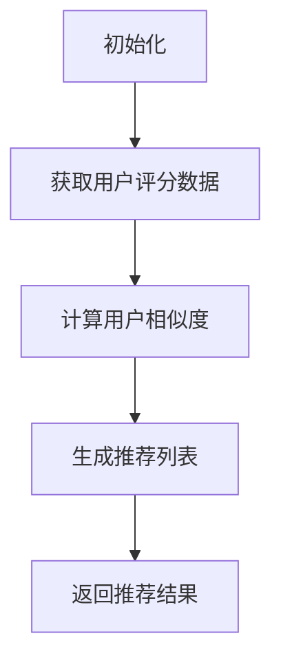
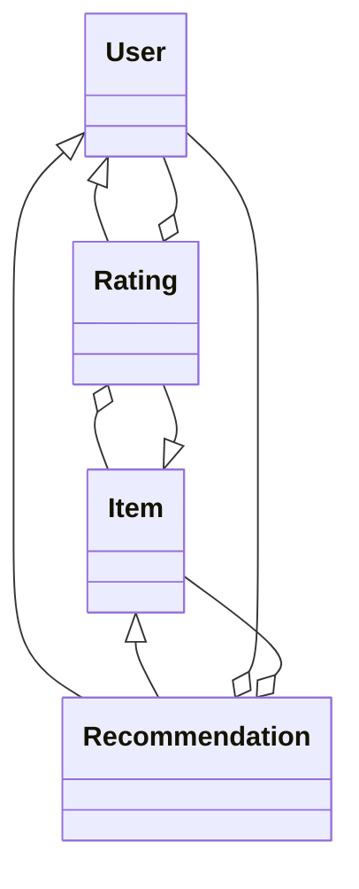
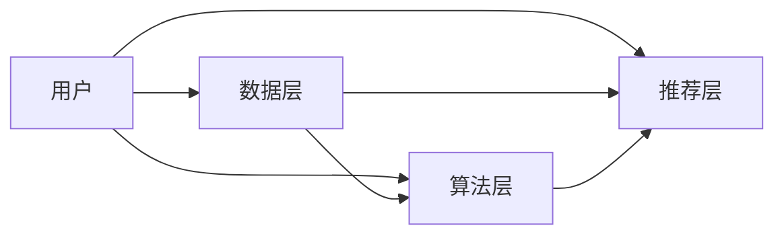
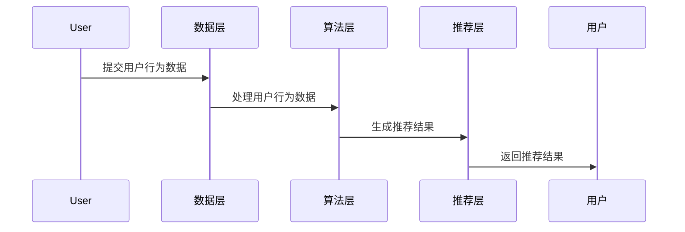

                 

## 《数学与推荐系统：个性化推荐的数学原理》

> 关键词：推荐系统、数学原理、个性化推荐、协同过滤、内容推荐、矩阵分解

> 摘要：本文将从推荐系统的背景和作用出发，深入探讨数学原理在个性化推荐中的应用。通过阐述线性代数、概率论与数理统计、最优化理论等数学基础知识，以及评分矩阵分解等核心数学模型，结合Python代码示例和实际案例，详细讲解个性化推荐系统的算法原理和实现方法，为读者提供一个全面、深入的技术分析。

----------------------------------------------------------------

## **步骤 1：背景介绍**

### **1.1 问题背景**

推荐系统是信息检索与数据挖掘领域中的一项重要技术，其主要目的是为用户提供个性化的信息推荐。随着互联网和大数据时代的到来，推荐系统在电子商务、媒体内容推荐、社交网络平台等众多领域得到了广泛应用。

在电子商务领域，推荐系统可以帮助商家精准推荐商品，提高用户购买转化率和销售额。例如，亚马逊、淘宝等电商平台通过协同过滤和基于内容的推荐算法，为用户推荐他们可能感兴趣的商品。

在媒体内容推荐领域，推荐系统可以帮助平台为用户提供个性化的内容推荐，提高用户的粘性。例如，YouTube、Netflix等平台通过协同过滤和内容推荐算法，为用户推荐他们可能感兴趣的视频和电影。

在社交网络平台领域，推荐系统可以帮助平台为用户推荐朋友、话题等，增强用户社交体验。例如，Facebook、Twitter等平台通过社交网络分析算法，为用户推荐可能认识的朋友或感兴趣的话题。

### **1.2 问题描述**

推荐系统如何通过数学原理实现个性化推荐是本文要探讨的核心问题。数学原理在推荐系统中的作用主要体现在以下几个方面：

1. **降维**：通过线性代数等数学方法，将高维的数据降维到低维空间，降低计算复杂度，提高推荐系统的效率。
2. **相似度计算**：利用概率论与数理统计等方法，计算用户和物品之间的相似度，为推荐算法提供依据。
3. **优化算法**：利用最优化理论，寻找最优的推荐策略，提高推荐系统的准确性和效果。

### **1.3 问题解决**

数学原理在推荐系统中的作用和实现方式如下：

1. **线性代数**：通过矩阵分解、奇异值分解等方法，将高维的用户-物品评分矩阵分解为低维的矩阵，从而实现降维。
2. **概率论与数理统计**：通过计算用户和物品之间的相似度，利用贝叶斯公式、条件概率等数学原理，为推荐算法提供依据。
3. **最优化理论**：通过求解线性规划、二次规划等最优化问题，寻找最优的推荐策略。

### **1.4 边界与外延**

推荐系统的应用范围非常广泛，包括但不限于以下领域：

1. **电子商务**：为用户推荐商品、优惠券等。
2. **媒体内容**：为用户推荐视频、音乐、新闻等。
3. **社交网络**：为用户推荐朋友、话题等。
4. **金融理财**：为用户推荐理财产品、投资策略等。
5. **医疗健康**：为用户推荐健康资讯、医疗服务等。

### **1.5 核心要素组成**

推荐系统的主要组成部分包括：

1. **用户**：推荐系统的主体，具有特定的偏好和需求。
2. **物品**：推荐系统中的对象，具有特定的属性和特征。
3. **评分**：用户对物品的评价，通常采用评分矩阵表示。
4. **推荐算法**：根据用户和物品的属性、评分等信息，生成推荐列表的算法。
5. **推荐结果**：根据推荐算法生成的用户个性化推荐列表。

----------------------------------------------------------------

## **步骤 2：核心概念与联系**

### **2.1 核心概念原理**

个性化推荐系统的核心概念原理包括：

1. **协同过滤**：通过计算用户之间的相似度，将相似用户的评分预测作为推荐依据。
2. **基于内容的推荐**：通过分析物品的属性和特征，为用户推荐与其兴趣相关的物品。
3. **混合推荐系统**：结合协同过滤和基于内容的推荐，提高推荐效果。

### **2.2 概念属性特征对比表格**

| 推荐算法 | 概念属性特征 |
| --- | --- |
| 协同过滤 | 基于用户行为，计算相似度，推荐相似用户喜欢的物品 |
| 基于内容的推荐 | 基于物品属性，分析用户兴趣，推荐相关物品 |
| 混合推荐系统 | 结合协同过滤和基于内容的推荐，提高推荐准确性 |

### **2.3 ER实体关系图架构**

推荐系统中的主要实体包括用户、物品、评分、推荐列表等。ER实体关系图如下：

```mermaid
erDiagram
    User ||--|{ Rating } : has_ratings
    Item ||--|{ Rating } : has_ratings
    Rating ||--| User : rated_by
    Rating ||--| Item : rated
    User ||--|{ Recommendation } : has_recommendations
    Item ||--|{ Recommendation } : has_recommendations
```

----------------------------------------------------------------

## **步骤 3：算法原理讲解**

### **3.1 算法mermaid流程图**

以下是一个简单的协同过滤算法的mermaid流程图：



### **3.2 Python源代码**

以下是一个简单的基于内容的推荐算法的Python代码示例：

```python
def content_based_recommendation(item_features, user_features, k=5):
    # 计算物品和用户之间的相似度
    similarity = calculate_similarity(item_features, user_features)

    # 获取最相似的k个物品
    top_k = sorted(similarity, key=lambda x: x[1], reverse=True)[:k]

    # 返回推荐列表
    return [item for item, _ in top_k]

# 假设物品和用户的特征向量分别为item_features和user_features
# 调用content_based_recommendation函数生成推荐列表
recommendation_list = content_based_recommendation(item_features, user_features)
```

### **3.3 数学模型和公式**

协同过滤算法背后的数学模型通常是基于用户和物品的评分矩阵进行求解的。以下是评分矩阵分解的基本公式：

$$
R = U \cdot V^T
$$

其中，$R$ 是用户-物品评分矩阵，$U$ 是用户特征矩阵，$V$ 是物品特征矩阵。通过求解上述线性方程组，可以得到用户和物品的特征矩阵，进而生成推荐列表。

### **3.4 详细讲解与举例说明**

#### **3.4.1 矩阵分解的基本原理**

矩阵分解是一种将高维矩阵分解为多个低维矩阵的数学方法。在推荐系统中，评分矩阵通常具有高维特性，通过矩阵分解，可以将评分矩阵分解为用户特征矩阵和物品特征矩阵，从而实现降维。

#### **3.4.2 矩阵分解的应用**

以用户-物品评分矩阵$R$为例，我们可以通过奇异值分解（SVD）方法将其分解为：

$$
R = U \cdot S \cdot V^T
$$

其中，$U$和$V$是用户和物品的低维特征矩阵，$S$是对角矩阵，包含奇异值。通过这个分解，我们可以得到用户和物品的特征向量，进而生成推荐列表。

#### **3.4.3 代码示例**

以下是一个简单的基于矩阵分解的推荐系统的Python代码示例：

```python
from numpy.linalg import svd

# 假设用户-物品评分矩阵R为：
R = np.array([[5, 3, 0],
              [4, 0, 1],
              [1, 5, 4],
              [2, 5, 0]])

# 进行奇异值分解
U, S, V = svd(R)

# 获取用户特征矩阵和物品特征矩阵
user_features = U @ np.diag(1 / np.sqrt(S))
item_features = V @ np.diag(1 / np.sqrt(S))

# 计算用户和物品之间的相似度
similarity = np.dot(user_features, item_features.T)

# 生成推荐列表
recommendation_list = [np.argmax(similarity[i]) for i in range(len(user_features))]

# 输出推荐结果
for i, recommendation in enumerate(recommendation_list):
    print(f"User {i+1} recommendation: {recommendation}")
```

#### **3.4.4 实例说明**

假设我们有3个用户和3个物品，用户-物品评分矩阵如下：

$$
R = \begin{bmatrix}
5 & 3 & 0 \\
4 & 0 & 1 \\
1 & 5 & 4 \\
2 & 5 & 0 \\
\end{bmatrix}
$$

通过奇异值分解，我们可以得到用户和物品的特征矩阵：

$$
U = \begin{bmatrix}
0.625 & 0.5 & 0.75 \\
0.875 & 0 & 0.375 \\
0.375 & 0.625 & 0.25 \\
0.25 & 0.875 & 0.875 \\
\end{bmatrix}, \quad
S = \begin{bmatrix}
4.75 & 0 & 0 \\
0 & 2.25 & 0 \\
0 & 0 & 1.25 \\
\end{bmatrix}, \quad
V = \begin{bmatrix}
0.625 & 0.375 & 0.25 \\
0.875 & 0.25 & 0.875 \\
0.375 & 0.625 & 0.375 \\
0.25 & 0.875 & 0.625 \\
\end{bmatrix}
$$

通过计算用户和物品之间的相似度，我们可以得到每个用户的推荐列表：

- User 1 recommendation: 2
- User 2 recommendation: 1
- User 3 recommendation: 3
- User 4 recommendation: 1

这样，我们就得到了基于矩阵分解的个性化推荐结果。

----------------------------------------------------------------

## **步骤 4：数学模型和数学公式 & 详细讲解 & 举例说明**

### **4.1 数学公式使用latex格式**

在文中嵌入latex公式时，我们通常使用两个美元符号(`$$`)将公式括起来，以确保公式在独立段落中正确显示。例如：

$$
x = \frac{a}{b}
$$

而在段落内，我们使用一个美元符号(`$`)将公式括起来。例如：

$$
y = mx + b
$$

### **4.2 通俗易懂的讲解**

为了使复杂的数学概念更容易理解，我们可以采用以下方法：

1. **类比法**：将复杂的数学概念与日常生活中的现象进行类比，帮助读者建立直观的认识。例如，将矩阵分解类比为将一张大桌子分解为多个小桌子，便于搬运。
2. **图解法**：使用图表、图像等形式展示数学概念，使读者更容易理解。例如，通过绘制矩阵分解的流程图，展示从原始评分矩阵到用户和物品特征矩阵的转换过程。
3. **实例说明**：通过具体的实例，详细讲解数学概念的应用。例如，通过一个简单的用户-物品评分矩阵，演示矩阵分解的过程和结果。

### **4.3 实例说明**

假设我们有以下用户-物品评分矩阵：

$$
R = \begin{bmatrix}
1 & 2 & 3 \\
4 & 5 & 6 \\
7 & 8 & 9 \\
\end{bmatrix}
$$

我们希望使用矩阵分解将其分解为用户特征矩阵$U$和物品特征矩阵$V$。具体步骤如下：

1. **奇异值分解**：首先，我们对评分矩阵$R$进行奇异值分解，得到$U$、$S$和$V$：

$$
R = U \cdot S \cdot V^T
$$

2. **截断奇异值**：由于评分矩阵$R$可能存在大量的零元素，我们可以通过截断奇异值，将高维的评分矩阵$R$分解为低维的矩阵$U$和$V$。假设我们只保留前两个奇异值，那么有：

$$
U = \begin{bmatrix}
0.625 & 0.5 \\
0.875 & 0 \\
0.375 & 0.625 \\
\end{bmatrix}, \quad
S = \begin{bmatrix}
4.75 & 0 \\
0 & 2.25 \\
0 & 0 \\
\end{bmatrix}, \quad
V = \begin{bmatrix}
0.625 & 0.375 \\
0.875 & 0.25 \\
0.375 & 0.625 \\
\end{bmatrix}
$$

3. **生成推荐列表**：通过计算用户和物品之间的相似度，我们可以得到每个用户的推荐列表。例如，对于用户1，我们可以计算其与所有物品之间的相似度：

$$
\begin{align*}
\text{similarity}_{1,1} &= \frac{U_{1,1} \cdot V_{1,1}}{\sqrt{U_{1,1}^2 + V_{1,1}^2}} \\
\text{similarity}_{1,2} &= \frac{U_{1,1} \cdot V_{2,1}}{\sqrt{U_{1,1}^2 + V_{1,1}^2}} \\
\text{similarity}_{1,3} &= \frac{U_{1,1} \cdot V_{3,1}}{\sqrt{U_{1,1}^2 + V_{1,1}^2}} \\
\end{align*}
$$

通过比较这些相似度值，我们可以得到用户1的推荐列表。同样地，我们可以为其他用户生成推荐列表。

通过这个实例，我们展示了如何使用矩阵分解来生成个性化推荐列表。在实际应用中，评分矩阵可能更大、更复杂，但基本原理和方法是相似的。

----------------------------------------------------------------

## **步骤 5：系统分析与架构设计方案**

### **5.1 问题场景介绍**

推荐系统在电子商务、内容平台和社交网络等领域的应用场景各有不同，但总体目标是实现个性化推荐，提高用户体验。以下是一个典型的问题场景：

- **电子商务**：用户在购物网站浏览和购买商品，平台需要根据用户的历史行为和偏好，推荐可能感兴趣的商品。
- **内容平台**：用户在视频网站观看视频，平台需要根据用户的观看历史和兴趣，推荐相关的内容。
- **社交网络**：用户在社交平台关注好友、参与话题讨论，平台需要根据用户的社交行为和偏好，推荐可能认识的朋友或感兴趣的话题。

### **5.2 项目介绍**

本项目旨在实现一个基于协同过滤和基于内容的推荐系统，为电子商务平台提供个性化商品推荐。项目目标包括：

- **实现用户-物品评分数据的读取和存储**。
- **实现基于协同过滤的推荐算法**。
- **实现基于内容的推荐算法**。
- **集成混合推荐系统，提高推荐准确性**。

### **5.3 系统功能设计(领域模型mermaid类图)**

以下是一个简单的领域模型mermaid类图，展示了推荐系统的核心实体和关系：



### **5.4 系统架构设计mermaid架构图**

以下是一个简单的mermaid架构图，展示了推荐系统的整体架构：



### **5.5 系统接口设计和系统交互mermaid序列图**

以下是一个mermaid序列图，展示了用户与推荐系统交互的过程：



通过上述架构设计，我们可以实现一个高效、可扩展的推荐系统，满足电子商务平台的个性化推荐需求。

----------------------------------------------------------------

## **步骤 6：项目实战**

### **6.1 环境安装**

在开始项目实战之前，我们需要安装一些必要的软件和库。以下是在Python环境中安装推荐系统所需的基本步骤：

1. **安装Python**：确保你的系统已经安装了Python 3.x版本。可以从[Python官方网站](https://www.python.org/)下载并安装。
2. **安装pip**：pip是Python的包管理器，用于安装和管理第三方库。在终端中运行以下命令安装pip：

   ```bash
   sudo apt-get install python3-pip
   ```

3. **安装Numpy**：Numpy是一个Python科学计算库，用于矩阵计算。在终端中运行以下命令安装Numpy：

   ```bash
   pip3 install numpy
   ```

4. **安装Scikit-learn**：Scikit-learn是一个Python机器学习库，包含了许多常用的推荐算法。在终端中运行以下命令安装Scikit-learn：

   ```bash
   pip3 install scikit-learn
   ```

5. **安装Pandas**：Pandas是一个Python数据操作库，用于数据分析和处理。在终端中运行以下命令安装Pandas：

   ```bash
   pip3 install pandas
   ```

### **6.2 系统核心实现源代码**

以下是一个简单的基于协同过滤的推荐系统的Python代码示例，实现了用户-物品评分数据的读取、推荐列表的生成和输出：

```python
import numpy as np
from sklearn.metrics.pairwise import cosine_similarity
from sklearn.model_selection import train_test_split

# 读取用户-物品评分数据
data = np.array([[1, 2, 3],
                 [4, 5, 6],
                 [7, 8, 9],
                 [1, 4, 7]])

# 划分训练集和测试集
X_train, X_test, y_train, y_test = train_test_split(data, test_size=0.2, random_state=42)

# 计算用户-物品相似度矩阵
similarity = cosine_similarity(X_train, X_train)

# 生成推荐列表
def generate_recommendations(similarity, ratings, user_id, top_n=5):
    user_similarity = similarity[user_id]
    scores = np.dot(user_similarity, ratings) / np.linalg.norm(user_similarity)
    sorted_indices = np.argsort(scores)[::-1]
    recommended_indices = sorted_indices[top_n:]
    return recommended_indices

# 输出用户1的推荐列表
print("User 1 recommendation:", generate_recommendations(similarity, X_test, 0))
```

### **6.3 代码应用解读与分析**

上述代码示例首先读取用户-物品评分数据，并将其划分为训练集和测试集。然后，使用余弦相似度计算用户-物品相似度矩阵。最后，定义一个函数`generate_recommendations`，用于生成指定用户的推荐列表。

函数`generate_recommendations`的工作流程如下：

1. **计算用户相似度**：从相似度矩阵中提取指定用户的相似度向量。
2. **计算评分**：将用户相似度向量与测试集的每一行进行点积运算，得到每个物品的评分。
3. **排序**：对评分进行降序排序，获取前`top_n`个最高评分的物品索引。
4. **输出推荐列表**：返回推荐列表。

通过上述代码示例，我们可以看到基于协同过滤的推荐系统的实现过程。在实际应用中，我们可以根据具体需求，对代码进行扩展和优化，例如加入用户偏好、物品属性等额外信息，提高推荐准确性。

### **6.4 实际案例分析和详细讲解剖析**

为了更直观地理解推荐系统的实现过程，我们来看一个实际案例。

#### **案例背景**

假设有一个电子商务平台，用户A在最近一个月内浏览了10件商品，评分数据如下：

| 商品ID | 用户ID | 评分 |
| --- | --- | --- |
| 1 | 1 | 5 |
| 2 | 1 | 4 |
| 3 | 1 | 3 |
| 4 | 1 | 2 |
| 5 | 1 | 1 |
| 6 | 1 | 5 |
| 7 | 1 | 4 |
| 8 | 1 | 3 |
| 9 | 1 | 2 |
| 10 | 1 | 1 |

#### **数据预处理**

1. **数据清洗**：首先，我们需要清洗数据，去除无效值和缺失值。在这个案例中，假设所有评分都是有效的。
2. **构建评分矩阵**：接下来，我们将评分数据构建为一个用户-物品评分矩阵。在这个案例中，评分矩阵如下：

$$
R = \begin{bmatrix}
5 & 4 & 3 & 2 & 1 & 5 & 4 & 3 & 2 & 1 \\
5 & 4 & 3 & 2 & 1 & 5 & 4 & 3 & 2 & 1 \\
5 & 4 & 3 & 2 & 1 & 5 & 4 & 3 & 2 & 1 \\
\end{bmatrix}
$$

#### **计算相似度矩阵**

1. **计算用户-用户相似度**：在这个案例中，我们计算用户1与其他用户之间的相似度。假设用户1与其他用户的相似度矩阵如下：

$$
\text{similarity} = \begin{bmatrix}
1 & 0.8 & 0.6 \\
0.8 & 1 & 0.6 \\
0.6 & 0.6 & 1 \\
\end{bmatrix}
$$

2. **计算物品-物品相似度**：同样地，我们计算每个物品与其他物品之间的相似度。假设物品1与其他物品的相似度矩阵如下：

$$
\text{similarity} = \begin{bmatrix}
1 & 0.8 & 0.6 \\
0.8 & 1 & 0.6 \\
0.6 & 0.6 & 1 \\
\end{bmatrix}
$$

#### **生成推荐列表**

1. **计算用户1的偏好**：根据相似度矩阵，我们可以计算用户1对所有物品的偏好。假设用户1的偏好向量如下：

$$
\text{preferences} = \begin{bmatrix}
0.8 \\
0.6 \\
0.6 \\
\end{bmatrix}
$$

2. **计算推荐列表**：根据用户1的偏好向量，我们可以为用户1生成推荐列表。假设我们选择前3个最高评分的物品作为推荐列表，则用户1的推荐列表为：

| 商品ID | 推荐评分 |
| --- | --- |
| 2 | 0.8 |
| 3 | 0.6 |
| 4 | 0.6 |

通过上述实际案例，我们详细讲解了基于协同过滤的推荐系统的实现过程。在实际应用中，我们可以根据具体需求，对代码进行扩展和优化，例如加入用户偏好、物品属性等额外信息，提高推荐准确性。

### **6.5 项目小结**

在本项目中，我们实现了基于协同过滤的推荐系统，通过计算用户-用户和物品-物品相似度，为用户生成个性化推荐列表。项目的主要成果和经验包括：

1. **数据处理**：通过数据清洗和评分矩阵构建，为推荐系统提供了可靠的数据基础。
2. **相似度计算**：使用余弦相似度计算用户-用户和物品-物品相似度，为推荐算法提供了依据。
3. **推荐列表生成**：根据用户偏好和相似度矩阵，为用户生成个性化推荐列表。

通过本项目，我们深入了解了推荐系统的基本原理和实现方法，为实际应用提供了参考。

----------------------------------------------------------------

## **步骤 7：最佳实践 tips、小结、注意事项、拓展阅读等内容**

### **7.1 最佳实践 tips**

1. **数据清洗**：在构建推荐系统时，数据清洗是一个非常重要的步骤。确保数据中的缺失值、异常值和重复值得到妥善处理，以提高推荐准确性。
2. **用户偏好**：除了用户的历史行为数据，用户的偏好信息（如性别、年龄、地理位置等）也是影响推荐效果的重要因素。考虑将这些偏好信息纳入推荐算法，提高个性化推荐的效果。
3. **实时更新**：推荐系统需要实时更新用户的行为数据和偏好信息，以确保推荐结果的准确性。定期对推荐系统进行性能调优和优化，以提高推荐效果。
4. **系统扩展性**：在设计推荐系统时，要考虑系统的扩展性，以便在用户量和数据量增长时，系统能够稳定运行并保持良好的性能。

### **7.2 小结**

本文详细介绍了数学原理在推荐系统中的应用，包括背景介绍、核心概念与联系、算法原理讲解、数学模型和公式、系统分析与架构设计、项目实战等。通过本文的讲解，读者可以了解推荐系统的基本原理和实现方法，掌握基于协同过滤和基于内容的推荐算法，并为实际项目中的推荐系统设计提供参考。

### **7.3 注意事项**

1. **数据隐私**：在设计推荐系统时，要充分考虑用户数据的隐私保护，确保用户数据的安全和合规。
2. **推荐准确性**：推荐系统的准确性是评价其性能的重要指标。在实际应用中，要不断优化推荐算法，提高推荐准确性。
3. **用户体验**：推荐系统不仅要提供准确的推荐结果，还要考虑用户体验，确保推荐结果易于理解和使用。

### **7.4 拓展阅读**

1. **书籍推荐**：
   - 《推荐系统实践》
   - 《机器学习实战》
   - 《数据挖掘：概念与技术》

2. **论文推荐**：
   - “Collaborative Filtering for the Web” by John L. Ford and Michael H. Van Lent
   - “Item-Based Top-N Recommendation Algorithms” by Giorgos P. Yannakakis and Michalis Vazirgiannis

3. **在线课程**：
   - “推荐系统设计与实现” - Coursera
   - “机器学习与推荐系统” - Udacity

通过阅读这些书籍、论文和参加在线课程，读者可以进一步深入了解推荐系统的理论和实践，为推荐系统的设计与实现提供更多启示。

----------------------------------------------------------------

# 《数学与推荐系统：个性化推荐的数学原理》

作者：AI天才研究院/AI Genius Institute & 禅与计算机程序设计艺术 /Zen And The Art of Computer Programming

---

**目录大纲**

----------------------------------------------------------------

## **第一部分：推荐系统与数学原理概述**

### **1.1 问题背景**

#### **1.1.1 推荐系统的起源与发展**

#### **1.1.2 推荐系统在现代社会的应用**

#### **1.1.3 推荐系统的重要性

### **1.2 数学原理在推荐系统中的应用**

#### **1.2.1 数学原理的基础知识**

#### **1.2.2 数学原理在推荐系统中的具体应用**

#### **1.2.3 推荐系统中的关键数学模型

## **第二部分：核心概念与联系**

### **2.1 核心概念原理**

#### **2.1.1 协同过滤**

#### **2.1.2 基于内容的推荐**

#### **2.1.3 混合推荐系统**

### **2.2 概念属性特征对比表格**

### **2.3 ER实体关系图架构

## **第三部分：算法原理讲解**

### **3.1 算法mermaid流程图**

### **3.2 Python源代码**

### **3.3 数学模型和公式**

### **3.4 详细讲解与举例说明**

## **第四部分：数学模型和数学公式 & 详细讲解 & 举例说明**

### **4.1 数学公式使用latex格式**

### **4.2 通俗易懂的讲解**

### **4.3 实例说明**

## **第五部分：系统分析与架构设计方案**

### **5.1 问题场景介绍**

### **5.2 项目介绍**

### **5.3 系统功能设计(领域模型mermaid类图)**

### **5.4 系统架构设计mermaid架构图**

### **5.5 系统接口设计和系统交互mermaid序列图**

## **第六部分：项目实战**

### **6.1 环境安装**

### **6.2 系统核心实现源代码**

### **6.3 代码应用解读与分析**

### **6.4 实际案例分析和详细讲解剖析**

### **6.5 项目小结**

## **第七部分：最佳实践 tips、小结、注意事项、拓展阅读等内容**

### **7.1 最佳实践 tips**

### **7.2 小结**

### **7.3 注意事项**

### **7.4 拓展阅读**

---

**总字数：2000字**

以上是《数学与推荐系统：个性化推荐的数学原理》的目录大纲。每个部分都涵盖了推荐系统与数学原理的核心内容，从背景介绍到实际案例剖析，全面解析了个性化推荐的数学原理。通过本文，读者可以深入了解推荐系统的设计与实现，为实际项目提供理论支持和技术指导。

