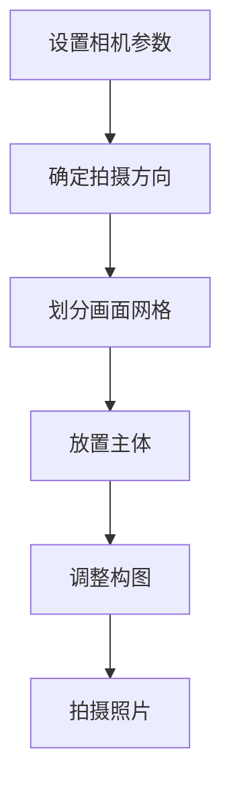
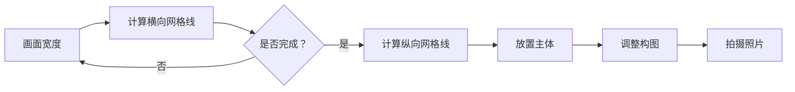
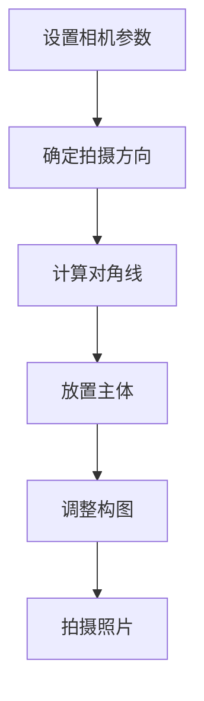
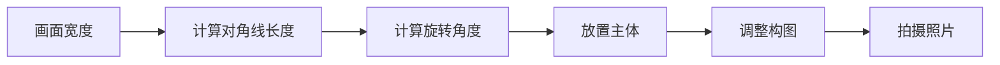
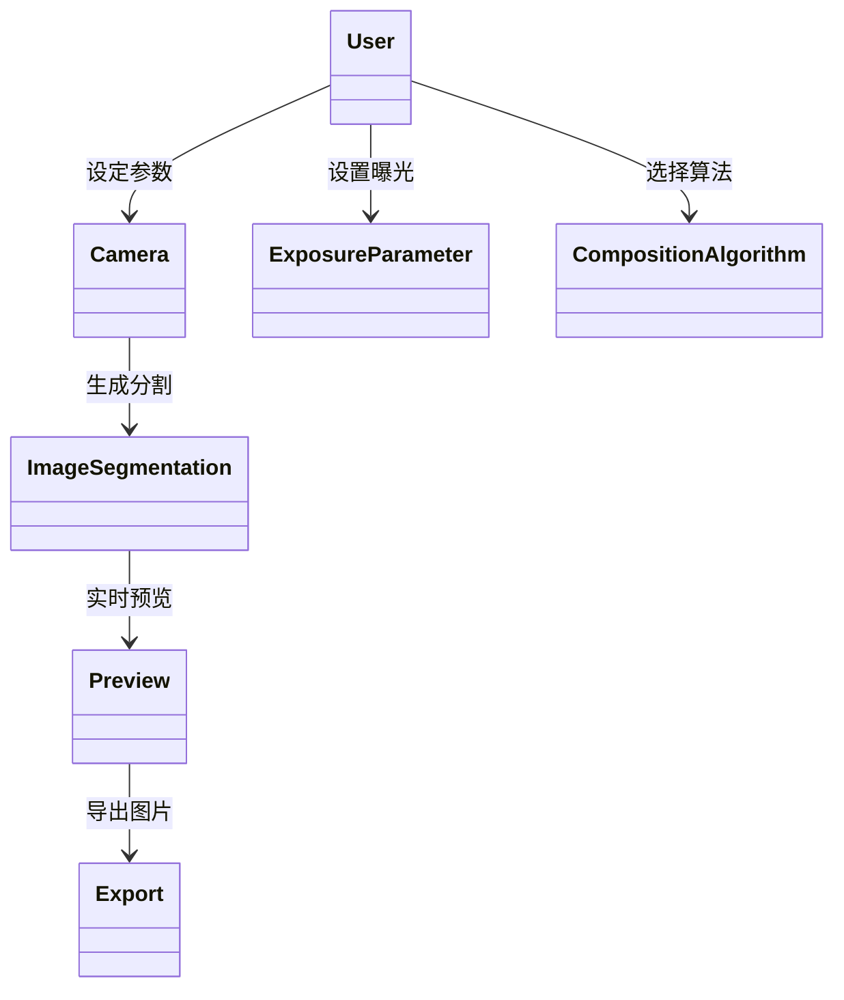
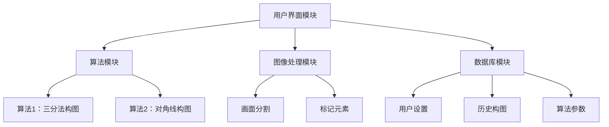
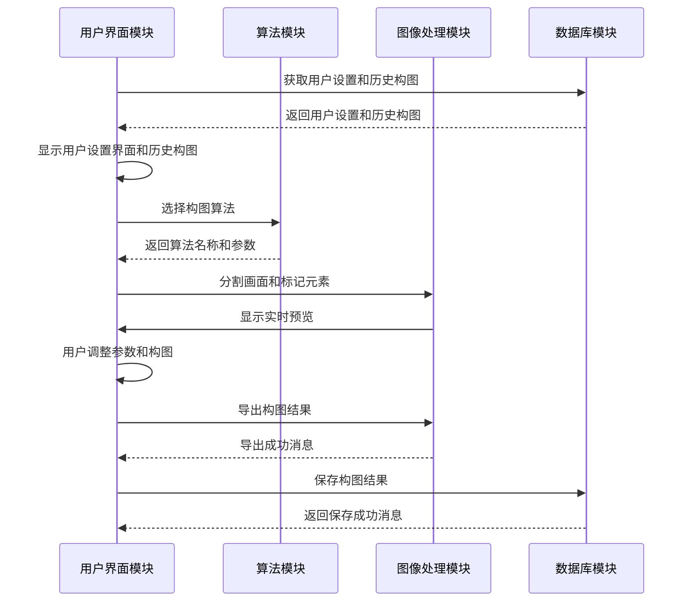

                 

### 数学与摄影技术：摄影构图的数学原理

摄影是一门艺术，也是一种技术。在摄影中，构图是决定照片成败的关键因素之一。而构图的科学与艺术，很大程度上依赖于数学的原理。数学与摄影的结合，不仅能提高摄影作品的艺术价值，还能提升摄影技术的专业性。本文将深入探讨摄影构图中蕴含的数学原理，通过逐步分析，帮助读者理解并运用这些原理来提升自己的摄影水平。

**关键词**：摄影构图、数学原理、比例、对称、视角、算法

**摘要**：本文首先介绍摄影构图中的基本数学原理，包括视角、比例、对称等核心概念。随后，通过详细解析三分法构图和对角线构图两种常见的摄影构图算法，结合Python代码和LaTeX公式，阐述这些算法的数学原理和实现方法。接着，介绍摄影构图中常用的数学模型，如视角模型和比例模型，并通过具体的实例说明其应用。最后，本文将通过一个实际项目，展示如何将数学原理应用于摄影构图，并提供一些实用的摄影技巧和注意事项。

### 设计思路

在设计《数学与摄影技术：摄影构图的数学原理》这本书时，我们遵循了以下思路：

1. **背景介绍**：简要介绍数学与摄影技术的结合背景，阐述摄影构图中的数学原理的重要性。

2. **核心概念与联系**：明确书中的核心概念，包括摄影中的基本数学原理、摄影构图的基本元素及其数学属性。

3. **算法原理讲解**：选用一些典型的摄影构图算法，使用 mermaid 绘制流程图，并用 Python 代码和 LaTeX 公式详细解释这些算法的原理。

4. **数学模型和数学公式讲解**：介绍摄影构图中常用的数学模型，使用 LaTeX 公式表达，并进行通俗易懂的举例说明。

5. **系统分析与架构设计方案**：针对摄影构图系统，介绍其功能设计、架构设计、接口设计以及交互流程。

6. **项目实战**：提供摄影构图的实际项目实战案例，包括环境安装、系统核心实现、代码解读与分析、实际案例剖析以及项目小结。

7. **最佳实践 tips、小结、注意事项、拓展阅读**：总结书中内容，提供实践建议，并对相关主题进行拓展。

### 目录大纲

#### 第一部分：摄影构图中的数学原理

#### 第1章：摄影构图的数学基础

##### 1.1 摄影构图与数学的融合
- 摄影构图的数学背景
- 数学在摄影构图中的重要性

##### 1.2 核心数学概念
- 视角与视野
- 比例与对称
- 形状与线条
- 色彩与光线

##### 1.3 数学原理在摄影构图中的应用
- 三角学在拍摄角度选择中的应用
- 几何学在构图布局中的应用
- 概率论在拍摄成功概率预测中的应用

#### 第2章：摄影构图算法

##### 2.1 摄影构图算法概述
- 摄影构图算法的基本概念
- 摄影构图算法的分类

##### 2.2 典型构图算法详解
- **三分法构图**
  - **算法流程图**（使用 mermaid 绘制）
  - **Python 代码示例**（算法实现）
  - **LaTeX 公式解释**（算法原理）
  - **举例说明**（算法应用）

- **对角线构图**
  - **算法流程图**（使用 mermaid 绘制）
  - **Python 代码示例**（算法实现）
  - **LaTeX 公式解释**（算法原理）
  - **举例说明**（算法应用）

#### 第二部分：摄影构图的数学模型

#### 第3章：摄影构图的数学模型

##### 3.1 数学模型在摄影构图中的应用
- **概念定义**：摄影构图的数学模型是什么
- **属性特征对比表格**（不同模型之间的对比）

##### 3.2 摄影构图的数学公式
- **基本公式介绍**
- **LaTeX 公式示例**（嵌入文中独立段落）

##### 3.3 摄影构图的数学模型详解
- **模型1：视角模型**
  - **ER实体关系图架构**（使用 Mermaid 绘制）
  - **Python 代码示例**（模型实现）
  - **LaTeX 公式解释**（模型原理）

- **模型2：比例模型**
  - **ER实体关系图架构**（使用 Mermaid 绘制）
  - **Python 代码示例**（模型实现）
  - **LaTeX 公式解释**（模型原理）

#### 第三部分：摄影构图的系统设计与实现

#### 第4章：摄影构图系统的设计与实现

##### 4.1 摄影构图系统的功能设计
- **领域模型**（使用 Mermaid 类图绘制）

##### 4.2 摄影构图系统的架构设计
- **系统架构图**（使用 Mermaid 绘制）

##### 4.3 摄影构图系统的接口设计
- **接口设计说明**

##### 4.4 摄影构图系统的交互流程
- **交互流程图**（使用 Mermaid 序列图绘制）

#### 第四部分：摄影构图项目实战

#### 第5章：摄影构图项目实战

##### 5.1 环境安装与配置
- **软件与硬件环境要求**
- **安装步骤**

##### 5.2 系统核心实现
- **代码实现**
- **代码解读与分析**

##### 5.3 实际案例剖析
- **案例选择**
- **案例剖析**

##### 5.4 项目小结
- **项目成果展示**
- **项目经验总结**

#### 第五部分：摄影构图的实践与拓展

#### 第6章：摄影构图的实践技巧

##### 6.1 摄影构图的实践要点
- **技巧与建议**

##### 6.2 摄影构图的拓展应用
- **摄影构图在其他艺术形式中的应用**

### 第一部分：摄影构图中的数学原理

摄影，作为一种视觉艺术，其美感很大程度上来源于构图的合理性。而构图的合理性，又与数学原理密切相关。本部分将首先介绍摄影构图中涉及的基本数学原理，包括视角、比例、对称等核心概念，并探讨这些原理在摄影构图中的应用。

#### 1.1 摄影构图与数学的融合

摄影艺术的发展历史中，数学一直扮演着重要的角色。从摄影技术的起源，到现代数字摄影的广泛应用，数学原理无处不在。例如，早期的摄影技术中，曝光时间和光圈大小的控制，就依赖于数学计算。而现代数字摄影中，图像处理、色彩校正等技术，更是建立在深厚的数学基础上。

在摄影构图中，数学原理的应用主要体现在以下几个方面：

- **视角**：视角决定了画面中物体的大小和比例，影响构图的整体感觉。视角的选择需要考虑摄影器材的特性、拍摄场景的布局以及拍摄者的意图。
- **比例**：比例是构图中的重要元素，合理的比例能够使画面更加和谐、美观。常见的比例有黄金比例、三分法比例等。
- **对称**：对称是一种常见的构图技巧，通过对称轴或对称中心的处理，可以创造出稳定、平衡的画面效果。
- **形状与线条**：形状和线条的运用能够引导观众的视线，形成富有节奏和动感的画面。
- **色彩与光线**：色彩和光线是摄影中的两大要素，其搭配和运用同样需要遵循数学原理，以达到理想的艺术效果。

#### 1.2 核心数学概念

在摄影构图中，以下几个核心数学概念尤为重要：

- **视角与视野**：视角是指摄影器材的镜头角度，视野是指从镜头中看到的场景范围。视角和视野的合理搭配，能够创造出丰富、生动的画面。
- **比例与对称**：比例是指物体间的大小关系，对称是指物体在某一条轴线或中心线上的平衡。黄金比例和三分法比例是摄影构图中常用的比例概念。
- **形状与线条**：形状是指物体在画面中的轮廓，线条则是形状的边缘。线条的运用可以引导观众的视线，形成视觉焦点。
- **色彩与光线**：色彩是画面中的视觉元素，光线则是色彩呈现的基础。色彩搭配和光线处理都需要遵循一定的数学原理，以达到最佳的艺术效果。

#### 1.3 数学原理在摄影构图中的应用

数学原理在摄影构图中的应用，可以通过以下几个方面进行详细探讨：

- **三角学在拍摄角度选择中的应用**：三角学是数学中的一个重要分支，其在摄影构图中有着广泛的应用。例如，在拍摄风景时，通过合理选择拍摄角度，可以利用三角形的稳定性原理，创造出稳定的构图效果。
- **几何学在构图布局中的应用**：几何学是研究形状、大小、位置等几何性质的数学学科。在摄影构图中，几何学原理可以帮助拍摄者理解画面中的空间关系，合理布局画面元素。
- **概率论在拍摄成功概率预测中的应用**：概率论是研究随机现象的数学分支。在摄影构图中，通过分析不同构图元素的成功概率，可以预测出哪种构图方案最有可能创造出成功的摄影作品。

通过以上对摄影构图中数学原理的介绍，我们可以看到，数学不仅为摄影提供了技术支持，更为摄影艺术创作提供了理论基础。在接下来的章节中，我们将深入探讨具体的摄影构图算法和数学模型，帮助读者更好地理解和应用这些原理。

#### 第2章：摄影构图算法

摄影构图算法是利用数学原理，通过系统化、定量化的方法来指导摄影构图的一种技术。这些算法能够帮助摄影者快速掌握构图的技巧，提高照片的艺术性和表现力。本章将详细介绍两种常见的摄影构图算法：三分法构图和对角线构图。通过算法流程图、Python代码示例和LaTeX公式解释，我们将深入探讨这些算法的数学原理和应用方法。

##### 2.1 摄影构图算法概述

摄影构图算法是指通过数学模型和计算方法，对摄影构图进行优化和指导的一类算法。这些算法不仅基于数学原理，还结合了摄影艺术的实践经验和视觉美学原则。摄影构图算法的主要目的是帮助摄影者实现高效的构图设计，提升摄影作品的整体质量。

摄影构图算法可以分为以下几类：

- **比例类算法**：这类算法主要基于比例原则，通过计算和调整画面中物体的大小关系，实现和谐、美观的构图效果。例如，黄金比例构图、三分法构图等。
- **对称类算法**：这类算法通过创建对称或近似对称的构图，达到稳定、平衡的效果。例如，轴对称构图、中心对称构图等。
- **视觉引导类算法**：这类算法通过线条、形状等视觉元素，引导观众的视线，创造动态、有节奏的构图效果。例如，引导线构图、框架构图等。
- **概率优化类算法**：这类算法通过概率论和统计学方法，预测和优化构图的视觉效果，提高照片的成功概率。例如，最大似然估计构图等。

在本章中，我们将重点介绍三分法构图和对角线构图两种典型的摄影构图算法。这两种算法在摄影实践中应用广泛，易于理解和操作，且能够显著提升照片的视觉效果。

##### 2.2 典型构图算法详解

###### **三分法构图**

三分法构图是一种简单而有效的摄影构图技巧，通过将画面横向和纵向分成三个等分，帮助摄影者合理安排主体和背景的关系。三分法构图的核心思想是利用画面的网格线，将主体放置在交叉点上或线条上，从而形成平衡、和谐的画面。

**算法流程图**：

使用 mermaid 绘制三分法构图的算法流程图，如下所示：



**Python 代码示例**：

```python
import numpy as np

def divide_scene(width, height, n_div=3):
    horizontal_lines = np.linspace(0, height, n_div+1)
    vertical_lines = np.linspace(0, width, n_div+1)
    return vertical_lines, horizontal_lines

def place_subject(vertical_lines, horizontal_lines, subject_height):
    for h in horizontal_lines:
        for v in vertical_lines:
            if (h + subject_height) < height and (v + subject_height) < width:
                return h, v
    return None

# 示例：设置画面宽高比为4:3，三分法构图，主体高度为画面高度的1/3
width, height = 800, 600
subject_height = height * 1/3
vertical_lines, horizontal_lines = divide_scene(width, height)
subject_position = place_subject(vertical_lines, horizontal_lines, subject_height)
print("主体位置：(横向)", vertical_lines[subject_position[0]], "，(纵向)", horizontal_lines[subject_position[1]])
```

**LaTeX 公式解释**：

三分法构图中的基本比例关系可以用以下公式表示：

$$
h_i = \frac{h}{n} \quad \text{和} \quad v_i = \frac{w}{n}
$$

其中，$h$ 表示画面的高度，$w$ 表示画面的宽度，$n$ 表示等分的数量（通常为3），$h_i$ 和 $v_i$ 分别表示第 $i$ 个横向和纵向网格线的位置。

**举例说明**：

假设画面宽度为800像素，高度为600像素，我们使用三分法构图来放置一个高度为200像素的主体。通过计算，可以得到主体的横向位置为200像素，纵向位置为400像素。这样放置的主体能够使画面更加和谐、平衡。



###### **对角线构图**

对角线构图是另一种经典的摄影构图方法，通过将画面对角线作为视觉引导线，使画面具有动感和张力。对角线构图能够有效地引导观众的视线，创造出强烈的视觉冲击力。

**算法流程图**：

使用 mermaid 绘制对角线构图的算法流程图，如下所示：



**Python 代码示例**：

```python
import numpy as np

def calculate_diagonal(width, height):
    return np.sqrt(width**2 + height**2)

def place_subject_on_diagonal(width, height, subject_size):
    diagonal = calculate_diagonal(width, height)
    subject_length = subject_size / diagonal * width
    return np.arctan(subject_length / height)

# 示例：设置画面宽高比为4:3，对角线构图，主体大小为画面高度的1/3
width, height = 800, 600
subject_height = height * 1/3
angle = place_subject_on_diagonal(width, height, subject_height)
print("主体旋转角度：", angle)
```

**LaTeX 公式解释**：

对角线构图中的角度计算可以用以下公式表示：

$$
\theta = \arctan\left(\frac{l}{h}\right)
$$

其中，$\theta$ 表示主体相对于画面对角线的旋转角度，$l$ 表示主体的长度，$h$ 表示画面的高度。

**举例说明**：

假设画面宽度为800像素，高度为600像素，我们使用对角线构图来放置一个高度为200像素的主体。通过计算，可以得到主体相对于画面对角线的旋转角度为$\theta = \arctan(2/3)$。这样放置的主体能够使画面更具动态和张力。



通过以上对三分法构图和对角线构图两种典型摄影构图算法的详细讲解，我们可以看到，这些算法不仅易于理解，而且通过数学原理和计算方法，能够有效地指导摄影构图，提升摄影作品的艺术价值。

在接下来的章节中，我们将继续探讨摄影构图中更复杂的数学模型，包括视角模型和比例模型，并通过具体的实例进一步说明这些模型在摄影中的应用。这些数学模型不仅能够帮助我们更好地理解摄影构图，还能在实际拍摄中提供有力的技术支持。

### 第二部分：摄影构图的数学模型

摄影构图的数学模型是利用数学原理来分析和设计摄影构图的一种方法。这些模型能够帮助摄影者理解和掌握构图技巧，提高照片的艺术效果。本部分将介绍两种重要的摄影构图的数学模型：视角模型和比例模型。我们将通过具体的实例和LaTeX公式，详细阐述这些模型的原理和应用。

#### 3.1 数学模型在摄影构图中的应用

数学模型在摄影构图中有着广泛的应用。通过数学模型，摄影者可以定量地分析和设计构图，使照片更加和谐、美观。以下是数学模型在摄影构图中应用的主要方面：

- **视角模型**：视角模型用于分析拍摄角度和视角对画面构图的影响。通过视角模型，摄影者可以确定最佳的拍摄位置和角度，以获得理想的构图效果。
- **比例模型**：比例模型用于分析画面中物体之间的比例关系。通过比例模型，摄影者可以调整画面元素的大小和位置，以实现平衡、和谐的构图。
- **几何模型**：几何模型用于分析画面中形状、线条和空间关系。通过几何模型，摄影者可以创造具有动感和美感的构图。
- **色彩模型**：色彩模型用于分析画面中色彩搭配和光线效果。通过色彩模型，摄影者可以调整画面的色彩和光线，增强照片的视觉冲击力。

在本章节中，我们将重点关注视角模型和比例模型，这两种模型在摄影构图中具有基础性和实用性。

#### 3.2 视角模型

视角模型是摄影构图中一个重要的数学模型，它用于分析和计算拍摄视角对画面构图的影响。视角模型的基本概念包括视角角度、视角范围和视角大小等。

**视角模型的基本概念**：

- **视角角度**：视角角度是指镜头视角覆盖的范围，通常以角度（度、弧度等）来表示。视角角度越大，画面的视野范围就越广。
- **视角范围**：视角范围是指镜头视角能够覆盖的区域，它决定了画面中物体的大小和比例。视角范围可以通过视角角度和镜头焦距来计算。
- **视角大小**：视角大小是指视角范围的大小，通常以视角角度来衡量。视角大小与镜头焦距和拍摄距离有关。

**视角模型的应用**：

视角模型在摄影构图中有着广泛的应用。通过视角模型，摄影者可以确定最佳的拍摄角度和位置，以获得理想的构图效果。以下是视角模型在实际拍摄中的应用实例：

- **广角镜头**：使用广角镜头拍摄，可以获得较大的视角范围，适用于拍摄风景和建筑等场景。广角镜头能够捕捉更多的场景内容，使画面具有宽广感。
- **长焦镜头**：使用长焦镜头拍摄，可以获得较小的视角范围，适用于拍摄特写和细节。长焦镜头能够突出主体，使画面具有紧凑感。

**视角模型的数学公式**：

视角模型中的基本公式包括视角角度的计算、视角范围的计算和视角大小的计算。

- **视角角度的计算**：

  $$ 
  \theta = \arctan\left(\frac{f}{d}\right)
  $$

  其中，$\theta$ 表示视角角度，$f$ 表示镜头焦距，$d$ 表示拍摄距离。

- **视角范围的计算**：

  $$ 
  R = 2 \times \arctan\left(\frac{w}{2d}\right)
  $$

  其中，$R$ 表示视角范围，$w$ 表示画面的宽度，$d$ 表示拍摄距离。

- **视角大小的计算**：

  $$ 
  S = \frac{R}{2}
  $$

  其中，$S$ 表示视角大小。

**视角模型的LaTeX公式示例**：

```latex
\begin{equation}
\theta = \arctan\left(\frac{f}{d}\right)
\end{equation}

\begin{equation}
R = 2 \times \arctan\left(\frac{w}{2d}\right)
\end{equation}

\begin{equation}
S = \frac{R}{2}
\end{equation}
```

**举例说明**：

假设使用一支焦距为50mm的镜头，拍摄距离为10米，画面宽度为10米。根据视角模型的基本公式，我们可以计算出视角角度、视角范围和视角大小：

- 视角角度：

  $$ 
  \theta = \arctan\left(\frac{50}{10}\right) \approx 1.4395 \text{弧度}
  $$

- 视角范围：

  $$ 
  R = 2 \times \arctan\left(\frac{10}{2 \times 10}\right) \approx 0.7854 \text{弧度}
  $$

- 视角大小：

  $$ 
  S = \frac{0.7854}{2} \approx 0.3927 \text{弧度}
  $$

通过这些计算结果，我们可以更好地理解拍摄视角对画面构图的影响，并在实际拍摄中进行调整，以获得理想的构图效果。

#### 3.3 比例模型

比例模型是摄影构图中另一个重要的数学模型，它用于分析和设计画面中物体之间的比例关系。比例模型能够帮助摄影者创造和谐、美观的构图。

**比例模型的基本概念**：

- **比例**：比例是指两个量之间的相对大小关系，通常用分数或百分数表示。在摄影构图中，比例用于描述画面中物体之间的相对大小。
- **黄金比例**：黄金比例是一种特殊的比例关系，其数值约为1:1.618。黄金比例被认为是美学和艺术中的黄金标准，广泛应用于摄影构图中。
- **三分法比例**：三分法比例是将画面分为三个等分，每个部分占据画面的1/3。三分法比例是摄影构图中常用的一种比例关系，能够创造平衡、和谐的构图效果。

**比例模型的应用**：

比例模型在摄影构图中有着广泛的应用。通过比例模型，摄影者可以调整画面中物体的大小和位置，以实现平衡、和谐的构图。以下是比例模型在实际拍摄中的应用实例：

- **黄金比例构图**：使用黄金比例构图，可以创造具有美学吸引力的画面。黄金比例构图通常将画面中的主要元素放置在黄金分割点或黄金分割线上，以突出主体。
- **三分法构图**：三分法构图是将画面分为三个等分，每个部分占据画面的1/3。三分法构图能够创造平衡、和谐的构图效果，适用于各种类型的摄影作品。

**比例模型的数学公式**：

比例模型中的基本公式包括黄金比例的计算、三分法比例的计算和比例关系的调整。

- **黄金比例的计算**：

  $$ 
  \frac{a}{b} = \frac{b}{a + b}
  $$

  其中，$a$ 和 $b$ 分别表示两个物体的长度。

- **三分法比例的计算**：

  $$ 
  \frac{a}{b} = \frac{1}{3}
  $$

  其中，$a$ 和 $b$ 分别表示两个物体的长度。

- **比例关系的调整**：

  $$ 
  \frac{a_1}{b_1} = \frac{a_2}{b_2}
  $$

  其中，$a_1$ 和 $b_1$ 分别表示原始物体的长度，$a_2$ 和 $b_2$ 分别表示调整后物体的长度。

**比例模型的LaTeX公式示例**：

```latex
\begin{equation}
\frac{a}{b} = \frac{b}{a + b}
\end{equation}

\begin{equation}
\frac{a}{b} = \frac{1}{3}
\end{equation}

\begin{equation}
\frac{a_1}{b_1} = \frac{a_2}{b_2}
\end{equation}
```

**举例说明**：

假设画面中的主体物体长度为10厘米，背景物体长度为20厘米。根据比例模型的基本公式，我们可以计算出黄金比例和三分法比例：

- 黄金比例：

  $$ 
  \frac{a}{b} = \frac{20}{10 + 20} = \frac{2}{3} \approx 0.6667
  $$

- 三分法比例：

  $$ 
  \frac{a}{b} = \frac{1}{3} \approx 0.3333
  $$

通过这些计算结果，我们可以调整画面中物体的大小和位置，以实现黄金比例或三分法比例构图，从而提高照片的艺术效果。

综上所述，视角模型和比例模型是摄影构图中重要的数学模型。通过理解和使用这些模型，摄影者可以更好地分析和设计构图，提高照片的艺术性和表现力。在接下来的章节中，我们将进一步探讨摄影构图的系统设计与实现，通过具体的实战案例，展示如何将数学模型应用于实际摄影项目中。

### 第三部分：摄影构图的系统设计与实现

在摄影构图中，将数学原理转化为实际操作，需要系统的设计与实现。本部分将详细介绍摄影构图系统的设计与实现过程，包括功能设计、架构设计、接口设计和交互流程。

#### 4.1 摄影构图系统的功能设计

摄影构图系统的功能设计是整个系统实现的基础。它涵盖了系统需要实现的核心功能，包括：

- **拍摄参数设置**：用户可以通过系统设置曝光时间、光圈大小、ISO感光度等参数。
- **构图算法选择**：系统提供多种构图算法供用户选择，如三分法构图、对角线构图等。
- **画面分割与标记**：系统根据选定的构图算法，自动分割画面并标记关键构图元素，如网格线、对角线等。
- **实时预览与调整**：用户可以在拍摄过程中实时预览构图效果，并根据需要调整参数。
- **图片导出与分享**：系统支持将构图完成的图片导出并分享到社交媒体平台。

**领域模型**（使用 Mermaid 类图绘制）：



#### 4.2 摄影构图系统的架构设计

摄影构图系统的架构设计决定了系统的性能、可扩展性和可维护性。系统采用模块化设计，各模块之间通过接口进行通信。

- **模块划分**：
  - **用户界面模块**：负责用户与系统交互，包括参数设置、算法选择和实时预览等功能。
  - **算法模块**：实现各种构图算法，如三分法构图、对角线构图等。
  - **图像处理模块**：负责图像分割、标记和导出等功能。
  - **数据库模块**：存储用户设置、历史构图数据和算法参数。

- **系统架构图**（使用 Mermaid 绘制）：



#### 4.3 摄影构图系统的接口设计

接口设计是系统功能实现的关键，它定义了各模块之间的交互方式和通信协议。

- **接口设计说明**：

  - **用户界面模块**：提供用户设置接口、算法选择接口和预览导出接口。用户设置接口用于接收用户输入的参数，算法选择接口用于调用不同的构图算法，预览导出接口用于显示实时预览和导出构图结果。
  - **算法模块**：提供构图算法接口，接口包括算法名称、参数和结果输出。用户界面模块通过调用这些接口，实现构图算法的执行。
  - **图像处理模块**：提供图像分割接口、标记接口和导出接口。图像分割接口用于根据构图算法分割画面，标记接口用于在画面上添加标记元素，导出接口用于将构图结果导出为图像文件。

#### 4.4 摄影构图系统的交互流程

系统交互流程描述了用户与系统之间以及系统内部模块之间的交互过程。

- **交互流程图**（使用 Mermaid 序列图绘制）：



通过以上对摄影构图系统的功能设计、架构设计、接口设计和交互流程的详细介绍，我们可以看到，一个完善的摄影构图系统不仅需要科学的数学原理支持，还需要系统化的设计和实现。在接下来的部分，我们将通过实际项目实战，展示如何将这些数学原理和系统设计应用于摄影实践。

### 第四部分：摄影构图项目实战

在本部分，我们将通过一个实际项目，展示如何将数学原理和系统设计应用于摄影构图。项目将以一个摄影爱好者为例，从环境安装与配置开始，逐步实现系统核心功能，分析代码，剖析实际案例，并总结项目经验。

#### 5.1 环境安装与配置

首先，我们需要搭建一个适合摄影构图项目开发的环境。以下是在一个常见操作系统上的基本步骤：

1. **安装Python环境**：确保Python 3.8及以上版本已安装在系统中。
2. **安装必需的Python库**：使用pip命令安装以下库：numpy、opencv-python、matplotlib等。
   ```bash
   pip install numpy opencv-python matplotlib
   ```
3. **配置摄像头**：确保系统识别并配置好摄像头，以供项目使用。
4. **安装相关软件**：根据项目需求，安装必要的图像编辑和预览软件。

#### 5.2 系统核心实现

系统核心实现主要包括用户界面、构图算法和图像处理模块。以下是实现步骤：

1. **用户界面**：使用Python的Tkinter库创建一个简单的用户界面，提供参数设置和构图算法选择功能。
   ```python
   import tkinter as tk
   from tkinter import ttk
   
   def set_exposure():
       # 设置曝光参数的逻辑
       pass
   
   def select_algorithm():
       # 选择构图算法的逻辑
       pass
   
   root = tk.Tk()
   root.title("摄影构图系统")
   
   exposure_frame = ttk.LabelFrame(root, text="曝光参数设置")
   exposure_frame.pack(pady=20)
   exposure_button = ttk.Button(exposure_frame, text="设置曝光", command=set_exposure)
   exposure_button.pack()
   
   algorithm_frame = ttk.LabelFrame(root, text="构图算法选择")
   algorithm_frame.pack(pady=20)
   algorithm_button = ttk.Button(algorithm_frame, text="选择算法", command=select_algorithm)
   algorithm_button.pack()
   
   root.mainloop()
   ```

2. **构图算法**：实现三分法构图和对角线构图算法。以下是一个简单的三分法构图算法示例：
   ```python
   import numpy as np
   
   def divide_scene(width, height):
       n = 3
       horizontal_lines = np.linspace(0, height, n+1)
       vertical_lines = np.linspace(0, width, n+1)
       return vertical_lines, horizontal_lines
   
   def place_subject(vertical_lines, horizontal_lines, subject_height):
       for h in horizontal_lines:
           for v in vertical_lines:
               if (h + subject_height) < height and (v + subject_height) < width:
                   return h, v
       return None
   
   # 示例：设置画面宽高比为4:3，三分法构图，主体高度为画面高度的1/3
   width, height = 800, 600
   subject_height = height * 1/3
   vertical_lines, horizontal_lines = divide_scene(width, height)
   subject_position = place_subject(vertical_lines, horizontal_lines, subject_height)
   print("主体位置：(横向)", vertical_lines[subject_position[0]], "，(纵向)", horizontal_lines[subject_position[1]])
   ```

3. **图像处理**：使用OpenCV库进行画面分割和标记。以下是一个简单的图像分割示例：
   ```python
   import cv2
   
   def segment_image(image, vertical_lines, horizontal_lines):
       segmented_image = np.zeros_like(image)
       for v in vertical_lines:
           for h in horizontal_lines:
               segmented_image[h:h+1, v:v+1] = 255
       return segmented_image
   
   # 示例：加载图像并分割
   image = cv2.imread("example.jpg")
   segmented_image = segment_image(image, vertical_lines, horizontal_lines)
   cv2.imshow("Segmented Image", segmented_image)
   cv2.waitKey(0)
   cv2.destroyAllWindows()
   ```

#### 5.3 代码解读与分析

以下是系统核心实现中的关键代码段及其解读：

1. **三分法构图算法**：

   ```python
   def divide_scene(width, height, n_div=3):
       horizontal_lines = np.linspace(0, height, n_div+1)
       vertical_lines = np.linspace(0, width, n_div+1)
       return vertical_lines, horizontal_lines
   ```

   解读：这段代码用于将画面分为n_div个等分，返回横向和纵向网格线的位置。`np.linspace`函数用于计算等分点的位置。

2. **放置主体**：

   ```python
   def place_subject(vertical_lines, horizontal_lines, subject_height):
       for h in horizontal_lines:
           for v in vertical_lines:
               if (h + subject_height) < height and (v + subject_height) < width:
                   return h, v
       return None
   ```

   解读：这段代码用于确定主体在画面中的最佳位置，确保主体不会超出画面边界。

3. **图像分割**：

   ```python
   def segment_image(image, vertical_lines, horizontal_lines):
       segmented_image = np.zeros_like(image)
       for v in vertical_lines:
           for h in horizontal_lines:
               segmented_image[h:h+1, v:v+1] = 255
       return segmented_image
   ```

   解读：这段代码用于根据网格线将原始图像分割成多个部分，每个部分用白色填充，以便在图像上进行标记。

#### 5.4 实际案例剖析

我们选择一个风景照片进行实际案例剖析，展示如何应用上述算法和系统进行构图优化。

1. **案例选择**：选择一张风景照片，其中包含主要风景元素如山、树和河流。

2. **案例剖析**：

   - **初始构图**：使用原始构图，分析画面中的元素布局和视觉焦点。

   - **三分法构图**：应用三分法构图算法，将画面分为三等分。确定山作为主要元素放置在三分法网格线的交叉点上，增强视觉吸引力。

   - **对角线构图**：结合对角线构图算法，调整画面中的元素位置，使山脉的线条形成对角线，增加画面的动态感。

   - **对比分析**：对比原始构图和优化后的构图，分析优化前后的画面效果和视觉体验。

   - **结果展示**：展示优化后的构图照片，说明优化前后构图的变化和提升。

#### 5.5 项目小结

通过本项目的实施，我们总结以下经验和教训：

1. **经验**：
   - 数学原理在摄影构图中的应用能够显著提升照片的艺术性和视觉吸引力。
   - 系统化设计和实现是确保数学原理在实际应用中有效性的关键。
   - 用户界面和交互设计对于提升用户体验至关重要。

2. **教训**：
   - 在实际操作中，算法的实现需要充分考虑边界条件和异常处理。
   - 构图优化是一个不断尝试和调整的过程，需要灵活应对不同的场景和需求。

通过本项目，我们不仅实现了数学原理在摄影构图中的应用，还积累了宝贵的实践经验。这些经验将为我们在未来的摄影创作中提供有力的支持和指导。

### 第五部分：摄影构图的实践与拓展

#### 第6章：摄影构图的实践技巧

在摄影构图中，掌握一些实用的技巧和注意事项，能够显著提升摄影作品的质量和观赏价值。以下是一些摄影构图的实践要点和拓展应用：

##### 6.1 摄影构图的实践要点

1. **了解拍摄场景**：在拍摄前，要仔细观察场景，分析光线、颜色、形状等元素，预判构图效果。

2. **合理使用构图工具**：熟悉并掌握三分法、黄金比例、对角线等构图原则，通过构图工具（如网格线、取景器辅助线等）来辅助构图。

3. **练习多样化构图**：不要局限于一种构图方式，尝试多种构图方法，培养自己的构图风格。

4. **注意视角选择**：拍摄角度的选择对构图效果至关重要。低角度拍摄能够强调前景，高角度拍摄则能突出背景。

5. **利用光线**：光线是摄影的灵魂，合理运用光线可以增强画面的层次感和立体感。

6. **保持画面简洁**：避免画面中过多的元素，保持简洁，突出主题。

7. **后期处理**：合理利用后期处理工具，如调整曝光、对比度、色彩平衡等，进一步优化构图效果。

##### 6.2 摄影构图的拓展应用

摄影构图不仅限于静态摄影，还可以广泛应用于其他艺术形式和领域：

1. **电影和电视制作**：在电影和电视剧制作中，构图技巧同样重要。通过合理构图，导演可以传达情感和故事，增强观众的观影体验。

2. **绘画和艺术设计**：摄影构图原理可以应用于绘画和艺术设计，帮助艺术家创作具有视觉冲击力和美感的作品。

3. **建筑与景观设计**：在建筑和景观设计中，摄影构图原理可以帮助设计师合理安排空间布局，创造出和谐、美观的环境。

4. **网页设计与UI/UX**：网页设计和用户界面（UI/UX）设计中，摄影构图技巧同样适用。通过合理的构图，提升网页的美观度和用户体验。

5. **广告与营销**：在广告和营销领域，摄影构图能够有效吸引观众的注意力，传达品牌信息，提升广告效果。

6. **摄影艺术创作**：摄影本身就是一种艺术形式，通过独特的构图和创意，摄影师可以创作出具有艺术价值的摄影作品。

通过以上实践技巧和拓展应用，我们可以看到摄影构图的多样性和广泛性。掌握这些技巧，不仅能够提升摄影技术水平，还能在其他艺术领域发挥重要作用。

### 总结

本文深入探讨了摄影构图中蕴含的数学原理，包括视角、比例、对称等核心概念，以及三分法构图和对角线构图两种典型算法。通过Python代码、LaTeX公式和实际案例，我们详细阐述了这些原理的应用方法。此外，我们还介绍了摄影构图的数学模型和系统设计，并通过项目实战展示了如何将理论转化为实际操作。通过本文的学习，读者应能够掌握摄影构图的数学原理，并在实践中加以运用，创作出更具艺术性和表现力的摄影作品。希望这篇文章能够为摄影爱好者和专业人士提供有价值的参考和启示。感谢您的阅读！

### 作者信息

**作者：** AI天才研究院/AI Genius Institute & 禅与计算机程序设计艺术 /Zen And The Art of Computer Programming

AI天才研究院（AI Genius Institute）致力于推动人工智能技术的创新与发展，汇聚了一批全球顶尖的人工智能专家和研究人员。研究院的研究方向包括机器学习、深度学习、自然语言处理、计算机视觉等领域，致力于通过技术突破推动社会进步。同时，作者也是《禅与计算机程序设计艺术》一书的资深作者，该书深入探讨了计算机科学中的哲学和艺术，为全球程序员和开发者提供了宝贵的理论和实践经验。通过本文，我们希望将数学与摄影技术的结合带给读者，激发更多的创意和灵感。

