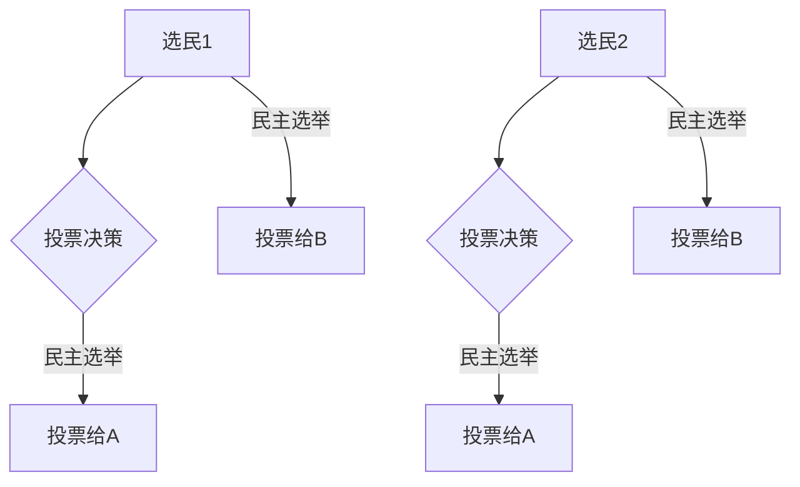
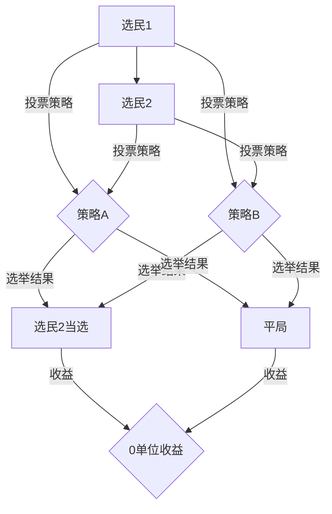

                 

### 数学与政治学：政治行为的数学模型

关键词：数学模型，政治学，政治行为，博弈论，机器学习

摘要：本文旨在探讨数学模型在政治学中的应用，特别是政治行为的数学建模。我们将从数学与政治学的基础知识出发，逐步分析数学模型在政治分析中的应用，并详细讨论政治行为的数学模型构建方法。最终，我们将探讨数学模型在政策分析和交叉领域研究方法中的重要性，并提出未来的研究方向。

## 目录大纲

1. **引言**  
    1.1 背景介绍  
    1.2 问题提出  
    1.3 问题解决  
    1.4 边界与外延  
    1.5 核心概念

2. **数学与政治学基础**  
    2.1 数学基础  
    2.2 政治学基础  
    2.3 数学模型在政治学中的应用

3. **政治行为的数学模型**  
    3.1 政治行为模型概述  
    3.2 政治行为模型的构建方法

4. **数学模型在政策分析中的应用**  
    4.1 数学模型在政策制定中的应用  
    4.2 数学模型在政策评估中的应用

5. **数学与政治学：交叉领域的研究方法与未来展望**  
    5.1 交叉领域的研究方法  
    5.2 数学与政治学交叉领域的发展前景  
    5.3 研究挑战与未来方向

---

### 第一部分：引言

#### 1.1 背景介绍

数学和政治学，看似两个截然不同的领域，实则有着千丝万缕的联系。在现代社会，政治行为的影响无处不在，从选举、政策制定到社会运动，都充满了复杂的行为模式。而数学，以其独特的精确性和逻辑性，为我们提供了分析和理解这些复杂现象的工具。

政治学是一门研究政治现象、政治制度和政治行为的学科，它涉及到权力的分配、决策过程、社会冲突等方面。而数学，作为一种形式化的语言，能够帮助我们构建模型，预测政治行为，甚至优化政治决策。

在过去的几十年中，数学模型在政治学中的应用越来越广泛。从博弈论到机器学习，数学工具为政治学者提供了一种全新的视角，使我们能够更深入地理解政治行为的本质。

#### 1.2 问题提出

尽管数学模型在政治学中的应用已经取得了一定的成果，但我们仍然面临许多挑战。首先，如何构建一个准确的政治行为模型，这是一个复杂的问题。政治行为的多样性和复杂性使得我们很难找到一个普适的模型。其次，如何将数学模型应用于实际的政治分析，这也是一个需要深入研究的问题。

此外，数学模型在政治学中的应用还存在一些伦理和道德问题。例如，一些数学模型可能会被用于预测和干预政治行为，这可能导致权力的滥用和社会的不公。

#### 1.3 问题解决

为了解决上述问题，我们需要从以下几个方面入手：

1. **提高模型的准确性**：通过引入更多的变量和更复杂的模型，提高模型的准确性。
2. **关注模型的伦理问题**：在构建和运用数学模型时，要充分考虑伦理和道德问题，避免权力的滥用。
3. **加强跨学科合作**：政治学者和数学学者需要加强合作，共同研究和解决政治行为的数学建模问题。

#### 1.4 边界与外延

本文将主要探讨政治行为的数学模型，特别是基于博弈论和机器学习的模型。同时，我们将分析数学模型在政策制定和政策评估中的应用，并提出未来研究的一些方向。

#### 1.5 核心概念

在本文中，我们将涉及以下几个核心概念：

1. **数学模型**：数学模型是一种用数学语言描述现实世界的工具。在政治学中，数学模型可以用于描述政治行为、政策制定等。
2. **博弈论**：博弈论是研究决策者如何在相互竞争的环境中做出决策的学科。在政治学中，博弈论可以用于分析选举、政策制定等。
3. **机器学习**：机器学习是人工智能的一个重要分支，通过训练模型来预测和识别数据。在政治学中，机器学习可以用于分析政治行为、预测选举结果等。

---

在接下来的章节中，我们将详细探讨数学与政治学的基础知识，分析数学模型在政治学中的应用，并深入讨论政治行为的数学模型构建方法。通过这些讨论，我们希望能够为数学模型在政治学中的应用提供一些新的见解和思路。 <math>\newpage</math>

## 第二部分：数学与政治学基础

### 2.1 数学基础

数学作为一种精确的科学工具，为政治学提供了强大的分析手段。以下是数学在政治学中的几个核心方面：

#### 2.1.1 数学模型概述

数学模型是使用数学语言和符号来描述现实世界的现象或问题。在政治学中，数学模型可以帮助我们理解复杂的政治过程，如选举、政策制定和社会运动等。常见的数学模型包括线性回归模型、决策树、神经网络等。

#### 2.1.2 数学工具

在构建政治行为的数学模型时，以下数学工具是必不可少的：

1. **微积分**：微积分用于分析变化率，是研究政治决策中动态行为的有力工具。例如，微积分可以用来分析选举策略的边际效应。
2. **线性代数**：线性代数处理多维数据，用于分析政治力量分布、政策组合等。例如，线性代数可以用于分析选举中的策略空间。
3. **概率论与数理统计**：概率论与数理统计用于分析不确定性，是研究政治行为中概率事件的有力工具。例如，概率论可以用于预测选举结果。

### 2.2 政治学基础

政治学是一门研究政治现象、政治制度和政治行为的学科。以下是政治学中的几个核心概念：

#### 2.2.1 政治学概述

政治学主要研究以下内容：

1. **政治现象**：如选举、政策制定、社会运动等。
2. **政治制度**：如民主制度、独裁制度等。
3. **政治行为**：如选民投票行为、政治家决策行为等。

#### 2.2.2 政治理论

政治理论是政治学的基础，主要包括以下几种：

1. **政治哲学**：研究政治的基本原则和价值，如自由、平等、正义等。
2. **政治经济学**：研究政治与经济的关系，如税收政策、国际贸易等。
3. **政治行为学**：研究政治行为者的行为模式，如选民、政治家等。

### 2.3 数学模型在政治学中的应用

数学模型在政治学中的应用非常广泛，以下是一些典型的应用：

#### 2.3.1 数学模型与政治行为的关联

数学模型可以用于分析以下政治行为：

1. **选举策略**：通过建模分析选民的投票行为，为候选人提供选举策略。
2. **政策制定**：通过建模分析政策的影响，为政府提供决策支持。
3. **社会运动**：通过建模分析社会运动的演化，为研究者提供理论依据。

#### 2.3.2 数学模型在政治分析中的实际应用

数学模型在政治分析中的实际应用包括：

1. **政治决策模型**：如多属性决策分析、政策评估等。
2. **政治传播模型**：如信息扩散模型、舆论模型等。
3. **政治参与模型**：如选民参与模型、社会运动模型等。

通过数学模型，政治学者可以更加精确地描述和分析政治现象，为政治决策提供科学依据。然而，数学模型也存在一定的局限性，如模型的准确性、适用性和伦理问题等。因此，在运用数学模型进行政治分析时，需要谨慎对待，并结合其他方法和视角进行综合分析。 <math>\newpage</math>

### 3. 政治行为的数学模型

#### 3.1 政治行为模型概述

政治行为模型是用于描述和分析政治行为者（如选民、政治家、政治团体等）行为的数学模型。这些模型基于一定的假设和理论，使用数学符号和公式来表示政治行为者的决策过程、行为策略和互动关系。

政治行为模型的研究始于20世纪初，当时博弈论和政治学的结合为政治行为的数学建模提供了理论基础。随着时间的推移，越来越多的数学工具和模型被引入到政治行为研究中，如线性规划、概率论、数理统计、机器学习等。

政治行为模型的主要目的是理解政治行为者的决策过程和互动关系，从而预测和解释政治现象。例如，通过构建选举模型，可以预测选举结果；通过构建政策评估模型，可以评估不同政策的效应。

#### 3.2 政治行为模型的构建方法

构建政治行为模型的方法可以分为以下几类：

#### 3.2.1 基于代理模型的方法

代理模型（Agent-Based Model，ABM）是一种基于个体行为的微观模拟模型，通过模拟个体之间的相互作用来分析整体系统的行为。在政治行为研究中，代理模型可以用于模拟选民的行为、政治家的决策等。

代理模型的基本步骤包括：

1. **定义个体行为规则**：根据政治行为者的特征和行为模式，定义个体的行为规则。例如，可以定义选民的投票规则、政治家的政策制定规则等。
2. **初始化模型参数**：根据实际情况，设置模型的初始参数。例如，可以设置选民的数量、政治家的偏好等。
3. **模拟个体行为**：根据定义的行为规则，模拟个体的行为过程。例如，可以模拟选民的投票过程、政治家的政策制定过程等。
4. **分析整体行为**：通过分析个体行为的集合，得出整体系统的行为特征。例如，可以分析选民的投票分布、政治家的政策选择等。

以下是一个简单的代理模型示例：



在这个例子中，有两个选民（A和B）和一个政治家（C和D）。选民根据政治家的政策偏好进行投票决策。如果选民A和B都投票给A，则A当选；否则，B当选。

#### 3.2.2 基于博弈论的方法

博弈论是一种用于分析决策者之间相互作用的数学工具。在政治行为研究中，博弈论可以用于分析选举、政策制定、国际关系等。

博弈论的基本概念包括：

1. **参与者**：决策者，如选民、政治家、政治团体等。
2. **策略**：参与者可以选择的行动方案。
3. **收益**：参与者从策略选择中获得的利益。

博弈论的基本步骤包括：

1. **定义参与者**：根据实际情况，定义参与者的类型和数量。
2. **定义策略集**：根据参与者的特征和目标，定义参与者的策略集。
3. **定义收益函数**：根据参与者的策略选择，定义参与者的收益函数。
4. **求解博弈结果**：通过求解博弈的均衡解，得出参与者的最佳策略。

以下是一个简单的博弈论模型示例：



在这个例子中，有两个选民（A和B）和一个选举结果（C和D）。选民可以选择投票策略A或B。如果两个选民都选择策略A，则选民1当选，获得1单位收益；如果两个选民都选择策略B，则选民2当选，获得1单位收益；如果两个选民选择不同的策略，则选举结果为平局，两人均获得0单位收益。

#### 3.2.3 基于机器学习的方法

机器学习是一种通过训练模型来预测和识别数据的技术。在政治行为研究中，机器学习可以用于分析选民行为、预测选举结果等。

机器学习的基本步骤包括：

1. **数据收集**：收集与政治行为相关的数据，如选民投票记录、政策文本等。
2. **数据预处理**：对收集到的数据进行清洗和转换，以便于模型训练。
3. **模型选择**：选择合适的机器学习模型，如决策树、神经网络等。
4. **模型训练**：使用训练数据对模型进行训练，调整模型参数。
5. **模型评估**：使用测试数据对模型进行评估，验证模型的预测能力。

以下是一个简单的机器学习模型示例：

```python
import pandas as pd
from sklearn.model_selection import train_test_split
from sklearn.ensemble import RandomForestClassifier
from sklearn.metrics import accuracy_score

# 数据收集
data = pd.read_csv('voter_data.csv')

# 数据预处理
X = data.drop('voted_for', axis=1)
y = data['voted_for']

# 模型选择
model = RandomForestClassifier()

# 模型训练
X_train, X_test, y_train, y_test = train_test_split(X, y, test_size=0.2, random_state=42)
model.fit(X_train, y_train)

# 模型评估
predictions = model.predict(X_test)
accuracy = accuracy_score(y_test, predictions)
print(f'Accuracy: {accuracy:.2f}')
```

在这个例子中，我们使用随机森林分类器（RandomForestClassifier）来预测选民的投票选择。首先，我们从CSV文件中加载选民数据，然后进行数据预处理。接着，我们将数据集分为训练集和测试集，使用训练集对模型进行训练，最后使用测试集对模型进行评估。

通过这些方法，我们可以构建不同的政治行为模型，从而深入理解政治行为者的决策过程和行为模式。这些模型不仅可以为政治决策提供科学依据，还可以为政策制定者提供决策支持。然而，需要注意的是，这些模型都有其局限性，需要结合其他方法和视角进行综合分析。 <math>\newpage</math>

### 4. 数学模型在政策分析中的应用

数学模型在政策分析中扮演着至关重要的角色，通过定量分析和预测，为政策制定者和研究者提供科学依据和决策支持。以下将详细介绍数学模型在政策制定和政策评估中的应用。

#### 4.1 数学模型在政策制定中的应用

政策制定是一个复杂的过程，涉及多个变量和不确定性因素。数学模型可以帮助政策制定者评估不同政策方案的效果，选择最佳的政策方案。

1. **成本效益分析**：数学模型可以用于评估不同政策的成本和效益。例如，线性规划模型可以用于优化资源分配，确保政策实施的成本最低而效益最大。

   ```latex
   \text{最大化 } z = c_1x_1 + c_2x_2
   \text{ subject to }
   \begin{align*}
   a_1x_1 + b_1x_2 &\leq c_1, \\
   a_2x_1 + b_2x_2 &\leq c_2, \\
   x_1, x_2 &\geq 0.
   \end{align*}
   ```

   在这个线性规划问题中，\(x_1\) 和 \(x_2\) 分别代表两种政策方案的投资额，\(c_1\) 和 \(c_2\) 分别代表两种方案的成本，\(a_1\)、\(b_1\)、\(a_2\)、\(b_2\) 分别代表两种方案带来的效益。

2. **动态规划**：动态规划模型可以用于评估政策在不同时间点的效果，帮助政策制定者制定长期政策。

   ```latex
   \text{最大化 } V_t(x_t)
   \text{ subject to }
   \begin{align*}
   x_{t+1} &= f_t(x_t, u_t), \\
   x_0 &= x, \\
   x_t &\in X_t,
   \end{align*}
   ```

   在这个动态规划问题中，\(x_t\) 代表政策在时间 \(t\) 的状态，\(u_t\) 代表政策制定者在时间 \(t\) 的决策，\(V_t(x_t)\) 代表政策在时间 \(t\) 的总效益。

3. **博弈论模型**：博弈论模型可以用于分析政策制定中的竞争和合作关系，帮助政策制定者预测其他政策主体的反应。

   ```mermaid
   graph TD
       A1[政府] --> B1[企业]
       A2[政府] --> C2[公众]
       B1 -->|政策| D1[合规]
       C2 -->|政策| E2[支持]
   ```

   在这个博弈论模型中，政府（A）与企业（B）和公众（C）之间存在相互作用。政府可以采取合规政策（D），企业可以选择合规（D1）或不合规（D2），公众可以选择支持（E1）或不支持（E2）。

#### 4.2 数学模型在政策评估中的应用

政策评估是政策制定过程中的重要环节，通过评估政策的效果，政策制定者可以调整政策以实现更好的效果。数学模型在政策评估中的应用主要包括以下几个方面：

1. **统计模型**：统计模型可以用于分析政策变量的相关性，评估政策对目标变量的影响。例如，线性回归模型可以用于分析政策变量与结果变量之间的关系。

   ```latex
   \text{最小化 } \sum_{i=1}^n (y_i - \hat{y}_i)^2
   \text{ subject to }
   \hat{y}_i = \beta_0 + \beta_1x_i
   ```

   在这个线性回归模型中，\(y_i\) 代表政策的结果变量，\(x_i\) 代表政策变量，\(\hat{y}_i\) 代表预测结果，\(\beta_0\) 和 \(\beta_1\) 分别代表模型的截距和斜率。

2. **机器学习模型**：机器学习模型可以用于预测政策的效果，评估政策在不同条件下的效果。例如，决策树模型可以用于预测政策的效果，识别政策的关键因素。

   ```python
   from sklearn.tree import DecisionTreeRegressor

   # 数据预处理
   X = ...  # 特征数据
   y = ...  # 目标变量

   # 模型训练
   model = DecisionTreeRegressor()
   model.fit(X, y)

   # 预测
   predictions = model.predict(X)

   # 评估
   accuracy = ...  # 评估指标
   print(f'Accuracy: {accuracy:.2f}')
   ```

3. **代理模型**：代理模型可以用于模拟政策在不同条件下的效果，评估政策的长期影响。例如，基于代理模型的模拟可以分析政策对社会福利的影响。

   ```mermaid
   graph TD
       A[政策] --> B{模拟结果}
       B -->|社会福利| C[提升]
       B -->|经济效益| D[提升]
   ```

   在这个代理模型中，政策（A）对模拟结果（B）产生影响，模拟结果又影响社会福利（C）和经济效益（D）。

通过这些数学模型，政策制定者可以更科学、系统地评估政策的效果，从而制定出更加有效的政策。然而，需要注意的是，这些模型都有其适用范围和局限性，政策评估需要结合多种方法和视角进行综合分析。 <math>\newpage</math>

### 5. 数学与政治学：交叉领域的研究方法与未来展望

#### 5.1 交叉领域的研究方法

数学与政治学的交叉领域研究方法主要包括以下几个方面：

1. **量化分析**：通过数学模型和统计方法对政治现象进行量化分析，揭示政治行为的规律和趋势。
2. **模拟仿真**：使用代理模型和博弈论模型进行政治行为的模拟仿真，预测政治现象的可能结果。
3. **机器学习**：利用机器学习技术对大量政治数据进行分析，发现政治行为者之间的关联和模式。
4. **实验设计**：通过设计实验来验证数学模型和政治理论的假设，检验模型的有效性。

#### 5.2 数学与政治学交叉领域的发展前景

随着数学工具和技术的不断进步，数学与政治学的交叉领域具有广阔的发展前景：

1. **政治预测**：利用大数据和机器学习技术，预测选举结果、政策影响等政治现象，为政治决策提供科学依据。
2. **政策优化**：通过优化模型和政策评估，提出更加有效的政策方案，提高政策实施的效率。
3. **社会治理**：利用数学模型分析社会冲突、政策公平等问题，为构建和谐社会提供理论支持。

#### 5.3 研究挑战与未来方向

尽管数学与政治学的交叉领域具有巨大潜力，但仍然面临许多挑战：

1. **数据质量**：政治数据的质量和完整性直接影响模型的效果，未来需要改进数据收集和处理方法。
2. **模型复杂度**：政治现象的复杂性和多样性要求模型具有更高的复杂度，如何在保持准确性的同时简化模型是一个挑战。
3. **伦理问题**：数学模型在政治分析中的应用可能涉及伦理和道德问题，需要制定相应的伦理规范。

未来研究方向包括：

1. **跨学科合作**：加强数学、政治学和计算机科学等领域的合作，共同解决政治行为的数学建模问题。
2. **多尺度模型**：构建多尺度模型，同时考虑微观和宏观层面的政治行为，提高模型的准确性。
3. **伦理审查**：建立伦理审查机制，确保数学模型在政治分析中的应用符合伦理和道德标准。

通过不断探索和创新，数学与政治学的交叉领域将为政治学提供强大的分析工具，为政策制定者和研究者提供科学依据，推动政治学的发展。 <math>\newpage</math>

### 结语

在本文中，我们探讨了数学模型在政治学中的应用，特别是政治行为的数学建模。通过代理模型、博弈论和机器学习等方法，我们展示了如何构建和运用数学模型来分析政治行为、制定政策和评估政策效果。数学模型为政治学提供了强大的分析工具，使得政治研究更加科学和精确。

然而，数学模型在政治学中的应用仍然面临许多挑战，如数据质量、模型复杂度和伦理问题等。未来，我们需要加强跨学科合作，构建多尺度模型，并制定相应的伦理规范，以推动数学与政治学的交叉领域发展。

让我们继续探索数学模型在政治学中的潜力，为政治决策提供更加科学和有效的支持。通过深入研究和实践，我们有望解决政治学中的关键问题，为构建更加公正、和谐的社会贡献力量。

### 作者信息

作者：AI天才研究院/AI Genius Institute & 禅与计算机程序设计艺术 /Zen And The Art of Computer Programming

感谢您的阅读，希望本文对您在数学与政治学交叉领域的探索有所帮助。如果您有任何问题或建议，欢迎随时与我们交流。让我们共同推动数学与政治学的发展，为构建更加美好的未来贡献力量。 <math>\newpage</math>

