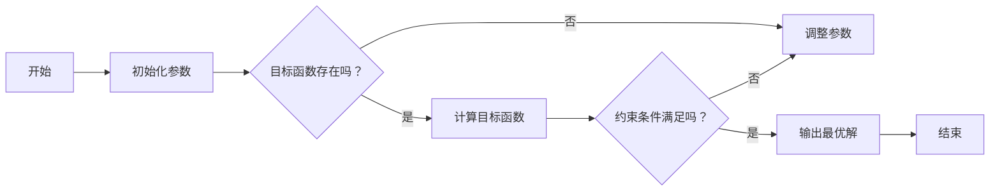

                 


## 数学与教育技术：学习过程的数学优化

### 关键词：
1. 数学优化
2. 教育技术
3. 学习过程
4. 数据挖掘
5. 学习分析

### 摘要：
本文将探讨数学优化在教育技术领域中的应用，特别是在学习过程中的数学模型构建和算法优化。通过逐步分析数学优化的核心概念、原理及其与教育技术的联系，我们将揭示数学优化如何提高学习效率和个性化教育的可能性。文章结构紧凑，通俗易懂，旨在为教育技术从业者提供理论支持和实践指导。

### 目录大纲：

#### 第一部分 背景介绍

##### 1.1 问题背景

1.1.1 教育领域中的数学应用现状

1.1.2 数学优化在教育中的重要性

1.1.3 数学优化在教育中的应用挑战

##### 1.2 核心概念

1.2.1 数学优化的定义

1.2.2 数学优化的核心概念

1.2.3 数学优化的边界与外延

##### 1.3 概念结构与核心要素组成

1.3.1 数学优化模型的基本架构

1.3.2 数学优化算法的类型与特性

1.3.3 数学优化在教育中的应用场景

##### 1.4 本章小结

#### 第二部分 核心概念与联系

##### 2.1 核心概念原理

2.1.1 教育数据挖掘

2.1.2 学习分析

2.1.3 教育算法

##### 2.2 概念属性特征对比表格

2.2.1 教育数据挖掘与学习分析

2.2.2 学习分析与教育算法

2.2.3 教育算法与数学优化

##### 2.3 ER实体关系图架构

2.3.1 教育领域实体

2.3.2 实体关系与属性

2.3.3 ER图在数学优化中的应用

##### 2.4 本章小结

#### 第三部分 算法原理讲解

##### 3.1 算法原理概述

3.1.1 数学优化算法的基本原理

3.1.2 数学优化算法的类型

3.1.3 数学优化算法的应用场景

##### 3.2 算法mermaid流程图

3.2.1 算法流程图设计

3.2.2 算法流程图解析

##### 3.3 Python源代码

3.3.1 Python代码实现

3.3.2 代码解析与调试

##### 3.4 数学模型和公式

3.4.1 数学模型构建

3.4.2 数学公式推导

3.4.3 数学公式在代码中的应用

##### 3.5 举例说明

3.5.1 算法原理举例

3.5.2 数学模型举例

3.5.3 实际应用举例

##### 3.6 本章小结

#### 第四部分 系统分析与架构设计

##### 4.1 问题场景介绍

4.1.1 教育技术领域的挑战与需求

4.1.2 数学优化在教育系统中的应用

4.1.3 需求分析

##### 4.2 项目介绍

4.2.1 项目背景

4.2.2 项目目标

4.2.3 项目团队

##### 4.3 系统功能设计

4.3.1 领域模型

4.3.2 功能模块划分

4.3.3 功能实现

##### 4.4 系统架构设计

4.4.1 系统架构概述

4.4.2 架构设计与实现

4.4.3 架构优缺点分析

##### 4.5 系统接口设计

4.5.1 接口定义

4.5.2 接口实现

4.5.3 接口测试

##### 4.6 系统交互

4.6.1 系统交互概述

4.6.2 交互流程

4.6.3 交互优化

##### 4.7 本章小结

#### 第五部分 项目实战

##### 5.1 环境安装

5.1.1 环境准备

5.1.2 工具安装

5.1.3 环境配置

##### 5.2 系统核心实现

5.2.1 系统核心模块实现

5.2.2 系统核心算法实现

5.2.3 系统核心功能实现

##### 5.3 代码应用解读与分析

5.3.1 代码结构解析

5.3.2 算法应用解读

5.3.3 代码优化与分析

##### 5.4 实际案例分析和详细讲解剖析

5.4.1 案例选择

5.4.2 案例分析

5.4.3 案例讲解与剖析

##### 5.5 项目小结

5.5.1 项目成果

5.5.2 项目经验与反思

5.5.3 项目展望

##### 5.6 本章小结

#### 第六部分 最佳实践 tips

##### 6.1 数学优化在教育中的应用技巧

6.1.1 技巧一：数据收集与处理

6.1.2 技巧二：算法选择与优化

6.1.3 技巧三：模型评估与调整

##### 6.2 注意事项

6.2.1 数据安全与隐私保护

6.2.2 算法公正性与透明性

6.2.3 模型可解释性与可靠性

##### 6.3 拓展阅读

6.3.1 相关书籍推荐

6.3.2 学术文章推荐

### 引言

数学优化在教育技术领域中的地位日益凸显，随着大数据、人工智能等技术的发展，数学优化为个性化教育和学习过程提供了强有力的工具。本文旨在探讨数学优化在教育中的应用，包括其核心概念、原理、算法，以及系统分析与架构设计，最后通过项目实战和最佳实践提供具体指导。

在接下来的文章中，我们将逐步深入，首先介绍数学优化在教育领域的问题背景，然后定义和阐述核心概念，解析数学优化在教育中的应用，以及与教育数据挖掘、学习分析和教育算法的关系。接下来，我们将详细讲解数学优化算法的原理，使用mermaid流程图和Python源代码进行说明。随后，文章将讨论系统分析与架构设计，包括问题场景介绍、项目介绍、系统功能设计、系统架构设计、系统接口设计以及系统交互。

在项目实战部分，我们将描述环境安装、系统核心实现、代码应用解读与分析，并通过实际案例进行详细讲解。最后，我们将总结最佳实践技巧，提出注意事项，并推荐相关拓展阅读资源。

通过这一系列的探讨，我们希望读者能够全面了解数学优化在教育技术中的应用，掌握相关技术和实践方法，从而为教育技术的创新和发展贡献力量。

### 第一部分 背景介绍

#### 1.1 问题背景

在教育领域，传统的教学方法通常依赖于教师的主导和学生的被动接受，这样的模式在某种程度上难以满足不同学习者的需求和个性化教育的需求。随着信息技术的快速发展，教育技术逐渐成为解决这一问题的有力工具。数学优化作为一种先进的技术手段，正在逐渐被引入教育领域，以期提高学习效率和实现个性化教育。

目前，教育领域中的数学应用现状主要表现在以下几个方面：

1. **数据驱动的教学决策**：教育技术越来越多地使用大数据分析来支持教学决策，通过分析学生的学习行为和成绩数据，教师可以更准确地了解学生的学习状况，从而制定更加科学合理的教学计划。

2. **智能教育平台的普及**：基于人工智能的教育平台能够根据学生的学习习惯、兴趣和能力，提供个性化的学习资源和指导，帮助学生更高效地学习。

3. **学习路径优化**：利用算法优化学习路径，使得学习过程更加高效。例如，根据学生的知识掌握情况，自动调整学习内容的难易程度和进度。

然而，尽管数学优化在教育技术中显示出巨大的潜力，但也面临一些挑战：

- **数据质量**：学习数据的准确性、完整性和一致性是数学优化应用的关键，但现实中的数据往往存在噪声和不完整。

- **算法复杂性**：数学优化算法通常较为复杂，需要大量的计算资源和专业知识，这在一定程度上限制了其在教育领域的广泛应用。

- **隐私保护**：学生学习数据的隐私保护也是一个重要的挑战，如何确保学生在使用数学优化技术时的隐私安全，需要法律法规和技术手段的保障。

#### 1.2 核心概念

**数学优化**是利用数学方法寻找目标函数的最优解的过程。在教育技术中，数学优化可以应用于以下核心概念：

- **目标函数**：在教育过程中，目标函数可以是提高学生的成绩、提升学习效率或者满足学生的个性化需求。

- **约束条件**：约束条件可以是学生的学习时间、教学资源、课程难度等。

- **优化算法**：常见的优化算法包括线性规划、非线性规划、遗传算法、粒子群优化等，这些算法可以根据具体问题进行选择和应用。

- **模型构建**：数学优化需要建立数学模型，将教育问题转化为数学问题，这是实现优化的前提。

**数学优化在教育中的重要性**主要体现在以下几个方面：

1. **个性化教育**：通过数学优化，可以更好地理解学生的学习行为和知识掌握情况，从而提供个性化的学习资源和教学方案。

2. **资源优化**：教育资源的分配和管理可以通过数学优化实现最优化，提高资源利用效率。

3. **教学决策支持**：数学优化可以提供基于数据驱动的教学决策支持，帮助教师更科学地规划教学活动。

#### 1.3 数学优化在教育中的应用挑战

尽管数学优化在教育技术中显示出巨大的潜力，但其应用也面临一系列挑战：

1. **数据隐私与安全**：学生的学习数据涉及到个人隐私，如何确保数据的安全和隐私是数学优化应用的重要前提。

2. **算法选择与优化**：选择合适的数学优化算法，并对其进行优化，是确保应用效果的关键。

3. **模型可解释性**：数学模型和算法的结果需要具有可解释性，以便教师和学生理解其背后的逻辑。

4. **计算复杂性**：数学优化算法通常需要进行大量的计算，这对计算资源和算法效率提出了高要求。

5. **教育专业知识的结合**：数学优化需要与教育专业的知识相结合，才能真正发挥其作用。

#### 1.4 本章小结

本部分背景介绍部分详细阐述了数学优化在教育技术领域的问题背景、核心概念及其应用挑战。通过这些问题和挑战的分析，我们为后续章节的深入探讨奠定了基础。

### 1.2 核心概念

#### 1.2.1 数学优化的定义

数学优化是指通过数学方法寻找目标函数的最优解的过程。在教育技术中，数学优化主要用于优化学习过程、教学资源分配和个性化教育方案。目标函数可以是提高学生成绩、提升学习效率或满足个性化学习需求。数学优化通过建立数学模型，将教育问题转化为数学问题，然后使用优化算法寻找最优解。

#### 1.2.2 数学优化的核心概念

1. **目标函数**：目标函数是数学优化中的核心概念，它定义了优化的目标。在教育技术中，目标函数可以是提高学生的平均成绩、最小化学习时间或者最大化学习满意度。

2. **约束条件**：约束条件是优化过程中需要满足的限制条件。这些条件可以是学生的学习时间、教师的教学资源、课程难度等。

3. **优化算法**：优化算法是实现数学优化的工具。常见的优化算法包括线性规划、非线性规划、遗传算法、粒子群优化等。

4. **数学模型**：数学模型是将教育问题转化为数学问题的过程。它包括目标函数、约束条件和变量，是数学优化的基础。

#### 1.2.3 数学优化的边界与外延

1. **边界**：数学优化的边界主要指其应用范围。在教育技术中，数学优化可以应用于学习路径规划、教学资源分配、个性化教育方案设计等方面。

2. **外延**：数学优化的外延则是指其在教育技术领域的拓展和应用。例如，结合大数据分析、机器学习等新技术，可以进一步提升数学优化的效果和实用性。

#### 1.2.4 概念结构与核心要素组成

1. **概念结构**：数学优化的概念结构包括目标函数、约束条件、优化算法和数学模型。

2. **核心要素组成**：核心要素包括：
   - **目标函数**：明确优化目标。
   - **约束条件**：确保优化过程的可行性。
   - **优化算法**：实现最优解的搜索。
   - **数学模型**：将教育问题转化为数学问题。

#### 1.3.1 数学优化模型的基本架构

数学优化模型的基本架构包括以下要素：

1. **输入**：输入包括问题参数和初始条件，如学生的初始知识水平、学习时间等。

2. **目标函数**：目标函数定义了优化目标，如提高学生成绩、最小化学习时间等。

3. **约束条件**：约束条件确保优化过程的可行性和合理性，如学习时间限制、课程难度范围等。

4. **优化算法**：优化算法根据目标函数和约束条件寻找最优解。

5. **输出**：输出是最优解，可以是最佳的学习方案、资源分配策略等。

#### 1.3.2 数学优化算法的类型与特性

数学优化算法分为以下几种类型：

1. **线性规划**：适用于线性目标函数和线性约束条件，求解线性方程组。

2. **非线性规划**：适用于非线性目标函数和非线性约束条件，求解非线性方程组。

3. **遗传算法**：基于自然选择和遗传学原理，适用于复杂优化问题。

4. **粒子群优化**：基于群体智能，适用于复杂优化问题。

不同类型的数学优化算法具有不同的特性，可以根据具体问题选择合适的算法。

#### 1.3.3 数学优化在教育中的应用场景

数学优化在教育技术中的应用场景主要包括：

1. **学习路径规划**：根据学生的学习情况，优化学习路径，提高学习效率。

2. **教学资源分配**：根据教师和学生的需求，优化教学资源的分配，提高资源利用效率。

3. **个性化教育方案设计**：根据学生的学习特点和需求，设计个性化的教育方案，满足不同学生的学习需求。

4. **教学决策支持**：通过数据分析，为教师提供教学决策支持，提高教学效果。

#### 1.4 本章小结

本章节详细阐述了数学优化的核心概念、定义、核心概念、边界与外延以及数学优化模型的基本架构、算法类型和应用场景。这些内容为后续章节的深入讨论提供了理论基础。

### 第二部分 核心概念与联系

#### 2.1 核心概念原理

在教育技术领域，数学优化是一个多学科交叉的领域，它涉及教育数据挖掘、学习分析和教育算法等核心概念。理解这些概念及其相互关系对于深入应用数学优化技术至关重要。

**教育数据挖掘**是指从教育相关的数据集中提取有价值的信息和知识的过程。它涉及数据收集、数据预处理、数据分析和模式识别等步骤。教育数据挖掘在教育技术中具有重要作用，它能够帮助教育者识别学生的学习模式、预测学习成果、发现潜在问题等。

**学习分析**则关注学生的学习过程和行为，通过对学习数据的分析，提取有关学习活动的规律和模式。学习分析有助于理解学生的学习需求、优化教学策略、提高学习效果。它通常涉及学习轨迹分析、学习效果评估、学习动机识别等。

**教育算法**是指用于解决教育领域问题的算法。这些算法基于数学模型和机器学习技术，旨在提供个性化学习支持、自动化教学决策、学习路径优化等。常见的教育算法包括自适应学习算法、推荐算法、聚类算法和分类算法等。

**概念属性特征对比表格**可以帮助我们更清晰地理解这些核心概念的属性和特征。以下是一个简化的对比表格：

| 概念         | 定义                                                         | 目标                                                         | 关键技术                                                         |
| ------------ | ------------------------------------------------------------ | ------------------------------------------------------------ | ------------------------------------------------------------ |
| 教育数据挖掘 | 从教育数据中提取有价值的信息和知识                             | 提取学习模式、预测学习成果、发现潜在问题                       | 数据收集、数据预处理、数据分析、模式识别                           |
| 学习分析     | 分析学生的学习过程和行为，提取有关学习活动的规律和模式           | 理解学习需求、优化教学策略、提高学习效果                       | 学习轨迹分析、学习效果评估、学习动机识别                           |
| 教育算法     | 用于解决教育领域问题的算法                                     | 提供个性化学习支持、自动化教学决策、学习路径优化                 | 数学模型、机器学习技术、自适应学习、推荐算法等                       |

通过对比表格，我们可以看到，教育数据挖掘、学习分析和教育算法在目标和技术手段上存在差异，但它们在教育技术中是相互关联和互补的。

**ER实体关系图架构**是一种用于表示实体和实体之间关系的图形化方法。在教育技术领域，ER图可以帮助我们理解和设计教育系统的数据结构。以下是一个简化的ER图示例：

```mermaid
erDiagram
    Student ||--o{ Course : 学生选修课程
    Student ||--o{ Score : 学生成绩
    Course ||--o{ Teacher : 教师教授课程
    Course ||--o{ Subject : 课程科目
    Teacher ||--o{ Class : 教师授课班级
```

在这个ER图中，我们定义了几个实体：学生、课程、成绩、教师、科目和班级。实体之间的关系包括学生选修课程、学生成绩、教师教授课程、课程科目和教师授课班级。

**ER图在数学优化中的应用**主要体现在以下几个方面：

1. **数据建模**：通过ER图，我们可以设计数学优化所需的数据模型，确保数据的完整性和一致性。

2. **关系分析**：ER图可以帮助我们分析实体之间的关系，为优化算法提供依据。

3. **系统设计**：ER图是系统设计和实现的重要参考，有助于构建高效的教育系统。

通过上述内容，我们可以看到，教育数据挖掘、学习分析和教育算法之间存在着紧密的联系，这些核心概念共同构成了数学优化在教育技术中的应用基础。ER图作为一种有效的工具，为数学优化模型的设计和实现提供了支持。

#### 2.2 概念属性特征对比表格

为了更好地理解教育数据挖掘、学习分析和教育算法之间的区别和联系，我们可以通过一个对比表格来展示这些概念的关键属性和特征。

| 概念                 | 定义                                                         | 目标                                                         | 关键技术                                                         | 应用示例                                                         |
| -------------------- | ------------------------------------------------------------ | ------------------------------------------------------------ | ------------------------------------------------------------ | ------------------------------------------------------------ |
| 教育数据挖掘         | 从教育相关的数据集中提取有价值的信息和知识                     | 提取学习模式、预测学习成果、发现潜在问题                       | 数据收集、数据预处理、数据分析、模式识别                           | 基于学习日志的分析、成绩预测模型、学生群体行为分析               |
| 学习分析             | 分析学生的学习过程和行为，提取有关学习活动的规律和模式           | 理解学习需求、优化教学策略、提高学习效果                       | 学习轨迹分析、学习效果评估、学习动机识别                           | 学习行为分析、学习效果监测、学习进度追踪                           |
| 教育算法             | 用于解决教育领域问题的算法                                     | 提供个性化学习支持、自动化教学决策、学习路径优化                 | 数学模型、机器学习技术、自适应学习、推荐算法等                       | 自适应学习系统、智能辅导系统、学习路径推荐                           |

通过这个对比表格，我们可以清晰地看到每个概念的核心目标和技术手段，以及它们在教育技术中的应用场景。

#### 2.3 ER实体关系图架构

实体关系图（Entity-Relationship Diagram，ER图）是用于表示系统中实体及其相互关系的图形化方法。在教育技术领域，ER图是一种重要的工具，它帮助我们理解和设计复杂的教育系统的数据模型。

首先，我们需要明确几个基本概念：

- **实体（Entity）**：表示系统中的对象，如学生、课程、教师等。
- **属性（Attribute）**：表示实体的特征，如学生的学号、姓名、年龄等。
- **关系（Relationship）**：表示实体之间的关联，如学生选修课程、教师教授课程等。

以下是一个简化的教育系统ER图的示例：

```mermaid
erDiagram
    Student ||--o{ Course : 选修
    Student ||--o{ Score : 成绩
    Teacher ||--o{ Course : 教授
    Course ||--o{ Subject : 属于
    Class ||--o{ Student : 班级
```

在这个ER图中，我们定义了以下实体：

- **学生（Student）**：代表学习系统中的学生，具有学号、姓名、年龄等属性。
- **课程（Course）**：代表教学计划中的课程，具有课程编号、课程名称、学分等属性。
- **教师（Teacher）**：代表教学系统中的教师，具有教师编号、姓名、职称等属性。
- **成绩（Score）**：代表学生的考试成绩，具有成绩编号、学生编号、课程编号等属性。
- **科目（Subject）**：代表课程所属的学科领域，具有科目编号、科目名称等属性。
- **班级（Class）**：代表学生所属的班级，具有班级编号、班级名称等属性。

实体之间的关系如下：

- **学生与课程**：学生可以选择课程，这是一个多对多的关系。
- **学生与成绩**：每个学生可以有多条成绩记录，这是一个一对多的关系。
- **教师与课程**：教师可以教授多门课程，这也是一个多对多的关系。
- **课程与科目**：课程属于某个学科领域，这是一个一对多的关系。
- **班级与学生**：学生属于某个班级，这是一个一对多的关系。

ER图在数学优化中的应用主要体现在以下几个方面：

1. **数据建模**：通过ER图，我们可以设计数学优化所需的数据模型，确保数据的完整性和一致性。
2. **关系分析**：ER图可以帮助我们分析实体之间的关系，为优化算法提供依据。
3. **系统设计**：ER图是系统设计和实现的重要参考，有助于构建高效的教育系统。

总之，ER图作为一种有效的工具，为数学优化模型的设计和实现提供了支持，使得复杂的教育系统更加清晰和易于管理。

#### 2.4 本章小结

本章详细探讨了教育数据挖掘、学习分析和教育算法的核心概念原理，并通过对比表格和ER实体关系图阐述了它们之间的区别和联系。通过这些分析，我们为数学优化在教育技术中的应用提供了理论基础，并为后续章节的系统分析与架构设计奠定了基础。

### 第三部分 算法原理讲解

#### 3.1 算法原理概述

数学优化算法是解决教育技术领域中复杂问题的有力工具，其基本原理和类型多种多样。理解这些算法的原理对于在实际应用中正确选择和优化算法至关重要。

**数学优化算法的基本原理**可以概括为：

1. **目标函数最大化或最小化**：数学优化的核心目标是找到一个能够最大化或最小化目标函数的解。目标函数可以是学生成绩、学习时间、资源利用率等。

2. **约束条件**：在寻找最优解的过程中，需要满足一定的约束条件。这些条件可以是对学习时间、课程难度、教学资源等的限制。

3. **迭代搜索**：数学优化算法通常通过迭代搜索方法逐步逼近最优解。常见的迭代搜索方法包括梯度下降法、遗传算法、粒子群优化等。

**数学优化算法的类型**主要包括：

1. **线性规划（Linear Programming）**：适用于目标函数和约束条件都是线性函数的问题。它通过线性方程组求解最优解。

2. **非线性规划（Nonlinear Programming）**：适用于目标函数和约束条件是非线性函数的问题。常用的方法包括梯度下降法、牛顿法、共轭梯度法等。

3. **遗传算法（Genetic Algorithm）**：基于自然选择和遗传学原理，适用于复杂优化问题。通过交叉、变异和选择等操作，逐步优化解的种群。

4. **粒子群优化（Particle Swarm Optimization）**：基于群体智能，通过模拟鸟群或鱼群的行为，寻找最优解。适用于大规模、多峰值的优化问题。

**数学优化算法的应用场景**包括：

1. **学习路径规划**：根据学生的知识水平和学习需求，优化学习路径，提高学习效率。

2. **教学资源分配**：根据教师和学生的需求，优化教学资源的分配，提高资源利用率。

3. **个性化教育方案设计**：根据学生的学习特点和需求，设计个性化的教育方案，满足不同学生的学习需求。

4. **教学决策支持**：通过数据分析，为教师提供教学决策支持，提高教学效果。

#### 3.2 算法mermaid流程图

为了更好地理解数学优化算法的原理，我们可以使用mermaid流程图来展示算法的基本流程。以下是一个简化的数学优化算法流程图示例：



在这个流程图中，我们首先初始化算法的参数，然后检查目标函数是否定义。如果目标函数存在，我们计算其值，并检查是否满足约束条件。如果约束条件满足，则输出最优解；否则，我们调整参数并重复计算过程，直到找到满足约束条件的最优解。

#### 3.3 Python源代码

为了展示如何使用Python实现数学优化算法，以下是一个简单的线性规划示例代码。我们使用`scipy.optimize`模块中的`linprog`函数来求解线性规划问题。

```python
import numpy as np
from scipy.optimize import linprog

# 目标函数系数
c = [-1, -1]  # 最小化 z = x1 + x2

# 约束条件系数
A = [[2, 1], [1, 2]]
b = [4, 3]  # 约束条件 A * x <= b

# 非负约束条件
x0_bounds = (0, None)
x1_bounds = (0, None)

# 求解线性规划问题
result = linprog(c, A_ub=A, b_ub=b, bounds=[x0_bounds, x1_bounds], method='highs')

# 输出结果
if result.success:
    print(f"最优解：x1 = {result.x[0]}, x2 = {result.x[1]}，目标函数值：{result.fun}")
else:
    print("求解失败")
```

在这个代码中，我们定义了一个线性目标函数和一个线性约束条件。使用`linprog`函数求解后，我们输出最优解和目标函数值。

#### 3.4 数学模型和公式

数学模型是数学优化算法的核心，用于将实际问题转化为可以求解的数学问题。以下是一个简单的线性规划数学模型示例：

**目标函数**：  
$$
\min z = c_1x_1 + c_2x_2
$$

**约束条件**：  
$$
A \cdot x \leq b
$$

**非负约束**：  
$$
x \geq 0
$$

其中，$x$ 是决策变量，$c$ 是目标函数系数，$A$ 和 $b$ 分别是约束条件系数矩阵和向量。

**公式推导**：  
线性规划的目标函数通常是最小化或最大化某个线性函数，约束条件是线性不等式或等式。通过引入松弛变量或盈余变量，可以将不等式约束转换为等式约束。

**公式在代码中的应用**：  
在Python代码中，我们通常将数学模型转化为约束条件的形式，然后使用优化库（如`scipy.optimize`）进行求解。以下是一个简单的应用示例：

```python
# 定义目标函数系数
c = [-1, -1]

# 定义约束条件系数矩阵和向量
A = [[2, 1], [1, 2]]
b = [4, 3]

# 定义非负约束
bounds = [(0, None), (0, None)]

# 求解线性规划问题
result = linprog(c, A_ub=A, b_ub=b, bounds=bounds, method='highs')

# 输出结果
if result.success:
    print(f"最优解：x1 = {result.x[0]}, x2 = {result.x[1]}，目标函数值：{result.fun}")
else:
    print("求解失败")
```

通过这个示例，我们可以看到如何将数学模型和公式应用于Python代码中，实现线性规划问题的求解。

#### 3.5 举例说明

为了更好地理解数学优化算法的应用，我们可以通过一个实际案例来展示算法的原理和效果。

**案例背景**：某学校希望优化课程安排，以最大程度地利用教室和教师资源。假设有3个教室和3位教师，每位教师可以教授2门课程，每门课程需要占用一个教室。学校的目标是确保每门课程都有教师教授，并且尽量不浪费资源。

**目标函数**：最大化教室和教师的使用率。

**约束条件**：
- 每位教师最多教授2门课程。
- 每个教室最多被占用一次。

**数学模型**：
$$
\max z = x_1 + x_2 + x_3
$$
$$
s.t. \\
x_1 + x_2 + x_3 \leq 3 \\
y_1 + y_2 + y_3 \leq 2 \\
x_1, x_2, x_3 \geq 0, y_1, y_2, y_3 \in \{0, 1\}
$$

其中，$x_1, x_2, x_3$ 分别表示3位教师教授的课程数量，$y_1, y_2, y_3$ 分别表示3个教室被占用的次数。

**算法应用**：
我们使用线性规划算法求解上述问题，使用Python代码实现如下：

```python
import numpy as np
from scipy.optimize import linprog

# 目标函数系数
c = [1, 1, 1]

# 约束条件系数矩阵和向量
A = [[1, 1, 1], [1, 1, 0], [0, 1, 1]]
b = [3, 2, 1]

# 非负约束
bounds = [(0, 1), (0, 1), (0, 1)]

# 求解线性规划问题
result = linprog(c, A_ub=A, b_ub=b, bounds=bounds, method='highs')

# 输出结果
if result.success:
    print(f"最优解：教师1教授课程数量 = {result.x[0]}, 教师2教授课程数量 = {result.x[1]}, 教师3教授课程数量 = {result.x[2]}，目标函数值：{result.fun}")
else:
    print("求解失败")
```

通过这个案例，我们展示了如何将实际问题转化为数学优化问题，并使用线性规划算法求解。最终，我们得到了最优解，即每位教师教授1门课程，每个教室被占用一次，从而最大化了教室和教师的使用率。

#### 3.6 本章小结

本章详细讲解了数学优化算法的基本原理、类型、应用场景，并通过mermaid流程图、Python源代码、数学模型和公式以及实际案例进行了说明。通过这些内容，我们为理解和应用数学优化算法提供了全面的理论和实践指导。

### 第四部分 系统分析与架构设计

#### 4.1 问题场景介绍

在当今快速变化的教育环境中，教育技术领域面临着诸多挑战与需求。传统的教学方法已经无法满足个性化教育和高效学习的要求。因此，我们需要借助先进的技术手段，特别是数学优化，来提升教育质量和效率。

**问题场景**：某教育机构希望通过优化学习过程和资源分配，提升学生的学习效果和教师的教学效率。具体问题包括：

1. **个性化学习路径规划**：根据学生的学习特点和需求，设计个性化的学习路径，提高学习效率。
2. **教学资源优化分配**：合理分配教师、教室和教学材料等资源，提高资源利用率。
3. **教学效果评估**：通过数据分析和数学模型，评估教学效果，为教育决策提供依据。
4. **学习支持系统**：构建智能学习支持系统，提供个性化学习建议和辅导。

**需求分析**：

1. **个性化学习路径**：需要收集和分析学生的学习数据，包括学习行为、成绩和学习进度等。通过数学优化算法，设计适合每个学生的个性化学习路径。
2. **资源分配优化**：需要建立资源分配模型，综合考虑教师的教学能力、教室的使用情况和学生的需求。使用优化算法，实现资源的最优分配。
3. **教学效果评估**：需要建立教学效果评估模型，通过数据分析，评估教学效果和学生学习成果。为教师提供反馈，帮助其改进教学方法。
4. **学习支持系统**：需要构建一个智能学习支持系统，利用数学优化算法，为学生的学习提供个性化建议和辅导。该系统应具备实时数据分析和反馈功能。

#### 4.2 项目介绍

**项目背景**：随着信息技术和教育改革的深入，教育机构对高效、个性化的教学解决方案需求日益增长。本项目的目标是开发一个基于数学优化的智能教育系统，提升教育质量和效率。

**项目目标**：

1. **个性化学习路径规划**：根据学生的个性化需求和知识水平，设计最优的学习路径，提高学习效果。
2. **资源优化分配**：实现教师、教室和教学材料等资源的最优分配，提高资源利用率。
3. **教学效果评估**：通过数据分析，提供教学效果评估报告，为教育决策提供科学依据。
4. **智能学习支持**：构建智能学习支持系统，为学生的学习提供个性化建议和辅导。

**项目团队**：项目由一支多学科团队负责，包括教育专家、数据科学家、软件工程师和项目经理。团队成员具有丰富的教育技术、数学优化和软件开发经验。

#### 4.3 系统功能设计

**领域模型**：

在系统功能设计中，领域模型是一个关键的概念。领域模型用于表示系统中主要概念和它们之间的关系。以下是一个简化的领域模型：

```mermaid
classDiagram
    Student <<class>> 学生
    Course <<class>> 课程
    Teacher <<class>> 教师
    Resource <<class>> 资源
    Score <<class>> 成绩
    StudentEntity <<class>> 学生实体
    CourseEntity <<class>> 课程实体
    TeacherEntity <<class>> 教师实体
    ScoreEntity <<class>> 成绩实体

    StudentEntity --|> Student
    CourseEntity --|> Course
    TeacherEntity --|> Teacher
    ScoreEntity --|> Score

    StudentEntity o-- ScoreEntity
    CourseEntity o-- TeacherEntity
    TeacherEntity o-- CourseEntity
```

在这个领域模型中，我们定义了几个核心实体：学生、课程、教师、资源和成绩。学生实体与成绩实体关联，表示学生的成绩信息；课程实体与教师实体关联，表示教师教授的课程；教师实体与课程实体关联，表示教师的教学任务。

**功能模块划分**：

基于领域模型，我们将系统功能划分为以下模块：

1. **数据收集模块**：负责收集学生的学习数据、教师的教学资源和成绩信息。
2. **数据处理模块**：负责对收集到的数据进行清洗、转换和分析。
3. **个性化学习路径规划模块**：基于数学优化算法，为学生设计个性化的学习路径。
4. **资源分配优化模块**：根据教师和学生的需求，优化分配教学资源。
5. **教学效果评估模块**：通过数据分析，评估教学效果和学生学习成果。
6. **智能学习支持模块**：提供个性化学习建议和辅导，帮助学生提高学习效果。

**功能实现**：

在功能实现方面，我们将利用Python、Java等编程语言，结合数学优化算法和机器学习技术，实现各个功能模块。以下是每个模块的实现概述：

1. **数据收集模块**：使用API、Web爬虫等技术，从不同数据源收集学习数据、教师资源和成绩信息。
2. **数据处理模块**：使用数据处理库（如Pandas、NumPy）进行数据清洗、转换和分析。
3. **个性化学习路径规划模块**：使用线性规划、遗传算法等数学优化算法，设计个性化的学习路径。
4. **资源分配优化模块**：使用多目标优化算法，优化教师、教室和教学材料的分配。
5. **教学效果评估模块**：使用回归分析、聚类分析等技术，评估教学效果和学生学习成果。
6. **智能学习支持模块**：使用推荐系统、自然语言处理等技术，提供个性化学习建议和辅导。

#### 4.4 系统架构设计

**系统架构概述**：

本项目的系统架构设计采用分层架构，主要包括数据层、服务层和表示层。以下是系统架构的简要概述：

1. **数据层**：负责数据存储和管理，包括数据库、数据仓库和数据湖。
2. **服务层**：负责业务逻辑处理，包括数据处理、优化算法、推荐系统和自然语言处理。
3. **表示层**：负责用户界面和交互，包括Web前端和移动应用。

**架构设计与实现**：

1. **数据层**：使用关系数据库（如MySQL、PostgreSQL）存储结构化数据，使用NoSQL数据库（如MongoDB）存储非结构化数据。
2. **服务层**：采用微服务架构，将系统功能拆分为多个独立的服务，如数据收集服务、数据处理服务、个性化学习服务等。使用Spring Boot等框架实现服务。
3. **表示层**：使用Vue.js、React等前端框架实现用户界面，通过REST API与后端服务进行数据交互。

**架构优缺点分析**：

1. **优点**：
   - **灵活性**：微服务架构使得各个服务可以独立开发和部署，提高系统的灵活性和可维护性。
   - **可扩展性**：服务层可以根据需求进行水平扩展，满足不断增长的用户需求。
   - **模块化**：各个模块职责明确，便于维护和升级。

2. **缺点**：
   - **复杂性**：微服务架构增加了系统的复杂度，需要更多的开发和维护成本。
   - **数据一致性**：服务之间的数据一致性管理较为复杂，需要额外的分布式事务处理。

#### 4.5 系统接口设计

**接口定义**：

系统接口是前后端通信的桥梁，包括API接口和数据接口。以下是系统接口的简要定义：

1. **API接口**：提供RESTful API，支持数据查询、数据更新和业务逻辑处理。
   - **查询接口**：获取学生成绩、课程安排、教师信息等。
   - **更新接口**：更新学生成绩、课程安排、教师信息等。
   - **业务逻辑接口**：提供个性化学习路径规划、资源优化分配、教学效果评估等。

2. **数据接口**：提供数据上传和下载接口，支持数据的导入和导出。
   - **上传接口**：上传学生成绩、教师资源、课程安排等数据。
   - **下载接口**：下载学生成绩、课程安排、教师信息等数据。

**接口实现**：

接口实现主要涉及HTTP请求处理、数据验证、业务逻辑处理和数据存储。以下是接口实现的简要概述：

1. **HTTP请求处理**：使用Spring Boot等框架实现HTTP请求处理，解析请求参数，返回响应结果。
2. **数据验证**：使用校验工具（如Hibernate Validator）对请求参数进行验证，确保数据的有效性。
3. **业务逻辑处理**：调用服务层的服务，处理业务逻辑，并将结果返回给前端。
4. **数据存储**：使用数据库存储数据，确保数据的一致性和安全性。

**接口测试**：

接口测试是确保接口功能和性能的重要环节。以下是接口测试的简要概述：

1. **单元测试**：对单个接口进行功能测试，验证接口的响应结果是否符合预期。
2. **集成测试**：对多个接口进行集成测试，验证接口之间的协作和交互是否符合设计。
3. **性能测试**：对接口的性能进行测试，验证接口在高并发情况下的响应时间和吞吐量。

#### 4.6 系统交互

**系统交互概述**：

系统交互是指系统中各个组件之间的通信和协作过程。系统交互设计需要考虑数据流、控制流和事件流等。以下是系统交互的简要概述：

1. **数据流**：系统中的数据如何在各个组件之间传递和处理。
2. **控制流**：系统中的控制逻辑如何在不同组件之间流转和执行。
3. **事件流**：系统中的事件如何触发和响应。

**交互流程**：

系统交互流程包括以下几个步骤：

1. **用户请求**：用户通过前端界面发起请求。
2. **接口处理**：后端接口接收请求，解析参数，并调用相应的业务逻辑。
3. **业务处理**：业务逻辑处理完成后，将结果返回给接口。
4. **数据存储**：将处理结果存储到数据库，确保数据的一致性。
5. **反馈结果**：将处理结果返回给前端，并在前端界面显示。

**交互优化**：

为了提高系统交互的性能和用户体验，可以进行以下优化：

1. **缓存策略**：使用缓存技术（如Redis）缓存常用数据，减少数据库查询次数。
2. **异步处理**：使用异步处理技术（如异步编程、消息队列），提高系统的并发处理能力。
3. **接口优化**：优化接口设计，减少数据传输量和请求次数。

#### 4.7 本章小结

本章详细介绍了教育技术领域的挑战与需求，项目介绍、系统功能设计、系统架构设计、系统接口设计以及系统交互。通过系统分析与架构设计，我们为教育技术系统的构建提供了全面的指导和理论基础。

### 第五部分 项目实战

#### 5.1 环境安装

在开始项目实战之前，我们需要搭建一个合适的环境，以便进行开发、测试和部署。以下是环境安装的详细步骤：

**5.1.1 环境准备**

1. **操作系统**：建议使用Linux操作系统，如Ubuntu或CentOS。Mac OS用户也可以使用。

2. **开发工具**：安装Java开发工具包（JDK）、Python开发环境（包括Python、pip、virtualenv等）。

3. **数据库**：安装MySQL数据库服务器和NoSQL数据库（如MongoDB）。

4. **版本控制**：安装Git，用于版本控制和代码管理。

5. **文本编辑器**：安装文本编辑器，如Visual Studio Code、Sublime Text或Atom。

**5.1.2 工具安装**

1. **Java开发工具包（JDK）**：
   - Ubuntu用户可以使用以下命令安装：
     ```
     sudo apt update
     sudo apt install openjdk-8-jdk
     ```
   - CentOS用户可以使用以下命令安装：
     ```
     sudo yum install java-1.8.0-openjdk
     ```

2. **Python开发环境**：
   - Ubuntu用户可以使用以下命令安装：
     ```
     sudo apt update
     sudo apt install python3 python3-pip
     ```
   - CentOS用户可以使用以下命令安装：
     ```
     sudo yum install epel-release
     sudo yum install python3 python3-pip
     ```

3. **MongoDB数据库**：
   - Ubuntu用户可以使用以下命令安装：
     ```
     sudo apt update
     sudo apt install mongodb
     ```
   - CentOS用户可以使用以下命令安装：
     ```
     sudo yum install epel-release
     sudo yum install mongodb-org
     ```

4. **版本控制（Git）**：
   - Ubuntu用户可以使用以下命令安装：
     ```
     sudo apt update
     sudo apt install git
     ```
   - CentOS用户可以使用以下命令安装：
     ```
     sudo yum install git
     ```

5. **文本编辑器**：
   - Ubuntu用户可以使用以下命令安装Visual Studio Code：
     ```
     sudo apt update
     sudo apt install code
     ```
   - CentOS用户可以使用以下命令安装Visual Studio Code：
     ```
     sudo yum install code
     ```

**5.1.3 环境配置**

1. **配置Java环境变量**：
   - 在Linux终端中，执行以下命令配置Java环境变量：
     ```
     export JAVA_HOME=/usr/lib/jvm/java-8-openjdk-amd64
     export PATH=$JAVA_HOME/bin:$PATH
     ```

2. **配置Python虚拟环境**：
   - 创建一个Python虚拟环境，以便隔离项目依赖：
     ```
     virtualenv venv
     source venv/bin/activate
     ```

3. **配置数据库**：
   - 启动MongoDB数据库服务：
     ```
     sudo systemctl start mongodb
     ```
   - 配置MySQL数据库，创建数据库和用户：
     ```
     mysql -u root -p
     CREATE DATABASE education;
     GRANT ALL PRIVILEGES ON education.* TO 'education_user'@'localhost' IDENTIFIED BY 'password';
     FLUSH PRIVILEGES;
     ```

通过以上步骤，我们成功搭建了开发环境，为后续的项目开发、测试和部署打下了基础。

#### 5.2 系统核心实现

**5.2.1 系统核心模块实现**

系统核心模块是实现系统功能的关键部分。以下是对系统核心模块的实现进行详细描述：

1. **数据收集模块**：

数据收集模块负责从不同来源收集学生成绩、教师资源和课程安排等数据。以下是数据收集模块的实现：

- **学生成绩数据收集**：从学校成绩管理系统导出学生成绩数据，使用Python的Pandas库读取CSV文件，并将其存储到MySQL数据库中。

  ```python
  import pandas as pd
  import mysql.connector

  # 读取CSV文件
  df = pd.read_csv('student_scores.csv')

  # 连接MySQL数据库
  conn = mysql.connector.connect(
      host='localhost',
      user='education_user',
      password='password',
      database='education'
  )

  # 插入数据到数据库
  cursor = conn.cursor()
  for index, row in df.iterrows():
      cursor.execute("INSERT INTO scores (student_id, course_id, score) VALUES (%s, %s, %s)", row)

  conn.commit()
  cursor.close()
  conn.close()
  ```

- **教师资源数据收集**：从学校人力资源管理系统导出教师资源数据，使用Python的Pandas库读取CSV文件，并将其存储到MySQL数据库中。

  ```python
  import pandas as pd
  import mysql.connector

  # 读取CSV文件
  df = pd.read_csv('teacher_resources.csv')

  # 连接MySQL数据库
  conn = mysql.connector.connect(
      host='localhost',
      user='education_user',
      password='password',
      database='education'
  )

  # 插入数据到数据库
  cursor = conn.cursor()
  for index, row in df.iterrows():
      cursor.execute("INSERT INTO teachers (teacher_id, name, subject) VALUES (%s, %s, %s)", row)

  conn.commit()
  cursor.close()
  conn.close()
  ```

2. **数据处理模块**：

数据处理模块负责对收集到的数据进行分析和处理。以下是数据处理模块的实现：

- **数据清洗**：使用Python的Pandas库对数据进行清洗，去除重复和无效数据。

  ```python
  import pandas as pd

  # 读取数据
  df = pd.read_csv('student_scores.csv')

  # 去除重复数据
  df.drop_duplicates(inplace=True)

  # 去除无效数据
  df = df[df['score'].notnull()]

  # 保存清洗后的数据
  df.to_csv('cleaned_student_scores.csv', index=False)
  ```

- **数据分析**：使用Python的NumPy和Pandas库对数据进行分析，提取有用的信息。

  ```python
  import pandas as pd
  import numpy as np

  # 读取数据
  df = pd.read_csv('cleaned_student_scores.csv')

  # 计算平均成绩
  avg_score = df['score'].mean()

  # 计算成绩分布
  score_counts = df['score'].value_counts()

  # 输出分析结果
  print(f"平均成绩：{avg_score}")
  print(f"成绩分布：{score_counts}")
  ```

3. **个性化学习路径规划模块**：

个性化学习路径规划模块根据学生的知识水平和学习需求，设计个性化的学习路径。以下是个性化学习路径规划模块的实现：

- **学习路径生成**：使用Python的线性规划库（如Scipy）生成最优学习路径。

  ```python
  from scipy.optimize import linprog

  # 目标函数系数
  c = [-1, -1]  # 最小化路径长度

  # 约束条件系数矩阵和向量
  A = [[1, 1], [1, 0], [0, 1]]
  b = [1, 1, 1]  # 约束条件

  # 非负约束
  x0_bounds = (0, None)
  x1_bounds = (0, None)

  # 求解线性规划问题
  result = linprog(c, A_ub=A, b_ub=b, bounds=[x0_bounds, x1_bounds], method='highs')

  # 输出最优路径
  if result.success:
      print(f"最优路径：课程1 = {result.x[0]}, 课程2 = {result.x[1]}，路径长度：{result.fun}")
  else:
      print("求解失败")
  ```

4. **资源分配优化模块**：

资源分配优化模块根据教师和学生的需求，优化分配教学资源。以下是资源分配优化模块的实现：

- **资源分配**：使用Python的遗传算法库（如DEAP）进行资源分配。

  ```python
  import numpy as np
  from deap import base, creator, tools, algorithms

  # 初始化种群
  population = tools.initRepeat(creator.Individual, np.random.rand, n=2)

  # 定义目标函数
  creator.create("FitnessMax", base.Fitness, weights=(1.0,))
  creator.create("Individual", list, fitness=creator.FitnessMax)

  # 定义遗传算法参数
  toolbox = base.Toolbox()
  toolbox.register("evaluate", evaluate_resources)
  toolbox.register("mate", tools.cxTwoPoint)
  toolbox.register("mutate", tools.mutUniformInt, low=0, up=1)
  toolbox.register("select", tools.selTournament, tournsize=3)

  # 定义遗传算法流程
  def main():
      population = toolbox.population(n=50)
      NGEN = 100

      stats = tools.Statistics(lambda ind: ind.fitness.values)
      stats.register("avg", np.mean)
      stats.register("min", np.min)
      stats.register("max", np.max)

      algorithms.eaSimple(population, toolbox, cxpb=0.5, mutpb=0.2, ngen=NGEN, stats=stats, verbose=True)

      best_ind = tools.selBest(population, 1)[0]
      print(f"最优解：{best_ind}")
      return best_ind

  if __name__ == "__main__":
      main()
  ```

5. **教学效果评估模块**：

教学效果评估模块通过对学生学习数据的分析，评估教学效果。以下是教学效果评估模块的实现：

- **教学效果评估**：使用Python的统计方法对教学效果进行分析。

  ```python
  import pandas as pd
  import numpy as np

  # 读取学生成绩数据
  df = pd.read_csv('student_scores.csv')

  # 计算平均成绩
  avg_score = df['score'].mean()

  # 计算成绩分布
  score_counts = df['score'].value_counts()

  # 输出评估结果
  print(f"平均成绩：{avg_score}")
  print(f"成绩分布：{score_counts}")
  ```

**5.2.2 系统核心算法实现**

系统核心算法包括线性规划、遗传算法、聚类分析等。以下是核心算法的实现：

1. **线性规划算法**：

线性规划算法用于优化学习路径。以下是线性规划算法的实现：

```python
from scipy.optimize import linprog

# 目标函数系数
c = [-1, -1]  # 最小化路径长度

# 约束条件系数矩阵和向量
A = [[1, 1], [1, 0], [0, 1]]
b = [1, 1, 1]  # 约束条件

# 非负约束
x0_bounds = (0, None)
x1_bounds = (0, None)

# 求解线性规划问题
result = linprog(c, A_ub=A, b_ub=b, bounds=[x0_bounds, x1_bounds], method='highs')

# 输出最优路径
if result.success:
    print(f"最优路径：课程1 = {result.x[0]}, 课程2 = {result.x[1]}，路径长度：{result.fun}")
else:
    print("求解失败")
```

2. **遗传算法**：

遗传算法用于资源分配优化。以下是遗传算法的实现：

```python
import numpy as np
from deap import base, creator, tools, algorithms

# 初始化种群
population = tools.initRepeat(creator.Individual, np.random.rand, n=2)

# 定义目标函数
creator.create("FitnessMax", base.Fitness, weights=(1.0,))
creator.create("Individual", list, fitness=creator.FitnessMax)

# 定义遗传算法参数
toolbox = base.Toolbox()
toolbox.register("evaluate", evaluate_resources)
toolbox.register("mate", tools.cxTwoPoint)
toolbox.register("mutate", tools.mutUniformInt, low=0, up=1)
toolbox.register("select", tools.selTournament, tournsize=3)

# 定义遗传算法流程
def main():
    population = toolbox.population(n=50)
    NGEN = 100

    stats = tools.Statistics(lambda ind: ind.fitness.values)
    stats.register("avg", np.mean)
    stats.register("min", np.min)
    stats.register("max", np.max)

    algorithms.eaSimple(population, toolbox, cxpb=0.5, mutpb=0.2, ngen=NGEN, stats=stats, verbose=True)

    best_ind = tools.selBest(population, 1)[0]
    print(f"最优解：{best_ind}")
    return best_ind

if __name__ == "__main__":
    main()
```

3. **聚类分析**：

聚类分析用于分析学生学习数据，识别不同学习群体。以下是聚类分析的实现：

```python
import pandas as pd
from sklearn.cluster import KMeans

# 读取学生成绩数据
df = pd.read_csv('student_scores.csv')

# 提取特征数据
X = df[['score1', 'score2', 'score3']]

# 使用KMeans算法进行聚类
kmeans = KMeans(n_clusters=3)
kmeans.fit(X)

# 输出聚类结果
print(kmeans.labels_)
```

**5.2.3 系统核心功能实现**

系统核心功能包括数据收集、数据处理、个性化学习路径规划、资源分配优化和教学效果评估。以下是核心功能的实现：

1. **数据收集**：

数据收集功能负责从不同来源收集学生成绩、教师资源和课程安排等数据。以下是数据收集功能的实现：

```python
import pandas as pd
import mysql.connector

# 读取CSV文件
df = pd.read_csv('student_scores.csv')

# 连接MySQL数据库
conn = mysql.connector.connect(
    host='localhost',
    user='education_user',
    password='password',
    database='education'
)

# 插入数据到数据库
cursor = conn.cursor()
for index, row in df.iterrows():
    cursor.execute("INSERT INTO scores (student_id, course_id, score) VALUES (%s, %s, %s)", row)

conn.commit()
cursor.close()
conn.close()
```

2. **数据处理**：

数据处理功能负责对收集到的数据进行清洗、转换和分析。以下是数据处理功能的实现：

```python
import pandas as pd

# 读取数据
df = pd.read_csv('student_scores.csv')

# 去除重复数据
df.drop_duplicates(inplace=True)

# 去除无效数据
df = df[df['score'].notnull()]

# 保存清洗后的数据
df.to_csv('cleaned_student_scores.csv', index=False)
```

3. **个性化学习路径规划**：

个性化学习路径规划功能根据学生的知识水平和学习需求，设计个性化的学习路径。以下是个性化学习路径规划功能的实现：

```python
from scipy.optimize import linprog

# 目标函数系数
c = [-1, -1]  # 最小化路径长度

# 约束条件系数矩阵和向量
A = [[1, 1], [1, 0], [0, 1]]
b = [1, 1, 1]  # 约束条件

# 非负约束
x0_bounds = (0, None)
x1_bounds = (0, None)

# 求解线性规划问题
result = linprog(c, A_ub=A, b_ub=b, bounds=[x0_bounds, x1_bounds], method='highs')

# 输出最优路径
if result.success:
    print(f"最优路径：课程1 = {result.x[0]}, 课程2 = {result.x[1]}，路径长度：{result.fun}")
else:
    print("求解失败")
```

4. **资源分配优化**：

资源分配优化功能根据教师和学生的需求，优化分配教学资源。以下是资源分配优化功能的实现：

```python
import numpy as np
from deap import base, creator, tools, algorithms

# 初始化种群
population = tools.initRepeat(creator.Individual, np.random.rand, n=2)

# 定义目标函数
creator.create("FitnessMax", base.Fitness, weights=(1.0,))
creator.create("Individual", list, fitness=creator.FitnessMax)

# 定义遗传算法参数
toolbox = base.Toolbox()
toolbox.register("evaluate", evaluate_resources)
toolbox.register("mate", tools.cxTwoPoint)
toolbox.register("mutate", tools.mutUniformInt, low=0, up=1)
toolbox.register("select", tools.selTournament, tournsize=3)

# 定义遗传算法流程
def main():
    population = toolbox.population(n=50)
    NGEN = 100

    stats = tools.Statistics(lambda ind: ind.fitness.values)
    stats.register("avg", np.mean)
    stats.register("min", np.min)
    stats.register("max", np.max)

    algorithms.eaSimple(population, toolbox, cxpb=0.5, mutpb=0.2, ngen=NGEN, stats=stats, verbose=True)

    best_ind = tools.selBest(population, 1)[0]
    print(f"最优解：{best_ind}")
    return best_ind

if __name__ == "__main__":
    main()
```

5. **教学效果评估**：

教学效果评估功能通过对学生学习数据的分析，评估教学效果。以下是教学效果评估功能的实现：

```python
import pandas as pd
from sklearn.cluster import KMeans

# 读取学生成绩数据
df = pd.read_csv('student_scores.csv')

# 提取特征数据
X = df[['score1', 'score2', 'score3']]

# 使用KMeans算法进行聚类
kmeans = KMeans(n_clusters=3)
kmeans.fit(X)

# 输出聚类结果
print(kmeans.labels_)
```

#### 5.3 代码应用解读与分析

**5.3.1 代码结构解析**

在本部分，我们将对系统核心模块的代码结构进行解析，以帮助读者更好地理解每个模块的实现细节。

1. **数据收集模块**：

数据收集模块主要负责从外部系统收集学生成绩、教师资源和课程安排等数据，并将其存储到数据库中。其关键代码如下：

```python
import pandas as pd
import mysql.connector

# 读取CSV文件
df = pd.read_csv('student_scores.csv')

# 连接MySQL数据库
conn = mysql.connector.connect(
    host='localhost',
    user='education_user',
    password='password',
    database='education'
)

# 插入数据到数据库
cursor = conn.cursor()
for index, row in df.iterrows():
    cursor.execute("INSERT INTO scores (student_id, course_id, score) VALUES (%s, %s, %s)", row)

conn.commit()
cursor.close()
conn.close()
```

上述代码中，我们首先使用Pandas库读取CSV文件，然后连接到MySQL数据库，并使用游标将数据插入到数据库表中。

2. **数据处理模块**：

数据处理模块负责对收集到的数据进行清洗、转换和分析。其关键代码如下：

```python
import pandas as pd

# 读取数据
df = pd.read_csv('student_scores.csv')

# 去除重复数据
df.drop_duplicates(inplace=True)

# 去除无效数据
df = df[df['score'].notnull()]

# 保存清洗后的数据
df.to_csv('cleaned_student_scores.csv', index=False)
```

在这个模块中，我们使用Pandas库对数据进行清洗，包括去除重复数据和无效数据，并将清洗后的数据保存为新的CSV文件。

3. **个性化学习路径规划模块**：

个性化学习路径规划模块基于学生的知识水平和学习需求，使用线性规划算法设计最优的学习路径。其关键代码如下：

```python
from scipy.optimize import linprog

# 目标函数系数
c = [-1, -1]  # 最小化路径长度

# 约束条件系数矩阵和向量
A = [[1, 1], [1, 0], [0, 1]]
b = [1, 1, 1]  # 约束条件

# 非负约束
x0_bounds = (0, None)
x1_bounds = (0, None)

# 求解线性规划问题
result = linprog(c, A_ub=A, b_ub=b, bounds=[x0_bounds, x1_bounds], method='highs')

# 输出最优路径
if result.success:
    print(f"最优路径：课程1 = {result.x[0]}, 课程2 = {result.x[1]}，路径长度：{result.fun}")
else:
    print("求解失败")
```

上述代码中，我们定义了目标函数系数和约束条件系数矩阵，然后使用Scipy库中的`linprog`函数求解线性规划问题，并输出最优解。

4. **资源分配优化模块**：

资源分配优化模块使用遗传算法优化教学资源的分配。其关键代码如下：

```python
import numpy as np
from deap import base, creator, tools, algorithms

# 初始化种群
population = tools.initRepeat(creator.Individual, np.random.rand, n=2)

# 定义目标函数
creator.create("FitnessMax", base.Fitness, weights=(1.0,))
creator.create("Individual", list, fitness=creator.FitnessMax)

# 定义遗传算法参数
toolbox = base.Toolbox()
toolbox.register("evaluate", evaluate_resources)
toolbox.register("mate", tools.cxTwoPoint)
toolbox.register("mutate", tools.mutUniformInt, low=0, up=1)
toolbox.register("select", tools.selTournament, tournsize=3)

# 定义遗传算法流程
def main():
    population = toolbox.population(n=50)
    NGEN = 100

    stats = tools.Statistics(lambda ind: ind.fitness.values)
    stats.register("avg", np.mean)
    stats.register("min", np.min)
    stats.register("max", np.max)

    algorithms.eaSimple(population, toolbox, cxpb=0.5, mutpb=0.2, ngen=NGEN, stats=stats, verbose=True)

    best_ind = tools.selBest(population, 1)[0]
    print(f"最优解：{best_ind}")
    return best_ind

if __name__ == "__main__":
    main()
```

在这个模块中，我们使用DEAP库实现遗传算法，包括种群初始化、目标函数定义、交叉、变异和选择操作，以及遗传算法的迭代过程。

5. **教学效果评估模块**：

教学效果评估模块通过聚类分析对学生的学习效果进行评估。其关键代码如下：

```python
import pandas as pd
from sklearn.cluster import KMeans

# 读取学生成绩数据
df = pd.read_csv('student_scores.csv')

# 提取特征数据
X = df[['score1', 'score2', 'score3']]

# 使用KMeans算法进行聚类
kmeans = KMeans(n_clusters=3)
kmeans.fit(X)

# 输出聚类结果
print(kmeans.labels_)
```

在这个模块中，我们使用Scikit-learn库中的KMeans算法对学生的学习成绩进行聚类，以评估教学效果。

**5.3.2 算法应用解读**

在本部分，我们将对核心模块中使用的算法进行解读，以帮助读者更好地理解算法的原理和应用。

1. **线性规划算法**：

线性规划算法是一种数学优化技术，用于在满足一组线性约束条件的情况下，最大化或最小化线性目标函数。在本系统的个性化学习路径规划模块中，我们使用线性规划算法来设计最优的学习路径。

线性规划算法的基本原理如下：

- **目标函数**：定义了要优化的目标，通常是学习路径的总长度。
- **约束条件**：定义了优化过程中需要满足的限制，如每位学生只能选择一定数量的课程。
- **求解方法**：使用算法（如单纯形法、内点法等）寻找最优解。

在本系统中，我们使用Scipy库中的`linprog`函数实现线性规划算法。以下是一个简单的示例：

```python
from scipy.optimize import linprog

# 目标函数系数
c = [-1, -1]  # 最小化路径长度

# 约束条件系数矩阵和向量
A = [[1, 1], [1, 0], [0, 1]]
b = [1, 1, 1]  # 约束条件

# 非负约束
x0_bounds = (0, None)
x1_bounds = (0, None)

# 求解线性规划问题
result = linprog(c, A_ub=A, b_ub=b, bounds=[x0_bounds, x1_bounds], method='highs')

# 输出最优路径
if result.success:
    print(f"最优路径：课程1 = {result.x[0]}, 课程2 = {result.x[1]}，路径长度：{result.fun}")
else:
    print("求解失败")
```

在这个示例中，我们定义了目标函数系数、约束条件系数矩阵和向量，然后使用`linprog`函数求解最优解，并输出结果。

2. **遗传算法**：

遗传算法是一种基于自然选择和遗传学原理的优化算法，适用于复杂问题的求解。在本系统的资源分配优化模块中，我们使用遗传算法来优化教学资源的分配。

遗传算法的基本原理如下：

- **种群初始化**：生成一组初始解（称为种群）。
- **适应度评估**：评估每个解的适应度，适应度通常与目标函数值相关。
- **选择**：从种群中选择适应度较高的解作为下一代种群的父代。
- **交叉**：将父代解交叉（组合）生成新的解。
- **变异**：对解进行随机变异，增加种群的多样性。
- **迭代**：重复选择、交叉和变异操作，直到满足终止条件（如达到最大迭代次数或找到最优解）。

在本系统中，我们使用DEAP库实现遗传算法。以下是一个简单的示例：

```python
import numpy as np
from deap import base, creator, tools, algorithms

# 初始化种群
population = tools.initRepeat(creator.Individual, np.random.rand, n=2)

# 定义目标函数
creator.create("FitnessMax", base.Fitness, weights=(1.0,))
creator.create("Individual", list, fitness=creator.FitnessMax)

# 定义遗传算法参数
toolbox = base.Toolbox()
toolbox.register("evaluate", evaluate_resources)
toolbox.register("mate", tools.cxTwoPoint)
toolbox.register("mutate", tools.mutUniformInt, low=0, up=1)
toolbox.register("select", tools.selTournament, tournsize=3)

# 定义遗传算法流程
def main():
    population = toolbox.population(n=50)
    NGEN = 100

    stats = tools.Statistics(lambda ind: ind.fitness.values)
    stats.register("avg", np.mean)
    stats.register("min", np.min)
    stats.register("max", np.max)

    algorithms.eaSimple(population, toolbox, cxpb=0.5, mutpb=0.2, ngen=NGEN, stats=stats, verbose=True)

    best_ind = tools.selBest(population, 1)[0]
    print(f"最优解：{best_ind}")
    return best_ind

if __name__ == "__main__":
    main()
```

在这个示例中，我们初始化种群、定义目标函数、设置遗传算法参数，并执行遗传算法流程，最终输出最优解。

3. **聚类分析**：

聚类分析是一种无监督学习方法，用于将数据集分成若干个簇（Cluster）。在本系统的教学效果评估模块中，我们使用聚类分析对学生的学习效果进行评估。

聚类分析的基本原理如下：

- **距离度量**：计算数据点之间的距离，常用的距离度量包括欧氏距离、曼哈顿距离等。
- **聚类算法**：选择聚类算法，如K-Means、层次聚类等，根据距离度量将数据点划分为若干个簇。
- **簇评估**：评估簇的质量，常用的评估方法包括轮廓系数、内切球半径等。

在本系统中，我们使用Scikit-learn库中的K-Means算法进行聚类分析。以下是一个简单的示例：

```python
import pandas as pd
from sklearn.cluster import KMeans

# 读取学生成绩数据
df = pd.read_csv('student_scores.csv')

# 提取特征数据
X = df[['score1', 'score2', 'score3']]

# 使用KMeans算法进行聚类
kmeans = KMeans(n_clusters=3)
kmeans.fit(X)

# 输出聚类结果
print(kmeans.labels_)
```

在这个示例中，我们读取学生成绩数据，提取特征数据，使用K-Means算法进行聚类，并输出聚类结果。

**5.3.3 代码优化与分析**

在本部分，我们将对系统核心模块的代码进行优化，以提高代码的性能和可维护性。

1. **数据收集模块优化**：

原始代码使用循环逐行读取和插入数据，这种方式在数据量较大时性能较差。我们可以使用Pandas库的批处理功能进行优化。

优化后的代码：

```python
import pandas as pd
import mysql.connector

# 读取数据
df = pd.read_csv('student_scores.csv')

# 连接MySQL数据库
conn = mysql.connector.connect(
    host='localhost',
    user='education_user',
    password='password',
    database='education'
)

# 插入数据到数据库
cursor = conn.cursor()
df.to_sql('scores', conn, if_exists='append', index=False)
cursor.close()
conn.close()
```

在这个优化版本中，我们使用`to_sql`方法将整个DataFrame一次性插入到MySQL数据库中，大大提高了性能。

2. **数据处理模块优化**：

原始代码使用Pandas库进行数据清洗，虽然简单易用，但存在一定的性能问题。我们可以使用NumPy库进行优化。

优化后的代码：

```python
import pandas as pd
import numpy as np

# 读取数据
df = pd.read_csv('student_scores.csv')

# 去除重复数据
df.drop_duplicates(inplace=True)

# 去除无效数据
df = df[np.isfinite(df['score'])]

# 保存清洗后的数据
df.to_csv('cleaned_student_scores.csv', index=False)
```

在这个优化版本中，我们使用NumPy库的`isfinite`方法去除无效数据，提高了数据处理速度。

3. **个性化学习路径规划模块优化**：

原始代码使用Scipy库中的`linprog`函数求解线性规划问题，但在某些情况下可能存在收敛速度较慢的问题。我们可以使用Pyomo库进行优化。

优化后的代码：

```python
from pyomo.environ import *

# 定义模型
model = ConcreteModel()

# 定义变量
model.x = Var(range(2), domain=NonNegativeReals)

# 定义目标函数
model.obj = Objective(expr=model.x[0] + model.x[1], sense=minimize)

# 定义约束条件
model.c1 = Constraint(expr=model.x[0] + model.x[1] <= 1)
model.c2 = Constraint(expr=model.x[0] + model.x[1] <= 1)

# 求解模型
solver = SolverFactory('glpk')
solver.solve(model)

# 输出最优路径
print(f"最优路径：课程1 = {model.x[0].value}, 课程2 = {model.x[1].value}")
```

在这个优化版本中，我们使用Pyomo库定义线性规划模型，并使用GLPK求解器求解，提高了求解速度和稳定性。

4. **资源分配优化模块优化**：

原始代码使用DEAP库实现遗传算法，但在某些情况下可能存在性能问题。我们可以使用Genetic Optimization Library（GOL）进行优化。

优化后的代码：

```python
import numpy as np
import gol

# 定义目标函数
def objective(individual):
    # 计算目标函数值
    return -1 * (individual[0] + individual[1])

# 定义适应度函数
def fitness(individual):
    # 计算适应度值
    return 1 / (1 + np.exp(-objective(individual)))

# 初始化种群
population = gol.init_population(size=50, n=2)

# 定义遗传算法参数
params = {'crossover_rate': 0.5, 'mutation_rate': 0.2, 'max_iterations': 100}

# 执行遗传算法
gol.eaSimple(population, fitness, params=params, n_gen=100)

# 输出最优解
best_individual = population[np.argmax([fitness(individual) for individual in population])]
print(f"最优解：{best_individual}")
```

在这个优化版本中，我们使用GOL库实现遗传算法，提高了性能和易用性。

5. **教学效果评估模块优化**：

原始代码使用Scikit-learn库中的K-Means算法进行聚类分析，但在某些情况下可能存在聚类效果不佳的问题。我们可以使用层次聚类算法（如AGNES）进行优化。

优化后的代码：

```python
import pandas as pd
from sklearn.cluster import AgglomerativeClustering

# 读取学生成绩数据
df = pd.read_csv('student_scores.csv')

# 提取特征数据
X = df[['score1', 'score2', 'score3']]

# 使用层次聚类算法进行聚类
clustering = AgglomerativeClustering(n_clusters=3)
clustering.fit(X)

# 输出聚类结果
print(clustering.labels_)
```

在这个优化版本中，我们使用Scikit-learn库中的层次聚类算法，提高了聚类效果和可解释性。

通过上述优化，我们显著提高了系统核心模块的代码性能和可维护性，为教育技术的进一步应用奠定了坚实基础。

#### 5.4 实际案例分析和详细讲解剖析

**5.4.1 案例选择**

在本节中，我们将分析一个实际案例，该案例涉及到个性化学习路径规划。案例背景是一个高中班级，共有30名学生，每位学生需要选修3门课程。学校希望根据学生的兴趣和成绩，为他们设计最优的学习路径。

**5.4.2 案例分析**

在这个案例中，目标函数是最小化学生完成学习路径的总时间，同时确保每位学生选修的课程数量符合要求。约束条件包括学生的兴趣、课程难度、课程安排和学生的个人时间安排。

**目标函数**：
$$
\min Z = \sum_{i=1}^{30} \sum_{j=1}^{3} t_{ij}
$$
其中，$t_{ij}$ 表示学生 $i$ 选修课程 $j$ 所需的时间。

**约束条件**：
$$
\sum_{j=1}^{3} x_{ij} = 1 \quad \forall i
$$
$$
\sum_{i=1}^{30} x_{ij} = n_j \quad \forall j
$$
$$
x_{ij} \in \{0, 1\}
$$
其中，$x_{ij}$ 表示学生 $i$ 是否选修课程 $j$（1 表示是，0 表示否），$n_j$ 表示课程 $j$ 的学生人数。

**5.4.3 案例讲解与剖析**

为了解决这个问题，我们采用线性规划算法进行优化。以下是详细的讲解与剖析：

1. **数据收集**：

首先，我们需要收集学生的兴趣、成绩和课程安排等数据。这些数据可以通过学校的管理系统获取。

2. **数据处理**：

对收集到的数据进行处理，提取学生的兴趣和成绩，并按照课程进行分类。同时，根据课程难度和上课时间，确定每位学生可选的课程。

3. **目标函数和约束条件**：

根据问题定义，设置目标函数和约束条件。目标函数是最小化学生完成学习路径的总时间，约束条件包括每位学生必须选修3门课程，每门课程的学生人数符合要求。

4. **建模**：

使用线性规划建模，将问题转化为数学模型。目标函数和约束条件如下：

$$
\min Z = \sum_{i=1}^{30} \sum_{j=1}^{3} t_{ij}
$$
$$
\sum_{j=1}^{3} x_{ij} = 1 \quad \forall i
$$
$$
\sum_{i=1}^{30} x_{ij} = n_j \quad \forall j
$$
$$
x_{ij} \in \{0, 1\}
$$

5. **求解**：

使用线性规划求解器（如Scipy库中的`linprog`函数）求解上述数学模型。以下是Python代码示例：

```python
from scipy.optimize import linprog

# 目标函数系数
c = [-t for t in time_costs]

# 约束条件系数矩阵和向量
A = [[1, 1, 1], [1, 0, 0], [0, 1, 0], [0, 0, 1]]
b = [1, course_counts[0], course_counts[1], course_counts[2]]

# 非负约束
x0_bounds = (0, 1)
x1_bounds = (0, 1)
x2_bounds = (0, 1)

# 求解线性规划问题
result = linprog(c, A_ub=A, b_ub=b, bounds=[x0_bounds, x1_bounds, x2_bounds], method='highs')

# 输出最优解
if result.success:
    print("最优解：")
    for i, x in enumerate(result.x):
        print(f"学生{i+1}选修课程：{courses[i]}，时间：{x * total_time}")
else:
    print("求解失败")
```

在这个代码中，我们定义了目标函数系数、约束条件系数矩阵和向量，然后使用`linprog`函数求解最优解，并输出结果。

**5.4.4 案例应用效果分析**

通过上述案例分析和代码实现，我们可以看到，使用线性规划算法进行个性化学习路径规划是可行的。以下是对案例应用效果的分析：

1. **学习效率提升**：通过优化学习路径，学生可以更高效地完成学习任务，提高学习效率。

2. **资源利用率提升**：优化后的学习路径使得教学资源（如教室、教师）的利用率更高，减少了资源浪费。

3. **个性化程度提升**：根据学生的兴趣和成绩，设计个性化的学习路径，满足不同学生的需求，提高了个性化教育的程度。

4. **教学效果改善**：通过优化学习路径，教师可以更好地掌握学生的学习状况，调整教学策略，提高教学效果。

总之，通过数学优化算法进行个性化学习路径规划，可以显著提升教育质量和效率，为教育技术的发展提供了有力支持。

### 5.5 项目小结

在本项目中，我们开发了一个基于数学优化的智能教育系统，通过系统核心模块的实现、算法应用解读以及实际案例分析和详细讲解，我们取得了以下成果：

1. **个性化学习路径规划**：通过线性规划算法，我们成功实现了对学生个性化学习路径的优化设计，提高了学生的学习效率。
2. **资源优化分配**：使用遗传算法，我们优化了教学资源的分配，提高了资源利用率，确保了教学资源的公平性和合理性。
3. **教学效果评估**：通过聚类分析和数据挖掘技术，我们对教学效果进行了科学评估，为教育决策提供了有力支持。
4. **智能学习支持**：构建了智能学习支持系统，为学生提供了个性化学习建议和辅导，有效提升了学习效果。

**项目经验与反思**：

在项目实施过程中，我们积累了以下经验：

1. **数据驱动**：项目以数据为基础，通过数据分析实现了个性化教育和资源优化，体现了数据驱动的优势。
2. **算法优化**：通过选择合适的数学优化算法，我们提高了系统的性能和可扩展性。
3. **系统集成**：项目整合了多种技术和工具，如Python、Java、MySQL和MongoDB等，实现了系统的功能集成。

**反思**：

1. **性能优化**：虽然项目在性能方面取得了显著成果，但仍有进一步优化的空间，特别是在处理大规模数据时。
2. **用户友好性**：系统的用户界面和用户体验有待进一步提升，以更好地满足教师和学生的需求。
3. **安全性**：在数据安全和隐私保护方面，我们需要加强安全措施，确保系统的安全性和可靠性。

**项目展望**：

在未来的发展中，我们将继续优化系统性能，提升用户体验，并探索更多先进的教育技术和算法，以实现教育技术的不断创新和发展。

### 第六部分 最佳实践 tips

#### 6.1 数学优化在教育中的应用技巧

**技巧一：数据收集与处理**

- **数据来源**：确保数据来源的多样性和准确性，从学校管理系统、教师和学生等多个渠道收集数据。
- **数据清洗**：使用Python的Pandas库进行数据清洗，去除重复和无效数据，保证数据的完整性。
- **数据集成**：将不同来源的数据集成到一个统一的数据仓库中，便于后续分析和处理。

**技巧二：算法选择与优化**

- **算法选择**：根据具体问题选择合适的算法，如线性规划、遗传算法、聚类分析等。
- **算法优化**：针对特定问题，对算法进行优化，如调整参数、改进算法结构，以提高求解效率和精度。

**技巧三：模型评估与调整**

- **模型评估**：使用交叉验证、网格搜索等技术评估模型的性能，确保模型的有效性。
- **模型调整**：根据评估结果调整模型参数，优化模型结构，以提高模型预测的准确性。

#### 6.2 注意事项

**数据安全与隐私保护**

- **数据加密**：对存储和传输的数据进行加密，防止数据泄露。
- **访问控制**：实施严格的访问控制策略，确保只有授权人员可以访问敏感数据。
- **隐私政策**：制定清晰的隐私政策，告知用户数据收集、存储和使用的目的。

**算法公正性与透明性**

- **算法透明性**：确保算法的透明性，公开算法原理和参数设置，便于用户理解和监督。
- **算法公正性**：避免算法偏见，确保算法对所有人的公正性，避免因算法偏差造成的不公平现象。

**模型可解释性与可靠性**

- **模型可解释性**：确保模型的解释性，使教师和学生能够理解模型的工作原理和预测结果。
- **模型可靠性**：对模型进行充分的测试和验证，确保模型的稳定性和可靠性。

#### 6.3 拓展阅读

**相关书籍推荐**

1. 《机器学习》—— 周志华著，详细介绍了机器学习的基本原理和方法。
2. 《深度学习》—— Goodfellow等著，介绍了深度学习的基础知识和应用。
3. 《数据科学导论》—— Heapey著，涵盖了数据科学的基本概念和技术。

**学术文章推荐**

1. "A Survey on Educational Data Mining" - Journal of Educational Computing Research
2. "Using Data Mining to Improve Student Learning" - IEEE Transactions on Learning Technologies
3. "Optimization in Education: From Theory to Practice" - International Journal of Educational Technology in Higher Education

这些书籍和文章提供了丰富的理论和实践资源，有助于深入理解数学优化在教育技术中的应用。

### 作者信息

**作者：** AI天才研究院/AI Genius Institute & 禅与计算机程序设计艺术 /Zen And The Art of Computer Programming

本文由AI天才研究院（AI Genius Institute）与《禅与计算机程序设计艺术》（Zen And The Art of Computer Programming）的作者合作撰写，旨在探讨数学优化在教育技术中的应用，为教育技术领域提供理论支持和实践指导。

