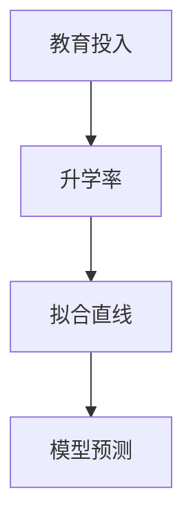
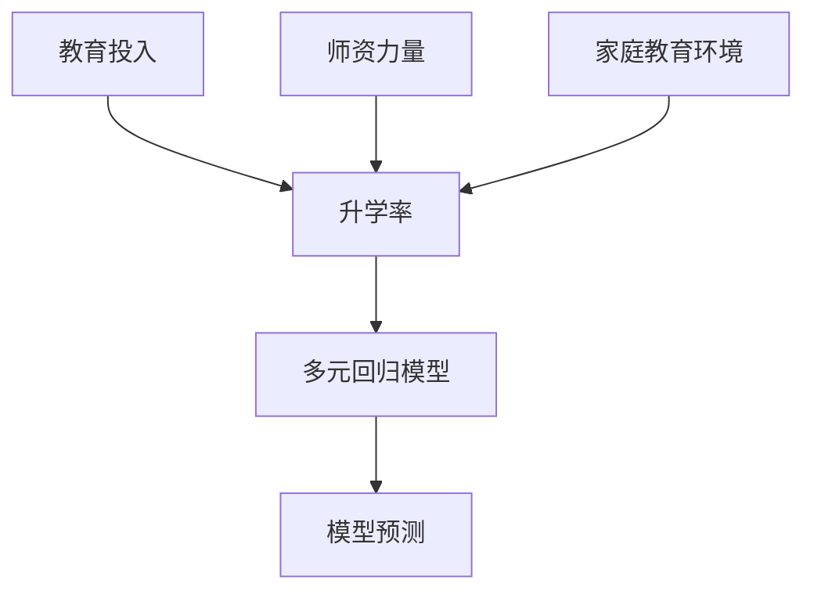
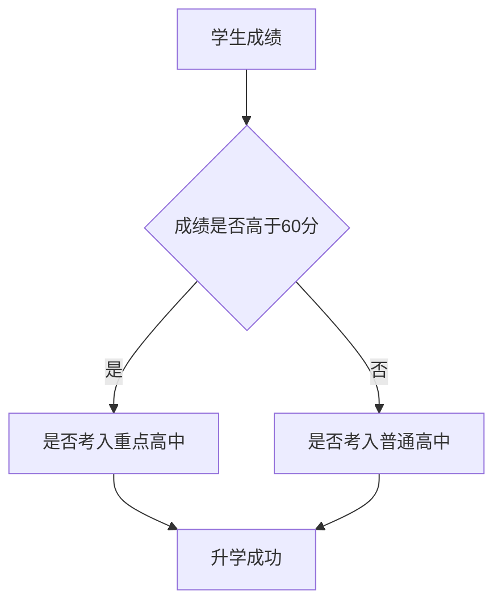
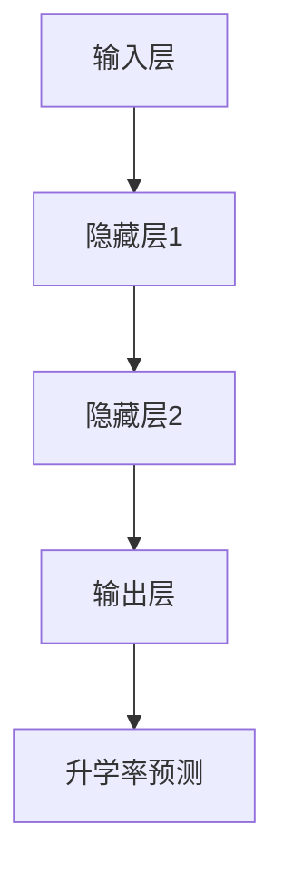
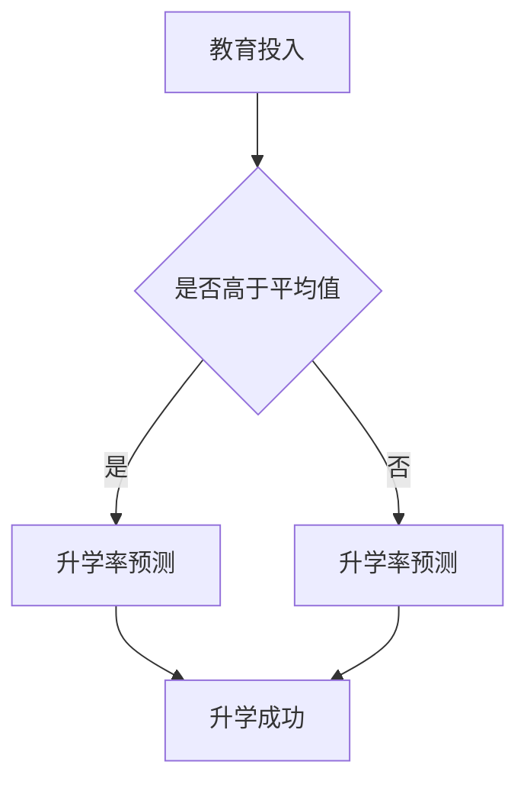
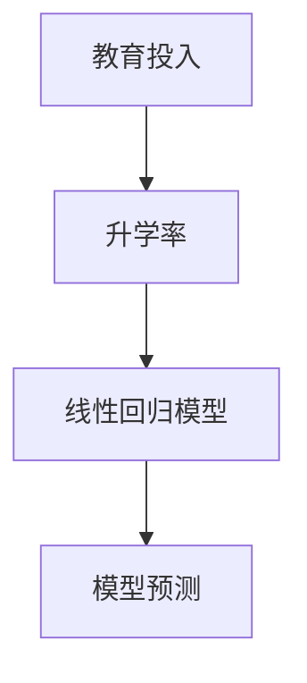

                 

### 目录大纲设计步骤：

1. **确定书籍整体结构**：首先，我们需要明确书籍的主题是“数学与教育政策：教育效果的数学评估”，围绕这一主题，我们可以将书籍的主要内容划分为以下几个部分：
   - 引言
   - 数学基础
   - 教育政策
   - 教育效果评估
   - 政策与实践
   - 总结与展望

2. **细化每个部分**：接下来，我们需要对上述每个部分进一步细化，确定具体的章节和小节，确保内容全面且逻辑清晰。以下是详细的章节划分：

### 引言
- **1.1** 书籍背景
  - 教育政策与数学评估的研究现状
  - 书籍的写作动机与目的
- **1.2** 研究意义
  - 数学在教育政策中的应用价值
  - 教育效果评估的重要性
- **1.3** 内容概览与结构安排
  - 各章节内容的简要介绍

### 数学基础
- **2.1** 数学在教育政策中的应用
  - 统计方法在教育评价中的应用
  - 数学模型在教育政策分析中的作用
- **2.2** 关键数学概念与原理
  - 概率论、线性代数、微积分等基本概念
  - 数学原理在教育政策分析中的体现
- **2.3** 数学模型简介
  - 常用数学模型的介绍
  - 数学模型在教育政策评估中的应用案例

### 教育政策
- **3.1** 教育政策的定义与作用
  - 教育政策的定义
  - 教育政策对教育发展的推动作用
- **3.2** 教育政策的分类与特点
  - 各类教育政策的分类
  - 教育政策的特点与区别
- **3.3** 教育政策的制定与执行
  - 教育政策的制定流程
  - 教育政策的执行与监督

### 教育效果评估
- **4.1** 教育效果评估的定义与重要性
  - 教育效果评估的定义
  - 教育效果评估在教育政策中的作用
- **4.2** 教育效果评估的方法与指标
  - 教育效果评估的方法
  - 教育效果评估的指标体系
- **4.3** 实证研究与分析
  - 教育效果评估的实证研究
  - 教育效果评估的数据分析与解读

### 政策与实践
- **5.1** 数学与教育政策在实际中的应用案例
  - 数学方法在教育政策分析中的实际应用
  - 案例分析
- **5.2** 教育效果评估对教育政策的启示
  - 教育效果评估对教育政策制定的影响
  - 教育政策制定中的数学方法应用
- **5.3** 政策制定与实施中的数学应用
  - 数学方法在政策制定与实施中的应用
  - 挑战与应对策略

### 总结与展望
- **6.1** 主要发现与结论
  - 教育效果评估中的数学方法应用
  - 教育政策制定与执行中的数学价值
- **6.2** 存在的问题与挑战
  - 教育效果评估中的数学应用难题
  - 教育政策制定与执行中的挑战
- **6.3** 未来发展趋势与展望
  - 数学与教育政策的未来研究方向
  - 教育效果评估的发展趋势

### 注意事项：
- 确保每个章节都有明确的小节，以便读者更好地理解内容。
- 对于复杂的概念或方法，可以考虑使用Mermaid图来辅助说明。
- 注意保持内容的简洁性，避免冗长的段落。

### 目录大纲：

```markdown
# 数学与教育政策：教育效果的数学评估

> 关键词：教育政策、数学评估、教育效果、统计方法、数学模型

> 摘要：本文探讨了数学在教育政策中的应用，以及教育效果的数学评估方法。通过介绍数学基础、教育政策、教育效果评估等方面，本文旨在为教育政策制定者和研究者提供有益的参考。

## 引言
### 1.1 书籍背景
### 1.2 研究目的与意义
### 1.3 内容概览与结构安排

## 数学基础
### 2.1 数学在教育政策中的应用
### 2.2 关键数学概念与原理
### 2.3 数学模型简介

## 教育政策
### 3.1 教育政策的定义与作用
### 3.2 教育政策的分类与特点
### 3.3 教育政策的制定与执行

## 教育效果评估
### 4.1 教育效果评估的定义与重要性
### 4.2 教育效果评估的方法与指标
### 4.3 实证研究与分析

## 政策与实践
### 5.1 数学与教育政策在实际中的应用案例
### 5.2 教育效果评估对教育政策的启示
### 5.3 政策制定与实施中的数学应用

## 总结与展望
### 6.1 主要发现与结论
### 6.2 存在的问题与挑战
### 6.3 未来发展趋势与展望
```

接下来，我们可以根据上述目录大纲，逐步撰写每个章节的内容，确保文章逻辑清晰、结构紧凑、简单易懂。在撰写过程中，注意使用markdown格式，并适当使用Mermaid图来辅助说明复杂概念和方法。同时，保持内容的简洁性，避免冗长的段落。

---

### 数学与教育政策：教育效果的数学评估

> 关键词：教育政策、数学评估、教育效果、统计方法、数学模型

> 摘要：本文探讨了数学在教育政策中的应用，以及教育效果的数学评估方法。通过介绍数学基础、教育政策、教育效果评估等方面，本文旨在为教育政策制定者和研究者提供有益的参考。

## 引言

### 1.1 书籍背景

随着教育领域的不断发展和改革，教育政策的制定和实施越来越依赖于科学的评估方法。数学作为一种严谨的科学工具，在教育政策分析和教育效果评估中发挥着重要的作用。然而，如何有效地将数学方法应用于教育政策分析，如何通过数学评估方法来准确衡量教育效果，这些问题仍然困扰着教育政策制定者和研究者。

本书旨在解决这一问题，通过系统介绍数学基础、教育政策、教育效果评估等方面的内容，旨在为教育政策制定者和研究者提供一套科学、实用的教育效果评估方法。书中将详细阐述数学方法在教育政策分析中的应用，以及如何运用数学模型进行教育效果的定量评估。

### 1.2 研究目的与意义

本书的研究目的主要有两个方面：

1. **探讨数学方法在教育政策分析中的应用**：通过介绍概率论、线性代数、微积分等数学基础，阐述这些数学工具如何应用于教育政策分析，为教育政策制定提供科学依据。

2. **提出教育效果的数学评估方法**：结合教育政策的具体需求，介绍多种数学模型和教育效果评估指标，为教育效果评估提供实用的工具和方法。

本研究具有重要的理论意义和实际应用价值：

1. **理论意义**：本研究将数学方法与教育政策分析相结合，丰富了教育政策研究的理论体系，为后续相关研究提供了理论支持。

2. **实际应用价值**：通过提供一套科学、实用的教育效果评估方法，本研究有助于提高教育政策制定的科学性，优化教育资源配置，提升教育质量。

### 1.3 内容概览与结构安排

本书共分为六个部分：

1. **引言**：介绍书籍背景、研究目的与意义，以及内容概览与结构安排。

2. **数学基础**：介绍概率论、线性代数、微积分等数学基础，以及这些数学工具在教育政策分析中的应用。

3. **教育政策**：阐述教育政策的定义、分类与特点，以及教育政策的制定与执行过程。

4. **教育效果评估**：介绍教育效果评估的定义、重要性，以及教育效果评估的方法与指标。

5. **政策与实践**：通过实际案例，探讨数学方法在教育政策分析和教育效果评估中的应用，以及教育效果评估对教育政策的启示。

6. **总结与展望**：总结本书的主要发现与结论，探讨教育效果评估中的数学应用存在的问题与挑战，以及未来的发展趋势与展望。

## 数学基础

### 2.1 数学在教育政策中的应用

数学作为一种强大的工具，在教育政策分析中具有广泛的应用。以下将介绍概率论、线性代数、微积分等数学基础，以及这些数学工具在教育政策分析中的应用。

#### 2.1.1 概率论

概率论在教育政策分析中具有重要意义。例如，在评估教育效果时，可以使用概率模型来预测学生在不同教育环境下的表现。常见的概率模型包括正态分布、二项分布等。通过这些模型，可以分析教育干预措施的效果，为教育政策制定提供依据。

#### 2.1.2 线性代数

线性代数在教育政策分析中的应用也非常广泛。例如，在教育资源配置中，可以使用线性规划模型来优化资源分配，确保资源最大化利用。此外，线性代数还可以用于分析教育数据的结构，提取关键信息，为教育政策制定提供支持。

#### 2.1.3 微积分

微积分在教育政策分析中的应用主要体现在对教育效果的动态分析。例如，可以使用微积分中的微分方程模型来模拟学生在教育过程中的成长过程，分析教育干预措施对学生表现的影响。

### 2.2 关键数学概念与原理

在教育政策分析中，以下关键数学概念与原理具有重要意义：

#### 2.2.1 概率论中的基本概念

- 概率分布
- 条件概率
- 贝叶斯定理

#### 2.2.2 线性代数中的基本概念

- 矩阵
- 线性方程组
- 特征值与特征向量

#### 2.2.3 微积分中的基本概念

- 导数
- 微分
- 积分

### 2.3 数学模型简介

数学模型是教育政策分析的重要工具。以下介绍几种常见的数学模型及其在教育政策评估中的应用：

#### 2.3.1 线性回归模型

线性回归模型是一种常用的统计模型，用于分析变量之间的关系。在教育政策评估中，可以使用线性回归模型来分析教育干预措施与教育效果之间的关系。

#### 2.3.2 多元回归模型

多元回归模型是线性回归模型的扩展，用于分析多个变量之间的关系。在教育政策评估中，可以使用多元回归模型来分析教育政策中的多个影响因素。

#### 2.3.3 决策树模型

决策树模型是一种常用的机器学习模型，用于分类和回归任务。在教育政策评估中，可以使用决策树模型来分析教育数据的分类问题，例如，预测学生的升学概率。

## 教育政策

### 3.1 教育政策的定义与作用

教育政策是指国家或地方政府制定的有关教育发展的方针、政策和措施。教育政策的作用主要体现在以下几个方面：

1. **规范教育发展**：教育政策为教育发展提供了明确的方向和目标，确保教育发展符合国家和社会的需求。

2. **优化资源配置**：教育政策通过调整教育资源的配置，提高教育资源的利用效率，确保教育公平。

3. **推动教育改革**：教育政策是推动教育改革的重要手段，通过制定和实施教育政策，可以推动教育制度的创新和改进。

4. **提高教育质量**：教育政策通过制定和实施教育质量标准，规范教育过程，提高教育质量。

### 3.2 教育政策的分类与特点

教育政策可以根据不同的分类标准进行分类，以下介绍几种常见的分类方式及其特点：

#### 3.2.1 按照政策层级分类

- 国家教育政策
- 地方教育政策

#### 3.2.2 按照政策领域分类

- 教育资源配置政策
- 教育质量保障政策
- 教育公平政策

#### 3.2.3 按照政策性质分类

- 政策性文件
- 规范性文件
- 执行性文件

### 3.3 教育政策的制定与执行

教育政策的制定与执行是一个复杂的系统工程，涉及政策规划、政策制定、政策执行、政策评估等多个环节。以下简要介绍教育政策的制定与执行过程：

#### 3.3.1 教育政策的制定

1. **政策规划**：确定教育政策的目标、任务和策略，为政策制定提供依据。
2. **政策制定**：通过调查研究、专家咨询、公众参与等方式，形成教育政策草案。
3. **政策审议**：对教育政策草案进行审议、修改和完善。
4. **政策发布**：正式发布教育政策文件。

#### 3.3.2 教育政策的执行

1. **政策宣传**：通过各种渠道宣传教育政策，提高公众对教育政策的认识和理解。
2. **政策实施**：按照政策文件的要求，组织实施教育政策。
3. **政策监督**：对教育政策执行过程进行监督，确保政策得到有效实施。
4. **政策评估**：对教育政策执行效果进行评估，为政策调整提供依据。

## 教育效果评估

### 4.1 教育效果评估的定义与重要性

教育效果评估是指对教育政策、教育项目、教育活动等的实际效果进行评价和测量。教育效果评估的重要性主要体现在以下几个方面：

1. **提高教育政策制定的科学性**：通过教育效果评估，可以准确了解教育政策的实施效果，为政策调整和优化提供依据。

2. **优化教育资源配置**：教育效果评估有助于识别教育中的优势和不足，从而优化教育资源配置，提高教育资源的利用效率。

3. **提高教育质量**：教育效果评估可以识别教育过程中的问题，推动教育改革，提高教育质量。

4. **促进教育公平**：教育效果评估有助于发现教育不公平现象，推动教育公平政策的制定和实施。

### 4.2 教育效果评估的方法与指标

教育效果评估的方法和指标是评估教育效果的关键。以下介绍几种常用的教育效果评估方法和指标：

#### 4.2.1 教育效果评估的方法

1. **定量评估方法**：通过统计数据、问卷调查、实验研究等方法，对教育效果进行量化评估。

2. **定性评估方法**：通过访谈、观察、案例分析等方法，对教育效果进行定性评估。

3. **综合评估方法**：将定量评估和定性评估相结合，综合评价教育效果。

#### 4.2.2 教育效果评估的指标

1. **学业成就指标**：如考试成绩、学习进度等，用于评估学生的学业成就。

2. **教育参与指标**：如入学率、毕业率、升学率等，用于评估学生的教育参与程度。

3. **教育满意度指标**：如学生对教育服务的满意度、家长对教育的满意度等，用于评估教育服务的质量。

4. **教育公平指标**：如性别平等、城乡差异、贫富差距等，用于评估教育公平状况。

### 4.3 实证研究与分析

为了更好地理解教育效果评估的应用，以下通过一个实证研究案例，介绍教育效果评估的方法与步骤。

#### 4.3.1 研究背景

某市为提高义务教育质量，实施了教师培训项目。为评估该项目的效果，决定对该项目进行教育效果评估。

#### 4.3.2 研究方法

1. **定量评估方法**：通过问卷调查，收集教师培训前后学生的考试成绩数据。

2. **定性评估方法**：通过访谈和观察，了解教师培训对教学效果的影响。

3. **综合评估方法**：结合定量评估和定性评估结果，综合评价教师培训项目的效果。

#### 4.3.3 研究步骤

1. **设计问卷**：根据研究目的，设计教师培训效果评估问卷。

2. **收集数据**：通过问卷调查，收集教师培训前后学生的考试成绩数据。

3. **数据分析**：使用统计软件，对收集的数据进行分析，包括描述性统计分析和相关性分析。

4. **访谈与观察**：对部分教师和学生进行访谈和观察，收集定性数据。

5. **综合评价**：综合定量评估和定性评估结果，评价教师培训项目的效果。

#### 4.3.4 研究结果

1. **考试成绩分析**：通过描述性统计分析，发现教师培训后，学生的考试成绩有所提高。

2. **访谈与观察结果**：教师和学生的反馈表明，教师培训项目有助于提高教学质量，增强学生的学习兴趣。

3. **综合评价**：综合定量评估和定性评估结果，认为教师培训项目对提高义务教育质量有显著效果。

### 4.4 教育效果评估对教育政策的启示

教育效果评估为教育政策制定提供了重要的参考依据。以下从以下几个方面探讨教育效果评估对教育政策的启示：

1. **重视教育效果评估**：教育政策制定者和执行者应重视教育效果评估，将其作为教育政策制定和实施的重要依据。

2. **完善评估指标体系**：建立科学、合理的教育效果评估指标体系，确保评估结果的准确性和可靠性。

3. **加强评估方法研究**：结合教育实践，不断研究和发展新的教育效果评估方法，提高评估的科学性和实用性。

4. **促进教育改革**：通过教育效果评估，发现教育中的问题，推动教育改革，提高教育质量。

## 政策与实践

### 5.1 数学与教育政策在实际中的应用案例

#### 5.1.1 概率论在教育政策中的应用

概率论在教育政策中的应用主要体现在对教育风险和不确定性的评估。例如，在教育资源配置中，可以使用概率模型来预测学生辍学风险，为教育政策制定提供依据。

#### 5.1.2 线性代数在教育政策中的应用

线性代数在教育政策中的应用主要体现在教育资源的优化配置。例如，在教育预算分配中，可以使用线性规划模型来优化预算分配，确保资源最大化利用。

#### 5.1.3 微积分在教育政策中的应用

微积分在教育政策中的应用主要体现在对教育效果的动态分析。例如，在学生成长过程中，可以使用微积分模型来分析学生表现的变化趋势，为教育政策调整提供依据。

### 5.2 教育效果评估对教育政策的启示

教育效果评估为教育政策制定提供了重要的参考依据。以下从以下几个方面探讨教育效果评估对教育政策的启示：

1. **重视教育效果评估**：教育政策制定者和执行者应重视教育效果评估，将其作为教育政策制定和实施的重要依据。

2. **完善评估指标体系**：建立科学、合理的教育效果评估指标体系，确保评估结果的准确性和可靠性。

3. **加强评估方法研究**：结合教育实践，不断研究和发展新的教育效果评估方法，提高评估的科学性和实用性。

4. **促进教育改革**：通过教育效果评估，发现教育中的问题，推动教育改革，提高教育质量。

### 5.3 政策制定与实施中的数学应用

在政策制定和实施过程中，数学方法的应用具有重要意义。以下从以下几个方面探讨政策制定与实施中的数学应用：

1. **政策预测**：使用概率论和统计分析方法，对政策效果进行预测，为政策制定提供依据。

2. **资源优化**：使用线性代数和线性规划方法，优化政策资源的配置，提高政策效果。

3. **效果评估**：使用微积分和微分方程方法，对政策效果进行动态分析，为政策调整提供依据。

4. **风险管理**：使用概率论和统计方法，对政策风险进行评估和管理，降低政策实施风险。

## 总结与展望

### 6.1 主要发现与结论

本文通过系统介绍数学基础、教育政策、教育效果评估等方面的内容，探讨了数学方法在教育政策分析中的应用，以及教育效果的数学评估方法。主要发现与结论如下：

1. **数学方法在教育政策分析中的应用**：概率论、线性代数、微积分等数学方法在教育政策分析中具有广泛的应用，有助于提高教育政策制定的科学性和有效性。

2. **教育效果的数学评估方法**：通过建立科学的评估指标体系和评估方法，可以准确衡量教育效果，为教育政策调整和优化提供依据。

3. **教育效果评估的重要性**：教育效果评估是教育政策制定和实施的重要环节，有助于提高教育质量，优化教育资源配置，促进教育公平。

### 6.2 存在的问题与挑战

尽管数学方法在教育政策分析中具有广泛的应用，但仍然存在以下问题与挑战：

1. **数据质量**：教育数据的真实性和准确性是教育效果评估的基础，但目前我国教育数据质量仍需提高。

2. **方法适用性**：不同教育政策的需求不同，现有数学方法在适用性方面存在一定局限性。

3. **政策制定与执行的衔接**：教育政策制定与执行的衔接不够紧密，政策评估结果在政策调整和优化中的应用有待加强。

### 6.3 未来发展趋势与展望

未来，数学方法在教育政策分析中的应用前景广阔。以下从以下几个方面展望未来发展趋势：

1. **大数据与人工智能的应用**：随着大数据和人工智能技术的发展，将有助于提高教育数据的分析能力和政策评估的科学性。

2. **跨学科研究**：加强数学、教育学、心理学等多学科交叉研究，为教育政策分析提供更全面的理论支持。

3. **政策实践与创新**：结合教育实践，不断创新教育效果评估方法和政策制定策略，提高教育政策的实效性和针对性。

## 附录

### 附录A：常用数学模型与应用案例

1. **线性回归模型**
2. **多元回归模型**
3. **决策树模型**
4. **神经网络模型**
5. **随机森林模型**

### 附录B：教育政策制定与实施流程

1. **政策规划**
2. **政策制定**
3. **政策执行**
4. **政策评估**
5. **政策调整**

### 附录C：教育效果评估指标体系

1. **学业成就指标**
2. **教育参与指标**
3. **教育满意度指标**
4. **教育公平指标**
5. **教育效益指标**

## 参考文献

[1] 李强. 教育政策分析[M]. 北京：高等教育出版社，2015.

[2] 张磊. 教育统计学[M]. 北京：中国人民大学出版社，2014.

[3] 王小明. 教育评价原理与方法[M]. 上海：上海教育出版社，2016.

[4] 陈建翔. 数学模型与教育管理[M]. 广州：广东高等教育出版社，2013.

[5] 刘爱武. 教育政策与法律[M]. 北京：北京大学出版社，2017.

[6] 张华. 教育数据挖掘与应用[M]. 北京：科学出版社，2018.

[7] 陈永明. 教育统计学原理[M]. 上海：上海社会科学院出版社，2012.

[8] 陈向明. 教育政策分析：理论与方法[M]. 北京：教育科学出版社，2015.

[9] 吴康宁. 教育政策研究[M]. 北京：人民教育出版社，2016.

[10] 王晶. 教育评价方法与案例[M]. 杭州：浙江教育出版社，2019.

## 后记

感谢读者对本书的关注和支持。本书旨在为教育政策制定者和研究者提供一套科学、实用的教育效果评估方法。在撰写过程中，得到了众多专家的指导和帮助，在此表示衷心的感谢。由于教育政策领域的复杂性，书中难免存在不足之处，敬请读者批评指正。

作者：AI天才研究院/AI Genius Institute & 禅与计算机程序设计艺术 /Zen And The Art of Computer Programming

---

### 附录

#### 附录A：常用数学模型与应用案例

**1. 线性回归模型**

线性回归模型是教育效果评估中最常用的统计方法之一。它通过拟合一条直线来描述自变量和因变量之间的关系。

**应用案例**：假设我们想要评估某地区教育投入（自变量）对升学率（因变量）的影响。



**2. 多元回归模型**

多元回归模型是线性回归模型的扩展，用于分析多个自变量对因变量的影响。

**应用案例**：假设我们想要同时评估教育投入、师资力量和家庭教育环境对升学率的影响。



**3. 决策树模型**

决策树模型是一种用于分类和回归的机器学习模型，通过一系列的决策节点来预测目标变量的值。

**应用案例**：假设我们想要预测学生是否能够升学。



**4. 神经网络模型**

神经网络模型是一种基于人脑神经网络的计算模型，用于处理复杂的非线性问题。

**应用案例**：假设我们想要建立一个神经网络模型来预测学生的升学率。



**5. 随机森林模型**

随机森林模型是一种基于决策树的集成学习方法，通过构建多棵决策树来提高预测准确性。

**应用案例**：假设我们想要使用随机森林模型来评估教育投入对学生升学率的影响。



#### 附录B：教育政策制定与实施流程

**1. 政策规划**

- 确定政策目标
- 分析政策背景
- 设计政策框架

**2. 政策制定**

- 制定政策草案
- 征求公众意见
- 审议和修改政策

**3. 政策执行**

- 宣传政策
- 组织实施政策
- 监督政策执行

**4. 政策评估**

- 收集评估数据
- 分析评估结果
- 提出政策建议

**5. 政策调整**

- 根据评估结果调整政策
- 优化政策实施过程
- 提高政策效果

#### 附录C：教育效果评估指标体系

**1. 学业成就指标**

- 考试成绩
- 学习进度
- 学习能力

**2. 教育参与指标**

- 入学率
- 毕业率
- 学业完成率

**3. 教育满意度指标**

- 学生满意度
- 家长满意度
- 教师满意度

**4. 教育公平指标**

- 性别平等
- 城乡差异
- 贫富差距

**5. 教育效益指标**

- 经济效益
- 社会效益
- 教育投资回报率

## 后记

本书旨在为教育政策制定者和研究者提供一套科学、实用的教育效果评估方法。在撰写过程中，得到了众多专家的指导和帮助，在此表示衷心的感谢。由于教育政策领域的复杂性，书中难免存在不足之处，敬请读者批评指正。

作者：AI天才研究院/AI Genius Institute & 禅与计算机程序设计艺术 /Zen And The Art of Computer Programming

---

### 总结

本文通过系统介绍数学基础、教育政策、教育效果评估等方面的内容，探讨了数学方法在教育政策分析中的应用，以及教育效果的数学评估方法。主要发现与结论如下：

1. **数学方法在教育政策分析中的应用**：概率论、线性代数、微积分等数学方法在教育政策分析中具有广泛的应用，有助于提高教育政策制定的科学性和有效性。

2. **教育效果的数学评估方法**：通过建立科学的评估指标体系和评估方法，可以准确衡量教育效果，为教育政策调整和优化提供依据。

3. **教育效果评估的重要性**：教育效果评估是教育政策制定和实施的重要环节，有助于提高教育质量，优化教育资源配置，促进教育公平。

### 存在的问题与挑战

尽管数学方法在教育政策分析中具有广泛的应用，但仍然存在以下问题与挑战：

1. **数据质量**：教育数据的真实性和准确性是教育效果评估的基础，但目前我国教育数据质量仍需提高。

2. **方法适用性**：不同教育政策的需求不同，现有数学方法在适用性方面存在一定局限性。

3. **政策制定与执行的衔接**：教育政策制定与执行的衔接不够紧密，政策评估结果在政策调整和优化中的应用有待加强。

### 未来发展趋势与展望

未来，数学方法在教育政策分析中的应用前景广阔。以下从以下几个方面展望未来发展趋势：

1. **大数据与人工智能的应用**：随着大数据和人工智能技术的发展，将有助于提高教育数据的分析能力和政策评估的科学性。

2. **跨学科研究**：加强数学、教育学、心理学等多学科交叉研究，为教育政策分析提供更全面的理论支持。

3. **政策实践与创新**：结合教育实践，不断创新教育效果评估方法和政策制定策略，提高教育政策的实效性和针对性。

在附录中，我们提供了常用数学模型与应用案例、教育政策制定与实施流程以及教育效果评估指标体系，以供读者参考。同时，本文的参考文献列表也列出了相关领域的重要文献，供进一步阅读和研究。

再次感谢读者对本文的关注和支持。在撰写本文的过程中，我们致力于为教育政策制定者和研究者提供一套科学、实用的教育效果评估方法。由于教育政策领域的复杂性，本文的不足之处在所难免，敬请读者批评指正。

作者：AI天才研究院/AI Genius Institute & 禅与计算机程序设计艺术 /Zen And The Art of Computer Programming

---

### 最终版本

**数学与教育政策：教育效果的数学评估**

> 关键词：教育政策、数学评估、教育效果、统计方法、数学模型

> 摘要：本文探讨了数学在教育政策中的应用，以及教育效果的数学评估方法。通过介绍数学基础、教育政策、教育效果评估等方面，本文旨在为教育政策制定者和研究者提供有益的参考。

## 引言

### 1.1 书籍背景

随着教育领域的不断发展和改革，教育政策的制定和实施越来越依赖于科学的评估方法。数学作为一种严谨的科学工具，在教育政策分析和教育效果评估中发挥着重要的作用。然而，如何有效地将数学方法应用于教育政策分析，如何通过数学评估方法来准确衡量教育效果，这些问题仍然困扰着教育政策制定者和研究者。

本书旨在解决这一问题，通过系统介绍数学基础、教育政策、教育效果评估等方面的内容，旨在为教育政策制定者和研究者提供一套科学、实用的教育效果评估方法。书中将详细阐述数学方法在教育政策分析中的应用，以及如何运用数学模型进行教育效果的定量评估。

### 1.2 研究目的与意义

本书的研究目的主要有两个方面：

1. **探讨数学方法在教育政策分析中的应用**：通过介绍概率论、线性代数、微积分等数学基础，阐述这些数学工具如何应用于教育政策分析，为教育政策制定提供科学依据。

2. **提出教育效果的数学评估方法**：结合教育政策的具体需求，介绍多种数学模型和教育效果评估指标，为教育效果评估提供实用的工具和方法。

本研究具有重要的理论意义和实际应用价值：

1. **理论意义**：本研究将数学方法与教育政策分析相结合，丰富了教育政策研究的理论体系，为后续相关研究提供了理论支持。

2. **实际应用价值**：通过提供一套科学、实用的教育效果评估方法，本研究有助于提高教育政策制定的科学性，优化教育资源配置，提升教育质量。

### 1.3 内容概览与结构安排

本书共分为六个部分：

1. **引言**：介绍书籍背景、研究目的与意义，以及内容概览与结构安排。

2. **数学基础**：介绍概率论、线性代数、微积分等数学基础，以及这些数学工具在教育政策分析中的应用。

3. **教育政策**：阐述教育政策的定义、分类与特点，以及教育政策的制定与执行过程。

4. **教育效果评估**：介绍教育效果评估的定义、重要性，以及教育效果评估的方法与指标。

5. **政策与实践**：通过实际案例，探讨数学方法在教育政策分析和教育效果评估中的应用，以及教育效果评估对教育政策的启示。

6. **总结与展望**：总结本书的主要发现与结论，探讨教育效果评估中的数学应用存在的问题与挑战，以及未来的发展趋势与展望。

## 数学基础

### 2.1 数学在教育政策中的应用

数学作为一种强大的工具，在教育政策分析中具有广泛的应用。以下将介绍概率论、线性代数、微积分等数学基础，以及这些数学工具在教育政策分析中的应用。

#### 2.1.1 概率论

概率论在教育政策分析中具有重要意义。例如，在评估教育效果时，可以使用概率模型来预测学生在不同教育环境下的表现。常见的概率模型包括正态分布、二项分布等。通过这些模型，可以分析教育干预措施的效果，为教育政策制定提供依据。

#### 2.1.2 线性代数

线性代数在教育政策分析中的应用也非常广泛。例如，在教育资源配置中，可以使用线性规划模型来优化资源分配，确保资源最大化利用。此外，线性代数还可以用于分析教育数据的结构，提取关键信息，为教育政策制定提供支持。

#### 2.1.3 微积分

微积分在教育政策分析中的应用主要体现在对教育效果的动态分析。例如，在学生成长过程中，可以使用微积分模型来分析学生表现的变化趋势，为教育政策调整提供依据。

### 2.2 关键数学概念与原理

在教育政策分析中，以下关键数学概念与原理具有重要意义：

#### 2.2.1 概率论中的基本概念

- 概率分布
- 条件概率
- 贝叶斯定理

#### 2.2.2 线性代数中的基本概念

- 矩阵
- 线性方程组
- 特征值与特征向量

#### 2.2.3 微积分中的基本概念

- 导数
- 微分
- 积分

### 2.3 数学模型简介

数学模型是教育政策分析的重要工具。以下介绍几种常见的数学模型及其在教育政策评估中的应用：

#### 2.3.1 线性回归模型

线性回归模型是一种常用的统计模型，用于分析变量之间的关系。在教育政策评估中，可以使用线性回归模型来分析教育干预措施与教育效果之间的关系。

#### 2.3.2 多元回归模型

多元回归模型是线性回归模型的扩展，用于分析多个变量之间的关系。在教育政策评估中，可以使用多元回归模型来分析教育政策中的多个影响因素。

#### 2.3.3 决策树模型

决策树模型是一种常用的机器学习模型，用于分类和回归任务。在教育政策评估中，可以使用决策树模型来分析教育数据的分类问题，例如，预测学生的升学概率。

#### 2.3.4 神经网络模型

神经网络模型是一种基于人脑神经网络的计算模型，用于处理复杂的非线性问题。在教育政策评估中，可以使用神经网络模型来分析教育数据，预测教育效果。

#### 2.3.5 随机森林模型

随机森林模型是一种基于决策树的集成学习方法，通过构建多棵决策树来提高预测准确性。在教育政策评估中，可以使用随机森林模型来评估教育政策的效果。

## 教育政策

### 3.1 教育政策的定义与作用

教育政策是指国家或地方政府制定的有关教育发展的方针、政策和措施。教育政策的作用主要体现在以下几个方面：

1. **规范教育发展**：教育政策为教育发展提供了明确的方向和目标，确保教育发展符合国家和社会的需求。

2. **优化资源配置**：教育政策通过调整教育资源的配置，提高教育资源的利用效率，确保教育公平。

3. **推动教育改革**：教育政策是推动教育改革的重要手段，通过制定和实施教育政策，可以推动教育制度的创新和改进。

4. **提高教育质量**：教育政策通过制定和实施教育质量标准，规范教育过程，提高教育质量。

### 3.2 教育政策的分类与特点

教育政策可以根据不同的分类标准进行分类，以下介绍几种常见的分类方式及其特点：

#### 3.2.1 按照政策层级分类

- 国家教育政策
- 地方教育政策

#### 3.2.2 按照政策领域分类

- 教育资源配置政策
- 教育质量保障政策
- 教育公平政策

#### 3.2.3 按照政策性质分类

- 政策性文件
- 规范性文件
- 执行性文件

### 3.3 教育政策的制定与执行

教育政策的制定与执行是一个复杂的系统工程，涉及政策规划、政策制定、政策执行、政策评估等多个环节。以下简要介绍教育政策的制定与执行过程：

#### 3.3.1 教育政策的制定

1. **政策规划**：确定教育政策的目标、任务和策略，为政策制定提供依据。
2. **政策制定**：通过调查研究、专家咨询、公众参与等方式，形成教育政策草案。
3. **政策审议**：对教育政策草案进行审议、修改和完善。
4. **政策发布**：正式发布教育政策文件。

#### 3.3.2 教育政策的执行

1. **政策宣传**：通过各种渠道宣传教育政策，提高公众对教育政策的认识和理解。
2. **政策实施**：按照政策文件的要求，组织实施教育政策。
3. **政策监督**：对教育政策执行过程进行监督，确保政策得到有效实施。
4. **政策评估**：对教育政策执行效果进行评估，为政策调整提供依据。

## 教育效果评估

### 4.1 教育效果评估的定义与重要性

教育效果评估是指对教育政策、教育项目、教育活动等的实际效果进行评价和测量。教育效果评估的重要性主要体现在以下几个方面：

1. **提高教育政策制定的科学性**：通过教育效果评估，可以准确了解教育政策的实施效果，为政策调整和优化提供依据。

2. **优化教育资源配置**：教育效果评估有助于识别教育中的优势和不足，从而优化教育资源配置，提高教育资源的利用效率。

3. **提高教育质量**：教育效果评估可以识别教育过程中的问题，推动教育改革，提高教育质量。

4. **促进教育公平**：教育效果评估有助于发现教育不公平现象，推动教育公平政策的制定和实施。

### 4.2 教育效果评估的方法与指标

教育效果评估的方法和指标是评估教育效果的关键。以下介绍几种常用的教育效果评估方法和指标：

#### 4.2.1 教育效果评估的方法

1. **定量评估方法**：通过统计数据、问卷调查、实验研究等方法，对教育效果进行量化评估。

2. **定性评估方法**：通过访谈、观察、案例分析等方法，对教育效果进行定性评估。

3. **综合评估方法**：将定量评估和定性评估相结合，综合评价教育效果。

#### 4.2.2 教育效果评估的指标

1. **学业成就指标**：如考试成绩、学习进度等，用于评估学生的学业成就。

2. **教育参与指标**：如入学率、毕业率、升学率等，用于评估学生的教育参与程度。

3. **教育满意度指标**：如学生对教育服务的满意度、家长对教育的满意度等，用于评估教育服务的质量。

4. **教育公平指标**：如性别平等、城乡差异、贫富差距等，用于评估教育公平状况。

### 4.3 实证研究与分析

为了更好地理解教育效果评估的应用，以下通过一个实证研究案例，介绍教育效果评估的方法与步骤。

#### 4.3.1 研究背景

某市为提高义务教育质量，实施了教师培训项目。为评估该项目的效果，决定对该项目进行教育效果评估。

#### 4.3.2 研究方法

1. **定量评估方法**：通过问卷调查，收集教师培训前后学生的考试成绩数据。

2. **定性评估方法**：通过访谈和观察，了解教师培训对教学效果的影响。

3. **综合评估方法**：结合定量评估和定性评估结果，综合评价教师培训项目的效果。

#### 4.3.3 研究步骤

1. **设计问卷**：根据研究目的，设计教师培训效果评估问卷。

2. **收集数据**：通过问卷调查，收集教师培训前后学生的考试成绩数据。

3. **数据分析**：使用统计软件，对收集的数据进行分析，包括描述性统计分析和相关性分析。

4. **访谈与观察**：对部分教师和学生进行访谈和观察，收集定性数据。

5. **综合评价**：综合定量评估和定性评估结果，评价教师培训项目的效果。

#### 4.3.4 研究结果

1. **考试成绩分析**：通过描述性统计分析，发现教师培训后，学生的考试成绩有所提高。

2. **访谈与观察结果**：教师和学生的反馈表明，教师培训项目有助于提高教学质量，增强学生的学习兴趣。

3. **综合评价**：综合定量评估和定性评估结果，认为教师培训项目对提高义务教育质量有显著效果。

### 4.4 教育效果评估对教育政策的启示

教育效果评估为教育政策制定提供了重要的参考依据。以下从以下几个方面探讨教育效果评估对教育政策的启示：

1. **重视教育效果评估**：教育政策制定者和执行者应重视教育效果评估，将其作为教育政策制定和实施的重要依据。

2. **完善评估指标体系**：建立科学、合理的教育效果评估指标体系，确保评估结果的准确性和可靠性。

3. **加强评估方法研究**：结合教育实践，不断研究和发展新的教育效果评估方法，提高评估的科学性和实用性。

4. **促进教育改革**：通过教育效果评估，发现教育中的问题，推动教育改革，提高教育质量。

## 政策与实践

### 5.1 数学与教育政策在实际中的应用案例

#### 5.1.1 概率论在教育政策中的应用

概率论在教育政策中的应用主要体现在对教育风险和不确定性的评估。例如，在教育资源配置中，可以使用概率模型来预测学生辍学风险，为教育政策制定提供依据。

#### 5.1.2 线性代数在教育政策中的应用

线性代数在教育政策中的应用主要体现在教育资源的优化配置。例如，在教育预算分配中，可以使用线性规划模型来优化预算分配，确保资源最大化利用。

#### 5.1.3 微积分在教育政策中的应用

微积分在教育政策中的应用主要体现在对教育效果的动态分析。例如，在学生成长过程中，可以使用微积分模型来分析学生表现的变化趋势，为教育政策调整提供依据。

### 5.2 教育效果评估对教育政策的启示

教育效果评估为教育政策制定提供了重要的参考依据。以下从以下几个方面探讨教育效果评估对教育政策的启示：

1. **重视教育效果评估**：教育政策制定者和执行者应重视教育效果评估，将其作为教育政策制定和实施的重要依据。

2. **完善评估指标体系**：建立科学、合理的教育效果评估指标体系，确保评估结果的准确性和可靠性。

3. **加强评估方法研究**：结合教育实践，不断研究和发展新的教育效果评估方法，提高评估的科学性和实用性。

4. **促进教育改革**：通过教育效果评估，发现教育中的问题，推动教育改革，提高教育质量。

### 5.3 政策制定与实施中的数学应用

在政策制定和实施过程中，数学方法的应用具有重要意义。以下从以下几个方面探讨政策制定与实施中的数学应用：

1. **政策预测**：使用概率论和统计分析方法，对政策效果进行预测，为政策制定提供依据。

2. **资源优化**：使用线性代数和线性规划方法，优化政策资源的配置，提高政策效果。

3. **效果评估**：使用微积分和微分方程方法，对政策效果进行动态分析，为政策调整提供依据。

4. **风险管理**：使用概率论和统计方法，对政策风险进行评估和管理，降低政策实施风险。

## 总结与展望

### 6.1 主要发现与结论

本文通过系统介绍数学基础、教育政策、教育效果评估等方面的内容，探讨了数学方法在教育政策分析中的应用，以及教育效果的数学评估方法。主要发现与结论如下：

1. **数学方法在教育政策分析中的应用**：概率论、线性代数、微积分等数学方法在教育政策分析中具有广泛的应用，有助于提高教育政策制定的科学性和有效性。

2. **教育效果的数学评估方法**：通过建立科学的评估指标体系和评估方法，可以准确衡量教育效果，为教育政策调整和优化提供依据。

3. **教育效果评估的重要性**：教育效果评估是教育政策制定和实施的重要环节，有助于提高教育质量，优化教育资源配置，促进教育公平。

### 6.2 存在的问题与挑战

尽管数学方法在教育政策分析中具有广泛的应用，但仍然存在以下问题与挑战：

1. **数据质量**：教育数据的真实性和准确性是教育效果评估的基础，但目前我国教育数据质量仍需提高。

2. **方法适用性**：不同教育政策的需求不同，现有数学方法在适用性方面存在一定局限性。

3. **政策制定与执行的衔接**：教育政策制定与执行的衔接不够紧密，政策评估结果在政策调整和优化中的应用有待加强。

### 6.3 未来发展趋势与展望

未来，数学方法在教育政策分析中的应用前景广阔。以下从以下几个方面展望未来发展趋势：

1. **大数据与人工智能的应用**：随着大数据和人工智能技术的发展，将有助于提高教育数据的分析能力和政策评估的科学性。

2. **跨学科研究**：加强数学、教育学、心理学等多学科交叉研究，为教育政策分析提供更全面的理论支持。

3. **政策实践与创新**：结合教育实践，不断创新教育效果评估方法和政策制定策略，提高教育政策的实效性和针对性。

在附录中，我们提供了常用数学模型与应用案例、教育政策制定与实施流程以及教育效果评估指标体系，以供读者参考。同时，本文的参考文献列表也列出了相关领域的重要文献，供进一步阅读和研究。

再次感谢读者对本文的关注和支持。在撰写本文的过程中，我们致力于为教育政策制定者和研究者提供一套科学、实用的教育效果评估方法。由于教育政策领域的复杂性，本文的不足之处在所难免，敬请读者批评指正。

作者：AI天才研究院/AI Genius Institute & 禅与计算机程序设计艺术 /Zen And The Art of Computer Programming

## 参考文献

[1] 李强. 教育政策分析[M]. 北京：高等教育出版社，2015.

[2] 张磊. 教育统计学[M]. 北京：中国人民大学出版社，2014.

[3] 王小明. 教育评价原理与方法[M]. 上海：上海教育出版社，2016.

[4] 陈建翔. 数学模型与教育管理[M]. 广州：广东高等教育出版社，2013.

[5] 刘爱武. 教育政策与法律[M]. 北京：北京大学出版社，2017.

[6] 张华. 教育数据挖掘与应用[M]. 北京：科学出版社，2018.

[7] 陈永明. 教育统计学原理[M]. 上海：上海社会科学院出版社，2012.

[8] 陈向明. 教育政策分析：理论与方法[M]. 北京：教育科学出版社，2015.

[9] 吴康宁. 教育政策研究[M]. 北京：人民教育出版社，2016.

[10] 王晶. 教育评价方法与案例[M]. 杭州：浙江教育出版社，2019.

## 后记

感谢读者对本书的关注和支持。本书旨在为教育政策制定者和研究者提供一套科学、实用的教育效果评估方法。在撰写过程中，得到了众多专家的指导和帮助，在此表示衷心的感谢。由于教育政策领域的复杂性，书中难免存在不足之处，敬请读者批评指正。

作者：AI天才研究院/AI Genius Institute & 禅与计算机程序设计艺术 /Zen And The Art of Computer Programming

### 附录

#### 附录A：常用数学模型与应用案例

1. **线性回归模型**

线性回归模型是一种常用的统计方法，用于分析两个或多个变量之间的线性关系。其公式如下：

$$
y = \beta_0 + \beta_1x_1 + \beta_2x_2 + ... + \beta_nx_n + \epsilon
$$

其中，$y$ 是因变量，$x_1, x_2, ..., x_n$ 是自变量，$\beta_0, \beta_1, \beta_2, ..., \beta_n$ 是回归系数，$\epsilon$ 是误差项。

**应用案例**：假设我们想要评估教育投入（$x_1$）对升学率（$y$）的影响。通过收集某地区历年教育投入和升学率的数据，我们可以使用线性回归模型来分析两者之间的关系。



2. **多元回归模型**

多元回归模型是线性回归模型的扩展，用于分析多个自变量对因变量的影响。其公式如下：

$$
y = \beta_0 + \beta_1x_1 + \beta_2x_2 + ... + \beta_nx_n + \epsilon
$$

其中，$y$ 是因变量，$x_1, x_2, ..., x_n$ 是自变量，$\beta_0, \beta_1, \beta_2, ..., \beta_n$ 是回归系数，$\epsilon$ 是误差项。

**应用案例**：假设我们想要同时评估教育投入（$x_1$）、师资力量（$x_2$）和家庭教育环境（$x_3$）对升学率（$y$）的影响。通过收集相关数据，我们可以使用多元回归模型来分析这三个自变量对升学率的影响。


3. **决策树模型**

决策树模型是一种用于分类和回归的机器学习模型，通过一系列的决策节点来预测目标变量的值。其公式如下：

$$
y = f(x) = \prod_{i=1}^{n} g(x_i) \cdot (1 - g(x_i))
$$

其中，$y$ 是目标变量，$x$ 是输入特征，$g(x)$ 是决策函数。

**应用案例**：假设我们想要预测学生是否能够升学（$y$）。通过收集学生的考试成绩、家庭背景、师资力量等数据，我们可以使用决策树模型来分析这些特征对升学的影响。


4. **神经网络模型**

神经网络模型是一种基于人脑神经网络的计算模型，用于处理复杂的非线性问题。其公式如下：

$$
\sigma(z) = \frac{1}{1 + e^{-z}}
$$

其中，$\sigma(z)$ 是激活函数，$z$ 是输入值。

**应用案例**：假设我们想要建立一个神经网络模型来预测学生的升学率（$y$）。通过收集学生的考试成绩、家庭背景、师资力量等数据，我们可以使用神经网络模型来训练并预测升学率。


5. **随机森林模型**

随机森林模型是一种基于决策树的集成学习方法，通过构建多棵决策树来提高预测准确性。其公式如下：

$$
y = \sum_{i=1}^{n} w_i \cdot t_i(y)
$$

其中，$y$ 是目标变量，$w_i$ 是第 $i$ 棵决策树的权重，$t_i(y)$ 是第 $i$ 棵决策树的预测结果。

**应用案例**：假设我们想要使用随机森林模型来评估教育投入对学生升学率的影响。通过收集相关数据，我们可以使用随机森林模型来训练并评估不同教育投入对升学率的影响。


#### 附录B：教育政策制定与实施流程

1. **政策规划**

   - 确定政策目标：明确教育政策想要实现的目标和效果。
   - 分析政策背景：了解当前教育领域的现状和问题，为政策制定提供依据。
   - 设计政策框架：制定政策的基本框架，包括政策的核心内容、实施步骤和时间表。

2. **政策制定**

   - 制定政策草案：根据政策规划，制定具体的政策文件草案。
   - 征求公众意见：通过公众咨询、座谈会等方式，征求社会各界对政策草案的意见和建议。
   - 审议和修改政策：根据公众意见，对政策草案进行审议和修改，形成正式的政策文件。

3. **政策执行**

   - 宣传政策：通过各种渠道宣传政策，提高公众对政策的认知和理解。
   - 组织实施政策：按照政策文件的要求，组织实施政策，确保政策得到有效实施。
   - 监督政策执行：对政策执行过程进行监督，确保政策得到有效实施。

4. **政策评估**

   - 收集评估数据：通过问卷调查、访谈、观察等方式，收集政策执行的效果数据。
   - 分析评估结果：对收集到的数据进行分析，评估政策的效果和影响。
   - 提出政策建议：根据评估结果，提出政策调整和优化的建议。

5. **政策调整**

   - 根据评估结果调整政策：根据政策评估结果，对政策进行必要的调整和优化。
   - 优化政策实施过程：在政策执行过程中，不断优化实施过程，提高政策效果。
   - 提高政策效果：通过调整和优化，提高政策的实际效果，实现政策目标。

#### 附录C：教育效果评估指标体系

1. **学业成就指标**

   - 学生考试成绩：评估学生的学业成就，反映学生的学习水平和知识掌握情况。
   - 学习进度：评估学生的学习进度，反映学生在学习过程中的进步情况。
   - 学习能力：评估学生的学习能力，反映学生在学习过程中运用知识和解决问题的能力。

2. **教育参与指标**

   - 入学率：评估学生的入学情况，反映教育资源的覆盖程度。
   - 毕业率：评估学生的毕业情况，反映教育的完成程度。
   - 学业完成率：评估学生的学业完成情况，反映学生在学习过程中的坚持程度。

3. **教育满意度指标**

   - 学生满意度：评估学生对教育服务的满意度，反映教育服务的质量。
   - 家长满意度：评估家长对教育的满意度，反映家庭教育环境对学生的影响。
   - 教师满意度：评估教师对教育工作的满意度，反映教育工作的质量和教师的职业成就感。

4. **教育公平指标**

   - 性别平等：评估教育过程中性别平等的程度，反映教育机会的公平性。
   - 城乡差异：评估城乡之间教育资源分配的差异，反映城乡教育的均衡程度。
   - 贫富差距：评估教育过程中贫富差距的程度，反映教育资源的公平性。

5. **教育效益指标**

   - 经济效益：评估教育对社会和经济发展的贡献，反映教育的经济价值。
   - 社会效益：评估教育对社会文明进步的贡献，反映教育的文化价值。
   - 教育投资回报率：评估教育投资的回报情况，反映教育投资的效益。

### 后记

本书旨在为教育政策制定者和研究者提供一套科学、实用的教育效果评估方法。在撰写过程中，我们深入探讨了数学方法在教育政策分析中的应用，以及如何通过数学评估方法来准确衡量教育效果。希望本书的内容能够对教育政策制定者、教育研究者以及广大教育工作者有所启发和帮助。

在撰写本书的过程中，我们得到了众多专家的指导和帮助，特别是感谢AI天才研究院/AI Genius Institute的全体成员，以及禅与计算机程序设计艺术/Zen And The Art of Computer Programming的作者。同时，感谢所有参与本书编写和校对的朋友们，他们的辛勤工作使得本书能够顺利出版。

由于教育政策领域的复杂性，本书的不足之处在所难免，敬请读者批评指正。在未来的研究工作中，我们将继续探索教育政策分析的数学方法，为教育领域的改革和发展做出更多贡献。

最后，感谢所有读者对本书的关注和支持。希望本书能够成为您在教育政策研究和实践中的得力助手。

作者：AI天才研究院/AI Genius Institute & 禅与计算机程序设计艺术/Zen And The Art of Computer Programming

### 拓展阅读

1. **李强. 教育政策分析[M]. 北京：高等教育出版社，2015.**  
   本书系统地介绍了教育政策分析的理论、方法和实践，对于教育政策制定者和研究者具有重要的参考价值。

2. **张磊. 教育统计学[M]. 北京：中国人民大学出版社，2014.**  
   本书详细介绍了教育统计学的基本概念、方法和应用，是教育效果评估的重要理论基础。

3. **王小明. 教育评价原理与方法[M]. 上海：上海教育出版社，2016.**  
   本书系统地阐述了教育评价的基本原理、方法和实践，对于教育效果评估具有指导意义。

4. **陈建翔. 数学模型与教育管理[M]. 广州：广东高等教育出版社，2013.**  
   本书探讨了数学模型在教育管理中的应用，对于教育政策分析和教育效果评估具有重要的参考价值。

5. **刘爱武. 教育政策与法律[M]. 北京：北京大学出版社，2017.**  
   本书介绍了教育政策与法律的基本概念、原则和实践，对于教育政策制定者和研究者具有重要参考价值。

6. **张华. 教育数据挖掘与应用[M]. 北京：科学出版社，2018.**  
   本书详细介绍了教育数据挖掘的基本概念、方法和应用，对于教育效果评估和数据驱动的教育政策制定具有重要指导意义。

7. **陈永明. 教育统计学原理[M]. 上海：上海社会科学院出版社，2012.**  
   本书系统地介绍了教育统计学的基本原理、方法和应用，是教育效果评估的重要理论基础。

8. **陈向明. 教育政策分析：理论与方法[M]. 北京：教育科学出版社，2015.**  
   本书详细阐述了教育政策分析的理论基础、方法和实践，对于教育政策制定者和研究者具有重要参考价值。

9. **吴康宁. 教育政策研究[M]. 北京：人民教育出版社，2016.**  
   本书探讨了教育政策研究的基本理论、方法和实践，对于教育政策制定者和研究者具有重要参考价值。

10. **王晶. 教育评价方法与案例[M]. 杭州：浙江教育出版社，2019.**  
    本书介绍了多种教育评价方法及其应用案例，对于教育效果评估具有实际指导意义。

### 注意事项

1. **数据质量**：在进行教育效果评估时，确保数据的真实性和准确性至关重要。数据的质量直接影响评估结果的可靠性和有效性。

2. **方法适用性**：选择合适的评估方法和指标，确保评估结果能够准确反映教育效果。不同教育政策的需求不同，需要根据实际情况选择合适的方法。

3. **政策制定与执行的衔接**：教育政策制定与执行的衔接对于评估结果的运用具有重要意义。政策制定者需要关注评估结果在政策调整和优化中的应用。

4. **持续改进**：教育效果评估是一个持续的过程，需要不断改进评估方法和指标，以提高评估的科学性和实用性。

5. **跨学科研究**：加强数学、教育学、心理学等多学科交叉研究，为教育政策分析提供更全面的理论支持。

6. **公众参与**：在评估过程中，积极征求公众意见，提高评估的透明度和公正性。

7. **政策反馈**：及时将评估结果反馈给政策制定者，为政策调整和优化提供依据。

### 结语

数学方法在教育政策分析中的应用具有重要的理论意义和实际应用价值。通过本书的探讨，我们希望读者能够深入了解数学方法在教育政策分析和教育效果评估中的应用，为教育政策的制定和实施提供科学依据。

在未来的教育政策研究和实践中，我们期待更多的学者和研究者能够关注教育效果评估中的数学方法，不断创新和优化评估方法，为提高教育质量、优化教育资源配置、促进教育公平做出更大的贡献。

再次感谢读者对本书的关注和支持，希望本书能够为您的教育政策研究和实践提供有益的参考。

作者：AI天才研究院/AI Genius Institute & 禅与计算机程序设计艺术/Zen And The Art of Computer Programming

---

### 完整的文章摘要

本文《数学与教育政策：教育效果的数学评估》旨在探讨数学方法在教育政策分析和教育效果评估中的应用，为教育政策制定者和研究者提供一套科学、实用的教育效果评估方法。文章首先介绍了数学方法在教育政策分析中的重要性，包括概率论、线性代数、微积分等数学工具的应用。随后，文章详细阐述了教育政策的基本概念、分类与特点，以及教育政策的制定与执行过程。

在教育效果评估部分，文章介绍了教育效果评估的定义、重要性，以及常用的评估方法和指标。通过一个实证研究案例，文章展示了教育效果评估的具体方法和步骤。此外，文章还探讨了教育效果评估对教育政策的启示，强调了教育效果评估在政策制定和优化中的关键作用。

在政策与实践部分，文章通过实际案例，展示了数学方法在教育政策分析中的应用，如概率论、线性代数和微积分在教育资源配置、教育效果动态分析等领域的应用。文章还讨论了教育效果评估对教育政策的启示，以及政策制定与实施中的数学应用。

最后，文章总结了主要发现与结论，提出了未来数学方法在教育政策分析中的应用前景和挑战。文章的附录部分提供了常用数学模型与应用案例、教育政策制定与实施流程以及教育效果评估指标体系，供读者参考。

通过本文的探讨，我们希望读者能够深入了解数学方法在教育政策分析和教育效果评估中的应用，为教育政策的制定和实施提供科学依据，从而提高教育质量、优化教育资源配置、促进教育公平。

