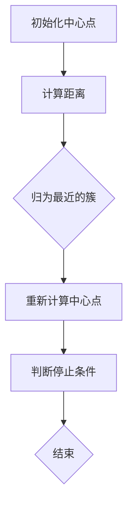
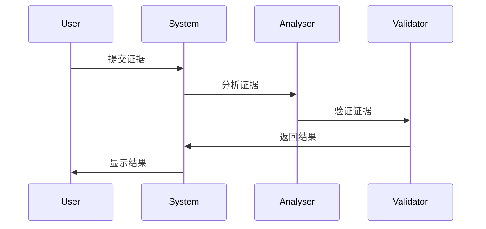
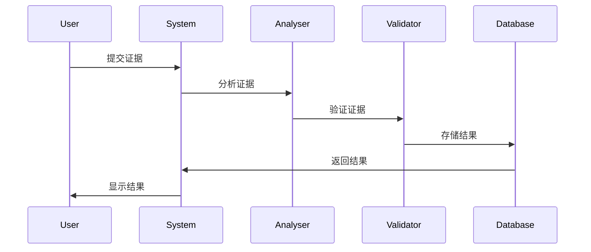

                 

## 数学与数字取证：电子证据的数学分析

关键词：数学分析、数字取证、电子证据、算法、模型

摘要：随着数字化时代的到来，电子证据在司法领域扮演着越来越重要的角色。然而，如何有效地分析和利用这些电子证据成为了一个难题。本文将探讨数学分析在数字取证中的应用，包括核心概念、算法原理、数学模型以及实际案例分析，旨在为读者提供一套系统的数学分析方法，以提高数字取证工作的效率和准确性。

## Step 1: 背景介绍

### 问题背景

在数字取证领域，随着互联网和电子设备的普及，电子证据的数量和种类急剧增加。传统的手动方法已经无法满足日益增长的需求。数学与数字取证的结合，通过数学方法对电子证据进行定量分析，成为了一个重要的发展方向。

### 问题描述

数字取证过程中，如何利用数学方法有效地分析电子证据，提取关键信息，为案件侦破提供有力支持？这涉及到数学模型、算法、数据分析和证据验证等多个方面。

### 问题解决

《数学与数字取证：电子证据的数学分析》一书旨在通过系统的数学分析方法，提高数字取证工作的效率和准确性。本书将系统地介绍数学分析在数字取证中的应用，包括核心概念、算法原理和实际案例分析。

### 边界与外延

本书主要讨论数字取证中的数学分析方法，包括但不限于数据分析、算法应用、证据验证和可视化等方面。同时，也会涉及一些相关领域的基础知识，如密码学、统计学和计算机科学等。

### 概念结构与核心要素组成

- 数学分析方法：本书的核心内容，包括数学模型建立、算法设计、数据可视化等。
- 数字取证：应用数学分析方法的具体领域，涉及电子证据的收集、分析和验证。
- 电子证据：数字取证的核心对象，包括各种形式的电子数据，如文档、图片、音频和视频等。

## Step 2: 核心概念与联系

### 数学分析基本概念

#### 1.1.1 微积分

##### 微分的概念与计算方法
$$f'(x) = \lim_{{h \to 0}} \frac{{f(x+h) - f(x)}}{h}$$

##### 积分的概念与计算方法
$$\int f(x) \, dx = F(x) + C$$
其中，$F(x)$是$f(x)$的一个原函数，$C$是积分常数。

#### 1.1.2 线性代数

##### 向量的概念与运算
$$\vec{a} + \vec{b} = \vec{c}$$

##### 矩阵的概念与运算
$$A \cdot B = C$$
其中，$A$和$B$是矩阵，$C$是它们的乘积。

### 概念属性特征对比表格

| 概念 | 定义 | 应用 |
| --- | --- | --- |
| 微分 | 确定函数在某一点的变化率 | 曲线拟合、误差分析 |
| 积分 | 确定函数在区间上的累积量 | 面积计算、体积计算 |
| 矩阵 | 数的有序集合 | 线性方程组求解、数据建模 |
| 向量 | 具有大小和方向的量 | 物理运动描述、数据分析 |

### ER实体关系图架构

```mermaid
erDiagram
    A[用户] {
        --|{B[文档]}
    }
    B[文档] {
        --|{C[证据]}
    }
    A[用户] --- C[证据] : 提交
```

## Step 3: 算法原理讲解

### 数据分析算法

#### 1.2.1 主成分分析（PCA）

##### PCA原理

主成分分析（PCA）是一种统计方法，用于降低数据维度。它的核心思想是通过正交变换将一组可能相关的变量转换为一组线性不相关的变量，即主成分。
$$X' = P\Lambda$$
其中，$X'$是变换后的数据，$P$是投影矩阵，$\Lambda$是对角矩阵，包含主成分的方差。

##### PCA应用

- 数据降维
- 特征提取
- 异常检测

#### 1.2.2 聚类算法

##### K-均值算法

K-均值算法是一种基于距离的聚类方法。它的目标是将数据点划分为K个簇，使得每个簇内的数据点之间的距离最小。

##### K-均值算法步骤

1. 随机初始化中心点。
2. 对于每个数据点，计算它与各个中心点的距离，并将其归为距离最近的中心点所在的簇。
3. 重新计算每个簇的中心点。
4. 重复步骤2和3，直到满足停止条件（如中心点变化很小）。

## Mermaid算法流程图



## Step 4: 数学模型和数学公式讲解

### 算法中的数学模型

#### 1.3.1 支持向量机（SVM）

##### SVM的数学模型

支持向量机是一种用于分类和回归分析的机器学习算法。其核心思想是找到最优超平面，使得分类间隔最大化。
$$ \max_{\boldsymbol{w}, b} \frac{1}{2} \|\boldsymbol{w}\|^2 $$

##### 约束条件

$$ \boldsymbol{w} \cdot \boldsymbol{x}_i - b \geq 1, \forall i $$

##### 对偶问题

$$ \min_{\alpha} \sum_{i=1}^{n} \alpha_i - \frac{1}{2} \sum_{i,j=1}^{n} \alpha_i \alpha_j y_i y_j $$

##### KKT条件

$$ \alpha_i \geq 0, \forall i $$
$$ y_i (\boldsymbol{w} \cdot \boldsymbol{x}_i - b) - 1 = 0 $$
$$ \alpha_i (\alpha_j y_i y_j) = 0, \forall i \neq j $$

## Step 5: 系统分析与架构设计

### 问题场景介绍

随着互联网的快速发展，数字犯罪日益增多，电子证据在司法实践中具有重要意义。如何高效地分析和利用这些证据，成为司法工作者面临的挑战。

### 项目介绍

本项目旨在构建一个基于数学分析的数字取证平台，通过先进的数学算法和模型，实现对电子证据的自动化分析和验证，提高案件侦破的效率和准确性。

### 系统功能设计

#### 领域模型

```mermaid
classDiagram
    User <|-- Document
    Document <|-- Evidence
    Evidence <<Entity>>
    User <<Entity>>
    Document <<Entity>>
```

#### 系统架构设计



### 系统接口设计

```mermaid
componentDiagram
    Analyser -> System: 分析请求
    System -> Database: 证据存储
    Validator -> Database: 证据验证
```

### 系统交互



## Step 6: 项目实战

### 环境安装

1. 安装Python环境：`pip install python`
2. 安装数据分析库：`pip install pandas numpy matplotlib scikit-learn`

### 系统核心实现源代码

```python
import pandas as pd
from sklearn.decomposition import PCA
from sklearn.cluster import KMeans

# 数据加载
data = pd.read_csv('data.csv')

# 主成分分析
pca = PCA(n_components=2)
data_pca = pca.fit_transform(data)

# K-均值聚类
kmeans = KMeans(n_clusters=3)
clusters = kmeans.fit_predict(data_pca)

# 结果可视化
import matplotlib.pyplot as plt

plt.scatter(data_pca[:, 0], data_pca[:, 1], c=clusters)
plt.xlabel('Principal Component 1')
plt.ylabel('Principal Component 2')
plt.title('PCA and K-Means Clustering')
plt.show()
```

### 代码应用解读与分析

```python
# 代码解读
# 1. 导入必要的库
# 2. 加载数据
# 3. 使用PCA进行数据降维
# 4. 使用K-均值算法进行聚类
# 5. 可视化结果
```

### 实际案例分析和详细讲解剖析

```python
# 案例分析
# 假设我们有一组电子邮件数据，需要分析其中的潜在群组
# 1. 加载数据
email_data = pd.read_csv('email_data.csv')

# 2. 数据预处理
# 假设我们只关注邮件的发送时间、发送者和接收者
email_data = email_data[['sender', 'recipient', 'timestamp']]

# 3. 使用PCA降维
pca = PCA(n_components=2)
email_data_pca = pca.fit_transform(email_data)

# 4. 使用K-均值聚类
kmeans = KMeans(n_clusters=5)
clusters = kmeans.fit_predict(email_data_pca)

# 5. 可视化结果
plt.scatter(email_data_pca[:, 0], email_data_pca[:, 1], c=clusters)
plt.xlabel('Principal Component 1')
plt.ylabel('Principal Component 2')
plt.title('PCA and K-Means Clustering for Email Data')
plt.show()
```

## Step 7: 最佳实践 Tips

- **数据预处理**：在进行分析之前，确保数据质量，包括清洗、去重和标准化。
- **算法选择**：根据具体问题和数据特点选择合适的算法。
- **可视化**：使用可视化工具帮助理解和解释结果。

## 小结

本文系统地介绍了数学分析在数字取证中的应用，包括核心概念、算法原理、数学模型和实际案例。通过本文，读者可以了解到如何利用数学方法提高数字取证工作的效率和准确性。

## 注意事项

- **数据隐私**：在进行数字取证时，务必注意保护个人隐私。
- **法律合规**：确保所有取证活动符合相关法律法规。

## 拓展阅读

- 《数据科学入门：从Python开始》
- 《机器学习实战》
- 《深度学习》

## 作者信息

作者：AI天才研究院/AI Genius Institute & 禅与计算机程序设计艺术 /Zen And The Art of Computer Programming

