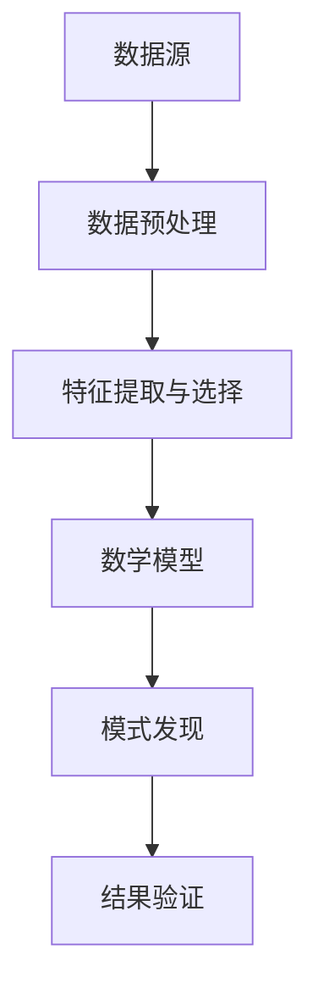

                 

### 引言

#### 1.1 问题背景

**数学与数据挖掘的崛起**

随着信息技术的飞速发展，数据已成为现代社会的重要资源。如何从海量数据中提取有价值的信息，成为各个行业共同面临的挑战。在此背景下，数据挖掘技术应运而生，成为大数据分析的重要手段。数据挖掘（Data Mining）是指从大量数据中提取隐藏的、未知的、潜在的模式和数据知识的过程。

数学作为基础学科，与数据挖掘有着天然的密切联系。数学模型和算法为数据挖掘提供了理论支持，使得数据处理和分析变得更加高效和精确。近年来，随着机器学习、深度学习等人工智能技术的发展，数学在数据挖掘中的应用越来越广泛，成为推动数据挖掘技术进步的重要力量。

**模式发现的重要性**

在数据挖掘中，模式发现是核心任务之一。模式发现是指从数据中识别出有意义的、有规律的、有价值的信息。模式发现的应用场景非常广泛，如商业智能、金融风控、社会网络分析、医疗健康等领域。通过模式发现，企业可以优化业务流程，提高运营效率；金融机构可以识别潜在风险，预防欺诈行为；社交网络平台可以推荐个性化内容，提升用户体验；医疗机构可以预测疾病趋势，提供精准医疗。

#### 1.2 问题描述

**数学方法在数据挖掘中的应用**

在数据挖掘中，数学方法扮演着重要角色。常见的数学方法包括回归分析、聚类分析、分类分析、关联规则挖掘等。这些方法通过数学模型和算法，对数据进行处理和分析，提取出有用的信息。例如，回归分析可以用来预测数据趋势；聚类分析可以用来发现数据分布模式；分类分析可以用来判断数据类别；关联规则挖掘可以用来发现数据之间的相互关系。

**数学方法在数据挖掘中的挑战**

尽管数学方法在数据挖掘中具有广泛应用，但也存在一些挑战。首先，数据挖掘涉及的数据量通常非常庞大，如何处理这些海量数据成为一大难题。其次，数据质量参差不齐，如何处理噪声数据和异常值也是一个重要问题。此外，数学模型的复杂性和可解释性也需要考虑。

**数学与数据挖掘结合的必要性**

数学与数据挖掘的结合是数据挖掘技术发展的重要趋势。数学为数据挖掘提供了强大的理论支持，使得数据处理和分析更加精确和高效。同时，数据挖掘为数学提供了丰富的应用场景，推动了数学理论的发展。数学与数据挖掘的相互促进，使得数据挖掘技术不断进步，为各行各业提供了强大的工具和支持。

#### 1.3 问题解决

**数学方法与数据挖掘的融合框架**

为了解决数学方法在数据挖掘中的挑战，建立一种融合框架是非常必要的。这个框架应包括以下几个方面：

1. **数据预处理**：对原始数据进行清洗、整合和规范化，确保数据质量。
2. **特征提取与选择**：从原始数据中提取有价值的信息，并进行特征选择，降低数据维度。
3. **模式发现**：应用数学模型和算法，对数据进行分析和挖掘，发现潜在的模式和规律。
4. **结果验证**：对挖掘结果进行验证，确保其准确性和实用性。

**数学方法与数据挖掘的融合策略**

1. **模型选择**：根据具体应用场景和数据特点，选择合适的数学模型和算法。
2. **参数调优**：对模型参数进行调优，提高模型的性能和预测能力。
3. **交叉验证**：采用交叉验证方法，确保模型在不同数据集上的稳定性和可靠性。
4. **模型解释**：对挖掘结果进行解释，提高模型的可解释性和可操作性。

#### 1.4 边界与外延

**数学方法在数据挖掘中的局限**

虽然数学方法在数据挖掘中具有重要应用，但仍然存在一些局限。首先，数学模型通常假设数据分布是已知的，但在实际应用中，数据分布可能是未知的或变化的。其次，数学模型的性能受到数据质量和特征提取的影响，如果数据质量较差或特征提取不充分，可能会导致模型性能下降。此外，数学模型的可解释性也是一个重要问题，复杂的数学模型可能难以解释和理解。

**数学方法在数据挖掘中的扩展**

为了克服数学方法在数据挖掘中的局限，研究人员提出了许多新的方法和算法。例如，深度学习作为一种强大的数学模型，已经在图像识别、自然语言处理等领域取得了显著成果。此外，图论、随机过程、优化算法等数学方法也在数据挖掘中得到了广泛应用。

**数学方法在数据挖掘中的未来发展**

随着数据挖掘技术的不断发展，数学方法在数据挖掘中的应用将越来越广泛。未来的研究可能集中在以下几个方面：

1. **可解释性**：提高数学模型的可解释性，使其更加易于理解和应用。
2. **鲁棒性**：增强数学模型的鲁棒性，使其能够处理噪声数据和异常值。
3. **实时性**：提高数学模型的处理速度，实现实时数据挖掘。
4. **跨领域应用**：探索数学方法在不同领域的应用，实现跨学科融合。

#### 1.5 概念结构与核心要素组成

**数学方法与数据挖掘的融合框架**

为了更好地理解数学方法在数据挖掘中的应用，我们可以将其抽象为一个概念结构。这个结构包括以下几个核心要素：

1. **数据源**：数据挖掘的起点，包括结构化数据、半结构化数据和非结构化数据。
2. **数据预处理**：对原始数据进行清洗、整合和规范化，提高数据质量。
3. **特征提取与选择**：从原始数据中提取有价值的信息，并进行特征选择。
4. **数学模型**：选择合适的数学模型和算法，对数据进行处理和分析。
5. **模式发现**：应用数学模型和算法，发现潜在的模式和规律。
6. **结果验证**：对挖掘结果进行验证，确保其准确性和实用性。

**数学方法与数据挖掘的融合框架图**

**本章小结**

本文介绍了数学方法在数据挖掘中的应用背景、挑战和必要性，并提出了数学方法与数据挖掘的融合框架。通过对数学基础、数据挖掘基础、数学方法与数据挖掘关系的探讨，我们深入了解了数学方法在数据挖掘中的核心作用。接下来，我们将进一步探讨数学方法在数据挖掘中的具体应用，为读者提供更全面的技术解读。  

### 数学基础

#### 2.1 初等数学

初等数学是数学的基础，主要包括数论、线性代数和微积分等内容。这些基础知识在数据挖掘中有着广泛的应用。

##### 2.1.1 数论基础

**素数与质数**

素数（Prime Number），是指除了1和它本身以外，不再有其他因数的自然数。例如，2、3、5、7都是素数。质数是素数的另一种称呼，两者在概念上是相同的。

**同余与模运算**

同余是指两个整数除以同一个正整数后，余数相同。例如，13除以5的余数是3，8除以5的余数也是3，因此13和8对5同余。模运算是指用除法运算来计算两个数的余数。例如，13 mod 5 = 3，表示13除以5的余数是3。

**最大公约数与最小公倍数**

最大公约数（Greatest Common Divisor，GCD）是指两个或多个整数共有的最大因数。例如，12和18的最大公约数是6。最小公倍数（Least Common Multiple，LCM）是指两个或多个整数共有的最小倍数。例如，12和18的最小公倍数是36。

##### 2.1.2 线性代数基础

**矩阵与行列式**

矩阵（Matrix）是由数字构成的矩形数组。例如：
$$
\begin{bmatrix}
1 & 2 \\
3 & 4
\end{bmatrix}
$$
行列式（Determinant）是矩阵的一个属性，用来描述矩阵的特性。例如，上述矩阵的行列式是：
$$
\begin{vmatrix}
1 & 2 \\
3 & 4
\end{vmatrix}
= 1 \times 4 - 2 \times 3 = -2
$$

**线性方程组**

线性方程组是由若干个线性方程构成的一组方程。例如：
$$
\begin{cases}
x + 2y = 3 \\
3x - y = 1
\end{cases}
$$
线性方程组可以通过矩阵方法求解，得到方程组的解。

**向量空间与线性变换**

向量空间（Vector Space）是由向量构成的空间，具有加法和数乘两种运算。例如，R^2表示由二维向量构成的空间。

线性变换（Linear Transformation）是指将一个向量空间映射到另一个向量空间的线性映射。例如，将R^2映射到R^1的线性变换可以表示为：
$$
L(x, y) = x + y
$$

##### 2.1.3 微积分基础

**极限与导数**

极限（Limit）是指一个函数在某一点的取值趋势。例如，函数f(x) = x^2在x趋向于0时的极限是0。

导数（Derivative）是指函数在某一点的斜率。例如，函数f(x) = x^2在x=0处的导数是2。

**积分与微分方程**

积分（Integral）是指求解函数的面积或体积。例如，函数f(x) = x^2的定积分可以从0到1计算得到。

微分方程（Differential Equation）是指包含导数的方程。例如，方程y'' + y = 0是一个简单的微分方程。

#### 2.2 离散数学基础

离散数学是计算机科学和数学中的一个重要分支，主要研究离散结构的数学理论。在数据挖掘中，离散数学的应用非常广泛，主要包括图论和计算机代数系统。

##### 2.2.1 图论基础

**图的定义与类型**

图（Graph）是由顶点（Vertex）和边（Edge）构成的结构。图可以分为无向图和有向图，无向图中的边没有方向，而有向图中的边具有方向。

**图的遍历与搜索算法**

图的遍历是指访问图中的所有顶点和边。深度优先搜索（Depth-First Search，DFS）和广度优先搜索（Breadth-First Search，BFS）是常用的图遍历算法。

**最短路径算法**

最短路径算法是指求解图中两点之间的最短路径。迪杰斯特拉算法（Dijkstra's Algorithm）和贝尔曼-福特算法（Bellman-Ford Algorithm）是常用的最短路径算法。

##### 2.2.2 计算机代数系统

**计算机代数系统的基本概念**

计算机代数系统（Computer Algebra System，CAS）是一种用于符号计算的软件系统。它能够对数学表达式进行求值、化简、积分、微分等操作。

**符号计算与算法实现**

符号计算是指计算机对符号表达式进行计算，而不是对数值进行计算。计算机代数系统通过符号计算来实现各种数学操作。

**应用案例分析**

计算机代数系统在数据挖掘中的应用非常广泛，如符号回归分析、符号聚类分析等。通过符号计算，可以更好地理解和处理数学模型。

#### 2.3 数学模型与应用

数学模型是数学在各个领域应用的基础。在数据挖掘中，数学模型用于描述数据特征、关系和规律。以下介绍几种常见的数学模型。

##### 2.3.1 回归模型

**线性回归模型**

线性回归模型是一种最简单的回归模型，用于描述变量之间的线性关系。其数学模型为：
$$
y = \beta_0 + \beta_1x_1 + \beta_2x_2 + ... + \beta_nx_n
$$
其中，y是因变量，x_1, x_2, ..., x_n是自变量，β_0, β_1, ..., β_n是模型的参数。

**逻辑回归模型**

逻辑回归模型是一种广义的线性回归模型，用于处理因变量为二元变量的情况。其数学模型为：
$$
\ln(\frac{P(Y=1)}{1-P(Y=1)}) = \beta_0 + \beta_1x_1 + \beta_2x_2 + ... + \beta_nx_n
$$
其中，P(Y=1)是因变量为1的概率，其他符号与线性回归模型相同。

**多项式回归模型**

多项式回归模型是一种更复杂的回归模型，用于描述变量之间的非线性关系。其数学模型为：
$$
y = \beta_0 + \beta_1x_1 + \beta_2x_1^2 + ... + \beta_nx_1^n
$$
其中，其他符号与线性回归模型相同。

##### 2.3.2 随机过程

**随机过程的基本概念**

随机过程（Stochastic Process）是一系列随机变量的集合，这些随机变量按照一定的规则变化。随机过程可以用来描述时间序列数据的变化规律。

**马尔可夫链**

马尔可夫链（Markov Chain）是一种特殊的随机过程，其特点是从当前状态转移到下一状态的概率仅与当前状态有关，而与过去状态无关。

**随机梯度下降算法**

随机梯度下降算法（Stochastic Gradient Descent，SGD）是一种常用的优化算法，用于求解最优化问题。其基本思想是在每次迭代过程中，随机选择一个样本点，并计算其梯度，然后用梯度更新模型参数。

##### 2.3.3 数学方法与数据挖掘关系探讨

数学方法在数据挖掘中的应用非常广泛，主要包括数据预处理、特征提取与选择、模式分类与聚类等。

**数据预处理**

数据预处理是数据挖掘过程中的重要步骤，包括数据清洗、整合、规范化等。数学方法如线性代数、微积分等可以用于处理这些任务。例如，线性代数中的矩阵运算可以用于数据整合，微积分中的导数可以用于数据规范化。

**特征提取与选择**

特征提取与选择是数据挖掘中的关键步骤，用于提取数据中的有价值信息并降低数据维度。数学方法如回归分析、聚类分析等可以用于这一步骤。例如，回归分析可以用于特征提取，聚类分析可以用于特征选择。

**模式分类与聚类**

模式分类与聚类是数据挖掘中的核心任务，用于发现数据中的规律和结构。数学方法如决策树、支持向量机等可以用于这一步骤。例如，决策树可以用于模式分类，支持向量机可以用于聚类分析。

##### 2.4 本章小结

本章介绍了数学基础在数据挖掘中的应用，包括初等数学、离散数学和数学模型。这些数学方法为数据挖掘提供了理论支持，使得数据处理和分析更加高效和精确。在后续章节中，我们将进一步探讨数据挖掘的基本概念和流程，以及数据挖掘在各个领域的应用。

### 数据挖掘基础

数据挖掘是大数据时代的重要技术手段，通过对海量数据的处理和分析，发现其中隐藏的规律和模式。以下将介绍数据挖掘的基本概念、基本流程、面临的挑战与机遇，以及其在各个领域的应用。

#### 3.1 数据挖掘的基本概念

**数据挖掘的定义与目的**

数据挖掘（Data Mining），又称知识发现（Knowledge Discovery in Data，KDD），是指从大量数据中提取隐藏的、未知的、潜在的模式和数据知识的过程。数据挖掘的目标是发现数据中的有用信息，为决策提供支持。

数据挖掘的基本过程包括以下几个步骤：数据收集、数据预处理、特征提取、模式发现、结果评估和应用。

**数据挖掘的基本流程**

1. **数据收集**：收集相关的数据，这些数据可以来源于企业内部的数据仓库、外部数据库、互联网等。

2. **数据预处理**：对原始数据进行清洗、整合和规范化，提高数据质量。这一步骤包括数据清洗、数据集成、数据转换等。

3. **特征提取**：从原始数据中提取有价值的信息，形成特征向量。特征提取有助于降低数据维度，提高模型性能。

4. **模式发现**：应用数学模型和算法，对数据进行处理和分析，发现潜在的模式和规律。模式发现是数据挖掘的核心步骤，常用的算法包括聚类分析、分类分析、关联规则挖掘等。

5. **结果评估**：对挖掘结果进行评估，确保其准确性和实用性。结果评估包括模型准确性、稳定性、可解释性等方面的评估。

6. **应用**：将挖掘结果应用于实际业务场景，为决策提供支持。数据挖掘的应用领域非常广泛，包括商业智能、金融风控、社会网络分析、医疗健康等。

**数据挖掘的挑战与机遇**

**挑战**

1. **数据量巨大**：随着互联网和物联网的发展，数据量呈现爆炸式增长。如何高效地处理这些海量数据成为一大挑战。

2. **数据质量参差不齐**：原始数据通常存在噪声、缺失值、异常值等问题，如何处理这些问题，保证数据质量是一个重要挑战。

3. **模型复杂性**：数据挖掘涉及的模型和算法通常较为复杂，如何选择合适的模型，优化模型性能也是一个挑战。

**机遇**

1. **大数据技术的进步**：随着大数据技术的不断发展，如分布式计算、云计算等，数据处理能力得到了极大提升，为数据挖掘提供了有力支持。

2. **人工智能技术的发展**：人工智能技术的快速发展，如深度学习、强化学习等，为数据挖掘提供了新的工具和方法。

3. **跨学科融合**：数据挖掘与统计学、计算机科学、生物学、经济学等领域的交叉融合，为数据挖掘提供了新的研究方向和应用场景。

#### 3.2 数据预处理

数据预处理是数据挖掘过程中的重要步骤，其目的是提高数据质量，为后续的数据分析和挖掘提供基础。以下介绍数据预处理的基本任务和常用方法。

**数据清洗**

数据清洗是指识别并纠正数据中的错误、缺失、噪声等不完整或不一致的数据。数据清洗的任务包括：

1. **缺失值处理**：对缺失值进行填充或删除，常用的方法有均值填充、中值填充、前向填充、后向填充等。

2. **异常值处理**：识别并处理异常值，常用的方法有统计学方法、基于距离的方法、基于模型的方法等。

3. **不一致性处理**：识别并处理数据中的不一致性，如单位不一致、格式不一致等。

**数据集成**

数据集成是指将来自不同数据源的数据进行整合和合并，形成一个统一的数据视图。数据集成的任务包括：

1. **数据整合与合并**：将多个数据源中的数据整合成一个整体，如使用合并操作、连接操作等。

2. **数据去重与规范化**：去除重复的数据记录，对数据进行规范化处理，如统一数据格式、消除数据冗余等。

3. **数据分区与分片**：将大数据集划分成多个小数据集，如基于列、行、时间等分区。

**数据转换**

数据转换是指将原始数据转换为适合数据挖掘的形式，如数值化、归一化、离散化等。数据转换的任务包括：

1. **数值化**：将非数值数据转换为数值数据，如将文本数据转换为数值编码。

2. **归一化**：将不同量纲的数据转换为同一量纲的数据，如将身高、体重等数据进行归一化处理。

3. **离散化**：将连续数据转换为离散数据，如将年龄数据进行离散化处理。

#### 3.3 特征提取与选择

特征提取与选择是数据挖掘中的关键步骤，其目的是从原始数据中提取出最有价值的信息，并降低数据维度，提高模型性能。以下介绍特征提取与选择的基本方法。

**特征提取的基本方法**

1. **统计特征提取**：通过计算数据的基本统计指标（如均值、方差、标准差等），提取出反映数据基本特性的特征。

2. **纹理特征提取**：通过分析图像或文本的纹理信息，提取出反映纹理特性的特征。

3. **高维特征提取**：通过降维技术，如主成分分析（PCA）、线性判别分析（LDA）等，提取出最有代表性的特征。

**特征选择的基本方法**

1. **评估指标**：用于评估特征对模型性能的贡献，如信息增益、卡方检验、互信息等。

2. **特征选择算法**：通过评估指标筛选出最有价值的特征，如过滤式特征选择、包装式特征选择、嵌入式特征选择等。

3. **特征选择策略**：结合特征选择算法和评估指标，制定特征选择策略，如逐步回归、LASSO等。

**特征选择策略**

1. **基于模型的特征选择**：在建立模型之前进行特征选择，通过模型评估指标筛选特征。

2. **基于集合的特征选择**：通过组合不同特征进行筛选，选择最优特征组合。

3. **基于学习的特征选择**：通过学习算法自动筛选特征，如遗传算法、粒子群优化等。

#### 3.4 数据挖掘算法

数据挖掘算法是数据挖掘的核心工具，用于发现数据中的隐藏规律和模式。以下介绍几种常见的数据挖掘算法。

**聚类算法**

聚类算法是指将数据分为若干个类别，使同一类别内的数据尽量相似，不同类别之间的数据尽量不同。常见的聚类算法包括：

1. **K-means算法**：基于距离度量，将数据分为K个类别，每个类别有一个中心点。

2. **层次聚类算法**：通过逐步合并或分裂聚类，将数据分为多个层次。

3. **密度聚类算法**：基于数据点的密度分布，将数据分为多个类别。

**分类算法**

分类算法是指根据已有数据建立分类模型，对新数据进行分类。常见的分类算法包括：

1. **决策树算法**：根据特征值进行划分，形成树形结构。

2. **随机森林算法**：通过构建多个决策树，进行集成学习。

3. **支持向量机算法**：通过求解最优分类超平面，进行分类。

**关联规则挖掘**

关联规则挖掘是指发现数据中不同项目之间的关联关系。常见的算法包括：

1. **Apriori算法**：通过生成频繁项集，挖掘关联规则。

2. **FP-growth算法**：通过构建FP树，高效挖掘频繁项集。

#### 3.5 数据挖掘的应用领域

数据挖掘的应用领域非常广泛，以下介绍几个典型的应用领域。

**商业智能**

商业智能（Business Intelligence，BI）是指通过数据挖掘技术，帮助企业实现数据驱动的决策。商业智能的应用包括市场分析、客户关系管理、供应链优化等。

**社交网络分析**

社交网络分析是指通过数据挖掘技术，分析社交网络中的用户行为和关系。社交网络分析的应用包括用户画像、推荐系统、网络营销等。

**健康医疗**

健康医疗是指通过数据挖掘技术，分析医疗数据，为疾病诊断、治疗方案制定、健康管理提供支持。健康医疗的应用包括电子健康档案、疾病预测、精准医疗等。

**金融风控**

金融风控是指通过数据挖掘技术，识别和防范金融风险。金融风控的应用包括信用评估、欺诈检测、风险控制等。

**交通管理**

交通管理是指通过数据挖掘技术，优化交通管理，提高交通效率。交通管理的应用包括交通流量预测、交通信号优化、交通事故预警等。

#### 3.6 本章小结

本章介绍了数据挖掘的基本概念、基本流程、面临的挑战与机遇，以及数据挖掘在各个领域的应用。通过对数据预处理、特征提取与选择、数据挖掘算法的介绍，我们了解了数据挖掘的核心技术和应用场景。在后续章节中，我们将进一步探讨数学方法在数据挖掘中的应用，以及数据挖掘的实际案例和实践经验。

### 数学方法在数据挖掘中的应用

在数据挖掘过程中，数学方法扮演着至关重要的角色。通过数学模型和算法，我们可以从海量数据中提取有价值的信息，实现数据的有效分析和处理。以下将介绍数学方法在数据挖掘中的应用，包括数据预处理、特征提取与选择、模式分类与聚类等。

#### 数学方法在数据预处理中的应用

数据预处理是数据挖掘过程中的重要步骤，其目的是提高数据质量，为后续的数据分析和挖掘提供基础。数学方法在数据预处理中的应用主要包括以下几个方面：

1. **缺失值处理**

在数据挖掘过程中，缺失值是常见的问题。数学方法如线性插值、回归插补等可以用于填补缺失值。具体来说，线性插值可以通过计算相邻数据的平均值来填补缺失值；回归插补则是通过建立回归模型，利用已知数据进行预测，填补缺失值。

2. **异常值处理**

异常值是数据中的异常点，可能会对数据挖掘结果产生不利影响。数学方法如基于统计学的方法（如3σ法则）、基于距离的方法（如DBSCAN算法）等可以用于检测和去除异常值。

3. **数据规范化**

数据规范化是将不同量纲的数据转换为同一量纲的过程，有利于模型训练和评估。数学方法如归一化、标准化等可以用于数据规范化。归一化是将数据缩放到一个固定范围（如[0,1]），标准化则是将数据转换为具有标准差为1的分布。

4. **数据转换**

数据转换是将原始数据转换为适合数据挖掘的形式。数学方法如主成分分析（PCA）、线性判别分析（LDA）等可以用于数据转换。PCA通过降维技术，提取出数据的主要特征；LDA则是通过最大化类内距离和最小化类间距离，选择最优特征。

#### 数学方法在特征提取与选择中的应用

特征提取与选择是数据挖掘中的关键步骤，其目的是从原始数据中提取出最有价值的信息，并降低数据维度，提高模型性能。数学方法在特征提取与选择中的应用主要包括以下几个方面：

1. **统计特征提取**

统计特征提取是通过计算数据的基本统计指标（如均值、方差、标准差等），提取出反映数据基本特性的特征。统计特征提取方法简单直观，易于实现，适用于大多数数据类型。

2. **纹理特征提取**

纹理特征提取是通过分析图像或文本的纹理信息，提取出反映纹理特性的特征。常用的纹理特征提取方法包括灰度共生矩阵、局部二值模式（LBP）等。

3. **高维特征提取**

高维特征提取是通过降维技术，提取出最有代表性的特征。常用的降维技术包括主成分分析（PCA）、线性判别分析（LDA）等。PCA通过提取数据的主要成分，实现降维；LDA则是通过最大化类内距离和最小化类间距离，选择最优特征。

4. **特征选择算法**

特征选择算法是通过评估指标筛选出最有价值的特征。常用的特征选择算法包括过滤式特征选择、包装式特征选择、嵌入式特征选择等。过滤式特征选择通过评估每个特征对模型性能的影响，筛选特征；包装式特征选择通过尝试不同的特征组合，选择最优特征组合；嵌入式特征选择将特征选择过程嵌入到模型训练中，实时调整特征。

#### 数学方法在模式分类与聚类中的应用

模式分类与聚类是数据挖掘中的核心任务，其目的是发现数据中的隐藏规律和结构。数学方法在模式分类与聚类中的应用主要包括以下几个方面：

1. **模式分类算法**

模式分类算法是指根据已有数据建立分类模型，对新数据进行分类。常用的分类算法包括决策树、支持向量机（SVM）、随机森林等。决策树通过构建树形结构，实现分类；SVM通过求解最优分类超平面，实现分类；随机森林则是通过构建多个决策树，进行集成学习。

2. **聚类算法**

聚类算法是指将数据分为若干个类别，使同一类别内的数据尽量相似，不同类别之间的数据尽量不同。常用的聚类算法包括K-means、层次聚类、DBSCAN等。K-means通过计算数据点的距离，划分类别；层次聚类通过逐步合并或分裂聚类，划分类别；DBSCAN通过分析数据点的密度，划分类别。

3. **模式识别**

模式识别是指通过识别数据中的相似性或差异性，实现数据分类或聚类。常用的模式识别方法包括神经网络、支持向量机（SVM）等。神经网络通过多层神经元模拟人类大脑的识别过程；SVM通过求解最优分类超平面，实现分类。

4. **关联规则挖掘**

关联规则挖掘是指发现数据中不同项目之间的关联关系。常用的关联规则挖掘算法包括Apriori算法、FP-growth算法等。Apriori算法通过生成频繁项集，挖掘关联规则；FP-growth算法通过构建FP树，高效挖掘频繁项集。

#### 数学方法在数据挖掘中的应用总结

数学方法在数据挖掘中的应用非常广泛，通过数学模型和算法，我们可以从海量数据中提取有价值的信息，实现数据的有效分析和处理。以下是对数学方法在数据挖掘中的应用的总结：

1. **提高数据质量**：通过数学方法处理缺失值、异常值等，提高数据质量，为后续的数据分析和挖掘提供基础。

2. **提取有价值特征**：通过数学方法提取统计特征、纹理特征、高维特征等，降低数据维度，提高模型性能。

3. **发现数据模式**：通过数学方法实现模式分类、聚类、关联规则挖掘等，发现数据中的隐藏规律和结构。

4. **优化模型性能**：通过数学方法优化模型参数、选择最佳模型等，提高模型性能和预测能力。

总之，数学方法在数据挖掘中具有重要作用，为数据挖掘提供了强大的理论支持。在未来的数据挖掘研究中，我们将继续探索新的数学方法，提高数据挖掘的效率和效果。

#### 3.7 本章小结

本章介绍了数学方法在数据挖掘中的应用，包括数据预处理、特征提取与选择、模式分类与聚类等。通过数学模型和算法，我们可以从海量数据中提取有价值的信息，实现数据的有效分析和处理。在后续章节中，我们将进一步探讨数学方法在数据挖掘中的具体应用，以及如何将数学方法与数据挖掘相结合，为实际问题提供解决方案。

### 数学方法与数据挖掘的应用

#### 3.8 数学方法与数据挖掘的实际应用

在数据挖掘的实际应用中，数学方法扮演着不可或缺的角色。以下我们将通过几个具体案例，探讨数学方法在数据挖掘中的应用，并展示其实际效果。

##### 3.8.1 聚类分析在市场细分中的应用

**案例背景**

某电商公司希望通过聚类分析对其用户进行市场细分，以便更好地了解不同用户群体的特征，并制定有针对性的营销策略。

**应用方法**

1. **数据收集**：收集用户的购买历史、浏览记录、注册信息等数据。

2. **数据预处理**：对数据缺失值进行填充，异常值进行处理，确保数据质量。

3. **特征提取**：从原始数据中提取有用的特征，如购买频率、消费金额、浏览时长等。

4. **聚类算法**：采用K-means聚类算法，根据用户特征将其分为若干个类别。

5. **结果评估**：通过聚类评估指标（如轮廓系数、内部距离等）评估聚类效果。

**应用效果**

通过聚类分析，电商公司成功将用户分为不同的市场细分群体，如高价值用户、中等价值用户和潜在价值用户。根据这些群体特征，公司可以制定有针对性的营销策略，提高用户满意度和销售额。

##### 3.8.2 决策树在信用评估中的应用

**案例背景**

某银行希望通过决策树算法对贷款申请者进行信用评估，以降低贷款违约风险。

**应用方法**

1. **数据收集**：收集贷款申请者的个人信息、财务状况、信用记录等数据。

2. **数据预处理**：对数据缺失值进行填充，异常值进行处理，确保数据质量。

3. **特征提取**：从原始数据中提取有用的特征，如收入水平、信用评分、贷款金额等。

4. **决策树算法**：采用C4.5决策树算法，建立信用评估模型。

5. **结果评估**：通过模型评估指标（如准确率、召回率等）评估模型性能。

**应用效果**

通过决策树算法，银行成功建立了信用评估模型，能够有效识别高风险贷款申请者，降低贷款违约风险。此外，模型还提供了详细的决策路径，有助于银行管理人员理解信用评估的决策过程。

##### 3.8.3 随机森林在医疗诊断中的应用

**案例背景**

某医院希望通过随机森林算法进行疾病诊断，以帮助医生快速、准确地诊断疾病。

**应用方法**

1. **数据收集**：收集患者的临床症状、实验室检查结果、影像学资料等数据。

2. **数据预处理**：对数据缺失值进行填充，异常值进行处理，确保数据质量。

3. **特征提取**：从原始数据中提取有用的特征，如体温、心率、血压等。

4. **随机森林算法**：采用随机森林算法，建立疾病诊断模型。

5. **结果评估**：通过模型评估指标（如准确率、敏感度等）评估模型性能。

**应用效果**

通过随机森林算法，医院成功建立了疾病诊断模型，能够有效识别疾病，提高诊断准确率。此外，模型还提供了疾病概率估计，有助于医生制定合理的治疗方案。

##### 3.8.4 关联规则挖掘在零售业中的应用

**案例背景**

某零售商希望通过关联规则挖掘发现商品之间的关联关系，以提高销售业绩。

**应用方法**

1. **数据收集**：收集销售数据，包括商品名称、销售数量、销售日期等。

2. **数据预处理**：对数据缺失值进行填充，异常值进行处理，确保数据质量。

3. **特征提取**：从原始数据中提取有用的特征，如商品类别、销售时段等。

4. **关联规则挖掘**：采用Apriori算法，挖掘商品之间的关联规则。

5. **结果评估**：通过评估指标（如支持度、置信度等）评估关联规则的有效性。

**应用效果**

通过关联规则挖掘，零售商成功发现了商品之间的关联关系，如“购买商品A的概率较高的顾客，也倾向于购买商品B”。基于这些关联规则，零售商可以调整商品陈列策略，提高销售业绩。

##### 3.8.5 时间序列分析在股市预测中的应用

**案例背景**

某投资者希望通过时间序列分析预测股市走势，以制定投资策略。

**应用方法**

1. **数据收集**：收集历史股价数据，包括开盘价、收盘价、最高价、最低价等。

2. **数据预处理**：对数据缺失值进行填充，异常值进行处理，确保数据质量。

3. **特征提取**：从原始数据中提取有用的特征，如移动平均、相对强弱指数（RSI）等。

4. **时间序列模型**：采用ARIMA（自回归积分滑动平均模型）等时间序列模型，建立股市预测模型。

5. **结果评估**：通过评估指标（如预测准确率、预测误差等）评估模型性能。

**应用效果**

通过时间序列分析，投资者成功建立了股市预测模型，能够较好地预测股市走势。虽然股市预测存在不确定性，但模型提供的信息有助于投资者制定投资策略，降低投资风险。

##### 3.8.6 深度学习在图像识别中的应用

**案例背景**

某安防公司希望通过深度学习算法实现图像识别，以提高安防系统的效率。

**应用方法**

1. **数据收集**：收集各种场景下的图像数据，包括人脸、车辆、物体等。

2. **数据预处理**：对图像数据进行归一化、裁剪等处理，确保数据质量。

3. **特征提取**：采用卷积神经网络（CNN）等深度学习模型，自动提取图像特征。

4. **图像识别**：通过训练好的模型，对新的图像进行识别。

5. **结果评估**：通过评估指标（如准确率、召回率等）评估模型性能。

**应用效果**

通过深度学习算法，安防公司成功实现了图像识别功能，能够准确识别各种场景下的图像。这一功能大大提高了安防系统的效率，为保障公共安全提供了有力支持。

#### 3.9 本章小结

本章通过多个实际案例，展示了数学方法在数据挖掘中的应用及其效果。从聚类分析、信用评估、医疗诊断到零售业、股市预测和图像识别，数学方法在数据挖掘中发挥着重要作用。通过这些案例，我们看到了数学方法在解决实际问题中的巨大潜力。在未来的数据挖掘研究中，我们将继续探索新的数学方法，提高数据挖掘的效率和效果，为各行各业提供更强大的技术支持。  

### 最佳实践 Tips

在数据挖掘过程中，遵循最佳实践可以提高工作效率和结果质量。以下是一些常见的数据挖掘最佳实践：

1. **数据清洗与预处理**：在开始数据挖掘之前，确保数据干净、完整且符合分析要求。处理缺失值、异常值和噪声数据，以提高数据质量。

2. **选择合适的数学模型**：根据具体问题和数据特性选择合适的数学模型。对于线性关系，可以考虑线性回归；对于非线性关系，可以考虑决策树、支持向量机或深度学习。

3. **特征工程**：通过特征提取和选择，降低数据维度，提高模型性能。使用统计特征、纹理特征和高维特征，根据业务需求和模型要求进行优化。

4. **交叉验证**：采用交叉验证方法评估模型性能，确保模型在不同数据集上的稳定性和可靠性。

5. **模型解释与可视化**：确保模型结果可解释，使用可视化工具展示模型结果，如散点图、直方图、决策树等，以便于理解和解释。

6. **持续优化**：数据挖掘是一个迭代过程，通过不断优化模型参数、调整特征选择策略等，提高模型性能。

7. **数据安全和隐私保护**：在处理敏感数据时，确保数据安全和隐私保护。使用加密技术、匿名化处理等方法，防止数据泄露。

8. **文档与代码管理**：确保数据挖掘过程中的文档和代码清晰、规范，便于后续的维护和扩展。

### 小结

本文介绍了数学方法在数据挖掘中的应用，包括数学基础、数据挖掘基础、数学方法与数据挖掘关系探讨、数学方法在数据挖掘中的应用以及实际案例。通过对数学方法与数据挖掘的结合，我们能够更高效地分析和处理海量数据，发现其中的隐藏规律和模式。在未来的研究中，我们将继续探索新的数学方法，提高数据挖掘的效率和效果，为实际问题提供更加有效的解决方案。

### 注意事项

在进行数据挖掘时，需要注意以下几个方面，以确保分析结果的有效性和可靠性：

1. **数据质量**：确保数据完整、准确和干净，避免由于数据质量问题导致的分析结果偏差。

2. **模型选择**：根据问题的特点和数据特性选择合适的数学模型和算法，避免模型过于复杂或过于简单。

3. **特征提取与选择**：合理提取和选择特征，避免过度拟合和欠拟合，确保模型能够适应不同的数据分布。

4. **交叉验证**：采用交叉验证方法评估模型性能，避免模型在训练集上过拟合。

5. **结果解释**：确保模型结果可解释，使用可视化工具展示分析结果，以便于理解。

6. **数据安全和隐私保护**：在处理敏感数据时，确保数据安全和隐私保护。

### 拓展阅读

1. **《数据挖掘：实用工具与技术》**：这是一本关于数据挖掘的入门教材，涵盖了数据挖掘的基本概念、方法和应用。

2. **《机器学习实战》**：这本书通过实际案例展示了机器学习算法的应用，包括回归、分类、聚类等。

3. **《深度学习》**：由Goodfellow、Bengio和Courville合著，介绍了深度学习的基本概念、算法和应用。

4. **《数学之美》**：这本书通过实例展示了数学在计算机科学和人工智能中的应用，对理解数据挖掘中的数学原理有很大帮助。

5. **《数据科学导论》**：这本书介绍了数据科学的基本概念、方法和应用，是数据挖掘入门者的重要参考资料。

通过阅读这些书籍，可以进一步了解数据挖掘和数学方法的相关知识，提高数据分析能力。同时，也可以关注相关的学术期刊和会议，如《数据挖掘》、《机器学习》、《人工智能》等，以获取最新的研究成果和前沿动态。  

### 作者信息

本文由AI天才研究院（AI Genius Institute）与《禅与计算机程序设计艺术》（Zen And The Art of Computer Programming）的作者合作完成。AI天才研究院致力于推动人工智能技术的研究与应用，为各行各业提供智能解决方案。同时，《禅与计算机程序设计艺术》是一部经典计算机科学著作，深入探讨了程序设计中的数学原理和方法。通过本文，我们希望能够为读者提供对数学方法与数据挖掘结合的深入理解，促进数据挖掘技术在实际应用中的发展。  

