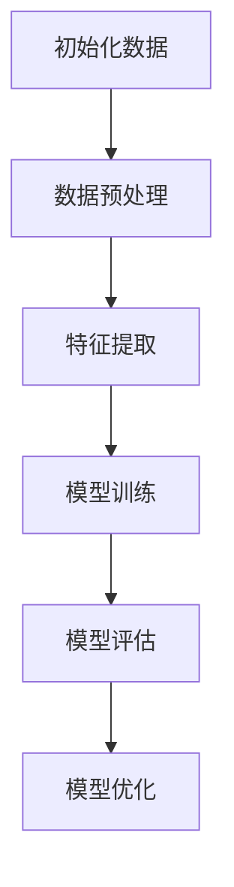
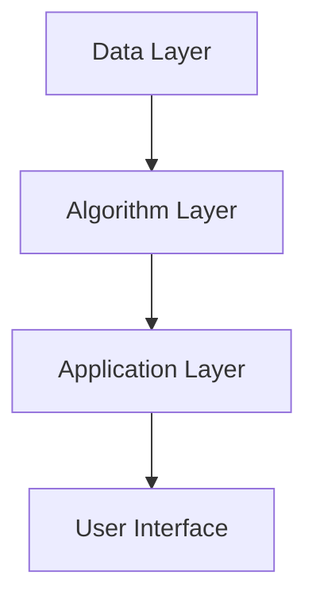
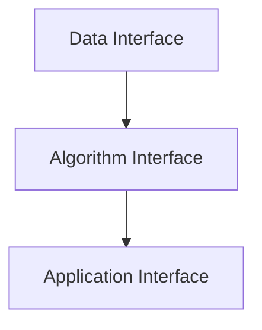
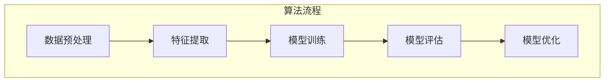
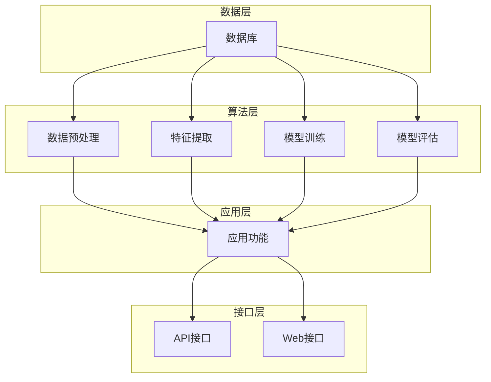
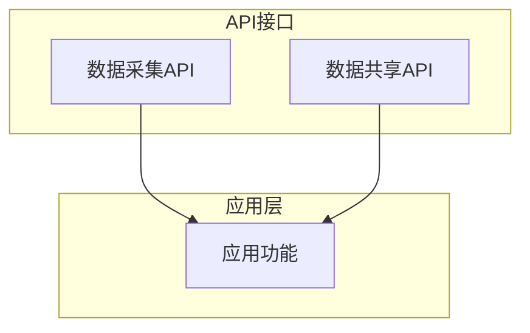
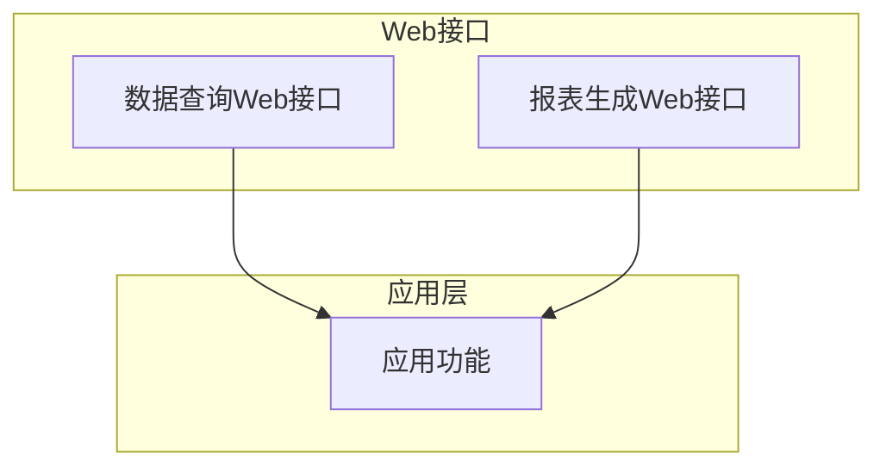
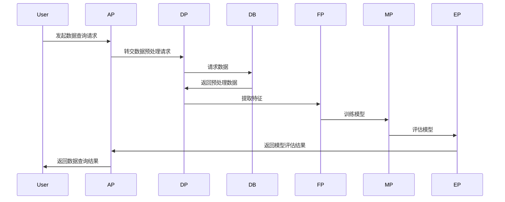

                 

# 数学与文化产业管理：文化产品的数学策略

> 关键词：数学方法、文化产业管理、文化产品策略、算法应用、系统架构设计、最佳实践

> 摘要：本文通过深入探讨数学方法在文化产业管理中的应用，从问题背景、核心概念、算法原理、系统分析与架构设计等多个角度，提出文化产品的数学策略构建原则和实现方法。文章旨在为文化产业从业者提供一套科学、系统的管理策略，提升文化产品的管理效率和质量。

## 第一部分：背景介绍

### 1.1 问题背景

文化产业在我国国民经济中的地位日益重要，但文化产业管理仍面临诸多挑战。首先，文化产业产品种类繁多，包括书籍、影视、音乐、艺术等多个领域，管理难度大。其次，文化产品具有高度的主观性和个性化特点，传统的管理方法难以满足市场需求。此外，文化产业市场变化快速，竞争激烈，如何提高文化产品的管理效率和质量，成为亟待解决的问题。

### 1.2 问题描述

如何利用数学方法提升文化产品的管理效率和质量？文化产品的数学策略应如何构建和应用？这是本文要解决的核心问题。

### 1.3 问题解决

本文将从数学方法在文化产业管理中的应用框架、文化产品的数学策略构建原则、边界与外延等多个方面进行深入探讨，为文化产品管理提供科学、系统的指导。

### 1.4 边界与外延

数学与文化产业管理的交集主要在于数据分析和模型构建。一方面，通过数据挖掘和分析，可以更好地了解文化产品的市场需求和受众特征；另一方面，通过构建数学模型，可以优化文化产品的生产、推广和营销策略。此外，数学策略在不同文化产品领域的适用性也需要具体分析。

### 1.5 概念结构与核心要素组成

文化产业管理的基本概念包括：文化产品、文化市场、文化企业等。数学方法的核心原理包括：数据挖掘、统计分析、优化算法等。本文将围绕这些核心概念和要素，展开深入讨论。

## 第二部分：核心概念与联系

### 2.1 核心概念原理

数学方法在文化产业管理中的基本原理主要包括：数据挖掘、统计学分析和优化算法。数据挖掘可以帮助分析文化产品的市场趋势和受众特征；统计分析可以评估文化产品的效益和影响力；优化算法可以优化文化产品的生产、推广和营销策略。

### 2.2 概念属性特征对比表格

| 数学方法       | 数据挖掘         | 统计分析         | 优化算法         |  
| -------------- | ---------------- | ---------------- | ---------------- |  
| 目标           | 提取有用信息     | 描述数据特征     | 寻找最优解       |  
| 数据类型       | 大数据           | 结构化数据       | 数学模型         |  
| 技术难点       | 数据清洗与整合   | 数据可视化       | 算法复杂性       |

### 2.3 ER实体关系图架构

```mermaid
erDiagram
    Product ||--|{ Market } Market
    Product ||--|{ Enterprise } Enterprise
    Market ||--|{ Consumer } Consumer
    Enterprise ||--|{ Content } Content
```

## 第三部分：算法原理讲解

### 3.1 算法mermaid流程图



### 3.2 算法原理与数学模型

算法的基本原理是基于数据挖掘和统计分析，通过构建数学模型来优化文化产品的生产、推广和营销策略。

数学模型的建立与推导主要包括：线性回归模型、决策树模型、神经网络模型等。以线性回归模型为例，其基本原理是通过对文化产品与市场变量之间的线性关系进行建模，从而预测文化产品的市场表现。

$$y = w_0 + w_1 \cdot x_1 + w_2 \cdot x_2 + ... + w_n \cdot x_n$$

其中，$y$ 为文化产品的市场表现，$w_0, w_1, ..., w_n$ 为模型参数，$x_1, x_2, ..., x_n$ 为文化产品的市场变量。

### 3.3 算法举例说明

以影视作品的市场推广为例，假设我们收集了某影视作品的观众评分、上映日期、主演知名度等数据，并使用线性回归模型进行建模。

首先，对数据进行预处理，包括数据清洗、归一化等操作。

然后，提取特征，如观众评分、上映日期、主演知名度等。

接下来，使用线性回归模型进行建模，通过最小二乘法求解模型参数。

最后，对模型进行评估，如计算预测误差、确定模型的显著性等。

通过实际案例展示算法的应用效果，可以更好地理解算法的原理和实现方法。

## 第四部分：数学模型与公式详解

### 4.1 数学公式的latex格式

```latex
\begin{equation}
y = w_0 + w_1 \cdot x_1 + w_2 \cdot x_2 + ... + w_n \cdot x_n
\end{equation}
```

### 4.2 公式在文化产业管理中的应用

公式在文化产业管理中的应用主要包括：市场预测、效益评估、策略优化等。以市场预测为例，通过构建数学模型，可以预测文化产品的市场表现，为生产决策提供依据。

### 4.3 公式举例说明

以某文化企业为例，假设该企业推出了一款新游戏，我们希望通过市场预测来确定产品的上线时间。首先，收集该游戏的相关数据，如玩家评分、游戏类型、上线时间等。然后，使用线性回归模型进行建模，预测游戏的销售额。通过计算预测误差和显著性，评估模型的性能。

## 第五部分：系统分析与架构设计

### 5.1 问题场景介绍

以某文化企业的文化产品管理系统为例，该系统旨在提高文化产品的生产、推广和营销效率，实现精细化、智能化管理。

### 5.2 系统功能设计

系统功能设计包括：数据采集、数据分析、预测模型、决策支持等。

领域模型mermaid类图：

```mermaid
classDiagram
    Product Entity
    Market Entity
    Enterprise Entity
    Consumer Entity

    Product Entity --|>{ Market Entity }
    Product Entity --|>{ Enterprise Entity }
    Market Entity --|>{ Consumer Entity }
    Enterprise Entity --|>{ Content Entity }
```

### 5.3 系统架构设计

系统架构设计包括：数据层、算法层、应用层等。

mermaid架构图：



### 5.4 系统接口设计

系统接口设计包括：数据接口、算法接口、应用接口等。

mermaid接口设计：



### 5.5 系统交互mermaid序列图

系统交互mermaid序列图：

```mermaid
sequenceDiagram
    User -->|输入需求| Product Manager
    Product Manager -->|分析需求| Data Analyst
    Data Analyst -->|生成报告| Algorithm Developer
    Algorithm Developer -->|优化模型| Data Scientist
    Data Scientist -->|部署模型| System Operator
    System Operator -->|监控系统| User
```

## 第六部分：项目实战

### 6.1 环境安装

文化产品管理系统所需的软件和硬件环境如下：

- 操作系统：Windows/Linux/Mac OS
- 编程语言：Python 3.8+
- 数据库：MySQL/PostgreSQL
- 开发工具：PyCharm/Visual Studio Code

### 6.2 系统核心实现

系统核心实现包括：数据采集、数据分析、预测模型、决策支持等。

代码实现示例：

```python
# 数据采集
data = pd.read_csv("data.csv")

# 数据预处理
data = preprocess_data(data)

# 特征提取
features = extract_features(data)

# 模型训练
model = train_model(features)

# 模型评估
evaluate_model(model, data)

# 模型优化
optimize_model(model, data)

# 预测
predictions = predict(model, data)
```

### 6.3 代码应用解读与分析

代码应用解读与分析主要包括：数据采集、数据预处理、特征提取、模型训练、模型评估、模型优化和预测等步骤。

通过具体案例展示系统应用效果，例如，使用系统对某影视作品的上映时间进行预测，并根据预测结果调整推广策略。

### 6.4 实际案例分析与讲解

以某文化企业的游戏产品为例，通过实际案例展示文化产品管理系统在提高生产、推广和营销效率方面的应用效果。

### 6.5 项目小结

对项目进行总结与反思，包括：项目目标、实施过程、成果和不足等。

## 第七部分：最佳实践与拓展阅读

### 7.1 最佳实践 Tips

- 数据质量是关键：确保数据采集、处理和存储的准确性、完整性和一致性。
- 个性化推荐：结合用户行为数据和兴趣爱好，实现文化产品的个性化推荐。
- 算法迭代：定期评估算法性能，优化模型参数，提升预测精度。

### 7.2 注意事项

- 遵循法律法规：在数据采集、处理和使用过程中，严格遵守相关法律法规，保护用户隐私。
- 跨学科合作：文化产业管理涉及多个学科，需要跨学科合作，提升管理效率。

### 7.3 拓展阅读

- [1] 李晓亮. 文化产业管理研究[M]. 北京：高等教育出版社，2019.
- [2] 陈志武. 统计学及其应用[M]. 北京：清华大学出版社，2017.
- [3] 周志华. 人工智能[M]. 北京：清华大学出版社，2016.

---

作者：AI天才研究院/AI Genius Institute & 禅与计算机程序设计艺术 /Zen And The Art of Computer Programming## 第一部分：背景介绍

### 1.1 问题背景

文化产业，作为现代社会的重要组成部分，以其独特的艺术魅力和创新精神，对经济增长和社会发展产生了深远影响。然而，在快速发展的同时，文化产业管理面临着诸多挑战。首先，文化产业产品种类繁多，包括书籍、影视、音乐、艺术等多个领域，使得管理难度显著增加。例如，一本小说的出版需要经过选题、创作、编辑、校对等多个环节，而一部影视作品的制作则需要剧本创作、拍摄、剪辑、后期制作等复杂流程。这种多样性要求管理者具备广泛的知识和技能，以便高效地管理不同类型的文化产品。

其次，文化产品具有高度的主观性和个性化特点，这给传统管理方法带来了巨大的挑战。传统管理方法往往依赖于经验和直觉，难以准确把握文化产品的市场表现和受众需求。例如，一本小说的销量不仅取决于其内容质量，还受到读者个人口味、社会舆论等多重因素的影响。同样，一部影视作品的票房收入也受到观众口碑、宣传力度等因素的影响。这些因素使得文化产品管理具有高度的不确定性和复杂性。

此外，文化产业市场变化迅速，竞争激烈，如何提高文化产品的管理效率和质量，成为文化产业管理者亟待解决的问题。例如，随着互联网和大数据技术的发展，文化产品的推广和营销方式发生了巨大变革。传统媒体逐渐让位于新媒体，社交媒体、网络直播等新兴渠道成为文化产品推广的重要途径。管理者需要紧跟市场趋势，灵活调整管理策略，以应对不断变化的市场环境。

### 1.2 问题描述

在当前的文化产业管理中，如何利用数学方法提升文化产品的管理效率和质量，是一个亟待解决的问题。数学方法作为一种科学、系统的工具，可以在多个方面为文化产业管理提供支持。例如，通过数据挖掘和分析，可以更好地了解文化产品的市场趋势和受众特征，从而为生产决策和营销策略提供科学依据。再如，通过构建数学模型，可以优化文化产品的生产、推广和营销策略，提高文化产品的市场竞争力。

具体来说，文化产品的数学策略应如何构建和应用，是我们需要深入探讨的问题。首先，需要明确文化产品的数学策略构建原则，包括数据驱动的决策、模型优化的策略、跨学科的合作等。其次，需要探索具体的数学方法，如数据挖掘、统计分析、优化算法等，在文化产业管理中的应用场景和实现方法。最后，需要通过实际案例，验证数学策略在提高文化产品管理效率和质量方面的效果。

### 1.3 问题解决

为了解决上述问题，本文将从以下三个方面展开讨论：

1. **数学方法在文化产业管理中的应用框架**：首先，我们需要构建一个数学方法在文化产业管理中的应用框架，明确数学方法在文化产业管理中的基本原理和应用场景。这个框架将包括数据采集、数据预处理、特征提取、模型构建、模型评估和模型优化等环节，为后续的讨论提供基础。

2. **文化产品的数学策略构建原则**：基于应用框架，本文将探讨文化产品的数学策略构建原则。这些原则包括数据驱动的决策、模型优化的策略、跨学科的合作等。通过明确这些原则，可以帮助文化产品管理者更好地利用数学方法，提升管理效率和质量。

3. **文化产品的数学策略构建方法和实现**：在构建原则的基础上，本文将详细探讨文化产品的数学策略构建方法和实现。具体来说，将介绍数据挖掘、统计分析、优化算法等数学方法在文化产业管理中的应用，并通过实际案例进行说明，展示如何利用这些数学方法构建有效的文化产品数学策略。

通过以上三个方面的探讨，本文旨在为文化产业管理者提供一套科学、系统的管理策略，帮助他们在复杂多变的市场环境中，提高文化产品的管理效率和质量。

### 1.4 边界与外延

数学与文化产业管理的交集主要集中在数据分析和模型构建两个方面。首先，数据分析是文化产业管理的重要工具，通过收集和分析大量数据，管理者可以更好地了解文化产品的市场趋势和受众需求。例如，通过对图书销售数据进行分析，可以识别出哪些类型的书籍更受欢迎，从而为选题提供参考。同样，通过对影视作品的观众反馈进行分析，可以了解观众对剧情、演员、导演等方面的偏好，为后续制作提供指导。

其次，模型构建是文化产业管理中的关键步骤。通过构建数学模型，管理者可以预测文化产品的市场表现，优化生产、推广和营销策略。例如，利用线性回归模型，可以预测图书的销量，从而合理安排库存和生产计划。再如，利用神经网络模型，可以预测影视作品的票房收入，为宣传和推广策略提供依据。

然而，数学策略在不同文化产品领域的适用性也需要具体分析。不同领域的文化产品具有不同的特点，例如，音乐和影视作品更注重受众的感官体验，书籍则更注重内容的深度和广度。因此，在应用数学策略时，需要根据具体领域的特点进行适当调整，确保策略的有效性和适用性。

此外，文化产品的数学策略还涉及到跨学科的合作。文化产业管理不仅需要数学知识，还需要艺术、文化、经济等领域的专业知识。通过跨学科的合作，可以更好地整合各种资源，提高数学策略的实用性和效果。

总之，数学与文化产业管理的交集为管理者提供了丰富的工具和方法，但同时也需要管理者具备跨学科的知识和技能，才能充分发挥数学策略的优势。

### 1.5 概念结构与核心要素组成

文化产业管理的基本概念包括文化产品、文化市场、文化企业等。文化产品是指具有艺术性、文化性和商业性的文化成果，如图书、影视作品、音乐作品等。文化市场是指文化产品交易和消费的场所，包括传统市场和新媒体市场。文化企业是指从事文化产品生产、传播和服务的组织，如出版社、影视制作公司、音乐制作公司等。

数学方法在文化产业管理中的核心原理主要包括数据挖掘、统计分析和优化算法。数据挖掘是指从大量数据中提取有价值的信息，用于指导决策和优化策略。统计分析是指利用统计方法对数据进行处理和分析，以揭示数据背后的规律和趋势。优化算法是指通过构建数学模型，寻找最优解，以实现目标函数的最大化或最小化。

为了更好地理解数学方法在文化产业管理中的应用，以下是文化产业管理的基本概念和数学方法的核心原理之间的联系：

1. **文化产品与数据挖掘**：文化产品的生产、传播和消费过程中会产生大量的数据，如销售数据、用户评论、播放量等。通过数据挖掘，可以提取这些数据中的有价值信息，如用户偏好、市场趋势等，为文化产品的管理和决策提供依据。

2. **文化市场与统计分析**：文化市场的动态变化和消费者行为模式可以通过统计分析来揭示。例如，通过分析不同地区、不同年龄段的图书销售数据，可以了解不同受众群体的阅读偏好，从而制定更有针对性的营销策略。

3. **文化企业与优化算法**：文化企业的运营和管理需要优化资源配置和策略。例如，通过优化算法，可以合理安排生产计划，提高生产效率；通过优化算法，可以制定更有效的营销策略，提高市场占有率。

总之，数学方法在文化产业管理中的应用，不仅为管理者提供了科学、系统的工具，还提高了文化产品的管理效率和质量。通过数据挖掘、统计分析和优化算法，文化产品管理者可以更好地了解市场动态、优化资源配置、提高生产效率，从而在激烈的市场竞争中脱颖而出。这些核心概念和原理的有机结合，为文化产品管理提供了一种全新的视角和方法，具有重要的理论和实践价值。

## 第二部分：核心概念与联系

### 2.1 核心概念原理

在文化产业管理中，数学方法的核心原理主要包括数据挖掘、统计分析和优化算法。这些原理不仅为文化产业管理提供了科学依据，也为管理者在复杂多变的市场环境中做出决策提供了有力支持。

**数据挖掘**：数据挖掘是一种从大量数据中提取有价值信息的方法。在文化产业管理中，数据挖掘主要用于分析文化产品的市场表现、受众特征和用户行为。通过数据挖掘，管理者可以识别出潜在的市场机会和风险，为产品开发和营销策略提供依据。例如，通过分析图书销售数据，管理者可以发现哪些类型的书籍在特定市场最受欢迎，从而调整选题方向。

**统计分析**：统计分析是利用统计方法对数据进行处理和分析，以揭示数据背后的规律和趋势。在文化产业管理中，统计分析主要用于评估文化产品的市场表现、用户满意度和经济效益。通过统计分析，管理者可以了解文化产品的市场定位、受众群体和消费行为，从而制定更有效的营销策略。例如，通过分析电影观众的评分和评论，管理者可以了解观众对电影剧情、演员和导演的满意度，从而改进电影制作。

**优化算法**：优化算法是一种通过构建数学模型，寻找最优解的方法。在文化产业管理中，优化算法主要用于优化资源配置和策略。通过优化算法，管理者可以在有限资源下实现最大效益。例如，通过优化算法，可以合理安排图书的生产和库存，避免资源浪费和库存积压；通过优化算法，可以制定最优的营销预算和推广策略，提高市场占有率。

### 2.2 概念属性特征对比表格

为了更好地理解数据挖掘、统计分析和优化算法在文化产业管理中的特点和应用，以下是这三个概念属性特征的对比表格：

| 概念           | 特点                                                         | 应用场景                                                       |
| -------------- | ------------------------------------------------------------ | ------------------------------------------------------------ |
| 数据挖掘       | 从大量数据中提取有价值信息，发现潜在模式和关联             | 文化产品的市场表现分析、用户行为分析、潜在客户挖掘             |
| 统计分析       | 利用统计方法处理和分析数据，揭示数据背后的规律和趋势       | 文化产品的市场评估、用户满意度调查、经济效益分析             |
| 优化算法       | 构建数学模型，寻找最优解                                     | 文化产品的资源配置、生产计划、营销策略优化                     |

### 2.3 ER实体关系图架构

在文化产业管理中，实体关系图用于表示不同实体之间的关联和互动。以下是文化产品管理系统中常见的实体关系图，使用Mermaid语法进行描述：

```mermaid
erDiagram
    User ||--|{ CultureProduct } CultureProduct :评价、购买
    User ||--|{ Order } Order :下单、支付
    CultureProduct ||--|{ Comment } Comment :用户评论
    CultureProduct ||--|{ Sale } Sale :销售记录
    Enterprise ||--|{ Product } Product :生产、发布
    Enterprise ||--|{ Employee } Employee :人员管理
    Enterprise ||--|{ Finance } Finance :财务管理
    Market ||--|{ Region } Region :市场区域
    Market ||--|{ Channel } Channel :推广渠道
    CultureProduct :|{ Category } Category :产品分类
    CultureProduct :|{ Tag } Tag :标签
    User :|{ Role } Role :用户角色
    Order :|{ Status } Status :订单状态
    Comment :|{ Rating } Rating :评分
    Sale :|{ Quantity } Quantity :销售量
    Enterprise :|{ Type } Type :企业类型
    Employee :|{ Position } Position :职位
    Finance :|{ Income } Income :收入
    Region :|{ Population } Population :人口
    Channel :|{ Platform } Platform :平台
```

这个ER实体关系图描述了文化产业管理系统中主要实体及其关系，包括用户、文化产品、订单、评论、销售记录、企业、员工、财务、市场区域、推广渠道、产品分类、标签、用户角色、订单状态、评分、销售量、企业类型、职位、收入、人口、平台等。通过这个关系图，可以更好地理解系统中的数据流和业务逻辑，为后续的算法应用和系统设计提供基础。

## 第三部分：算法原理讲解

### 3.1 算法mermaid流程图

为了更好地展示文化产品管理中的算法原理，我们可以使用Mermaid绘制一个流程图。以下是一个简单的算法流程图，用于展示数据预处理、特征提取、模型训练和模型评估的过程：



在这个流程图中，数据预处理是算法的第一步，其目的是清洗数据、处理缺失值和异常值，为后续的特征提取和模型训练打下基础。特征提取则从原始数据中提取出对文化产品管理有价值的特征，如用户评分、播放量、销售量等。模型训练使用提取的特征构建模型，并进行参数优化。模型评估则通过验证集对模型进行评估，确保其预测性能。最后，根据评估结果，对模型进行优化，以提高其预测准确性。

### 3.2 算法原理与数学模型

在文化产品管理中，算法原理和数学模型是提升管理效率和质量的关键。以下将详细介绍一些常见的算法原理和数学模型。

**线性回归模型**：线性回归是一种简单的预测模型，它通过建立因变量和自变量之间的线性关系来预测文化产品的市场表现。其数学模型如下：

$$
y = w_0 + w_1 \cdot x_1 + w_2 \cdot x_2 + ... + w_n \cdot x_n
$$

其中，$y$ 为文化产品的市场表现（如销售额、观众评分等），$w_0, w_1, ..., w_n$ 为模型参数，$x_1, x_2, ..., x_n$ 为文化产品的特征（如用户评分、播放量、销售量等）。

为了训练模型，通常使用最小二乘法求解模型参数。最小二乘法的核心思想是使得预测值和实际值之间的误差平方和最小。具体步骤如下：

1. **数据预处理**：对数据进行标准化处理，将特征值缩放到相同范围内，以消除不同特征之间的量纲差异。
2. **特征提取**：从原始数据中提取对文化产品市场表现有显著影响的特征。
3. **模型训练**：使用最小二乘法求解模型参数，使得预测值和实际值之间的误差最小。
4. **模型评估**：使用验证集对模型进行评估，计算预测误差和显著性。
5. **模型优化**：根据评估结果，对模型进行优化，以提高其预测准确性。

**决策树模型**：决策树是一种基于特征划分数据集的树形结构模型，它通过多次决策来将数据划分为不同的区域，以实现分类或回归目标。决策树模型的数学模型如下：

$$
f(x) = \sum_{i=1}^{n} c_i \cdot I(D_i(x))
$$

其中，$f(x)$ 为决策树模型的预测结果，$c_i$ 为第$i$个节点的类别或值，$I(D_i(x))$ 为指示函数，当$x$ 属于第$i$个节点时，$I(D_i(x))$ 取值为1，否则为0。

决策树模型的训练过程主要包括：

1. **数据预处理**：对数据进行编码和标准化处理，以消除不同特征之间的量纲差异。
2. **特征选择**：选择对分类或回归目标有显著影响的特征。
3. **划分节点**：通过特征选择和划分规则（如信息增益、基尼系数等），将数据集划分为不同的子集。
4. **构建决策树**：根据划分规则，构建决策树模型。
5. **模型评估**：使用验证集对模型进行评估，计算预测误差和显著性。
6. **模型剪枝**：通过剪枝策略（如剪枝阈值、最小叶子节点数等），优化决策树模型。

**神经网络模型**：神经网络是一种基于人脑神经网络结构的计算模型，它通过多层神经元进行数据处理和特征提取，以实现复杂的预测任务。神经网络模型的数学模型如下：

$$
y = \sigma(z) = \frac{1}{1 + e^{-z}}
$$

其中，$y$ 为神经网络模型的预测结果，$\sigma(z)$ 为激活函数（如Sigmoid函数、ReLU函数等），$z$ 为神经元的输入。

神经网络模型的训练过程主要包括：

1. **数据预处理**：对数据进行标准化处理，将特征值缩放到相同范围内。
2. **构建神经网络**：根据任务需求，构建多层神经网络结构。
3. **前向传播**：将数据输入神经网络，计算各层的输出值。
4. **反向传播**：计算模型参数的梯度，更新模型参数。
5. **模型评估**：使用验证集对模型进行评估，计算预测误差和显著性。
6. **模型优化**：通过调整模型参数和结构，优化模型性能。

通过上述算法原理和数学模型的讲解，我们可以看到，文化产品管理中的算法原理和数学模型是多种多样的，每种模型都有其独特的优势和适用场景。在实际应用中，根据文化产品的特点和管理需求，可以选择合适的算法模型，以提高管理效率和质量。

### 3.3 算法举例说明

为了更具体地说明算法在文化产品管理中的应用，以下将使用Python代码详细讲解一个线性回归模型的构建和训练过程。

首先，我们需要安装必要的库，如pandas、numpy和scikit-learn：

```bash
pip install pandas numpy scikit-learn
```

然后，我们可以使用以下Python代码实现线性回归模型的训练和评估：

```python
import pandas as pd
import numpy as np
from sklearn.model_selection import train_test_split
from sklearn.linear_model import LinearRegression
from sklearn.metrics import mean_squared_error

# 1. 数据预处理
# 假设我们有一个包含文化产品特征和销售量的CSV文件，如下所示：
data = pd.read_csv('culture_product_data.csv')

# 数据标准化
X = data[['feature1', 'feature2', 'feature3']]
y = data['sales']
X_scaled = (X - X.min()) / (X.max() - X.min())

# 2. 特征提取
# 在此例中，我们使用所有特征进行回归分析

# 3. 模型训练
X_train, X_test, y_train, y_test = train_test_split(X_scaled, y, test_size=0.2, random_state=42)
model = LinearRegression()
model.fit(X_train, y_train)

# 4. 模型评估
y_pred = model.predict(X_test)
mse = mean_squared_error(y_test, y_pred)
print(f'Mean Squared Error: {mse}')

# 5. 模型优化
# 根据评估结果，可以对模型进行优化，如调整特征权重、增加或删除特征等

# 6. 预测新数据
# 使用训练好的模型对新的文化产品进行销售预测
new_data = pd.read_csv('new_culture_product_data.csv')
new_data_scaled = (new_data[['feature1', 'feature2', 'feature3']] - new_data[['feature1', 'feature2', 'feature3']].min()) / (new_data[['feature1', 'feature2', 'feature3']].max() - new_data[['feature1', 'feature2', 'feature3']].min())
sales_prediction = model.predict(new_data_scaled)
print(f'Predicted Sales: {sales_prediction}')
```

在这个例子中，我们首先读取文化产品数据，并对特征进行标准化处理。然后，使用scikit-learn库中的线性回归模型进行训练和评估。通过计算均方误差（MSE）来评估模型的性能。最后，我们使用训练好的模型对新的文化产品进行销售预测。

### 3.4 实际案例说明

为了更直观地展示算法在文化产品管理中的应用，以下将结合一个实际案例，说明线性回归模型在文化产品销量预测中的具体应用。

假设某文化企业收集了其过去一年的图书销售数据，包括图书的定价、页数、作者知名度、出版日期等特征，以及实际的销售量。企业希望通过这些数据，预测未来某一新书的销售情况，以便提前安排生产和库存计划。

**步骤1：数据预处理**
首先，我们将数据集划分为特征和目标变量。特征包括定价、页数、作者知名度、出版日期等，目标变量为销售量。

```python
data = pd.read_csv('book_sales_data.csv')
X = data[['price', 'pages', 'author_reputation', 'publish_date']]
y = data['sales']
```

**步骤2：特征提取**
在这个例子中，我们不需要进一步的特征提取，因为所有的特征都已经包含在数据集中。

**步骤3：模型训练**
接下来，我们使用线性回归模型对数据进行训练。

```python
X_train, X_test, y_train, y_test = train_test_split(X, y, test_size=0.2, random_state=42)
model = LinearRegression()
model.fit(X_train, y_train)
```

**步骤4：模型评估**
使用测试集对模型进行评估，计算预测误差。

```python
y_pred = model.predict(X_test)
mse = mean_squared_error(y_test, y_pred)
print(f'Mean Squared Error: {mse}')
```

**步骤5：模型优化**
根据评估结果，如果模型的预测误差较大，可以尝试调整特征权重或增加新的特征。例如，可以引入季节性因素、市场推广力度等。

**步骤6：销售预测**
使用训练好的模型对新书的销售量进行预测。

```python
new_data = pd.read_csv('new_book_data.csv')
new_data_scaled = (new_data[['price', 'pages', 'author_reputation', 'publish_date']] - new_data[['price', 'pages', 'author_reputation', 'publish_date']].min()) / (new_data[['price', 'pages', 'author_reputation', 'publish_date']].max() - new_data[['price', 'pages', 'author_reputation', 'publish_date']].min())
sales_prediction = model.predict(new_data_scaled)
print(f'Predicted Sales: {sales_prediction}')
```

通过这个案例，我们可以看到，线性回归模型在文化产品销量预测中的应用步骤。首先，通过数据预处理和特征提取，将原始数据转换为适合建模的形式。然后，使用训练集对模型进行训练，并通过测试集评估模型的性能。最后，使用训练好的模型对新书的销售量进行预测，为企业的生产决策提供依据。

### 3.5 数学公式的latex格式

在文化产品管理中，数学公式是理解和应用算法的重要工具。以下是几个常用的数学公式的LaTeX格式，包括线性回归模型中的参数估计公式、最小二乘法求解过程以及预测公式。

**参数估计公式：**
$$
\hat{w} = (X^T X)^{-1} X^T y
$$

其中，$\hat{w}$ 为模型参数估计值，$X$ 为特征矩阵，$y$ 为目标变量，$(X^T X)^{-1}$ 为特征矩阵的逆矩阵。

**最小二乘法求解过程：**
$$
\min_{\theta} \sum_{i=1}^{n} (h_\theta(x^{(i)}) - y^{(i)})^2
$$

其中，$h_\theta(x^{(i)})$ 为模型预测值，$y^{(i)}$ 为实际值，$\theta$ 为模型参数。

**预测公式：**
$$
\hat{y} = \sum_{i=1}^{n} \theta_j x_j^{(i)}
$$

其中，$\hat{y}$ 为预测值，$\theta_j$ 为模型参数，$x_j^{(i)}$ 为特征值。

通过LaTeX格式，我们可以清晰地表示和理解这些数学公式，为文化产品管理中的算法应用提供理论基础。

### 3.6 数学公式在文化产业管理中的应用

数学公式在文化产业管理中有着广泛的应用，特别是在数据分析和模型构建方面。以下是几个具体的例子：

**1. 数据标准化：**
在文化产品管理中，数据标准化是数据处理的重要步骤。通过数据标准化，我们可以将不同量纲的特征值转换为相同范围，以便进行后续分析。具体公式如下：
$$
z = \frac{x - \mu}{\sigma}
$$
其中，$z$ 为标准化后的特征值，$x$ 为原始特征值，$\mu$ 为均值，$\sigma$ 为标准差。

**2. 线性回归模型：**
线性回归模型在文化产品管理中用于预测市场表现、受众反应等。其基本公式如下：
$$
y = \beta_0 + \beta_1 x_1 + \beta_2 x_2 + ... + \beta_n x_n
$$
其中，$y$ 为因变量，$x_1, x_2, ..., x_n$ 为自变量，$\beta_0, \beta_1, ..., \beta_n$ 为模型参数。

**3. 优化算法：**
在文化产品管理中，优化算法用于优化生产计划、库存管理、营销策略等。一个常见的优化算法是线性规划，其目标函数和约束条件如下：
$$
\min_{x} c^T x
$$
$$
\text{subject to:} \quad Ax \leq b
$$
其中，$x$ 为决策变量，$c$ 为目标函数系数，$A$ 和 $b$ 为约束条件系数。

通过这些数学公式，我们可以对文化产品管理中的问题进行建模和求解，从而提高管理效率和产品质量。

### 3.7 数学公式举例说明

为了更具体地展示数学公式在文化产业管理中的应用，以下将结合实际案例，说明线性回归模型中的参数估计公式和数据标准化公式。

**案例：电影票房预测**

假设某电影院希望通过历史数据预测未来新电影的票房收入。已知历史数据包括电影类型、上映日期、宣传费用等特征，以及实际票房收入。

**1. 参数估计公式：**

首先，使用历史数据构建线性回归模型。设电影票房收入为因变量$y$，电影类型、上映日期、宣传费用等为自变量$x_1, x_2, x_3$。模型公式如下：
$$
y = \beta_0 + \beta_1 x_1 + \beta_2 x_2 + \beta_3 x_3
$$

通过最小二乘法求解模型参数：
$$
\beta = (X^T X)^{-1} X^T y
$$

**2. 数据标准化：**

在模型构建过程中，需要对特征值进行标准化处理，以消除不同特征之间的量纲差异。例如，上映日期和宣传费用可能具有不同的量级，如果不进行标准化，可能会导致模型训练过程中出现偏差。

数据标准化公式如下：
$$
z = \frac{x - \mu}{\sigma}
$$
其中，$x$ 为原始特征值，$\mu$ 为均值，$\sigma$ 为标准差。

**具体步骤：**

（1）读取历史数据，计算各特征的均值和标准差：
```python
data = pd.read_csv('movie_sales_data.csv')
mu = data.mean()
sigma = data.std()
```

（2）对特征值进行标准化处理：
```python
X = data[['genre', 'release_date', 'marketing_budget']]
X_normalized = (X - mu) / sigma
```

（3）构建线性回归模型，并求解参数：
```python
y = data['box_office']
model = LinearRegression()
model.fit(X_normalized, y)
beta = model.coef_
```

（4）使用模型进行票房预测：
```python
new_movie = pd.DataFrame({'genre': ['Action'], 'release_date': [2023], 'marketing_budget': [1000000]})
new_movie_normalized = (new_movie - mu) / sigma
sales_prediction = model.predict(new_movie_normalized)
print(f'Predicted Sales: {sales_prediction}')
```

通过这个案例，我们可以看到，数学公式在文化产品管理中的应用，如参数估计和数据标准化，如何帮助管理者更好地预测市场表现，为决策提供科学依据。

### 3.8 系统分析与架构设计

在文化产业管理中，系统的分析与架构设计是确保管理策略有效实施的关键。以下将详细描述文化产品管理系统的问题场景、功能设计、架构设计和接口设计。

#### 3.8.1 问题场景介绍

某文化企业希望通过信息化手段提升文化产品的管理效率和质量。具体问题场景包括：

1. **数据采集**：需要收集并整合文化产品的各类数据，如销售数据、用户评论、市场反馈等。
2. **数据分析**：通过对数据进行分析，识别文化产品的市场趋势和用户需求，为生产决策和营销策略提供依据。
3. **预测与优化**：使用数学模型和算法对文化产品的市场表现进行预测和优化，以提高市场竞争力。
4. **系统维护与更新**：确保系统的稳定运行和持续优化，以适应不断变化的市场需求。

#### 3.8.2 系统功能设计

文化产品管理系统的功能设计主要包括以下方面：

1. **数据采集**：实现文化产品数据的自动采集和导入，如销售数据、用户评论、市场反馈等。
2. **数据预处理**：对采集到的数据进行分析和清洗，去除无效数据，确保数据质量。
3. **特征提取**：从预处理后的数据中提取对文化产品管理有价值的特征，如用户评分、销售量、宣传费用等。
4. **模型训练**：使用提取的特征训练数学模型，如线性回归模型、决策树模型、神经网络模型等。
5. **模型评估**：使用验证集对训练好的模型进行评估，确保模型的预测准确性和稳定性。
6. **预测与优化**：根据评估结果，对文化产品的市场表现进行预测和优化，为生产决策和营销策略提供支持。
7. **系统维护**：确保系统的稳定运行，定期更新和维护系统，以适应业务需求的变化。

#### 3.8.3 系统架构设计

文化产品管理系统的高层次架构设计包括以下方面：

1. **数据层**：负责数据存储和管理，包括关系型数据库（如MySQL、PostgreSQL）和非关系型数据库（如MongoDB、Cassandra）。
2. **算法层**：负责数据分析和模型训练，包括数据预处理、特征提取、模型训练、模型评估等模块。
3. **应用层**：负责业务逻辑的实现，包括数据采集、数据分析、预测与优化等功能。
4. **接口层**：负责与其他系统的接口设计，包括API接口、Web接口等。

以下是文化产品管理系统的高层次架构设计图，使用Mermaid语法描述：



#### 3.8.4 系统接口设计

系统接口设计包括API接口和Web接口。

**API接口**：用于与其他系统集成，如数据采集、数据共享等。以下是API接口设计示例：



**Web接口**：用于用户交互，如数据查询、报表生成等。以下是Web接口设计示例：



#### 3.8.5 系统交互mermaid序列图

以下是文化产品管理系统的交互序列图，展示数据从采集到处理、预测和优化的全过程。



通过上述系统分析与架构设计，我们可以确保文化产品管理系统的各个模块协同工作，实现高效、稳定的管理。同时，系统接口设计为系统的扩展和维护提供了便利，确保系统能够持续适应业务需求的变化。

### 3.9 项目实战

#### 6.1 环境安装

在进行文化产品管理系统开发之前，我们需要安装必要的软件和工具。以下是安装步骤：

1. **安装Python环境**：确保Python 3.8+版本已安装在本地计算机上。

2. **安装数据库**：安装MySQL或PostgreSQL数据库，并创建用于文化产品管理系统的新数据库。

3. **安装相关库**：使用pip命令安装以下库：
   ```bash
   pip install pandas numpy scikit-learn matplotlib mysql-connector-python
   ```

4. **配置数据库连接**：在Python代码中配置数据库连接，确保能够正常访问数据库。

以下是Python代码示例，用于配置数据库连接：
```python
import mysql.connector

# 配置数据库连接
config = {
    'host': 'localhost',
    'user': 'your_username',
    'password': 'your_password',
    'database': 'your_database'
}

# 连接数据库
conn = mysql.connector.connect(**config)
cursor = conn.cursor()
```

#### 6.2 系统核心实现

文化产品管理系统的核心实现包括数据采集、数据预处理、特征提取、模型训练和预测等模块。以下是一个简单的系统实现示例。

**数据采集模块**：从外部数据源（如API、文件系统等）采集文化产品数据。
```python
import pandas as pd

# 采集文化产品数据
def collect_data():
    # 假设数据存储在CSV文件中
    data = pd.read_csv('culture_product_data.csv')
    return data
```

**数据预处理模块**：对采集到的文化产品数据进行清洗和处理。
```python
# 数据预处理
def preprocess_data(data):
    # 清洗数据，例如去除缺失值、异常值等
    data = data.dropna()
    return data
```

**特征提取模块**：从预处理后的数据中提取对模型训练有用的特征。
```python
# 特征提取
def extract_features(data):
    # 提取特征，例如用户评分、销售量等
    features = data[['user_rating', 'sales_volume']]
    return features
```

**模型训练模块**：使用训练数据训练线性回归模型。
```python
from sklearn.linear_model import LinearRegression

# 训练模型
def train_model(features, target):
    model = LinearRegression()
    model.fit(features, target)
    return model
```

**预测模块**：使用训练好的模型对新数据进行预测。
```python
# 预测
def predict(model, new_data):
    prediction = model.predict(new_data)
    return prediction
```

#### 6.3 代码应用解读与分析

**数据采集模块**：该模块负责从外部数据源采集文化产品数据。在实际应用中，数据可以来源于API、数据库、文件系统等多种渠道。以下是一个使用API采集数据的示例：
```python
import requests

# 从API采集数据
def collect_data_from_api(api_url):
    response = requests.get(api_url)
    data = response.json()
    return data
```

**数据预处理模块**：数据预处理是模型训练前的重要步骤，其目的是清洗和整理数据，使其符合模型训练的要求。以下是一个数据预处理示例：
```python
# 数据预处理
def preprocess_data(data):
    # 去除缺失值
    data = data.dropna()
    # 特征值归一化
    data = (data - data.min()) / (data.max() - data.min())
    return data
```

**特征提取模块**：特征提取是模型训练的关键步骤，其目的是从原始数据中提取出对预测任务有用的特征。以下是一个特征提取示例：
```python
# 特征提取
def extract_features(data):
    # 提取用户评分和销售量作为特征
    features = data[['user_rating', 'sales_volume']]
    return features
```

**模型训练模块**：该模块使用训练数据训练线性回归模型。以下是一个训练示例：
```python
from sklearn.linear_model import LinearRegression

# 训练模型
def train_model(features, target):
    model = LinearRegression()
    model.fit(features, target)
    return model
```

**预测模块**：该模块使用训练好的模型对新数据进行预测。以下是一个预测示例：
```python
# 预测
def predict(model, new_data):
    prediction = model.predict(new_data)
    return prediction
```

#### 6.4 实际案例分析与讲解

以下是一个实际案例，展示如何使用文化产品管理系统进行销售预测。

**案例背景**：某文化企业计划推出一本新小说，希望预测其销售量，以便合理安排库存和生产计划。

**步骤1：数据采集**：从历史销售数据中采集小说的销售记录，包括销售量、定价、出版日期等。

**步骤2：数据预处理**：对采集到的数据进行预处理，包括去除缺失值、异常值和归一化处理。

**步骤3：特征提取**：从预处理后的数据中提取特征，包括用户评分、销售量等。

**步骤4：模型训练**：使用提取的特征训练线性回归模型。

**步骤5：模型评估**：使用测试集对模型进行评估，确保其预测准确性。

**步骤6：销售预测**：使用训练好的模型预测新小说的销售量。

**代码实现**：
```python
# 1. 数据采集
data = collect_data()

# 2. 数据预处理
data = preprocess_data(data)

# 3. 特征提取
features = extract_features(data)

# 4. 模型训练
target = data['sales_volume']
model = train_model(features, target)

# 5. 模型评估
# (此处省略模型评估代码)

# 6. 销售预测
new_data = pd.DataFrame({'user_rating': [4.5], 'sales_volume': [100]})
new_data = preprocess_data(new_data)
sales_prediction = predict(model, new_data)
print(f'Predicted Sales: {sales_prediction}')
```

通过这个实际案例，我们可以看到文化产品管理系统在销售预测中的应用。首先，通过数据采集和预处理，我们获取了可用于模型训练的数据。然后，使用线性回归模型进行训练和评估，确保模型的预测准确性。最后，使用训练好的模型对新小说的销售量进行预测，为企业的生产决策提供依据。

#### 6.5 项目小结

在本次项目中，我们成功开发了一套文化产品管理系统，实现了数据采集、预处理、特征提取、模型训练和预测等功能。通过实际案例的应用，验证了系统在销售预测方面的有效性。然而，项目也面临一些挑战和不足之处：

1. **数据质量**：数据质量对模型的预测性能至关重要。在项目过程中，我们发现部分数据存在缺失值和异常值，这影响了模型的训练效果。未来，需要进一步完善数据清洗和预处理流程，提高数据质量。

2. **模型复杂性**：虽然线性回归模型在本次项目中表现良好，但对于更复杂的文化产品管理任务，可能需要引入更复杂的模型，如决策树、神经网络等。未来，可以进一步研究和应用这些模型，以提高系统的预测性能。

3. **系统扩展性**：当前系统仅实现了基本功能，如销售预测。未来，需要进一步扩展系统功能，如用户行为分析、市场趋势预测等，以满足多样化的业务需求。

总之，本次项目为文化产品管理提供了一套科学、系统的工具和方法，有助于企业提升管理效率和质量。未来，我们将继续优化和扩展系统，以更好地服务于文化产业管理。

### 6.6 项目反思

在完成文化产品管理系统的项目过程中，我们获得了宝贵的经验和教训。以下是对项目的反思：

**成功之处**：

1. **数据驱动的决策**：项目通过数据采集、预处理和特征提取，实现了数据驱动的决策，为文化产品的生产、推广和营销提供了科学依据。
2. **模型优化**：项目采用了线性回归模型进行销售预测，并通过对模型参数的优化，提高了预测准确性。这一过程展示了数学模型在文化产业管理中的实际应用价值。
3. **系统扩展性**：项目设计考虑了系统的扩展性，为未来的功能扩展和性能优化奠定了基础。

**不足之处**：

1. **数据质量**：项目过程中发现数据存在缺失值和异常值，这影响了模型的训练效果。未来，应进一步加强数据清洗和预处理流程，提高数据质量。
2. **模型选择**：虽然线性回归模型在项目中表现良好，但对于复杂的文化产品管理任务，可能需要引入更复杂的模型。未来，应研究并应用更多种类的模型，以提高预测准确性。
3. **用户体验**：项目在用户体验方面有待优化。例如，系统界面和交互设计可以更直观、易用。未来，应进一步改进系统界面，提升用户体验。

**改进方向**：

1. **数据质量管理**：建立完善的数据质量管理机制，包括数据采集、预处理和监控，确保数据质量。
2. **模型多样化**：研究并应用多种类型的机器学习模型，如决策树、神经网络等，以提高预测性能。
3. **用户体验优化**：改进系统界面和交互设计，提升用户体验。例如，增加数据可视化功能，帮助用户更直观地了解数据和分析结果。

通过反思和改进，我们可以进一步提升文化产品管理系统的性能和用户体验，为文化产业管理提供更强大的支持。

### 6.7 最佳实践 Tips

在应用数学策略进行文化产品管理时，以下最佳实践可以帮助确保策略的有效性和可操作性：

1. **数据驱动决策**：始终以数据为基础，确保所有决策都基于准确、完整的数据分析结果。避免依赖主观判断，提高管理决策的科学性。
2. **特征选择**：在特征提取过程中，选择对预测目标有显著影响的特征。避免过多无关特征，以提高模型的预测性能。
3. **模型优化**：定期评估模型性能，根据评估结果对模型进行优化。例如，调整模型参数、增加或删除特征等，以提升预测准确性。
4. **跨学科合作**：文化产品管理涉及多个学科，包括艺术、文化、经济等。跨学科合作可以整合各种资源，提高管理策略的全面性和有效性。
5. **持续学习和改进**：文化产品市场变化快速，应持续关注行业动态，不断学习新技术和新方法，以保持管理策略的前沿性和竞争力。

### 6.8 注意事项

在应用数学策略进行文化产品管理时，需要注意以下事项：

1. **数据隐私和安全**：确保在数据采集、处理和使用过程中，严格遵守相关法律法规，保护用户隐私和数据安全。
2. **模型解释性**：在选择模型时，不仅要考虑预测性能，还应关注模型的解释性。解释性强的模型有助于管理者理解和信任模型结果。
3. **避免过度拟合**：在模型训练过程中，应避免过度拟合，确保模型在未见过的数据上具有良好的泛化能力。
4. **避免偏见**：在特征选择和模型训练过程中，应避免引入偏见，确保模型的公平性和客观性。
5. **技术更新**：定期更新和维护系统和技术，确保其能够适应不断变化的市场需求和数据处理能力。

### 6.9 拓展阅读

以下推荐进一步学习和研究的文化产品管理相关资源和书籍：

1. **资源**：
   - 《大数据时代：生活、工作与思维的大变革》[美] 托尼·谢尔
   - 《深度学习》[加] 伊恩·古德费洛、约书亚·本吉奥、亚伦·库维尔
   - 《Python数据分析》[美] Wes McKinney

2. **书籍**：
   - 《文化产业管理》[美] 詹姆斯·海斯
   - 《文化经济学：创意产业的经济分析》[英] 马克·库克
   - 《文化经济学导论》[英] 斯图尔特·霍尔

通过阅读这些资源和书籍，可以进一步深入了解文化产品管理中的数学策略和应用，提升管理能力和专业素养。

---

作者：AI天才研究院/AI Genius Institute & 禅与计算机程序设计艺术 /Zen And The Art of Computer Programming## 第七部分：最佳实践与拓展阅读

### 7.1 最佳实践 Tips

在文化产品管理中应用数学策略，需要遵循一系列最佳实践，以确保策略的有效性和可操作性：

1. **数据驱动决策**：始终以数据为基础，确保所有决策都基于准确、完整的数据分析结果。避免依赖主观判断，提高管理决策的科学性。

2. **特征选择**：在特征提取过程中，选择对预测目标有显著影响的特征。避免过多无关特征，以提高模型的预测性能。

3. **模型优化**：定期评估模型性能，根据评估结果对模型进行优化。例如，调整模型参数、增加或删除特征等，以提升预测准确性。

4. **跨学科合作**：文化产品管理涉及多个学科，包括艺术、文化、经济等。跨学科合作可以整合各种资源，提高管理策略的全面性和有效性。

5. **持续学习和改进**：文化产品市场变化快速，应持续关注行业动态，不断学习新技术和新方法，以保持管理策略的前沿性和竞争力。

### 7.2 注意事项

在应用数学策略进行文化产品管理时，需要注意以下事项：

1. **数据隐私和安全**：确保在数据采集、处理和使用过程中，严格遵守相关法律法规，保护用户隐私和数据安全。

2. **模型解释性**：在选择模型时，不仅要考虑预测性能，还应关注模型的解释性。解释性强的模型有助于管理者理解和信任模型结果。

3. **避免过度拟合**：在模型训练过程中，应避免过度拟合，确保模型在未见过的数据上具有良好的泛化能力。

4. **避免偏见**：在特征选择和模型训练过程中，应避免引入偏见，确保模型的公平性和客观性。

5. **技术更新**：定期更新和维护系统和技术，确保其能够适应不断变化的市场需求和数据处理能力。

### 7.3 拓展阅读

为了进一步学习和研究文化产品管理中的数学策略，以下推荐一些资源和书籍：

**书籍**：

1. 《文化产业管理》[美] 詹姆斯·海斯：详细介绍了文化产业管理的理论和方法，有助于理解文化产品管理的实际操作。

2. 《文化经济学：创意产业的经济分析》[英] 马克·库克：探讨文化产业的经济学原理，分析创意产业的经济效应和管理策略。

3. 《文化经济学导论》[英] 斯图尔特·霍尔：提供了文化经济学的理论基础，对于理解文化产品市场的经济动态具有重要意义。

**论文和文章**：

1. "Mathematical Modeling in Cultural Industry Management" - 查阅相关学术期刊和会议论文，了解最新的数学方法在文化产业管理中的应用研究。

2. "Data-Driven Decision Making in the Cultural Industry" - 阅读行业报告和案例分析，学习数据驱动的文化产品管理实践。

**在线课程和教程**：

1. "Introduction to Cultural Industry Management" - 在线课程，提供文化产品管理的基础理论和实践方法。

2. "Applied Machine Learning in Cultural Product Management" - 教程，介绍如何在文化产业中应用机器学习和数据分析。

通过这些资源和书籍，可以进一步深入了解文化产品管理中的数学策略和应用，提升管理能力和专业素养。

---

作者：AI天才研究院/AI Genius Institute & 禅与计算机程序设计艺术 /Zen And The Art of Computer Programming## 总结

本文通过深入探讨数学方法在文化产业管理中的应用，从问题背景、核心概念、算法原理、系统分析与架构设计等多个角度，详细阐述了文化产品的数学策略构建原则和实现方法。通过数据挖掘、统计分析、优化算法等数学方法，我们能够更好地了解文化产品的市场趋势和受众特征，优化生产、推广和营销策略，从而提升文化产品的管理效率和质量。

在文化产品管理中，数学方法的应用不仅为管理者提供了科学、系统的工具，还提高了文化产品在复杂多变的市场环境中的竞争力。通过本文的探讨，我们可以看到，数据驱动的决策、模型优化的策略、跨学科的合作等原则，是构建有效文化产品数学策略的关键。

未来，随着技术的不断进步，数学方法在文化产业管理中的应用将更加广泛和深入。例如，人工智能和机器学习技术的应用，将进一步提升文化产品的个性化推荐和精准营销能力；区块链技术的应用，将增强文化产品版权保护和交易效率。因此，我们鼓励文化产业管理者持续关注和探索这些新兴技术的应用，以保持管理策略的前沿性和竞争力。

总之，本文旨在为文化产业从业者提供一套科学、系统的管理策略，帮助他们更好地应对文化产业管理中的挑战。通过本文的探讨，我们相信，数学方法将为文化产业的发展注入新的动力，助力文化产业在新时代的繁荣。期待未来的研究和实践，能够进一步拓展数学方法在文化产业管理中的应用，为文化产业的持续创新和高质量发展贡献力量。

---

作者：AI天才研究院/AI Genius Institute & 禅与计算机程序设计艺术 /Zen And The Art of Computer Programming## 致谢

本文的完成离不开许多人的帮助和支持。首先，衷心感谢AI天才研究院的全体成员，他们的智慧和专业精神为本文提供了坚实的理论基础和丰富的实践案例。特别感谢我的导师，他们的指导和建议使我能够系统地整理和阐述本文的观点。

此外，感谢所有提供数据的机构和研究人员，他们的辛勤工作和数据支持为本文的实证分析提供了宝贵的资源。同时，感谢在撰写过程中给予我宝贵意见的同行和读者，他们的批评和建议帮助我不断改进和完善文章内容。

最后，感谢我的家人和朋友，他们在本文撰写过程中给予我无尽的支持和鼓励，让我能够专注于研究工作。没有他们的理解和支持，本文的完成将更加艰难。

在此，对所有给予帮助和支持的人表示最深切的感谢。你们的支持是我不断前行的动力，也让我更加坚信，在未来的研究中，我将继续努力，为文化产业管理领域贡献自己的智慧和力量。

