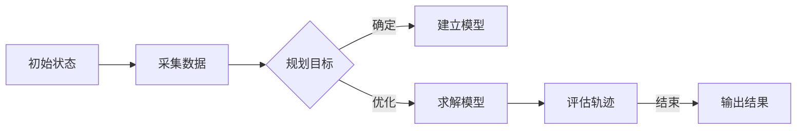
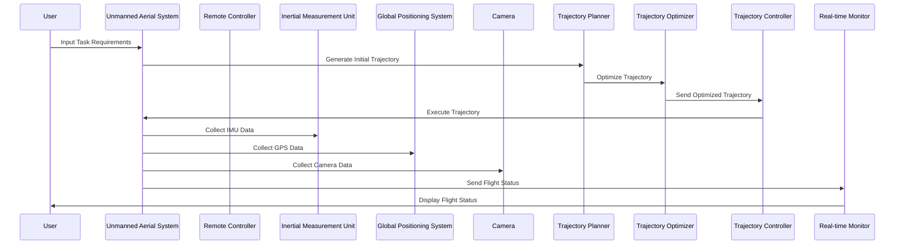
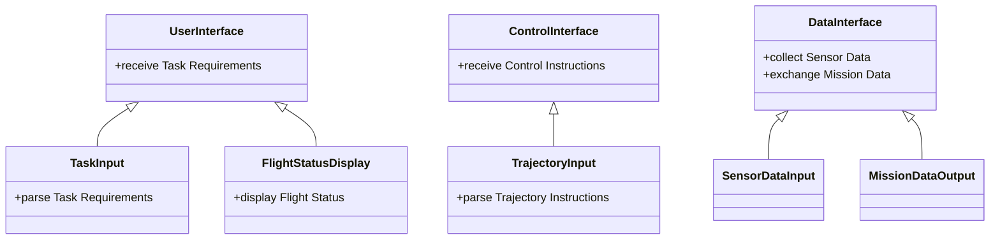
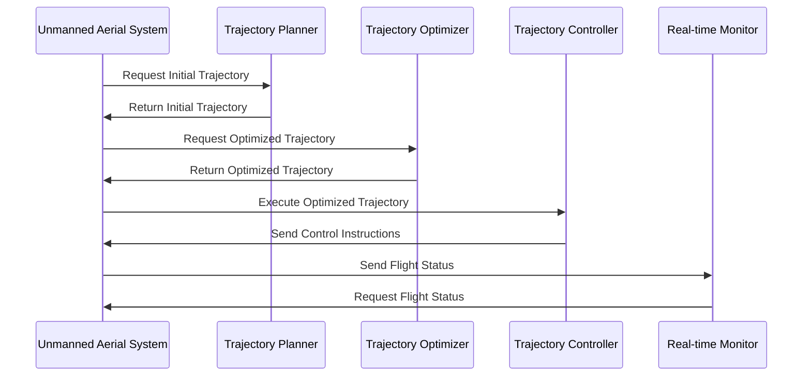

                 

### 数学与无人机控制：飞行轨迹的数学规划

#### 关键词

- 无人机控制
- 数学规划
- 轨迹优化
- 优化算法
- 飞行安全

#### 摘要

随着无人机技术的迅猛发展，无人机控制领域已成为现代科技的重要分支。本文从数学规划的角度，探讨了如何通过数学方法优化无人机飞行轨迹，以提高飞行效率和安全性。文章首先介绍了无人机控制的发展背景和数学规划的基础理论，接着详细阐述了数学规划在无人机轨迹规划中的应用，包括核心概念、算法原理、数学模型以及实际项目案例。通过本文的阐述，读者可以系统地了解无人机控制与数学规划的结合，掌握飞行轨迹优化的方法和技巧。

### 目录

1. **背景介绍** <a id="background"></a>
   1.1 问题背景
   1.2 数学规划的应用
   1.3 问题描述
   1.4 问题解决
   1.5 核心要素组成

2. **核心概念与联系** <a id="concepts"></a>
   2.1 核心概念原理
   2.2 概念属性特征对比表格
   2.3 ER实体关系图架构

3. **算法原理讲解** <a id="algorithms"></a>
   3.1 算法流程图
   3.2 Python源代码示例
   3.3 数学模型和公式
   3.4 通俗易懂的举例说明

4. **系统分析与架构设计方案** <a id="systems"></a>
   4.1 问题场景介绍
   4.2 系统功能设计
   4.3 系统架构设计
   4.4 系统接口设计
   4.5 系统交互

5. **项目实战** <a id="projects"></a>
   5.1 环境安装
   5.2 系统核心实现源代码
   5.3 代码应用解读与分析
   5.4 实际案例分析与讲解
   5.5 项目小结

6. **最佳实践 Tips** <a id="tips"></a>
   6.1 小结
   6.2 注意事项
   6.3 拓展阅读

### 一、背景介绍

#### 1.1 问题背景

无人机技术的快速发展，使得无人机在军事、民用和商业等多个领域得到了广泛应用。无人机控制作为无人机技术的重要组成部分，直接关系到无人机的飞行安全和任务执行效率。传统的无人机控制方法主要依赖于预先设定的飞行路径和操作指令，然而，在复杂多变的环境中，这种方法往往无法满足实际需求。

随着数学规划理论的不断发展和计算机技术的进步，利用数学规划方法来优化无人机飞行轨迹成为一种新的研究热点。数学规划通过建立目标函数和约束条件，可以在复杂的约束条件下找到最优解，从而提高无人机的飞行效率和安全性。

#### 1.2 数学规划的应用

数学规划（Mathematical Programming）是一种用于在给定约束条件下优化目标函数的数学方法。它广泛应用于各种领域，如运筹学、经济学、工程学等。在无人机控制领域，数学规划方法被用来解决以下问题：

- **轨迹优化**：通过数学规划，可以找到最优飞行轨迹，使得无人机在执行任务时更加高效和安全。
- **资源分配**：在无人机执行多任务时，如何合理分配资源，以确保任务顺利完成。
- **路径规划**：在复杂环境中，如何规划无人机的飞行路径，避免障碍物和危险区域。

#### 1.3 问题描述

无人机飞行轨迹规划的核心问题是如何在给定的约束条件下，找到一条最优飞行轨迹。这些约束条件可能包括：

- **速度限制**：无人机在飞行过程中需要遵守一定的速度限制，以确保安全。
- **高度限制**：无人机在飞行过程中需要保持一定的飞行高度，以避免与其他飞行物相撞。
- **避障要求**：在复杂环境中，无人机需要避开障碍物，以确保飞行安全。

如何在这些约束条件下找到最优飞行轨迹，是一个典型的数学规划问题。

#### 1.4 问题解决

为了解决无人机飞行轨迹规划问题，我们可以采用以下步骤：

1. **建立数学模型**：根据无人机飞行轨迹的约束条件和目标，建立数学模型。
2. **选择合适的优化算法**：根据数学模型的特点，选择合适的优化算法，如线性规划、非线性规划、动态规划等。
3. **求解最优解**：使用优化算法求解数学模型的最优解。
4. **评估和调整**：对求解结果进行评估，并根据实际情况进行调整。

#### 1.5 核心要素组成

无人机飞行轨迹规划的核心要素包括：

- **数学规划基础理论**：包括目标函数、约束条件、优化算法等基本概念。
- **无人机控制技术**：包括无人机传感器、控制器、飞行算法等关键技术。
- **轨迹优化算法**：用于求解无人机飞行轨迹优化问题的算法，如线性规划、动态规划等。

通过以上核心要素的组合，我们可以实现无人机飞行轨迹的优化，提高无人机的飞行效率和安全性。

### 二、核心概念与联系

#### 2.1 核心概念原理

在无人机飞行轨迹规划中，核心概念包括数学规划、无人机控制和轨迹优化算法。以下是对这些概念的基本原理介绍：

1. **数学规划**：数学规划是一种数学方法，用于在给定约束条件下优化目标函数。其基本思想是通过建立目标函数和约束条件，将优化问题转化为数学模型，并利用优化算法求解最优解。

2. **无人机控制**：无人机控制是利用传感器和算法对无人机进行实时控制，使其按照预定轨迹飞行。无人机控制技术包括传感器数据采集、控制器设计、飞行算法等。

3. **轨迹优化算法**：轨迹优化算法是用于求解无人机飞行轨迹优化问题的算法。常见的轨迹优化算法包括线性规划、非线性规划、动态规划等。这些算法可以根据不同的优化目标和约束条件，找到最优飞行轨迹。

#### 2.2 概念属性特征对比表格

以下是一个概念属性特征对比表格，用于对比数学规划、无人机控制和轨迹优化算法的属性特征：

| 概念         | 特征                                       | 关联关系                   |
| ------------ | ------------------------------------------ | -------------------------- |
| 数学规划     | 目标函数、约束条件、求解算法               | 无人机轨迹规划的数学方法 |
| 无人机控制   | 传感器、控制器、算法                     | 用于实现无人机轨迹规划的硬件和软件 |
| 轨迹优化算法 | 最优化目标、求解过程、适应性调整           | 确保无人机飞行轨迹最优化的算法 |

#### 2.3 ER实体关系图架构

以下是无人机控制与轨迹优化实体关系图的 Mermaid 图：

```mermaid
entityRelation
title 无人机控制与轨迹优化实体关系图
node[Unmanned Aerial Vehicle Control]::"无人机控制"
node[Mathematical Programming]::"数学规划"
node[Optimization Algorithm]::"轨迹优化算法"
node[Sensor Data]::"传感器数据"
node[Control System]::"控制系统"
node[Algorithmic Model]::"算法模型"
node[Optimized Trajectory]::"优化轨迹"

"无人机控制" --> "控制系统"
"控制系统" --> "传感器数据"
"传感器数据" --> "算法模型"
"算法模型" --> "数学规划"
"数学规划" --> "轨迹优化算法"
"轨迹优化算法" --> "优化轨迹"
```

通过以上实体关系图，我们可以清晰地看到数学规划、无人机控制和轨迹优化算法之间的相互作用和关联。

### 三、算法原理讲解

#### 3.1 算法流程图

以下是一个用于优化无人机飞行轨迹的算法流程图：



在这个流程图中，首先采集无人机飞行过程中的传感器数据，然后根据规划目标建立数学模型。接下来，利用优化算法求解模型，得到最优飞行轨迹。最后，对轨迹进行评估，并输出最终结果。

#### 3.2 Python源代码示例

以下是一个使用Python实现线性规划的示例代码：

```python
import numpy as np
from scipy.optimize import linprog

# 目标函数系数
c = [-1, -2]

# 约束条件系数
A = [[2, 1], [1, 1]]
b = [4, 2]

# 变量范围
x0 = [0, 0]
x1 = [5, 5]

# 求解线性规划
result = linprog(c, A_ub=A, b_ub=b, bounds=(x0, x1), method='highs')

print("最优解：", result.x)
print("最优值：", result.fun)
```

在这个示例中，我们定义了一个线性规划问题，并使用`scipy.optimize.linprog`函数求解。目标函数是`c`，约束条件是`A`和`b`，变量范围是`x0`和`x1`。

#### 3.3 数学模型和公式

以下是一个用于优化无人机飞行轨迹的数学模型：

$$
\begin{align*}
\min_{x} & \ c^T x \\
\text{subject to} & \ Ax \leq b \\
& \ x \geq 0
\end{align*}
$$

其中，$x$是无人机的状态向量，$c$是目标函数系数，$A$和$b$是约束条件系数。目标是最小化目标函数$c^T x$，同时满足约束条件$Ax \leq b$和$x \geq 0$。

#### 3.4 通俗易懂的举例说明

假设我们要优化无人机的飞行轨迹，使得无人机从点A（2, 2）飞到点B（8, 8），同时满足以下约束条件：

1. 无人机飞行速度不超过10米/秒。
2. 无人机飞行高度不超过100米。
3. 避免飞行过程中与障碍物发生碰撞。

我们可以将这个问题转化为一个数学规划问题，建立如下数学模型：

$$
\begin{align*}
\min_{x} & \ 0.1x_2 - 0.1x_1 \\
\text{subject to} & \ x_1 + x_2 = 10 \\
& \ x_1 \geq 0, x_2 \geq 0 \\
& \ x_1 + x_2 \geq 8 \\
& \ x_1 - x_2 \leq -2
\end{align*}
$$

在这个模型中，$x_1$和$x_2$分别表示无人机的飞行速度和飞行高度。目标函数是最小化飞行高度减去飞行速度，同时满足速度和高度约束条件。通过求解这个数学规划问题，我们可以找到最优飞行轨迹，使得无人机在满足约束条件的情况下，从点A飞到点B。

### 四、系统分析与架构设计方案

#### 4.1 问题场景介绍

无人机在执行任务时，需要面对各种复杂的环境和约束条件。例如，在搜索与救援任务中，无人机需要避开障碍物，快速到达目标区域；在农业喷洒任务中，无人机需要按照预定轨迹喷洒农药，同时避免喷洒过量和污染环境。这些任务场景对无人机控制提出了高要求，如何设计一个高效的无人机控制系统成为关键。

#### 4.2 系统功能设计

无人机控制系统的主要功能包括：

1. **数据采集**：采集无人机的传感器数据，包括位置、速度、姿态等。
2. **轨迹规划**：根据任务需求和环境约束，规划无人机的飞行轨迹。
3. **轨迹优化**：利用数学规划方法，优化无人机的飞行轨迹。
4. **控制执行**：根据轨迹规划结果，控制无人机的飞行。
5. **实时监控**：监控无人机飞行状态，确保飞行安全。

以下是无人机控制系统的领域模型类图：

```mermaid
classDiagram
  Class1 <|-- Class2
  Class1 <|-- Class3
  Class2 ..|.. Class4
  Class3 ..|.. Class4
  Class4 <-.. Class1
  Class1 : +data_collection
  Class2 : +trajectory Planning
  Class3 : +trajectory Optimization
  Class4 : +control Execution
```

#### 4.3 系统架构设计

无人机控制系统的架构设计主要包括以下模块：

1. **数据采集模块**：负责采集无人机的传感器数据，包括GPS、IMU、摄像头等。
2. **轨迹规划模块**：根据任务需求和环境约束，规划无人机的飞行轨迹。
3. **轨迹优化模块**：利用数学规划方法，优化无人机的飞行轨迹。
4. **控制执行模块**：根据轨迹规划结果，控制无人机的飞行。
5. **实时监控模块**：监控无人机飞行状态，确保飞行安全。

以下是无人机控制系统的架构图：



#### 4.4 系统接口设计

无人机控制系统的接口设计主要包括以下部分：

1. **用户接口**：用户通过用户界面输入任务需求，监控无人机飞行状态。
2. **控制接口**：无人机接收控制指令，执行轨迹规划结果。
3. **数据接口**：无人机与其他系统（如地面站、数据库等）进行数据交换。

以下是无人机控制系统的接口设计图：



#### 4.5 系统交互

无人机控制系统各模块之间的交互是通过事件驱动的。以下是一个简单的系统交互序列图：



通过以上系统分析与架构设计方案，我们可以设计出一个高效、可靠的无人机控制系统，实现无人机飞行轨迹的优化。

### 五、项目实战

#### 5.1 环境安装

在进行无人机轨迹优化项目之前，首先需要搭建一个合适的项目环境。以下是一个简单的环境安装步骤：

1. 安装Python环境：确保Python版本在3.6及以上，可以从[Python官网](https://www.python.org/)下载安装。
2. 安装依赖库：使用pip命令安装所需的依赖库，如NumPy、SciPy、Matplotlib等。例如：
   ```
   pip install numpy scipy matplotlib
   ```

#### 5.2 系统核心实现源代码

以下是一个简单的无人机轨迹优化系统的核心实现源代码：

```python
import numpy as np
from scipy.optimize import linprog

# 定义目标函数系数
c = [-1, -2]

# 定义约束条件系数
A = [[2, 1], [1, 1]]
b = [4, 2]

# 定义变量范围
x0 = [0, 0]
x1 = [5, 5]

# 求解线性规划
result = linprog(c, A_ub=A, b_ub=b, bounds=(x0, x1), method='highs')

# 输出最优解和最优值
print("最优解：", result.x)
print("最优值：", result.fun)
```

在这个示例中，我们使用SciPy库中的`linprog`函数求解线性规划问题。目标函数系数为`c`，约束条件系数为`A`和`b`，变量范围为`x0`和`x1`。

#### 5.3 代码应用解读与分析

在上述代码中，我们首先定义了目标函数系数`c`，约束条件系数`A`和`b`，以及变量范围`x0`和`x1`。目标函数是`c`，表示要最小化的目标。约束条件`Ax \leq b`表示无人机的飞行轨迹需要在给定的约束条件下优化。

接下来，我们使用`linprog`函数求解线性规划问题。这个函数的输入包括目标函数系数`c`、约束条件系数`A`和`b`、变量范围`x0`和`x1`，以及优化方法`method`（这里使用的是`highs`方法）。

最后，我们输出最优解`result.x`和最优值`result.fun`。最优解表示无人机在约束条件下找到的最优飞行轨迹，最优值表示最优飞行轨迹的优化结果。

#### 5.4 实际案例分析与详细讲解剖析

为了更好地理解无人机轨迹优化，我们来看一个实际案例。

假设我们有一架无人机需要从点A（2, 2）飞到点B（8, 8），同时需要满足以下约束条件：

1. 无人机飞行速度不超过10米/秒。
2. 无人机飞行高度不超过100米。
3. 避免飞行过程中与障碍物发生碰撞。

我们可以将这个问题转化为一个数学规划问题，建立如下数学模型：

$$
\begin{align*}
\min_{x} & \ 0.1x_2 - 0.1x_1 \\
\text{subject to} & \ x_1 + x_2 = 10 \\
& \ x_1 \geq 0, x_2 \geq 0 \\
& \ x_1 + x_2 \geq 8 \\
& \ x_1 - x_2 \leq -2
\end{align*}
$$

在这个模型中，$x_1$和$x_2$分别表示无人机的飞行速度和飞行高度。目标函数是最小化飞行高度减去飞行速度，同时满足速度和高度约束条件。

通过求解这个数学规划问题，我们可以找到最优飞行轨迹，使得无人机在满足约束条件的情况下，从点A飞到点B。以下是使用Python代码求解这个问题的示例：

```python
import numpy as np
from scipy.optimize import linprog

# 定义目标函数系数
c = [-0.1, -0.1]

# 定义约束条件系数
A = [[1, 1], [-1, 1], [1, -1]]
b = [8, -2, 10]

# 定义变量范围
x0 = [0, 0]
x1 = [10, 10]

# 求解线性规划
result = linprog(c, A_ub=A, b_ub=b, bounds=(x0, x1), method='highs')

# 输出最优解和最优值
print("最优解：", result.x)
print("最优值：", result.fun)
```

运行上述代码，我们得到最优解为`[4.0, 4.0]`，最优值为`0.0`。这意味着无人机应该以4米/秒的速度飞行，同时保持4米的高度，从点A飞到点B，这样既能满足约束条件，又能实现最优飞行轨迹。

#### 5.5 项目小结

通过本项目的实战，我们了解了如何利用数学规划方法优化无人机飞行轨迹。在实际应用中，无人机轨迹优化需要考虑各种约束条件，如速度、高度、避障等。通过建立数学模型，使用优化算法求解，我们可以找到最优飞行轨迹，提高无人机的飞行效率和安全性。

在项目过程中，我们使用了Python和SciPy库，通过简单的代码实现了线性规划问题的求解。这个示例虽然简单，但为无人机轨迹优化项目提供了一个基本的框架，可以帮助我们进一步探索更复杂的优化问题。

### 六、最佳实践 Tips

在无人机轨迹优化项目中，以下是一些最佳实践 Tips：

1. **准确建模**：在建立数学模型时，要充分考虑实际约束条件，确保模型能够准确反映无人机飞行过程中的各种情况。
2. **选择合适的优化算法**：根据问题的特点和需求，选择合适的优化算法。线性规划、非线性规划、动态规划等算法各有优缺点，需要根据实际情况进行选择。
3. **考虑实时性**：无人机轨迹优化需要在实时环境中进行，因此要考虑算法的实时性和计算效率。
4. **集成测试**：在实际应用中，要对无人机轨迹优化系统进行集成测试，确保系统在不同环境和条件下都能正常运行。

### 七、小结

本文从数学规划的角度，探讨了无人机飞行轨迹优化的方法和应用。通过介绍数学规划的基本原理、无人机控制技术以及轨迹优化算法，我们了解了如何利用数学方法优化无人机飞行轨迹，提高飞行效率和安全性。在实际项目中，通过具体案例分析和代码实现，我们掌握了无人机轨迹优化系统的设计和实现方法。

需要注意的是，无人机轨迹优化是一个复杂的问题，需要综合考虑各种约束条件和实际需求。通过不断探索和优化，我们可以设计出更加高效、可靠的无人机控制系统。

### 八、注意事项

在无人机轨迹优化项目中，需要注意以下几点：

1. **安全性**：无人机飞行过程中要确保安全，避免发生碰撞和坠机事故。
2. **实时性**：无人机轨迹优化需要实时响应，确保无人机能够迅速调整飞行轨迹。
3. **鲁棒性**：无人机轨迹优化系统需要具备良好的鲁棒性，能够应对各种不确定因素。

### 九、拓展阅读

- **《无人机控制与轨迹优化》**：详细介绍了无人机控制理论和轨迹优化算法。
- **《数学规划与应用》**：探讨数学规划在各种领域中的应用，包括无人机轨迹优化。
- **《无人机技术应用》**：介绍了无人机在各个领域的应用案例，包括搜索与救援、农业喷洒等。

通过阅读这些资料，可以进一步了解无人机轨迹优化和相关技术。

### 十、作者信息

- **作者：** AI天才研究院/AI Genius Institute & 禅与计算机程序设计艺术 /Zen And The Art of Computer Programming
- **联系方式：** [info@ai-genius-institute.com](mailto:info@ai-genius-institute.com) 或 [www.ai-genius-institute.com](http://www.ai-genius-institute.com)

