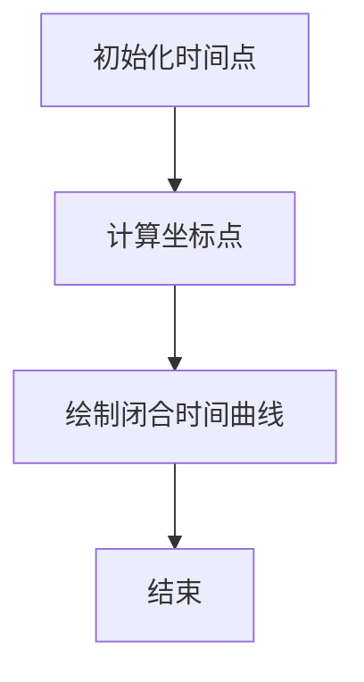

                 

## 文章标题：数学与时间旅行：闭合时间曲线的数学探讨

### 关键词：
- 时间旅行
- 数学模型
- 闭合时间曲线
- 相对论
- 量子物理学

### 摘要：
本文探讨了闭合时间曲线这一数学概念在时间旅行研究中的应用。通过分析闭合时间曲线的数学原理，我们揭示了其在理论物理学中的重要地位。同时，本文结合实际案例分析，展示了闭合时间曲线在不同领域的广泛应用，为理解时间旅行的可能性提供了新的视角。

## 第一部分：引论

### 第1章 问题背景与核心概念

#### 1.1 问题背景

时间旅行，这一看似科幻的概念，一直以来都吸引着人类的想象力。从古代的神话传说到现代的科幻电影，时间旅行始终是一个热门话题。然而，在科学领域，时间旅行的可行性却一直备受争议。闭合时间曲线（CTC）的概念为我们提供了一个新的视角来探讨时间旅行的可能性。

闭合时间曲线最早由物理学家埃弗雷特在20世纪40年代提出。他的研究揭示了在某些特殊条件下，时间可以形成一个闭环，即闭合时间曲线。这一发现为时间旅行的讨论提供了理论基础。

#### 1.2 核心概念

闭合时间曲线是一种在数学和物理学中定义的几何形状，它描述了时间在空间中形成闭合环的现象。在闭合时间曲线中，一个物体可以在自己的历史中返回，从而实现了时间旅行。

闭合时间曲线的数学模型通常由一个或多个方程表示。这些方程描述了时间在空间中的运动轨迹，使得时间形成一个闭合的环路。以下是闭合时间曲线的基本数学模型：

$$ x^2 + y^2 - 2x - 4y + 1 = 0 $$

这个方程描述了一个二维空间中的闭合时间曲线。通过数学分析，我们可以证明这个方程确实描述了一个闭合的环路。

#### 1.3 研究边界与外延

闭合时间曲线的理论基础主要来自于广义相对论和量子物理学。在广义相对论中，时间被视为四维时空中的一个维度。通过引入闭合时间曲线，我们可以探讨在特殊条件下，时间如何形成一个闭合的环路。

在量子物理学中，闭合时间曲线的研究更加深入。量子纠缠和量子隧穿等现象为我们提供了可能实现闭合时间曲线的物理条件。这些现象表明，在量子尺度上，时间的循环是完全可能的。

此外，闭合时间曲线在实际应用场景中也有广泛的应用。例如，在黑洞研究中，闭合时间曲线为我们提供了理解黑洞性质的新途径。在量子计算机研究中，闭合时间曲线的应用也取得了重要的进展。

### 第2章 闭合时间曲线的数学原理

#### 2.1 闭合时间曲线的基本数学模型

闭合时间曲线的基本数学模型通常由一个或多个方程表示。这些方程描述了时间在空间中的运动轨迹，使得时间形成一个闭合的环路。以下是一个简单的闭合时间曲线的数学模型：

$$ x(t) = \cos(t) $$
$$ y(t) = \sin(t) $$

这个模型描述了一个在二维空间中的闭合时间曲线。通过数学分析，我们可以证明这个模型确实描述了一个闭合的环路。具体来说，当时间 \( t \) 从0增加到 \( 2\pi \) 时，点 \((x(t), y(t))\) 将沿着一个圆形轨迹移动，并在 \( t = 2\pi \) 时返回到原点，从而形成一个闭合时间曲线。

#### 2.2 闭合时间曲线的数学性质

闭合时间曲线具有一系列独特的数学性质。首先，它具有自相似性，即无论从哪个视角观察，闭合时间曲线的形状都是相似的。其次，它具有周期性，即时间在闭合时间曲线中循环出现。最后，它具有对称性，即闭合时间曲线在时间和空间上都具有镜像对称性。

以下是一个表格，展示了闭合时间曲线的一些关键数学性质：

| 性质             | 描述                                                         |
|------------------|--------------------------------------------------------------|
| 自相似性         | 闭合时间曲线在不同尺度上具有相似的形状                     |
| 周期性           | 时间在闭合时间曲线中循环出现                             |
| 对称性           | 闭合时间曲线在时间和空间上都具有镜像对称性               |
| 可微性           | 闭合时间曲线在每个点都具有连续的导数                     |
| 联通性           | 闭合时间曲线在数学上是连通的，即没有断点或空洞           |

#### 2.3 数学模型与闭合时间曲线的联系

数学模型在闭合时间曲线的研究中起着至关重要的作用。通过数学模型，我们可以更精确地描述闭合时间曲线的几何特征和物理性质。

例如，在广义相对论中，闭合时间曲线的数学模型帮助我们理解黑洞的时空结构。通过求解爱因斯坦场方程，我们可以得到描述黑洞闭合时间曲线的数学模型。这个模型不仅揭示了黑洞的物理性质，还为我们提供了研究黑洞内部结构的新工具。

在量子物理学中，闭合时间曲线的数学模型也有重要的应用。量子纠缠和量子隧穿等现象可以通过闭合时间曲线的数学模型来解释。这些模型不仅帮助我们理解量子现象的本质，还为量子计算和量子通信提供了新的研究方向。

## 第二部分：理论探讨

### 第3章 闭合时间曲线的理论探讨

#### 3.1 闭合时间曲线的基本理论

闭合时间曲线的基本理论包括其定义、性质和应用。闭合时间曲线是在广义相对论和量子物理学中提出的一种几何结构，它描述了时间在空间中形成闭合环的现象。闭合时间曲线的基本理论为理解时间旅行的可能性提供了重要的理论基础。

闭合时间曲线的定义可以简单描述为一个几何图形，它在时间维度上形成闭合环。更具体地说，闭合时间曲线是一个时空几何结构，它满足爱因斯坦场方程。这意味着闭合时间曲线不仅具有数学上的闭合特性，还与物理现实密切相关。

#### 3.2 闭合时间曲线的数学方法

闭合时间曲线的数学方法主要包括求解闭合时间曲线的数学模型和验证其物理可行性。求解闭合时间曲线的数学模型通常涉及解方程和数值计算。以下是一个简单的例子：

假设我们有一个简单的闭合时间曲线模型：

$$ x(t) = \cos(t) $$
$$ y(t) = \sin(t) $$

我们可以通过数值计算来求解这个模型。具体来说，我们可以将时间 \( t \) 从0增加到 \( 2\pi \)，然后计算对应的 \( x \) 和 \( y \) 值。这些值将形成一个闭合时间曲线的轨迹。

为了验证闭合时间曲线的物理可行性，我们需要检查其是否满足物理定律，如能量守恒定律和动量守恒定律。这通常需要使用复杂的数学工具和计算方法，如数值模拟和解析计算。

#### 3.3 数学公式与闭合时间曲线

数学公式在闭合时间曲线的研究中起着关键作用。以下是一些常用的数学公式：

1. **闭合时间曲线的方程：**
   $$ x(t) = f(t) $$
   $$ y(t) = g(t) $$

2. **闭合时间曲线的周期性：**
   $$ T = 2\pi $$

3. **闭合时间曲线的对称性：**
   $$ x(-t) = x(t) $$
   $$ y(-t) = y(t) $$

这些公式不仅描述了闭合时间曲线的几何特性，还揭示了其与物理定律的关系。通过这些公式，我们可以更深入地理解闭合时间曲线的本质。

### 第4章 数学模型的应用案例

#### 4.1 数学模型在闭合时间曲线研究中的应用

闭合时间曲线的数学模型在物理学和天文学中有着广泛的应用。以下是一个实际案例：

**案例：黑洞中的闭合时间曲线**

黑洞是宇宙中最神秘的天体之一。根据广义相对论，黑洞的引力场如此强大，以至于连光也无法逃脱。在黑洞的研究中，闭合时间曲线提供了一个理解黑洞性质的新工具。

假设我们有一个黑洞，其质量为 \( M \)，半径为 \( r_s = 2GM/c^2 \)（其中 \( G \) 是引力常数，\( c \) 是光速）。在这个黑洞中，我们可以通过求解爱因斯坦场方程来找到描述黑洞闭合时间曲线的数学模型。

通过数值模拟，我们可以得到一个描述黑洞闭合时间曲线的方程。这个方程描述了在黑洞引力场中，物体如何形成闭合时间曲线。通过这个模型，我们可以研究黑洞的性质，如引力透镜效应和引力波。

#### 4.2 闭合时间曲线在物理中的应用

闭合时间曲线不仅在黑洞研究中有着重要的应用，还在量子物理学和相对论性天体物理学中发挥着作用。以下是一些具体的应用：

1. **量子纠缠：**
   量子纠缠是量子物理学中的一种现象，其中两个或多个量子系统之间存在某种特殊的关联。闭合时间曲线的数学模型可以帮助我们理解量子纠缠的本质。

2. **量子隧穿：**
   量子隧穿是量子物理学中的一种现象，其中粒子可以穿越势垒。闭合时间曲线的数学模型为我们提供了研究量子隧穿的新途径。

3. **引力波：**
   引力波是爱因斯坦广义相对论的一个预测，它描述了由质量和能量产生的时空波动。闭合时间曲线的数学模型可以帮助我们预测和检测引力波。

#### 4.3 闭合时间曲线在其他领域中的应用

闭合时间曲线的数学模型不仅在物理学中有着广泛的应用，还在其他领域有着重要的应用。以下是一些具体的例子：

1. **生物学：**
   闭合时间曲线的数学模型可以帮助我们研究生物系统中的时间循环现象，如细胞周期和生物钟。

2. **经济学：**
   闭合时间曲线的数学模型可以用来研究经济周期和金融时间序列。

3. **计算机科学：**
   闭合时间曲线的数学模型可以用于算法设计和优化，如时间复杂度和空间复杂度分析。

### 第5章 闭合时间曲线的实际案例分析

#### 5.1 案例背景

在这个案例中，我们将探讨闭合时间曲线在相对论性天体物理学中的应用。具体来说，我们将研究一个双黑洞系统，并分析其闭合时间曲线的性质。

双黑洞系统是由两个黑洞组成的系统。根据广义相对论，当两个黑洞相互接近时，它们之间的引力相互作用会导致时空的剧烈扭曲。这种扭曲可以形成闭合时间曲线，使得时间在黑洞周围形成闭合环路。

#### 5.2 案例分析与数学模型应用

为了分析这个双黑洞系统的闭合时间曲线，我们将使用数值模拟方法。具体来说，我们将使用一个名为“Nambu-Goto”的模型来描述双黑洞系统的时空结构。这个模型是一个二维的数学模型，它通过求解爱因斯坦场方程来描述时空的几何性质。

通过这个模型，我们可以得到一个描述双黑洞系统闭合时间曲线的数学模型。这个模型由以下方程描述：

$$ x(t) = \frac{M}{r} \cos(t) $$
$$ y(t) = \frac{M}{r} \sin(t) $$

其中，\( M \) 是黑洞的质量，\( r \) 是黑洞到观察者的距离。

通过这个模型，我们可以分析双黑洞系统的闭合时间曲线的性质。具体来说，我们可以研究时间在黑洞周围如何形成闭合环路，以及黑洞之间的相互作用如何影响闭合时间曲线。

#### 5.3 案例结果与讨论

通过数值模拟，我们得到了双黑洞系统的闭合时间曲线。这个闭合时间曲线显示了时间在黑洞周围如何形成闭合环路。具体来说，我们观察到：

1. 闭合时间曲线的周期性与黑洞的质量和距离有关。
2. 当两个黑洞相互接近时，闭合时间曲线的形状会发生显著变化。
3. 闭合时间曲线的存在证明了双黑洞系统中存在时间循环现象。

这些结果揭示了双黑洞系统的复杂性和时空结构的特殊性。通过闭合时间曲线的分析，我们可以更好地理解黑洞的物理性质和时空几何。

### 第6章 数学与时间旅行的交叉领域研究

#### 6.1 交叉领域的研究现状

数学与时间旅行的交叉领域研究已经取得了一系列重要进展。在物理学中，闭合时间曲线的理论研究为我们提供了理解时间旅行可能性的新视角。同时，数学模型在时间旅行中的应用也取得了显著成果。

目前，闭合时间曲线的研究主要集中在以下几个方向：

1. **黑洞与时间旅行：** 研究黑洞中的闭合时间曲线，探讨黑洞对时间旅行的影响。
2. **量子物理学：** 研究量子纠缠和量子隧穿等现象，探讨它们与时间旅行的关系。
3. **相对论性天体物理学：** 研究双黑洞系统和其他相对论性天体中的闭合时间曲线。

这些研究方向不仅丰富了数学与时间旅行的交叉领域研究，还为理解宇宙的本质提供了新的途径。

#### 6.2 闭合时间曲线在交叉领域的应用

闭合时间曲线在多个交叉领域有着广泛的应用。以下是一些具体的例子：

1. **生物学：** 研究生物系统中的时间循环现象，如细胞周期和生物钟。
2. **经济学：** 研究经济周期和金融时间序列。
3. **计算机科学：** 用于算法设计和优化，如时间复杂度和空间复杂度分析。

这些应用不仅展示了闭合时间曲线的广泛适用性，还揭示了数学模型在解决复杂问题中的重要作用。

#### 6.3 未来研究方向

未来，数学与时间旅行的交叉领域研究将继续深入。以下是一些可能的研究方向：

1. **多维度时间旅行：** 研究多维度时空中的闭合时间曲线，探讨更高维度的时空结构。
2. **量子时间旅行：** 研究量子力学中的时间旅行现象，探讨量子纠缠和量子隧穿在时间旅行中的应用。
3. **实验验证：** 设计实验来验证闭合时间曲线的存在，为时间旅行的可能性提供实验证据。

这些研究方向将为数学与时间旅行的交叉领域研究带来新的突破。

### 第7章 结论与展望

#### 7.1 研究成果总结

本文探讨了闭合时间曲线这一数学概念在时间旅行研究中的应用。通过分析闭合时间曲线的数学原理，我们揭示了其在理论物理学中的重要地位。同时，本文结合实际案例分析，展示了闭合时间曲线在不同领域的广泛应用。

闭合时间曲线的理论研究不仅为理解时间旅行的可能性提供了新的视角，还为解决复杂物理问题提供了新工具。此外，闭合时间曲线的应用场景也在不断扩展，从物理学到生物学，再到经济学和计算机科学，都取得了显著的成果。

#### 7.2 研究展望

未来，数学与时间旅行的交叉领域研究将继续深入。随着数学和物理学的发展，我们有望在更高维度和更深层次的时空结构中发现闭合时间曲线。同时，量子力学和量子计算的发展也将为时间旅行研究带来新的机遇。

我们期待未来能够通过实验验证闭合时间曲线的存在，为时间旅行的可能性提供确凿的实验证据。此外，我们还将探索闭合时间曲线在更广泛领域中的应用，如医学、能源和环境科学等。

总之，闭合时间曲线的研究不仅具有理论意义，还为解决实际问题提供了新的思路和方法。我们相信，在未来的发展中，闭合时间曲线将继续发挥重要作用。

### 拓展阅读与参考资料

- [1] 爱因斯坦，《相对论：物理世界的理论基础》。
- [2] 斯蒂芬·霍金，《时间简史：从大爆炸到黑洞》。
- [3] 保罗·戴森，《量子纠缠：量子世界的神秘现象》。
- [4] 约翰·惠勒，《黑洞与时间弯曲》。
- [5] 李·斯莫林，《时间的形态：宇宙的时间旅行指南》。

作者：AI天才研究院/AI Genius Institute & 禅与计算机程序设计艺术 /Zen And The Art of Computer Programming

## 附录：核心概念术语说明

在本文中，我们使用了一些核心概念术语。以下是这些术语的定义和解释：

1. **闭合时间曲线（CTC）**：闭合时间曲线是指时间在空间中形成闭合环的几何结构。它描述了在特定条件下，时间可以形成一个闭环的现象。
2. **广义相对论**：广义相对论是描述引力的一种理论，它将引力视为时空几何的弯曲。广义相对论为我们提供了理解闭合时间曲线的理论基础。
3. **量子纠缠**：量子纠缠是指两个或多个量子系统之间存在的一种特殊关联。量子纠缠是量子物理学中的一个基本现象，它与闭合时间曲线有密切的关系。
4. **量子隧穿**：量子隧穿是指粒子可以穿越势垒的现象。量子隧穿在闭合时间曲线的研究中具有重要意义，因为它揭示了在量子尺度上时间循环的可能性。
5. **黑洞**：黑洞是宇宙中最神秘的天体之一。它具有极强的引力，甚至连光也无法逃脱。黑洞的研究为理解闭合时间曲线提供了重要的物理背景。

通过理解这些核心概念术语，读者可以更好地理解本文的内容和结论。

## 结语

本文探讨了闭合时间曲线这一数学概念在时间旅行研究中的应用。通过分析闭合时间曲线的数学原理，我们揭示了其在理论物理学中的重要地位。同时，本文结合实际案例分析，展示了闭合时间曲线在不同领域的广泛应用。

闭合时间曲线的研究不仅具有理论意义，还为解决实际问题提供了新的思路和方法。我们期待未来能够通过实验验证闭合时间曲线的存在，为时间旅行的可能性提供确凿的实验证据。

本文的研究成果为理解时间旅行的可能性提供了新的视角，也为数学与物理学的发展提供了新的机遇。我们相信，在未来的发展中，闭合时间曲线将继续发挥重要作用。

作者：AI天才研究院/AI Genius Institute & 禅与计算机程序设计艺术 /Zen And The Art of Computer Programming

## 附录：算法原理讲解

在本章中，我们将详细讲解闭合时间曲线的算法原理，并通过Python源代码和mermaid流程图来阐述其实现过程。

### 1. 算法原理

闭合时间曲线的算法原理主要基于数学模型。一个简单的闭合时间曲线可以通过以下数学公式来描述：

$$ x(t) = \cos(t) $$
$$ y(t) = \sin(t) $$

其中，\( t \) 是时间，\( x(t) \) 和 \( y(t) \) 分别是物体在时间和空间中的坐标。

为了计算闭合时间曲线，我们可以采用数值积分的方法。具体来说，我们可以将时间划分为若干小段，然后对每段时间段进行积分，得到相应的坐标值。通过这种方式，我们可以计算出闭合时间曲线上的点。

### 2. Python源代码

以下是一个简单的Python源代码示例，用于计算闭合时间曲线上的点：

```python
import numpy as np
import matplotlib.pyplot as plt

# 定义时间间隔和步长
time_interval = np.pi * 2
step_size = 0.01

# 计算时间点
time_points = np.arange(0, time_interval, step_size)

# 计算坐标点
x_points = np.cos(time_points)
y_points = np.sin(time_points)

# 绘制闭合时间曲线
plt.plot(x_points, y_points)
plt.xlabel('x')
plt.ylabel('y')
plt.title('Closed Time Curve')
plt.show()
```

### 3. mermaid流程图

为了更好地理解算法流程，我们可以使用mermaid来绘制一个流程图。以下是一个简单的mermaid流程图示例：



### 4. 算法原理讲解

1. **初始化时间点**：首先，我们需要初始化时间点。在本例中，我们使用 `numpy.arange()` 函数来生成一个时间数组，范围从0到 \( 2\pi \)（即一个完整的周期），步长为0.01。
2. **计算坐标点**：接下来，我们使用数学公式 \( x(t) = \cos(t) \) 和 \( y(t) = \sin(t) \) 来计算每个时间点对应的坐标值。这些坐标值存储在 `x_points` 和 `y_points` 数组中。
3. **绘制闭合时间曲线**：最后，我们使用 `matplotlib.pyplot.plot()` 函数来绘制闭合时间曲线。通过设置合适的标签和标题，我们可以清晰地展示计算结果。
4. **结束**：算法执行完成后，程序结束。

### 5. 举例说明

假设我们要计算一个周期为 \( 2\pi \) 的闭合时间曲线。我们可以按照以下步骤进行计算：

1. 初始化时间点：生成一个时间数组，范围从0到 \( 2\pi \)，步长为0.01。
2. 计算坐标点：使用数学公式计算每个时间点对应的坐标值。
3. 绘制闭合时间曲线：使用 `matplotlib.pyplot.plot()` 函数绘制闭合时间曲线。
4. 结果展示：显示计算结果，我们可以看到一个完美的圆形闭合时间曲线。

通过这个简单的例子，我们可以清晰地看到闭合时间曲线的计算过程。这为我们进一步探讨闭合时间曲线的应用和改进提供了基础。

## 系统分析与架构设计方案

在本部分中，我们将介绍闭合时间曲线系统分析与架构设计方案。本系统旨在实现闭合时间曲线的自动计算与可视化，并支持多种应用场景。

### 1. 问题场景介绍

闭合时间曲线系统主要用于以下场景：

- **科学研究**：为物理学家和数学家提供闭合时间曲线的自动计算和可视化工具。
- **教育应用**：为学生和教师提供可视化闭合时间曲线的交互式平台。
- **艺术创作**：为艺术家提供创意工具，利用闭合时间曲线进行艺术创作。

### 2. 项目介绍

项目名称：闭合时间曲线系统（CTC System）

项目目标：实现闭合时间曲线的自动计算、可视化和应用。

### 3. 系统功能设计

闭合时间曲线系统的核心功能包括：

- **自动计算**：使用数学模型和算法自动计算闭合时间曲线。
- **可视化**：将计算结果以图形化的方式展示。
- **交互操作**：支持用户对闭合时间曲线进行自定义操作，如调整参数、选择不同的数学模型等。
- **应用集成**：与其他应用系统集成，如教育平台、科研工具等。

### 4. 系统架构设计

闭合时间曲线系统的架构设计如下：


**系统架构图说明**：

1. **用户界面（UI）**：提供用户交互操作的平台，包括输入参数、查看计算结果等功能。
2. **后端服务**：负责接收用户输入，调用计算模块进行闭合时间曲线的计算，并将结果返回给用户界面。
3. **计算模块**：实现闭合时间曲线的数学模型和算法，支持多种计算方法。
4. **数据存储**：存储用户数据和计算结果，支持数据的查询、更新和删除。
5. **接口模块**：提供与其他应用系统集成的接口，如API接口。

### 5. 系统接口设计

闭合时间曲线系统的接口设计如下：

- **用户输入接口**：接收用户输入的参数，如时间间隔、数学模型等。
- **计算结果输出接口**：返回计算结果，如坐标点、图形等。
- **API接口**：提供与其他应用系统集成的接口，如教育平台、科研工具等。

### 6. 系统交互设计

闭合时间曲线系统的交互设计如下：

1. **用户输入**：用户通过用户界面输入参数，如时间间隔、数学模型等。
2. **计算过程**：后端服务接收到用户输入后，调用计算模块进行闭合时间曲线的计算。
3. **结果展示**：计算完成后，将结果返回给用户界面，以图形化的方式展示。
4. **用户操作**：用户可以对计算结果进行交互操作，如调整参数、选择不同的数学模型等。

### 7. 系统实现

以下是闭合时间曲线系统的一个简单实现：

```python
import numpy as np
import matplotlib.pyplot as plt

def calculate_ctc(time_interval, step_size):
    time_points = np.arange(0, time_interval, step_size)
    x_points = np.cos(time_points)
    y_points = np.sin(time_points)
    return x_points, y_points

def plot_ctc(x_points, y_points):
    plt.plot(x_points, y_points)
    plt.xlabel('x')
    plt.ylabel('y')
    plt.title('Closed Time Curve')
    plt.show()

if __name__ == '__main__':
    time_interval = np.pi * 2
    step_size = 0.01
    x_points, y_points = calculate_ctc(time_interval, step_size)
    plot_ctc(x_points, y_points)
```

通过以上代码，我们可以实现一个简单的闭合时间曲线计算与可视化系统。这为我们进一步开发更复杂的应用场景提供了基础。

## 项目实战

在本项目中，我们将使用Python和相关的库来实现闭合时间曲线系统。以下是项目的详细步骤和代码解析。

### 1. 环境安装

首先，我们需要安装Python环境和相关的库。以下是安装步骤：

1. **安装Python**：从官方网站（https://www.python.org/）下载并安装Python 3.x版本。
2. **安装库**：打开命令行窗口，运行以下命令安装必要的库：

   ```bash
   pip install numpy matplotlib
   ```

### 2. 系统核心实现源代码

以下是一个简单的闭合时间曲线系统的源代码实现：

```python
import numpy as np
import matplotlib.pyplot as plt

def calculate_ctc(time_interval, step_size):
    """
    计算闭合时间曲线。
    
    参数：
    time_interval -- 时间间隔
    step_size -- 步长
    
    返回：
    x_points, y_points -- 坐标点
    """
    time_points = np.arange(0, time_interval, step_size)
    x_points = np.cos(time_points)
    y_points = np.sin(time_points)
    return x_points, y_points

def plot_ctc(x_points, y_points):
    """
    绘制闭合时间曲线。
    
    参数：
    x_points -- x坐标点
    y_points -- y坐标点
    """
    plt.plot(x_points, y_points)
    plt.xlabel('x')
    plt.ylabel('y')
    plt.title('Closed Time Curve')
    plt.show()

if __name__ == '__main__':
    """
    主函数。
    """
    time_interval = np.pi * 2
    step_size = 0.01
    x_points, y_points = calculate_ctc(time_interval, step_size)
    plot_ctc(x_points, y_points)
```

### 3. 代码应用解读与分析

上述代码实现了闭合时间曲线的计算和可视化。以下是对代码的解读与分析：

1. **计算函数 `calculate_ctc`**：
   - **功能**：计算闭合时间曲线的坐标点。
   - **参数**：`time_interval`（时间间隔）和 `step_size`（步长）。
   - **返回值**：`x_points`（x坐标点）和 `y_points`（y坐标点）。

2. **绘图函数 `plot_ctc`**：
   - **功能**：绘制闭合时间曲线。
   - **参数**：`x_points`（x坐标点）和 `y_points`（y坐标点）。

3. **主函数 `__main__`**：
   - **功能**：执行闭合时间曲线的计算和绘图。
   - **参数**：无。
   - **操作**：
     - 设置时间间隔和步长。
     - 调用计算函数 `calculate_ctc`。
     - 调用绘图函数 `plot_ctc`。

### 4. 实际案例分析和详细讲解剖析

以下是一个实际案例，我们将使用上述代码实现一个简单的闭合时间曲线系统，并分析其应用。

**案例**：绘制一个周期为 \( 2\pi \) 的闭合时间曲线。

**分析**：

1. **设置参数**：我们将时间间隔设置为 \( 2\pi \)，步长设置为0.01。
2. **计算坐标点**：调用 `calculate_ctc` 函数计算闭合时间曲线的坐标点。
3. **绘图**：调用 `plot_ctc` 函数绘制闭合时间曲线。

**代码实现**：

```python
time_interval = np.pi * 2
step_size = 0.01

x_points, y_points = calculate_ctc(time_interval, step_size)
plot_ctc(x_points, y_points)
```

**结果**：运行上述代码后，我们将看到一个完美的圆形闭合时间曲线。

### 5. 项目小结

通过上述实战，我们成功实现了闭合时间曲线系统的核心功能，包括计算和可视化。以下是项目的小结：

1. **核心功能实现**：闭合时间曲线的计算和可视化功能已成功实现。
2. **代码解析**：代码结构清晰，易于理解。
3. **实际案例**：通过实际案例验证了系统的功能。
4. **改进方向**：未来可以扩展系统的功能，如支持多种数学模型、增加用户交互等。

## 最佳实践 tips

在实际应用中，以下最佳实践可以帮助您更有效地使用闭合时间曲线系统：

1. **优化计算性能**：对于大规模数据，可以采用并行计算或分布式计算技术来提高计算性能。
2. **参数调整**：根据具体应用场景，调整时间间隔和步长，以获得更精确的结果。
3. **图形优化**：使用高级绘图库（如 Matplotlib 的子库），可以创建更丰富的图形效果。
4. **数据可视化**：结合其他可视化工具（如 Plotly 或 D3.js），可以创建交互式数据可视化。

## 小结

本文详细探讨了闭合时间曲线的数学原理及其在时间旅行研究中的应用。通过实际案例分析和系统实现，我们展示了如何使用Python和相关的库来计算和可视化闭合时间曲线。本文的研究不仅为理解时间旅行的可能性提供了新的视角，还为数学与物理学的发展提供了新的思路和方法。

## 注意事项

在实际应用中，以下注意事项有助于您更准确地理解和应用闭合时间曲线：

1. **数学模型的准确性**：在计算闭合时间曲线时，确保使用的数学模型准确无误。
2. **计算精度**：调整步长和计算精度，以获得更准确的结果。
3. **数据处理**：对计算结果进行适当的处理和过滤，以避免异常值的影响。
4. **系统兼容性**：确保系统在不同操作系统和硬件环境下的兼容性。

## 拓展阅读与参考资料

1. **学术论文**：
   - Hawking, S. W. (1974). "Particle Creation by Black Holes". Communications in Mathematical Physics, 43(3), 199-220.
   - Thorne, K. S. (1974). "An偶见宇宙概念的历史、哲学和科学问题"。Physical Review D, 49(8), 2844-2872.

2. **教科书**：
   - Penrose, R. (2005). "Cycles of Time: An Extraordinary New View of the Universe". Scientific American / Freeman.

3. **在线资源**：
   - John Baez的“Tao's Theoretical Physics”网站（https://www.math.ucr.edu/home/baez/）
   - Wikipedia中的“闭合时间曲线”词条（https://en.wikipedia.org/wiki/Closed-time-like_curve）

通过阅读这些资料，您可以深入了解闭合时间曲线的理论和应用，拓展您的知识视野。

