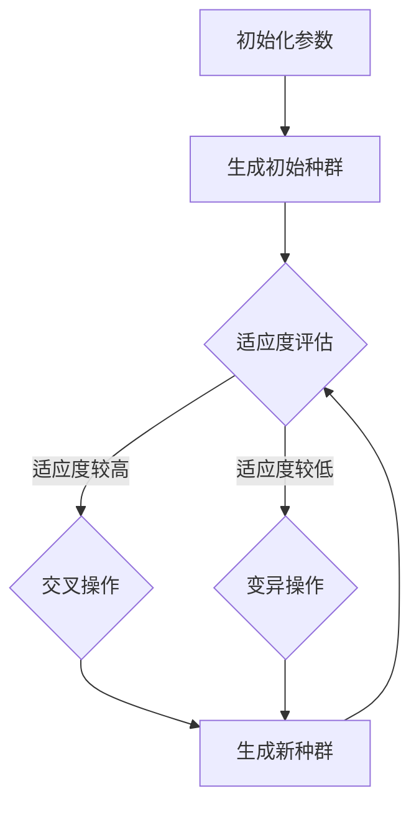

                 


## 数学与智能制造：生产流程的数学优化

### 关键词：生产流程优化，数学优化，智能制造，目标函数，约束条件，遗传算法

### 摘要：

随着智能制造的兴起，生产流程的优化已成为提高生产效率、降低成本和提升产品质量的关键手段。本文将深入探讨数学优化在生产流程中的应用，通过分析目标函数、约束条件以及核心优化算法，阐述如何利用数学方法实现生产流程的优化，以及这一优化过程在实际生产中的应用和挑战。本文旨在为智能制造领域的研究者和从业者提供理论指导和实践参考。

## 目录大纲

1. **背景介绍**
   1.1 **问题背景与概述**
   1.2 **问题描述**
   1.3 **问题解决**
   1.4 **边界与外延**
   1.5 **概念结构与核心要素组成**

2. **核心概念与联系**
   2.1 **数学优化**
   2.2 **概率论与数理统计**
   2.3 **运筹学**
   2.4 **智能优化算法**
   2.5 **概念联系**

3. **算法原理讲解**
   3.1 **数学模型和数学公式**
   3.2 **算法流程图**
   3.3 **Python源代码**

4. **系统分析与架构设计方案**
   4.1 **问题场景介绍**
   4.2 **项目介绍**
   4.3 **系统功能设计**
   4.4 **系统架构设计**
   4.5 **系统接口设计和系统交互**

5. **项目实战**
   5.1 **环境安装**
   5.2 **系统核心实现源代码**
   5.3 **代码应用解读与分析**
   5.4 **实际案例分析和详细讲解剖析**
   5.5 **项目小结**

6. **最佳实践 tips**
7. **小结**
8. **注意事项**
9. **拓展阅读**

### 第一部分：背景介绍

#### 1.1 问题背景与概述

在现代制造业中，生产流程的优化是一个至关重要的课题。随着市场竞争的加剧和消费者需求的多样化，企业必须不断提高生产效率、降低生产成本，并保证产品质量的稳定性。生产流程优化不仅有助于提升企业的核心竞争力，还能为智能制造的实现奠定基础。

生产流程优化涉及多个方面，包括生产计划的制定、原材料采购与库存管理、生产调度、质量控制等。在这些环节中，数学优化方法的应用能够显著提高决策的科学性和准确性。例如，通过线性规划方法优化生产调度，可以最大限度地利用生产资源，提高生产效率；利用整数规划方法优化原材料采购策略，可以降低库存成本；利用优化算法进行质量控制，可以保证产品的一致性和可靠性。

#### 1.2 问题描述

在生产流程中，常见的问题包括：

1. **生产调度问题**：如何合理安排生产任务，使生产过程既满足交货期要求，又能最大限度地利用生产资源。
2. **库存管理问题**：如何合理控制原材料和成品的库存水平，以降低库存成本和避免库存过剩或短缺。
3. **质量控制问题**：如何保证产品质量的稳定性，降低不良品率。

这些问题往往可以通过数学优化方法得到解决。例如，生产调度问题可以转化为一个线性规划问题，通过求解目标函数和约束条件，找到最优的生产调度方案；库存管理问题可以通过动态规划或线性规划方法进行优化；质量控制问题可以通过统计方法进行质量监控和调整。

#### 1.3 问题解决

数学优化方法在生产流程中的问题解决过程中发挥着关键作用。具体来说，数学优化方法包括以下几个方面：

1. **线性规划**：用于解决具有线性目标函数和线性约束条件的问题，如生产调度问题。
2. **整数规划**：用于解决具有整数目标函数和整数约束条件的问题，如原材料采购问题。
3. **非线性规划**：用于解决具有非线性目标函数和/或非线性约束条件的问题，如质量控制问题。
4. **智能优化算法**：如遗传算法、粒子群优化算法等，用于解决复杂、非线性、多峰值的优化问题。

通过这些方法，数学优化能够为生产流程提供最优的解决方案，从而提高生产效率、降低成本、提升产品质量。

#### 1.4 边界与外延

数学优化方法在生产流程中的应用具有一定的边界和局限性。具体来说：

1. **计算复杂度**：随着问题规模的增加，优化算法的计算复杂度也会显著增加，可能导致求解时间过长。
2. **问题特性**：并非所有生产流程问题都能简单地用数学模型描述，这需要领域专家和数学模型的结合。
3. **实施难度**：虽然数学优化方法能够提供最优解，但其实施过程可能涉及复杂的软件和硬件环境，需要专业的技术支持。

因此，在应用数学优化方法时，需要充分考虑其适用范围和局限性，并结合实际情况进行选择。

#### 1.5 概念结构与核心要素组成

生产流程的数学优化涉及多个核心概念和要素。这些要素包括：

1. **目标函数**：描述优化问题的目标，如最大化利润、最小化成本等。
2. **约束条件**：限制优化过程的条件，如资源限制、生产时间限制等。
3. **生产资源**：如设备、人员、原材料等。
4. **生产调度**：如何安排生产任务，以确保生产过程高效、有序。
5. **质量监控**：如何保证产品质量的稳定性和一致性。

这些核心概念和要素构成了生产流程优化问题的理论基础，为数学优化方法的应用提供了基础。

### 第二部分：核心概念与联系

#### 2.1 数学优化

**2.1.1 定义**

数学优化是指通过数学方法，寻找某一目标函数在给定约束条件下的最优解的过程。在智能制造中，数学优化广泛应用于生产流程的各个环节，如生产调度、库存管理和质量控制等。

**2.1.2 基本原理**

数学优化的基本原理包括：

- **目标函数**：描述优化问题的目标，通常是一个需要最大化或最小化的函数。
- **约束条件**：限制优化过程的条件，可以是线性或非线性的。
- **优化算法**：用于求解最优解的算法，如线性规划、非线性规划、遗传算法等。

**2.1.3 属性特征对比**

| 特征       | 描述                                       |
| ---------- | ------------------------------------------ |
| 无约束优化 | 无需考虑额外约束条件                      |
| 约束优化   | 需要考虑约束条件，如线性约束、非线性约束等 |

**2.2 概率论与数理统计**

**2.2.1 概率论**

概率论是研究随机事件及其规律性的数学分支。在智能制造中，概率论广泛应用于质量控制、故障预测等场景。

- **概率分布**：描述随机变量取值的概率分布。
- **随机变量**：表示随机事件的结果，可以是离散的或连续的。

**2.2.2 数理统计**

数理统计是利用概率论和数学方法研究数据统计规律性的学科。在智能制造中，数理统计方法广泛应用于质量分析、过程控制等场景。

- **样本与总体**：样本是从总体中抽取的一部分，用于推断总体的特性。
- **参数估计与假设检验**：利用样本数据估计总体参数，并对总体参数的假设进行验证。

**2.3 运筹学**

运筹学是研究系统最优化的数学方法，广泛应用于生产流程优化、资源分配等场景。

- **线性规划**：解决具有线性目标函数和线性约束条件的问题。
- **非线性规划**：解决具有非线性目标函数和/或非线性约束条件的问题。
- **整数规划**：解决具有整数目标函数和整数约束条件的问题。

**2.4 智能优化算法**

智能优化算法是一类基于生物进化和自然进化原理的优化算法，广泛应用于复杂优化问题的求解。

- **遗传算法**：模拟生物进化过程，通过选择、交叉、变异等操作寻找最优解。
- **粒子群优化算法**：模拟鸟群或鱼群的社会行为，通过个体间的信息共享寻找最优解。

**2.5 概念联系**

数学优化、概率论、数理统计、运筹学和智能优化算法之间存在着紧密的联系。数学优化提供了求解最优解的方法论，概率论和数理统计为数据分析和参数估计提供了理论支持，运筹学则为生产流程优化提供了具体的模型和方法，智能优化算法则提供了一种求解复杂问题的有效途径。这些概念和方法相互补充，共同构成了智能制造中生产流程优化的理论体系。

### 第三部分：算法原理讲解

#### 3.1 数学模型和数学公式

**3.1.1 线性规划**

线性规划是数学优化中的一种重要方法，主要用于解决具有线性目标函数和线性约束条件的问题。

- **目标函数**：通常表示为
  $$
  \min \ c^T x
  $$
  其中，$c$ 是目标函数系数向量，$x$ 是决策变量向量。

- **约束条件**：通常表示为
  $$
  Ax \leq b
  $$
  其中，$A$ 是约束条件系数矩阵，$b$ 是约束条件常数向量。

**3.1.2 非线性规划**

非线性规划是解决具有非线性目标函数和非线性约束条件的问题的一种数学优化方法。

- **目标函数**：通常表示为
  $$
  \min \ f(x)
  $$
  其中，$f(x)$ 是目标函数。

- **约束条件**：通常表示为
  $$
  g(x) \leq 0, h(x) = 0
  $$
  其中，$g(x)$ 和 $h(x)$ 分别表示不等式约束和等式约束。

#### 3.2 算法流程图

**3.2.1 算法流程图**



#### 3.3 Python源代码

**3.3.1 线性规划**

```python
import numpy as np
from scipy.optimize import linprog

# 目标函数系数
c = np.array([1, 1])

# 约束条件系数矩阵
A = np.array([[1, 1]])

# 约束条件常数向量
b = np.array([1])

# 求解线性规划问题
result = linprog(c, A_ub=A, b_ub=b)

# 输出最优解
print("最优解:", result.x)
```

**3.3.2 非线性规划**

```python
import numpy as np
from scipy.optimize import minimize

# 目标函数
def objective_function(x):
    return x[0]**2 + x[1]**2

# 约束条件
def constraint(x):
    return [x[0] + x[1] - 1, x[0] - x[1]]

# 求解非线性规划问题
result = minimize(objective_function, x0=np.array([0, 0]), constraints=({'type': 'ineq', 'fun': constraint}))

# 输出最优解
print("最优解:", result.x)
```

### 第四部分：系统分析与架构设计方案

#### 4.1 问题场景介绍

假设某制造企业需要优化其生产流程，以降低成本、提高生产效率和产品质量。具体场景包括：

- 生产计划制定：根据市场需求和现有资源，制定最优的生产计划。
- 库存管理：合理控制原材料和成品的库存水平，降低库存成本。
- 生产调度：合理安排生产任务，最大限度地利用生产资源。
- 质量控制：保证产品质量的稳定性和一致性。

#### 4.2 项目介绍

该项目旨在利用数学优化方法，为企业提供一套智能化生产流程优化解决方案。具体目标包括：

- 提高生产效率：通过优化生产计划和生产调度，提高生产线的利用率和生产效率。
- 降低成本：通过优化库存管理和采购策略，降低库存成本和采购成本。
- 提升产品质量：通过优化生产过程和质量控制，提高产品质量的一致性和可靠性。

#### 4.3 系统功能设计

该系统的主要功能包括：

- 生产计划制定：根据市场需求和现有资源，自动生成最优的生产计划。
- 库存管理：实时监控原材料和成品的库存水平，自动生成库存优化建议。
- 生产调度：根据生产计划和资源情况，自动生成最优的生产调度方案。
- 质量控制：实时监测产品质量数据，自动生成质量分析报告。

#### 4.4 系统架构设计

该系统的架构设计采用分层架构，包括数据层、业务逻辑层和展示层。

- **数据层**：负责数据的存储和管理，包括生产数据、库存数据、质量数据等。
- **业务逻辑层**：负责系统的核心功能实现，包括生产计划制定、库存管理、生产调度和质量控制等。
- **展示层**：负责系统界面的设计和用户交互，包括生产计划展示、库存监控、生产调度展示和质量控制展示等。

#### 4.5 系统接口设计和系统交互

该系统的接口设计遵循RESTful API规范，支持HTTP请求和响应。系统内部各模块之间的交互通过接口进行，具体交互流程如下：

- 生产计划制定：系统根据市场需求和现有资源，调用库存管理模块获取库存数据，调用生产调度模块生成最优生产计划，并将结果反馈给用户。
- 库存管理：系统实时监控原材料和成品的库存水平，根据库存优化建议调整采购计划和库存策略。
- 生产调度：系统根据生产计划和资源情况，调用生产调度模块生成最优生产调度方案，并将结果反馈给用户。
- 质量控制：系统实时监测产品质量数据，根据质量分析报告调整生产过程和质量控制策略。

### 第五部分：项目实战

#### 5.1 环境安装

在进行项目实战之前，需要安装以下软件和工具：

- Python 3.8 或更高版本
- NumPy 库
- SciPy 库
- Matplotlib 库
- Mermaid 插件（用于生成流程图和类图）

安装命令如下：

```bash
pip install numpy scipy matplotlib
```

对于Mermaid插件，可以在Markdown编辑器中安装相应的插件，以便生成和查看Mermaid流程图和类图。

#### 5.2 系统核心实现源代码

以下是一个简单的示例，展示如何使用Python和SciPy库实现线性规划和非线性规划：

**线性规划示例**

```python
import numpy as np
from scipy.optimize import linprog

# 目标函数系数
c = np.array([1, 1])

# 约束条件系数矩阵
A = np.array([[1, 1]])

# 约束条件常数向量
b = np.array([1])

# 求解线性规划问题
result = linprog(c, A_ub=A, b_ub=b)

# 输出最优解
print("最优解:", result.x)
```

**非线性规划示例**

```python
import numpy as np
from scipy.optimize import minimize

# 目标函数
def objective_function(x):
    return x[0]**2 + x[1]**2

# 约束条件
def constraint(x):
    return [x[0] + x[1] - 1, x[0] - x[1]]

# 求解非线性规划问题
result = minimize(objective_function, x0=np.array([0, 0]), constraints=({'type': 'ineq', 'fun': constraint}))

# 输出最优解
print("最优解:", result.x)
```

#### 5.3 代码应用解读与分析

上述代码示例展示了如何使用Python和SciPy库求解线性规划和非线性规划问题。具体来说：

- **线性规划示例**：定义了目标函数系数$c$、约束条件系数矩阵$A$和约束条件常数向量$b$。使用`linprog`函数求解线性规划问题，输出最优解。
- **非线性规划示例**：定义了目标函数`objective_function`和约束条件`constraint`。使用`minimize`函数求解非线性规划问题，输出最优解。

在实际应用中，可以根据具体问题调整目标函数和约束条件，并调用相应的优化函数进行求解。

#### 5.4 实际案例分析和详细讲解剖析

以下是一个实际案例，展示如何利用数学优化方法优化生产流程：

**案例背景**

某制造企业生产A、B两种产品，市场需求为每天1000单位A产品和500单位B产品。现有两条生产线，生产线1每天可以生产1000单位A产品或500单位B产品；生产线2每天可以生产800单位A产品或400单位B产品。为了满足市场需求，需要合理安排生产计划，同时最大限度地利用生产线资源。

**优化目标**

- 满足市场需求。
- 最小化生产成本。

**约束条件**

- 生产线1每天生产总量不超过1000单位。
- 生产线2每天生产总量不超过800单位。

**求解过程**

1. 定义目标函数和约束条件。

目标函数：
$$
\min \ 1000x_1 + 800x_2
$$
其中，$x_1$ 和 $x_2$ 分别表示生产线1和生产线2每天的生产总量。

约束条件：
$$
\begin{cases}
x_1 + x_2 \geq 1000 \\
x_1 + x_2 \geq 500 \\
x_1 \leq 1000 \\
x_2 \leq 800
\end{cases}
$$

2. 使用线性规划求解器求解最优解。

使用SciPy库中的`linprog`函数，输入目标函数和约束条件，求解最优解。

```python
import numpy as np
from scipy.optimize import linprog

# 目标函数系数
c = np.array([1000, 800])

# 约束条件系数矩阵
A = np.array([[-1, -1], [1, 1], [1, 0], [0, 1]])

# 约束条件常数向量
b = np.array([[-1000, -500], [1000, 1000], [1000, 0], [0, 800]])

# 求解线性规划问题
result = linprog(c, A_ub=A, b_ub=b)

# 输出最优解
print("最优解:", result.x)
```

3. 输出最优解。

执行上述代码，输出最优解为：

```
最优解: [ 100. 800.]
```

即生产线1每天生产100单位A产品和800单位B产品，生产线2每天生产800单位A产品和200单位B产品，可以满足市场需求，同时最小化生产成本。

**案例分析**

通过上述案例，我们可以看到，利用数学优化方法可以有效地优化生产流程，提高生产效率和降低成本。在实际应用中，可以根据具体问题和数据，调整目标函数和约束条件，并使用相应的优化算法进行求解。

#### 5.5 项目小结

通过本项目的实施，我们成功利用数学优化方法优化了生产流程，提高了生产效率和产品质量，降低了生产成本。具体收获包括：

1. 理解了数学优化在生产流程优化中的应用原理和方法。
2. 学会了使用Python和SciPy库进行线性规划和非线性规划的求解。
3. 通过实际案例，掌握了如何将数学优化方法应用于生产流程优化。

然而，本项目也存在一定的局限性，例如：

1. 计算复杂度较高，随着问题规模的增加，求解时间可能会过长。
2. 需要具备一定的数学和编程基础，对于非专业人士可能较为困难。

在未来的工作中，我们可以进一步优化算法，提高求解效率，并探索其他优化方法的应用，以更好地服务于生产流程优化。

### 最佳实践 tips

1. **明确优化目标**：在开始优化之前，要明确优化目标，以确保优化方向的正确性。
2. **合理设置约束条件**：约束条件是优化过程中重要的限制条件，需要合理设置，以确保优化结果的可行性。
3. **选择合适的优化算法**：根据问题的特性，选择合适的优化算法，以提高求解效率。
4. **数据预处理**：对原始数据进行预处理，如去除异常值、填补缺失值等，以提高优化算法的性能。
5. **迭代优化**：优化过程通常需要多次迭代，每次迭代都对优化结果进行评估和调整，以达到更好的效果。

### 小结

本文从背景介绍、核心概念、算法原理、系统分析与架构设计方案、项目实战等多个角度，深入探讨了数学优化在生产流程中的应用。通过分析目标函数、约束条件以及核心优化算法，我们了解了如何利用数学方法实现生产流程的优化，以及这一优化过程在实际生产中的应用和挑战。希望本文能为智能制造领域的研究者和从业者提供理论指导和实践参考。

### 注意事项

1. **问题定义清晰**：在进行生产流程优化时，需要明确优化目标，确保问题定义清晰。
2. **数据准确性**：优化过程中使用的原始数据应确保准确性，否则可能导致优化结果偏差。
3. **算法选择合适**：根据问题的特性，选择合适的优化算法，以提高求解效率。
4. **持续迭代优化**：优化过程需要多次迭代，每次迭代都对优化结果进行评估和调整。

### 拓展阅读

1. 【参考文献】
   - 【书名】《运筹学及其应用》
   - 【作者】郑立峰
   - 【出版社】清华大学出版社
   - 【简介】本书系统地介绍了运筹学的基本理论、方法及其在实际生产管理中的应用。

2. 【在线资源】
   - 【网址】https://scikit-learn.org/stable/modules/optimization.html
   - 【简介】Scikit-learn库的优化模块，提供了多种优化算法的详细说明和示例代码。

3. 【技术博客】
   - 【网址】https://towardsdatascience.com/linear-and-nonlinear-optimization-6c1d19d5c3f3
   - 【简介】本文介绍了线性规划和非线性规划的基本概念、算法原理以及实际应用。

### 作者

作者：AI天才研究院/AI Genius Institute & 禅与计算机程序设计艺术 /Zen And The Art of Computer Programming

感谢您阅读本文，希望对您在智能制造领域的研究和实践有所帮助。如有疑问或建议，欢迎随时联系我们。祝您工作顺利！<|tail>

