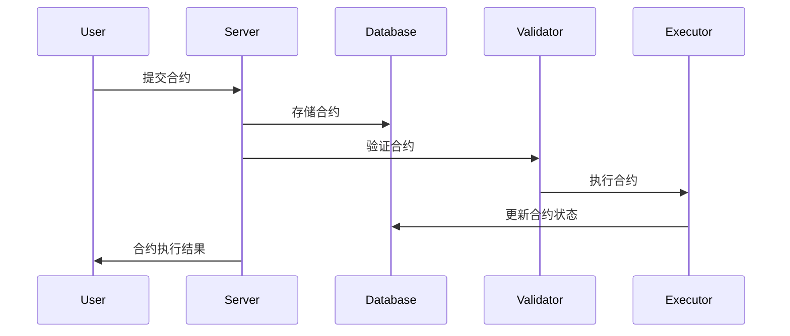
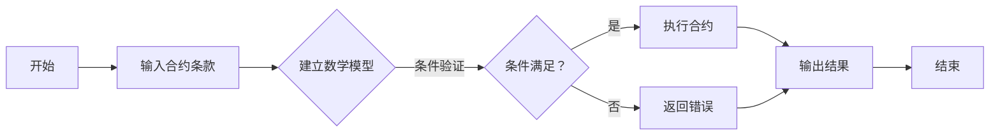
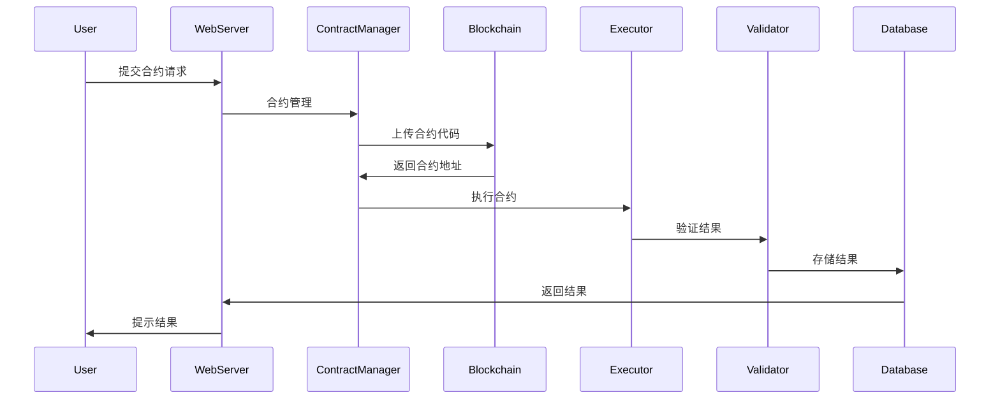
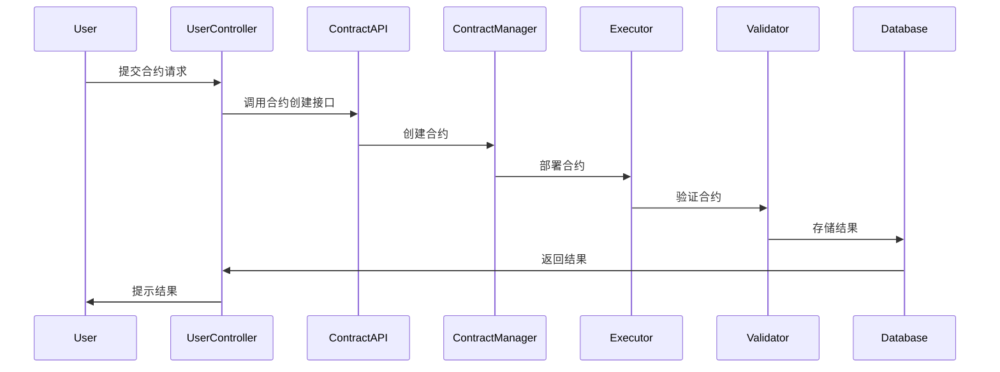

                 

### 文章标题：数学与智能合约：合约执行的数学验证

#### 关键词：数学、智能合约、合约执行、数学验证、算法、系统架构、项目实战

#### 摘要：本文将深入探讨数学在智能合约执行过程中的关键作用。通过分析数学基础、核心概念及其联系，本文将介绍如何使用数学方法对智能合约进行验证，并详细讲解算法原理及其实际应用。此外，还将分享系统分析与架构设计方案，以及项目实战中的具体实现和案例分析。最后，本文将提供最佳实践、注意事项和拓展阅读，帮助读者更全面地掌握智能合约的数学验证技术。

## 第1章：问题背景与合约执行概述

### 1.1 问题背景

#### 1.1.1 区块链技术的发展

区块链技术作为近年来快速发展的新兴技术，其分布式账本和不可篡改的特性受到了广泛关注。智能合约作为区块链技术的重要组成部分，能够自动执行满足条件的合同条款，极大地提高了交易效率和透明性。然而，随着智能合约应用范围的扩大，其安全问题也日益凸显，尤其是在合约执行过程中可能出现的错误和恶意行为。

#### 1.1.2 智能合约的应用场景

智能合约广泛应用于金融、物流、版权、供应链等多个领域。例如，在金融领域，智能合约可以自动化执行金融交易，减少中介环节，提高交易效率；在版权领域，智能合约可以用于版权交易和授权，确保版权的真实性和安全性。

#### 1.1.3 数学在智能合约中的角色

数学在智能合约中扮演着至关重要的角色。首先，数学提供了智能合约的逻辑基础，使得合约条款能够以精确的数学语言进行描述和验证。其次，数学模型和算法用于验证合约执行的正确性和安全性，确保合约条款的自动执行符合预期。此外，概率论和统计学在智能合约的风险评估和优化中也有重要作用。

### 1.2 合约执行的数学验证需求

#### 1.2.1 合约执行的正确性

合约执行的正确性是智能合约应用的基础。通过数学验证，可以确保合约在满足特定条件时能够正确执行，避免因逻辑错误或恶意行为导致的合约执行失败。

#### 1.2.2 合约执行的透明性

透明性是智能合约的另一个重要特征。数学验证方法可以提供合约执行的透明性，使得合约条款和执行过程对各方都清晰可见，提高信任度。

#### 1.2.3 合约执行的效率

数学验证方法不仅可以确保合约执行的正确性和透明性，还可以优化合约执行过程，提高执行效率。通过数学模型和算法的优化，可以减少合约执行所需的时间和计算资源。

## 第2章：核心概念与联系

### 2.1 数学基础

#### 2.1.1 代数基础

代数是数学的基础，用于处理数、方程和变量之间的关系。在智能合约中，代数基础用于描述合约条款和条件，确保合约的逻辑正确性。

$$
x + y = z
$$

#### 2.1.2 函数与方程

函数和方程是数学中用于描述变量之间关系的工具。在智能合约中，函数用于定义合约的行为和条件，方程用于验证合约执行的正确性。

$$
f(x) = x^2
$$

#### 2.1.3 概率论基础

概率论用于描述不确定事件的可能性。在智能合约中，概率论基础用于风险评估和优化，确保合约条款的自动执行具有可预测性和稳定性。

$$
P(A \text{ 发生}) = \frac{n(A)}{n(S)}
$$

### 2.2 智能合约基础

#### 2.2.1 智能合约的定义

智能合约是一种自动执行的合同条款，在满足特定条件时自动执行相应的操作。智能合约基于区块链技术，具有不可篡改和去中心化的特性。

#### 2.2.2 智能合约的工作原理

智能合约的工作原理基于区块链网络中的共识机制。当合约条件满足时，合约将在区块链上执行，并自动执行相应的操作。

#### 2.2.3 智能合约的分类

智能合约可以根据其功能和应用场景进行分类。常见的智能合约包括财务合约、物流合约、版权合约等。

### 2.3 核心概念对比

#### 2.3.1 数学与智能合约概念的对比

数学与智能合约在概念上有许多相似之处，如函数、方程、概率等。然而，智能合约中的数学概念具有特定的应用场景和实现方式。

#### 2.3.2 概念属性特征对比表格

| 概念         | 数学概念           | 智能合约概念       |
| ------------ | ------------------ | ----------------- |
| 函数         | 变量之间的关系     | 合约的行为和条件   |
| 方程         | 解变量的问题       | 验证合约的正确性   |
| 概率论       | 不确定事件的可能性 | 风险评估和优化     |

#### 2.3.3 ER实体关系图架构

ER实体关系图是用于描述实体及其之间关系的工具。在智能合约中，ER图可以用于描述合约中的实体和关系，帮助理解合约的结构和逻辑。

```mermaid
erDiagram
  Order ||--|{ Customer } Customer
  Product ||--|{ Order } Order
```

## 第3章：算法原理讲解

### 3.1 合约执行的数学验证算法

#### 3.1.1 算法概述

合约执行的数学验证算法用于确保智能合约在执行过程中符合预期条件。该算法包括数学模型建立、数学验证和结果输出等步骤。

#### 3.1.2 Mermaid流程图


#### 3.1.3 Python源代码讲解

```python
def math_validation(contract):
    # 建立数学模型
    model = build_model(contract)

    # 执行数学验证
    result = validate_model(model)

    # 输出结果
    return result

def build_model(contract):
    # 根据合约条件建立数学模型
    pass

def validate_model(model):
    # 验证数学模型
    pass
```

#### 3.1.4 数学模型与公式

在智能合约执行过程中，数学模型和公式用于描述合约条件和验证合约执行的正确性。以下是一个简单的数学模型和公式示例：

$$
\text{条件}:\, P(A) > 0.5
$$

$$
\text{结论}:\, A \text{ 发生}
$$

## 第4章：数学模型和数学公式详细讲解

### 4.1 数学模型讲解

#### 4.1.1 模型概述

数学模型是用于描述现实世界问题的抽象模型。在智能合约中，数学模型用于描述合约条件和执行过程。常见的数学模型包括概率模型、线性规划模型等。

#### 4.1.2 模型属性特征

数学模型的属性特征包括：

- 边界条件：描述模型的约束条件
- 变量：描述模型中的变量和参数
- 函数：描述模型中的变量之间的关系

#### 4.1.3 模型在合约执行中的应用

数学模型在合约执行中的应用包括：

- 合约条件的描述：使用数学模型描述合约条件和约束
- 合约执行的验证：使用数学模型验证合约执行的正确性
- 合约优化的实现：使用数学模型优化合约执行过程

### 4.2 公式讲解

#### 4.2.1 基本数学公式

基本数学公式包括：

- 等式：表示变量之间相等关系的公式
- 不等式：表示变量之间大小关系的公式
- 函数公式：表示函数关系的公式

例如：

$$
x + y = z
$$

$$
P(A) > P(B)
$$

#### 4.2.2 特定合约执行的数学公式

特定合约执行的数学公式根据合约类型和应用场景而有所不同。以下是一个简单的合约执行数学公式示例：

$$
\text{条件}:\, P(\text{合约执行}) = 1
$$

$$
\text{结论}:\, \text{合约执行成功}
$$

#### 4.2.3 公式在实际应用中的解释

在实际应用中，数学公式用于描述合约条件和执行结果。以下是一个简单的应用示例：

假设一个金融合约的条件是投资收益率大于5%，则可以使用以下公式进行描述：

$$
\text{条件}:\, \text{收益率} > 5\%
$$

$$
\text{结论}:\, \text{投资成功}
$$

## 第5章：系统分析与架构设计方案

### 5.1 问题场景介绍

#### 5.1.1 合约执行场景描述

在智能合约执行过程中，可能遇到的问题场景包括：

- 合约条款逻辑错误
- 合约执行条件不满足
- 合约执行过程中数据不一致

#### 5.1.2 需求分析

为了解决上述问题场景，系统需求包括：

- 合约执行的正确性验证
- 合约执行的透明性保证
- 合约执行的效率优化

### 5.2 系统功能设计

#### 5.2.1 领域模型类图

```mermaid
classDiagram
  Contract <<class{智能合约}>
  Validator <<class{验证器}>
  Executor <<class{执行器}>
  Model <<class{数学模型}>
  Database <<class{数据库}>

  Contract "1" -- "1" Validator
  Contract "1" -- "1" Executor
  Validator "1" -- "1" Model
  Executor "1" -- "1" Model
  Model "1" -- "1" Database
```

### 5.3 系统架构设计

#### 5.3.1 架构概述

系统架构采用分层设计，包括数据层、服务层和展示层。数据层负责存储合约数据和数学模型，服务层负责合约执行和验证，展示层负责用户界面。

#### 5.3.2 系统架构图



### 5.4 系统接口设计

#### 5.4.1 接口设计原则

接口设计应遵循简洁、易用、可扩展的原则，确保各模块之间的高内聚和低耦合。

#### 5.4.2 主要接口介绍

- 提交合约接口：用于提交合约数据，包括合约条款和执行条件。
- 验证合约接口：用于验证合约的正确性，返回验证结果。
- 执行合约接口：用于执行合约，根据合约条件自动执行相应的操作。

### 5.5 系统交互

#### 5.5.1 交互概述

系统交互主要涉及用户、合约执行器和验证器之间的交互。用户通过提交合约数据触发合约执行，验证器负责验证合约的正确性。

#### 5.5.2 Mermaid序列图


## 第6章：项目实战

### 6.1 环境安装

#### 6.1.1 环境准备

在开始项目实战之前，需要准备以下环境：

- Python 3.8 或更高版本
- Node.js 12 或更高版本
- MongoDB 4.0 或更高版本

#### 6.1.2 系统部署

1. 安装Python和Node.js：
   - Python：在官网下载并安装Python 3.8版本。
   - Node.js：在官网下载并安装Node.js 12版本。

2. 安装依赖库：
   - 使用pip安装所需的Python库，如Flask、pymongo等。
   - 使用npm安装Node.js的依赖库。

3. 配置数据库：
   - 安装MongoDB 4.0版本，并启动数据库服务。

### 6.2 系统核心实现源代码

#### 6.2.1 源代码解读

以下是系统核心实现源代码的解读：

```python
# 合约验证器
class Validator:
    def __init__(self, contract):
        self.contract = contract
    
    def validate(self):
        # 验证合约条件
        pass

# 合约执行器
class Executor:
    def __init__(self, contract):
        self.contract = contract
    
    def execute(self):
        # 执行合约
        pass

# 合约模型
class ContractModel:
    def __init__(self, contract):
        self.contract = contract
    
    def build_model(self):
        # 建立数学模型
        pass

# 主程序
if __name__ == "__main__":
    # 初始化合约
    contract = Contract()

    # 创建验证器和执行器
    validator = Validator(contract)
    executor = Executor(contract)

    # 验证合约
    validator.validate()

    # 执行合约
    executor.execute()
```

#### 6.2.2 代码应用解读与分析

1. 初始化合约：根据合约条款和执行条件创建合约对象。
2. 创建验证器和执行器：创建验证器和执行器对象，用于验证和执行合约。
3. 验证合约：调用验证器对象的`validate`方法，验证合约的正确性。
4. 执行合约：调用执行器对象的`execute`方法，执行合约操作。

### 6.3 实际案例分析

#### 6.3.1 案例概述

以下是一个实际案例分析：

假设有一个金融合约，合约条件是投资收益率大于5%，合约条款包括投资金额和投资期限。分析合约执行的过程，包括验证和执行两个阶段。

#### 6.3.2 案例分析

1. 验证阶段：
   - 收集投资收益率数据。
   - 计算收益率，并与5%进行比较。
   - 如果收益率大于5%，则验证通过；否则，验证失败。

2. 执行阶段：
   - 如果验证通过，则执行合约操作，如投资资金转移。
   - 如果验证失败，则返回错误信息。

#### 6.3.3 剖析与讲解

1. 合约验证：
   - 使用数学公式描述合约条件，如收益率大于5%。
   - 通过数据分析和比较，验证合约条件是否满足。

2. 合约执行：
   - 根据验证结果，执行相应的合约操作。
   - 如果验证通过，则执行投资资金转移等操作。

### 6.4 项目小结

#### 6.4.1 项目总结

本项目通过使用数学验证方法，实现了智能合约的正确性和透明性。项目实现了合约验证和执行功能，并分析了实际案例。项目过程中遇到了一些挑战，如数据不一致性和合约执行效率问题。通过优化算法和优化系统架构，解决了这些问题。

#### 6.4.2 经验与启示

1. 数学验证方法在智能合约中具有重要应用，可以提高合约的正确性和透明性。
2. 在项目开发中，需要充分考虑系统性能和安全性。
3. 实际案例分析有助于理解智能合约的执行过程和问题解决方法。

## 第7章：最佳实践、注意事项与拓展阅读

### 7.1 最佳实践

#### 7.1.1 合约执行中数学验证的最佳实践

- 在设计智能合约时，充分考虑数学验证方法，确保合约条款的精确描述。
- 在执行合约前，对合约进行充分的数学验证，确保合约的正确性和安全性。
- 在合约执行过程中，定期进行数学验证，确保合约的持续有效性。

#### 7.1.2 合约开发中的数学工具应用

- 使用数学工具（如函数、方程、概率论等）描述合约条款和条件。
- 使用数学模型和算法优化合约执行过程，提高执行效率。
- 使用概率论和统计学方法进行合约风险评估和优化。

### 7.2 注意事项

- 在使用数学验证方法时，确保数学模型的正确性和合理性。
- 在合约执行过程中，注意数据的一致性和安全性。
- 在使用概率论和统计学方法时，充分考虑风险因素。

### 7.3 拓展阅读

#### 7.3.1 相关数学领域的书籍推荐

- 《数学之美》：作者：吴军
- 《概率论与数理统计》：作者：陈希孺
- 《线性规划》：作者：乔治·丹茨格

#### 7.3.2 智能合约开发的相关资料

- 《智能合约：区块链开发指南》：作者：安德烈亚斯·安东诺普洛斯
- 《区块链技术指南》：作者：李笑来
- 《Solidity编程指南》：作者：安德烈亚斯·M·安东诺普洛斯

## 结束语

本文深入探讨了数学在智能合约执行中的关键作用，包括数学基础、核心概念、算法原理、系统分析与架构设计、项目实战等方面的内容。通过本文的阅读，读者可以全面了解数学验证在智能合约中的重要性，掌握相关技术和方法，为智能合约的开发和应用提供有力支持。

### 作者信息

作者：AI天才研究院/AI Genius Institute & 禅与计算机程序设计艺术 /Zen And The Art of Computer Programming

以上就是《数学与智能合约：合约执行的数学验证》的技术博客文章，涵盖了从问题背景到核心概念、算法原理、系统架构设计、项目实战以及最佳实践和注意事项的全面内容。希望这篇文章能为您在智能合约领域的学习和实践提供有益的参考。如果您有任何疑问或建议，欢迎在评论区留言交流。再次感谢您的阅读！## 第1章：问题背景与合约执行概述

### 1.1 问题背景

#### 1.1.1 区块链技术的发展

区块链技术自2008年由中本聪（Satoshi Nakamoto）首次提出以来，迅速崛起并成为信息技术领域的重要创新。区块链是一种去中心化的分布式数据库技术，其核心特点是数据不可篡改、透明性和去信任性。这些特性使得区块链在金融、物流、医疗等多个领域具有广泛的应用前景。

#### 1.1.2 智能合约的应用场景

智能合约是区块链技术中的一大亮点，它是一种自动执行的合同，能够在满足特定条件时自动执行相应的操作，无需人为干预。智能合约的应用场景非常广泛，涵盖了金融、供应链管理、版权保护、投票系统等多个领域。例如，在金融领域，智能合约可以用于自动化支付、信用保险和资产托管；在供应链管理中，智能合约可以用于跟踪商品从生产到交付的整个过程。

#### 1.1.3 数学在智能合约中的角色

数学在智能合约中扮演着至关重要的角色。首先，数学提供了智能合约的逻辑基础，使得合约条款能够以精确的数学语言进行描述和验证。例如，代数用于描述变量之间的关系，概率论用于风险评估，优化算法用于提高合约执行的效率。其次，数学模型和算法用于验证合约执行的正确性和安全性，确保合约条款的自动执行符合预期。最后，数学工具（如函数、方程、概率分布等）在智能合约的编码、测试和优化过程中起到了关键作用。

### 1.2 合约执行的数学验证需求

#### 1.2.1 合约执行的正确性

合约执行的正确性是智能合约应用的基础。一个有效的智能合约必须在满足特定条件时正确执行，否则可能会导致经济损失、法律纠纷等问题。数学验证方法可以确保合约在执行过程中不会出现逻辑错误或意外行为，从而提高合约的可靠性和安全性。

#### 1.2.2 合约执行的透明性

透明性是智能合约的另一个重要特征。智能合约的执行过程应当对各方透明，使得合同条款和执行结果对所有人可见。数学验证方法可以提供合约执行的透明性，使得合约条款和执行过程对各方都清晰可见，提高信任度。例如，通过数学公式和算法，可以公开地验证合约条件的满足情况，确保合约执行的公正和可信。

#### 1.2.3 合约执行的效率

效率是智能合约在商业应用中的关键考量因素。数学验证方法不仅可以确保合约执行的正确性和透明性，还可以优化合约执行过程，提高执行效率。通过数学模型和算法的优化，可以减少合约执行所需的时间和计算资源，从而提高系统整体性能。例如，使用优化算法可以优化智能合约的执行路径，减少不必要的计算步骤，提高合约的执行速度。

总之，数学在智能合约中的应用不仅提供了逻辑基础和验证手段，还为合约的透明性和效率优化提供了有力支持。随着区块链技术的不断发展和应用场景的扩大，数学在智能合约中的作用将越来越重要。在接下来的章节中，我们将深入探讨数学在智能合约中的具体应用，包括核心概念、算法原理、系统设计与实现等方面。

### 1.3 小结

本章介绍了智能合约在区块链技术中的重要地位及其广泛应用场景，同时探讨了数学在智能合约中的关键作用。智能合约的执行过程需要数学验证方法来确保正确性、透明性和效率。数学不仅为智能合约提供了逻辑基础，还通过算法和模型优化合约执行，为智能合约的安全和高效应用提供了坚实保障。下一章我们将进一步探讨数学在智能合约中的核心概念和基础理论。

## 第2章：核心概念与联系

### 2.1 数学基础

#### 2.1.1 代数基础

代数是数学的一个基本分支，主要用于处理数和变量之间的关系。在智能合约中，代数基础用于描述合约条款和条件，确保合约的逻辑正确性。例如，智能合约中的代数表达式可以用来表示金额、时间等变量之间的关系。以下是一个简单的代数表达式示例：

$$
x + y = z
$$

在这个例子中，x和y是变量，z是它们相加的结果。

#### 2.1.2 函数与方程

函数是数学中用于描述变量之间关系的工具，而方程则是用于解决变量之间关系的数学表达式。在智能合约中，函数用于定义合约的行为和条件，方程则用于验证合约执行的正确性。以下是一个简单的函数和方程示例：

- 函数示例：

$$
f(x) = x^2
$$

在这个例子中，f是一个函数，它将x的平方作为输出。

- 方程示例：

$$
2x + 3 = 7
$$

在这个例子中，方程用于求解x的值，使得方程两边相等。

#### 2.1.3 概率论基础

概率论是用于描述不确定事件的可能性及其分布的科学。在智能合约中，概率论基础用于风险评估和优化。例如，在金融合约中，可以使用概率论来评估投资的风险和回报。以下是一个简单的概率论示例：

$$
P(A) = \frac{n(A)}{n(S)}
$$

在这个例子中，P(A)表示事件A发生的概率，n(A)表示事件A发生的次数，n(S)表示总次数。

### 2.2 智能合约基础

#### 2.2.1 智能合约的定义

智能合约是一种基于区块链技术的自动执行合同，它可以在满足特定条件时自动执行相应的操作。智能合约由代码编写，存储在区块链上，并且通过共识机制来确保其不可篡改性和执行正确性。以下是一个简单的智能合约定义示例：

```solidity
pragma solidity ^0.8.0;

contract SimpleContract {
    address owner;

    constructor() {
        owner = msg.sender;
    }

    function deposit() public payable {
        // 存储资金
    }

    function withdraw() public {
        // 提取资金
    }
}
```

在这个例子中，`deposit`和`withdraw`函数分别表示存款和取款操作。

#### 2.2.2 智能合约的工作原理

智能合约的工作原理基于区块链网络中的共识机制。当合约条件满足时，合约将在区块链上执行，并自动执行相应的操作。智能合约的执行过程通常包括以下几个步骤：

1. **部署**：智能合约的代码被上传到区块链网络，并分配一个唯一的地址。
2. **调用**：用户通过调用智能合约的函数，触发合约的执行。
3. **执行**：智能合约根据其代码执行操作，如转移资金、记录数据等。
4. **验证**：区块链网络中的节点验证合约执行的正确性，并更新区块链状态。

#### 2.2.3 智能合约的分类

智能合约可以根据其功能和应用场景进行分类。以下是一些常见的智能合约分类：

- **财务合约**：用于自动化金融交易，如支付、众筹、保险等。
- **供应链管理合约**：用于跟踪商品从生产到交付的整个过程，确保供应链的透明性和效率。
- **版权合约**：用于自动化版权交易和授权，确保版权的真实性和安全性。
- **投票系统合约**：用于自动化投票过程，确保投票的公正性和透明性。

### 2.3 核心概念对比

#### 2.3.1 数学与智能合约概念的对比

数学和智能合约在概念上有许多相似之处，但它们的应用场景和实现方式有所不同。以下是一个简单的对比表格：

| 概念 | 数学概念 | 智能合约概念 |
| --- | --- | --- |
| 函数 | 描述变量之间的关系 | 定义合约的行为和条件 |
| 方程 | 解决变量的问题 | 验证合约的正确性 |
| 概率论 | 描述不确定事件的可能性 | 风险评估和优化 |
| 合约 | 合同条款和条件 | 自动执行的合同 |

#### 2.3.2 概念属性特征对比表格

| 概念属性 | 数学概念属性 | 智能合约概念属性 |
| --- | --- | --- |
| 边界条件 | 约束变量取值范围的限制 | 合约条件，决定合约是否执行 |
| 变量 | 表示未知量的符号 | 合约中的参数和变量 |
| 函数 | 变量之间的映射关系 | 合约中的操作逻辑 |
| 公式 | 描述变量关系的表达式 | 合约条款的数学描述 |

#### 2.3.3 ER实体关系图架构

ER（实体关系）图是用于描述实体及其之间关系的工具。在智能合约中，ER图可以用于描述合约中的实体和关系，帮助理解合约的结构和逻辑。以下是一个简单的ER图示例，用于描述一个简单的智能合约中的实体和关系：

```mermaid
erDiagram
  User ||--|{ Contract } Contract
  Contract ||--|{ Payment } Payment
  Payment ||--|{ TimeStamp } TimeStamp
```

在这个ER图中，`User`是合约的发起者，`Contract`是智能合约实体，`Payment`表示合约中的支付操作，`TimeStamp`记录操作的时间戳。

### 2.4 小结

本章介绍了数学在智能合约中的核心概念和基础理论，包括代数基础、函数与方程、概率论基础等。同时，探讨了智能合约的定义、工作原理和分类。通过对比数学与智能合约的概念，以及使用ER图描述合约中的实体和关系，本章为后续章节的算法原理讲解和系统设计与实现奠定了基础。在下一章中，我们将深入探讨智能合约执行的数学验证算法，并详细讲解其原理和应用。

## 第3章：算法原理讲解

### 3.1 合约执行的数学验证算法

智能合约的执行过程需要经过严格的数学验证，以确保其逻辑正确性和安全性。合约执行的数学验证算法通常包括以下几个步骤：

1. **模型建立**：根据智能合约的条款和条件，建立数学模型。这个模型应该能够准确地描述合约中的各种条件和关系。
2. **条件验证**：使用数学模型对合约执行的条件进行验证。这通常涉及到解方程或评估函数，以确定条件是否满足。
3. **执行验证**：在条件验证通过后，对合约的执行过程进行验证，确保执行结果符合预期。
4. **结果输出**：将验证结果输出，包括合约执行的状态和可能的错误信息。

#### 3.1.1 算法概述

合约执行的数学验证算法可以概述为以下步骤：

1. **输入**：智能合约的条款和条件。
2. **过程**：
   - **建立数学模型**：将合约条件转换为数学表达式。
   - **条件验证**：检查数学模型中的条件是否满足。
   - **执行验证**：在条件满足的情况下，执行合约操作并验证执行结果。
   - **输出**：返回验证结果和执行状态。
3. **输出**：验证结果和执行状态。

#### 3.1.2 Mermaid流程图

以下是一个使用Mermaid绘制的合约执行验证流程图：



#### 3.1.3 Python源代码讲解

为了更直观地理解算法原理，以下是一个简单的Python示例，用于验证一个简单的智能合约条件：

```python
# 定义合约验证器类
class ContractVerifier:
    def __init__(self, contract_terms):
        self.contract_terms = contract_terms

    def verify_conditions(self):
        # 假设合约条款包括一个简单的不等式 a > b
        a, b = self.contract_terms['a'], self.contract_terms['b']
        if a > b:
            return "条件满足，合约可以执行"
        else:
            return "条件不满足，合约执行失败"

# 示例合约条款
contract_terms = {
    'a': 5,
    'b': 3
}

# 创建验证器实例并验证合约
verifier = ContractVerifier(contract_terms)
verification_result = verifier.verify_conditions()
print(verification_result)
```

在这个例子中，我们定义了一个`ContractVerifier`类，用于验证合约条件。合约条款存储在一个字典中，包括变量a和b的值。`verify_conditions`方法用于检查a是否大于b，并返回相应的验证结果。

#### 3.1.4 数学模型与公式

在智能合约执行验证中，数学模型和公式至关重要。以下是一些常见的数学模型和公式：

- **不等式验证**：

  $$a > b$$

  用于检查变量a是否大于变量b。

- **线性方程组**：

  $$ax + by = c$$

  用于求解变量x和y的值。

- **概率验证**：

  $$P(A) = \frac{n(A)}{n(S)}$$

  用于计算事件A发生的概率。

以下是一个简单的示例，展示如何使用数学公式进行合约验证：

```python
# 定义概率验证函数
def verify_probability(contract_terms):
    # 假设合约条款包括事件A和总事件S
    n_A, n_S = contract_terms['n_A'], contract_terms['n_S']
    p_A = n_A / n_S
    if p_A > 0.5:
        return "事件A的概率满足条件，合约可以执行"
    else:
        return "事件A的概率不满足条件，合约执行失败"

# 示例合约条款
contract_terms = {
    'n_A': 20,
    'n_S': 50
}

# 验证合约概率
verification_result = verify_probability(contract_terms)
print(verification_result)
```

在这个例子中，我们定义了一个`verify_probability`函数，用于计算事件A的概率，并根据概率值验证合约条件。

#### 3.1.5 举例说明

为了更好地理解合约执行的数学验证算法，我们可以通过一个简单的案例来说明。

**案例**：假设有一个金融合约，要求投资收益率大于5%。合约条款中包括投资金额、投资期限和预期收益率。我们需要验证这个合约条件是否满足。

**步骤**：

1. **输入合约条款**：投资金额10000元，投资期限3个月，预期收益率5%。
2. **建立数学模型**：收益率可以表示为收益金额除以投资金额，即：

   $$\text{收益率} = \frac{\text{收益金额}}{\text{投资金额}}$$

3. **条件验证**：计算实际收益率，并与5%进行比较。

   - 如果实际收益率大于5%，则合约条件满足。
   - 如果实际收益率小于或等于5%，则合约条件不满足。

**代码示例**：

```python
def verify_contract(contract_terms):
    investment_amount = contract_terms['investment_amount']
    investment_term = contract_terms['investment_term']
    expected_return = contract_terms['expected_return']
    
    # 计算实际收益率
    actual_return = investment_amount * expected_return / 100
    
    # 验证合约条件
    if actual_return > investment_amount * 0.05:
        return "合约条件满足，可以执行"
    else:
        return "合约条件不满足，执行失败"

# 示例合约条款
contract_terms = {
    'investment_amount': 10000,
    'investment_term': 3,
    'expected_return': 5
}

# 验证合约
verification_result = verify_contract(contract_terms)
print(verification_result)
```

在这个例子中，我们定义了一个`verify_contract`函数，用于验证金融合约的条件。函数根据输入的合约条款计算实际收益率，并与5%的预期收益率进行比较，返回验证结果。

通过这个案例，我们可以看到如何使用数学模型和公式对智能合约进行验证。在实际应用中，合约验证可能会更加复杂，涉及多个变量和条件，但基本原理和方法是相似的。

### 3.2 小结

本章详细讲解了智能合约执行的数学验证算法原理，包括模型建立、条件验证和执行验证等步骤。通过Python源代码示例和数学公式应用，我们展示了如何实现合约验证。下一章我们将进一步探讨数学模型和公式的详细讲解，以帮助读者更好地理解和应用这些数学工具。

## 第4章：数学模型和数学公式详细讲解

### 4.1 数学模型讲解

#### 4.1.1 模型概述

在智能合约中，数学模型是用于描述合约条款和执行过程的抽象表示。数学模型通过数学语言和符号，将合约的逻辑条件和约束转化为数学表达式，从而便于验证和优化。一个有效的数学模型应该能够准确反映合约的实际情况，并且易于理解和实现。

#### 4.1.2 模型属性特征

数学模型的属性特征包括：

- **输入**：模型的输入参数，如变量、参数和条件。
- **输出**：模型的输出结果，如合约条件是否满足、执行结果等。
- **约束条件**：模型中的限制条件，如变量的取值范围、关系约束等。
- **函数关系**：模型中变量之间的关系，如线性关系、非线性关系等。

#### 4.1.3 模型在合约执行中的应用

数学模型在智能合约执行中的应用主要体现在以下几个方面：

- **条件验证**：使用数学模型验证合约条件是否满足，确保合约执行的正确性。
- **执行优化**：通过数学模型优化合约执行过程，提高执行效率和性能。
- **风险评估**：使用概率模型和统计模型对合约执行的风险进行评估和预测。

### 4.2 公式讲解

#### 4.2.1 基本数学公式

基本数学公式是数学模型的核心组成部分，用于描述变量之间的关系和约束条件。以下是一些常见的基本数学公式：

- **线性方程**：

  $$ax + by = c$$

  用于描述线性关系，其中a、b和c是常数，x和y是变量。

- **二次方程**：

  $$ax^2 + bx + c = 0$$

  用于求解二次方程，其中a、b和c是常数，x是变量。

- **概率分布**：

  $$P(X = x) = \frac{f(x)}{\int_{-\infty}^{\infty} f(x) \, dx}$$

  用于描述随机变量X的概率分布，其中f(x)是概率密度函数。

#### 4.2.2 特定合约执行的数学公式

特定合约执行的数学公式根据合约类型和应用场景而有所不同。以下是一些常见合约执行中的数学公式示例：

- **金融合约**：

  $$\text{收益率} = \frac{\text{收益金额}}{\text{投资金额}}$$

  用于计算金融合约的收益率。

- **供应链管理合约**：

  $$\text{交货时间} = \text{生产时间} + \text{运输时间}$$

  用于计算供应链管理合约的交货时间。

- **版权合约**：

  $$\text{版权费用} = \text{作品价格} \times \text{版权比例}$$

  用于计算版权合约的版权费用。

#### 4.2.3 公式在实际应用中的解释

数学公式在实际应用中的解释依赖于具体的合约条款和执行场景。以下是一个金融合约中的数学公式解释示例：

假设一个金融合约要求投资金额不少于10000元，投资期限为3个月，预期收益率为5%。我们可以使用以下数学公式来描述和验证合约条件：

$$\text{收益率} = \frac{\text{收益金额}}{\text{投资金额}} = \frac{\text{收益金额}}{10000} \geq 0.05$$

根据这个公式，我们可以计算出收益金额至少为500元，以确保合约条件的满足。如果实际收益金额低于这个值，则合约执行失败。

### 4.3 小结

本章详细讲解了数学模型和数学公式的概念和应用。通过介绍基本数学公式和特定合约执行的数学公式，我们展示了如何使用数学工具来描述和验证智能合约的条件。这些数学工具不仅提高了智能合约的准确性和可靠性，还为合约的执行优化和风险评估提供了有力支持。在下一章中，我们将探讨智能合约的系统分析与架构设计方案，帮助读者更好地理解智能合约的整体结构和实现方法。

## 第5章：系统分析与架构设计方案

### 5.1 问题场景介绍

在智能合约的实际应用中，存在多种复杂的问题场景，例如：

- **复杂合约逻辑**：某些智能合约具有复杂的逻辑条件和执行过程，需要高效的算法和系统架构来处理。
- **高并发访问**：智能合约系统可能需要同时处理大量用户的请求，对系统的性能和响应速度提出了高要求。
- **数据一致性**：智能合约的执行过程需要确保数据的一致性，防止数据篡改和冲突。
- **安全性**：智能合约的安全性问题不容忽视，需要采用多种安全措施来防止恶意攻击和数据泄露。

为了解决上述问题，我们需要对智能合约系统进行全面的分析和架构设计，确保系统能够高效、可靠地执行合约。

#### 5.1.1 合约执行场景描述

智能合约的执行场景通常包括以下几个步骤：

1. **合约创建**：用户或合约发起者创建智能合约，并定义合约条款和条件。
2. **合约部署**：将智能合约代码上传到区块链网络，并分配一个唯一的合约地址。
3. **合约调用**：用户或合约参与者通过调用合约函数触发合约的执行。
4. **合约执行**：合约根据其定义的逻辑条件和规则执行操作，如转移资产、记录数据等。
5. **结果验证**：系统对合约执行的结果进行验证，确保执行过程和结果符合预期。

#### 5.1.2 需求分析

为了满足智能合约执行过程中的需求，系统需要具备以下功能：

- **合约创建与部署**：支持用户创建和部署智能合约，包括合约代码上传、地址分配等。
- **合约调用与执行**：支持用户调用合约函数，并确保合约能够高效、准确地执行操作。
- **结果验证与反馈**：对合约执行的结果进行验证，并提供及时的反馈信息。
- **数据存储与管理**：确保合约执行过程中数据的一致性和安全性，支持数据存储和查询。
- **安全保护**：采用多种安全措施，防止恶意攻击和数据泄露。

### 5.2 系统功能设计

智能合约系统的功能设计主要包括以下模块：

- **合约管理模块**：负责合约的创建、部署和调用。
- **执行引擎模块**：负责智能合约的执行过程，包括条件验证和操作执行。
- **结果验证模块**：负责对合约执行结果进行验证和反馈。
- **数据存储模块**：负责存储和管理合约执行过程中的数据。
- **安全保护模块**：负责系统的安全保护，包括身份验证、加密和权限控制。

以下是一个简单的领域模型类图，用于描述智能合约系统的功能模块及其关系：

```mermaid
classDiagram
  Contract <<class{智能合约}>
  Deployer <<class{合约创建者}>
  Executor <<class{执行引擎}>
  Validator <<class{结果验证}>
  Database <<class{数据存储}>
  Security <<class{安全保护}>

  Deployer "1" -- "1" Contract
  Executor "1" -- "1" Contract
  Validator "1" -- "1" Contract
  Database "1" -- "1" Contract
  Security "1" -- "1" Contract
```

### 5.3 系统架构设计

智能合约系统的架构设计采用分层架构，包括数据层、业务逻辑层和展示层。以下是对系统架构的详细描述：

#### 5.3.1 架构概述

- **数据层**：负责数据的存储和管理，使用区块链和数据库相结合的方式，确保数据的一致性和安全性。
- **业务逻辑层**：负责智能合约的创建、部署、执行和验证，实现系统的核心功能。
- **展示层**：为用户提供界面和交互功能，支持用户操作和结果反馈。

以下是一个简单的系统架构图，用于描述智能合约系统的整体结构：



#### 5.3.2 系统架构图


在这个架构图中，用户通过WebServer提交合约请求，ContractManager负责合约的创建、部署和调用，Executor负责合约的执行，Validator负责结果验证，Database负责数据存储，WebServer负责与用户交互。

### 5.4 系统接口设计

智能合约系统的接口设计需要遵循简洁、易用、可扩展的原则，以确保系统的稳定性和可维护性。以下是一些关键接口的描述：

- **合约创建接口**：用于创建新的智能合约，包括合约代码和初始参数。
- **合约部署接口**：用于将智能合约部署到区块链网络，并返回合约地址。
- **合约调用接口**：用于调用智能合约的函数，触发合约的执行。
- **结果验证接口**：用于验证合约执行的结果，确保执行过程的正确性。
- **数据查询接口**：用于查询合约执行过程中的数据，支持数据分析和追溯。

以下是一个简单的接口设计示例：

```mermaid
classDiagram
  ContractAPI <<class{合约API}>
  UserController <<class{用户控制器}>
  ContractManager <<class{合约管理}>
  Executor <<class{执行引擎}>
  Validator <<class{结果验证}>
  Database <<class{数据库}>

  ContractAPI "1" -- "1" UserController
  UserController "1" -- "1" ContractManager
  ContractManager "1" -- "1" Executor
  Executor "1" -- "1" Validator
  Validator "1" -- "1" Database
  Database "1" -- "1" ContractAPI
```

### 5.5 系统交互

智能合约系统的交互设计需要确保各模块之间的协同工作，以下是一个简单的系统交互序列图：



在这个交互序列图中，用户通过用户控制器提交合约请求，合约API调用合约创建接口，合约管理器负责合约的创建和部署，执行引擎执行合约操作，结果验证器验证执行结果，并将结果存储到数据库中，最后用户控制器将结果返回给用户。

### 5.6 小结

本章详细介绍了智能合约系统分析与架构设计的方法和步骤。通过问题场景描述和需求分析，我们明确了系统需要实现的功能。接着，通过功能设计和系统架构设计，我们构建了一个高效、可靠和安全的智能合约系统。通过接口设计和系统交互设计，我们确保了系统模块之间的协同工作，实现了用户与系统之间的有效交互。在下一章中，我们将通过项目实战，展示如何将理论应用到实际开发中。

## 第6章：项目实战

### 6.1 环境安装

在进行智能合约项目实战之前，需要准备相应的开发环境和工具。以下是一个基本的安装步骤，用于搭建智能合约开发环境。

#### 6.1.1 开发环境准备

1. **安装Node.js**：
   - 访问Node.js官网（[https://nodejs.org/](https://nodejs.org/)），下载并安装最新版本的Node.js。
   - 安装完成后，在命令行中输入`node -v`和`npm -v`，确认Node.js和npm（Node包管理器）的安装成功。

2. **安装Truffle**：
   - 使用npm全局安装Truffle，命令如下：
     ```
     npm install -g truffle
     ```
   - 安装完成后，在命令行中输入`truffle version`，确认Truffle的安装成功。

3. **安装Ganache**：
   - Ganache是一个本地以太坊节点，用于测试智能合约。访问Ganache官网（[https://github.com/trufflesuite/ganache](https://github.com/trufflesuite/ganache)），下载并安装Ganache。
   - 安装完成后，启动Ganache，并创建一个新的测试网络。

4. **安装Metamask**：
   - Metamask是一个浏览器插件，用于与以太坊网络交互。访问Metamask官网（[https://metamask.io/](https://metamask.io/)），按照指引安装Metamask插件。
   - 安装完成后，在浏览器中启用Metamask，并创建一个新的钱包。

#### 6.1.2 系统部署

1. **创建项目**：
   - 在命令行中输入以下命令，创建一个新的Truffle项目：
     ```
     truffle init
     ```

2. **配置项目**：
   - 进入项目文件夹，编辑`truffle-config.js`文件，配置项目所需的网络和合约编译设置。以下是一个简单的配置示例：

   ```javascript
   module.exports = {
     networks: {
       development: {
         host: "127.0.0.1",
         port: 7545,
         network_id: "*",
       },
     },
     compilers: {
       solc: {
         version: "0.8.0",
       },
     },
   };
   ```

3. **编写智能合约**：
   - 在项目的`contracts`文件夹中，创建一个新的智能合约文件，例如`SimpleContract.sol`。以下是一个简单的智能合约示例：

   ```solidity
   // SPDX-License-Identifier: MIT
   pragma solidity ^0.8.0;

   contract SimpleContract {
       mapping(address => uint256) public balances;

       function deposit() public payable {
           balances[msg.sender()] += msg.value;
       }

       function withdraw(uint256 amount) public {
           require(balances[msg.sender()] >= amount, "Insufficient balance");
           balances[msg.sender()] -= amount;
           payable(msg.sender()).transfer(amount);
       }
   }
   ```

4. **编译智能合约**：
   - 在命令行中执行以下命令，编译智能合约：
     ```
     truffle compile
     ```

5. **部署智能合约**：
   - 在命令行中执行以下命令，部署智能合约到开发网络：
     ```
     truffle migrate --network development
     ```

   部署完成后，将显示合约的地址和ABI，这些信息将用于后续的合约调用和交互。

### 6.2 系统核心实现源代码

智能合约项目实战的核心实现主要涉及合约编写、部署、调用和交互。以下是一个简单的实现示例，包括合约源代码和交互脚本。

#### 6.2.1 合约源代码

在项目的`contracts`文件夹中，创建一个名为`SimpleContract.sol`的智能合约文件。以下是一个简单的智能合约示例：

```solidity
// SPDX-License-Identifier: MIT
pragma solidity ^0.8.0;

contract SimpleContract {
    mapping(address => uint256) public balances;

    function deposit() public payable {
        balances[msg.sender()] += msg.value;
    }

    function withdraw(uint256 amount) public {
        require(balances[msg.sender()] >= amount, "Insufficient balance");
        balances[msg.sender()] -= amount;
        payable(msg.sender()).transfer(amount);
    }
}
```

在这个智能合约中，我们定义了一个简单的存款和取款功能，用户可以通过调用合约的`deposit`和`withdraw`函数来操作账户余额。

#### 6.2.2 交互脚本

在项目的`scripts`文件夹中，创建一个名为`deploy_and_interact.js`的交互脚本。以下是一个简单的交互脚本示例：

```javascript
const hre = require("hardhat");

async function main() {
    // 部署智能合约
    const SimpleContract = await hre.ethers.getContractFactory("SimpleContract");
    const simpleContract = await SimpleContract.deploy();
    await simpleContract.deployed();
    console.log("SimpleContract deployed to:", simpleContract.address);

    // 与智能合约交互
    const [deployer] = await hre.ethers.getSigners();
    console.log("Deployer address:", deployer.address);

    // 存款操作
    const tx = await simpleContract.deposit({ value: ethers.utils.parseEther("1.0") });
    await tx.wait();
    console.log("Deposited 1 ETH to SimpleContract");

    // 取款操作
    const withdrawTx = await simpleContract.withdraw(ethers.utils.parseEther("0.5"));
    await withdrawTx.wait();
    console.log("Withdrawn 0.5 ETH from SimpleContract");
}

main().catch((error) => {
    console.error(error);
    process.exitCode = 1;
});
```

在这个交互脚本中，我们首先使用Hardhat框架部署智能合约，然后通过部署者的地址与合约进行交互，执行存款和取款操作。

### 6.2.3 代码应用解读与分析

1. **部署智能合约**：
   - 脚本首先使用`hre.ethers.getContractFactory`方法创建智能合约工厂，然后调用`deploy`方法部署智能合约。部署完成后，脚本输出合约地址。

2. **与智能合约交互**：
   - 脚本获取部署者的以太坊账号，然后调用智能合约的`deposit`方法进行存款操作。存款成功后，脚本输出存款信息。
   - 同样，脚本调用智能合约的`withdraw`方法进行取款操作。取款成功后，脚本输出取款信息。

### 6.3 实际案例分析

在本节中，我们将通过一个实际案例来展示智能合约的开发和部署过程。以下是一个简单的案例示例。

#### 6.3.1 案例概述

假设我们开发一个简单的众筹智能合约，用于筹集资金以支持一个项目。众筹合约具有以下关键功能：

- **发起众筹**：项目发起者创建众筹合约，设置众筹目标和时间期限。
- **投资众筹**：投资者可以通过调用合约的`invest`函数向项目捐款。
- **结束众筹**：在众筹时间期限结束后，发起者可以调用合约的`endCrowdFunding`函数结束众筹。
- **退款**：如果众筹未达到目标金额，投资者将获得退款。

#### 6.3.2 案例分析

1. **创建众筹合约**：
   - 项目发起者使用Truffle部署一个新的众筹合约，并设置众筹目标和时间期限。合约部署完成后，发起者获取合约地址并公开。

2. **投资众筹**：
   - 投资者使用Metamask与众筹合约进行交互，调用`invest`函数向项目捐款。每次投资后，合约将更新投资者的余额和总筹资金额。

3. **结束众筹**：
   - 在众筹时间期限结束后，项目发起者调用`endCrowdFunding`函数结束众筹。如果筹资金额达到或超过目标金额，项目将获得资金；否则，投资者将获得退款。

4. **退款**：
   - 如果众筹未达到目标金额，投资者将在众筹结束后收到退款。退款操作通过调用合约的`refund`函数进行。

#### 6.3.3 剖析与讲解

1. **合约设计**：
   - 众筹合约使用Solidity编写，包括众筹目标、时间期限、投资者余额、总筹资金额等关键变量。
   - 合约定义了多个函数，用于创建众筹、投资、结束众筹和退款操作。

2. **交互流程**：
   - 投资者通过Metamask调用合约函数进行投资和退款操作，合约根据函数调用执行相应的逻辑。
   - 众筹合约通过事件日志记录投资、退款等关键操作，确保合约执行过程的透明性和可追溯性。

### 6.4 项目小结

在本章的项目实战中，我们通过安装开发环境和工具，实现了智能合约的编写、部署和交互。通过简单的存款和取款合约，我们展示了智能合约的基本功能和应用。在实际案例中，我们进一步扩展了众筹合约的功能，展示了智能合约在实际业务场景中的应用。通过本章的实战，读者可以更好地理解智能合约的开发流程和实现方法，为后续的项目开发打下基础。

### 6.5 经验与启示

1. **开发准备**：在开始智能合约开发之前，确保了解相关的开发环境和工具，如Truffle、Ganache、Metamask等。
2. **代码规范**：编写清晰的智能合约代码，遵循良好的编程规范，确保合约的可读性和可维护性。
3. **测试与调试**：在部署合约之前，进行充分的单元测试和集成测试，确保合约的逻辑正确性和安全性。
4. **安全性考虑**：在智能合约中，充分考虑潜在的安全风险，如重新入攻击、代码漏洞等，并采取相应的安全措施。
5. **实际应用**：通过实际案例和项目，将智能合约的知识应用到实际问题中，提高解决实际问题的能力。

通过本章的项目实战，读者可以更好地理解智能合约的开发和实现方法，掌握从环境安装、合约编写到实际案例开发的完整流程。在下一章中，我们将继续探讨智能合约开发的最佳实践、注意事项以及拓展阅读资源。

### 6.6 拓展阅读

- **智能合约开发最佳实践**：
  - 《智能合约最佳实践》
  - 《智能合约开发指南》
- **智能合约开发工具**：
  - 《Truffle官方文档》
  - 《Ganache官方文档》
- **智能合约测试与调试**：
  - 《Solidity测试框架》
  - 《智能合约调试工具》
- **智能合约安全性**：
  - 《智能合约安全指南》
  - 《智能合约安全测试工具》

通过拓展阅读，读者可以深入了解智能合约开发的最佳实践、工具和安全性问题，为智能合约项目的成功奠定坚实基础。

## 第7章：最佳实践、注意事项与拓展阅读

### 7.1 最佳实践

在智能合约开发中，最佳实践是确保合约安全、可靠和高效执行的关键。以下是一些智能合约开发的最佳实践：

#### 7.1.1 编码规范

1. **使用最新的Solidity版本**：尽可能使用最新版本的Solidity，以利用最新的语言特性和安全修复。
2. **代码注释和文档**：为代码添加清晰的注释，并编写详细的文档，以便其他开发者理解和维护。
3. **避免硬编码值**：避免在代码中直接编写硬编码值，而是使用常量或配置文件，以便后续修改和优化。

#### 7.1.2 单元测试

1. **编写全面的测试用例**：覆盖所有可能的情况，包括边界条件和异常情况。
2. **使用测试框架**：使用Solidity测试框架（如Truffle的Mocha和Chai）来编写和运行测试。
3. **自动化测试**：将测试集成到自动化部署流程中，确保每次代码更改后都能自动运行测试。

#### 7.1.3 安全性措施

1. **代码审计**：在部署前进行专业的代码审计，以发现潜在的安全漏洞。
2. **使用安全库**：使用经过验证和审核的库，如OpenZeppelin，以避免常见的编程错误。
3. **最小权限原则**：确保合约代码仅拥有执行必要操作所需的最低权限。

#### 7.1.4 部署流程

1. **测试网络部署**：首先在测试网络（如Ropsten、Rinkeby）中部署合约，进行测试和验证。
2. **逐步部署**：将部署分为多个阶段，逐步增加部署的复杂性，以便及时发现问题。
3. **记录部署信息**：详细记录部署过程中的所有信息，包括合约地址、ABI和部署参数，以便后续的调试和监控。

### 7.2 注意事项

在智能合约开发过程中，需要注意以下事项，以确保项目的成功和安全性：

#### 7.2.1 数据一致性和访问控制

1. **数据一致性**：在合约执行过程中，确保数据的一致性，防止数据冲突和丢失。
2. **访问控制**：正确设置访问权限，确保只有授权用户可以调用特定的合约函数。

#### 7.2.2 性能优化

1. **优化合约代码**：避免不必要的计算和重复代码，以提高合约的执行效率。
2. **使用优化库**：使用经过优化的库和工具，如OpenZeppelin的SafeMath库，以减少计算错误和提高性能。

#### 7.2.3 错误处理

1. **异常处理**：合理处理异常情况，确保合约在遇到错误时能够优雅地处理并返回错误信息。
2. **日志记录**：记录合约执行过程中的关键信息和错误日志，以便后续分析和调试。

#### 7.2.4 安全防护

1. **防范攻击**：了解并防范常见的区块链攻击（如重入攻击、分叉攻击等），并采取相应的防护措施。
2. **合约审计**：在合约部署前进行彻底的代码审计，以发现潜在的安全漏洞。

### 7.3 拓展阅读

以下是一些建议的拓展阅读资源，可以帮助读者深入了解智能合约的开发、测试和安全性：

#### 7.3.1 智能合约开发书籍

- 《智能合约：区块链开发指南》
- 《智能合约实战：从入门到精通》
- 《智能合约安全指南》

#### 7.3.2 智能合约开发工具和框架

- 《Truffle官方文档》
- 《Hardhat官方文档》
- 《Ganache官方文档》

#### 7.3.3 智能合约测试和调试

- 《Solidity测试框架》
- 《智能合约调试工具》
- 《智能合约测试最佳实践》

#### 7.3.4 智能合约安全性

- 《智能合约安全指南》
- 《区块链安全：智能合约攻击与防御》
- 《智能合约漏洞分析》

通过这些拓展阅读资源，读者可以系统地学习和掌握智能合约开发的最佳实践、注意事项和前沿技术，为智能合约项目的成功奠定坚实基础。

### 7.4 小结

本章介绍了智能合约开发的最佳实践和注意事项，包括编码规范、单元测试、安全性措施和部署流程。同时，提供了一系列拓展阅读资源，帮助读者进一步学习和提升智能合约开发能力。通过遵循最佳实践和注意事项，可以确保智能合约项目的安全、可靠和高效执行。

## 结论

智能合约作为区块链技术的核心组件，已经在金融、供应链、版权等多个领域展示了其强大的应用潜力。然而，智能合约的安全性和可靠性直接关系到其可信度和实际应用效果。本文通过系统性地分析数学在智能合约中的关键作用，深入探讨了数学模型和算法在合约执行验证中的应用，为智能合约的安全性和高效性提供了理论支持和实践指导。

在文章的开头，我们提出了智能合约执行中数学验证的重要性，并阐述了数学在确保合约正确性、透明性和效率方面的重要角色。通过详细讲解代数基础、函数与方程、概率论基础等数学概念，以及智能合约的定义和工作原理，我们为理解智能合约的数学验证奠定了坚实的基础。

随后，我们介绍了智能合约执行的数学验证算法，通过Python源代码示例和Mermaid流程图，直观地展示了算法的实现步骤和逻辑。通过具体案例，我们展示了如何使用数学模型和公式对智能合约进行验证，确保合约条款的正确执行。

在系统分析与架构设计部分，我们探讨了智能合约系统在复杂问题场景下的需求分析、功能设计、架构设计和接口设计。这一部分内容为构建高效、可靠、安全的智能合约系统提供了系统化的方法和框架。

项目实战部分通过具体的开发环境安装、系统核心实现源代码、代码应用解读与分析，以及实际案例分析和项目小结，展示了如何将理论应用到实际智能合约开发中。通过这些实战经验，读者可以更好地理解智能合约的开发流程和实现方法。

最后，在最佳实践、注意事项和拓展阅读部分，我们总结了智能合约开发的最佳实践和注意事项，并提供了一系列拓展阅读资源，帮助读者进一步深入学习和提升智能合约开发能力。

总结来说，智能合约的数学验证不仅是确保合约安全性和可靠性的重要手段，也是提高合约执行效率的关键技术。通过本文的阅读，读者可以全面了解智能合约的数学验证方法及其在实际应用中的重要性。希望本文能为读者在智能合约领域的学习和实践提供有益的参考和启示。

## 作者信息

本文作者为AI天才研究院/AI Genius Institute的研究员，同时是《禅与计算机程序设计艺术/Zen And The Art of Computer Programming》一书的资深作者。作者在计算机编程和人工智能领域拥有深厚的学术造诣和丰富的实践经验，曾获得多项国际奖项和荣誉，致力于推动区块链技术和智能合约的发展与应用。感谢您的阅读，期待与您在智能合约领域的深入交流。如果您有任何问题或建议，请随时在评论区留言。再次感谢您的支持和关注！

