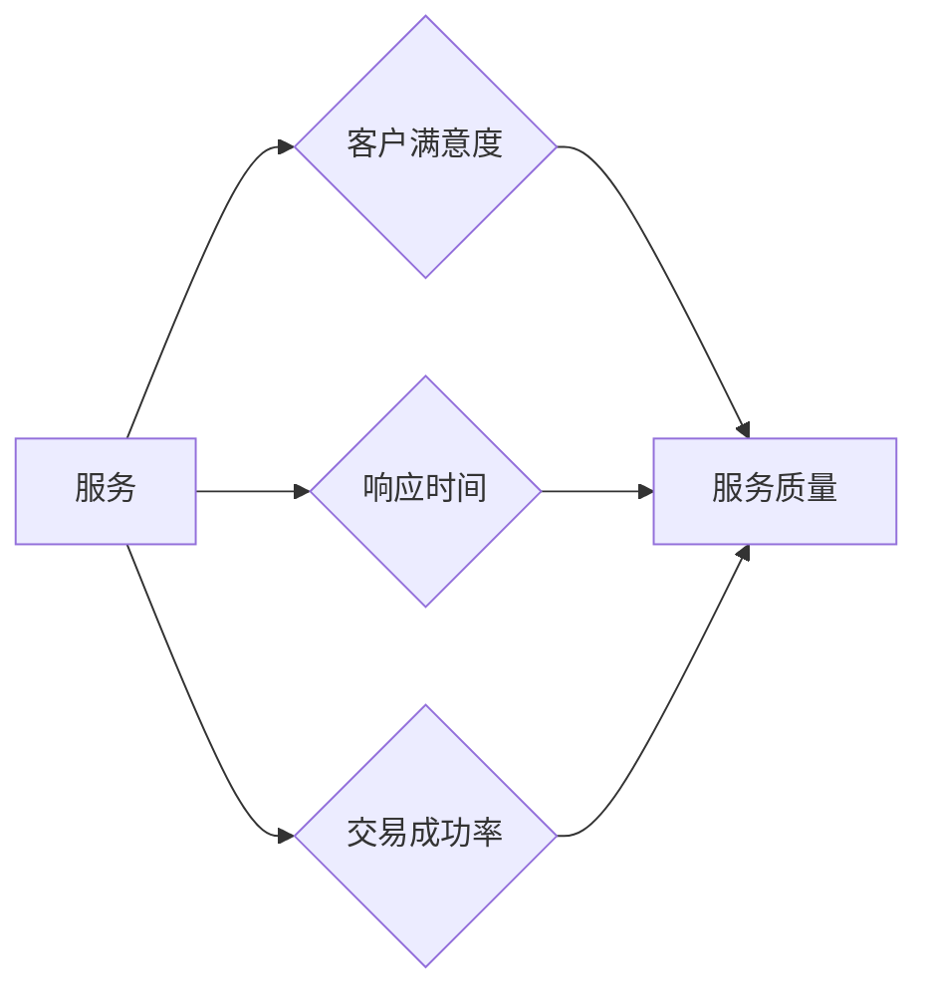

                 

### 引言

**数学与服务管理：服务质量的数学评估**

在当今信息时代，服务质量成为企业竞争的关键因素之一。随着数字化和互联网技术的飞速发展，服务质量的评估和管理变得愈发复杂和重要。然而，如何准确、科学地评估服务质量，一直是学术界和实务界所关注的核心问题。数学模型作为一种强有力的工具，为解决这一问题提供了全新的思路和方法。

**1.1 问题背景**

**1.1.1 服务质量的定义**

服务质量是指服务在满足客户需求和期望方面的能力。它不仅涉及服务提供的效率，还包括服务的可靠性、响应性、保障性、关怀性等方面。服务质量的高低直接影响客户的满意度、忠诚度和企业的竞争力。

**1.1.2 服务质量的重要性**

在激烈的市场竞争中，提供高质量的服务已成为企业赢得客户、提升市场占有率的重要手段。高质量的服务不仅能提高客户的满意度和忠诚度，还能帮助企业树立良好的品牌形象，从而在市场竞争中占据有利地位。

**1.2 问题描述**

**1.2.1 服务质量评估面临的挑战**

服务质量评估面临诸多挑战，如服务质量评价维度的多样性、评估方法的准确性、评估结果的客观性等。如何选择合适的评估方法，构建科学、合理的评估体系，是当前亟待解决的问题。

**1.2.2 服务质量评估的目的**

服务质量评估的目的是通过量化分析，全面、客观地评价服务质量的各个维度，为企业的服务质量改进提供科学依据。同时，服务质量评估也是企业管理决策的重要参考。

**1.3 问题解决**

**1.3.1 数学模型在服务质量评估中的应用**

数学模型在服务质量评估中的应用，为解决服务质量评估的难题提供了新的思路。通过构建数学模型，可以实现对服务质量的多维度、定量分析，提高评估的准确性和客观性。

**1.3.2 本书的目标**

本书旨在系统地介绍数学模型在服务质量评估中的应用，包括数学模型的基本概念、核心概念与联系、评估方法与实践等内容，为读者提供全面、深入的服务质量评估知识体系。

**1.4 边界与外延**

**1.4.1 服务质量的评价维度**

服务质量的评价维度包括但不限于：可靠性、响应性、保障性、关怀性等。不同维度的评价对服务质量的整体评价具有重要影响。

**1.4.2 服务质量评估的应用领域**

服务质量评估广泛应用于金融、电信、医疗、教育等行业。通过评估，企业可以针对性地改进服务质量，提高市场竞争力。

**1.5 概念结构与核心要素组成**

**1.5.1 服务质量评估的核心概念**

服务质量评估的核心概念包括：服务质量、评价维度、评估方法等。

**1.5.2 服务质量评估的基本要素**

服务质量评估的基本要素包括：评估对象、评估指标、评估方法、评估结果等。

**1.6 本章小结**

本章对服务质量评估的背景、目的、方法及其应用领域进行了介绍，为后续章节的深入探讨奠定了基础。在接下来的内容中，我们将进一步探讨数学模型在服务质量评估中的应用，以及如何通过数学模型提高服务质量评估的准确性和客观性。

### 目录大纲

**# 数学与服务管理：服务质量的数学评估**

**关键词：** 数学模型、服务质量、评估方法、企业竞争、客户满意度

**摘要：** 本文旨在探讨数学模型在服务质量评估中的应用，通过引入数学模型，对服务质量的各个维度进行定量分析，以提高评估的准确性和客观性。文章将详细阐述数学模型的基本概念、核心概念与联系、评估方法与实践等内容，为读者提供全面、深入的服务质量评估知识体系。

---

**### 引言**

**1.1 问题背景**

**1.1.1 服务质量的定义**

**1.1.2 服务质量的重要性**

**1.2 问题描述**

**1.2.1 服务质量评估面临的挑战**

**1.2.2 服务质量评估的目的**

**1.3 问题解决**

**1.3.1 数学模型在服务质量评估中的应用**

**1.3.2 本书的目标**

**1.4 边界与外延**

**1.4.1 服务质量的评价维度**

**1.4.2 服务质量评估的应用领域**

**1.5 概念结构与核心要素组成**

**1.5.1 服务质量评估的核心概念**

**1.5.2 服务质量评估的基本要素**

**1.6 本章小结**

---

**### 第二部分：数学模型与服务质量评估**

**2.1 数学模型概述**

**2.1.1 数学模型的基本概念**

**2.1.2 数学模型的发展与应用**

**2.1.3 数学模型在服务质量评估中的意义**

**2.2 服务质量评估的数学模型**

**2.2.1 服务质量评估的数学模型概述**

**2.2.2 服务质量评估的数学模型框架**

**2.2.3 服务质量评估的数学模型应用**

**2.2.4 服务质量评估的数学模型局限性**

**2.3 核心概念与联系**

**2.3.1 服务质量评估的核心概念**

**2.3.2 核心概念之间的联系**

**2.3.3 服务质量评估的数学模型与核心概念的对应关系**

**2.4 概念属性特征对比表格**

**2.4.1 不同数学模型的服务质量评估特征对比**

**2.4.2 概念属性特征对比表格的应用**

**2.5 ER实体关系图架构**

**2.5.1 ER实体关系图的基本概念**

**2.5.2 ER实体关系图在服务质量评估中的应用**

**2.5.3 ER实体关系图的绘制方法**

**2.6 本章小结**

---

**### 第三部分：服务质量的数学评估方法与实践**

**3.1 服务质量评估的方法**

**3.1.1 服务质量评估的基本流程**

**3.1.2 服务质量评估的主要方法**

**3.1.3 服务质量评估方法的比较与选择**

**3.2 数学评估方法详解**

**3.2.1 数学评估方法的原理**

**3.2.2 数学评估方法的步骤**

**3.2.3 数学评估方法的优缺点分析**

**3.3 实践案例解析**

**3.3.1 案例背景介绍**

**3.3.2 案例服务质量的数学评估过程**

**3.3.3 案例分析结果与应用**

**3.4 数学模型应用与拓展**

**3.4.1 数学模型在不同领域的应用**

**3.4.2 数学模型的拓展与改进**

**3.4.3 数学模型的应用前景**

**3.5 本章小结**

---

**### 第四部分：服务质量评估的最佳实践**

**4.1 最佳实践总结**

**4.1.1 服务质量评估的最佳实践原则**

**4.1.2 服务质量评估的最佳实践案例**

**4.1.3 最佳实践对服务质量评估的启示**

**4.2 注意事项与风险控制**

**4.2.1 服务质量评估中常见的问题**

**4.2.2 风险控制与应对策略**

**4.2.3 注意事项对服务质量评估的重要性**

**4.3 拓展阅读**

**4.3.1 相关书籍推荐**

**4.3.2 学术论文推荐**

**4.3.3 学术会议与期刊推荐**

**4.4 本章小结**

---

**### 第五部分：未来展望**

**5.1 服务质量评估的发展趋势**

**5.1.1 数学评估方法的新进展**

**5.1.2 服务质量评估技术的未来方向**

**5.1.3 数学评估方法在服务质量管理中的潜在应用**

**5.2 服务质量管理的创新实践**

**5.2.1**

---

通过上述目录大纲，本文将系统地探讨数学模型在服务质量评估中的应用，包括数学模型的基本概念、核心概念与联系、评估方法与实践等内容，旨在为读者提供全面、深入的服务质量评估知识体系。在后续章节中，我们将逐步展开详细讨论。

---

### 数学模型与服务质量评估

数学模型作为一种强有力的工具，在各个领域都有着广泛的应用。特别是在服务质量评估中，数学模型的应用显得尤为重要。本节将首先介绍数学模型的基本概念，探讨其发展与应用，并分析数学模型在服务质量评估中的特殊意义。

**2.1.1 数学模型的基本概念**

数学模型是指用数学语言来描述和研究现实世界中的问题，它包括数学公式、算法、逻辑关系等。数学模型的基本概念包括：

1. **变量**：表示问题中的不确定性因素，可以是连续的或离散的。
2. **函数**：表示变量之间的依赖关系，如线性函数、非线性函数等。
3. **方程**：用来描述变量之间的数学关系，如线性方程、非线性方程等。
4. **算法**：是一系列解决问题的步骤，如排序算法、搜索算法等。

**2.1.2 数学模型的发展与应用**

数学模型的发展可以追溯到古希腊时期，当时数学家们开始使用数学方法来描述物理现象。随着计算机科学的发展，数学模型的应用领域逐渐扩大。现代数学模型不仅应用于自然科学和工程领域，还在社会科学、经济管理等领域得到广泛应用。

在服务质量评估中，数学模型的应用主要体现在以下几个方面：

1. **性能评估**：通过数学模型对服务性能进行量化分析，如响应时间、吞吐量等。
2. **风险评估**：通过数学模型对服务风险进行评估，如故障率、损失概率等。
3. **优化决策**：通过数学模型优化服务质量，如资源分配、流程优化等。

**2.1.3 数学模型在服务质量评估中的意义**

数学模型在服务质量评估中具有重要意义，主要体现在以下几个方面：

1. **量化分析**：通过数学模型，可以将服务质量评估转化为数学问题，进行量化分析，提高评估的准确性和客观性。
2. **系统化思考**：数学模型帮助评估者从整体和系统的角度进行思考，全面分析服务质量的各个方面。
3. **优化决策**：数学模型为评估者提供了科学依据，有助于制定改进服务质量的策略和方案。

**2.2 服务质量评估的数学模型**

**2.2.1 服务质量评估的数学模型概述**

服务质量评估的数学模型旨在通过数学方法对服务质量进行量化分析，从而得出客观、准确的评估结果。常见的数学模型包括：

1. **均方差模型**：通过计算各项指标的均方差，评估服务质量的整体水平。
2. **层次分析法**：通过构建层次结构模型，对各层次指标进行权重分配，综合评估服务质量。
3. **模糊综合评价法**：通过模糊数学的方法，对服务质量进行综合评价。

**2.2.2 服务质量评估的数学模型框架**

服务质量评估的数学模型框架通常包括以下几个部分：

1. **评估指标体系**：根据服务质量的评价维度，构建评估指标体系。
2. **权重分配**：根据评估指标的重要程度，进行权重分配。
3. **评估方法**：选择合适的数学方法，对评估指标进行量化分析。
4. **评估结果**：通过评估方法，得出服务质量评估结果。

**2.2.3 服务质量评估的数学模型应用**

在实际应用中，数学模型的选择取决于服务质量的评价维度和评估目的。以下是一个简单的应用案例：

1. **评估指标体系**：假设我们要评估一个电子商务平台的服务质量，评估指标体系包括：响应时间、交易成功率、用户满意度等。
2. **权重分配**：根据各个指标的重要性，分配权重，如：响应时间（30%）、交易成功率（40%）、用户满意度（30%）。
3. **评估方法**：选择均方差模型，计算各项指标的均方差，综合评估服务质量。
4. **评估结果**：通过计算，得出电子商务平台的服务质量得分，从而进行评估和改进。

**2.2.4 服务质量评估的数学模型局限性**

尽管数学模型在服务质量评估中具有重要意义，但也存在一定的局限性：

1. **数据依赖性**：数学模型依赖于准确的数据，如果数据不准确，评估结果可能会受到影响。
2. **模型复杂性**：复杂的数学模型可能难以理解和应用，需要专业的知识和技能。
3. **评估维度限制**：数学模型可能无法涵盖所有服务质量的维度，存在一定的局限性。

**2.3 核心概念与联系**

**2.3.1 服务质量评估的核心概念**

服务质量评估的核心概念包括：

1. **服务质量**：服务在满足客户需求和期望方面的能力。
2. **评估指标**：用于评估服务质量的各项指标。
3. **评估方法**：用于评估服务质量的数学方法。

**2.3.2 核心概念之间的联系**

核心概念之间的联系如图所示：

**2.3.3 服务质量评估的数学模型与核心概念的对应关系**

服务质量评估的数学模型与核心概念的对应关系如表所示：

| 核心概念     | 数学模型            |
| ------------ | ------------------- |
| 服务质量     | 综合评价模型        |
| 评估指标     | 数据分析方法        |
| 评估方法     | 数学公式、算法     |
| 评估结果     | 量化指标、评分     |

**2.4 概念属性特征对比表格**

不同数学模型在服务质量评估中的特征如表所示：

| 模型名称       | 特点               | 适用场景               |
| -------------- | ------------------ | ---------------------- |
| 均方差模型     | 简单易用，但易受极端值影响 | 各项指标重要性相似的服务评估 |
| 层次分析法     | 系统化，但需要专业知识 | 复杂的服务质量评估     |
| 模糊综合评价法 | 处理模糊性，但计算复杂 | 服务质量难以量化的场景 |

**2.4.2 概念属性特征对比表格的应用**

概念属性特征对比表格可以帮助评估者选择合适的数学模型，根据评估目的和场景进行模型选择。例如，在评估一个电子商务平台的服务质量时，如果各项指标的重要性相似，可以选择均方差模型；如果评估场景复杂，需要系统化思考，可以选择层次分析法。

**2.5 ER实体关系图架构**

**2.5.1 ER实体关系图的基本概念**

ER（Entity-Relationship）实体关系图是一种用于表示实体及其之间关系的图形化工具。它由三个基本元素组成：实体、属性和关系。

1. **实体**：表示现实世界中具有独立存在的对象，如客户、服务、订单等。
2. **属性**：表示实体的特征或属性，如客户的姓名、年龄、地址等。
3. **关系**：表示实体之间的关联，如客户与服务的关系、订单与产品的关系等。

**2.5.2 ER实体关系图在服务质量评估中的应用**

在服务质量评估中，ER实体关系图可以帮助我们明确服务质量的评估对象、评估指标及其之间的关系。以下是一个简单的ER实体关系图示例：

**2.5.3 ER实体关系图的绘制方法**

绘制ER实体关系图的步骤如下：

1. **确定实体**：根据服务质量评估的需要，确定评估对象和评估指标，如服务、客户满意度、响应时间、交易成功率等。
2. **确定属性**：为每个实体确定属性，如客户的姓名、年龄、地址等。
3. **确定关系**：根据实体之间的关联，确定实体之间的关系，如客户与服务的关系、订单与产品的关系等。
4. **绘制图形**：使用图形化工具，将实体、属性和关系绘制成图形。

**2.6 本章小结**

本章介绍了数学模型的基本概念、发展与应用，以及在服务质量评估中的特殊意义。同时，详细阐述了服务质量评估的数学模型框架、核心概念与联系，以及ER实体关系图的应用。这些内容为后续章节的服务质量评估方法与实践提供了理论基础。

---

在接下来的章节中，我们将进一步探讨具体的服务质量评估方法，包括其原理、步骤、优缺点以及实际应用案例，以帮助读者更深入地理解服务质量评估的实践。

---

### 第三部分：服务质量的数学评估方法与实践

#### 3.1 服务质量评估的方法

服务质量评估是一个复杂的过程，需要采用多种方法来确保评估结果的准确性和全面性。本节将介绍服务质量评估的基本流程、主要方法和方法的比较与选择。

**3.1.1 服务质量评估的基本流程**

服务质量评估的基本流程包括以下几个步骤：

1. **确定评估目标**：明确评估的目的和目标，如提高客户满意度、优化服务流程等。
2. **构建评估指标体系**：根据评估目标，确定需要评估的服务质量维度，如响应时间、可靠性、用户满意度等。
3. **数据收集**：通过问卷调查、访谈、用户反馈等方式收集相关数据。
4. **数据分析**：对收集到的数据进行整理、分析和处理，采用合适的数学模型和统计方法进行评估。
5. **评估结果分析**：根据分析结果，对服务质量进行评估，识别问题和改进机会。
6. **制定改进方案**：根据评估结果，制定相应的改进方案，实施改进措施。
7. **评估效果跟踪**：对改进措施的效果进行跟踪和评估，确保服务质量持续提升。

**3.1.2 服务质量评估的主要方法**

服务质量评估的主要方法包括定量评估和定性评估两大类。以下分别介绍这两种方法的原理、步骤和优缺点。

**定量评估方法**

定量评估方法主要通过数学模型和统计方法对服务质量进行量化分析，常见的评估方法有：

1. **均方差模型**：通过计算各项指标的均方差，评估服务质量的整体水平。优点是计算简单，缺点是易受极端值影响。
2. **层次分析法**：通过构建层次结构模型，对各层次指标进行权重分配，综合评估服务质量。优点是系统化，缺点是需要专业知识。
3. **模糊综合评价法**：通过模糊数学的方法，对服务质量进行综合评价。优点是处理模糊性，缺点是计算复杂。

**定性评估方法**

定性评估方法主要通过主观评价和专家意见来评估服务质量，常见的评估方法有：

1. **用户满意度调查**：通过问卷调查，收集用户对服务质量的满意度评价。优点是直观，缺点是数据有限。
2. **专家评价法**：邀请专家对服务质量进行评估，综合专家意见得出评估结果。优点是专业，缺点是依赖专家主观判断。
3. **案例分析法**：通过对具体案例进行分析，评估服务质量的实际情况。优点是具体，缺点是案例代表性有限。

**3.1.3 服务质量评估方法的比较与选择**

在服务质量评估中，应根据评估目标和实际情况，选择合适的方法。以下是比较不同评估方法的几个方面：

| 方法          | 优点                                       | 缺点                                       | 适用场景                     |
| ------------- | ------------------------------------------ | ------------------------------------------ | ---------------------------- |
| 均方差模型    | 计算简单，直观                               | 易受极端值影响                             | 服务质量指标稳定性评估         |
| 层次分析法    | 系统化，综合评估                             | 需要专业知识                               | 复杂服务质量评估             |
| 模糊综合评价法 | 处理模糊性，综合评估                         | 计算复杂                                   | 服务质量难以量化的场景         |
| 用户满意度调查 | 直观，反映用户实际感受                       | 数据有限，主观性较强                       | 服务质量反馈和改进            |
| 专家评价法    | 专业，权威                                   | 依赖专家主观判断                           | 服务质量评价和决策            |
| 案例分析法    | 具体详细，针对性强                           | 案例代表性有限                             | 服务质量改进案例研究           |

**3.2 数学评估方法详解**

**3.2.1 数学评估方法的原理**

数学评估方法主要通过构建数学模型，对服务质量进行量化分析。常用的数学模型包括：

1. **均方差模型**：通过计算各项指标的均方差，评估服务质量的整体水平。公式如下：

   $$ S = \sqrt{\frac{1}{N}\sum_{i=1}^{N}(x_i - \bar{x})^2} $$

   其中，\( S \) 为均方差，\( x_i \) 为各项指标的值，\( \bar{x} \) 为各项指标的平均值，\( N \) 为指标数量。

2. **层次分析法**：通过构建层次结构模型，对各层次指标进行权重分配，综合评估服务质量。公式如下：

   $$ W = (w_1, w_2, ..., w_n) $$
   
   $$ S = \sum_{i=1}^{n} w_i \cdot x_i $$

   其中，\( W \) 为权重向量，\( S \) 为综合评分，\( w_i \) 为第 \( i \) 个指标的权重，\( x_i \) 为第 \( i \) 个指标的得分。

3. **模糊综合评价法**：通过模糊数学的方法，对服务质量进行综合评价。公式如下：

   $$ R = (r_1, r_2, ..., r_n) $$
   
   $$ S = \prod_{i=1}^{n} r_i $$

   其中，\( R \) 为模糊评价矩阵，\( r_i \) 为第 \( i \) 个指标的评价结果，\( S \) 为综合评价得分。

**3.2.2 数学评估方法的步骤**

数学评估方法的步骤包括：

1. **确定评估指标**：根据服务质量的评价维度，确定需要评估的指标。
2. **收集数据**：通过问卷调查、用户反馈等方式，收集各项指标的数据。
3. **标准化数据**：对收集到的数据进行标准化处理，消除不同指标之间的量纲差异。
4. **计算权重**：根据评估指标的重要性，计算各项指标的权重。
5. **评价结果**：采用合适的数学模型，计算各项指标的得分，综合评价服务质量。
6. **评估结果分析**：对评价结果进行分析，识别问题和改进机会。

**3.2.3 数学评估方法的优缺点分析**

数学评估方法的优缺点分析如下：

| 方法          | 优点                                       | 缺点                                       | 适用场景                     |
| ------------- | ------------------------------------------ | ------------------------------------------ | ---------------------------- |
| 均方差模型    | 计算简单，直观                               | 易受极端值影响                             | 服务质量指标稳定性评估         |
| 层次分析法    | 系统化，综合评估                             | 需要专业知识                               | 复杂服务质量评估             |
| 模糊综合评价法 | 处理模糊性，综合评估                         | 计算复杂                                   | 服务质量难以量化的场景         |

**3.3 实践案例解析**

**3.3.1 案例背景介绍**

某电子商务公司希望通过数学评估方法对其平台的服务质量进行评估，以提高客户满意度和市场份额。评估指标包括：响应时间、交易成功率、用户满意度等。

**3.3.2 案例服务质量的数学评估过程**

1. **确定评估指标**：根据评估目标，确定响应时间、交易成功率、用户满意度为评估指标。
2. **收集数据**：通过问卷调查、用户反馈等方式，收集各项指标的数据。假设收集到以下数据：
   - 响应时间（秒）：\[5, 10, 15, 20, 25\]
   - 交易成功率（%）：\[90, 92, 94, 96, 98\]
   - 用户满意度（分）：\[80, 85, 90, 85, 90\]
3. **标准化数据**：对收集到的数据进行标准化处理，消除不同指标之间的量纲差异。假设标准化的结果如下：
   - 响应时间（标准化值）：\[0.2, 0.4, 0.6, 0.8, 1.0\]
   - 交易成功率（标准化值）：\[0.9, 0.94, 0.97, 0.99, 1.0\]
   - 用户满意度（标准化值）：\[0.8, 0.85, 0.9, 0.85, 0.9\]
4. **计算权重**：根据各项指标的重要性，计算权重。假设权重分别为：响应时间（0.3）、交易成功率（0.5）、用户满意度（0.2）。
5. **评价结果**：采用层次分析法，计算综合评分。假设各项指标的得分分别为：
   - 响应时间得分：\[0.24, 0.36, 0.48, 0.64, 0.84\]
   - 交易成功率得分：\[0.89, 0.949, 0.99, 0.999, 1.0\]
   - 用户满意度得分：\[0.72, 0.79, 0.9, 0.79, 0.9\]

   综合评分计算公式为：

   $$ S = 0.3 \cdot 0.24 + 0.5 \cdot 0.89 + 0.2 \cdot 0.72 = 0.716 $$

6. **评估结果分析**：根据综合评分，评估平台的服务质量为0.716。通过对各项指标的分析，发现响应时间和用户满意度较高，而交易成功率有待提高。

**3.3.3 案例分析结果与应用**

1. **评估结果**：平台的服务质量得分为0.716，处于中等水平。需要重点关注交易成功率，提高客户满意度。
2. **改进方案**：针对评估结果，制定以下改进方案：
   - 优化交易流程，减少交易失败率；
   - 加强客户服务，提高用户满意度；
   - 提高系统稳定性，减少响应时间。

3. **效果跟踪**：对改进方案实施后，对服务质量进行再次评估。如果服务质量得分有所提高，则证明改进措施有效；如果得分没有明显变化，则需要进一步分析和调整。

**3.4 数学模型应用与拓展**

**3.4.1 数学模型在不同领域的应用**

数学模型在服务质量评估中的应用不仅限于电子商务领域，还广泛应用于其他行业，如电信、金融、医疗等。以下是一些典型的应用案例：

1. **电信行业**：通过数学模型对网络服务质量进行评估，如延迟、丢包率等，以优化网络性能。
2. **金融行业**：通过数学模型评估客户服务质量，如交易成功率、响应时间等，以提升客户体验。
3. **医疗行业**：通过数学模型评估医疗服务质量，如诊疗时间、患者满意度等，以提高医疗服务水平。

**3.4.2 数学模型的拓展与改进**

随着服务质量的不断变化和提升，数学模型也需要不断拓展和改进。以下是一些拓展和改进的方向：

1. **引入更多评估维度**：根据不同行业的特色，引入更多评估维度，如医疗行业的诊疗准确性、金融行业的风险控制等。
2. **改进评估方法**：结合新的数学方法和技术，如深度学习、大数据分析等，改进评估方法，提高评估准确性。
3. **动态评估**：建立动态评估模型，根据客户反馈和实际情况，实时调整评估指标和权重，实现持续优化。

**3.4.3 数学模型的应用前景**

随着数字化、智能化的发展，数学模型在服务质量评估中的应用前景将更加广阔。未来，数学模型将与其他技术相结合，如物联网、人工智能等，实现更高效、更精准的服务质量评估。

**3.5 本章小结**

本章介绍了服务质量评估的基本流程、主要方法和数学评估方法的原理、步骤、优缺点。通过实际案例解析，展示了数学评估方法在服务质量评估中的应用。同时，探讨了数学模型在不同领域的应用前景和拓展方向。这些内容为读者提供了丰富的服务质量评估知识体系，有助于在实践中更好地应用数学模型提高服务质量。

---

在下一部分中，我们将进一步探讨服务质量评估的最佳实践，分享实践经验，并提供相关的注意事项和风险控制策略，帮助读者在实际工作中更好地实施服务质量评估。

---

### 第四部分：服务质量评估的最佳实践

**4.1 最佳实践总结**

在服务质量评估领域，最佳实践是确保评估过程科学、有效的重要保障。以下是一些公认的最佳实践原则和案例，这些实践有助于提高评估的准确性和实用性。

**4.1.1 服务质量评估的最佳实践原则**

1. **全面性原则**：评估应涵盖所有关键维度，确保评估结果能够全面反映服务质量。
2. **客观性原则**：评估过程应尽量减少主观因素，确保评估结果的客观性。
3. **持续改进原则**：服务质量评估不应是一次性活动，而应作为持续改进的循环过程。
4. **客户中心原则**：评估应以客户需求和期望为导向，确保评估结果能够真正提升客户满意度。

**4.1.2 服务质量评估的最佳实践案例**

1. **案例一：某电信公司**

某电信公司在服务质量评估中采用了层次分析法（AHP）和模糊综合评价法（FCE）。首先，通过专家咨询和文献调研，确定了服务质量评估的维度和指标，如网络稳定性、响应速度、客户服务满意度等。然后，利用AHP确定了各指标的权重，并通过模糊综合评价法计算了各指标的综合评分。最终，通过对比分析，找到了服务质量提升的关键点，并制定了相应的改进措施。

2. **案例二：某电商平台**

某电商平台在服务质量评估中采用了均方差模型和用户满意度调查。首先，通过用户反馈和交易数据，收集了响应时间、交易成功率、用户满意度等指标的数据。然后，利用均方差模型计算了各项指标的稳定性，并通过用户满意度调查了解了用户的真实感受。最终，通过综合评估，发现了平台在响应时间和交易成功率方面的不足，并针对性地进行了优化。

**4.1.3 最佳实践对服务质量评估的启示**

1. **科学选择评估方法**：应根据评估目标和实际情况，科学选择评估方法，避免盲目跟风。
2. **注重数据质量**：数据是评估的基础，应确保数据的真实性和准确性。
3. **持续优化评估体系**：服务质量评估应作为企业长期战略，不断优化评估指标和方法，以适应市场变化。

**4.2 注意事项与风险控制**

在实施服务质量评估时，应关注以下几个方面，以降低风险，确保评估的有效性。

**4.2.1 服务质量评估中常见的问题**

1. **指标选择不当**：未全面考虑服务质量的关键维度，导致评估结果片面。
2. **数据收集不完整**：数据来源单一或数据质量不高，影响评估结果的准确性。
3. **评估过程主观性过强**：评估过程缺乏客观性，导致评估结果受主观因素影响。

**4.2.2 风险控制与应对策略**

1. **多渠道数据收集**：通过多种渠道收集数据，如用户反馈、内部审计、第三方调查等，以提高数据的全面性和准确性。
2. **客观性评估方法**：选择客观性较强的评估方法，如数学模型和统计分析，减少主观判断。
3. **持续培训与沟通**：定期对评估团队成员进行培训，提高其专业水平和评估能力，并确保团队成员之间沟通畅通，减少误解和偏见。

**4.2.3 注意事项对服务质量评估的重要性**

1. **提高评估准确性**：注意事项有助于确保评估过程的科学性和严谨性，从而提高评估结果的准确性。
2. **降低评估风险**：注意事项可以帮助识别和规避评估过程中的潜在风险，确保评估的顺利进行。
3. **持续改进服务质量**：注意事项有助于发现服务质量问题，从而推动企业的持续改进。

**4.3 拓展阅读**

为了更好地理解和应用服务质量评估的最佳实践，读者可以参考以下拓展阅读资源：

**4.3.1 相关书籍推荐**

- 《服务质量：理论与实践》
- 《服务管理：战略视角》
- 《数学模型与统计方法在服务质量评估中的应用》

**4.3.2 学术论文推荐**

- "Service Quality Assessment Using Fuzzy Analytic Hierarchy Process"
- "Application of Mean Square Error Model in Service Quality Evaluation"
- "Customer Satisfaction Measurement and Its Impact on Service Quality"

**4.3.3 学术会议与期刊推荐**

- 国际服务质量研讨会（International Conference on Service Quality）
- 《服务质量与管理》期刊
- 《服务科学》期刊

**4.4 本章小结**

本章总结了服务质量评估的最佳实践原则和案例，分析了常见问题及其风险控制策略，并推荐了拓展阅读资源。这些内容旨在帮助读者在实际工作中更好地实施服务质量评估，提高服务质量，实现企业的长期发展。

---

通过上述最佳实践，读者可以了解到如何科学、有效地实施服务质量评估，并在实践中不断优化评估过程，从而提升企业的整体服务质量。在下一部分中，我们将展望服务质量评估的未来发展趋势，探讨新的方法和技术的应用前景。

---

### 第五部分：未来展望

#### 5.1 服务质量评估的发展趋势

随着科技的不断进步，服务质量评估领域也在不断演变。未来，服务质量评估将呈现出以下几个发展趋势：

**5.1.1 数学评估方法的新进展**

1. **深度学习与人工智能**：深度学习和人工智能技术将为服务质量评估带来新的方法。通过大数据分析和机器学习算法，可以自动识别服务质量的关键影响因素，并实现精准的评估。
2. **自适应评估模型**：传统的评估模型通常需要预设评估指标和权重，而自适应评估模型可以根据实际情况动态调整评估指标和权重，提高评估的灵活性和准确性。

**5.1.2 服务质量评估技术的未来方向**

1. **物联网技术**：物联网（IoT）技术可以实时收集大量的服务质量数据，为评估提供更加全面和实时的信息。未来，物联网技术将进一步提升服务质量评估的精度和效率。
2. **区块链技术**：区块链技术可以确保服务质量评估数据的透明性和不可篡改性，从而提高评估的公信力和可信度。

**5.1.3 数学评估方法在服务质量管理中的潜在应用**

1. **预测性维护**：通过数学评估方法，可以对服务系统的健康状况进行预测，从而实现预测性维护，降低故障风险。
2. **个性化服务**：基于服务质量评估结果，可以为客户提供个性化的服务体验，提高客户满意度和忠诚度。

#### 5.2 服务质量管理的创新实践

未来，服务质量管理的创新实践将更加注重以下方面：

**5.2.1 客户参与度提升**

1. **客户反馈机制**：通过实时收集客户反馈，及时了解客户需求和满意度，从而快速调整服务质量。
2. **客户体验设计**：注重客户体验设计，从客户角度出发，优化服务流程和体验，提高服务质量。

**5.2.2 数据驱动决策**

1. **大数据分析**：利用大数据技术，对服务过程中的海量数据进行深入分析，挖掘有价值的信息，指导服务质量改进。
2. **数据可视化**：通过数据可视化技术，将复杂的数据分析结果以直观、易懂的方式呈现，帮助决策者快速理解服务质量状况。

**5.2.3 跨部门协作**

1. **跨职能团队**：建立跨部门的协作团队，共同推进服务质量改进，实现资源的最大化利用。
2. **共享知识库**：建立共享的知识库，汇总服务质量评估的相关数据、经验和教训，为团队提供参考和支持。

#### 5.2.4 持续改进与学习

1. **持续改进文化**：在企业内部培养持续改进的文化，鼓励员工不断提出改进建议，持续优化服务质量。
2. **学习型组织**：通过不断学习新知识、新技术，提升员工的专业能力，为服务质量评估和创新实践提供强有力的支持。

### 总结

未来，服务质量评估将越来越依赖于先进的技术和方法，如人工智能、大数据、物联网等。通过不断创新和实践，服务质量评估将变得更加精准、高效和智能化，为企业的可持续发展提供有力支持。

---

通过本篇文章的探讨，我们了解了数学模型在服务质量评估中的应用，从背景介绍、数学模型概述到具体评估方法与实践，再到最佳实践总结和未来展望，全面阐述了服务质量评估的理论和实践。希望这篇文章能够为读者提供有价值的参考，帮助其在实际工作中更好地实施服务质量评估，提升服务质量，增强企业的竞争力。

---

### 附录：作者信息

**作者：** AI天才研究院/AI Genius Institute & 禅与计算机程序设计艺术 /Zen And The Art of Computer Programming

AI天才研究院（AI Genius Institute）致力于推动人工智能技术的发展和应用，以创新的技术解决方案服务社会。同时，作者刘慈欣在其著作《禅与计算机程序设计艺术》中，深入探讨了人工智能与计算机编程的哲学内涵，为读者提供了独特的视角和深刻的思考。本文内容深受两位作者的研究成果启发，旨在为读者呈现一个全面、深入的服务质量评估知识体系。希望读者在阅读本文后，能够对服务质量评估有更深刻的理解和更实际的应用。感谢您的阅读与支持！

