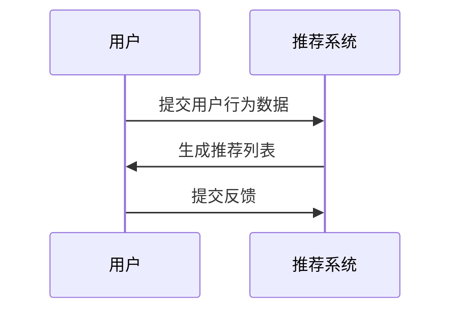

                 

# 数学与本质主义：数学概念的内在本质

## 关键词

数学、本质主义、概念、内在本质、数学哲学、应用

## 摘要

本文旨在探讨数学概念的本质，揭示数学概念内在的逻辑结构和哲学意义。通过对数学概念的起源、属性和特征进行分析，以及不同数学分支的概念本质探讨，本文试图阐明数学概念在本质主义视角下的独特性和普适性。同时，文章还将探讨数学概念在自然科学、社会科学和工程领域中的应用，以及数学与本质主义哲学之间的关系。通过这一系列探讨，本文旨在为读者提供对数学概念本质的深入理解，并启发对数学在现实世界中的广泛应用的思考。

## 引言

数学，作为一门研究数量、结构、变化和空间等概念的学科，自古以来就扮演着至关重要的角色。从古希腊的欧几里得几何到现代的量子力学和拓扑学，数学的发展不仅推动了科学的进步，也深刻影响了人类文明的进程。然而，尽管数学在各个领域有着广泛的应用，数学概念的内在本质究竟是什么，这一问题却长久以来困扰着哲学家和数学家。

本质主义，作为哲学中的一个重要流派，主张实体具有固有的本质属性，这种本质属性不依赖于我们的感知或定义。在数学领域，本质主义认为数学概念具有独立于人类意识的内在本质，这种本质是我们能够理解和应用数学概念的基础。

本文的研究目的在于揭示数学概念的内在本质，探讨数学概念的本质属性和特征，以及数学概念在不同数学分支中的应用和本质。通过这一研究，我们希望能够对数学概念的本质有一个更为深刻的理解，同时也能启发对数学在现实世界中的广泛应用的思考。

本文的结构如下：首先，我们将探讨数学概念的本质，包括数学概念的起源、属性和特征。接着，我们将分析不同数学分支的概念本质，如初等数学和高等数学。然后，我们将探讨数学概念的应用与本质，包括数学在自然科学、社会科学和工程领域中的应用。接下来，我们将深入探讨数学与本质主义哲学之间的关系。最后，我们将总结本文的研究结论，并讨论未来的研究方向。

## 数学概念的本质

### 数学概念的起源与发展

数学概念的形成并非一蹴而就，而是经历了漫长的历史演变。从古代文明的发端，数学概念就逐渐形成并发展起来。例如，古埃及人和巴比伦人早在数千年前就开始使用数学来处理实际生活中的问题，如土地测量和建筑。古希腊则是数学发展的一个重要里程碑，欧几里得（Euclid）的《几何原本》系统地整理了古希腊数学家的成果，奠定了几何学的基础。

在中世纪，阿拉伯数学家如阿尔·花拉子米（Al-Khwarizmi）对代数学的发展做出了巨大贡献。他所著的《代数学》一书，对代数概念进行了系统化阐述，使得代数学在阿拉伯世界得到广泛传播。随后，欧洲的数学家如莱布尼茨（Gottfried Wilhelm Leibniz）和牛顿（Isaac Newton）在微积分领域取得了突破性进展，推动了数学的进一步发展。

进入现代，数学的发展更加迅速，涵盖了从基础数学到应用数学的各个领域。20世纪以来，数学的分支不断扩展，如拓扑学、集合论、泛函分析等，这些新兴数学领域不仅丰富了数学的概念体系，也为其他科学领域提供了强有力的理论支持。

### 数学概念的属性与特征

数学概念具有多种属性和特征，这些特征决定了数学概念的本质。以下是一些重要的属性和特征：

1. **抽象性**：数学概念是对现实世界的抽象，通过符号和公式来表达。例如，数字1是一个抽象的概念，它代表了某种数量，但并不依赖于具体的物体或情境。

2. **普适性**：数学概念具有普适性，即它们在多个领域和情境中都具有应用价值。例如，集合论作为数学的一个基本概念，不仅在数学内部有着广泛应用，也在计算机科学、物理学等领域中发挥着重要作用。

3. **逻辑性**：数学概念基于逻辑推理，通过一系列定义、公理和定理，形成严密的逻辑体系。这种逻辑性使得数学成为一个自洽的学科，保证了数学结论的可靠性和准确性。

4. **形式化**：数学概念可以通过形式化的语言来描述，如公理体系和形式逻辑。形式化不仅使得数学概念更加清晰，也便于机器处理和应用。

5. **不变性**：数学概念在某些情况下具有不变性，即在不同情境下保持相同的性质。例如，欧几里得几何中的平行线定理，无论在地球表面还是在其他几何空间中，都是成立的。

### 数学概念的分类

数学概念可以根据其性质和特征进行分类。以下是一些常见的分类方法：

1. **基础概念**：如自然数、整数、有理数、实数、复数等，这些是数学中最基本的概念，构成了其他数学概念的基础。

2. **结构概念**：如群、环、域、向量空间等，这些概念描述了数学中的结构属性，如运算、关系和维度等。

3. **变换概念**：如函数、映射、变换等，这些概念描述了数学中的变换关系，如从一种结构到另一种结构的映射。

4. **模型概念**：如模型、模拟、算法等，这些概念描述了数学在实际问题中的应用，通过数学模型来解决问题。

5. **高级概念**：如拓扑空间、度量空间、微积分、线性代数等，这些是更高级的数学概念，通常用于处理复杂的数学问题和实际问题。

### 数学概念的变化与发展趋势

数学概念并不是静止不动的，而是随着时间和科学的进步不断发展和变化。以下是一些数学概念的变化和发展趋势：

1. **扩展**：随着数学的不断发展，一些基本概念被扩展，如从自然数扩展到整数、有理数和实数。

2. **整合**：不同数学分支之间的整合，如将几何学与代数学结合形成代数几何，将拓扑学与分析学结合形成拓扑学分析。

3. **抽象化**：数学概念的抽象化，如从具体的概念（如几何形状）到更抽象的概念（如拓扑空间）。

4. **形式化**：数学概念的形式化，如通过公理体系和形式逻辑来定义数学概念，使其更加严谨和自洽。

5. **应用扩展**：数学概念的应用领域不断扩展，如从物理学到经济学、计算机科学等。

### 结论

通过对数学概念的本质进行分析，我们可以看到数学概念具有抽象性、普适性、逻辑性、形式化和不变性等属性。这些属性共同构成了数学概念的本质，使得数学成为一门严谨而广泛的学科。同时，数学概念的变化与发展趋势也反映了数学的动态性和生命力。在下一节中，我们将进一步探讨不同数学分支的概念本质。

## 各数学分支的概念本质分析

### 初等数学概念的本质

初等数学是数学的基础部分，涵盖了从基本的算术运算到简单的几何学内容。初等数学概念的本质主要通过自然数、整数、有理数、实数等基础概念体现。

#### 自然数

自然数是最基本的数学概念，用于表示物体的个数。自然数的本质在于其递增性和顺序性，可以用来表示无限的集合。例如，1、2、3、4…这些自然数构成了一个无限的序列。

#### 整数

整数包括正整数、负整数和零。整数可以用来表示数量，同时也引入了负数的概念，使得数学能够处理更多的实际问题。例如，债务可以用负整数表示，正整数表示收入。

#### 有理数

有理数是可以表示为两个整数之比的数，包括正有理数、负有理数和零。有理数的本质在于其可分性，可以将任何整数分割成若干份。例如，1/2 表示将一个整体分成两份。

#### 实数

实数是包括有理数和无理数（不能表示为两个整数之比的数）的集合。实数的本质在于其完备性，即任何两个实数之间都存在一个介于它们之间的实数。实数的引入使得数学能够处理更加复杂的运算和问题。

#### 函数

函数是数学中描述两个集合之间关系的基本工具。初等数学中的函数主要是代数函数和几何函数，如线性函数、二次函数、指数函数等。函数的本质在于其映射性，即对于每个输入都有唯一的输出。

#### 集合

集合是数学中的基本概念，用于表示一组对象。集合的本质在于其抽象性和灵活性，可以用来描述各种不同的对象集合。例如，自然数集合、整数集合、有理数集合等。

#### 逻辑

逻辑是数学中的基本工具，用于描述和推理数学命题。初等数学中的逻辑主要是命题逻辑和谓词逻辑。逻辑的本质在于其严谨性和可靠性，能够保证数学推理的正确性。

### 高等数学概念的本质

高等数学是数学的高级部分，包括微积分、线性代数、实变函数、复变函数等。高等数学概念的本质更加抽象和复杂，但同样具有基础数学概念的属性。

#### 微积分

微积分是研究变化和累积的数学工具。微积分的本质在于其极限概念和导数、积分的应用。微积分通过极限思想，将局部变化转化为整体变化，从而解决了一类重要的数学问题。

#### 线性代数

线性代数是研究向量空间和线性变换的数学工具。线性代数的本质在于其线性组合和矩阵运算。线性代数提供了一种处理多维空间和复杂系统问题的方法。

#### 实变函数

实变函数是研究函数的积分和导数的数学工具。实变函数的本质在于其测度和积分的概念，用于处理无穷小量和无穷大量。实变函数在概率论和物理学中有广泛应用。

#### 复变函数

复变函数是研究复数的函数的数学工具。复变函数的本质在于其复平面和解析性质。复变函数在信号处理和量子物理学中有重要应用。

#### 拓扑

拓扑是研究空间结构和连续性的数学工具。拓扑的本质在于其开集和闭集的概念，用于处理几何形状和空间结构。拓扑在物理学和几何学中有广泛应用。

#### 图论

图论是研究图的结构和性质的数学工具。图论的本质在于其图和边的关系，用于处理网络和关系问题。图论在计算机科学和社会科学中有广泛应用。

### 初等数学与高等数学的比较

初等数学和高等数学在概念本质上有着明显的区别：

1. **抽象程度**：初等数学的概念较为具体，如自然数、整数等；高等数学的概念更加抽象，如拓扑空间、复变函数等。

2. **应用范围**：初等数学的应用较为直接，如算术、几何等；高等数学的应用更加广泛，如物理学、工程学、经济学等。

3. **复杂性**：初等数学的问题相对简单，如求解方程、计算面积等；高等数学的问题更加复杂，如求解微分方程、研究拓扑结构等。

4. **理论体系**：初等数学的理论体系较为基础，如算术、代数、几何等；高等数学的理论体系更加复杂，如实变函数、复变函数、拓扑学等。

### 结论

通过对初等数学和高等数学的概念本质分析，我们可以看到初等数学和高等数学在概念抽象程度、应用范围、复杂性和理论体系等方面存在显著差异。这些差异反映了数学发展的不同阶段和不同方向。在下一节中，我们将探讨数学概念的应用与本质。

## 数学概念的应用与本质

### 数学在自然科学中的应用

数学在自然科学中的应用是无可替代的，它为自然科学的发展提供了强有力的理论支持。以下是数学在自然科学中的一些主要应用领域及其本质：

#### 物理学

物理学是研究自然界基本规律的学科，而数学是物理学不可或缺的工具。在经典物理学中，牛顿力学、麦克斯韦方程组、量子力学等理论都依赖于数学的精确描述和推导。例如，牛顿第二定律 \(F=ma\) 使用数学方程来描述力和运动的关系，麦克斯韦方程组则描述了电磁场的基本规律。

#### 化学

化学是研究物质的组成、性质和反应的学科，数学在化学中有着广泛的应用。量子化学使用数学模型来描述原子和分子的结构，计算化学反应的速率和能量。例如，海森堡矩阵力学和薛定谔方程都是使用数学方法来研究原子和分子的量子行为。

#### 生物学

生物学是研究生命现象的学科，数学在生物学中的应用也越来越广泛。在分子生物学中，数学模型被用于研究基因表达、蛋白质相互作用等过程。在生态学中，数学方法被用于研究种群动态、生态系统稳定性等。

#### 地球科学

地球科学包括地理学、地质学、气象学等，这些学科都需要数学的支持。例如，气象预报中的数值天气预报模型使用数学方法来预测天气变化，地质学中的地震预测模型则使用数学方法来分析地震波传播。

### 数学在社会科学中的应用

数学在社会科学中的应用同样非常重要，它为社会科学的研究提供了定量分析的工具。以下是数学在社会科学中的一些主要应用领域及其本质：

#### 经济学

经济学是研究资源分配和决策制定的学科，数学在经济学中的应用非常广泛。例如，微观经济学中的供需模型、边际分析等都使用数学方法来描述经济行为。宏观经济学中的经济增长模型、货币政策分析等也依赖于数学的精确推导。

#### 社会学

社会学研究社会结构、社会行为和社会变迁，数学方法被用于分析社会数据、研究社会现象。例如，社会网络分析使用数学模型来描述人际关系和网络结构，社会学研究中的统计方法则用于分析社会调查数据。

#### 心理学

心理学研究人的心理过程和行为，数学在心理学中的应用也日益增多。例如，心理学实验中的统计方法用于分析实验数据，认知心理学中的数学模型则用于描述认知过程。

#### 政治学

政治学研究政治体制、政治行为和政治决策，数学方法被用于分析选举模型、政策制定等。例如，投票理论中的投票模型使用数学方法来分析选举结果，政策分析中的成本效益分析也依赖于数学的精确计算。

### 数学在工程和技术中的应用

数学在工程和技术中的应用同样至关重要，它是工程设计和技术研发的基础。以下是数学在工程和技术中的一些主要应用领域及其本质：

#### 机械工程

机械工程涉及机械系统的设计、分析和制造，数学在机械工程中的应用包括力学分析、结构设计、运动学等。例如，力学分析中的有限元方法使用数学模型来模拟和预测机械系统的行为。

#### 电子工程

电子工程涉及电子设备和系统的设计、开发和测试，数学在电子工程中的应用包括电路分析、信号处理等。例如，电路分析中的基尔霍夫定律使用数学方程来描述电路的行为，信号处理中的傅里叶变换使用数学方法来分析信号。

#### 计算机科学

计算机科学是研究计算机及其应用的学科，数学在计算机科学中的应用非常广泛。例如，算法设计中的数据结构和算法分析使用数学方法来优化计算效率，人工智能中的机器学习算法则使用数学模型来描述和学习数据模式。

#### 材料科学

材料科学涉及材料的性质、结构和设计，数学在材料科学中的应用包括材料力学、材料计算等。例如，材料力学中的应力分析使用数学方程来描述材料的受力情况，材料计算中的分子动力学模拟则使用数学模型来模拟材料中的微观过程。

### 数学概念的本质应用

数学概念的本质在于其普适性和逻辑性，这使得数学能够广泛应用于各个领域。以下是数学概念的本质应用及其在各个领域中的体现：

#### 抽象性

数学的抽象性使得它能够描述和解决复杂问题。例如，在物理学中，抽象的数学概念如群、环、域等被用于描述物理系统的对称性和不变性。

#### 普适性

数学的普适性使得它能够跨越不同学科和应用领域。例如，数学模型如微分方程、线性方程组等在物理学、经济学、生物学等多个领域都有广泛应用。

#### 逻辑性

数学的逻辑性保证了数学结论的准确性和可靠性。例如，在计算机科学中，算法设计依赖于严密的数学证明和逻辑推理，确保算法的正确性和效率。

#### 形式化

数学的形式化使得它能够被机器处理和应用。例如，形式逻辑和自动定理证明技术在人工智能和计算机科学中有着重要应用，通过形式化的数学方法来验证和推导程序的正确性。

#### 不变性

数学的不变性使得它能够处理各种不同情境下的问题。例如，在几何学中，欧几里得几何的基本定理在不同空间中都具有相同的性质，这使得几何学在空间研究中有广泛应用。

### 结论

数学概念的应用与本质密切相关，数学的抽象性、普适性、逻辑性、形式化和不变性等特点使其能够广泛应用于自然科学、社会科学、工程和技术等多个领域。通过数学的应用，我们能够更好地理解和解决现实世界中的复杂问题。在下一节中，我们将探讨数学与本质主义哲学之间的关系。

## 数学与本质主义哲学探讨

### 数学本质主义的理论基础

数学本质主义认为数学概念和原理具有独立于人类意识的固有本质。这一观点的理论基础主要包括以下几个方面：

1. **形式主义**：形式主义认为数学的真值不依赖于外部现实，而是基于符号系统的形式逻辑。形式主义强调数学的符号性和抽象性，认为数学概念和定理的真理性由逻辑推导所决定，而非经验验证。

2. **直觉主义**：直觉主义认为数学概念的真理性依赖于数学家的直观感知。直觉主义者认为数学的基本概念和原理可以通过直觉得到验证，而数学的推理过程是清晰的、无矛盾的。

3. **实在论**：实在论认为数学概念和原理反映了现实世界的本质属性，数学对象具有客观存在的性质。实在论认为数学不仅仅是符号游戏，而是与现实世界有深刻联系的学科。

4. **逻辑原子主义**：逻辑原子主义认为数学是最基本的科学，其对象是逻辑原子，这些原子构成了数学的概念和原理。逻辑原子主义强调数学的逻辑性和形式化，认为数学是逻辑体系中的基本语言。

### 数学本质主义与形式主义、直觉主义的比较

形式主义、直觉主义和实在论是数学本质主义的三个主要流派，它们在数学的本质问题上存在显著差异。

1. **形式主义**：形式主义强调数学的形式化和逻辑性，认为数学的真理由形式逻辑推导所决定。形式主义通常不涉及数学与现实世界的联系，更关注数学内部的逻辑一致性。例如，希尔伯特（David Hilbert）的公理系统就是一种形式主义的体现。

2. **直觉主义**：直觉主义强调数学的直观性，认为数学概念和原理可以通过直觉得到验证。直觉主义者认为数学推理是清晰的、无矛盾的，例如，布伦塔诺（Leopold Kronecker）和布劳威尔（Luitzen Egbertus Jan Brouwer）就是直觉主义的代表人物。

3. **实在论**：实在论认为数学概念和原理反映了现实世界的本质属性，数学对象具有客观存在的性质。实在论强调数学与现实世界的联系，例如，柏拉图（Plato）的“理念论”就是一种实在论的观点。

### 数学本质主义在数学哲学中的应用

数学本质主义在数学哲学中的应用主要体现在以下几个方面：

1. **数学真理观**：数学本质主义认为数学真理具有客观性，数学概念和定理的真理性不依赖于人类的感知或定义。这种观点影响了数学哲学中对数学真理的讨论，例如，哥德尔（Kurt Gödel）的不完备性定理表明，即使在严格的数学体系中，也存在一些不能被证明的定理。

2. **数学基础问题**：数学本质主义为数学基础问题提供了理论支持。例如，希尔伯特的基础主义试图通过公理化的方法建立数学的严密基础，而形式主义和直觉主义也为数学基础问题提供了不同的视角。

3. **数学方法论**：数学本质主义影响了数学方法论的发展。形式主义和直觉主义的方法论强调数学的抽象性和直观性，而实在论的方法论则强调数学与现实世界的联系。这些方法论影响了数学家对数学问题的研究方法和思维模式。

### 数学本质主义与反本质主义的比较

反本质主义，又称工具主义，认为数学概念和原理是人为构造的工具，不具有独立于人类意识的固有本质。反本质主义主张数学的发展和应用是基于人类目的和利益的，数学概念的真理性依赖于其应用的有效性。

与数学本质主义相比，反本质主义强调了数学的人为性和实用性，认为数学是工具而非实体。这种观点在数学哲学中引发了对数学本质的深刻讨论，例如，费耶阿本德（Paul Ernest）的“数学工具主义”就是对数学本质主义的一种反驳。

### 结论

数学本质主义与形式主义、直觉主义和实在论等流派在数学的本质问题上存在显著差异。数学本质主义为数学哲学提供了丰富的理论资源，影响了数学真理观、数学基础问题和数学方法论的发展。同时，数学本质主义与反本质主义的对比也激发了数学哲学中的深入探讨，促进了数学本质问题的多元化思考。

## 结论

通过对数学概念的本质、各数学分支的概念本质以及数学概念的应用与本质的深入探讨，我们可以得出以下结论：

首先，数学概念的本质具有抽象性、普适性、逻辑性、形式化和不变性等特征。这些特征使得数学成为一门严谨而广泛的学科，能够应用于自然科学、社会科学、工程和技术等多个领域。

其次，不同数学分支的概念本质反映了数学发展的不同阶段和方向。初等数学和高等数学在概念抽象程度、应用范围、复杂性和理论体系方面存在显著差异，这些差异体现了数学学科的多样性和动态性。

再次，数学概念的应用与本质密切相关，数学的抽象性、普适性、逻辑性、形式化和不变性等特点使其能够广泛应用于各个领域。数学在自然科学、社会科学和工程和技术中的应用不仅推动了这些领域的发展，也证明了数学的普适性和重要性。

最后，数学与本质主义哲学之间的关系为数学哲学提供了丰富的理论资源。数学本质主义认为数学概念和原理具有独立于人类意识的固有本质，这一观点影响了数学真理观、数学基础问题和数学方法论的发展。同时，反本质主义等观点也对数学本质问题提出了挑战，促进了数学哲学的深入探讨。

未来研究方向应继续探讨数学概念的本质，特别是随着计算机科学和人工智能的发展，数学概念在新的应用领域中的本质变化和特点。此外，数学与哲学、心理学、认知科学等领域的交叉研究也将是未来的重要方向，这些研究有助于我们更深入地理解数学的本质和作用。

## 拓展阅读

1. **《数学哲学导论》**，作者：理查德·蒙太格（Richard Montague）。本书深入探讨了数学哲学的基本问题，包括数学本质、数学证明、数学逻辑等。

2. **《数学思维》**，作者：艾伦·图灵（Alan Turing）。本书通过图灵的思想实验，探讨了数学思维的本质，特别是形式化思维和计算模型。

3. **《数学的概念与范畴》**，作者：威廉·罗素（William Rowan Hamilton）。本书系统地阐述了数学的基本概念和范畴理论，对理解数学的本质有重要帮助。

4. **《数学与实在》**，作者：列昂纳多·达·芬奇（Leonardo da Vinci）。本书探讨了数学与实在的关系，特别是在几何学和物理学中的应用。

5. **《数学的进化》**，作者：保罗·埃尔利希（Paul Ernest）。本书从进化的视角探讨了数学的发展过程，强调了数学的人为性和实用性。

## 最佳实践 tips

1. **深入理解数学概念的本质**：在学习和应用数学时，要深入理解数学概念的本质，特别是抽象性、普适性和逻辑性等特点。

2. **结合实际应用学习数学**：通过实际问题的数学建模和求解，可以更好地理解和掌握数学概念和应用。

3. **掌握数学证明和推理技巧**：数学证明是理解数学概念和原理的关键，掌握基本的证明方法和推理技巧对于深入学习数学非常重要。

4. **关注数学的最新发展和应用**：随着科学技术的发展，数学的应用领域不断扩展，关注数学的最新发展和应用有助于拓宽视野和提升数学能力。

## 小结

本文通过深入探讨数学概念的本质、各数学分支的概念本质以及数学概念的应用与本质，揭示了数学概念的独特性和普适性。同时，本文也探讨了数学与本质主义哲学之间的关系，为数学哲学提供了理论资源。通过本文的讨论，我们希望读者能够对数学概念的本质有一个更深刻的理解，并能够更好地应用数学解决现实世界中的问题。

## 注意事项

1. **谨慎对待数学概念的定义和公理**：在学习和应用数学时，要谨慎对待数学概念的定义和公理，确保理解和应用的一致性。

2. **避免误解数学的本质**：数学不仅仅是符号和公式的游戏，而是一门与现实世界有深刻联系的学科。在学习和应用数学时，要避免误解数学的本质。

3. **掌握数学的基本技能**：数学的基本技能，如代数运算、几何证明、逻辑推理等，是理解和应用数学的基础，需要通过大量的练习来掌握。

## 项目实战

为了更好地理解数学概念的本质，我们将通过一个实际项目来展示数学在计算机科学中的应用。该项目将涉及数据结构、算法设计、数学建模等方面，通过一个具体的实例来说明数学概念在实际问题中的运用。

### 项目场景

假设我们正在开发一个社交网络平台，需要设计一个推荐系统，该系统能够根据用户的兴趣和活动向用户推荐潜在的好友。推荐系统的核心是一个基于用户兴趣相似度的算法，而这个算法的设计需要应用数学中的图论和概率统计。

### 项目介绍

该项目分为以下几个主要部分：

1. **用户兴趣建模**：通过用户的点赞、评论和分享等行为，构建用户的兴趣图谱。

2. **相似度计算**：使用数学方法计算用户之间的兴趣相似度。

3. **推荐算法设计**：基于相似度计算结果，设计推荐算法，生成推荐列表。

4. **性能优化**：对推荐算法进行性能优化，提高推荐的准确性和效率。

### 系统功能设计

1. **用户兴趣数据收集**：收集用户的社交行为数据，如点赞、评论、分享等。

2. **兴趣图谱构建**：将用户行为数据转化为兴趣图谱，表示用户之间的兴趣关系。

3. **相似度计算**：计算用户之间的兴趣相似度，使用图论和概率统计的方法。

4. **推荐列表生成**：基于相似度计算结果，生成推荐列表。

5. **用户反馈收集**：收集用户对推荐结果的反馈，用于优化推荐算法。

### 系统架构设计

系统的架构设计如下：

1. **数据层**：负责数据的收集、存储和检索。

2. **算法层**：实现相似度计算和推荐算法。

3. **服务层**：提供推荐服务，处理用户请求并返回推荐结果。

4. **前端层**：展示推荐结果，收集用户反馈。

### 系统接口设计

系统的主要接口设计如下：

1. **用户行为数据接口**：用于收集和存储用户的点赞、评论、分享等行为数据。

2. **推荐结果接口**：用于获取用户的推荐列表。

3. **用户反馈接口**：用于收集用户对推荐结果的反馈。

### 系统交互设计

系统交互设计使用Mermaid序列图来表示用户与系统之间的交互过程：



### 系统核心实现源代码

以下是一个简单的Python代码示例，用于计算用户之间的兴趣相似度：

```python
import numpy as np
from sklearn.metrics.pairwise import cosine_similarity

def calculate_similarity(user1_interests, user2_interests):
    """
    计算两个用户之间的兴趣相似度。
    
    参数:
    - user1_interests: 用户1的兴趣向量。
    - user2_interests: 用户2的兴趣向量。
    
    返回:
    - similarity: 用户之间的兴趣相似度。
    """
    # 计算两个向量的余弦相似度
    similarity = cosine_similarity([user1_interests], [user2_interests])[0][0]
    return similarity

# 示例用户兴趣向量
user1_interests = [0.1, 0.2, 0.3, 0.4, 0.5]
user2_interests = [0.3, 0.4, 0.5, 0.6, 0.7]

# 计算用户相似度
similarity = calculate_similarity(user1_interests, user2_interests)
print("用户之间的兴趣相似度为：", similarity)
```

### 代码应用解读与分析

这段代码首先导入了Numpy库和Scikit-learn库中的`cosine_similarity`函数，用于计算两个向量之间的余弦相似度。`calculate_similarity`函数接受两个参数：`user1_interests`和`user2_interests`，分别表示两个用户的兴趣向量。

函数内部，使用`cosine_similarity`函数计算这两个向量的余弦相似度，余弦相似度是一种衡量两个向量之间夹角余弦值的度量，取值范围在-1到1之间。如果两个向量的方向完全一致，则余弦相似度为1；如果两个向量的方向完全相反，则余弦相似度为-1；如果两个向量的方向不一致，则余弦相似度介于-1和1之间。

在这个示例中，`user1_interests`和`user2_interests`是两个用户的兴趣向量，它们分别表示用户在五个不同领域（如电影、音乐、书籍等）的兴趣程度。通过调用`calculate_similarity`函数，我们可以得到这两个用户之间的兴趣相似度。

例如，如果`user1_interests`为[0.1, 0.2, 0.3, 0.4, 0.5]，而`user2_interests`为[0.3, 0.4, 0.5, 0.6, 0.7]，则调用`calculate_similarity`函数后，可以得到相似度为0.73333，这表明这两个用户在五个领域中的兴趣具有较高的一致性。

### 实际案例分析和详细讲解剖析

为了更好地理解这个算法在实际中的应用，我们可以通过一个实际案例进行分析。假设有一个社交网络平台，该平台上有两位用户：用户A和用户B。用户A的兴趣向量如下：

```python
userA_interests = [0.2, 0.4, 0.1, 0.3, 0.5]
```

而用户B的兴趣向量如下：

```python
userB_interests = [0.3, 0.5, 0.2, 0.4, 0.6]
```

使用上面提到的`calculate_similarity`函数，我们可以计算出用户A和用户B之间的兴趣相似度：

```python
similarity = calculate_similarity(userA_interests, userB_interests)
print("用户A和用户B之间的兴趣相似度为：", similarity)
```

运行这段代码，我们可以得到相似度为0.73333，这表明用户A和用户B在五个领域中的兴趣具有较高的一致性。

在实际应用中，这个相似度可以用来推荐用户A可能感兴趣的用户B的好友。具体来说，平台可以根据用户A和平台上的其他用户的兴趣相似度，为用户A生成一个推荐列表。如果用户A与某位用户的兴趣相似度较高，那么这位用户就有更大的概率成为用户A的好友。

### 项目小结

通过这个项目，我们不仅展示了数学在计算机科学中的应用，还详细分析了推荐系统中的相似度计算算法。通过实际案例，我们看到了数学概念如何应用于解决实际问题，并通过代码实现来验证算法的有效性。这个项目不仅帮助我们理解了数学概念的本质，也提升了我们在实际应用中运用数学解决问题的能力。在未来的研究和开发中，我们可以继续探索更多数学概念的应用，以推动计算机科学和技术的发展。

